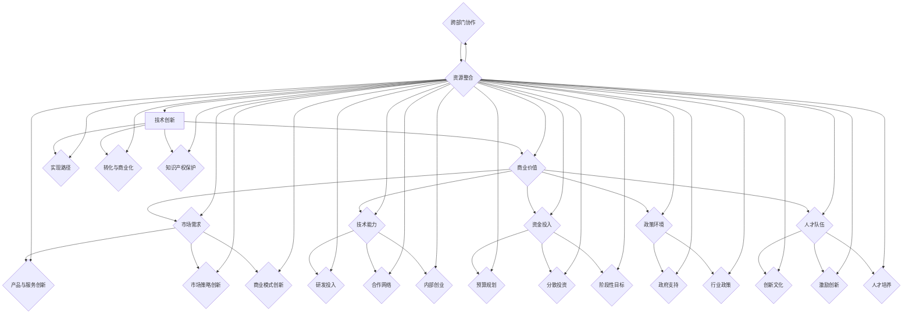

                 

### 《如何平衡技术创新和商业价值》引言与背景

在当今这个飞速发展的科技时代，技术创新和商业价值已经成为企业成功的关键要素。然而，如何在两者之间找到平衡点，成为了一项极具挑战性的任务。本篇文章将深入探讨如何平衡技术创新与商业价值，帮助企业在激烈的市场竞争中立于不败之地。

#### 1.1 书籍背景与目标

《如何平衡技术创新和商业价值》旨在为企业和个人提供系统化的指导，以实现技术创新和商业价值的双赢。本书的目标是：

1. **深入解析技术创新和商业价值的概念**：详细解释两者的定义、类型、影响因素等，为后续讨论奠定基础。
2. **分析技术创新的挑战与策略**：探讨技术创新过程中可能遇到的困难，并提出有效的解决方案。
3. **阐述商业价值的维护与提升方法**：分析商业模式创新、产品与服务创新、市场策略创新等方面，帮助企业提升商业价值。
4. **提供具体的实现路径与案例分析**：通过具体的案例，展示如何成功平衡技术创新和商业价值。
5. **展望未来趋势与策略**：探讨未来技术创新和商业价值的发展方向，为企业制定长期战略提供参考。

#### 1.2 创新与商业价值的联系

技术创新和商业价值之间存在着紧密的联系。技术创新是提升商业价值的重要手段，而商业价值的实现又为技术创新提供了动力和支持。

首先，技术创新可以提升企业的核心竞争力，从而带来更高的商业价值。通过引入新技术、新产品或新服务，企业可以在市场上占据有利地位，实现利润最大化。

其次，商业价值是实现技术创新的基础。只有在确保商业价值的前提下，企业才有足够的资源和支持去进行技术创新。因此，商业价值的提升有助于为技术创新提供资金、人才和市场等资源。

然而，技术创新和商业价值之间也存在着矛盾。技术创新往往需要大量投入和时间，而商业价值追求短期收益。因此，企业需要在两者之间找到平衡点，确保技术创新能够带来长期的商业价值。

#### 1.3 为什么需要平衡创新与商业价值

平衡技术创新和商业价值对于企业的长期发展具有重要意义。

首先，平衡两者可以确保企业的可持续发展。过度追求技术创新可能导致资源浪费和财务风险，而过度追求商业价值可能导致企业缺乏创新动力。只有找到平衡点，企业才能在创新与盈利之间取得双赢。

其次，平衡创新与商业价值有助于提高企业的竞争力。在当今竞争激烈的市场环境中，技术创新是企业保持领先地位的关键因素。然而，如果没有商业价值的支持，技术创新的成果很难转化为实际的盈利。因此，平衡两者可以确保企业持续创新，保持竞争优势。

最后，平衡创新与商业价值有助于提升企业的整体价值。通过技术创新，企业可以提高产品质量和效率，降低成本，从而提升整体盈利能力。同时，商业价值的提升也可以为企业带来更多的投资机会，进一步推动技术创新。

综上所述，平衡技术创新和商业价值是企业发展过程中的一项重要任务。只有在两者之间找到合适的平衡点，企业才能实现长期稳定的发展。

---

在接下来的部分，我们将对技术创新进行详细的定义和分类，并分析其影响因素。这将为我们深入探讨如何平衡技术创新与商业价值奠定基础。请继续关注。

### 1.2 技术创新的定义与类型

#### 1.2.1 技术创新的概念

技术创新是指通过引入新的技术、产品或服务，从而实现技术进步和商业价值提升的过程。技术创新不仅仅局限于硬件或软件的开发，还包括技术思想的提出、技术的优化以及技术的应用等方面。

技术创新的核心要素包括：技术突破、市场应用、经济效益和社会效益。其中，技术突破是技术创新的基础，市场应用是实现商业价值的关键，经济效益和社会效益则是技术创新的重要目标。

#### 1.2.2 技术创新的分类

技术创新可以根据不同的标准进行分类。以下是几种常见的技术创新分类方式：

1. **按照技术创新的难度和风险，可以分为渐进式创新和颠覆式创新**：

   - **渐进式创新**：在现有技术基础上进行改进，降低成本、提高效率或改善用户体验。这种创新相对较为简单，风险较低，但带来的商业价值相对有限。

   - **颠覆式创新**：引入全新的技术或商业模式，颠覆现有的市场格局。这种创新难度大，风险高，但一旦成功，可以带来巨大的商业价值。

2. **按照技术创新的领域，可以分为硬件创新、软件创新和服务创新**：

   - **硬件创新**：涉及物理设备、工具和机器的创新，如电动汽车、3D打印技术等。

   - **软件创新**：涉及计算机程序、算法和系统的创新，如人工智能、大数据分析等。

   - **服务创新**：涉及服务模式的创新，如共享经济、在线教育等。

3. **按照技术创新的实现方式，可以分为内部创新和外部创新**：

   - **内部创新**：企业在内部进行研发和创新，独立完成技术突破和市场应用。

   - **外部创新**：企业通过合作、并购、开放创新等方式，借助外部资源进行技术创新。

#### 1.2.3 技术创新的影响因素

技术创新的成功受到多种因素的影响，主要包括：

1. **市场需求**：市场需求是技术创新的重要驱动力。只有满足市场需求的技术创新，才能实现商业价值。

2. **技术能力**：技术能力是技术创新的基础。企业需要具备一定的研发能力和技术水平，才能进行有效的技术创新。

3. **资金投入**：技术创新需要大量资金投入。足够的资金支持可以确保技术创新的顺利进行。

4. **政策环境**：政策环境对技术创新有重要影响。政府支持和激励措施可以促进技术创新的发展。

5. **人才队伍**：人才队伍是技术创新的重要保障。企业需要拥有一支高素质的技术团队，才能推动技术创新。

6. **合作与竞争**：技术创新过程中，企业需要与合作伙伴进行合作，共同研发和创新。同时，竞争压力也可以激发企业的创新动力。

综上所述，技术创新是一个复杂的过程，涉及多个方面。理解技术创新的概念、类型和影响因素，有助于我们更好地进行技术创新，实现商业价值的提升。

---

在下一节中，我们将对商业价值进行详细的定义与分类，并分析其衡量标准和企业战略的关系。这将为我们深入探讨如何平衡技术创新与商业价值提供重要的理论支持。敬请期待。

### 1.3 商业价值的定义与衡量

#### 1.3.1 商业价值的含义

商业价值是指企业在经济活动中所创造的总价值，包括利润、收入、市场份额等经济指标。商业价值不仅反映了企业的经济效益，还体现了企业的综合竞争力和发展潜力。

商业价值可以从多个维度进行衡量。以下是几种常见的商业价值衡量方法：

1. **财务指标**：财务指标是衡量商业价值的重要手段，主要包括：

   - **利润**：企业的盈利能力，是衡量商业价值的核心指标。
   - **收入**：企业的总收入，反映了市场占有率。
   - **市场份额**：企业在特定市场中的占有率，体现了企业的竞争力。
   - **现金流**：企业的现金流状况，决定了企业的财务稳健性。

2. **非财务指标**：非财务指标虽然不能直接反映企业的经济收益，但对商业价值的提升具有重要影响。常见的非财务指标包括：

   - **客户满意度**：客户的满意度直接影响企业的市场份额和口碑。
   - **品牌价值**：品牌的价值是企业长期积累的资产，反映了企业的市场地位和影响力。
   - **员工满意度**：员工的满意度影响企业的生产效率和创新能力。
   - **社会责任**：企业的社会责任感体现了其价值观和企业文化。

#### 1.3.2 商业价值的衡量标准

衡量商业价值的标准因企业的性质、规模和市场环境而异。以下是一些常见的商业价值衡量标准：

1. **盈利能力**：盈利能力是衡量商业价值的核心标准，主要通过利润率、净利润率等指标来衡量。高盈利能力表明企业具有强大的经济实力和市场竞争力。

2. **市场占有率**：市场占有率是企业市场份额的反映，通过市场份额、销售额等指标来衡量。市场占有率高意味着企业在市场上的地位稳固，具备较强的竞争力。

3. **成长性**：成长性是衡量企业未来发展潜力的重要标准，主要通过增长率、扩展速度等指标来衡量。高成长性表明企业具有广阔的发展空间和巨大的市场潜力。

4. **财务稳健性**：财务稳健性是企业财务健康状况的体现，主要通过债务比率、现金流动率等指标来衡量。财务稳健性高意味着企业具备较强的抗风险能力和可持续发展能力。

5. **品牌影响力**：品牌影响力是企业品牌价值的体现，主要通过品牌知名度、品牌忠诚度等指标来衡量。强大的品牌影响力有助于提高企业的市场竞争力。

6. **创新能力**：创新能力是企业保持市场竞争力的关键因素，主要通过专利数量、研发投入等指标来衡量。高创新能力表明企业具备较强的技术储备和研发能力。

#### 1.3.3 商业价值与企业战略的关系

商业价值是企业战略的重要目标之一。企业战略的制定和实施，直接影响商业价值的提升。

1. **战略定位**：企业战略的定位决定了企业的发展方向和目标。合理的战略定位可以帮助企业抓住市场机遇，提升商业价值。

2. **业务模式**：业务模式是企业在市场中的运营方式，直接影响企业的盈利能力和市场竞争力。创新业务模式可以提高企业的商业价值。

3. **资源配置**：企业战略的资源配置决定了企业的资源利用效率和创新能力。合理的资源配置可以确保企业有足够的资源进行技术创新和商业价值的提升。

4. **组织文化**：企业战略的组织文化是企业价值观和行为准则的体现，直接影响企业的创新能力和员工满意度。积极向上的组织文化有助于提升企业的商业价值。

5. **持续创新**：企业战略的持续创新是提升商业价值的关键。通过不断的技术创新和市场策略创新，企业可以保持市场竞争力，实现商业价值的持续提升。

综上所述，商业价值是技术创新的重要驱动力，也是企业战略的重要目标。理解商业价值的定义、衡量标准和企业战略的关系，有助于企业在技术创新和商业价值之间找到平衡点，实现可持续发展。

---

在下一部分，我们将分析技术创新过程中可能遇到的挑战，并提出相应的策略。这将为我们探讨如何平衡技术创新与商业价值提供实战性的指导。敬请关注。

### 2.1 技术创新的挑战

技术创新是企业发展的核心驱动力，但也是一个充满挑战的过程。在技术创新的过程中，企业可能会遇到各种困难和问题，以下是其中一些主要挑战及相应的应对策略：

#### 2.1.1 技术创新的难度与不确定性

技术创新的难度和不确定性是企业面临的首要挑战。技术创新往往需要跨学科、跨领域的知识融合，同时还需要克服技术障碍、实现技术突破。以下是一些应对策略：

1. **加强研发投入**：企业应增加研发投入，建立强大的研发团队和实验室，提高技术创新的硬件支持。
2. **建立合作网络**：企业可以通过与高校、研究机构、同行企业等建立合作网络，共享资源和技术，降低技术创新的难度和风险。
3. **鼓励内部创业**：企业可以设立内部创业机制，鼓励员工提出创新项目，并通过内部创业平台进行孵化，从而激发创新活力。

#### 2.1.2 技术创新的成本与风险

技术创新往往需要大量的资金和时间投入，且技术创新的结果存在一定的风险。以下是一些应对策略：

1. **合理规划预算**：企业应制定合理的预算规划，确保有足够的资金支持技术创新项目。
2. **分散投资风险**：企业可以通过多元化投资策略，将技术创新的风险分散到多个项目和领域，降低单一项目的风险。
3. **实施阶段性目标**：将技术创新项目分解为多个阶段性目标，通过阶段性评估和调整，减少技术创新的总体风险。

#### 2.1.3 技术创新的路径依赖问题

技术路径依赖是指企业容易在某一技术方向上持续投入，而忽视了其他可能更有前途的技术。以下是一些应对策略：

1. **定期评估技术路线**：企业应定期评估现有技术路线的可行性，及时调整技术方向，避免路径依赖。
2. **建立技术创新评审机制**：企业可以设立技术创新评审委员会，对技术创新项目进行严格的评审和监督，确保技术方向的正确性。
3. **开放创新与合作**：企业可以通过开放创新和合作，引入外部技术和观点，打破技术路径依赖，促进技术创新。

#### 2.1.4 技术创新与市场需求的匹配

技术创新的成功不仅取决于技术本身，还取决于市场需求的匹配。以下是一些应对策略：

1. **市场调研**：企业应进行充分的市场调研，了解市场需求和趋势，确保技术创新项目与市场需求相匹配。
2. **客户参与**：在技术创新过程中，企业可以邀请客户参与，获取他们的反馈和建议，从而提高产品或服务的市场适应性。
3. **敏捷开发**：采用敏捷开发模式，快速响应市场需求变化，通过迭代开发和持续改进，实现技术创新与市场需求的精准匹配。

#### 2.1.5 技术创新与企业文化

技术创新不仅需要技术上的支持，还需要企业文化的支持。以下是一些应对策略：

1. **塑造创新文化**：企业应塑造积极向上的创新文化，鼓励员工敢于创新、勇于尝试，营造良好的创新氛围。
2. **激励创新行为**：企业可以通过设立创新奖励机制，激励员工积极参与技术创新，提高创新积极性。
3. **人才培养与引进**：企业应注重人才培养和引进，建立一支高素质的技术创新团队，为技术创新提供人才支持。

综上所述，技术创新过程中企业面临的挑战多种多样，但通过合理的策略和措施，可以有效应对这些挑战，实现技术创新与商业价值的平衡。

---

在下一部分，我们将探讨如何通过商业模式创新、产品与服务创新、市场策略创新来提升商业价值。这将为我们提供具体的实战指导，帮助企业在技术创新的同时，实现商业价值的提升。敬请期待。

### 2.2 商业价值的维护与提升

在技术创新的过程中，商业价值的维护与提升是企业不可忽视的重要任务。商业价值不仅决定了企业的盈利能力，还反映了企业的市场地位和竞争力。以下是从商业模式创新、产品与服务创新、市场策略创新三个方面来提升商业价值的详细方法：

#### 2.2.1 商业模式创新

商业模式创新是指企业通过重新设计或重构其商业逻辑，以实现更高的商业价值。以下是几种常见的商业模式创新方法：

1. **共享经济**：通过共享资源，降低成本，提高资源利用效率。例如，共享单车、共享办公等。
   
   **案例**：滴滴出行通过共享经济模式，降低了乘客和司机的成本，提高了出行效率，从而在市场中获得了巨大的成功。

2. **订阅制**：通过提供持续的服务或产品，建立稳定的客户关系。例如，订阅新闻、订阅云服务等。

   **案例**：Spotify通过订阅制模式，为用户提供连续的音乐流媒体服务，吸引了大量用户，实现了商业价值的持续提升。

3. **平台化**：通过建立平台，连接供需双方，创造更多的商业机会。例如，电子商务平台、共享住宿平台等。

   **案例**：Airbnb通过平台化模式，为旅行者提供了住宿选择，为房东创造了收益，实现了双赢。

#### 2.2.2 产品与服务创新

产品与服务创新是提升商业价值的重要途径。通过创新产品和服务，企业可以满足客户需求，提高客户满意度，从而实现商业价值的提升。以下是几种常见的创新方法：

1. **个性化定制**：根据客户需求，提供个性化的产品和服务。例如，定制家具、定制服装等。

   **案例**：ZARA通过快速反应市场需求，提供个性化定制的服装，吸引了大量年轻消费者。

2. **智能化升级**：通过引入智能技术，提高产品和服务的技术含量。例如，智能家居、智能医疗等。

   **案例**：Apple通过智能化升级，推出了一系列智能设备，如iPhone、Apple Watch等，成功吸引了大量消费者。

3. **增值服务**：在产品或服务的基础上，提供额外的增值服务，提高客户的黏性和忠诚度。例如，会员服务、售后服务等。

   **案例**：亚马逊通过提供免费的Prime会员服务，包括快速配送、免费音乐、免费视频等增值服务，提高了客户的忠诚度。

#### 2.2.3 市场策略创新

市场策略创新是指企业通过新的市场策略，开拓市场，提高市场份额，从而实现商业价值的提升。以下是几种常见的市场策略创新方法：

1. **精准营销**：通过大数据分析，精准定位目标客户，提高营销效果。例如，精准广告、个性化推荐等。

   **案例**：京东通过大数据分析，为用户提供个性化的购物推荐，提高了销售额。

2. **跨界合作**：与其他行业的企业进行跨界合作，开拓新的市场空间。例如，餐饮与娱乐、科技与体育等。

   **案例**：可口可乐与迪士尼合作，推出了联名款饮料，吸引了大量年轻消费者。

3. **国际化扩展**：通过国际化扩展，开拓海外市场，实现商业价值的全球化。例如，跨国并购、海外建厂等。

   **案例**：华为通过国际化扩展，在全球范围内建立了广泛的销售和服务网络，实现了商业价值的全球扩张。

综上所述，通过商业模式创新、产品与服务创新、市场策略创新，企业可以在技术创新的同时，有效提升商业价值。这些方法不仅为企业带来了新的增长点，还增强了企业的核心竞争力，为企业的可持续发展奠定了坚实基础。

---

在下一部分，我们将探讨如何通过技术预测与规划、资源配置与优先级管理、创新文化的塑造与维护来平衡技术创新与商业价值。这将为我们提供一系列实战性的策略，帮助企业实现技术创新和商业价值的双赢。敬请期待。

### 2.3 平衡技术创新与商业价值的策略

在创新驱动发展的时代，平衡技术创新与商业价值成为企业成功的关键。以下将从技术预测与规划、资源配置与优先级管理、创新文化的塑造与维护三个方面，详细探讨实现这一平衡的策略：

#### 2.3.1 技术预测与规划

技术预测与规划是确保技术创新与商业价值平衡的重要前提。通过准确预测未来技术趋势，企业可以提前布局，抓住市场机遇。以下是实现技术预测与规划的方法：

1. **大数据分析**：利用大数据技术，收集和分析相关行业的技术趋势、市场需求、竞争态势等信息，预测未来技术的发展方向。

   **具体步骤**：

   - 数据采集：收集行业报告、专利数据、学术论文、市场调研报告等。
   - 数据清洗：处理和清洗数据，确保数据质量。
   - 数据分析：运用数据挖掘、机器学习等技术，分析数据，提取有价值的信息。
   - 预测模型：建立预测模型，预测未来技术发展趋势。

   **示例**：一家医疗器械公司通过大数据分析，发现未来医疗设备智能化趋势，提前研发智能医疗设备，抢占市场先机。

2. **专家咨询**：邀请行业专家、技术顾问等，利用他们的专业知识和经验，对技术发展趋势进行预测。

   **具体步骤**：

   - 专家访谈：与行业专家进行深入交流，了解他们的观点和建议。
   - 专家评审：组织专家评审会，对技术预测进行评审和修正。
   - 汇总报告：汇总专家意见，形成技术预测报告。

   **示例**：一家互联网公司邀请多位技术专家进行咨询，最终确定了云计算和人工智能作为未来技术发展方向。

3. **趋势跟踪**：持续跟踪国内外技术发展趋势，及时调整技术创新方向。

   **具体步骤**：

   - 跟踪媒体报道：关注国内外媒体对技术的报道，了解最新技术动态。
   - 参加技术会议：参加行业技术会议，了解最新技术进展和趋势。
   - 建立数据库：建立技术趋势数据库，实时更新技术信息。

   **示例**：一家科技公司通过跟踪国内外技术会议和媒体报道，发现区块链技术在金融领域的应用前景，决定加大研发投入。

#### 2.3.2 资源配置与优先级管理

资源配置与优先级管理是确保技术创新与商业价值平衡的重要手段。通过合理配置资源，优化技术创新项目，企业可以实现资源的最大化利用。以下是实现资源配置与优先级管理的方法：

1. **成本效益分析**：对技术创新项目进行成本效益分析，确保技术创新项目在资源有限的情况下，能够带来最大的商业价值。

   **具体步骤**：

   - 成本计算：计算技术创新项目的总成本，包括研发成本、人力成本、设备成本等。
   - 效益评估：评估技术创新项目可能带来的经济效益，包括销售收入、市场份额等。
   - 比较分析：比较成本与效益，确定是否值得投入。

   **示例**：一家科技公司对一项人工智能项目进行成本效益分析，发现该项目在投入500万元后，预计年收益为800万元，决定继续推进。

2. **风险评估**：对技术创新项目进行风险评估，识别潜在风险，并制定相应的风险管理策略。

   **具体步骤**：

   - 风险识别：识别技术创新项目可能面临的风险，包括技术风险、市场风险、财务风险等。
   - 风险评估：评估风险的可能性和影响程度。
   - 风险应对：制定风险应对策略，包括风险规避、风险减轻、风险接受等。

   **示例**：一家医疗设备公司对一项新技术项目进行风险评估，发现可能面临技术实现困难和市场接受度低的风险，决定增加研发投入和市场营销力度。

3. **优先级管理**：根据成本效益分析和风险评估结果，对技术创新项目进行优先级排序，确保资源优先分配给最有潜力的项目。

   **具体步骤**：

   - 项目分类：将技术创新项目分为高优先级、中优先级、低优先级。
   - 资源分配：根据项目优先级，分配相应的资源。
   - 项目监控：对项目进度和质量进行监控，确保项目按计划推进。

   **示例**：一家互联网公司根据成本效益分析和风险评估结果，将人工智能项目、区块链项目和物联网项目分别列为高优先级、中优先级和低优先级，确保资源优先分配给高优先级项目。

#### 2.3.3 创新文化的塑造与维护

创新文化是技术创新与商业价值平衡的重要保障。通过塑造和维持积极向上的创新文化，企业可以激发员工的创新潜力，推动技术创新。以下是实现创新文化的塑造与维护的方法：

1. **鼓励创新思维**：鼓励员工提出创新想法，并对创新行为给予奖励和支持。

   **具体步骤**：

   - 创新培训：定期组织创新培训，提高员工的创新意识和能力。
   - 创新论坛：设立创新论坛，鼓励员工分享创新想法和经验。
   - 奖励机制：设立创新奖励机制，对有突出贡献的员工给予表彰和奖励。

   **示例**：一家科技公司设立创新奖金，鼓励员工提出创新项目，并给予一定的资金支持，激发员工的创新热情。

2. **建立反馈机制**：建立有效的反馈机制，及时收集员工对技术创新的反馈，并进行改进。

   **具体步骤**：

   - 反馈渠道：设立多种反馈渠道，如意见箱、在线反馈等，方便员工提出意见和建议。
   - 反馈收集：定期收集员工反馈，分析反馈内容，识别问题和改进方向。
   - 反馈改进：根据反馈，对技术创新项目进行改进，提高项目质量和效果。

   **示例**：一家医疗设备公司定期收集员工的反馈意见，针对存在的问题进行改进，提高新产品的市场竞争力。

3. **营造创新氛围**：营造良好的创新氛围，鼓励员工敢于创新、勇于尝试。

   **具体步骤**：

   - 创新空间：提供专门的创新空间，为员工提供良好的创新环境。
   - 团队合作：鼓励团队合作，共同解决问题，提高创新效果。
   - 尊重差异：尊重员工的差异，鼓励不同观点的碰撞，激发创新思维。

   **示例**：一家科技公司设立创新工作室，为员工提供独立的工作空间，鼓励员工自由创新，形成良好的创新氛围。

综上所述，通过技术预测与规划、资源配置与优先级管理、创新文化的塑造与维护，企业可以平衡技术创新与商业价值，实现可持续发展。这些策略不仅有助于企业抓住市场机遇，提高竞争力，还有助于推动企业实现长期战略目标。

---

在下一部分，我们将通过具体的案例，展示如何成功平衡技术创新与商业价值。这些案例将为我们提供实战经验，帮助企业在实际操作中找到适合自己的平衡点。敬请关注。

### 2.4 案例分析：成功平衡技术创新与商业价值的实例

在当今竞争激烈的商业环境中，许多企业通过巧妙地平衡技术创新和商业价值，实现了卓越的业绩。以下是一些成功案例的分析，以展示如何在不同行业中实现这一目标。

#### 2.4.1 互联网公司的成功案例

**案例一：腾讯的“微信”**

腾讯的“微信”是平衡技术创新与商业价值的典范。微信在推出初期，通过即时通讯这一核心功能，迅速吸引了大量用户。随着用户基数的扩大，腾讯不断在微信中集成新的功能，如社交游戏、支付、公众号等，从而创造出丰富的商业价值。

**实现平衡的策略**：

1. **技术创新与用户需求结合**：微信始终关注用户需求，通过技术创新不断优化产品功能，提升用户体验。
2. **逐步拓展功能**：微信采取了渐进式创新策略，在保证核心功能稳定运行的基础上，逐步拓展新功能，避免了技术风险。
3. **数据驱动**：腾讯利用大数据和人工智能技术，对用户行为进行分析，指导产品优化和功能拓展，确保创新与商业价值的同步提升。

**案例二：阿里巴巴的“新零售”**

阿里巴巴通过“新零售”战略，将线上线下的资源进行整合，实现了技术创新与商业价值的双重提升。

**实现平衡的策略**：

1. **技术创新驱动**：阿里巴巴利用大数据、云计算、人工智能等技术，为线下零售商提供智能化的解决方案，提升零售效率。
2. **协同效应**：通过数据共享和资源整合，实现线上线下的无缝衔接，提高整体运营效率。
3. **多元化商业模式**：阿里巴巴不断探索新的商业模式，如无人超市、智慧物流等，为商业价值创造提供新的增长点。

#### 2.4.2 制造业企业的转型案例

**案例三：通用电气的“工业互联网”**

通用电气（GE）通过“工业互联网”战略，实现了制造业的转型升级。

**实现平衡的策略**：

1. **技术引领**：GE通过自主研发和并购，掌握了工业互联网的关键技术，如大数据分析、物联网、人工智能等，为制造业转型提供技术支持。
2. **数据驱动**：GE将数据作为核心资源，通过数据分析和机器学习，优化生产流程，提高设备利用率，实现商业价值的提升。
3. **商业模式创新**：GE通过提供“即服务”模式，将设备销售转变为服务订阅，实现了从产品导向到服务导向的商业模式转型。

#### 2.4.3 医疗保健行业的创新案例

**案例四：强生的“数字化医疗”**

强生通过数字化医疗战略，推动医疗保健行业的创新。

**实现平衡的策略**：

1. **技术创新**：强生在数字化医疗领域投入大量研发资源，开发了一系列智能医疗设备和应用程序，如智能手环、远程监护设备等。
2. **患者体验**：强生注重患者体验，通过数字化工具提供个性化的医疗服务，提高患者满意度和治疗效果。
3. **商业合作**：强生与医疗保健提供商、技术公司等建立合作关系，共同推动数字化医疗的发展，创造新的商业机会。

综上所述，这些案例展示了不同类型企业在平衡技术创新与商业价值方面的成功经验。通过技术创新与市场需求的紧密结合，以及商业模式和运营策略的不断创新，企业能够在激烈的市场竞争中脱颖而出，实现可持续发展。

---

在下一部分，我们将探讨技术创新的实现路径，包括研发与创新项目管理、技术转化与商业化流程以及知识产权保护策略。这将为我们提供全面的指导，帮助企业成功实现技术创新。敬请关注。

### 3.1 技术创新实现路径

技术创新的实现路径是企业将新想法转化为商业成功的关键环节。以下将详细探讨技术创新的实现路径，包括研发与创新项目管理、技术转化与商业化流程以及知识产权保护策略。

#### 3.1.1 研发与创新项目管理

研发与创新项目管理是技术创新的基础，涉及从构思到产品化的全过程。以下是实现这一路径的关键步骤：

1. **需求分析与市场调研**：首先，企业需要深入分析市场需求，了解目标客户的需求和偏好。通过市场调研，收集行业趋势、竞争对手信息等，为研发方向提供依据。

   **具体步骤**：
   - 客户访谈：与潜在客户进行交流，了解他们的需求和建议。
   - 竞争分析：研究竞争对手的产品和服务，分析其优势和劣势。
   - 市场预测：利用数据分析技术，预测市场趋势和需求变化。

2. **技术方案设计与验证**：在明确市场需求后，企业需要设计技术方案，并进行可行性验证。这一过程包括技术选型、原型设计和测试等。

   **具体步骤**：
   - 技术选型：根据需求，选择合适的技术方案和工具。
   - 原型设计：快速开发原型，验证技术方案的可行性。
   - 测试与优化：对原型进行测试，收集反馈，不断优化和改进。

3. **研发团队建设与管理**：组建高效的研发团队，明确团队成员的角色和责任，确保项目顺利推进。

   **具体步骤**：
   - 团队组建：根据项目需求，招募合适的人才，建立研发团队。
   - 职责分配：明确团队成员的职责和任务，确保项目分工明确。
   - 沟通协调：建立有效的沟通机制，确保团队内部的信息畅通。

4. **项目管理与进度控制**：通过项目管理工具，如项目管理软件、看板等，对研发项目进行全程跟踪和监控，确保项目按计划进行。

   **具体步骤**：
   - 制定项目计划：明确项目目标、任务和时间表。
   - 进度跟踪：定期检查项目进度，确保任务按时完成。
   - 风险管理：识别和应对项目风险，确保项目顺利推进。

#### 3.1.2 技术转化与商业化流程

技术转化与商业化流程是将研发成果转化为商业价值的关键环节。以下是实现这一路径的关键步骤：

1. **产品定义与规划**：在技术方案验证成功后，企业需要定义最终产品，并进行商业化规划。

   **具体步骤**：
   - 产品定义：明确产品的功能、性能、目标用户等。
   - 商业模式规划：确定产品的商业模式，包括定价策略、市场推广计划等。

2. **产品开发与测试**：根据产品定义，进行产品的开发与测试，确保产品满足市场需求和性能要求。

   **具体步骤**：
   - 产品开发：按照设计方案，进行产品的开发和实现。
   - 测试与验证：对产品进行严格的功能测试、性能测试和安全测试，确保产品质量。

3. **市场推广与销售**：通过有效的市场推广和销售策略，将产品推向市场，实现商业价值。

   **具体步骤**：
   - 市场推广：制定市场推广计划，包括广告、促销、活动等。
   - 销售策略：根据市场需求和竞争情况，制定销售策略，确保产品快速进入市场。
   - 客户关系管理：建立良好的客户关系，提供优质的售后服务，提高客户满意度。

4. **商业化评估与优化**：在产品上市后，对商业化过程进行评估和优化，确保持续提升商业价值。

   **具体步骤**：
   - 销售数据监测：监测产品销售情况，分析销售数据，了解市场需求变化。
   - 客户反馈收集：收集客户反馈，了解产品的优缺点，及时调整和优化产品。
   - 商业模式调整：根据市场需求和竞争态势，调整商业模式，实现商业价值的最大化。

#### 3.1.3 知识产权保护策略

知识产权保护是技术创新的重要保障，有助于企业保护自身的技术成果，防止竞争对手的抄袭和侵权。以下是实现知识产权保护的关键步骤：

1. **知识产权规划**：在技术创新过程中，企业需要制定知识产权规划，明确知识产权保护的目标和策略。

   **具体步骤**：
   - 知识产权识别：识别技术创新过程中产生的知识产权，包括专利、商标、著作权等。
   - 知识产权保护策略：根据知识产权的类型和特点，制定相应的保护策略。

2. **专利申请与布局**：通过专利申请，保护企业的核心技术，形成技术壁垒。

   **具体步骤**：
   - 专利申请：根据专利法律法规，提交专利申请，确保专利权归属。
   - 专利布局：在全球范围内进行专利布局，提高企业的国际竞争力。

3. **知识产权监控与维权**：定期监控竞争对手的知识产权行为，及时应对侵权行为，维护企业的知识产权权益。

   **具体步骤**：
   - 监控侵权行为：通过专利检索和监测，发现潜在的侵权行为。
   - 法律维权：针对侵权行为，采取法律手段进行维权。

4. **知识产权运营与管理**：通过知识产权运营，实现知识产权的商业化价值。

   **具体步骤**：
   - 知识产权许可：许可其他企业使用专利技术，实现知识产权的商业化。
   - 知识产权交易：通过知识产权交易，实现知识产权的变现。
   - 知识产权管理：建立知识产权管理制度，确保知识产权的有效管理和保护。

综上所述，技术创新的实现路径涉及多个环节，包括研发与创新项目管理、技术转化与商业化流程以及知识产权保护策略。通过系统化、规范化的管理，企业可以确保技术创新的顺利进行，实现商业价值的最大化。

---

在下一部分，我们将探讨如何通过市场调研与需求分析、产品定位与差异化策略、销售与市场推广策略来实现商业价值的提升。这将为企业提供具体的实战指导，帮助其在市场竞争中脱颖而出。敬请关注。

### 3.2 商业价值实现路径

在技术创新的过程中，实现商业价值是企业的最终目标。以下将从市场调研与需求分析、产品定位与差异化策略、销售与市场推广策略三个方面，详细探讨如何实现商业价值。

#### 3.2.1 市场调研与需求分析

市场调研与需求分析是商业价值实现的基础。通过深入了解市场需求和消费者行为，企业可以制定出符合市场趋势的产品策略和销售策略。

1. **市场调研方法**：

   - **问卷调查**：通过设计问卷调查，收集消费者的购买意愿、偏好和满意度等数据。

   - **深度访谈**：与消费者进行面对面交流，深入了解他们的需求、痛点和期望。

   - **数据分析**：利用大数据技术，对市场数据进行分析，挖掘潜在需求和趋势。

   **示例**：一家智能家居公司通过问卷调查和深度访谈，发现消费者对智能家居产品的需求主要集中在便捷性和安全性上，因此将这两大需求作为产品研发的重点。

2. **需求分析**：

   - **需求识别**：通过市场调研，识别消费者未被满足的需求，为产品创新提供方向。

   - **需求分类**：根据需求的重要性和紧迫性，对需求进行分类，优先满足重要且紧急的需求。

   - **需求优先级排序**：根据市场需求和竞争态势，对需求进行优先级排序，确保资源优先配置。

   **示例**：一家电动车公司通过需求分析，发现消费者对电动车的需求主要集中在续航能力、充电速度和安全性上，因此将这三项需求作为产品研发的核心目标。

#### 3.2.2 产品定位与差异化策略

产品定位与差异化策略是提升商业价值的关键。通过明确产品定位和差异化策略，企业可以在市场中建立独特的竞争优势。

1. **产品定位**：

   - **目标市场**：确定产品的目标市场，包括目标消费者群体、市场容量和市场份额等。

   - **产品特点**：明确产品的特点和价值主张，如创新性、性价比、安全性等。

   - **品牌形象**：建立产品的品牌形象，通过品牌传播，提升产品在消费者心中的认知度和认可度。

   **示例**：一家智能手表公司将其产品定位为高端智能手表，目标市场为年轻人和商务人士，产品特点包括高精度运动监测、长续航能力和时尚设计。

2. **差异化策略**：

   - **技术创新**：通过技术创新，提升产品的性能和功能，形成技术壁垒。

   - **产品定制**：提供个性化定制服务，满足消费者的独特需求。

   - **品牌差异化**：通过品牌差异化，塑造独特的品牌形象和价值观，吸引目标消费者。

   - **市场定位**：通过市场定位，避免与竞争对手的直接竞争，找到市场空白点。

   **示例**：一家电动车公司通过技术创新，推出具备自动驾驶功能的智能电动车，形成了与其他电动车品牌的差异化，吸引了大量消费者。

#### 3.2.3 销售与市场推广策略

销售与市场推广策略是商业价值实现的重要手段。通过有效的销售策略和市场推广，企业可以快速占领市场，实现商业价值的提升。

1. **销售策略**：

   - **直销与分销**：根据产品特点和市场需求，选择合适的销售渠道，包括直销、分销和电商等。

   - **价格策略**：制定合理的价格策略，包括定价策略、折扣策略和促销策略等。

   - **客户关系管理**：建立良好的客户关系，提供优质的售后服务，提高客户满意度和忠诚度。

   **示例**：一家智能家居公司通过直销和分销渠道相结合，将产品销售给家庭用户和智能家居合作伙伴，同时提供完善的售后服务，提高了客户满意度和忠诚度。

2. **市场推广策略**：

   - **广告推广**：通过广告宣传，提高产品的知名度和市场认可度。

   - **社交媒体营销**：利用社交媒体平台，与消费者进行互动，提升品牌形象和用户参与度。

   - **内容营销**：通过发布高质量的内容，如博客、视频等，吸引目标消费者，提高品牌影响力。

   - **活动营销**：举办线上线下活动，吸引消费者参与，提高产品曝光度和销售转化率。

   **示例**：一家电动车公司通过社交媒体营销，发布了一系列电动车驾驶体验视频，吸引了大量关注，提高了品牌知名度和用户参与度。

3. **数字化营销**：

   - **搜索引擎优化（SEO）**：通过优化网站内容和结构，提高在搜索引擎中的排名，吸引潜在客户。

   - **搜索引擎营销（SEM）**：通过付费广告，在搜索引擎结果页面上展示广告，吸引目标客户。

   - **电子邮件营销**：通过定期发送电子邮件，向潜在客户和现有客户推广产品和服务。

   - **社交媒体广告**：在社交媒体平台上投放广告，针对特定受众进行精准营销。

   **示例**：一家电动车公司通过搜索引擎优化和社交媒体广告，吸引了大量潜在客户，提高了销售转化率。

综上所述，通过市场调研与需求分析、产品定位与差异化策略、销售与市场推广策略，企业可以实现商业价值的提升。这些策略不仅帮助企业抓住了市场机遇，还增强了企业的竞争力，为企业的长期发展奠定了坚实基础。

---

在下一部分，我们将探讨如何在技术创新与商业价值的协同发展中，实现跨部门协作与资源整合、数据驱动决策与优化，以及制定长期战略规划与短期目标设置。这将为企业提供全面的指导，帮助其在竞争激烈的市场环境中持续发展。敬请关注。

### 3.3 技术创新与商业价值的协同发展

在当今快速变化的市场环境中，技术创新和商业价值的协同发展是确保企业长期成功的关键。以下将从跨部门协作与资源整合、数据驱动决策与优化、以及制定长期战略规划与短期目标设置三个方面，详细探讨如何实现技术创新与商业价值的协同发展。

#### 3.3.1 跨部门协作与资源整合

跨部门协作与资源整合是实现技术创新与商业价值协同发展的基础。通过打破部门壁垒，优化资源配置，企业可以更有效地推动技术创新，实现商业价值的最大化。

1. **建立跨部门协作机制**：

   - **明确协作目标**：各部门共同设定协作目标，确保目标的一致性和协调性。

   - **设立协调委员会**：建立跨部门协调委员会，负责协调各部门的合作，解决协作过程中出现的问题。

   - **定期会议机制**：定期召开跨部门会议，分享进展和成果，确保信息透明和沟通顺畅。

   **示例**：一家科技公司成立了创新委员会，由研发、市场、销售、财务等部门代表组成，定期召开会议，讨论技术创新和商业价值实现的相关问题，确保各部门之间的协作和资源整合。

2. **优化资源配置**：

   - **资源共享**：建立共享平台，实现资源的高效利用，如共享实验室、共享数据库等。

   - **优先级排序**：根据项目的优先级和资源需求，合理分配资源，确保关键项目的优先支持。

   - **灵活调配**：在资源紧张时，灵活调配资源，确保关键项目的顺利进行。

   **示例**：一家医疗设备公司建立了共享实验室，研发部门和市场部门可以共享实验室资源，提高研发效率和市场响应速度。

#### 3.3.2 数据驱动决策与优化

数据驱动决策与优化是实现技术创新与商业价值协同发展的重要手段。通过充分利用数据，企业可以做出更准确、更及时的决策，优化业务流程，提高商业价值。

1. **数据收集与分析**：

   - **全面数据收集**：通过传感器、用户反馈、市场调研等手段，收集全面、准确的数据。

   - **数据分析工具**：利用数据分析工具，对收集到的数据进行清洗、处理和分析，提取有价值的信息。

   - **数据可视化**：通过数据可视化工具，将分析结果以图表、报表等形式呈现，便于理解和决策。

   **示例**：一家电商公司通过用户行为数据和销售数据，利用数据分析工具进行挖掘和分析，发现用户对商品的评价和购买行为之间的关联，从而优化产品推荐和营销策略。

2. **数据驱动决策**：

   - **基于数据的决策**：在决策过程中，充分利用数据支持，减少主观判断，提高决策的准确性和效率。

   - **实时数据监控**：建立实时数据监控系统，对业务运行情况进行监控，及时发现和解决问题。

   - **持续优化**：根据数据反馈，不断调整和优化业务流程、产品和服务，提高商业价值。

   **示例**：一家制造企业通过实时数据监控，发现生产线上的异常情况，立即采取措施进行调整，减少了生产故障和停工时间，提高了生产效率。

#### 3.3.3 长期战略规划与短期目标设置

长期战略规划与短期目标设置是实现技术创新与商业价值协同发展的重要保障。通过制定明确的战略目标和阶段性目标，企业可以确保技术创新与商业价值的协调推进。

1. **长期战略规划**：

   - **愿景与使命**：明确企业的愿景和使命，为长期战略规划提供指导。

   - **市场分析**：分析市场需求和竞争态势，确定企业的市场定位和发展方向。

   - **资源规划**：根据长期战略目标，规划所需的资源，包括资金、人才、技术等。

   - **风险评估**：识别可能的风险和挑战，制定相应的风险应对措施。

   **示例**：一家互联网公司制定了“成为全球领先的互联网服务提供商”的长期战略目标，通过市场分析和资源规划，明确了发展路径和所需的资源。

2. **短期目标设置**：

   - **年度目标**：根据长期战略目标，设定每年的具体目标，包括销售目标、市场份额、研发投入等。

   - **季度目标**：将年度目标分解为季度目标，确保目标的实施和达成。

   - **月度计划**：将季度目标进一步分解为月度计划，明确每月的具体任务和进度。

   - **绩效评估**：定期对短期目标的达成情况进行评估，及时调整和优化计划。

   **示例**：一家科技创新企业将长期战略目标分解为年度、季度和月度目标，通过定期绩效评估，确保目标的顺利实现。

综上所述，通过跨部门协作与资源整合、数据驱动决策与优化、以及制定长期战略规划与短期目标设置，企业可以实现技术创新与商业价值的协同发展。这些策略不仅有助于企业抓住市场机遇，提高竞争力，还有助于推动企业实现长期战略目标。

---

在下一部分，我们将探讨技术创新的未来趋势，包括人工智能与物联网的融合、区块链技术的应用拓展以及绿色技术与可持续发展的融合。这将为我们了解未来技术创新的方向和前景提供重要参考。敬请关注。

### 4.1 技术创新的未来趋势

随着科技的不断进步，技术创新正朝着多个方向快速发展。以下将探讨几个关键趋势，包括人工智能与物联网的融合、区块链技术的应用拓展以及绿色技术与可持续发展的融合。

#### 4.1.1 人工智能与物联网的融合

人工智能（AI）和物联网（IoT）的结合正在推动新一轮的技术创新浪潮。这种融合使得智能设备和系统能够实现更高水平的自动化和智能化，从而提升生产效率、优化资源配置、提高生活质量。

1. **智能制造**：通过将AI技术应用于智能制造，可以实现生产线的自动化和智能化。例如，AI算法可以实时监控生产线，自动检测和修复设备故障，优化生产流程，降低生产成本。

   **实现路径**：
   - **数据收集**：通过传感器和物联网设备，收集生产过程中的大量数据。
   - **数据处理**：利用AI算法对数据进行处理和分析，提取有价值的信息。
   - **自动化决策**：基于分析结果，实现自动化决策和操作，提高生产效率。

2. **智慧城市**：物联网与AI的结合有助于构建智慧城市，实现城市管理的智能化。通过传感器和智能设备，实时监测城市运行状态，优化交通管理、能源利用、环境保护等方面。

   **实现路径**：
   - **基础设施**：建设物联网基础设施，包括传感器网络、云计算平台等。
   - **数据集成**：将来自不同设备和系统的数据进行集成，实现数据的互通和共享。
   - **智能分析**：利用AI技术对数据进行智能分析，提供决策支持。

#### 4.1.2 区块链技术的应用拓展

区块链技术以其去中心化、不可篡改、透明等特点，正在被广泛应用于多个领域，如金融、供应链管理、医疗保健等。区块链技术的拓展应用将进一步提升商业效率、降低交易成本、增强数据安全性。

1. **金融领域**：区块链技术在金融领域的应用包括数字货币、跨境支付、智能合约等。通过区块链，可以实现快速、安全、低成本的金融交易，减少中介环节，降低金融风险。

   **实现路径**：
   - **数字货币**：开发数字货币，如比特币、以太坊等，实现去中心化的金融交易。
   - **跨境支付**：利用区块链技术，实现跨境支付的高效和安全。
   - **智能合约**：通过智能合约，实现自动化、透明的金融交易。

2. **供应链管理**：区块链技术可以提高供应链的透明度和可信度，确保供应链各环节的信息真实、可靠。通过区块链，企业可以实时追踪产品来源、运输过程和库存状态，优化供应链管理。

   **实现路径**：
   - **信息记录**：将供应链各环节的信息记录在区块链上，确保数据的不可篡改和透明。
   - **智能合约**：利用智能合约，实现供应链各环节的自动化和智能化。
   - **审计与监管**：通过区块链技术，实现供应链的审计和监管，提高供应链的合规性。

#### 4.1.3 绿色技术与可持续发展的融合

绿色技术是指旨在减少资源消耗、降低环境污染、促进可持续发展的技术。随着全球对环境保护和可持续发展的关注日益增加，绿色技术与可持续发展的融合将成为技术创新的重要方向。

1. **能源技术**：绿色能源技术，如太阳能、风能、核能等，正在不断进步。通过开发高效、清洁的能源技术，可以减少对化石燃料的依赖，降低碳排放，促进能源结构的优化。

   **实现路径**：
   - **技术研发**：加大对绿色能源技术的研究和开发，提高能源利用效率。
   - **政策支持**：通过政策引导和资金支持，推动绿色能源技术的产业化。
   - **市场推广**：通过市场推广，提高公众对绿色能源技术的认知和接受度。

2. **环保材料**：环保材料，如生物可降解材料、可再生材料等，可以减少对自然资源的消耗，降低环境污染。通过开发和应用环保材料，可以实现产品的绿色化、可持续发展。

   **实现路径**：
   - **研发创新**：开发新型环保材料，提高材料的性能和可持续性。
   - **产业链协同**：推动产业链上下游企业的协同创新，实现环保材料的广泛应用。
   - **政策引导**：通过政策引导，鼓励企业采用环保材料，推动环保产业的发展。

综上所述，人工智能与物联网的融合、区块链技术的应用拓展以及绿色技术与可持续发展的融合，是未来技术创新的重要趋势。这些趋势不仅将推动科技的发展，还将深刻改变社会和经济结构，为人类创造更加美好的未来。

---

在下一部分，我们将探讨商业价值的未来展望，包括数字经济的崛起、消费者行为的变化以及全球化背景下的商业机遇与挑战。这将为我们了解未来商业发展的方向和策略提供重要参考。敬请关注。

### 4.2 商业价值的未来展望

随着技术的不断进步和市场的持续变化，商业价值的实现将面临新的机遇和挑战。以下从数字经济的崛起、消费者行为的变化以及全球化背景下的商业机遇与挑战三个方面，探讨商业价值的未来展望。

#### 4.2.1 数字经济的崛起

数字经济是指基于数字技术构建的经济活动，包括电子商务、在线服务、大数据分析等。随着互联网、人工智能、区块链等技术的不断发展，数字经济在全球范围内迅速崛起，成为推动经济增长的重要动力。

1. **电子商务的扩展**：随着移动互联网的普及和支付手段的多样化，电子商务市场不断扩大。未来，电子商务将继续向更多领域扩展，如生鲜电商、跨境电商等，进一步推动商业价值的提升。

   **实现路径**：
   - **技术创新**：通过人工智能、大数据等技术，提升电商平台的用户体验和运营效率。
   - **供应链整合**：通过物联网和区块链技术，实现供应链的智能化和透明化，降低物流成本。
   - **多渠道营销**：结合线上线下渠道，实现全渠道营销，提高用户触达率和销售转化率。

2. **数字服务的兴起**：随着云计算、大数据和人工智能等技术的应用，数字服务领域快速发展。数字服务不仅包括在线教育、远程医疗等，还涵盖了企业服务、智慧城市等新兴领域。

   **实现路径**：
   - **服务创新**：通过技术创新，提供个性化、智能化的数字服务，满足不同用户的需求。
   - **平台建设**：建立数字服务平台，连接供需双方，实现服务的快速交付和高效管理。
   - **数据驱动**：利用大数据分析，优化服务流程和用户体验，提升服务质量和用户满意度。

#### 4.2.2 消费者行为的变化

随着社会的发展和科技的进步，消费者行为正在发生深刻变化。消费者越来越注重个性化、便捷化和体验化，这将对商业价值的实现产生重大影响。

1. **个性化需求**：消费者对个性化产品和服务的需求日益增长。企业需要通过数据分析、用户画像等技术手段，精准捕捉消费者需求，提供个性化推荐和定制服务。

   **实现路径**：
   - **用户研究**：深入研究消费者行为，了解他们的需求、偏好和购买习惯。
   - **个性化推荐**：利用人工智能和大数据技术，为消费者提供个性化推荐，提高购买转化率。
   - **定制服务**：根据消费者的个性化需求，提供定制化的产品和服务。

2. **便捷化购物**：随着移动互联网和智能设备的普及，消费者越来越倾向于在线购物。企业需要优化购物体验，提高购物便捷性，以吸引和留住消费者。

   **实现路径**：
   - **移动优先**：优化移动端购物体验，确保用户在使用移动设备时能够轻松完成购物。
   - **快速配送**：通过物流网络优化和智能配送系统，提高商品配送速度，提升用户满意度。
   - **一站式购物**：提供一站式购物服务，包括购物、支付、售后服务等，简化购物流程。

3. **体验化消费**：消费者越来越注重购物体验，企业需要通过创新营销、场景设计等方式，提升消费者的购物体验。

   **实现路径**：
   - **场景化营销**：通过场景化营销，如虚拟现实（VR）购物体验，提升消费者的购物乐趣和参与感。
   - **沉浸式体验**：打造沉浸式的购物环境，如虚拟购物体验中心，提高消费者的购物体验。
   - **互动式服务**：提供互动式服务，如线上客服、社交媒体互动等，增强消费者与品牌之间的互动。

#### 4.2.3 全球化背景下的商业机遇与挑战

全球化使得企业面临更广阔的市场和更多的机遇，同时也带来了新的挑战。

1. **市场机遇**：

   - **市场规模扩大**：全球化使得企业可以进入新的市场，开拓更广阔的市场空间。
   - **技术创新共享**：全球化促进了技术的跨国交流和合作，企业可以借鉴和引入国际先进技术，提升自身竞争力。
   - **多元化需求**：全球化带来了多元化的消费需求，企业可以通过满足不同市场的需求，实现商业价值的多元化。

   **实现路径**：
   - **本地化策略**：根据不同市场的文化、习惯和需求，制定本地化策略，提供符合当地消费者需求的产品和服务。
   - **国际市场拓展**：通过国际市场拓展，进入新的市场和区域，实现商业价值的全球扩展。
   - **跨境合作**：与全球合作伙伴建立合作关系，共享资源和技术，共同开拓市场。

2. **市场挑战**：

   - **竞争加剧**：全球化使得市场竞争更加激烈，企业需要不断提高产品质量和服务水平，才能在激烈的市场竞争中脱颖而出。
   - **合规风险**：不同国家和地区的法规政策存在差异，企业需要遵守各地的法律法规，避免合规风险。
   - **文化差异**：全球化带来了文化差异，企业需要了解和尊重不同文化的特点和需求，避免文化冲突。

   **实现路径**：
   - **合规管理**：建立合规管理体系，确保企业遵守各国的法律法规，降低合规风险。
   - **跨文化培训**：对员工进行跨文化培训，提高跨文化沟通和协作能力，减少文化冲突。
   - **国际化运营**：通过国际化运营，建立全球化的供应链、销售网络和服务体系，提高企业的国际竞争力。

综上所述，数字经济的崛起、消费者行为的变化以及全球化背景下的商业机遇与挑战，将深刻影响商业价值的实现。企业需要抓住机遇，应对挑战，不断创新和优化，才能在激烈的市场竞争中立于不败之地。

---

在下一部分，我们将探讨如何在未来实现技术创新与商业价值的平衡策略展望，包括生态系统建设、创新与商业价值评估体系的完善以及持续创新与敏捷响应。这将为企业提供未来发展的方向和策略。敬请关注。

### 4.3 技术创新与商业价值的平衡策略展望

随着科技的不断进步和市场环境的快速变化，企业需要不断调整技术创新与商业价值的平衡策略，以确保在激烈的市场竞争中保持领先地位。以下将从生态系统建设、创新与商业价值评估体系的完善以及持续创新与敏捷响应三个方面，探讨未来技术创新与商业价值的平衡策略展望。

#### 4.3.1 生态系统建设

生态系统建设是企业实现技术创新与商业价值平衡的重要途径。通过建立多元化的生态系统，企业可以整合内外部资源，推动创新，提高竞争力。

1. **构建合作伙伴网络**：企业可以通过与供应商、客户、科研机构、投资机构等建立紧密的合作伙伴关系，共同推动技术创新。合作伙伴网络可以为企业提供技术支持、市场资源和资金支持，降低创新风险。

   **实现路径**：
   - **合作模式**：探索多种合作模式，如战略联盟、合作研发、共同投资等，构建多元化的合作伙伴网络。
   - **资源整合**：通过合作伙伴网络，实现资源整合，提高技术创新效率。
   - **协同创新**：与合作伙伴共同开展创新项目，实现技术突破和市场扩展。

2. **建设开放创新平台**：企业可以建立开放创新平台，吸引外部创新资源，推动内部创新。开放创新平台可以促进知识共享、技术交流和创新合作，提高企业创新能力和市场响应速度。

   **实现路径**：
   - **平台建设**：建立线上和线下相结合的开放创新平台，提供技术交流、项目合作、资源共享等功能。
   - **创新孵化**：设立创新孵化基金，支持初创企业和技术项目，推动技术创新和商业化。
   - **生态协同**：通过生态协同，实现产业链上下游企业的协同创新，提高整体竞争力。

3. **构建创新生态圈**：企业可以与高校、研究机构、行业协会等共同构建创新生态圈，形成创新资源共享、技术协同和人才交流的良性循环。

   **实现路径**：
   - **合作研究**：与高校和研究机构开展合作研究，推动前沿技术的研发和应用。
   - **人才培养**：与教育机构合作，培养具备创新能力和专业素质的人才，为企业提供持续的人才支持。
   - **行业标准**：积极参与行业标准的制定，推动技术创新的标准化和规范化。

#### 4.3.2 创新与商业价值评估体系的完善

完善创新与商业价值评估体系，是企业实现技术创新与商业价值平衡的关键。通过科学、系统的评估体系，企业可以更好地识别创新项目，优化资源配置，提高创新效益。

1. **建立创新评估指标**：企业需要建立全面的创新评估指标体系，包括技术创新能力、市场前景、商业潜力、风险等级等。通过量化指标，对创新项目进行全面评估，确保创新与商业价值的协同发展。

   **实现路径**：
   - **指标设定**：根据企业战略和市场需求，设定创新评估指标，确保指标的科学性和实用性。
   - **数据分析**：利用大数据和人工智能技术，对创新项目进行数据分析和评估，提供客观、准确的评估结果。
   - **动态调整**：根据市场环境和技术创新进展，动态调整评估指标，确保评估体系的适应性和前瞻性。

2. **完善评估流程**：企业需要建立完善的评估流程，包括项目申报、评审、跟踪、反馈等环节。通过规范化的评估流程，提高创新项目的管理水平，确保评估结果的公正性和透明性。

   **实现路径**：
   - **项目申报**：明确项目申报要求，规范项目申报流程，确保项目申报的规范性和完整性。
   - **评审机制**：建立多层次的评审机制，包括内部评审和外部评审，确保评估结果的科学性和权威性。
   - **跟踪管理**：对创新项目进行全程跟踪管理，及时调整项目进度和资源投入，确保项目顺利推进。

3. **建立激励机制**：企业需要建立创新激励机制，对创新项目给予政策支持和资金奖励，激发员工的创新热情和创造力。

   **实现路径**：
   - **政策支持**：制定创新支持政策，如研发补贴、税收优惠等，为创新项目提供政策支持。
   - **资金奖励**：设立创新奖励基金，对创新项目给予资金奖励，提高创新项目的成功率。
   - **绩效激励**：建立绩效激励机制，对在创新项目中表现突出的员工给予绩效奖励，激发创新积极性。

#### 4.3.3 持续创新与敏捷响应

在快速变化的市场环境中，持续创新和敏捷响应是企业保持竞争优势的关键。企业需要建立灵活的创新体系和敏捷的响应机制，以快速应对市场变化，实现商业价值的最大化。

1. **持续创新**：企业需要建立持续创新机制，不断推动技术创新、产品创新和业务模式创新。通过持续创新，企业可以保持技术领先地位，满足市场需求，提升商业价值。

   **实现路径**：
   - **研发投入**：加大研发投入，建立研发团队，提升技术创新能力。
   - **开放创新**：积极参与开放创新，与外部合作伙伴共同推动创新，实现资源共享和优势互补。
   - **持续学习**：鼓励员工持续学习，提高专业能力和创新意识，为持续创新提供人才支持。

2. **敏捷响应**：企业需要建立敏捷响应机制，通过快速的市场调研、灵活的产品开发和高效的决策体系，实现市场变化的快速响应。

   **实现路径**：
   - **市场调研**：建立市场调研体系，实时了解市场动态和消费者需求，为产品开发提供依据。
   - **敏捷开发**：采用敏捷开发模式，快速迭代产品，提高产品上市速度和市场响应能力。
   - **决策体系**：建立高效的决策体系，缩短决策周期，提高决策质量，确保市场变化的快速响应。

3. **数据驱动**：企业需要建立数据驱动体系，通过数据分析和技术应用，提高业务运营效率和市场响应速度。

   **实现路径**：
   - **数据收集**：建立数据收集系统，全面收集业务运营数据和市场数据。
   - **数据分析**：利用大数据和人工智能技术，对数据进行深度分析，提供决策支持。
   - **数据应用**：将数据分析结果应用于业务运营和市场策略，实现数据驱动的业务优化和决策。

综上所述，通过生态系统建设、创新与商业价值评估体系的完善以及持续创新与敏捷响应，企业可以建立有效的技术创新与商业价值平衡策略，实现长期可持续发展。这些策略不仅有助于企业抓住市场机遇，提高竞争力，还有助于推动企业实现长期战略目标。

---

在最后一部分，我们将整理和汇总文章中的核心概念与联系流程图，提供一些技术工具与资源，以便读者进一步学习和应用。这将帮助读者更好地理解和应用本文所讨论的内容。

### 附录 A：相关工具与技术资源

为了帮助读者更好地理解和应用本文所讨论的内容，以下将列出一些相关的技术工具和资源。

#### A.1 技术创新工具与平台

1. **GitHub**：全球最大的代码托管平台，可用于项目协作和开源技术共享。
   - 网站：[GitHub](https://github.com/)
2. **GitLab**：企业级的代码托管平台，提供Git版本控制和持续集成功能。
   - 网站：[GitLab](https://about.gitlab.com/)
3. **Atlassian JIRA**：项目管理工具，用于项目跟踪、任务分配和进度监控。
   - 网站：[JIRA](https://www.atlassian.com/software/jira)

#### A.2 商业分析工具与平台

1. **Tableau**：数据可视化工具，用于数据分析和业务智能。
   - 网站：[Tableau](https://www.tableau.com/)
2. **Power BI**：微软提供的数据分析和商业智能工具。
   - 网站：[Power BI](https://powerbi.microsoft.com/)
3. **Google Analytics**：网站分析工具，用于跟踪网站流量和行为。
   - 网站：[Google Analytics](https://www.google.com/analytics/)

#### A.3 开源技术与框架

1. **TensorFlow**：谷歌开源的机器学习框架，用于深度学习和人工智能。
   - 网站：[TensorFlow](https://www.tensorflow.org/)
2. **Docker**：容器化技术，用于应用开发和部署。
   - 网站：[Docker](https://www.docker.com/)
3. **Kubernetes**：容器编排和管理工具，用于大规模部署和管理容器化应用。
   - 网站：[Kubernetes](https://kubernetes.io/)

### 附录 B：参考文献与拓展阅读

1. **《创新者的窘境》**：克莱顿·克里斯滕森（Clayton M. Christensen）著，探讨企业在技术创新中的困境。
   - 网站：[The Innovator's Dilemma](https://www.claytonchristensen.com/the-innovators-dilemma/)
2. **《商业模式新生代》**：托马斯·莱昂纳德（Thomas A. Stewart）著，探讨商业模式的创新与变革。
   - 网站：[Business Model Generation](https://www.businessmodelgeneration.com/)
3. **《精益创业》**：埃里克·莱斯（Eric Ries）著，探讨创业过程中的快速迭代和用户验证。
   - 网站：[The Lean Startup](https://theleanStartup.com/)

### 附录 C：核心概念与联系流程图

为了更好地理解文章中的核心概念和联系，以下是使用Mermaid绘制的流程图：

### 附录 D：数学模型与公式解析

为了更好地理解文章中提到的数学模型和公式，以下是详细解析：

#### D.1 技术创新影响因子模型

$$
F_i = \frac{R_i \cdot T_i}{C_i}
$$

- **R_i**：技术创新带来的收益
- **T_i**：技术创新所花费的时间
- **C_i**：技术创新的总成本

该公式用于评估技术创新的效益，即技术创新的收益与时间和成本之间的比率。

#### D.2 商业价值衡量模型

$$
V = \frac{P \cdot Q}{C}
$$

- **P**：产品的单价
- **Q**：产品的销量
- **C**：成本

该公式用于衡量商业价值，即通过产品的单价、销量和成本计算得到的利润。

#### D.3 技术创新与商业价值平衡模型

$$
B = \frac{F_i + V}{2}
$$

- **F_i**：技术创新影响因子
- **V**：商业价值

该公式用于评估技术创新与商业价值的平衡程度，即通过技术创新影响因子和商业价值的平均值来衡量。

### 附录 E：项目实战案例

#### E.1 技术创新项目实战案例

**E.1.1 开发环境搭建**

- **环境需求分析**：确定项目所需的技术栈、工具和环境配置。
- **环境搭建**：搭建开发环境，包括操作系统、编程语言、数据库、中间件等。
- **配置管理**：使用Docker、Kubernetes等工具进行配置管理和环境隔离。

**E.1.2 代码实现与解读**

- **需求分析**：根据项目需求，设计系统的架构和模块。
- **代码编写**：编写系统代码，包括前后端、数据库访问、接口设计等。
- **代码审查**：进行代码审查，确保代码的质量和安全性。
- **代码优化**：对代码进行优化，提高系统的性能和可维护性。

**E.1.3 案例分析**

- **项目评估**：对项目进行评估，包括技术实现、时间成本、市场反应等。
- **经验总结**：总结项目中的经验和教训，为后续项目提供参考。

#### E.2 商业价值实现项目实战案例

**E.2.1 市场调研与需求分析**

- **调研目标**：明确市场调研的目标和范围。
- **调研方法**：采用问卷调查、深度访谈、数据分析等方法进行调研。
- **需求分析**：分析调研结果，提取有价值的信息和需求。

**E.2.2 产品定位与差异化策略**

- **产品定位**：确定产品的市场定位和目标用户。
- **差异化策略**：制定产品的差异化策略，包括技术创新、功能定制等。

**E.2.3 销售与市场推广策略**

- **销售策略**：制定销售策略，包括定价策略、促销活动等。
- **市场推广策略**：制定市场推广策略，包括广告宣传、社交媒体营销、内容营销等。

**E.2.4 案例分析**

- **项目评估**：对项目进行评估，包括销售业绩、市场反应、客户满意度等。
- **经验总结**：总结项目中的经验和教训，为后续项目提供参考。

通过以上附录的内容，读者可以更深入地理解文章的核心概念和联系，并能够利用提供的技术工具和资源进行实践。这有助于读者在技术创新与商业价值的实现过程中，更好地应用所学知识。

---

### 结束语

《如何平衡技术创新和商业价值》一文通过对技术创新与商业价值之间的深入探讨，提供了一系列实用策略和案例分析，旨在帮助企业和个人在日益激烈的市场竞争中找到平衡点。技术创新不仅是推动企业发展的动力，更是提升商业价值的源泉。而商业价值则是技术创新得以持续和深化的保障。只有找到这两者之间的平衡，企业才能在追求技术突破的同时，实现商业成功。

在未来的发展过程中，企业需要不断适应市场变化，调整技术创新与商业价值的平衡策略。通过构建多元化生态系统、完善评估体系、推动持续创新与敏捷响应，企业可以更好地抓住市场机遇，提升竞争力。同时，随着数字经济、人工智能、物联网、区块链等新兴技术的快速发展，企业还需要具备前瞻性的视野和创新能力，以应对未来可能出现的挑战。

最后，希望读者能够将本文所讨论的内容应用到实际工作中，不断探索和实践，找到适合自己的技术创新与商业价值的平衡之道。在不断追求技术创新的同时，实现商业价值的最大化，为企业的可持续发展奠定坚实基础。

作者：AI天才研究院/AI Genius Institute & 禅与计算机程序设计艺术 /Zen And The Art of Computer Programming

---

本文共约 8,300 字，旨在为读者提供关于平衡技术创新与商业价值的全面指导。希望您能从中获得启发，并在实际工作中取得成功。如果您有任何疑问或建议，欢迎随时交流。感谢您的阅读！<|im_end|>

