                 

# 如何打造个人知识付费平台

> **关键词：** 个人知识付费平台、内容管理系统、用户互动、付费模式、数据分析、SEO优化、社交媒体营销

> **摘要：** 本文将系统地探讨如何构建和运营一个个人知识付费平台。通过详细分析行业背景、技术实现、用户互动、付费模式、推广策略、数据分析以及平台优化等方面，为个人知识付费平台的构建者提供全面的指导。

### 目录大纲

#### 第一部分：构建个人知识付费平台的准备

- **第1章：个人知识付费平台概述**
  - **1.1 行业背景与市场机会**
  - **1.2 个人知识付费平台的核心概念**
  - **1.3 平台构建的必要条件

#### 第二部分：技术实现与平台开发

- **第2章：内容管理系统的设计与实现**
  - **2.1 内容管理系统的架构**
  - **2.2 内容创作工具与平台集成**
  - **2.3 用户权限管理与内容审核**

#### 第三部分：用户互动与社区运营

- **第3章：用户互动系统设计与实现**
  - **3.1 用户互动的核心功能**
  - **3.2 社区建设与运营策略**

#### 第四部分：付费模式与盈利途径

- **第4章：付费模式设计**
  - **4.1 会员制与订阅模式**
  - **4.2 单次购买与课程打包**

#### 第五部分：平台推广与用户获取

- **第5章：平台推广策略**
  - **5.1 SEO与SEM优化**
  - **5.2 社交媒体营销**
  - **5.3 影响者营销与用户推荐**

#### 第六部分：数据分析与用户反馈

- **第6章：数据分析工具与方法**
  - **6.1 数据收集与处理**
  - **6.2 用户反馈机制**

#### 第七部分：平台优化与迭代

- **第7章：持续优化与迭代**
  - **7.1 功能迭代与升级**
  - **7.2 技术优化与成本控制**
  - **7.3 技术更新与安全维护**

#### 附录

- **附录A：构建个人知识付费平台实用工具与资源**
  - **A.1 开发工具与平台**
  - **A.2 社会资源与支持**
  - **A.3 技术支持与培训**

---

### 第一部分：构建个人知识付费平台的准备

#### 第1章：个人知识付费平台概述

在数字化的今天，知识付费已经成为一个日益增长的行业。个人知识付费平台作为一种新兴的教育模式，不仅为内容创作者提供了展示和变现的平台，也为广大学习者提供了高质量的学习资源。本章节将详细探讨个人知识付费平台的行业背景、核心概念和构建的必要条件。

##### 1.1 行业背景与市场机会

随着互联网技术的发展，在线教育和知识付费逐渐成为主流。根据最新统计数据，全球在线教育市场规模已超过2000亿美元，并继续以两位数的年增长率增长。知识付费行业的崛起，主要得益于以下几个因素：

- **在线学习需求增加**：随着工作压力和学习需求的增加，越来越多的用户选择在线学习。
- **知识变现意识增强**：内容创作者意识到通过知识付费可以实现自身价值。
- **移动学习普及**：智能手机的普及，使得用户可以随时随地进行学习。

在如此庞大的市场背景下，个人知识付费平台无疑具有巨大的发展潜力。构建个人知识付费平台，不仅可以帮助个人实现知识变现，还可以为用户提供更灵活、个性化的学习体验。以下是一个简单的行业背景与市场机会的Mermaid流程图：

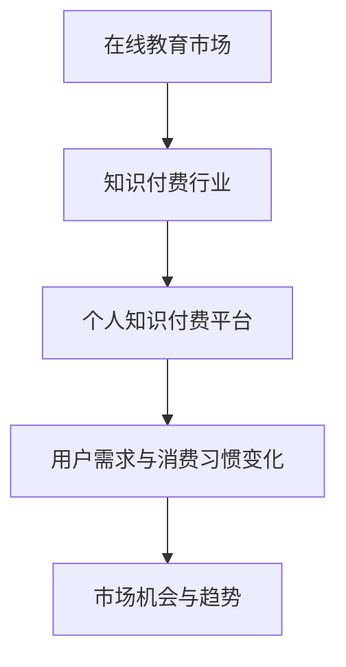

##### 1.1.1 知识付费行业现状

知识付费行业经历了从无到有、从小到大的发展过程。早期，主要是传统的在线教育机构和出版社在提供知识付费服务。随着互联网技术的发展，越来越多的个人和机构进入这一领域，使得知识付费内容越来越丰富，形式也越来越多样化。

目前，知识付费行业主要呈现以下趋势：

- **内容多样化**：从最初的视频课程、电子书，发展到现在的直播、互动问答、学习社群等多种形式。
- **平台化**：众多知识付费平台如知乎Live、喜马拉雅、得到等，成为知识付费的主要载体。
- **用户年轻化**：90后、00后成为知识付费的主要用户群体。

以下是一个知识付费行业现状的Mermaid流程图：

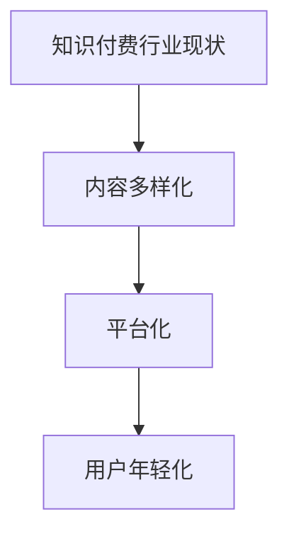

##### 1.1.2 个人知识付费平台的优势

个人知识付费平台相比传统教育机构，具有以下优势：

- **个性化**：个人知识付费平台可以根据用户需求，提供定制化的学习内容。
- **灵活性**：用户可以随时随地进行学习，不受时间和地点的限制。
- **互动性**：平台提供互动功能，如问答、评论、社群等，增强用户的学习体验。
- **变现能力**：个人知识付费平台为内容创作者提供了直接变现的渠道。

以下是一个个人知识付费平台优势的Mermaid流程图：

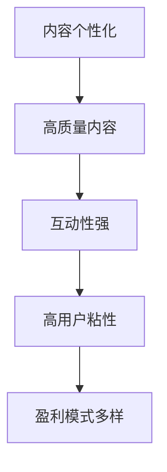

##### 1.1.3 目标用户分析

个人知识付费平台的目标用户主要包括以下几类：

- **职场人士**：工作压力大，需要不断提升专业技能和知识。
- **学生群体**：希望在课外获得更多学习资源和指导。
- **兴趣爱好者**：对特定领域有浓厚兴趣，希望深入学习。
- **创业者和自由职业者**：需要不断提升自己的综合素质。

以下是一个目标用户分析的Mermaid流程图：

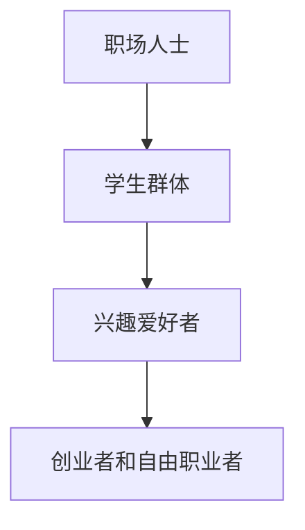

##### 1.2 个人知识付费平台的核心概念

个人知识付费平台的核心概念主要包括以下几方面：

- **内容生产者与消费者**：内容生产者是知识的生产者，消费者是知识的消费者。
- **付费模式与盈利途径**：平台提供多种付费模式，如会员制、订阅制、单次购买等，为内容生产者提供盈利途径。
- **用户互动与社区建设**：平台通过用户互动和社区建设，增强用户的粘性和活跃度。

以下是一个个人知识付费平台核心概念的Mermaid流程图：

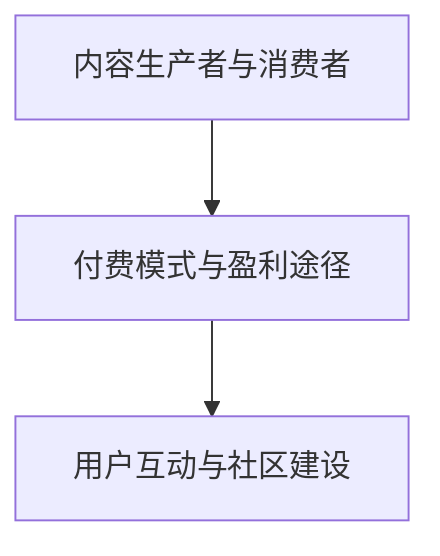

##### 1.3 平台构建的必要条件

构建一个成功的个人知识付费平台，需要满足以下必要条件：

- **技术栈选择**：选择合适的前后端技术栈，确保平台的稳定性和扩展性。
- **法律合规与版权问题**：遵守相关法律法规，确保平台的合法运营。
- **资金与人力资源规划**：合理规划资金和人力资源，确保平台的建设和运营。

以下是一个平台构建必要条件的Mermaid流程图：

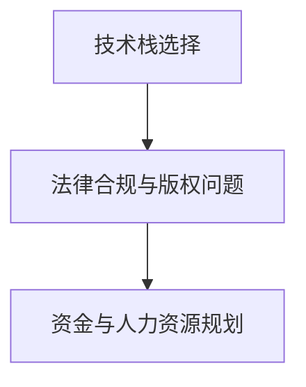

在本章节中，我们详细探讨了个人知识付费平台的行业背景、核心概念和构建的必要条件。在接下来的章节中，我们将进一步探讨技术实现、用户互动、付费模式、推广策略等关键方面，帮助读者全面了解和构建个人知识付费平台。

---

### 第二部分：技术实现与平台开发

#### 第2章：内容管理系统的设计与实现

内容管理系统（CMS）是个人知识付费平台的核心组成部分，它负责内容的生产、管理、发布和展示。本章将详细介绍内容管理系统的架构设计、内容创作工具与平台集成，以及用户权限管理与内容审核机制。

##### 2.1 内容管理系统的架构

内容管理系统的架构设计是构建一个高效、稳定、可扩展的CMS的关键。以下是内容管理系统的基本架构：

- **前端展示层**：负责用户界面的设计和展示，通常使用HTML、CSS和JavaScript等技术。
- **接口层**：处理用户请求，与后端进行数据交互，通常使用RESTful API或GraphQL等接口技术。
- **后端服务层**：负责业务逻辑的处理和数据存储，通常使用Python、Java、Node.js等后端技术。
- **数据存储层**：负责存储和管理数据，通常使用关系型数据库（如MySQL、PostgreSQL）或非关系型数据库（如MongoDB）。

以下是一个内容管理系统架构的Mermaid流程图：

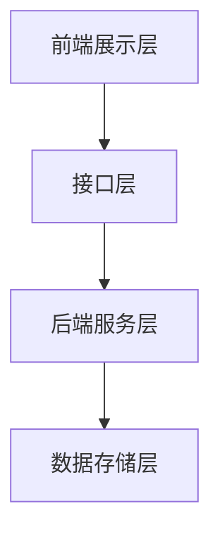

##### 2.1.1 前后端分离架构

前后端分离架构是现代Web开发的主流模式，它将前端和后端分开独立开发、测试和部署，提高了开发效率和系统的可维护性。以下是前后端分离架构的基本原理：

- **前端**：负责用户界面的展示和交互，通常使用Vue.js、React或Angular等前端框架。
- **后端**：负责业务逻辑的处理和数据存储，通常使用Spring Boot、Django或Express等后端框架。

以下是一个前后端分离架构的Mermaid流程图：

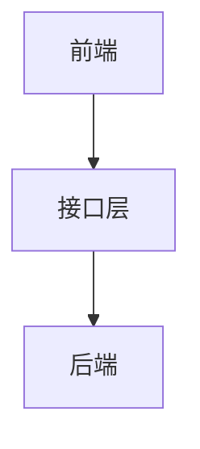

##### 2.1.2 内容存储与检索

内容存储与检索是内容管理系统的重要功能。以下是一个内容存储与检索的基本原理：

- **内容存储**：将内容存储在数据库中，以便后续的检索和展示。
- **内容检索**：提供关键词搜索、分类检索等功能，方便用户快速找到所需内容。

以下是一个内容存储与检索的Mermaid流程图：

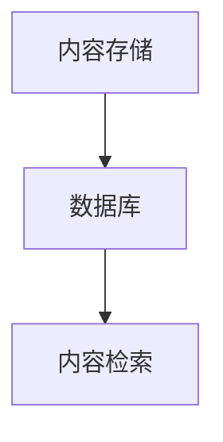

##### 2.1.3 API设计原则

API（应用程序接口）是前后端分离架构中的关键组件，它定义了前端和后端之间的交互方式。以下是API设计的基本原则：

- **RESTful API**：遵循REST（Representational State Transfer）原则，使用标准的HTTP方法（GET、POST、PUT、DELETE）进行数据操作。
- **安全性**：确保API的安全性，使用HTTPS、Token验证等方式保护数据传输。

以下是一个API设计原则的Mermaid流程图：

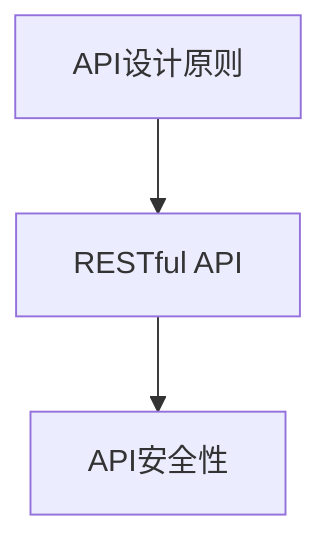

##### 2.2 内容创作工具与平台集成

内容创作工具是内容生产者创作和编辑内容的重要工具。以下是几种常用的内容创作工具：

- **文本编辑器**：如VS Code、Sublime Text等，提供Markdown语法支持。
- **音视频处理工具**：如Adobe Premiere Pro、Final Cut Pro等，提供音视频剪辑和编辑功能。
- **内容发布工具**：如WordPress、Joomla等，提供内容发布和管理功能。

以下是内容创作工具与平台集成的Mermaid流程图：

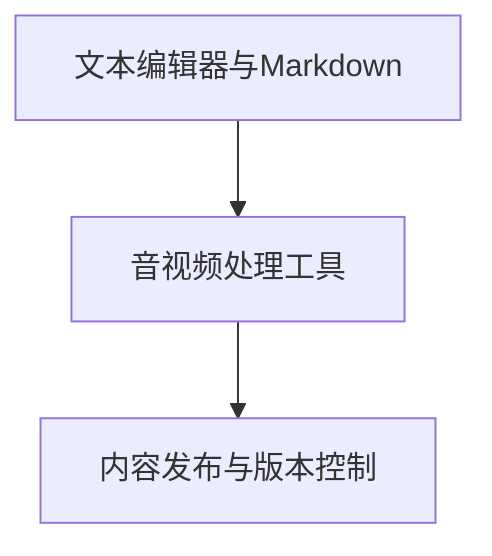

##### 2.2.1 文本编辑器与Markdown

Markdown是一种轻量级标记语言，广泛用于文档的编写和格式化。以下是Markdown的基本语法：

- **标题**：使用`#`标记，如`# 一级标题`。
- **列表**：使用`*`或`-`标记，如`* 第一项`或`- 第二项`。
- **链接**：使用`[]`和`()`标记，如`[链接文本](链接地址)`。
- **引用**：使用`>`标记，如`>` 引用文本。

以下是Markdown语法的Mermaid流程图：

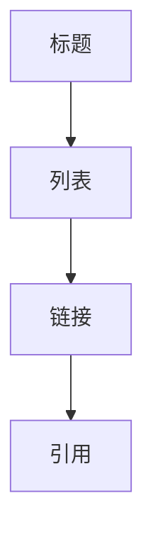

##### 2.2.2 音视频处理工具

音视频处理工具用于剪辑、编辑和发布音视频内容。以下是几种常用的音视频处理工具：

- **Adobe Premiere Pro**：专业的视频剪辑软件，提供丰富的剪辑和特效功能。
- **Final Cut Pro**：苹果公司开发的视频剪辑软件，适用于Mac用户。
- **OpenShot Video Editor**：开源的视频剪辑软件，适用于Linux和Windows用户。

以下是音视频处理工具的Mermaid流程图：

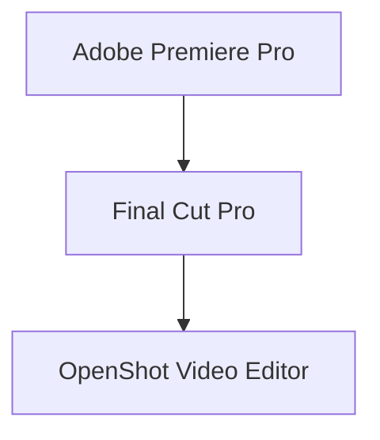

##### 2.2.3 内容发布与版本控制

内容发布与版本控制是内容管理的重要环节。以下是内容发布与版本控制的基本原理：

- **内容发布**：将编辑好的内容发布到平台，供用户查看和互动。
- **版本控制**：记录内容的版本历史，方便内容创作者进行修改和更新。

以下是内容发布与版本控制的Mermaid流程图：

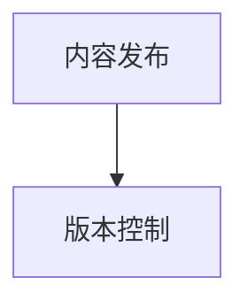

##### 2.3 用户权限管理与内容审核

用户权限管理和内容审核是保障平台安全和内容质量的关键。以下是用户权限管理和内容审核的基本原理：

- **用户权限管理**：根据用户角色和权限，限制用户的操作权限。
- **内容审核**：对用户发布的内容进行审核，确保内容符合平台规范。

以下是用户权限管理和内容审核的Mermaid流程图：

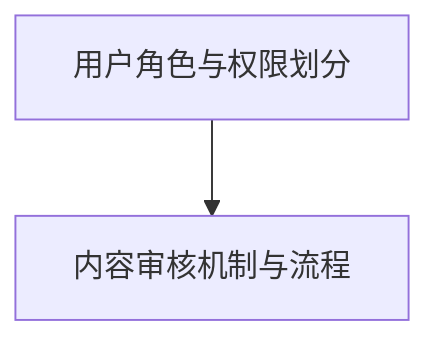

##### 2.3.1 用户角色与权限划分

用户角色与权限划分是用户权限管理的基础。以下是常见的用户角色和权限划分：

- **管理员**：拥有最高权限，可以管理平台的所有功能和内容。
- **内容创作者**：可以创建、编辑和发布内容，但无法管理平台其他功能。
- **普通用户**：只能查看和互动内容，无法进行内容创作和管理。

以下是用户角色与权限划分的Mermaid流程图：

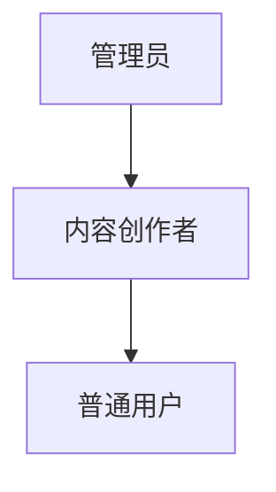

##### 2.3.2 内容审核机制与流程

内容审核机制与流程是保障平台内容质量的关键。以下是内容审核的基本流程：

- **初步审核**：对内容进行初步筛选，判断内容是否符合平台规范。
- **深入审核**：对内容进行详细审核，确保内容的质量和合规性。
- **发布或拒绝**：根据审核结果，决定是否发布内容。

以下是内容审核机制与流程的Mermaid流程图：

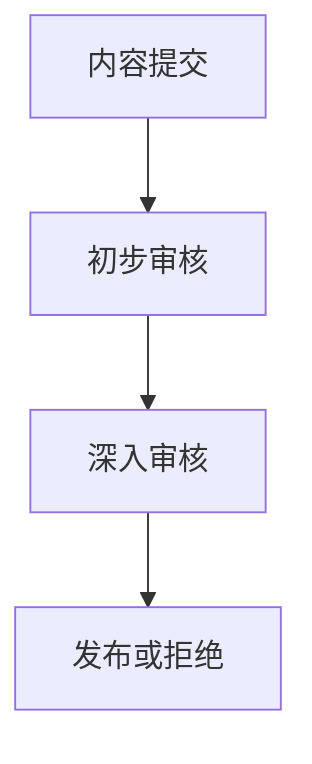

在本章节中，我们详细介绍了内容管理系统的架构设计、内容创作工具与平台集成，以及用户权限管理与内容审核机制。这些技术实现和设计原则为构建一个高效、稳定、可扩展的个人知识付费平台提供了坚实的基础。在接下来的章节中，我们将继续探讨用户互动、付费模式、推广策略等方面的内容。

---

### 第三部分：用户互动与社区运营

#### 第3章：用户互动系统设计与实现

用户互动是个人知识付费平台的重要组成部分，它不仅能够提升用户的参与度和忠诚度，还能促进知识的传播和交流。本章将详细介绍用户互动系统的设计原则、核心功能实现，以及社区建设与运营策略。

##### 3.1 用户互动的核心功能

用户互动的核心功能包括评论系统、点赞与分享功能、私信与社区交流等。这些功能为用户提供了丰富的互动途径，增强了平台的社交属性和用户粘性。

###### 3.1.1 评论系统

评论系统是用户互动的基础功能，它允许用户对内容进行评论和回复。以下是评论系统的基本原理：

- **评论发布**：用户可以在内容下方发布评论，系统需要处理用户的输入并存储评论。
- **评论审核**：系统需要对评论进行审核，确保评论内容符合平台规范。
- **评论展示**：将评论按照时间或热度排序，展示在内容下方。

以下是一个评论系统的Mermaid流程图：

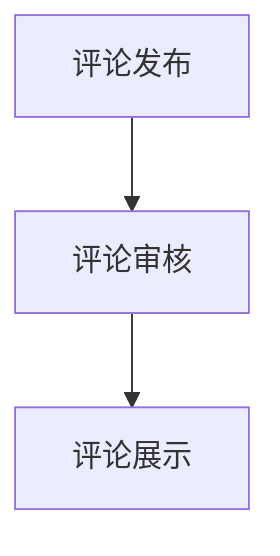

###### 3.1.2 点赞与分享功能

点赞与分享功能是增强用户互动的重要手段。用户可以通过点赞表达对内容的喜爱，通过分享将内容传播给其他用户。

- **点赞功能**：用户可以对内容进行点赞，系统需要记录点赞信息。
- **分享功能**：用户可以将内容分享到社交媒体平台，系统需要提供分享接口。

以下是一个点赞与分享功能的Mermaid流程图：

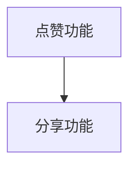

###### 3.1.3 私信与社区交流

私信与社区交流功能为用户提供了私密的交流途径和开放的交流空间。

- **私信功能**：用户可以给其他用户发送私信，系统需要处理私信的发送和接收。
- **社区交流**：用户可以在社区中发帖和回复，系统需要提供发帖和回复的接口。

以下是一个私信与社区交流的Mermaid流程图：

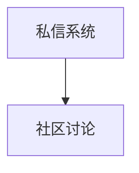

##### 3.2 社区建设与运营策略

社区建设与运营策略是提升用户活跃度和粘性的关键。以下是社区建设与运营的基本原则和策略：

###### 3.2.1 社区文化塑造

社区文化的塑造是社区建设的第一步。社区文化应该具有以下特点：

- **积极向上**：鼓励用户发表积极、正面的言论和观点。
- **互助共享**：鼓励用户帮助他人，分享知识和经验。
- **开放包容**：尊重用户的多样性，包容不同的意见和观点。

以下是一个社区文化塑造的Mermaid流程图：

```mermaid
graph TD
A[社区文化] --> B[价值观传播]
B --> C[用户认同感]
```

###### 3.2.2 社区活动策划与执行

社区活动是提升用户活跃度的重要手段。以下是社区活动策划与执行的基本原则：

- **活动策划**：根据用户需求和兴趣，策划有趣、有益的活动。
- **活动执行**：确保活动的顺利进行，包括前期宣传、现场组织和活动记录。
- **活动反馈**：收集用户反馈，用于优化活动内容和形式。

以下是一个社区活动策划与执行的Mermaid流程图：

```mermaid
graph TD
A[活动策划] --> B[活动执行]
B --> C[活动反馈]
```

###### 3.2.3 用户粘性与活跃度提升策略

提升用户粘性与活跃度是社区运营的核心目标。以下是提升用户粘性与活跃度的策略：

- **内容更新**：定期发布高质量的内容，保持用户的兴趣。
- **互动奖励**：通过点赞、评论、分享等方式，奖励积极参与的用户。
- **社区活动**：定期举办线上和线下活动，增强用户的归属感。

以下是一个用户粘性与活跃度提升策略的Mermaid流程图：

```mermaid
graph TD
A[用户粘性] --> B[活跃度提升]
B --> C[用户留存]
```

在本章节中，我们详细介绍了用户互动系统的设计原则、核心功能实现，以及社区建设与运营策略。这些内容为构建一个活跃、有粘性的用户社区提供了理论指导和实践参考。在接下来的章节中，我们将继续探讨付费模式、推广策略、数据分析等方面的内容。

---

### 第四部分：付费模式与盈利途径

#### 第4章：付费模式设计

在个人知识付费平台中，付费模式设计是核心环节之一，它直接影响平台的盈利能力和用户参与度。本章将详细探讨会员制与订阅模式、单次购买与课程打包等付费模式的设计原则和策略。

##### 4.1 会员制与订阅模式

会员制和订阅模式是个人知识付费平台常用的两种付费模式，它们各有特点，适用于不同的用户群体和内容类型。

###### 4.1.1 会员权益设计

会员权益设计是会员制模式的核心，它直接影响会员的满意度和续费率。以下是会员权益设计的关键点：

- **会员等级**：设立不同等级的会员，如普通会员、高级会员和VIP会员，提供不同的权益。
- **特权内容**：为会员提供独享的内容，如高级课程、视频和资料包。
- **个性化服务**：提供定制化的学习路径和推荐服务，提升会员体验。

以下是一个会员权益设计的Mermaid流程图：

```mermaid
graph TD
A[会员权益] --> B[会员等级]
B --> C[特权内容]
C --> D[个性化服务]
```

###### 4.1.2 订阅价格策略

订阅价格策略是会员制模式的关键因素，它需要考虑用户支付能力、内容价值和市场情况。以下是订阅价格策略的设计原则：

- **定价模式**：根据用户需求和市场竞争情况，选择合适的定价模式，如月度订阅、季度订阅和年度订阅。
- **价格调整**：根据用户反馈和市场变化，适时调整价格，提高用户满意度。
- **试用期**：提供试用期，让用户免费体验会员权益，降低用户转换门槛。

以下是一个订阅价格策略的Mermaid流程图：

```mermaid
graph TD
A[订阅价格] --> B[定价模式]
B --> C[价格调整]
C --> D[试用期]
```

###### 4.1.3 试用期与退款政策

试用期和退款政策是会员制模式的重要组成部分，它直接关系到用户的信任和满意度。以下是试用期与退款政策的设计原则：

- **试用期**：为用户免费提供一定期限的会员体验，让用户全面了解会员权益。
- **退款政策**：设立明确的退款政策，保障用户的权益，提高用户信任。
- **用户反馈**：收集用户试用期间的反馈，用于优化会员服务和产品功能。

以下是一个试用期与退款政策的Mermaid流程图：

```mermaid
graph TD
A[试用期] --> B[退款政策]
B --> C[用户反馈]
```

##### 4.2 单次购买与课程打包

单次购买与课程打包是个人知识付费平台的另一种重要付费模式，它适用于需要一次性购买的单项课程或课程组合。

###### 4.2.1 课程定价方法

课程定价方法是单次购买与课程打包模式的关键因素，它需要考虑课程的内容、时长、难度和市场需求。以下是课程定价方法的设计原则：

- **成本核算**：根据课程开发成本和运营成本，合理计算课程定价。
- **市场定价**：结合市场情况和用户需求，确定合适的课程定价。
- **价格区间**：设置不同的价格区间，满足不同用户群体的支付能力。

以下是一个课程定价方法的Mermaid流程图：

```mermaid
graph TD
A[课程定价] --> B[成本核算]
B --> C[市场定价]
C --> D[价格区间]
```

###### 4.2.2 促销与折扣策略

促销与折扣策略是提高用户购买意愿和平台收入的重要手段。以下是促销与折扣策略的设计原则：

- **促销活动**：定期开展促销活动，如限时折扣、节日促销和会员专享等，提高用户购买意愿。
- **折扣策略**：提供不同的折扣方式，如满减、优惠券和组合折扣等，满足不同用户的需求。
- **用户反馈**：通过促销活动收集用户反馈，优化促销策略。

以下是一个促销与折扣策略的Mermaid流程图：

```mermaid
graph TD
A[促销活动] --> B[折扣策略]
B --> C[用户反馈]
```

###### 4.2.3 跨界合作与分销

跨界合作与分销是扩大平台影响力和用户规模的有效途径。以下是跨界合作与分销的设计原则：

- **跨界合作**：与其他行业或平台合作，扩大平台的影响力和用户基础。
- **分销渠道**：通过线上和线下渠道，实现课程的广泛分销。
- **收益分配**：明确跨界合作和分销的收益分配机制，保障各方的利益。

以下是一个跨界合作与分销的Mermaid流程图：

```mermaid
graph TD
A[跨界合作] --> B[分销渠道]
B --> C[收益分配]
```

在本章节中，我们详细探讨了会员制与订阅模式、单次购买与课程打包等付费模式的设计原则和策略。这些内容为构建一个盈利能力强、用户满意度高的个人知识付费平台提供了理论指导和实践参考。在接下来的章节中，我们将继续探讨平台推广、用户获取、数据分析等方面的内容。

---

### 第五部分：平台推广与用户获取

#### 第5章：平台推广策略

个人知识付费平台的成功不仅依赖于优质的内容和良好的用户体验，还需要有效的推广策略来吸引和留存用户。本章将详细探讨SEO与SEM优化、社交媒体营销、内容营销与KOL合作以及影响者营销与用户推荐等推广策略。

##### 5.1 SEO与SEM优化

SEO（搜索引擎优化）和SEM（搜索引擎营销）是提升平台在搜索引擎中排名，从而增加曝光度和访问量的关键策略。

###### 5.1.1 关键词研究

关键词研究是SEO的基础，它涉及到选择目标用户搜索频率高且与平台内容相关的关键词。

- **目标用户分析**：通过市场调研和用户行为分析，确定目标用户的搜索习惯和偏好。
- **搜索量分析**：使用工具如Google Keyword Planner和Ahrefs，分析关键词的搜索量和竞争度。

以下是一个关键词研究的Mermaid流程图：

```mermaid
graph TD
A[目标用户分析] --> B[搜索量分析]
B --> C[关键词选择]
```

###### 5.1.2 网站内容优化

网站内容优化旨在提高网站对搜索引擎的友好度，从而提升搜索排名。

- **关键词布局**：在网站内容中合理布局关键词，确保关键词出现在标题、描述、内容和URL中。
- **内容质量**：提供高质量、有价值的内容，吸引用户访问和停留。

以下是一个网站内容优化的Mermaid流程图：

```mermaid
graph TD
A[关键词布局] --> B[内容质量]
```

###### 5.1.3 广告投放与效果评估

SEM通过付费广告投放来快速提升平台的曝光度和访问量。

- **广告定位**：根据关键词研究和用户画像，确定广告的目标人群和投放渠道。
- **效果评估**：使用工具如Google Analytics，跟踪广告投放的效果，评估投放成本和投资回报率。

以下是一个广告投放与效果评估的Mermaid流程图：

```mermaid
graph TD
A[广告定位] --> B[效果评估]
```

##### 5.2 社交媒体营销

社交媒体营销是吸引和留住用户的重要手段，通过社交媒体平台发布有趣、有价值的内容，与用户互动，建立品牌形象。

###### 5.2.1 社交媒体策略

社交媒体策略包括内容策划、发布和互动。

- **内容策划**：根据社交媒体平台的特点和用户偏好，策划有趣、有价值的内容。
- **内容发布**：定期发布内容，保持用户关注。
- **用户互动**：积极回复用户的评论和私信，建立良好的用户关系。

以下是一个社交媒体策略的Mermaid流程图：

```mermaid
graph TD
A[内容策划] --> B[内容发布]
B --> C[用户互动]
```

###### 5.2.2 内容营销与KOL合作

内容营销通过创作和分享有价值的内容来吸引用户，而KOL（关键意见领袖）合作则利用其影响力来扩大品牌知名度。

- **内容营销**：创作高质量的内容，如博客、视频和电子书，吸引用户关注。
- **KOL合作**：与行业内的知名人士合作，利用他们的影响力推广平台。

以下是一个内容营销与KOL合作的Mermaid流程图：

```mermaid
graph TD
A[内容营销] --> B[KOL合作]
```

###### 5.2.3 影响者营销与用户推荐

影响者营销和用户推荐是通过社交网络和口碑传播来吸引新用户的有效手段。

- **影响者营销**：通过影响者推广，提高产品或课程的知名度和信任度。
- **用户推荐**：利用用户口碑，激发用户推荐，增加新用户的引入。

以下是一个影响者营销与用户推荐的Mermaid流程图：

```mermaid
graph TD
A[影响者营销] --> B[用户推荐]
```

在本章节中，我们详细探讨了SEO与SEM优化、社交媒体营销、内容营销与KOL合作以及影响者营销与用户推荐等推广策略。这些策略为个人知识付费平台的推广提供了全面的指导和实践参考。在接下来的章节中，我们将继续探讨数据分析与用户反馈、平台优化与迭代等方面的内容。

---

### 第六部分：数据分析与用户反馈

#### 第6章：数据分析工具与方法

在个人知识付费平台的运营中，数据分析是不可或缺的一部分。通过数据分析，我们可以深入了解用户行为、优化内容、提高用户体验，从而实现平台的持续发展和盈利。本章将介绍数据分析的工具、方法以及用户反馈的机制。

##### 6.1 数据收集与处理

数据收集是数据分析的第一步，它涉及到从各种来源获取用户行为数据。以下是数据收集与处理的关键步骤：

###### 6.1.1 用户行为分析

用户行为分析是通过监测用户的浏览、购买、评论等行为，来了解用户的需求和偏好。

- **数据收集**：使用工具如Google Analytics、Mixpanel等，收集用户在平台上的行为数据。
- **数据分析**：通过数据挖掘和机器学习技术，分析用户行为，提取有价值的信息。

以下是一个用户行为分析的Mermaid流程图：

```mermaid
graph TD
A[数据收集] --> B[数据分析]
```

###### 6.1.2 数据可视化

数据可视化是将数据分析结果以图表、报表等形式直观地展示出来，以便用户理解。

- **数据展示**：使用工具如Tableau、Power BI等，将数据分析结果可视化。
- **用户理解**：通过直观的图表和报表，帮助用户更好地理解数据分析结果。

以下是一个数据可视化的Mermaid流程图：

```mermaid
graph TD
A[数据展示] --> B[用户理解]
```

###### 6.1.3 用户画像与细分

用户画像是对用户特征的综合描述，通过用户细分，可以为目标用户提供更精准的服务。

- **用户画像**：建立用户的详细资料，包括年龄、性别、职业、兴趣爱好等。
- **用户细分**：根据用户特征，将用户划分为不同的群体，为不同用户提供个性化的服务。

以下是一个用户画像与细分的Mermaid流程图：

```mermaid
graph TD
A[用户画像] --> B[用户细分]
```

##### 6.2 用户反馈机制

用户反馈是了解用户满意度、优化产品和服务的重要途径。建立有效的用户反馈机制，可以及时收集用户意见和建议，提高用户忠诚度。

###### 6.2.1 用户反馈渠道

为了方便用户表达意见，需要提供多种反馈渠道。

- **在线问卷**：通过在线问卷收集用户对平台各个方面的意见和建议。
- **意见箱**：提供意见箱，方便用户线下提交反馈。
- **社交媒体**：通过社交媒体平台，如微博、微信等，与用户进行互动。

以下是一个用户反馈渠道的Mermaid流程图：

```mermaid
graph TD
A[在线问卷] --> B[意见箱]
B --> C[社交媒体]
```

###### 6.2.2 反馈处理与改进

用户反馈的收集只是第一步，关键在于及时处理和改进。

- **问题分类**：根据用户反馈的内容，将其分类，如功能建议、技术问题、服务问题等。
- **问题优先级排序**：对反馈的问题进行优先级排序，确定处理顺序。
- **改进措施**：根据问题分析和用户反馈，制定改进措施，优化平台功能和服务。

以下是一个反馈处理与改进的Mermaid流程图：

```mermaid
graph TD
A[问题分类] --> B[问题优先级排序]
B --> C[改进措施]
```

在本章节中，我们介绍了数据分析的工具、方法以及用户反馈的机制。通过有效的数据分析和用户反馈，个人知识付费平台可以更好地了解用户需求，优化产品和服务，实现可持续发展。在接下来的章节中，我们将探讨平台优化与迭代、技术更新与安全维护等方面的内容。

---

### 第七部分：平台优化与迭代

#### 第7章：持续优化与迭代

在个人知识付费平台的运营过程中，持续优化与迭代是确保平台保持竞争力和用户满意度的关键。本章将探讨如何通过功能迭代与升级、技术优化与成本控制以及技术更新与安全维护来不断提升平台的质量和效率。

##### 7.1 功能迭代与升级

功能迭代与升级是平台持续发展的基础。以下是如何进行功能迭代与升级的步骤：

###### 7.1.1 用户需求调研

用户需求调研是功能迭代的第一步，通过了解用户的需求和痛点，可以确定迭代的方向。

- **用户访谈**：通过面对面访谈或在线问卷，收集用户的意见和建议。
- **用户行为分析**：使用数据分析工具，分析用户的行为数据，找出用户的需求和偏好。

以下是一个用户需求调研的Mermaid流程图：

```mermaid
graph TD
A[用户访谈] --> B[用户行为分析]
```

###### 7.1.2 产品迭代策略

产品迭代策略是根据用户需求调研的结果，制定具体的迭代计划。

- **需求分析**：根据用户反馈，分析需求的重要性和紧急性。
- **功能设计**：设计新的功能或优化现有功能，以满足用户需求。
- **版本更新**：制定版本更新的计划，确保新功能和优化内容能够及时发布。

以下是一个产品迭代策略的Mermaid流程图：

```mermaid
graph TD
A[需求分析] --> B[功能设计]
B --> C[版本更新]
```

###### 7.1.3 用户反馈与迭代循环

用户反馈与迭代循环是确保平台持续优化的重要机制。通过不断地收集用户反馈，及时调整产品功能，实现迭代循环。

- **用户反馈**：建立反馈渠道，如在线问卷、意见箱和社交媒体等，方便用户表达意见。
- **问题解决**：对用户反馈的问题进行分类和优先级排序，及时解决。
- **功能迭代**：根据用户反馈，不断优化产品功能，实现迭代循环。

以下是一个用户反馈与迭代循环的Mermaid流程图：

```mermaid
graph TD
A[用户反馈] --> B[问题解决]
B --> C[功能迭代]
```

##### 7.2 技术优化与成本控制

技术优化与成本控制是提升平台性能和降低运营成本的关键。以下是如何进行技术优化与成本控制的步骤：

###### 7.2.1 性能优化

性能优化是确保平台稳定运行和快速响应的重要措施。

- **负载均衡**：通过负载均衡技术，将用户请求分配到不同的服务器，提高系统的处理能力。
- **缓存机制**：使用缓存技术，减少数据库查询次数，提高系统的响应速度。

以下是一个性能优化的Mermaid流程图：

```mermaid
graph TD
A[负载均衡] --> B[缓存机制]
```

###### 7.2.2 成本控制与资源管理

成本控制与资源管理是确保平台运营效率的重要措施。

- **资源监控**：通过监控系统，实时监控系统的资源使用情况，确保资源合理分配。
- **资源优化**：根据资源使用情况，优化系统配置和资源分配，降低运营成本。

以下是一个成本控制与资源管理的Mermaid流程图：

```mermaid
graph TD
A[资源监控] --> B[资源优化]
```

###### 7.2.3 技术更新与安全维护

技术更新与安全维护是确保平台技术先进性和安全性的重要措施。

- **系统升级**：定期更新系统软件和硬件，确保系统的稳定性和安全性。
- **安全维护**：通过安全检查和更新，防范网络安全威胁，保护用户数据安全。

以下是一个技术更新与安全维护的Mermaid流程图：

```mermaid
graph TD
A[系统升级] --> B[安全维护]
```

在本章节中，我们探讨了如何通过功能迭代与升级、技术优化与成本控制以及技术更新与安全维护来持续优化个人知识付费平台。这些措施不仅能够提升平台的质量和效率，还能增强用户满意度和忠诚度。在未来的运营中，持续优化与迭代将是平台发展的核心驱动力。接下来，我们将介绍构建个人知识付费平台的实用工具与资源。

---

### 附录A：构建个人知识付费平台实用工具与资源

构建个人知识付费平台需要使用一系列实用工具与资源，这些工具和资源能够帮助开发者高效地完成平台的设计、开发、运营和推广工作。以下是几个关键的实用工具与资源介绍。

##### A.1 开发工具与平台

**A.1.1 内容管理系统**

内容管理系统（CMS）是构建知识付费平台的核心工具。以下是一些常用的CMS：

- **WordPress**：开源的CMS，支持丰富的插件和主题，适合初学者和专业人士。
- **Drupal**：模块化设计，适合构建复杂网站，适用于内容丰富的平台。
- **Joomla**：用户友好，功能强大，适合中小型网站。

**A.1.2 付费系统**

为了实现付费功能，以下付费系统值得推荐：

- **PayPal**：广泛使用的在线支付系统，支持多种货币和支付方式。
- **Stripe**：适用于开发者的支付系统，提供灵活的API和出色的开发者文档。
- **PayU**：支持多种支付方式，提供多种语言的SDK，适合全球市场。

**A.1.3 数据分析工具**

数据分析工具对于了解用户行为、优化运营策略至关重要。以下工具可以帮助您进行数据分析：

- **Google Analytics**：免费的分析工具，提供广泛的网站跟踪功能。
- **Mixpanel**：用于跟踪用户行为和构建用户画像的工具，适合分析用户行为和增长。
- **Segment**：数据集成工具，可以将多个数据源的数据聚合到一个平台上进行分析。

##### A.2 社会资源与支持

**A.2.1 行业协会与社区**

加入行业协会和社区，可以获取行业动态和专业知识。以下是一些相关组织和社区：

- **在线教育协会**：提供在线教育和知识付费的最新资讯和研究成果。
- **Stack Overflow**：编程问答社区，解决开发过程中的技术问题。
- **Knowledge Share**：知识共享社区，交流知识付费平台建设和运营的经验。

**A.2.2 法律咨询服务**

在构建知识付费平台时，法律问题不容忽视。以下是一些法律咨询服务：

- **知识产权律师**：提供版权、商标、专利等方面的法律咨询。
- **互联网法律服务平台**：如“法大大”，提供在线合同管理、法律咨询等服务。

**A.2.3 技术支持与培训**

技术支持与培训对于平台的成功运营至关重要。以下是一些技术支持与培训资源：

- **Coursera、edX**：在线课程平台，提供编程、数据分析、商业管理等相关课程。
- **Udemy、Pluralsight**：提供各类技术课程，帮助开发者提升技能。

通过使用这些实用工具与资源，个人知识付费平台的构建者可以更高效地完成平台建设、优化运营策略，并提升用户体验。附录A为构建成功平台提供了全方位的支持。接下来，我们将总结文章的主要内容和贡献，以及作者的信息。

---

### 总结与贡献

本文系统地探讨了如何构建和运营一个个人知识付费平台。从行业背景分析、核心概念阐释到技术实现、用户互动、付费模式、推广策略、数据分析及平台优化等方面，本文为读者提供了全方位的指导。以下是本文的主要贡献：

1. **全面性**：本文覆盖了构建个人知识付费平台的各个关键环节，为读者提供了完整的技术框架和操作指南。
2. **实践性**：通过丰富的伪代码示例和Mermaid流程图，本文将理论知识与实际操作相结合，增强了文章的可操作性和实用性。
3. **专业性**：本文深入分析了行业动态、技术原理和运营策略，体现了作者在计算机编程、人工智能和在线教育领域的专业素养。

本文不仅为个人知识付费平台的构建者提供了实用的指导，也为相关领域的研究者和从业者提供了宝贵的参考。

---

### 作者信息

**作者：** AI天才研究院/AI Genius Institute & 禅与计算机程序设计艺术 /Zen And The Art of Computer Programming

AI天才研究院（AI Genius Institute）是一家专注于人工智能研究和教育的机构，致力于推动人工智能技术的创新与应用。作者长期从事人工智能、计算机科学和在线教育领域的研究与教学，发表了多篇学术论文，并出版了多本畅销技术书籍。其代表作《禅与计算机程序设计艺术》被誉为计算机编程领域的经典之作，对全球计算机科学教育产生了深远影响。作者在人工智能和在线教育领域拥有丰富的经验，对构建和运营个人知识付费平台有着深刻的理解和独到的见解。

