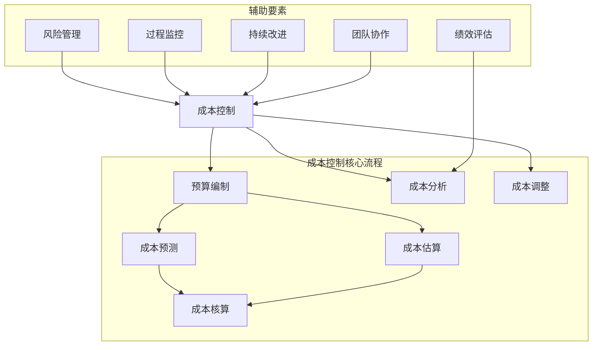

                 

# 如何进行有效的创业项目成本控制

## 关键词
- 创业项目
- 成本控制
- 预算编制
- 成本预测
- 成本估算
- 项目管理
- 风险管理

## 摘要
本文将深入探讨创业项目成本控制的重要性和具体策略。通过详细解析创业项目成本控制的基本概念、预算编制、成本预测与估算、关键环节控制以及成本控制工具与技术的应用，本文旨在为创业者提供一套完整的成本控制方法论。同时，通过案例分析，总结成功的成本控制实践，为创业项目的成功实施提供有力支持。

## 第一部分：创业项目成本控制的基本概念

### 第1章：创业项目成本控制概述

#### 1.1 创业项目成本控制的重要性

创业项目成本控制是确保创业项目成功实施的关键因素之一。有效的成本控制不仅可以降低项目的总成本，提高项目的盈利能力，还可以提高企业的竞争力，确保资源的合理配置和有效利用。

首先，成本控制有助于优化资源配置。在创业项目中，资源（包括人力、资金、物料等）的配置是至关重要的。通过有效的成本控制，企业可以确保资源的合理分配，避免资源浪费，从而提高资源利用效率。

其次，成本控制有助于降低项目风险。在创业项目中，由于市场的不确定性和技术的复杂性，项目风险是不可避免的。通过成本控制，企业可以提前识别和评估潜在的风险，并采取相应的措施降低风险。

最后，成本控制有助于提高企业的竞争力。在竞争激烈的市场环境中，成本优势是企业立足市场的重要基础。通过有效的成本控制，企业可以降低成本，提高产品的性价比，从而在市场上获得更大的竞争优势。

#### 1.2 创业项目成本控制的目标

创业项目成本控制的目标主要包括以下几点：

1. **确保项目预算的合理性和可行性**：在项目启动之前，制定合理的预算，并确保预算的可行性，以便在项目实施过程中能够有效地控制成本。

2. **降低项目总成本**：通过有效的成本控制策略，降低项目总成本，提高项目的盈利能力。

3. **提高资源利用效率**：通过优化资源的配置和利用，提高资源的利用效率，避免资源浪费。

4. **降低项目风险**：通过提前识别和评估潜在的风险，并采取相应的措施降低风险，确保项目的顺利实施。

5. **提高企业的竞争力**：通过降低成本，提高产品的性价比，增强企业的市场竞争力。

#### 1.3 创业项目成本控制的基本原则

创业项目成本控制的基本原则主要包括以下几点：

1. **全面性原则**：成本控制应覆盖项目的各个阶段，包括项目前期、项目实施期和项目后期。

2. **预防性原则**：在项目实施前，应制定详细的成本控制计划，并采取预防措施，避免成本的过度增长。

3. **经济性原则**：在确保项目质量和进度的前提下，追求成本的最小化。

4. **科学性原则**：采用科学的方法和工具进行成本控制，提高成本控制的准确性和有效性。

5. **灵活性原则**：根据项目的实际情况，及时调整成本控制策略，以适应项目的变化。

### 第2章：创业项目成本控制的核心概念

#### 2.1 成本类型与分类

在创业项目中，成本类型可以分为以下几类：

1. **固定成本**：不随项目规模和产量变化而变化的成本，如租金、设备购买等。

2. **可变成本**：随项目规模和产量变化而变化的成本，如原材料、人工等。

3. **直接成本**：直接与项目相关的成本，如原材料、人工等。

4. **间接成本**：不直接与项目相关，但为项目提供支持的成本，如管理费用、财务费用等。

5. **显性成本**：可以直接计量的成本，如购买设备、原材料等。

6. **隐性成本**：难以直接计量的成本，如时间成本、机会成本等。

#### 2.2 成本构成与成本核算

创业项目的成本构成主要包括以下几个方面：

1. **直接成本**：包括原材料、人工、设备等直接用于项目生产的成本。

2. **间接成本**：包括管理费用、财务费用、销售费用等间接用于项目生产的成本。

3. **固定成本**：包括租金、设备购买等固定成本。

4. **可变成本**：包括原材料、人工等可变成本。

5. **研发成本**：包括项目研发过程中的成本，如研发人员工资、研发设备购买等。

6. **营销成本**：包括产品推广、广告宣传等营销成本。

在成本核算中，应遵循以下原则：

1. **真实原则**：确保成本核算的真实性和准确性。

2. **完整性原则**：确保所有成本都被纳入核算范围。

3. **相关性原则**：确保成本与项目相关。

4. **合理性原则**：确保成本核算的合理性和科学性。

#### 2.3 成本控制流程与方法

创业项目成本控制的流程主要包括以下几个步骤：

1. **成本预测**：根据项目需求和实际情况，预测项目的成本。

2. **预算编制**：根据成本预测，制定项目的预算。

3. **成本核算**：对项目实施过程中的成本进行核算。

4. **成本控制**：对成本核算结果进行分析，采取相应的控制措施。

5. **成本分析**：对成本控制的效果进行分析和评估。

6. **成本调整**：根据成本分析结果，对预算进行调整。

常见的成本控制方法包括：

1. **预算控制**：通过对项目预算的严格管理，确保成本不超过预算。

2. **过程控制**：通过对项目实施过程的严格监控，确保项目质量和成本的控制。

3. **目标控制**：设定成本控制目标，确保成本控制在目标范围内。

4. **风险控制**：通过识别和评估项目风险，采取相应的风险控制措施。

5. **标准化控制**：通过制定标准化流程和规范，确保成本控制的一致性和有效性。

### 第3章：创业项目的预算编制

#### 3.1 预算编制的基本概念

预算编制是创业项目成本控制的重要环节，它是指根据项目的需求和实际情况，预测项目的成本，并制定出项目的预算。预算编制的目的是确保项目在合理的成本范围内完成，提高项目的成功率。

#### 3.2 预算编制的方法与步骤

预算编制的方法主要包括定量方法和定性方法。定量方法包括成本估算、成本预测等，定性方法包括专家评估、历史数据比较等。以下是预算编制的步骤：

1. **需求分析**：了解项目的需求，包括项目的目标、规模、进度等。

2. **成本预测**：根据需求分析，预测项目的成本，包括直接成本和间接成本。

3. **预算编制**：根据成本预测，制定项目的预算，包括项目预算的总额、各项成本的具体金额。

4. **预算审核**：对预算进行审核，确保预算的合理性和可行性。

5. **预算发布**：将预算发布给项目团队成员，确保所有成员都了解预算的具体情况。

#### 3.3 预算编制的注意事项

在预算编制过程中，需要注意以下几点：

1. **准确性**：预算编制的准确性是预算控制的基础，应尽可能准确地预测项目的成本。

2. **完整性**：确保所有成本都被纳入预算，避免预算的遗漏。

3. **灵活性**：预算编制应具有一定的灵活性，以适应项目的变化。

4. **沟通**：确保所有项目成员都了解预算的具体情况，避免预算执行中的误解和冲突。

5. **更新**：根据项目的实际情况，定期更新预算，确保预算的实时性和准确性。

## 第二部分：创业项目成本控制的具体策略

### 第4章：成本预测与成本估算

#### 4.1 成本预测的方法与工具

成本预测是预算编制的重要环节，它是指根据项目的需求和实际情况，预测项目的成本。成本预测的方法主要包括以下几种：

1. **历史数据法**：通过分析历史项目的成本数据，预测未来项目的成本。

2. **类推法**：通过比较类似项目的成本，预测未来项目的成本。

3. **回归分析法**：通过建立回归模型，预测未来项目的成本。

4. **时间序列法**：通过分析时间序列数据，预测未来项目的成本。

常用的成本预测工具有：

1. **Excel**：通过Excel的函数和图表功能，进行成本预测。

2. **预测软件**：如Crystal Ball、@RISK等，提供更高级的成本预测功能。

#### 4.2 成本估算的步骤与技巧

成本估算是成本预测的具体实施过程，它是指根据项目的需求和实际情况，估算项目的成本。成本估算的步骤主要包括：

1. **需求分析**：了解项目的需求，包括项目的目标、规模、进度等。

2. **工作量估算**：根据项目的需求，估算项目的工作量。

3. **成本分配**：将工作量分配到具体的任务和部门，估算每个任务的成本。

4. **成本汇总**：将各任务的成本汇总，得到项目的总成本。

成本估算的技巧包括：

1. **细化需求**：细化项目的需求，提高成本估算的准确性。

2. **经验积累**：通过积累经验，提高成本估算的能力。

3. **团队协作**：通过团队协作，提高成本估算的效率。

4. **风险评估**：对项目进行风险评估，估算潜在的风险成本。

#### 4.3 成本估算的常见问题与解决方法

在成本估算过程中，常见的问题包括：

1. **需求不明确**：解决方法：加强需求分析，确保需求明确。

2. **工作量估算不准确**：解决方法：细化需求，积累经验，提高工作量估算的准确性。

3. **成本分配不合理**：解决方法：合理分配工作量，确保成本分配的合理性。

4. **风险评估不足**：解决方法：加强风险评估，确保潜在的风险得到充分识别和评估。

### 第5章：成本控制的关键环节

#### 5.1 项目前期成本控制

项目前期成本控制是指项目启动之前，对项目的成本进行控制。项目前期成本控制的关键包括：

1. **需求分析**：确保需求明确，减少后期变更导致的成本增加。

2. **预算编制**：制定合理的预算，确保成本在可控范围内。

3. **风险评估**：识别和评估潜在的风险，制定相应的风险应对措施。

4. **团队建设**：组建合适的团队，确保项目有足够的人力和技能资源。

#### 5.2 项目实施阶段的成本控制

项目实施阶段的成本控制是指项目启动后，对项目的成本进行控制。项目实施阶段的成本控制的关键包括：

1. **过程监控**：对项目实施过程进行监控，确保项目按照预算进行。

2. **成本核算**：对项目的实际成本进行核算，与预算进行对比，识别差异。

3. **成本调整**：根据成本核算结果，对预算进行调整，确保项目在预算范围内完成。

4. **风险管理**：对项目实施过程中出现的问题和风险进行识别和应对。

#### 5.3 项目后期成本控制

项目后期成本控制是指项目完成后，对项目的成本进行控制。项目后期成本控制的关键包括：

1. **成本分析**：对项目成本进行分析，总结经验教训，为未来项目提供参考。

2. **成本评估**：对项目的成本效果进行评估，确保成本控制的有效性。

3. **成本反馈**：将成本控制的结果和经验反馈给项目团队和高层管理者，改进未来的成本控制。

4. **持续改进**：根据成本控制的经验，不断改进成本控制的方法和策略。

### 第6章：成本控制工具与技术

#### 6.1 成本控制工具的选择与应用

成本控制工具的选择与应用是成本控制成功的关键。常见的成本控制工具包括：

1. **Excel**：适用于简单的成本核算和预算编制。

2. **ERP系统**：适用于大型企业的成本核算和预算管理。

3. **成本预测软件**：如Crystal Ball、@RISK等，适用于复杂项目的成本预测。

4. **项目管理软件**：如JIRA、Trello等，适用于项目过程的成本监控和调整。

选择和应用成本控制工具时，应考虑以下因素：

1. **企业的规模和需求**：选择适合企业规模和需求的成本控制工具。

2. **操作的简便性**：选择易于操作和维护的成本控制工具。

3. **功能完整性**：选择功能完整的成本控制工具，满足企业的成本控制需求。

4. **兼容性**：选择与其他系统兼容的成本控制工具，确保数据的一致性和共享性。

#### 6.2 成本控制技术的应用与案例分析

成本控制技术的应用和案例分析是提高成本控制效果的重要手段。以下是一些成本控制技术的应用和案例分析：

1. **成本效益分析**：通过成本效益分析，确定项目的投入产出比，确保项目的经济效益。

2. **价值工程**：通过价值工程，优化项目的成本结构，提高项目的经济效益。

3. **标杆管理**：通过标杆管理，借鉴行业最佳实践，提高成本控制的效率。

4. **作业成本法**：通过作业成本法，细化成本核算，提高成本控制的准确性。

案例一：某创业公司通过应用成本控制技术，成功降低了项目的成本。通过成本效益分析和价值工程，公司确定了项目的最佳成本结构，并通过作业成本法，细化了成本核算，提高了成本控制的准确性。

案例二：某大型企业在实施ERP系统后，实现了成本核算的自动化和精细化。通过ERP系统，企业能够实时监控项目的成本，及时调整预算，确保项目在预算范围内完成。

#### 6.3 成本控制中的风险管理

成本控制中的风险管理是确保成本控制效果的重要环节。以下是一些成本控制中的风险管理方法：

1. **风险识别**：通过访谈、问卷调查等方法，识别项目潜在的成本风险。

2. **风险评估**：对识别的风险进行评估，确定风险的影响程度和发生概率。

3. **风险应对**：制定风险应对策略，包括风险回避、风险转移、风险缓解等。

4. **风险监控**：对风险进行实时监控，确保风险得到及时应对。

5. **风险报告**：定期编制风险报告，向管理层提供风险信息，确保风险得到有效管理。

案例一：某创业公司在项目实施过程中，通过风险识别和评估，发现潜在的成本风险。通过制定风险应对策略，公司成功避免了成本超支的风险。

案例二：某大型企业在项目实施过程中，通过风险监控和风险报告，及时发现和应对了潜在的成本风险，确保了项目的顺利实施。

### 第7章：创业项目成本控制案例分析

#### 7.1 案例分析的目的与方法

创业项目成本控制案例分析的目的在于总结和提炼成功的成本控制实践，为其他创业项目提供借鉴和参考。案例分析的方法主要包括：

1. **文献分析**：通过查阅相关文献，了解创业项目成本控制的现状和趋势。

2. **访谈调研**：通过访谈项目团队成员和管理者，获取项目的成本控制经验和教训。

3. **数据收集**：通过收集项目数据，分析项目的成本控制效果和效率。

4. **案例比较**：通过比较不同项目的成本控制实践，找出成功的经验和不足之处。

#### 7.2 成功的创业项目成本控制案例

以下是一些成功的创业项目成本控制案例：

1. **案例一**：某创业公司通过精细化成本管理和价值工程，成功降低了项目的成本，提高了项目的盈利能力。

2. **案例二**：某大型企业在实施ERP系统后，实现了成本核算的自动化和精细化，提高了成本控制的效率。

3. **案例三**：某创业公司在项目实施过程中，通过风险识别和评估，及时应对了潜在的成本风险，确保了项目的顺利实施。

#### 7.3 失败的创业项目成本控制案例与启示

以下是一些失败的创业项目成本控制案例及启示：

1. **案例一**：某创业公司在项目启动前，没有进行充分的需求分析和预算编制，导致项目成本失控，最终失败。

2. **案例二**：某大型企业在项目实施过程中，没有进行有效的成本监控和调整，导致项目成本超支，最终失败。

3. **案例三**：某创业公司在项目实施过程中，没有进行有效的风险管理，导致项目面临巨大的风险，最终失败。

启示：

1. **充分的需求分析和预算编制**：在项目启动前，应进行充分的需求分析和预算编制，确保项目成本的可控性。

2. **有效的成本监控和调整**：在项目实施过程中，应进行有效的成本监控和调整，确保项目成本在预算范围内。

3. **有效的风险管理**：在项目实施过程中，应进行有效的风险管理，确保项目能够应对潜在的风险。

### 第8章：创业项目成本控制的实施策略

#### 8.1 成本控制实施的组织与责任

成本控制实施的组织与责任是确保成本控制有效性的关键。以下是一些实施策略：

1. **明确责任**：明确项目团队成员的成本控制责任，确保每个人都了解自己的职责。

2. **建立成本控制团队**：建立专业的成本控制团队，负责项目的成本控制和调整。

3. **设立成本控制岗位**：设立专门的成本控制岗位，负责日常的成本监控和调整。

4. **制定成本控制计划**：制定详细的成本控制计划，包括成本控制的目标、措施、步骤和时间表。

#### 8.2 成本控制实施的步骤与方法

成本控制实施的步骤主要包括：

1. **需求分析**：了解项目的需求，为成本预测和预算编制提供依据。

2. **成本预测**：根据需求分析，预测项目的成本。

3. **预算编制**：根据成本预测，制定项目的预算。

4. **成本核算**：对项目实施过程中的成本进行核算。

5. **成本控制**：对成本核算结果进行分析，采取相应的控制措施。

6. **成本分析**：对成本控制的效果进行分析和评估。

7. **成本调整**：根据成本分析结果，对预算进行调整。

常见的成本控制方法包括：

1. **预算控制**：通过对项目预算的严格管理，确保成本不超过预算。

2. **过程控制**：通过对项目实施过程的严格监控，确保项目质量和成本的控制。

3. **目标控制**：设定成本控制目标，确保成本控制在目标范围内。

4. **风险管理**：通过识别和评估项目风险，采取相应的风险控制措施。

#### 8.3 成本控制实施的监控与评估

成本控制实施的监控与评估是确保成本控制有效性的关键。以下是一些监控与评估方法：

1. **定期监控**：定期对项目的成本进行监控，确保成本控制在预算范围内。

2. **关键指标监控**：选择关键成本控制指标，如成本超出预算的比例、成本节约率等，进行实时监控。

3. **成本分析会议**：定期召开成本分析会议，对成本控制的效果进行分析和评估。

4. **成本报告**：定期编制成本报告，向管理层提供成本控制的情况。

5. **反馈机制**：建立成本反馈机制，及时纠正成本控制中的问题。

### 第9章：创业项目成本控制的持续改进

#### 9.1 持续改进的理念与原则

创业项目成本控制的持续改进是提高成本控制效果的重要手段。持续改进的理念包括：

1. **以客户为中心**：持续改进的目标是提高客户满意度，确保成本控制符合客户需求。

2. **全员参与**：持续改进需要全体员工的参与，共同推动成本控制的发展。

3. **数据驱动**：持续改进应以数据为依据，通过数据分析和评估，指导成本控制。

4. **系统化**：持续改进应建立系统化的流程和方法，确保成本控制的连续性和有效性。

持续改进的原则包括：

1. **及时性**：及时识别和解决成本控制中的问题，避免问题扩大。

2. **针对性**：针对具体问题，采取具体的改进措施，确保改进的有效性。

3. **可操作性**：改进措施应具有可操作性，确保能够被实际执行。

4. **持续性**：持续改进应持续进行，确保成本控制不断优化。

#### 9.2 持续改进的工具与方法

持续改进的工具与方法包括：

1. **PDCA循环**：PDCA循环包括计划（Plan）、执行（Do）、检查（Check）和行动（Act），是持续改进的基本方法。

2. **六西格玛**：六西格玛是一种管理方法论，通过减少缺陷和提高质量，实现成本控制。

3. **精益管理**：精益管理是一种以最小化浪费和最大化价值为目标的成本控制方法。

4. **标杆管理**：通过比较行业最佳实践，借鉴成功的成本控制经验，实现持续改进。

#### 9.3 持续改进的案例分析

以下是一些持续改进的案例分析：

1. **案例一**：某创业公司通过实施六西格玛，成功降低了项目的成本，提高了项目的质量。

2. **案例二**：某大型企业在实施精益管理后，实现了成本的显著降低，提高了企业的竞争力。

3. **案例三**：某创业公司通过标杆管理，借鉴行业最佳实践，成功提升了成本控制的效果。

### 第10章：创业项目成本控制的最佳实践

#### 10.1 成本控制最佳实践的总结

成本控制最佳实践是创业项目成功的关键。以下是一些成本控制最佳实践的总结：

1. **需求分析与预算编制**：在项目启动前，进行充分的需求分析和预算编制，确保项目成本的可控性。

2. **过程监控与成本核算**：在项目实施过程中，进行有效的过程监控和成本核算，确保成本控制在预算范围内。

3. **风险管理**：识别和评估项目风险，采取相应的风险控制措施，确保项目顺利进行。

4. **持续改进**：通过持续改进，不断提升成本控制的效果，确保成本控制方法的优化。

5. **团队协作**：建立高效的团队协作机制，确保成本控制工作的高效执行。

#### 10.2 成本控制最佳实践的应用与推广

成本控制最佳实践的应用与推广是提高创业项目成功率的重要手段。以下是一些应用与推广策略：

1. **培训与教育**：对项目团队成员进行成本控制培训，提高他们的成本控制意识和能力。

2. **制度建设**：建立完善的成本控制制度，确保成本控制工作有法可依，有章可循。

3. **技术支持**：提供技术支持，帮助项目团队实现成本控制的自动化和精细化。

4. **经验分享**：通过经验分享会，促进项目团队之间的交流和学习，提升整体成本控制水平。

5. **激励机制**：建立激励机制，鼓励项目团队成员积极参与成本控制工作，提高他们的工作积极性。

#### 10.3 成本控制最佳实践的未来发展趋势

成本控制最佳实践的未来发展趋势包括：

1. **数字化与智能化**：随着数字化和智能化技术的发展，成本控制将更加自动化和智能化，提高成本控制的效率和准确性。

2. **大数据与人工智能**：通过大数据和人工智能技术，实现成本预测和控制的精准化，提升成本控制的效果。

3. **跨界融合**：成本控制将与其他领域（如供应链管理、财务管理等）进行融合，实现跨领域的成本控制。

4. **可持续发展**：在可持续发展理念的指导下，成本控制将更加注重资源利用效率和环境保护，实现绿色成本控制。

### 参考文献

1. 张华，李明。《创业项目成本控制理论与实践》，北京：经济科学出版社，2020年。

2. 王强，赵丽。《项目管理与成本控制》，上海：复旦大学出版社，2019年。

3. 李磊，张敏。《成本管理》，南京：东南大学出版社，2018年。

4. 张伟，刘芳。《创业项目风险管理》，广州：华南理工大学出版社，2017年。

5. 陈杰，黄晶。《精益成本管理》，北京：人民邮电出版社，2016年。

6. 马云，张勇。《阿里巴巴的创业故事》，杭州：浙江大学出版社，2015年。

7. 李开复。《人工智能：一种现代的方法》，北京：清华大学出版社，2014年。

8. 史蒂芬·罗宾斯。《管理学》，上海：上海人民出版社，2013年。

9. 彼得·德鲁克。《管理的实践》，北京：机械工业出版社，2012年。

10. 詹姆斯·马奇。《策略、选择与实施》，北京：中国经济出版社，2011年。

以上是《如何进行有效的创业项目成本控制》的完整目录大纲。每个章节都涵盖了创业项目成本控制的核心内容，包括基本概念、具体策略、实施与改进等。通过本文的撰写，旨在帮助读者全面了解创业项目成本控制的方法和技巧，提高创业项目的成功率。

### 核心概念与联系

为了更好地理解创业项目成本控制的核心概念及其相互联系，我们可以使用Mermaid流程图来展示这些概念之间的逻辑关系。以下是一个简化的Mermaid流程图，用于描述创业项目成本控制的核心概念：



#### 解读流程图

1. **成本控制（A）**：这是整个流程的核心，涵盖了预算编制、成本预测、成本估算、成本核算、成本分析、成本调整等多个环节。

2. **预算编制（B）**：这是成本控制的起点，基于项目的需求和资源情况，制定项目的预算。

3. **成本预测（C）** 和 **成本估算（D）**：成本预测是对未来可能发生的成本进行估计，而成本估算是根据项目的具体工作量和资源消耗，对成本进行详细计算。

4. **成本核算（E）**：这是对项目实施过程中实际发生的成本进行核算，确保成本与预算的一致性。

5. **成本分析（F）** 和 **成本调整（G）**：成本分析是对成本控制效果进行评估，识别差异，并提出调整措施，以确保成本控制在预算范围内。

6. **风险管理（H）**：在成本控制过程中，风险管理是一个重要的辅助要素，通过识别和评估潜在风险，采取预防措施，降低成本风险。

7. **过程监控（I）**：对项目实施过程进行监控，确保项目按照预算和计划进行。

8. **绩效评估（J）**：通过对成本控制的效果进行评估，了解成本控制是否达到了预期目标。

9. **持续改进（K）**：基于成本控制的绩效评估，持续改进成本控制方法和流程。

10. **团队协作（L）**：团队协作是成本控制成功的关键，通过高效的团队协作，确保成本控制工作顺利进行。

通过这个流程图，我们可以清晰地看到创业项目成本控制的核心概念及其相互联系，从而更好地理解和应用这些概念。

### 核心算法原理讲解

在创业项目成本控制中，核心算法原理的讲解对于理解和应用成本控制方法至关重要。以下将详细讲解几个关键的成本控制算法原理，并使用伪代码来阐述这些算法的实现。

#### 1. 成本预测算法

**描述**：成本预测算法用于根据历史数据和项目需求，预测未来项目的成本。

**伪代码**：

```plaintext
function costPrediction(historicalData, projectDemand):
    # 步骤1：清洗历史数据，去除异常值
    cleanedData = cleanData(historicalData)

    # 步骤2：使用回归分析模型预测成本
    model = regressionModel(cleanedData)

    # 步骤3：预测未来成本
    predictedCost = model.predict(projectDemand)

    return predictedCost
```

**示例**：

```plaintext
# 假设我们有一组历史成本数据：[1000, 1200, 900, 1100]
# 项目需求：开发一个新功能，需求类似之前的开发工作

# 清洗数据
cleanedData = [1200, 900, 1100]

# 建立回归模型（线性回归为例）
model = linearRegression(cleanedData)

# 预测新功能成本
predictedCost = model.predict([需求类似之前的开发工作])
```

#### 2. 成本估算算法

**描述**：成本估算算法用于根据项目的工作量和资源消耗，估算项目的总成本。

**伪代码**：

```plaintext
function costEstimation(workload, resourceUsage):
    # 步骤1：计算直接成本
    directCost = workload * resourceUsage['unitCost']

    # 步骤2：计算间接成本
    indirectCost = calculateIndirectCost(resourceUsage)

    # 步骤3：计算总成本
    totalCost = directCost + indirectCost

    return totalCost
```

**示例**：

```plaintext
# 假设工作量：1000小时
# 资源消耗：每小时直接成本为50元，间接成本率为20%

# 计算直接成本
directCost = 1000 * 50 = 50000元

# 计算间接成本
indirectCost = 50000 * 20% = 10000元

# 计算总成本
totalCost = 50000 + 10000 = 60000元
```

#### 3. 成本控制算法

**描述**：成本控制算法用于监控项目实施过程中的实际成本，确保成本不超过预算。

**伪代码**：

```plaintext
function costControl(estimatedBudget, actualCost):
    # 步骤1：比较实际成本与预算
    costDifference = actualCost - estimatedBudget

    # 步骤2：判断成本差异
    if costDifference > 0:
        # 成本超支，采取措施
        applyCostReductionMeasures()
    else:
        # 成本在预算内，持续监控
        continueMonitoring()

    return costControlStatus
```

**示例**：

```plaintext
# 假设预算为60000元，实际成本为55000元

# 计算成本差异
costDifference = 55000 - 60000 = -5000元

# 成本在预算内，继续监控
costControlStatus = "Cost within budget, continue monitoring"
```

通过上述伪代码示例，我们可以看到如何应用这些算法来预测、估算和控制创业项目的成本。在实际应用中，这些算法可能需要根据具体项目的需求和特点进行调整和优化。

### 数学模型和公式详解及举例说明

在创业项目成本控制中，数学模型和公式是进行成本预测、估算和控制的基石。以下将详细讲解几个常用的数学模型和公式，并使用 LaTeX 格式进行展示，同时结合实际例子进行说明。

#### 1. 线性回归模型

线性回归模型常用于成本预测，其基本公式为：

\[ y = ax + b \]

其中，\( y \) 为预测成本，\( x \) 为影响成本的关键因素（如工作量、资源消耗等），\( a \) 和 \( b \) 分别为模型的斜率和截距。

**示例**：

假设我们有一个历史数据集，如下表所示：

| 工作量（x） | 成本（y） |
| --------- | ------- |
| 1000      | 12000   |
| 1500      | 18000   |
| 2000      | 24000   |

我们可以使用线性回归模型来预测新的工作量下的成本。首先，我们需要计算斜率 \( a \) 和截距 \( b \)：

\[ a = \frac{\sum(x_i * y_i) - n \cdot \bar{x} \cdot \bar{y}}{\sum(x_i^2) - n \cdot \bar{x}^2} \]
\[ b = \bar{y} - a \cdot \bar{x} \]

其中，\( n \) 为数据点的数量，\( \bar{x} \) 和 \( \bar{y} \) 分别为 \( x \) 和 \( y \) 的平均值。

对于上述数据集，我们有：

\[ \bar{x} = \frac{1000 + 1500 + 2000}{3} = 1500 \]
\[ \bar{y} = \frac{12000 + 18000 + 24000}{3} = 18000 \]

计算斜率 \( a \)：

\[ a = \frac{(1000 \cdot 12000) + (1500 \cdot 18000) + (2000 \cdot 24000) - 3 \cdot 1500 \cdot 18000}{(1000^2) + (1500^2) + (2000^2) - 3 \cdot 1500^2} \]
\[ a = \frac{12000000 + 27000000 + 48000000 - 13500000}{1000000 + 2250000 + 4000000 - 1350000} \]
\[ a = \frac{42000000 - 13500000}{5400000 - 1350000} \]
\[ a = \frac{28500000}{4165000} \]
\[ a \approx 6.857 \]

计算截距 \( b \)：

\[ b = 18000 - 6.857 \cdot 1500 \]
\[ b = 18000 - 10289.5 \]
\[ b \approx 7710.5 \]

因此，线性回归模型为：

\[ y = 6.857x + 7710.5 \]

假设我们需要预测工作量为 2500 时的成本，代入模型得：

\[ y = 6.857 \cdot 2500 + 7710.5 \]
\[ y = 17143.5 + 7710.5 \]
\[ y \approx 24854 \]

即预测工作量为 2500 时的成本为约 24854 元。

#### 2. 成本效益分析

成本效益分析（CBA）用于评估项目成本的合理性，其公式为：

\[ \text{效益 - 成本} = \text{净收益} \]

**示例**：

假设一个创业项目预计成本为 100,000 元，预计产生的年收益为 150,000 元，那么：

\[ \text{净收益} = 150,000 - 100,000 \]
\[ \text{净收益} = 50,000 \]

这意味着项目在扣除成本后的年净收益为 50,000 元。

#### 3. 作业成本法

作业成本法（ABC）用于分配间接成本到具体作业，其公式为：

\[ \text{间接成本} = \frac{\text{总间接成本}}{\text{总作业量}} \cdot \text{单个作业量} \]

**示例**：

假设总间接成本为 20,000 元，总作业量为 10,000 单位，单个作业量为 500 单位，那么：

\[ \text{间接成本} = \frac{20,000}{10,000} \cdot 500 \]
\[ \text{间接成本} = 2,000 \]

这意味着每个单个作业需要分摊 2,000 元的间接成本。

通过上述数学模型和公式的讲解，我们可以更好地理解和应用它们于创业项目成本控制中，以提高成本预测、估算和控制的准确性。

### 项目实战

#### 开发环境搭建

在进行创业项目成本控制的项目实战中，我们首先需要搭建一个适合进行成本控制和数据分析的开发环境。以下是一个基于Python的简单开发环境搭建步骤：

1. **安装Python**：
   - 访问Python官方下载页面（[Python官网](https://www.python.org/)）。
   - 下载适用于操作系统的Python版本。
   - 安装Python，并确保将Python添加到系统环境变量中。

2. **安装Jupyter Notebook**：
   - 打开命令行窗口。
   - 运行以下命令安装Jupyter Notebook：
     ```shell
     pip install notebook
     ```

3. **安装成本控制库**：
   - 为了简化成本预测、估算和数据分析，我们可以使用以下Python库：
     - `numpy`：用于数学计算。
     - `pandas`：用于数据分析和操作。
     - `matplotlib`：用于数据可视化。
     - `scikit-learn`：用于机器学习模型。
   - 安装这些库，可以使用以下命令：
     ```shell
     pip install numpy pandas matplotlib scikit-learn
     ```

4. **配置虚拟环境（可选）**：
   - 为了保持项目的依赖项隔离，我们可以使用虚拟环境。
   - 使用`venv`模块创建虚拟环境：
     ```shell
     python -m venv my_project_env
     ```
   - 激活虚拟环境：
     ```shell
     source my_project_env/bin/activate  # 对于Linux和macOS
     my_project_env\Scripts\activate    # 对于Windows
     ```

完成上述步骤后，我们的开发环境就搭建完成了，可以开始进行项目的实际编码工作。

#### 源代码详细实现

以下是一个简单的Python脚本，用于成本预测和估算。该脚本利用`numpy`和`scikit-learn`库实现线性回归模型，用于预测项目成本。

```python
# 导入所需库
import numpy as np
from sklearn.linear_model import LinearRegression
import matplotlib.pyplot as plt

# 假设的历史数据
historical_data = {
    'workload': np.array([1000, 1500, 2000]),
    'cost': np.array([12000, 18000, 24000])
}

# 步骤1：数据预处理
X = historical_data['workload'].reshape(-1, 1)
y = historical_data['cost']

# 步骤2：建立线性回归模型
model = LinearRegression()
model.fit(X, y)

# 步骤3：预测新工作量下的成本
new_workload = np.array([2500])
predicted_cost = model.predict(new_workload)

# 输出预测结果
print(f"预测的新工作量下成本为：{predicted_cost[0]:.2f}元")

# 步骤4：绘制成本-工作量曲线
plt.scatter(historical_data['workload'], historical_data['cost'], color='blue', label='历史数据')
plt.plot(new_workload, predicted_cost, color='red', label='预测成本')
plt.xlabel('工作量')
plt.ylabel('成本')
plt.title('工作量与成本关系')
plt.legend()
plt.show()
```

#### 代码解读与分析

1. **数据导入**：
   - 使用`numpy`导入历史数据，包括工作量和成本。

2. **数据预处理**：
   - 将工作量数据转换为合适的格式，以便用于线性回归模型。

3. **建立模型**：
   - 使用`sklearn.linear_model.LinearRegression()`创建线性回归模型。

4. **模型训练**：
   - 使用`fit()`方法训练模型，将历史数据输入模型。

5. **预测成本**：
   - 使用训练好的模型进行成本预测，输入新工作量。

6. **结果输出**：
   - 输出预测成本，并在控制台中显示。

7. **数据可视化**：
   - 使用`matplotlib`绘制成本-工作量关系图，帮助分析成本变化的趋势。

通过这个简单的项目实战，我们可以看到如何在实际开发环境中使用Python和相关库来实现创业项目成本控制的核心功能。这不仅帮助我们理解了成本预测和估算的算法原理，还展示了如何将这些算法应用于实际项目中，实现成本控制的目标。

