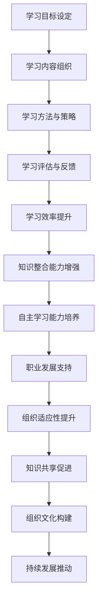
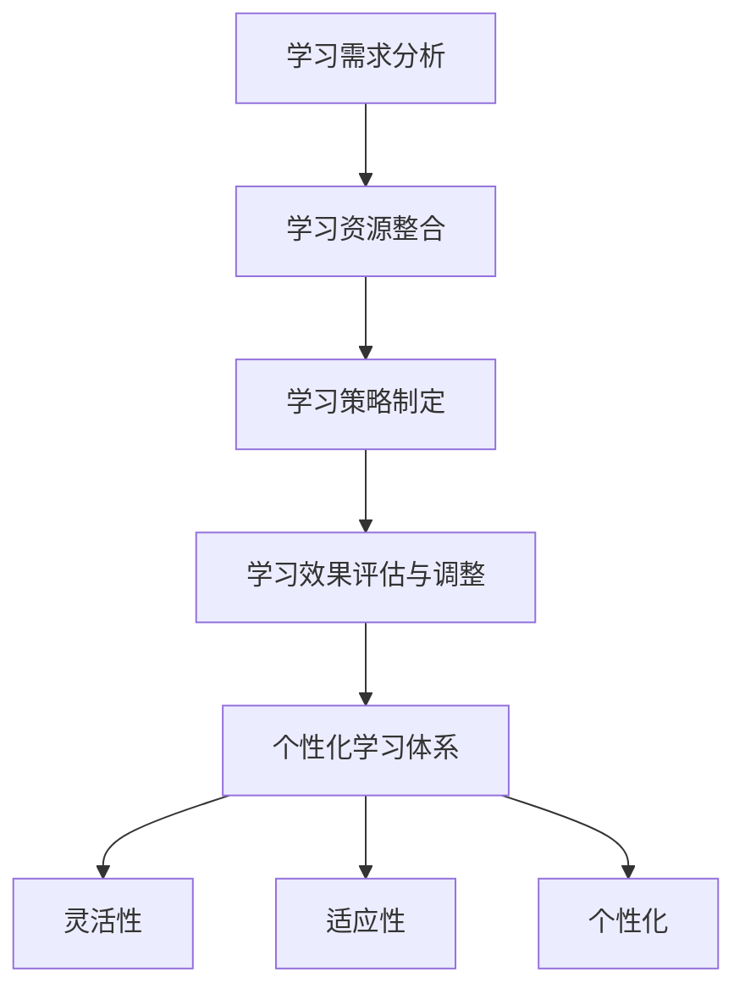
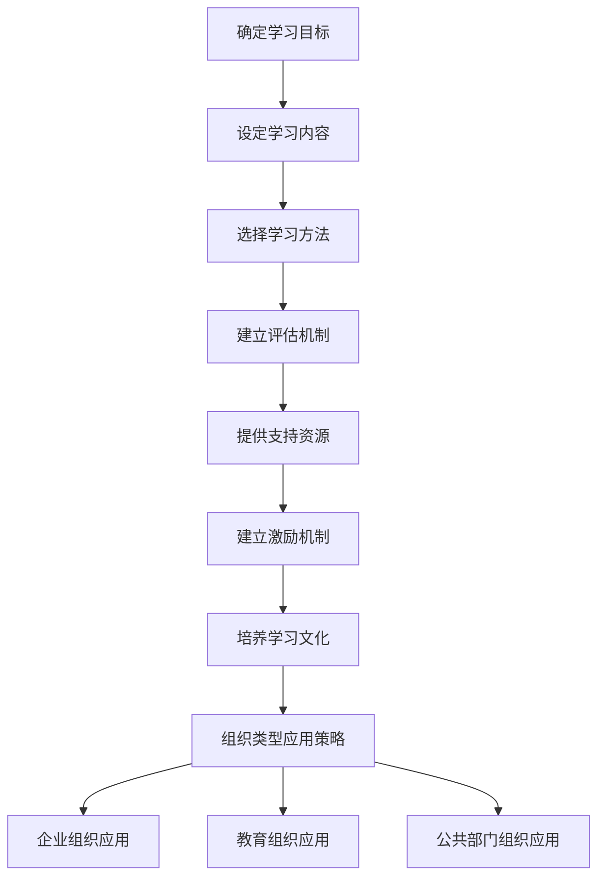

                 

### 引言

在当今快速发展的信息化时代，组织面临的挑战日益复杂，外部环境的变化速度超过了以往任何一个时期。为了在这种动态环境中保持竞争力，组织必须具备高度的学习和适应性能力。学习体系作为一种系统化的知识获取和运用方法，对提升组织的适应性和创新能力具有重要意义。

本文旨在探讨学习体系对组织适应性的提升作用，通过逐步分析学习体系的定义、作用、类型、设计与实施、在不同组织中的应用以及未来发展趋势等方面，全面阐述学习体系如何帮助组织应对外部环境的变化，推动组织持续发展。

本文的结构如下：

- **第一部分：学习体系概述**：介绍学习体系的定义与作用，传统与现代学习体系的比较，以及个性化学习体系的构建方法。
- **第二部分：学习体系对组织适应性的提升作用**：分析学习体系与组织适应性的关系，探讨学习体系在组织适应性提升中的应用。
- **第三部分：学习体系在组织创新中的应用**：探讨学习体系在组织创新中的作用和策略。
- **第四部分：学习体系在组织管理中的应用**：分析学习体系在组织管理中的作用和方法。
- **第五部分：学习体系在跨组织协作中的应用**：探讨学习体系在跨组织协作中的作用和策略。
- **第六部分：学习体系在组织文化构建中的应用**：分析学习体系在组织文化构建中的作用和策略。
- **第七部分：学习体系在组织可持续发展中的应用**：探讨学习体系在组织可持续发展中的作用和策略。
- **第八部分：学习体系与组织绩效的关系**：分析学习体系对组织绩效的影响和策略。
- **第九部分：学习体系在组织战略规划中的应用**：探讨学习体系在组织战略规划中的作用和策略。
- **第十部分：学习体系在不同组织类型中的应用比较**：比较学习体系在不同组织类型中的应用。
- **第十一部分：学习体系的未来发展趋势与挑战**：分析学习体系的未来发展趋势和面临的挑战。

通过本文的探讨，我们希望能够为组织管理者提供有益的参考，帮助他们在实际工作中更好地利用学习体系，提升组织的适应性和创新能力，实现可持续发展。

### 文章关键词

- 学习体系
- 组织适应性
- 组织创新
- 组织管理
- 跨组织协作
- 组织文化构建
- 组织可持续发展
- 组织绩效
- 组织战略规划

### 摘要

本文探讨了学习体系对组织适应性的提升作用。首先，我们介绍了学习体系的定义、作用、类型以及个性化学习体系的构建方法。接着，我们分析了学习体系与组织适应性的关系，探讨了学习体系在组织适应性提升中的应用。然后，我们分别从组织创新、组织管理、跨组织协作、组织文化构建、组织可持续发展、组织绩效以及组织战略规划等方面，深入探讨了学习体系在各个领域中的应用和作用。最后，我们分析了学习体系的未来发展趋势和面临的挑战，为组织管理者提供了有益的参考和指导。

### 第一部分: 学习体系概述

#### 第1章: 学习体系定义与作用

## 1.1 学习体系的定义

学习体系是指一套系统化的方法，用于指导个体或组织进行知识获取、整合和应用。它通常包括以下四个主要组成部分：

### 1.1.1 学习目标设定

学习目标设定是学习体系的基础，它明确了学习过程中要达成的目标。设定具体、可衡量的学习目标有助于提高学习效率，确保学习资源的合理配置，并有助于评估学习成果。

### 1.1.2 学习内容组织

学习内容组织涉及将学习目标分解为具体的知识点和技能点，并对其进行系统化、结构化的整理。通过合理组织学习内容，可以使学习过程更加有序，有助于知识的深度理解和掌握。

### 1.1.3 学习方法与策略

学习方法与策略是指为了实现学习目标，选择合适的工具和方法。这包括传统的课堂教学、在线学习、自主学习等多种方式。合理选择和运用学习方法与策略，可以提高学习效果，满足不同学习者的需求。

### 1.1.4 学习评估与反馈

学习评估与反馈是学习体系的重要组成部分。通过定期的学习评估，可以了解学习目标的达成情况，发现学习过程中的问题，并进行相应的调整和改进。有效的学习评估与反馈机制有助于持续优化学习体系。

## 1.2 学习体系的重要性

学习体系在个人发展、职业发展和组织管理中扮演着重要角色。以下是学习体系的重要性：

### 1.2.1 提升学习效率

通过系统化的学习目标设定、内容组织和评估机制，学习体系有助于提高学习效率。具体体现在以下几个方面：

1. **减少学习时间**：通过明确的学习目标和内容，学习者可以更有针对性地进行学习，避免时间的浪费。
2. **提高学习质量**：学习体系中的评估机制可以帮助学习者及时发现问题并加以改进，确保学习质量。
3. **提高学习兴趣**：个性化的学习策略和多样化的学习资源可以激发学习者的学习兴趣，提高学习动力。

### 1.2.2 增强知识整合能力

学习体系有助于学习者将新知识与已有知识进行整合，形成系统的知识框架。具体体现在以下几个方面：

1. **加强知识关联**：通过学习内容的系统化组织，学习者可以更好地理解不同知识点之间的联系，形成知识网络。
2. **提高知识应用能力**：通过将理论知识与实际应用相结合，学习者可以更有效地将所学知识应用于实际问题解决中。
3. **提升创新能力**：知识整合能力有助于激发学习者的创新思维，为个人和组织的持续发展提供动力。

### 1.2.3 培养自主学习能力

学习体系不仅关注知识的传递，更注重培养学习者的自主学习能力。具体体现在以下几个方面：

1. **提高自我规划能力**：通过设定学习目标和制定学习计划，学习者可以更好地管理自己的学习时间和进度。
2. **培养问题解决能力**：学习体系中的评估与反馈机制可以帮助学习者及时识别问题，并通过自主学习来解决问题。
3. **增强自我驱动能力**：个性化的学习策略和多样化的学习资源可以激发学习者的内在动机，培养自我驱动能力。

## 1.3 学习体系在个人发展中的作用

学习体系在个人发展中具有重要作用，它不仅有助于提升学习效率和能力，还能为个人的职业发展提供坚实的基础。

### 1.3.1 提升学习效率

学习体系通过以下方式提升个人学习效率：

1. **明确学习目标**：学习体系帮助个人明确学习目标，使学习更有针对性和目的性。
2. **系统化学习内容**：学习体系将学习内容进行系统化组织，有助于个人更好地理解和掌握知识。
3. **科学评估与反馈**：学习体系中的评估与反馈机制可以帮助个人及时了解学习成果，发现并改进学习中的问题。

### 1.3.2 增强知识整合能力

学习体系在增强个人知识整合能力方面具有以下作用：

1. **构建知识网络**：通过学习体系的系统化组织，个人可以更好地理解和掌握不同知识点之间的联系，形成知识网络。
2. **提高知识应用能力**：学习体系有助于个人将所学知识应用于实际问题解决中，提高知识的应用能力。
3. **促进创新能力**：知识整合能力有助于激发个人的创新思维，为个人的职业发展提供新的思路和方法。

### 1.3.3 培养自主学习能力

学习体系在培养个人自主学习能力方面具有以下作用：

1. **自我规划学习**：学习体系帮助个人制定学习计划，合理安排学习时间和进度，提高自我管理能力。
2. **培养问题解决能力**：学习体系中的评估与反馈机制可以帮助个人及时识别问题，并通过自主学习来解决问题。
3. **增强自我驱动能力**：个性化的学习策略和多样化的学习资源可以激发个人的内在动机，培养自我驱动能力。

### 1.3.4 学习体系在职业规划中的应用

学习体系在个人职业规划中具有重要作用，它可以帮助个人：

1. **明确职业目标**：通过设定学习目标，个人可以更好地了解自己的职业发展方向和目标。
2. **提升职业能力**：学习体系通过提升学习效率、增强知识整合能力和培养自主学习能力，有助于个人提升职业能力。
3. **实现职业发展**：通过学习体系，个人可以不断更新知识和技能，适应职业发展的需求，实现职业生涯的持续发展。

## 1.4 学习体系与职业发展的关系

学习体系与职业发展密切相关，它不仅影响个人的职业能力，还关系到个人在职场中的竞争力和职业成长。

### 1.4.1 学习体系对职业能力的影响

学习体系通过以下几个方面影响个人的职业能力：

1. **提升专业知识**：学习体系帮助个人系统化地学习专业知识，提高专业素养。
2. **增强实践能力**：学习体系中的实践环节有助于个人将理论知识应用于实际工作中，提高实践能力。
3. **提升创新能力**：学习体系鼓励个人进行知识整合和创新，提高创新能力，为职业发展提供新动力。

### 1.4.2 学习体系在职业规划中的应用

学习体系在职业规划中的应用包括以下几个方面：

1. **明确职业方向**：通过学习体系的系统学习和评估，个人可以更好地了解自己的职业兴趣和优势，明确职业方向。
2. **制定学习计划**：学习体系帮助个人制定长期和短期的学习计划，为实现职业目标提供具体行动指南。
3. **提升职业竞争力**：通过不断学习和提升能力，个人可以增强在职场中的竞争力，实现职业成长。

### 1.4.3 学习体系对职业竞争力的提升

学习体系对个人职业竞争力的提升具有重要作用，具体体现在以下几个方面：

1. **知识更新**：学习体系帮助个人不断更新知识和技能，保持与行业发展的同步。
2. **技能提升**：通过系统学习和实践，个人可以不断提升专业技能和实践能力。
3. **创新能力**：学习体系鼓励个人进行知识整合和创新，提高创新能力，为职业发展提供新动力。

## 1.5 学习体系在组织中的应用

学习体系不仅在个人发展中起到重要作用，还在组织中发挥着关键作用。以下是学习体系在组织中的应用及其对组织适应性提升的影响：

### 1.5.1 提升组织学习能力

学习体系有助于组织建立持续学习机制，提升整体学习能力。具体体现在以下几个方面：

1. **知识更新**：通过学习体系，组织可以及时获取和更新前沿知识，保持与行业发展的同步。
2. **知识整合**：学习体系鼓励组织成员进行知识整合和创新，提高整体知识水平。
3. **知识共享**：学习体系中的评估和反馈机制有助于组织成员之间分享知识和经验，促进知识共享。

### 1.5.2 增强组织适应能力

学习体系有助于组织提升适应外部环境变化的能力。具体体现在以下几个方面：

1. **动态调整**：学习体系鼓励组织根据外部环境变化进行动态调整，以应对不确定性。
2. **创新能力**：通过学习体系，组织可以不断激发创新思维，推动组织创新发展。
3. **灵活应变**：学习体系帮助组织培养灵活应变的能力，提高对突发事件的应对能力。

### 1.5.3 促进组织知识共享

学习体系有助于组织促进知识共享，提高整体协作效率。具体体现在以下几个方面：

1. **内部沟通**：学习体系中的交流和互动机制有助于组织成员之间进行有效的沟通和合作。
2. **知识积累**：通过学习体系，组织可以积累宝贵的知识和经验，为后续发展提供支持。
3. **共享平台**：学习体系中的共享平台可以帮助组织成员方便地获取和共享知识和资源。

## 1.6 学习体系在组织文化构建中的作用

学习体系不仅对组织的适应性和学习能力产生影响，还对组织文化的构建起到重要作用。具体体现在以下几个方面：

1. **共同价值观**：通过学习体系，组织可以培养共同的价值观和使命，增强组织凝聚力。
2. **持续发展**：学习体系鼓励组织成员持续学习和成长，推动组织的可持续发展。
3. **创新氛围**：学习体系促进组织创新思维和创新文化的形成，激发组织创新活力。

### 总结

学习体系作为一种系统化的知识获取和运用方法，在个人发展和组织管理中具有重要地位。通过明确学习目标、系统化学习内容、选择合适的学习方法和进行有效的评估与反馈，学习体系有助于提升学习效率、增强知识整合能力和培养自主学习能力。此外，学习体系在职业规划、组织适应性和知识共享等方面也具有重要作用。在未来的发展中，学习体系将继续发挥关键作用，助力个人和组织实现持续发展。

---

在撰写这一章节的过程中，我们首先明确了学习体系的定义和组成部分，详细阐述了学习体系在个人发展中的作用，并分析了学习体系与职业发展的关系。接着，我们讨论了学习体系在组织中的应用，包括提升组织学习能力和适应能力，促进知识共享以及构建组织文化等方面。通过这一系列分析，我们展示了学习体系在提升个人和组织发展中的重要性。

为了更好地理解学习体系的核心概念和架构，我们使用Mermaid流程图展示了学习体系的组成部分和相互关系。以下是一个简化的Mermaid流程图示例：

通过这一流程图，我们可以直观地看到学习体系各个组成部分之间的逻辑关系和作用。

接下来，我们将进一步探讨不同类型的学习体系，以及它们的特点和优势。这将帮助我们更深入地理解学习体系的多样性，并为实际应用提供更多的参考。

#### 第2章: 不同类型的学习体系

## 2.1 传统学习体系

传统学习体系通常是指在工业化时期形成并广泛应用的教育和学习模式。这种体系以教师为中心，注重知识的传授和灌输，强调规范化和标准化。以下是传统学习体系的主要特点：

### 2.1.1 传统学习体系的特点

1. **以教师为中心**：传统学习体系强调教师的角色，教师是知识的传递者，学生是知识的接受者。教学过程主要依赖于教师的讲解和授课，学生的主动性受到限制。
2. **知识传授为主**：传统学习体系的主要目标是向学生传授知识，注重知识体系的完整性和系统性。教学过程中，教师会详细讲解知识点，学生通过记忆和理解来掌握知识。
3. **忽视学生主动性**：在传统学习体系中，学生通常需要按照固定的教学计划和内容进行学习，缺乏主动探索和自主学习的空间。学生的学习行为主要依赖于教师的引导和安排。

### 2.1.2 传统学习体系的局限性

尽管传统学习体系在历史上发挥了重要作用，但随着时代的发展，其局限性也逐渐显现出来：

1. **效率低下**：传统学习体系强调知识的系统性，但在实际教学中，学生往往需要花费大量时间来记忆和重复练习，学习效率较低。
2. **知识老化**：传统学习体系的知识更新速度较慢，难以跟上快速变化的科技和社会环境，导致学生掌握的知识可能与实际应用脱节。
3. **缺乏个性化**：传统学习体系通常采用统一的教学方法和内容，无法充分考虑学生的个体差异和兴趣，难以满足个性化学习需求。

## 2.2 现代学习体系

随着信息技术的快速发展，现代学习体系逐渐取代了传统学习体系。现代学习体系更加注重学生的主体地位，强调互动性、个性化和实践性。以下是现代学习体系的主要特点：

### 2.2.1 现代学习体系的发展历程

1. **20世纪80年代：建构主义**：建构主义学习理论强调学习是学习者主动建构知识的过程，教师的作用是引导和帮助学习者。这一理论推动了教育改革，对现代学习体系的发展产生了深远影响。
2. **20世纪90年代：以学生为中心**：随着信息技术的普及，学习方式逐渐从以教师为中心转变为以学生为中心。学生可以通过多种渠道获取知识，学习方式更加灵活和多样化。
3. **21世纪初：混合学习、在线学习**：随着互联网和信息技术的发展，混合学习和在线学习成为现代学习体系的重要组成部分。这些新的学习方式为学生提供了更多的学习资源和机会。

### 2.2.2 现代学习体系的核心要素

1. **学生主动性**：现代学习体系强调学生的主体地位，鼓励学生主动参与学习过程。学生通过自主探究、合作学习等方式，实现知识的主动建构。
2. **互动性**：现代学习体系注重学习者之间的互动和交流，通过讨论、合作、实践等方式，促进知识的深度理解和应用。
3. **个性化**：现代学习体系充分考虑学生的个体差异，提供个性化的学习内容和方式，满足不同学生的学习需求。
4. **实践性**：现代学习体系强调理论与实践相结合，通过实际操作和项目实践，提高学生的实践能力和创新意识。

### 2.2.3 现代学习体系的优势

1. **提升学习效果**：现代学习体系通过互动性、个性化和实践性，提高学生的学习积极性和参与度，从而提升学习效果。
2. **增强学习兴趣**：现代学习体系注重学生的兴趣和需求，提供多样化的学习资源和方式，激发学生的学习兴趣。
3. **促进全面发展**：现代学习体系不仅关注知识的传授，还注重培养学生的思维能力、创新能力和社会责任感，促进学生的全面发展。

## 2.3 个性化学习体系

个性化学习体系是现代学习体系的一种重要形式，它根据学生的个体差异，提供定制化的学习方案和资源，以实现最佳的学习效果。以下是个性化学习体系的特点和构建方法：

### 2.3.1 个性化学习体系的特点

1. **灵活性**：个性化学习体系允许学生根据自己的需求和兴趣选择学习内容和学习方式，具有很高的灵活性。
2. **适应性**：个性化学习体系能够根据学生的学习进度和特点，动态调整学习目标和内容，确保学习过程与学生的实际需求相匹配。
3. **个性化**：个性化学习体系充分考虑学生的个体差异，提供个性化的学习方案和资源，满足不同学生的需求。

### 2.3.2 个性化学习体系的构建方法

1. **学习需求分析**：首先，需要对学生的学习需求进行深入分析，包括知识背景、学习兴趣、学习目标等，以确定个性化的学习方案。
2. **学习资源整合**：根据学生的学习需求，整合各种学习资源，包括教材、网络资源、实践项目等，为学生提供丰富的学习素材。
3. **学习策略制定**：根据学生的学习需求和资源，制定个性化的学习策略，包括学习计划、学习方法、学习评价等。
4. **学习效果评估与调整**：通过定期的学习效果评估，了解学生的学习进展和效果，及时调整学习目标和策略，确保学习目标的实现。

### 2.3.3 个性化学习体系的优势

1. **提高学习效率**：个性化学习体系能够根据学生的实际情况，提供有针对性的学习资源和策略，提高学习效率。
2. **增强学习兴趣**：个性化学习体系考虑学生的兴趣和需求，提供有趣的学习内容和方式，增强学生的学习兴趣。
3. **促进全面发展**：个性化学习体系不仅关注知识的传授，还注重培养学生的思维能力、创新能力和社会责任感，促进学生的全面发展。

通过以上对传统学习体系和现代学习体系的比较，我们可以看出，现代学习体系在灵活性、适应性、个性化等方面具有显著优势，能够更好地满足学生的学习需求，提高学习效果。而个性化学习体系作为现代学习体系的一种重要形式，更是体现了现代教育的理念和发展方向。

在接下来的章节中，我们将进一步探讨个性化学习体系的构建方法，以及学习体系在组织中的应用，以期为实际应用提供更加具体的指导。

#### 第3章: 构建个性化学习体系

## 3.1 个性化学习体系的概念

个性化学习体系是一种根据学习者个体差异，为其提供定制化学习方案和资源的系统。这种体系旨在通过满足每个学习者的独特需求，提高学习效果和兴趣，促进全面发展。以下是构建个性化学习体系所需考虑的关键要素：

### 3.1.1 学习需求分析

学习需求分析是构建个性化学习体系的第一步，它涉及到对学习者背景、兴趣、学习能力等方面的全面了解。具体步骤如下：

1. **背景调查**：通过问卷、访谈等方式，收集学习者的个人信息、学习经历和兴趣偏好等数据。
2. **能力评估**：采用标准化测试或非标准化测试，评估学习者的基础知识水平和技能掌握情况。
3. **兴趣探索**：了解学习者的兴趣领域和职业规划，以便为其提供符合兴趣方向的学习内容。

### 3.1.2 学习资源整合

学习资源的整合是构建个性化学习体系的关键环节，它包括以下几个方面：

1. **教材与资料**：根据学习者的兴趣和能力，选择合适的教材和辅助资料，确保学习内容的丰富性和实用性。
2. **网络资源**：利用互联网资源，如在线课程、学术论文、行业报告等，为学习者提供多样化的学习素材。
3. **实践项目**：设计实际操作项目，让学习者在真实环境中应用所学知识，提高实践能力。

### 3.1.3 学习策略制定

学习策略的制定是确保个性化学习体系有效实施的重要环节，它需要根据学习者的特点和需求，制定具体的学习方法和步骤。以下是学习策略制定的主要步骤：

1. **目标设定**：根据学习者的兴趣和能力，明确短期和长期的学习目标，确保学习目标的可行性和可衡量性。
2. **计划安排**：制定详细的学习计划，包括学习时间、学习内容、学习方法等，确保学习过程的系统性和有序性。
3. **方法选择**：根据学习目标和学习者的特点，选择合适的学习方法，如自主学习、合作学习、探究学习等。

### 3.1.4 学习效果评估与调整

学习效果评估是构建个性化学习体系的反馈环节，它通过定期评估学习者的学习成果，了解学习体系的有效性，并进行必要的调整和优化。以下是学习效果评估与调整的主要步骤：

1. **评估指标**：确定评估指标，如知识掌握程度、技能应用能力、学习兴趣等，确保评估的全面性和客观性。
2. **定期评估**：通过考试、作业、项目汇报等方式，定期评估学习者的学习成果，收集反馈信息。
3. **调整方案**：根据评估结果，调整学习目标和策略，确保学习过程与学习者的实际需求相匹配。

### 3.1.5 个性化学习体系的特点

个性化学习体系具有以下几个显著特点：

1. **灵活性**：个性化学习体系允许学习者根据自己的需求和兴趣，灵活选择学习内容和方式。
2. **适应性**：个性化学习体系能够根据学习者的特点和进度，动态调整学习目标和策略。
3. **个性化**：个性化学习体系充分考虑学习者的个体差异，提供定制化的学习方案和资源。

### 3.1.6 个性化学习体系的优势

个性化学习体系具有以下优势：

1. **提高学习效率**：通过定制化的学习内容和策略，个性化学习体系能够更有效地满足学习者的需求，提高学习效率。
2. **增强学习兴趣**：个性化学习体系注重学习者的兴趣和需求，提供有趣的学习内容和方式，增强学习兴趣。
3. **促进全面发展**：个性化学习体系不仅关注知识的传授，还注重培养学习者的思维能力、创新能力和社会责任感，促进全面发展。

通过以上对个性化学习体系的定义、关键要素和特点的详细阐述，我们可以看到，个性化学习体系在满足学习者需求、提高学习效果和促进全面发展方面具有显著优势。在接下来的章节中，我们将进一步探讨个性化学习体系在实际应用中的具体方法和策略。

---

为了更好地理解个性化学习体系的概念和构建方法，我们使用Mermaid流程图展示了其关键组成部分和相互关系。以下是一个简化的Mermaid流程图示例：

通过这一流程图，我们可以清晰地看到个性化学习体系的各个组成部分及其相互关系，有助于读者更好地理解个性化学习体系的运作机制。

接下来，我们将进一步探讨个性化学习体系在组织中的应用，分析其在提升组织适应性和创新能力方面的作用，以及在不同组织类型中的具体实施策略。

#### 第4章: 学习体系在组织中的应用

## 4.1 学习体系在组织中的作用

学习体系在组织中的应用具有重要作用，它不仅能够提升组织的整体学习能力，还能够增强组织的适应能力和创新能力，从而推动组织的持续发展。以下是学习体系在组织中的主要作用：

### 4.1.1 提升组织学习能力

学习体系有助于组织建立持续学习机制，提升整体学习能力。具体体现在以下几个方面：

1. **知识更新**：通过学习体系，组织可以及时获取和更新前沿知识，保持与行业发展的同步。
2. **知识整合**：学习体系鼓励组织成员进行知识整合和创新，提高整体知识水平。
3. **知识共享**：学习体系中的评估和反馈机制有助于组织成员之间分享知识和经验，促进知识共享。

### 4.1.2 增强组织适应能力

学习体系有助于组织提升适应外部环境变化的能力。具体体现在以下几个方面：

1. **动态调整**：学习体系鼓励组织根据外部环境变化进行动态调整，以应对不确定性。
2. **创新能力**：通过学习体系，组织可以不断激发创新思维，推动组织创新发展。
3. **灵活应变**：学习体系帮助组织培养灵活应变的能力，提高对突发事件的应对能力。

### 4.1.3 促进组织知识共享

学习体系有助于组织促进知识共享，提高整体协作效率。具体体现在以下几个方面：

1. **内部沟通**：学习体系中的交流和互动机制有助于组织成员之间进行有效的沟通和合作。
2. **知识积累**：通过学习体系，组织可以积累宝贵的知识和经验，为后续发展提供支持。
3. **共享平台**：学习体系中的共享平台可以帮助组织成员方便地获取和共享知识和资源。

## 4.2 学习体系在组织构建策略

为了有效实施学习体系，组织需要制定科学的构建策略，确保学习体系的顺利实施和效果。以下是构建组织学习体系的几个关键步骤：

### 4.2.1 确定学习目标

首先，组织需要明确学习目标，这包括长期目标和短期目标。长期目标可以是提升组织整体学习能力、增强组织适应能力和创新能力等；短期目标则可以是对某个特定领域或项目的知识更新和技能提升。

### 4.2.2 设定学习内容

根据学习目标，组织需要确定学习内容。学习内容应该涵盖组织的核心业务领域、前沿技术和发展趋势。同时，学习内容应该具有系统性和实用性，确保能够满足组织成员的学习需求。

### 4.2.3 选择学习方法

组织需要根据学习目标和内容，选择合适的学习方法。常见的学习方法包括自学、在线学习、集中培训、研讨会和实地考察等。不同的学习方法可以满足不同的学习需求，组织应该根据实际情况进行选择和组合。

### 4.2.4 建立评估机制

建立有效的评估机制是确保学习体系效果的关键。组织需要制定评估指标，对学习过程和学习成果进行定期评估。评估结果可以用于反馈和改进学习体系，确保学习目标的实现。

### 4.2.5 提供支持资源

为了支持学习体系的实施，组织需要提供必要的资源，包括学习资料、培训设备、网络平台和人力资源等。充足的资源可以保证学习过程的顺利进行，提高学习效果。

### 4.2.6 建立激励机制

建立激励机制是促进组织成员积极参与学习的重要手段。组织可以通过奖励、晋升、培训机会等方式，激励成员努力学习，提升个人和组织的整体能力。

### 4.2.7 培养学习文化

学习体系的有效实施需要组织内部形成良好的学习文化。组织需要鼓励成员积极学习、分享知识和经验，建立互相尊重和学习的氛围。通过培养学习文化，组织可以持续提升学习效果和创新能力。

## 4.3 学习体系在不同组织类型中的应用

学习体系在不同类型的组织中具有不同的应用特点，以下分别介绍在企业组织、教育组织和公共部门组织中的应用：

### 4.3.1 企业组织中的应用

在企业组织中，学习体系主要用于提升员工的职业能力和创新能力。企业可以通过以下策略实施学习体系：

1. **员工培训**：定期组织员工培训，提升员工的专业技能和业务能力。
2. **在线学习**：利用在线学习平台，提供灵活的学习资源和课程，方便员工自主学习。
3. **导师制度**：通过导师制度，帮助新员工快速融入企业，提升他们的业务能力。
4. **项目学习**：将学习融入项目实践中，通过实际项目提升员工的解决问题能力和创新思维。

### 4.3.2 教育组织中的应用

在教育组织中，学习体系主要用于提升学生的学习效果和创新能力。教育组织可以通过以下策略实施学习体系：

1. **课程改革**：根据学生需求和社会发展，不断更新和优化课程内容，确保课程的前沿性和实用性。
2. **个性化教学**：根据学生的特点和需求，提供个性化的学习方案和资源，促进学生的全面发展。
3. **教师培训**：定期组织教师培训，提升教师的教学能力和教育水平。
4. **教育技术**：利用现代教育技术，如在线教学、虚拟实验室等，提高教学效果和学生学习体验。

### 4.3.3 公共部门组织中的应用

在公共部门组织中，学习体系主要用于提升员工的公共服务能力和管理能力。公共部门组织可以通过以下策略实施学习体系：

1. **政策培训**：定期组织政策培训，提升员工对政策法规的理解和执行能力。
2. **管理培训**：通过管理培训，提升员工的管理能力和领导力。
3. **公共参与**：通过公开课、研讨会等形式，增强公众对公共服务的了解和参与。
4. **数据驱动**：利用数据分析，优化公共服务流程，提高服务效率和质量。

通过以上对学习体系在组织中的应用策略的详细阐述，我们可以看到，学习体系在提升组织学习能力、增强组织适应能力和促进组织知识共享方面具有重要作用。在接下来的章节中，我们将进一步探讨学习体系在组织创新、组织管理、跨组织协作、组织文化构建、组织可持续发展、组织绩效以及组织战略规划中的应用，以期为组织管理者提供更加具体的指导。

---

为了更好地理解学习体系在组织中的应用策略，我们使用Mermaid流程图展示了其关键步骤和相互关系。以下是一个简化的Mermaid流程图示例：

通过这一流程图，我们可以清晰地看到学习体系在组织中的应用步骤及其相互关系，有助于读者更好地理解和实施学习体系。

接下来，我们将进一步探讨学习体系在组织创新、组织管理、跨组织协作、组织文化构建、组织可持续发展、组织绩效以及组织战略规划中的应用，以期为组织管理者提供更加全面的指导。

### 第5章: 学习体系在组织创新中的应用

## 5.1 组织创新的概念与类型

组织创新是指组织在经营活动中，通过引入新技术、新理念、新方法等方式，实现产品、服务、管理、流程等方面的改进和创新。组织创新可以分为以下几种类型：

### 5.1.1 产品创新

产品创新是指组织通过研发新技术、新产品或改进现有产品，满足市场需求和客户需求。产品创新可以提升组织的市场竞争力和客户满意度。

### 5.1.2 服务创新

服务创新是指组织通过改进服务流程、服务模式、服务体验等，提升服务的质量和效率。服务创新可以提升组织的客户忠诚度和市场竞争力。

### 5.1.3 管理创新

管理创新是指组织通过引入新的管理理念、管理模式、管理制度等，提升组织的管理效率和管理水平。管理创新可以优化组织的资源配置和运营效率。

### 5.1.4 流程创新

流程创新是指组织通过改进业务流程、工作流程、供应链流程等，提升组织的运营效率和响应速度。流程创新可以降低组织的运营成本和风险。

## 5.2 学习体系在组织创新中的作用

学习体系在组织创新中扮演着关键角色，它不仅为组织提供了创新的动力，还提供了创新的思路和方法。以下是学习体系在组织创新中的作用：

### 5.2.1 提供创新资源

学习体系通过不断引入新的知识和信息，为组织提供了丰富的创新资源。这些资源包括最新的科研成果、行业趋势、市场动态等，有助于组织发现和把握创新机会。

### 5.2.2 激发创新思维

学习体系鼓励组织成员主动学习、思考和实践，激发创新思维。通过学习，组织成员可以接触到不同的观点和方法，形成跨领域的思维，从而产生新的创新思路。

### 5.2.3 培养创新能力

学习体系通过系统的学习和实践，培养组织成员的创新能力。组织成员可以通过学习掌握新技术、新方法，提高解决实际问题的能力，从而实现组织创新。

### 5.2.4 促进知识共享

学习体系中的知识共享机制有助于组织成员之间交流和分享创新经验，促进知识的传播和整合。知识共享可以激发更多的创新想法，推动组织创新的发展。

## 5.3 学习体系在组织创新中的策略

为了有效利用学习体系推动组织创新，组织需要制定一系列创新策略。以下是学习体系在组织创新中的几个关键策略：

### 5.3.1 建立创新文化

组织需要建立鼓励创新的文化，营造积极向上的创新氛围。这包括鼓励组织成员提出创新想法、支持创新实践、奖励创新成果等，激发组织成员的创新热情。

### 5.3.2 设立创新激励机制

组织需要设立创新激励机制，鼓励组织成员积极参与创新活动。激励机制可以包括奖金、晋升机会、荣誉称号等，以激发组织成员的创新动力。

### 5.3.3 加强学习资源建设

组织需要加强学习资源建设，提供丰富的学习资源和平台。这包括建立图书馆、在线学习平台、专业培训课程等，为组织成员提供多样化的学习资源。

### 5.3.4 推动跨部门合作

组织需要推动跨部门合作，促进不同部门之间的知识共享和交流。通过跨部门合作，组织可以整合不同部门的知识和资源，实现协同创新。

### 5.3.5 建立创新项目机制

组织需要建立创新项目机制，鼓励组织成员参与创新项目。创新项目机制可以包括项目申请、项目评审、项目执行和项目评估等环节，确保创新项目的顺利进行。

### 5.3.6 培养创新人才

组织需要培养创新人才，提高组织整体创新能力。这包括选拔和培养具有创新精神和技术能力的人才，为组织创新提供人力支持。

## 5.4 学习体系在组织创新实践中的应用案例

### 5.4.1 企业案例：谷歌的“20%时间项目”

谷歌通过实施“20%时间项目”，鼓励员工利用20%的工作时间进行自由探索和创新。这一策略取得了显著成果，如Gmail和Google News等创新产品就诞生于这一项目。谷歌的成功经验表明，学习体系在组织创新中的应用可以激发员工的创造力，推动组织创新。

### 5.4.2 教育案例：哈佛大学的“创新挑战项目”

哈佛大学通过实施“创新挑战项目”，鼓励学生和教师提出创新教育项目。该项目旨在通过创新教育模式和方法，提升教育质量和学生创新能力。项目实施过程中，哈佛大学充分利用学习体系，提供丰富的学习资源和平台，推动教育创新。

### 5.4.3 公共部门案例：新加坡政府的“智慧国家2025”计划

新加坡政府通过实施“智慧国家2025”计划，推动国家数字化转型和创新发展。该计划涉及多个领域，如电子政务、智能交通、健康科技等。新加坡政府通过学习体系，不断引入新的技术和管理理念，推动公共部门的创新和发展。

通过以上案例，我们可以看到，学习体系在组织创新中的应用具有广泛的前景和巨大的潜力。在未来的发展中，组织应继续加强学习体系的建设，推动组织创新，实现可持续发展。

### 第6章: 学习体系在组织管理中的应用

## 6.1 组织管理的概念与类型

组织管理是指通过计划、组织、领导和控制等手段，有效配置和利用组织资源，实现组织目标的过程。组织管理可以分为以下几种类型：

### 6.1.1 传统管理

传统管理强调以任务为导向，通过严格的管理制度和流程，确保组织目标的实现。传统管理的主要特点是规范化和标准化。

### 6.1.2 现代管理

现代管理强调以人为中心，注重员工的参与和团队合作，通过创新和灵活的管理方法，提高组织的适应能力和创新能力。

### 6.1.3 战略管理

战略管理是指组织根据外部环境和内部资源，制定长期目标和战略规划，并通过实施和调整战略，实现组织目标的过程。

### 6.1.4 精细化管理

精细化管理是指通过精细化的管理手段和方法，对组织的各个环节进行深入分析和优化，提高组织的管理效率和运营效率。

## 6.2 学习体系在组织管理中的作用

学习体系在组织管理中具有重要作用，它不仅有助于提升组织管理水平，还能够推动组织的持续发展。以下是学习体系在组织管理中的作用：

### 6.2.1 提升管理效率

学习体系通过系统化的学习内容和评估机制，提高组织成员的管理技能和知识水平，从而提升管理效率。具体体现在以下几个方面：

1. **知识更新**：学习体系可以帮助组织成员及时了解行业前沿和管理理论，更新知识体系。
2. **技能提升**：通过学习，组织成员可以掌握新的管理工具和方法，提高管理技能。
3. **问题解决**：学习体系中的评估和反馈机制有助于组织成员发现和解决问题，提高管理效率。

### 6.2.2 增强管理能力

学习体系不仅关注知识的传授，还注重培养组织成员的管理能力和领导力。通过学习，组织成员可以：

1. **提升决策能力**：学习体系帮助组织成员掌握科学的决策方法和工具，提高决策能力。
2. **培养团队合作精神**：学习体系鼓励组织成员进行合作学习和交流，培养团队合作精神。
3. **提升创新能力**：通过学习，组织成员可以激发创新思维，提升创新能力。

### 6.2.3 促进管理创新

学习体系为组织提供了丰富的创新资源和方法，有助于推动管理创新。通过学习，组织成员可以：

1. **引入新理念**：学习体系可以帮助组织成员引入新的管理理念和方法，推动管理创新。
2. **优化管理流程**：通过学习，组织成员可以优化现有的管理流程和制度，提高管理效率。
3. **提升组织竞争力**：管理创新有助于提升组织的市场竞争力，推动组织的可持续发展。

### 6.2.4 加强团队协作

学习体系通过促进知识共享和交流，加强团队协作。具体体现在以下几个方面：

1. **知识共享**：学习体系中的评估和反馈机制有助于组织成员之间分享知识和经验，促进知识共享。
2. **团队合作**：学习体系鼓励组织成员进行合作学习和交流，培养团队合作精神。
3. **提高团队绩效**：通过学习，组织成员可以更好地理解团队目标和任务，提高团队绩效。

### 6.2.5 优化组织结构

学习体系可以帮助组织优化组织结构，提高组织的灵活性和适应性。通过学习，组织成员可以：

1. **调整组织架构**：学习体系可以帮助组织根据外部环境和内部资源调整组织架构，提高组织效率。
2. **优化资源配置**：学习体系有助于组织优化资源配置，提高资源利用效率。
3. **提升组织效能**：通过优化组织结构和资源配置，组织可以更好地实现目标，提升组织效能。

## 6.3 学习体系在组织管理实践中的应用策略

为了充分发挥学习体系在组织管理中的作用，组织需要制定一系列应用策略。以下是学习体系在组织管理实践中的应用策略：

### 6.3.1 制定学习计划

组织需要根据管理目标和需求，制定系统的学习计划。学习计划应包括学习目标、学习内容、学习方法、学习时间等，确保学习过程的有序和有效。

### 6.3.2 提供学习资源

组织需要提供丰富的学习资源，包括书籍、课程、网络资源、培训设备等，满足组织成员的学习需求。同时，组织应建立学习资源库，方便成员随时获取和利用学习资源。

### 6.3.3 建立评估机制

组织需要建立评估机制，对学习过程和学习成果进行定期评估。评估结果可以用于反馈和改进学习体系，确保学习目标的实现。

### 6.3.4 创造学习环境

组织需要创造良好的学习环境，包括物理环境和心理环境。物理环境应具备良好的学习设施和条件，心理环境应营造积极向上的学习氛围，鼓励成员主动学习。

### 6.3.5 建立激励机制

组织需要建立激励机制，鼓励成员积极参与学习和培训。激励机制可以包括奖励、晋升、培训机会等，激发成员的学习动力。

### 6.3.6 培养学习文化

组织需要培养学习文化，鼓励成员主动学习、分享知识和经验。通过培养学习文化，组织可以形成良好的学习氛围，提高整体管理水平。

通过以上应用策略，组织可以充分发挥学习体系在组织管理中的作用，提升管理水平，推动组织持续发展。

### 第7章: 学习体系在跨组织协作中的应用

## 7.1 跨组织协作的概念与意义

跨组织协作是指不同组织之间为了实现共同目标或解决共同问题，通过共享资源、知识和信息，共同开展合作的过程。跨组织协作的意义主要体现在以下几个方面：

### 7.1.1 提升资源利用效率

跨组织协作可以整合不同组织的资源，实现资源的优化配置和最大化利用。通过共享资源，如资金、设备、技术和人力资源，跨组织协作可以降低单个组织的成本，提高整体资源利用效率。

### 7.1.2 促进知识共享与整合

跨组织协作有助于不同组织之间的知识共享和整合。通过交流和合作，组织可以获取其他组织的经验和教训，借鉴成功的实践和方法，提升自身的知识水平和创新能力。

### 7.1.3 增强组织竞争力

跨组织协作可以帮助组织在更广泛的领域和更大的规模上发挥作用，提升组织的竞争力和影响力。通过合作，组织可以拓展市场，开拓新业务，实现资源共享和优势互补。

### 7.1.4 促进社会和谐发展

跨组织协作不仅有助于组织自身的发展，还可以促进社会的和谐与稳定。通过合作，组织可以共同应对社会问题，如环境保护、公益事业等，实现社会资源的合理分配和利用。

## 7.2 学习体系在跨组织协作中的作用

学习体系在跨组织协作中发挥着重要作用，它不仅为协作提供了知识和技术支持，还促进了协作的顺利进行。以下是学习体系在跨组织协作中的作用：

### 7.2.1 提升协作效率

学习体系通过系统化的学习内容和评估机制，提升组织成员的协作效率。通过学习，成员可以掌握协作所需的知识和技能，提高协作的针对性和有效性。

### 7.2.2 促进知识共享

学习体系中的知识共享机制有助于跨组织协作中的知识传播和整合。通过学习，组织成员可以分享经验和教训，借鉴成功的实践和方法，促进知识在组织间的传递和融合。

### 7.2.3 增强协作能力

学习体系通过培养组织成员的协作能力和团队意识，增强跨组织协作的凝聚力。通过学习，成员可以更好地理解协作目标和任务，提高协作的主动性和积极性。

### 7.2.4 提升协作效果

学习体系通过评估和反馈机制，提升跨组织协作的效果。通过评估协作过程和成果，组织可以及时发现问题并进行改进，确保协作目标的实现。

## 7.3 学习体系在跨组织协作实践中的应用策略

为了充分发挥学习体系在跨组织协作中的作用，组织需要制定一系列应用策略。以下是学习体系在跨组织协作实践中的应用策略：

### 7.3.1 明确协作目标

在跨组织协作中，组织需要明确协作目标，确保各方目标一致。通过制定明确的协作目标，组织可以更好地协调各方资源，提高协作效率。

### 7.3.2 建立协作机制

组织需要建立有效的协作机制，确保协作的顺利进行。协作机制应包括沟通机制、决策机制、执行机制和反馈机制，确保协作过程的有序和高效。

### 7.3.3 提供学习资源

组织需要提供丰富的学习资源，包括培训课程、专业书籍、在线学习平台等，满足组织成员的学习需求。通过提供学习资源，组织可以提升成员的协作能力和知识水平。

### 7.3.4 培养协作文化

组织需要培养协作文化，鼓励成员主动参与协作和学习。通过建立良好的协作文化，组织可以激发成员的协作热情，提高协作效果。

### 7.3.5 加强知识共享

组织需要加强知识共享，促进协作过程中的知识传递和整合。通过建立知识共享平台，组织可以方便地获取和利用其他组织的知识和经验。

### 7.3.6 定期评估与反馈

组织需要定期评估跨组织协作的效果，及时发现问题并进行改进。通过评估和反馈，组织可以不断优化协作过程，提升协作效果。

通过以上应用策略，组织可以充分发挥学习体系在跨组织协作中的作用，提升协作效率、促进知识共享和增强协作能力，实现跨组织协作的可持续发展。

### 第8章: 学习体系在组织文化构建中的应用

## 8.1 组织文化的概念与类型

组织文化是指组织在长期经营过程中形成的共同价值观、信念、行为规范和工作方式的总和。组织文化具有以下几种类型：

### 8.1.1 结果导向型文化

结果导向型文化强调以结果为导向，追求高效和高效益。在这种文化中，组织成员注重目标实现，竞争意识强，注重个人和团队的绩效。

### 8.1.2 人本文化

人本文化强调以人为中心，重视员工的成长和发展。在这种文化中，组织成员关系融洽，尊重员工意见，鼓励创新和协作。

### 8.1.3 权威文化

权威文化强调领导者的权威和决策能力，组织成员服从领导，以领导为中心。在这种文化中，组织结构较为严谨，决策过程较为复杂。

### 8.1.4 团队文化

团队文化强调团队合作和协作，组织成员之间相互支持，共同完成任务。在这种文化中，组织成员注重团队目标，共同努力实现组织愿景。

## 8.2 学习体系在组织文化构建中的作用

学习体系在组织文化构建中具有重要作用，它不仅能够促进组织文化的形成，还能够推动组织文化的持续发展和优化。以下是学习体系在组织文化构建中的作用：

### 8.2.1 促进价值观认同

学习体系通过传递和宣传组织核心价值观，帮助组织成员理解和认同组织价值观。通过学习，组织成员可以更好地理解组织的使命、愿景和目标，增强对组织的认同感和归属感。

### 8.2.2 增强团队凝聚力

学习体系通过促进团队成员之间的交流和合作，增强团队的凝聚力。通过共同学习和讨论，团队成员可以加深相互理解，建立信任，共同为组织目标努力。

### 8.2.3 培养创新精神

学习体系鼓励组织成员持续学习和创新，培养创新精神。通过学习，组织成员可以不断更新知识和技能，激发创新思维，为组织带来新的发展机遇。

### 8.2.4 优化组织行为规范

学习体系通过学习和实践，帮助组织成员优化行为规范。通过学习，组织成员可以了解和掌握正确的做事方法，养成良好的工作习惯，提高工作效率。

### 8.2.5 促进持续发展

学习体系有助于组织文化的持续发展。通过不断学习和创新，组织可以不断优化和调整文化内涵，使组织文化更加符合时代发展和组织发展的需求。

## 8.3 学习体系在组织文化构建实践中的应用策略

为了充分发挥学习体系在组织文化构建中的作用，组织需要制定一系列应用策略。以下是学习体系在组织文化构建实践中的应用策略：

### 8.3.1 制定学习计划

组织需要根据文化建设和发展的需求，制定系统的学习计划。学习计划应包括学习目标、学习内容、学习方法、学习时间等，确保学习过程的有序和有效。

### 8.3.2 提供学习资源

组织需要提供丰富的学习资源，包括培训课程、专业书籍、在线学习平台等，满足组织成员的学习需求。通过提供多样化的学习资源，组织可以激发成员的学习兴趣和积极性。

### 8.3.3 建立学习平台

组织需要建立学习平台，方便成员随时获取和利用学习资源。学习平台可以包括内部培训系统、在线学习平台、知识共享平台等，为组织成员提供便捷的学习途径。

### 8.3.4 培养学习氛围

组织需要培养积极向上的学习氛围，鼓励成员主动参与学习和分享。通过组织学习活动、知识竞赛、经验分享会等形式，组织可以激发成员的学习热情，营造良好的学习氛围。

### 8.3.5 加强学习评估

组织需要加强学习评估，了解成员的学习效果和进步情况。通过定期的学习评估，组织可以及时发现问题并进行改进，确保学习目标的实现。

### 8.3.6 建立激励机制

组织需要建立激励机制，鼓励成员积极参与学习和文化构建。通过奖励、晋升、培训机会等方式，组织可以激发成员的学习动力，推动组织文化的持续发展。

通过以上应用策略，组织可以充分发挥学习体系在组织文化构建中的作用，培养良好的组织文化，提高组织凝聚力和竞争力，实现组织的可持续发展。

### 第9章: 学习体系在组织可持续发展中的应用

## 9.1 组织可持续发展的概念与原则

组织可持续发展是指组织在长期经营过程中，通过合理利用资源、保护环境、提升员工福利等方式，实现经济、社会和环境效益的协调统一。组织可持续发展需要遵循以下原则：

### 9.1.1 平衡原则

平衡原则要求组织在发展过程中，兼顾经济、社会和环境效益，实现可持续发展。这包括经济效益、社会效益和生态效益的平衡。

### 9.1.2 可持续原则

可持续原则强调组织在发展过程中，要考虑到长远利益，确保资源的合理利用和环境的保护，为未来留下足够的资源和发展空间。

### 9.1.3 公平原则

公平原则要求组织在发展过程中，要公平对待员工、客户、供应商等利益相关方，确保他们的合法权益得到保护。

### 9.1.4 开放原则

开放原则强调组织要积极开放，与其他组织和社会进行交流和合作，共享资源、知识和经验，共同推动可持续发展。

## 9.2 学习体系在组织可持续发展中的作用

学习体系在组织可持续发展中具有重要作用，它不仅能够提升组织的创新能力，还能够推动组织的可持续发展。以下是学习体系在组织可持续发展中的作用：

### 9.2.1 提升创新能力

学习体系通过不断引入新的知识和信息，提升组织成员的创新能力。通过学习，组织成员可以掌握前沿技术和理论，激发创新思维，推动组织的创新发展。

### 9.2.2 促进知识共享

学习体系中的知识共享机制有助于组织成员之间共享知识和经验，提升组织的整体知识水平。通过学习，组织成员可以相互借鉴成功经验，减少重复劳动，提高工作效率。

### 9.2.3 增强适应能力

学习体系通过培养组织成员的学习能力和适应能力，提升组织对市场和环境变化的应对能力。通过学习，组织成员可以更好地适应外部环境的变化，确保组织的可持续发展。

### 9.2.4 提高管理水平

学习体系通过系统化的学习和培训，提升组织管理水平，提高组织的运营效率和竞争力。通过学习，组织成员可以掌握科学的管理方法和工具，优化管理流程，降低运营成本。

### 9.2.5 促进员工发展

学习体系通过提供多样化的学习资源和学习机会，促进员工的发展。通过学习，员工可以提升自身能力，实现职业发展，提高工作满意度和忠诚度。

## 9.3 学习体系在组织可持续发展实践中的应用策略

为了充分发挥学习体系在组织可持续发展中的作用，组织需要制定一系列应用策略。以下是学习体系在组织可持续发展实践中的应用策略：

### 9.3.1 制定可持续发展战略

组织需要制定可持续发展战略，明确组织在可持续发展方面的目标和路径。可持续发展战略应包括经济、社会和环境三个方面的内容，确保组织在发展过程中兼顾经济效益、社会效益和生态效益。

### 9.3.2 建立学习型组织

组织需要建立学习型组织，鼓励成员持续学习和创新。通过建立学习型组织，组织可以培养成员的学习能力和创新精神，提升组织的整体竞争力和可持续发展能力。

### 9.3.3 提供学习资源

组织需要提供丰富的学习资源，包括培训课程、专业书籍、在线学习平台等，满足成员的学习需求。通过提供多样化的学习资源，组织可以激发成员的学习热情，提高学习效果。

### 9.3.4 建立激励机制

组织需要建立激励机制，鼓励成员积极参与学习和可持续发展活动。通过奖励、晋升、培训机会等方式，组织可以激发成员的学习动力，推动可持续发展。

### 9.3.5 加强知识共享

组织需要加强知识共享，促进成员之间的交流和合作。通过建立知识共享平台，组织可以方便地获取和利用其他组织的知识和经验，提高整体知识水平。

### 9.3.6 定期评估与反馈

组织需要定期评估学习体系和可持续发展策略的实施效果，及时发现问题并进行改进。通过定期评估和反馈，组织可以不断优化学习体系和可持续发展策略，确保其有效实施。

通过以上应用策略，组织可以充分发挥学习体系在组织可持续发展中的作用，提升组织的创新能力、适应能力和管理水平，实现组织的可持续发展。

### 第10章: 学习体系与组织绩效的关系

## 10.1 组织绩效的概念与测量

组织绩效是指组织在实现其目标过程中的表现和成果，是衡量组织运营效果的重要指标。组织绩效的测量方法主要包括以下几个方面：

### 10.1.1 量化指标

量化指标是指通过具体的数据和数字来衡量组织绩效。常见的量化指标包括：

1. **财务指标**：如收入、利润、成本等。
2. **效率指标**：如生产效率、运营效率等。
3. **市场份额**：如市场份额占有率、客户增长率等。
4. **人力资源指标**：如员工满意度、员工流失率等。

### 10.1.2 质量指标

质量指标是指衡量组织产品或服务的质量和性能。常见的质量指标包括：

1. **产品质量**：如产品合格率、返修率等。
2. **服务质量**：如客户满意度、投诉率等。
3. **流程质量**：如流程效率、流程标准化程度等。

### 10.1.3 效益指标

效益指标是指衡量组织运营效益和价值的指标。常见的效益指标包括：

1. **投资回报率**：如投资回报率、净利润率等。
2. **股东价值**：如股东回报率、股票市值等。
3. **社会责任**：如环保效益、社会责任履行情况等。

## 10.2 学习体系对组织绩效的影响

学习体系对组织绩效具有显著影响，通过提升组织成员的知识水平、技能和能力，学习体系可以促进组织绩效的提升。以下是学习体系对组织绩效的几个方面的影响：

### 10.2.1 提升知识水平和技能

学习体系通过系统化的学习和培训，提升组织成员的知识水平和技能。具体体现在以下几个方面：

1. **专业知识**：学习体系帮助组织成员掌握专业知识和技能，提高业务水平。
2. **跨学科知识**：学习体系鼓励组织成员跨学科学习，提升跨领域的知识整合能力。
3. **实践技能**：通过实际操作和项目实践，学习体系帮助组织成员提升实践技能和问题解决能力。

### 10.2.2 增强创新能力

学习体系通过培养组织成员的创新思维和创新能力，推动组织绩效的提升。具体体现在以下几个方面：

1. **创新思维**：学习体系鼓励组织成员进行创新思考，提出新的观点和方法。
2. **创新实践**：学习体系通过项目实践和实验，帮助组织成员将创新思维转化为实际成果。
3. **创新能力**：通过不断学习和实践，组织成员的创新能力得到提升，推动组织创新和发展。

### 10.2.3 提高工作效率

学习体系通过提升组织成员的知识水平和工作技能，提高工作效率。具体体现在以下几个方面：

1. **知识应用**：学习体系帮助组织成员将所学知识应用于实际工作中，提高工作效率。
2. **技能优化**：通过学习和实践，组织成员可以优化工作技能，提高工作质量和效率。
3. **流程优化**：学习体系鼓励组织成员对现有工作流程进行优化，提高工作效率。

### 10.2.4 促进团队合作

学习体系通过促进知识共享和交流，增强团队合作精神，提升组织绩效。具体体现在以下几个方面：

1. **知识共享**：学习体系中的知识共享机制有助于组织成员之间分享知识和经验，促进团队合作。
2. **交流与协作**：学习体系鼓励组织成员进行交流和协作，提高团队的整体绩效。
3. **共同目标**：通过共同学习和合作，组织成员可以更好地理解组织目标，提高团队凝聚力。

### 10.2.5 增强客户满意度

学习体系通过提升组织的服务质量和服务水平，增强客户满意度，提升组织绩效。具体体现在以下几个方面：

1. **服务质量**：学习体系帮助组织成员提升服务质量和客户服务水平。
2. **客户体验**：通过学习和实践，组织成员可以提供更好的客户体验，提高客户满意度。
3. **客户关系**：学习体系鼓励组织成员与客户建立长期合作关系，提升客户忠诚度。

### 10.2.6 提高员工满意度

学习体系通过提供丰富的学习资源和机会，提高员工满意度，提升组织绩效。具体体现在以下几个方面：

1. **职业发展**：学习体系帮助员工提升技能和知识水平，实现职业发展。
2. **工作满意度**：通过学习和成长，员工可以提高工作满意度和自我价值感。
3. **员工忠诚度**：学习体系可以增强员工的忠诚度，减少员工流失。

## 10.3 学习体系在组织绩效管理中的应用策略

为了充分发挥学习体系对组织绩效的促进作用，组织需要制定一系列应用策略。以下是学习体系在组织绩效管理中的应用策略：

### 10.3.1 制定绩效目标

组织需要根据战略目标和业务需求，制定明确的绩效目标。绩效目标应具体、可衡量，并与组织战略目标相一致。

### 10.3.2 建立绩效评估机制

组织需要建立科学的绩效评估机制，对组织成员的绩效进行定期评估。评估结果可以用于反馈和改进学习体系，确保学习目标的实现。

### 10.3.3 提供学习资源

组织需要提供丰富的学习资源，包括培训课程、专业书籍、在线学习平台等，满足成员的学习需求。通过提供多样化的学习资源，组织可以激发成员的学习兴趣和积极性。

### 10.3.4 建立激励机制

组织需要建立激励机制，鼓励成员积极参与学习和绩效提升。通过奖励、晋升、培训机会等方式，组织可以激发成员的学习动力，推动组织绩效的提升。

### 10.3.5 加强知识共享

组织需要加强知识共享，促进成员之间的交流和合作。通过建立知识共享平台，组织可以方便地获取和利用其他组织的知识和经验，提高整体知识水平。

### 10.3.6 定期评估与反馈

组织需要定期评估学习体系和绩效管理策略的实施效果，及时发现问题并进行改进。通过定期评估和反馈，组织可以不断优化学习体系和绩效管理策略，确保其有效实施。

通过以上应用策略，组织可以充分发挥学习体系在组织绩效管理中的作用，提升组织绩效，实现组织的可持续发展。

### 第11章: 学习体系在组织战略规划中的应用

## 11.1 组织战略规划的概念与类型

组织战略规划是指组织根据外部环境和内部资源，制定长期目标和战略规划，通过实施和调整战略，实现组织目标的过程。组织战略规划可以分为以下几种类型：

### 11.1.1 总体战略

总体战略是指组织在长期发展过程中，根据市场环境、竞争态势、资源条件等，确定组织的整体发展方向和目标。总体战略通常包括增长战略、稳定战略、收缩战略等。

### 11.1.2 业务战略

业务战略是指组织在特定业务领域内，根据市场需求、竞争状况、资源条件等，制定具体的业务发展策略。业务战略通常包括市场扩张战略、市场份额战略、产品创新战略等。

### 11.1.3 功能战略

功能战略是指组织在各个职能部门内，根据部门职责、业务需求、资源分配等，制定具体的职能发展策略。功能战略通常包括市场营销战略、人力资源战略、财务战略等。

## 11.2 学习体系在组织战略规划中的作用

学习体系在组织战略规划中具有重要作用，它不仅为组织提供了战略规划所需的知识和技能，还能够推动战略规划的顺利实施。以下是学习体系在组织战略规划中的作用：

### 11.2.1 提升战略规划能力

学习体系通过系统化的学习和培训，提升组织成员的战略规划能力。具体体现在以下几个方面：

1. **战略思维**：学习体系帮助组织成员掌握战略分析和决策的方法，培养战略思维能力。
2. **市场洞察**：学习体系通过提供市场分析工具和案例研究，帮助组织成员深入了解市场环境和竞争态势。
3. **资源整合**：学习体系鼓励组织成员学习资源整合和管理的方法，提升资源利用效率。

### 11.2.2 促进战略实施

学习体系通过培养组织成员的执行能力，促进战略规划的顺利实施。具体体现在以下几个方面：

1. **执行能力**：学习体系帮助组织成员掌握执行策略和任务的方法，提高执行效率。
2. **团队协作**：学习体系通过促进团队成员之间的交流和合作，增强团队执行力。
3. **适应能力**：学习体系通过培养组织成员的适应能力，提高组织对战略实施过程中突发事件的应对能力。

### 11.2.3 提高战略灵活性

学习体系通过不断更新知识和技能，提高组织战略的灵活性和适应性。具体体现在以下几个方面：

1. **动态调整**：学习体系鼓励组织根据外部环境和内部资源的变化，及时调整战略规划。
2. **创新能力**：学习体系通过培养组织成员的创新能力，推动战略规划的持续改进和创新。
3. **适应能力**：学习体系通过培养组织成员的适应能力，提高组织对战略实施过程中不确定性的应对能力。

## 11.3 学习体系在组织战略规划实践中的应用策略

为了充分发挥学习体系在组织战略规划中的作用，组织需要制定一系列应用策略。以下是学习体系在组织战略规划实践中的应用策略：

### 11.3.1 制定学习战略

组织需要根据战略规划的目标和要求，制定系统的学习战略。学习战略应包括学习目标、学习内容、学习方法、学习资源等，确保学习过程的有序和有效。

### 11.3.2 建立学习平台

组织需要建立学习平台，方便成员随时获取和利用学习资源。学习平台可以包括内部培训系统、在线学习平台、知识共享平台等，为组织成员提供便捷的学习途径。

### 11.3.3 培养学习文化

组织需要培养积极向上的学习文化，鼓励成员主动学习、分享知识和经验。通过培养学习文化，组织可以形成良好的学习氛围，提高整体学习效果。

### 11.3.4 提供个性化学习支持

组织需要根据成员的个性特点和需求，提供个性化的学习支持。个性化学习支持可以包括定制化的学习计划、个性化的学习资源、专业导师辅导等。

### 11.3.5 加强知识共享

组织需要加强知识共享，促进成员之间的交流和合作。通过建立知识共享平台，组织可以方便地获取和利用其他组织的知识和经验，提高整体知识水平。

### 11.3.6 定期评估与反馈

组织需要定期评估学习体系和战略规划的实施效果，及时发现问题并进行改进。通过定期评估和反馈，组织可以不断优化学习体系和战略规划，确保其有效实施。

通过以上应用策略，组织可以充分发挥学习体系在组织战略规划中的作用，提升组织战略规划能力和实施效果，实现组织的可持续发展。

### 第12章: 学习体系在不同组织类型中的应用比较

## 12.1 不同组织类型的定义与特点

不同类型的组织在组织结构、运作模式和文化等方面存在显著差异。以下是几种主要组织类型的定义与特点：

### 12.1.1 企业组织

企业组织是指以盈利为目的，从事生产、销售和服务的经济组织。企业组织的特点包括：

1. **组织结构**：企业组织通常采用金字塔式结构，管理层级明确，决策权集中在高层领导。
2. **运作模式**：企业组织注重市场导向，以经济效益为目标，追求高效的生产和运营。
3. **文化特点**：企业组织文化强调竞争、创新和效率，注重员工的绩效和贡献。

### 12.1.2 非政府组织（NGO）

非政府组织是指不以盈利为目的，致力于社会公益和社会发展的组织。非政府组织的特点包括：

1. **组织结构**：非政府组织通常采用扁平化的组织结构，决策过程更加民主，注重成员的参与和合作。
2. **运作模式**：非政府组织主要通过筹集资金、开展项目和提供服务来实现其目标，注重社会影响和公益价值。
3. **文化特点**：非政府组织文化强调社会使命、社会责任和公共参与，注重组织内部的协作和沟通。

### 12.1.3 公共部门组织

公共部门组织是指政府部门或其他公共机构，负责提供公共服务和执行公共政策。公共部门组织的特点包括：

1. **组织结构**：公共部门组织通常采用官僚式结构，层级分明，决策过程复杂，注重法律和政策的执行。
2. **运作模式**：公共部门组织通过制定和执行政策，提供公共服务，维护社会秩序和公共利益。
3. **文化特点**：公共部门组织文化强调责任、法治和服务精神，注重公共利益的实现和社会公平。

## 12.2 学习体系在不同组织类型中的应用

不同类型的组织在应用学习体系时，会根据其特点和需求，采取不同的策略和方法。以下是学习体系在企业组织、非政府组织和公共部门组织中的应用：

### 12.2.1 企业组织中的应用

在企业组织中，学习体系主要用于提升员工的职业技能、管理能力和创新能力，以实现企业的发展目标。以下是企业组织中学习体系应用的特点：

1. **职业技能培训**：企业组织通过开展职业技能培训，提升员工的专业技能和工作能力，满足企业生产和运营的需求。
2. **管理培训**：企业组织通过管理培训，提升中层管理人员的管理能力和决策能力，优化企业管理和决策过程。
3. **创新能力培养**：企业组织通过创新培训和项目实践，培养员工的创新能力，推动企业的技术进步和产品创新。

### 12.2.2 非政府组织中的应用

在非政府组织中，学习体系主要用于提升员工的公益服务能力、社会责任感和项目管理能力，以实现组织的公益目标。以下是非政府组织中学习体系应用的特点：

1. **公益服务培训**：非政府组织通过公益服务培训，提升员工的服务技能和公益理念，提高公益服务质量。
2. **项目管理培训**：非政府组织通过项目管理培训，提升员工的项目管理能力和协调能力，确保公益项目的顺利实施。
3. **社会责任培训**：非政府组织通过社会责任培训，增强员工的社会责任感和公益意识，推动组织的公益使命。

### 12.2.3 公共部门组织中的应用

在公共部门组织中，学习体系主要用于提升员工的专业素养、法律意识和公共服务能力，以实现公共服务的质量和效率。以下是公共部门组织中学习体系应用的特点：

1. **专业素养培训**：公共部门组织通过专业素养培训，提升员工的专业知识和业务能力，提高公共服务水平。
2. **法律意识培训**：公共部门组织通过法律意识培训，增强员工的法律意识，确保公共政策的合法性和执行力。
3. **公共服务培训**：公共部门组织通过公共服务培训，提升员工的公共服务技能和意识，提高公共服务的质量和效率。

## 12.3 学习体系在不同组织类型中的应用比较

不同类型的组织在应用学习体系时，存在以下几方面的差异和共同点：

### 12.3.1 差异

1. **目标差异**：企业组织的学习目标主要在于提升员工的职业技能和创新能力，实现企业的发展；非政府组织的学习目标主要在于提升员工的公益服务能力和项目管理能力，实现组织的公益目标；公共部门组织的学习目标主要在于提升员工的专业素养和公共服务能力，实现公共服务的质量和效率。
2. **应用领域**：企业组织的学习体系主要应用于职业技能、管理和创新等方面；非政府组织的学习体系主要应用于公益服务、项目管理和社会责任等方面；公共部门组织的学习体系主要应用于专业素养、法律意识和公共服务等方面。
3. **组织结构**：企业组织的学习体系通常更加灵活和市场化，强调竞争和创新；非政府组织的学习体系通常更加民主和公益化，强调合作和社会责任；公共部门组织的学习体系通常更加官僚和规范，强调法律和政策的执行。

### 12.3.2 共同点

1. **持续学习**：无论是企业组织、非政府组织还是公共部门组织，持续学习都是学习体系应用的重要原则，组织通过不断学习和更新知识，提升整体能力和竞争力。
2. **知识共享**：知识共享是学习体系的重要功能，不同类型的组织都通过建立知识共享平台、组织内部培训等方式，促进成员之间的知识传递和共享。
3. **个性化培训**：个性化培训是学习体系应用的重要策略，不同类型的组织都根据成员的特点和需求，提供个性化的学习资源和培训方案。

通过以上比较，我们可以看到，不同类型的组织在学习体系的应用上存在差异，但都强调了持续学习、知识共享和个性化培训的重要性。这些共同点为不同类型的组织提供了宝贵的经验和启示，有助于他们在实际应用中更好地发挥学习体系的作用。

### 第13章: 学习体系的未来发展趋势与挑战

## 13.1 学习体系的未来发展趋势

随着科技的不断进步和社会的快速变化，学习体系也面临着新的发展趋势。以下是学习体系未来发展的几个主要趋势：

### 13.1.1 数字化

数字化是学习体系发展的一个重要趋势。随着互联网和移动技术的普及，在线学习、虚拟课堂和数字化教育资源越来越受到重视。数字化学习不仅提供了更加便捷和灵活的学习方式，还可以实现个性化学习，满足不同学习者的需求。

### 13.1.2 智能化

智能技术的快速发展为学习体系带来了新的机遇。人工智能、大数据和机器学习等技术可以用于学习资源的个性化推荐、学习效果的智能评估和学习过程的实时反馈。智能化学习体系将更加精准地满足学习者的需求，提高学习效果。

### 13.1.3 终身化

在知识更新速度加快和职业竞争日益激烈的背景下，终身学习已经成为一个重要趋势。未来的学习体系将更加注重终身学习，为学习者提供持续的学习机会和支持，帮助他们不断更新知识和技能，适应快速变化的社会环境。

### 13.1.4 互动化

互动性是未来学习体系的一个重要发展方向。通过虚拟现实、增强现实和社交网络等技术，学习体系将实现更加互动和沉浸式的学习体验，提高学习者的参与度和学习效果。

## 13.2 学习体系的未来挑战

尽管学习体系有着广阔的发展前景，但未来也面临着一系列挑战。以下是学习体系未来可能面临的几个主要挑战：

### 13.2.1 技术挑战

随着数字化、智能化和互动化的发展，学习体系需要面对技术更新和维护的挑战。技术的快速迭代可能导致学习资源和技术平台的频繁更新，增加组织的运营成本和技术难度。

### 13.2.2 社会挑战

社会挑战是学习体系发展的重要制约因素。社会对教育和学习的期望不断提高，但资源分配不均、教育不公平等问题仍然存在。如何确保学习体系能够公平地服务于不同群体，是一个需要解决的挑战。

### 13.2.3 组织挑战

组织挑战主要涉及学习体系的实施和管理。组织需要面对如何制定有效的学习战略、提供丰富的学习资源、建立激励机制和评估体系等问题。此外，如何确保学习体系与组织的整体战略和文化相适应，也是一个需要解决的挑战。

## 13.3 学习体系的未来发展策略

为了应对未来挑战，学习体系需要采取一系列发展策略。以下是学习体系未来发展的几个策略：

### 13.3.1 技术创新策略

组织需要加强技术研发和投资，紧跟技术发展趋势，不断创新学习资源和技术平台。通过引入新技术，如人工智能、大数据和虚拟现实等，提高学习体系的智能化和互动性。

### 13.3.2 社会参与策略

组织需要加强与教育机构、企业和社会组织的合作，共同推动学习体系的发展。通过社会参与，可以更好地了解学习者的需求，优化学习资源，实现学习资源的共享和公平分配。

### 13.3.3 组织变革策略

组织需要积极进行内部变革，适应学习体系的发展需求。这包括调整组织结构、优化管理流程、建立激励机制和评估体系等。通过组织变革，可以更好地支持学习体系的实施和发展。

### 13.3.4 终身学习策略

组织需要建立终身学习体系，为员工提供持续的学习机会和支持。通过提供多样化的学习资源、灵活的学习时间和个性化的学习方案，帮助员工不断提升知识和技能，适应职业生涯的发展需求。

通过以上发展策略，学习体系可以更好地应对未来挑战，实现可持续发展，为个人和组织的发展提供持续动力。

### 第14章: 学习体系与组织适应性的关系

## 14.1 组织适应性的概念与特征

组织适应性是指组织在应对外部环境变化和内部挑战时的能力，包括快速调整策略、灵活应对变化和持续创新等方面。组织适应性具有以下几个特征：

### 14.1.1 动态性

组织适应性强调组织对外部环境变化的快速反应能力。在动态环境中，组织需要具备迅速调整和优化的能力，以适应新的市场趋势、技术变革和社会变化。

### 14.1.2 灵活性

组织适应性要求组织具备灵活的组织结构和运营模式，能够根据外部环境和内部需求的变化，迅速做出调整和决策。灵活性是组织适应环境变化的重要保障。

### 14.1.3 创新性

组织适应性强调组织在应对挑战时的创新能力。通过创新思维和方法，组织可以找到新的解决方案，突破现有困境，实现持续发展。

### 14.1.4 系统性

组织适应性不仅仅是单一部门或层次的能力，而是需要组织内部各个部门、层级和成员的协同作用。系统性是组织适应性实现的基础。

### 14.1.5 持续性

组织适应性不是一次性的活动，而是需要持续的过程。组织需要建立持续学习和改进的机制，以保持长期适应性和竞争优势。

## 14.2 学习体系对组织适应性的影响

学习体系在提升组织适应性方面发挥着关键作用。通过系统化的学习过程，组织可以增强其应对环境变化和内部挑战的能力。以下是学习体系对组织适应性的几个方面影响：

### 14.2.1 提升知识储备

学习体系通过不断更新和传递知识，提升组织成员的知识储备。知识是组织适应环境变化的重要基础，丰富的知识储备有助于组织快速识别和应对外部变化。

### 14.2.2 增强创新能力

学习体系鼓励组织成员进行创新思维和实验，提高组织的创新能力。创新能力是组织在激烈竞争中脱颖而出的关键，通过学习体系，组织可以不断推陈出新，应对外部挑战。

### 14.2.3 提高决策能力

学习体系通过系统化的学习和实践，提升组织成员的决策能力。在面临复杂多变的环境时，高效的决策能力是组织成功应对挑战的重要保障。

### 14.2.4 促进团队合作

学习体系通过知识共享和交流，促进团队成员之间的协作和沟通。团队合作是组织适应环境变化的重要手段，通过学习体系，组织可以培养高效的团队合作能力。

### 14.2.5 增强组织文化

学习体系有助于培养积极向上的组织文化，增强组织成员的归属感和责任感。健康的组织文化是组织适应环境变化和持续发展的动力。

## 14.3 学习体系提升组织适应性的机制

学习体系通过以下机制提升组织的适应性：

### 14.3.1 知识传递与整合

学习体系通过提供丰富的学习资源，帮助组织成员获取新知识，并将其与已有知识进行整合，形成系统的知识框架。

### 14.3.2 创新思维培养

学习体系通过激发创新思维，鼓励组织成员进行知识整合和创新，推动组织在应对环境变化时找到新的解决方案。

### 14.3.3 决策能力提升

学习体系通过系统化的学习和实践，提升组织成员的决策能力，帮助组织在面临复杂环境时做出高效决策。

### 14.3.4 团队协作增强

学习体系通过知识共享和交流，促进团队成员之间的协作和沟通，提升团队合作能力，为组织适应环境变化提供支持。

### 14.3.5 组织文化塑造

学习体系通过培养积极向上的组织文化，增强组织成员的归属感和责任感，为组织适应环境变化提供内在动力。

通过以上机制，学习体系能够有效提升组织的适应性，帮助组织在快速变化的环境中保持竞争优势。

### 第15章: 学习体系在组织适应性提升中的应用

## 15.1 学习体系在组织适应性提升中的策略

为了提升组织的适应性，学习体系需要制定一系列策略。以下是学习体系在组织适应性提升中的几个关键策略：

### 15.1.1 建立持续学习文化

建立持续学习文化是提升组织适应性的基础。组织需要鼓励成员持续学习和成长，形成一种人人学习、终身学习的氛围。具体措施包括：

1. **制定学习计划**：组织可以制定长期和短期的学习计划，确保成员有充足的学习时间和资源。
2. **提供学习资源**：组织需要提供丰富的学习资源，如培训课程、专业书籍、在线学习平台等，满足成员的学习需求。
3. **鼓励自主学习**：组织可以设立自主学习奖励机制，鼓励成员主动学习，提升学习效果。

### 15.1.2 强化学习激励机制

有效的激励机制可以激发成员的学习热情和积极性，提升学习效果。以下是几种常见的激励机制：

1. **奖励机制**：组织可以设立学习奖励制度，对完成学习任务、取得优异成绩的成员给予奖励，如奖金、晋升机会等。
2. **培训机会**：组织可以提供外部培训和学习机会，让成员有机会接触最新的知识和技能。
3. **职业发展**：组织可以将学习与职业发展相结合，为完成学习的成员提供职业晋升和发展机会。

### 15.1.3 提供多样化的学习资源

多样化的学习资源可以帮助成员更好地适应不同的学习需求，提升学习效果。以下是几种常见的多样化学习资源：

1. **在线学习平台**：组织可以建立在线学习平台，提供丰富的在线课程和培训资源，方便成员随时学习。
2. **内部培训课程**：组织可以定期组织内部培训课程，邀请外部专家或内部优秀员工分享知识和经验。
3. **实践项目**：组织可以设计实践项目，让成员在实际工作中应用所学知识，提高实践能力和创新能力。

### 15.1.4 建立知识共享机制

知识共享是提升组织适应性的重要手段。以下是几种常见的知识共享机制：

1. **内部交流平台**：组织可以建立内部交流平台，如内部论坛、微信群等，方便成员之间交流和分享知识。
2. **经验分享会**：组织可以定期举办经验分享会，让成员分享自己在学习和工作中的心得和体会。
3. **知识库**：组织可以建立知识库，收集和整理成员的宝贵经验和知识，方便成员随时查阅和利用。

### 15.1.5 加强团队合作

团队合作是提升组织适应性的关键。以下是几种常见的团队合作策略：

1. **跨部门合作**：组织可以推动跨部门合作，促进不同部门之间的知识共享和资源整合。
2. **团队建设活动**：组织可以定期组织团队建设活动，增强团队成员之间的信任和合作。
3. **共同目标**：组织可以设定共同目标，让团队成员共同为组织的发展目标努力，提高团队凝聚力。

通过以上策略，组织可以充分发挥学习体系在提升组织适应性中的作用，培养成员的学习能力和创新精神，提高组织的竞争力，实现可持续发展。

### 第16章: 学习体系在组织创新中的应用

## 16.1 组织创新的概念与类型

组织创新是指组织通过引入新技术、新理念、新方法等方式，实现产品、服务、管理、流程等方面的改进和创新。组织创新可以分为以下几种类型：

### 16.1.1 产品创新

产品创新是指组织通过研发新技术、新产品或改进现有产品，满足市场需求和客户需求。产品创新可以提升组织的市场竞争力和客户满意度。

### 16.1.2 服务创新

服务创新是指组织通过改进服务流程、服务模式、服务体验等，提升服务的质量和效率。服务创新可以提升组织的客户忠诚度和市场竞争力。

### 16.1.3 管理创新

管理创新是指组织通过引入新的管理理念、管理模式、管理制度等，提升组织的管理效率和管理水平。管理创新可以优化组织的资源配置和运营效率。

### 16.1.4 流程创新

流程创新是指组织通过改进业务流程、工作流程、供应链流程等，提升组织的运营效率和响应速度。流程创新可以降低组织的运营成本和风险。

## 16.2 学习体系在组织创新中的作用

学习体系在组织创新中扮演着关键角色，它不仅为组织提供了创新的动力，还提供了创新的思路和方法。以下是学习体系在组织创新中的作用：

### 16.2.1 提供创新资源

学习体系通过不断引入新的知识和信息，为组织提供了丰富的创新资源。这些资源包括最新的科研成果、行业趋势、市场动态等，有助于组织发现和把握创新机会。

### 16.2.2 激发创新思维

学习体系鼓励组织成员主动学习、思考和实践，激发创新思维。通过学习，组织成员可以接触到不同的观点和方法，形成跨领域的思维，从而产生新的创新思路。

### 16.2.3 培养创新能力

学习体系通过系统的学习和实践，培养组织成员的创新能力。组织成员可以通过学习掌握新技术、新方法，提高解决实际问题的能力，从而实现组织创新。

### 16.2.4 促进知识共享

学习体系中的知识共享机制有助于组织成员之间交流和分享创新经验，促进知识的传播和整合。知识共享可以激发更多的创新想法，推动组织创新的发展。

## 16.3 学习体系在组织创新实践中的应用策略

为了有效利用学习体系推动组织创新，组织需要制定一系列应用策略。以下是学习体系在组织创新中的几个关键策略：

### 16.3.1 建立创新文化

组织需要建立鼓励创新的文化，营造积极向上的创新氛围。这包括鼓励组织成员提出创新想法、支持创新实践、奖励创新成果等，激发组织成员的创新热情。

### 16.3.2 设立创新激励机制

组织需要设立创新激励机制，鼓励组织成员积极参与创新活动。激励机制可以包括奖金、晋升机会、荣誉称号等，以激发组织成员的创新动力。

### 16.3.3 加强学习资源建设

组织需要加强学习资源建设，提供丰富的学习资源和平台。这包括建立图书馆、在线学习平台、专业培训课程等，为组织成员提供多样化的学习资源。

### 16.3.4 推动跨部门合作

组织需要推动跨部门合作，促进不同部门之间的知识共享和交流。通过跨部门合作，组织可以整合不同部门的知识和资源，实现协同创新。

### 16.3.5 建立创新项目机制

组织需要建立创新项目机制，鼓励组织成员参与创新项目。创新项目机制可以包括项目申请、项目评审、项目执行和项目评估等环节，确保创新项目的顺利进行。

### 16.3.6 培养创新人才

组织需要培养创新人才，提高组织整体创新能力。这包括选拔和培养具有创新精神和技术能力的人才，为组织创新提供人力支持。

## 16.4 学习体系在组织创新实践中的应用案例

### 16.4.1 企业案例：谷歌的“20%时间项目”

谷歌通过实施“20%时间项目”，鼓励员工利用20%的工作时间进行自由探索和创新。这一策略取得了显著成果，如Gmail和Google News等创新产品就诞生于这一项目。谷歌的成功经验表明，学习体系在组织创新中的应用可以激发员工的创造力，推动组织创新。

### 16.4.2 教育案例：哈佛大学的“创新挑战项目”

哈佛大学通过实施“创新挑战项目”，鼓励学生和教师提出创新教育项目。该项目旨在通过创新教育模式和方法，提升教育质量和学生创新能力。项目实施过程中，哈佛大学充分利用学习体系，提供丰富的学习资源和平台，推动教育创新。

### 16.4.3 公共部门案例：新加坡政府的“智慧国家2025”计划

新加坡政府通过实施“智慧国家2025”计划，推动国家数字化转型和创新发展。该计划涉及多个领域，如电子政务、智能交通、健康科技等。新加坡政府通过学习体系，不断引入新的技术和管理理念，推动公共部门的创新和发展。

通过以上案例，我们可以看到，学习体系在组织创新中的应用具有广泛的前景和巨大的潜力。在未来的发展中，组织应继续加强学习体系的建设，推动组织创新，实现可持续发展。

### 第17章: 学习体系与组织绩效的关系

## 17.1 组织绩效的概念与测量

组织绩效是指组织在实现其目标过程中的表现和成果，是衡量组织运营效果的重要指标。组织绩效的测量方法主要包括以下几个方面：

### 17.1.1 量化指标

量化指标是指通过具体的数据和数字来衡量组织绩效。常见的量化指标包括：

1. **财务指标**：如收入、利润、成本等。
2. **效率指标**：如生产效率、运营效率等。
3. **市场份额**：如市场份额占有率、客户增长率等。
4. **人力资源指标**：如员工满意度、员工流失率等。

### 17.1.2 质量指标

质量指标是指衡量组织产品或服务的质量和性能。常见的质量指标包括：

1. **产品质量**：如产品合格率、返修率等。
2. **服务质量**：如客户满意度、投诉率等。
3. **流程质量**：如流程效率、流程标准化程度等。

### 17.1.3 效益指标

效益指标是指衡量组织运营效益和价值的指标。常见的效益指标包括：

1. **投资回报率**：如投资回报率、净利润率等。
2. **股东价值**：如股东回报率、股票市值等。
3. **社会责任**：如环保效益、社会责任履行情况等。

## 17.2 学习体系对组织绩效的影响

学习体系对组织绩效具有显著影响，通过提升组织成员的知识水平、技能和能力，学习体系可以促进组织绩效的提升。以下是学习体系对组织绩效的几个方面的影响：

### 17.2.1 提升知识水平和技能

学习体系通过系统化的学习和培训，提升组织成员的知识水平和技能。具体体现在以下几个方面：

1. **专业知识**：学习体系帮助组织成员掌握专业知识和技能，提高业务水平。
2. **跨学科知识**：学习体系鼓励组织成员跨学科学习，提升跨领域的知识整合能力。
3. **实践技能**：通过实际操作和项目实践，学习体系帮助组织成员提升实践技能和问题解决能力。

### 17.2.2 增强创新能力

学习体系通过培养组织成员的创新思维和创新能力，推动组织绩效的提升。具体体现在以下几个方面：

1. **创新思维**：学习体系鼓励组织成员进行创新思考，提出新的观点和方法。
2. **创新实践**：学习体系通过项目实践和实验，帮助组织成员将创新思维转化为实际成果。
3. **创新能力**：通过不断学习和实践，组织成员的创新能力得到提升，推动组织创新和发展。

### 17.2.3 提高工作效率

学习体系通过提升组织成员的知识水平和工作技能，提高工作效率。具体体现在以下几个方面：

1. **知识应用**：学习体系帮助组织成员将所学知识应用于实际工作中，提高工作效率。
2. **技能优化**：通过学习和实践，组织成员可以优化工作技能，提高工作质量和效率。
3. **流程优化**：学习体系鼓励组织成员对现有工作流程进行优化，提高工作效率。

### 17.2.4 促进团队合作

学习体系通过促进知识共享和交流，增强团队合作精神，提升组织绩效。具体体现在以下几个方面：

1. **知识共享**：学习体系中的知识共享机制有助于组织成员之间分享知识和经验，促进团队合作。
2. **交流与协作**：学习体系鼓励组织成员进行交流和协作，提高团队的整体绩效。
3. **共同目标**：通过共同学习和合作，组织成员可以更好地理解组织目标，提高团队凝聚力。

### 17.2.5 增强客户满意度

学习体系通过提升组织的服务质量和服务水平，增强客户满意度，提升组织绩效。具体体现在以下几个方面：

1. **服务质量**：学习体系帮助组织成员提升服务质量和客户服务水平。
2. **客户体验**：通过学习和实践，组织成员可以提供更好的客户体验，提高客户满意度。
3. **客户关系**：学习体系鼓励组织成员与客户建立长期合作关系，提升客户忠诚度。

### 17.2.6 提高员工满意度

学习体系通过提供丰富的学习资源和机会，提高员工满意度，提升组织绩效。具体体现在以下几个方面：

1. **职业发展**：学习体系帮助员工提升技能和知识水平，实现职业发展。
2. **工作满意度**：通过学习和成长，员工可以提高工作满意度和自我价值感。
3. **员工忠诚度**：学习体系可以增强员工的忠诚度，减少员工流失。

## 17.3 学习体系在组织绩效管理中的应用策略

为了充分发挥学习体系对组织绩效的促进作用，组织需要制定一系列应用策略。以下是学习体系在组织绩效管理中的应用策略：

### 17.3.1 制定绩效目标

组织需要根据战略目标和业务需求，制定明确的绩效目标。绩效目标应具体、可衡量，并与组织战略目标相一致。

### 17.3.2 建立绩效评估机制

组织需要建立科学的绩效评估机制，对组织成员的绩效进行定期评估。评估结果可以用于反馈和改进学习体系，确保学习目标的实现。

### 17.3.3 提供学习资源

组织需要提供丰富的学习资源，包括培训课程、专业书籍、在线学习平台等，满足成员的学习需求。通过提供多样化的学习资源，组织可以激发成员的学习兴趣和积极性。

### 17.3.4 建立激励机制

组织需要建立激励机制，鼓励成员积极参与学习和绩效提升。通过奖励、晋升、培训机会等方式，组织可以激发成员的学习动力，推动组织绩效的提升。

### 17.3.5 加强知识共享

组织需要加强知识共享，促进成员之间的交流和合作。通过建立知识共享平台，组织可以方便地获取和利用其他组织的知识和经验，提高整体知识水平。

### 17.3.6 定期评估与反馈

组织需要定期评估学习体系和绩效管理策略的实施效果，及时发现问题并进行改进。通过定期评估和反馈，组织可以不断优化学习体系和绩效管理策略，确保其有效实施。

通过以上应用策略，组织可以充分发挥学习体系在组织绩效管理中的作用，提升组织绩效，实现组织的可持续发展。

### 第18章: 学习体系在组织战略规划中的应用

## 18.1 组织战略规划的概念与类型

组织战略规划是指组织根据外部环境和内部资源，制定长期目标和战略规划，通过实施和调整战略，实现组织目标的过程。组织战略规划可以分为以下几种类型：

### 18.1.1 总体战略

总体战略是指组织在长期发展过程中，根据市场环境、竞争态势、资源条件等，确定组织的整体发展方向和目标。总体战略通常包括增长战略、稳定战略、收缩战略等。

### 18.1.2 业务战略

业务战略是指组织在特定业务领域内，根据市场需求、竞争状况、资源条件等，制定具体的业务发展策略。业务战略通常包括市场扩张战略、市场份额战略、产品创新战略等。

### 18.1.3 功能战略

功能战略是指组织在各个职能部门内，根据部门职责、业务需求、资源分配等，制定具体的职能发展策略。功能战略通常包括市场营销战略、人力资源战略、财务战略等。

## 18.2 学习体系在组织战略规划中的作用

学习体系在组织战略规划中具有重要作用，它不仅为组织提供了战略规划所需的知识和技能，还能够推动战略规划的顺利实施。以下是学习体系在组织战略规划中的作用：

### 18.2.1 提升战略规划能力

学习体系通过系统化的学习和培训，提升组织成员的战略规划能力。具体体现在以下几个方面：

1. **战略思维**：学习体系帮助组织成员掌握战略分析和决策的方法，培养战略思维能力。
2. **市场洞察**：学习体系通过提供市场分析工具和案例研究，帮助组织成员深入了解市场环境和竞争态势。
3. **资源整合**：学习体系鼓励组织成员学习资源整合和管理的方法，提升资源利用效率。

### 18.2.2 促进战略实施

学习体系通过培养组织成员的执行能力，促进战略规划的顺利实施。具体体现在以下几个方面：

1. **执行能力**：学习体系帮助组织成员掌握执行策略和任务的方法，提高执行效率。
2. **团队协作**：学习体系通过促进团队成员之间的交流和合作，增强团队执行力。
3. **适应能力**：学习体系通过培养组织成员的适应能力，提高组织对战略实施过程中突发事件的应对能力。

### 18.2.3 提高战略灵活性

学习体系通过不断更新知识和技能，提高组织战略的灵活性和适应性。具体体现在以下几个方面：

1. **动态调整**：学习体系鼓励组织根据外部环境和内部资源的变化，及时调整战略规划。
2. **创新能力**：学习体系通过培养组织成员的创新能力，推动战略规划的持续改进和创新。
3. **适应能力**：学习体系通过培养组织成员的适应能力，提高组织对战略实施过程中不确定性的应对能力。

## 18.3 学习体系在组织战略规划实践中的应用策略

为了充分发挥学习体系在组织战略规划中的作用，组织需要制定一系列应用策略。以下是学习体系在组织战略规划实践中的应用策略：

### 18.3.1 制定学习战略

组织需要根据战略规划的目标和要求，制定系统的学习战略。学习战略应包括学习目标、学习内容、学习方法、学习资源等，确保学习过程的有序和有效。

### 18.3.2 建立学习平台

组织需要建立学习平台，方便成员随时获取和利用学习资源。学习平台可以包括内部培训系统、在线学习平台、知识共享平台等，为组织成员提供便捷的学习途径。

### 18.3.3 培养学习文化

组织需要培养积极向上的学习文化，鼓励成员主动学习、分享知识和经验。通过培养学习文化，组织可以形成良好的学习氛围，提高整体学习效果。

### 18.3.4 提供个性化学习支持

组织需要根据成员的个性特点和需求，提供个性化的学习支持。个性化学习支持可以包括定制化的学习计划、个性化的学习资源、专业导师辅导等。

### 18.3.5 加强知识共享

组织需要加强知识共享，促进成员之间的交流和合作。通过建立知识共享平台，组织可以方便地获取和利用其他组织的知识和经验，提高整体知识水平。

### 18.3.6 定期评估与反馈

组织需要定期评估学习体系和战略规划的实施效果，及时发现问题并进行改进。通过定期评估和反馈，组织可以不断优化学习体系和战略规划，确保其有效实施。

通过以上应用策略，组织可以充分发挥学习体系在组织战略规划中的作用，提升组织战略规划能力和实施效果，实现组织的可持续发展。

### 第19章: 学习体系在企业管理中的应用

## 19.1 企业管理的概念与类型

企业管理是指通过计划、组织、领导和控制等手段，有效配置和利用企业资源，实现企业目标的过程。企业管理可以分为以下几种类型：

### 19.1.1 传统企业管理

传统企业管理主要强调以任务为导向，通过严格的管理制度和流程，确保企业目标的实现。传统企业管理的主要特点是规范化和标准化。

### 19.1.2 现代企业管理

现代企业管理强调以人为中心，注重员工的参与和团队合作，通过创新和灵活的管理方法，提高企业的适应能力和创新能力。

### 19.1.3 战略企业管理

战略企业管理是指企业根据外部环境和内部资源，制定长期目标和战略规划，并通过实施和调整战略，实现企业目标的过程。战略企业管理强调战略导向和系统思维。

### 19.1.4 精细化管理

精细化管理是指企业通过精细化的管理手段和方法，对企业的各个环节进行深入分析和优化，提高企业的管理效率和运营效率。

## 19.2 学习体系在企业管理中的作用

学习体系在企业管理中具有重要作用，它不仅有助于提升企业管理水平，还能够推动企业的持续发展。以下是学习体系在企业管理中的作用：

### 19.2.1 提升管理效率

学习体系通过系统化的学习和培训，提升企业管理人员的知识水平和技能，提高管理效率。具体体现在以下几个方面：

1. **知识更新**：学习体系帮助企业管理人员及时了解行业前沿和管理理论，更新知识体系。
2. **技能提升**：通过学习，企业管理人员可以掌握新的管理工具和方法，提高管理技能。
3. **问题解决**：学习体系中的评估和反馈机制有助于企业管理人员发现和解决问题，提高管理效率。

### 19.2.2 增强管理能力

学习体系不仅关注知识的传授，还注重培养企业管理人员的领导力和创新能力。通过学习，企业管理人员可以：

1. **提升决策能力**：学习体系帮助企业管理人员掌握科学的决策方法和工具，提高决策能力。
2. **培养团队合作精神**：学习体系鼓励企业管理人员进行合作学习和交流，培养团队合作精神。
3. **提升创新能力**：通过学习，企业管理人员可以激发创新思维，提升创新能力。

### 19.2.3 促进管理创新

学习体系为企业管理提供了丰富的创新资源和方法，有助于推动管理创新。通过学习，企业管理人员可以：

1. **引入新理念**：学习体系可以帮助企业管理人员引入新的管理理念和方法，推动管理创新。
2. **优化管理流程**：通过学习，企业管理人员可以优化现有的管理流程和制度，提高管理效率。
3. **提升企业竞争力**：管理创新有助于提升企业的市场竞争力，推动企业的可持续发展。

### 19.2.4 加强团队协作

学习体系通过促进知识共享和交流，加强团队协作。具体体现在以下几个方面：

1. **知识共享**：学习体系中的评估和反馈机制有助于企业管理人员之间分享知识和经验，促进知识共享。
2. **团队合作**：学习体系鼓励企业管理人员进行合作学习和交流，培养团队合作精神。
3. **提高团队绩效**：通过学习，企业管理人员可以更好地理解团队目标和任务，提高团队绩效。

### 19.2.5 优化组织结构

学习体系可以帮助企业管理人员优化组织结构，提高企业的灵活性和适应性。通过学习，企业管理人员可以：

1. **调整组织架构**：学习体系可以帮助企业管理人员根据外部环境和内部资源调整组织架构，提高组织效率。
2. **优化资源配置**：学习体系有助于企业管理人员优化资源配置，提高资源利用效率。
3. **提升组织效能**：通过优化组织结构和资源配置，企业可以更好地实现目标，提升组织效能。

## 19.3 学习体系在企业管理实践中的应用策略

为了充分发挥学习体系在企业管理中的作用，企业需要制定一系列应用策略。以下是学习体系在企业管理实践中的应用策略：

### 19.3.1 制定学习计划

企业需要根据管理目标和需求，制定系统的学习计划。学习计划应包括学习目标、学习内容、学习方法、学习时间等，确保学习过程的有序和有效。

### 19.3.2 提供学习资源

企业需要提供丰富的学习资源，包括培训课程、专业书籍、在线学习平台等，满足管理人员的学

### 第20章: 学习体系在企业管理中的实际案例

## 20.1 案例背景

为了更好地理解学习体系在企业管理中的应用，我们将分析两个实际案例：一个成功案例和一个失败案例。

### 20.1.1 成功案例：谷歌

谷歌是一家全球知名的科技公司，以其创新的企业文化而著称。谷歌在企业管理中高度重视学习体系的建设，通过以下措施取得了显著成效：

1. **持续学习文化**：谷歌鼓励员工持续学习，提供丰富的学习资源和机会，如内部培训课程、在线学习平台和免费图书等。
2. **个性化培训**：谷歌根据员工的工作职责和职业发展需求，提供个性化的培训计划，确保员工能够不断提升自己的技能和知识。
3. **跨部门合作**：谷歌通过跨部门的项目合作，促进知识共享和团队协作，激发员工的创新思维。

### 20.1.2 失败案例：某传统制造企业

某传统制造企业在面对市场竞争压力时，试图通过学习体系提升管理水平，但最终未能达到预期效果。以下是该企业失败的主要原因：

1. **缺乏明确的学习目标**：企业未能明确制定学习目标和规划，导致学习活动缺乏方向和针对性。
2. **资源投入不足**：企业对学习体系的投入不足，缺乏有效的学习资源和支持，导致学习效果不佳。
3. **组织文化不支持**：企业的组织文化较为保守，员工缺乏参与学习的积极性和主动性，学习体系未能得到

