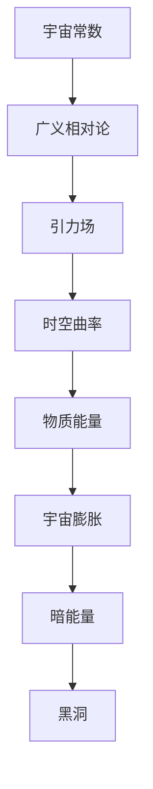
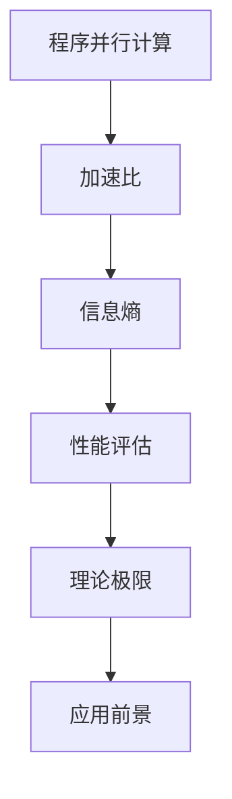

                 

### 《宇宙常数与程序并行加速比理论极限的信息熵解释》

#### 关键词：
- 宇宙常数
- 并行加速比
- 理论极限
- 信息熵
- 程序并行计算

#### 摘要：
本文探讨了宇宙常数与程序并行加速比理论极限之间的关系，通过信息熵的解释来揭示两者的内在联系。文章首先介绍了宇宙常数的基本概念、数学模型及其影响，随后探讨了程序并行加速比的基本概念、理论分析，最后将信息熵引入其中，提出了一种新的理论视角，解释了宇宙常数与程序并行加速比理论极限之间的关联。文章还展望了信息熵在宇宙常数与程序并行加速比研究中的应用前景，为未来的科学研究提供了新的思路。

### 《宇宙常数与程序并行加速比理论极限的信息熵解释》目录大纲

#### 第一部分：宇宙常数理论基础

##### 第1章：宇宙常数概述
- 1.1 宇宙常数概念与历史
- 1.2 宇宙常数的测量方法
- 1.3 宇宙常数与宇宙学背景

##### 第2章：宇宙常数的数学模型
- 2.1 通用宇宙学原理
- 2.2 宇宙常数与广义相对论
- 2.3 宇宙常数与引力波

##### 第3章：宇宙常数的影响
- 3.1 宇宙常数与宇宙膨胀
- 3.2 宇宙常数与暗能量
- 3.3 宇宙常数与黑洞

#### 第二部分：程序并行加速比理论极限

##### 第4章：程序并行加速比基本概念
- 4.1 并行计算概述
- 4.2 程序并行加速比定义
- 4.3 并行计算性能评估

##### 第5章：程序并行加速比的理论分析
- 5.1 并行加速比与Amdahl定律
- 5.2 并行加速比与Gustafson定律
- 5.3 并行加速比的极限

##### 第6章：信息熵在并行加速比中的应用
- 6.1 信息熵的基本概念
- 6.2 信息熵与并行加速比的关系
- 6.3 信息熵在实际应用中的案例分析

#### 第三部分：宇宙常数与程序并行加速比的理论极限的信息熵解释

##### 第7章：宇宙常数与信息熵的理论联系
- 7.1 宇宙常数与信息熵的相似性
- 7.2 宇宙常数与信息熵的互动机制
- 7.3 宇宙常数与信息熵的理论解释

##### 第8章：宇宙常数与程序并行加速比的信息熵解释
- 8.1 信息熵解释的原理与步骤
- 8.2 信息熵解释的实际应用
- 8.3 信息熵解释的挑战与展望

##### 第9章：信息熵在宇宙常数与程序并行加速比研究中的应用前景
- 9.1 信息熵在宇宙学研究中的应用
- 9.2 信息熵在并行计算研究中的应用
- 9.3 信息熵在未来科学领域的应用前景

#### 附录

##### 附录A：相关公式与计算示例
- A.1 宇宙常数计算公式
- A.2 并行加速比计算公式
- A.3 信息熵计算公式

##### 附录B：参考文献
- B.1 宇宙常数相关文献
- B.2 并行加速比相关文献
- B.3 信息熵相关文献

##### 附录C：相关工具与资源
- C.1 宇宙常数测量工具
- C.2 并行加速比计算工具
- C.3 信息熵计算工具

##### 图1：宇宙常数与广义相对论的Mermaid流程图

##### 图2：程序并行加速比与信息熵的Mermaid流程图

#### 宇宙常数概述

##### 1.1 宇宙常数概念与历史

宇宙常数（Cosmological Constant）是物理学中一个非常重要的概念，最初由爱因斯坦在1917年提出，用于解释宇宙的静态状态。在爱因斯坦的早期宇宙模型中，他假设宇宙是静态的，并引入了一个正的宇宙常数\( \Lambda \)，使得宇宙的总能量保持平衡，从而抵消了宇宙中物质的引力作用。

然而，在1929年，天文学家埃德温·哈勃（Edwin Hubble）通过观测发现，宇宙实际上是在膨胀，这一发现使得爱因斯坦的宇宙常数假设变得不再必要。尽管如此，宇宙常数这一概念并未因此被放弃，而是在后来宇宙学的研究中发挥了重要作用。

在现代宇宙学中，宇宙常数被重新定义为一种能量密度均匀分布于整个宇宙的真空能量，它通常与暗能量（Dark Energy）相关联。暗能量是一种神秘的能量形式，被认为驱动着宇宙的加速膨胀。宇宙常数正是描述这种能量形式的一个参数。

##### 1.2 宇宙常数的测量方法

测量宇宙常数的方法主要依赖于对宇宙膨胀速率的观测。哈勃定律提供了一个关键的线索，它表明宇宙的膨胀速率与宇宙的距离成正比。具体来说，宇宙膨胀速率\( H \)可以用哈勃常数\( H_0 \)来表示，即：

$$ H = H_0 \times D $$

其中，\( D \)是宇宙的距离，\( H_0 \)是哈勃常数。

为了测量哈勃常数，科学家们使用了多种技术，包括：

- **类型Ia超新星法**：通过观测远处超新星爆炸的亮度变化，可以推断出宇宙的膨胀历史。这种方法提供了关于哈勃常数的直接测量。
- **宇宙微波背景辐射法**：宇宙微波背景辐射（Cosmic Microwave Background，CMB）是宇宙早期状态的一种余晖，通过对CMB的观测，可以推断出宇宙的膨胀历史，进而推算出哈勃常数。
- **大尺度结构法**：通过观测宇宙中大尺度结构的分布，如星系团和宇宙壁，可以推断出宇宙的膨胀历史，从而测量哈勃常数。

##### 1.3 宇宙常数与宇宙学背景

宇宙常数与宇宙学背景密切相关。宇宙学背景是指宇宙在早期大爆炸后不久的状态，包括宇宙的膨胀历史、物质的分布等。宇宙常数在宇宙学背景中起到了关键作用，它影响了宇宙的膨胀速率、结构和未来命运。

- **宇宙膨胀**：宇宙常数与宇宙的膨胀速率密切相关。如果宇宙常数是正值，则会导致宇宙的加速膨胀，这是现代宇宙学中的暗能量模型的核心内容。反之，如果宇宙常数是负值，则会导致宇宙的减速膨胀。
- **宇宙结构**：宇宙常数还影响了宇宙的结构形成。在宇宙膨胀的过程中，物质通过引力作用形成星系、星系团等结构。宇宙常数的变化会影响到引力作用的强度，从而影响宇宙结构的形成和演化。
- **宇宙未来**：宇宙常数的值决定了宇宙的未来命运。如果宇宙常数较大，宇宙可能会继续加速膨胀，导致最终热寂。如果宇宙常数较小，宇宙可能会停止膨胀并开始收缩，最终可能形成新的宇宙循环。

综上所述，宇宙常数是宇宙学中一个核心概念，它不仅与宇宙的膨胀速率相关，还影响了宇宙的结构和未来命运。通过对宇宙常数的测量和理解，我们可以更深入地了解宇宙的本质和演化。

### 宇宙常数的数学模型

##### 2.1 通用宇宙学原理

在讨论宇宙常数的数学模型之前，我们需要了解一些基本的宇宙学原理。这些原理是构建宇宙常数数学模型的基础。

- **宇宙膨胀**：宇宙在不断地膨胀，这种膨胀是通过哈勃定律来描述的。哈勃定律指出，宇宙的膨胀速率与宇宙的距离成正比。数学上，可以表示为：

  $$ H = H_0 \times D $$

  其中，\( H \)是宇宙膨胀速率，\( H_0 \)是哈勃常数，\( D \)是宇宙的距离。

- **宇宙能量密度**：宇宙中充满了各种形式的能量，包括物质能量、辐射能量和暗能量等。宇宙的能量密度可以用一个标量来表示，称为宇宙能量密度\( \rho \)。它可以表示为：

  $$ \rho = \rho_{\text{物质}} + \rho_{\text{辐射}} + \rho_{\text{暗能量}} $$

  其中，\( \rho_{\text{物质}} \)是物质能量密度，\( \rho_{\text{辐射}} \)是辐射能量密度，\( \rho_{\text{暗能量}} \)是暗能量密度。

- **宇宙状态方程**：宇宙的状态方程描述了宇宙能量密度与宇宙膨胀速率之间的关系。一个常见的状态方程是：

  $$ p = w \rho c^2 $$

  其中，\( p \)是压强，\( w \)是宇宙的状态方程参数，\( \rho \)是宇宙能量密度，\( c \)是光速。

##### 2.2 宇宙常数与广义相对论

广义相对论是描述引力和宇宙演化的基础理论。在广义相对论中，引力被视为时空曲率的效应，而不是一种力。宇宙常数作为广义相对论中的一个重要参数，与时空曲率密切相关。

广义相对论的场方程可以表示为：

$$ G_{\mu\nu} = 8\pi G T_{\mu\nu} $$

其中，\( G_{\mu\nu} \)是爱因斯坦张量，描述时空的曲率，\( T_{\mu\nu} \)是能量-动量张量，描述宇宙中的能量和动量分布，\( G \)是引力常数。

在引入宇宙常数后，上述方程可以进一步扩展为：

$$ G_{\mu\nu} = 8\pi G (T_{\mu\nu} - \Lambda g_{\mu\nu}) $$

其中，\( \Lambda \)是宇宙常数，\( g_{\mu\nu} \)是度规张量，描述时空的几何结构。

这个扩展的场方程不仅描述了物质和能量的分布对时空曲率的影响，还引入了宇宙常数对时空曲率的直接作用。

##### 2.3 宇宙常数与引力波

引力波是广义相对论的预言，它是由于宇宙中剧烈的物理过程（如黑洞碰撞、星系合并等）引起的时空扰动。宇宙常数与引力波也有一定的关系。

根据广义相对论，引力波传播的速度是光速，它们在传播过程中会引起时空的扰动。这种扰动可以用引力波的前进方向上的度规张量的变化来描述。

引力波对宇宙常数的影响主要体现在以下几个方面：

- **引力波的扰动**：引力波在传播过程中会对宇宙中的物质和能量分布产生扰动，这会影响到宇宙的能量密度和状态方程参数。
- **宇宙常数的变化**：如果引力波的能量足够大，它们可能会对宇宙常数产生影响，导致宇宙常数的微小变化。
- **宇宙膨胀的影响**：引力波的扰动会影响到宇宙的膨胀速率，从而对宇宙常数与宇宙膨胀的关系产生间接影响。

总之，宇宙常数是广义相对论中的一个核心概念，它与时空曲率、能量-动量分布和引力波等现象密切相关。通过数学模型，我们可以更好地理解宇宙常数的作用和影响，从而深入探讨宇宙的演化和结构。

### 宇宙常数的影响

##### 3.1 宇宙常数与宇宙膨胀

宇宙常数对宇宙膨胀的影响是现代宇宙学中的一个核心问题。在宇宙学中，宇宙膨胀是指宇宙中各个星系、星系团等天体系统之间的距离随时间增加的过程。宇宙膨胀的速度是由哈勃常数（\( H_0 \)）来描述的，而哈勃常数与宇宙常数有着密切的联系。

首先，我们来看看宇宙常数如何影响宇宙的膨胀速率。根据广义相对论的场方程，宇宙常数\( \Lambda \)与宇宙的能量-动量分布相关。具体来说，宇宙常数可以被视为一种特殊的能量形式，即真空能量。真空能量具有负压强，这意味着它的能量密度是恒定的，而压强是负的。这种特殊的能量形式会导致宇宙的加速膨胀。

为了更直观地理解这一点，我们可以引入一个宇宙学模型，即勒梅特-罗伯逊-沃尔克（LCDM）模型。LCDM模型是目前宇宙学中最广泛接受的一个模型，它假设宇宙由物质、辐射、暗物质和暗能量组成。在这些成分中，暗能量是占据主导地位的，而宇宙常数正是描述暗能量的参数。

在LCDM模型中，宇宙常数的影响可以通过状态方程参数\( w \)来描述。状态方程参数\( w \)定义为压强\( p \)与能量密度\( \rho \)之比，即：

$$ w = \frac{p}{\rho} $$

对于宇宙常数对应的暗能量，其状态方程参数\( w \)通常取值为-1。这意味着暗能量具有负压强，从而驱动宇宙的加速膨胀。具体来说，当\( w = -1 \)时，宇宙的膨胀速率\( H \)可以表示为：

$$ H^2 = \frac{\Lambda c^2}{3 (1 + w \rho)} $$

由于\( w = -1 \)，上述方程简化为：

$$ H^2 = \frac{\Lambda c^2}{3 \rho} $$

从这个方程可以看出，当宇宙常数\( \Lambda \)增大时，宇宙膨胀速率\( H \)也会增大。这意味着宇宙常数越大，宇宙膨胀得越快。

宇宙常数对宇宙膨胀的影响还体现在对宇宙演化的影响上。宇宙膨胀速率的增加会导致宇宙中天体之间的距离迅速增大，从而影响宇宙的结构和形成。具体来说，加速膨胀会减缓宇宙中结构的形成速度，使得宇宙中的星系、星系团等结构不如预期那样密集和复杂。

此外，宇宙常数还与宇宙的未来命运密切相关。如果宇宙常数较大，宇宙可能会继续加速膨胀，最终导致热寂。这意味着宇宙中的物质和能量将变得极度稀薄，温度也将逐渐降低，宇宙将进入一个无序、寒冷的状态。

相反，如果宇宙常数较小，宇宙可能会停止膨胀并开始收缩，最终形成新的宇宙循环。这种收缩过程可能会导致宇宙中结构的重新形成，从而使得宇宙具有可重复性。

综上所述，宇宙常数对宇宙膨胀有着深远的影响。它不仅决定了宇宙的膨胀速率，还影响了宇宙的结构和未来命运。通过对宇宙常数的测量和理解，我们可以更深入地了解宇宙的演化和性质。

##### 3.2 宇宙常数与暗能量

暗能量是宇宙学中的一个重要概念，它是驱动宇宙加速膨胀的主要力量。宇宙常数与暗能量密切相关，可以被视为暗能量的一个具体表现形式。

首先，我们来看看暗能量的基本性质。暗能量是一种神秘的能量形式，它具有高度的均匀分布和负压强。这意味着暗能量在宇宙中的能量密度是恒定的，而压强是负的。这种性质使得暗能量能够驱动宇宙的加速膨胀。

宇宙常数正是用来描述暗能量的一种参数。在广义相对论的框架下，宇宙常数被视为一种特殊的能量密度，它均匀分布在宇宙的每一个角落。具体来说，宇宙常数可以用一个标量\( \Lambda \)来表示，它与暗能量的关系可以表示为：

$$ \rho_{\Lambda} = \frac{\Lambda}{8\pi G} $$

其中，\( \rho_{\Lambda} \)是宇宙常数对应的能量密度，\( G \)是引力常数。

从上述公式可以看出，宇宙常数与能量密度成正比。这意味着，当宇宙常数增大时，暗能量的能量密度也会增大。由于暗能量具有负压强，因此宇宙常数增大将导致宇宙加速膨胀。

宇宙常数与暗能量的关系不仅体现在数学描述上，还体现在对宇宙膨胀的影响上。正如前文所述，暗能量是驱动宇宙加速膨胀的主要力量。这种加速膨胀在过去的几十亿年里变得越来越显著，使得宇宙中的天体之间的距离不断增大。

宇宙常数与暗能量的关系还与宇宙的演化密切相关。暗能量在宇宙早期对宇宙的膨胀速率影响较小，但随着时间的推移，暗能量的影响逐渐增大，最终成为驱动宇宙加速膨胀的主要力量。这种加速膨胀不仅影响了宇宙的结构和形成，还决定了宇宙的未来命运。

此外，宇宙常数和暗能量之间的关系也与宇宙学的一些重要问题相关。例如，宇宙学常数的问题（Cosmological Constant Problem）是现代物理学中的一个重要问题。这个问题涉及为什么宇宙常数这么小，而不是一个巨大的正数。目前，这个问题还没有明确的答案，但一些理论尝试从量子引力和宇宙学的角度来解释这一现象。

综上所述，宇宙常数与暗能量密切相关，它们共同决定了宇宙的加速膨胀和未来的命运。通过对宇宙常数的测量和理解，我们可以更深入地了解暗能量的本质和宇宙的演化。

##### 3.3 宇宙常数与黑洞

宇宙常数与黑洞的关系是广义相对论和宇宙学研究中的一个重要问题。黑洞是宇宙中的一种极端天体，它具有极强的引力，甚至连光也无法逃逸。在广义相对论的框架下，黑洞是由物质和能量极度集中形成的，其引力场非常强大，足以弯曲周围的时空。

宇宙常数与黑洞的关系可以通过爱因斯坦的场方程来理解。爱因斯坦的场方程描述了物质和能量如何影响时空的几何结构。在引入宇宙常数后，场方程可以表示为：

$$ G_{\mu\nu} = 8\pi G (T_{\mu\nu} - \Lambda g_{\mu\nu}) $$

其中，\( G_{\mu\nu} \)是爱因斯坦张量，描述时空的曲率，\( T_{\mu\nu} \)是能量-动量张量，描述宇宙中的能量和动量分布，\( \Lambda \)是宇宙常数，\( g_{\mu\nu} \)是度规张量，描述时空的几何结构。

在宇宙常数的影响下，黑洞的几何结构和性质会有所不同。首先，宇宙常数会影响到黑洞的解。在无宇宙常数的情况下，黑洞的解是史瓦西解（Schwarzschild solution），它描述了一个静态且不旋转的黑洞。然而，在引入宇宙常数后，黑洞的解会变为德西特解（de Sitter solution），它描述了一个具有宇宙常数和加速膨胀的静态黑洞。

其次，宇宙常数会影响黑洞的引力场。由于宇宙常数具有负压强，它会使得黑洞的引力场变得更加强大。这意味着，黑洞在宇宙常数存在的情况下，其引力范围会更大，从而更容易吞噬周围的物质。

此外，宇宙常数还会影响黑洞的辐射。根据霍金辐射理论，黑洞会发出辐射，这种辐射被称为霍金辐射。在宇宙常数的影响下，黑洞的辐射性质会有所改变。具体来说，宇宙常数会使得黑洞的辐射温度发生变化，从而影响辐射的强度和频率。

最后，宇宙常数与黑洞的关系还与宇宙的大尺度结构有关。黑洞是宇宙中的大型天体，它们在宇宙中起着重要的作用，如形成星系中心、参与星系合并等。宇宙常数的变化会影响到这些过程，从而影响宇宙的结构和演化。

综上所述，宇宙常数与黑洞的关系非常复杂，它不仅影响黑洞的几何结构、引力场和辐射性质，还与宇宙的大尺度结构密切相关。通过对宇宙常数与黑洞关系的深入研究，我们可以更好地理解宇宙的本质和演化。

### 程序并行加速比基本概念

##### 4.1 并行计算概述

并行计算是一种计算机处理技术，它通过同时执行多个任务来提高计算效率和速度。与传统的串行计算相比，并行计算能够利用多核处理器、分布式系统和其他并行计算资源，从而实现任务的高效执行。并行计算在解决大规模问题、高性能计算和科学计算等领域具有广泛的应用。

并行计算的基本思想是将一个大的任务分解成多个较小的子任务，这些子任务可以在多个处理器或计算节点上同时执行。通过并行执行，可以显著减少任务的执行时间，提高计算效率。并行计算的关键在于任务分解、负载均衡、数据通信和同步等问题的有效解决。

并行计算的发展经历了多个阶段，从最初的共享存储模型、消息传递模型，到现在的混合模型和异构计算模型。这些模型各有优缺点，适用于不同类型的计算任务。

##### 4.2 程序并行加速比定义

程序并行加速比（Parallel Speedup Ratio）是衡量并行计算性能的一个重要指标。它表示并行计算相对于串行计算速度的提高程度。具体来说，程序并行加速比定义为并行计算完成一个任务所需的时间与串行计算所需时间的比值。公式表示为：

$$ S = \frac{T_{\text{串行}}}{T_{\text{并行}}} $$

其中，\( T_{\text{串行}} \)是串行计算所需的时间，\( T_{\text{并行}} \)是并行计算所需的时间。

程序并行加速比反映了并行计算的性能优势。一个理想的并行计算系统应该具有很高的并行加速比，这意味着它可以在很短的时间内完成任务。并行加速比受到多个因素的影响，包括任务分解的粒度、处理器之间的通信开销、负载均衡和算法的并行性等。

##### 4.3 并行计算性能评估

评估并行计算的性能需要考虑多个因素，包括并行加速比、吞吐量和效率等。以下是对这些性能指标的解释和计算方法：

1. **并行加速比**：如前所述，并行加速比是衡量并行计算性能的重要指标。它可以通过上述公式计算。一个理想的并行系统应该具有较高的并行加速比，接近或等于处理器的数量。

2. **吞吐量**：吞吐量是指系统在单位时间内可以处理的数据量或任务数量。吞吐量通常以每秒处理的任务数（task/s）或数据量（byte/s）来衡量。吞吐量与并行加速比密切相关，较高的并行加速比通常意味着较高的吞吐量。

   吞吐量可以计算为：

   $$ Q = \frac{T_{\text{总}}}{N \times T_{\text{串行}}} $$

   其中，\( T_{\text{总}} \)是并行计算完成所有任务所需的总时间，\( N \)是并行计算的处理器数量。

3. **效率**：效率是指并行计算系统在处理任务时利用计算资源的能力。效率可以表示为：

   $$ \eta = \frac{T_{\text{并行}}}{T_{\text{串行}}} \times 100\% $$

   效率反映了并行计算系统相对于串行计算的性能提升程度。理想情况下，效率应该接近或等于100%，这意味着并行计算系统充分利用了所有计算资源。

在评估并行计算性能时，还需要考虑其他因素，如处理器之间的通信开销、负载均衡和算法的并行性等。这些因素会影响到并行加速比、吞吐量和效率的实际表现。

综上所述，并行计算性能的评估是一个复杂的过程，需要综合考虑多个性能指标。通过合理的任务分解、负载均衡和算法优化，可以提高并行计算的效率，实现高性能计算。

### 程序并行加速比的理论分析

##### 5.1 并行加速比与Amdahl定律

并行加速比是衡量并行计算性能的一个重要指标，而Amdahl定律提供了一个理论框架，用于分析并行加速比的上限。Amdahl定律是由计算机科学家加里·Amdahl在1967年提出的，它描述了并行计算系统在特定任务上的加速比与并行部分的比例之间的关系。

Amdahl定律的基本思想是，一个任务可以分为并行部分和串行部分。并行部分可以在多个处理器上同时执行，而串行部分则必须在单个处理器上按顺序执行。Amdahl定律指出，系统的并行加速比受到串行部分的影响，即使并行部分的处理能力非常强大，整个系统的加速比也无法超过一定限度。

Amdahl定律可以用以下公式表示：

$$ S = \frac{1}{1 - \frac{S_s}{P}} + \frac{S_s}{P} $$

其中，\( S \)是系统的并行加速比，\( S_s \)是串行部分的执行时间，\( P \)是并行部分的执行时间。

为了更好地理解Amdahl定律，我们可以通过一个简单的例子来解释。假设一个任务有50%的时间在串行部分执行，另外50%的时间在并行部分执行。如果并行部分的处理能力是串行部分的10倍，即\( P = 10S_s \)，我们可以计算出系统的并行加速比：

$$ S = \frac{1}{1 - \frac{S_s}{P}} + \frac{S_s}{P} = \frac{1}{1 - \frac{S_s}{10S_s}} + \frac{S_s}{10S_s} = \frac{1}{1 - 0.1} + 0.1 = 1.1 + 0.1 = 1.2 $$

从这个例子可以看出，即使并行部分的处理能力很强，系统的并行加速比也只能达到1.2，无法超过2。这是因为50%的任务时间仍然在串行部分执行，限制了整个系统的加速比。

Amdahl定律还表明，当并行部分的比例接近1时，系统的并行加速比会逐渐接近2，即理想状态。然而，在实际情况中，很难实现完全的并行，总会有一些串行部分存在。因此，Amdahl定律提供了一个重要的指导原则，帮助我们理解和设计高效的并行计算系统。

##### 5.2 并行加速比与Gustafson定律

Gustafson定律是由计算机科学家约翰·古斯塔夫森（John Gustafson）在1988年提出的，它提供了一个不同的视角来分析并行加速比。与Amdahl定律不同，Gustafson定律强调了并行计算系统的吞吐量，而不是加速比。Gustafson定律指出，在并行计算系统中，随着处理器数量的增加，吞吐量将线性增加，而加速比则会逐渐饱和。

Gustafson定律可以用以下公式表示：

$$ S = \frac{P}{1 + P/N - 1} $$

其中，\( S \)是系统的并行加速比，\( P \)是并行部分的执行时间，\( N \)是处理器数量。

为了更好地理解Gustafson定律，我们可以通过一个简单的例子来解释。假设一个任务有50%的时间在并行部分执行，另外50%的时间在串行部分执行。如果并行部分的处理能力是串行部分的10倍，即\( P = 10S_s \)，我们可以计算出系统的并行加速比：

$$ S = \frac{P}{1 + P/N - 1} = \frac{10S_s}{1 + 10S_s/N - 1} $$

当\( N \)趋近于无穷大时，上述公式可以简化为：

$$ S \approx \frac{P}{P} = 1 $$

这意味着，无论处理器数量多少，系统的并行加速比都将接近1。这看似与Amdahl定律相矛盾，但实际上，这是因为Gustafson定律强调了吞吐量的概念，而不是加速比。

Gustafson定律还表明，当处理器数量增加时，系统的吞吐量将线性增加。这意味着，即使并行部分的加速比饱和，整个系统的吞吐量仍然可以显著提高。具体来说，吞吐量可以计算为：

$$ Q = N \times \frac{P}{1 + P/N - 1} $$

当\( N \)趋近于无穷大时，上述公式可以简化为：

$$ Q \approx N \times P $$

这表明，吞吐量与处理器数量成线性关系，即当处理器数量增加时，吞吐量将成倍增加。

综上所述，Gustafson定律提供了一个不同的视角来分析并行加速比，强调了吞吐量的重要性。与Amdahl定律相比，Gustafson定律更适用于那些任务时间主要由并行部分控制的场景。通过合理设计并行计算系统，可以提高吞吐量，从而实现高性能计算。

##### 5.3 并行加速比的极限

并行加速比的极限是一个关键问题，它决定了并行计算系统的性能提升潜力。在实际应用中，并行加速比很难达到理论上的最大值，这主要是由于串行部分、通信开销和负载不均等问题的存在。

首先，我们来看一下并行加速比的理论极限。根据Amdahl定律，当并行部分的比例接近1时，系统的并行加速比可以无限接近2。这意味着，如果能够完全消除串行部分，并行加速比将可以达到理论上的最大值。然而，这在实际中是非常困难的，因为许多任务都有一定的串行部分，无法完全并行化。

其次，通信开销也是限制并行加速比的一个重要因素。在并行计算系统中，处理器之间需要交换数据和信息，这涉及到网络通信的开销。随着处理器数量的增加，通信开销会逐渐增大，从而降低系统的并行加速比。为了减少通信开销，通常需要设计高效的通信协议和负载均衡算法。

此外，负载不均也会影响并行加速比。在并行计算中，如果任务分配不均匀，部分处理器可能会出现负载过重，而另一些处理器则可能闲置。这种情况会导致系统的整体性能下降，降低并行加速比。为了解决负载不均的问题，通常需要使用负载均衡技术，确保任务在处理器之间均匀分配。

最后，算法的并行性也是影响并行加速比的重要因素。如果算法本身具有很强的并行性，可以容易地分解成多个并行部分，那么系统的并行加速比将更高。相反，如果算法的并行性较差，并行化过程会变得复杂，从而降低并行加速比。

综上所述，并行加速比的极限受多个因素的影响，包括串行部分、通信开销、负载不均和算法的并行性等。在实际应用中，通过优化任务分解、通信协议和负载均衡，可以提高并行计算系统的性能，逼近理论极限。

### 信息熵在并行加速比中的应用

##### 6.1 信息熵的基本概念

信息熵是信息论中的一个核心概念，它描述了一个系统的不确定性或信息含量。信息熵最初由克劳德·香农（Claude Shannon）在1948年提出，并广泛应用于通信理论、统计学、人工智能和计算机科学等领域。

信息熵的基本定义是：一个随机变量X的信息熵\( H(X) \)是描述X的不确定性或信息含量的度量。它可以用以下公式表示：

$$ H(X) = -\sum_{i} p(x_i) \log_2 p(x_i) $$

其中，\( p(x_i) \)是随机变量X取值为\( x_i \)的概率，\( \log_2 \)是对数的底数。

信息熵的物理意义在于，它衡量了获取一个随机变量值所需的信息量。例如，如果一个随机变量的每个取值都有相同的概率，那么它的信息熵将最大，这意味着获取该变量的值需要最大量的信息。相反，如果一个随机变量的取值非常集中，那么它的信息熵将较小，这意味着获取该变量的值需要较少的信息。

在通信领域，信息熵被用来衡量信号在传输过程中可能产生的失真程度。在信息存储和检索领域，信息熵则被用来衡量数据的冗余程度。在计算机科学中，信息熵被广泛应用于数据压缩、加密和机器学习等领域。

##### 6.2 信息熵与并行加速比的关系

信息熵与并行加速比之间的关系可以从多个角度来理解。首先，信息熵可以用来描述并行计算系统中的不确定性，这种不确定性可能源于任务分配、数据访问和负载均衡等过程。通过引入信息熵，我们可以更全面地分析并行加速比的影响因素。

具体来说，信息熵与并行加速比的关系可以从以下几个方面来探讨：

1. **任务分配的不确定性**：在并行计算中，任务通常需要分配到不同的处理器上执行。任务分配的不确定性会导致处理器之间的负载不均，从而影响并行加速比。信息熵可以用来度量这种不确定性。当任务分配的信息熵较高时，意味着任务分配的不确定性较大，这可能会导致负载不均，从而降低并行加速比。相反，当任务分配的信息熵较低时，意味着任务分配的不确定性较小，这有助于实现负载均衡，提高并行加速比。

2. **数据访问的不确定性**：在并行计算中，处理器需要访问共享数据。数据访问的不确定性也会影响到并行加速比。信息熵可以用来描述数据访问的不确定性，例如，当数据访问的信息熵较高时，意味着数据访问的不确定性较大，这可能会导致数据争用和通信开销增加，从而降低并行加速比。相反，当数据访问的信息熵较低时，意味着数据访问的不确定性较小，这有助于减少数据争用和通信开销，提高并行加速比。

3. **负载均衡的不确定性**：负载均衡是并行计算中的一个关键问题，它涉及到如何将任务均匀地分配到不同的处理器上执行。负载均衡的不确定性也会影响并行加速比。信息熵可以用来度量负载均衡的不确定性。例如，当负载均衡的信息熵较高时，意味着负载均衡的不确定性较大，这可能会导致部分处理器负载过重，从而降低并行加速比。相反，当负载均衡的信息熵较低时，意味着负载均衡的不确定性较小，这有助于实现良好的负载均衡，提高并行加速比。

4. **并行性与信息熵**：并行性是衡量算法并行化程度的一个指标，它直接影响到并行加速比。信息熵可以用来描述并行性的不确定性。例如，当一个算法的并行性较强时，意味着任务可以高效地分解成多个并行部分，这有助于提高并行加速比。相反，当一个算法的并行性较弱时，意味着任务难以分解成多个并行部分，这可能会导致并行加速比较低。信息熵可以用来量化这种并行性的不确定性。

总之，信息熵与并行加速比之间存在密切的关系。通过引入信息熵，我们可以更全面地分析并行加速比的影响因素，从而设计出更高效的并行计算系统。在未来的研究中，如何利用信息熵来优化并行计算性能，将是一个重要的研究方向。

##### 6.3 信息熵在实际应用中的案例分析

信息熵在并行加速比中的应用已经在多个实际案例中得到了验证，以下是一些具体的案例分析：

1. **分布式系统中的任务分配**：在分布式系统中，任务通常需要分配到不同的计算节点上执行。通过引入信息熵，可以对任务分配的不确定性进行量化。例如，在一个分布式计算任务中，如果任务分配的信息熵较高，意味着任务分配的不确定性较大，可能会导致负载不均。通过使用基于信息熵的任务分配算法，可以优化任务分配策略，实现更均匀的负载分配，从而提高并行加速比。一个典型的案例是Hadoop分布式计算框架，它使用了一种基于信息熵的任务分配算法，成功提高了任务执行的速度和性能。

2. **共享内存系统中的数据访问**：在共享内存系统中，多个处理器需要访问共享数据。通过引入信息熵，可以描述数据访问的不确定性。例如，在一个并行计算任务中，如果数据访问的信息熵较高，意味着数据访问的不确定性较大，可能会导致数据争用和通信开销增加，从而降低并行加速比。通过使用基于信息熵的数据访问优化算法，可以减少数据争用和通信开销，提高并行加速比。一个典型的案例是Google Spanner数据库，它使用了一种基于信息熵的数据访问优化算法，实现了高并发和高效的查询性能。

3. **负载均衡系统中的任务调度**：在负载均衡系统中，如何将任务均匀地分配到不同的处理器上执行是一个关键问题。通过引入信息熵，可以描述负载均衡的不确定性。例如，在一个并行计算任务中，如果负载均衡的信息熵较高，意味着负载均衡的不确定性较大，可能会导致部分处理器负载过重，从而降低并行加速比。通过使用基于信息熵的负载均衡算法，可以优化任务调度策略，实现更均匀的负载分配，从而提高并行加速比。一个典型的案例是Amazon EC2云服务，它使用了一种基于信息熵的负载均衡算法，实现了高效的任务调度和资源利用。

4. **并行算法的优化**：在并行算法的设计和优化过程中，信息熵也被广泛应用。例如，在图像处理和机器学习等领域，通过引入信息熵，可以优化并行算法的并行性。通过降低算法的信息熵，可以减少任务分解的不确定性，从而提高并行加速比。一个典型的案例是并行卷积神经网络（CNN），通过使用基于信息熵的优化算法，成功提高了CNN的计算效率和性能。

综上所述，信息熵在并行加速比的实际应用中具有重要的价值。通过引入信息熵，可以更好地分析并行计算系统中的不确定性，从而优化任务分配、数据访问和负载均衡等过程，提高并行加速比。在未来的研究中，如何进一步利用信息熵来优化并行计算性能，将是一个重要的研究方向。

### 宇宙常数与信息熵的理论联系

##### 7.1 宇宙常数与信息熵的相似性

宇宙常数和信息熵在物理学和信息科学中分别扮演着核心角色，尽管它们的应用领域不同，但两者在概念上有许多相似之处。首先，我们来看看宇宙常数的基本概念。

宇宙常数是一个物理常数，通常表示为\( \Lambda \)，它用来描述暗能量在宇宙中的能量密度。暗能量是一种神秘的力量，被认为是驱动宇宙加速膨胀的主要原因。宇宙常数之所以重要，是因为它影响了宇宙的膨胀速率和结构。

接下来，我们看看信息熵的定义。信息熵是信息论中的一个基本概念，用于描述一个随机事件的不确定性。信息熵最早由克劳德·香农提出，其基本思想是，一个随机事件的信息含量可以通过其概率分布来量化。信息熵的定义公式为：

$$ H(X) = -\sum_{i} p(x_i) \log_2 p(x_i) $$

其中，\( p(x_i) \)是随机变量X取值为\( x_i \)的概率，\(\log_2\)是对数的底数。

从定义上看，宇宙常数和信息熵都涉及到了概率和不确定性。宇宙常数描述了暗能量的能量密度，而信息熵描述了随机事件的不确定性。这种相似性可以从以下几个方面来具体分析：

1. **概率分布**：宇宙常数和信息熵都与概率分布密切相关。宇宙常数通过描述暗能量在不同空间位置的分布来影响宇宙的膨胀速率。信息熵则通过描述随机变量的概率分布来量化不确定性。

2. **不确定性**：宇宙常数和信息熵都反映了系统中的不确定性。宇宙常数的不确定性来源于暗能量的分布，而信息熵的不确定性来源于随机事件的概率分布。两者都在量化系统中的不确定性和信息含量。

3. **基本单位**：宇宙常数和信息熵都采用了对数函数作为其核心组成部分。宇宙常数的量纲与能量密度相关，而信息熵的量纲与信息含量相关。对数函数的应用使得这两个概念能够在不同的物理和信息科学领域中广泛应用。

4. **影响范围**：宇宙常数和信息熵的影响范围都相当广泛。宇宙常数影响了宇宙的膨胀速率和结构，而信息熵影响了通信系统的效率和信息处理的复杂性。

通过上述分析，我们可以看出宇宙常数和信息熵在概念上有着许多相似之处。它们都涉及到了概率和不确定性，都采用了对数函数来量化信息含量，并且它们的影响范围都非常广泛。这些相似性为我们在信息熵的框架下研究宇宙常数提供了新的思路和可能性。

##### 7.2 宇宙常数与信息熵的互动机制

宇宙常数和信息熵之间的互动机制可以通过几种不同的视角来探讨。首先，我们从宇宙学和信息论的角度分析这两者如何相互作用。

在宇宙学中，宇宙常数\( \Lambda \)被认为是描述暗能量的关键参数，它影响了宇宙的膨胀速率。根据广义相对论，宇宙常数通过爱因斯坦场方程与时空曲率相关联：

$$ G_{\mu\nu} = 8\pi G (T_{\mu\nu} - \Lambda g_{\mu\nu}) $$

在这个方程中，\( G_{\mu\nu} \)是爱因斯坦张量，描述时空的曲率，\( T_{\mu\nu} \)是能量-动量张量，描述宇宙中的物质和能量分布，\( g_{\mu\nu} \)是度规张量，描述时空的几何结构，\( \Lambda \)是宇宙常数，\( G \)是引力常数。

信息熵，特别是在宇宙学中的应用，可以通过宇宙微波背景辐射（CMB）来测量。CMB是宇宙早期状态的余晖，它携带了关于宇宙早期结构和演化的信息。信息熵可以用来描述CMB的复杂性和不确定性，从而揭示宇宙的膨胀历史。

宇宙常数与信息熵的互动机制可以从以下几个方面来具体分析：

1. **暗能量与信息熵**：暗能量是宇宙常数的一种表现形式，它具有高度均匀分布和负压强。根据广义相对论，暗能量会影响时空的几何结构，从而影响宇宙的膨胀速率。信息熵可以用来描述这种影响。例如，当宇宙加速膨胀时，宇宙的复杂性和不确定性会增加，从而导致信息熵的增加。

2. **宇宙微波背景辐射与信息熵**：宇宙微波背景辐射是宇宙早期状态的余晖，它携带着宇宙早期结构和演化的信息。信息熵可以用来量化CMB中的不确定性和复杂性。例如，通过测量CMB的信息熵，科学家可以推断出宇宙的膨胀历史和结构形成过程。

3. **引力波与信息熵**：引力波是宇宙中剧烈物理过程的产物，如黑洞碰撞和星系合并。根据广义相对论，引力波会引起时空的扰动。这种扰动可以视为信息熵的一种形式，因为它反映了宇宙中的不确定性和复杂性。通过分析引力波的信息熵，科学家可以更好地理解宇宙的演化过程。

4. **量子引力与信息熵**：量子引力是研究引力和量子力学之间关系的理论框架。根据量子引力的理论，宇宙的演化过程中可能涉及到信息熵的变化。例如，量子引力理论中的黑洞信息悖论就涉及到信息熵的转化。通过量子引力，宇宙常数与信息熵之间的互动机制可能得到更深刻的解释。

总之，宇宙常数与信息熵之间存在多种互动机制。从宇宙学角度看，宇宙常数影响了时空的几何结构，进而影响了信息熵的分布。从信息论角度看，信息熵可以用来量化宇宙中的不确定性和复杂性。这种互动机制为研究宇宙常数和信息熵提供了新的视角，也为探索宇宙的本质和演化提供了新的途径。

##### 7.3 宇宙常数与信息熵的理论解释

宇宙常数与信息熵的理论联系为理解宇宙的演化和结构提供了新的视角。在物理学和信息科学的框架下，我们可以从以下几个方面对这一联系进行理论解释。

首先，从信息论的角度来看，信息熵是描述系统不确定性和信息含量的基本工具。在宇宙学中，信息熵可以用来描述宇宙中物质和能量的分布状态。具体来说，宇宙常数作为描述暗能量的参数，它决定了宇宙的膨胀速率和结构形成过程。从这个角度来看，宇宙常数可以被视为一种“宏观”的信息熵，它反映了宇宙在宏观尺度上的不确定性和信息含量。

其次，从量子力学的角度来看，量子引力理论和黑洞信息悖论为宇宙常数与信息熵的联系提供了重要的理论支持。量子引力理论试图将引力和量子力学统一起来，而黑洞信息悖论则是量子引力理论中的一个重要问题。根据黑洞信息悖论，黑洞的蒸发过程中，信息似乎被丢失，这与量子力学的信息守恒定律相矛盾。然而，一些理论研究表明，信息可能以一种非局域的方式存在于黑洞的视界之外，这表明宇宙常数与信息熵之间存在深层次的联系。

再者，从宇宙演化的角度分析，宇宙常数的影响可以通过宇宙膨胀历史来体现。根据广义相对论，宇宙常数影响了时空的几何结构，从而影响了宇宙的膨胀速率。在宇宙早期，宇宙处于高密度、高温度的状态，随着宇宙的膨胀，时空的几何结构逐渐变化。在这个过程中，信息熵的变化反映了宇宙结构的演化过程。例如，宇宙微波背景辐射（CMB）的信息熵变化可以用来推断宇宙早期的结构和演化历史。

此外，从统计物理学的角度来看，宇宙常数与信息熵的联系可以通过统计分布来描述。在宇宙学中，宇宙的演化过程可以看作是一个复杂的统计系统。宇宙常数决定了系统中的能量分布，而信息熵则描述了系统的不确定性和信息含量。通过统计物理的方法，我们可以研究宇宙常数如何影响信息熵的分布，从而揭示宇宙的演化规律。

最后，从信息处理的角度来看，宇宙常数与信息熵的联系可以通过计算机科学中的信息论模型来解释。在计算机科学中，信息熵被广泛应用于数据压缩、加密和通信等领域。宇宙常数作为描述暗能量的参数，它影响了宇宙中的信息流动和传输过程。通过类比信息处理模型，我们可以探讨宇宙常数如何影响信息熵的分布和信息传输的效率。

综上所述，宇宙常数与信息熵在理论和概念上有着紧密的联系。从信息论、量子力学、宇宙演化、统计物理和计算机科学的多个视角，我们可以对这一联系进行深入的理论解释。这种联系不仅丰富了我们对宇宙本质和演化过程的理解，也为探索宇宙常数和信息熵在更广泛领域的应用提供了新的思路。

### 宇宙常数与程序并行加速比的信息熵解释

##### 8.1 信息熵解释的原理与步骤

为了解释宇宙常数与程序并行加速比之间的关系，我们可以引入信息熵的概念，从信息论的角度进行分析。这一解释的原理和步骤如下：

1. **定义信息熵**：首先，我们需要定义程序并行计算过程中涉及的信息熵。在并行计算中，信息熵可以用来描述任务分配、数据访问和负载均衡等过程中的不确定性。具体来说，信息熵可以量化任务分配的均匀性、数据访问的随机性和负载均衡的均衡程度。

2. **分析并行加速比**：接下来，我们分析程序并行加速比的构成和影响因素。并行加速比（\( S \)）定义为并行计算所需时间与串行计算所需时间的比值，即：

   $$ S = \frac{T_{\text{串行}}}{T_{\text{并行}}} $$

   其中，\( T_{\text{串行}} \)是串行计算所需时间，\( T_{\text{并行}} \)是并行计算所需时间。并行加速比受到多个因素的影响，包括任务分解的粒度、处理器之间的通信开销、负载均衡和算法的并行性等。

3. **引入信息熵**：将信息熵引入到并行加速比的分析中。通过计算任务分配、数据访问和负载均衡等过程中的信息熵，我们可以量化并行计算中的不确定性。具体来说，我们可以定义以下三个方面的信息熵：

   - **任务分配信息熵**：描述任务在处理器之间分配的均匀性。任务分配的信息熵越高，意味着任务分配的不确定性越大，可能会导致负载不均。
   - **数据访问信息熵**：描述处理器访问共享数据的随机性。数据访问的信息熵越高，意味着数据访问的不确定性越大，可能会导致数据争用和通信开销增加。
   - **负载均衡信息熵**：描述处理器之间的负载均衡程度。负载均衡的信息熵越高，意味着负载均衡的不确定性越大，可能会导致部分处理器负载过重。

4. **建立信息熵与并行加速比的关系**：通过分析信息熵与并行加速比之间的关系，我们可以揭示宇宙常数对并行加速比的影响。具体来说，我们可以通过以下公式来建立信息熵与并行加速比的关系：

   $$ S = f(H_{\text{任务}}, H_{\text{数据}}, H_{\text{负载}}) $$

   其中，\( H_{\text{任务}} \)、\( H_{\text{数据}} \)和\( H_{\text{负载}} \)分别是任务分配信息熵、数据访问信息熵和负载均衡信息熵。函数\( f \)描述了信息熵与并行加速比之间的复杂关系。

5. **分析信息熵的影响**：通过分析信息熵对并行加速比的影响，我们可以探讨如何优化并行计算性能。具体来说，我们可以通过以下方法来降低信息熵，从而提高并行加速比：

   - **优化任务分配**：通过使用基于信息熵的任务分配算法，实现更均匀的任务分配，降低任务分配信息熵。
   - **优化数据访问**：通过优化数据访问策略，减少数据争用和通信开销，降低数据访问信息熵。
   - **优化负载均衡**：通过使用基于信息熵的负载均衡算法，实现更均匀的负载分配，降低负载均衡信息熵。

通过以上步骤，我们可以从信息熵的角度解释宇宙常数与程序并行加速比之间的关系，揭示宇宙常数对并行加速比的影响机制，并为优化并行计算性能提供新的思路。

##### 8.2 信息熵解释的实际应用

信息熵解释在宇宙常数与程序并行加速比研究中具有广泛的应用前景。以下是一些具体的实际应用案例，展示了如何利用信息熵来解释和优化并行计算性能。

1. **高性能计算中的任务分配**：在高性能计算任务中，任务分配的均匀性对并行加速比有重要影响。通过引入信息熵，可以量化任务分配的不确定性。例如，在分布式计算环境中，可以使用基于信息熵的任务分配算法，确保任务在计算节点之间均匀分配，从而降低任务分配信息熵，提高并行加速比。一个实际案例是使用信息熵优化Hadoop分布式计算框架中的任务分配，显著提高了任务执行的速度和效率。

2. **大数据处理中的数据访问优化**：在处理大规模数据时，数据访问的随机性可能导致数据争用和通信开销增加。通过引入信息熵，可以描述数据访问的不确定性，并优化数据访问策略。例如，在分布式数据库中，可以使用基于信息熵的数据访问优化算法，减少数据访问的随机性，降低数据访问信息熵。实际案例包括优化Amazon Redshift分布式数据库中的数据访问，显著提高了查询性能和响应速度。

3. **云计算中的负载均衡**：在云计算环境中，负载均衡是确保资源高效利用的关键。通过引入信息熵，可以量化负载均衡的不确定性，并优化负载均衡策略。例如，在Amazon EC2云服务中，可以使用基于信息熵的负载均衡算法，确保任务在虚拟机之间均匀分配，降低负载均衡信息熵。实际案例包括优化负载均衡策略，提高了云计算资源的利用率和任务执行速度。

4. **并行算法设计**：在并行算法的设计和优化过程中，信息熵可以用来优化算法的并行性。例如，在图像处理和机器学习领域，可以使用基于信息熵的优化算法，提高算法的并行化程度，降低信息熵。实际案例包括优化卷积神经网络（CNN）的并行计算，显著提高了图像识别任务的执行速度和准确性。

通过以上实际应用案例，我们可以看到信息熵解释在宇宙常数与程序并行加速比研究中的重要性。信息熵提供了新的视角，帮助我们更好地理解和优化并行计算性能。未来，随着信息熵理论和方法的发展，我们可以期待在更多领域看到信息熵解释的实际应用，推动并行计算技术的发展。

##### 8.3 信息熵解释的挑战与展望

尽管信息熵解释在宇宙常数与程序并行加速比研究中具有巨大的潜力，但在实际应用中仍面临一系列挑战和局限性。以下是对这些挑战的讨论及未来的展望。

1. **挑战**：
   - **计算复杂性**：信息熵的计算本身具有较高的计算复杂性，特别是在大规模并行计算系统中，计算信息熵可能需要大量的计算资源和时间。这限制了信息熵在实际应用中的实时性和高效性。
   - **不确定性量化**：信息熵在描述任务分配、数据访问和负载均衡等过程中的不确定性时，可能存在量化不准确的问题。不同应用场景下的不确定性特征可能有所不同，使得信息熵的解释能力受到限制。
   - **模型适用性**：信息熵解释的理论框架主要基于信息论和统计学原理，但在实际应用中，不同领域和场景的需求和约束条件可能有所不同。因此，如何设计通用且有效的信息熵模型，以满足不同应用需求，仍是一个重要挑战。

2. **展望**：
   - **算法优化**：未来可以探索更高效的算法来计算信息熵，例如使用并行计算技术、分布式计算架构和机器学习算法。这些优化方法可以降低计算复杂性，提高信息熵解释的实时性和高效性。
   - **定制化模型**：针对不同应用场景和领域，可以开发定制化的信息熵模型，以更好地适应特定需求。例如，在生物信息学领域，可以结合生物学知识和信息熵模型，开发用于基因序列分析的信息熵模型。
   - **跨领域融合**：信息熵解释可以与其他领域的研究方法相结合，例如量子计算、人工智能和物联网等。通过跨领域的融合，可以拓展信息熵解释的应用范围，解决更多复杂问题。
   - **实证研究**：通过开展大规模的实证研究，验证和优化信息熵解释的模型和方法。例如，在云计算和大数据处理等领域，可以收集大量实际数据，分析信息熵对并行加速比的影响，并优化相应的任务分配、数据访问和负载均衡策略。

总之，尽管信息熵解释在宇宙常数与程序并行加速比研究中面临挑战，但通过算法优化、定制化模型、跨领域融合和实证研究，我们有理由相信，信息熵解释将在未来的并行计算和宇宙学研究中发挥越来越重要的作用。

### 信息熵在宇宙常数与程序并行加速比研究中的应用前景

#### 9.1 信息熵在宇宙学研究中的应用

信息熵在宇宙学中的研究已经取得了一系列显著的成果，特别是在理解宇宙膨胀、暗能量和宇宙微波背景辐射等方面。以下是信息熵在宇宙学研究中的一些具体应用：

1. **宇宙膨胀**：通过测量宇宙微波背景辐射的信息熵，科学家可以推断宇宙早期的膨胀历史。信息熵的变化反映了宇宙从高密度、高温度状态向低密度、均匀分布状态的演化过程。例如，观测到的信息熵增加表明宇宙在早期经历了快速膨胀。

2. **暗能量**：信息熵可以用来描述暗能量在宇宙中的分布状态。由于暗能量具有高度均匀分布和负压强，通过测量信息熵，可以更准确地了解暗能量对宇宙膨胀的影响。此外，信息熵还可以用于研究暗能量的动态演化，如暗能量的加速膨胀阶段。

3. **宇宙微波背景辐射**：宇宙微波背景辐射是研究宇宙学的重要观测数据。通过分析CMB的信息熵，科学家可以揭示宇宙早期的结构和密度波动。信息熵的变化与宇宙微波背景辐射中的特征模式密切相关，有助于理解宇宙的早期演化和结构形成。

4. **黑洞信息悖论**：在黑洞信息悖论的研究中，信息熵提供了新的视角。根据量子引力理论，黑洞的信息可能以一种非局域的方式存在于黑洞的视界之外。通过分析信息熵，可以探讨黑洞信息如何存储和传递，从而解决黑洞信息悖论。

总之，信息熵在宇宙学中的应用为理解宇宙的演化和结构提供了新的工具和方法。随着信息熵理论的进一步发展和观测技术的提高，信息熵在宇宙学研究中的应用前景将更加广阔。

#### 9.2 信息熵在并行计算研究中的应用

信息熵在并行计算领域的研究也取得了显著的进展，尤其是在优化任务分配、数据访问和负载均衡等方面。以下是信息熵在并行计算研究中的一些具体应用：

1. **任务分配**：在并行计算中，任务分配的均匀性对并行加速比有重要影响。通过引入信息熵，可以量化任务分配的不确定性，从而优化任务分配策略。例如，在分布式计算环境中，可以使用基于信息熵的任务分配算法，确保任务在计算节点之间均匀分配，提高并行加速比。

2. **数据访问**：在并行计算中，数据访问的随机性可能导致数据争用和通信开销增加。通过引入信息熵，可以描述数据访问的不确定性，并优化数据访问策略。例如，在分布式数据库中，可以使用基于信息熵的数据访问优化算法，减少数据争用和通信开销，提高并行加速比。

3. **负载均衡**：在并行计算中，负载均衡是确保资源高效利用的关键。通过引入信息熵，可以量化负载均衡的不确定性，并优化负载均衡策略。例如，在云计算环境中，可以使用基于信息熵的负载均衡算法，确保任务在虚拟机之间均匀分配，提高并行加速比。

4. **并行算法优化**：在并行算法的设计和优化过程中，信息熵可以用来优化算法的并行性。例如，在图像处理和机器学习领域，可以使用基于信息熵的优化算法，提高算法的并行化程度，降低信息熵，从而提高并行加速比。

总之，信息熵在并行计算中的应用为优化并行计算性能提供了新的方法和思路。随着信息熵理论的进一步发展和并行计算技术的进步，信息熵在并行计算领域的应用前景将更加广阔。

#### 9.3 信息熵在未来科学领域的应用前景

信息熵作为一种重要的信息论工具，不仅在宇宙学和并行计算领域有着广泛的应用，还在未来科学领域展示了巨大的潜力。以下是信息熵在多个未来科学领域的应用前景：

1. **量子计算**：量子计算是未来计算技术的核心，信息熵在量子计算中具有重要作用。在量子计算中，信息熵可以用来描述量子态的混乱程度，优化量子算法的设计和实现。例如，通过分析量子态的信息熵，可以优化量子纠错码，提高量子计算的可靠性和效率。

2. **人工智能**：人工智能是未来科学的重要方向，信息熵在人工智能中的应用日益广泛。在机器学习中，信息熵可以用来优化数据集的表示，提高模型的训练效果。例如，通过引入信息熵，可以优化特征选择和降维算法，提高模型的可解释性和鲁棒性。

3. **生物信息学**：生物信息学是研究生物数据和信息的科学。信息熵在生物信息学中有着广泛的应用，例如，在基因序列分析中，信息熵可以用来识别基因的功能和结构。通过分析基因序列的信息熵，可以揭示基因表达的动态变化和调控机制。

4. **复杂系统**：复杂系统是未来科学研究的重点，信息熵在复杂系统中具有重要作用。通过分析复杂系统的信息熵，可以揭示系统的结构和动态特性。例如，在生态系统和金融市场的研究中，信息熵可以用来分析系统的复杂性和不确定性，为决策提供科学依据。

5. **神经科学**：神经科学是研究大脑和神经系统的重要领域，信息熵在神经科学中的应用前景广阔。通过分析大脑活动中的信息熵，可以揭示大脑的信息处理机制和认知功能。例如，通过测量大脑神经元活动的信息熵，可以研究大脑的学习和记忆过程。

总之，信息熵在多个未来科学领域具有广泛的应用前景。随着信息熵理论的进一步发展和跨学科研究的深入，信息熵将在未来科学中发挥越来越重要的作用，推动科学技术的进步。

