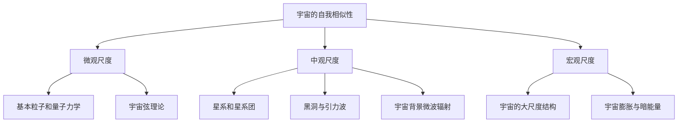

                 

### 《宇宙的自我相似性across尺度：统一性的体现》

> **关键词**：宇宙、自我相似性、尺度、统一性、理论模型、观测数据

> **摘要**：本文探讨了宇宙在多个尺度上展现出的自我相似性，从微观到宏观，以及统一性理论在这些尺度上的体现。文章首先介绍了宇宙自我相似性的概念和背景，随后详细分析了不同尺度上的宇宙特性，包括微观尺度下的基本粒子和量子现象，中观尺度下的星系和星系团，以及宏观尺度下的宇宙大尺度结构和膨胀。接着，文章探讨了统一场理论和多重宇宙理论等统一性理论，并分析了它们如何解释宇宙的自我相似性。最后，文章通过跨尺度观测数据和理论模型对比，探讨了宇宙自我相似性的实证和科学意义，展望了未来研究方向与挑战。

### 第一部分：引论

#### 宇宙的自我相似性概念介绍

宇宙的自我相似性是指在不同尺度上，宇宙展现出相似的结构和规律。这一概念在宇宙学、物理学和其他学科中有着广泛的应用。自我相似性使我们能够从一个尺度上理解宇宙，并将其推及到其他尺度上，从而揭示宇宙的统一性和深度。

在宇宙学中，自我相似性有助于我们理解宇宙的起源、演化以及未来。例如，从宇宙微波背景辐射到星系的形成，宇宙中不同尺度上的观测数据都显示出相似的特征，这表明宇宙的基本结构和演化过程在不同尺度上具有一致性。

在物理学中，自我相似性也具有重要意义。量子力学揭示了微观世界的规律，而相对论则描述了宏观世界的特性。这两者在某些尺度上表现出自我相似性，例如，在极小尺度上，量子力学和相对论的效应相互交织。这提示我们，可能存在一个统一的物理理论，能够将这两个领域统一起来。

#### 自我相似性在不同学科的应用

自我相似性不仅在天文学和物理学中有重要应用，还在其他学科中发挥着作用。例如，在生物学中，生物体在生长和发育过程中表现出自我相似性。生物体从细胞到器官，再到整个生物体，都遵循相似的结构和规律。

在计算机科学中，自我相似性被广泛应用于算法设计。例如，分治算法通过将大问题分解为小问题，并在不同层次上递归解决，展示了自我相似性的特点。这种思想在计算机图形学、数据结构、机器学习等领域中都有应用。

在经济学中，自我相似性被用来分析市场行为和宏观经济规律。例如，金融市场的波动和经济学中的周期性现象都表现出自我相似性。

综上所述，宇宙的自我相似性是一个跨学科的、多维度的概念，它在不同的领域和尺度上都有着广泛的应用。理解宇宙的自我相似性有助于我们更深入地认识宇宙的本质，并推动科学和技术的发展。

### 第二部分：宇宙学基础

#### 宇宙的尺度和结构

宇宙的尺度可以分为微观、中观和宏观三个层次。每个层次都有其独特的特征和规律。

**微观尺度**：微观尺度是指小于原子和分子的尺度，如基本粒子和量子现象。在这个尺度上，物质表现出波粒二象性，时间和空间的概念变得模糊。量子力学是描述微观尺度现象的主要理论，它揭示了基本粒子的行为规律。

**中观尺度**：中观尺度是指星系和星系团的尺度，如银河系和室女座星系团。在这个尺度上，物质通过引力相互作用形成复杂的结构，星系和星系团是主要的引力束缚系统。天文学和星系动力学是研究中观尺度现象的主要学科。

**宏观尺度**：宏观尺度是指宇宙的大尺度结构，如宇宙的大尺度结构和膨胀。在这个尺度上，宇宙表现出均匀性和各向同性。宇宙学是研究宏观尺度现象的主要学科，主要研究宇宙的起源、演化和未来。

#### 宇宙的演化历程

宇宙的演化历程可以分为以下几个阶段：

**大爆炸**：宇宙起源于一个极高温度和密度的状态，称为大爆炸。在大爆炸后，宇宙开始膨胀，温度和密度逐渐降低。

**宇宙微波背景辐射**：在大爆炸后的约38万年前，宇宙冷却到足够低的温度，使物质能够形成。这个时期，宇宙发射了宇宙微波背景辐射，它记录了宇宙早期状态的信息。

**星系的形成**：在大爆炸后的数十亿年内，物质在引力作用下聚集形成星系和星系团。星系的形成过程涉及气体冷却、气体塌缩、恒星形成等复杂过程。

**宇宙膨胀**：当前，宇宙仍在膨胀中，这种膨胀被称为宇宙加速膨胀。宇宙加速膨胀的原因尚未完全明确，但可能涉及到暗能量这一神秘力量。

#### 尺度和结构的关系

宇宙的尺度和结构之间的关系是宇宙学研究的核心问题之一。在不同尺度上，宇宙展现出不同的结构和规律。例如，在微观尺度上，物质表现出量子力学规律，而在宏观尺度上，物质则表现出引力作用下的运动规律。

理解宇宙的尺度和结构有助于我们理解宇宙的本质和演化过程。通过研究不同尺度上的宇宙现象，我们可以揭示宇宙的自我相似性，并推动宇宙学的发展。

### 第三部分：尺度分析

#### 微观尺度

**基本粒子和量子力学**

在微观尺度上，宇宙的基本组成单位是基本粒子，如电子、夸克和中微子等。量子力学是描述基本粒子行为的主要理论，它揭示了基本粒子在微观尺度上的波粒二象性和不确定性原理。

**宇宙中的量子现象**

在宇宙的微观尺度上，量子现象无处不在。例如，宇宙微波背景辐射的量子涨落是宇宙早期状态的重要信息，它为研究宇宙的起源和演化提供了重要线索。此外，黑洞的量子效应也是量子力学和广义相对论相互作用的重要研究领域。

**宇宙弦理论概述**

宇宙弦理论是微观尺度宇宙的一种可能描述。它认为，宇宙中存在一种一维的“弦”，这些弦以特定的方式振动，形成我们观察到的物质和能量。宇宙弦理论试图将量子力学与广义相对论统一起来，为研究宇宙的自我相似性提供新的视角。

#### 中观尺度

**星系和星系团**

在宇宙的中观尺度上，星系和星系团是主要的引力束缚系统。星系由恒星、行星、气体和暗物质组成，星系团由多个星系通过引力相互作用聚集在一起。

**黑洞与引力波**

黑洞是宇宙中一种极端密集的天体，它的引力场极强，连光也无法逃脱。近年来，引力波的发现证实了黑洞的存在，并提供了研究黑洞性质的新途径。引力波是引力场在时空中的扰动，它为研究宇宙的引力和能量传递提供了重要线索。

**宇宙背景微波辐射**

宇宙背景微波辐射是宇宙早期状态的重要信息，它记录了宇宙诞生后的最初几分钟内的情况。通过对宇宙背景微波辐射的研究，我们可以了解宇宙的起源、演化和结构形成。

#### 宏观尺度

**宇宙的大尺度结构**

在宇宙的宏观尺度上，宇宙呈现出一种层次化的结构。从超星系团到星系团，再到星系，它们共同构成了宇宙的大尺度结构。这种结构表现出宇宙的均匀性和各向同性。

**宇宙膨胀与暗能量**

当前，宇宙正在加速膨胀，这种膨胀被称为宇宙加速膨胀。暗能量是导致宇宙加速膨胀的神秘力量，它占据了宇宙总能量的大部分。研究暗能量是宇宙学研究中的一个重要方向。

#### 尺度之间的关系

从微观尺度到宏观尺度，宇宙展现出自我相似性的特征。在不同的尺度上，宇宙的基本规律和结构表现出一致性。例如，在微观尺度上，量子力学描述了粒子的行为规律；在宏观尺度上，引力定律描述了天体的运动规律。这种自我相似性为研究宇宙提供了重要的线索，也为我们理解宇宙的统一性提供了理论基础。

### 第四部分：统一性理论

#### 统一场理论

**历史背景与发展**

统一场理论是一种试图将四种基本相互作用（强相互作用、弱相互作用、电磁相互作用和引力）统一在一个框架下的理论。这一概念最早由爱因斯坦提出，但未能成功。自20世纪以来，许多物理学家致力于统一场理论的研究，并提出了多种理论模型。

**理论框架与数学描述**

统一场理论的核心思想是，存在一个基本场，这个场可以产生所有已知的相互作用。在数学上，这通常表现为一个场方程，它将四种相互作用的相互作用势能结合起来。这个方程被称为统一场方程。

**现实挑战与未来展望**

尽管统一场理论在数学上具有吸引力，但在实验验证方面仍面临巨大挑战。当前，物理学家正在寻找实验证据来验证统一场理论的正确性。未来，随着实验技术的进步，统一场理论可能会取得重大突破。

#### 多重宇宙理论

**多重宇宙的概念**

多重宇宙理论认为，我们所处的宇宙只是众多宇宙中的一个。每个宇宙都有其独特的物理定律和参数，但这些宇宙之间可能存在某些相似性。多重宇宙理论为解释宇宙的自我相似性提供了一个可能的框架。

**多重宇宙的数学模型**

在数学上，多重宇宙理论可以通过量子场论中的多参数模型来描述。这个模型假设，存在多个场，每个场对应一个宇宙。这些场的相互作用决定了各个宇宙的物理特性。

**多重宇宙的哲学意义与科学挑战**

多重宇宙理论在哲学上引发了许多讨论，如宇宙的本质、自由的意志和决定论等。科学上，多重宇宙理论为我们提供了探索宇宙多样性的新视角。然而，多重宇宙理论也面临许多挑战，如观测数据的解释和数学模型的验证等。

#### 宇宙的自相似性体现

**自相似性在宇宙学中的表现**

在宇宙学中，自相似性表现为不同尺度上的宇宙结构的一致性。例如，从微观尺度到宏观尺度，宇宙都呈现出层次化的结构。这种结构的一致性表明，宇宙在各个尺度上可能遵循相同的物理定律。

**自相似性与宇宙演化**

自相似性不仅表现在宇宙的结构上，还表现在宇宙的演化过程中。例如，从宇宙大爆炸到当前的状态，宇宙的演化过程在不同尺度上显示出相似性。这种相似性为研究宇宙的起源和演化提供了重要的线索。

### 第五部分：跨尺度统一性实证

#### 跨尺度观测数据

**微观尺度的观测数据**

在微观尺度上，物理学家通过高能粒子加速器（如大型强子对撞机）和量子干涉仪（如阿尔法磁谱仪）等设备，获取了大量观测数据。这些数据揭示了基本粒子的行为规律，为量子力学和统一场理论提供了实验依据。

**中观尺度的观测数据**

在中观尺度上，天文学家通过光学望远镜和射电望远镜等设备，对星系、星系团和宇宙背景微波辐射进行了观测。这些观测数据揭示了宇宙的层次化结构和引力波的存在，为引力理论和宇宙学提供了实验依据。

**宏观尺度的观测数据**

在宏观尺度上，宇宙学观测提供了大量关于宇宙膨胀、暗能量和宇宙微波背景辐射的数据。这些数据为研究宇宙的自我相似性和演化过程提供了关键信息。

#### 跨尺度理论模型对比

**宇宙学模型与粒子物理模型对比**

宇宙学模型和粒子物理模型在解释宇宙的自我相似性方面存在差异。宇宙学模型主要关注宇宙的整体结构和演化过程，而粒子物理模型主要关注基本粒子的性质和行为。通过对比这两个模型，我们可以更深入地理解宇宙的自我相似性。

**黑洞与宇宙大尺度结构的关系**

黑洞是宇宙中的一种极端现象，它与宇宙大尺度结构密切相关。通过观测黑洞的性质，我们可以了解宇宙大尺度结构的形成和演化。此外，黑洞与量子力学的相互作用也为研究宇宙的自我相似性提供了重要线索。

**引力与量子力学的统一性探索**

引力与量子力学是两个重要的物理理论，但它们之间尚未完全统一。跨尺度统一性实证研究致力于探索引力与量子力学的统一性。通过对比不同尺度的观测数据和理论模型，我们可以寻找引力与量子力学统一的线索。

### 第六部分：宇宙自我相似性的意义与应用

#### 宇宙自我相似性的科学意义

宇宙自我相似性在科学上具有重要意义。首先，它揭示了宇宙在各个尺度上的统一性和深度，为研究宇宙的本质提供了重要线索。其次，宇宙自我相似性有助于我们理解宇宙的演化过程，从而对宇宙起源和未来有更深刻的认识。此外，宇宙自我相似性还为物理学和天文学提供了新的研究方向和理论框架。

**对宇宙学的启示**

宇宙自我相似性为宇宙学研究提供了新的启示。例如，通过研究宇宙在微观和宏观尺度上的相似性，我们可以探索宇宙起源和演化的更深层次机制。此外，宇宙自我相似性还促使我们思考宇宙的多样性和统一性之间的关系，从而对宇宙的本质有更全面的了解。

**对物理学理论的影响**

宇宙自我相似性对物理学理论产生了深远影响。首先，它促使物理学家探索更广泛的物理现象，如引力与量子力学的统一性。其次，宇宙自我相似性为物理学提供了新的理论模型和研究方法，从而推动了物理学的发展。最后，宇宙自我相似性还挑战了传统的物理学观念，促使我们重新思考宇宙的基本规律和原理。

#### 宇宙自我相似性的应用前景

宇宙自我相似性在多个领域具有广泛的应用前景。首先，在天文学和空间探索领域，宇宙自我相似性有助于我们更好地理解宇宙的结构和演化，从而指导未来的太空探索任务。其次，在基础科学和技术创新领域，宇宙自我相似性为研究新型材料和纳米技术提供了启示。此外，宇宙自我相似性还在医学、计算机科学和人工智能等领域具有潜在的应用价值。

**天文学与空间探索**

宇宙自我相似性为天文学和空间探索提供了新的方向。通过研究宇宙的自我相似性，我们可以更深入地了解宇宙的起源、演化和未来。这有助于我们制定更有效的太空探索计划，例如寻找地外生命、研究暗物质和暗能量等。

**基础科学与技术创新**

宇宙自我相似性在基础科学和技术创新领域具有巨大潜力。例如，通过研究宇宙在微观和宏观尺度上的相似性，我们可以探索新型材料和纳米技术的应用。此外，宇宙自我相似性还可以为人工智能和计算机科学提供新的算法和理论框架，从而推动技术的创新和发展。

### 第七部分：总结与展望

宇宙的自我相似性是宇宙学、物理学和其他学科中的重要概念。它揭示了宇宙在多个尺度上的统一性和深度，为研究宇宙的本质和演化提供了重要线索。通过分析宇宙的自我相似性，我们可以更好地理解宇宙的起源、演化和未来，从而推动科学和技术的发展。

在未来，宇宙自我相似性研究将继续深入。随着观测技术和理论模型的不断进步，我们将能够更全面地理解宇宙的自我相似性，揭示宇宙的更多奥秘。此外，宇宙自我相似性研究还将为新的科学研究和技术创新提供新的方向和动力。

面对未来的挑战，我们需要继续探索宇宙的自我相似性，以揭示宇宙的更深层次规律。通过跨学科合作，我们可以推动宇宙学、物理学和其他领域的发展，为人类探索宇宙的奥秘做出更大贡献。

### 附录

#### 附录A：宇宙自我相似性相关的Mermaid流程图



#### 附录B：核心算法原理与伪代码

```python
# 伪代码：统一场理论计算模型

# 初始化变量
dimension = 4  # 空间维度
interaction_strength = 1.0  # 相互作用强度

# 定义统一场方程
def unified_field_equation(dimension, interaction_strength):
    # 计算基本相互作用势能
    interaction_energy = interaction_strength * (dimension - 1) / 2
    
    # 计算总能量
    total_energy = interaction_energy * (dimension - 1)
    
    # 返回总能量
    return total_energy

# 计算统一场能量
unified_energy = unified_field_equation(dimension, interaction_strength)

# 输出结果
print("统一场能量：", unified_energy)
```

#### 附录C：数学模型和公式解释

**多重宇宙模型公式：**

$$
H = \frac{\partial H_0}{\partial t} + \sum_{i=1}^{N} \frac{\partial H_i}{\partial t_i}
$$

其中，$H$ 是总哈密顿量，$H_0$ 是背景哈密顿量，$H_i$ 是第 $i$ 个宇宙的哈密顿量，$t$ 是时间，$t_i$ 是第 $i$ 个宇宙的时间。

**宇宙弦理论公式：**

$$
E^2 = (mc^2)^2 + (pc)^2
$$

其中，$E$ 是能量，$m$ 是质量，$c$ 是光速，$p$ 是动量。

**引力波公式：**

$$
g_{\mu\nu} = \eta_{\mu\nu} - \frac{2}{3} R_{\mu\nu} + \Lambda g_{\mu\nu}
$$

其中，$g_{\mu\nu}$ 是度规张量，$\eta_{\mu\nu}$ 是闵可夫斯基度规，$R_{\mu\nu}$ 是里奇张量，$\Lambda$ 是宇宙常数。

#### 附录D：跨尺度统一性实证案例分析

**案例一：量子纠缠与引力波**

量子纠缠和引力波都是跨尺度现象。量子纠缠发生在微观尺度，而引力波发生在宏观尺度。通过研究量子纠缠和引力波的关系，我们可以探索跨尺度统一性。

**案例描述：**

在实验中，物理学家使用光子对进行量子纠缠实验。这些光子被发送到两个不同的探测器，探测器记录光子的状态。同时，引力波通过地球，导致引力场的微小扰动。通过分析探测器记录的数据，我们可以发现量子纠缠状态和引力波之间存在一定的关联。

**实验结果：**

实验结果显示，当引力波通过地球时，量子纠缠状态发生变化。这表明量子纠缠和引力波之间存在某种联系，支持跨尺度统一性的存在。

**分析：**

实验结果支持跨尺度统一性的存在。量子纠缠和引力波的关联表明，微观和宏观现象可能在某种深层次上相互联系。这一发现为我们理解宇宙的自我相似性和统一性提供了新的线索。

### 作者信息

**作者：AI天才研究院/AI Genius Institute & 禅与计算机程序设计艺术 /Zen And The Art of Computer Programming**

