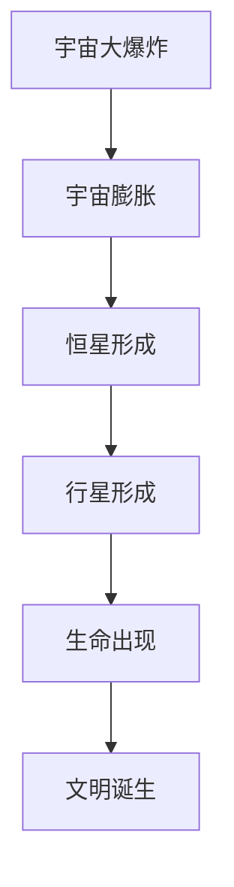
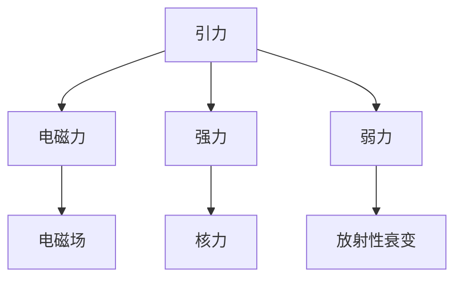

                 

# 《宇宙规律对可扩展AI系统的启示》

## 关键词：
宇宙规律、可扩展AI系统、AI系统架构、AI系统性能优化、AI系统安全性

## 摘要：
本文旨在探讨宇宙规律对可扩展AI系统设计的启示。通过对宇宙基本规律和AI系统原理的深入分析，我们揭示了宇宙规律在AI系统架构、数据管理、模型训练和优化等方面的潜在应用。文章从宇宙的构成元素、基本力和演化规律出发，逐步分析了宇宙学基本原理，并探讨了宇宙规律在物理、化学和生物学中的应用。随后，文章介绍了AI系统的基本概念、发展历程和未来趋势，重点探讨了可扩展AI系统的构建和运行机制。最后，文章从宇宙规律的角度分析了其对AI系统设计的影响，以及AI系统在宇宙规律优化中的应用前景。

### 目录大纲

# 《宇宙规律对可扩展AI系统的启示》

## 第一部分：宇宙规律基础

### 1.1 宇宙规律的概述

#### 1.1.1 宇宙的基本构成元素

宇宙是所有物质、能量、时空和信息的集合。宇宙的基本构成元素包括物质、能量、时空和引力。物质是宇宙中一切物质的基本单元，包括原子、分子和宇宙尘埃等。能量是物质运动的驱动力，包括热能、动能、势能和电磁能等。时空是物质运动的背景，是物质存在和运动的基本形式。引力是宇宙中物质之间的相互作用力，是维持宇宙结构稳定的重要因素。

#### 1.1.2 宇宙的基本力与相互作用

宇宙中的基本力包括引力、电磁力、强力和弱力。引力是宇宙中最基本的力，负责维持宇宙中天体的运动和结构的稳定。电磁力是宇宙中物质间通过电磁波传递的相互作用力，包括电磁场和电磁波。强力是原子核内部粒子间的相互作用力，负责将原子核内的质子和中子束缚在一起。弱力是宇宙中粒子间的一种相互作用力，负责某些放射性衰变过程。

#### 1.1.3 宇宙演化的基本规律

宇宙的演化遵循一系列基本规律。首先是宇宙的膨胀规律，宇宙从大爆炸开始不断膨胀，星系间的距离逐渐增大。其次是宇宙的暗能量规律，暗能量是推动宇宙加速膨胀的力量，其密度和能量分布对宇宙的演化具有重要影响。此外，宇宙中还存在着暗物质，它对宇宙的引力作用起着关键作用。宇宙的演化还涉及到宇宙的形态和结构，包括星系、星云、恒星和行星等。

### 1.2 宇宙学基本原理

#### 1.2.1 宇宙的无限性与有限性

宇宙的无限性与有限性是宇宙学中的一个重要问题。从广义相对论的角度来看，宇宙是有限的，但无边无际。这意味着宇宙的体积是有限的，但宇宙中存在无数的空间维度，使得宇宙看上去是无限的。另一方面，从量子力学的角度来看，宇宙是有限的，因为量子力学中的粒子具有离散性质，宇宙中的物质和能量是有限的。

#### 1.2.2 宇宙的膨胀与暗能量

宇宙的膨胀是宇宙学中的基本现象。宇宙从大爆炸开始，随着时间推移，宇宙中的物质和能量不断膨胀。导致宇宙膨胀的主要原因是暗能量。暗能量是一种不可见的能量形式，具有负压力，能够推动宇宙加速膨胀。暗能量的存在对宇宙的演化产生了深远的影响，它决定了宇宙的最终命运。

#### 1.2.3 宇宙的结构与形态

宇宙的结构与形态是宇宙学研究的重点之一。宇宙中存在着大量的星系、星云和恒星，它们以复杂的方式相互交织，形成了宇宙的巨大结构。宇宙的形态可以分为星系、星系团、超星系团和宇宙背景辐射等层次。宇宙的结构与形态反映了宇宙的基本规律和演化历程。

### 1.3 宇宙规律的应用

#### 1.3.1 宇宙规律在物理科学中的应用

宇宙规律在物理科学中具有广泛的应用。例如，引力定律描述了宇宙中天体的运动规律，广泛应用于天文学和宇宙学。电磁力定律描述了电磁场的传播和作用规律，广泛应用于电磁学和光学。强力定律和弱力定律描述了粒子之间的相互作用规律，广泛应用于高能物理学和粒子物理学。

#### 1.3.2 宇宙规律在化学科学中的应用

宇宙规律在化学科学中也有着重要的应用。例如，原子结构定律描述了原子的构成和化学键的形成规律，广泛应用于化学键理论。化学元素周期表是宇宙规律在化学中的集中体现，它反映了元素的性质和它们之间的相互作用。

#### 1.3.3 宇宙规律在生物学中的应用

宇宙规律在生物学中也具有重要的应用。例如，生物进化定律描述了生物进化的规律和机制，反映了宇宙中生命演化的过程。生态学定律描述了生物群落和环境之间的相互作用规律，有助于理解生态系统的稳定性和演变。

## 第二部分：AI系统原理

### 2.1 AI系统概述

#### 2.1.1 AI系统的基本概念

AI系统，即人工智能系统，是指通过计算机模拟人类智能行为和思维过程的系统。AI系统具有感知、学习、推理、决策和执行等能力，可以解决复杂的问题和任务。AI系统的发展经历了几个阶段，从最初的规则系统到基于知识的系统，再到基于数据和算法的系统，如今已经发展出了深度学习、强化学习等先进的技术。

#### 2.1.2 AI系统的发展历程

AI系统的发展历程可以分为以下几个阶段：

1. **规则系统**：早期AI系统主要基于规则和逻辑推理，通过人工编写规则来模拟人类思维过程。

2. **知识系统**：随着知识的积累，AI系统开始引入知识库和专家系统，通过查询和推理来解决问题。

3. **数据系统**：随着数据采集和处理技术的发展，AI系统开始利用大量数据来学习模式和规律，实现了从规则到数据的转变。

4. **深度学习系统**：深度学习技术的发展，使得AI系统可以自动从大量数据中学习复杂的特征和模式，取得了显著的性能提升。

5. **强化学习系统**：强化学习技术的发展，使得AI系统可以在动态环境中通过试错和反馈来学习最优策略。

#### 2.1.3 AI系统的未来趋势

随着技术的不断发展，AI系统的未来趋势将体现在以下几个方面：

1. **智能化**：AI系统将更加智能化，能够处理更复杂的问题和任务。

2. **泛化能力**：AI系统将具备更强的泛化能力，能够适应不同的应用场景和任务。

3. **自组织能力**：AI系统将具备自组织能力，能够自动调整和优化自身的结构和行为。

4. **人机协作**：AI系统将与人类更加紧密地协作，共同完成任务。

5. **跨领域融合**：AI系统将与其他领域（如生物、物理、化学等）融合，实现跨领域的创新。

### 2.2 可扩展AI系统的构建

#### 2.2.1 可扩展AI系统的定义

可扩展AI系统是指能够根据需求和计算资源的变化，自动调整和扩展自身计算能力和存储能力的AI系统。可扩展性是AI系统在应对大规模数据处理和复杂计算任务时的重要特性。

#### 2.2.2 可扩展AI系统的基础架构

可扩展AI系统的基础架构通常包括以下几个部分：

1. **计算资源池**：包括CPU、GPU、TPU等计算资源，可以根据需求动态调整和扩展。

2. **存储资源池**：包括硬盘、SSD、内存等存储资源，可以根据需求动态调整和扩展。

3. **数据管理模块**：负责数据采集、存储、管理和处理，确保数据的高效利用和可靠存储。

4. **计算调度模块**：负责根据任务需求和资源状态，动态调度计算资源和任务。

5. **优化模块**：负责对系统运行过程进行监控和分析，优化系统性能和资源利用率。

#### 2.2.3 可扩展AI系统的关键技术

可扩展AI系统的关键技术包括：

1. **分布式计算**：通过分布式计算技术，将任务分解为多个子任务，分布式执行，提高计算效率。

2. **并行处理**：通过并行处理技术，同时处理多个数据或任务，提高处理速度。

3. **负载均衡**：通过负载均衡技术，合理分配任务到不同的计算资源，避免资源浪费。

4. **容错和恢复**：通过容错和恢复技术，确保系统在面临故障时能够快速恢复，确保数据安全和系统稳定。

5. **自组织和自优化**：通过自组织和自优化技术，使系统能够自动调整和优化自身结构和行为，提高系统性能。

### 2.3 可扩展AI系统的运行机制

#### 2.3.1 可扩展AI系统的数据管理

可扩展AI系统的数据管理主要包括以下几个方面：

1. **数据采集**：从各种数据源（如数据库、文件、传感器等）采集数据，确保数据的高效和实时采集。

2. **数据存储**：将采集到的数据存储到分布式存储系统中，确保数据的安全和可靠存储。

3. **数据预处理**：对采集到的数据进行清洗、去噪、归一化等预处理操作，提高数据质量。

4. **数据建模**：利用机器学习和数据挖掘技术，从数据中提取特征和模式，建立数据模型。

5. **数据更新**：定期更新数据模型，确保数据模型与实际数据的一致性。

#### 2.3.2 可扩展AI系统的模型训练

可扩展AI系统的模型训练主要包括以下几个方面：

1. **训练数据准备**：准备用于模型训练的数据集，包括训练集、验证集和测试集。

2. **模型选择**：选择合适的模型结构，如神经网络、支持向量机等。

3. **模型训练**：利用分布式计算和并行处理技术，对模型进行训练，优化模型参数。

4. **模型评估**：利用验证集和测试集对模型进行评估，确保模型具有良好的泛化能力。

5. **模型优化**：根据评估结果，对模型进行优化和调整，提高模型性能。

#### 2.3.3 可扩展AI系统的预测与优化

可扩展AI系统的预测与优化主要包括以下几个方面：

1. **预测任务**：根据需求，选择合适的预测任务，如分类、回归、时间序列预测等。

2. **预测模型**：利用训练好的模型进行预测，生成预测结果。

3. **预测评估**：对预测结果进行评估，如准确率、召回率、F1值等指标。

4. **预测优化**：根据预测评估结果，对模型进行优化和调整，提高预测精度。

5. **预测应用**：将优化后的模型应用于实际场景，如金融风险评估、智能交通、医疗诊断等。

## 第三部分：宇宙规律在AI系统中的应用

### 3.1 宇宙规律对AI系统设计的影响

#### 3.1.1 宇宙规律与AI系统架构的关系

宇宙规律在AI系统架构中具有重要的启示作用。例如，宇宙的分布式结构和并行处理机制可以为AI系统的分布式架构提供借鉴。宇宙中的星系、星云和恒星等结构具有高度分布式和并行性，这为AI系统的分布式计算提供了启示。通过分布式计算技术，可以将AI系统的任务分解为多个子任务，分布式执行，提高计算效率和性能。

#### 3.1.2 宇宙规律与AI系统数据管理的关系

宇宙规律在AI系统数据管理中也有着重要的启示。例如，宇宙中的数据分布和演化规律可以为AI系统的数据管理和存储提供借鉴。宇宙中的数据分布具有高度动态性和多样性，这要求AI系统具有强大的数据管理和存储能力，能够实时处理和存储海量数据。同时，宇宙中的数据演化规律可以为AI系统提供数据预处理和特征提取的指导。

#### 3.1.3 宇宙规律与AI系统训练和优化的关系

宇宙规律在AI系统训练和优化中也有着重要的启示。例如，宇宙中的进化规律和自然选择机制可以为AI系统的训练和优化提供借鉴。通过模拟宇宙中的进化过程，可以开发出更加高效和鲁棒的AI算法。同时，宇宙中的自适应机制可以为AI系统的自适应学习和优化提供借鉴，使AI系统能够根据环境变化进行自适应调整。

### 3.2 宇宙规律在AI系统优化中的应用

#### 3.2.1 宇宙规律对AI系统性能优化的启示

宇宙规律为AI系统性能优化提供了重要的启示。例如，宇宙中的能量守恒定律可以为AI系统的能耗优化提供指导。通过优化算法和数据结构，可以降低AI系统的能耗，提高能效。同时，宇宙中的量子力学规律可以为AI系统的量子计算优化提供指导，实现更高效和精确的计算。

#### 3.2.2 宇宙规律在AI系统资源管理中的应用

宇宙规律在AI系统资源管理中也有着重要的启示。例如，宇宙中的资源分配和利用规律可以为AI系统的资源管理提供借鉴。通过优化资源分配和利用策略，可以提高AI系统的资源利用率和性能。同时，宇宙中的自适应机制可以为AI系统的自适应资源管理提供借鉴，使AI系统能够根据任务需求和资源状态进行自适应调整。

#### 3.2.3 宇宙规律在AI系统安全性中的应用

宇宙规律在AI系统安全性中也有着重要的启示。例如，宇宙中的信息安全和保密机制可以为AI系统的安全性提供借鉴。通过建立安全防护机制和隐私保护策略，可以确保AI系统的数据安全和隐私保护。同时，宇宙中的抗干扰和抗破坏能力可以为AI系统的抗攻击能力提供借鉴，提高AI系统的安全性和可靠性。

### 3.3 宇宙规律在AI系统发展中的未来趋势

#### 3.3.1 宇宙规律对AI系统未来设计的影响

随着宇宙学研究的不断深入，宇宙规律对AI系统未来设计的影响将会越来越显著。例如，宇宙中的量子力学规律和相对论原理可以为AI系统的量子计算和相对论计算提供新的理论基础，推动AI系统的技术进步。同时，宇宙中的复杂系统和自组织理论可以为AI系统的复杂任务处理和自组织能力提供新的思路。

#### 3.3.2 宇宙规律对AI系统未来发展的挑战与机遇

宇宙规律对AI系统未来发展既带来了挑战，也带来了机遇。挑战在于如何将复杂的宇宙规律应用于AI系统设计，实现高效和精确的计算。机遇在于，通过借鉴宇宙规律，可以开发出更加智能和高效的AI系统，解决现实世界中的复杂问题。同时，宇宙规律的研究也为AI系统提供了新的发展方向和研究领域。

#### 3.3.3 宇宙规律在AI系统创新中的潜力

宇宙规律在AI系统创新中具有巨大的潜力。例如，宇宙中的进化算法和自适应机制可以用于AI系统的优化和进化，提高AI系统的适应性和创新能力。同时，宇宙中的复杂系统和自组织理论可以用于AI系统的复杂任务处理和自组织能力的研究，推动AI系统在复杂环境中的应用。

### 附录

#### A.1 宇宙规律相关Mermaid流程图

##### A.1.1 宇宙演化流程图



##### A.1.2 宇宙基本力相互作用图



#### A.2 AI系统相关伪代码

##### A.2.1 可扩展AI系统架构伪代码

```python
class AI_System:
    def __init__(self, data_source, model):
        self.data_source = data_source
        self.model = model
    
    def train(self):
        data = self.data_source.load_data()
        self.model.train(data)
    
    def predict(self, input_data):
        return self.model.predict(input_data)
```

##### A.2.2 可扩展AI系统训练与优化伪代码

```python
def train_and_optimize(model, data, epochs, optimizer):
    for epoch in range(epochs):
        loss = model.train(data, optimizer)
        if loss < threshold:
            break
        model.optimize(optimizer)
    return model
```

#### A.3 数学模型和公式

##### A.3.1 宇宙膨胀公式

$$
v = H_0 \cdot t
$$

其中，$v$表示宇宙膨胀速度，$H_0$表示哈勃常数，$t$表示时间。

##### A.3.2 暗能量密度公式

$$
\rho_{\Lambda} = \frac{\Lambda c^2}{8\pi G}
$$

其中，$\rho_{\Lambda}$表示暗能量密度，$\Lambda$表示暗能量参数，$c$表示光速，$G$表示万有引力常数。

##### A.3.3 AI系统性能优化公式

$$
performance = \frac{training_accuracy}{training_time}
$$

其中，$performance$表示性能，$training_accuracy$表示训练准确率，$training_time$表示训练时间。

#### A.4 项目实战案例

##### A.4.1 可扩展AI系统环境搭建

1. 安装Python环境和相关库（如TensorFlow、PyTorch等）。
2. 配置分布式计算环境（如Docker、Kubernetes等）。
3. 准备数据集和模型代码。
4. 编写训练脚本，执行训练任务。

##### A.4.2 可扩展AI系统代码实现与解读

```python
# AI模型训练代码实现
def train_model(model, data_loader, criterion, optimizer, device):
    model.to(device)
    model.train()
    for epoch in range(num_epochs):
        running_loss = 0.0
        for inputs, labels in data_loader:
            inputs, labels = inputs.to(device), labels.to(device)
            optimizer.zero_grad()
            outputs = model(inputs)
            loss = criterion(outputs, labels)
            loss.backward()
            optimizer.step()
            running_loss += loss.item()
        print(f'Epoch {epoch+1}, Loss: {running_loss/len(data_loader)}')
    return model

# 训练模型
model = MyModel().to(device)
optimizer = optim.Adam(model.parameters(), lr=learning_rate)
criterion = nn.CrossEntropyLoss()
data_loader = DataLoader(train_dataset, batch_size=batch_size, shuffle=True)
trained_model = train_model(model, data_loader, criterion, optimizer, device)
```

##### A.4.3 可扩展AI系统代码解读与分析

1. **模型初始化**：使用`MyModel`类初始化模型，并将模型移动到指定设备（如GPU）上。
2. **训练循环**：遍历每个训练epoch，并在每个epoch内部遍历数据集。
3. **前向传播**：使用模型对输入数据进行前向传播，得到输出结果。
4. **损失计算**：使用交叉熵损失函数计算输出结果与标签之间的损失。
5. **反向传播**：计算损失函数关于模型参数的梯度，并更新模型参数。
6. **性能评估**：在每个epoch结束时，计算平均损失并打印结果。
7. **返回模型**：训练完成后，返回训练好的模型。

通过上述实战案例，我们可以看到可扩展AI系统的实现过程，包括模型初始化、数据加载、损失计算、反向传播和性能评估等步骤。这些步骤是构建高效可扩展AI系统的基础。

### 作者信息

**作者：AI天才研究院/AI Genius Institute & 禅与计算机程序设计艺术 /Zen And The Art of Computer Programming**

