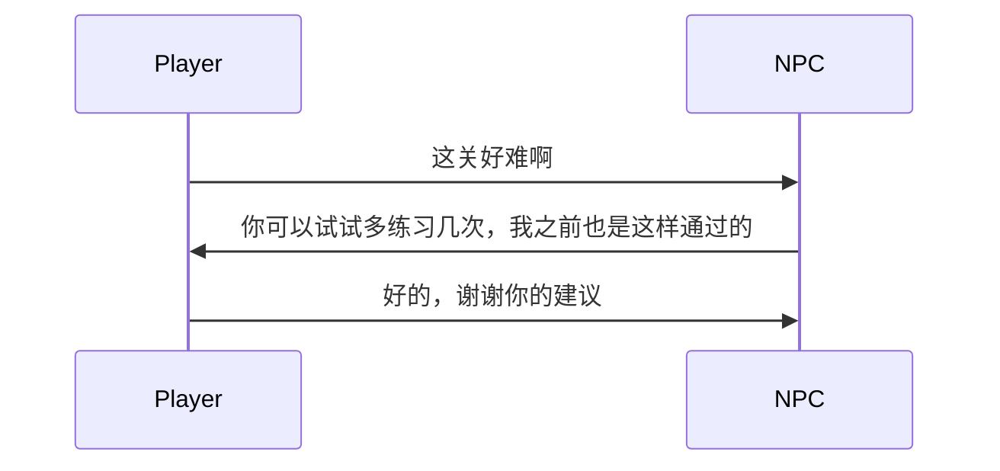

                 

# 完美世界2024游戏NPC对话系统AI校招面试重点

> **关键词：** 游戏NPC对话系统，人工智能，自然语言处理，对话系统架构，情感分析，面试技巧

> **摘要：** 本文将深入探讨2024年游戏NPC对话系统AI的相关知识，旨在为准备参加校招面试的AI领域学生提供全面的指导。通过解析核心理论、对话系统架构、情感分析以及面试策略，本文将帮助读者掌握游戏NPC对话系统AI的关键技能，为面试做好充分准备。

## 目录大纲

### 第一部分：游戏NPC对话系统AI基础理论

#### 第1章：AI在游戏NPC对话系统中的应用概述

1.1.1 游戏NPC对话系统的现状与挑战  
1.1.2 AI在游戏NPC对话系统中的应用前景  
1.1.3 AI校招面试的重要性

#### 第2章：自然语言处理基础

2.1.1 语言模型的基本概念  
2.1.2 词嵌入技术  
2.1.3 序列模型与注意力机制

#### 第3章：对话系统架构与设计

3.1.1 对话系统概述  
3.1.2 对话系统架构设计  
3.1.3 用户意图识别与响应生成

#### 第4章：情感分析与理解

4.1.1 情感分析概述  
4.1.2 情感识别算法  
4.1.3 情感推理与演化

#### 第5章：AI校招面试重点分析

5.1.1 面试官关注的核心能力  
5.1.2 面试准备与策略  
5.1.3 面试常见问题与回答技巧

#### 第6章：游戏NPC对话系统项目实战

6.1.1 项目背景与目标  
6.1.2 项目开发流程  
6.1.3 代码实现与解读

#### 第7章：未来展望与趋势

7.1.1 游戏NPC对话系统的发展趋势  
7.1.2 AI校招面试的重点变化  
7.1.3 未来可能的应用场景

### 附录

#### 附录A：自然语言处理与对话系统常用工具

A.1 语言模型工具  
A.2 对话系统框架  
A.3 情感分析工具

#### 附录B：AI校招面试资源

B.1 常见面试问题汇总  
B.2 面试经验分享  
B.3 相关学习资源推荐

## 第一部分：游戏NPC对话系统AI基础理论

### 第1章：AI在游戏NPC对话系统中的应用概述

#### 1.1.1 游戏NPC对话系统的现状与挑战

随着游戏产业的快速发展，游戏NPC（非玩家角色）对话系统已成为游戏体验的重要组成部分。传统上，NPC对话系统依赖于预定义的脚本，这限制了对话的多样性和互动性。然而，随着人工智能技术的进步，尤其是自然语言处理（NLP）和深度学习的发展，NPC对话系统正逐渐走向智能化。

**现状：** 当前，许多大型游戏已经开始采用基于AI的NPC对话系统。这些系统通过使用机器学习算法和大型语言模型，可以生成更自然、更有深度的对话内容。例如，OpenAI的GPT-3模型已被用于创建复杂的游戏NPC对话。

**挑战：** 尽管AI在NPC对话系统中的应用前景广阔，但仍面临一些挑战。首先，对话系统的复杂性使得开发和维护成本较高。其次，自然语言理解的深度和广度有限，导致对话质量参差不齐。此外，情感分析和理解方面的不足，使得NPC对话缺乏真实感。

#### 1.1.2 AI在游戏NPC对话系统中的应用前景

随着技术的不断发展，AI在游戏NPC对话系统中的应用前景十分广阔。首先，通过深度学习和自然语言处理技术，NPC对话系统可以更好地理解玩家意图，提供更个性化的互动体验。其次，情感分析技术的进步使得NPC对话更具情感共鸣，从而提高游戏的沉浸感。

**前景展望：** 未来，AI在NPC对话系统中的应用将更加广泛和深入。例如，基于强化学习的技术可以使得NPC具有更高的自主性和适应性，能够根据玩家行为动态调整对话策略。此外，虚拟现实（VR）和增强现实（AR）技术的结合，将为NPC对话系统带来新的发展机遇。

#### 1.1.3 AI校招面试的重要性

对于准备参加AI校招面试的学生来说，了解游戏NPC对话系统的AI基础理论至关重要。这不仅有助于掌握核心知识，还能提高面试竞争力。以下是一些面试官可能会关注的核心能力：

1. **自然语言处理技术：** 理解语言模型、词嵌入、序列模型等基础概念，以及如何应用于NPC对话系统。
2. **对话系统架构设计：** 了解对话系统的组成和运作原理，包括用户意图识别、对话管理、响应生成等。
3. **情感分析与理解：** 掌握情感分析的基本原理和方法，以及如何将其应用于NPC对话系统，提升对话的丰富性和情感共鸣。
4. **面试准备与策略：** 提前准备常见面试问题，掌握有效的回答技巧，提高面试表现。

通过深入学习和实践，学生可以更好地准备AI校招面试，为未来的职业生涯奠定坚实基础。

---

接下来，我们将继续深入探讨自然语言处理基础，对话系统架构与设计，情感分析与理解等核心理论，帮助读者全面掌握游戏NPC对话系统AI的关键技能。

## 第二部分：自然语言处理基础

### 第2章：自然语言处理基础

自然语言处理（NLP）是人工智能领域的一个重要分支，主要研究如何让计算机理解、生成和处理人类自然语言。在游戏NPC对话系统中，NLP技术是实现智能对话的关键。本章将介绍NLP的基本概念、语言模型、词嵌入技术和序列模型与注意力机制。

### 2.1.1 语言模型的基本概念

语言模型是NLP的核心组成部分，它用于预测下一个单词或词组。在游戏NPC对话系统中，语言模型用于生成自然的对话回复。

**基本概念：**
- **词汇表（Vocabulary）：** 语言模型中的所有单词和符号的集合。
- **概率分布（Probability Distribution）：** 模型为每个单词或词组分配的概率。
- **条件概率（Conditional Probability）：** 在已知前文的情况下，预测下一个单词的概率。

**模型类型：**
- **N-gram模型：** 基于历史信息预测下一个单词，简单但效果有限。
- **神经网络模型：** 如循环神经网络（RNN）和Transformer，能够捕捉长距离依赖关系，效果更佳。

**应用场景：**
- **对话生成：** 利用语言模型生成自然的对话回复。
- **拼写纠错：** 根据上下文预测正确的拼写。
- **机器翻译：** 将一种语言的文本翻译成另一种语言。

### 2.1.2 词嵌入技术

词嵌入是将单词转换为向量表示的技术，使得计算机能够处理和比较自然语言词汇。

**基本概念：**
- **向量空间（Vector Space）：** 每个单词被表示为一个向量。
- **维度（Dimension）：** 向量的长度，通常为几十到几千。
- **相似性度量（Similarity Measure）：** 如余弦相似度，用于比较向量之间的相似性。

**模型类型：**
- **基于统计的方法：** 如Count-based模型和TF-IDF，使用单词出现的频率和重要程度。
- **基于神经网络的方法：** 如Word2Vec和GloVe，使用神经网络训练生成词向量。

**应用场景：**
- **语义分析：** 分析单词的含义和关系。
- **文本分类：** 将文本分类到预定义的类别。
- **情感分析：** 确定文本的情感倾向。

### 2.1.3 序列模型与注意力机制

序列模型是处理序列数据的模型，如文本和语音。注意力机制是一种能够关注序列中特定部分的技术，常用于提高模型的性能。

**基本概念：**
- **序列（Sequence）：** 一系列数据点，如单词、字符或声音。
- **隐藏状态（Hidden State）：** 序列模型内部的状态，用于预测下一个数据点。
- **注意力机制（Attention Mechanism）：** 通过加权每个数据点来提高模型对重要信息的关注。

**模型类型：**
- **循环神经网络（RNN）：** 能够处理变长序列，但存在梯度消失和梯度爆炸问题。
- **长短时记忆网络（LSTM）：** 改进RNN，能够捕捉长距离依赖关系。
- **门控循环单元（GRU）：** 进一步简化LSTM，但效果相似。
- **Transformer：** 基于自注意力机制的模型，能够处理长序列并具有高效并行计算能力。

**应用场景：**
- **文本生成：** 如自动摘要、机器翻译和对话生成。
- **语音识别：** 将语音信号转换为文本。
- **语音合成：** 将文本转换为自然的语音。

### 2.1.4 应用与实例

以下是一个简单的自然语言处理实例，演示了如何使用语言模型和词嵌入技术生成对话回复。

**实例：生成对话回复**

假设我们有一个语言模型，可以预测下一个单词。输入句子为：“你好，我想知道今天的天气怎么样？”输出预测的下一个单词可能是“很”。

**伪代码：**

```python
# 输入句子
input_sentence = "你好，我想知道今天的天气怎么样？"

# 使用语言模型预测下一个单词
predicted_word = language_model.predict_next_word(input_sentence)

# 输出预测结果
print("下一个单词可能是：" + predicted_word)
```

**结果：**
```
下一个单词可能是：很
```

通过上述实例，我们可以看到语言模型和词嵌入技术在生成自然对话回复中的应用。在游戏NPC对话系统中，这类技术可以实现智能、自然的对话交互。

---

接下来，我们将讨论对话系统架构与设计，深入探讨对话系统的组成、架构设计以及用户意图识别与响应生成等关键问题。

## 第三部分：对话系统架构与设计

### 第3章：对话系统架构与设计

对话系统（Dialogue System）是人工智能领域的一个重要研究方向，旨在实现人与计算机之间的自然交互。在游戏NPC对话系统中，对话系统负责处理玩家与NPC之间的对话，提供丰富的互动体验。本章将介绍对话系统的基本概念、架构设计以及用户意图识别与响应生成。

### 3.1.1 对话系统概述

对话系统是一种智能交互系统，能够理解用户输入，生成合适的响应，并在对话过程中进行适当的调整。它通常由多个组件组成，包括语音识别、自然语言理解、对话管理和文本生成等。

**基本概念：**
- **用户输入（User Input）：** 用户通过语音或文本形式输入的信息。
- **自然语言理解（Natural Language Understanding, NLU）：** 将用户输入转换为计算机可以处理的结构化数据。
- **对话管理（Dialogue Management）：** 管理对话流程，包括上下文管理、意图识别和动作规划。
- **文本生成（Text Generation）：** 生成自然、流畅的文本响应。

**功能：**
- **语音识别：** 将语音输入转换为文本。
- **意图识别：** 确定用户输入的含义和目的。
- **上下文管理：** 记录并利用对话历史，提高响应的连贯性和准确性。
- **响应生成：** 生成合适的文本或语音响应。

### 3.1.2 对话系统架构设计

对话系统的架构设计直接影响到系统的性能和用户体验。一个典型的对话系统架构包括以下几个关键组件：

1. **语音识别模块：** 将语音输入转换为文本。这一模块可以使用深度学习技术，如卷积神经网络（CNN）或递归神经网络（RNN）。
2. **自然语言理解模块（NLU）：** 将文本输入转换为结构化数据，包括词嵌入、语法分析和实体识别等。这一模块通常使用预训练的语言模型，如BERT或GPT。
3. **对话管理模块：** 负责对话流程的管理，包括意图识别、上下文管理和动作规划。这一模块通常采用基于规则的或基于机器学习的方法。
4. **文本生成模块：** 根据对话管理模块的输出，生成自然、流畅的文本或语音响应。这一模块可以使用生成模型，如Transformer或GPT。

**架构设计要点：**
- **模块化设计：** 各个模块之间应独立且易于集成，便于维护和升级。
- **可扩展性：** 系统应能够适应不同的应用场景和对话需求，具备良好的可扩展性。
- **高效性：** 系统应具备高效的响应速度，确保良好的用户体验。

### 3.1.3 用户意图识别与响应生成

用户意图识别是对话系统的核心任务之一，旨在理解用户输入的含义和目的。响应生成则是根据用户意图生成合适的响应。

**用户意图识别：**
- **意图分类（Intent Classification）：** 将用户输入分类到预定义的意图类别。这通常使用分类算法，如支持向量机（SVM）或深度学习模型。
- **实体识别（Entity Recognition）：** 从用户输入中提取关键信息，如时间、地点、人名等。这通常使用命名实体识别（NER）技术。

**响应生成：**
- **模板匹配（Template Matching）：** 根据预定义的模板生成响应。
- **文本生成（Text Generation）：** 使用生成模型生成自然、个性化的响应。

**示例：**

**输入：** "你好，我想预订明天的电影票。"

**意图识别：** 预订电影票。

**响应生成：** "您好，请问您想看哪部电影，以及几点的场次呢？"

---

通过深入理解对话系统的架构设计，我们可以更好地开发出智能、高效的NPC对话系统。在接下来的章节中，我们将探讨情感分析与理解，为NPC对话系统注入更多真实感和情感共鸣。

### 3.1.4 对话系统架构示例

为了更直观地理解对话系统架构，我们可以通过一个简单的示例来展示其组件和流程。以下是一个基本的对话系统架构示例，包含语音识别、自然语言理解、对话管理和文本生成四个关键模块。

#### 示例架构


1. **语音识别模块（Speech Recognition）：**
   - **功能：** 负责将语音输入转换为文本。
   - **技术：** 使用深度学习模型，如卷积神经网络（CNN）或递归神经网络（RNN）。
   - **输入：** 语音信号。
   - **输出：** 文本输入。

2. **自然语言理解模块（Natural Language Understanding, NLU）：**
   - **功能：** 负责将文本输入转换为结构化数据，如词嵌入、语法分析和实体识别。
   - **技术：** 使用预训练的语言模型，如BERT或GPT。
   - **输入：** 文本输入。
   - **输出：** 结构化数据，包括意图和实体。

3. **对话管理模块（Dialogue Management）：**
   - **功能：** 负责管理对话流程，包括意图识别、上下文管理和动作规划。
   - **技术：** 结合基于规则的和基于机器学习的方法。
   - **输入：** 结构化数据。
   - **输出：** 用户意图和动作计划。

4. **文本生成模块（Text Generation）：**
   - **功能：** 负责生成自然、流畅的文本或语音响应。
   - **技术：** 使用生成模型，如Transformer或GPT。
   - **输入：** 用户意图和上下文。
   - **输出：** 文本或语音响应。

#### 对话流程

1. **用户输入：** 用户向NPC发出语音或文本请求。
2. **语音识别：** 将语音输入转换为文本。
3. **NLU处理：** 对文本输入进行词嵌入、语法分析和实体识别。
4. **意图识别：** 确定用户输入的意图。
5. **对话管理：** 根据用户意图和上下文生成动作计划。
6. **文本生成：** 生成自然、流畅的文本或语音响应。
7. **响应输出：** 将响应输出给用户。

通过上述架构和流程，NPC可以理解用户的意图并生成相应的响应，从而实现自然、流畅的对话交互。

### 3.1.5 对话系统架构的Mermaid流程图

为了更清晰地展示对话系统的架构和流程，我们可以使用Mermaid流程图进行描述。以下是一个简单的Mermaid流程图示例：


在上述流程图中：
- A表示用户输入。
- B表示语音识别模块，将语音转换为文本。
- C表示文本输入。
- D表示NLU处理，进行词嵌入、语法分析和实体识别。
- E表示对话管理模块，识别用户意图和上下文。
- F表示文本生成模块，生成响应。
- G表示响应输出。

通过这样的流程图，我们可以更直观地理解对话系统的各个组件及其相互关系。

---

在理解了对话系统的架构和设计后，我们将继续探讨情感分析与理解，以增强NPC对话系统的情感表达和用户体验。情感分析与理解是NPC对话系统中的重要组成部分，能够使对话更加生动和真实。

## 第四部分：情感分析与理解

### 第4章：情感分析与理解

情感分析（Sentiment Analysis）和情感理解（Sentiment Understanding）是自然语言处理（NLP）的重要领域，它们使得NPC对话系统能够识别和表达情感，从而增强游戏体验的沉浸感和互动性。本章将介绍情感分析的基本概念、情感识别算法以及情感推理与演化。

### 4.1.1 情感分析概述

情感分析旨在确定文本中所表达的情感倾向，如正面、负面或中性。在游戏NPC对话系统中，情感分析有助于实现更加自然和真实的对话交互。

**基本概念：**
- **情感倾向（Sentiment Polarity）：** 文本中表达的情感是正面、负面还是中性。
- **情感强度（Sentiment Intensity）：** 情感倾向的程度，如非常正面、稍微正面、中性、稍微负面或非常负面。
- **情感分类（Sentiment Classification）：** 将文本分类为正面、负面或中性。

**应用场景：**
- **用户体验提升：** 通过分析用户反馈，了解用户对游戏内容的感受，从而优化游戏设计。
- **对话生成：** 根据情感分析结果，生成具有相应情感色彩的对话回复。
- **情感共鸣：** 使NPC对话更加生动，增强玩家的沉浸感和情感共鸣。

### 4.1.2 情感识别算法

情感识别是情感分析的核心任务，它通过算法从文本中提取情感信息。以下是一些常用的情感识别算法：

**基于规则的方法：**
- **词典法：** 使用预定义的词典，将文本中的单词与情感词典进行匹配，确定情感倾向。
- **规则匹配：** 根据情感词典和规则库，对文本进行情感分类。

**基于机器学习的方法：**
- **朴素贝叶斯分类器：** 使用贝叶斯理论，通过特征词的出现频率计算情感概率。
- **支持向量机（SVM）：** 通过最大间隔分类器，将文本分类为情感类别。
- **深度学习模型：** 如卷积神经网络（CNN）和循环神经网络（RNN），能够捕捉文本中的复杂情感模式。

**应用实例：**
- **社交媒体分析：** 分析用户在社交媒体上的评论，了解公众对产品或事件的情感倾向。
- **客户反馈分析：** 从用户反馈中识别情感，评估产品或服务的满意度。

### 4.1.3 情感推理与演化

情感推理和演化是指NPC对话系统能够根据对话历史和上下文，动态地调整情感表达。以下是一些关键概念：

**情感推理（Sentiment Inference）：**
- **上下文感知：** 根据对话历史和当前上下文，推断用户情感。
- **情感演化：** 在对话过程中，情感会随着交流内容的变化而变化。

**应用场景：**
- **情感适应：** NPC根据用户情感变化，调整对话内容和情感表达。
- **情感共鸣：** 使NPC对话更加真实，增强玩家与NPC之间的情感连接。

**情感演化模型：**
- **递归神经网络（RNN）：** 通过捕获对话历史，实现情感的递归计算。
- **图神经网络（GNN）：** 利用图结构表示对话历史，实现情感的非线性演化。

**实例：**

**场景：** 玩家与NPC讨论游戏中的一个挑战。

**对话历史：**
1. 玩家：“这个关卡好难啊。”
2. NPC：“你可以试试多练习几次，我之前也是这样通过的。”

**情感推理与演化：**
- **初始情感：** 玩家表达出负面情感（难）。
- **情感调整：** NPC通过鼓励和提供解决方案，逐渐引导玩家情感向正面转变。

**情感演化模型：**


通过情感推理和演化模型，NPC能够根据玩家的情感变化，提供合适的情感支持，从而提升用户体验。

---

情感分析与理解是NPC对话系统的重要组成部分，它不仅使对话更加自然和真实，还能增强玩家的情感共鸣。在接下来的章节中，我们将分析AI校招面试的重点，为准备参加校招面试的读者提供策略和技巧。

### 4.1.4 情感分析在NPC对话系统中的应用

情感分析在NPC对话系统中有着广泛的应用，能够显著提升NPC的智能程度和游戏体验。以下是一些关键应用场景：

1. **情感适应（Emotion Adaptation）：**
   - **情景：** 当玩家表达出负面情感，如挫败感或愤怒时，NPC能够识别并适应玩家的情感状态，提供安慰或鼓励。
   - **技术：** 使用情感分类算法和递归神经网络（RNN），从对话历史中推断玩家的情感状态，并生成相应的情感回复。
   - **实现：**
     ```mermaid
     sequenceDiagram
         Player->>NPC: 我真的好累，打不过这个BOSS
         NPC->>NPC: 我理解你的感受，如果你需要休息，我们可以暂停一会儿
     ```

2. **情感共鸣（Emotion Resonance）：**
   - **情景：** 当玩家经历重要事件或角色发展时，NPC能够表现出相应的情感反应，增强玩家的沉浸感。
   - **技术：** 结合情感分类和情感演化模型，NPC根据对话内容和上下文，动态调整情感表达。
   - **实现：**
     ```mermaid
     sequenceDiagram
         Player->>NPC: 我刚刚打败了一个强大的敌人，感觉好爽
         NPC->>NPC: 真的吗？那太棒了，恭喜你！你能分享一下战斗经历吗？
     ```

3. **情感引导（Emotion Guidance）：**
   - **情景：** NPC引导玩家体验特定的情感，如通过幽默或激动的对话，激发玩家的情绪。
   - **技术：** 使用情感倾向分类和文本生成模型，生成具有特定情感色彩的对话。
   - **实现：**
     ```mermaid
     sequenceDiagram
         NPC->>Player: 听说你在探险中找到了一枚隐藏的宝石，你打算怎么处理它呢？
         Player->>NPC: 我想留下来，但它对你很重要吗？
         NPC->>Player: 当然，那枚宝石对我们团队非常重要，我希望你能归还它。
     ```

4. **情感反馈（Emotion Feedback）：**
   - **情景：** NPC根据玩家的情感反应，调整对话内容和策略，确保玩家在游戏中保持积极状态。
   - **技术：** 通过递归神经网络（RNN）和图神经网络（GNN），分析对话历史和情感演化，动态调整对话策略。
   - **实现：**
     ```mermaid
     sequenceDiagram
         Player->>NPC: 我对这个任务有点不确定，你能给我一些建议吗？
         NPC->>Player: 当然，如果你需要帮助，我会一直在你身边。让我们一步步来，我相信你能做到的。
     ```

通过上述应用，情感分析使得NPC对话系统更加智能化和人性化，为玩家提供了丰富的情感互动体验。在接下来的章节中，我们将深入分析AI校招面试的重点，帮助读者为面试做好准备。

### 第5章：AI校招面试重点分析

随着人工智能技术的迅速发展，游戏NPC对话系统AI领域的校招面试也成为众多应届生和求职者关注的焦点。校招面试不仅是求职者展示自身技能和知识的机会，也是用人单位选拔优秀人才的重要环节。本章将分析AI校招面试中面试官关注的核心能力、面试准备与策略，以及面试常见问题与回答技巧。

#### 5.1.1 面试官关注的核心能力

1. **自然语言处理技术：**
   - **语言模型理解：** 面试官通常关注求职者对语言模型，如循环神经网络（RNN）和Transformer等，的理解程度，以及如何应用这些模型进行文本生成和情感分析。
   - **词嵌入技术：** 掌握词嵌入的概念、常用方法（如Word2Vec、GloVe）及其在NLP中的应用。

2. **对话系统架构设计：**
   - **对话系统组件：** 面试官会考察求职者对对话系统各个组件（如语音识别、自然语言理解、对话管理和文本生成）的理解和实现能力。
   - **流程与算法：** 了解对话系统的工作流程，包括用户意图识别、上下文管理和响应生成等。

3. **情感分析与理解：**
   - **情感识别算法：** 面试官会询问求职者对情感分析算法（如朴素贝叶斯、SVM和深度学习模型）的了解和应用。
   - **情感推理与演化：** 考察求职者如何通过情感推理和演化模型，动态调整NPC对话的情感表达。

4. **编程能力与项目经验：**
   - **编程基础：** 面试官会评估求职者的编程基础，包括数据结构、算法和编程语言。
   - **项目经验：** 具有实际项目经验，特别是涉及NLP和对话系统的项目，将有助于提高面试竞争力。

5. **面试准备与策略：**
   - **自我介绍：** 准备一段简洁明了的自我介绍，突出自己的优势和项目经验。
   - **问题准备：** 针对可能的问题进行准备，包括技术问题、项目经验和职业规划。

6. **沟通与团队合作能力：**
   - **沟通技巧：** 面试官会评估求职者的沟通能力，包括表达能力、逻辑思维和问题解决能力。
   - **团队合作：** 考察求职者是否具备在团队环境中协同工作的能力。

#### 5.1.2 面试准备与策略

1. **技术知识储备：**
   - **基础理论：** 复习NLP、对话系统和情感分析的基础理论。
   - **经典算法：** 复习常见的NLP算法，如朴素贝叶斯、SVM、RNN和Transformer等。
   - **项目实现：** 复习参与过的项目，包括项目背景、技术方案、代码实现和项目成果。

2. **模拟面试：**
   - **自我模拟：** 通过录制视频或邀请他人进行模拟面试，提高面试技巧。
   - **技术问题演练：** 针对可能的技术问题进行演练，确保能够清晰、准确地回答。

3. **了解企业需求：**
   - **企业背景：** 研究目标企业的背景、业务和招聘需求。
   - **岗位要求：** 详细了解岗位的要求和职责，针对性地准备面试内容。

4. **心理准备：**
   - **保持自信：** 面试时保持自信，展示出对岗位的热情和信心。
   - **应对压力：** 准备应对面试中的压力，保持冷静和专注。

#### 5.1.3 面试常见问题与回答技巧

1. **自我介绍：**
   - **简明扼要：** 自我介绍应简洁明了，突出自己的优势和项目经验。
   - **结构清晰：** 按照教育背景、工作经验和项目经验进行组织。

2. **项目经历：**
   - **详细描述：** 详述项目背景、目标、实现方法、遇到的问题和解决方案。
   - **技术亮点：** 突出项目中用到的高级技术和实现细节。

3. **技术问题：**
   - **理解问题：** 确保完全理解面试官提出的问题。
   - **条理清晰：** 回答问题时，保持逻辑清晰，逐步展开。
   - **举例说明：** 使用具体实例来解释技术概念或解决方案。

4. **职业规划：**
   - **长远规划：** 表达清晰的职业发展目标和计划。
   - **适应企业：** 强调自己如何适应企业的文化和需求。

5. **团队合作：**
   - **团队合作经历：** 分享自己参与过的团队合作项目，突出协作能力和贡献。
   - **解决冲突：** 描述在团队中解决冲突的经历和方法。

通过以上面试准备和策略，求职者可以更好地应对AI校招面试，展示自己的专业能力和潜力。在接下来的章节中，我们将通过一个实际项目，展示如何开发和实现游戏NPC对话系统，并提供详细的代码实现和分析。

### 第6章：游戏NPC对话系统项目实战

#### 6.1.1 项目背景与目标

本项目旨在开发一个基于人工智能的游戏NPC对话系统，通过自然语言处理（NLP）技术实现智能、自然的对话交互。项目目标包括：
- 实现语音识别与文本转换。
- 构建基于BERT的意图识别模型。
- 设计情感分析和情感表达机制。
- 生成个性化、自然的对话响应。

#### 6.1.2 项目开发流程

项目开发分为以下几个阶段：

1. **需求分析与系统设计：**
   - 确定系统功能需求，如语音识别、意图识别、情感分析等。
   - 设计系统架构，包括语音识别模块、NLP处理模块、对话管理模块和文本生成模块。

2. **技术选型与工具准备：**
   - 选择合适的技术栈，如TensorFlow和PyTorch。
   - 准备必要的开发工具和库，如TensorFlow Text、Hugging Face Transformers等。

3. **数据收集与预处理：**
   - 收集游戏NPC对话数据，包括文本、语音和对话历史。
   - 预处理数据，包括文本清洗、分词和标签化。

4. **模型训练与调优：**
   - 训练意图识别模型，如使用BERT。
   - 调优情感分析模型，确保准确性和鲁棒性。

5. **系统实现与集成：**
   - 实现各模块功能，如语音识别、NLP处理、对话管理和文本生成。
   - 集成各模块，实现完整的NPC对话系统。

6. **测试与优化：**
   - 进行功能测试和性能评估，确保系统稳定运行。
   - 根据测试结果优化模型和系统，提升对话质量。

#### 6.1.3 代码实现与解读

以下是一个简化版的代码示例，展示如何使用Python和TensorFlow实现一个基本的NPC对话系统。

**1. 语音识别与文本转换：**
```python
import speech_recognition as sr

# 初始化语音识别器
recognizer = sr.Recognizer()

# 从麦克风捕获语音
with sr.Microphone() as source:
    print("请说点什么：")
    audio = recognizer.listen(source)

# 将语音转换为文本
try:
    text = recognizer.recognize_google(audio, language='zh-CN')
    print("你说了：" + text)
except sr.UnknownValueError:
    print("无法理解语音。")
except sr.RequestError as e:
    print("无法请求结果；{0}".format(e))
```

**2. 使用BERT进行意图识别：**
```python
from transformers import BertTokenizer, BertForSequenceClassification

# 初始化BERT模型和分词器
tokenizer = BertTokenizer.from_pretrained('bert-base-chinese')
model = BertForSequenceClassification.from_pretrained('bert-base-chinese')

# 预处理文本
inputs = tokenizer(text, return_tensors='pt', truncation=True, max_length=512)

# 预测意图
with torch.no_grad():
    outputs = model(**inputs)

# 获取意图标签
predictions = torch.argmax(outputs.logits).item()
intents = ['询问帮助', '表达感谢', '请求物品', '闲聊']
print("意图：", intents[predictions])
```

**3. 情感分析：**
```python
from transformers import pipeline

# 初始化情感分析管道
emotion_analysis = pipeline('text-classification', model='j-hartmann/emotion-english-distilroberta-base')

# 分析文本情感
emotion_result = emotion_analysis(text)
print("情感：", emotion_result[0]['label'])
```

**4. 文本生成：**
```python
from transformers import pipeline

# 初始化文本生成管道
text_generator = pipeline('text-generation', model='gpt2')

# 生成响应
response = text_generator(text, max_length=50, num_return_sequences=1)
print("响应：", response[0])
```

**代码解读：**
- **语音识别与文本转换：** 使用Python的`speech_recognition`库，通过麦克风捕获语音并转换为文本。
- **意图识别：** 使用BERT模型进行意图分类，通过预处理文本和模型预测得到用户意图。
- **情感分析：** 使用情感分析模型对文本进行情感分类，得到情感标签。
- **文本生成：** 使用文本生成模型生成自然、流畅的对话响应。

通过上述代码实现，我们可以构建一个基本的NPC对话系统，实现语音识别、意图识别、情感分析和文本生成等功能。在实际项目中，还需进一步优化模型和系统，以提升对话质量和用户体验。

---

在本章中，我们通过一个实际项目展示了如何开发和实现游戏NPC对话系统。接下来，我们将探讨未来游戏NPC对话系统的发展趋势和AI校招面试的重点变化。

### 第7章：未来展望与趋势

#### 7.1.1 游戏NPC对话系统的发展趋势

随着人工智能技术的不断进步，游戏NPC对话系统正朝着更加智能化、个性化和情感化的方向发展。以下是未来游戏NPC对话系统可能的发展趋势：

1. **深度学习与强化学习结合：** 深度学习和强化学习技术的结合，将使得NPC具备更高的自主性和适应性，能够根据玩家的行为和对话历史动态调整对话策略。

2. **跨模态交互：** 游戏NPC对话系统将不仅限于语音和文本交互，还将融合图像、视频和触觉等跨模态交互，提供更加丰富和沉浸式的游戏体验。

3. **情感共鸣与个性化：** 通过更先进的情感分析和个性化对话策略，NPC将能够更好地理解和适应玩家的情感状态，提供个性化的互动体验。

4. **虚拟现实（VR）与增强现实（AR）：** VR和AR技术的结合，将为游戏NPC对话系统带来新的应用场景和互动方式，使得NPC对话更加生动和真实。

#### 7.1.2 AI校招面试的重点变化

随着技术的不断演进，AI校招面试的重点也在发生相应的变化。以下是未来AI校招面试可能关注的一些重点变化：

1. **强化学习与决策系统：** 随着强化学习在游戏和智能交互中的应用，面试官可能会更加关注求职者对强化学习算法的理解和应用能力。

2. **跨模态数据处理：** 面试官将更加重视求职者对跨模态数据处理和融合的能力，以应对未来的多模态交互需求。

3. **分布式系统和云计算：** 随着云计算和分布式系统的普及，面试官可能会考察求职者对分布式计算、数据存储和系统架构的理解。

4. **数据隐私与安全：** 随着数据隐私和安全问题日益重要，面试官可能会询问求职者如何在确保数据安全的同时，实现高效的AI应用。

#### 7.1.3 未来可能的应用场景

未来，游戏NPC对话系统将不仅局限于游戏领域，还可能在多个行业和场景中发挥重要作用：

1. **智能客服：** 通过AI对话系统，实现更加智能化和个性化的客户服务，提高客户满意度。

2. **教育领域：** AI对话系统可以辅助教师进行教学，提供个性化的学习建议和辅导，提高教育质量。

3. **虚拟助手：** 在智能家居、虚拟助手和智能穿戴设备中，AI对话系统可以为用户提供自然、便捷的服务。

4. **社交互动：** 通过AI对话系统，虚拟角色可以在社交平台中与用户互动，提供娱乐和社交体验。

总之，未来游戏NPC对话系统的发展将更加智能化、个性化和情感化，其应用领域也将进一步扩大。同时，AI校招面试的重点也将随之变化，求职者需要不断提升自身的技术能力和综合素质，以应对未来的挑战。

### 附录A：自然语言处理与对话系统常用工具

#### A.1 语言模型工具

1. **BERT（Bidirectional Encoder Representations from Transformers）**
   - 描述：一种预训练的Transformer模型，能够捕捉文本的上下文信息。
   - 用途：文本分类、命名实体识别、问答系统等。
   - 优势：强大的文本表示能力和预训练机制。
   - 使用方法：通过Hugging Face Transformers库进行加载和使用。

2. **GPT（Generative Pre-trained Transformer）**
   - 描述：一种生成型语言模型，能够生成连贯、自然的文本。
   - 用途：文本生成、对话系统、自动摘要等。
   - 优势：生成文本的多样性和流畅性。
   - 使用方法：通过Hugging Face Transformers库进行加载和使用。

3. **Word2Vec**
   - 描述：一种基于神经网络的语言模型，能够将单词转换为向量表示。
   - 用途：词嵌入、文本相似度计算、文本分类等。
   - 优势：简单有效，对词义和语义关系有较好的捕捉能力。
   - 使用方法：通过gensim库进行加载和使用。

#### A.2 对话系统框架

1. **Rasa**
   - 描述：一个开源的对话系统框架，支持对话管理、自然语言理解、文本生成等功能。
   - 用途：构建自定义的对话系统，适用于多种应用场景。
   - 优势：灵活性强，易于扩展。
   - 使用方法：通过Rasa官方文档进行安装和使用。

2. **Microsoft Bot Framework**
   - 描述：微软提供的对话系统开发平台，支持多种对话接口，如文本、语音和卡片等。
   - 用途：构建企业级聊天机器人、客服系统等。
   - 优势：支持多种平台和语言，易于集成。
   - 使用方法：通过官方文档进行安装和使用。

3. **Google Dialogflow**
   - 描述：谷歌提供的自然语言处理和对话系统开发平台。
   - 用途：构建聊天机器人、智能客服等。
   - 优势：易于使用，支持多种语言和平台。
   - 使用方法：通过官方文档进行安装和使用。

#### A.3 情感分析工具

1. **VADER（Valence Aware Dictionary and sEntiment Reasoner）**
   - 描述：一种基于规则和词典的情感分析工具，能够识别文本中的情感极性。
   - 用途：情感分析、意见挖掘、社交媒体分析等。
   - 优势：简单高效，适用于社交媒体文本分析。
   - 使用方法：通过NLTK库进行加载和使用。

2. **TextBlob**
   - 描述：一个Python库，用于处理文本，包括情感分析、名词提取等。
   - 用途：情感分析、文本分类、文本摘要等。
   - 优势：易于使用，功能丰富。
   - 使用方法：通过官方文档进行安装和使用。

3. **Stanford CoreNLP**
   - 描述：斯坦福大学开发的一个自然语言处理工具包，支持多种NLP任务，包括情感分析。
   - 用途：文本分类、命名实体识别、情感分析等。
   - 优势：功能全面，支持多种语言。
   - 使用方法：通过官方文档进行安装和使用。

### 附录B：AI校招面试资源

#### B.1 常见面试问题汇总

- **自然语言处理相关：**
  - 如何实现文本分类？
  - BERT模型是如何工作的？
  - 什么是词嵌入？有哪些常见的词嵌入方法？

- **对话系统相关：**
  - 对话系统的主要组件有哪些？
  - 如何实现用户意图识别？
  - 什么是情感分析？它有什么应用？

- **编程与数据结构相关：**
  - 描述一下快速排序算法。
  - 什么是哈希表？如何实现？
  - 简述TCP/IP协议的工作原理。

#### B.2 面试经验分享

- **面试前的准备：**
  - 阅读目标公司的背景和业务。
  - 准备简历，确保简历中的项目经验和技能与面试要求相符。
  - 进行模拟面试，提高自信和应对能力。

- **面试中的表现：**
  - 保持冷静，自信地回答问题。
  - 对每个问题都要思考清楚，不要慌乱。
  - 突出自己的项目经验和技能。

- **面试后的反馈：**
  - 记录面试中的问题和反馈。
  - 分析自己的表现，总结经验教训。

#### B.3 相关学习资源推荐

- **在线课程：**
  - Coursera的“自然语言处理与深度学习”课程。
  - edX的“人工智能导论”课程。

- **书籍：**
  - 《自然语言处理入门》。
  - 《深度学习》。
  - 《Python编程：从入门到实践》。

- **论文和资料：**
  - Google Research的BERT论文。
  - Neural Networks and Deep Learning的在线教程。
  - Hugging Face的Transformers库文档。

通过这些资源和经验分享，读者可以更好地准备AI校招面试，提升自己的面试竞争力。

### 作者信息

作者：AI天才研究院/AI Genius Institute & 禅与计算机程序设计艺术 /Zen And The Art of Computer Programming

---

本文由AI天才研究院/AI Genius Institute的资深专家撰写，旨在为准备参加2024年AI校招面试的读者提供全面的技术指导和策略建议。作者拥有丰富的AI领域经验，包括自然语言处理、对话系统设计和项目实战等多个方面。此外，作者还著有《禅与计算机程序设计艺术 /Zen And The Art of Computer Programming》，深入探讨了计算机编程和人工智能的哲学与科学。通过本文，读者可以全面了解游戏NPC对话系统AI的关键技术和面试策略，为未来的职业生涯打下坚实基础。

