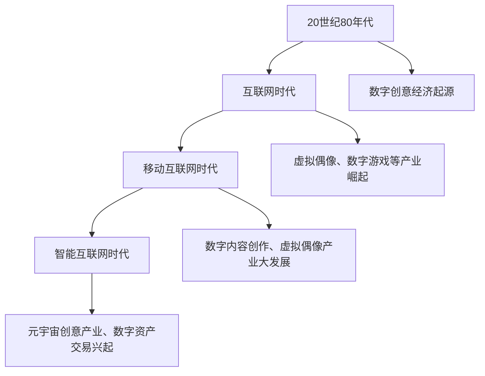

                 

### 《2050年的数字创意：从虚拟偶像经济到元宇宙创意产业的数字创意经济》

> **关键词：** 数字创意经济、虚拟偶像、元宇宙、人工智能、区块链

> **摘要：** 本文章将深入探讨2050年的数字创意经济，分析其从虚拟偶像经济到元宇宙创意产业的演变过程。文章分为三大部分，首先阐述数字创意经济的起源与发展，其次探讨其技术支撑，最后通过实际案例和跨行业应用展示数字创意经济的实践与应用。通过对未来发展趋势的展望，文章旨在为数字创意经济的发展提供战略规划与政策建议。

## 第一部分：数字创意经济的起源与发展

### 第1章：数字创意经济的定义与演变

数字创意经济是指基于数字技术和创意产业融合而产生的一种新型经济模式。它涵盖了虚拟偶像经济、元宇宙创意产业、数字游戏产业、数字内容创作产业等多个领域。数字创意经济的概念起源于20世纪末，随着互联网和数字技术的迅猛发展，逐渐成为全球经济的重要组成部分。

#### 1.1 数字创意经济的起源

数字创意经济的起源可以追溯到20世纪80年代，当时计算机技术和互联网开始普及。随着数字技术的不断发展，创意产业逐渐与数字技术相结合，形成了数字创意经济的雏形。

#### 1.2 数字创意经济的演变过程

数字创意经济的演变过程可以分为三个阶段：

1. **互联网时代**：这一阶段，数字技术和互联网的结合推动了数字创意经济的快速发展。虚拟偶像、数字游戏等数字创意产业逐渐崛起。
2. **移动互联网时代**：移动互联网的普及，使得数字创意经济进一步渗透到人们的生活中。数字内容创作、虚拟偶像等产业得到了极大的发展。
3. **智能互联网时代**：随着人工智能、区块链等新兴技术的应用，数字创意经济进入了一个全新的发展阶段。元宇宙创意产业、数字资产交易等新的商业模式逐渐兴起。

#### 1.3 数字创意经济的核心特征

数字创意经济的核心特征包括：

1. **创新驱动**：数字创意经济的核心是创新，包括技术、商业模式、内容创作等方面的创新。
2. **全球化**：数字创意经济具有全球化的特点，不受地域限制，跨国界合作日益紧密。
3. **融合性**：数字创意经济与多个行业融合，形成了一个庞大的生态系统。

### Mermaid流程图：数字创意经济的演变过程

通过以上分析，我们可以看到数字创意经济经历了从起源到快速发展的过程，其核心特征和创新驱动力使得它在未来的发展中具有巨大的潜力。在下一章中，我们将进一步探讨数字创意产业的分类与特点。

### 第2章：数字创意产业的分类与特点

数字创意产业是一个广泛的概念，涵盖了多个领域，每个领域都有其独特的特点和商业模式。以下是对数字创意产业中几个主要领域的分类和特点的详细分析。

#### 2.1 虚拟偶像经济

虚拟偶像，亦称为虚拟YouTuber（VTuber）或虚拟主播，是近年来快速崛起的一个数字创意产业。虚拟偶像通常是三维计算机生成的角色，它们通过实时直播、社交媒体、音乐制作等多种方式与粉丝互动，形成了一种新的娱乐形式。

##### 虚拟偶像的诞生与流行

虚拟偶像的诞生可以追溯到2007年，日本歌手初音未来（ Hatsune Miku）的推出标志着虚拟偶像的诞生。初音未来是一个基于软件合成声音和三维建模的音乐虚拟角色，她的出现引发了全球范围内的粉丝热潮。随着技术的进步，虚拟偶像越来越能够模拟真实人物的表情和动作，更加逼真地与粉丝互动。

虚拟偶像的流行不仅在于其独特的形式，还在于它们能够跨越文化和语言的障碍，吸引全球粉丝。例如，日本的VTuber们不仅在亚洲地区拥有庞大的粉丝群，还在欧美等地取得了巨大成功。

##### 虚拟偶像产业的价值链

虚拟偶像产业的价值链包括内容创作、分发、粉丝互动和商业变现等多个环节。

1. **内容创作**：虚拟偶像的内容通常包括直播、音乐制作、游戏互动等。这些内容的生产需要高质量的计算机技术和创意。
2. **分发**：虚拟偶像的内容主要通过直播平台、社交媒体和视频平台进行分发。这些平台提供了广泛的市场覆盖和高效的传播渠道。
3. **粉丝互动**：虚拟偶像与粉丝的互动是维系粉丝忠诚度和提升参与度的重要手段。通过实时互动、粉丝投票、线下活动等方式，虚拟偶像能够与粉丝建立紧密的关系。
4. **商业变现**：虚拟偶像的商业变现途径多样，包括虚拟商品销售、广告收入、赞助和品牌合作等。这些收入模式不仅为虚拟偶像本身带来收益，也为背后的制作公司和平台创造了商业机会。

##### 虚拟偶像产业的挑战与机遇

虚拟偶像产业面临着一些挑战，如技术门槛高、市场竞争激烈、内容创作压力大等。然而，这些挑战也伴随着巨大的机遇。

1. **技术进步**：随着人工智能、虚拟现实和增强现实等技术的发展，虚拟偶像的表现形式和互动体验将更加丰富和逼真。
2. **市场扩展**：虚拟偶像的全球市场潜力巨大，未来可能会有更多的国家和地区加入这一领域。
3. **粉丝经济**：虚拟偶像的成功不仅在于其内容本身，更在于背后强大的粉丝经济。通过粉丝的忠诚和支持，虚拟偶像能够实现可持续的商业发展。

虚拟偶像经济的崛起不仅改变了娱乐产业的格局，也为数字创意经济的发展注入了新的活力。在下一节中，我们将探讨元宇宙创意产业的特点和前景。

#### 2.2 元宇宙创意产业

元宇宙（Metaverse）是一个虚拟的、三维的、全球互联的数字世界，用户可以通过虚拟角色（Avatar）在其中进行各种活动。元宇宙创意产业是指基于元宇宙平台进行创意内容创作和商业活动的一系列产业。

##### 元宇宙的概念与架构

元宇宙的概念最早由科幻作家尼尔·斯蒂芬森（Neal Stephenson）在其小说《雪崩》中提出。元宇宙包括以下几个关键组成部分：

1. **虚拟世界**：虚拟世界是元宇宙的基础，用户通过虚拟角色在其中进行互动和活动。
2. **区块链**：区块链技术为元宇宙提供了去中心化的身份验证和资产交易机制，确保用户权益和数据安全。
3. **数字资产**：数字资产包括虚拟货币、虚拟土地、虚拟物品等，用户可以在元宇宙中进行交易和持有。
4. **虚拟现实（VR）和增强现实（AR）**：VR和AR技术为元宇宙提供了沉浸式的体验，使用户能够更加真实地感受虚拟世界。

##### 元宇宙创意产业的发展趋势

元宇宙创意产业正处于快速发展阶段，以下是其发展趋势：

1. **平台多样化**：随着技术的进步，元宇宙平台将呈现多样化，不同的平台将提供不同的功能和体验。
2. **内容创新**：元宇宙为内容创作者提供了广阔的创作空间，将出现更多的虚拟场景、虚拟角色和互动体验。
3. **商业模式创新**：元宇宙将带来新的商业模式，如虚拟货币交易、虚拟广告、虚拟房地产等。
4. **社交互动**：元宇宙为用户提供了一个全新的社交空间，用户可以在虚拟世界中建立社交关系，进行社交互动。

##### 元宇宙创意产业的商业模式

元宇宙创意产业的商业模式包括以下几个方面：

1. **虚拟商品销售**：用户可以在元宇宙中购买虚拟商品，如虚拟服饰、虚拟家具等。
2. **虚拟土地交易**：用户可以在元宇宙中购买、交易虚拟土地，开发虚拟房地产。
3. **数字资产交易**：用户可以在元宇宙中进行数字资产交易，如虚拟货币、虚拟物品等。
4. **虚拟广告**：元宇宙平台上的虚拟广告将带来新的广告收入模式。

##### 元宇宙创意产业的挑战与机遇

元宇宙创意产业面临一些挑战，如技术门槛高、内容创作难度大、用户接受度等。然而，这些挑战也伴随着巨大的机遇：

1. **技术创新**：随着5G、人工智能、区块链等技术的发展，元宇宙的体验将更加逼真和互动。
2. **市场潜力**：元宇宙的全球市场潜力巨大，未来可能会吸引更多的用户和投资。
3. **跨界合作**：元宇宙将吸引各个行业的参与，如游戏、影视、音乐、电商等，形成跨界合作的新生态。

元宇宙创意产业的崛起不仅为数字创意经济注入了新的活力，也为未来社会的发展提供了新的想象空间。在下一节中，我们将进一步探讨数字游戏产业的特点和影响。

#### 2.3 数字游戏产业

数字游戏产业是数字创意经济中最为成熟的领域之一，涵盖了游戏设计、开发、运营、分发等多个环节。随着技术的进步，数字游戏产业不断演化，从传统的单机游戏到网络游戏的转变，再到如今虚拟现实（VR）和增强现实（AR）技术的应用，数字游戏产业正在经历一场革命。

##### 数字游戏产业的发展历程

1. **单机游戏时代**：早期的数字游戏主要以单机模式为主，玩家在个人计算机或游戏机上独立进行游戏。
2. **网络游戏时代**：随着互联网的普及，网络游戏逐渐兴起，玩家可以在网络环境下与其他玩家进行互动，形成了新的社交体验。
3. **VR和AR游戏时代**：近年来，虚拟现实（VR）和增强现实（AR）技术的应用使得游戏体验更加沉浸和互动。VR游戏为玩家提供了身临其境的感觉，而AR游戏则将虚拟元素与现实世界相结合，创造了全新的游戏体验。

##### 数字游戏产业的特点

1. **互动性**：数字游戏的一大特点是强互动性，玩家可以通过操作和决策影响游戏的发展，与其他玩家互动，形成丰富的社交体验。
2. **创意性**：数字游戏的设计和开发需要高度的创意，游戏故事情节、角色设定、游戏机制等都需要精心设计和创新。
3. **全球化**：数字游戏产业具有全球化的特点，不同国家和地区的玩家都能参与到游戏中，形成了一个庞大的全球市场。

##### 数字游戏产业的影响

数字游戏产业不仅对娱乐产业产生了深远影响，还对其他领域产生了积极的影响：

1. **文化影响**：数字游戏成为了新的文化载体，游戏中的角色、故事、音乐等都具有文化价值，影响了年轻人的文化认同和价值观。
2. **教育影响**：一些教育类游戏通过游戏化的学习方式，提高了学生的学习兴趣和效果，推动了教育方式的创新。
3. **经济影响**：数字游戏产业为全球经济贡献了巨大的价值，带动了硬件设备、软件开发、广告宣传等相关产业的发展。

##### 数字游戏产业的商业模式

数字游戏产业的商业模式多样，包括以下几个方面：

1. **付费游戏**：玩家通过购买游戏软件或游戏内虚拟物品获得游戏体验。
2. **广告收入**：游戏内置广告为游戏开发商带来额外的收入。
3. **订阅模式**：玩家通过订阅服务获取游戏的持续更新和内容。
4. **虚拟商品销售**：游戏内的虚拟商品如服饰、装备等可以通过销售获得收入。

##### 数字游戏产业的发展趋势

未来，数字游戏产业将继续保持快速增长，以下是其发展趋势：

1. **技术创新**：随着VR、AR、AI等技术的进步，游戏体验将更加沉浸和互动。
2. **跨界融合**：数字游戏产业将与影视、音乐、文学等其他文化形式融合，创造新的内容形式和商业模式。
3. **市场国际化**：随着全球化的发展，数字游戏市场将进一步扩大，吸引更多国家和地区的企业和用户。

数字游戏产业作为数字创意经济的重要组成部分，将继续在技术创新、内容创意和商业模式创新方面发挥重要作用。在下一节中，我们将探讨数字内容创作产业的特点和趋势。

#### 2.4 数字内容创作产业

数字内容创作产业是指通过数字技术创作和传播各种内容，包括文字、图片、视频、音频等。这一产业涵盖了广泛的领域，如数字出版、社交媒体、短视频、音乐制作等。随着数字技术的不断进步，数字内容创作产业正在经历深刻的变革。

##### 数字内容创作产业的定义与范围

数字内容创作产业是指利用数字技术进行内容创作、编辑、存储、传播和分发的一系列活动。其范围非常广泛，包括以下领域：

1. **数字出版**：数字出版是指通过数字技术进行书籍、杂志、报纸等出版物的创作、编辑和分发。电子书、在线杂志、电子报纸等都属于数字出版范畴。
2. **社交媒体**：社交媒体平台如微博、微信、抖音等，为用户提供了内容创作和分享的场所，形成了一个庞大的数字内容创作生态系统。
3. **短视频**：短视频平台如抖音、快手等，用户通过拍摄和上传短视频进行内容创作和分享，这些内容形式多样，包括搞笑、才艺、教育等。
4. **音乐制作**：数字音乐制作和分发平台如网易云音乐、QQ音乐等，为音乐人提供了创作和分享音乐的场所。
5. **视频游戏**：视频游戏中的故事情节、角色设定、游戏机制等都需要数字内容创作。

##### 数字内容创作产业的特点

1. **灵活性**：数字内容创作具有高度的灵活性，创作者可以根据市场需求和用户喜好快速调整内容形式和创作方向。
2. **互动性**：数字内容创作与用户之间的互动性较强，用户可以通过评论、点赞、分享等方式参与内容创作和传播。
3. **即时性**：数字内容创作和传播的即时性较强，创作者可以快速发布内容，用户可以即时获取和反馈。
4. **多样性**：数字内容创作涵盖了多种形式，如文字、图片、视频、音频等，创作者可以根据自己的特长和市场需求选择合适的创作形式。

##### 数字内容创作产业的发展趋势

未来，数字内容创作产业将继续保持快速发展，以下是其发展趋势：

1. **技术创新**：随着人工智能、大数据、5G等技术的发展，数字内容创作将更加智能化和个性化。
2. **内容多样化**：数字内容创作将涵盖更多领域，如虚拟现实、增强现实、区块链等新兴技术将推动内容创作的创新。
3. **全球化**：数字内容创作将越来越国际化，吸引全球创作者和用户的参与。
4. **商业模式的创新**：数字内容创作将涌现出更多创新的商业模式，如知识付费、流量变现、虚拟商品销售等。

数字内容创作产业作为数字创意经济的重要组成部分，将继续在内容创意、技术创新和商业模式创新方面发挥重要作用。在下一章中，我们将探讨虚拟偶像经济的崛起和发展。

### 第3章：虚拟偶像经济的崛起

虚拟偶像经济的崛起是数字创意经济中最为引人注目的现象之一。虚拟偶像通过结合先进的数字技术和创意内容，迅速在娱乐产业中占据了一席之地，并展现出巨大的商业潜力。在这一章中，我们将详细探讨虚拟偶像的诞生背景、产业价值链、市场现状以及面临的挑战和机遇。

#### 3.1 虚拟偶像的诞生与流行

虚拟偶像的概念最早可以追溯到2007年，日本虚拟歌手初音未来（Hatsune Miku）的推出标志着虚拟偶像的诞生。初音未来是一个基于合成声音和三维建模技术的虚拟角色，她的成功不仅改变了音乐产业，也为虚拟偶像的兴起奠定了基础。

虚拟偶像的流行源于以下几个方面：

1. **技术进步**：随着计算机图形学、虚拟现实和人工智能等技术的发展，虚拟偶像的表现力和互动性得到了显著提升。他们能够以逼真的形象和流畅的动作与观众互动，提供了前所未有的观看体验。
2. **市场需求**：随着互联网的普及和社交平台的兴起，年轻人对娱乐形式的需求发生了变化。虚拟偶像以其独特的魅力和互动性，吸引了大量年轻粉丝，形成了庞大的粉丝群体。
3. **品牌合作**：虚拟偶像与品牌之间的合作日益密切，通过虚拟偶像的代言和推广，品牌能够更好地吸引年轻消费者的关注和认同。

虚拟偶像的流行不仅局限于音乐领域，还扩展到了直播、游戏、广告等多个领域。例如，中国的虚拟偶像洛天依不仅在音乐领域取得了巨大成功，还在直播和游戏领域展现了强大的影响力。

#### 3.2 虚拟偶像产业的价值链

虚拟偶像产业的价值链涵盖了内容创作、平台运营、粉丝互动和商业变现等多个环节，每个环节都发挥着重要作用。

1. **内容创作**：虚拟偶像的内容创作是产业链的核心。内容创作者通过编写脚本、设计角色形象、制作音乐和视频等手段，创造出丰富多样的虚拟偶像内容。这一环节的质量直接影响到虚拟偶像的受欢迎程度和市场价值。
2. **平台运营**：虚拟偶像的运营平台包括直播平台、社交媒体和虚拟偶像专属网站等。这些平台为虚拟偶像提供了展示和互动的舞台，通过直播、短视频、社交媒体等方式，与粉丝进行实时互动，增强粉丝黏性。
3. **粉丝互动**：虚拟偶像与粉丝的互动是维系粉丝忠诚度和提升参与度的重要手段。通过实时互动、粉丝投票、线下活动等方式，虚拟偶像能够与粉丝建立紧密的关系，形成强大的粉丝文化。
4. **商业变现**：虚拟偶像的商业变现途径多样，包括虚拟商品销售、广告收入、赞助和品牌合作等。虚拟偶像的周边商品如手办、服装、音乐等具有很高的市场需求，成为重要的收入来源。

虚拟偶像产业的价值链不仅创造了巨大的经济价值，也为相关产业带来了新的发展机遇。例如，虚拟偶像的崛起推动了虚拟现实（VR）和增强现实（AR）技术的发展，为这些领域提供了新的应用场景。

#### 3.3 虚拟偶像产业的挑战与机遇

虚拟偶像产业的快速发展带来了巨大的机遇，同时也面临着一些挑战。

1. **技术挑战**：虚拟偶像的制作和运营需要先进的技术支持，包括计算机图形学、人工智能、虚拟现实等。技术的不断进步是虚拟偶像产业发展的关键，但同时也带来了技术门槛和成本压力。
2. **内容创新**：虚拟偶像的内容创作需要持续的创新，以保持观众的兴趣和吸引力。如何在竞争激烈的市场中创造出独特的虚拟偶像形象和内容，是内容创作者面临的挑战。
3. **市场扩展**：虚拟偶像的市场潜力巨大，但如何进一步拓展市场，吸引更多的用户和粉丝，是虚拟偶像产业需要解决的难题。
4. **版权问题**：虚拟偶像的版权问题较为复杂，涉及音乐、形象、内容等多个方面。如何保护虚拟偶像的版权，避免侵权纠纷，是虚拟偶像产业需要关注的问题。

尽管面临挑战，虚拟偶像产业的机遇同样巨大。随着技术的不断进步和市场的扩大，虚拟偶像将继续在娱乐产业中发挥重要作用，为数字创意经济的发展注入新的活力。在下一章中，我们将探讨元宇宙创意产业的前景和潜力。

### 第4章：元宇宙创意产业的前景

元宇宙（Metaverse）作为下一代互联网的重要形态，其创意产业具有广阔的发展前景。本章将详细探讨元宇宙的概念与架构、元宇宙创意产业的发展趋势、商业模式及其面临的挑战和机遇。

#### 4.1 元宇宙的概念与架构

元宇宙是一个虚拟的、三维的、全球互联的数字世界，用户可以通过虚拟角色（Avatar）在其中进行各种活动。元宇宙的概念最早由尼尔·斯蒂芬森（Neal Stephenson）在其小说《雪崩》中提出。元宇宙的架构包括以下几个方面：

1. **虚拟世界**：虚拟世界是元宇宙的基础，用户通过虚拟角色在其中进行互动和活动。虚拟世界可以是静态的场景，也可以是动态的社交空间。
2. **数字资产**：数字资产包括虚拟货币、虚拟土地、虚拟物品等。用户可以在元宇宙中购买、交易和持有这些资产，实现经济活动。
3. **区块链**：区块链技术为元宇宙提供了去中心化的身份验证和资产交易机制，确保用户权益和数据安全。区块链上的智能合约使得元宇宙中的交易更加高效和透明。
4. **虚拟现实（VR）和增强现实（AR）**：VR和AR技术为元宇宙提供了沉浸式的体验，使用户能够更加真实地感受虚拟世界。

元宇宙的概念不仅涵盖了虚拟现实，还包括了虚拟社交、虚拟经济、虚拟教育等多个方面，形成了一个庞大的数字生态系统。

#### 4.2 元宇宙创意产业的发展趋势

元宇宙创意产业正处于快速发展阶段，以下是其主要发展趋势：

1. **平台多样化**：随着技术的进步，元宇宙平台将呈现多样化，不同的平台将提供不同的功能和体验。例如，一些平台专注于虚拟社交，另一些平台则专注于虚拟经济和虚拟教育。
2. **内容创新**：元宇宙为内容创作者提供了广阔的创作空间，将出现更多的虚拟场景、虚拟角色和互动体验。创作者可以通过编写脚本、设计角色、制作音乐和视频等手段，创造出丰富多彩的元宇宙内容。
3. **商业模式创新**：元宇宙将带来新的商业模式，如虚拟货币交易、虚拟广告、虚拟房地产等。这些商业模式不仅为元宇宙平台创造了经济价值，也为相关产业带来了新的发展机遇。
4. **社交互动**：元宇宙为用户提供了一个全新的社交空间，用户可以在虚拟世界中建立社交关系，进行社交互动。虚拟社交将成为元宇宙中重要的一环，带动虚拟经济的繁荣。

#### 4.3 元宇宙创意产业的商业模式

元宇宙创意产业的商业模式多样，主要包括以下几个方面：

1. **虚拟商品销售**：用户可以在元宇宙中购买虚拟商品，如虚拟服饰、虚拟家具等。这些商品可以是免费提供的，也可以是付费购买的，为平台和内容创作者创造了收入。
2. **虚拟土地交易**：用户可以在元宇宙中购买、交易虚拟土地，开发虚拟房地产。虚拟土地的价值取决于其位置、规模和开发程度，吸引了大量投资者的关注。
3. **数字资产交易**：元宇宙中的数字资产包括虚拟货币、虚拟物品等，用户可以在元宇宙中进行交易和持有这些资产，实现财富增值。
4. **虚拟广告**：元宇宙平台上的虚拟广告将带来新的广告收入模式。品牌可以通过虚拟广告的形式在元宇宙中进行推广，吸引目标用户的关注。

#### 4.4 元宇宙创意产业的挑战与机遇

元宇宙创意产业面临一些挑战，同时也伴随着巨大的机遇：

1. **技术挑战**：元宇宙创意产业需要先进的技术支持，包括虚拟现实、人工智能、区块链等。技术的不断进步是元宇宙创意产业发展的关键，但同时也带来了技术门槛和成本压力。
2. **内容创新**：元宇宙创意产业需要持续的内容创新，以保持用户的兴趣和参与度。创作者需要不断探索新的创意形式和故事情节，为用户提供丰富的虚拟体验。
3. **市场扩展**：元宇宙创意产业的市场潜力巨大，但如何进一步拓展市场，吸引更多的用户和创作者，是元宇宙创意产业需要解决的难题。
4. **机遇**：随着技术的进步和市场的扩大，元宇宙创意产业将迎来巨大的发展机遇。虚拟社交、虚拟经济、虚拟教育等领域的创新将带来新的商业机会，推动数字创意经济的发展。

元宇宙创意产业的崛起不仅为数字创意经济注入了新的活力，也为未来社会的发展提供了新的想象空间。在下一章中，我们将探讨数字创意经济的技术支撑。

### 第5章：数字创意经济的技术支撑

数字创意经济的快速发展离不开先进技术的支撑。本章节将重点探讨数字创意经济所依赖的核心技术，包括人工智能与机器学习、大数据和云计算、虚拟现实和增强现实、以及区块链技术。这些技术的进步不仅推动了数字创意经济的发展，也为未来创新提供了无限可能。

#### 5.1 人工智能与机器学习

人工智能（AI）和机器学习（ML）是数字创意经济的核心驱动力之一。AI技术通过模拟人类智能，使得计算机能够执行复杂的任务，如图像识别、自然语言处理和智能推荐等。机器学习则是AI的核心技术之一，它使得计算机能够通过数据和算法不断学习和优化。

1. **图像识别**：在数字创意产业中，图像识别技术被广泛应用于虚拟偶像的动画制作、数字游戏的角色设计、以及广告创意等领域。通过深度学习算法，计算机可以自动识别和分类图像中的物体、场景和人物，从而提高创作效率和质量。
2. **自然语言处理**：自然语言处理技术使得计算机能够理解和生成人类语言，这在数字内容创作和交互体验中具有重要意义。例如，虚拟偶像可以通过自然语言处理与粉丝进行对话，提供个性化的互动体验。
3. **智能推荐**：智能推荐系统利用机器学习算法分析用户的行为和偏好，从而提供个性化的内容推荐。这在大数据时代尤为关键，帮助用户在海量信息中找到感兴趣的内容。

#### 5.2 大数据和云计算

大数据和云计算是数字创意经济的重要技术基础。大数据技术通过处理海量数据，提取有价值的信息，为创意决策提供支持。云计算则提供了弹性的计算和存储资源，使得数字创意应用能够快速部署和扩展。

1. **数据采集与处理**：数字创意产业需要采集和处理大量数据，如用户行为数据、社交媒体数据、市场趋势数据等。大数据技术通过数据清洗、分析和挖掘，帮助创意产业发现用户需求和市场机会。
2. **云计算平台**：云计算平台为数字创意应用提供了强大的计算和存储能力。例如，虚拟偶像的实时渲染和互动需要大量的计算资源，云计算平台能够提供高效的计算服务，保证用户体验。
3. **数据安全与隐私**：在大数据时代，数据安全和隐私保护成为关键挑战。云计算平台通过加密技术和权限管理，确保用户数据的安全和隐私。

#### 5.3 虚拟现实和增强现实

虚拟现实（VR）和增强现实（AR）技术为数字创意经济提供了全新的互动体验。VR技术通过创建沉浸式的虚拟环境，使用户能够完全投入到虚拟世界中。AR技术则通过在现实世界中叠加虚拟元素，为用户带来增强的感知体验。

1. **虚拟现实应用**：虚拟现实技术在数字游戏、数字旅游、虚拟展览等领域有着广泛的应用。用户可以通过VR设备进入虚拟场景，体验沉浸式的游戏和旅游体验。
2. **增强现实应用**：增强现实技术在数字广告、数字教育和数字营销等领域具有重要应用。例如，AR广告可以通过手机或AR眼镜将虚拟元素叠加在现实世界中，吸引更多用户的关注。
3. **技术创新**：随着5G、人工智能和边缘计算等技术的发展，VR和AR的互动体验将更加逼真和实时。未来，我们将看到更多创新的VR和AR应用场景，为数字创意经济注入新的活力。

#### 5.4 区块链技术

区块链技术为数字创意经济提供了去中心化的信任机制和资产交易能力。通过区块链，数字资产如虚拟货币、数字艺术品等可以实现透明、安全和不可篡改的交易。

1. **数字资产交易**：区块链技术使得数字资产的交易更加便捷和安全。虚拟偶像的周边商品、数字艺术品等都可以通过区块链进行交易，确保交易的透明性和真实性。
2. **版权保护**：区块链技术为数字内容创作提供了有效的版权保护机制。创作者可以通过区块链记录作品的所有权信息，防止侵权和盗版行为。
3. **智能合约**：智能合约是一种自动化执行合同条款的计算机协议。在数字创意产业中，智能合约可以用于自动执行版权许可、版税分配等操作，提高交易的效率。

总之，人工智能与机器学习、大数据和云计算、虚拟现实和增强现实、以及区块链技术共同构成了数字创意经济的技术支撑体系。这些技术的不断创新和进步，将推动数字创意经济的持续发展，为未来社会带来更多创新的可能。

### 第6章：数字创意经济的商业模式创新

数字创意经济的商业模式创新是推动其发展的关键因素。随着技术的不断进步，数字创意经济涌现出许多新的商业模式，这些模式不仅改变了传统的商业运作方式，还为市场参与者提供了更多机会。本章节将探讨数字创意经济中的新商业模式、生态系统构建以及国际化发展。

#### 6.1 数字创意经济的新商业模式

数字创意经济的新商业模式不断涌现，以下是一些具有代表性的商业模式：

1. **订阅模式**：订阅模式通过提供持续更新的内容或服务，吸引用户持续支付。例如，流媒体平台如Netflix、Spotify等，通过提供无限量的视频和音乐内容，吸引用户订阅。
2. **数字资产交易**：数字资产交易模式包括虚拟货币交易、虚拟土地交易、数字艺术品交易等。例如，加密货币市场允许用户进行比特币、以太坊等虚拟货币的交易，虚拟世界中的虚拟土地和艺术品也可以进行买卖。
3. **内容付费模式**：内容付费模式通过用户付费获取高质量的内容。例如，一些博客、专业网站和在线教育平台，通过收费提供专业知识和技能培训。
4. **广告合作模式**：广告合作模式利用用户数据和流量为品牌提供广告服务。例如，社交媒体平台通过投放精准广告，帮助品牌吸引目标用户。
5. **IP授权模式**：IP授权模式是指将知名IP授权给其他公司或个人进行开发和商业化。例如，电影、动画、漫画等作品的IP授权，使得其他公司可以基于这些IP制作衍生产品。

#### 6.2 数字创意经济的生态系统构建

数字创意经济的生态系统构建是商业模式创新的重要一环。一个成熟的生态系统需要多方参与，包括内容创作者、平台运营者、技术提供商、投资者和用户等。以下是一些关键的生态系统构建要素：

1. **平台建设**：数字创意平台是生态系统的核心，提供了内容创作、分发和互动的场所。例如，虚拟偶像平台、数字艺术品交易平台、虚拟现实游戏平台等。
2. **技术创新**：技术创新是生态系统构建的重要驱动力。通过引入人工智能、大数据、区块链等新技术，平台能够提供更高效、更安全的服务。
3. **合作网络**：合作网络是生态系统构建的关键，通过与其他企业、机构、高校等建立合作关系，可以共享资源、技术和市场机会。
4. **用户参与**：用户参与是生态系统持续发展的基础。通过提供互动体验、用户反馈机制等，平台可以增强用户黏性，提高用户满意度。
5. **法律法规**：法律法规是生态系统构建的保障。明确版权、隐私、交易等方面的法律法规，有助于维护市场秩序，保护各方权益。

#### 6.3 数字创意经济的国际化发展

随着数字技术的发展，数字创意经济的国际化发展日益重要。国际化发展不仅扩大了市场，还为创意经济带来了新的机遇和挑战。

1. **市场拓展**：国际化发展有助于将数字创意产品和服务推向全球市场，吸引更多的用户和投资者。例如，中国的虚拟偶像和游戏企业通过国际化推广，在全球范围内积累了大量用户。
2. **文化交流**：国际化发展促进了不同文化之间的交流与融合，丰富了数字创意的内容和形式。例如，国际合作的虚拟现实游戏和电影，通过融合不同文化的元素，创造了独特的用户体验。
3. **竞争加剧**：国际化发展带来了激烈的竞争，企业需要不断提高自身的技术水平和创新能力，以保持竞争力。同时，企业需要了解和适应当地市场和文化，制定相应的市场策略。
4. **法律合规**：国际化发展要求企业遵守不同国家和地区的法律法规，特别是在数据保护、版权和交易等方面。企业需要建立全球化的法律合规体系，确保业务运营的合法性和合规性。

总之，数字创意经济的商业模式创新、生态系统构建和国际化发展，为其持续增长和未来发展提供了重要支撑。在下一章中，我们将探讨数字创意经济的法律与伦理问题。

### 第7章：数字创意经济的法律与伦理问题

随着数字创意经济的快速发展，其法律与伦理问题日益凸显。本章节将探讨数字创意经济中的知识产权保护、伦理问题以及相关法律框架，旨在为数字创意经济的发展提供合规和道德的指引。

#### 7.1 数字创意经济的知识产权保护

知识产权保护是数字创意经济健康发展的重要保障。数字创意经济中的知识产权主要包括版权、专利和商标等。

1. **版权保护**：数字内容创作过程中，版权保护至关重要。版权保护涵盖了文字、图片、音频、视频等多种形式的内容。创作者需要通过注册版权或使用数字水印等技术手段，保护其作品的版权。
2. **专利保护**：在数字创意产业中，技术创新是关键。专利保护可以确保技术创新的合法性和独占性。企业可以通过申请专利，保护其技术发明和解决方案。
3. **商标保护**：商标是数字创意产业中品牌识别的重要手段。企业需要通过注册商标，保护其品牌形象和商誉。

数字创意经济的知识产权保护面临一些挑战，如侵权行为难以监测、跨国版权纠纷等。因此，建立全球性的知识产权保护机制，加强国际间的合作与协调，是应对这些挑战的关键。

#### 7.2 数字创意经济的伦理问题

数字创意经济的快速发展带来了一些伦理问题，如隐私泄露、数字鸿沟、内容审查等。

1. **隐私保护**：随着大数据和人工智能技术的应用，用户隐私保护成为关键问题。企业需要采取严格的数据保护措施，确保用户数据的隐私和安全。同时，用户应增强隐私意识，合理设置隐私权限。
2. **数字鸿沟**：数字创意经济的发展可能导致数字鸿沟的扩大。技术发达地区和发展中国家之间的差距，可能导致一些群体无法享受到数字创意经济带来的便利和机会。因此，政府和社会应采取措施，缩小数字鸿沟，促进公平发展。
3. **内容审查**：数字创意内容的管理和审查是一个复杂的任务。如何平衡内容自由和创新，避免传播有害信息，是一个重要的伦理问题。政府和相关机构应制定合理的内容审查政策，确保数字内容的合规和健康发展。

#### 7.3 数字创意经济的法律框架

数字创意经济的发展需要健全的法律框架提供支持。以下是一些关键的法律框架：

1. **版权法**：版权法是数字创意经济的重要法律基础。各国应完善版权法律体系，确保创作者的权益得到保护，促进创新和创作。
2. **数据保护法**：数据保护法是保护用户隐私和数据安全的重要法律。企业应遵守数据保护法规，确保用户数据的合法收集、存储和使用。
3. **反垄断法**：数字创意市场中的大型平台企业可能面临反垄断审查。反垄断法旨在防止市场垄断，保护公平竞争，维护市场秩序。
4. **知识产权国际条约**：国际社会应加强知识产权保护的合作，通过签订国际条约，建立统一的知识产权保护标准，促进全球数字创意经济的发展。

总之，数字创意经济的法律与伦理问题对其可持续发展至关重要。通过完善知识产权保护、加强隐私保护和建立合理的内容审查机制，数字创意经济将能够在合规和道德的轨道上持续发展。在下一章中，我们将探讨数字创意经济的未来展望。

### 第8章：数字创意经济的未来展望

数字创意经济的未来充满无限可能，随着科技的不断进步和市场的不断成熟，它将在全球范围内产生深远的影响。本章将探讨数字创意经济的未来发展趋势、对社会的影响以及可持续发展的路径。

#### 8.1 数字创意经济的未来发展趋势

1. **技术创新驱动**：随着人工智能、区块链、虚拟现实（VR）和增强现实（AR）等技术的持续发展，数字创意经济将在技术创新的推动下不断演进。例如，AI技术将进一步提升内容创作的效率和个性，VR和AR技术将带来更加沉浸式的用户体验，区块链技术将确保数字资产的透明和安全性。

2. **内容多样化**：未来，数字创意内容将更加多样化。除了传统的文字、图片、音频和视频，虚拟现实体验、互动游戏、虚拟现实演唱会等新兴内容形式将逐渐普及。这种多样化将满足不同用户群体的需求，推动数字创意市场的进一步扩展。

3. **商业模式创新**：数字创意经济的商业模式将继续创新。例如，NFT（非同质化代币）作为一种新的数字资产形式，已经在数字艺术品和虚拟偶像领域取得了成功。未来，NFT可能扩展到更多领域，为数字创意产业带来新的商业机会。

4. **全球一体化**：数字创意经济将进一步加强全球一体化。随着全球化进程的加速，数字创意内容将跨越地域限制，在全球范围内传播和互动。国际间的合作将更加紧密，为数字创意产业带来更多的机会和挑战。

#### 8.2 数字创意经济对社会的影响

1. **经济影响**：数字创意经济对经济增长的贡献将显著增加。通过创造新的就业机会、促进技术发展和推动商业模式的创新，数字创意经济将成为驱动经济增长的重要引擎。

2. **文化影响**：数字创意经济将深刻影响文化生产和传播方式。虚拟偶像、虚拟现实体验和数字艺术等新兴形式将为文化创造提供新的可能，促进文化的多样性和全球化。

3. **社会互动**：数字创意经济将改变人们的社交方式。虚拟社交平台和元宇宙将为人们提供全新的社交空间，促进跨地域、跨文化的交流与互动。

4. **教育变革**：数字创意经济将推动教育方式的变革。虚拟现实技术和互动游戏等工具将被广泛应用于教育领域，提供更加生动、互动的学习体验，提高教育质量和效率。

#### 8.3 数字创意经济的可持续发展

1. **技术可持续性**：数字创意经济的技术发展应注重可持续性。绿色技术、能源效率和创新解决方案将有助于减少数字创意产业对环境的影响，实现绿色增长。

2. **经济可持续性**：数字创意经济应追求经济可持续性。通过促进创新和公平竞争，实现健康、可持续的经济增长。同时，数字创意产业应关注社会责任，通过公益活动和社会投资，回馈社会。

3. **社会可持续性**：数字创意经济的发展应考虑社会可持续性。通过促进数字包容性和减少数字鸿沟，确保所有人都能享受到数字创意经济带来的好处。同时，数字创意产业应关注伦理和社会责任，确保其发展符合社会价值观。

总之，数字创意经济的未来将充满活力和创新。通过技术创新、商业模式创新和社会责任，数字创意经济有望成为推动社会进步和经济发展的强大动力。在下一章中，我们将通过具体案例展示虚拟偶像经济的实践和应用。

### 第9章：虚拟偶像经济的案例研究

虚拟偶像经济的快速发展吸引了全球范围内的广泛关注，以下将介绍几个成功的虚拟偶像经济案例，并分析其运营模式、市场表现和未来发展方向。

#### 9.1 Bilibili上的虚拟偶像

Bilibili是中国领先的年轻人文化社区和视频平台，其上的虚拟偶像现象尤为突出。其中，最具代表性的虚拟偶像之一是“洛天依”。洛天依自2012年推出以来，凭借其独特的音乐才华和粉丝互动，迅速在国内外积累了庞大的粉丝群体。

1. **运营模式**：洛天依的运营模式包括内容创作、品牌合作和粉丝互动等多个环节。内容创作方面，洛天依背后的团队不断推出原创音乐和视频，保持其内容的新鲜感和吸引力。品牌合作方面，洛天依与多个知名品牌合作，进行虚拟代言和推广。粉丝互动方面，洛天依通过社交媒体和直播与粉丝进行实时互动，增强粉丝黏性。

2. **市场表现**：洛天依的成功不仅体现在粉丝数量上，还体现在商业价值上。根据数据显示，洛天依的周边商品销售、品牌代言收入和广告收入均取得了显著增长。2020年，洛天依的周边商品销售额达到了数千万人民币，成为虚拟偶像经济的重要支柱。

3. **未来发展方向**：洛天依的未来发展方向包括进一步拓展海外市场、开发新的商业模式和提升用户体验。为了拓展海外市场，洛天依已经开始与海外合作伙伴合作，推出多语言版本的音乐和视频内容。在商业模式方面，洛天依正在探索虚拟商品销售、虚拟演唱会和虚拟广告等新方向。此外，洛天依还计划通过虚拟现实（VR）和增强现实（AR）技术，提升与粉丝的互动体验。

#### 9.2 TIKTOK上的虚拟偶像

TIKTOK是全球知名的短视频社交平台，其上的虚拟偶像现象同样值得关注。以“NaeNae”为例，这是一位在TIKTOK上非常受欢迎的虚拟偶像，其形象是一个具有可爱外表和搞笑气质的女孩。

1. **运营模式**：NaeNae的运营模式主要包括短视频创作、粉丝互动和品牌合作。在短视频创作方面，NaeNae通过制作各种搞笑、有趣的短视频，吸引了大量粉丝。在粉丝互动方面，NaeNae定期在TIKTOK上与粉丝互动，举办问答活动和抽奖活动，增强粉丝黏性。在品牌合作方面，NaeNae与多个品牌合作，进行虚拟代言和推广。

2. **市场表现**：NaeNae在TIKTOK上的表现非常出色。根据数据显示，NaeNae的短视频播放量超过了数十亿次，粉丝数量达到了数百万。NaeNae的成功不仅体现在粉丝数量上，还体现在商业价值上。NaeNae的周边商品如服装、玩具等在市场上非常受欢迎，品牌代言收入也相当可观。

3. **未来发展方向**：NaeNae的未来发展方向包括继续深耕短视频领域、拓展新平台和提升品牌影响力。在短视频领域，NaeNae将继续创作高质量、有趣的内容，保持其在粉丝心中的地位。在拓展新平台方面，NaeNae已经开始在虚拟现实（VR）和增强现实（AR）平台上推出相关内容，探索新的互动体验。此外，NaeNae还计划通过社交媒体和线下活动，进一步提升品牌影响力。

#### 9.3 日本虚拟偶像Hololive

Hololive是一家日本虚拟偶像经纪公司，其旗下拥有众多受欢迎的虚拟偶像。其中，代表性的虚拟偶像之一是“Kizuna AI”。Kizuna AI以其可爱的形象和亲和力，在国内外赢得了大量粉丝。

1. **运营模式**：Kizuna AI的运营模式主要包括内容创作、粉丝互动和品牌合作。在内容创作方面，Kizuna AI通过制作各种类型的视频，如直播、VLOG、音乐视频等，保持内容的新鲜感和多样性。在粉丝互动方面，Kizuna AI定期在直播平台与粉丝互动，举办问答活动和抽奖活动，增强粉丝黏性。在品牌合作方面，Kizuna AI与多个品牌合作，进行虚拟代言和推广。

2. **市场表现**：Kizuna AI在Hololive和全球范围内取得了显著的成功。根据数据显示，Kizuna AI的YouTube频道订阅量超过了百万，粉丝数量达到了数百万。Kizuna AI的成功不仅体现在粉丝数量上，还体现在商业价值上。Kizuna AI的周边商品如手办、服装、音乐等在市场上非常受欢迎，品牌代言收入也相当可观。

3. **未来发展方向**：Kizuna AI的未来发展方向包括进一步拓展海外市场、提升内容质量和互动体验。在海外市场方面，Kizuna AI已经开始与海外合作伙伴合作，推出多语言版本的内容。在内容质量方面，Kizuna AI将继续创作高质量、有趣的内容，提升粉丝的满意度。在互动体验方面，Kizuna AI计划通过虚拟现实（VR）和增强现实（AR）技术，提供更加沉浸式的互动体验。

通过以上案例研究，我们可以看到虚拟偶像经济在运营模式、市场表现和未来发展方面具有显著的特色和潜力。在未来的发展中，虚拟偶像经济将继续通过技术创新、内容创新和商业模式创新，推动数字创意经济的持续繁荣。

### 第10章：元宇宙创意产业的实践

元宇宙创意产业是一个正在迅速发展的领域，它融合了虚拟现实（VR）、增强现实（AR）、区块链技术等多种先进技术，创造出全新的数字体验和商业模式。本章将通过介绍一些成功的元宇宙创意产业案例，探讨其实践方法，并分析面临的挑战与解决方案。

#### 10.1 元宇宙创意产业的成功案例

1. **Decentraland**：Decentraland是一个基于区块链的虚拟世界平台，用户可以在其中购买和交易虚拟土地，建立和体验各种虚拟场景。Decentraland的成功在于其去中心化的架构和独特的商业模式，吸引了大量用户和投资者。用户可以在Decentraland中创建虚拟商店、举办虚拟活动，甚至购买和销售虚拟房地产。其成功的实践方法包括：

   - **去中心化架构**：Decentraland采用区块链技术，确保用户的数据安全和资产交易透明。
   - **多样化的虚拟场景**：Decentraland提供了丰富的虚拟场景，从商业街区到游戏空间，满足不同用户的需求。
   - **社区驱动**：Decentraland鼓励用户参与内容的创作和社区的治理，增强了用户的参与感和忠诚度。

2. **The Sandbox**：The Sandbox是一个虚拟世界平台，允许用户创建和分享自己的虚拟游戏和体验。The Sandbox的成功在于其简单易用的创作工具和强大的生态系统。用户可以通过拖放功能轻松创建虚拟场景，并将它们发布到平台供他人体验。其成功的实践方法包括：

   - **用户友好的创作工具**：The Sandbox提供了直观的创作工具，使非专业人士也能轻松创建虚拟内容。
   - **多元化的商业模式**：The Sandbox支持虚拟商品的交易，用户可以通过销售虚拟商品获得收入。
   - **跨平台兼容**：The Sandbox支持多种设备，包括PC、手机和VR头显，提供了广泛的市场覆盖。

#### 10.2 元宇宙创意产业的实践方法

1. **内容创作**：元宇宙创意产业的核心在于内容创作。内容创作者可以利用虚拟现实、增强现实等技术，创作出独特的虚拟场景、角色和互动体验。成功的方法包括：

   - **故事驱动**：通过讲故事的方式吸引用户，创造情感共鸣。
   - **用户参与**：鼓励用户参与内容的创作和互动，增强用户黏性。
   - **跨领域融合**：将不同领域的元素融合到虚拟场景中，提供多样化的体验。

2. **平台运营**：元宇宙创意产业需要强大的平台运营能力，包括用户管理、内容审核和社区治理。成功的方法包括：

   - **去中心化**：采用去中心化的架构，确保平台的透明性和用户权益。
   - **社区管理**：建立有效的社区管理机制，维护平台的秩序和用户体验。
   - **技术支持**：提供稳定的技术支持，确保平台的稳定运行和高效服务。

3. **商业模式**：元宇宙创意产业的商业模式多样，包括虚拟商品交易、虚拟广告、虚拟地产等。成功的方法包括：

   - **多元化收入来源**：通过多种收入模式，确保平台的可持续性。
   - **用户付费**：通过用户付费，提供高质量的虚拟体验和内容。
   - **合作与投资**：与其他企业合作，引入更多的资源和投资，共同推动平台的发展。

#### 10.3 元宇宙创意产业的挑战与解决方案

1. **技术挑战**：元宇宙创意产业依赖于多种先进技术，如虚拟现实、增强现实、区块链等。技术挑战包括：

   - **技术门槛**：对于普通用户来说，使用和创作元宇宙内容可能存在一定的技术门槛。
   - **硬件要求**：虚拟现实和增强现实设备要求较高的硬件配置，增加了用户的使用成本。
   - **性能优化**：确保虚拟世界的流畅运行，需要不断提升硬件和软件的性能。

   **解决方案**：通过提供用户友好的创作工具和平台，降低技术门槛。同时，通过优化技术架构和性能，提升用户体验。

2. **内容审核**：元宇宙创意产业涉及大量的内容创作和传播，内容审核成为一个重要挑战。

   - **版权问题**：确保内容的原创性和合法性，避免侵权行为。
   - **内容质量**：维护平台的内容质量，避免低俗、暴力等不良内容。
   - **用户隐私**：保护用户的隐私和数据安全。

   **解决方案**：建立完善的内容审核机制，采用人工智能和人工审核相结合的方式，确保内容的安全和合法性。同时，加强用户隐私保护措施，确保用户数据的安全。

3. **商业模式创新**：元宇宙创意产业的商业模式需要不断创新，以适应快速变化的市场环境。

   - **用户需求**：深入了解用户需求，提供个性化的虚拟体验。
   - **合作与投资**：与其他企业合作，共同探索新的商业模式。
   - **技术创新**：通过技术创新，提供更多的增值服务和商业模式。

   **解决方案**：持续关注市场动态，深入了解用户需求。通过技术创新，提供差异化的虚拟体验。同时，积极寻求合作伙伴，共同推动元宇宙创意产业的发展。

元宇宙创意产业的实践不仅为数字创意经济注入了新的活力，也为未来社会的发展提供了新的可能性。通过不断创新和实践，元宇宙创意产业有望在未来实现更大的突破。

### 第11章：数字创意经济的跨行业应用

数字创意经济的快速发展不仅带动了自身产业的繁荣，也逐步渗透到其他传统行业，为其带来了新的发展机遇。以下将探讨数字创意经济在游戏产业、影视产业、广告产业以及文化创意产业中的应用，并分析其带来的影响。

#### 11.1 数字创意经济在游戏产业的应用

游戏产业是数字创意经济的重要组成部分，随着虚拟现实（VR）、增强现实（AR）等技术的普及，数字创意经济在游戏产业中的应用日益广泛。

1. **游戏体验创新**：VR和AR技术的应用，为玩家提供了更加沉浸式的游戏体验。通过VR设备，玩家可以全身心投入到虚拟世界中，与游戏场景互动；而AR技术则将虚拟元素叠加到现实环境中，让玩家体验到虚实结合的乐趣。这种创新的游戏体验吸引了大量玩家，提升了游戏产业的用户黏性和市场份额。
2. **游戏内容多样化**：数字创意经济推动了游戏内容的多样化。通过人工智能和大数据分析，游戏开发者可以根据玩家的喜好和行为，定制个性化的游戏内容和任务，提供更加丰富的游戏体验。此外，NFT（非同质化代币）技术的应用，使得游戏内的虚拟物品具有更高的价值和稀缺性，为游戏产业创造了新的商业模式。
3. **跨界合作**：数字创意经济促进了游戏产业与其他行业的跨界合作。例如，游戏与影视、音乐、文学等领域的合作，使得游戏故事情节、角色设定、音乐等方面更加丰富和生动，提升了游戏的艺术价值和文化内涵。

#### 11.2 数字创意经济在影视产业的应用

影视产业是另一个受益于数字创意经济的领域。数字技术的发展，为影视创作、制作和分发带来了新的机遇。

1. **虚拟场景和特效**：数字创意经济提供了强大的虚拟场景和特效制作技术，使得影视作品在视觉效果上更加震撼和逼真。通过虚拟现实和增强现实技术，影视制作公司可以在虚拟世界中构建复杂的场景，实现传统特效难以达到的效果。
2. **个性化推荐**：大数据和人工智能技术的应用，为影视产业提供了个性化推荐服务。根据用户的历史观看记录和喜好，人工智能算法可以推荐符合用户口味的影视作品，提高观众的满意度和忠诚度。
3. **互动体验**：数字创意经济推动了影视作品的互动体验。通过虚拟现实技术，观众可以沉浸到电影场景中，与角色互动，体验更加丰富的观影体验。

#### 11.3 数字创意经济在广告产业的应用

广告产业也受益于数字创意经济的快速发展，数字技术和创意内容的结合，为广告行业带来了新的机遇。

1. **精准营销**：大数据和人工智能技术的应用，使得广告投放更加精准。通过分析用户的浏览记录、购买行为等数据，广告主可以找到目标客户，实现精准营销，提高广告效果。
2. **互动广告**：虚拟现实和增强现实技术的应用，使得广告形式更加多样和互动。例如，通过AR技术，用户可以在手机或AR眼镜上看到虚拟广告，与广告内容进行互动，提高用户的参与度和记忆度。
3. **内容营销**：数字创意经济推动了内容营销的发展。通过制作有趣、有价值的数字内容，广告主可以与用户建立情感联系，提高品牌的知名度和忠诚度。

#### 11.4 数字创意经济在文化创意产业的应用

文化创意产业包括文学、音乐、艺术等多个领域，数字创意经济为这些领域带来了新的创作方式和商业模式。

1. **数字化创作**：数字技术为文化创意产业提供了新的创作工具和平台。例如，数字绘画、数字音乐制作等工具，使得创作者可以更加高效地进行创作。此外，区块链技术为数字艺术提供了去中心化的版权保护和交易平台，保障了创作者的权益。
2. **跨界融合**：数字创意经济推动了文化创意产业与其他领域的跨界融合。例如，文学与游戏、音乐与虚拟现实等领域的融合，创造出新的艺术形式和商业模式，为文化创意产业带来了新的发展机遇。
3. **虚拟展览**：数字创意经济使得虚拟展览成为可能。通过虚拟现实和增强现实技术，博物馆、画廊等文化机构可以创建虚拟展览，让用户在家就能体验到丰富的文化内容，提高了文化教育的普及性和互动性。

总之，数字创意经济的跨行业应用为各个行业带来了巨大的发展机遇。通过技术创新和创意内容的结合，数字创意经济不仅提升了用户体验，也推动了各行业的创新和升级。

### 第12章：数字创意经济的战略规划与政策建议

随着数字创意经济的快速发展，制定合理的战略规划与政策建议显得尤为重要。以下将探讨数字创意经济的战略规划、政策支持以及人才培养等方面，以促进其健康发展。

#### 12.1 数字创意经济的战略规划

1. **创新驱动**：数字创意经济的核心在于创新，政府和企业应加大对技术创新的投入，推动人工智能、大数据、区块链等关键技术的研发和应用。通过建立创新实验室、科技园区和创业孵化器，为数字创意企业提供良好的创新环境。
2. **产业融合**：数字创意经济具有显著的跨界特性，应推动数字创意产业与其他产业的深度融合，如与文化、旅游、教育等领域的合作。通过跨界融合，拓展数字创意的应用场景和商业模式，提升整体产业的竞争力。
3. **市场拓展**：数字创意经济应积极拓展国际市场，通过文化交流、国际合作和技术输出，提升数字创意产品的全球影响力。政府和企业应加强国际合作，推动数字创意经济的全球化发展。

#### 12.2 数字创意经济的政策支持

1. **税收优惠**：政府可以针对数字创意企业实施税收优惠政策，如减免企业所得税、增值税等，降低企业的运营成本，促进其快速发展。
2. **资金支持**：政府应设立专项基金，支持数字创意企业的研究与开发、市场拓展和人才培养。通过财政拨款、贷款贴息、风险投资等手段，为数字创意企业提供资金支持。
3. **知识产权保护**：加强知识产权保护是数字创意经济健康发展的关键。政府应完善知识产权法律法规，建立高效的知识产权保护机制，打击侵权行为，保护创作者的合法权益。

#### 12.3 数字创意经济的人才培养

1. **教育体系**：高校和职业教育机构应设置相关课程，培养数字创意人才。通过开设人工智能、大数据、虚拟现实、数字媒体等课程，提升学生的技术能力和创意思维。
2. **校企合作**：政府和企业应加强校企合作，推动产学研结合。通过实习、实训、项目合作等方式，为学生提供实际操作经验和就业机会。
3. **人才引进**：政府可以出台人才引进政策，吸引国内外优秀的数字创意人才。提供优厚的薪酬待遇、住房补贴和签证便利等，吸引海外高层次人才来华发展。

总之，数字创意经济的战略规划与政策建议需要从创新驱动、产业融合、市场拓展、政策支持、人才培养等多个方面综合考虑，以实现数字创意经济的可持续发展。通过制定合理的战略规划与政策建议，数字创意经济有望在未来取得更大的成就。

### 附录：数字创意经济相关资源与工具

#### 附录 A：数字创意经济相关网站与平台

1. **虚拟偶像平台**：
   - **Hololive**：https://www.hololive.com/
   - **VTuber**：https://vtuber.com/
   - **Nijisanji**：https://www.nijisanji.com/

2. **元宇宙平台**：
   - **Decentraland**：https://decentraland.org/
   - **The Sandbox**：https://www.thesandboxgame.com/
   - **Somnium Space**：https://www.somniumspace.com/

3. **数字游戏平台**：
   - **Steam**：https://store.steampowered.com/
   - **Epic Games Store**：https://www.epicgames.com/store/
   - **Nintendo Switch eShop**：https://www.nintendo.com/switch/store/

4. **数字内容创作平台**：
   - **Canva**：https://www.canva.com/
   - **Adobe Creative Cloud**：https://www.adobe.com/creativecloud.html
   - **YouTube**：https://www.youtube.com/

#### 附录 B：数字创意经济相关书籍与论文

1. **《元宇宙：概念、技术与应用》**
   - 作者：张晓鹏
   - 出版社：清华大学出版社

2. **《虚拟现实技术与应用》**
   - 作者：黄铁军
   - 出版社：电子工业出版社

3. **《区块链与数字货币》**
   - 作者：陈伟平
   - 出版社：机械工业出版社

4. **论文：《数字创意经济：现状、挑战与未来》**
   - 作者：李明、王丽华
   - 来源：中国社会科学辑刊

#### 附录 C：数字创意经济相关工具与软件

1. **虚拟现实（VR）工具**：
   - **Unity**：https://unity.com/
   - **Unreal Engine**：https://www.unrealengine.com/

2. **增强现实（AR）工具**：
   - **ARKit**：https://developer.apple.com/arkit/
   - **ARCore**：https://developers.google.com/ar/

3. **人工智能与机器学习工具**：
   - **TensorFlow**：https://www.tensorflow.org/
   - **PyTorch**：https://pytorch.org/

4. **区块链开发工具**：
   - **Ethereum**：https://ethereum.org/en/developers/docs/
   - **EOSIO**：https://eos.io/

通过以上资源与工具，读者可以深入了解数字创意经济的相关知识，为研究与实践提供有力支持。同时，这些资源也为数字创意经济的发展提供了丰富的实践案例和理论基础。希望本附录能为读者在数字创意经济领域的研究与探索中提供有益的帮助。作者：AI天才研究院/AI Genius Institute & 禅与计算机程序设计艺术/Zen And The Art of Computer Programming。

