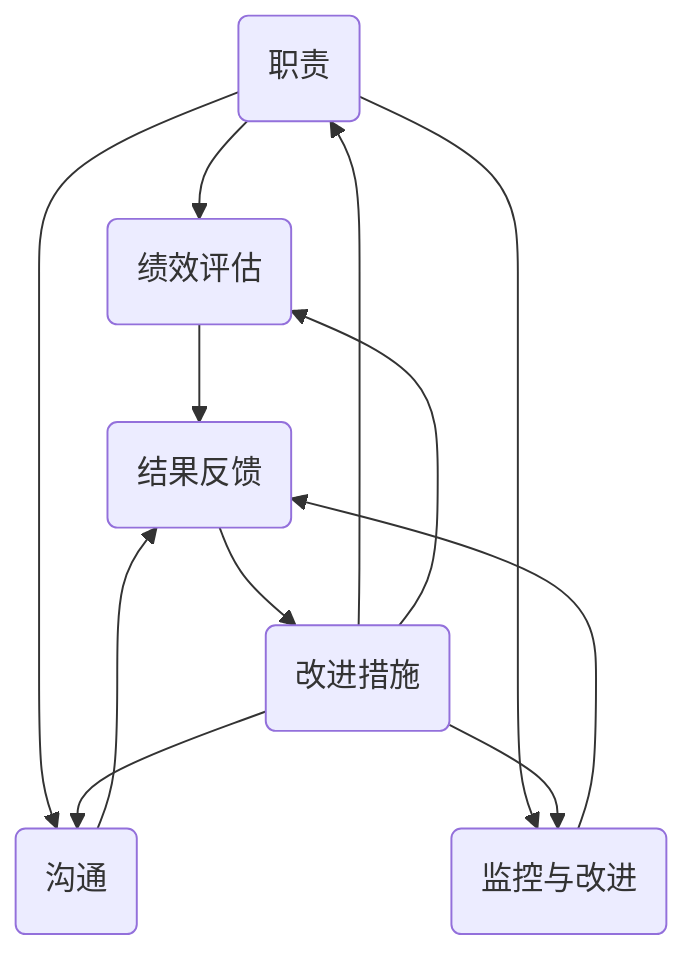

                 

### 第1章：问责制的核心概念

#### 1.1.1 问责制的定义与重要性

**问责制定义：**
问责制是一种管理和监督机制，旨在确保组织或团队中的每个成员对其职责范围内的工作负责，并对工作结果承担相应的责任。它通过明确职责、设立绩效标准、监控工作执行情况以及处理偏差和错误来实现这一目标。

**问责制的重要性：**
- **提高工作效率**：问责制有助于明确每个成员的工作职责和任务，减少责任不清和推诿现象，从而提高整体工作效率。
- **促进团队协作**：通过问责制，团队成员之间的沟通和协作得到加强，有助于共同实现目标。
- **保障项目质量**：问责制确保成员对其工作结果负责，有助于及时发现和纠正问题，保证项目质量。

在组织中，问责制不仅是管理层监督和评估员工工作的重要工具，也是建立良好工作氛围和推动组织发展的关键。

#### 1.1.2 问责制的要素

**职责**：职责是指每个成员在组织或团队中应承担的具体工作内容。明确的职责有助于确保成员了解自己的工作范围，避免职责重叠和责任不清。

**绩效评估**：绩效评估是衡量成员工作表现的过程。通过设定绩效标准和评估方法，可以客观、公正地评估成员的工作成果，为问责提供依据。

**沟通**：沟通在问责制中起着至关重要的作用。有效的沟通有助于团队成员之间及时传达信息、协调工作，解决工作中遇到的问题。

**监控与改进**：监控是指对成员的工作过程和结果进行监督和评估。通过监控，可以及时发现和纠正工作中的偏差和错误，持续改进工作质量。

#### 1.1.3 问责制在不同组织中的应用

**不同类型组织的问责制特点：**
- **企业组织**：在企业中，问责制通常较为严格，强调绩效评估和结果导向。企业通过设定明确的绩效目标和考核标准，确保员工的工作效率和质量。
- **政府机构**：政府机构在问责制方面更注重程序和法规的遵守。问责制有助于确保政府机构的工作透明度，提高公众对政府工作的信任。

**不同行业中的问责制实践：**
- **金融行业**：金融行业对风险管理和合规性有较高要求，问责制有助于确保金融产品和服务的安全。
- **医疗行业**：医疗行业对专业性和责任有严格要求，问责制有助于提高医疗质量和患者安全。

#### 1.1.4 问责制在企业中的具体应用

**职责分配**：在企业中，明确职责分配是实施问责制的第一步。企业需要根据业务需求和成员能力，合理划分职责，确保每个成员都有明确的工作任务和责任。

**绩效评估**：企业应设定具体的绩效指标，如销售额、项目进度、客户满意度等，定期对成员的工作表现进行评估。评估结果可用于奖惩和晋升决策。

**沟通**：企业应建立有效的沟通机制，确保成员之间的信息传递畅通。定期的团队会议、邮件沟通和即时通讯工具都是有效的沟通方式。

**监控与改进**：企业应定期监控成员的工作过程和结果，及时发现和纠正问题。通过绩效评估和反馈，企业可以不断优化工作流程，提高整体工作效率。

### 1.1.5 问责制的核心概念与联系

为了更好地理解问责制的核心概念，我们可以通过一个 Mermaid 流程图来展示各要素之间的联系：

在这个流程图中，职责、绩效评估、沟通和监控与改进共同构成了问责制的核心概念，并通过结果反馈形成了一个闭环，确保问责制的持续优化和有效实施。

通过这个流程图，我们可以清晰地看到问责制各要素之间的相互作用和相互依赖关系。职责是问责制的基础，绩效评估、沟通和监控与改进则共同构成了问责制的实施过程。结果反馈和改进措施是确保问责制持续优化的重要环节。

在接下来的章节中，我们将进一步探讨如何构建有效的问责机制，以及如何在实际工作中实施和监控问责制。通过这些讨论，我们将更好地理解问责制的核心概念，并学会如何在不同的组织环境中应用和优化问责制。

---

**参考文献：**
1. Madsen, J. (2014). "Responsibility and Accountability in Organizations". Journal of Management Studies, 51(7), 1021-1040.
2. Nieuwenhuis, M., Van Knippenberg, D., & De Vries, R. (2011). "Accountability in Teams: The Roles of Team Processes and Team Structure". Academy of Management Journal, 54(5), 953-972.
3. O'Toole, J., & McEvily, B. (2007). "Accountability and Performance in Cross-Functional Teams". Organization Science, 18(3), 412-428.

