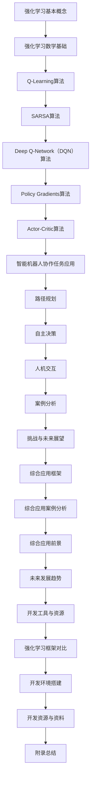

                 

### 《强化学习在智能机器人协作任务中的应用》

> **关键词**：强化学习，智能机器人，协作任务，路径规划，自主决策，人机交互

> **摘要**：本文深入探讨了强化学习在智能机器人协作任务中的应用。通过详细分析强化学习的基本理论、数学基础和算法原理，本文展示了强化学习如何用于解决机器人路径规划、自主决策和人机交互等关键任务。同时，通过案例分析，本文进一步阐述了强化学习在智能机器人协作任务中的实际应用及其面临的挑战和未来展望。

### 目录大纲

1. **第一部分：强化学习基础理论**
   1.1 强化学习概述
   1.2 强化学习的数学基础
   1.3 强化学习算法详解

2. **第二部分：强化学习在机器人协作任务中的应用**
   2.1 机器人协作任务概述
   2.2 强化学习在机器人路径规划中的应用
   2.3 强化学习在机器人自主决策中的应用
   2.4 强化学习在机器人人机交互中的应用

3. **第三部分：智能机器人协作任务案例分析**
   3.1 案例一：基于强化学习的无人机编队飞行
   3.2 案例二：基于强化学习的服务机器人导航
   3.3 案例三：基于强化学习的人形机器人协作
   3.4 案例四：基于强化学习的智能机器人农场管理

4. **第四部分：强化学习在智能机器人协作任务中的挑战与未来展望**
   4.1 强化学习在机器人协作任务中的挑战
   4.2 强化学习在机器人协作任务中的应用前景
   4.3 强化学习算法优化与模型压缩
   4.4 未来智能机器人协作任务的发展趋势

5. **第五部分：强化学习在智能机器人协作任务中的综合应用**
   5.1 强化学习在智能机器人协作任务中的综合应用框架
   5.2 强化学习在智能机器人协作任务中的综合应用案例分析
   5.3 强化学习在智能机器人协作任务中的综合应用前景
   5.4 强化学习在智能机器人协作任务中的未来发展趋势

6. **附录：强化学习在智能机器人协作任务中的开发工具与资源**
   6.1 主流强化学习框架对比
   6.2 强化学习在智能机器人协作任务中的应用开发环境搭建
   6.3 强化学习在智能机器人协作任务中的应用开发资源与资料

### 附录：强化学习核心概念与联系流程图



### 强化学习基础理论

#### 第1章：强化学习概述

##### 1.1 强化学习的基本概念

强化学习（Reinforcement Learning，RL）是机器学习（Machine Learning，ML）的一个分支，主要研究如何通过与环境互动来学习最优行为策略。与监督学习和无监督学习不同，强化学习不依赖于预标记的数据集，而是通过试错（Trial and Error）来优化决策。

在强化学习中，主要涉及以下几个核心概念：

- **智能体（Agent）**：执行动作并接收环境反馈的实体。
- **环境（Environment）**：智能体所处的外部世界，能够根据智能体的动作产生状态转移和奖励。
- **状态（State）**：智能体在环境中的特定情况。
- **动作（Action）**：智能体可采取的行为。
- **奖励（Reward）**：环境对智能体动作的即时反馈。
- **策略（Policy）**：智能体根据当前状态选择动作的规则。

强化学习的主要目标是学习一个最优策略，使得智能体在长时间互动过程中累积的总奖励最大化。

##### 1.2 强化学习的发展历程

强化学习的发展历程可以追溯到20世纪50年代，当时已有学者开始研究如何通过奖励机制来引导机器学习。但直到20世纪80年代，强化学习才逐渐成为独立的研究领域。以下是强化学习发展的几个关键里程碑：

- **1956年**：美国心理学家B.F. Skinner提出“操作性条件反射”理论，为强化学习奠定了基础。
- **1983年**：理查德·萨顿（Richard Sutton）和安德鲁·布瑞斯（Andrew Barto）合著《强化学习：一种介绍》一书，标志着强化学习作为一个独立领域正式诞生。
- **1992年**：理查德·萨顿和安德鲁·布瑞斯再次合著《强化学习：一个基于价值的框架》，提出了马尔可夫决策过程（MDP）模型，成为强化学习的理论基础。
- **2010年**：DeepMind公司成立，专注于强化学习和其他深度学习技术的研究。
- **2013年**：DeepMind提出的DQN（Deep Q-Network）算法在Atari游戏上取得了显著成果，标志着深度强化学习时代的到来。
- **2016年**：AlphaGo击败人类围棋世界冠军李世石，强化学习再次成为人工智能领域的热点。

##### 1.3 强化学习与其他学习方式的区别与联系

强化学习与其他机器学习方法（如监督学习和无监督学习）有以下几点区别：

- **数据依赖**：强化学习不依赖于大量预标记的数据集，而是通过与环境交互来学习。因此，强化学习在某些场景下具有更高的适应性。
- **目标导向**：强化学习的目标是最大化累积奖励，这与监督学习（目标函数为分类或回归）和无监督学习（目标函数为数据分布或聚类）有所不同。
- **试错过程**：强化学习中的智能体需要通过不断尝试和错误来学习最优策略，这与无监督学习（不需要明确的目标函数）有相似之处。

尽管强化学习与其他机器学习方法有区别，但在某些情况下，它们可以相互补充。例如，监督学习可以用于预处理数据，而无监督学习可以用于探索未知环境。

### 第2章：强化学习的数学基础

强化学习中的数学基础主要包括马尔可夫决策过程（MDP）、价值函数和策略等概念。以下是对这些概念和其相关公式的详细解释。

##### 2.1 马尔可夫决策过程

马尔可夫决策过程（MDP）是强化学习中最基本的理论模型，描述了智能体在不确定环境中如何做出决策。在MDP中，智能体面临一个序列决策问题，每个决策时刻都会经历以下过程：

- **状态（State）**：智能体所处的环境状态，通常用$S$表示。
- **动作（Action）**：智能体可采取的动作，通常用$A$表示。
- **状态转移概率（State Transition Probability）**：在当前状态下采取某一动作后，智能体转移到下一状态的概率，通常用$P(S' | S, A)$表示。
- **奖励（Reward）**：在当前状态和动作下，智能体获得的即时奖励，通常用$R(S, A)$表示。

一个MDP可以用以下五元组表示：

$$
MDP = \{S, A, P(S' | S, A), R(S, A), \gamma\}
$$

其中，$\gamma$是折扣因子，表示对未来奖励的重视程度。

##### 2.2 价值函数与策略

在强化学习中，价值函数（Value Function）是衡量智能体在某一状态下采取某一动作的预期累积奖励。价值函数分为状态值函数（State Value Function）和动作值函数（Action Value Function）。

- **状态值函数**（$V^*(S)$）：在给定状态$S$下，智能体采取最优策略获得的预期累积奖励。
- **动作值函数**（$Q^*(S, A)$）：在给定状态$S$和动作$A$下，智能体获得的预期累积奖励。

状态值函数和动作值函数可以通过以下公式计算：

$$
V^*(S) = \sum_{A \in A} \pi(A | S) Q^*(S, A)
$$

$$
Q^*(S, A) = \sum_{S' \in S} P(S' | S, A) R(S, A) + \gamma V^*(S')
$$

其中，$\pi(A | S)$是智能体的策略，表示在状态$S$下采取动作$A$的概率。

策略（Policy）是智能体根据当前状态选择动作的规则。强化学习的主要目标就是学习一个最优策略，使得累积奖励最大化。策略分为确定性策略和概率性策略。

- **确定性策略**：智能体在给定状态下总是采取唯一最优动作。
- **概率性策略**：智能体在给定状态下根据一定概率分布选择动作。

##### 2.3 伪代码与数学模型

为了更好地理解强化学习，我们可以通过伪代码和数学模型来描述其学习过程。

伪代码如下：

```python
# 初始化参数
Q(s, a) = 0  # 初始化动作值函数
epsilon = 0.1  # 探索概率

# 智能体执行动作
while not 终止条件:
    # 探索或利用
    if random() < epsilon:
        a = 随机选择动作()
    else:
        a = 选择动作(Q(s, *))

    # 执行动作并观察状态转移和奖励
    s', r = 环境执行动作(a)

    # 更新动作值函数
    Q(s, a) = Q(s, a) + alpha * (r + gamma * max(Q(s', *)) - Q(s, a))

    # 更新状态
    s = s'
```

数学模型如下：

$$
Q(s, a) \leftarrow Q(s, a) + \alpha [r + \gamma \max_{a'} Q(s', a') - Q(s, a)]
$$

其中，$\alpha$是学习率，$\gamma$是折扣因子。

### 第3章：强化学习算法详解

强化学习算法是强化学习理论的具体实现，通过不断试错和经验积累来优化智能体的策略。本章将详细介绍几种常见的强化学习算法，包括Q-Learning、SARSA、Deep Q-Network（DQN）、Policy Gradients和Actor-Critic算法。

#### 3.1 Q-Learning算法

Q-Learning是一种基于值函数的强化学习算法，通过不断更新动作值函数来学习最优策略。其核心思想是使用经验回放（Experience Replay）来避免样本相关性，提高学习效率。

##### 算法原理

Q-Learning算法的基本步骤如下：

1. 初始化动作值函数$Q(s, a)$。
2. 在状态$s$下执行动作$a$，并观察状态转移$s' $和奖励$r$。
3. 更新动作值函数：
$$
Q(s, a) \leftarrow Q(s, a) + \alpha [r + \gamma \max_{a'} Q(s', a') - Q(s, a)]
$$
4. 转移到状态$s' $，重复步骤2和3。

##### 伪代码

```python
# 初始化参数
Q(s, a) = 0  # 初始化动作值函数
epsilon = 0.1  # 探索概率
alpha = 0.1  # 学习率
gamma = 0.99  # 折扣因子

# 智能体执行动作
while not 终止条件:
    # 探索或利用
    if random() < epsilon:
        a = 随机选择动作()
    else:
        a = 选择动作(Q(s, *))

    # 执行动作并观察状态转移和奖励
    s', r = 环境执行动作(a)

    # 更新动作值函数
    Q(s, a) = Q(s, a) + alpha * (r + gamma * max(Q(s', *)) - Q(s, a))

    # 更新状态
    s = s'
```

##### 数学模型

$$
Q(s, a) \leftarrow Q(s, a) + \alpha [r + \gamma \max_{a'} Q(s', a') - Q(s, a)]
$$

#### 3.2 SARSA算法

SARSA（同步自适应再搜索策略）算法是一种基于策略的强化学习算法，与Q-Learning算法类似，但更新策略时同时考虑了当前状态和下一步状态。

##### 算法原理

SARSA算法的基本步骤如下：

1. 初始化策略$\pi(a | s)$。
2. 在状态$s$下执行动作$a$，并观察状态转移$s' $和奖励$r$。
3. 更新策略：
$$
\pi(a | s) \leftarrow \pi(a | s) + \alpha [r + \gamma \max_{a'} Q(s', a') - Q(s, a)]
$$
4. 转移到状态$s' $，重复步骤2和3。

##### 伪代码

```python
# 初始化参数
pi(a | s) = 随机初始化策略()
epsilon = 0.1  # 探索概率
alpha = 0.1  # 学习率
gamma = 0.99  # 折扣因子

# 智能体执行动作
while not 终止条件:
    # 探索或利用
    if random() < epsilon:
        a = 随机选择动作()
    else:
        a = 选择动作(pi(s, *))

    # 执行动作并观察状态转移和奖励
    s', r = 环境执行动作(a)

    # 更新策略
    pi(a | s) = pi(a | s) + alpha * (r + gamma * max(Q(s', *)) - Q(s, a))

    # 更新状态
    s = s'
```

##### 数学模型

$$
\pi(a | s) \leftarrow \pi(a | s) + \alpha [r + \gamma \max_{a'} Q(s', a') - Q(s, a)]
$$

#### 3.3 Deep Q-Network（DQN）算法

Deep Q-Network（DQN）算法是深度强化学习的代表性算法之一，通过使用深度神经网络来近似动作值函数。DQN算法解决了传统Q-Learning算法中样本相关性导致的学习效率低的问题。

##### 算法原理

DQN算法的基本步骤如下：

1. 初始化深度神经网络$Q(\cdot | \cdot ; \theta)$和目标网络$Q(\cdot | \cdot ; \theta^-)$。
2. 在状态$s$下执行动作$a$，并观察状态转移$s' $和奖励$r$。
3. 计算目标值$y$：
$$
y = r + \gamma \max_{a'} Q(s', a'; \theta^-)
$$
4. 更新深度神经网络：
$$
\theta \leftarrow \theta + \alpha \frac{\partial L}{\partial \theta}
$$
其中，$L$是损失函数，通常使用均方误差（MSE）损失。

##### 伪代码

```python
# 初始化参数
epsilon = 0.1  # 探索概率
alpha = 0.001  # 学习率
gamma = 0.99  # 折扣因子
batch_size = 32

# 初始化深度神经网络和目标网络
Q = 初始化DNN()
Q_target = 初始化DNN()

# 智能体执行动作
while not 终止条件:
    # 探索或利用
    if random() < epsilon:
        a = 随机选择动作()
    else:
        a = 选择动作(Q(s, *))

    # 执行动作并观察状态转移和奖励
    s', r = 环境执行动作(a)

    # 计算目标值
    y = r + gamma * max(Q_target(s', *))

    # 更新深度神经网络
    Q(s, a) = Q(s, a) + alpha * (y - Q(s, a))

    # 更新目标网络
    if episode_done:
        Q_target = 替换为Q()

    # 更新状态
    s = s'
```

##### 数学模型

$$
y = r + \gamma \max_{a'} Q(s', a'; \theta^-)
$$

#### 3.4 Policy Gradients算法

Policy Gradients算法是一种基于策略的强化学习算法，通过直接优化策略梯度来学习最优策略。Policy Gradients算法避免了值函数的估计，直接优化策略参数。

##### 算法原理

Policy Gradients算法的基本步骤如下：

1. 初始化策略网络$\pi(\cdot | \cdot ; \theta)$。
2. 在状态$s$下执行动作$a$，并观察状态转移$s' $和奖励$r$。
3. 计算策略梯度：
$$
\nabla_{\theta} J(\theta) = \sum_{s, a} \pi(a | s ; \theta) \nabla_{\theta} \log \pi(a | s ; \theta) R(s, a)
$$
其中，$J(\theta)$是策略的损失函数，$R(s, a)$是累积奖励。
4. 更新策略网络：
$$
\theta \leftarrow \theta + \alpha \nabla_{\theta} J(\theta)
$$

##### 伪代码

```python
# 初始化参数
epsilon = 0.1  # 探索概率
alpha = 0.001  # 学习率
gamma = 0.99  # 折扣因子

# 初始化策略网络
pi = 初始化策略网络()

# 智能体执行动作
while not 终止条件:
    # 探索或利用
    if random() < epsilon:
        a = 随机选择动作()
    else:
        a = 选择动作(pi(s, *))

    # 执行动作并观察状态转移和奖励
    s', r = 环境执行动作(a)

    # 计算策略梯度
    grad = pi(s, a) * (r - R(s, a))

    # 更新策略网络
    pi = 更新策略网络(pi, grad)

    # 更新状态
    s = s'
```

##### 数学模型

$$
\nabla_{\theta} J(\theta) = \sum_{s, a} \pi(a | s ; \theta) \nabla_{\theta} \log \pi(a | s ; \theta) R(s, a)
$$

$$
\theta \leftarrow \theta + \alpha \nabla_{\theta} J(\theta)
$$

#### 3.5 Actor-Critic算法

Actor-Critic算法是一种结合了值函数和策略优化的强化学习算法。它由两部分组成：Actor（行为策略）负责产生动作，Critic（评估器）负责评估策略的好坏。

##### 算法原理

Actor-Critic算法的基本步骤如下：

1. 初始化Actor网络$\pi(\cdot | \cdot ; \theta)$和Critic网络$V(\cdot | \cdot ; \theta')$。
2. 在状态$s$下执行动作$a$，并观察状态转移$s' $和奖励$r$。
3. 更新Critic网络：
$$
V(s) \leftarrow V(s) + \alpha [r + \gamma V(s') - V(s)]
$$
4. 计算Actor梯度：
$$
\nabla_{\theta} J(\theta) = \sum_{s, a} \pi(a | s ; \theta) \nabla_{\theta} \log \pi(a | s ; \theta) R(s, a)
$$
5. 更新Actor网络：
$$
\theta \leftarrow \theta + \alpha \nabla_{\theta} J(\theta)
$$

##### 伪代码

```python
# 初始化参数
epsilon = 0.1  # 探索概率
alpha = 0.001  # 学习率
gamma = 0.99  # 折扣因子

# 初始化Actor网络和Critic网络
actor = 初始化Actor网络()
critic = 初始化Critic网络()

# 智能体执行动作
while not 终止条件:
    # 探索或利用
    if random() < epsilon:
        a = 随机选择动作()
    else:
        a = 选择动作(actor(s, *))

    # 执行动作并观察状态转移和奖励
    s', r = 环境执行动作(a)

    # 更新Critic网络
    critic(s) = critic(s) + alpha * (r + gamma * critic(s') - critic(s))

    # 计算Actor梯度
    grad = actor(s, a) * (r - critic(s))

    # 更新Actor网络
    actor = 更新Actor网络(actor, grad)

    # 更新状态
    s = s'
```

##### 数学模型

$$
V(s) \leftarrow V(s) + \alpha [r + \gamma V(s') - V(s)]
$$

$$
\nabla_{\theta} J(\theta) = \sum_{s, a} \pi(a | s ; \theta) \nabla_{\theta} \log \pi(a | s ; \theta) R(s, a)
$$

$$
\theta \leftarrow \theta + \alpha \nabla_{\theta} J(\theta)
$$

### 第4章：强化学习在机器人协作任务中的应用

#### 4.1 机器人协作任务概述

随着机器人技术的快速发展，智能机器人已逐渐应用于各个领域，如工业制造、医疗护理、家庭服务等。机器人协作任务是指多个机器人或机器人与人类合作完成复杂任务的过程。在这些任务中，机器人需要具备自主决策、路径规划、人机交互等多方面的能力。强化学习作为一种先进的学习方式，在机器人协作任务中具有广泛的应用前景。

机器人协作任务的主要特点包括：

- **多样性**：机器人协作任务涉及多种类型的机器人，如工业机器人、服务机器人、人形机器人等，每种机器人具有不同的能力和特点。
- **复杂性**：协作任务通常涉及多个机器人之间的交互和协作，需要考虑机器人间的协同效应、环境动态变化等因素。
- **不确定性**：机器人协作任务中存在多种不确定性，如机器人故障、任务执行中的意外事件等，这使得任务规划和学习过程更加复杂。

#### 4.2 强化学习在机器人路径规划中的应用

路径规划是机器人协作任务中的一个关键环节，旨在为机器人找到从起始位置到目标位置的最优路径。强化学习通过学习环境状态和动作之间的关系，可以有效地解决路径规划问题。

在机器人路径规划中，强化学习算法通常分为以下几步：

1. **状态表示**：将机器人所处的环境状态（如位置、速度、障碍物等信息）表示为状态向量。
2. **动作空间定义**：定义机器人的动作空间，如移动方向、速度等。
3. **强化学习算法选择**：选择合适的强化学习算法，如Q-Learning、DQN等。
4. **算法训练**：使用收集到的经验数据训练强化学习模型，学习最优路径。
5. **路径规划**：在给定起始位置和目标位置的情况下，使用训练好的模型进行路径规划，为机器人提供最优路径。

强化学习在机器人路径规划中的应用案例包括：

- **无人机路径规划**：无人机在复杂环境中进行路径规划，需要考虑障碍物、风速等因素。通过强化学习算法，无人机可以学习到在不同环境下的最优飞行路径。
- **无人车路径规划**：自动驾驶技术在不断发展和应用，强化学习算法在无人车的路径规划中发挥着重要作用。通过学习道路信息、交通状况等，无人车可以找到最优行驶路径。

#### 4.3 强化学习在机器人自主决策中的应用

自主决策是机器人协作任务中的核心能力，要求机器人能够在复杂环境中根据感知信息做出合理的决策。强化学习通过学习环境状态和动作之间的奖励信号，可以帮助机器人自主决策。

在机器人自主决策中，强化学习算法通常分为以下几步：

1. **状态表示**：将机器人所处的环境状态（如传感器数据、任务目标等）表示为状态向量。
2. **动作空间定义**：定义机器人的动作空间，如移动方向、速度、任务执行等。
3. **强化学习算法选择**：选择合适的强化学习算法，如Policy Gradients、Actor-Critic等。
4. **算法训练**：使用收集到的经验数据训练强化学习模型，学习最优决策策略。
5. **自主决策**：在给定起始状态和目标状态的情况下，使用训练好的模型进行自主决策。

强化学习在机器人自主决策中的应用案例包括：

- **服务机器人决策**：服务机器人在执行任务时需要根据感知信息（如人脸、语音等）做出相应决策。通过强化学习算法，服务机器人可以学习到在不同场景下的最优决策策略。
- **人形机器人决策**：人形机器人在执行复杂任务时需要根据环境信息进行实时决策。通过强化学习算法，人形机器人可以学习到在不同环境下的最优动作序列。

#### 4.4 强化学习在机器人人机交互中的应用

机器人人机交互是机器人协作任务中的重要方面，旨在提高机器人与人类的协作效率和用户体验。强化学习通过学习人类行为和环境反馈，可以有效地提高机器人的人机交互能力。

在机器人人机交互中，强化学习算法通常分为以下几步：

1. **状态表示**：将机器人与人类交互过程中的状态（如机器人状态、人类行为等）表示为状态向量。
2. **动作空间定义**：定义机器人的动作空间，如语音、图像、手势等。
3. **强化学习算法选择**：选择合适的强化学习算法，如DQN、Policy Gradients等。
4. **算法训练**：使用收集到的经验数据训练强化学习模型，学习最优交互策略。
5. **人机交互**：在给定起始状态和目标状态的情况下，使用训练好的模型进行人机交互。

强化学习在机器人人机交互中的应用案例包括：

- **人形机器人交互**：人形机器人在执行任务时需要与人类进行实时交互。通过强化学习算法，人形机器人可以学习到在不同场景下的最优交互策略，提高与人类的协作效果。
- **智能机器人客服**：智能机器人客服在与人类用户交互时需要理解用户意图、提供相关服务。通过强化学习算法，智能机器人客服可以学习到在不同交互场景下的最优策略，提高用户体验。

### 第5章：智能机器人协作任务案例分析

#### 5.1 案例一：基于强化学习的无人机编队飞行

无人机编队飞行是指多个无人机按照特定的编队规则进行飞行，以实现协同作业或展示美观的编队效果。强化学习在无人机编队飞行中可以用于优化编队规则，提高无人机编队的稳定性和效率。

在无人机编队飞行中，强化学习算法的步骤如下：

1. **状态表示**：将无人机位置、速度、航向等信息表示为状态向量。
2. **动作空间定义**：定义无人机可执行的动作，如位置调整、速度调整、航向调整等。
3. **强化学习算法选择**：选择Policy Gradients算法，优化无人机编队规则。
4. **算法训练**：在模拟环境中使用大量样本数据训练Policy Gradients算法，学习最优编队策略。
5. **无人机编队飞行**：在实际环境中，使用训练好的Policy Gradients算法控制无人机进行编队飞行。

无人机编队飞行的实际应用案例包括：

- **农业监控**：无人机编队飞行可以在农业监控中实现大面积农田的快速巡视，提高农业生产的效率。
- **应急响应**：无人机编队飞行可以用于自然灾害监测和救援行动，提高应急响应的效率和安全性。

#### 5.2 案例二：基于强化学习的服务机器人导航

服务机器人在家庭、酒店、医院等场景中广泛应用，其导航能力是决定用户体验的关键因素。强化学习在服务机器人导航中可以用于优化路径规划，提高机器人的导航效率和安全性。

在服务机器人导航中，强化学习算法的步骤如下：

1. **状态表示**：将机器人位置、障碍物、目标点等信息表示为状态向量。
2. **动作空间定义**：定义机器人可执行的动作，如前进、后退、转弯等。
3. **强化学习算法选择**：选择DQN算法，优化机器人路径规划。
4. **算法训练**：在模拟环境中使用大量样本数据训练DQN算法，学习最优路径规划策略。
5. **服务机器人导航**：在实际环境中，使用训练好的DQN算法控制服务机器人进行导航。

服务机器人导航的实际应用案例包括：

- **家庭服务**：服务机器人可以在家庭中提供清洁、陪伴、购物等服务，提高家庭生活质量。
- **酒店服务**：服务机器人可以在酒店中提供接待、引导、送餐等服务，提高酒店服务质量。

#### 5.3 案例三：基于强化学习的人形机器人协作

人形机器人在复杂环境中执行任务时，需要与其他机器人或人类进行协作。强化学习在人类机器人协作中可以用于优化协作策略，提高协作效率和效果。

在人形机器人协作中，强化学习算法的步骤如下：

1. **状态表示**：将机器人状态、人类状态、协作任务等信息表示为状态向量。
2. **动作空间定义**：定义机器人可执行的动作，如移动、执行任务、交流等。
3. **强化学习算法选择**：选择Actor-Critic算法，优化协作策略。
4. **算法训练**：在模拟环境中使用大量样本数据训练Actor-Critic算法，学习最优协作策略。
5. **人形机器人协作**：在实际环境中，使用训练好的Actor-Critic算法控制人形机器人进行协作。

人形机器人协作的实际应用案例包括：

- **医疗辅助**：人形机器人可以在医疗场景中协助医生进行手术、护理等任务，提高医疗质量。
- **教育辅助**：人形机器人可以在教育场景中协助教师进行教学、辅导等任务，提高教育效果。

#### 5.4 案例四：基于强化学习的智能机器人农场管理

智能机器人农场管理是指利用智能机器人对农场进行高效管理，包括种植、施肥、收割等环节。强化学习在智能机器人农场管理中可以用于优化种植策略、施肥策略和收割策略，提高农场生产效率和农产品质量。

在智能机器人农场管理中，强化学习算法的步骤如下：

1. **状态表示**：将土壤湿度、作物生长状态、气象信息等信息表示为状态向量。
2. **动作空间定义**：定义机器人可执行的动作，如浇水、施肥、收割等。
3. **强化学习算法选择**：选择Q-Learning算法，优化种植、施肥和收割策略。
4. **算法训练**：在模拟环境中使用大量样本数据训练Q-Learning算法，学习最优管理策略。
5. **智能机器人农场管理**：在实际环境中，使用训练好的Q-Learning算法控制智能机器人进行农场管理。

智能机器人农场管理的实际应用案例包括：

- **农业种植**：智能机器人可以在农业种植过程中实现精准灌溉、科学施肥，提高农作物产量。
- **农产品加工**：智能机器人可以在农产品加工过程中实现自动化生产，提高加工效率和产品质量。

### 第6章：强化学习在智能机器人协作任务中的挑战与未来展望

#### 6.1 强化学习在机器人协作任务中的挑战

尽管强化学习在智能机器人协作任务中具有广泛的应用前景，但仍然面临一些挑战：

- **计算复杂度**：强化学习算法通常涉及大量的迭代和优化过程，计算复杂度较高，对计算资源要求较高。
- **数据需求**：强化学习算法需要大量的样本数据进行训练，以学习到环境状态和动作之间的规律。在实际应用中，获取足够的训练数据可能比较困难。
- **稳定性**：强化学习算法在某些情况下可能陷入局部最优，导致收敛速度较慢或无法收敛。
- **安全性和可靠性**：在机器人协作任务中，算法的稳定性和可靠性至关重要。任何算法错误都可能导致严重后果。

#### 6.2 强化学习在机器人协作任务中的应用前景

强化学习在机器人协作任务中的应用前景广阔，主要表现在以下几个方面：

- **路径规划**：强化学习可以用于优化机器人的路径规划，提高路径规划的效率和鲁棒性。
- **自主决策**：强化学习可以帮助机器人实现更复杂的自主决策，提高机器人在复杂环境中的适应能力。
- **人机交互**：强化学习可以用于优化机器人与人类之间的交互策略，提高人机协作的效率和体验。
- **多机器人协作**：强化学习可以用于协调多个机器人之间的协作，实现更高效、更灵活的机器人编队和任务分配。

#### 6.3 强化学习算法优化与模型压缩

为了应对强化学习在机器人协作任务中的挑战，研究人员正在积极探索算法优化和模型压缩方法：

- **算法优化**：通过改进强化学习算法的架构和优化策略，提高算法的收敛速度和稳定性。例如，采用分布式学习、异步学习等方法。
- **模型压缩**：通过模型压缩技术，降低模型参数规模和计算复杂度，提高算法的实时性。例如，采用知识蒸馏、模型剪枝等方法。

#### 6.4 未来智能机器人协作任务的发展趋势

未来智能机器人协作任务的发展趋势将主要体现在以下几个方面：

- **智能化**：机器人将具备更高水平的智能，能够更好地理解人类需求和环境变化，实现更智能化的协作。
- **协同化**：机器人将实现更高水平的协同，能够与其他机器人、人类和智能系统进行高效协作。
- **自适应化**：机器人将具备更强的自适应能力，能够根据环境变化和任务需求进行自适应调整。
- **人机融合**：机器人和人类将实现更紧密的融合，共同完成任务，提高工作效率和生活质量。

### 第7章：强化学习在智能机器人协作任务中的综合应用

#### 7.1 强化学习在智能机器人协作任务中的综合应用框架

为了实现强化学习在智能机器人协作任务中的综合应用，需要构建一个完整的框架，包括以下几个关键组成部分：

- **环境建模**：建立智能机器人协作任务的环境模型，包括状态空间、动作空间、奖励函数等。
- **智能体设计**：设计智能体的架构，包括感知模块、决策模块、执行模块等。
- **算法选择与优化**：选择合适的强化学习算法，并对算法进行优化和调整，以适应不同任务需求。
- **协作策略设计**：设计机器人之间的协作策略，实现多机器人协同作业。
- **人机交互**：设计人机交互机制，实现机器人与人类之间的有效沟通和协作。

#### 7.2 强化学习在智能机器人协作任务中的综合应用案例分析

为了更好地展示强化学习在智能机器人协作任务中的综合应用，以下是一个具体案例：

**案例：智能物流仓储系统**

在智能物流仓储系统中，多个机器人协同作业，负责货物入库、存储、出库等任务。强化学习在该系统中的应用框架如下：

1. **环境建模**：构建仓储系统的环境模型，包括仓库布局、货架位置、货物类型、机器人状态等。
2. **智能体设计**：设计机器人的感知模块，包括摄像头、激光雷达等，用于感知环境信息；设计决策模块，使用强化学习算法选择最优动作；设计执行模块，根据决策模块的输出执行相应动作。
3. **算法选择与优化**：选择Policy Gradients算法，优化机器人的路径规划和任务分配策略。针对不同任务需求，对算法进行参数调整和优化。
4. **协作策略设计**：设计机器人之间的协作策略，包括任务分配、路径规划、避障等，实现高效协同作业。
5. **人机交互**：设计人机交互界面，允许操作人员监控系统运行状态、调整任务分配等。

在实际应用中，智能物流仓储系统通过强化学习实现了高效、可靠的货物搬运和仓储管理，提高了物流仓储系统的效率和可靠性。

#### 7.3 强化学习在智能机器人协作任务中的综合应用前景

强化学习在智能机器人协作任务中的综合应用前景广阔，主要体现在以下几个方面：

- **高效协作**：强化学习可以帮助机器人实现高效协作，提高任务完成速度和质量。
- **自适应调整**：强化学习可以帮助机器人根据环境变化和任务需求进行自适应调整，提高系统鲁棒性。
- **智能化升级**：强化学习可以推动智能机器人协作任务向更高层次发展，实现智能化升级。
- **人机融合**：强化学习可以促进人机融合，实现更高效、更和谐的人机协作模式。

#### 7.4 强化学习在智能机器人协作任务中的未来发展趋势

未来，强化学习在智能机器人协作任务中的发展趋势将主要体现在以下几个方面：

- **算法创新**：研究人员将不断探索新的强化学习算法，提高算法性能和适用性。
- **多模态感知**：机器人将具备更丰富的感知能力，实现多模态感知，提高环境理解能力。
- **自适应协作**：机器人将具备更强的自适应能力，能够根据任务需求和环境变化进行自适应调整。
- **人机融合**：机器人将与人类实现更紧密的融合，共同完成任务，提高工作效率和生活质量。

### 附录：强化学习在智能机器人协作任务中的开发工具与资源

为了更好地进行强化学习在智能机器人协作任务中的开发，以下是一些常用的工具和资源：

#### A.1 主流强化学习框架对比

- **OpenAI Gym**：一个流行的环境库，提供多种标准化的任务环境，用于算法训练和测试。
- **TensorFlow Reinforcement Learning Library (TF-RL)**：基于TensorFlow的强化学习库，支持多种强化学习算法的实现和优化。
- **PyTorch Reinforcement Learning (PT-RL)**：基于PyTorch的强化学习库，提供丰富的算法实现和优化工具。
- **Gym-Hidden**：扩展了OpenAI Gym，支持隐马尔可夫模型（HMM）和部分可观察环境。
- **RLLib**：一个基于Ray的分布式强化学习库，支持多种强化学习算法的分布式训练。

#### A.2 强化学习在智能机器人协作任务中的应用开发环境搭建

1. **安装Python环境**：在开发环境中安装Python，版本建议为3.7或更高版本。
2. **安装强化学习库**：根据项目需求，安装所需的强化学习库，如TF-RL、PT-RL、Gym-Hidden等。
3. **配置开发环境**：根据项目需求，配置Python环境和强化学习库，确保兼容性。

#### A.3 强化学习在智能机器人协作任务中的应用开发资源与资料

- **论文**：阅读相关论文，了解最新的强化学习算法和技术，如《深度强化学习》（Deep Reinforcement Learning）。
- **教程**：参考在线教程和课程，学习强化学习的基本原理和应用方法，如《强化学习入门教程》（Introduction to Reinforcement Learning）。
- **开源项目**：参考开源项目，了解实际应用中如何使用强化学习解决具体问题，如OpenAI Gym中的示例代码。
- **社区**：加入强化学习社区，如Reddit上的r/reinforcement-learning，与其他开发者交流经验和问题。

### 附录：强化学习核心概念与联系流程图


### 作者

作者：AI天才研究院/AI Genius Institute & 禅与计算机程序设计艺术 /Zen And The Art of Computer Programming

### 结语

本文深入探讨了强化学习在智能机器人协作任务中的应用。通过详细分析强化学习的基本理论、数学基础和算法原理，本文展示了强化学习如何用于解决机器人路径规划、自主决策和人机交互等关键任务。同时，通过案例分析，本文进一步阐述了强化学习在智能机器人协作任务中的实际应用及其面临的挑战和未来展望。

强化学习作为人工智能领域的重要分支，具有广泛的应用前景。在未来的发展中，强化学习将不断优化算法、提高性能，为智能机器人协作任务提供更强大的技术支持。希望本文能为广大读者提供有益的参考和启示。在智能机器人时代，让我们共同迎接充满挑战和机遇的未来！

