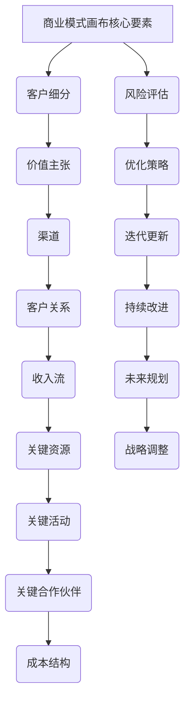

                 

### 《技术创业者的商业模式画布设计与应用》

> **关键词**：商业模式画布、商业模式设计、商业模式创新、创业、商业战略

**摘要**：
在当前快速变化的市场环境中，技术创业者的成功不仅依赖于技术创新，更在于能否设计出有效的商业模式。本文将深入探讨商业模式画布的概念、重要性，以及设计、应用与优化的方法。通过理论讲解、实践案例分析和工具介绍，为技术创业者提供一份详尽的商业模式设计指南。

### 引言

在创业过程中，技术创业者不仅要具备技术实力，还需具备商业头脑。商业模式画布（Business Model Canvas）作为一种创新的战略工具，它帮助创业者清晰地思考和设计自己的商业模式，从而提高创业成功率。本文将围绕商业模式画布展开，探讨其在技术创业中的实际应用，以期为广大创业者提供有益的参考。

首先，我们将对商业模式画布进行概述，介绍其基本概念、应用领域和优势。接着，我们将详细解析商业模式画布的核心要素，帮助读者理解并掌握其设计与应用的方法。然后，文章将探讨商业模式画布的设计原则、工具和方法，结合实际案例，展示如何将其应用于初创企业和传统企业的数字化转型。最后，我们将讨论商业模式画布的评估与优化方法，以及其未来的发展趋势。通过本文的阅读，技术创业者将能够系统地掌握商业模式画布的设计与应用技巧，为自己的创业之路奠定坚实的基础。

### 第一部分：商业模式画布概述

#### 第1章：商业模式画布概念与重要性

**1.1 商业模式画布的基本概念**

商业模式画布（Business Model Canvas）是由美国战略学家亚历山大·奥斯特瓦尔德（Alexander Osterwalder）和伊夫·皮尼厄（Yves Pigneur）在2010年提出的。它是一种直观、灵活的商业模式设计工具，通过一个直观的视觉框架，帮助创业者快速理解和调整商业模式。

商业模式画布由九个关键模块组成，每个模块代表商业模式的某个核心要素。这九个模块分别是：

1. **客户细分（Customer Segments）**：明确目标客户群体。
2. **价值主张（Value Propositions）**：为客户提供的价值和利益。
3. **渠道（Channels）**：传递价值主张给客户的途径。
4. **客户关系（Customer Relationships）**：与客户建立的关系类型。
5. **收入流（Revenue Streams）**：从客户获取的收益来源。
6. **关键资源（Key Resources）**：实现商业模式所需的核心资源。
7. **关键活动（Key Activities）**：维持商业模式运行的关键活动。
8. **关键合作伙伴（Key Partnerships）**：合作方，帮助获取资源和扩展能力。
9. **成本结构（Cost Structure）**：运营商业模式的成本结构。

**1.2 商业模式画布的应用领域**

商业模式画布广泛应用于各个领域，尤其适合初创企业、快速发展的企业以及需要进行商业模式转型的传统企业。具体应用领域包括：

1. **初创企业**：帮助创业者快速验证和调整商业模式。
2. **企业战略规划**：为企业的长期发展提供指导。
3. **商业模式创新**：探索新的商业模式，开拓市场机会。
4. **企业并购**：评估潜在收购对象的商业模式。
5. **竞争分析**：对比竞争对手的商业模式，找出优势与不足。

**1.3 商业模式画布的优势**

商业模式画布具有以下优势：

1. **直观性**：通过视觉化的方式，使得商业模式更加易于理解和沟通。
2. **灵活性**：可以快速迭代和调整，适应市场变化。
3. **全面性**：涵盖商业模式的各个方面，确保无遗漏。
4. **实用性**：适用于不同规模和行业的企业。
5. **创新性**：鼓励企业探索和尝试新的商业模式。

**1.4 商业模式画布的历史与发展**

商业模式画布的概念自提出以来，得到了广泛的关注和应用。随着商业环境的变化，商业模式画布也在不断发展和完善。以下是其主要历史和发展趋势：

1. **2010年**：亚历山大·奥斯特瓦尔德和伊夫·皮尼厄首次提出商业模式画布。
2. **2011年**：出版《商业模式画布》一书，详细介绍其设计和应用。
3. **2016年**：发布《商业模式创新：战略创业者手册》，进一步扩展了商业模式画布的应用范围。
4. **2018年**：发布《商业模式创新：系统方法》，提出了商业模式创新的系统性方法。
5. **未来趋势**：随着数字化、智能化和绿色经济的发展，商业模式画布将更加注重数据、技术和可持续性。

通过以上内容，我们对商业模式画布的基本概念、应用领域和优势有了初步了解。接下来，我们将详细解析商业模式画布的九大核心要素，帮助读者深入理解其设计和应用方法。

### 第2章：商业模式画布核心要素

在理解商业模式画布的基本概念后，接下来我们将详细探讨其九大核心要素，这些要素构成了商业模式的基础框架。通过对这些要素的深入分析，创业者可以更加清晰地设计和调整自己的商业模式。

**2.1 客户细分（Customer Segments）**

客户细分是指将市场划分为不同的客户群体，每个群体具有独特的需求、特征和行为。通过客户细分，创业者可以更加精准地定位目标客户，制定相应的市场策略。

**客户细分的核心要点包括：**

1. **需求分析**：了解不同客户群体的需求，包括核心需求、边缘需求和潜在需求。
2. **特征描述**：根据需求分析结果，对每个客户群体进行详细的特征描述，如年龄、性别、收入水平、地理位置等。
3. **优先级排序**：根据市场潜力和可行性，对客户群体进行优先级排序，确定哪些群体是商业模式的核心目标客户。

**案例**：一家在线教育平台，根据用户年龄、职业、学习目的等特征，将客户细分为学生、职场人士和退休人士三个群体。针对每个群体，平台设计了不同的课程和营销策略，以最大化满足他们的需求。

**2.2 价值主张（Value Propositions）**

价值主张是指企业为满足客户需求所提供的产品或服务。它是商业模式的核心，直接决定了客户是否愿意支付费用。

**价值主张的核心要点包括：**

1. **客户需求分析**：深入了解客户的核心需求，以确保价值主张能够解决他们的痛点。
2. **独特性**：明确价值主张的独特之处，如产品功能、服务质量、用户体验等。
3. **竞争分析**：分析竞争对手的价值主张，找出差异化的竞争优势。

**案例**：一家智能家居公司，其价值主张是提供安全、便捷、智能的家居解决方案。通过智能门锁、智能灯光、智能安防设备等产品，公司满足了用户对家居安全和便捷的需求，同时在功能、体验和安全性方面优于竞争对手。

**2.3 渠道（Channels）**

渠道是指企业将产品或服务传递给客户的途径。选择合适的渠道可以提高市场覆盖率和客户满意度。

**渠道的核心要点包括：**

1. **市场调研**：了解不同渠道的特点和适用性，选择最适合企业目标客户的渠道。
2. **渠道策略**：制定详细的渠道策略，包括渠道管理、渠道激励和渠道拓展。
3. **渠道评估**：定期评估渠道的绩效，调整渠道策略以适应市场变化。

**案例**：一家化妆品公司，通过线上电商平台、线下实体店和直销团队三种渠道销售产品。在线上，公司利用社交媒体和电商网站进行品牌推广和产品销售；在线下，公司开设实体店并提供专业咨询服务；在直销团队方面，公司通过培训和专业支持，激励销售团队拓展市场。

**2.4 客户关系（Customer Relationships）**

客户关系是指企业与客户之间建立的关系类型。良好的客户关系可以提高客户满意度和忠诚度，从而增加收入和市场份额。

**客户关系的核心要点包括：**

1. **关系类型**：根据客户特征和需求，选择合适的客户关系类型，如自助服务、个性化服务、账户管理服务等。
2. **关系维护**：通过客户关怀、售后服务和客户互动，维护和提升客户关系。
3. **关系评估**：定期评估客户关系的质量和绩效，调整客户关系策略。

**案例**：一家在线零售商，其客户关系策略主要包括自助服务、个性化服务和账户管理。在自助服务方面，公司提供了详细的购物指南和在线客服；在个性化服务方面，公司根据客户购买历史和偏好，提供个性化推荐和优惠；在账户管理方面，公司允许客户跟踪订单和享受积分优惠。

**2.5 收入流（Revenue Streams）**

收入流是指企业从客户那里获得的收益来源。明确的收入流可以帮助企业规划财务预算和利润目标。

**收入流的核心要点包括：**

1. **收益模式**：明确企业的收益模式，如订阅费、一次性销售、服务费等。
2. **定价策略**：根据市场需求和成本结构，制定合理的定价策略。
3. **收益预测**：根据历史数据和未来市场趋势，预测收入流。

**案例**：一家云计算公司，其收入流主要包括订阅费和服务费。公司提供不同层次的云计算服务，客户可以根据需要选择订阅不同的服务层次，同时公司还提供按需付费的选项，以满足不同客户的需求。

**2.6 关键资源（Key Resources）**

关键资源是指实现商业模式所需的核心资产，包括物质资源、人力资源、技术和品牌等。

**关键资源的核心要点包括：**

1. **资源分类**：明确关键资源的类型，包括有形资源和无形资源。
2. **资源获取**：制定资源获取策略，包括内部开发和外部采购。
3. **资源管理**：优化资源配置，提高资源利用效率。

**案例**：一家科技初创公司，其关键资源包括人才、技术和资金。公司通过招聘优秀的人才，建立技术研发团队；通过合作和自主研发，积累核心技术；通过风险投资，获得必要的资金支持。

**2.7 关键活动（Key Activities）**

关键活动是指维持商业模式运行的关键操作和过程。有效的关键活动可以提高企业的运营效率和市场竞争力。

**关键活动的核心要点包括：**

1. **活动识别**：识别商业模式中关键的活动环节。
2. **活动优化**：优化关键活动，提高效率和质量。
3. **活动整合**：将关键活动整合到企业的运营体系中。

**案例**：一家物流公司，其关键活动包括订单处理、仓储管理和配送服务。公司通过自动化订单处理系统，提高订单处理的效率；通过智能化仓储管理系统，优化仓储管理；通过高效配送服务，提升客户满意度。

**2.8 关键合作伙伴（Key Partnerships）**

关键合作伙伴是指与企业共同实现商业模式的关键合作方。合作伙伴可以提供资源、技术和市场等支持，帮助企业实现业务增长。

**关键合作伙伴的核心要点包括：**

1. **合作伙伴识别**：识别对企业业务有重要影响的合作伙伴。
2. **合作模式**：制定合作模式，明确合作方的责任和义务。
3. **合作管理**：建立有效的合作管理体系，确保合作顺利进行。

**案例**：一家电商平台，其关键合作伙伴包括物流公司、支付服务商和内容提供商。公司通过与物流公司合作，提高配送效率；与支付服务商合作，提供便捷的支付方式；与内容提供商合作，丰富平台内容。

**2.9 成本结构（Cost Structure）**

成本结构是指实现商业模式所需的成本构成。合理的成本结构可以提高企业的盈利能力。

**成本结构的核心要点包括：**

1. **成本分类**：明确成本结构中的各项成本，包括固定成本、可变成本和间接成本。
2. **成本控制**：制定成本控制策略，降低运营成本。
3. **成本效益分析**：进行成本效益分析，确保企业的成本结构合理。

**案例**：一家餐饮连锁企业，其成本结构包括租金、人力成本、食材成本和营销成本。公司通过租赁成本低廉的店铺、优化员工排班和培训、采购优质食材和降低营销费用，实现成本控制。

通过以上对商业模式画布九大核心要素的详细解析，读者可以更加深入地理解商业模式画布的设计与应用。这些要素不仅是商业模式的基础，也是创业者进行战略规划和决策的重要依据。在下一章中，我们将继续探讨商业模式画布的实践应用，结合具体案例进行分析，帮助读者更好地掌握商业模式画布的使用方法。

### 第3章：商业模式画布的实践应用

在实际创业过程中，商业模式画布不仅是一个理论工具，更是一个可以具体应用的操作指南。通过商业模式画布，创业者可以系统性地分析市场环境、识别竞争优势、制定战略规划，并持续优化商业模式。以下将结合具体案例，探讨商业模式画布在不同场景中的应用。

**3.1 如何使用商业模式画布**

使用商业模式画布可以分为以下几个步骤：

1. **定义目标**：明确商业模式画布的目标，如验证市场潜力、优化现有商业模式或探索新商业模式。
2. **填充要素**：根据目标，在画布上填充各个核心要素，包括客户细分、价值主张、渠道等。
3. **分析优化**：对每个要素进行深入分析，评估其合理性和可行性，根据市场反馈进行调整。
4. **执行与监控**：将优化后的商业模式投入实施，并定期监控和评估其效果，进行持续改进。

**3.2 企业转型与商业模式创新**

在当前市场环境下，许多传统企业面临着数字化转型和商业模式创新的挑战。商业模式画布为企业提供了系统的方法，帮助其实现转型和创新发展。

**案例**：某传统制造业企业，为了应对市场变化和客户需求，决定进行商业模式创新。以下是该企业应用商业模式画布进行转型的过程：

1. **客户细分**：企业将客户细分为大型企业、中小企业和个人消费者三个群体。
2. **价值主张**：针对不同客户群体，企业提出了个性化定制、快速交付和售后服务等价值主张。
3. **渠道**：企业通过线上电商平台、线下经销商和直销团队三种渠道，覆盖不同类型的客户。
4. **客户关系**：企业通过提供优质服务和个性化推荐，建立稳定的客户关系。
5. **收入流**：企业通过定制服务、一次性销售和售后服务等多种收入流，确保盈利。
6. **关键资源**：企业投资于先进的生产设备和技术研发，提升生产效率和产品质量。
7. **关键活动**：企业优化了生产流程、供应链管理和市场营销活动，提高运营效率。
8. **关键合作伙伴**：企业与物流公司、技术供应商和营销服务机构建立紧密的合作关系。
9. **成本结构**：企业通过优化生产和运营流程，降低成本，提高盈利能力。

通过以上步骤，企业成功实现了从传统制造业向现代服务型企业的转型，业务规模和盈利能力显著提升。

**3.3 不同行业的商业模式画布案例分析**

不同行业的商业模式有所不同，但商业模式画布的基本框架和应用方法具有普遍性。以下是一些不同行业的商业模式画布案例分析：

1. **在线教育行业**：在线教育平台通过商业模式画布明确了目标客户（学生、职场人士和退休人士）、价值主张（个性化课程、灵活学习安排和高质量教学资源）、渠道（线上课程、线下培训机构和合作学校）、客户关系（学习支持、职业规划咨询和社交互动）等关键要素。

2. **共享经济行业**：共享经济企业（如共享单车、共享办公和共享住宿）通过商业模式画布识别了客户细分（短期使用者、长期租户和商家）、价值主张（便捷出行、灵活办公和舒适住宿）、渠道（APP、网站和线下服务点）、客户关系（用户评价系统、会员计划和客户关怀）等。

3. **医疗健康行业**：医疗健康企业（如在线医疗咨询、健康管理和医疗设备制造商）通过商业模式画布确定了客户细分（患者、医生和医疗机构）、价值主张（快速便捷的医疗咨询、个性化健康管理和高质量医疗设备）、渠道（线上平台、线下诊所和医疗机构合作）等。

通过以上案例，可以看出商业模式画布在不同行业的具体应用方法和策略，为创业者提供了宝贵的实践经验。

**总结**

商业模式画布作为一种强大的战略工具，可以帮助创业者系统地设计和优化商业模式，提高创业成功率。通过具体案例的分析，读者可以更好地理解商业模式画布的应用方法，并将其应用于实际创业过程中。在下一章中，我们将进一步探讨商业模式画布的设计原则和方法，为创业者提供更加深入的指导。

### 第二部分：商业模式画布设计方法

在深入了解了商业模式画布的基本概念和应用后，接下来我们将探讨商业模式画布的设计方法。通过理解设计原则、使用工具和方法，创业者可以更加科学和系统地构建和优化商业模式。以下是商业模式画布设计方法的详细解析。

#### 第4章：商业模式画布设计原则

**4.1 设计原则概述**

商业模式画布的设计原则是构建有效商业模式的基础。以下是几种关键设计原则：

1. **客户价值最大化**：确保商业模式能够提供最大化的客户价值，满足客户的核心需求。
2. **创新与灵活性**：鼓励企业不断探索创新，适应市场变化，保持商业模式的灵活性和适应性。
3. **可持续性与稳定性**：确保商业模式在长期运营中具有可持续性和稳定性，能够应对各种市场挑战。
4. **成本效益**：优化商业模式中的成本结构，提高成本效益，确保企业的盈利能力。

**4.2 客户价值最大化**

客户价值最大化是商业模式设计的核心原则。以下是实现客户价值最大化的关键步骤：

1. **需求分析**：通过市场调研和用户反馈，深入了解客户的需求和痛点。
2. **价值定位**：根据需求分析结果，明确商业模式的价值主张，确保能够满足客户的核心需求。
3. **客户体验**：优化客户体验，包括购买流程、售后服务和用户互动，提高客户满意度和忠诚度。
4. **客户反馈**：建立客户反馈机制，及时收集和响应客户意见，持续优化商业模式。

**4.3 创新与灵活性**

创新与灵活性是商业模式成功的关键。以下是实现创新与灵活性的方法：

1. **技术创新**：通过引入新技术和创新产品，提升商业模式的竞争力。
2. **商业模式创新**：不断探索和尝试新的商业模式，开拓市场机会。
3. **敏捷响应**：建立敏捷运营机制，快速响应市场变化，调整商业模式。
4. **多元化发展**：通过多元化战略，降低市场风险，提高商业模式的适应性。

**4.4 可持续性与稳定性**

可持续性与稳定性是商业模式长期成功的基础。以下是实现可持续性与稳定性的方法：

1. **资源管理**：优化资源分配，提高资源利用效率，确保资源的可持续性。
2. **风险管理**：建立完善的风险管理机制，预防和应对各种市场风险。
3. **合作伙伴关系**：与关键合作伙伴建立长期稳定的合作关系，确保商业模式的稳定性。
4. **财务规划**：制定合理的财务规划，确保企业的财务稳定和盈利能力。

#### 第5章：商业模式画布设计工具

**5.1 SWOT分析**

SWOT分析是一种常用的战略工具，用于评估企业的优势（Strengths）、劣势（Weaknesses）、机会（Opportunities）和威胁（Threats）。通过SWOT分析，创业者可以全面了解企业的现状和外部环境，从而制定合理的商业模式设计策略。

**5.2 Five Forces模型**

Five Forces模型是由迈克尔·波特（Michael Porter）提出的，用于分析行业竞争环境。该模型包括五种竞争力量：行业竞争者、潜在进入者、替代品、供应商和买家。通过Five Forces模型，创业者可以深入了解行业竞争态势，制定有效的商业模式。

**5.3 成本效益分析**

成本效益分析是一种评估商业模式经济性的方法，通过比较成本和收益，判断商业模式是否具有盈利能力。创业者可以使用成本效益分析，优化商业模式中的成本结构，提高盈利水平。

**5.4 用户画像分析**

用户画像分析是一种基于数据分析的方法，用于了解目标客户的特征和行为。通过用户画像分析，创业者可以更加精准地定位客户需求，设计出更具针对性的商业模式。

**5.5 风险评估与应对策略**

风险评估是一种识别和评估商业模式潜在风险的方法。通过风险评估，创业者可以提前预见和应对各种风险，确保商业模式的稳定性和可持续性。

#### 第6章：商业模式画布设计实战

**6.1 设计流程与步骤**

设计商业模式画布可以分为以下几个步骤：

1. **明确目标**：确定商业模式设计的目标，如市场扩张、盈利能力提升等。
2. **分析现状**：分析企业当前的商业模式和市场环境，识别优势和不足。
3. **市场调研**：进行市场调研，了解目标客户的需求和竞争态势。
4. **设计方案**：根据调研结果，设计初步的商业模式方案。
5. **评估优化**：对设计方案进行评估和优化，确保其合理性和可行性。
6. **实施与监控**：将优化后的商业模式投入实施，并定期监控和评估其效果。

**6.2 实战案例一：初创企业商业模式设计**

初创企业在设计商业模式时，通常面临资源有限、市场不确定等挑战。以下是一个初创企业商业模式设计的实战案例：

1. **客户细分**：初创企业将客户细分为大学生、职场新人和技术爱好者三个群体。
2. **价值主张**：企业提供了高质量的技术教程、在线问答服务和项目实践机会，满足客户的学习和发展需求。
3. **渠道**：企业通过社交媒体、线上平台和线下活动，与客户建立联系。
4. **客户关系**：企业通过提供个性化服务和定期互动，提升客户满意度和忠诚度。
5. **收入流**：企业通过会员订阅、课程销售和咨询收入等方式获得收益。
6. **关键资源**：企业的主要资源包括技术团队、教学资源和营销渠道。
7. **关键活动**：企业通过技术研发、内容创作和市场推广，维持商业模式运行。
8. **关键合作伙伴**：企业与合作教育机构、技术公司和营销平台建立了合作关系。
9. **成本结构**：企业通过优化运营流程和资源利用，降低成本。

通过以上步骤，初创企业成功设计了一套符合自身特点的商业模式，为后续发展奠定了基础。

**6.3 实战案例二：传统企业数字化转型**

传统企业在数字化转型过程中，需要重新设计和调整商业模式，以适应数字化时代的需求。以下是一个传统企业数字化转型的实战案例：

1. **客户细分**：传统企业将客户细分为现有客户、潜在客户和新市场客户。
2. **价值主张**：企业通过数字化手段提供更高效、更便捷的服务，如在线咨询、在线支付和个性化推荐。
3. **渠道**：企业通过官网、APP和社交媒体等数字化渠道，与客户建立联系。
4. **客户关系**：企业通过数据分析和客户互动，提供个性化的服务和推荐。
5. **收入流**：企业通过数字化转型，拓展了收入来源，如会员订阅、在线销售和增值服务。
6. **关键资源**：企业投资于数字化技术、数据分析和营销团队。
7. **关键活动**：企业通过数字化转型，优化了生产流程、供应链管理和客户服务。
8. **关键合作伙伴**：企业与合作科技公司和数字化服务提供商建立了合作关系。
9. **成本结构**：企业通过数字化手段，降低了运营成本，提高了效率。

通过以上案例，读者可以看到商业模式画布在初创企业和传统企业中的应用方法。这些方法不仅帮助创业者系统性地设计和优化商业模式，也为企业的长期发展提供了有力支持。

通过以上章节的讨论，读者应该对商业模式画布的设计方法有了更深入的理解。接下来，我们将进一步讨论如何评估和优化商业模式画布，确保其持续适应市场变化和满足企业需求。

### 第7章：商业模式画布的评估与优化

在商业模式设计完成后，评估和优化是确保其有效性和持续适应市场变化的关键步骤。通过科学的方法和工具，创业者可以定期评估商业模式的表现，并根据反馈进行必要的调整和优化。

**7.1 评估方法与工具**

评估商业模式的有效性需要从多个维度进行，以下是一些常用的评估方法和工具：

1. **财务指标分析**：通过财务指标，如收入、成本、利润、现金流等，评估商业模式的盈利能力和财务健康状况。常用的财务指标包括毛利率、净利率、资产回报率、现金流比率等。

2. **客户满意度调查**：通过定期调查客户满意度，了解客户对产品和服务的评价，识别客户需求和不满之处。这可以通过在线问卷、电话访谈或面对面的用户反馈等方式进行。

3. **市场反馈**：通过市场调研和竞争对手分析，了解市场趋势、客户需求和行业变化。这可以帮助创业者识别新的市场机会和潜在的威胁。

4. **绩效指标分析**：设置关键绩效指标（KPIs），如客户获取成本、客户保留率、市场渗透率等，定期跟踪和评估这些指标，以确保商业模式的有效性。

**7.2 优化策略与实践**

在评估商业模式后，创业者需要制定具体的优化策略，并付诸实践。以下是一些优化策略和实践方法：

1. **价值主张优化**：根据客户反馈和市场变化，调整价值主张，确保其始终满足客户的核心需求。可以通过引入新功能、改进现有服务或优化用户体验来实现。

2. **渠道优化**：评估不同渠道的表现，选择最有效的渠道，并优化渠道管理。例如，通过加强线上线下融合，提高客户的购买便利性和体验。

3. **成本结构优化**：通过精细化管理，降低运营成本，提高成本效益。例如，通过自动化和流程优化，减少不必要的开支。

4. **收入流拓展**：探索新的收入来源，如增值服务、跨界合作或新市场开拓。这可以通过市场调研和客户需求分析来确定。

5. **合作伙伴关系优化**：与关键合作伙伴建立更加紧密的合作关系，共同开发市场和客户资源。可以通过合作共赢的机制，提高合作效率。

**7.3 持续改进与迭代**

商业模式的评估和优化是一个持续的过程，创业者需要建立持续改进和迭代的机制。以下是一些建议：

1. **定期评估**：定期对商业模式进行评估，确保其持续适应市场变化和客户需求。

2. **反馈机制**：建立有效的反馈机制，及时收集客户、员工和合作伙伴的意见和建议，并将其纳入优化策略。

3. **敏捷迭代**：采用敏捷开发的方法，快速响应市场变化，持续迭代和优化商业模式。

4. **数据驱动**：利用数据分析，对商业模式的表现进行量化评估，以数据为基础进行决策和优化。

**案例**：一家在线教育平台，通过定期评估和优化，持续改进其商业模式。首先，平台通过财务指标分析，发现客户获取成本较高，于是调整了市场推广策略，降低了获取客户的成本。其次，平台通过客户满意度调查，发现部分用户对课程内容不满意，平台及时更新课程内容，提高了用户满意度。此外，平台还通过绩效指标分析，发现客户保留率较低，于是加强了客户关系管理，提高了客户保留率。

通过以上案例，可以看出评估和优化商业模式的重要性和实践方法。创业者需要建立科学的评估体系，制定合理的优化策略，并持续迭代和改进商业模式，以适应市场变化和客户需求，确保企业的长期发展。

### 第8章：商业模式画布的未来发展趋势

在数字化、智能化和绿色经济的推动下，商业模式画布正面临着新的挑战和机遇。随着技术的不断进步和市场的演变，商业模式画布将呈现出以下几大发展趋势。

**8.1 数字化转型对商业模式的影响**

数字化转型已经成为当今企业发展的重要趋势。在商业模式画布的应用中，数字化转型带来了以下几个方面的变化：

1. **数据驱动的决策**：通过大数据分析和人工智能技术，企业可以更加精准地了解客户需求和市场趋势，从而优化价值主张、渠道策略和收入流。数据驱动的决策使得商业模式更加灵活和高效。

2. **渠道的多样化和融合**：数字化转型使得企业可以通过多种渠道（如线上、线下、社交媒体等）与客户互动，实现渠道的多样化和融合。这种渠道的多样化不仅提高了市场覆盖范围，还增强了客户的购买体验。

3. **客户关系的深化**：数字化转型使得企业能够通过在线互动、个性化推荐和智能客服等手段，与客户建立更加紧密和深化的关系。这种客户关系的深化有助于提高客户满意度和忠诚度，从而增强收入流。

**8.2 绿色商业模式的发展**

随着环保意识的提升和政策的推动，绿色商业模式正在逐渐兴起。绿色商业模式强调在创造经济价值的同时，减少对环境的负面影响，实现可持续发展。

1. **环保资源的利用**：绿色商业模式鼓励企业使用可再生资源和清洁能源，减少对自然资源的消耗。例如，一些企业通过采用太阳能、风能等可再生能源，减少碳排放。

2. **环保产品的开发**：企业可以开发环保产品和服务，如节能设备、环保材料等，满足消费者对环保产品的需求。这种环保产品的开发不仅有助于提升企业的品牌形象，还能开辟新的收入流。

3. **循环经济的实践**：循环经济强调资源的循环利用，减少废物产生。企业可以通过设计可回收、可降解的产品和实施废物管理策略，实现资源的循环利用。

**8.3 智能化与自动化在商业模式中的应用**

智能化和自动化技术的进步正在改变商业模式的运作方式，提高效率和降低成本。

1. **智能决策支持系统**：通过人工智能和大数据技术，企业可以建立智能决策支持系统，实现自动化决策。这种系统可以根据实时数据和市场变化，自动调整策略，提高决策的准确性和响应速度。

2. **自动化运营**：企业可以通过自动化技术，实现生产、供应链管理和客户服务的自动化。例如，使用机器人自动化生产线，提高生产效率；使用自动化仓储系统，优化库存管理；使用智能客服系统，提高客户服务质量。

3. **个性化服务**：通过人工智能和大数据分析，企业可以提供个性化的产品和服务。例如，通过分析用户的购物行为和偏好，企业可以提供个性化的推荐，提高用户的满意度和忠诚度。

**8.4 未来商业模式创新的趋势预测**

未来商业模式创新将继续受到技术、市场和消费者行为的影响，以下是一些趋势预测：

1. **平台经济的崛起**：平台经济通过连接供需双方，实现资源的优化配置。未来，平台经济将继续发展，成为重要的商业模式。

2. **共享经济的深化**：共享经济已经从简单的资源共享，发展到更为复杂的共享生态系统。未来，共享经济将在更多领域得到应用，如共享工作空间、共享医疗资源等。

3. **社区经济的兴起**：社区经济通过建立紧密的社区关系，实现资源共享和共同发展。未来，社区经济将成为重要的商业模式，特别是在乡村和城市社区领域。

4. **绿色商业模式的普及**：随着环保意识的提升，绿色商业模式将逐渐普及。未来，绿色商业模式将成为企业社会责任的重要体现，也是企业持续发展的关键。

通过以上发展趋势的分析，可以看出商业模式画布在未来将继续发挥重要作用。创业者需要紧跟市场和技术变化，不断优化和迭代商业模式，以适应未来的商业环境。未来，商业模式画布将更加智能化、绿色化和多样化，为企业的长期发展提供有力支持。

### 附录A：商业模式画布工具与资源

在设计和优化商业模式画布的过程中，使用合适的工具和资源可以显著提高效率和效果。以下是一些推荐的商业模式画布工具、相关书籍与文献以及在线课程与培训资源。

**A.1 商业模式画布软件推荐**

1. **Business Model Canvas Generator**：这是一个在线工具，可以帮助用户轻松创建和编辑商业模式画布。它提供直观的界面和丰富的模板，适合初学者和专业人士使用。

2. **Canvas App**：Canvas App 是一个移动应用程序，可以在线或离线编辑商业模式画布。它支持iOS和Android平台，方便用户随时随地访问和编辑画布。

3. **Strategyzer**：这是一个在线平台，提供了全面的商业模式设计工具，包括商业模式画布、精益画布等。它还提供了丰富的教程和资源，帮助用户更好地理解和应用这些工具。

**A.2 商业模式画布相关书籍与文献**

1. **《商业模式新生代》**：由亚历山大·奥斯特瓦尔德和伊夫·皮尼厄所著，是商业模式画布的权威指南。这本书详细介绍了商业模式画布的概念、应用和实践案例。

2. **《商业模式创新：战略创业者手册》**：这本书扩展了商业模式画布的应用范围，提供了创新的商业模式设计方法，适合创业者和管理者阅读。

3. **《商业模式画布实践指南》**：这本书提供了详细的商业模式画布设计和应用案例，帮助读者更好地理解和应用商业模式画布。

**A.3 在线课程与培训资源**

1. **Coursera**：Coursera 提供了多个关于商业模式的在线课程，包括商业模式画布设计、创新战略等。这些课程由知名大学和行业专家讲授，内容深入且实用。

2. **Udemy**：Udemy 提供了丰富的商业模式画布相关课程，涵盖了从基础概念到高级应用的各个方面。用户可以根据自己的需求和水平选择适合的课程。

3. **LinkedIn Learning**：LinkedIn Learning 提供了一系列关于商业模式的在线课程，包括商业模式画布、战略规划等。这些课程由行业专家和资深从业者讲授，具有很高的实用价值。

通过使用这些工具和资源，创业者可以更加高效地设计和优化商业模式，提高商业成功的概率。无论是使用在线工具、阅读书籍还是参加在线课程，都能够为商业模式画布的学习和应用提供宝贵的支持和帮助。

### 附录B：Mermaid流程图示例

以下是一个使用Mermaid绘制的商业模式画布核心要素的流程图示例：

通过这个流程图，可以清晰地看到商业模式画布的核心要素以及它们之间的相互关系，有助于创业者更好地理解和应用商业模式画布。同时，Mermaid流程图提供了灵活的编辑和展示功能，方便用户对其进行修改和扩展。

### 总结

本文系统地介绍了商业模式画布的概念、重要性、核心要素、设计方法以及评估与优化策略。通过深入分析，读者可以了解到商业模式画布在技术创业中的应用价值，以及如何通过这一工具实现商业模式的创新与优化。商业模式画布不仅适用于初创企业，也可以帮助传统企业进行数字化转型，提高市场竞争力。

在未来，随着数字化、智能化和绿色经济的不断发展，商业模式画布将继续发挥重要作用。创业者需要紧跟市场趋势，持续优化商业模式，以适应不断变化的环境。同时，商业模式画布的设计和应用也需要不断创新，以满足企业不同阶段的发展需求。

最后，作者感谢读者对本文的关注和阅读。希望本文能够为技术创业者和企业管理者提供有价值的参考，助力他们在商业道路上取得更大的成功。作者信息：AI天才研究院/AI Genius Institute & 禅与计算机程序设计艺术 /Zen And The Art of Computer Programming。如有任何问题和建议，欢迎随时与作者联系。

