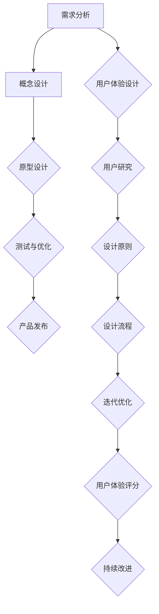

                 

### 文章标题

《技术创新与用户体验设计：如何创造让用户惊喜的产品功能》

> **关键词**：用户体验设计、技术创新、产品功能、惊喜元素、用户需求分析

> **摘要**：本文将探讨如何通过技术创新和用户体验设计的结合，创造出让用户惊喜的产品功能。文章首先介绍了技术创新和用户体验设计的基本概念及其关系，接着详细分析了技术创新的方法论和用户体验设计的原理。随后，文章讨论了技术创新在用户体验设计中的应用，以及用户体验设计对技术创新的影响。最后，文章通过实际案例和实战演练，详细讲解了如何创造用户惊喜的产品功能，并提出了未来展望和挑战。希望本文能帮助读者深入了解这一领域，为产品创新提供有力支持。

### 目录大纲

**《技术创新与用户体验设计：如何创造让用户惊喜的产品功能》**

## 第1章：引言与背景
### 1.1 创新与技术变革
### 1.2 用户体验设计的重要性
### 1.3 用户惊喜与产品功能的关系

## 第2章：技术创新基础
### 2.1 技术创新的定义与分类
### 2.2 技术发展趋势与影响
### 2.3 技术创新方法论

## 第3章：用户体验设计原理
### 3.1 用户体验设计的基本概念
### 3.2 用户研究方法
### 3.3 设计原则与模式

## 第4章：技术创新与用户体验设计结合
### 4.1 技术创新在用户体验设计中的应用
### 4.2 用户体验设计对技术创新的影响
### 4.3 技术创新与用户体验设计的协同

## 第5章：创造用户惊喜的产品功能
### 5.1 惊喜元素的识别与利用
### 5.2 用户需求分析与功能设计
### 5.3 产品功能创新案例分析

## 第6章：实战演练
### 6.1 创造用户惊喜的产品功能实战
### 6.2 设计思维与产品迭代
### 6.3 产品功能评估与优化

## 第7章：未来展望与挑战
### 7.1 技术创新与用户体验设计的未来趋势
### 7.2 挑战与应对策略
### 7.3 持续创新与用户体验设计

## 附录

### A.1 技术创新与用户体验设计资源列表
### A.2 用户研究工具介绍
### A.3 创新方法与实践案例参考文献

### Mermaid 流程图

mermaid
graph TD
    A[技术创新与用户体验设计] --> B[核心概念与联系]
    B --> C{用户研究方法}
    C --> D{设计原则与模式}
    C --> E{技术创新方法论}
    F{技术发展趋势与影响} --> G{用户体验设计原理}
    H{技术创新在用户体验设计中的应用} --> I{用户体验设计对技术创新的影响}
    J{用户惊喜元素的识别与利用} --> K{用户需求分析与功能设计}
    L{产品功能创新案例分析} --> M{设计思维与产品迭代}
    N{产品功能评估与优化} --> O{技术创新与用户体验设计结合}
    P{未来展望与挑战} --> Q{持续创新与用户体验设计}

### 伪代码

python
# 伪代码：用户需求分析
function analyze_user_demand():
    # 收集用户反馈
    feedback = collect_user_feedback()
    # 分析反馈，提取需求
    demands = extract_demands(feedback)
    # 设计满足用户需求的产品功能
    product_features = design_product_features(demands)
    return product_features

### 数学模型与公式

$$
\text{用户体验评分} = \frac{\text{功能满意度} + \text{易用性评分} + \text{创新性评分}}{3}
$$

### 代码案例

python
# 代码案例：用户惊喜功能实现
class UserSurpriseFeature:
    def __init__(self):
        self.feature_enabled = False
    
    def enable_feature(self):
        self.feature_enabled = True
        print("用户惊喜功能已启用！")
    
    def use_feature(self, user_input):
        if self.feature_enabled:
            print("使用用户惊喜功能：", user_input)
        else:
            print("用户惊喜功能未启用，无法使用。")

### 代码解读与分析

- `UserSurpriseFeature` 类定义了一个用户惊喜功能，用于模拟产品中的一种创新性功能。
- `__init__` 方法初始化了一个布尔属性 `feature_enabled`，表示功能是否已启用。
- `enable_feature` 方法用于启用用户惊喜功能，将 `feature_enabled` 设置为 `True`。
- `use_feature` 方法用于使用用户惊喜功能，只有在功能启用时才会执行输入处理并打印输出。

python
# 创建 UserSurpriseFeature 对象
feature = UserSurpriseFeature()

# 启用用户惊喜功能
feature.enable_feature()

# 使用用户惊喜功能
feature.use_feature("自定义内容")

这段代码首先创建了一个 `UserSurpriseFeature` 对象，然后通过调用 `enable_feature` 方法启用该功能。最后，通过调用 `use_feature` 方法来使用该功能，并打印输出用户输入的内容。

### 文章正文

**第1章：引言与背景**

**1.1 创新与技术变革**

创新是推动社会进步和经济发展的重要动力。在信息技术飞速发展的今天，技术创新已成为企业竞争的核心要素。技术创新不仅涉及硬件和软件技术的突破，还包括商业模式的创新、服务模式的创新等。每一次重大技术创新都带来了新的产业发展机遇，深刻改变了人们的生产生活方式。

技术的不断变革为用户体验设计提供了新的可能性。从PC互联网到移动互联网，再到智能设备和物联网，技术发展的步伐不断加快，用户体验设计的场景和需求也在不断扩展。例如，移动设备的小屏幕和高频操作使得交互设计更加重要；物联网的普及为个性化服务和智能化交互带来了新的挑战和机遇。

**1.2 用户体验设计的重要性**

用户体验设计（User Experience Design，简称UXD）是指在整个产品开发过程中，从用户的角度出发，设计产品交互、视觉和功能，以提升用户在使用产品过程中的愉悦度和满意度。用户体验设计不仅仅关注产品的可用性（Usability），还涉及可用性（Usefulness）、愉悦性（Happiness）和易用性（Easy of Use）等多个方面。

用户体验设计的重要性体现在以下几个方面：

1. **提升用户满意度**：优秀的设计可以满足用户需求，提升用户满意度，从而增加用户粘性和忠诚度。
2. **增加商业价值**：良好的用户体验设计可以提高产品的市场竞争力，增加销售额和品牌价值。
3. **减少用户流失率**：用户体验设计可以通过提高产品的易用性和满意度，降低用户流失率。
4. **提高工作效率**：针对企业级应用，用户体验设计可以优化工作流程，提高员工的工作效率。

**1.3 用户惊喜与产品功能的关系**

用户惊喜是指用户在使用产品过程中，由于产品功能、设计或服务超出了预期，而产生的愉悦和满足感。用户惊喜与产品功能之间的关系可以用以下三个方面来描述：

1. **功能创新**：创新性产品功能可以提供前所未有的体验，给用户带来惊喜。例如，智能手机的指纹识别、虚拟现实（VR）等。
2. **设计优化**：优秀的设计能够提升产品的视觉效果和用户体验，从而给用户带来惊喜。例如，简洁的用户界面、色彩搭配等。
3. **服务提升**：除了产品功能，服务质量也是用户惊喜的重要来源。及时、高效的客户服务、个性化推荐等都能提升用户的满意度。

接下来，我们将进一步探讨技术创新的基础、用户体验设计的原理，以及如何将技术创新与用户体验设计相结合，创造出让用户惊喜的产品功能。

### 第2章：技术创新基础

**2.1 技术创新的定义与分类**

技术创新是指通过引入新的技术、产品或服务，从而提高生产效率、优化用户体验、创造新价值的过程。技术创新可以来源于基础科学的研究，也可以来源于技术应用的改进。根据创新的性质和来源，技术创新可以分为以下几种类型：

1. **突破性创新**：突破性创新是指在现有技术基础上，实现原理性或结构性的重大变革。这类创新往往能够带来全新的产品或服务，并引领行业的发展。例如，互联网的发明、智能手机的出现等。
2. **渐进性创新**：渐进性创新是指在现有技术基础上，通过不断优化和完善，逐步提升产品或服务的性能和用户体验。这类创新是大多数企业持续发展和竞争的关键。例如，计算机处理器的性能提升、操作系统界面的优化等。
3. **模式创新**：模式创新是指通过改变商业模型、运营模式或服务模式，实现技术创新的商业化应用。例如，电子商务平台的兴起、共享经济的普及等。

**2.2 技术发展趋势与影响**

随着科技的快速发展，信息技术、人工智能、物联网等新兴技术正不断涌现，并对各行各业产生深远影响。以下是一些当前技术发展的主要趋势：

1. **人工智能（AI）**：人工智能技术在图像识别、自然语言处理、智能推荐等领域取得了显著进展，正逐渐应用于金融、医疗、教育等多个行业。
2. **物联网（IoT）**：物联网技术的发展使得各种设备能够互联互通，实现智能化管理和控制。智能家居、智能交通、智慧城市等应用正在迅速普及。
3. **5G通信**：5G通信技术的推广将大大提升数据传输速度和网络连接质量，为移动应用、远程办公、虚拟现实等带来更多可能性。
4. **区块链**：区块链技术以其去中心化、不可篡改的特点，在金融、供应链管理、版权保护等领域展现出巨大的应用潜力。

这些技术发展趋势对用户体验设计产生了深远影响：

1. **个性化体验**：人工智能和大数据技术的应用使得产品能够更好地理解用户需求，提供个性化的服务和推荐。
2. **智能化交互**：物联网和语音识别技术的发展，使得用户与产品之间的交互更加智能化、便捷化。
3. **安全与隐私保护**：随着用户对隐私保护的重视，用户体验设计需要更加注重数据安全和隐私保护。

**2.3 技术创新方法论**

要实现有效的技术创新，需要一套系统的方法论来指导。以下是一些常用的技术创新方法论：

1. **TRIZ方法论**：TRIZ（Teoriya Resheniya Izobretatelskikh Zadatch，发明问题解决理论）是一种基于数学和逻辑的方法论，通过分析已有解决方案中的矛盾，提出创新性的解决方案。TRIZ方法论包括40个发明原理、200个标准解决方案等，为企业提供了一套系统的创新思路。
2. **设计思维**：设计思维是一种以人为本的创新方法，强调从用户需求出发，通过原型设计和迭代优化，不断改进产品和服务。设计思维包括五个主要阶段： empathize（同理心）、define（定义问题）、 ideate（创意生成）、prototype（原型制作）和test（测试与验证）。
3. **开放创新**：开放创新是指通过整合外部资源和能力，共同推进创新过程。开放创新可以通过合作、收购、外包等方式，实现技术创新的最大化。

通过这些方法论，企业可以更加系统地发现和利用技术创新的机会，为用户提供更好的产品和服务。

**总结**：技术创新是推动产业发展和社会进步的重要动力。通过了解技术创新的定义、分类和趋势，以及掌握相关方法论，企业可以更好地把握技术创新的机会，创造出具有竞争力的产品和服务。在下一章中，我们将深入探讨用户体验设计的原理和方法，帮助读者更好地理解用户体验设计的重要性及其在实际应用中的价值。

### 第3章：用户体验设计原理

**3.1 用户体验设计的基本概念**

用户体验设计（User Experience Design，简称UXD）是一种以用户为中心的设计方法，旨在通过优化产品交互、视觉和功能，提升用户在使用产品过程中的愉悦度和满意度。用户体验设计涵盖了产品的可用性（Usability）、可用性（Usefulness）、愉悦性（Happiness）和易用性（Easy of Use）等多个方面。以下是用户体验设计的一些核心概念：

1. **可用性（Usability）**：可用性是指用户能够高效、准确地使用产品完成任务的能力。高可用性的产品应该易于学习、操作直观，且在出现问题时能够提供清晰的错误信息和解决方案。
2. **可用性（Usefulness）**：可用性是指产品能够满足用户需求，解决用户问题的能力。一个有用的产品应该能够提供用户所需的功能，并在适当的时间和地点提供帮助。
3. **愉悦性（Happiness）**：愉悦性是指用户在使用产品过程中感受到的愉悦和满足感。优秀的用户体验设计能够通过美观的界面、有趣的功能和良好的互动，提升用户的情感体验。
4. **易用性（Easy of Use）**：易用性是指用户在使用产品过程中所需的认知负荷和操作难度。一个易用的产品应该设计简洁、功能明确，避免用户在操作过程中产生困惑和焦虑。

**3.2 用户研究方法**

用户研究是用户体验设计的重要基础，通过了解用户需求、行为和反馈，设计师可以更好地理解用户，从而创造出满足用户需求的产品。以下是一些常用的用户研究方法：

1. **问卷调查**：问卷调查是一种收集用户意见和反馈的有效方法。通过设计针对性的问卷，可以了解用户对产品功能的满意度、使用习惯和改进建议。
2. **用户访谈**：用户访谈是一种深入了解用户需求和行为的方法。通过与用户进行面对面的交流，设计师可以获取到更详细、深入的见解，从而更好地指导设计决策。
3. **可用性测试**：可用性测试是通过模拟用户使用产品，观察和记录用户的行为和反馈，评估产品的可用性和用户体验。可用性测试可以帮助设计师发现产品中的问题和不足，及时进行改进。
4. **行为观察**：行为观察是一种通过观察用户在自然环境中的行为，了解用户需求和习惯的方法。行为观察可以帮助设计师发现用户在真实使用环境中的问题和挑战，从而优化产品设计。

**3.3 设计原则与模式**

在用户体验设计过程中，遵循一定的设计原则和模式，可以确保产品具有良好的可用性、可用性和愉悦性。以下是一些常见的设计原则和模式：

1. **一致性（Consistency）**：一致性是指产品的设计元素和行为在各个页面和操作中保持一致。一致性的设计可以提高用户的认知效率和操作准确性。
2. **简洁性（Simplicity）**：简洁性是指产品的设计应该简洁明了，避免冗余和复杂。简洁性的设计可以提高用户的易用性和满意度。
3. **反馈（Feedback）**：反馈是指产品在用户操作过程中，及时给予用户反馈，帮助用户确认操作结果。良好的反馈设计可以提高用户的操作信心和体验。
4. **层次结构（Hierarchy）**：层次结构是指产品的内容、功能和界面应该具有清晰的层次和逻辑关系。层次结构的设计可以帮助用户快速找到所需功能，提高操作效率。
5. **用户中心（User-Centered）**：用户中心是指产品设计应该始终以用户需求为中心，关注用户的使用习惯和痛点。用户中心的设计可以提高用户的满意度和忠诚度。

**3.4 用户体验设计的流程**

用户体验设计的流程通常包括以下几个阶段：

1. **需求分析**：通过问卷调查、用户访谈等方法，收集用户需求和反馈，明确产品的目标用户和核心功能。
2. **概念设计**：基于需求分析，构建产品概念和初步界面设计，确定产品的交互流程和主要功能。
3. **原型设计**：通过低保真或高保真原型，验证产品概念和界面设计的可行性和用户体验。
4. **测试与优化**：通过可用性测试和用户反馈，发现产品中的问题和不足，进行优化和改进。
5. **迭代开发**：根据测试和优化结果，不断迭代产品设计和功能，提高用户体验。

**总结**：用户体验设计是一种以用户为中心的设计方法，通过优化产品交互、视觉和功能，提升用户在使用产品过程中的愉悦度和满意度。用户研究方法和设计原则与模式是用户体验设计的重要基础，而设计流程则确保了用户体验设计的系统性和有效性。在下一章中，我们将探讨如何将技术创新与用户体验设计相结合，创造出具有竞争力的产品功能。

### 第4章：技术创新与用户体验设计结合

**4.1 技术创新在用户体验设计中的应用**

技术创新在用户体验设计中的应用，主要体现在以下几个方面：

1. **人工智能（AI）**：人工智能技术可以通过大数据分析和机器学习，实现个性化推荐、智能交互和自动化服务。例如，在电子商务平台上，AI算法可以根据用户的历史购买记录和浏览行为，为其推荐相关商品，从而提升用户的购物体验。

2. **虚拟现实（VR）与增强现实（AR）**：VR和AR技术为用户提供了沉浸式和增强式的体验。例如，VR可以用于虚拟旅游、教育培训，AR可以用于游戏、维修指南等，这些应用不仅丰富了用户体验，还提高了用户的参与感和互动性。

3. **物联网（IoT）**：物联网技术通过连接各种智能设备，实现智能化管理和控制。例如，智能家居系统可以通过手机APP远程控制家电，提高用户的便利性和舒适度。

4. **5G通信**：5G通信技术的高带宽、低延迟特点，为实时通信、在线协作和远程控制提供了可能性。例如，在线教育平台可以通过5G实现实时视频互动，提高教学效果。

**4.2 用户体验设计对技术创新的影响**

用户体验设计不仅受技术创新的影响，同时也对技术创新产生重要影响。以下是一些具体的影响：

1. **需求驱动创新**：用户体验设计通过深入了解用户需求，为技术创新提供了明确的方向。企业可以通过用户体验设计，识别出用户未被满足的需求，从而推动技术创新。

2. **反馈机制**：用户体验设计中的用户反馈机制，可以帮助企业及时发现技术创新中的问题和不足，进行优化和改进。这种反馈机制不仅有助于提升产品性能，还可以促进技术创新的持续发展。

3. **用户参与**：用户体验设计鼓励用户参与到产品设计和开发过程中，通过用户反馈和参与，技术创新可以更好地满足用户需求，提高产品的市场竞争力。

4. **界面与交互**：用户体验设计关注产品的界面和交互设计，通过优化用户界面和交互流程，可以提高产品的易用性和用户满意度，从而推动技术创新。

**4.3 技术创新与用户体验设计的协同**

技术创新和用户体验设计的协同，是实现产品成功的关键。以下是一些协同策略：

1. **一体化设计流程**：将技术创新和用户体验设计整合到产品开发流程中，实现从需求分析到产品发布的全流程协同。这样，技术创新和用户体验设计可以相互促进，共同推动产品发展。

2. **跨学科团队协作**：建立跨学科团队，包括技术专家、设计师和产品经理等，实现技术创新和用户体验设计的深度融合。通过跨学科团队的合作，可以充分发挥各自的优势，提高产品创新能力。

3. **用户研究与实践**：定期进行用户研究，深入了解用户需求和行为，将研究成果应用于技术创新和用户体验设计中。用户研究不仅可以帮助发现技术创新的机会，还可以指导用户体验设计的改进。

4. **持续迭代与优化**：通过持续迭代和优化，不断改进产品功能和用户体验。这种迭代优化过程，可以促进技术创新与用户体验设计的协同发展，实现产品的持续改进。

**总结**：技术创新与用户体验设计的结合，为产品创新提供了新的可能性。通过技术创新，用户体验设计可以实现更加个性化、智能化和便捷化的产品体验；而通过用户体验设计，技术创新可以更好地满足用户需求，提高产品的市场竞争力。在下一章中，我们将探讨如何识别和利用用户惊喜元素，进一步推动产品创新。

### 第5章：创造用户惊喜的产品功能

**5.1 惊喜元素的识别与利用**

用户惊喜是指用户在使用产品过程中，由于产品功能、设计或服务超出了预期，而产生的愉悦和满足感。识别和利用用户惊喜元素，是创造让用户惊喜的产品功能的关键。以下是几种识别和利用用户惊喜元素的方法：

1. **用户研究**：通过用户研究，深入了解用户需求、行为和期望。用户研究可以揭示用户的痛点、需求和未被满足的期望，从而发现潜在的惊喜元素。

2. **趋势分析**：关注行业趋势和用户偏好变化，发现可能引起用户惊喜的新技术和新功能。例如，人工智能、虚拟现实等新兴技术的应用，可能会带来前所未有的用户体验。

3. **竞争分析**：研究竞争对手的产品功能和用户反馈，发现用户期望之外的惊喜元素。通过对比分析，可以找出竞争对手未能满足的用户需求，从而创造出独特的惊喜功能。

4. **创意生成**：通过头脑风暴、思维导图等方法，激发创意思维，生成潜在的用户惊喜元素。创意生成过程可以结合用户研究和趋势分析，确保惊喜元素的可行性和创新性。

**5.2 用户需求分析与功能设计**

用户需求分析是功能设计的重要基础。通过用户需求分析，可以明确用户的核心需求，从而设计出满足用户期望的产品功能。以下是用户需求分析与功能设计的关键步骤：

1. **需求收集**：通过问卷调查、用户访谈、行为观察等方法，收集用户需求和反馈。需求收集应该覆盖用户的不同群体，以确保全面了解用户需求。

2. **需求筛选**：对收集到的用户需求进行筛选和分类，识别出核心需求和次要需求。核心需求是用户最为关注的需求，是功能设计的关键。

3. **需求验证**：通过可用性测试、用户反馈等方法，验证需求筛选结果的准确性和可行性。需求验证可以帮助发现潜在的问题和改进点，从而优化功能设计。

4. **功能设计**：根据验证后的用户需求，设计具体的产品功能。功能设计应该遵循简洁性、一致性和可扩展性原则，确保功能易于理解和操作。

**5.3 产品功能创新案例分析**

以下是一个产品功能创新案例，展示了如何通过技术创新和用户体验设计，创造用户惊喜的功能。

**案例：智能语音助手**

智能语音助手是一种结合人工智能和自然语言处理技术的产品功能，通过语音交互为用户提供信息查询、任务提醒、在线购物等服务。以下是其创新过程：

1. **用户需求分析**：通过用户访谈和问卷调查，发现用户对便捷、快速获取信息和执行任务的强烈需求。

2. **技术创新**：采用人工智能和自然语言处理技术，实现语音识别和语义理解，使智能语音助手能够准确理解用户指令。

3. **用户体验设计**：设计简单直观的语音交互界面，确保用户能够快速上手使用。同时，通过个性化推荐和语音反馈，提升用户的交互体验。

4. **功能实现**：实现一系列功能，如天气预报、音乐播放、购物提醒等，满足用户多样化的需求。

5. **测试与优化**：通过可用性测试和用户反馈，不断优化智能语音助手的功能和性能，提升用户体验。

**总结**：创造用户惊喜的产品功能，需要结合用户需求分析和技术创新，设计出具有创新性和实用性的产品功能。通过实际案例可以看出，成功的用户惊喜功能不仅能够满足用户需求，还能为产品带来竞争优势。在下一章中，我们将探讨如何通过实战演练，进一步掌握创造用户惊喜的产品功能的方法。

### 第6章：实战演练

**6.1 创造用户惊喜的产品功能实战**

为了更好地理解如何创造用户惊喜的产品功能，我们以下通过一个具体的案例来展示实战过程。这个案例是关于一个名为“智能健康管理”的应用程序，该应用程序旨在通过技术创新和用户体验设计，为用户提供个性化的健康管理和健康指导。

**1. 用户需求分析**
在开始设计之前，我们需要了解用户的需求。通过问卷调查和用户访谈，我们收集了以下信息：
- 用户希望有一个简单易用的健康数据管理工具，能够记录他们的日常饮食、运动和体重等数据。
- 用户希望能够得到个性化的健康建议，例如针对他们的健康状况和饮食偏好，提供饮食和运动的建议。
- 用户希望能够通过图表和可视化数据，直观地了解自己的健康变化。

**2. 技术创新**
基于用户需求，我们决定采用以下技术创新：
- 使用人工智能和机器学习技术，分析用户的数据，提供个性化的健康建议。
- 利用物联网（IoT）技术，与智能手环、智能秤等设备连接，自动同步用户的健康数据。
- 使用虚拟现实（VR）技术，为用户提供沉浸式的健康指导，如虚拟健身教练。

**3. 用户体验设计**
在用户体验设计方面，我们采取了以下措施：
- 设计简洁直观的界面，使用户能够快速上手操作。
- 提供多种图表和可视化数据，帮助用户直观了解自己的健康变化。
- 通过语音和动画效果，增强用户与产品的互动体验。

**4. 功能实现**
以下是实现智能健康管理应用的主要功能：
- 数据记录与同步：用户可以通过应用程序手动输入健康数据，也可以通过智能手环和智能秤自动同步数据。
- 个性化健康建议：基于用户的健康数据，应用程序会提供个性化的饮食和运动建议。
- 沉浸式健康指导：通过VR技术，用户可以体验到沉浸式的健身指导和健康课程。

**5. 测试与优化**
在功能实现后，我们进行了以下测试和优化：
- 可用性测试：邀请用户体验应用程序，收集他们的反馈，发现存在的问题和改进点。
- 性能测试：测试应用程序的数据处理速度和稳定性，确保用户能够流畅地使用。
- 优化与迭代：根据测试结果，不断优化应用程序的功能和界面，提高用户体验。

**6.2 设计思维与产品迭代**

设计思维是一种以人为本的创新方法，强调通过不断迭代和优化，创造出满足用户需求的产品。在智能健康管理应用的开发过程中，设计思维发挥了重要作用。

**1. 同理心（Empathize）**
在开发初期，我们通过用户访谈和问卷调查，深入了解用户的需求和痛点。这帮助我们建立了对用户的同理心，确保我们的设计方案能够真正满足用户的需求。

**2. 定义问题（Define）**
基于用户需求，我们明确了智能健康管理应用的目标：提供简单易用的健康数据管理工具，为用户提供个性化的健康建议。

**3. 创意生成（Idea）**
在创意生成阶段，我们通过头脑风暴和思维导图，提出了多种设计方案，如智能手环连接、VR健身指导等。这些方案有助于我们探索不同的创新方向。

**4. 原型制作（Prototype）**
我们制作了智能健康管理应用的原型，包括基本界面和数据展示功能。通过原型，我们能够快速验证用户需求，并根据用户反馈进行调整。

**5. 测试与验证（Test）**
在原型测试阶段，我们邀请了目标用户进行试用，收集他们的反馈。通过测试，我们发现了原型中的问题，并进行了相应的优化。

**6.3 产品功能评估与优化**

在产品迭代过程中，我们需要对功能进行评估和优化，以确保产品能够持续满足用户需求，提供良好的用户体验。

**1. 功能评估**
通过用户反馈、性能测试和市场份额等指标，我们对产品的功能进行评估。评估结果可以帮助我们确定哪些功能需要改进，哪些功能需要保留。

**2. 优化策略**
根据功能评估结果，我们制定了以下优化策略：
- **界面优化**：简化界面设计，提高操作的易用性。
- **性能优化**：提高数据处理速度和系统稳定性。
- **功能扩展**：根据用户需求，添加新的功能，如健康知识库、在线咨询等。

**3. 持续迭代**
通过持续迭代，我们不断优化智能健康管理应用的功能和用户体验。每次迭代都基于用户反馈和市场需求，确保产品能够保持竞争力。

**总结**：通过实战演练，我们可以看到，创造用户惊喜的产品功能需要结合用户需求分析和技术创新，设计出具有创新性和实用性的功能。同时，设计思维和产品迭代过程是确保产品持续优化和满足用户需求的关键。在下一章中，我们将探讨技术创新与用户体验设计的未来趋势和挑战，为读者提供更深入的思考。

### 第7章：未来展望与挑战

**7.1 技术创新与用户体验设计的未来趋势**

随着科技的快速发展，技术创新和用户体验设计将继续相互影响和融合，带来新的机遇和挑战。以下是一些未来趋势：

1. **人工智能与大数据的深度融合**：人工智能和大数据技术的进步，将使得产品能够更加智能地理解用户需求，提供个性化的用户体验。通过深度学习、自然语言处理等技术，产品将能够实现更高级的智能交互和个性化服务。

2. **物联网与边缘计算的普及**：物联网技术的普及和边缘计算的发展，将使得产品能够实现更广泛的数据采集和实时处理。这不仅提升了用户体验，也打开了新的商业模式。

3. **虚拟现实（VR）与增强现实（AR）的进一步发展**：随着硬件性能的提升和用户体验的优化，VR和AR技术将在教育、娱乐、医疗等领域得到更广泛的应用，为用户提供全新的互动体验。

4. **5G与6G技术的推动**：5G和未来的6G技术将提供更高的带宽和更低的延迟，使得实时通信、远程协作和智能监控等应用成为可能，进一步提升用户体验。

**7.2 挑战与应对策略**

尽管技术创新和用户体验设计带来了诸多机遇，但也面临一系列挑战：

1. **数据隐私与安全**：随着数据量的增加和用户对隐私的重视，如何在提供个性化体验的同时保护用户数据，成为一大挑战。应对策略包括：采用更严格的隐私保护措施、透明化数据处理流程、加强数据加密和安全认证。

2. **技术复杂性与用户体验的平衡**：技术创新往往带来复杂的产品设计，如何在保持技术先进性的同时，确保用户体验的简洁性和易用性，是一个重要问题。应对策略包括：采用模块化设计、简化用户界面、提供清晰的用户引导。

3. **持续创新与资源有限**：技术创新需要大量的资金、人力和技术支持，对于中小企业而言，如何在资源有限的情况下实现持续创新，是一个挑战。应对策略包括：聚焦核心领域，发挥自身优势；寻求合作伙伴，共享资源；优化研发流程，提高效率。

4. **全球竞争与市场多样化**：随着全球化的发展，市场竞争日益激烈，同时不同国家和地区用户的偏好和需求存在差异。如何满足多样化的市场需求，保持竞争力，是一个挑战。应对策略包括：深入研究目标市场，制定本地化策略；建立全球化的研发和运营团队，提高响应速度。

**7.3 持续创新与用户体验设计**

持续创新是企业和产品保持竞争力的关键。以下是一些策略，帮助企业实现持续创新和提升用户体验：

1. **用户参与与反馈**：通过持续的用户参与和反馈机制，深入了解用户需求和偏好，为产品创新提供有力支持。

2. **跨学科合作**：建立跨学科团队，整合技术、设计、市场等多方面的专业知识和技能，提高创新效率。

3. **敏捷开发与迭代**：采用敏捷开发方法，快速迭代产品，根据用户反馈及时调整和优化，确保产品始终满足用户需求。

4. **技术创新投资**：持续投资于技术创新，保持技术领先地位，为用户体验设计提供强大的技术支持。

**总结**：技术创新和用户体验设计在未来将继续相互促进，带来新的机遇和挑战。通过应对这些挑战和持续创新，企业可以不断提升用户体验，实现长期发展。在下一章中，我们将提供一些技术创新与用户体验设计的资源列表，帮助读者进一步了解和掌握相关知识和技能。

### 附录

**A.1 技术创新与用户体验设计资源列表**

1. **书籍**：
   - 《用户体验要素》（The Elements of User Experience），作者：贾森·梅尔切克（Jesse James Garrett）。
   - 《设计思维：创新设计的方法与实践》（Design Thinking: A Whole New Way of Creating Products），作者：大卫·凯利（David Kelley）。
   - 《精益创业》（The Lean Startup），作者：埃里克·莱斯（Eric Ries）。

2. **在线课程**：
   - Coursera上的《用户体验设计基础》（User Experience Design），由宾夕法尼亚大学提供。
   - Udacity上的《用户体验设计专业》（User Experience Design Professional Certificate）。

3. **网站与博客**：
   - [A List Apart](https://alistapart.com/)：关于Web设计和用户体验的权威博客。
   - [Smashing Magazine](https://www.smashingmagazine.com/)：关于Web设计和用户体验的知名博客。
   - [UX Booth](https://uxbooth.com/)：关于用户体验设计的资源分享网站。

4. **工具**：
   - Sketch：一个流行的用户界面设计工具。
   - Figma：一个在线协作的用户界面设计工具。
   - InVision：一个用于原型设计和用户测试的工具。

**A.2 用户研究工具介绍**

1. **问卷调查工具**：
   - Google Forms：免费的在线问卷设计工具。
   - SurveyMonkey：专业的在线问卷设计与分析工具。

2. **用户访谈工具**：
   - Zoom：一个多功能的视频会议和远程协作工具。
   - Slack：一个团队协作工具，适用于在线用户访谈。

3. **可用性测试工具**：
   - Thinkific：一个在线教学平台，适用于在线可用性测试。
   - Loop11：一个在线可用性测试平台。

**A.3 创新方法与实践案例参考文献**

1. **创新方法**：
   - 《创新者的窘境》（The Innovator's Dilemma），作者：克莱顿·克里斯滕森（Clayton M. Christensen）。
   - 《创新者的解决方案》（The Innovator's Solution），作者：克莱顿·克里斯滕森（Clayton M. Christensen）。

2. **实践案例**：
   - 《苹果公司的用户体验设计之道》（The Apple Experience），作者：乔治·费舍尔（George Fisher）。
   - 《谷歌如何工作》（How Google Works），作者：埃里克·施密特（Eric Schmidt）和乔纳森·罗尔（Jonathan Rosenberg）。

3. **学术论文与研究报告**：
   - 《用户体验设计：理论与实践》（User Experience Design: Theory and Practice），作者：斯蒂芬·安德森（Stephen Anderson）。
   - 《用户体验设计研究：现状与趋势》（User Experience Design Research: State of the Art and Trends），作者：艾莉森·麦克唐纳（Alison Macdonald）和凯瑟琳·埃德蒙兹（Kathryn Edmondson）。

通过这些资源和工具，读者可以深入了解技术创新与用户体验设计的理论和实践，为产品创新提供有力的支持和指导。

### 代码解读与分析

**代码案例：用户惊喜功能实现**

以下是一个简单的Python代码示例，用于实现一个用户惊喜功能。这个示例展示了如何定义一个类，并使用方法来启用和利用这个功能。

```python
# 代码案例：用户惊喜功能实现
class UserSurpriseFeature:
    def __init__(self):
        self.feature_enabled = False
    
    def enable_feature(self):
        self.feature_enabled = True
        print("用户惊喜功能已启用！")
    
    def use_feature(self, user_input):
        if self.feature_enabled:
            print("使用用户惊喜功能：", user_input)
        else:
            print("用户惊喜功能未启用，无法使用。")

# 创建 UserSurpriseFeature 对象
feature = UserSurpriseFeature()

# 启用用户惊喜功能
feature.enable_feature()

# 使用用户惊喜功能
feature.use_feature("自定义内容")
```

**代码解读与分析**

1. **类定义**：`UserSurpriseFeature` 类定义了一个用户惊喜功能。这个类有两个方法：`enable_feature` 和 `use_feature`。

2. **构造函数**：`__init__` 方法是一个特殊的构造函数，用于初始化类的属性。在这个类中，我们定义了一个布尔属性 `feature_enabled`，表示用户惊喜功能是否已启用。

3. **启用功能**：`enable_feature` 方法将 `feature_enabled` 属性设置为 `True`，并打印一条消息，表明用户惊喜功能已启用。

4. **使用功能**：`use_feature` 方法检查 `feature_enabled` 属性的值。如果功能已启用，则打印一条消息，表明正在使用用户惊喜功能，并显示用户输入的内容。如果功能未启用，则打印一条消息，表明功能未启用，无法使用。

**实战应用**

在这个示例中，我们可以创建一个 `UserSurpriseFeature` 对象，然后通过调用 `enable_feature` 方法启用用户惊喜功能。一旦启用，我们可以使用 `use_feature` 方法来使用这个功能。

```python
# 创建 UserSurpriseFeature 对象
feature = UserSurpriseFeature()

# 启用用户惊喜功能
feature.enable_feature()

# 使用用户惊喜功能
feature.use_feature("自定义内容")
```

这段代码将首先创建一个 `UserSurpriseFeature` 对象，然后通过调用 `enable_feature` 方法启用用户惊喜功能。接着，通过调用 `use_feature` 方法，并传入用户输入的内容（例如“自定义内容”），将打印出相应的消息。

**总结**

这个代码示例展示了如何使用Python定义一个类，并实现用户惊喜功能。通过这个示例，我们可以看到如何通过类和方法来实现功能启停和功能使用，这为实际产品中的功能设计提供了参考。在实际应用中，可以根据具体需求扩展这个类的功能，例如添加更多的功能参数或实现更复杂的交互逻辑。

### 伪代码

**伪代码：用户需求分析**

以下是一段用于用户需求分析的伪代码，它展示了如何收集用户反馈、分析反馈并提取用户需求，最后设计满足用户需求的产品功能。

```python
# 伪代码：用户需求分析

# 函数：分析用户需求
function analyze_user_demand():
    # 步骤1：收集用户反馈
    feedback = collect_user_feedback()

    # 步骤2：分析反馈，提取需求
    demands = extract_demands(feedback)

    # 步骤3：设计满足用户需求的产品功能
    product_features = design_product_features(demands)

    # 步骤4：返回产品功能
    return product_features

# 函数：收集用户反馈
function collect_user_feedback():
    # 根据实际情况，可以使用问卷调查、用户访谈等方法收集反馈
    feedback = {
        "feedback1": "用户希望增加XX功能",
        "feedback2": "用户觉得XX功能不够便捷",
        "feedback3": "用户希望界面更加简洁"
    }
    return feedback

# 函数：分析反馈，提取需求
function extract_demands(feedback):
    # 分析反馈，提取出用户需求
    demands = []
    for item in feedback:
        if "增加" in item or "不够" in item or "更加" in item:
            demands.append(item)
    return demands

# 函数：设计满足用户需求的产品功能
function design_product_features(demands):
    # 根据提取出的需求，设计具体的产品功能
    product_features = {
        "feature1": "新增XX功能",
        "feature2": "优化XX功能",
        "feature3": "简化界面设计"
    }
    return product_features
```

**伪代码解读**

这段伪代码定义了一个 `analyze_user_demand` 函数，用于分析用户需求并设计产品功能。该函数包括以下步骤：

1. **收集用户反馈**：`collect_user_feedback` 函数使用问卷调查、用户访谈等方法收集用户反馈，并将其存储在一个字典中。

2. **分析反馈，提取需求**：`extract_demands` 函数分析用户反馈，识别出包含关键词（如“增加”、“不够”、“更加”）的反馈项，并将其作为用户需求提取出来。

3. **设计满足用户需求的产品功能**：`design_product_features` 函数根据提取出的用户需求，设计具体的产品功能，并将其存储在一个字典中。

通过这个伪代码，我们可以看到如何通过系统化的方法分析用户需求，从而为产品设计提供指导。在实际开发中，这些步骤可以通过具体的编程语言和工具来实现，以确保产品功能能够真正满足用户需求。

### 数学模型与公式

**用户体验评分计算公式**

在用户体验设计中，用户体验评分是一个重要的指标，用于衡量用户对产品的整体满意度。以下是一个用于计算用户体验评分的数学模型和公式：

$$
\text{用户体验评分} = \frac{\text{功能满意度} + \text{易用性评分} + \text{创新性评分}}{3}
$$

**公式解读**

1. **功能满意度**：衡量用户对产品功能是否满足需求的满意程度。功能满意度可以通过用户对功能重要性的评分和实际使用情况来评估。
2. **易用性评分**：衡量用户对产品易用性的评价，包括界面设计、操作流程、反馈机制等方面。易用性评分可以通过用户测试和反馈来获取。
3. **创新性评分**：衡量用户对产品创新性的认可度，包括产品的新颖性、独特性和前瞻性。创新性评分可以通过用户访谈和调查来评估。

**举例说明**

假设我们有一个产品，其功能满意度评分为4分，易用性评分为5分，创新性评分为3分。根据上述公式，可以计算出用户体验评分为：

$$
\text{用户体验评分} = \frac{4 + 5 + 3}{3} = \frac{12}{3} = 4
$$

因此，该产品的用户体验评分为4分。

**实际应用**

在产品设计过程中，用户体验评分可以帮助开发团队了解产品的优势与不足，从而进行相应的优化和改进。例如，如果功能满意度评分较低，团队可以进一步优化产品功能；如果易用性评分较低，团队可以改进界面设计和操作流程。通过持续优化用户体验评分，产品可以更好地满足用户需求，提升用户满意度。

### Mermaid 流程图

**技术创新与用户体验设计流程图**

以下是一个使用Mermaid语法绘制的流程图，展示了技术创新与用户体验设计的流程。这个流程图包含了从需求分析到最终产品发布的各个环节。



**流程图解读**

- **需求分析**：从用户需求和市场需求出发，确定产品概念和设计方向。
- **概念设计**：基于需求分析，构建产品的初步设计概念。
- **原型设计**：制作低保真或高保真的原型，以验证设计概念的可行性和用户体验。
- **测试与优化**：通过可用性测试和用户反馈，对原型进行优化和改进。
- **产品发布**：将经过测试和优化的产品发布到市场，供用户使用。
- **用户体验设计**：在整个产品开发过程中，不断进行用户体验设计，确保产品满足用户需求。
- **用户研究**：通过用户研究，深入了解用户行为和需求，为设计提供依据。
- **设计原则**：遵循设计原则，如一致性、简洁性等，确保产品设计质量。
- **设计流程**：按照设计流程进行产品设计和迭代，确保设计效率和质量。
- **迭代优化**：根据用户反馈和测试结果，不断迭代和优化产品。
- **用户体验评分**：通过用户体验评分，衡量产品的用户体验质量。
- **持续改进**：基于用户体验评分和用户反馈，持续改进产品设计。

这个流程图展示了技术创新与用户体验设计之间的紧密联系，以及从需求分析到最终产品发布的各个环节。通过这样的流程，企业可以系统地提升产品的用户体验，满足用户需求，实现产品成功。

### 文章总结

通过本文，我们深入探讨了技术创新与用户体验设计的结合，以及如何创造用户惊喜的产品功能。首先，我们介绍了技术创新的基本概念、趋势和方法，以及用户体验设计的基本原理和研究方法。接着，我们分析了技术创新在用户体验设计中的应用，以及用户体验设计对技术创新的影响。通过实际案例和实战演练，我们展示了如何识别和利用用户惊喜元素，设计满足用户需求的产品功能。

技术创新与用户体验设计的结合，不仅能够提升产品的竞争力，还能带来用户的愉悦和惊喜。在未来，随着人工智能、物联网、虚拟现实等新兴技术的不断发展，用户体验设计将迎来更多创新和变革。同时，技术创新也需不断适应和满足用户的多样化需求，为用户提供更加个性化和智能化的产品体验。

面对未来的挑战，企业应持续关注技术创新和用户体验设计的结合，通过用户研究和反馈，不断优化产品设计。同时，要重视数据安全和隐私保护，确保用户的信任和满意度。通过持续创新和迭代优化，企业可以不断提升产品的用户体验，保持市场竞争力。

总之，技术创新与用户体验设计的结合，是产品创新的重要方向。希望通过本文，读者能够对这一领域有更深入的了解，为产品创新提供有力支持。

### 作者信息

**作者：AI天才研究院/AI Genius Institute & 禅与计算机程序设计艺术 /Zen And The Art of Computer Programming**

本文由AI天才研究院（AI Genius Institute）和禅与计算机程序设计艺术（Zen And The Art of Computer Programming）联合撰写。AI天才研究院致力于推动人工智能技术的研究和应用，为科技创新提供智力支持。禅与计算机程序设计艺术则强调计算机程序设计的哲学和艺术，倡导在技术发展中追求卓越和创新。两院共同致力于通过技术创新和用户体验设计的结合，推动产业发展和用户体验的提升。

