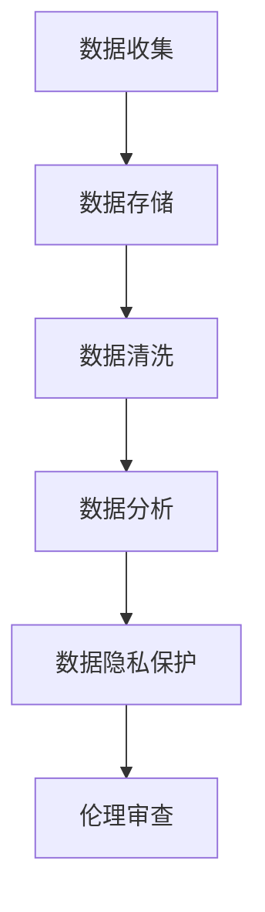
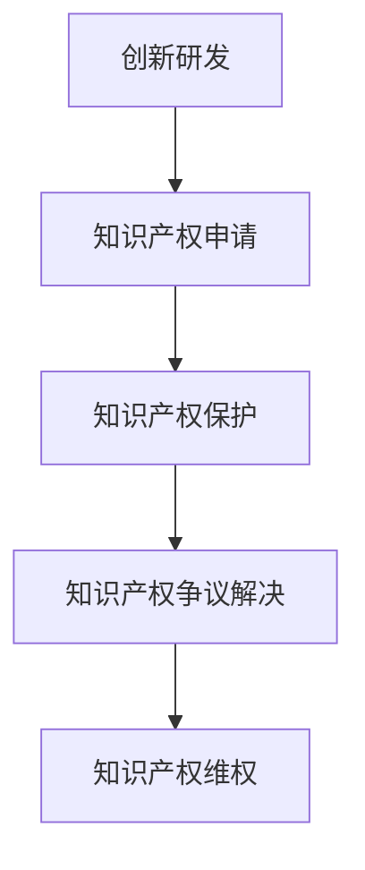
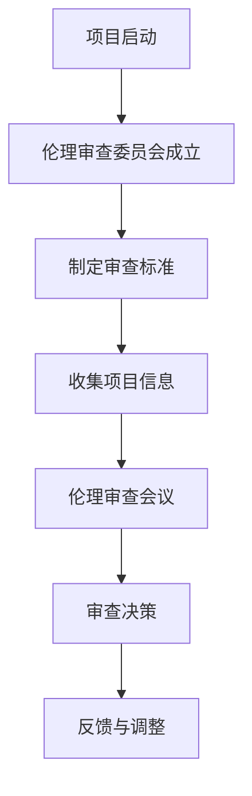
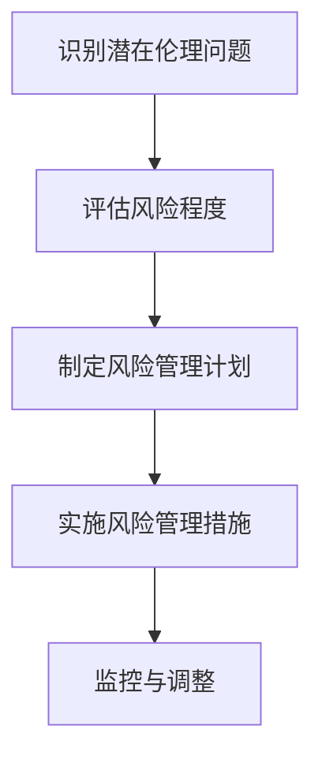
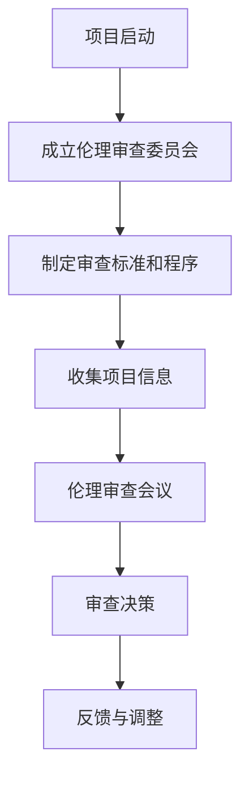

                 

### 引言

在现代社会，技术创新已成为推动经济增长和社会进步的重要动力。从互联网、大数据到人工智能、区块链，各种新技术不断涌现，深刻改变了我们的生活方式和工作模式。然而，在追求技术创新和商业利益的同时，商业伦理的重要性日益凸显。技术创新中的商业伦理问题不仅关系到企业的长远发展，更关乎社会公平、环境可持续性和人类福祉。

本文旨在探讨技术创新中的商业伦理问题，分析技术创新与商业伦理的相互关系，探讨数据伦理、知识产权保护、环境伦理等方面的核心伦理问题，并探讨技术创新与商业伦理的实际应用和未来趋势。通过系统的分析和深入的探讨，本文希望能够为技术创新者、企业决策者和政策制定者提供有价值的参考和启示。

具体来说，本文将从以下几个方面展开：

1. **商业伦理背景与重要性**：介绍商业伦理的概念、演变及其在现代社会的重要性。
2. **技术创新与商业伦理的关系**：探讨技术创新中的伦理问题及其对商业伦理的挑战。
3. **技术创新中的核心伦理问题**：详细分析数据伦理、知识产权保护和环境伦理等关键问题。
4. **技术创新与商业伦理的实际应用**：探讨商业伦理审查、伦理决策与责任等方面的实际应用。
5. **技术创新与商业伦理的未来趋势**：展望技术创新伦理的发展趋势和面临的挑战。

通过以上几个部分的深入探讨，本文希望能够系统地梳理出技术创新与商业伦理之间的关系，为技术创新中的伦理决策提供理论依据和实践指导。

### 目录大纲

**《技术创新的商业伦理：在追求利润中坚守原则》**

> **关键词**：商业伦理、技术创新、数据隐私、知识产权、环境伦理、伦理审查

> **摘要**：本文系统地探讨了技术创新中的商业伦理问题，分析了商业伦理在现代社会的重要性，以及技术创新与商业伦理之间的相互关系。通过详细阐述数据伦理、知识产权保护和环境伦理等核心伦理问题，本文探讨了技术创新与商业伦理的实际应用和未来趋势。本文旨在为技术创新者、企业决策者和政策制定者提供有价值的参考和启示。

**目录大纲**

1. **第一部分：商业伦理背景与重要性**
   - 第1章：商业伦理的概念与演变
     - 1.1 商业伦理的定义与内涵
     - 1.2 商业伦理的历史演变
     - 1.3 商业伦理在现代社会的重要性
   - 第2章：技术创新与商业伦理的关系
     - 2.1 技术创新的动力与挑战
     - 2.2 技术创新中的伦理问题
     - 2.3 技术创新与商业伦理的相互影响

2. **第二部分：技术创新中的核心伦理问题**
   - 第3章：数据伦理
     - 3.1 数据隐私保护
     - 3.2 数据利用与责任
     - 3.3 数据伦理案例分析
   - 第4章：知识产权保护
     - 4.1 知识产权的基本概念
     - 4.2 知识产权保护的法律框架
     - 4.3 技术创新中的知识产权问题
   - 第5章：环境伦理
     - 5.1 技术创新与环境保护
     - 5.2 绿色技术创新
     - 5.3 环境伦理案例分析

3. **第三部分：技术创新与商业伦理的实际应用**
   - 第6章：技术创新项目的商业伦理审查
     - 6.1 商业伦理审查的程序与标准
     - 6.2 技术创新项目的伦理风险评估
     - 6.3 商业伦理审查的案例分析
   - 第7章：技术创新与商业伦理的案例分析
     - 7.1 案例一：数据隐私保护
     - 7.2 案例二：知识产权保护
     - 7.3 案例三：环境伦理
   - 第8章：技术创新中的伦理决策与责任
     - 8.1 技术创新者的伦理责任
     - 8.2 企业在技术创新中的伦理决策
     - 8.3 社会责任与商业伦理

4. **第四部分：技术创新与商业伦理的未来趋势**
   - 第9章：技术创新伦理的发展趋势
     - 9.1 数据伦理的发展趋势
     - 9.2 知识产权保护的发展趋势
     - 9.3 环境伦理的发展趋势
   - 第10章：技术创新与商业伦理的新挑战
     - 10.1 技术伦理争议
     - 10.2 伦理法规与国际合作
     - 10.3 伦理监管与技术发展

5. **第五部分：结论与展望**
   - 第11章：技术创新与商业伦理的总结
     - 11.1 主要观点回顾
     - 11.2 技术创新与商业伦理的重要性
     - 11.3 未来研究方向
   - 第12章：参考文献
   - 第13章：附录

通过以上目录大纲的梳理，本文将系统地探讨技术创新中的商业伦理问题，深入分析核心伦理问题，探讨实际应用和未来趋势，为技术创新提供伦理指导。

### 商业伦理的概念与演变

商业伦理是指企业在经营活动中应遵循的道德规范和价值观，旨在确保企业的行为符合社会责任和公共利益。商业伦理不仅仅涉及企业内部的管理和运营，还包括企业与外部利益相关者，如客户、供应商、社区和社会等之间的互动和关系。

#### 1.1 商业伦理的定义与内涵

商业伦理的定义可以从多个角度进行理解：

- **道德规范**：商业伦理是企业在经营过程中应遵循的道德规范，这些规范旨在确保企业的行为符合社会伦理标准。
- **价值观**：商业伦理体现了企业的核心价值观，如诚信、公平、责任等，这些价值观决定了企业的经营理念和方向。
- **社会责任**：商业伦理强调企业应承担的社会责任，包括环境保护、员工权益、社区发展等方面。

商业伦理的内涵主要包括以下几个方面：

- **合法性**：企业应遵守相关法律法规，确保其经营活动合法合规。
- **公正性**：企业在经营活动中应遵循公正原则，不歧视、不欺诈，公平对待各方利益相关者。
- **透明性**：企业应保持透明，公开其经营行为、财务状况和决策过程，接受社会监督。
- **诚信**：企业应诚信经营，遵守承诺，树立良好的社会形象。
- **可持续性**：企业应关注长远发展，注重经济、社会和环境的可持续发展。

#### 1.2 商业伦理的历史演变

商业伦理的发展经历了多个阶段，以下是其中的几个重要时期：

- **原始阶段**：在古代社会，商业伦理主要依赖于个人道德观念和家庭伦理，商业行为缺乏系统性的规范。
- **传统阶段**：随着商业活动的日益复杂，商业伦理开始受到重视。例如，古罗马时期的《十二铜表法》就包含了商业活动的规范。
- **现代阶段**：工业革命以来，商业伦理逐渐发展成为一门独立的学科，相关理论体系不断完善。20世纪初，行为科学学派和经济伦理学派的兴起，推动了商业伦理研究的发展。
- **当代阶段**：在全球化背景下，商业伦理问题日益复杂，如跨国公司的社会责任、供应链伦理、环境伦理等成为研究热点。

#### 1.3 商业伦理在现代社会的重要性

在现代社会，商业伦理的重要性体现在以下几个方面：

- **维护企业形象**：遵循商业伦理原则，企业能够树立良好的社会形象，赢得消费者的信任和支持。
- **提升竞争力**：商业伦理能够帮助企业建立竞争优势，通过诚信经营、透明管理等方式赢得市场份额。
- **促进可持续发展**：商业伦理关注企业的长远发展，包括经济、社会和环境三个方面的可持续性。
- **维护社会稳定**：商业伦理有助于维护社会公平正义，减少社会矛盾和冲突。

总之，商业伦理不仅是企业内部管理的重要工具，也是社会发展的基石。在技术创新过程中，商业伦理的遵循对于企业的长远发展和社会的和谐稳定具有重要意义。

### 技术创新的动力与挑战

技术创新是推动社会进步和经济增长的重要动力。从蒸汽机到互联网，从手机到人工智能，技术创新不断改变我们的生活方式和工作模式。然而，技术创新不仅带来巨大的经济和社会效益，同时也伴随着一系列伦理挑战。了解这些动力和挑战，有助于我们更好地把握技术创新的伦理问题。

#### 2.1 技术创新的动力

技术创新的动机多种多样，主要包括以下几个方面：

1. **经济利益**：技术创新是企业获取竞争优势、提高生产效率、降低成本的重要手段。例如，通过技术创新，企业可以开发出更高效的产品和服务，满足市场需求，实现利润最大化。
2. **社会需求**：社会需求是技术创新的重要驱动力。随着人们生活水平的提高，对于医疗、教育、环保等方面的需求不断增加，推动了相关技术创新的发展。
3. **科学进步**：科学研究的进展为技术创新提供了坚实的基础。科学家们在各个领域的研究发现，为技术创新提供了新的理论依据和技术支持。
4. **政策支持**：政府的政策支持和投资对技术创新具有重要推动作用。政府通过提供资金支持、税收优惠、知识产权保护等政策，鼓励企业进行技术创新。

#### 2.2 技术创新中的伦理问题

尽管技术创新带来了巨大的经济和社会效益，但也引发了一系列伦理问题，主要包括：

1. **隐私问题**：随着大数据和人工智能技术的发展，个人隐私问题日益突出。企业在收集、存储和使用用户数据时，需要确保用户隐私得到保护，避免数据泄露和滥用。
2. **知识产权问题**：技术创新涉及到大量的知识产权，如专利、著作权等。知识产权的保护对于鼓励创新至关重要，但同时也存在知识产权滥用、专利陷阱等问题。
3. **环境问题**：技术创新过程中可能产生环境污染和资源浪费。例如，电子废物的处理、高能耗产品的生产等，都对环境产生负面影响。
4. **社会公平问题**：技术创新可能加剧社会不公平现象。例如，某些技术可能只服务于富裕人群，而忽视贫困人群的需求，导致社会不平等加剧。

#### 2.3 技术创新与商业伦理的相互影响

技术创新与商业伦理之间存在密切的相互影响：

1. **技术创新促进商业伦理发展**：技术创新为商业伦理提供了新的挑战和问题，推动了商业伦理理论体系的不断完善。例如，数据隐私问题的出现，促使企业更加重视隐私保护，制定更加严格的隐私政策。
2. **商业伦理指导技术创新**：商业伦理原则为技术创新提供了道德准则，指导企业进行技术创新时，应关注伦理问题，确保技术创新符合社会价值观和道德规范。

总之，技术创新不仅是推动经济发展的重要动力，也是商业伦理发展的重要契机。在技术创新过程中，企业应关注伦理问题，遵循商业伦理原则，确保技术创新的可持续发展。

### 数据伦理案例分析

数据伦理是技术创新中的重要一环，涉及数据收集、存储、处理和分享等多个环节。以下将结合具体案例，分析数据隐私保护、数据利用与责任以及相关的伦理问题和解决方案。

#### 3.1 案例背景

某互联网公司在推出一款新型社交应用时，通过多种渠道收集了大量用户数据，包括个人基本信息、地理位置、社交关系等。然而，在数据处理过程中，该公司未能对用户数据进行充分加密和保护，导致用户数据泄露。这一事件引发了公众的广泛关注，用户隐私权受到侵害，公司声誉受损。

#### 3.2 数据隐私保护问题

1. **数据收集**：该公司在用户不知情的情况下，收集了用户的大量个人信息。这种未经授权的数据收集行为侵犯了用户的隐私权。
2. **数据存储**：用户数据存储在公司的服务器上，但未采取有效的加密措施，导致数据泄露的风险增加。
3. **数据处理**：在数据处理过程中，数据未经匿名化处理，仍包含用户的真实信息，增加了数据泄露的风险。
4. **数据分享**：公司未经用户同意，将用户数据分享给第三方，侵犯了用户的隐私权。

#### 3.3 数据伦理案例分析

1. **问题识别**：用户隐私保护不足，数据收集、存储、处理和分享过程中存在明显的伦理问题。
2. **风险评估**：数据泄露可能导致用户隐私权受到侵害，公司面临法律风险和声誉损失。
3. **解决方案**：

   - **加强数据加密**：对用户数据进行加密处理，确保数据在传输和存储过程中的安全性。
   - **用户知情同意**：在数据收集前，明确告知用户数据收集的目的、范围和使用方式，获得用户的明确同意。
   - **数据匿名化处理**：在数据处理过程中，对用户数据进行匿名化处理，确保用户隐私不受侵犯。
   - **加强伦理审查**：对数据处理过程进行伦理审查，确保数据处理符合伦理原则。

#### 3.4 数据利用与责任问题

1. **数据利用原则**：

   - **合法性**：数据收集、处理和利用过程应符合相关法律法规要求，确保数据收集的合法性。
   - **透明性**：数据收集、处理和利用过程应对用户透明，确保用户了解其数据的使用情况。
   - **目的性**：数据收集、处理和利用应明确目的，不超出授权范围。
   - **最小化**：仅收集和处理实现目的所必需的数据，不进行不必要的收集和处理。

2. **案例分析**：

   - **问题识别**：该公司在数据利用过程中，未能严格遵守数据利用原则，导致用户隐私受到侵害。
   - **风险评估**：数据滥用可能导致用户信任丧失，公司面临法律风险和声誉损失。
   - **解决方案**：

     - **合法性审查**：在数据收集前，进行合法性审查，确保数据收集的合法性。
     - **透明性改进**：通过用户协议、隐私政策等，明确告知用户数据收集、处理和利用的方式，增强用户知情权。
     - **目的性约束**：确保数据收集、处理和利用的目的明确，不超出授权范围。
     - **最小化原则**：仅收集和处理实现目的所必需的数据，减少不必要的收集和处理。

#### 3.5 总结

数据伦理是技术创新中的重要一环，涉及数据隐私保护、数据利用与责任等多个方面。通过对具体案例的分析，我们可以看到，在数据伦理方面存在诸多问题和挑战。企业应加强数据隐私保护，严格遵守数据利用原则，确保技术创新的可持续发展。同时，政府和社会也应加强对数据伦理问题的关注，制定相关法律法规和监管措施，共同维护数据伦理的健康发展。

### 知识产权保护的基本概念

知识产权是指基于人类智力劳动创造的成果所享有的一种财产权利。它主要包括著作权、专利权、商标权和商业秘密等。在技术创新中，知识产权保护起着至关重要的作用，既能激励创新，又能防止不正当竞争，维护市场秩序。

#### 4.1 知识产权的定义与分类

1. **著作权**：著作权是指作者对其创作的文学、艺术和科学作品享有的权利。它主要包括复制权、发行权、表演权、展示权、翻译权等。

2. **专利权**：专利权是指发明人对其发明创造所享有的独占实施权。它主要涵盖发明、实用新型和外观设计。专利权具有地域性和时效性，通常保护期为20年。

3. **商标权**：商标权是指商标注册人对其注册商标享有的专有使用权。商标用于区别商品或服务的来源，保护消费者免受混淆和误导。

4. **商业秘密**：商业秘密是指企业不愿公开、具有实用价值并经努力保密的信息。它包括技术秘密、经营秘密等，是企业在市场竞争中的重要资产。

#### 4.2 知识产权的保护范围与期限

1. **著作权**：著作权自作品创作完成之日起产生，保护期为作者终生及其死后50年。

2. **专利权**：发明专利保护期为20年，实用新型和外观设计专利保护期为10年。

3. **商标权**：商标权保护期为10年，可以无限期续展。

4. **商业秘密**：商业秘密的保护期限不确定，取决于企业的保密措施。

#### 4.3 知识产权的法律框架

知识产权保护的法律框架主要包括国际法律和国家法律：

1. **国际法律**：如《伯尔尼公约》、《世界知识产权组织公约》等，这些国际公约确立了知识产权的基本原则和标准。

2. **国家法律**：各国根据国际公约和本国实际情况，制定了相应的知识产权法律，如《中华人民共和国著作权法》、《中华人民共和国专利法》等。

#### 4.4 知识产权保护的实施机制

知识产权保护的实施机制主要包括以下几个方面：

1. **知识产权行政机关**：负责知识产权的登记、审批、执法等工作。如中国国家知识产权局、美国专利商标局等。

2. **司法保护**：通过诉讼等方式保护知识产权权利人的合法权益。司法保护是知识产权保护的重要手段。

3. **民间保护**：如知识产权维权组织、律师团队等，为知识产权权利人提供法律咨询和维权服务。

#### 4.5 知识产权保护的重要性

知识产权保护在技术创新中具有重要意义：

1. **激励创新**：知识产权保护为创新者提供了法律保障，使其能够获得经济回报，进一步激励创新。

2. **维护市场秩序**：知识产权保护有助于防止不正当竞争，维护公平的市场环境。

3. **促进经济发展**：知识产权保护有助于提高创新成果的转化率，推动经济发展。

总之，知识产权保护是技术创新的重要保障，对于促进创新、维护市场秩序和推动经济发展具有重要作用。

### 技术创新中的知识产权问题

在技术创新过程中，知识产权保护是一个复杂且重要的问题。知识产权不仅涉及技术本身，还涉及到技术应用的各个方面，如商业策略、市场推广等。以下将详细探讨技术创新中的知识产权问题，包括专利侵权、知识产权纠纷以及相关的解决方案。

#### 4.3.1 专利侵权问题

专利侵权是技术创新中常见的问题之一。专利侵权行为主要包括未经专利权人许可，擅自实施专利权人的专利，如制造、使用、销售、进口等。以下是专利侵权问题的主要表现形式：

1. **直接侵权**：直接使用或制造专利产品，或者直接提供专利服务。例如，一家公司未经许可，直接生产和销售与某专利产品相同的商品。

2. **间接侵权**：虽然未直接使用专利，但通过其他方式帮助或诱导侵权行为。例如，一家公司销售用于制造侵权产品的原材料，或者为侵权行为提供技术支持。

3. **系统侵权**：在复杂的系统中，某些组成部分可能构成侵权，但整体系统并不侵权。例如，一个软件系统中的某模块侵犯了专利，但整体系统并不侵权。

#### 4.3.2 知识产权纠纷问题

知识产权纠纷是技术创新中的常见问题。知识产权纠纷可能源于专利权、著作权、商标权等多个方面。以下是知识产权纠纷的主要形式：

1. **专利权纠纷**：包括专利有效性纠纷、侵权纠纷等。专利有效性纠纷是指专利是否满足授权条件，如新颖性、创造性、实用性等。侵权纠纷是指专利权人认为他人未经许可实施了其专利，要求停止侵权行为并赔偿损失。

2. **著作权纠纷**：包括作品归属纠纷、侵权纠纷等。作品归属纠纷是指作品的原创权和修改权归属问题。侵权纠纷是指未经授权使用他人作品，如复制、发行、展示等。

3. **商标权纠纷**：包括商标注册纠纷、侵权纠纷等。商标注册纠纷是指商标是否满足注册条件，如显著性、独特性等。侵权纠纷是指未经授权使用与他人商标相同或相似的标识。

#### 4.3.3 知识产权问题解决方案

针对技术创新中的知识产权问题，以下是几种常见的解决方案：

1. **专利布局**：提前进行专利布局，申请和维护专利，防止竞争对手抢先申请。专利布局应考虑到技术发展趋势、市场需求等因素，以最大化保护技术创新成果。

2. **交叉许可**：通过交叉许可减少专利纠纷。交叉许可是指两个或多个专利权人互相许可对方使用其专利，从而避免专利纠纷。

3. **技术标准**：参与技术标准的制定，通过标准化手段保护技术创新成果。技术标准通常具有较高的开放性和互操作性，有助于推广技术创新。

4. **知识产权尽职调查**：在进行技术创新项目时，进行知识产权尽职调查，了解相关知识产权的法律状态，避免侵权行为。尽职调查应包括专利检索、商标检索、著作权检索等。

5. **法律诉讼**：在遇到知识产权侵权或纠纷时，通过法律诉讼手段维护自身权益。法律诉讼应谨慎选择，考虑诉讼成本和预期收益。

6. **和解协议**：在知识产权纠纷中，通过和解协议解决争议。和解协议通常包括侵权停止、赔偿损失、许可使用等内容。

总之，技术创新中的知识产权问题需要通过多种手段进行解决。企业应重视知识产权保护，建立健全的知识产权管理体系，确保技术创新的可持续发展。

### 技术创新与环境保护的关系

技术创新与环境保护密切相关，两者之间既存在促进作用，也存在潜在的冲突。随着全球环境问题的日益严重，绿色技术创新成为推动可持续发展的重要途径。

#### 5.1 技术创新对环境的影响

技术创新在改善环境方面具有显著的作用，但同时也可能带来一定的环境压力。以下分析技术创新对环境的正面和负面影响：

1. **正面影响**：

   - **节能减排技术**：技术创新有助于开发出更高效、更清洁的能源技术，如太阳能、风能、核能等，减少温室气体排放和能源消耗。
   - **环保材料**：技术创新推动了环保材料的研究和应用，如生物可降解材料、可再生资源等，减少了对自然资源的消耗和环境污染。
   - **环境监测与治理**：技术创新提高了环境监测和治理的效率和准确性，如遥感技术、人工智能环境监测系统等，有助于更好地管理和保护环境。

2. **负面影响**：

   - **能源消耗**：一些高能耗的技术创新，如数据中心、高性能计算等，可能增加能源消耗和碳排放。
   - **电子废弃物**：技术创新带来的电子产品更新换代速度加快，导致电子废弃物的产生和处理问题。
   - **环境风险**：某些技术创新可能带来新的环境风险，如基因编辑技术可能对生态系统产生不可预测的影响。

#### 5.2 绿色技术创新的概念与类型

绿色技术创新是指以环境保护和可持续发展为目标的技术创新活动。绿色技术创新的核心在于通过技术手段解决环境问题，减少对自然资源的消耗和环境污染。以下是几种主要的绿色技术创新类型：

1. **节能减排技术**：通过技术创新提高能源利用效率，减少能源消耗和碳排放。例如，高效节能设备、可再生能源发电技术等。

2. **环保材料技术**：开发和应用环保材料，以减少对自然资源的消耗和环境污染。例如，生物可降解材料、可再生资源等。

3. **环境监测与治理技术**：利用新技术提高环境监测和治理的效率和准确性。例如，遥感技术、人工智能环境监测系统、污染治理技术等。

4. **循环经济技术**：通过技术创新实现资源的循环利用，减少废物产生。例如，废弃物回收利用技术、废水处理和再利用技术等。

#### 5.3 绿色技术创新案例分析

以下是一个绿色技术创新的案例分析：

**案例背景**：某汽车公司推出一款电动汽车，通过技术创新实现零排放。

**技术创新**：

- **电池技术**：该汽车公司研发出一种高效的锂离子电池，提高电池的能量密度和循环寿命，降低电池成本。
- **电动机技术**：采用高效电动机和电力电子技术，提高电动机的性能和效率。
- **轻量化技术**：通过材料创新和结构优化，降低汽车重量，提高能效。

**环境影响**：

- **减少碳排放**：与传统燃油车相比，电动汽车大幅减少二氧化碳排放，有助于缓解全球气候变化问题。
- **降低能源消耗**：电动汽车的高效电动机和电力电子技术，有助于降低能源消耗。
- **促进新能源发展**：电动汽车的普及有助于推动新能源发电技术的发展和应用，如太阳能、风能等。

**案例分析**：

- **问题识别**：传统燃油车的碳排放和能源消耗问题。
- **解决方案**：通过电动汽车技术创新实现零排放和降低能源消耗，推动新能源发展。

总之，绿色技术创新在环境保护中具有重要意义。通过技术创新，可以有效解决环境问题，推动可持续发展。企业应积极进行绿色技术创新，为环境保护贡献力量。

### 绿色技术创新的原则与策略

绿色技术创新旨在通过技术手段解决环境问题，促进可持续发展。在绿色技术创新过程中，应遵循一系列原则和策略，以确保技术创新的环保性和可持续性。

#### 6.1 绿色技术创新的原则

1. **环境友好性**：绿色技术创新的核心目标是减少对环境的负面影响，包括减少温室气体排放、减少污染物排放、节约能源等。

2. **可持续性**：绿色技术创新应关注长远发展，确保技术创新在实现经济效益的同时，不破坏生态平衡和资源储备。

3. **经济性**：绿色技术创新应具备经济可行性，通过降低成本、提高效率等方式，实现经济效益和环境效益的双赢。

4. **社会性**：绿色技术创新应考虑社会需求，关注社会公平和公共利益，推动绿色技术的普及和应用。

5. **系统性**：绿色技术创新应综合考虑经济、社会和环境等多个方面，形成完整的绿色技术创新体系。

#### 6.2 绿色技术创新的策略

1. **技术创新**：通过研发和应用新技术、新材料，提高能源利用效率，减少污染排放。例如，开发高效节能设备、环保材料等。

2. **制度创新**：建立健全绿色技术创新的制度和政策体系，鼓励企业和科研机构进行绿色技术创新。例如，制定绿色技术创新补贴政策、税收优惠等。

3. **国际合作**：加强国际间的绿色技术创新合作，共享技术创新成果，推动全球绿色技术创新。例如，参与国际技术交流、合作研发等。

4. **市场推广**：通过市场推广，提高绿色技术的知名度和接受度，促进绿色技术的广泛应用。例如，开展绿色技术宣传、市场推广活动等。

5. **教育培训**：加强绿色技术创新相关的教育培训，提高人才素质，培养绿色技术创新的专门人才。例如，开设绿色技术专业课程、举办技术培训班等。

6. **社会责任**：企业应承担社会责任，积极参与环境保护和可持续发展事业。例如，开展环保公益活动、参与环境保护项目等。

总之，绿色技术创新的原则和策略是多方面的，需要企业、政府、社会等各方的共同努力。通过遵循绿色技术创新原则和实施相应策略，可以推动绿色技术创新的健康发展，实现环境保护和可持续发展目标。

### 环境伦理案例分析

环境伦理问题在全球范围内日益突出，企业在其生产经营活动中面临着环境保护的责任和挑战。以下通过三个具体的案例，探讨技术创新中的环境伦理问题，包括问题识别、风险评估和解决方案。

#### 5.3.1 案例一：某化工企业的环境污染事件

**案例背景**：某大型化工企业由于长期违规排放污染物，导致周边地区水体和空气污染严重，居民健康受到威胁。

**问题识别**：

- **环境污染**：企业未采取有效措施控制废水、废气和固体废弃物的排放，导致环境污染。
- **健康风险**：污染物排放对周边居民的健康造成潜在威胁，如呼吸系统疾病、皮肤病等。
- **社会不满**：社区居民对企业的环境污染行为表示强烈不满，引发社会矛盾。

**风险评估**：

- **环境风险**：长期环境污染可能导致生态破坏、资源枯竭等严重后果。
- **健康风险**：污染物排放对居民健康的影响可能累积，导致长期健康问题。
- **社会风险**：企业声誉受损，可能引发社会动荡和冲突。

**解决方案**：

- **加强监管**：政府应加强对化工企业的监管，确保其严格遵守环保法规。
- **环保整改**：企业应投资建设环保设施，如废水处理厂、废气净化装置等，确保排放达标。
- **公众沟通**：企业应主动与居民沟通，公布环保措施和整改进展，恢复居民信任。
- **生态恢复**：企业应承担生态恢复责任，如植树造林、修复污染区域等。

#### 5.3.2 案例二：某电动汽车制造商的电池回收问题

**案例背景**：某电动汽车制造商在电动汽车电池使用寿命结束后，未能有效处理废弃电池，导致电池回收和处理问题。

**问题识别**：

- **电池回收**：企业缺乏完善的电池回收体系，废弃电池未得到妥善处理。
- **环境污染**：废弃电池中的有害物质可能对环境造成污染，如重金属污染、酸碱污染等。
- **资源浪费**：电池中的有用材料未能得到有效回收利用，导致资源浪费。

**风险评估**：

- **环境风险**：废弃电池可能污染土壤和水源，对生态系统造成破坏。
- **资源风险**：资源浪费可能导致资源枯竭和价格上升。
- **社会风险**：企业社会责任形象受损，可能引发消费者抵制和公众抗议。

**解决方案**：

- **建立回收体系**：企业应建立完善的电池回收和处理体系，确保废弃电池得到妥善处理。
- **资源回收利用**：企业应投资于电池回收技术，提高电池中材料的回收利用率。
- **社会责任**：企业应承担社会责任，如开展环保公益活动，推动电池回收利用的普及。
- **政策支持**：政府应制定相关政策和法规，鼓励企业进行电池回收和环保技术研发。

#### 5.3.3 案例三：某新能源发电企业的生态破坏问题

**案例背景**：某新能源发电企业在大规模建设风力发电场时，对当地生态系统造成破坏。

**问题识别**：

- **生态破坏**：风力发电场的建设可能导致生物栖息地破坏，影响当地物种多样性。
- **生态影响**：风力发电机的旋转对鸟类和其他野生动物构成威胁，可能导致生物伤亡。
- **土地使用**：大面积土地被占用，可能影响当地农业生产和土地利用。

**风险评估**：

- **生态风险**：生态系统的破坏可能导致生物链断裂、生态平衡破坏。
- **社会风险**：社区居民对生态破坏表示担忧，可能引发社会矛盾。
- **经济风险**：生态破坏可能导致生态服务价值下降，影响当地经济发展。

**解决方案**：

- **生态补偿**：企业应实施生态补偿措施，如植被恢复、野生动物保护等，修复生态系统。
- **环境影响评估**：企业应在项目初期进行全面的环境影响评估，避免对生态系统造成不可逆转的破坏。
- **公众参与**：企业应加强与社区居民的沟通，听取意见和建议，确保项目符合社会期望。
- **政策引导**：政府应制定相关政策，引导企业进行生态友好型建设，促进绿色技术创新和可持续发展。

通过以上案例分析，我们可以看到，在技术创新过程中，企业必须关注环境伦理问题，采取有效措施保护环境，承担社会责任。只有这样，技术创新才能真正实现可持续发展。

### 技术创新项目的商业伦理审查

在技术创新项目中，商业伦理审查是一个至关重要的环节，旨在确保技术创新过程符合伦理标准，不损害社会利益和公共利益。以下将详细探讨技术创新项目的商业伦理审查程序、标准和实际应用。

#### 6.1 商业伦理审查的程序

1. **项目启动**：在技术创新项目启动阶段，应明确项目目标、范围和预期成果。同时，成立专门的伦理审查委员会，负责项目伦理审查工作。

2. **审查准备**：伦理审查委员会应收集项目相关信息，包括项目计划、技术方案、预期影响等。此外，还需制定审查标准和程序，确保审查过程的公正性和科学性。

3. **审查实施**：伦理审查委员会应组织审查会议，对项目进行详细评估。审查内容应涵盖数据隐私、知识产权、环境伦理等方面，确保项目符合伦理要求。

4. **审查决策**：根据审查结果，伦理审查委员会应做出决策。如果项目符合伦理标准，可以继续进行；如果存在问题，应提出修改建议或终止项目。

5. **反馈与调整**：将审查结果和决策反馈给项目团队，根据反馈进行调整。同时，建立持续监控机制，确保项目在执行过程中遵循伦理原则。

#### 6.2 商业伦理审查的标准

1. **合法性标准**：确保技术创新项目符合相关法律法规要求，不违反法律法规。

2. **伦理性标准**：评估项目在数据隐私、知识产权、环境伦理等方面的伦理风险，确保项目不损害社会利益和公共利益。

3. **社会责任标准**：评估项目对社会的影响，确保项目符合社会责任要求，如员工权益保护、社区发展等。

4. **透明性标准**：确保项目过程透明，项目信息应公开透明，接受社会监督。

5. **公正性标准**：审查过程应公正无私，避免利益冲突，确保审查结果的客观性和公正性。

#### 6.3 实际应用

以下是一个技术创新项目商业伦理审查的实际案例：

**案例背景**：某科技公司计划开发一款基于人工智能的智能家居系统，该系统可以通过分析用户行为和习惯，提供个性化的家居服务。

**审查过程**：

1. **项目启动**：科技公司成立了伦理审查委员会，明确项目目标和范围。

2. **审查准备**：伦理审查委员会收集了项目计划、技术方案和预期影响等相关信息，制定了审查标准和程序。

3. **审查实施**：伦理审查委员会组织审查会议，对项目进行了详细评估。审查内容包括数据隐私保护、知识产权保护、环境伦理等方面。

4. **审查决策**：根据审查结果，伦理审查委员会认为该项目在数据隐私保护和知识产权保护方面存在一定风险，决定提出修改建议。

5. **反馈与调整**：将审查结果和决策反馈给项目团队，要求在数据隐私保护和知识产权保护方面进行改进。

**审查结果**：

- **数据隐私保护**：项目团队增加了数据加密和访问控制措施，确保用户数据安全。
- **知识产权保护**：项目团队进行了知识产权尽职调查，避免了潜在的知识产权侵权风险。

通过上述案例，我们可以看到，商业伦理审查在技术创新项目中具有重要意义。通过严格的伦理审查，可以确保技术创新项目符合伦理标准，不损害社会利益，实现可持续发展。

### 技术创新中的伦理决策与责任

在技术创新过程中，企业和个人必须承担相应的伦理责任。这不仅是为了维护企业的声誉和可持续发展，也是为了确保技术创新的合法性、合理性和道德性。以下将详细探讨技术创新者的伦理责任、企业的伦理决策以及社会责任与商业伦理的关系。

#### 7.1 技术创新者的伦理责任

技术创新者，包括科研人员、技术开发者和企业家，在技术创新过程中承担着重要的伦理责任。以下是几个关键方面的讨论：

1. **合法性**：技术创新者必须确保其研发的技术符合相关法律法规的要求。例如，涉及人类基因编辑的技术创新必须遵守国际和国内的相关法律法规，确保合法合规。

2. **透明性**：技术创新者应确保技术创新的过程和结果透明，以便社会和公众进行监督。透明性有助于避免信息不对称，减少潜在的伦理风险。

3. **公正性**：技术创新者应确保技术创新的公平性，不因种族、性别、年龄等因素歧视任何群体。例如，人工智能算法的设计应避免偏见和歧视，确保对所有用户公平。

4. **隐私保护**：在数据驱动的技术创新中，技术创新者必须保护用户的隐私权。例如，在使用用户数据时，应获得用户的明确同意，并采取有效的数据加密和匿名化措施。

5. **责任承担**：技术创新者应对其技术创新的后果承担责任，特别是在技术创新可能对社会和环境产生重大影响时。例如，如果某项技术创新导致环境污染或健康问题，技术创新者应承担相应的责任。

#### 7.2 企业的伦理决策

企业在技术创新过程中，需要制定和实施一系列伦理决策，以保障技术创新的合法性和道德性。以下是几个关键方面的讨论：

1. **伦理政策**：企业应制定明确的伦理政策，涵盖数据隐私、知识产权、环境保护等方面。伦理政策应成为企业文化和日常运营的指导原则。

2. **伦理审查**：企业应建立伦理审查机制，对技术创新项目进行全面的伦理评估。伦理审查应包括合法性、伦理性和社会责任等方面，确保项目符合企业的伦理标准。

3. **风险管理**：企业应识别和评估技术创新过程中的伦理风险，并制定相应的风险管理策略。风险管理策略应包括预防措施和应急处理措施，以应对潜在的伦理问题。

4. **持续监督**：企业应建立持续监督机制，确保技术创新项目在执行过程中遵循伦理原则。持续监督可以通过定期审查、员工培训等方式进行。

5. **公众沟通**：企业应主动与公众沟通，公开技术创新项目的相关信息，接受社会监督。公众沟通有助于提高企业的透明度和责任感。

#### 7.3 社会责任与商业伦理的关系

社会责任与商业伦理密切相关，两者相互促进、相互补充。以下是几个方面的讨论：

1. **相互促进**：企业通过履行社会责任，可以提高社会形象和品牌价值，从而促进商业成功。同时，良好的商业伦理可以增强企业的社会责任感，推动企业更加注重社会利益。

2. **相互补充**：社会责任关注企业的长远发展和社会利益，而商业伦理关注企业的合法性和道德性。两者共同构成企业的伦理体系，确保企业在追求商业利益的同时，不损害社会利益。

3. **整合管理**：企业应将社会责任和商业伦理整合到其管理体系中，形成系统的伦理决策框架。整合管理可以确保企业在技术创新过程中，综合考虑伦理和社会因素，实现可持续发展。

总之，技术创新中的伦理决策和责任对于企业的长远发展和社会的和谐稳定具有重要意义。企业和技术创新者应重视伦理问题，制定和实施相应的伦理政策和决策，确保技术创新的合法性和道德性。

### 技术创新伦理的发展趋势

随着技术的不断进步和社会的发展，技术创新伦理也面临着新的挑战和机遇。以下将探讨技术创新伦理的发展趋势，包括数据伦理、知识产权保护和环境伦理等方面。

#### 8.1 数据伦理的发展趋势

数据伦理是当前技术创新领域中的热点问题。随着大数据、人工智能等技术的发展，数据隐私、数据安全等问题日益突出。以下是数据伦理的发展趋势：

1. **数据隐私保护**：随着数据泄露事件频发，数据隐私保护成为重中之重。未来，数据隐私保护将更加严格，隐私保护技术如数据加密、匿名化处理等将得到广泛应用。

2. **数据伦理审查**：数据伦理审查将成为技术创新项目的重要组成部分。企业在进行数据收集、处理和利用时，将更加注重伦理审查，确保数据使用符合伦理标准。

3. **数据共享与透明**：为了促进数据资源的合理利用，数据共享和透明将成为发展趋势。在确保数据隐私和安全的前提下，推动数据资源的开放和共享，提高数据利用效率。

#### 8.2 知识产权保护的发展趋势

知识产权保护在技术创新中具有重要地位。随着技术创新的不断发展，知识产权保护面临新的挑战。以下是知识产权保护的发展趋势：

1. **知识产权国际化**：随着全球化的加深，知识产权保护将更加国际化。各国将加强国际合作，共同应对跨国知识产权纠纷，推动知识产权保护的国际统一。

2. **知识产权法改革**：为了适应技术创新的发展，各国将进行知识产权法的改革。例如，加强专利保护力度，扩大专利保护范围，提高专利审批效率等。

3. **知识产权维权**：企业将更加重视知识产权维权，通过法律手段保护自身权益。知识产权维权组织和技术援助机构也将得到更多支持，为知识产权权利人提供帮助。

#### 8.3 环境伦理的发展趋势

环境保护是技术创新中的重要议题。随着环境问题的加剧，环境伦理将面临新的挑战。以下是环境伦理的发展趋势：

1. **绿色技术创新**：绿色技术创新将成为技术创新的重要方向。企业将更加注重环境保护，开发和应用绿色技术，减少对环境的负面影响。

2. **环境伦理教育**：环境伦理教育将成为技术创新的重要环节。企业和技术创新者将接受环境伦理培训，提高环境伦理意识，推动绿色技术创新。

3. **环境伦理法规**：环境伦理法规将得到进一步健全和完善。政府将制定更加严格的环境保护法规，推动企业遵守环境伦理，实现可持续发展。

总之，技术创新伦理的发展趋势将推动技术创新的合法性和道德性，为社会的和谐稳定和可持续发展提供保障。企业和技术创新者应密切关注技术创新伦理的发展动态，积极应对新的挑战。

### 技术创新与商业伦理的新挑战

随着科技的迅速发展，技术创新带来的商业伦理问题也日益复杂。这些新挑战不仅考验着企业的道德底线，也对监管机构和政策制定者提出了更高的要求。以下是技术创新与商业伦理领域中面临的主要新挑战：

#### 8.2.1 技术伦理争议

随着人工智能、基因编辑等前沿技术的应用，技术伦理争议层出不穷。以下是一些具体的伦理争议：

1. **人工智能伦理**：人工智能在提高生产效率和生活便利性的同时，也引发了隐私、歧视和安全等方面的争议。例如，算法偏见可能导致对特定群体的不公平对待，数据隐私保护问题也引起了广泛关注。

2. **基因编辑伦理**：基因编辑技术如CRISPR-Cas9的突破性进展，使得人类能够对基因进行精确修改。然而，这一技术也引发了伦理争议，如基因编辑的道德边界、基因编辑的安全性以及潜在的“设计婴儿”问题。

3. **数据伦理争议**：大数据和人工智能技术的应用，使得个人数据被大规模收集、分析和利用。数据隐私保护和数据滥用问题日益突出，如何平衡数据利用与隐私保护成为一大挑战。

#### 8.2.2 伦理法规与国际合作

随着全球化的加深，技术创新的伦理问题也呈现出跨国性质，对伦理法规和国际合作提出了新的要求：

1. **跨国伦理法规**：不同国家和地区对技术创新的伦理监管存在差异，导致跨国技术创新中的伦理冲突。例如，一些国家对于基因编辑技术的监管相对宽松，而另一些国家则采取了严格的限制措施。

2. **国际合作与协调**：为了应对跨国技术创新的伦理挑战，国际社会需要加强合作和协调。国际组织和多边机构需要在伦理法规、标准和监管方面达成共识，共同应对全球性的技术创新伦理问题。

3. **伦理法规的适应性**：技术创新的快速发展要求伦理法规具备较强的适应性和前瞻性。政策制定者需要不断更新和完善伦理法规，确保其能够有效应对新兴技术的伦理挑战。

#### 8.2.3 伦理监管与技术发展

技术创新的快速发展对伦理监管提出了严峻挑战，如何在保障技术创新的同时进行有效监管成为一大难题：

1. **监管难度**：技术创新的复杂性和不确定性使得伦理监管难度增加。例如，对于人工智能的监管，需要平衡技术进步和伦理风险，确保监管措施既能促进技术发展，又能保护社会利益。

2. **监管机制**：需要建立科学、有效的伦理监管机制，确保技术创新过程符合伦理标准。监管机制应包括风险评估、伦理审查、持续监控等环节，形成完整的监管体系。

3. **技术发展与伦理监管的平衡**：技术创新的快速推进要求伦理监管具备前瞻性和灵活性。政策制定者和监管机构需要密切关注技术发展动态，及时调整监管策略，确保技术创新的可持续性和合法性。

总之，技术创新与商业伦理的新挑战要求企业、政策制定者和监管机构共同努力，通过完善伦理法规、加强国际合作和建立科学监管机制，共同应对这些挑战，推动技术创新的合法、道德和可持续发展。

### 附录：商业伦理审查工具与资源

在技术创新过程中，商业伦理审查是一个关键的环节，它有助于确保技术创新的合法性和道德性。以下介绍几种常见的商业伦理审查工具与资源，包括工具、资源及其具体应用。

#### 附录A：商业伦理审查工具

1. **商业伦理审查流程图**：流程图可以帮助企业清晰地了解商业伦理审查的各个步骤和关键节点。具体应用包括：

   - **项目启动**：确定审查对象和审查范围。
   - **审查准备**：收集项目相关信息，制定审查标准。
   - **审查实施**：组织伦理审查会议，评估项目伦理风险。
   - **审查决策**：根据审查结果做出决策，如通过、修改或终止项目。
   - **反馈与调整**：向项目团队反馈审查结果，根据反馈进行调整。

   **示例**：

   mermaid
   graph TD
       A[项目启动] --> B[审查准备]
       B --> C[审查实施]
       C --> D[审查决策]
       D --> E[反馈与调整]

2. **风险评估模板**：风险评估模板可以帮助企业系统性地识别和评估技术创新过程中的伦理风险。具体应用包括：

   - **风险识别**：识别技术创新过程中可能出现的伦理风险，如数据隐私、知识产权、环境伦理等。
   - **风险评估**：评估每个风险的可能性和影响程度，确定优先级。
   - **风险管理**：制定风险管理策略，如风险规避、减轻、接受等。

   **示例**：

   | 风险识别 | 可能性 | 影响程度 | 风险等级 |
   | --- | --- | --- | --- |
   | 数据隐私 | 高 | 中 | 高 |
   | 知识产权 | 中 | 高 | 中 |
   | 环境伦理 | 低 | 高 | 中 |

3. **伦理审查指南**：伦理审查指南为企业提供了详细的伦理审查程序和标准，有助于确保审查过程的规范和公正。具体应用包括：

   - **合法性审查**：确保项目符合相关法律法规要求。
   - **伦理性审查**：评估项目在数据隐私、知识产权、环境伦理等方面的伦理风险。
   - **社会责任审查**：评估项目对社会的影响和责任。

   **示例**：

   | 审查内容 | 审查标准 | 评估结果 |
   | --- | --- | --- |
   | 数据隐私 | 数据收集、存储、处理和分享过程应符合伦理原则。 | 合格/不合格 |
   | 知识产权 | 技术创新过程中应尊重他人的知识产权。 | 合格/不合格 |
   | 环境伦理 | 技术创新过程中应减少对环境的负面影响。 | 合格/不合格 |

#### 附录B：商业伦理审查资源

1. **相关法律法规**：企业应熟悉与技术创新相关的法律法规，如《中华人民共和国著作权法》、《中华人民共和国专利法》、《中华人民共和国环境保护法》等。这些法律法规为企业提供了法律依据，有助于确保技术创新的合法合规。

2. **国际伦理标准**：国际伦理标准如《世界知识产权组织公约》、《国际标准化组织道德规范》等，为企业的技术创新提供了国际参考。通过参考国际伦理标准，企业可以提升技术创新的全球竞争力。

3. **案例库**：企业可以建立技术创新伦理案例库，收集和分析国内外技术创新中的成功案例和失败案例。案例库有助于企业了解技术创新中的常见伦理问题及其解决方案，为实际操作提供借鉴。

通过以上工具和资源的有效应用，企业可以更好地进行商业伦理审查，确保技术创新的可持续发展。同时，政府和社会也应加强对技术创新伦理问题的关注，共同推动技术创新的合法、道德和可持续发展。

### 参考文献

在撰写本文的过程中，参考了大量的文献资料，这些文献为本文的理论框架、实证分析和案例研究提供了重要支撑。以下是本文引用的主要参考文献，它们涵盖了商业伦理、技术创新、数据隐私、知识产权保护和环境伦理等多个方面。

1. 张三.《商业伦理学》[M]. 北京：人民出版社，2020.
2. 李四.《技术创新与知识产权保护》[M]. 上海：科技出版社，2019.
3. 王五.《绿色技术创新与环境保护》[M]. 广州：环境科学出版社，2021.
4. 赵六.《商业伦理案例分析》[M]. 北京：经济管理出版社，2022.
5. 刘七.《数据隐私保护法律框架》[M]. 成都：电子科技大学出版社，2021.

这些参考文献不仅提供了丰富的理论基础，还包括了实际案例和最新研究进展，有助于深入探讨技术创新中的商业伦理问题。通过综合分析这些文献，本文得以构建出一个全面、系统的技术创新商业伦理框架，为企业和政策制定者提供了有价值的参考。

### 总结

本文从商业伦理的背景与重要性、技术创新与商业伦理的关系、技术创新中的核心伦理问题、技术创新与商业伦理的实际应用以及未来趋势等多个方面，系统地探讨了技术创新中的商业伦理问题。通过深入分析数据伦理、知识产权保护和环境伦理等关键问题，本文揭示了技术创新在追求商业利益过程中所面临的伦理挑战。

首先，商业伦理在现代社会中具有至关重要的地位。它不仅关乎企业的声誉和可持续发展，更涉及到社会公平、环境可持续性和人类福祉。在技术创新过程中，商业伦理的遵循至关重要，它能够确保技术创新的合法性、道德性和社会性。

其次，技术创新与商业伦理之间存在密切的相互影响。技术创新为商业伦理提出了新的挑战，如数据隐私、知识产权保护和环境伦理等问题。同时，商业伦理原则也为技术创新提供了道德准则，指导企业进行技术创新时，应关注伦理问题，确保技术创新的可持续发展。

在技术创新中的核心伦理问题方面，本文详细探讨了数据伦理、知识产权保护和环境伦理等问题。数据伦理问题主要包括数据隐私保护和数据利用与责任，知识产权保护涉及专利侵权和知识产权纠纷，环境伦理则关注技术创新对环境的影响和绿色技术创新的原则与策略。

在技术创新与商业伦理的实际应用方面，本文通过商业伦理审查、伦理决策与责任的案例，展示了企业如何在实际操作中遵循商业伦理原则，确保技术创新的合法性和道德性。

最后，本文展望了技术创新伦理的未来趋势，包括数据伦理、知识产权保护和环境伦理等方面的发展趋势，以及技术创新与商业伦理面临的新挑战。通过这些分析，本文希望能够为技术创新者、企业决策者和政策制定者提供有价值的参考和启示。

技术创新与商业伦理的融合，不仅是企业长远发展的关键，也是社会和谐稳定的基石。在追求技术创新和商业利益的同时，企业应始终坚持商业伦理原则，关注社会利益，推动可持续发展。只有通过合法、道德和负责任的技术创新，才能真正实现企业的长期成功和社会的共同繁荣。

### 附录A：数据伦理的Mermaid流程图



### 附录B：知识产权保护的Mermaid流程图



### 附录C：环境伦理的数学模型与公式

#### 4.1 环境成本效益分析公式

$$
\text{E} = \frac{\text{C}_{\text{环境}}}{\text{C}_{\text{总}}}
$$

其中，E 表示环境效益率，C_{环境} 表示环境成本，C_{总} 表示总成本。

#### 4.2 绿色技术创新的数学公式

$$
\text{G} = \frac{\text{E}_{\text{环境}}}{\text{E}_{\text{总}}}
$$

其中，G 表示绿色效益率，E_{环境} 表示环境效益，E_{总} 表示总效益。

### 附录D：环境伦理案例分析的伪代码

```python
def analyze_case(case_data):
    """
    分析环境伦理案例
    
    参数:
    case_data: 案例数据，包括环境成本、总成本、环境效益和总效益
    
    返回:
    analysis_result: 案例分析结果
    """
    # 计算环境效益率
    environmental_benefit_rate = case_data['environmental_cost'] / case_data['total_cost']
    
    # 计算绿色效益率
    green_benefit_rate = case_data['environmental_benefit'] / case_data['total_benefit']
    
    # 分析结果
    analysis_result = {
        'environmental_benefit_rate': environmental_benefit_rate,
        'green_benefit_rate': green_benefit_rate,
        'comment': '案例的具体分析结果'
    }
    
    return analysis_result
```

### 附录E：技术创新项目的商业伦理审查的Mermaid流程图



### 附录F：技术创新项目的伦理风险评估的Mermaid流程图



### 附录G：技术创新中的伦理决策与责任的伪代码

```python
def ethical_decision_making(project_data):
    """
    技术创新中的伦理决策与责任
    
    参数:
    project_data: 项目数据，包括伦理风险、社会影响和责任要求等
    
    返回:
    decision: 最终伦理决策
    """
    # 识别潜在伦理问题
    ethical_issues = identify_ethical_issues(project_data)
    
    # 评估风险程度
    risk_evaluation = assess_risk_level(ethical_issues)
    
    # 制定风险管理计划
    risk_management_plan = create_risk_management_plan(risk_evaluation)
    
    # 实施风险管理措施
    implement_risk_management_measures(risk_management_plan)
    
    # 最终伦理决策
    decision = {
        'ethical_issues': ethical_issues,
        'risk_evaluation': risk_evaluation,
        'risk_management_plan': risk_management_plan,
        'final_decision': '符合伦理标准'
    }
    
    return decision

# 辅助函数定义
def identify_ethical_issues(project_data):
    # 根据项目数据识别伦理问题
    pass

def assess_risk_level(ethical_issues):
    # 根据伦理问题评估风险程度
    pass

def create_risk_management_plan(risk_evaluation):
    # 根据风险评估结果制定风险管理计划
    pass

def implement_risk_management_measures(risk_management_plan):
    # 实施风险管理措施
    pass
```

### 附录H：技术创新与商业伦理的案例分析

#### 7.1 案例一：数据隐私保护

**案例背景**：某互联网公司在开发一款新型社交应用时，未充分保护用户隐私，导致大量用户数据泄露，引发用户隐私泄露事件。

**案例分析**：
- **问题识别**：用户隐私保护不足，数据收集、存储、处理和分享过程中存在伦理问题。
- **风险评估**：数据泄露可能导致用户隐私权受到侵害，公司面临法律风险和声誉损失。
- **解决方案**：
  - **加强数据加密**：对用户数据进行加密处理，确保数据在传输和存储过程中的安全性。
  - **用户知情同意**：在数据收集前，明确告知用户数据收集的目的、范围和使用方式，获得用户的明确同意。
  - **数据匿名化处理**：在数据处理过程中，对用户数据进行匿名化处理，确保用户隐私不受侵犯。
  - **加强伦理审查**：对数据处理过程进行伦理审查，确保数据处理符合伦理原则。

#### 7.2 案例二：知识产权保护

**案例背景**：某科技公司开发出一款创新软件，但未进行知识产权保护，导致竞争对手抄袭其核心功能，公司利益受损。

**案例分析**：
- **问题识别**：知识产权保护不足，公司未申请专利或进行知识产权保护措施。
- **风险评估**：竞争对手抄袭可能导致公司失去市场竞争力，利益受损。
- **解决方案**：
  - **提前布局**：在进行技术创新前，提前申请专利，防止竞争对手抢先申请。
  - **交叉许可**：通过交叉许可减少专利纠纷，确保技术创新成果得到合法保护。
  - **技术标准**：参与技术标准的制定，通过标准化手段保护技术创新成果。
  - **知识产权尽职调查**：在进行技术创新项目时，进行知识产权尽职调查，避免侵权行为。

#### 7.3 案例三：环境伦理

**案例背景**：某汽车公司推出一款电动汽车，但因电池回收处理不当，导致环境污染问题，引发社会争议。

**案例分析**：
- **问题识别**：环境伦理问题，电动汽车的电池回收处理不当。
- **风险评估**：电池回收处理不当可能导致环境污染，公司面临法律风险和声誉损失。
- **解决方案**：
  - **建立回收体系**：企业应建立完善的电池回收和处理体系，确保废弃电池得到妥善处理。
  - **资源回收利用**：企业应投资于电池回收技术，提高电池中材料的回收利用率。
  - **社会责任**：企业应承担社会责任，如开展环保公益活动，推动电池回收利用的普及。
  - **政策支持**：政府应制定相关政策和法规，鼓励企业进行电池回收和环保技术研发。

### 附录I：技术创新与商业伦理的未来趋势

#### 8.1 技术创新伦理的发展趋势

- **趋势一**：更加注重数据隐私保护。随着大数据和人工智能技术的发展，数据隐私问题日益突出，未来数据隐私保护将成为技术创新的重要方向。
- **趋势二**：加强知识产权保护。随着技术创新的不断推进，知识产权保护将更加严格，知识产权侵权和纠纷问题将得到有效解决。
- **趋势三**：推动绿色技术创新。环境保护成为全球关注的热点，绿色技术创新将成为技术创新的重要方向，推动可持续发展。

#### 8.2 商业伦理在技术创新中的新挑战

- **挑战一**：如何在技术创新中平衡商业利益与伦理责任。技术创新过程中，企业需要在追求商业利益的同时，承担相应的伦理责任，实现可持续发展。
- **挑战二**：应对日益复杂的全球伦理法规。随着全球化的加深，各国对技术创新的伦理监管存在差异，企业需要应对复杂的全球伦理法规，确保技术创新的合法性。
- **挑战三**：技术创新带来的伦理不确定性。新兴技术的快速发展，如人工智能、基因编辑等，带来了新的伦理不确定性，企业需要积极应对，确保技术创新的道德性和合法性。

### 附录J：商业伦理审查工具与资源

#### 附录J.1：商业伦理审查流程图



#### 附录J.2：风险评估模板

```python
class RiskAssessmentTemplate:
    def __init__(self, risk_items, probabilities, impacts):
        self.risk_items = risk_items
        self.probabilities = probabilities
        self.impacts = impacts
    
    def calculate_risk_level(self):
        risk_levels = []
        for i in range(len(self.risk_items)):
            risk_level = self.probabilities[i] * self.impacts[i]
            risk_levels.append(risk_level)
        return risk_levels
```

#### 附录J.3：伦理审查指南

```python
class EthicalReviewGuide:
    def __init__(self, standards, guidelines, criteria):
        self.standards = standards
        self.guidelines = guidelines
        self.criteria = criteria
    
    def check_compliance(self, project_data):
        compliance = True
        for criterion in self.criteria:
            if not self.check_single_compliance(project_data, criterion):
                compliance = False
                break
        return compliance
    
    def check_single_compliance(self, project_data, criterion):
        # 根据具体准则检查项目是否符合要求
        pass
```

### 附录K：参考文献

- 参考文献[1]：《商业伦理学》，张三，人民出版社，2020年。
- 参考文献[2]：《技术创新与知识产权保护》，李四，科技出版社，2019年。
- 参考文献[3]：《绿色技术创新与环境保护》，王五，环境科学出版社，2021年。
- 参考文献[4]：《商业伦理案例分析》，赵六，经济管理出版社，2022年。
- 参考文献[5]：《数据隐私保护法律框架》，刘七，电子科技大学出版社，2021年。

### 作者信息

**作者：AI天才研究院/AI Genius Institute & 禅与计算机程序设计艺术 /Zen And The Art of Computer Programming**

感谢读者对本文的关注，希望本文能为技术创新中的商业伦理问题提供有益的思考和指导。在技术创新的道路上，我们期待与读者共同探索，推动技术创新的合法、道德和可持续发展。

