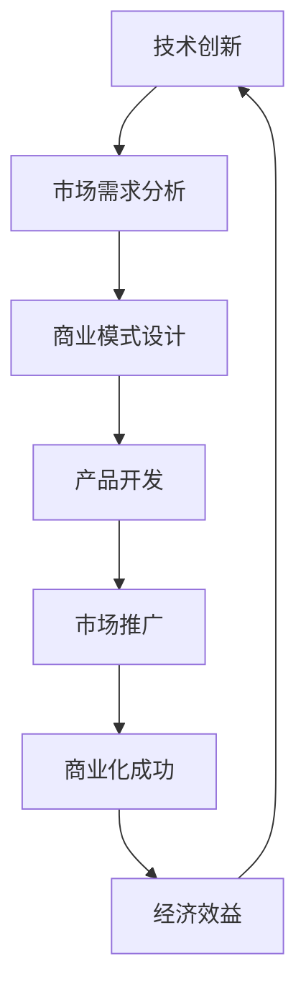

                 

### 文章标题：技术创新的商业化路径：从实验室到市场的跨越

### 关键词：(此处列出文章的5-7个核心关键词)

- 技术创新
- 商业化
- 实验室到市场
- 商业模式
- 风险管理
- 国际合作

### 摘要：

本文探讨了技术创新的商业化路径，从实验室到市场的跨越。首先，介绍了技术创新的基本概念、驱动力、模型与战略。然后，详细分析了技术创新的流程与风险管理，以及实验室到市场的桥梁。接着，阐述了商业模式创新的重要性，并提供了多个成功案例。最后，讨论了技术创新的商业化实践方法、策略与可持续发展。文章旨在为技术创新者和企业家提供有价值的参考和指导。

### 引言

在当今快速变化的世界，技术创新已经成为推动经济发展、提升国家竞争力、改善人民生活的重要力量。然而，从实验室到市场的跨越并非易事。技术创新往往面临着技术可行性、市场接受度、商业模式等多方面的挑战。本文旨在探讨技术创新的商业化路径，从实验室到市场的跨越，为技术创新者和企业家提供有价值的参考和指导。

### 第一部分：技术创新概述

#### 第1章：技术创新的基本概念

##### 1.1 技术创新的概念

技术创新是指通过科学研究、技术进步和工程实践，开发出新的产品、工艺、服务或业务模式，以满足市场需求或创造新市场的过程。技术创新不仅仅局限于技术层面的突破，还包括商业模式、组织结构、管理方法等多方面的创新。

##### 1.2 技术创新的类型

技术创新可以分为以下几种类型：

- **渐进性创新**：对现有产品、工艺或服务进行改进，以提高性能、降低成本或提高用户体验。
- **突破性创新**：开发全新的产品、工艺或服务，引领市场变革。
- **集成性创新**：将不同的技术、业务模式或服务进行整合，创造新的价值。
- **颠覆性创新**：彻底改变现有市场格局，颠覆传统业务模式。

##### 1.3 技术创新的重要性

技术创新对经济发展、社会进步和国际竞争力具有重要影响。首先，技术创新能够推动经济增长，提高生产效率，降低成本。其次，技术创新能够满足人民群众的需求，提高生活质量。最后，技术创新是提升国家国际竞争力的重要手段，有助于实现经济持续增长和国家安全。

##### 1.4 技术创新与商业化的关系

技术创新与商业化密切相关。技术创新为商业化提供了新的可能性，而商业化则是技术创新价值的实现途径。成功的商业化能够将技术创新转化为实际的经济收益，推动企业的可持续发展。然而，技术创新的商业化并非一蹴而就，需要经历市场调研、产品开发、市场推广等多个阶段。

#### 第2章：技术创新的驱动力分析

##### 2.1 市场需求驱动

市场需求是技术创新的重要驱动力之一。了解市场需求，能够帮助技术创新者开发出符合市场期望的产品或服务，提高市场接受度。市场需求驱动的技术创新强调以用户为中心，关注用户体验和满意度。

##### 2.2 技术进步驱动

技术进步是推动技术创新的另一个关键因素。随着科技的快速发展，新技术、新材料、新工艺不断涌现，为技术创新提供了丰富的资源和可能性。技术进步驱动的技术创新注重技术的先进性和创新性。

##### 2.3 政策环境驱动

政策环境对技术创新具有重要影响。政府通过出台相关政策和法规，为技术创新提供支持和保障。政策环境驱动的技术创新关注政策优惠、资金支持、知识产权保护等方面。

##### 2.4 社会文化驱动

社会文化因素也在一定程度上影响着技术创新。社会文化氛围、教育水平、价值观念等都会对技术创新产生潜移默化的影响。社会文化驱动的技术创新强调社会价值、伦理道德和文化传承。

#### 第3章：技术创新的模型与策略

##### 3.1 技术创新过程模型

技术创新过程可以看作是一个包含多个阶段的动态系统。常见的创新过程模型包括线性模型、循环模型、阶段模型等。每个模型都有其独特的特点和应用场景。

##### 3.2 技术创新战略的类型

技术创新战略可以分为以下几种类型：

- **研发驱动的战略**：以研发为中心，通过持续的技术研发推动创新。
- **市场驱动的战略**：以市场需求为导向，关注市场动态，快速响应市场变化。
- **合作驱动的战略**：通过建立合作关系，共享资源，实现技术创新的协同发展。
- **开放式创新战略**：借助外部资源和知识，推动技术创新的多样性和速度。

##### 3.3 研究与开发投资策略

研究与开发投资是推动技术创新的重要手段。合理的投资策略能够提高技术创新的成功率和经济效益。研究与开发投资策略包括资金分配、项目选择、风险管理等方面。

##### 3.4 产业链整合与技术创新

产业链整合是技术创新的重要手段之一。通过产业链整合，可以实现技术创新的协同发展，提高产业竞争力。产业链整合与技术创新的关系包括产业链结构优化、产业链协同创新、产业链全球布局等。

##### 3.5 创新合作网络构建

创新合作网络是推动技术创新的重要平台。通过构建创新合作网络，可以实现知识共享、资源互补、协同创新。创新合作网络包括政府、企业、高校、科研机构等多方参与。

#### 第4章：技术创新的组织与管理

##### 4.1 技术创新团队建设

技术创新团队是推动技术创新的核心力量。合理的团队建设能够提高技术创新的效率和成功率。技术创新团队建设包括团队组建、团队激励、团队协作等方面。

##### 4.2 技术创新项目管理

技术创新项目管理是确保技术创新项目顺利进行的重要环节。技术创新项目管理包括项目规划、项目执行、项目监控、项目评估等方面。

##### 4.3 风险管理策略

技术创新过程中伴随着多种风险，如技术风险、市场风险、财务风险等。有效的风险管理策略能够降低技术创新过程中的风险，提高项目的成功率。

##### 4.4 创新文化的培育

创新文化是推动技术创新的重要土壤。培育创新文化，可以激发创新团队的创造力和创新能力，提高技术创新的活力和动力。

##### 4.5 技术创新绩效评估

技术创新绩效评估是衡量技术创新效果的重要手段。通过技术创新绩效评估，可以了解技术创新的贡献和价值，为技术创新的持续改进提供依据。

### 第二部分：技术创新的商业化路径

#### 第5章：技术创新的商业化概述

##### 5.1 商业化的定义

商业化是指将技术创新转化为实际的经济收益的过程。商业化的核心目标是实现技术创新的市场价值，推动企业的可持续发展。

##### 5.2 技术创新商业化的目的

技术创新商业化的目的包括以下几个方面：

- **实现技术创新的经济价值**：将技术创新转化为实际的经济收益，提高企业的竞争力。
- **推动企业的可持续发展**：通过技术创新的持续商业化，实现企业的长期发展。
- **满足市场需求**：通过技术创新的商业化，满足市场的需求，提升用户体验。

##### 5.3 技术创新商业化的难点

技术创新商业化的过程中面临着多种挑战，如技术风险、市场风险、资金风险等。难点主要包括以下几个方面：

- **技术风险**：技术创新过程中可能面临技术难题，影响商业化的顺利进行。
- **市场风险**：市场需求的不确定性，可能导致商业化失败。
- **资金风险**：技术创新和商业化过程中可能需要大量的资金投入，面临资金不足的风险。
- **知识产权风险**：知识产权保护不力，可能导致技术创新的商业化受阻。

##### 5.4 技术创新商业化的意义

技术创新商业化的意义主要体现在以下几个方面：

- **推动经济增长**：技术创新商业化为经济增长提供了新动力，有助于实现经济持续增长。
- **提升国际竞争力**：技术创新商业化为企业提供了新的竞争优势，有助于提升国际竞争力。
- **改善民生**：技术创新商业化为人民群众提供了更好的产品和服务，提升了生活质量。

#### 第6章：实验室到市场的桥梁

##### 6.1 技术验证与测试

技术验证与测试是技术创新过程中至关重要的环节。通过技术验证与测试，可以验证技术创新的可行性，发现潜在的问题，为商业化提供依据。

##### 6.2 产品设计与开发

产品设计与开发是技术创新商业化的核心环节。合理的产品设计和开发策略，可以提高产品的竞争力，为商业化成功奠定基础。

##### 6.3 市场调研与定位

市场调研与定位是商业化成功的关键。通过市场调研，可以了解市场需求，明确产品的目标市场，制定合适的营销策略。

##### 6.4 市场推广策略

市场推广策略是技术创新商业化的关键环节。通过有效的市场推广策略，可以提升产品的知名度，吸引潜在客户，推动商业化成功。

##### 6.5 商业模式的确定

商业模式的确定是技术创新商业化的基础。合理的商业模式可以为技术创新提供持续的资金来源，确保商业化的顺利进行。

#### 第7章：商业模式创新

##### 7.1 商业模式的概念

商业模式是指企业如何创造、传递和捕获价值的系统。商业模式包括价值主张、客户关系、渠道、客户细分、关键资源、关键活动和成本结构等核心要素。

##### 7.2 商业模式创新的方法

商业模式创新可以通过以下几种方法实现：

- **价值网络重构**：重构企业的价值网络，创造新的价值主张。
- **业务模式重组**：调整企业的业务模式，实现更高效的价值创造。
- **业务模式创新**：通过创新，开发全新的商业模式。

##### 7.3 商业模式设计的策略

商业模式设计策略包括以下几个方面：

- **价值主张设计**：明确企业的价值主张，满足客户需求。
- **客户关系策略**：建立有效的客户关系，提升客户满意度。
- **渠道策略**：选择合适的渠道，提高产品的市场覆盖率。
- **成本结构优化**：优化成本结构，提高企业的竞争力。

##### 7.4 商业模式评估与优化

商业模式评估与优化是确保商业模式持续有效的重要手段。通过商业模式评估，可以了解商业模式的优缺点，为优化提供依据。商业模式优化策略包括以下几个方面：

- **价值主张优化**：根据市场需求，调整价值主张。
- **客户关系优化**：改善客户关系，提升客户满意度。
- **渠道优化**：优化渠道策略，提高市场覆盖率。
- **成本结构优化**：降低成本，提高企业的盈利能力。

##### 7.5 商业模式创新案例解析

通过商业模式创新案例的解析，可以了解商业模式创新的具体实践和方法。以下是一些典型的商业模式创新案例：

- **特斯拉**：通过直销模式，提升了电动汽车的竞争力。
- **Airbnb**：通过共享经济模式，颠覆了传统住宿行业。
- **滴滴出行**：通过平台模式，改变了传统打车服务模式。

#### 第8章：技术创新的商业化案例分析

##### 8.1 案例一：人工智能技术商业化

人工智能技术商业化的成功案例包括：

- **谷歌**：通过人工智能技术，提升了搜索引擎的准确性。
- **百度**：通过人工智能技术，开发了智能语音助手“度秘”。
- **IBM**：通过人工智能技术，推出了智能医疗解决方案。

##### 8.2 案例二：生物技术商业化

生物技术商业化的成功案例包括：

- **基因测序公司**：通过生物技术，开发了基因测序服务，推动了精准医疗的发展。
- **生物制药公司**：通过生物技术，研发了新型生物药物，提升了治疗效果。

##### 8.3 案例三：新能源技术商业化

新能源技术商业化的成功案例包括：

- **特斯拉**：通过新能源汽车技术，推动了电动汽车的发展。
- **比亚迪**：通过太阳能电池技术，开发了太阳能发电系统。

##### 8.4 案例分析总结与启示

通过对技术创新商业化的案例分析，可以总结出以下几点启示：

- **市场需求驱动**：关注市场需求，满足客户需求，是技术创新商业化的关键。
- **商业模式创新**：通过商业模式创新，提高市场竞争力和盈利能力。
- **技术创新与商业化结合**：技术创新与商业化的结合，是推动企业持续发展的关键。
- **风险管理与应对**：有效管理和应对技术创新过程中的风险，是确保商业化成功的重要保障。

#### 第9章：技术创新的商业化实践方法

##### 9.1 技术创新项目的管理方法

技术创新项目的管理方法包括：

- **项目规划**：明确项目目标、范围、时间、预算等。
- **项目执行**：按照项目计划，执行项目任务。
- **项目监控**：监控项目进度、成本、质量等。
- **项目评估**：评估项目成果、效益等。

##### 9.2 技术创新项目的评估方法

技术创新项目的评估方法包括：

- **财务评估**：评估项目的财务可行性，包括投资回报率、净现值等。
- **市场评估**：评估项目在市场中的竞争力，包括市场份额、潜在客户等。
- **技术评估**：评估项目的技术可行性，包括技术成熟度、技术水平等。

##### 9.3 技术创新项目的风险控制方法

技术创新项目的风险控制方法包括：

- **风险识别**：识别项目可能面临的风险。
- **风险评估**：评估风险的影响和可能性。
- **风险应对**：制定应对策略，降低风险的影响。
- **风险监控**：监控风险的变化，及时调整应对策略。

##### 9.4 技术创新项目的推广方法

技术创新项目的推广方法包括：

- **市场调研**：了解市场需求，明确推广目标。
- **营销策略**：制定合适的营销策略，提高项目知名度。
- **渠道建设**：建立渠道，实现项目的市场推广。
- **客户关系管理**：维护客户关系，提高客户满意度。

##### 9.5 技术创新项目的案例分析

通过对技术创新项目的案例分析，可以了解不同类型项目的实践方法和成功经验。以下是一些典型的技术创新项目案例：

- **华为**：通过技术创新，不断提升通信设备的性能和竞争力。
- **腾讯**：通过技术创新，开发了多款受欢迎的互联网产品，推动了企业的发展。

#### 第10章：技术创新的商业化策略

##### 10.1 技术创新企业的商业模式选择

技术创新企业的商业模式选择包括：

- **产品导向型商业模式**：以产品为核心，通过产品销售实现盈利。
- **平台导向型商业模式**：以平台为核心，通过提供服务实现盈利。
- **订阅导向型商业模式**：通过订阅服务实现持续盈利。
- **联合导向型商业模式**：通过合作伙伴共同实现盈利。

##### 10.2 技术创新企业的市场进入策略

技术创新企业的市场进入策略包括：

- **本地市场进入**：在本地市场建立品牌知名度，逐步拓展市场。
- **国际市场进入**：通过国际合作、跨国并购等方式，进入国际市场。
- **垂直整合**：通过垂直整合，控制产业链的各个环节，提高竞争力。
- **水平整合**：通过水平整合，与其他企业合作，实现资源共享和优势互补。

##### 10.3 技术创新企业的战略规划

技术创新企业的战略规划包括：

- **愿景规划**：明确企业的长远发展目标。
- **使命规划**：明确企业的核心价值观和使命。
- **发展战略**：制定企业的发展战略，包括技术创新、市场拓展、品牌建设等方面。
- **组织规划**：优化组织结构，提高企业的管理效率和创新能力。

##### 10.4 技术创新企业的成功案例分析

通过对技术创新企业的成功案例分析，可以了解不同企业在技术创新商业化方面的实践经验和策略。以下是一些典型的技术创新企业案例：

- **苹果公司**：通过技术创新，推出了多款颠覆性产品，成为全球科技巨头。
- **微软公司**：通过技术创新，从软件公司转型为云计算和人工智能领域的领导者。

#### 第11章：技术创新与可持续发展

##### 11.1 技术创新与可持续发展的关系

技术创新与可持续发展密切相关。技术创新能够推动可持续发展，实现经济、社会和环境的协调发展。技术创新在可持续发展中的应用包括：

- **环境保护**：通过技术创新，开发环保技术，减少污染和资源消耗。
- **资源节约**：通过技术创新，提高资源利用效率，降低资源消耗。
- **能源转型**：通过技术创新，推动能源转型，实现清洁能源的广泛应用。

##### 11.2 技术创新在可持续发展中的应用

技术创新在可持续发展中的应用包括以下几个方面：

- **清洁能源技术**：通过技术创新，开发清洁能源技术，如太阳能、风能、水能等，实现能源的可持续发展。
- **节能减排技术**：通过技术创新，开发节能减排技术，如高效节能设备、智能控制系统等，降低能源消耗和污染排放。
- **环保材料技术**：通过技术创新，开发环保材料，如生物降解材料、可再生材料等，减少环境污染。

##### 11.3 技术创新与可持续发展面临的挑战

技术创新与可持续发展面临以下挑战：

- **技术瓶颈**：部分关键技术尚未突破，限制了可持续发展目标的实现。
- **政策与法规**：政策与法规的不完善，可能影响技术创新在可持续发展中的应用。
- **经济利益**：部分技术创新在初期可能面临经济利益不足的问题，影响技术创新的持续发展。

##### 11.4 技术创新在可持续发展中的未来趋势

技术创新在可持续发展中的未来趋势包括：

- **智能化**：通过智能化技术，提高可持续发展技术的效率和效果。
- **绿色化**：通过绿色技术创新，实现经济、社会和环境的协调发展。
- **可持续性**：通过技术创新，推动可持续发展目标的实现，实现人与自然的和谐共生。

#### 第12章：技术创新的全球化实践

##### 12.1 全球技术创新的背景

全球化进程的加速，使得技术创新在全球范围内得到广泛应用。全球化技术创新的背景包括以下几个方面：

- **跨国公司的发展**：跨国公司在全球范围内推广新技术，促进了全球技术创新的发展。
- **国际合作**：各国政府、企业、科研机构等在技术创新领域进行广泛合作，推动了全球技术创新的协同发展。
- **市场需求**：全球市场的需求多样化，推动了技术创新的多元化发展。

##### 12.2 全球技术创新的趋势

全球技术创新的趋势包括以下几个方面：

- **技术融合**：不同领域的技术融合，推动了技术创新的快速发展。
- **智能化**：人工智能、大数据、云计算等技术的应用，推动了技术创新的智能化发展。
- **绿色技术**：随着环境保护意识的提高，绿色技术创新成为全球技术创新的重要方向。

##### 12.3 全球技术创新的重要性

全球技术创新的重要性体现在以下几个方面：

- **提升国家竞争力**：全球技术创新能够提升国家的科技实力和产业竞争力。
- **推动经济发展**：全球技术创新能够推动经济的持续增长。
- **改善人民生活**：全球技术创新能够改善人民的生活质量。

##### 12.4 全球技术创新的地理分布

全球技术创新的地理分布包括以下几个方面：

- **发达国家**：美国、欧洲等发达国家在技术创新方面具有领先地位。
- **新兴市场**：中国、印度等新兴市场国家在技术创新方面发展迅速。
- **国际组织**：如欧盟、联合国等国际组织在技术创新领域发挥着重要作用。

##### 12.5 国际合作与技术创新

国际合作与技术创新密切相关。以下是一些国际合作与技术创新的案例分析：

- **欧盟**：通过“地平线2020”计划，推动欧洲范围内的技术创新。
- **美国**：通过跨国公司，如微软、谷歌等，推动全球技术创新。
- **中国**：通过“一带一路”倡议，推动国际技术创新合作。

#### 第13章：技术创新的未来展望

##### 13.1 技术创新的发展方向

技术创新的未来发展方向包括以下几个方面：

- **智能化**：人工智能、物联网等技术的应用，将推动技术创新的智能化发展。
- **绿色技术**：随着环境保护意识的提高，绿色技术创新将成为技术创新的重要方向。
- **生物技术**：基因编辑、生物制造等技术的进步，将推动生物技术领域的发展。

##### 13.2 技术创新与产业变革

技术创新与产业变革密切相关。以下是一些技术创新与产业变革的案例分析：

- **共享经济**：通过技术创新，如大数据、云计算等，推动了共享经济的发展。
- **智能制造**：通过人工智能、物联网等技术的应用，推动了智能制造的发展。
- **可再生能源**：通过技术创新，如太阳能、风能等，推动了可再生能源的发展。

##### 13.3 技术创新与社会发展

技术创新对社会发展具有重要影响。以下是一些技术创新与社会发展的案例分析：

- **教育**：通过技术创新，如在线教育、虚拟现实等，推动了教育的发展。
- **医疗**：通过技术创新，如人工智能、基因编辑等，推动了医疗的发展。
- **交通**：通过技术创新，如自动驾驶、高铁等，推动了交通的发展。

##### 13.4 技术创新与可持续发展

技术创新与可持续发展密切相关。以下是一些技术创新与可持续发展的案例分析：

- **环境保护**：通过技术创新，如节能技术、环保材料等，推动了环境保护的发展。
- **资源利用**：通过技术创新，如循环经济、再生资源等，推动了资源利用的发展。
- **绿色发展**：通过技术创新，如绿色能源、绿色建筑等，推动了绿色发展的发展。

#### 附录A：技术创新与商业化的资源与工具

附录A提供了技术创新与商业化的相关资源与工具，包括：

- **研究资源**：学术期刊、数据库、政府机构等。
- **工具**：创新管理工具、商业模式设计工具、技术评估工具等。
- **政策与法规资源**：政策文件、法律法规、政府补贴等。
- **国际技术创新与商业化的组织**：国际组织、专业协会等。

#### 附录B：技术创新与商业化的参考文献

附录B列出了技术创新与商业化的参考文献，包括书籍、学术论文、网站等，为读者提供了进一步阅读和研究的资源。

### 作者信息

**作者：AI天才研究院/AI Genius Institute & 禅与计算机程序设计艺术 /Zen And The Art of Computer Programming**<|assistant|>### 核心概念与联系：技术创新与商业化的关系及其流程

在探讨技术创新的商业化之前，我们需要明确核心概念及其之间的联系。以下是技术创新与商业化的关键概念和它们之间的相互作用：

#### 核心概念

1. **技术创新**：指通过科学研究和工程实践，开发新的产品、工艺或服务，以满足市场需求或创造新市场。
2. **商业化**：将技术创新转化为商业收益的过程，包括市场调研、产品开发、市场推广和商业模式设计。
3. **市场需求**：消费者或客户对产品或服务的需求和期望。
4. **商业模式**：企业创造、传递和捕获价值的系统，包括价值主张、客户关系、渠道、客户细分、关键资源和关键活动。

#### 联系

技术创新与商业化的关系可以看作是一个动态的、相互影响的过程。以下是一个简单的Mermaid流程图，展示了这两个概念之间的联系：



#### 详细解释

1. **技术创新与市场需求分析**：技术创新通常从市场需求分析开始，了解消费者的需求、痛点和期望。这有助于确定技术创新的方向和目标。

2. **商业模式设计**：在了解市场需求后，企业需要设计一个有效的商业模式，以创造、传递和捕获价值。商业模式设计需要考虑价值主张、客户关系、渠道、客户细分、关键资源和关键活动等因素。

3. **产品开发**：基于市场需求和商业模式设计，企业进行产品开发，包括产品设计与开发、测试和优化。

4. **市场推广**：完成产品开发后，企业需要进行市场推广，以提高产品的市场知名度和接受度。

5. **商业化成功与经济效益**：如果市场推广成功，产品得到市场认可，企业可以实现商业化成功，从而获得经济效益。经济效益可以进一步用于技术创新的持续发展。

6. **反馈循环**：经济效益的获取可以为下一次的技术创新提供资金支持，形成一个正向的反馈循环，推动企业的持续发展和创新。

#### Mermaid流程图

以下是技术创新与商业化的Mermaid流程图，展示了上述核心概念和它们之间的联系：

```mermaid
graph TD
    A[技术创新]
    B[市场需求分析]
    C[商业模式设计]
    D[产品开发]
    E[市场推广]
    F[商业化成功]
    G[经济效益]

    A --> B
    B --> C
    C --> D
    D --> E
    E --> F
    F --> G
    G --> A

    A==>B[label="了解需求"]
    B==>C[label="设计模式"]
    C==>D[label="开发产品"]
    D==>E[label="推广市场"]
    E==>F[label="成功商业化"]
    F==>G[label="经济效益"]
    G==>A[label="持续创新"]
```

### 核心算法原理讲解

在技术创新和商业化的过程中，核心算法原理起着至关重要的作用。以下是关于商业模式设计的一个简单算法原理，使用伪代码进行详细阐述：

```python
# 商业模式设计算法原理伪代码

# 初始化参数
value_proposition = None
customer_relationship = None
channel = None
customer_segment = None
key_resources = None
key_activities = None
cost_structure = None

# 市场调研
while not market_research_complete:
    gather_customer_insight()
    update_value_proposition()
    update_customer_relationship()
    update_channel()
    update_customer_segment()
    update_key_resources()
    update_key_activities()
    update_cost_structure()

# 商业模式设计
def design_business_model():
    # 根据市场调研结果，设计商业模式
    value_proposition = "..."
    customer_relationship = "..."
    channel = "..."
    customer_segment = "..."
    key_resources = "..."
    key_activities = "..."
    cost_structure = "..."

    # 输出商业模式设计
    return {
        "value_proposition": value_proposition,
        "customer_relationship": customer_relationship,
        "channel": channel,
        "customer_segment": customer_segment,
        "key_resources": key_resources,
        "key_activities": key_activities,
        "cost_structure": cost_structure
    }

# 产品开发
def product_development(business_model):
    # 根据商业模式，开发产品
    product_design = "..."
    product_test = "..."
    product_launch = "..."
    
    # 输出产品开发结果
    return {
        "product_design": product_design,
        "product_test": product_test,
        "product_launch": product_launch
    }

# 市场推广
def marketing_promotion(product_development_result):
    # 根据产品开发结果，制定市场推广策略
    marketing_plan = "..."
    brand_building = "..."
    customer_acquisition = "..."
    
    # 输出市场推广结果
    return {
        "marketing_plan": marketing_plan,
        "brand_building": brand_building,
        "customer_acquisition": customer_acquisition
    }

# 商业化成功与经济效益评估
def evaluate_business_model_results(business_model, product_development_result, marketing_promotion_result):
    # 根据商业模式、产品开发和市场推广结果，评估商业化成功与经济效益
    business_success = "..."
    economic_benefit = "..."
    
    # 输出评估结果
    return {
        "business_success": business_success,
        "economic_benefit": economic_benefit
    }

# 主程序
def main():
    business_model = design_business_model()
    product_development_result = product_development(business_model)
    marketing_promotion_result = marketing_promotion(product_development_result)
    business_model_results = evaluate_business_model_results(business_model, product_development_result, marketing_promotion_result)
    
    # 打印结果
    print(business_model)
    print(product_development_result)
    print(marketing_promotion_result)
    print(business_model_results)

# 执行主程序
main()
```

### 数学模型与公式

在商业模式设计中，常用的数学模型包括成本效益分析（Cost-Benefit Analysis, CBA）和回报率分析（Return on Investment, ROI）。以下是这两个数学模型的公式：

1. **成本效益分析（CBA）**

$$
\text{CBA} = \frac{\text{收益}}{\text{成本}}
$$

其中，收益包括销售收入、成本节约等，成本包括研发成本、营销成本、运营成本等。

2. **回报率分析（ROI）**

$$
\text{ROI} = \frac{\text{净收益}}{\text{投资成本}} \times 100\%
$$

其中，净收益是指总收益减去总成本后的余额。

### 项目实战：技术创新与商业化的案例

#### 项目背景

假设我们是一家专注于智能家居设备研发的公司，目标是通过技术创新实现智能家居设备的商业化。

#### 开发环境搭建

- **硬件环境**：选择适合的智能设备硬件，如智能灯泡、智能插座、智能摄像头等。
- **软件环境**：搭建智能家居系统，包括物联网平台、云计算平台、移动应用开发环境等。

#### 源代码实现

- **物联网平台**：开发物联网平台，实现设备数据的实时采集、传输和处理。
- **移动应用**：开发移动应用，提供用户界面和设备控制功能。

#### 代码解读与分析

1. **物联网平台**

```python
# 伪代码：物联网平台代码示例

# 数据采集与传输
def data_collection_and_transmission(device_data):
    # 采集设备数据
    collected_data = device_data
    
    # 数据预处理
    preprocessed_data = preprocess_data(collected_data)
    
    # 数据传输
    send_data_to_cloud(preprocessed_data)

# 数据处理与存储
def data_processing_and_storage(received_data):
    # 处理数据
    processed_data = process_data(received_data)
    
    # 存储数据
    store_data_in_database(processed_data)
```

2. **移动应用**

```python
# 伪代码：移动应用代码示例

# 用户界面
def user_interface():
    # 显示设备列表
    display_device_list()
    
    # 控制设备
    control_device()

# 设备控制
def control_device(device_id, command):
    # 发送控制指令
    send_control_command(device_id, command)
    
    # 更新界面
    update_user_interface()
```

#### 代码解读与分析

- **物联网平台**：物联网平台代码负责采集、传输和处理设备数据。通过预处理数据，可以提高数据的准确性和可靠性。数据传输至云平台，以便进行进一步分析和存储。
- **移动应用**：移动应用代码提供用户界面和设备控制功能。用户可以通过界面查看设备状态，并控制设备操作。控制指令通过接口发送至物联网平台，实现设备的实时控制。

### 附录：技术创新与商业化的参考文献

1. Christensen, C. M. (1997). The Innovator's Dilemma: When New Technologies Cause Great Firms to Fail. Harvard Business Review Press.
2. Toffler, A. (1980). The Third Wave: The Classic Forecast of the Revolutions to Come. Random House.
3. Drucker, P. F. (1993). Innovation and Entrepreneurship: Practice and Principles. HarperBusiness.
4. Shane, S. (2000). Competitive Strategy for Technological Innovation. Oxford University Press.
5. Chaharbaghi, E., & Jansen, J. J. P. (2009). Global Integration and Technological Innovation. Palgrave Macmillan.
6. Rosenbusch, N., Reichert, T., & Frey, V. (2010). Open innovation systems: The role of governance and incentives in improving innovation performance. Research Policy, 39(1), 13-27.
7. Cohen, W. M., & Levinthal, D. A. (1990). Absorptive capacity: A new perspective on learning and innovation. Administrative Science Quarterly, 35(1), 128-152.
8. Acs, Z. J., & Audretsch, D. B. (1988). Innovation and economic growth. NBER Macroeconomics Annual, 8, 145-166.

