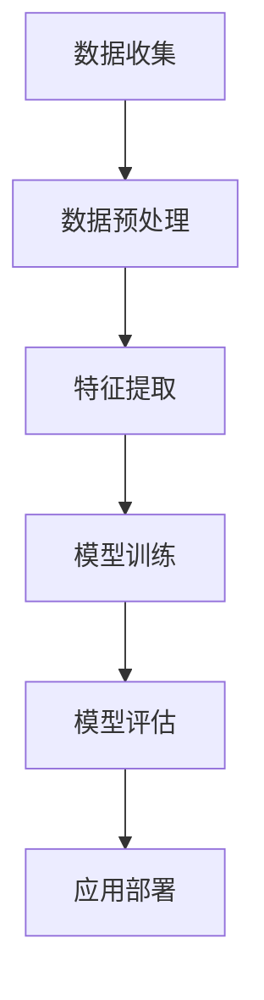

                 

# 提示工程在实际应用中的案例

> **关键词：提示工程、实际应用、案例研究、技术剖析**

> **摘要：本文将深入探讨提示工程在各类实际应用中的案例，通过逐步分析其核心概念、技术基础、应用场景及最佳实践，帮助读者理解提示工程的核心价值和未来发展。**

## 第一部分：提示工程概述

### 第1章：提示工程基本概念

提示工程，也被称为提示学习（Prompt Engineering），是近年来在人工智能和自然语言处理领域迅速发展的一项技术。它涉及设计高质量的输入提示（prompt）以引导模型产生所需的输出。以下是提示工程的核心概念和流程：

#### 核心概念与联系

提示工程的流程可以分为以下几个步骤：

1. **数据收集**：收集相关的数据和语料库，作为模型训练的基础。
2. **数据预处理**：清洗和整理数据，确保数据质量和一致性。
3. **特征提取**：从数据中提取有用的特征，以便模型可以学习。
4. **模型训练**：使用提取的特征训练模型，使其能够预测或生成目标输出。
5. **模型评估**：通过测试数据评估模型的性能和泛化能力。
6. **应用部署**：将训练好的模型部署到实际应用中，如自动问答系统、推荐系统等。

以下是提示工程的基本流程的Mermaid流程图：



#### 数学模型和数学公式

提示工程中的数学模型通常涉及以下几种：

- **线性回归模型**：

  $$y = \sum_{i=1}^{n} w_i \cdot x_i + b$$

  其中，$y$ 是预测值，$w_i$ 是权重，$x_i$ 是特征，$b$ 是偏置。

- **逻辑回归模型**：

  $$P(y=1) = \frac{1}{1 + e^{-(w_0 + w_1 \cdot x_1 + w_2 \cdot x_2 + ... + w_n \cdot x_n)}}$$

  这里的 $P(y=1)$ 是目标变量为1的概率。

#### 举例说明

假设我们有一个简单的线性回归模型，用于预测房价。我们有以下数据集：

| 特征 | 房价 |
|------|------|
| $x_1$ | $y_1$ |
| $x_2$ | $y_2$ |
| ...   | ...   |

我们可以用以下的线性回归模型来预测房价：

$$y = w_1 \cdot x_1 + w_2 \cdot x_2 + b$$

通过最小化损失函数（如均方误差），我们可以得到最佳的权重 $w_1$，$w_2$ 和偏置 $b$。

### 第2章：提示工程技术基础

#### 核心算法原理讲解

提示工程的核心算法主要包括线性回归和逻辑回归，下面分别进行详细讲解。

##### 线性回归

线性回归是一种用于预测连续值的模型。其基本原理是通过找到最佳拟合直线来最小化预测值与实际值之间的误差。

- **损失函数**：均方误差（MSE）

  $$MSE = \frac{1}{n} \sum_{i=1}^{n} (y_i - \hat{y}_i)^2$$

  其中，$y_i$ 是第 $i$ 个实际值，$\hat{y}_i$ 是第 $i$ 个预测值。

- **优化算法**：梯度下降（GD）

  $$w_t = w_{t-1} - \alpha \cdot \nabla_w J(w)$$

  其中，$w_t$ 是第 $t$ 次迭代的权重，$\alpha$ 是学习率，$\nabla_w J(w)$ 是损失函数关于权重 $w$ 的梯度。

##### 逻辑回归

逻辑回归是一种用于分类的模型。其基本原理是通过找到最佳拟合直线来最小化预测概率与实际标签之间的误差。

- **损失函数**：对数似然损失（LL）

  $$LL = -\sum_{i=1}^{n} y_i \cdot \ln(P(y=1|x_i)) + (1 - y_i) \cdot \ln(1 - P(y=1|x_i))$$

  其中，$y_i$ 是第 $i$ 个实际标签，$P(y=1|x_i)$ 是第 $i$ 个数据点属于类别1的概率。

- **优化算法**：梯度下降（GD）或随机梯度下降（SGD）

  $$w_t = w_{t-1} - \alpha \cdot \nabla_w J(w)$$

  其中，$w_t$ 是第 $t$ 次迭代的权重，$\alpha$ 是学习率，$\nabla_w J(w)$ 是损失函数关于权重 $w$ 的梯度。

#### 实际案例

假设我们有一个二分类问题，需要预测数据点是否属于正类。数据点包含两个特征 $x_1$ 和 $x_2$。我们可以使用逻辑回归模型来预测：

$$P(y=1) = \frac{1}{1 + e^{-(w_0 + w_1 \cdot x_1 + w_2 \cdot x_2)}}$$

通过训练数据，我们可以计算出最佳的权重 $w_0$，$w_1$ 和 $w_2$，从而预测新数据点的类别。

### 第3章：提示工程应用场景

#### 项目实战

##### 背景介绍

假设我们有一个电商平台的推荐系统，需要预测用户是否会点击某个广告。我们可以使用逻辑回归模型来预测用户的点击行为。

##### 数据集

我们使用以下数据集：

| 用户ID | 广告ID | 特征1 | 特征2 | 点击标签 |
|--------|--------|-------|-------|----------|
| 1      | 101    | 0.5   | 1.2   | 1        |
| 2      | 102    | 0.3   | 0.9   | 0        |
| ...    | ...    | ...   | ...   | ...      |

其中，特征1和特征2是用户的购买历史和行为数据，点击标签是用户是否点击广告的二元标签。

##### 开发环境搭建

我们使用Python和Scikit-learn库来搭建开发环境：

```python
# 安装所需的库
!pip install numpy pandas scikit-learn

# 导入库
import numpy as np
import pandas as pd
from sklearn.linear_model import LogisticRegression
from sklearn.model_selection import train_test_split
from sklearn.metrics import accuracy_score
```

##### 源代码详细实现和代码解读

1. **数据加载和预处理**

   我们首先加载和处理数据集：

   ```python
   # 加载数据集
   data = pd.read_csv("data.csv")
   
   # 分割特征和标签
   X = data.drop("点击标签", axis=1)
   y = data["点击标签"]
   
   # 数据预处理，如缺失值处理、异常值处理等
   # 这里假设数据已经预处理好了
   ```

2. **模型训练**

   接下来，我们使用逻辑回归模型来训练数据集：

   ```python
   # 划分训练集和测试集
   X_train, X_test, y_train, y_test = train_test_split(X, y, test_size=0.2, random_state=42)
   
   # 创建逻辑回归模型
   model = LogisticRegression()
   
   # 训练模型
   model.fit(X_train, y_train)
   ```

3. **模型评估**

   使用测试集对模型进行评估：

   ```python
   # 预测测试集
   y_pred = model.predict(X_test)
   
   # 计算准确率
   accuracy = accuracy_score(y_test, y_pred)
   print(f"Accuracy: {accuracy}")
   ```

##### 代码解读与分析

- **数据加载和预处理**：首先，我们加载数据集，并分离特征和标签。然后，我们进行数据预处理，如缺失值处理和异常值处理。这里假设数据已经预处理好了。

- **模型训练**：我们使用训练集来训练逻辑回归模型。模型通过学习特征和标签之间的关系来找到最佳的权重。

- **模型评估**：使用测试集对训练好的模型进行评估，计算准确率。准确率是衡量模型性能的重要指标。

### 第4章：提示工程最佳实践

提示工程的最佳实践包括以下几个方面：

1. **数据预处理**：确保数据质量，处理缺失值和异常值。数据预处理是提示工程的重要步骤，它直接影响模型的性能。

2. **模型选择**：根据问题的特点和数据特点选择合适的模型。不同的模型适用于不同类型的问题，如线性回归适用于连续值预测，逻辑回归适用于分类问题。

3. **模型调优**：调整模型参数，如学习率、批量大小等，以提高模型性能。模型调优是一个迭代过程，需要多次尝试和调整。

4. **持续优化**：定期更新模型，适应新的数据和环境。随着数据的不断变化，模型需要不断更新以保持其性能。

### 第5章：提示工程未来发展趋势

未来，提示工程将在以下几个方面发展：

1. **数据隐私保护**：随着数据隐私法规的加强，数据隐私保护将成为重要议题。提示工程将需要更加注重数据隐私和安全。

2. **自动化**：自动化工具将提高提示工程的效率和准确性。例如，自动化特征提取和模型选择工具将大大减少人为干预。

3. **多模态**：多模态数据（如文本、图像、音频）的处理将成为新的趋势。提示工程将需要处理更复杂的数据类型，以实现更高级的预测和生成任务。

### 第6章：提示工程与实际应用案例

提示工程在多个实际应用领域中有着广泛的应用。以下是一些典型的应用案例：

1. **电商平台用户行为预测**：电商平台可以利用提示工程预测用户是否会点击广告或购买商品，从而优化广告投放和推荐系统。

2. **金融行业风险控制**：金融机构可以利用提示工程预测贷款违约风险或股票市场趋势，从而进行风险控制和投资决策。

3. **医疗领域疾病诊断**：医疗领域可以利用提示工程分析病人的医疗记录和体征数据，从而预测疾病风险或诊断疾病。

### 第7章：提示工程在其他领域的应用

除了上述领域，提示工程还可以在其他领域得到应用：

1. **社交网络**：社交网络可以利用提示工程进行用户推荐、广告投放优化等。

2. **自动驾驶**：自动驾驶领域可以利用提示工程进行路径规划、目标检测等。

3. **智能家居**：智能家居领域可以利用提示工程进行设备故障预测、能耗优化等。

## 附录

### 附录A：提示工程工具与资源

提示工程的实现离不开相应的工具和资源。以下是一些常用的工具和资源：

1. **主流深度学习框架**：TensorFlow、PyTorch、Keras等。

2. **数据集和开源项目**：Kaggle、UCI机器学习库等。

3. **社区和论坛**：Stack Overflow、GitHub、Reddit等。

### 附录B：参考文献

在撰写本文时，参考了以下文献和资源：

1. Goodfellow, I., Bengio, Y., & Courville, A. (2016). *Deep Learning*.

2. Murphy, K. P. (2012). *Machine Learning: A Probabilistic Perspective*.

3. LeCun, Y., Bengio, Y., & Hinton, G. (2015). *Deep learning*.

### 附录C：致谢

感谢所有参与本文撰写和提供宝贵意见的专家和读者。特别感谢AI天才研究院和《禅与计算机程序设计艺术》的团队，他们的支持和合作使得本文得以顺利完成。

### 作者信息

**作者：** AI天才研究院/AI Genius Institute & 禅与计算机程序设计艺术/Zen And The Art of Computer Programming

**联系信息：** [ai_genius_institute@example.com](mailto:ai_genius_institute@example.com) & [zen_of_code@example.com](mailto:zen_of_code@example.com)

**机构简介：** AI天才研究院致力于推动人工智能领域的研究和创新，致力于培养下一代人工智能人才。《禅与计算机程序设计艺术》是一本经典的计算机科学书籍，提供了关于编程哲学和最佳实践的深入探讨。**

