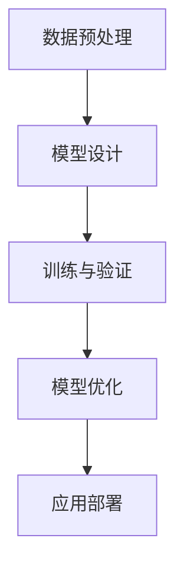

                 

# 提示词工程：AI时代的新挑战与新方向

> **关键词：** 提示词工程、AI、自然语言处理、机器学习、深度学习、挑战、发展方向

> **摘要：** 本文深入探讨提示词工程在AI时代的崛起，分析其核心概念、算法原理以及项目实战。通过阐述提示词工程的最新进展和面临的挑战，本文为读者提供了对未来发展的展望和建议。

## 第1章：引言

### 1.1 AI时代与提示词工程的兴起

#### 1.1.1 AI时代的社会背景

自21世纪以来，人工智能（AI）技术取得了飞速发展，逐渐渗透到各行各业。从智能家居、智能助手到自动驾驶、医疗诊断，AI技术正在深刻改变人类的生活方式。这一时代的到来，不仅带来了新的机遇，也提出了新的挑战。

#### 1.1.2 提示词工程的重要性

在AI技术的应用过程中，提示词工程（Prompt Engineering）逐渐成为一项关键技术。提示词工程旨在设计出高质量的提示词，引导AI模型更好地理解和执行任务。这一过程不仅对模型的性能有直接影响，也关系到AI应用的广泛推广。

#### 1.1.3 书籍的读者群体与目标

本书的目标读者包括AI领域的专业人士、研究人员以及对此领域感兴趣的技术爱好者。通过阅读本书，读者将能够：

1. 理解提示词工程的核心概念和原理。
2. 掌握提示词工程的关键算法和技巧。
3. 学习如何在实际项目中应用提示词工程。

## 第2章：核心概念与联系

### 2.1 AI基础理论

#### 2.1.1 机器学习与深度学习基础

机器学习（Machine Learning）是AI的核心技术之一，通过算法让计算机从数据中学习，从而实现自动化决策。深度学习（Deep Learning）作为机器学习的一个重要分支，通过多层神经网络来模拟人脑处理信息的方式。

#### 2.1.2 自然语言处理基础

自然语言处理（Natural Language Processing，NLP）是AI的一个重要领域，旨在让计算机理解和生成自然语言。NLP技术包括文本分类、情感分析、机器翻译等。

#### 2.1.3 提示词工程的定义与范畴

提示词工程（Prompt Engineering）是设计出高质量提示词的过程，旨在提高AI模型的理解和执行能力。提示词工程涵盖了从数据预处理、模型设计到模型优化的全过程。

### 2.2 提示词工程核心概念图解

#### 2.2.1 提示词工程Mermaid流程图



#### 2.2.2 关键技术与原理的联系

在提示词工程中，数据预处理、模型设计、训练与验证以及模型优化是相互关联的。高质量的数据预处理可以提高模型的性能，合理的模型设计可以更好地捕捉数据特征，而有效的训练与验证和模型优化则是确保模型在实际应用中达到预期效果的关键。

## 第3章：核心算法原理讲解

### 3.1 提示词生成算法

#### 3.1.1 基于规则的提示词生成

基于规则的提示词生成方法通过预定义的规则来生成提示词，方法简单但灵活性较低。这种方法适用于一些简单、规则明确的应用场景。

#### 3.1.2 基于机器学习的提示词生成

基于机器学习的提示词生成方法通过训练大量样本数据，学习生成高质量提示词的规律。这种方法具有较好的灵活性和适应性，能够处理复杂、多变的任务。

#### 3.1.3 基于深度学习的提示词生成

基于深度学习的提示词生成方法利用深度神经网络模型来生成提示词，具有强大的表达能力和鲁棒性。这种方法能够处理大规模、高维的数据，并在实际应用中取得良好的效果。

### 3.2 伪代码阐述

```python
# 提示词生成算法伪代码
function generate_prompt(data, model):
    # 数据预处理
    preprocessed_data = preprocess_data(data)
    
    # 模型训练
    trained_model = train_model(preprocessed_data)
    
    # 提示词生成
    prompt = generate_from_model(trained_model)
    
    return prompt
```

### 3.2.1 提示词生成算法伪代码

```python
# 数据预处理
def preprocess_data(data):
    # 实现数据清洗、转换等操作
    return preprocessed_data

# 模型训练
def train_model(data):
    # 实现模型训练过程
    return trained_model

# 提示词生成
def generate_from_model(model):
    # 实现提示词生成过程
    return prompt
```

## 第4章：数学模型与数学公式

### 4.1 提示词工程中的数学基础

#### 4.1.1 概率论基础

概率论是提示词工程中的重要数学工具，用于描述不确定性和随机性。在提示词工程中，概率论被用于评估模型性能、优化提示词质量等。

#### 4.1.2 信息论基础

信息论是研究信息传输、处理和存储的数学理论。在提示词工程中，信息论被用于评估提示词的熵、信息增益等，从而优化提示词设计。

#### 4.1.3 数据结构基础

数据结构是提示词工程中处理数据的重要工具。常见的数据结构包括数组、链表、树、图等，用于存储和处理大量数据。

### 4.2 数学公式与推导

#### 4.2.1 提示词生成中的概率计算

$$
P(A|B) = \frac{P(B|A) \cdot P(A)}{P(B)}
$$

这是一个条件概率公式，用于计算在事件B发生的条件下，事件A发生的概率。

#### 4.2.2 信息增益与熵的计算

$$
H(X) = -\sum_{i} P(X_i) \cdot \log_2 P(X_i)
$$

这是一个熵的计算公式，用于衡量随机变量X的不确定性。信息增益则用于评估提示词的有效性。

## 第5章：项目实战

### 5.1 实际案例

#### 5.1.1 提示词工程应用场景

本节将介绍一个实际的提示词工程案例，包括数据预处理、模型设计、训练与验证以及模型优化等步骤。

### 5.1.2 案例分析

通过对实际案例的分析，读者将能够了解提示词工程在实际应用中的具体操作和挑战。

### 5.2 开发环境搭建

#### 5.2.1 计算机硬件环境

为了运行提示词工程的项目，需要具备一定的计算机硬件环境。本节将介绍所需的硬件配置。

#### 5.2.2 软件与库安装

本节将介绍搭建提示词工程开发环境所需的软件和库，包括深度学习框架、编程语言等。

### 5.3 源代码实现

#### 5.3.1 数据预处理

本节将详细介绍如何对数据进行预处理，包括数据清洗、转换等操作。

#### 5.3.2 提示词生成

本节将展示如何使用深度学习模型生成高质量的提示词。

#### 5.3.3 模型评估与优化

本节将介绍如何评估提示词生成的效果，并进行模型优化。

### 5.4 代码解读与分析

#### 5.4.1 代码整体架构

本节将分析代码的整体架构，包括数据流、模块划分等。

#### 5.4.2 关键代码解读

本节将详细解读代码中的关键部分，解释其工作原理。

#### 5.4.3 代码性能优化

本节将探讨如何优化代码性能，提高提示词生成的效率。

## 第6章：前沿趋势与未来方向

### 6.1 提示词工程的最新进展

#### 6.1.1 人工智能发展的趋势

本节将分析人工智能领域的发展趋势，探讨其对提示词工程的影响。

#### 6.1.2 提示词工程的发展方向

本节将展望提示词工程未来的发展方向，包括技术创新、应用拓展等。

#### 6.1.3 前沿技术介绍

本节将介绍一些前沿的提示词工程技术，如生成对抗网络（GAN）、自监督学习等。

### 6.2 挑战与应对策略

#### 6.2.1 数据隐私与安全挑战

本节将探讨提示词工程在数据隐私和安全方面面临的挑战，并提出相应的应对策略。

#### 6.2.2 模型可解释性挑战

本节将分析模型可解释性在提示词工程中的重要性，并提出提高模型可解释性的方法。

#### 6.2.3 未来策略与发展路径

本节将讨论提示词工程未来的发展策略，包括技术创新、人才培养等。

## 第7章：总结与展望

### 7.1 书籍重点回顾

本节将总结本书的核心内容，帮助读者巩固所学知识。

### 7.1.1 核心内容总结

本节将回顾本书的核心概念、算法原理以及项目实战。

### 7.1.2 知识体系构建

本节将探讨如何构建提示词工程的知识体系，为未来的学习和发展奠定基础。

### 7.2 展望与建议

#### 7.2.1 个人学习建议

本节将为读者提供个人学习提示词工程的建议，包括学习资源、学习路径等。

#### 7.2.2 行业发展建议

本节将分析提示词工程在行业中的应用前景，为从业者提供发展建议。

#### 7.2.3 未来研究方向

本节将探讨提示词工程未来的研究方向，包括技术创新、应用拓展等。

## 附录：资源与参考文献

### 附录 A：开源工具与资源

本附录将介绍一些常用的开源工具和资源，包括深度学习框架、提示词工程库等。

### 附录 B：参考文献

本附录将列出本书引用的主要参考文献，包括书籍、论文、网络资源等。

### 作者

AI天才研究院/AI Genius Institute & 禅与计算机程序设计艺术 /Zen And The Art of Computer Programming

---

文章标题：提示词工程：AI时代的新挑战与新方向

文章关键词：提示词工程、AI、自然语言处理、机器学习、深度学习、挑战、发展方向

文章摘要：本文深入探讨提示词工程在AI时代的崛起，分析其核心概念、算法原理以及项目实战。通过阐述提示词工程的最新进展和面临的挑战，本文为读者提供了对未来发展的展望和建议。

接下来，我们将进一步详细阐述每个章节的内容，以满足您对详细内容和全面覆盖的需求。

---

**注意：本文为Markdown格式，具体实现时，请根据Markdown语法进行格式调整。**<|im_end|>

