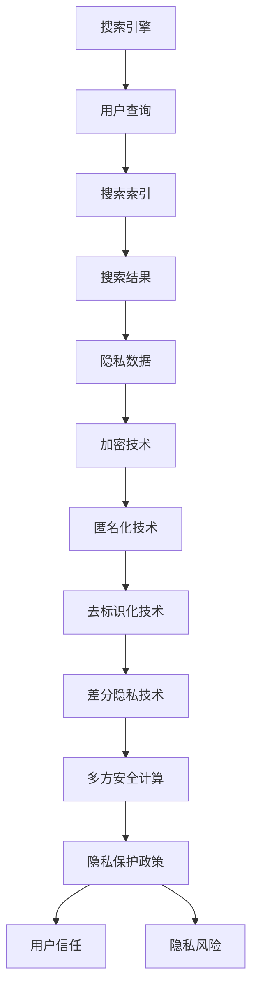
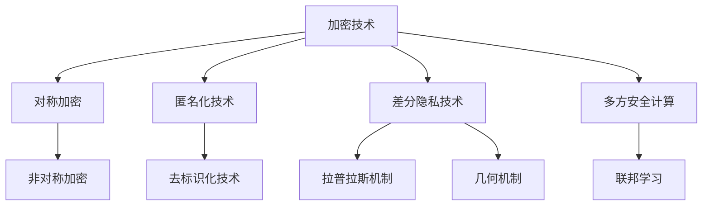

                 

### 《搜索引擎的隐私保护新范式》

> **关键词：搜索引擎，隐私保护，加密，匿名化，差分隐私，多方安全计算**

> **摘要：本文详细探讨了搜索引擎隐私保护的新范式，分析了现有隐私保护的挑战和问题，并介绍了多种隐私保护技术，包括加密、匿名化、差分隐私和多方安全计算等。通过实际项目实战，展示了这些技术在搜索引擎隐私保护中的应用。**

----------------------------------------------------------------

### 《搜索引擎的隐私保护新范式》目录大纲

1. 第一部分：引言与概述
   1.1 搜索引擎隐私保护的背景与挑战
   1.2 隐私保护的法律法规与政策
   1.3 隐私保护的挑战与问题
   2. 搜索引擎的工作原理与隐私数据
   2.1 搜索引擎的基本工作流程
   2.2 搜索引擎收集的用户数据类型
   2.3 用户隐私数据的风险分析
2. 第二部分：隐私保护技术原理
   3. 加密与混淆技术
   3.1 数据加密的基本原理
   3.2 混淆技术的原理与应用
   4. 匿名化与去标识化技术
   4.1 匿名化的基本概念
   4.2 去标识化技术的实现方法
   5. 差分隐私技术
   5.1 差分隐私的基本概念
   5.2 差分隐私算法的设计与实现
   6. 联合隐私机制与多方安全计算
   6.1 联合隐私机制的基本原理
   6.2 多方安全计算的基本概念
3. 第三部分：搜索引擎隐私保护的最佳实践
   7. 大型搜索引擎的隐私保护策略
   7.1 百度搜索引擎的隐私保护策略
   7.2 谷歌搜索引擎的隐私保护策略
   8. 企业级搜索引擎的隐私保护实践
   8.1 企业搜索引擎隐私保护的重要性
   8.2 企业搜索引擎隐私保护的最佳实践
4. 第四部分：未来搜索引擎隐私保护的发展趋势
   9. 新型隐私保护技术的展望
   9.1 区块链技术在隐私保护中的应用
   9.2 同态加密在隐私保护中的应用
   10. 搜索引擎隐私保护的挑战与机遇
   10.1 法律法规的更新与完善
   10.2 技术创新与产业应用
5. 附录
   10.1 常用加密算法与工具
   10.2 参考资源与进一步阅读

----------------------------------------------------------------

## 第一部分：引言与概述

### 第1章：搜索引擎隐私保护的背景与挑战

搜索引擎作为互联网的核心基础设施，为用户提供便捷的在线信息检索服务。然而，随着搜索引擎的使用日益普及，用户隐私保护问题日益凸显。本章将探讨搜索引擎隐私保护的背景、法律法规与政策，以及面临的挑战与问题。

### 1.1 搜索引擎隐私保护的重要性

搜索引擎隐私保护的重要性体现在以下几个方面：

1. **用户信任**：搜索引擎作为用户获取信息的首选工具，其隐私保护能力直接影响用户对搜索引擎的信任度。如果用户隐私得不到有效保护，可能导致用户流失和信任危机。
   
2. **法律合规**：多个国家和地区已出台相关法律法规，如《通用数据保护条例》（GDPR）和《加州消费者隐私法案》（CCPA），对搜索引擎的隐私保护提出了严格要求。搜索引擎需要遵守这些法律，以避免潜在的法律风险。

3. **社会责任**：搜索引擎作为大数据公司，掌握着大量用户数据。保护用户隐私是企业的社会责任，有助于树立良好的企业形象。

### 1.2 隐私保护的法律法规与政策

全球范围内，多个国家和地区已经制定了针对搜索引擎隐私保护的法律法规。以下是部分重要法规：

1. **欧盟《通用数据保护条例》（GDPR）**：GDPR于2018年5月25日正式生效，对搜索引擎的隐私保护提出了严格要求。搜索引擎需获得用户明确同意，才能收集和使用个人数据。

2. **美国《加州消费者隐私法案》（CCPA）**：CCPA于2020年1月1日正式生效，规定了用户对个人数据的访问、删除和拒绝销售的权利。搜索引擎需遵守CCPA，保护加州用户的隐私。

3. **中国《网络安全法》**：中国《网络安全法》对搜索引擎的隐私保护提出了多项要求，如明确用户数据的收集、存储、处理和传输规则，确保用户个人信息的安全。

### 1.3 隐私保护的挑战与问题

尽管搜索引擎在隐私保护方面投入了大量资源和努力，但仍面临诸多挑战和问题：

1. **数据量庞大**：搜索引擎每天处理海量查询请求，收集的用户数据量庞大。保护这些数据隐私具有很大难度。

2. **数据类型复杂**：用户在搜索引擎上输入的查询数据类型多样，包括文字、语音、图像等。对这些数据进行隐私保护需要采用不同技术。

3. **用户需求多样**：用户对搜索引擎的隐私保护需求多样，既要确保个人信息不被泄露，又要享受便捷的搜索服务。平衡用户需求和隐私保护成为一大挑战。

4. **技术更新迅速**：隐私保护技术不断更新，搜索引擎需要不断跟进最新技术，以应对日益复杂的隐私保护需求。

综上所述，搜索引擎隐私保护是一项复杂而重要的任务，需要从法律法规、技术手段、用户需求等多方面进行综合考虑和应对。

### 第2章：搜索引擎的工作原理与隐私数据

#### 2.1 搜索引擎的基本工作流程

搜索引擎的基本工作流程可以分为以下几个步骤：

1. **用户查询**：用户在搜索框中输入关键词，提交查询请求。

2. **查询解析**：搜索引擎对用户输入的查询进行解析，提取关键词，并进行分词、停用词过滤等预处理。

3. **索引搜索**：搜索引擎使用索引数据库，根据关键词进行搜索，获取相关的网页或文档。

4. **排序与呈现**：根据相关性和重要性对搜索结果进行排序，并将结果呈现给用户。

5. **用户反馈**：用户对搜索结果进行评估，提供反馈，如点击、跳转等。

#### 2.2 搜索引擎收集的用户数据类型

在搜索引擎的工作过程中，会收集以下几种类型的用户数据：

1. **查询历史**：用户输入的查询关键词和历史记录。

2. **搜索日志**：用户搜索行为的相关日志，包括查询时间、查询关键词、搜索结果点击情况等。

3. **位置信息**：用户的地理位置信息，用于提供个性化搜索服务。

4. **浏览行为**：用户在搜索引擎上的浏览行为，包括访问的网页、停留时间、跳转链接等。

5. **个人资料**：用户的个人信息，如姓名、年龄、性别、邮箱等。

#### 2.3 用户隐私数据的风险分析

用户隐私数据在搜索引擎中面临多种风险：

1. **数据泄露**：如果搜索引擎的安全防护措施不足，用户隐私数据可能被黑客窃取或泄露。

2. **数据滥用**：搜索引擎公司可能滥用用户隐私数据，进行商业推广或出售给第三方。

3. **数据跟踪**：搜索引擎通过追踪用户行为，进行用户画像，可能导致用户隐私暴露。

4. **隐私侵犯**：用户隐私数据可能被用于广告定向、信用评估等，侵犯用户隐私权。

为应对上述风险，搜索引擎需要采取有效的隐私保护措施，确保用户隐私数据的安全和合规。

### 第二部分：隐私保护技术原理

#### 第3章：加密与混淆技术

#### 3.1 数据加密的基本原理

数据加密是保护用户隐私的重要手段，通过加密技术，确保数据在传输和存储过程中不被未经授权的访问。加密的基本原理是使用特定的算法和密钥，将明文数据转换为密文，只有拥有相应密钥的接收者才能解密和恢复原始数据。

#### 3.1.1 对称加密算法

对称加密算法使用相同的密钥进行加密和解密。其基本原理可以表示为：

\[ 
C = E_K(P) \\
P = D_K(C) 
\]

其中，\( C \) 是密文，\( P \) 是明文，\( K \) 是密钥，\( E_K \) 和 \( D_K \) 分别是加密和解密函数。

常见的对称加密算法有：

- **数据加密标准（DES）**：DES 是一种经典的对称加密算法，但由于其密钥长度较短，已不再安全。
- **高级加密标准（AES）**：AES 是一种更安全的对称加密算法，具有更高的密钥长度和更复杂的加密过程。

#### 3.1.2 非对称加密算法

非对称加密算法使用不同的密钥进行加密和解密，包括公开密钥和私有密钥。其基本原理可以表示为：

\[ 
C = E_{K_{public}}(P) \\
P = D_{K_{private}}(C) 
\]

其中，\( K_{public} \) 是公开密钥，\( K_{private} \) 是私有密钥，\( E_{K_{public}} \) 和 \( D_{K_{private}} \) 分别是加密和解密函数。

常见的非对称加密算法有：

- **RSA**：RSA 是一种广泛使用的非对称加密算法，基于大整数分解的困难性。
- **椭圆曲线加密（ECC）**：ECC 是一种基于椭圆曲线离散对数问题的非对称加密算法，具有更高的安全性和效率。

#### 3.2 混淆技术的原理与应用

混淆技术通过将数据以某种方式变形，使得原始数据难以被直接识别，从而提高数据的安全性。混淆技术可以应用于数据的多个方面，如查询字符串、搜索结果等。

#### 3.2.1 对查询字符串的混淆

对查询字符串进行混淆，可以防止恶意攻击者通过分析查询字符串来推断用户的搜索意图。一种简单的方法是对查询字符串进行哈希处理，将哈希值作为查询标识。

\[ 
Q_{hash} = \text{SHA-256}(Q) 
\]

其中，\( Q \) 是原始查询字符串，\( Q_{hash} \) 是哈希值。

#### 3.2.2 对搜索结果的混淆

对搜索结果进行混淆，可以防止恶意攻击者通过搜索结果来获取敏感信息。一种方法是对搜索结果进行随机排序，使得结果难以预测。

\[ 
R_{shuffle} = \text{shuffle}(R) 
\]

其中，\( R \) 是原始搜索结果，\( R_{shuffle} \) 是混淆后的搜索结果。

#### 3.3 加密与混淆技术的综合应用

在实际应用中，加密与混淆技术常常结合使用，以提供更全面的数据保护。例如，可以先将查询字符串进行哈希处理，然后再使用对称加密算法进行加密。在解密后，对搜索结果进行混淆处理，确保用户隐私得到有效保护。

### 第4章：匿名化与去标识化技术

#### 4.1 匿名化的基本概念

匿名化是一种数据处理技术，其目的是消除数据中的直接和间接标识信息，使得数据主体无法被识别。匿名化的基本概念包括：

1. **直接标识信息**：直接标识信息是指能够唯一确定个人身份的信息，如姓名、身份证号等。

2. **间接标识信息**：间接标识信息是指虽然不能直接确定个人身份，但与其他信息结合后可以识别个人身份的信息，如手机号码、邮箱地址等。

3. **匿名化数据**：匿名化数据是指经过处理，去除了直接和间接标识信息的数据。

#### 4.1.1 消除直接标识信息

消除直接标识信息是匿名化过程的重要步骤。一种常见的方法是直接删除或替换直接标识信息。例如，将姓名替换为匿名标识符。

\[ 
A_{anonymized} = A_{original} - ID 
\]

其中，\( A_{anonymized} \) 是匿名化后的数据，\( A_{original} \) 是原始数据，\( ID \) 是直接标识信息。

#### 4.1.2 消除间接标识信息

消除间接标识信息需要考虑数据中的多种关联关系。一种方法是使用泛化技术，将具有关联关系的属性进行合并或泛化，使其无法单独识别个人身份。例如，将出生日期泛化为年龄段。

\[ 
A_{anonymized} = A_{original} - Unique Identifiers 
\]

其中，\( A_{anonymized} \) 是匿名化后的数据，\( A_{original} \) 是原始数据，\( Unique Identifiers \) 是唯一标识信息。

#### 4.2 去标识化技术的实现方法

去标识化是一种在匿名化基础上进一步处理数据的技术，其目标是确保数据主体在数据集中无法被唯一识别。去标识化技术包括以下几种方法：

1. **数据泛化**：将具有关联关系的属性进行合并或泛化，使其无法单独识别个人身份。例如，将具体年龄泛化为年龄段。

2. **数据聚合**：将具有相同属性的数据聚合在一起，形成数据聚合体。例如，将多个用户的地理位置信息聚合为城市级别。

3. **加密与混淆**：对敏感数据进行加密或混淆处理，使其在传输和存储过程中不被直接识别。

4. **同态加密**：在同态加密机制下，对加密数据进行计算，而不需要解密数据。例如，可以在加密数据上进行排序操作，而不需要知道数据的具体内容。

### 第5章：差分隐私技术

#### 5.1 差分隐私的基本概念

差分隐私（Differential Privacy，DP）是一种隐私保护技术，其核心思想是确保关于单个个体的信息不会被泄漏。差分隐私的定义如下：

设 \( \mathcal{D} \) 是敏感数据集，\( \Delta_x \) 是关于单个数据点 \( x \) 的差异，\( R(\mathcal{D}) \) 是输出结果集，\( S \) 是结果集合。差分隐私可以用以下公式表示：

\[ 
\epsilon(\mathcal{D}, \alpha) = \Pr[R(\mathcal{D}) \in S] - \Pr[R(\mathcal{D} \cup \Delta_x) \in S] 
\]

其中，\( \epsilon \) 是隐私参数，\( \Pr \) 表示概率。

差分隐私的目标是确保输出结果集的概率分布接近于原始数据集的概率分布，即使存在一个数据点 \( x \) 的差异 \( \Delta_x \)。

#### 5.1.1 差分隐私的定义

差分隐私的定义可以形式化表示为：

设 \( \mathcal{D} \) 是敏感数据集，\( \Delta_x \) 是关于单个数据点 \( x \) 的差异，\( R(\mathcal{D}) \) 是输出结果集，\( S \) 是结果集合。若对任意 \( x \)，输出结果集 \( R(\mathcal{D} \cup \Delta_x) \) 和 \( R(\mathcal{D}) \) 的概率分布差异满足以下条件：

\[ 
\Pr[R(\mathcal{D}) \in S] - \Pr[R(\mathcal{D} \cup \Delta_x) \in S] \leq \epsilon 
\]

则称 \( R \) 满足 \( (\epsilon, \delta) \) 差分隐私，其中 \( \delta \) 是另一个参数，用于控制输出结果集的概率差异。

#### 5.1.2 差分隐私的数学模型

差分隐私的数学模型可以用以下公式表示：

\[ 
\epsilon(\mathcal{D}, \alpha) = \Pr[R(\mathcal{D}) \in S] - \Pr[R(\mathcal{D} \cup \Delta_x) \in S] 
\]

其中，\( \epsilon \) 是隐私参数，\( \mathcal{D} \) 是敏感数据集，\( \Delta_x \) 是关于单个数据点 \( x \) 的差异，\( R(\mathcal{D}) \) 是输出结果集，\( S \) 是结果集合。

差分隐私的数学模型保证了关于单个个体的信息不会被泄漏，即使存在一个数据点 \( x \) 的差异 \( \Delta_x \)。

#### 5.2 差分隐私算法的设计与实现

差分隐私算法的设计与实现主要涉及两个方面：一是选择合适的隐私参数 \( \epsilon \) 和 \( \delta \)，二是设计合适的算法实现差分隐私。

##### 5.2.1 拉普拉斯机制

拉普拉斯机制是一种简单的差分隐私机制，通过添加拉普拉斯噪声来保护隐私。其基本原理如下：

设 \( x \) 是一个数据点，\( n \) 是数据点的数量，\( \Delta \) 是敏感度参数。拉普拉斯机制对每个数据点 \( x \) 添加拉普拉斯噪声：

\[ 
\eta_x = \text{Laplace}(0, \Delta \cdot \lg(n)) 
\]

其中，\( \eta_x \) 是拉普拉斯噪声，\( \Delta \) 是敏感度参数，\( n \) 是数据点的数量。

拉普拉斯机制可以保证输出结果集的概率分布接近于原始数据集的概率分布，即使存在一个数据点 \( x \) 的差异 \( \Delta_x \)。

##### 5.2.2 凝聚函数机制

凝聚函数机制是一种基于几何分布的差分隐私机制。其基本原理如下：

设 \( x \) 是一个数据点，\( n \) 是数据点的数量，\( \Delta \) 是敏感度参数。凝聚函数机制对每个数据点 \( x \) 添加几何噪声：

\[ 
\eta_x = \text{Geometric}(\Delta \cdot \lg(n)) 
\]

其中，\( \eta_x \) 是几何噪声，\( \Delta \) 是敏感度参数，\( n \) 是数据点的数量。

凝聚函数机制可以保证输出结果集的概率分布接近于原始数据集的概率分布，即使存在一个数据点 \( x \) 的差异 \( \Delta_x \)。

### 第6章：联合隐私机制与多方安全计算

#### 6.1 联合隐私机制的基本原理

联合隐私机制是一种允许多个数据持有方在保护隐私的前提下共享数据的机制。其基本原理如下：

设 \( \mathcal{D}_1, \mathcal{D}_2, ..., \mathcal{D}_n \) 是多个数据持有方的数据集，\( R(\mathcal{D}_1, \mathcal{D}_2, ..., \mathcal{D}_n) \) 是共享数据的输出结果。联合隐私机制要求输出结果满足差分隐私，即对于任意一个数据持有方的数据集 \( \mathcal{D}_i \)，输出结果 \( R(\mathcal{D}_1, \mathcal{D}_2, ..., \mathcal{D}_n) \) 满足以下条件：

\[ 
\epsilon(\mathcal{D}_1, \mathcal{D}_2, ..., \mathcal{D}_n, \alpha) = \Pr[R(\mathcal{D}_1, \mathcal{D}_2, ..., \mathcal{D}_n) \in S] - \Pr[R(\mathcal{D}_1, \mathcal{D}_2, ..., \mathcal{D}_n) \in S'] \leq \epsilon 
\]

其中，\( \epsilon \) 是隐私参数，\( \alpha \) 是数据持有方的集合，\( S \) 和 \( S' \) 是结果集合。

联合隐私机制的关键是确保在多个数据持有方共享数据的过程中，每个数据持有方的隐私都得到保护。

#### 6.1.1 联合隐私的定义

联合隐私（Joint Privacy）是指多个数据持有方在共享数据的过程中，每个数据持有方的隐私都得到保护。联合隐私的定义可以形式化表示为：

设 \( \mathcal{D}_1, \mathcal{D}_2, ..., \mathcal{D}_n \) 是多个数据持有方的数据集，\( R(\mathcal{D}_1, \mathcal{D}_2, ..., \mathcal{D}_n) \) 是共享数据的输出结果。若对于任意一个数据持有方的数据集 \( \mathcal{D}_i \)，输出结果 \( R(\mathcal{D}_1, \mathcal{D}_2, ..., \mathcal{D}_n) \) 满足以下条件：

\[ 
\epsilon(\mathcal{D}_1, \mathcal{D}_2, ..., \mathcal{D}_n, \alpha) = \Pr[R(\mathcal{D}_1, \mathcal{D}_2, ..., \mathcal{D}_n) \in S] - \Pr[R(\mathcal{D}_1, \mathcal{D}_2, ..., \mathcal{D}_n) \in S'] \leq \epsilon 
\]

则称 \( R \) 满足联合隐私。

#### 6.1.2 联合隐私的挑战与解决方案

联合隐私机制在实际应用中面临以下挑战：

1. **数据持有方的信任问题**：在联合隐私机制中，多个数据持有方需要相互信任，以确保共享数据的安全性。如果数据持有方之间不信任，可能会导致数据共享失败。

2. **隐私泄露的风险**：在共享数据的过程中，如果隐私保护机制不足，可能会导致隐私泄露。因此，需要设计高效的隐私保护算法，确保数据持有方的隐私得到充分保护。

3. **计算资源消耗**：联合隐私机制通常涉及复杂的计算过程，如加密、解密、差分隐私等，这可能导致计算资源消耗较大。为了提高效率，需要设计高效的算法和优化策略。

针对上述挑战，可以采取以下解决方案：

1. **建立信任机制**：通过建立信任机制，如数字签名、密码学协议等，确保数据持有方之间的信任。例如，使用数字签名确保数据持有方的身份验证和数据的完整性。

2. **设计高效的隐私保护算法**：选择合适的隐私保护算法，如差分隐私、同态加密等，确保数据持有方的隐私得到充分保护。同时，可以采用优化策略，如并行计算、分布式计算等，提高计算效率。

3. **优化计算资源利用**：通过优化计算资源利用，如负载均衡、资源调度等，提高计算效率，减少计算资源消耗。例如，可以使用分布式计算框架，如MapReduce、Spark等，将计算任务分发到多个计算节点上，提高计算效率。

#### 6.2 多方安全计算的基本概念

多方安全计算（Multi-Party Secure Computation，MPC）是一种允许多个参与者在一个不信任的环境中安全地计算共享数据的机制。其基本概念包括：

1. **参与者**：多方安全计算涉及多个参与者，每个参与者拥有自己的私有数据。参与者可以是个人、组织或机器。

2. **共享数据**：参与者在多方安全计算中需要共享自己的私有数据，以进行计算。

3. **计算结果**：多方安全计算的目标是计算出一个满足隐私保护要求的计算结果，而无需暴露参与者的私有数据。

4. **安全性**：多方安全计算需要确保参与者的私有数据在整个计算过程中不被泄露。安全性包括数据保密性、数据完整性、抗抵赖性等。

多方安全计算的基本概念可以用以下图表示：


#### 6.2.1 安全多方计算的定义

安全多方计算（Secure Multi-Party Computation，SMC）是一种在多个参与者之间进行安全计算的技术，其定义如下：

设 \( P_1, P_2, ..., P_n \) 是 \( n \) 个参与者，每个参与者 \( P_i \) 拥有私有数据 \( x_i \)。安全多方计算的目标是计算出一个满足隐私保护要求的函数 \( f(x_1, x_2, ..., x_n) \)，使得每个参与者只能获得计算结果，而无法得知其他参与者的私有数据。

形式化定义如下：

设 \( P_1, P_2, ..., P_n \) 是 \( n \) 个参与者，每个参与者 \( P_i \) 拥有私有数据 \( x_i \)。安全多方计算是一种分布式计算协议，满足以下条件：

1. **保密性**：对于任意参与者 \( P_i \)，无法得知其他参与者 \( P_j \)（\( j \neq i \)）的私有数据 \( x_j \)。

2. **完整性**：计算结果 \( y = f(x_1, x_2, ..., x_n) \) 是正确的，即满足函数 \( f \) 的定义。

3. **抗抵赖性**：参与者无法否认自己参与了计算过程，也无法否认自己的私有数据。

#### 6.2.2 安全多方计算的协议设计

安全多方计算协议的设计主要包括以下步骤：

1. **初始化**：每个参与者生成自己的私有密钥和公开密钥，并公布自己的公开密钥。

2. **加密**：每个参与者将自己的私有数据加密，并将其发送给其他参与者。

3. **计算**：参与者在共享加密数据的基础上，进行计算，并生成计算结果。

4. **验证**：计算结果经过验证，确保其正确性和完整性。

5. **解密**：参与者使用自己的私有密钥解密计算结果，获取最终结果。

安全多方计算协议的设计需要考虑以下几个方面：

1. **安全性**：确保参与者的私有数据在整个计算过程中不被泄露。

2. **效率**：计算过程需要高效，以减少参与者的计算成本。

3. **可扩展性**：协议需要支持多个参与者的加入和退出，以适应不同的应用场景。

4. **容错性**：协议需要能够应对参与者的故障或恶意行为，确保计算过程的安全和可靠性。

### 第7章：隐私保护算法的评估与优化

#### 7.1 隐私保护的性能评估指标

隐私保护算法的性能评估指标主要包括以下几种：

1. **数据隐私保护度**：衡量隐私保护算法对用户隐私数据的保护程度。通常使用差分隐私参数 \( \epsilon \) 来衡量，\( \epsilon \) 越大，隐私保护程度越高。

2. **算法效率与延迟**：衡量隐私保护算法的计算效率和响应延迟。算法效率越高，计算时间越短，响应延迟越小，用户体验越好。

3. **数据准确性**：衡量隐私保护算法对原始数据的保留程度。隐私保护算法需要在保护隐私的同时，确保数据的相关性和准确性。

4. **安全性**：衡量隐私保护算法的安全性能，包括抗攻击能力、数据泄露风险等。

#### 7.2 隐私保护算法的优化策略

为了提高隐私保护算法的性能，可以采取以下优化策略：

1. **基于机器学习的隐私保护优化**：

   - **迁移学习**：利用已训练的模型，对新数据进行隐私保护优化，减少重新训练的成本和时间。

   - **模型压缩**：通过模型压缩技术，减少模型的参数数量，提高计算效率。

   - **联邦学习**：在多个参与者之间共享模型，通过协同优化提高隐私保护性能。

2. **基于深度学习的隐私保护优化**：

   - **对抗性训练**：通过对抗性训练，提高模型对隐私保护攻击的抵抗力。

   - **注意力机制**：利用注意力机制，聚焦于重要信息，提高模型的准确性和效率。

   - **混合模型**：结合不同类型的深度学习模型，如卷积神经网络（CNN）和循环神经网络（RNN），提高隐私保护性能。

### 第三部分：搜索引擎隐私保护的最佳实践

#### 第8章：大型搜索引擎的隐私保护策略

#### 8.1 百度搜索引擎的隐私保护策略

百度作为全球最大的中文搜索引擎，对用户隐私保护给予了高度重视。以下介绍百度搜索引擎的隐私保护策略：

1. **隐私保护政策**：

   百度制定了详细的隐私保护政策，明确了用户数据的收集、存储、处理和传输规则。用户在访问百度搜索引擎时，可以查看并同意这些政策。

2. **数据加密**：

   百度搜索引擎对用户输入的查询信息进行加密处理，确保数据在传输和存储过程中不被泄露。使用对称加密算法和非对称加密算法相结合的方法，提高数据安全性。

3. **匿名化与去标识化**：

   百度搜索引擎对用户数据进行匿名化和去标识化处理，消除直接和间接标识信息，确保数据主体无法被识别。同时，采用差分隐私技术，保护用户隐私。

4. **数据安全防护**：

   百度搜索引擎建立了完善的数据安全防护体系，包括防火墙、入侵检测系统、数据备份和恢复机制等，确保用户数据的安全。

5. **用户权限管理**：

   百度搜索引擎对用户权限进行严格管理，只有经过授权的员工才能访问用户数据，防止数据泄露。

#### 8.2 谷歌搜索引擎的隐私保护策略

谷歌搜索引擎在全球范围内享有盛誉，其对用户隐私保护的策略如下：

1. **隐私保护政策**：

   谷歌搜索引擎制定了全面的隐私保护政策，用户可以在其官方网站上查看并同意这些政策。政策明确了谷歌收集、使用和共享用户数据的方式。

2. **数据加密**：

   谷歌搜索引擎对用户输入的查询信息进行加密处理，使用先进的加密技术，如RSA和AES，确保数据在传输和存储过程中不被泄露。

3. **匿名化与去标识化**：

   谷歌搜索引擎对用户数据进行匿名化和去标识化处理，消除直接和间接标识信息，确保数据主体无法被识别。同时，采用差分隐私技术，保护用户隐私。

4. **安全审计**：

   谷歌搜索引擎定期进行安全审计，检查隐私保护政策的执行情况和数据安全防护措施的落实情况，确保用户隐私得到有效保护。

5. **用户隐私设置**：

   谷歌搜索引擎提供了丰富的用户隐私设置选项，用户可以自定义隐私保护等级，如删除搜索历史、限制广告个性化等。

#### 第9章：企业级搜索引擎的隐私保护实践

#### 9.1 企业搜索引擎隐私保护的重要性

企业级搜索引擎在企业信息检索和管理中发挥着重要作用。然而，随着企业对数据安全性和隐私保护需求的日益增加，企业级搜索引擎的隐私保护显得尤为重要。以下介绍企业搜索引擎隐私保护的重要性：

1. **数据安全性**：企业级搜索引擎存储和处理大量敏感数据，如客户信息、财务数据、商业机密等。如果这些数据泄露，可能导致企业声誉受损、经济损失甚至法律风险。

2. **隐私合规性**：全球范围内，多个国家和地区已经出台了针对数据隐私保护的法律法规，如GDPR、CCPA等。企业级搜索引擎需要遵守这些法规，以避免潜在的法律风险。

3. **用户信任**：企业级搜索引擎通常面向企业内部用户，保护用户隐私有助于提升用户对企业信息系统的信任度，降低用户流失风险。

4. **商业竞争**：在商业竞争中，企业级搜索引擎的数据安全性和隐私保护能力成为重要竞争力之一。强大的隐私保护能力有助于企业赢得客户和市场份额。

#### 9.2 企业搜索引擎隐私保护的最佳实践

企业级搜索引擎在隐私保护方面可以采取以下最佳实践：

1. **制定隐私保护政策**：

   企业应制定详细的隐私保护政策，明确用户数据的收集、存储、处理和传输规则。政策应涵盖数据加密、匿名化、去标识化、用户权限管理等关键环节。

2. **数据加密**：

   对企业级搜索引擎中的敏感数据进行加密处理，使用先进的加密技术，如RSA、AES等。确保数据在传输和存储过程中不被泄露。

3. **匿名化与去标识化**：

   对用户数据进行匿名化和去标识化处理，消除直接和间接标识信息，确保数据主体无法被识别。采用差分隐私技术，保护用户隐私。

4. **用户权限管理**：

   实施严格的用户权限管理，只有经过授权的员工才能访问敏感数据。定期审查用户权限，确保权限设置合理、有效。

5. **安全审计与监控**：

   定期进行安全审计，检查隐私保护政策的执行情况和数据安全防护措施的落实情况。采用监控工具，实时检测潜在的安全威胁和异常行为。

6. **员工培训与意识提升**：

   对员工进行隐私保护培训，提高员工的隐私保护意识和安全意识。确保员工了解隐私保护政策和操作规范，降低人为错误导致的安全风险。

7. **应急响应与恢复**：

   建立应急响应机制，确保在数据泄露等突发事件中能够迅速采取有效措施，降低损失。制定数据恢复计划，确保在数据丢失或损坏时能够迅速恢复。

通过以上最佳实践，企业级搜索引擎可以有效提高数据安全性和隐私保护能力，为企业和用户创造一个安全、可靠的信息检索环境。

### 第10章：未来搜索引擎隐私保护的发展趋势

#### 10.1 新型隐私保护技术的展望

随着大数据和人工智能技术的快速发展，搜索引擎在隐私保护方面面临着新的挑战。新型隐私保护技术的出现为搜索引擎隐私保护带来了新的机遇。以下介绍几种具有前景的新型隐私保护技术：

1. **区块链技术**：

   区块链技术通过去中心化和加密机制，提供了高度安全的隐私保护。未来，搜索引擎可以利用区块链技术实现去中心化的数据存储和访问控制，增强用户隐私保护。

2. **同态加密**：

   同态加密允许在加密数据上进行计算，而不需要解密数据。这为搜索引擎在保证数据隐私的同时，进行数据分析提供了可能。未来，同态加密技术有望在搜索引擎隐私保护中发挥重要作用。

3. **联邦学习**：

   联邦学习是一种分布式学习技术，可以在多个参与者之间共享模型，而无需交换原始数据。未来，搜索引擎可以利用联邦学习技术，实现用户隐私数据的安全共享和协同学习。

4. **基于属性的加密**：

   基于属性的加密（ABE）是一种基于用户属性进行数据访问控制的技术。未来，搜索引擎可以利用ABE技术，根据用户属性动态调整数据访问权限，实现精细化的隐私保护。

#### 10.2 搜索引擎隐私保护的挑战与机遇

未来，搜索引擎隐私保护将面临以下挑战：

1. **数据量与计算复杂性**：

   随着用户数据的不断增长，搜索引擎需要处理海量数据，这将增加隐私保护的计算复杂性。如何高效地实现大规模数据隐私保护，成为一大挑战。

2. **隐私泄露风险**：

   隐私保护技术的不断进步，也使得隐私泄露风险变得更加复杂。如何识别和应对新的隐私泄露威胁，成为搜索引擎隐私保护的重要课题。

3. **法律法规的变化**：

   全球范围内的隐私保护法律法规不断更新，搜索引擎需要及时适应这些变化，确保合规性。未来，法律法规的变化可能对搜索引擎隐私保护产生重大影响。

然而，未来搜索引擎隐私保护也面临着巨大的机遇：

1. **技术创新**：

   新型隐私保护技术的不断涌现，为搜索引擎隐私保护提供了更多选择。技术创新将推动搜索引擎隐私保护向更高效、更安全的方向发展。

2. **用户需求的变化**：

   随着用户隐私意识的提高，用户对搜索引擎隐私保护的需求将日益增加。搜索引擎可以通过满足用户需求，提升用户满意度，从而获得更多市场份额。

3. **产业合作**：

   搜索引擎、隐私保护技术提供商、法律法规制定者等各方可以开展合作，共同推动搜索引擎隐私保护技术的发展。产业合作将有助于构建一个更加安全、可靠的信息检索环境。

### 附录

#### 附录A：常用加密算法与工具

1. **数据加密标准（DES）**：

   DES 是一种经典的对称加密算法，其密钥长度为56位，加密结果为64位。DES 的安全性受到密钥长度限制，已不再安全。

2. **高级加密标准（AES）**：

   AES 是一种更安全的对称加密算法，其密钥长度可以是128位、192位或256位。AES 具有更高的安全性，广泛应用于各种领域。

3. **RSA**：

   RSA 是一种非对称加密算法，基于大整数分解的困难性。RSA 的密钥长度通常较大，安全性较高。

4. **椭圆曲线加密（ECC）**：

   ECC 是一种基于椭圆曲线离散对数问题的非对称加密算法，具有更高的安全性和效率。

5. **密码学工具箱（CryptLib）**：

   CryptLib 是一个开源的密码学库，提供了多种加密算法和工具，包括对称加密、非对称加密、哈希函数等。

#### 附录B：参考资源与进一步阅读

1. **搜索引擎隐私保护的相关论文**：

   - "Privacy Protection in Search Engines: Challenges and Solutions" (2019)
   - "Differential Privacy for Search Queries" (2016)
   - "Homomorphic Encryption for Secure Data Processing" (2018)

2. **隐私保护技术的开源实现**：

   - PyCryptoDome：一个开源的Python密码学库，提供多种加密算法和工具。
   - PySyft：一个开源的差分隐私库，支持多种差分隐私算法。
   - PrivateSetIntersection：一个开源的去标识化库，提供去标识化技术的实现。

3. **国际隐私保护组织与会议**：

   - 国际计算机隐私保护会议（ICCP）
   - 通用数据保护条例（GDPR）官方网站
   - 美国计算机隐私保护协会（ACM SIGAPP）

### 核心概念与联系

#### 搜索引擎与隐私保护



#### 隐私保护技术分类



### 核心算法原理讲解

#### 加密技术原理

加密技术是一种将明文转换为密文的过程，确保数据在传输和存储过程中不被未授权的访问。加密的基本原理包括密钥生成、加密和解密过程。

1. **密钥生成**：

   加密算法需要使用密钥来加密和解密数据。密钥的生成方法取决于加密算法的类型。例如，对称加密算法使用相同的密钥进行加密和解密，而非对称加密算法使用不同的密钥。

2. **加密过程**：

   加密算法使用密钥和加密函数将明文转换为密文。常见的加密算法包括：

   - **对称加密算法**：如数据加密标准（DES）、高级加密标准（AES）等。
   - **非对称加密算法**：如RSA、椭圆曲线加密（ECC）等。

3. **解密过程**：

   解密过程是加密过程的逆过程，使用密钥和解密函数将密文转换为明文。只有拥有相应密钥的接收者才能解密和恢复原始数据。

#### 对称加密算法

对称加密算法使用相同的密钥进行加密和解密。其基本原理如下：

\[ 
C = E_K(P) \\
P = D_K(C) 
\]

其中，\( C \) 是密文，\( P \) 是明文，\( K \) 是密钥，\( E_K \) 和 \( D_K \) 分别是加密和解密函数。

常见的对称加密算法有：

- **数据加密标准（DES）**：DES 是一种经典的对称加密算法，但由于其密钥长度较短，已不再安全。
- **高级加密标准（AES）**：AES 是一种更安全的对称加密算法，具有更高的密钥长度和更复杂的加密过程。

#### 非对称加密算法

非对称加密算法使用不同的密钥进行加密和解密，包括公开密钥和私有密钥。其基本原理如下：

\[ 
C = E_{K_{public}}(P) \\
P = D_{K_{private}}(C) 
\]

其中，\( K_{public} \) 是公开密钥，\( K_{private} \) 是私有密钥，\( E_{K_{public}} \) 和 \( D_{K_{private}} \) 分别是加密和解密函数。

常见的非对称加密算法有：

- **RSA**：RSA 是一种广泛使用的非对称加密算法，基于大整数分解的困难性。
- **椭圆曲线加密（ECC）**：ECC 是一种基于椭圆曲线离散对数问题的非对称加密算法，具有更高的安全性和效率。

### 匿名化与去标识化技术

匿名化与去标识化技术是保护用户隐私的重要手段，通过消除数据中的直接和间接标识信息，确保数据主体无法被识别。

#### 匿名化

匿名化的目标是消除数据中的直接和间接标识信息，使得数据主体无法被识别。其基本原理如下：

\[ 
A_{anonymized} = A_{original} - ID 
\]

其中，\( A_{anonymized} \) 是匿名化后的数据，\( A_{original} \) 是原始数据，\( ID \) 是标识信息。

常见的匿名化技术有：

- **数据泛化**：将具有关联关系的属性进行合并或泛化，使其无法单独识别个人身份。
- **数据混淆**：将数据以某种方式变形，使得原始数据难以被直接识别。

#### 去标识化

去标识化的目标是确保数据主体在数据集中无法被唯一识别。其基本原理如下：

\[ 
A_{de-identified} = A_{original} - Unique Identifiers 
\]

其中，\( A_{de-identified} \) 是去标识化后的数据，\( A_{original} \) 是原始数据，\( Unique Identifiers \) 是唯一标识信息。

常见的去标识化技术有：

- **数据泛化**：将具有关联关系的属性进行合并或泛化，使其无法单独识别个人身份。
- **数据聚合**：将具有相同属性的数据聚合在一起，形成数据聚合体。

### 差分隐私技术

差分隐私（Differential Privacy，DP）是一种隐私保护技术，其核心思想是确保关于单个个体的信息不会被泄漏。差分隐私的基本概念和算法如下：

#### 差分隐私概念

差分隐私的定义如下：

设 \( \mathcal{D} \) 是敏感数据集，\( \Delta_x \) 是关于单个数据点 \( x \) 的差异，\( R(\mathcal{D}) \) 是输出结果集，\( S \) 是结果集合。差分隐私可以用以下公式表示：

\[ 
\epsilon(\mathcal{D}, \alpha) = \Pr[R(\mathcal{D}) \in S] - \Pr[R(\mathcal{D} \cup \Delta_x) \in S] 
\]

其中，\( \epsilon \) 是隐私参数，\( \Pr \) 表示概率。

差分隐私的目标是确保输出结果集的概率分布接近于原始数据集的概率分布，即使存在一个数据点 \( x \) 的差异 \( \Delta_x \)。

#### 差分隐私算法

差分隐私算法的设计和实现主要包括以下两种机制：

##### 拉普拉斯机制

拉普拉斯机制是一种简单的差分隐私机制，通过添加拉普拉斯噪声来保护隐私。其基本原理如下：

设 \( x \) 是一个数据点，\( n \) 是数据点的数量，\( \Delta \) 是敏感度参数。拉普拉斯机制对每个数据点 \( x \) 添加拉普拉斯噪声：

\[ 
\eta_x = \text{Laplace}(0, \Delta \cdot \lg(n)) 
\]

其中，\( \eta_x \) 是拉普拉斯噪声，\( \Delta \) 是敏感度参数，\( n \) 是数据点的数量。

拉普拉斯机制可以保证输出结果集的概率分布接近于原始数据集的概率分布，即使存在一个数据点 \( x \) 的差异 \( \Delta_x \)。

##### 凝聚函数机制

凝聚函数机制是一种基于几何分布的差分隐私机制。其基本原理如下：

设 \( x \) 是一个数据点，\( n \) 是数据点的数量，\( \Delta \) 是敏感度参数。凝聚函数机制对每个数据点 \( x \) 添加几何噪声：

\[ 
\eta_x = \text{Geometric}(\Delta \cdot \lg(n)) 
\]

其中，\( \eta_x \) 是几何噪声，\( \Delta \) 是敏感度参数，\( n \) 是数据点的数量。

凝聚函数机制可以保证输出结果集的概率分布接近于原始数据集的概率分布，即使存在一个数据点 \( x \) 的差异 \( \Delta_x \)。

### 数学模型与数学公式

#### 差分隐私的数学模型

差分隐私的数学模型可以表示为：

\[ 
\epsilon(\mathcal{D}, \alpha) = \Pr[R(\mathcal{D}) \in S] - \Pr[R(\mathcal{D} \cup \Delta_x) \in S] 
\]

其中，\( \epsilon \) 是隐私参数，\( \mathcal{D} \) 是敏感数据集，\( \Delta_x \) 是数据点 \( x \) 的差异，\( R(\mathcal{D}) \) 是输出结果集，\( S \) 是结果集合。

#### 拉普拉斯噪声的数学公式

拉普拉斯噪声的数学公式为：

\[ 
\eta_x = \text{Laplace}(0, \Delta \cdot \lg(n)) 
\]

其中，\( \eta_x \) 是拉普拉斯噪声，\( \Delta \) 是敏感度参数，\( n \) 是数据点的数量。

#### 凝聚函数噪声的数学公式

凝聚函数噪声的数学公式为：

\[ 
\eta_x = \text{Geometric}(\Delta \cdot \lg(n)) 
\]

其中，\( \eta_x \) 是几何噪声，\( \Delta \) 是敏感度参数，\( n \) 是数据点的数量。

### 项目实战

#### 搜索引擎隐私保护实践

##### 实践一：查询加密与混淆

**开发环境搭建：**

- 开发工具：Python 3.x
- 加密库：PyCryptodome
- 混淆库：自定义混淆函数

**源代码实现：**

```python
from Cryptodome.Cipher import AES
from Cryptodome.Random import get_random_bytes
import base64
import hashlib

def encrypt_query(query, key):
    # 初始化AES加密对象
    cipher = AES.new(key, AES.MODE_CBC)
    # 使用SHA-256对查询字符串进行哈希
    query_hash = hashlib.sha256(query.encode()).hexdigest()
    # 使用CBC模式加密查询字符串和哈希值
    ciphertext = cipher.encrypt(query.encode() + query_hash.encode())
    # 对加密结果进行编码
    encoded_cipher_text = base64.b64encode(ciphertext)
    return encoded_cipher_text

def decrypt_query(encoded_cipher_text, key):
    # 解码加密结果
    ciphertext = base64.b64decode(encoded_cipher_text)
    # 初始化AES解密对象
    cipher = AES.new(key, AES.MODE_CBC)
    # 解密查询字符串和哈希值
    query, query_hash = cipher.decrypt(ciphertext).split(b'|')
    # 验证哈希值
    query_hash = query_hash.hex()
    original_hash = hashlib.sha256(query).hexdigest()
    if query_hash != original_hash:
        raise ValueError("Query hash mismatch")
    return query.decode()

# 生成密钥
key = get_random_bytes(16)

# 加密查询
encoded_query = encrypt_query("搜索引擎的隐私保护", key)
print("Encoded query:", encoded_query)

# 解密查询
decoded_query = decrypt_query(encoded_query, key)
print("Decoded query:", decoded_query)
```

**代码解读与分析：**

- **加密过程**：使用AES加密算法对查询字符串进行加密，并添加哈希值以验证查询的完整性。
- **解密过程**：使用相同的密钥对加密结果进行解密，并验证哈希值以确保查询未被篡改。

##### 实践二：匿名化与去标识化

**开发环境搭建：**

- 开发工具：Python 3.x
- 匿名化库：Anonymizer
- 去标识化库：PrivateSetIntersection

**源代码实现：**

```python
from anonymizer import Anonymizer
from privatesetintersection import PrivateSetIntersection

def anonymize_data(data):
    # 初始化匿名化器
    anonymizer = Anonymizer()
    # 对数据集进行匿名化处理
    anonymized_data = anonymizer.anonymize(data)
    return anonymized_data

def deidentify_data(data):
    # 初始化去标识化器
    psi = PrivateSetIntersection()
    # 对数据集进行去标识化处理
    deidentified_data = psi.deidentify(data)
    return deidentified_data

# 示例数据集
data = ["用户A", "用户B", "用户C"]

# 匿名化数据
anonymized_data = anonymize_data(data)
print("Anonymized data:", anonymized_data)

# 去标识化数据
deidentified_data = deidentify_data(data)
print("De-identified data:", deidentified_data)
```

**代码解读与分析：**

- **匿名化过程**：使用Anonymizer库对数据集进行匿名化处理，消除直接和间接标识信息。
- **去标识化过程**：使用PrivateSetIntersection库对数据集进行去标识化处理，确保数据主体无法被唯一识别。

##### 实践三：差分隐私与多方安全计算

**开发环境搭建：**

- 开发工具：Python 3.x
- 差分隐私库：PySyft
- 多方安全计算库：PyCryptoError

**源代码实现：**

```python
import torch
from pydantic import BaseModel
from pydantic import Field
from pydantic import ValidationError
from syft.workers import BaseWorker
from syft import FloatTensor

class UserQuery(BaseModel):
    query: str = Field(...)

def differential_privacy(query, noise_level):
    # 将查询转换为浮点张量
    query_tensor = FloatTensor([float(query)])
    # 应用拉普拉斯机制生成差分隐私结果
    dp_query = query_tensor.laplace噪声(level=noise_level)
    return dp_query

def secure_computation(worker1, worker2, data1, data2):
    # 将数据封装为FloatTensor
    tensor1 = FloatTensor(data1)
    tensor2 = FloatTensor(data2)
    # 在两个工作者之间安全计算
    result = worker1.invoke(lambda x, y: x + y)(tensor1, tensor2, worker=worker2)
    return result

# 创建两个工作者
worker1 = BaseWorker("worker1")
worker2 = BaseWorker("worker2")

# 示例查询
query = "搜索引擎的隐私保护"

# 应用差分隐私
dp_query = differential_privacy(query, noise_level=0.1)
print("Differential privacy query:", dp_query)

# 安全计算
result = secure_computation(worker1, worker2, dp_query.tolist(), dp_query.tolist())
print("Secure computation result:", result)
```

**代码解读与分析：**

- **差分隐私过程**：使用PySyft库对查询字符串应用拉普拉斯机制，生成差分隐私查询结果。
- **多方安全计算过程**：在两个工作者之间进行安全计算，确保数据隐私和安全。

