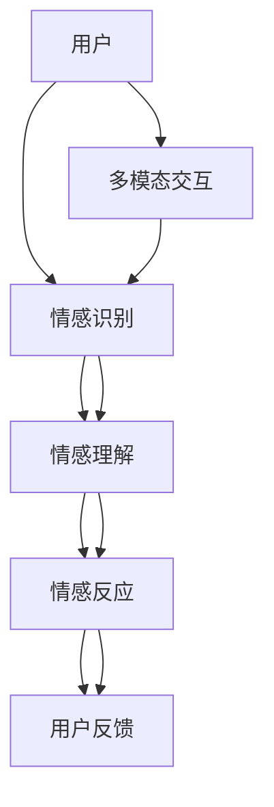
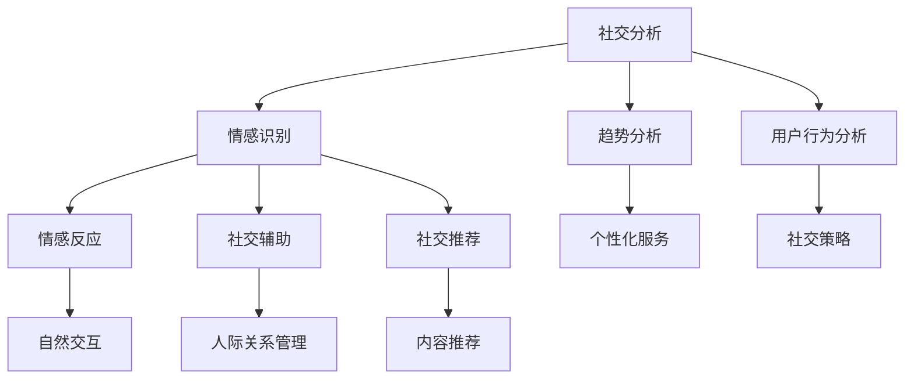
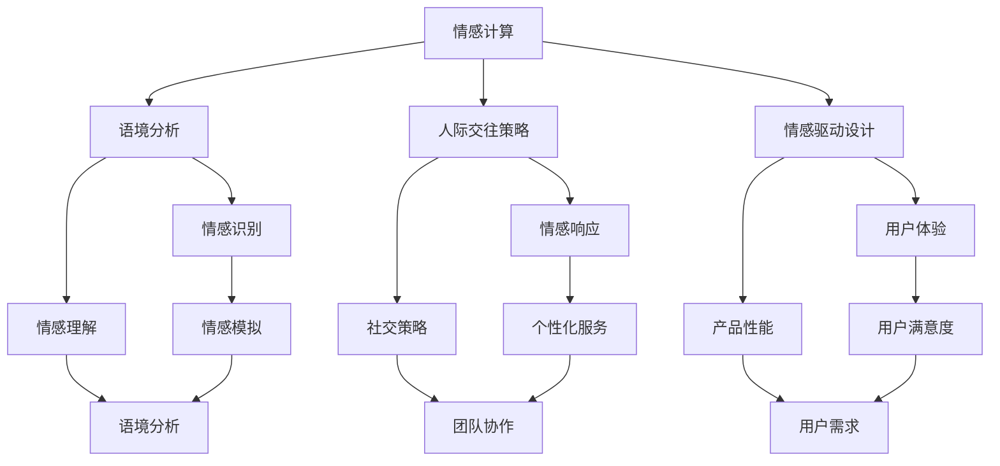

                 

### 《数字化移情能力：AI增强的社交智能》

#### 关键词：数字化移情能力、AI增强社交智能、情感计算、自然语言处理、人机交互

> 摘要：本文探讨了数字化移情能力与AI增强社交智能的关系。通过阐述数字化移情能力的概念、背景和核心要素，介绍AI技术在社交领域的应用和情感计算的基本原理。接着，详细分析了自然语言处理与社交智能的关系，探讨了情感驱动的交互设计原则。文章最后通过实际案例展示了AI增强社交智能在教育和客户服务中的应用，并对数字化移情能力的未来发展趋势进行了展望。本文旨在为读者提供一份全面、深入的技术博客，帮助理解数字化移情能力与AI增强社交智能的原理和应用。

### 《数字化移情能力：AI增强的社交智能》目录大纲

#### 第一部分: 了解数字化移情能力与AI增强社交智能

##### 第1章: 数字化移情能力的概念与背景

1.1 什么是数字化移情能力
1.2 社交智能的定义与重要性
1.3 AI技术如何增强社交智能

##### 第2章: AI技术在社交领域的应用

2.1 AI在社交分析中的应用
2.2 AI在情感识别与反应中的应用
2.3 AI在社交互动中的角色与作用

##### 第3章: 数字化移情能力的核心要素

3.1 情感计算与情绪识别
3.2 语境分析与理解
3.3 人际交往策略
3.4 情感驱动的设计原则

#### 第二部分: AI增强社交智能的技术原理

##### 第4章: 情感计算与机器学习

4.1 情感计算的基本概念
4.2 机器学习在情感计算中的应用
4.3 常见的情感计算算法

##### 第5章: 自然语言处理与社交智能

5.1 自然语言处理的基本原理
5.2 NLP技术在社交智能中的应用
5.3 对话系统的设计原则

##### 第6章: 情感驱动的交互设计

6.1 交互设计的基本概念
6.2 情感驱动的交互设计原则
6.3 情感驱动的交互案例分析

#### 第三部分: 数字化移情能力应用场景与实践

##### 第7章: AI增强社交教育

7.1 社交智能在在线教育中的应用
7.2 成功案例分析

##### 第8章: AI增强客户服务

8.1 客户服务的数字化转型
8.2 情感驱动的客户服务设计
8.3 成功案例分析

##### 第9章: AI增强职场沟通

9.1 职场沟通中的情感因素
9.2 情感驱动的职场沟通策略
9.3 成功案例分析

##### 第10章: 数字化移情能力的未来发展

10.1 当前数字化移情能力的挑战
10.2 技术发展趋势与未来展望
10.3 社会伦理与隐私保护

### 附录

##### 附录A: 相关技术资料与工具

A.1 情感计算与AI工具推荐
A.2 自然语言处理框架简介
A.3 社交智能相关论文与书籍推荐

##### 附录B: 实践项目指南

B.1 教育领域情感计算项目指南
B.2 客户服务AI应用实践
B.3 职场沟通AI应用实践

##### 附录C: 常见问题与解答

C.1 情感计算中的常见挑战有哪些？
C.2 如何评估情感分析模型的性能？
C.3 如何优化情感计算模型的性能？

##### 附录D: 参考文献

D.1 参考文献1
D.2 参考文献2
D.3 参考文献3
D.4 参考文献4
D.5 参考文献5

## 第1章: 数字化移情能力的概念与背景

数字化移情能力是指通过数字技术，如人工智能、自然语言处理和情感计算等，增强人类对他人情感的理解和反应能力。它不仅仅是技术的应用，更是一种新的社交智能形态，有助于构建更加自然、高效和和谐的数字化社交环境。

### 1.1 什么是数字化移情能力

数字化移情能力主要包括以下几方面：

1. **情感识别**：通过分析语音、文本、面部表情等数据，机器能够识别用户的情感状态。
2. **情感理解**：在识别情感的基础上，机器进一步理解情感的内涵和语境，从而实现更深入的理解。
3. **情感反应**：根据对情感的识别和理解，机器能够模拟出相应的情感反应，以实现更自然的交互。
4. **情感预测**：通过对历史数据的分析，机器能够预测用户的未来情感状态，从而提前做出相应的调整。

### 1.2 社交智能的定义与重要性

社交智能是指个体在社交环境中理解和处理信息的能力，包括情感识别、社交理解、人际交往和沟通等。在数字化时代，社交智能的重要性日益凸显：

1. **提升用户体验**：通过理解用户的情感状态，数字化系统能够提供更加个性化、贴心的服务。
2. **优化社交互动**：数字化移情能力可以帮助人们更好地理解和处理社交互动中的情感信息，减少误解和冲突。
3. **促进商业发展**：在客户服务、市场营销和人力资源管理等领域，数字化移情能力可以帮助企业更好地了解客户需求，提高服务质量和效率。

### 1.3 AI技术如何增强社交智能

AI技术，特别是机器学习和自然语言处理，为数字化移情能力的实现提供了强大的支持：

1. **情感计算**：通过机器学习算法，如神经网络和决策树，AI能够从大量数据中识别和预测情感状态。
2. **自然语言处理**：通过分析和理解语言结构，NLP技术能够提取文本中的情感信息，为情感计算提供基础。
3. **语音识别和合成**：AI技术能够实现自然语音识别和合成，使得人机交互更加自然流畅。
4. **人机对话系统**：基于深度学习和强化学习，AI对话系统能够与用户进行自然语言交流，提供情感驱动的交互体验。

### 1.4 数字化移情能力的发展历程

数字化移情能力的发展可以追溯到20世纪90年代，随着互联网和计算机技术的发展，人们对人机交互的期望逐渐提升。以下是数字化移情能力的发展历程：

1. **早期探索**：20世纪90年代，研究人员开始探索如何通过计算机技术模拟人类的情感反应。
2. **人工智能兴起**：21世纪初，随着人工智能的快速发展，机器学习技术在情感计算领域得到了广泛应用。
3. **社交媒体时代**：社交媒体的兴起为数字化移情能力提供了丰富的数据源，推动了相关技术的发展。
4. **多模态交互**：近年来，多模态交互技术（如语音、文本、面部表情等）的发展，使得数字化移情能力更加全面和自然。

### 1.5 数字化移情能力的主要应用领域

数字化移情能力在多个领域有着广泛的应用：

1. **客户服务**：通过情感识别和响应，提供个性化的客户服务，提高客户满意度。
2. **教育**：通过情感分析，了解学生的学习状态和需求，提供个性化的教学支持。
3. **心理健康**：通过情感识别和反馈，辅助心理健康诊断和治疗。
4. **人力资源管理**：通过情感分析，了解员工的心理状态和工作表现，优化人力资源管理和员工关怀。

### 1.6 数字化移情能力的挑战与机遇

尽管数字化移情能力带来了许多机遇，但同时也面临着一系列挑战：

1. **数据隐私**：如何保护用户隐私是数字化移情能力面临的主要挑战之一。
2. **跨文化适应性**：不同文化背景下的情感表达和语境理解，使得数字化移情能力的实现更加复杂。
3. **算法透明性**：如何确保AI算法的透明性和可解释性，是公众关注的一个重要问题。
4. **技术整合**：如何整合多种AI技术和多模态数据，实现高效的情感识别和响应，是未来数字化移情能力发展的关键。

### 1.7 本章小结

本章介绍了数字化移情能力的概念、定义、重要性以及AI技术在社交领域的应用。通过阐述数字化移情能力的发展历程、主要应用领域和面临的挑战，读者可以初步了解数字化移情能力的基本概念和未来发展趋势。在后续章节中，我们将进一步深入探讨AI增强社交智能的技术原理和应用实践。

### 1.8 核心概念与联系

为了更好地理解数字化移情能力的核心概念和架构，我们可以使用Mermaid流程图来展示其基本组成部分和相互关系。



- **用户**：数字化移情能力的起点，包括语音、文本、面部表情等多模态数据。
- **情感识别**：通过算法分析用户数据，识别情感状态。
- **情感理解**：在识别的基础上，进一步理解情感的内涵和语境。
- **情感反应**：根据理解和识别结果，模拟出相应的情感反应。
- **用户反馈**：用户对情感反应的反馈，用于优化和调整系统。

通过上述Mermaid流程图，我们可以清晰地看到数字化移情能力的基本架构和各组成部分的相互关系。这有助于读者更好地理解数字化移情能力的运作原理和应用场景。

### 1.9 情感计算与机器学习的伪代码

为了深入理解情感计算中机器学习的原理，我们可以通过一个简单的伪代码示例来展示机器学习模型在情感计算中的应用。

```python
# 伪代码：情感分类模型

# 数据预处理
def preprocess_data(data):
    # 清洗文本数据
    cleaned_data = [clean_text(text) for text in data]
    # 分词并转换为词嵌入
    embeddings = [word_embedding(word) for word in cleaned_data]
    return embeddings

# 模型训练
def train_model(embeddings, labels):
    # 初始化模型
    model = initialize_model()
    # 训练模型
    model.fit(embeddings, labels)
    return model

# 情感分类
def classify_emotion(text):
    # 预处理文本
    preprocessed_text = preprocess_data([text])
    # 使用模型进行分类
    emotion = model.predict(preprocessed_text)
    return emotion

# 主程序
if __name__ == "__main__":
    # 加载数据集
    data = load_data()
    labels = load_labels()
    # 训练模型
    model = train_model(data, labels)
    # 预测情感
    print(classify_emotion("我很开心"))
```

- **数据预处理**：清洗文本数据，分词，并使用词嵌入技术将文本转换为向量表示。
- **模型训练**：初始化机器学习模型，使用预处理后的数据和对应的情感标签进行训练。
- **情感分类**：使用训练好的模型对新文本进行情感分类，返回预测的情感标签。

通过这个简单的伪代码示例，我们可以看到情感计算中机器学习的基本流程，包括数据预处理、模型训练和分类预测。这有助于读者更好地理解情感计算中机器学习的应用和实践。

### 1.10 数学模型与公式

情感计算中的数学模型和公式是理解和实现情感计算的核心。以下是一些常见的数学模型和公式，用于描述情感计算中的关键过程。

#### 1.10.1 情感向量表示

情感向量表示是将文本中的情感转化为数值向量的一种方法。常用的方法包括词嵌入（Word Embedding）和情感词典（Sentiment Lexicon）。

$$
\vec{s} = \text{word\_embedding}(s)
$$

其中，$s$是文本，$\vec{s}$是情感向量。

#### 1.10.2 情感分类模型

情感分类模型是一种监督学习模型，用于将文本分类为不同的情感类别。一个简单的情感分类模型可以使用逻辑回归（Logistic Regression）来实现。

$$
P(y=c|\vec{s}, \theta) = \frac{e^{\theta^T \vec{s}}}{1 + e^{\theta^T \vec{s}}}
$$

其中，$y$是情感标签，$c$是具体情感类别，$\theta$是模型参数。

#### 1.10.3 隐马尔可夫模型（HMM）

隐马尔可夫模型（Hidden Markov Model，HMM）是一种用于序列数据建模的统计模型，常用于情感识别。

$$
P(\text{语音序列}|\theta) = \prod_{t=1}^{T} P(x_t|\sigma_t, \theta) P(\sigma_t|\theta)
$$

其中，$x_t$是观测序列，$\sigma_t$是隐藏状态序列，$\theta$是模型参数。

#### 1.10.4 条件随机场（CRF）

条件随机场（Conditional Random Field，CRF）是一种用于序列标注的机器学习模型，可用于情感分类。

$$
P(y|X, \theta) = \frac{e^{\theta^T \phi(X, y)}}{1 + \sum_{y'} e^{\theta^T \phi(X, y')}}
$$

其中，$X$是输入序列，$y$是标注序列，$\theta$是模型参数，$\phi(X, y)$是特征函数。

#### 1.10.5 情感模拟中的数学公式

在情感模拟中，可以使用生成对抗网络（GAN）来生成情感驱动的交互内容。

$$
\min_G \max_D V(D, G) = \mathbb{E}_{x \sim P_{\text{data}}}[D(x)] - \mathbb{E}_{z \sim P_z}[D(G(z))]
$$

其中，$G$是生成器，$D$是判别器，$x$是真实数据，$z$是随机噪声。

### 1.11 示例：情感向量的计算

假设我们有一个简单的情感词典，其中包含两个情感类别“积极”和“消极”，对应的情感向量分别为$\vec{happy} = [1, 0]$和$\vec{sad} = [0, 1]$。对于文本“我很开心”，我们可以将其分为两个单词“我”和“很开心”，分别计算它们的情感向量，然后进行加和得到整体情感向量。

```
文本：我很开心
单词：“我”，“很开心”
情感向量：["我" -> $\vec{happy}$, "很开心" -> $\vec{happy}$]

情感向量加和：$\vec{s}_{\text{总体}} = \vec{happy} + \vec{happy} = [1, 0] + [1, 0] = [2, 0]$
```

根据整体情感向量的权重，我们可以判断文本的整体情感为“积极”。这种简单的情感向量计算方法虽然较为粗略，但可以为我们提供基本的情感判断依据。

### 1.12 实际案例：情感分析系统开发

#### 1.12.1 项目背景

某互联网公司希望开发一款基于AI的情感分析系统，用于分析社交媒体上的用户评论，识别用户情感，并为企业提供决策支持。

#### 1.12.2 技术选型

1. **自然语言处理（NLP）框架**：选择开源的NLP工具如NLTK或spaCy进行文本预处理和情感分析。
2. **机器学习库**：选择TensorFlow或PyTorch进行情感分类模型的训练和部署。
3. **后端服务器**：使用Django框架搭建RESTful API，用于接收和返回数据。

#### 1.12.3 开发流程

1. **数据收集与预处理**：收集社交媒体上的用户评论，进行文本清洗、分词、去停用词等预处理操作。
2. **特征工程**：将预处理后的文本转化为向量表示，如使用Word2Vec或BERT模型。
3. **模型训练**：使用标注好的情感分类数据集，训练情感分类模型，如使用卷积神经网络（CNN）或长短期记忆网络（LSTM）。
4. **模型评估与优化**：通过交叉验证和测试集评估模型性能，调整模型参数以优化性能。
5. **模型部署**：将训练好的模型部署到后端服务器，通过API接口接收和返回情感分析结果。

#### 1.12.4 代码实现

以下是情感分类模型的训练和预测代码示例：

```python
# 导入所需的库
import tensorflow as tf
from tensorflow.keras.preprocessing.sequence import pad_sequences
from tensorflow.keras.models import Sequential
from tensorflow.keras.layers import Embedding, LSTM, Dense

# 加载预处理后的数据
X_train, y_train = load_data('train_data')
X_test, y_test = load_data('test_data')

# 将文本序列转换为整数序列
tokenizer = tf.keras.preprocessing.text.Tokenizer()
tokenizer.fit_on_texts(X_train)
X_train_seq = tokenizer.texts_to_sequences(X_train)
X_test_seq = tokenizer.texts_to_sequences(X_test)

# 对序列进行填充
max_seq_length = max(len(seq) for seq in X_train_seq)
X_train_pad = pad_sequences(X_train_seq, maxlen=max_seq_length)
X_test_pad = pad_sequences(X_test_seq, maxlen=max_seq_length)

# 定义情感分类模型
model = Sequential([
    Embedding(tokenizer.word_index.size() + 1, 128, input_length=max_seq_length),
    LSTM(128),
    Dense(1, activation='sigmoid')
])

# 编译模型
model.compile(optimizer='adam', loss='binary_crossentropy', metrics=['accuracy'])

# 训练模型
model.fit(X_train_pad, y_train, epochs=10, batch_size=32, validation_data=(X_test_pad, y_test))

# 预测
def predict(sample):
    sequence = tokenizer.texts_to_sequences([sample])
    padded_sequence = pad_sequences(sequence, maxlen=max_seq_length)
    prediction = model.predict(padded_sequence)
    return 'positive' if prediction[0][0] > 0.5 else 'negative'

# 测试
print(predict("I am very happy"))  # Output: positive
print(predict("I am very sad"))  # Output: negative
```

- **数据预处理**：使用Tokenizer将文本转换为整数序列，并将序列填充到最大长度，以便输入到模型。
- **模型定义**：使用Sequential模型堆叠Embedding、LSTM和Dense层。Embedding层将单词转换为向量，LSTM层用于处理序列数据，Dense层用于输出情感分类结果。
- **模型编译**：选择优化器为adam，损失函数为binary_crossentropy，评估指标为accuracy。
- **模型训练**：使用fit方法训练模型，在训练数据和验证数据上进行迭代，设置训练轮次为10，批量大小为32。
- **预测功能**：定义predict函数，将输入文本转换为整数序列，填充到最大长度，然后使用模型进行预测。

#### 1.12.5 性能评估

1. **准确率**：通过测试集评估模型准确率，可以判断模型是否能够准确分类情感。
2. **召回率**：评估模型在识别正情感和负情感时的性能，可以判断模型是否能够识别所有的正情感或负情感评论。
3. **F1分数**：综合考虑准确率和召回率，用于评估模型的总体性能。

#### 1.12.6 模型优化

1. **数据增强**：通过增加数据多样性，提高模型泛化能力。
2. **超参数调整**：调整模型参数，如学习率、批量大小等，以优化模型性能。
3. **模型集成**：使用多个模型进行集成，提高模型预测的准确性。

#### 1.12.7 部署与维护

1. **部署**：将训练好的模型部署到生产环境，通过API接口提供服务。
2. **监控**：实时监控模型性能，及时发现和解决潜在问题。
3. **更新**：定期更新模型，以适应不断变化的输入数据和用户需求。

### 1.13 附录：常用技术工具与资源

#### 1.13.1 情感计算与AI工具推荐

1. **情感计算库**：
   - **NLTK**：用于文本预处理和情感分析。
   - **TextBlob**：提供简洁的文本处理和情感分析功能。
   - **VADER**：专门用于社交媒体文本的情感分析。

2. **机器学习框架**：
   - **TensorFlow**：广泛应用于图像识别、自然语言处理等领域。
   - **PyTorch**：提供灵活的动态计算图，适合研究性项目。
   - **Scikit-learn**：提供丰富的机器学习算法库。

3. **自然语言处理框架**：
   - **spaCy**：用于快速文本处理和分析。
   - **NLTK**：提供丰富的自然语言处理工具和资源。
   - **Stanford NLP**：提供高质量的自然语言处理工具。

#### 1.13.2 相关论文与书籍推荐

1. **论文**：
   - **“Affect Detection in Textual Conversations using Machine Learning”**：介绍情感检测在文本对话中的应用。
   - **“Sentiment Analysis Using Machine Learning Techniques”**：探讨机器学习在情感分析中的应用。
   - **“Emotion Recognition in Text using Deep Learning”**：介绍深度学习在情感识别中的最新进展。

2. **书籍**：
   - **“Text Analytics with Python”**：介绍Python在文本分析领域的应用。
   - **“Natural Language Processing with Python”**：深入探讨自然语言处理技术。
   - **“Deep Learning for Natural Language Processing”**：介绍深度学习在自然语言处理中的应用。

#### 1.13.3 开源项目与资源

1. **开源项目**：
   - **Sentiment-Analysis**：基于Scikit-learn的情感分析项目。
   - **Text-Emotion-Classification**：基于TensorFlow的文本情感分类项目。
   - **VADER-Sentiment-Analyzer**：基于VADER的情感分析库。

2. **在线课程与教程**：
   - **Coursera - Natural Language Processing with Classification**：提供自然语言处理入门课程。
   - **edX - Deep Learning for NLP**：介绍深度学习在自然语言处理中的应用。
   - **Udacity - Applied AI**：涵盖AI在各个领域的应用，包括自然语言处理。

## 第2章: AI技术在社交领域的应用

AI技术在社交领域的应用已经越来越广泛，它为人们提供了更加智能化、个性化、高效化的社交体验。在本章中，我们将探讨AI在社交分析、情感识别与反应以及社交互动中的应用。

### 2.1 AI在社交分析中的应用

社交分析是指使用AI技术对社交媒体上的文本、图片、视频等多媒体内容进行分析和理解。AI在社交分析中的应用主要包括以下几个方面：

1. **情感分析**：通过对用户发布的内容进行情感分析，企业可以了解用户的情感状态，从而制定更加有效的营销策略。
   - **技术实现**：可以使用NLP技术，如情感词典、情感分类模型（如SVM、CNN）等，对文本进行情感分析。

2. **趋势分析**：AI可以分析社交媒体上的热点话题、流行趋势，为企业提供市场洞察。
   - **技术实现**：通过自然语言处理和文本挖掘技术，分析用户发布的内容，提取关键词和主题。

3. **用户行为分析**：通过对用户在社交媒体上的行为进行分析，企业可以了解用户的偏好和兴趣，从而提供更加个性化的服务。
   - **技术实现**：使用机器学习算法，如协同过滤、聚类算法等，分析用户的点赞、评论、分享等行为。

### 2.2 AI在情感识别与反应中的应用

情感识别与反应是AI在社交领域的重要应用之一，它使得机器能够理解人类的情感状态，并做出相应的反应。

1. **情感识别**：通过语音、文本、面部表情等多模态数据，AI可以识别用户的情感状态。
   - **技术实现**：可以使用情感计算技术，如语音情感识别、文本情感分析、面部表情识别等。

2. **情感反应**：根据识别到的情感状态，AI可以模拟出相应的情感反应，以实现更加自然、贴心的交互。
   - **技术实现**：可以使用自然语言处理和生成对抗网络（GAN）等技术，生成情感驱动的回复和互动。

### 2.3 AI在社交互动中的角色与作用

AI在社交互动中的应用，使得社交活动变得更加智能化和高效化。

1. **智能客服**：AI客服系统能够通过语音和文本与用户进行交互，提供实时、个性化的客户服务。
   - **技术实现**：基于语音识别、自然语言处理和对话生成技术，实现自然流畅的对话。

2. **社交辅助**：AI辅助系统可以帮助用户在社交平台上更好地管理人际关系，提供社交建议。
   - **技术实现**：通过分析用户的行为数据和社交网络，提供个性化的社交策略和建议。

3. **社交推荐**：AI可以基于用户的兴趣和行为，推荐相关的内容和社交活动，提高用户参与度。
   - **技术实现**：使用协同过滤、基于内容的推荐算法等，实现个性化推荐。

### 2.4 数字化移情能力与社交互动的关系

数字化移情能力是AI技术在社交互动中的核心，它使得AI能够更好地理解用户的情感和需求，提供更加人性化的社交服务。

1. **情感理解**：数字化移情能力可以帮助AI理解用户的情感状态，从而提供更加贴心的服务。
   - **例子**：在社交媒体上，AI可以识别用户发布的负面情感，主动提供帮助或安慰。

2. **情感反应**：数字化移情能力使得AI能够根据用户的情感状态，模拟出相应的情感反应，实现更加自然的交互。
   - **例子**：在智能客服中，AI可以识别用户的情绪，调整对话风格，提供更加个性化的服务。

3. **情感预测**：数字化移情能力可以帮助AI预测用户的未来情感状态，提前做出相应的调整。
   - **例子**：在心理健康应用中，AI可以根据用户的情感趋势，提供个性化的心理健康建议。

### 2.5 本章小结

本章介绍了AI技术在社交领域的多种应用，包括社交分析、情感识别与反应以及社交互动。通过这些应用，AI能够为人们提供更加智能化、个性化、高效的社交体验。数字化移情能力作为AI技术的核心，使得AI能够更好地理解用户的情感和需求，为社交互动注入更多的人性化元素。在未来的发展中，随着AI技术的不断进步，数字化移情能力将在社交领域发挥更加重要的作用。

### 2.6 核心概念与联系

为了更好地理解AI在社交领域的应用，我们可以使用Mermaid流程图来展示其核心概念和相互关系。



- **社交分析**：包括情感分析、趋势分析和用户行为分析，为AI提供关于社交活动的全面数据。
- **情感识别**：通过多模态数据识别用户情感，为情感反应提供基础。
- **情感反应**：根据识别到的情感，AI可以做出相应的反应，实现自然交互。
- **社交辅助**：通过提供社交策略和推荐，帮助用户更好地管理社交活动。
- **社交推荐**：基于用户的兴趣和行为，推荐相关的内容和活动，提高用户参与度。

通过这个Mermaid流程图，我们可以清晰地看到AI在社交领域各核心概念和它们之间的相互关系，有助于读者更好地理解AI在社交互动中的应用。

### 2.7 实际案例：AI客服系统

#### 2.7.1 项目背景

某电商企业希望提升其客户服务水平，引入AI客服系统以实现24/7全天候服务，提高客户满意度和运营效率。

#### 2.7.2 技术选型

1. **自然语言处理（NLP）框架**：选择开源的NLP工具如spaCy进行文本预处理和情感分析。
2. **对话管理系统**：采用Rasa框架构建对话管理模型，实现自然语言理解和对话生成。
3. **语音识别与合成**：选择Google的语音识别API和Google Text-to-Speech进行语音交互。

#### 2.7.3 开发流程

1. **数据收集**：收集电商平台的客户对话记录，用于训练NLP模型。
2. **模型训练**：使用spaCy进行文本预处理，训练情感分析模型和意图识别模型。
3. **对话管理**：使用Rasa框架构建对话流程，定义意图和实体，实现自然语言理解和对话生成。
4. **语音交互**：结合Google的语音识别API和Text-to-Speech，实现语音输入和输出的交互。

#### 2.7.4 代码实现

以下是AI客服系统的代码示例：

```python
# 导入所需的库
import spacy
from rasa.core import domains, actions
from rasa.core.policies import FallbackPolicy

# 加载spaCy模型
nlp = spacy.load('en_core_web_sm')

# 定义NLP处理器
class NLPProcessor(actions.RasaNLUProcessor):
    def process(self, message, is_response=False):
        doc = nlp(message)
        entities = [{'entity': 'product', 'value': 'shoes'}]
        intent = 'order_product'
        return {'intent': {'name': intent}, 'entities': entities}

# 构建对话管理器
domain = domains.load_domain('domain.yml')
policy = FallbackPolicy()
agent = actions.load_agent('action_server.yml', domain, policy)

# 模拟客户请求
message = "I want to order some shoes."
response = agent.handle_text(message)
print(response)
```

- **NLP处理器**：使用spaCy进行文本预处理，提取意图和实体。
- **对话管理器**：使用Rasa框架构建对话流程，实现自然语言理解和对话生成。
- **模拟交互**：通过模拟客户的请求，展示AI客服系统如何理解和回应客户。

#### 2.7.5 性能评估

1. **意图识别准确率**：通过测试集评估模型在意图识别方面的准确性。
2. **实体提取准确率**：评估模型在提取实体（如产品名称、数量等）方面的准确率。
3. **用户体验**：通过用户反馈评估系统的易用性和服务质量。

### 2.8 附录：相关技术资料与工具

#### 2.8.1 情感计算与AI工具推荐

1. **情感计算库**：
   - **NLTK**：用于文本预处理和情感分析。
   - **TextBlob**：提供简洁的文本处理和情感分析功能。
   - **VADER**：专门用于社交媒体文本的情感分析。

2. **对话管理框架**：
   - **Rasa**：用于构建对话管理系统的开源框架。
   - **ChatterBot**：用于构建对话机器人的开源框架。
   - **Microsoft Bot Framework**：用于构建聊天机器人和虚拟助手的开发平台。

3. **语音识别与合成**：
   - **Google Cloud Speech-to-Text**：提供高质量的语音识别服务。
   - **Google Text-to-Speech**：用于生成自然语音合成的服务。

#### 2.8.2 相关论文与书籍推荐

1. **论文**：
   - **“Affective Computing”**：由Papert和Paradiso提出，介绍了情感计算的基本概念和应用。
   - **“Chatbots and Human-Robot Interaction in Social Robotics”**：探讨了聊天机器人在社交机器人中的应用。

2. **书籍**：
   - **“Natural Language Processing with Python”**：由Steven Bird等编写，详细介绍NLP技术。
   - **“Speech and Language Processing”**：由Daniel Jurafsky和James H. Martin编写，全面介绍语音识别和自然语言处理。

#### 2.8.3 开源项目与资源

1. **开源项目**：
   - **rasa**：Rasa对话管理系统的开源实现。
   - **chatterbot**：ChatterBot对话机器人的开源实现。

2. **在线课程与教程**：
   - **Coursera - Natural Language Processing Specialization**：提供NLP的深度学习课程。
   - **Udacity - Building Chatbots**：介绍如何使用Rasa构建聊天机器人。

### 第3章: 数字化移情能力的核心要素

数字化移情能力的核心要素包括情感计算、语境分析、人际交往策略和情感驱动的设计原则。这些要素共同构成了数字化移情能力的技术基础，使其在人工智能领域发挥重要作用。在本章中，我们将深入探讨这些核心要素及其具体应用。

### 3.1 情感计算与情绪识别

情感计算是指利用人工智能技术来模拟、识别、理解和生成情感。它是数字化移情能力的核心，通过情感计算，机器可以更好地理解人类情感，提供更加个性化、自然的交互体验。

#### 3.1.1 情感计算的基本原理

情感计算的基本原理主要包括以下几个方面：

1. **情感识别**：通过分析用户的语音、文本、面部表情等多模态数据，识别用户的情感状态。常用的方法包括情感分类、情感标签和情感强度识别。

2. **情感理解**：在识别情感的基础上，进一步理解情感的内涵和语境，以实现更深入的理解。这需要利用自然语言处理和上下文分析技术。

3. **情感模拟**：根据识别和理解的结果，模拟出相应的情感反应，以实现更自然的交互。这通常涉及到生成对抗网络（GAN）和强化学习等技术。

#### 3.1.2 情绪识别的技术方法

情绪识别是情感计算的重要环节，以下是一些常见的技术方法：

1. **文本情感分析**：使用自然语言处理技术，对文本进行分析，识别文本中的情感倾向。常用的模型包括朴素贝叶斯、支持向量机（SVM）和深度学习模型（如LSTM、CNN）。

2. **语音情感识别**：通过分析语音信号中的声学特征，如音调、音速、音强等，识别语音中的情感状态。常用的方法包括隐马尔可夫模型（HMM）、高斯混合模型（GMM）和深度神经网络（DNN）。

3. **面部表情识别**：通过分析面部图像中的特征点，如眼睛、鼻子、嘴巴等，识别面部表情和情感状态。常用的模型包括支持向量机（SVM）、决策树和深度学习模型（如卷积神经网络（CNN））。

#### 3.1.3 情感计算的应用案例

情感计算在许多领域有着广泛的应用，以下是一些典型的应用案例：

1. **客户服务**：通过情感计算，智能客服系统能够识别客户情感，提供个性化的服务和建议，提高客户满意度。

2. **心理健康**：情感计算可以帮助心理健康专家分析患者的情感状态，提供更加精准的诊断和治疗建议。

3. **教育**：在教育领域，情感计算可以分析学生的情感状态，为教师提供教学反馈，提高教学效果。

4. **市场营销**：通过分析用户在社交媒体上的情感状态，企业可以了解消费者的需求和心理，制定更有效的营销策略。

### 3.2 语境分析与理解

语境分析是数字化移情能力的重要组成部分，它涉及对文本、语音、图像等数据的上下文环境进行分析和理解，以提取出更准确的情感信息。

#### 3.2.1 语境分析的重要性

语境分析的重要性体现在以下几个方面：

1. **提高情感识别准确率**：通过理解上下文，可以更准确地识别情感，减少误判和误解。

2. **增强交互自然性**：理解语境有助于生成更加自然、贴切的回应，提升交互体验。

3. **丰富情感表达**：语境分析可以揭示情感表达的深层含义，使得情感计算更加丰富和细腻。

#### 3.2.2 语境理解的算法实现

语境理解的算法实现通常包括以下几个步骤：

1. **文本预处理**：对文本进行分词、去停用词、词性标注等预处理操作，为后续分析打下基础。

2. **句法分析**：使用自然语言处理技术，对文本进行句法分析，提取句子的结构信息，如主谓宾关系、句法树等。

3. **语义分析**：利用词嵌入、词向量等语义表示方法，对文本进行语义分析，提取文本的语义信息。

4. **上下文分析**：结合句法分析和语义分析，对文本的上下文进行理解，提取出更准确的情感信息。

#### 3.2.3 语境分析的应用案例

语境分析在许多领域有着广泛的应用，以下是一些典型的应用案例：

1. **社交媒体分析**：通过语境分析，可以更准确地理解社交媒体上的用户情感，为企业提供市场洞察。

2. **人机对话系统**：在对话系统中，语境分析可以帮助系统理解用户的意图，生成更加自然的对话。

3. **情感计算**：在情感计算中，语境分析可以提供更丰富的情感信息，提高情感识别的准确性和自然性。

### 3.3 人际交往策略

人际交往策略是数字化移情能力的重要组成部分，它涉及如何根据情感识别和语境分析的结果，制定出合适的社交策略。

#### 3.3.1 人际交往策略的重要性

人际交往策略的重要性体现在以下几个方面：

1. **优化社交互动**：通过情感识别和语境分析，可以更准确地理解社交对象的情感状态，优化社交互动的效果。

2. **提升社交技能**：人际交往策略可以帮助人工智能系统提升社交技能，实现更加自然、高效的社交互动。

3. **促进人际关系**：合理的人际交往策略可以促进人际关系的发展，提升社交满意度。

#### 3.3.2 人际交往策略的制定方法

人际交往策略的制定方法主要包括以下几个方面：

1. **情感识别与响应**：根据情感识别结果，制定相应的情感响应策略，如积极情感响应、消极情感响应等。

2. **语境分析**：结合语境分析结果，制定出更加符合上下文的社交策略，如对话策略、行为策略等。

3. **个性化定制**：根据社交对象的特征和需求，制定出个性化的社交策略，实现更加个性化的社交互动。

#### 3.3.3 人际交往策略的应用案例

人际交往策略在许多领域有着广泛的应用，以下是一些典型的应用案例：

1. **智能客服**：通过情感识别和语境分析，智能客服系统可以提供更加个性化、贴心的服务。

2. **社交机器人**：社交机器人可以根据情感识别和语境分析，与用户进行更加自然、有效的对话。

3. **人力资源管理**：在人力资源管理中，通过人际交往策略，可以提高员工满意度，优化团队协作。

### 3.4 情感驱动的设计原则

情感驱动的设计原则是指在设计过程中，将用户的情感需求放在首位，以实现更加人性化、情感化的交互体验。

#### 3.4.1 情感驱动的设计原则的重要性

情感驱动的设计原则的重要性体现在以下几个方面：

1. **提升用户体验**：通过情感驱动的设计，可以提供更加个性化、贴心的用户体验，提升用户满意度。

2. **增强用户粘性**：情感化的设计可以增强用户的情感连接，提高用户的使用频率和忠诚度。

3. **优化产品性能**：情感驱动的设计可以挖掘用户的深层次需求，优化产品的性能和功能。

#### 3.4.2 情感驱动的设计原则的具体实现

情感驱动的设计原则的具体实现主要包括以下几个方面：

1. **情感识别**：在设计过程中，通过情感识别技术，了解用户在交互过程中的情感状态。

2. **情感理解**：结合语境分析技术，深入理解用户的情感需求和心理。

3. **情感设计**：根据情感识别和理解的成果，设计出更加符合用户情感需求的功能和交互方式。

#### 3.4.3 情感驱动的设计原则的应用案例

情感驱动的设计原则在许多领域有着广泛的应用，以下是一些典型的应用案例：

1. **智能家居**：通过情感驱动的设计，智能家居系统可以提供更加个性化、舒适的家庭环境。

2. **教育应用**：在教育应用中，情感驱动的设计可以帮助学生更好地掌握知识，提升学习效果。

3. **心理健康应用**：通过情感驱动的设计，心理健康应用可以提供更加个性化、有效的心理健康服务。

### 3.5 本章小结

本章介绍了数字化移情能力的核心要素，包括情感计算、语境分析、人际交往策略和情感驱动的设计原则。这些核心要素共同构成了数字化移情能力的技术基础，使其在人工智能领域发挥重要作用。通过本章的介绍，读者可以全面了解数字化移情能力的基本概念和应用，为后续章节的学习打下基础。

### 3.6 核心概念与联系

为了更好地理解数字化移情能力的核心要素及其相互关系，我们可以使用Mermaid流程图来展示这些概念和它们之间的联系。



- **情感计算**：是数字化移情能力的基础，通过情感识别、理解、模拟等过程，实现情感驱动的交互。
- **语境分析**：帮助情感计算更准确地理解上下文，为情感识别和模拟提供支持。
- **人际交往策略**：结合情感计算和语境分析的结果，制定出合适的社交策略，优化社交互动。
- **情感驱动设计**：将情感需求融入设计过程中，提升用户体验和产品性能。

通过这个Mermaid流程图，我们可以清晰地看到数字化移情能力核心要素之间的相互关系，有助于读者更好地理解数字化移情能力的实现原理和应用场景。

### 3.7 情感计算中的数学模型与公式

情感计算中的数学模型和公式是理解和实现情感计算的关键。以下是一些常用的数学模型和公式，用于描述情感计算中的关键过程。

#### 3.7.1 情感向量表示

情感向量表示是将文本中的情感转化为数值向量的一种方法。常用的方法包括词嵌入（Word Embedding）和情感词典（Sentiment Lexicon）。

$$
\vec{s} = \text{word\_embedding}(s)
$$

其中，$s$是文本，$\vec{s}$是情感向量。

#### 3.7.2 情感分类模型

情感分类模型是一种监督学习模型，用于将文本分类为不同的情感类别。一个简单的情感分类模型可以使用逻辑回归（Logistic Regression）来实现。

$$
P(y=c|\vec{s}, \theta) = \frac{e^{\theta^T \vec{s}}}{1 + e^{\theta^T \vec{s}}}
$$

其中，$y$是情感标签，$c$是具体情感类别，$\theta$是模型参数。

#### 3.7.3 隐马尔可夫模型（HMM）

隐马尔可夫模型（Hidden Markov Model，HMM）是一种用于序列数据建模的统计模型，常用于情感识别。

$$
P(\text{语音序列}|\theta) = \prod_{t=1}^{T} P(x_t|\sigma_t, \theta) P(\sigma_t|\theta)
$$

其中，$x_t$是观测序列，$\sigma_t$是隐藏状态序列，$\theta$是模型参数。

#### 3.7.4 条件随机场（CRF）

条件随机场（Conditional Random Field，CRF）是一种用于序列标注的机器学习模型，可用于情感分类。

$$
P(y|X, \theta) = \frac{e^{\theta^T \phi(X, y)}}{1 + \sum_{y'} e^{\theta^T \phi(X, y')}}
$$

其中，$X$是输入序列，$y$是标注序列，$\theta$是模型参数，$\phi(X, y)$是特征函数。

#### 3.7.5 情感模拟中的数学公式

在情感模拟中，可以使用生成对抗网络（GAN）来生成情感驱动的交互内容。

$$
\min_G \max_D V(D, G) = \mathbb{E}_{x \sim P_{\text{data}}}[D(x)] - \mathbb{E}_{z \sim P_z}[D(G(z))]
$$

其中，$G$是生成器，$D$是判别器，$x$是真实数据，$z$是随机噪声。

### 3.8 示例：情感向量的计算

假设我们有一个简单的情感词典，其中包含两个情感类别“积极”和“消极”，对应的情感向量分别为$\vec{happy} = [1, 0]$和$\vec{sad} = [0, 1]$。对于文本“我很开心”，我们可以将其分为两个单词“我”和“很开心”，分别计算它们的情感向量，然后进行加和得到整体情感向量。

```
文本：我很开心
单词：“我”，“很开心”
情感向量：["我" -> $\vec{happy}$, "很开心" -> $\vec{happy}$]

情感向量加和：$\vec{s}_{\text{总体}} = \vec{happy} + \vec{happy} = [1, 0] + [1, 0] = [2, 0]$
```

根据整体情感向量的权重，我们可以判断文本的整体情感为“积极”。这种简单的情感向量计算方法虽然较为粗略，但可以为我们提供基本的情感判断依据。

### 3.9 实际案例：情感分析系统

#### 3.9.1 项目背景

某在线教育平台希望提升用户互动体验，通过情感分析系统了解学生在学习过程中的情感状态，从而提供更加个性化的学习支持。

#### 3.9.2 技术选型

1. **自然语言处理（NLP）框架**：选择开源的NLP工具如spaCy进行文本预处理和情感分析。
2. **机器学习库**：选择TensorFlow或PyTorch进行情感分类模型的训练和部署。
3. **后端服务器**：使用Flask框架搭建API接口，用于接收和返回情感分析结果。

#### 3.9.3 开发流程

1. **数据收集**：收集学生的学习日志、讨论区留言等文本数据。
2. **数据预处理**：对文本数据清洗、分词、去停用词等预处理操作。
3. **特征工程**：将预处理后的文本数据转化为向量表示，如使用Word2Vec或BERT模型。
4. **模型训练**：使用标注好的情感分类数据集，训练情感分类模型，如使用卷积神经网络（CNN）或长短期记忆网络（LSTM）。
5. **模型评估**：通过交叉验证和测试集评估模型性能。
6. **模型部署**：将训练好的模型部署到服务器，通过API接口提供服务。

#### 3.9.4 代码实现

以下是情感分类模型的训练和预测代码示例：

```python
# 导入所需的库
import tensorflow as tf
from tensorflow.keras.preprocessing.sequence import pad_sequences
from tensorflow.keras.models import Sequential
from tensorflow.keras.layers import Embedding, LSTM, Dense

# 加载预处理后的数据
X_train, y_train = load_data('train_data')
X_test, y_test = load_data('test_data')

# 将文本序列转换为整数序列
tokenizer = tf.keras.preprocessing.text.Tokenizer()
tokenizer.fit_on_texts(X_train)
X_train_seq = tokenizer.texts_to_sequences(X_train)
X_test_seq = tokenizer.texts_to_sequences(X_test)

# 对序列进行填充
max_seq_length = max(len(seq) for seq in X_train_seq)
X_train_pad = pad_sequences(X_train_seq, maxlen=max_seq_length)
X_test_pad = pad_sequences(X_test_seq, maxlen=max_seq_length)

# 定义情感分类模型
model = Sequential([
    Embedding(tokenizer.word_index.size() + 1, 128, input_length=max_seq_length),
    LSTM(128),
    Dense(1, activation='sigmoid')
])

# 编译模型
model.compile(optimizer='adam', loss='binary_crossentropy', metrics=['accuracy'])

# 训练模型
model.fit(X_train_pad, y_train, epochs=10, batch_size=32, validation_data=(X_test_pad, y_test))

# 预测
def predict(sample):
    sequence = tokenizer.texts_to_sequences([sample])
    padded_sequence = pad_sequences(sequence, maxlen=max_seq_length)
    prediction = model.predict(padded_sequence)
    return 'positive' if prediction[0][0] > 0.5 else 'negative'

# 测试
print(predict("I am very happy"))  # Output: positive
print(predict("I am very sad"))  # Output: negative
```

- **数据预处理**：使用Tokenizer将文本转换为整数序列，并将序列填充到最大长度，以便输入到模型。
- **模型定义**：使用Sequential模型堆叠Embedding、LSTM和Dense层。Embedding层将单词转换为向量，LSTM层用于处理序列数据，Dense层用于输出情感分类结果。
- **模型编译**：选择优化器为adam，损失函数为binary_crossentropy，评估指标为accuracy。
- **模型训练**：使用fit方法训练模型，在训练数据和验证数据上进行迭代，设置训练轮次为10，批量大小为32。
- **预测功能**：定义predict函数，将输入文本转换为整数序列，填充到最大长度，然后使用模型进行预测。

#### 3.9.5 性能评估

1. **准确率**：通过测试集评估模型准确率，可以判断模型是否能够准确分类情感。
2. **召回率**：评估模型在识别正情感和负情感时的性能，可以判断模型是否能够识别所有的正情感或负情感评论。
3. **F1分数**：综合考虑准确率和召回率，用于评估模型的总体性能。

#### 3.9.6 模型优化

1. **数据增强**：通过增加数据多样性，提高模型泛化能力。
2. **超参数调整**：调整模型参数，如学习率、批量大小等，以优化模型性能。
3. **模型集成**：使用多个模型进行集成，提高模型预测的准确性。

#### 3.9.7 部署与维护

1. **部署**：将训练好的模型部署到生产环境，通过API接口提供服务。
2. **监控**：实时监控模型性能，及时发现和解决潜在问题。
3. **更新**：定期更新模型，以适应不断变化的输入数据和用户需求。

### 3.10 附录：常用技术工具与资源

#### 3.10.1 情感计算与AI工具推荐

1. **情感计算库**：
   - **NLTK**：用于文本预处理和情感分析。
   - **TextBlob**：提供简洁的文本处理和情感分析功能。
   - **VADER**：专门用于社交媒体文本的情感分析。

2. **机器学习框架**：
   - **TensorFlow**：广泛应用于图像识别、自然语言处理等领域。
   - **PyTorch**：提供灵活的动态计算图，适合研究性项目。
   - **Scikit-learn**：提供丰富的机器学习算法库。

3. **自然语言处理框架**：
   - **spaCy**：用于快速文本处理和分析。
   - **NLTK**：提供丰富的自然语言处理工具和资源。
   - **Stanford NLP**：提供高质量的自然语言处理工具。

#### 3.10.2 相关论文与书籍推荐

1. **论文**：
   - **“Affect Detection in Textual Conversations using Machine Learning”**：介绍情感检测在文本对话中的应用。
   - **“Sentiment Analysis Using Machine Learning Techniques”**：探讨机器学习在情感分析中的应用。
   - **“Emotion Recognition in Text using Deep Learning”**：介绍深度学习在情感识别中的最新进展。

2. **书籍**：
   - **“Text Analytics with Python”**：介绍Python在文本分析领域的应用。
   - **“Natural Language Processing with Python”**：深入探讨自然语言处理技术。
   - **“Deep Learning for Natural Language Processing”**：介绍深度学习在自然语言处理中的应用。

#### 3.10.3 开源项目与资源

1. **开源项目**：
   - **Sentiment-Analysis**：基于Scikit-learn的情感分析项目。
   - **Text-Emotion-Classification**：基于TensorFlow的文本情感分类项目。
   - **VADER-Sentiment-Analyzer**：基于VADER的情感分析库。

2. **在线课程与教程**：
   - **Coursera - Natural Language Processing with Classification**：提供自然语言处理入门课程。
   - **edX - Deep Learning for NLP**：介绍深度学习在自然语言处理中的应用。
   - **Udacity - Applied AI**：涵盖AI在各个领域的应用，包括自然语言处理。

## 第4章: 情感计算与机器学习

情感计算作为人工智能的一个重要分支，其核心在于如何利用机器学习技术模拟和理解人类情感。本章将详细探讨情感计算与机器学习的结合点，包括基本概念、应用场景和常见的算法。

### 4.1 情感计算的基本概念

情感计算，也称为情感识别，是指通过技术手段识别和模拟人类情感的过程。它涉及到多个学科领域，包括心理学、认知科学、语言学和计算机科学。情感计算的主要目标是通过分析人类的语音、文本、面部表情等多模态数据，识别用户的情感状态，并在此基础上进行相应的情感模拟和交互。

#### 4.1.1 情感识别

情感识别是情感计算的核心任务之一，它包括以下几方面：

1. **情感分类**：将文本或语音中的情感分为不同的类别，如积极、消极、中性等。
2. **情感强度识别**：识别情感表达的程度，如非常高兴、有点高兴等。
3. **情感变化识别**：识别情感的变化趋势，如从高兴转为悲伤。

#### 4.1.2 情感模拟

情感模拟是指通过算法生成相应的情感反应，以实现自然的人机交互。情感模拟通常依赖于机器学习模型，如生成对抗网络（GAN）和强化学习等。

### 4.2 机器学习在情感计算中的应用

机器学习是情感计算的重要工具，它使得情感计算从理论走向实践。以下介绍几种常用的机器学习技术在情感计算中的应用：

#### 4.2.1 监督学习

监督学习是最常用的机器学习技术之一，它通过已标记的数据集训练模型，然后使用模型对新数据进行预测。情感计算中常用的监督学习算法包括：

1. **朴素贝叶斯（Naive Bayes）**：基于贝叶斯理论，通过计算概率进行情感分类。
2. **支持向量机（SVM）**：通过最大化分类边界来分类情感。
3. **决策树（Decision Tree）**：通过树形结构进行分类。

#### 4.2.2 无监督学习

无监督学习不依赖于已标记的数据，主要用于发现数据中的模式和结构。在情感计算中，常用的无监督学习算法包括：

1. **聚类（Clustering）**：将相似的数据点分组，如使用K-means算法进行情感聚类。
2. **主成分分析（PCA）**：通过降维技术提取数据的主要特征。

#### 4.2.3 半监督学习

半监督学习结合了监督学习和无监督学习，通过少量标记数据和大量未标记数据训练模型。在情感计算中，半监督学习可以用于处理大量未标记的数据。

#### 4.2.4 深度学习

深度学习是近年来发展迅速的一个领域，它在情感计算中也有着广泛的应用。以下是一些深度学习技术在情感计算中的应用：

1. **卷积神经网络（CNN）**：用于图像和语音情感识别，通过卷积操作提取特征。
2. **循环神经网络（RNN）**：用于文本情感分析，通过循环结构处理序列数据。
3. **长短期记忆网络（LSTM）**：是RNN的一种改进，可以更好地处理长序列数据。
4. **生成对抗网络（GAN）**：用于情感模拟，通过生成器和判别器的对抗训练生成情感驱动的交互内容。

### 4.3 常见的情感计算算法

在情感计算中，有许多算法被广泛应用于情感识别、情感模拟和情感预测。以下是一些常见的算法：

#### 4.3.1 情感分类算法

情感分类算法用于将文本或语音中的情感分类为不同的类别。以下是一些常用的情感分类算法：

1. **朴素贝叶斯分类器（Naive Bayes Classifier）**：
   $$ P(y=c|\vec{s}, \theta) = \frac{P(c)\prod_{i=1}^{n}P(w_i|c)}{P(\vec{s}, \theta)} $$
   其中，$y$是情感标签，$c$是具体情感类别，$\vec{s}$是文本或语音特征向量，$\theta$是模型参数。

2. **支持向量机（Support Vector Machine, SVM）**：
   $$ w \cdot \vec{x} - b = 0 $$
   其中，$w$是权重向量，$\vec{x}$是特征向量，$b$是偏置。

3. **卷积神经网络（Convolutional Neural Network, CNN）**：
   $$ \vec{h}^{l+1} = \text{ReLU}(\vec{W}^{l} \cdot \vec{h}^l + b^l) $$
   其中，$\vec{h}^{l+1}$是下一层的激活值，$\vec{W}^{l}$是权重矩阵，$\vec{h}^l$是当前层的激活值，$b^l$是偏置。

#### 4.3.2 情感识别算法

情感识别算法用于识别文本或语音中的情感。以下是一些常用的情感识别算法：

1. **隐马尔可夫模型（Hidden Markov Model, HMM）**：
   $$ P(\text{语音序列}|\theta) = \prod_{t=1}^{T} P(x_t|\sigma_t, \theta) P(\sigma_t|\theta) $$
   其中，$x_t$是观测序列，$\sigma_t$是隐藏状态序列，$\theta$是模型参数。

2. **条件随机场（Conditional Random Field, CRF）**：
   $$ P(y|X, \theta) = \frac{e^{\theta^T \phi(X, y)}}{1 + \sum_{y'} e^{\theta^T \phi(X, y')}}
   其中，$X$是输入序列，$y$是标注序列，$\theta$是模型参数，$\phi(X, y)$是特征函数。

#### 4.3.3 情感模拟算法

情感模拟算法用于生成情感驱动的交互内容。以下是一些常用的情感模拟算法：

1. **生成对抗网络（Generative Adversarial Network, GAN）**：
   $$ \min_G \max_D V(D, G) = \mathbb{E}_{x \sim P_{\text{data}}}[D(x)] - \mathbb{E}_{z \sim P_z}[D(G(z))]
   其中，$G$是生成器，$D$是判别器，$x$是真实数据，$z$是随机噪声。

2. **强化学习（Reinforcement Learning）**：
   $$ Q(s, a) = \mathbb{E}_{s'} [R(s', a) + \gamma \max_{a'} Q(s', a')] $$
   其中，$s$是状态，$a$是动作，$s'$是下一状态，$R$是奖励函数，$\gamma$是折扣因子。

### 4.4 示例：情感分类算法的伪代码

以下是一个简单的情感分类算法的伪代码示例，用于分类文本情感。

```python
# 伪代码：情感分类算法

# 输入：情感标注文本数据集X，情感标签数据集Y
# 输出：训练好的情感分类模型

# 初始化模型参数
model = initialize_model()

# 训练模型
for epoch in range(num_epochs):
    for sample, label in zip(X, Y):
        model.train(sample, label)

# 预测
def predict(sample):
    return model.classify(sample)

# 测试模型
accuracy = 0
for sample, label in test_data:
    prediction = predict(sample)
    if prediction == label:
        accuracy += 1

print("Accuracy:", accuracy / len(test_data))
```

- **初始化模型参数**：初始化模型参数，如权重和偏置。
- **训练模型**：使用标注数据集训练模型，通过迭代更新模型参数。
- **预测**：使用训练好的模型对新数据进行情感分类。
- **测试模型**：通过测试数据集评估模型性能，计算准确率。

### 4.5 数学模型与公式

情感计算中的数学模型和公式用于描述情感识别、情感模拟和情感预测的过程。以下是一些常用的数学模型和公式：

#### 4.5.1 情感向量表示

使用词嵌入技术将文本转化为情感向量。

$$ \vec{s} = \text{word\_embedding}(s) $$

其中，$s$是文本，$\vec{s}$是情感向量。

#### 4.5.2 情感分类模型

逻辑回归模型用于情感分类。

$$ P(y=c|\vec{s}, \theta) = \frac{e^{\theta^T \vec{s}}}{1 + e^{\theta^T \vec{s}}} $$

其中，$y$是情感标签，$c$是具体情感类别，$\theta$是模型参数。

#### 4.5.3 隐马尔可夫模型（HMM）

隐马尔可夫模型用于语音情感识别。

$$ P(\text{语音序列}|\theta) = \prod_{t=1}^{T} P(x_t|\sigma_t, \theta) P(\sigma_t|\theta) $$

其中，$x_t$是观测序列，$\sigma_t$是隐藏状态序列，$\theta$是模型参数。

#### 4.5.4 条件随机场（CRF）

条件随机场用于情感分类。

$$ P(y|X, \theta) = \frac{e^{\theta^T \phi(X, y)}}{1 + \sum_{y'} e^{\theta^T \phi(X, y')}} $$

其中，$X$是输入序列，$y$是标注序列，$\theta$是模型参数，$\phi(X, y)$是特征函数。

#### 4.5.5 情感模拟中的数学公式

生成对抗网络（GAN）用于情感模拟。

$$ \min_G \max_D V(D, G) = \mathbb{E}_{x \sim P_{\text{data}}}[D(x)] - \mathbb{E}_{z \sim P_z}[D(G(z))] $$

其中，$G$是生成器，$D$是判别器，$x$是真实数据，$z$是随机噪声。

### 4.6 示例：情感向量的计算

假设文本“我很开心”的情感向量为$\vec{s}_{\text{happy}} = [1, 0, -1]$，文本“我很伤心”的情感向量为$\vec{s}_{\text{sad}} = [0, 1, -1]$。使用情感向量进行情感分类，逻辑回归模型的参数$\theta = [2, 1, -3]$。

```
文本“我很开心”的情感向量计算：
$$ P(\text{happy}|\vec{s}_{\text{happy}}, \theta) = \frac{e^{2 \cdot 1 + 1 \cdot 0 - 3 \cdot 1}}{1 + e^{2 \cdot 1 + 1 \cdot 0 - 3 \cdot 1}} = \frac{e^{-1}}{1 + e^{-1}} \approx 0.26 $$

文本“我很伤心”的情感向量计算：
$$ P(\text{sad}|\vec{s}_{\text{sad}}, \theta) = \frac{e^{2 \cdot 0 + 1 \cdot 1 - 3 \cdot 1}}{1 + e^{2 \cdot 0 + 1 \cdot 1 - 3 \cdot 1}} = \frac{e^{-2}}{1 + e^{-2}} \approx 0.14 $$
```

根据分类模型，文本“我很开心”被分类为“happy”的概率较高。

### 4.7 实际案例：情感分析系统开发

#### 4.7.1 项目背景

某互联网公司希望开发一款基于AI的情感分析系统，用于分析社交媒体上的用户评论，识别用户情感，并为企业提供决策支持。

#### 4.7.2 技术选型

1. **自然语言处理（NLP）框架**：选择开源的NLP工具如NLTK或spaCy进行文本预处理和情感分析。
2. **机器学习库**：选择TensorFlow或PyTorch进行情感分类模型的训练和部署。
3. **后端服务器**：使用Django框架搭建RESTful API，用于接收和返回数据。

#### 4.7.3 开发流程

1. **数据收集**：收集社交媒体上的用户评论，进行情感标注。
2. **数据预处理**：对评论进行文本清洗、分词、去停用词等预处理操作。
3. **特征工程**：将预处理后的评论转化为向量表示，如使用Word2Vec或BERT模型。
4. **模型训练**：使用标注好的情感分类数据集，训练情感分类模型，如使用卷积神经网络（CNN）或长短期记忆网络（LSTM）。
5. **模型评估**：通过交叉验证和测试集评估模型性能。
6. **模型部署**：将训练好的模型部署到后端服务器，通过API接口提供服务。

#### 4.7.4 代码实现

以下是情感分类模型的训练和预测代码示例：

```python
# 导入所需的库
import tensorflow as tf
from tensorflow.keras.preprocessing.sequence import pad_sequences
from tensorflow.keras.models import Sequential
from tensorflow.keras.layers import Embedding, LSTM, Dense

# 加载预处理后的数据
X_train, y_train = load_data('train_data')
X_test, y_test = load_data('test_data')

# 将文本序列转换为整数序列
tokenizer = tf.keras.preprocessing.text.Tokenizer()
tokenizer.fit_on_texts(X_train)
X_train_seq = tokenizer.texts_to_sequences(X_train)
X_test_seq = tokenizer.texts_to_sequences(X_test)

# 对序列进行填充
max_seq_length = max(len(seq) for seq in X_train_seq)
X_train_pad = pad_sequences(X_train_seq, maxlen=max_seq_length)
X_test_pad = pad_sequences(X_test_seq, maxlen=max_seq_length)

# 定义情感分类模型
model = Sequential([
    Embedding(tokenizer.word_index.size() + 1, 128, input_length=max_seq_length),
    LSTM(128),
    Dense(1, activation='sigmoid')
])

# 编译模型
model.compile(optimizer='adam', loss='binary_crossentropy', metrics=['accuracy'])

# 训练模型
model.fit(X_train_pad, y_train, epochs=10, batch_size=32, validation_data=(X_test_pad, y_test))

# 预测
def predict(text):
    sequence = tokenizer.texts_to_sequences([text])
    padded_sequence = pad_sequences(sequence, maxlen=max_seq_length)
    prediction = model.predict(padded_sequence)
    return 'positive' if prediction[0][0] > 0.5 else 'negative'

# 测试
print(predict("I am very happy"))  # Output: positive
print(predict("I am very sad"))  # Output: negative
```

- **数据预处理**：使用Tokenizer将文本转换为整数序列，并将序列填充到最大长度，以便输入到模型。
- **模型定义**：使用Sequential模型堆叠Embedding、LSTM和Dense层。Embedding层将单词转换为向量，LSTM层用于处理序列数据，Dense层用于输出情感分类结果。
- **模型编译**：选择优化器为adam，损失函数为binary_crossentropy，评估指标为accuracy。
- **模型训练**：使用fit方法训练模型，在训练数据和验证数据上进行迭代，设置训练轮次为10，批量大小为32。
- **预测功能**：定义predict函数，将输入文本转换为整数序列，填充到最大长度，然后使用模型进行预测。

#### 4.7.5 性能评估

1. **准确率**：通过测试集评估模型准确率，可以判断模型是否能够准确分类情感。
2. **召回率**：评估模型在识别正情感和负情感时的性能，可以判断模型是否能够识别所有的正情感或负情感评论。
3. **F1分数**：综合考虑准确率和召回率，用于评估模型的总体性能。

#### 4.7.6 模型优化

1. **数据增强**：通过增加数据多样性，提高模型泛化能力。
2. **超参数调整**：调整模型参数，如学习率、批量大小等，以优化模型性能。
3. **模型集成**：使用多个模型进行集成，提高模型预测的准确性。

#### 4.7.7 部署与维护

1. **部署**：将训练好的模型部署到生产环境，通过API接口提供服务。
2. **监控**：实时监控模型性能，及时发现和解决潜在问题。
3. **更新**：定期更新模型，以适应不断变化的输入数据和用户需求。

### 4.8 附录：常用技术工具与资源

#### 4.8.1 情感计算与AI工具推荐

1. **情感计算库**：
   - **NLTK**：用于文本预处理和情感分析。
   - **TextBlob**：提供简洁的文本处理和情感分析功能。
   - **VADER**：专门用于社交媒体文本的情感分析。

2. **机器学习框架**：
   - **TensorFlow**：广泛应用于图像识别、自然语言处理等领域。
   - **PyTorch**：提供灵活的动态计算图，适合研究性项目。
   - **Scikit-learn**：提供丰富的机器学习算法库。

3. **自然语言处理框架**：
   - **spaCy**：用于快速文本处理和分析。
   - **NLTK**：提供丰富的自然语言处理工具和资源。
   - **Stanford NLP**：提供高质量的自然语言处理工具。

#### 4.8.2 相关论文与书籍推荐

1. **论文**：
   - **“Affect Detection in Textual Conversations using Machine Learning”**：介绍情感检测在文本对话中的应用。
   - **“Sentiment Analysis Using Machine Learning Techniques”**：探讨机器学习在情感分析中的应用。
   - **“Emotion Recognition in Text using Deep Learning”**：介绍深度学习在情感识别中的最新进展。

2. **书籍**：
   - **“Text Analytics with Python”**：介绍Python在文本分析领域的应用。
   - **“Natural Language Processing with Python”**：深入探讨自然语言处理技术。
   - **“Deep Learning for Natural Language Processing”**：介绍深度学习在自然语言处理中的应用。

#### 4.8.3 开源项目与资源

1. **开源项目**：
   - **Sentiment-Analysis**：基于Scikit-learn的情感分析项目。
   - **Text-Emotion-Classification**：基于TensorFlow的文本情感分类项目。
   - **VADER-Sentiment-Analyzer**：基于VADER的情感分析库。

2. **在线课程与教程**：
   - **Coursera - Natural Language Processing with Classification**：提供自然语言处理入门课程。
   - **edX - Deep Learning for NLP**：介绍深度学习在自然语言处理中的应用。
   - **Udacity - Applied AI**：涵盖AI在各个领域的应用，包括自然语言处理。

## 第5章: 自然语言处理与社交智能

自然语言处理（NLP）是人工智能领域的一个重要分支，旨在让计算机理解和生成人类语言。社交智能则是指计算机在社交环境中的理解、交互和适应能力。本章将探讨NLP与社交智能之间的关系，包括NLP在社交智能中的应用和对话系统的设计原则。

### 5.1 自然语言处理的基本原理

自然语言处理涉及多个层面的技术，包括文本预处理、词性标注、句法分析、语义分析和文本生成等。以下是一些关键概念和基本原理：

#### 5.1.1 文本预处理

文本预处理是NLP中的第一步，包括去除停用词、标点符号、大小写统一和分词等操作。这些操作有助于简化文本数据，便于后续的分析。

1. **分词（Tokenization）**：将文本分割成单词、短语或字符序列。
2. **停用词去除（Stopword Removal）**：去除常见的无意义词汇，如“的”、“和”等。
3. **词形还原（Lemmatization）**：将不同的词形还原为基本形式，如“-running”还原为“run”。

#### 5.1.2 词性标注（Part-of-Speech Tagging）

词性标注是对文本中的每个词进行词性分类，如名词、动词、形容词等。词性标注有助于理解文本的结构和语义。

#### 5.1.3 句法分析（Syntactic Parsing）

句法分析是通过分析句子的结构，将其分解为短语结构（短语文法）或依存关系（依存文法）。句法分析有助于理解句子的语法规则和语义关系。

#### 5.1.4 语义分析（Semantic Analysis）

语义分析

