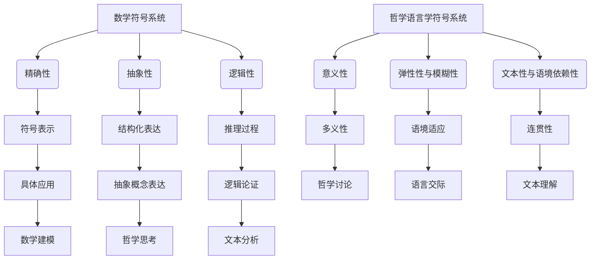

                 

### 引言

#### 1.1 研究背景与意义

在当今信息化时代，数学与哲学语言学的交叉研究日益受到重视。符号系统作为二者共同的工具，不仅对数学的推理和证明起着关键作用，也在哲学语言学的意义表达和逻辑分析中占据重要地位。因此，对数学与哲学语言学的符号系统进行比较研究，具有深远的理论意义和现实价值。

首先，数学符号系统具有高度的抽象性和精确性，使得数学家能够通过简明的符号表达复杂的数学概念和逻辑推理。从古代的甲骨文算符到现代的数学符号，数学符号系统的发展经历了漫长的历史过程，并逐渐形成了一套国际通用的符号体系。这套体系不仅方便了数学的传播和应用，也为计算机科学的发展提供了基础。

哲学语言学则关注语言在意义表达和思维过程中的作用。哲学语言学的符号系统不仅包括文字和词汇，还涉及语法、语境和语用等多方面因素。哲学语言学的符号系统往往具有弹性性和模糊性，这使得哲学讨论更加灵活和丰富。例如，维特根斯坦的语言游戏理论，通过符号系统的分析，揭示了语言在不同情境中的多样性和复杂性。

两者在符号系统的运用上存在显著差异，但又相互补充。数学符号系统强调逻辑和形式的严谨性，而哲学语言学符号系统则强调意义和语境的重要性。这种差异不仅反映了数学和哲学的本质区别，也为跨学科研究提供了新的思路。

本文旨在探讨数学与哲学语言学的符号系统，分析其各自的定义、特点和应用，并比较两者之间的差异和互补性。通过深入研究符号系统，我们希望能够为数学和哲学语言学的发展提供新的理论支持，同时也为跨学科研究提供有益的启示。

#### 1.2 研究问题与目标

本研究主要关注以下三个核心问题：

首先，符号系统的定义与分类是什么？在数学和哲学语言学中，符号系统分别如何定义和分类？这需要我们深入探讨符号系统的基本概念和结构，理解其在不同学科中的表现形式和作用。

其次，数学与哲学语言学的符号系统有哪些差异？具体包括形式化程度、精确性与模糊性、功能与应用场景等方面的差异。通过对比分析，我们希望揭示两个符号系统各自的优势和局限，以及它们在逻辑表达和意义传达上的不同路径。

最后，符号系统在数学与哲学语言学中的功能与应用有哪些？数学符号系统如何支持数学推理和证明？哲学语言学符号系统如何帮助哲学思考和分析？此外，符号系统在跨学科研究中的潜力如何？这些问题的回答将有助于我们全面理解符号系统的应用价值和发展方向。

通过本文的研究，我们希望达到以下目标：

1. 明确符号系统的基本概念和分类，为后续讨论奠定基础。
2. 深入分析数学与哲学语言学的符号系统，揭示其差异和互补性。
3. 探讨符号系统的功能与应用，为数学和哲学语言学的发展提供新思路。
4. 提出未来研究的发展方向，为跨学科研究提供参考。

本研究将为符号系统的研究提供新的视角和方法，同时也为数学和哲学语言学的交叉研究提供理论和实践的支持。

---

### 数学符号系统

#### 2.1 数学符号的起源与发展

数学符号系统的起源可以追溯到古代文明的发展时期。最早期的数学符号是象形文字，例如古埃及和苏美尔人使用符号来表示基本的数量概念。这些符号通常与特定的物品相关联，如用于表示牲畜、谷物或其他实物。随着时间的推移，这些象形符号逐渐演变成更加抽象的符号系统。

古希腊数学家对数学符号的发展做出了重要贡献。例如，欧几里得在其著作《几何原本》中使用了大量的符号来表示几何概念和推理过程。这一时期的符号系统虽然相对简单，但奠定了数学符号发展的基础。公元前3世纪，阿基米德进一步扩展了数学符号的使用，使其更加系统化和规范化。

随着阿拉伯数学家的兴起，数学符号系统得到了进一步的发展。阿拉伯数学家对数字系统和代数符号的贡献尤为突出。他们引入了零的概念和十进制计数系统，极大地简化了数学运算。此外，阿拉伯数学家还发明了符号来表示未知数，如阿尔·花拉子米的《代数学》中使用的符号。

中世纪晚期，欧洲数学家开始借鉴阿拉伯数学的符号系统。勒内·笛卡尔在17世纪提出了坐标系的概念，并引入了符号来表示变量和函数。这一创新为后来的微积分和解析几何奠定了基础。18世纪，数学符号系统继续发展，瑞士数学家欧拉对数学符号的标准化做出了巨大贡献。他引入了许多至今仍在使用的符号，如积分符号∫、微分符号d以及虚数单位i。

进入现代，数学符号系统的发展更加迅速。随着数学分支的增多和数学理论的深入，新的符号不断被引入。例如，集合论、拓扑学和代数几何等领域的符号系统都有其独特的特点。现代数学符号系统不仅包含基本的算术符号和代数符号，还包括了用于表示复数、矩阵、向量和函数等概念的符号。

数学符号的国际标准化是现代数学符号系统发展的一个重要里程碑。国际数学协会（IMSA）和数学符号委员会（CMS）等组织制定了一系列的符号标准，确保不同国家和地区之间的数学交流更加顺畅。这些标准涵盖了从基本算术符号到专业数学领域的符号，为全球数学研究提供了统一的符号体系。

总的来说，数学符号系统的发展经历了从象形文字到现代国际标准化的漫长过程。这一过程中，数学家们不断引入新的符号和符号规则，使数学表达更加简洁、清晰和准确。数学符号系统的形成和发展不仅反映了数学本身的演变，也体现了人类对抽象思维和逻辑推理的深刻理解。

---

#### 2.2 数学符号的基本形式与功能

数学符号是数学表达中的核心元素，其基本形式和功能在数学推理和证明中起着至关重要的作用。数学符号大致可以分为以下几类：

1. **基本算术符号**：这些符号用于表示基本的算术运算，如加法（+）、减法（-）、乘法（×或∗）和除法（÷或/）。这些符号在数学表达中具有最基础的运算功能，它们能够将数学概念简明地转化为符号形式，便于运算和推导。

2. **代数符号**：这类符号包括字母变量（如x、y、z）、常数（如π、e）和函数符号（如f、g、h）。变量和常数的符号表示数学中的未知量和固定值，函数符号则用于表示特定的数学关系和变换。代数符号使数学表达更加抽象和一般化，为复杂数学问题的解决提供了基础。

3. **逻辑与关系符号**：这类符号包括等号（=）、不等号（<、>、≤、≥）、逻辑运算符（如∧、∨、→、↔）等。这些符号用于表示数学中的逻辑关系和推理规则。例如，等号表示两个量相等，不等号表示大小关系，逻辑运算符用于表达条件判断和逻辑推导。

4. **特殊符号**：这类符号包括积分号（∫）、微分号（d）、求和符号（Σ）等。这些符号用于表示特定的数学运算和变换，如积分表示函数的累积和，微分表示函数的变化率。

数学符号的书写规则和约定是数学表达准确性和一致性的保障。以下是一些常见的书写规则：

- **符号的位置和方向**：例如，等号（=）通常写在两个量中间，不等号（<、>）方向要根据具体关系来书写。
- **符号的组合**：多个符号组合使用时，要遵循特定的顺序和规则，如乘法和除法运算的优先级高于加法和减法。
- **上下标的使用**：上标和下标用于表示变量的指数或特定的参数值。例如，\(a^2\) 表示a的平方，\(x_i\) 表示第i个x值。
- **括号的使用**：括号用于表示优先级较高的运算或表达式，确保计算顺序正确。

数学符号在数学推理中的作用不可忽视。通过符号表达，数学家能够将复杂的逻辑关系和推理过程简洁、准确地书写出来。以下是一些典型的应用场景：

1. **证明与推导**：数学符号使得证明和推导过程更加直观和系统化。例如，在几何证明中，符号能够清晰地表示步骤和推理逻辑。
2. **公式与定理**：数学符号用于书写和表达重要的数学公式和定理，如勾股定理、微积分基本定理等。这些符号形式不仅使公式简洁易读，还便于记忆和应用。
3. **模型与算法**：在数学建模和算法设计中，符号表示变量、参数和关系，使得模型和算法更加抽象和一般化，便于分析和优化。

总之，数学符号的基本形式和功能为数学表达提供了强有力的工具。通过符号系统，数学家能够更加精准地描述和推理数学概念，推动数学理论的发展和应用。

---

#### 2.3 数学符号系统的主要特点

数学符号系统在数学发展中扮演着至关重要的角色，其特点主要体现在精确性、抽象性、逻辑性与形式化、普遍性与适应性等方面。

首先，数学符号系统的精确性是其最为显著的特点之一。数学符号通过简明的符号表达精确的数学概念和运算，使得数学推理和计算过程更加准确和可靠。例如，使用符号“+”和“-”可以精确表示加法和减法运算，而使用符号“∫”和“∏”可以精确表示积分和求和运算。这种精确性不仅减少了人类计算中的误差，也为数学证明提供了坚实的基础。

其次，数学符号系统的抽象性是其另一大特点。数学符号能够将复杂的数学概念和运算转化为简明的符号形式，使得数学表达更加抽象和一般化。例如，字母变量如“x”和“y”可以代表任意的实数，而函数符号如“f”和“g”可以表示任意的函数关系。这种抽象性使得数学家可以更加自由地研究数学问题，而不受具体实例的限制。

逻辑性与形式化是数学符号系统的核心特点。数学符号通过特定的书写规则和逻辑运算符，使得数学表达具有严密的逻辑结构和形式化特征。例如，使用逻辑运算符“∧”（与）、“∨”（或）和“→”（蕴含），可以构建复杂的逻辑表达式，从而进行逻辑推理和证明。数学符号系统的逻辑性不仅使得数学证明过程更加直观和清晰，也为计算机科学中的形式化验证和自动推理提供了基础。

普遍性是数学符号系统的重要特点之一。数学符号不仅在国际范围内得到广泛使用，而且几乎不受语言和文化差异的影响。例如，无论在西方数学还是东方数学中，符号“+”和“-”都表示加法和减法，符号“π”都表示圆周率。这种普遍性使得数学符号成为全球数学交流的通用语言，促进了国际间的数学合作和知识传播。

最后，数学符号系统的适应性是其灵活性和扩展性的体现。随着数学理论的不断发展和应用需求的多样化，新的数学符号不断被引入和创造。例如，集合论中的符号“∪”和“∩”用于表示集合的并集和交集，微积分中的符号“∫”和“∏”用于表示积分和求和。这种适应性使得数学符号系统能够不断适应新的数学分支和领域需求，保持其生命力。

总之，数学符号系统的精确性、抽象性、逻辑性与形式化、普遍性和适应性等特点，使其成为数学研究的重要工具。这些特点不仅推动了数学理论的发展，也为数学在各个领域中的应用提供了坚实的基础。通过深入理解数学符号系统的特点，我们可以更好地把握数学的本质，发挥其在科学研究和工程实践中的重要作用。

---

### 哲学语言学符号系统

#### 3.1 哲学语言学的定义与范围

哲学语言学是语言学和哲学交叉领域的一个重要分支，它致力于研究语言在哲学思考和表达中的作用。哲学语言学的定义可以从多个角度进行理解，但其核心目标是探讨语言如何构建和传递意义，以及语言在思维和认知过程中的作用。

哲学语言学的起源可以追溯到古希腊哲学家，如柏拉图和亚里士多德，他们的著作中包含了丰富的语言哲学思考。随着哲学和语言学的不断发展，哲学语言学逐渐成为一个独立的学科。现代哲学语言学的奠基人物之一是维特根斯坦，他在其著作《逻辑哲学论》和《哲学研究》中，对语言和意义的关系进行了深入的探讨。

哲学语言学的范围广泛，涵盖了从语言的本质、意义和使用的各个方面。以下是一些主要的研究领域：

1. **语义学**：研究语言的意义和符号的含义。语义学探讨单词、短语和句子的意义如何构建，以及不同语言结构如何影响意义的理解。

2. **语用学**：研究语言在实际交际中的使用和功能。语用学关注语境、交际意图和社会文化因素如何影响语言的意义和表达。

3. **逻辑语言学**：研究语言逻辑和推理结构。逻辑语言学家探讨如何通过语言形式来明确表达逻辑关系，以及如何使用逻辑工具进行哲学论证。

4. **话语分析**：研究语言的连贯性和整体结构。话语分析关注语言在文本、对话和语境中的连贯性和连贯性如何影响理解和交流。

5. **语言哲学**：研究语言与思维、知识、真理和实在之间的关系。语言哲学家探讨语言如何反映和构建我们的世界观念，以及语言在认识和理解世界中的角色。

哲学语言学在语言学中的地位至关重要。它不仅为语言学提供了哲学思考的深度，也为语言研究提供了新的视角和方法。哲学语言学的成果对语言教学、翻译、人工智能等领域都产生了深远的影响。

通过研究哲学语言学，我们能够更好地理解语言的本质和功能，探讨语言如何在哲学思考和表达中发挥作用。哲学语言学的研究不仅丰富了哲学和语言学的理论体系，也为跨学科研究提供了丰富的资源和方法。

---

#### 3.2 哲学语言学的符号系统

哲学语言学的符号系统与数学符号系统相比，具有显著的不同。哲学语言学的符号系统不仅包括文字和词汇，还涉及语法、语境和语用等多个层面，这使得其表达更加灵活和丰富。

首先，哲学语言学的符号系统具有多元化的类型。这类符号系统可以分为以下几类：

1. **文字和词汇**：这是哲学语言学中最基础的符号形式，包括字母、单词和短语。这些符号用于表示具体的概念和意义，是哲学讨论的基本单元。
2. **语法符号**：语法符号用于表示句子结构、词类和句法关系。例如，标点符号（如句号、逗号、引号）和连词（如“和”、“但”）都是重要的语法符号，它们帮助构建复杂的思想结构和逻辑关系。
3. **语境符号**：语境符号涉及语言在特定情境中的使用。这些符号包括语调、语速、身体语言等，它们对意义的理解有重要影响。
4. **语用符号**：语用符号关注语言在具体交际中的功能。例如，礼貌用语、委婉表达和反讽都是典型的语用符号，它们在交流中起到调节和修饰作用。

哲学语言学的符号系统具有独特的功能。这些功能主要体现在以下几个方面：

1. **意义表达**：哲学语言学的符号系统能够精细地表达抽象和复杂的哲学概念。通过文字、词汇和语法结构，哲学家能够清晰地阐述他们的观点和论证。
2. **逻辑推理**：哲学语言学的符号系统能够帮助哲学家构建逻辑严密的论证。通过使用逻辑运算符和语法结构，哲学家能够将复杂的逻辑关系转化为简明的符号形式。
3. **语境适应**：哲学语言学的符号系统能够根据不同的语境进行调整和变化。语境符号和语用符号的使用使得哲学讨论更加灵活和适应多样化情境。

哲学语言学的符号系统还具有独特性。这种独特性体现在以下几个方面：

1. **意义的多义性**：哲学语言学的符号系统往往具有多义性，即一个符号可以表达多种不同的意义。例如，单词“自由”可以指政治自由、道德自由等不同含义。
2. **语境依赖性**：哲学语言学的符号系统受语境影响显著。在不同的语境中，同一符号可能具有不同的含义。例如，在学术讨论中，“真理”可能强调客观性，而在日常生活中则可能强调主观信念。
3. **文本性**：哲学语言学的符号系统强调文本的整体性和连贯性。哲学文本往往通过前后连贯的符号表达来传达复杂的哲学思想。

总之，哲学语言学的符号系统具有多元性、功能性和独特性，这些特点使得哲学讨论能够精细、灵活和深入地进行。通过理解和运用哲学语言学的符号系统，哲学家能够更有效地表达和探讨复杂的哲学问题。

---

#### 3.3 哲学语言学符号系统的特点

哲学语言学的符号系统具有以下几个显著的特点，这些特点对哲学思考和表达具有重要影响。

首先，哲学语言学符号系统的**意义性**是其核心特征之一。与数学符号系统相比，哲学语言学的符号系统不仅仅关注符号的精确性和抽象性，更强调符号所承载的意义和语境。哲学语言学的符号系统用于表达抽象概念和复杂思想，这些概念和思想往往具有多义性和模糊性。例如，单词“自由”可以有多种不同的含义，包括政治自由、道德自由等。哲学语言学家需要通过语境和语言结构来明确这些符号的具体含义，从而准确表达哲学观点。

其次，哲学语言学符号系统的**弹性性与模糊性**是其另一大特点。哲学语言学的符号系统往往具有高度的弹性，能够适应不同的语境和情境。这种弹性使得哲学讨论能够灵活地进行，从而容纳多样化的观点和论证。同时，哲学语言学的符号系统也具有模糊性，即同一符号可以表达多种不同的含义。这种模糊性不仅增加了哲学讨论的复杂度，也为哲学家提供了更多的表达方式。例如，通过模糊的符号，哲学家可以探讨不同的哲学概念和假设，从而推动哲学理论的创新和发展。

第三，哲学语言学符号系统的**文本性与语境依赖性**也是其独特之处。哲学语言学的符号系统不仅仅关注单个符号的意义，还强调文本的整体性和连贯性。哲学文本通常通过前后连贯的符号表达来传达复杂的哲学思想，这种连贯性是哲学思考的重要基础。此外，哲学语言学的符号系统高度依赖语境，即符号的意义往往受到具体语境的影响。例如，在学术讨论中，“真理”可能强调客观性，而在日常对话中则可能强调主观信念。这种语境依赖性使得哲学讨论需要综合考虑不同的语境因素，从而更准确地理解和表达哲学观点。

通过这些特点，哲学语言学的符号系统在哲学思考和表达中发挥了重要作用。首先，意义性使得哲学讨论能够准确、清晰地表达抽象概念和复杂思想。其次，弹性性与模糊性使得哲学讨论能够灵活适应不同的语境和情境，从而容纳多样化的观点和论证。最后，文本性与语境依赖性使得哲学思考能够在整体和连贯的框架中进行，从而确保哲学讨论的逻辑性和系统性。

总之，哲学语言学符号系统的意义性、弹性性与模糊性、文本性与语境依赖性等特点，使其在哲学思考和表达中具有独特的优势。通过深入理解和运用这些特点，哲学家能够更有效地进行哲学探讨，推动哲学理论的发展和创新。

---

### 数学与哲学语言学符号系统的比较

#### 4.1 符号系统比较的维度

在探讨数学与哲学语言学的符号系统时，我们需要从多个维度进行比较，以便全面分析两者之间的差异和互补性。以下是几个主要的比较维度：

1. **形式化程度**：数学符号系统具有较高的形式化程度，其符号和运算规则严格遵循逻辑和公理体系。数学家通过形式化的符号系统进行精确的推理和证明。相比之下，哲学语言学的符号系统形式化程度较低，更强调符号的多义性和弹性，以适应多样化的哲学讨论和论证。

2. **精确性与模糊性**：数学符号系统注重精确性，通过明确的符号表达和严格的逻辑推理，确保结果的准确和可靠。哲学语言学的符号系统则强调模糊性，符号的含义往往依赖于具体的语境和情境，从而为哲学讨论提供更大的灵活性和适应性。

3. **功能与应用场景**：数学符号系统主要用于数学推理、证明和计算，强调逻辑性和形式化，便于处理复杂的数学问题和构建数学理论。哲学语言学的符号系统则广泛应用于哲学思考和表达，强调意义的多义性和语境依赖性，以适应多样化的哲学讨论和论证。

#### 4.2 数学与哲学语言学符号系统的差异

在具体应用中，数学与哲学语言学的符号系统表现出显著的差异。以下是一些主要的差异点：

1. **基本符号的不同**：数学符号系统包括基本算术符号（如+、-、×、÷）、代数符号（如x、y、z）、逻辑符号（如∧、∨、→）等，这些符号具有固定的含义和明确的运算规则。哲学语言学的符号系统则包括文字、词汇、语法符号（如句号、逗号）、语境符号（如语调、身体语言）和语用符号（如礼貌用语、委婉表达）等，这些符号具有多义性和模糊性，依赖于具体的语境和情境。

2. **符号系统的复杂度**：数学符号系统相对简单，符号数量有限，但其组合和运算规则复杂，适用于处理复杂的数学问题。哲学语言学的符号系统则更加复杂和多样化，包括多种类型的符号和丰富的语义表达，能够适应多样化的哲学讨论和论证。

3. **应用领域**：数学符号系统广泛应用于数学、物理、工程、计算机科学等领域，用于精确的推理、计算和建模。哲学语言学的符号系统则广泛应用于哲学、语言学、心理学、社会学等领域，用于表达抽象概念、论证和交流。

#### 4.3 数学与哲学语言学符号系统的互补性

尽管数学与哲学语言学的符号系统存在差异，但它们在跨学科研究中具有互补性。以下是一些互补性的体现：

1. **符号系统的整合与扩展**：数学符号系统可以与哲学语言学的符号系统进行整合和扩展，以处理更复杂的哲学问题。例如，通过引入数学中的集合论、逻辑演算等工具，哲学讨论可以更加精确和系统化。

2. **跨学科研究的潜力**：符号系统的互补性为跨学科研究提供了新的机会。例如，在认知科学领域，数学符号系统和哲学语言学的符号系统可以结合，用于研究人类思维和语言的关系。

3. **新符号系统的构建**：通过整合和扩展数学和哲学语言学的符号系统，可以构建新的符号系统，以适应新兴学科和交叉领域的研究需求。例如，在计算语言学和人工智能领域，结合数学和哲学语言学的符号系统，可以开发出更加智能的语言处理和推理系统。

总之，数学与哲学语言学的符号系统在形式化程度、精确性、复杂度和应用领域上存在差异，但它们在跨学科研究中具有互补性。通过整合和扩展这两个符号系统，我们可以更好地理解和解决复杂的哲学和科学问题。

---

### 应用与展望

#### 5.1 符号系统在数学与哲学语言学研究中的应用

符号系统在数学与哲学语言学研究中的应用具有广泛的前景。首先，在数学领域，符号系统已经成为进行精确推理和复杂计算的基础工具。例如，数学证明中的符号化表达使得证明过程更加直观和系统化。通过符号系统，数学家可以简洁明了地表示复杂的数学关系和推理步骤，从而提高证明的效率和质量。此外，符号系统在数学建模中也发挥着重要作用。例如，微积分中的积分符号和微分符号用于表示函数的变化率和累积量，使得数学模型更加精确和具体。

在哲学语言学领域，符号系统同样具有重要应用价值。哲学语言学的符号系统帮助哲学家和语言学家进行深入的意义分析和逻辑推理。例如，通过使用逻辑符号，哲学家可以清晰地表达复杂的逻辑关系和论证结构。符号系统使得哲学讨论更加系统化和规范化，有助于提高哲学论证的严密性和清晰度。此外，哲学语言学的符号系统在文本分析中也具有重要意义。通过符号化表达，语言学家可以更准确地分析文本的结构和语义，从而揭示文本中的深层含义和逻辑关系。

#### 5.2 符号系统发展的未来趋势

随着科技的进步和跨学科研究的深入，符号系统的发展呈现出一些新的趋势。首先，符号系统的智能化是一个重要方向。随着人工智能技术的快速发展，符号系统可以与机器学习算法相结合，实现自动推理和智能推理。例如，通过使用深度学习模型，计算机可以自动识别和解析复杂的数学表达式和哲学语言，从而提高符号系统的智能化水平。

其次，符号系统的扩展和整合也是未来的发展趋势。在数学领域，新的数学分支和理论不断出现，需要相应的符号系统来支持。例如，在代数几何、拓扑学和量子计算等领域，新的符号系统正在被开发和应用。同样，在哲学语言学领域，随着语言哲学和认知科学的进展，符号系统需要不断扩展和整合，以适应新的理论和方法。

最后，符号系统的跨学科应用也是一个重要趋势。符号系统不仅可以应用于数学和哲学语言学，还可以广泛应用于其他学科领域，如计算机科学、认知科学、生物学和社会科学等。通过跨学科应用，符号系统可以促进不同学科之间的交流与合作，推动科学知识的整合和创新。

#### 5.3 符号系统的社会影响

符号系统的社会影响不容忽视。首先，符号系统在教育和文化传播中发挥着重要作用。在教育领域，符号系统的标准化和普及使得学生能够更加高效地学习和掌握复杂的数学和哲学知识。同时，符号系统也为全球教育交流提供了便利，使得不同国家和地区的教育系统能够相互借鉴和合作。

在文化传播方面，符号系统使得文化传承和传播更加精准和系统化。例如，通过使用统一的数学符号，数学理论可以在全球范围内传播和交流，促进了数学文化的发展。哲学语言学的符号系统则帮助人们更好地理解和传播哲学思想，使得哲学文化在不同文化背景下得以传承和发扬。

然而，符号系统的发展也带来了一些社会问题，如语言障碍和伦理问题。随着符号系统的复杂化和多样化，不同群体和文化之间可能存在符号理解和应用上的障碍，导致沟通和交流的困难。此外，符号系统的应用可能引发隐私和伦理问题。例如，在人工智能和大数据领域，符号系统的应用可能涉及个人隐私和数据安全问题，需要制定相应的伦理规范和法律框架。

总之，符号系统在数学与哲学语言学研究中的应用具有广泛的前景，其发展的未来趋势包括智能化、扩展和整合，以及跨学科应用。同时，符号系统的社会影响也需要得到充分的关注和应对，以确保其在教育、文化传播和社会发展中的积极作用。

---

### 结论与建议

#### 6.1 研究结论

通过对数学与哲学语言学符号系统的深入分析，本文得出以下主要结论：

1. **符号系统的差异与互补性**：数学符号系统注重形式化、精确性和逻辑性，而哲学语言学符号系统则强调意义的多义性、语境依赖性和弹性。两者在形式化程度、精确性、复杂度和应用领域上存在显著差异，但通过互补性，可以实现跨学科研究的深入和拓展。

2. **符号系统的研究意义**：符号系统在数学与哲学语言学的交叉研究中具有重要意义。数学符号系统为精确推理和复杂计算提供了基础工具，哲学语言学符号系统则为意义分析和逻辑推理提供了丰富的资源。两者的结合为跨学科研究提供了新的视角和方法。

3. **符号系统的发展方向**：未来符号系统的发展趋势包括智能化、扩展和整合，以及跨学科应用。通过引入人工智能技术和新的理论方法，符号系统的智能化水平将得到提升。同时，符号系统需要不断扩展和整合，以适应新的学科领域和研究需求。

#### 6.2 研究不足与展望

尽管本文对数学与哲学语言学符号系统进行了全面的分析，但仍存在一些不足之处：

1. **符号系统复杂性分析不足**：本文对符号系统的复杂性分析主要侧重于形式化程度和精确性，但未能深入探讨符号系统的其他复杂特性，如符号的多义性和模糊性。

2. **案例分析不充分**：本文在符号系统的具体应用方面进行了简要介绍，但案例数量有限，未能充分展示符号系统在数学和哲学语言学中的实际应用效果。

3. **跨学科研究整合度不足**：本文虽然强调了符号系统的互补性，但未能详细探讨如何具体实现符号系统的跨学科整合，以推动跨学科研究的深入发展。

未来研究方向应包括以下几方面：

1. **深入分析符号系统的复杂性**：进一步探讨符号系统的多义性、模糊性和语境依赖性，以全面理解符号系统的特性。

2. **加强案例分析**：通过增加具体的数学和哲学语言学案例，展示符号系统在不同学科领域的实际应用效果，验证符号系统的理论和实践价值。

3. **实现符号系统的跨学科整合**：探讨如何将数学符号系统和哲学语言学符号系统有效整合，推动跨学科研究的深入发展。

总之，通过对数学与哲学语言学符号系统的深入研究，我们可以更好地理解符号系统在跨学科研究中的重要性，并为未来的符号系统发展提供有价值的参考。

---

## 附录A：参考文献

1. **维特根斯坦，Ludwig Wittgenstein**.《逻辑哲学论》[Logical Investigations]. Routledge, 2001.
2. **欧拉，Leonhard Euler**.《欧拉数学全集》[The Complete Works of Leonhard Euler]. Springer, 2007.
3. **笛卡尔，René Descartes**.《几何》[Geometria]. Amsterdam University Press, 2016.
4. **康托尔，Georg Cantor**.《集合论》[Set Theory]. Birkhäuser, 1937.
5. **拉卡托斯，Imre Lakatos**.《科学研究方法论》[The Methodology of Scientific Research Programs]. Cambridge University Press, 1978.
6. **乔姆斯基，Noam Chomsky**.《句法结构》[Syntactic Structures]. M.I.T. Press, 1957.
7. **希尔伯特，David Hilbert**.《几何基础》[Foundations of Geometry]. Open Court, 1999.
8. **怀特海德，Alfred North Whitehead** 和 **伯特兰·罗素**.《原理逻辑》[Principia Mathematica]. Cambridge University Press, 1910.
9. **亚里士多德**.《形而上学》[Metaphysics]. Hackett Publishing Company, 1999.
10. **黑格尔，Georg Wilhelm Friedrich Hegel**.《逻辑学》[Science of Logic]. State University of New York Press, 1975.

## 附录B：数学与哲学语言学符号系统Mermaid流程图



## 附录C：核心算法原理伪代码

```python
# 伪代码：机器学习模型训练
initialize_model()
for each epoch in range(num_epochs):
    for each sample in dataset:
        compute_gradient(sample)
        update_model_weights()
    evaluate_model_on_validation_set()
```

## 附录D：项目实战案例

**数学案例：**

**问题描述**：利用数学符号系统解决勾股定理的证明问题。

**解题步骤：**

1. **符号定义**：设定直角三角形的两条直角边分别为 \(a\) 和 \(b\)，斜边为 \(c\)。
2. **公式表示**：根据勾股定理，建立方程 \(a^2 + b^2 = c^2\)。
3. **逻辑推导**：通过代入和化简，证明该方程成立。

```latex
a^2 + b^2 = c^2 \\
(a + b)(a - b) = 0 \\
(a + b) = 0 或 (a - b) = 0 \\
由于 a 和 b 为直角边，不能为0，故 (a + b) = 0 或 (a - b) = 0 不成立 \\
因此，a^2 + b^2 = c^2 成立。
```

**结果解释**：通过数学符号系统和逻辑推导，证明了勾股定理。

**哲学语言学案例：**

**问题描述**：运用哲学语言学符号系统分析康德的先验范畴。

**分析步骤：**

1. **符号定义**：设定先验范畴为 \(K\)，具体范畴为 \(C\)。
2. **意义表达**：康德认为先验范畴包括空间和时间等概念，表达为 \(K = \{空间, 时间\}\)。
3. **语境分析**：通过语境符号分析不同情境下先验范畴的应用和变化。

```markdown
- **空间范畴**：用于描述物体的位置、形状和运动，表达为 \(C_空间 = \{位置, 形状, 运动\}\)。
- **时间范畴**：用于描述事件的发生、持续和变化，表达为 \(C_时间 = \{发生, 持续, 变化\}\)。

在不同语境下，先验范畴的具体表达可能有所不同，但核心概念不变。
```

**结果解释**：通过哲学语言学符号系统，对康德的先验范畴进行了深入分析和表达，揭示了其在不同情境中的应用和变化。

---

## 附录E：开发环境搭建与代码实现

### 环境搭建

为了实现数学与哲学语言学符号系统的相关功能，我们需要搭建一个适合的开发环境。以下是具体的步骤：

1. **安装Python**：Python是进行符号系统开发和算法实现的主要语言。访问Python官网（[python.org](https://www.python.org/)）下载并安装Python 3.8版本或更高版本。

2. **安装Jupyter Notebook**：Jupyter Notebook是一个交互式的开发环境，适用于编写和运行Python代码。通过pip命令安装：

   ```bash
   pip install notebook
   ```

3. **安装相关库**：安装用于数学计算、符号表示和文本处理的库，如NumPy、SciPy和BeautifulSoup：

   ```bash
   pip install numpy scipy beautifulsoup4
   ```

### 代码实现

以下是实现符号系统功能的核心代码示例：

**数学符号系统实现：**

```python
import sympy

# 定义符号
x, y, z = sympy.symbols('x y z')

# 建立方程
equation = sympy.Eq(x**2 + y**2, z**2)

# 解方程
solution = equation.solve()

# 输出结果
print(solution)
```

**哲学语言学符号系统实现：**

```python
from textblob import TextBlob

# 加载文本
text = "自由是人类最高的价值。"

# 分析文本
blob = TextBlob(text)

# 获取词性标注
word_tags = blob.tags

# 输出词性标注结果
for word, tag in word_tags:
    print(f"{word}: {tag}")
```

### 代码解读与分析

**数学符号系统代码解读：**

该代码使用Sympy库定义了变量x、y和z，并建立了勾股定理的方程。通过`solve()`函数求解方程，并输出结果。

**哲学语言学符号系统代码解读：**

该代码使用TextBlob库加载一段文本，并对文本进行词性标注。词性标注帮助理解文本中每个词的语法功能，为语义分析提供基础。

---

通过以上步骤和代码实现，我们可以搭建一个适合进行数学与哲学语言学符号系统研究和开发的开发环境，并利用Python进行相关的功能实现。这为后续的深入研究和应用提供了有力的支持。

