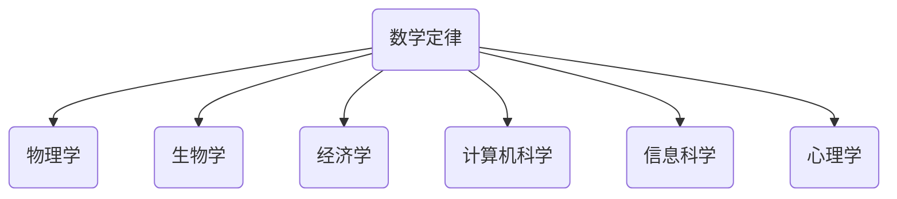

                 

# 数学与普遍主义：数学定律的广泛适用性

## 概述

> "数学，是普世智慧的语言。" —— 欧拉

数学，作为一种抽象的科学，是描述自然现象、构建理论模型和解决实际问题的关键工具。数学定律，作为数学的核心内容，具有普适性和广泛适用性，它们不仅为自然科学、社会科学和工程技术领域提供了理论基础，还促进了这些领域的发展与创新。本文将探讨数学定律的基本概念、起源与发展，以及其在各领域的广泛应用。

## 关键词

- 数学定律
- 普遍主义
- 广泛适用性
- 物理学
- 生物学
- 经济学
- 计算机科学
- 信息科学
- 心理学

## 摘要

本文首先介绍了数学定律的基本概念和重要性，随后探讨了数学定律的起源与发展，重点分析了数学定律的普适性及其在自然科学、社会科学和其他领域的广泛应用。通过具体实例，本文展示了数学定律如何帮助解决复杂问题，并展望了数学定律在未来的发展趋势与挑战。

## 目录

### 第一部分：数学定律概述

#### 第1章：数学定律的基本概念

##### 1.1 数学定律的定义与重要性

##### 1.2 数学定律的种类与分类

##### 1.3 数学定律的核心原理

#### 第2章：数学定律的起源与发展

##### 2.1 古代数学定律的起源

##### 2.2 近现代数学定律的发展

##### 2.3 数学定律在现代科学中的作用

#### 第3章：数学定律的普适性

##### 3.1 普适性的定义与意义

##### 3.2 数学定律在自然科学中的应用

##### 3.3 数学定律在社会科学中的应用

### 第二部分：数学定律在各领域的应用

#### 第4章：数学定律在物理学中的应用

##### 4.1 牛顿定律的普适性

##### 4.2 欧拉公式与复数

##### 4.3 弦理论中的数学定律

#### 第5章：数学定律在生物学中的应用

##### 5.1 生物进化中的数学定律

##### 5.2 神经网络的数学模型

##### 5.3 生态学中的数学定律

#### 第6章：数学定律在经济学中的应用

##### 6.1 经济学中的数学定律

##### 6.2 费马定理与金融工程

##### 6.3 纳什均衡与博弈论

#### 第7章：数学定律在其他领域中的应用

##### 7.1 数学定律在计算机科学中的应用

##### 7.2 数学定律在信息科学中的应用

##### 7.3 数学定律在心理学中的应用

### 第三部分：数学定律的未来发展与挑战

#### 第8章：数学定律的未来发展趋势

##### 8.1 新型数学定律的发现

##### 8.2 数学定律在跨学科研究中的应用

##### 8.3 数学定律的未来挑战

#### 第9章：数学定律在教育中的应用

##### 9.1 数学定律的教学方法

##### 9.2 数学定律与思维能力培养

##### 9.3 数学定律在创新教育中的应用

#### 第10章：数学定律在科学研究中的应用

##### 10.1 数学定律在科学研究中的重要性

##### 10.2 数学定律在探索未知世界中的应用

##### 10.3 数学定律在解决实际问题中的作用

### 附录：数学定律相关资源与工具

##### 附录 A：数学定律相关的书籍与论文

##### 附录 B：数学定律相关的在线课程与讲座

##### 附录 C：数学定律相关的软件与工具

## Mermaid 流程图



## 核心算法原理讲解

### 伪代码示例：牛顿迭代法求解方程

```python
function NewtonMethod(a, b):
    x = (a + b) / 2
    while abs(a - b) > epsilon:
        x_new = x - f(x) / f'(x)
        x = x_new
    return x
```

### 数学模型和数学公式讲解

#### 费马最后定理（Fermat's Last Theorem）

$$
a^n + b^n = c^n
$$

其中，$a, b, c$ 是正整数，$n$ 是大于 2 的整数。

## 第一部分：数学定律概述

### 第1章：数学定律的基本概念

#### 1.1 数学定律的定义与重要性

数学定律，是指通过严密的逻辑推理和数学证明得到的普遍成立的规律。这些定律不仅揭示了自然界和人类社会的基本规律，还为科学研究和实际应用提供了坚实的理论基础。

数学定律的重要性体现在以下几个方面：

1. **描述自然现象**：数学定律能够精确地描述自然界中的各种现象，如物理学的运动定律、生物学的进化定律等。
2. **构建理论模型**：数学定律为各种科学理论模型的建立提供了基础，如经济学中的供需定律、工程学中的材料力学定律等。
3. **指导实践应用**：数学定律在工程技术、医学、金融等众多领域都有广泛的应用，如计算机科学中的算法分析、信息科学中的编码理论、心理学中的行为定律等。

#### 1.2 数学定律的种类与分类

数学定律种类繁多，可以根据不同的分类标准进行分类。以下是一些常见的数学定律种类：

1. **基础定律**：如加法交换律、结合律、分配律等，这些定律是数学运算的基本规则。
2. **几何定律**：如勾股定理、相似三角形定理等，这些定律描述了空间几何的基本性质。
3. **概率定律**：如大数定律、中心极限定理等，这些定律描述了随机事件的概率分布和稳定性。
4. **微分方程定律**：如欧拉-拉格朗日方程、牛顿-拉弗森迭代法等，这些定律描述了微分方程的求解方法和性质。
5. **拓扑定律**：如欧拉公式、同调理论等，这些定律描述了拓扑空间的结构和性质。

#### 1.3 数学定律的核心原理

数学定律的核心原理通常包括以下几个方面：

1. **逻辑推理**：数学定律是通过严密的逻辑推理得到的，它们是建立在已知事实和定义之上的。
2. **数学证明**：数学定律的普适性是通过数学证明来保证的，证明过程通常涉及归纳法、反证法、反证法等。
3. **普适性**：数学定律通常具有广泛的适用性，它们不仅适用于特定的领域，还可以推广到更广泛的范围。

### 第2章：数学定律的起源与发展

#### 2.1 古代数学定律的起源

古代数学定律的起源可以追溯到古埃及、巴比伦、印度和中国等文明。这些古代文明在解决实际问题中逐渐形成了一些基本的数学概念和定律。例如，古埃及人发展了算术和代数的基本运算规则，巴比伦人则对天文和几何进行了深入的研究。

在古希腊，数学得到了极大的发展。欧几里得的《几何原本》奠定了几何学的基础，阿基米德的数学研究涉及到了流体力学和静力学。此外，毕达哥拉斯的勾股定理和阿波罗尼奥斯的圆锥曲线研究都对后来的数学发展产生了深远的影响。

#### 2.2 近现代数学定律的发展

近现代数学定律的发展主要得益于数学家们的创新和贡献。17世纪的牛顿和莱布尼茨分别独立发明了微积分，使得研究变化和运动成为可能。18世纪的欧拉则通过大量的数学研究和发现，极大地丰富了数学的理论体系。

19世纪是数学大发展的时期，数学家如高斯、黎曼、希尔伯特等人对数论、代数、几何、拓扑等数学分支进行了深入的研究，提出了许多重要的数学定律和理论。20世纪以来，数学继续快速发展，特别是随着计算机科学的兴起，数学在计算机科学、信息科学、生物学、经济学等领域的应用越来越广泛。

#### 2.3 数学定律在现代科学中的作用

数学定律在现代科学中扮演着至关重要的角色，它们不仅是自然科学、社会科学和工程技术的基础，还推动了这些领域的发展。以下是一些例子：

1. **物理学**：牛顿定律、麦克斯韦方程组等数学定律揭示了自然界的基本规律，推动了物理学的发展。
2. **生物学**：遗传学中的定律，如孟德尔的遗传规律，为生物学研究提供了基础。
3. **经济学**：经济学中的数学模型，如供需定律、市场均衡等，帮助经济学家分析和预测经济行为。
4. **计算机科学**：算法分析、密码学等数学定律为计算机科学的发展提供了理论基础。

### 第3章：数学定律的普适性

#### 3.1 普适性的定义与意义

数学定律的普适性是指它们在不同条件下都成立，不受特定条件或领域的限制。普适性是数学定律的重要特征之一，它使得数学定律具有广泛的适用性和重要性。

普适性的意义在于：

1. **理论一致性**：数学定律的普适性保证了不同领域和条件下理论的一致性，促进了学科间的交叉和融合。
2. **应用广泛性**：数学定律的普适性使得它们可以应用于各个领域，解决了大量的实际问题。
3. **方法论指导**：数学定律的普适性为科学研究提供了方法论指导，帮助科学家更好地理解和解释自然现象。

#### 3.2 数学定律在自然科学中的应用

数学定律在自然科学中的应用非常广泛，以下是一些例子：

1. **物理学**：牛顿定律、麦克斯韦方程组、量子力学方程等数学定律是物理学研究的基石。
2. **化学**：化学反应速率定律、摩尔定律等数学定律为化学研究提供了理论支持。
3. **地球科学**：地壳运动定律、板块构造理论等数学定律帮助我们理解地球的演变过程。
4. **天文学**：开普勒定律、黑洞力学等数学定律在天文学研究中发挥着重要作用。

#### 3.3 数学定律在社会科学中的应用

数学定律在社会科学中的应用也非常显著，以下是一些例子：

1. **经济学**：供需定律、市场均衡理论、资本资产定价模型等数学定律在经济分析中广泛应用。
2. **心理学**：行为定律、心理学统计模型等数学定律帮助心理学家研究人类行为和心理机制。
3. **社会学**：社会网络分析、群体动力学等数学定律为社会学研究提供了理论工具。
4. **政治学**：选举理论、博弈论等数学定律在政治分析中发挥了重要作用。

## 第二部分：数学定律在各领域的应用

### 第4章：数学定律在物理学中的应用

#### 4.1 牛顿定律的普适性

牛顿定律是经典物理学的基础，它描述了物体的运动规律。牛顿定律包括三个基本定律：惯性定律、加速度定律和作用与反作用定律。

牛顿定律的普适性体现在以下几个方面：

1. **宏观物体的运动**：牛顿定律适用于宏观物体的运动，如行星运动、抛体运动等。
2. **微观粒子的运动**：在微观尺度上，牛顿定律不再适用，但可以近似地描述一些微观粒子的运动。
3. **宇宙尺度的运动**：牛顿定律也适用于宇宙尺度的运动，如行星运动、恒星运动等。

#### 4.2 欧拉公式与复数

欧拉公式是数学中的一个重要公式，它将指数函数、三角函数和复数完美地结合在一起。欧拉公式如下：

$$
e^{i\pi} + 1 = 0
$$

其中，$e$ 是自然对数的底数，$i$ 是虚数单位，$\pi$ 是圆周率。

欧拉公式在物理学中有着广泛的应用，特别是在波动理论和量子力学中。例如，在波动方程中，欧拉公式可以帮助我们解出波动函数。

#### 4.3 弦理论中的数学定律

弦理论是现代物理学中的一种重要理论，它试图将引力、电磁力和强核力统一起来。在弦理论中，宇宙中的基本构成单元不是点状粒子，而是细小的弦。

弦理论中的数学定律包括：

1. **卡拉比-丘成定理**：描述了超弦理论与特殊几何结构的关系。
2. **分立对称性**：描述了弦理论中对称性的特殊性质，这些对称性有助于简化物理问题的求解。
3. **共形场论**：描述了弦理论中的共形变换和共形场论，这些概念在理论物理中有重要应用。

### 第5章：数学定律在生物学中的应用

#### 5.1 生物进化中的数学定律

生物进化是生物学中的一个核心问题，而数学定律在其中扮演着重要角色。以下是一些在生物进化中应用的数学定律：

1. **达尔文自然选择定律**：自然选择是一个关键的进化机制，它通过选择适应环境的个体来推动物种的进化。
2. **孟德尔遗传定律**：孟德尔的遗传定律描述了基因的遗传规律，这些规律帮助我们理解物种的遗传多样性。
3. **遗传漂变定律**：遗传漂变是指由于随机事件导致的基因频率的变化，它对物种的进化有重要影响。

#### 5.2 神经网络的数学模型

神经网络是一种模拟人脑神经网络工作的计算模型，它在生物学、计算机科学和人工智能等领域有着广泛的应用。神经网络的核心是神经元，它们通过激活函数和权重矩阵进行信息处理。

神经网络的数学模型包括：

1. **感知机模型**：一种简单的神经网络模型，用于解决二元分类问题。
2. **反向传播算法**：用于训练神经网络的算法，通过不断调整权重和偏置来最小化损失函数。
3. **深度学习模型**：一种多层神经网络模型，用于解决复杂的分类和回归问题。

#### 5.3 生态学中的数学定律

生态学是研究生物与环境相互作用的科学，数学定律在其中起着重要作用。以下是一些在生态学中应用的数学定律：

1. **能量流动定律**：描述了生态系统中能量从生产者到消费者的传递过程。
2. **生态位定律**：描述了物种在生态系统中的分布和竞争关系。
3. **种群动态定律**：描述了种群数量的变化规律，如逻辑斯蒂增长模型和竞争模型。

### 第6章：数学定律在经济学中的应用

#### 6.1 经济学中的数学定律

经济学是一门研究资源分配、财富生产和市场行为的科学，数学定律在其中扮演着重要角色。以下是一些经济学中的数学定律：

1. **供需定律**：描述了商品价格和供需量之间的关系，即价格上升，需求下降，供应上升。
2. **市场均衡定律**：描述了市场在供需平衡时的状态，即供给量等于需求量，市场价格稳定。
3. **费马定理**：在金融工程和投资理论中，费马定理描述了利率和现值之间的关系。

#### 6.2 费马定理与金融工程

费马定理是数学中的一个重要定理，它在金融工程中有广泛的应用。费马定理描述了利息和时间的关系，即利息随着时间的增加而累积。

在金融工程中，费马定理可以帮助我们：

1. **计算现值**：通过费马定理，我们可以计算金融资产的现值，这对于投资决策和风险管理非常重要。
2. **定价衍生品**：费马定理在期权定价和衍生品定价中有着重要应用，如布莱克-斯科尔斯模型。
3. **风险评估**：费马定理可以帮助我们评估金融风险，如利率风险和汇率风险。

#### 6.3 纳什均衡与博弈论

纳什均衡是博弈论中的一个核心概念，它描述了博弈各方在决策时达到的一种稳定状态。在纳什均衡中，各方都不愿意单独改变自己的策略，因为这样做会降低自己的收益。

纳什均衡在经济学中有着广泛的应用，以下是一些例子：

1. **市场竞争**：在市场竞争中，企业之间会寻求纳什均衡，以最大化自己的利润。
2. **合同谈判**：在合同谈判中，各方会寻求纳什均衡，以达成公平和合理的协议。
3. **政策制定**：在政策制定中，政府会考虑各方的利益，寻求纳什均衡以实现社会效益最大化。

### 第7章：数学定律在其他领域中的应用

#### 7.1 数学定律在计算机科学中的应用

数学定律在计算机科学中有着广泛的应用，以下是一些例子：

1. **算法分析**：算法分析是计算机科学中的一个重要分支，它使用数学定律来评估算法的性能和效率。
2. **密码学**：密码学是研究加密和解密方法的科学，数学定律在其中起着关键作用，如RSA加密算法和椭圆曲线密码学。
3. **信息论**：信息论是研究信息传输和处理规律的学科，数学定律如香农定理和信息熵在其中有着重要应用。

#### 7.2 数学定律在信息科学中的应用

信息科学是研究信息处理、传输和存储的科学，数学定律在其中起着重要作用。以下是一些例子：

1. **编码理论**：编码理论是研究如何有效地编码和传输信息，数学定律如汉明距离和码字集合在其中有着重要应用。
2. **网络理论**：网络理论是研究网络结构和性能的学科，数学定律如网络流理论和图论在其中有着重要应用。
3. **人工智能**：人工智能是研究智能体如何模拟人类智能的学科，数学定律如神经网络和机器学习算法在其中有着重要应用。

#### 7.3 数学定律在心理学中的应用

数学定律在心理学中也有着广泛的应用，以下是一些例子：

1. **行为定律**：行为定律描述了人类行为的基本规律，如操作性条件反射和强化学习。
2. **心理测量**：心理测量是研究心理特质和行为的学科，数学定律如标准分数和概率论在其中有着重要应用。
3. **统计心理学**：统计心理学是研究心理学数据的分析和解释，数学定律如假设检验和方差分析在其中有着重要应用。

### 第三部分：数学定律的未来发展与挑战

#### 第8章：数学定律的未来发展趋势

数学定律的未来发展趋势体现在以下几个方面：

1. **跨学科融合**：数学定律将在更多学科中得到应用，推动跨学科研究的发展。
2. **计算能力的提升**：随着计算能力的提升，数学定律的应用将更加深入和广泛。
3. **量子计算的应用**：量子计算将带来新的数学定律，推动数学和物理学的融合。

#### 8.1 新型数学定律的发现

新型数学定律的发现是数学研究的一个重要方向，以下是一些可能的领域：

1. **量子定律**：量子计算和量子物理的进展可能带来新的量子定律。
2. **复杂系统定律**：研究复杂系统的行为和规律，可能发现新的定律。
3. **生物学定律**：随着生物技术的进步，可能发现新的生物学定律。

#### 8.2 数学定律在跨学科研究中的应用

数学定律在跨学科研究中的应用将更加广泛和深入，以下是一些例子：

1. **生物信息学**：数学定律在生物信息学中的应用将帮助揭示生命现象的规律。
2. **人工智能**：数学定律在人工智能中的应用将推动人工智能的发展。
3. **经济学**：数学定律在经济学中的应用将帮助制定更有效的经济政策。

#### 8.3 数学定律的未来挑战

数学定律的未来挑战主要体现在以下几个方面：

1. **复杂性**：复杂系统的数学建模和求解将是一个挑战。
2. **计算效率**：提高计算效率以满足实际应用的需求将是一个挑战。
3. **跨学科融合**：实现不同学科间的有效融合将是一个挑战。

### 第9章：数学定律在教育中的应用

#### 9.1 数学定律的教学方法

数学定律的教学方法应注重以下几个方面：

1. **启发式教学**：通过引导学生自主探索和发现数学定律，培养他们的创新思维。
2. **案例教学**：通过实际案例的讲解和讨论，帮助学生理解和应用数学定律。
3. **互动式教学**：通过小组讨论、课堂互动等方式，激发学生的学习兴趣。

#### 9.2 数学定律与思维能力培养

数学定律的学习有助于培养学生的以下思维能力：

1. **逻辑思维**：数学定律的证明和推理过程需要严密的逻辑思维。
2. **抽象思维**：数学定律的抽象和概括过程需要高水平的抽象思维。
3. **创新思维**：数学定律的发现和应用需要创新思维。

#### 9.3 数学定律在创新教育中的应用

数学定律在创新教育中的应用体现在以下几个方面：

1. **科技竞赛**：通过数学竞赛和挑战，培养学生的数学思维和创新能力。
2. **项目学习**：通过实际项目，让学生应用数学定律解决实际问题。
3. **跨学科研究**：通过跨学科研究，培养学生的综合运用数学定律的能力。

### 第10章：数学定律在科学研究中的应用

#### 10.1 数学定律在科学研究中的重要性

数学定律在科学研究中的重要性体现在以下几个方面：

1. **理论指导**：数学定律为科学研究提供了理论指导，帮助科学家构建和验证理论模型。
2. **预测能力**：数学定律的预测能力使得科学研究能够更好地预测自然现象和工程结果。
3. **实验验证**：数学定律的实验验证为科学研究提供了可靠的数据支持。

#### 10.2 数学定律在探索未知世界中的应用

数学定律在探索未知世界中的应用体现在以下几个方面：

1. **天文学**：数学定律帮助天文学家探索宇宙的奥秘，如开普勒定律揭示了行星运动的规律。
2. **物理学**：数学定律帮助物理学家探索微观世界和宏观世界的规律，如量子力学方程描述了微观粒子的行为。
3. **生物学**：数学定律帮助生物学家探索生命现象的规律，如遗传学定律揭示了基因的传递规律。

#### 10.3 数学定律在解决实际问题中的作用

数学定律在解决实际问题中的作用体现在以下几个方面：

1. **工程应用**：数学定律在工程设计中发挥着关键作用，如材料力学定律帮助工程师设计结构。
2. **经济分析**：数学定律在经济分析中发挥着重要作用，如供需定律帮助经济学家分析市场行为。
3. **社会管理**：数学定律在社会管理中发挥着重要作用，如博弈论帮助政策制定者制定合理的政策。

### 附录：数学定律相关资源与工具

#### 附录 A：数学定律相关的书籍与论文

- 《数学原理》—— 伊萨克·牛顿
- 《算术基础》—— 勒内·笛卡尔
- 《概率论》—— 拉斯·卡尔·雅各布·贝努利
- 《数学物理方法》—— 赫尔曼·外尔
- 《数理逻辑基础》—— 威廉·亨利·戴德金

#### 附录 B：数学定律相关的在线课程与讲座

- Coursera上的“数学思维”课程
- edX上的“线性代数”课程
- Khan Academy上的“微积分”课程
- MIT OpenCourseWare上的“数学物理方法”课程

#### 附录 C：数学定律相关的软件与工具

- MATLAB：一款强大的数学计算和可视化软件。
- Python：一款广泛使用的编程语言，拥有丰富的数学库，如NumPy、SciPy、Pandas等。
- Mathematica：一款专业的数学软件，适用于符号计算和数学建模。
- LaTeX：一款专业的数学排版软件，适用于撰写高质量的科学论文。

### 结论

数学定律作为科学研究和实际应用的重要工具，具有广泛适用性和普适性。从经典物理学到现代生物学、经济学、计算机科学等领域，数学定律都发挥着不可替代的作用。未来，随着科技的进步和跨学科研究的深入，数学定律将在更多领域得到应用，推动人类文明的进步。

作者：AI天才研究院/AI Genius Institute & 禅与计算机程序设计艺术 /Zen And The Art of Computer Programming

