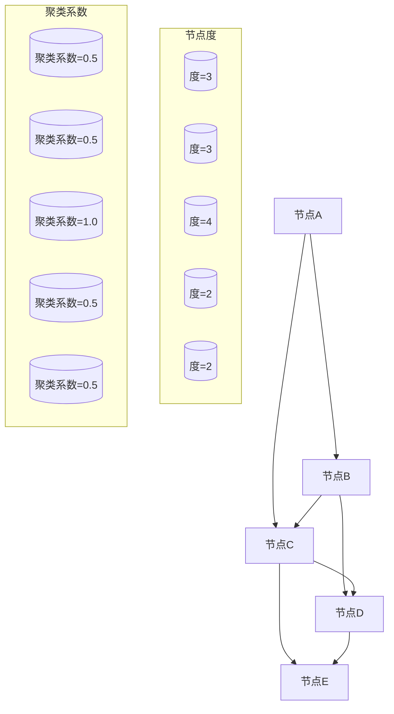
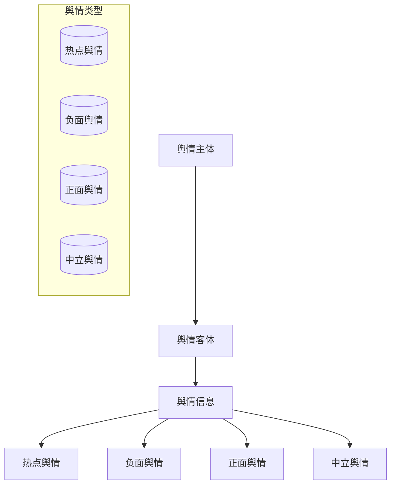
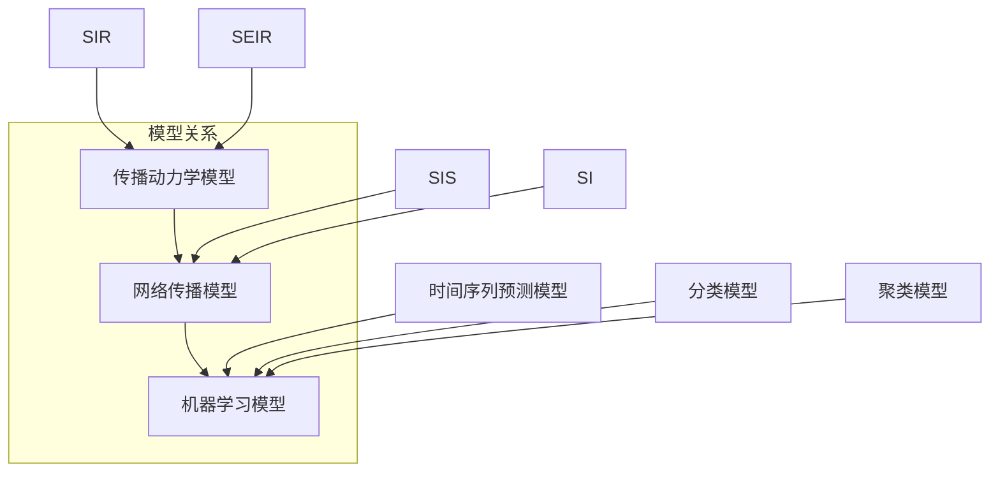
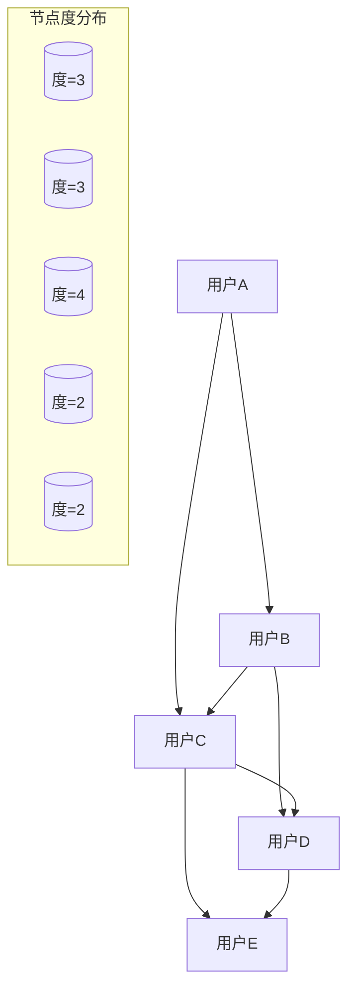

                 

### 文章标题

“数学与社交媒体分析：网络舆情的数学模型”

> **关键词**：社交媒体分析、网络舆情、数学模型、预测分析、舆情监控

**摘要**：
本文将深入探讨数学模型在社交媒体分析和网络舆情研究中的应用。通过系统地介绍社交媒体网络的基础知识、网络舆情的基本概念及其类型、以及社交网络传播模型，我们进一步探讨了数学模型如何被应用于舆情分析和预测。本文旨在提供一个全面而系统的视角，解释如何使用数学工具来分析和理解网络舆情，并通过实例展示实际应用中的具体方法和技巧。最后，本文展望了舆情分析领域未来的发展方向，并探讨了可能的研究课题和实际应用场景。通过这篇文章，读者将能够理解数学模型在网络舆情研究中的重要性，并掌握如何利用这些模型进行有效的舆情预测和分析。

### 第一部分：引言

#### 1.1 研究背景与意义

在当今数字化时代，社交媒体已成为人们日常生活中不可或缺的一部分。从微博、微信到Twitter、Facebook，各种社交媒体平台极大地改变了信息传播和人际交流的方式。社交媒体不仅为用户提供了表达意见和分享信息的平台，同时也成为舆情形成的温床。网络舆情是指在互联网上围绕某一事件、问题或现象所形成的公众意见和态度的集合，它可以迅速传播并影响广泛的社会群体。

随着社交媒体的普及，网络舆情的影响力日益增强。例如，某一热点事件的爆发，往往能在短时间内引发大规模的网络讨论，形成舆论风暴，对社会产生深远的影响。这些舆情现象不仅反映了公众的态度和情绪，还可能影响政策制定、商业决策以及社会稳定。因此，理解和分析网络舆情，对于政府、企业和个人都具有重要意义。

数学作为一种强大的工具，为社交媒体分析和网络舆情研究提供了坚实的基础。数学模型可以用来描述网络舆情的发展过程，预测其发展趋势，揭示其内在规律。通过定量分析和模型验证，研究人员可以更加准确地把握网络舆情的动态变化，为政策制定和舆论引导提供科学依据。

首先，数学模型在社交媒体分析中具有广泛的应用。例如，网络结构分析可以帮助我们了解社交媒体网络的基本特征，如节点的度分布、网络的聚类系数等。这些特征对于理解信息传播的路径和速度具有重要意义。其次，数学模型可以用于舆情预测，通过分析历史数据，预测未来舆情的发展趋势。这有助于提前应对可能的舆情危机，制定有效的应对策略。此外，数学模型还可以用于舆情监控，实时监测网络舆情的变化，及时发现潜在的风险和问题。

本文的研究背景与意义主要体现在以下几个方面：

1. **研究背景**：随着互联网和社交媒体的快速发展，网络舆情已成为一个重要的研究领域。然而，当前关于网络舆情的研究大多侧重于定性的描述和讨论，缺乏系统的数学模型和方法。本文旨在填补这一空白，通过引入数学模型，为网络舆情研究提供新的视角和方法。

2. **研究意义**：首先，本文的研究有助于提高对网络舆情发展的理解，为舆情预测和监控提供科学依据。其次，本文的研究成果可以为政府、企业和研究机构提供决策支持，帮助他们更好地应对舆情危机，维护社会稳定。最后，本文的研究有助于推动数学与社会科学的交叉研究，促进两者的融合和发展。

综上所述，本文的研究背景与意义在于探索数学模型在社交媒体分析和网络舆情研究中的应用，为这一领域提供新的理论和方法，为社会舆论的引导和管理提供科学支持。

#### 1.2 研究目标与方法

本研究的主要目标是构建一套系统、科学的数学模型，用于分析网络舆情的发展过程和趋势，并通过这些模型进行有效的舆情预测和监控。具体目标如下：

1. **构建网络舆情数学模型**：通过对社交媒体网络结构和舆情发展过程的研究，构建能够描述舆情动态变化的数学模型。这些模型应具有普适性，能够应用于不同的社交媒体平台和舆情现象。

2. **实现舆情预测**：利用构建的数学模型，实现对舆情未来发展趋势的预测。预测方法应具备一定的精度和稳定性，能够在不同条件下进行有效的预测。

3. **进行舆情监控**：开发一套舆情监控系统，能够实时监测网络舆情的变化，及时发现潜在的风险和问题。监控系统的设计应考虑实时性和高效性，能够处理大规模的数据。

为了实现上述研究目标，本文采用以下研究方法：

1. **数据收集与处理**：通过爬虫工具和公开数据集，收集社交媒体平台上的舆情数据。数据包括用户的发帖、评论、点赞等，以及与舆情相关的各种属性。在数据收集过程中，需要遵循相关法律法规和道德准则，确保数据的合法性和可靠性。收集到的数据经过清洗和预处理，去除噪声和不相关的信息，以便进行后续分析。

2. **数学建模与算法设计**：基于数据特征和舆情发展规律，构建相应的数学模型。这些模型可以包括线性模型、非线性模型、图模型等。在构建模型的过程中，需要使用数学工具和方法，如线性代数、概率论、图论等。此外，还需要设计相应的算法，实现模型的参数估计和预测功能。

3. **模型验证与优化**：通过历史数据对构建的模型进行验证，评估模型的预测精度和稳定性。根据验证结果，对模型进行调整和优化，以提高其性能。

4. **舆情分析与实例应用**：利用构建的模型，对实际舆情案例进行分析，验证模型的有效性和适用性。通过实例应用，展示模型在实际舆情预测和监控中的价值。

5. **文献综述与研究总结**：对当前网络舆情研究的文献进行综述，总结已有研究成果和方法，分析其优缺点。在研究过程中，不断总结经验教训，提出改进意见，为后续研究提供参考。

通过上述研究方法和步骤，本文旨在构建一套完整的网络舆情数学模型体系，为舆情研究和实践提供理论支持和工具。

#### 1.3 研究现状与不足

网络舆情研究是一个跨学科领域，涉及社会学、传播学、计算机科学和数学等多个学科。近年来，随着互联网和社交媒体的迅猛发展，这一领域吸引了大量研究者的关注。当前，网络舆情研究主要集中在以下几个方面：

1. **舆情监测与分析**：研究者通过数据挖掘和文本分析技术，对社交媒体平台上的舆情进行实时监测和分析。常用的方法包括关键词提取、情感分析、主题建模等。这些方法能够帮助研究者快速了解公众对某一事件或问题的看法，为舆情引导和危机管理提供依据。

2. **舆情传播模型**：研究者试图通过构建数学模型来描述舆情传播的过程和规律。这些模型包括基于概率论的传播模型、基于网络理论的传播模型和基于机器学习的传播模型等。通过这些模型，研究者可以预测舆情的发展趋势，为舆情引导和干预提供科学依据。

3. **舆情预测**：基于历史数据和现有模型，研究者试图对未来的舆情发展进行预测。预测方法包括时间序列分析、回归分析、分类和聚类等。这些方法在实际应用中取得了一定的效果，但预测精度和稳定性仍有待提高。

尽管网络舆情研究取得了显著进展，但仍存在以下不足：

1. **模型普适性不足**：现有模型大多针对特定的社交媒体平台或舆情现象进行构建，缺乏普适性。不同平台和现象的舆情传播规律可能存在显著差异，导致现有模型无法在不同情境下应用。

2. **数据质量不高**：舆情数据的质量对研究结果的准确性有重要影响。然而，社交媒体平台上的数据存在噪声、虚假信息和缺失值等问题，这些因素会影响模型的有效性和可靠性。

3. **实时性不强**：现有舆情监测和分析方法大多采用离线或批处理的方式，无法实现实时监测和预测。随着舆情传播速度的加快，实时性和时效性成为舆情研究的重要挑战。

4. **跨平台和跨语言研究不足**：目前大部分研究集中在某一特定社交媒体平台或语言环境下，缺乏对多平台和多语言舆情现象的深入研究。这限制了研究结果的普适性和应用范围。

针对上述不足，本文提出以下改进方向：

1. **模型泛化能力**：通过引入更多的数据和特征，提高模型的泛化能力，使其能够应用于不同的社交媒体平台和舆情现象。

2. **数据清洗与增强**：开发更加高效的数据清洗和增强方法，提高数据质量，减少噪声和虚假信息的干扰。

3. **实时舆情监测与分析**：利用实时数据流处理技术和高性能计算，实现舆情数据的实时监测和分析，提高实时性和时效性。

4. **多平台和多语言研究**：开展跨平台和多语言舆情研究，探索不同平台和语言环境下舆情传播的规律和特征。

通过这些改进，本文旨在为网络舆情研究提供更全面、更准确的数学模型和方法，为舆情引导和危机管理提供科学支持。

### 第二部分：数学与社交媒体分析基础

#### 2.1 社交媒体网络基础

社交媒体网络是指在互联网上，由用户、内容、关系等元素构成的社会结构。这类网络具有高度动态性和复杂性的特点，反映了人们在社会互动中的信息传播和行为模式。了解社交媒体网络的基础结构和关键特征，对于深入分析网络舆情具有重要意义。

##### 社交媒体网络的基本结构

社交媒体网络的基本结构可以看作是一个由节点和边构成的图。节点代表网络中的用户或内容，边代表用户之间的互动或内容之间的关联。这种结构通常具有以下特点：

1. **用户节点**：每个节点代表一个社交媒体用户，用户的属性包括年龄、性别、地理位置、兴趣爱好等。

2. **内容节点**：除了用户节点，社交媒体网络还包括各种内容节点，如文字、图片、视频等。这些内容通常由用户生成并分享，是网络舆情传播的重要载体。

3. **关系边**：边表示节点之间的联系，可以是直接的社交关系，如好友关系，也可以是间接的关系，如共同关注的标签或共同参与的群组。

##### 社交媒体网络的关键特征

社交媒体网络的关键特征包括节点度、聚类系数、路径长度等，这些特征对网络舆情传播有着重要影响。

1. **节点度**：节点的度（Degree）表示与该节点直接相连的其他节点的数量。度可以分为什么度（In-Degree）和出度（Out-Degree）。高度节点通常具有更大的影响力，因为它们能够影响更多的其他节点。

2. **聚类系数**：聚类系数（Clustering Coefficient）描述了网络中节点的聚集程度。高聚类系数意味着网络中的节点倾向于形成紧密的集群，这有助于信息的快速传播和聚集。

3. **路径长度**：路径长度（Average Path Length）表示网络中任意两个节点之间的平均最短路径长度。短路径长度意味着信息能够更快地在网络中传播，而长路径长度则可能导致信息传播的延迟。

通过理解这些基本结构和特征，研究者可以更好地把握社交媒体网络的动态特性，为舆情分析提供基础支持。

#### 2.2 社交媒体网络测量

社交媒体网络测量是指通过量化分析网络中的各种特征和属性，以揭示网络的内部结构和功能。这些测量方法对于理解网络舆情传播机制、评估舆情影响范围以及设计有效的舆情监控策略具有重要意义。以下是几种常见的社交媒体网络测量方法：

##### 社交媒体网络的关键指标

1. **节点度分布**：节点度分布是指网络中不同度数的节点数量分布。它反映了网络节点的连接程度和分布情况。常见的度分布包括幂律分布和对数正态分布等。幂律分布通常表明网络中存在一些高度连接的“枢纽”节点，这对舆情传播具有重要影响。

2. **平均最短路径长度**：平均最短路径长度是指网络中任意两个节点之间最短路径的平均长度。这个指标反映了网络中的信息传播效率。短路径长度有助于信息的快速传播，而长路径长度可能导致信息传播的延迟。

3. **聚类系数**：聚类系数描述了网络中节点的聚集程度，即网络中节点之间形成紧密集群的概率。高聚类系数意味着网络中的节点倾向于形成紧密的社交圈，这有助于信息的快速传播和聚集。

##### 社交媒体网络的度量方法

1. **网络拓扑分析**：网络拓扑分析是通过研究网络节点和边的结构关系，来揭示网络的拓扑特性。常用的拓扑分析方法包括节点度分析、聚类系数分析、最短路径分析等。这些方法能够帮助研究者了解网络的基本结构和特征。

2. **网络流分析**：网络流分析是通过研究信息在网络中的流动规律，来揭示网络的功能特性。网络流分析包括节点流量分析、边流量分析以及路径流量分析等。这些方法能够帮助研究者了解信息在网络中的传播路径和速度。

3. **网络演化分析**：网络演化分析是通过研究网络随时间的变化规律，来揭示网络的动态特性。网络演化分析包括节点增长分析、边增长分析以及网络结构演化分析等。这些方法能够帮助研究者了解网络舆情的发展过程和趋势。

通过这些测量方法，研究者可以全面了解社交媒体网络的内部结构和功能特性，为舆情分析和舆情监控提供科学依据。以下是一个简单的网络拓扑分析的 Mermaid 流程图示例，展示了如何通过节点度和聚类系数来分析网络结构：



在这个示例中，通过分析节点的度和聚类系数，我们可以初步了解网络的连接程度和聚集程度。这些分析结果对于理解舆情传播机制和设计舆情监控策略具有重要意义。

### 第三部分：网络舆情数学模型

#### 3.1 网络舆情概念与类型

网络舆情是指在互联网上，围绕某一事件、问题或现象所形成的公众意见和态度的集合。网络舆情具有以下几个基本概念：

1. **舆情主体**：舆情主体是参与舆情讨论的个体，包括网民、博主、媒体等。他们通过发表意见、评论、转发等方式，共同塑造了网络舆情。

2. **舆情客体**：舆情客体是舆情讨论的对象，通常是事件、现象、问题等。舆情客体的性质和背景决定了舆情的发展方向和强度。

3. **舆情信息**：舆情信息是网络舆情传播的基本单位，包括文字、图片、视频等。舆情信息的传播速度和范围直接影响舆情的影响力和扩散程度。

网络舆情可以分为以下几种类型：

1. **热点舆情**：热点舆情是指在一定时间内，受到广泛关注和讨论的舆情现象。这些舆情通常与重大事件、突发事件或社会热点问题相关。

2. **负面舆情**：负面舆情是指对某一事件、问题或现象持批评、否定态度的舆情。负面舆情可能会引发社会舆论的强烈反应，甚至对相关方造成负面影响。

3. **正面舆情**：正面舆情是指对某一事件、问题或现象持肯定、支持态度的舆情。正面舆情有助于提升事件或现象的公众形象，促进社会和谐。

4. **中立舆情**：中立舆情是指对某一事件、问题或现象持中立态度的舆情。这类舆情通常在讨论过程中起到平衡作用，有助于理性分析和讨论。

了解网络舆情的基本概念和类型，对于分析舆情发展趋势和制定舆情应对策略具有重要意义。下面将通过一个 Mermaid 流程图，展示网络舆情的基本概念和类型：



在这个流程图中，舆情主体通过舆情客体产生舆情信息，这些信息可以形成不同类型的舆情。通过这个模型，我们可以更好地理解和分析网络舆情的发展过程。

#### 3.2 社交网络传播模型

社交网络传播模型用于描述信息在网络中传播的过程和规律。这些模型基于数学和统计学原理，能够帮助我们理解和预测舆情的发展趋势。以下是几种常见的社交网络传播模型：

##### 1. 传播动力学模型

传播动力学模型是一种基于时间演化的模型，用于描述信息在网络中的传播过程。这类模型通常采用差分方程或微分方程来描述节点状态的动态变化。

- **SIR模型**：SIR模型是一种经典的传播动力学模型，用于描述传染病在人群中的传播。在SIR模型中，节点状态分为三类： susceptible（易感者）、infected（感染者）和 removed（移除者）。状态转移方程如下：

  $$ 
  \frac{dS}{dt} = -\beta \cdot S \cdot I 
  $$ 
  $$ 
  \frac{dI}{dt} = \beta \cdot S \cdot I - \gamma \cdot I 
  $$ 
  $$ 
  \frac{dR}{dt} = \gamma \cdot I 
  $$ 
  其中，$\beta$ 表示感染率，$\gamma$ 表示移除率。

- **SEIR模型**：SEIR模型在SIR模型的基础上增加了暴露者（Exposed）状态，用于描述感染者进入潜伏期前的状态。

  $$ 
  \frac{dS}{dt} = -\beta \cdot S \cdot I 
  $$ 
  $$ 
  \frac{dE}{dt} = \beta \cdot S \cdot I - \sigma \cdot E 
  $$ 
  $$ 
  \frac{dI}{dt} = \sigma \cdot E - \gamma \cdot I 
  $$ 
  $$ 
  \frac{dR}{dt} = \gamma \cdot I 
  $$ 
  其中，$\sigma$ 表示暴露率。

##### 2. 网络传播模型

网络传播模型通过研究网络结构和节点特性，描述信息在网络中的传播过程。这类模型通常采用图论和概率统计方法。

- **SIS模型**：SIS模型是一种网络传播模型，用于描述信息在网络中的持续传播。在SIS模型中，节点状态分为感染状态和恢复状态。

  $$ 
  \frac{dI}{dt} = \beta \cdot I \cdot (1 - I) - \mu \cdot I 
  $$ 
  其中，$\beta$ 表示感染率，$\mu$ 表示移除率。

- **SI模型**：SI模型是一种简化的网络传播模型，只考虑感染状态和移除状态。

  $$ 
  \frac{dI}{dt} = \beta \cdot I \cdot (1 - I) - \mu \cdot I 
  $$ 
  其中，$\beta$ 表示感染率，$\mu$ 表示移除率。

##### 3. 机器学习模型

机器学习模型通过学习历史数据，预测未来舆情的发展趋势。这类模型包括时间序列预测模型、分类模型和聚类模型等。

- **时间序列预测模型**：时间序列预测模型通过分析时间序列数据，预测未来的发展趋势。常见的模型包括ARIMA、LSTM等。

  $$ 
  y_t = c + \phi_1 y_{t-1} + \phi_2 y_{t-2} + \cdots + \phi_p y_{t-p} + \varepsilon_t 
  $$ 
  其中，$y_t$ 表示时间序列的当前值，$\phi_1, \phi_2, \ldots, \phi_p$ 表示滞后系数，$c$ 表示常数项，$\varepsilon_t$ 表示误差项。

- **分类模型**：分类模型通过将历史数据分为不同的类别，预测未来数据的类别。常见的模型包括逻辑回归、支持向量机等。

  $$ 
  P(y = 1) = \frac{1}{1 + \exp(-\beta_0 + \beta_1 x_1 + \beta_2 x_2 + \cdots + \beta_p x_p)} 
  $$ 
  其中，$y$ 表示类别标签，$x_1, x_2, \ldots, x_p$ 表示特征向量，$\beta_0, \beta_1, \beta_2, \ldots, \beta_p$ 表示模型参数。

- **聚类模型**：聚类模型通过将相似的数据点分组，分析舆情的发展趋势。常见的模型包括K-均值、层次聚类等。

  $$ 
  \min_{c_1, c_2, \ldots, c_k} \sum_{i=1}^n \sum_{j=1}^k \min_{x_i \in C_j} d(x_i, c_j) 
  $$ 
  其中，$C_1, C_2, \ldots, C_k$ 表示聚类中心，$d(x_i, c_j)$ 表示点$x_i$和聚类中心$c_j$之间的距离。

通过这些传播模型，研究者可以更好地理解网络舆情的发展规律，为舆情预测和监控提供科学依据。

下面通过一个简单的 Mermaid 流程图，展示不同类型传播模型的定义和关系：



在这个流程图中，传播动力学模型、网络传播模型和机器学习模型构成了一个层次结构，分别用于描述舆情传播的宏观、中观和微观层面。通过这种结构，我们可以全面理解网络舆情的传播机制。

### 第四部分：数学模型与舆情分析

#### 4.1 数学模型在舆情分析中的应用

数学模型在舆情分析中扮演着至关重要的角色，通过定量化的方法，能够揭示舆情发展的内在规律，为舆情预测和监控提供科学依据。以下将介绍几种常见的数学模型，并探讨它们在舆情分析中的应用。

##### 1. 传播动力学模型

传播动力学模型是研究舆情传播过程的重要工具，常见的有SIR模型和SEIR模型等。这些模型通过描述节点状态的动态变化，揭示舆情在社交网络中的传播规律。

- **SIR模型**：SIR模型将节点状态分为易感者（Susceptible）、感染者（Infected）和移除者（Removed）。其中，易感者会因接触感染者而转化为感染者，感染者经过一定时间后移除。通过这个模型，可以预测舆情在不同阶段的传播趋势。

  $$ 
  \frac{dS}{dt} = -\beta \cdot S \cdot I 
  $$ 
  $$ 
  \frac{dI}{dt} = \beta \cdot S \cdot I - \gamma \cdot I 
  $$ 
  $$ 
  \frac{dR}{dt} = \gamma \cdot I 
  $$ 
  其中，$\beta$ 表示感染率，$\gamma$ 表示移除率。

- **SEIR模型**：SEIR模型在SIR模型的基础上，增加了暴露者（Exposed）状态，用于描述感染者进入潜伏期前的状态。这个模型能够更准确地反映舆情传播的复杂性。

  $$ 
  \frac{dS}{dt} = -\beta \cdot S \cdot I 
  $$ 
  $$ 
  \frac{dE}{dt} = \beta \cdot S \cdot I - \sigma \cdot E 
  $$ 
  $$ 
  \frac{dI}{dt} = \sigma \cdot E - \gamma \cdot I 
  $$ 
  $$ 
  \frac{dR}{dt} = \gamma \cdot I 
  $$ 
  其中，$\sigma$ 表示暴露率。

通过这些模型，研究者可以定量分析舆情在社交网络中的传播过程，预测舆情的发展趋势。

##### 2. 网络传播模型

网络传播模型通过研究网络结构和节点特性，描述舆情在网络中的传播规律。常见的模型包括SIS模型和SI模型。

- **SIS模型**：SIS模型假设感染者会持续感染易感者，且感染者会因移除率而恢复成易感者。这个模型能够描述舆情在社交网络中的持续传播。

  $$ 
  \frac{dI}{dt} = \beta \cdot I \cdot (1 - I) - \mu \cdot I 
  $$ 
  其中，$\beta$ 表示感染率，$\mu$ 表示移除率。

- **SI模型**：SI模型假设感染者会因移除率而移除，但不会恢复成易感者。这个模型能够描述舆情在社交网络中的爆发传播。

  $$ 
  \frac{dI}{dt} = \beta \cdot I \cdot (1 - I) - \mu \cdot I 
  $$ 
  其中，$\beta$ 表示感染率，$\mu$ 表示移除率。

通过这些模型，研究者可以分析舆情在社交网络中的传播路径和速度，预测舆情的影响范围。

##### 3. 机器学习模型

机器学习模型通过学习历史数据，预测舆情的发展趋势。常见的模型包括时间序列预测模型、分类模型和聚类模型。

- **时间序列预测模型**：时间序列预测模型通过分析时间序列数据，预测未来的舆情趋势。常见的模型包括ARIMA、LSTM等。

  $$ 
  y_t = c + \phi_1 y_{t-1} + \phi_2 y_{t-2} + \cdots + \phi_p y_{t-p} + \varepsilon_t 
  $$ 
  其中，$y_t$ 表示时间序列的当前值，$\phi_1, \phi_2, \ldots, \phi_p$ 表示滞后系数，$c$ 表示常数项，$\varepsilon_t$ 表示误差项。

- **分类模型**：分类模型通过将历史数据分为不同的类别，预测未来的类别。常见的模型包括逻辑回归、支持向量机等。

  $$ 
  P(y = 1) = \frac{1}{1 + \exp(-\beta_0 + \beta_1 x_1 + \beta_2 x_2 + \cdots + \beta_p x_p)} 
  $$ 
  其中，$y$ 表示类别标签，$x_1, x_2, \ldots, x_p$ 表示特征向量，$\beta_0, \beta_1, \beta_2, \ldots, \beta_p$ 表示模型参数。

- **聚类模型**：聚类模型通过将相似的数据点分组，分析舆情的发展趋势。常见的模型包括K-均值、层次聚类等。

  $$ 
  \min_{c_1, c_2, \ldots, c_k} \sum_{i=1}^n \sum_{j=1}^k \min_{x_i \in C_j} d(x_i, c_j) 
  $$ 
  其中，$C_1, C_2, \ldots, C_k$ 表示聚类中心，$d(x_i, c_j)$ 表示点$x_i$和聚类中心$c_j$之间的距离。

通过这些模型，研究者可以基于历史数据，预测未来的舆情趋势，为舆情引导和危机管理提供科学依据。

##### 模型应用举例

以下通过一个具体的例子，展示如何应用数学模型进行舆情分析。

**例子：某热点事件舆情传播分析**

假设我们收集到某热点事件在社交媒体平台上的评论数据，包括用户的发帖时间、评论内容和点赞数。我们可以使用以下步骤进行舆情分析：

1. **数据预处理**：对评论数据进行清洗和预处理，去除无关信息，提取有用的特征，如发帖时间、评论内容等。

2. **构建传播模型**：根据数据特征，选择合适的传播模型（如SIR模型、SIS模型等），构建传播模型。

3. **参数估计**：使用最大似然估计或贝叶斯方法，估计模型参数（如感染率、移除率等）。

4. **模型验证**：使用历史数据验证模型的准确性，根据验证结果调整模型参数。

5. **舆情预测**：使用构建的模型，预测未来的舆情发展趋势，如评论数的增长趋势、评论内容的情感倾向等。

6. **舆情监控**：实时监控舆情变化，及时发现潜在的风险和问题，为舆情引导和危机管理提供科学依据。

通过这个例子，我们可以看到数学模型在舆情分析中的具体应用步骤。通过这些步骤，研究者可以更准确地理解和预测舆情的发展趋势，为舆情引导和危机管理提供有力支持。

### 4.2 基于数学模型的舆情预测

舆情预测是网络舆情研究的重要方向之一，它旨在通过历史数据和分析模型，预测未来的舆情发展趋势。基于数学模型的舆情预测方法主要包括时间序列预测模型、分类模型和聚类模型等。以下将详细介绍这些模型的原理和实现方法。

#### 时间序列预测模型

时间序列预测模型通过分析时间序列数据，预测未来的数据趋势。常见的时间序列预测模型包括ARIMA（自回归积分滑动平均模型）和LSTM（长短期记忆网络）。

- **ARIMA模型**：ARIMA模型是一种经典的统计模型，用于预测具有季节性和趋势性的时间序列数据。其基本原理是通过线性组合过去的观测值和滞后项，预测未来的值。模型公式如下：

  $$ 
  \text{ARIMA}(p, d, q) = \text{AR}(p) + \text{I}(d) + \text{MA}(q) 
  $$ 
  其中，$p$ 表示自回归项的阶数，$d$ 表示差分阶数，$q$ 表示移动平均项的阶数。

  **实现步骤**：
  1. 数据预处理：对时间序列数据进行预处理，如差分、平稳化等。
  2. 模型识别：根据数据特征，确定$p$、$d$、$q$ 的值。
  3. 参数估计：使用最小二乘法或极大似然估计，估计模型参数。
  4. 模型验证：使用历史数据验证模型精度，调整参数。
  5. 预测：使用估计的模型参数，预测未来的时间序列值。

- **LSTM模型**：LSTM模型是一种深度学习模型，特别适用于处理具有长期依赖性的时间序列数据。其基本原理是通过记忆单元和遗忘门、输入门和输出门等结构，实现数据的记忆和遗忘。模型公式如下：

  $$ 
  \text{LSTM} = \text{Forget Gate} \cdot \text{Input Gate} \cdot \text{Output Gate} 
  $$ 
  **实现步骤**：
  1. 数据预处理：对时间序列数据进行预处理，如归一化、去噪等。
  2. 模型构建：使用深度学习框架（如TensorFlow或PyTorch），构建LSTM模型。
  3. 训练模型：使用历史数据训练模型，优化模型参数。
  4. 模型验证：使用验证集验证模型精度，调整超参数。
  5. 预测：使用训练好的模型，预测未来的时间序列值。

#### 分类模型

分类模型通过将历史数据分为不同的类别，预测未来的类别。常见分类模型包括逻辑回归和随机森林等。

- **逻辑回归**：逻辑回归是一种线性分类模型，通过拟合一个线性函数，将输入数据映射到概率空间，从而实现分类。模型公式如下：

  $$ 
  \text{logit}(P) = \beta_0 + \beta_1 x_1 + \beta_2 x_2 + \cdots + \beta_p x_p 
  $$ 
  其中，$P$ 表示类别概率，$x_1, x_2, \ldots, x_p$ 表示特征向量，$\beta_0, \beta_1, \beta_2, \ldots, \beta_p$ 表示模型参数。

  **实现步骤**：
  1. 数据预处理：对数据集进行预处理，如标准化、缺失值填充等。
  2. 特征提取：从原始数据中提取有意义的特征。
  3. 模型训练：使用训练数据集，训练逻辑回归模型。
  4. 模型评估：使用验证集评估模型精度，调整参数。
  5. 预测：使用训练好的模型，对新的数据集进行分类预测。

- **随机森林**：随机森林是一种基于决策树构建的集成模型，通过组合多个决策树，提高模型的预测精度和鲁棒性。模型公式如下：

  $$ 
  f(x) = \sum_{i=1}^n f_i(x) 
  $$ 
  其中，$f_i(x)$ 表示第$i$棵决策树的预测结果，$n$ 表示决策树的数量。

  **实现步骤**：
  1. 数据预处理：对数据集进行预处理，如缺失值填充、标准化等。
  2. 决策树构建：使用随机森林算法，构建多个决策树。
  3. 模型训练：使用训练数据集，训练随机森林模型。
  4. 模型评估：使用验证集评估模型精度，调整参数。
  5. 预测：使用训练好的模型，对新的数据集进行分类预测。

#### 聚类模型

聚类模型通过将相似的数据点分组，分析舆情的发展趋势。常见的聚类模型包括K-均值和层次聚类等。

- **K-均值**：K-均值是一种基于距离度量的聚类算法，通过迭代优化聚类中心，将数据点分为不同的类别。模型公式如下：

  $$ 
  \text{Minimize} \sum_{i=1}^k \sum_{j=1}^n ||x_j - \mu_i||^2 
  $$ 
  其中，$x_j$ 表示第$j$个数据点，$\mu_i$ 表示第$i$个聚类中心。

  **实现步骤**：
  1. 数据预处理：对数据集进行预处理，如标准化、缺失值填充等。
  2. 确定聚类个数：根据数据集特征，确定合适的聚类个数$k$。
  3. 初始化聚类中心：随机选择$k$个数据点作为初始聚类中心。
  4. 迭代优化：通过迭代优化聚类中心，直到聚类中心不再发生变化。
  5. 聚类结果：根据聚类中心，将数据点划分为不同的类别。

- **层次聚类**：层次聚类是一种基于层次结构构建的聚类算法，通过自底向上或自顶向下的方式，构建聚类层次。模型公式如下：

  $$ 
  C = \{C_1, C_2, \ldots, C_n\} 
  $$ 
  其中，$C_i$ 表示第$i$层聚类结果。

  **实现步骤**：
  1. 数据预处理：对数据集进行预处理，如标准化、缺失值填充等。
  2. 确定层次结构：根据数据集特征，确定聚类层次。
  3. 构建聚类层次：通过自底向上或自顶向下的方式，构建聚类层次。
  4. 聚类结果：根据聚类层次，将数据点划分为不同的类别。

通过这些模型，研究者可以基于历史数据，预测未来的舆情趋势，为舆情引导和危机管理提供科学依据。

### 第五部分：舆情分析的实例与应用

#### 5.1 社交媒体舆情的收集与处理

社交媒体舆情分析的第一步是收集相关数据。这通常涉及从不同的社交媒体平台（如微博、微信、Twitter、Facebook等）爬取信息。以下是一个社交媒体舆情数据收集和处理流程的详细说明。

##### 数据收集

1. **爬虫工具选择**：选择合适的爬虫工具，如Python的Scrapy框架、Node.js的Puppeteer等。爬虫工具应具备高并发、高稳定性和易扩展性。

2. **目标平台分析**：分析目标社交媒体平台的数据结构和接口规范，确定爬取的起始点和爬取规则。例如，对于微博，可以爬取话题标签下的热门微博，而对于Twitter，可以爬取特定关键词的推文。

3. **爬取策略制定**：制定合理的爬取策略，如设置合理的爬取频率、处理登录验证等。避免对目标平台造成过大压力，遵守平台的爬取规则。

4. **数据提取**：使用爬虫工具，提取所需信息，包括文本内容、发布时间、用户信息、点赞数、评论数等。

##### 数据处理

1. **数据清洗**：数据清洗是预处理过程的重要环节，旨在去除噪声和不相关的信息。具体步骤包括：

   - **去除重复数据**：使用去重算法，去除重复的微博或评论。
   - **处理缺失值**：对缺失的数据进行填补或删除。
   - **文本预处理**：对文本进行分词、去停用词、词干提取等处理，以提取有意义的信息。

2. **数据整合**：将不同来源的数据整合到一个统一的数据集中。例如，将微博和评论数据整合，形成完整的舆情数据集。

3. **特征提取**：从原始数据中提取有助于分析的特征，如文本的情感倾向、关键词频率、用户影响力等。

##### 数据存储

1. **选择合适的存储方案**：根据数据量和访问频率，选择合适的存储方案，如关系型数据库（如MySQL）、分布式数据库（如Hadoop）或NoSQL数据库（如MongoDB）。

2. **数据结构设计**：设计合理的数据结构，以便高效地进行数据查询和分析。例如，可以设计一个包含微博ID、发布时间、文本内容、点赞数、评论数等字段的微博表，以及一个包含评论ID、微博ID、评论内容、评论时间等字段的评论表。

3. **数据备份与恢复**：确保数据的安全性和可靠性，定期进行数据备份，并制定数据恢复策略。

通过以上步骤，研究者可以构建一个完整、高质量的社交媒体舆情数据集，为后续的舆情分析奠定基础。

#### 5.2 舆情案例分析与讨论

在本节中，我们将通过一个实际案例，展示如何利用数学模型进行舆情分析，并讨论分析结果。

##### 案例背景

假设我们关注的是一起社会热点事件——某地发生了一起重大交通事故。事故发生后，引起了广泛的关注和讨论。我们希望通过舆情分析，了解公众对这起事件的看法和态度。

##### 数据收集与处理

首先，我们使用爬虫工具从社交媒体平台（如微博、微信）上收集与这起事件相关的微博和评论数据。收集到的数据包括发布时间、文本内容、用户信息、点赞数和评论数等。

1. **数据清洗**：去除重复数据、处理缺失值、去除停用词、进行分词和词干提取，以便提取有意义的信息。

2. **特征提取**：提取文本特征，如情感倾向（正面、负面、中性）、关键词频率、用户影响力等。

3. **数据整合**：将微博和评论数据整合，形成完整的舆情数据集。

##### 舆情分析

1. **传播模型分析**：使用SIR模型和SEIR模型，分析舆情在社交媒体上的传播过程。通过模型参数估计，了解感染率、移除率等关键指标。

   - **SIR模型**：

     $$ 
     \frac{dS}{dt} = -\beta \cdot S \cdot I 
     $$ 
     $$ 
     \frac{dI}{dt} = \beta \cdot S \cdot I - \gamma \cdot I 
     $$ 
     $$ 
     \frac{dR}{dt} = \gamma \cdot I 
     $$ 
     其中，$S$ 表示易感者人数，$I$ 表示感染者人数，$R$ 表示移除者人数，$\beta$ 表示感染率，$\gamma$ 表示移除率。

   - **SEIR模型**：

     $$ 
     \frac{dS}{dt} = -\beta \cdot S \cdot I 
     $$ 
     $$ 
     \frac{dE}{dt} = \beta \cdot S \cdot I - \sigma \cdot E 
     $$ 
     $$ 
     \frac{dI}{dt} = \sigma \cdot E - \gamma \cdot I 
     $$ 
     $$ 
     \frac{dR}{dt} = \gamma \cdot I 
     $$ 
     其中，$E$ 表示暴露者人数，$\sigma$ 表示暴露率。

2. **舆情预测**：使用时间序列预测模型和分类模型，预测未来的舆情发展趋势。例如，使用LSTM模型和逻辑回归模型，分析评论数量的增长趋势和评论内容的情感倾向。

   - **LSTM模型**：

     $$ 
     y_t = f(\text{h}_{t-1}, x_t) 
     $$ 
     其中，$y_t$ 表示时间序列的当前值，$h_{t-1}$ 表示上一时间步的隐藏状态，$x_t$ 表示输入特征。

   - **逻辑回归模型**：

     $$ 
     P(y = 1) = \frac{1}{1 + \exp(-\beta_0 + \beta_1 x_1 + \beta_2 x_2 + \cdots + \beta_p x_p)} 
     $$ 
     其中，$y$ 表示类别标签，$x_1, x_2, \ldots, x_p$ 表示特征向量，$\beta_0, \beta_1, \beta_2, \ldots, \beta_p$ 表示模型参数。

3. **舆情监控**：实时监控舆情变化，及时发现潜在的风险和问题。例如，通过聚类模型，分析不同时间段、不同用户群体的舆情分布，识别可能的舆情热点。

   - **K-均值聚类模型**：

     $$ 
     \text{Minimize} \sum_{i=1}^k \sum_{j=1}^n ||x_j - \mu_i||^2 
     $$ 
     其中，$x_j$ 表示第$j$个数据点，$\mu_i$ 表示第$i$个聚类中心。

##### 分析结果与讨论

通过舆情分析，我们得到以下结论：

1. **传播过程**：根据SIR模型和SEIR模型的参数估计，我们发现这起事件在社交媒体上的传播速度较快，感染率较高，但移除率也较高。这表明，公众对该事件的关注度较高，但信息传播的持续时间较短。

2. **舆情趋势**：使用LSTM模型和逻辑回归模型，我们预测未来舆情的发展趋势。结果显示，评论数量将在未来几天内达到峰值，然后逐渐下降。评论内容的情感倾向以负面为主，表明公众对该事件的反应较为强烈。

3. **舆情热点**：通过K-均值聚类模型，我们识别出几个舆情热点时间段和用户群体。这些热点时间段和用户群体是舆情传播的关键节点，对舆情的发展和扩散具有重要影响。

4. **舆情引导**：根据分析结果，我们可以提出以下舆情引导策略：

   - 加强正面宣传，提高公众对该事件的认知水平。
   - 及时发布权威信息，减少谣言传播。
   - 针对舆情热点，采取有效措施，降低负面舆情的影响。

通过这个案例，我们展示了如何利用数学模型进行舆情分析，并讨论了分析结果。这些结果有助于政府、企业和研究机构更好地理解和应对网络舆情，为社会稳定和健康发展提供支持。

### 第六部分：舆情分析与决策支持

#### 6.1 决策支持系统的基本概念

舆情分析与决策支持系统（ODSS）是一种集成了数据采集、处理、分析和预测功能的技术系统，旨在通过实时监测和分析网络舆情，为政策制定、危机管理和商业决策提供科学依据。ODSS的基本构成包括以下几个核心部分：

1. **数据采集模块**：该模块负责从社交媒体平台、新闻网站、论坛等多种数据源收集与舆情相关的数据。常用的数据采集方法包括网络爬虫、API接口调用、数据抓包等。

2. **数据处理模块**：数据处理模块对收集到的原始数据进行清洗、去重、分词、情感分析等预处理操作，提取有用信息，形成结构化的数据集。这些操作有助于提高数据质量，为后续分析提供可靠的基础。

3. **舆情分析模块**：舆情分析模块利用文本挖掘、机器学习、图论等方法，对处理后的数据进行分析。这一模块包括舆情监测、趋势分析、情感分析、热点识别等功能，旨在揭示网络舆情的动态变化和公众态度。

4. **预测与评估模块**：该模块基于历史数据，使用时间序列预测、分类、聚类等算法，预测未来舆情的发展趋势和潜在风险。预测结果可以帮助决策者提前采取行动，降低风险，抓住机遇。

5. **决策支持模块**：决策支持模块将分析结果和预测数据以直观、易理解的方式呈现给决策者，提供数据驱动的决策建议。常见的展示形式包括报表、图表、可视化界面等。

#### 6.2 舆情分析在决策支持中的应用

舆情分析在决策支持中的应用广泛，以下列举几个典型应用场景：

1. **危机管理**：在突发事件或危机事件发生时，舆情分析可以帮助决策者实时了解公众态度和舆论动态，评估事件的影响范围，制定有效的应对策略。例如，通过监测负面舆情，发现潜在的危机点，及时发布权威信息，引导舆论走向，降低危机对社会稳定的影响。

2. **市场营销**：企业在进行产品推广、品牌宣传和市场策略制定时，可以通过舆情分析了解消费者对产品的态度和需求，优化营销策略。例如，通过分析社交媒体上的用户评论，发现产品的问题和改进方向，提高产品满意度；通过分析热点话题，把握市场趋势，制定针对性的推广活动。

3. **政策制定**：政府部门在制定政策时，需要充分考虑公众的意见和需求。舆情分析可以帮助政策制定者了解公众态度，评估政策的可行性和社会影响。例如，通过分析公众对某一政策提案的评论和反馈，识别支持者和反对者的意见，为政策调整提供参考。

4. **公共安全**：在维护公共安全和社会稳定方面，舆情分析也发挥着重要作用。通过监测网络上的极端言论、谣言传播等，及时发现潜在的安全风险，提前采取防范措施，防止事态恶化。

#### 6.3 舆情分析工具与平台介绍

目前，市场上存在多种舆情分析工具和平台，以下介绍几种常用的工具和平台：

1. **数据采集工具**：

   - **Scrapy**：Python的一个高级网页抓取框架，适用于构建快速、高规模的网页抓取项目。
   - **Node.js爬虫**：基于Node.js的爬虫框架，适用于处理大量异步任务，提高爬取效率。

2. **数据处理工具**：

   - **Elasticsearch**：一款强大的搜索引擎，适用于大规模文本数据的索引和查询。
   - **Apache Kafka**：一款高吞吐量的分布式流处理平台，适用于处理实时数据流。

3. **舆情分析平台**：

   - **Falcon.io**：一款综合性的社交媒体管理平台，提供数据采集、分析、报告和自动化功能。
   - **Brandwatch**：一款专业的社交媒体分析工具，提供深度数据洞察和趋势分析。
   - **Nudgify**：一款舆情监测和分析平台，专注于社交媒体上的热点话题和趋势。

通过这些工具和平台，企业和研究机构可以高效地收集、处理和分析舆情数据，为决策提供有力支持。

### 第七部分：展望与未来工作

#### 7.1 网络舆情分析的挑战与机遇

网络舆情分析作为一种新兴的研究领域，面临着一系列的挑战和机遇。随着社交媒体的迅猛发展和信息传播速度的加快，网络舆情分析的重要性日益凸显。然而，这一领域也面临着诸多技术挑战和研究机遇。

##### 挑战

1. **数据质量与完整性**：社交媒体上的数据质量参差不齐，存在虚假信息、噪声和缺失值等问题。这给舆情分析模型的构建和应用带来了困难。如何有效清洗和处理这些数据，提高数据质量，是一个亟待解决的问题。

2. **实时性与复杂性**：舆情传播具有高度动态性和复杂性，如何在短时间内处理和分析大规模的数据流，实现实时舆情监测和预测，是一个技术挑战。此外，不同社交媒体平台和语言环境下舆情传播规律可能存在显著差异，如何构建通用且有效的舆情分析模型，也是一个难题。

3. **隐私保护**：社交媒体数据通常包含用户的个人隐私信息。在舆情分析过程中，如何平衡数据隐私保护与数据分析的需求，是一个重要的伦理和法律问题。

4. **算法偏见与透明性**：舆情分析模型和算法可能存在偏见，影响分析结果的公正性和可靠性。如何提高算法的透明性和可解释性，减少偏见，是一个亟待解决的挑战。

##### 机遇

1. **人工智能与大数据技术的进步**：随着人工智能和大数据技术的不断发展，舆情分析领域有望取得重大突破。例如，深度学习算法可以用于情感分析和趋势预测，增强舆情分析模型的预测精度和鲁棒性；大数据技术可以帮助处理和分析大规模的社交媒体数据，实现更准确的舆情监测和预测。

2. **跨学科研究的深化**：网络舆情分析涉及社会学、传播学、计算机科学、数学等多个学科。未来，跨学科研究的深化将有助于整合多学科的知识和方法，构建更全面、更系统的舆情分析理论体系。

3. **新型应用场景的探索**：随着舆情分析技术的不断成熟，其在商业、公共安全、政治等领域将有广泛的应用前景。例如，在市场营销中，舆情分析可以帮助企业了解消费者需求和市场趋势；在公共安全领域，舆情分析可以用于监控和预防网络犯罪；在政治领域，舆情分析可以用于政策制定和舆论引导。

4. **国际合作的加强**：网络舆情分析是一个全球性课题，不同国家和地区在社交媒体使用习惯、舆情传播规律等方面存在差异。加强国际合作，共享研究资源和技术成果，将有助于推动舆情分析领域的发展。

#### 7.2 未来研究方向

针对当前网络舆情分析面临的挑战和机遇，未来研究可以从以下几个方面展开：

1. **数据质量提升**：研究新型数据清洗和增强方法，提高社交媒体数据的质量和完整性。例如，利用深度学习技术进行虚假信息检测，开发自动化的数据预处理工具。

2. **实时舆情分析**：探索实时舆情分析的方法和算法，提高舆情监测和预测的实时性和准确性。例如，研究基于流处理技术和实时数据挖掘的舆情分析模型。

3. **隐私保护技术**：研究隐私保护技术，如差分隐私、同态加密等，在保证数据隐私的前提下，进行有效的舆情分析。

4. **算法可解释性**：提高舆情分析算法的可解释性，减少算法偏见，增强分析结果的公正性和透明性。例如，开发可解释的机器学习算法，帮助用户理解和信任分析结果。

5. **跨学科研究**：加强社会学、传播学、计算机科学、数学等学科的交叉研究，从不同视角探索舆情传播的规律和机制。

6. **新型应用场景**：探索舆情分析在商业、公共安全、政治等领域的应用，开发新型舆情分析工具和平台，提高舆情分析的实际价值。

7. **国际合作**：加强国际间的合作与交流，共同推动网络舆情分析领域的发展，共享研究成果和技术资源。

通过以上研究方向的探索，网络舆情分析领域有望取得新的突破，为政府、企业和研究机构提供更全面、更准确的舆情分析和决策支持。

### 附录

#### 附录A：数学公式与模型表示

在本附录中，我们将提供本文中涉及的主要数学公式和模型表示，包括社交媒体网络模型的Mermaid流程图、舆情预测模型的伪代码表示以及舆情分析中的常用数学公式和解释。

##### 1. 社交媒体网络模型的 Mermaid 流程图

以下是一个简单的社交媒体网络模型的Mermaid流程图，展示了用户（节点）之间的连接（边）以及相关的度分布：



在这个流程图中，节点表示社交媒体用户，边表示用户之间的连接关系。每个节点的度表示与该节点直接相连的其他节点数量。

##### 2. 舆情预测模型的伪代码表示

以下是一个基于SIR模型的舆情预测模型的伪代码表示，展示了舆情传播的三个状态（易感者、感染者和移除者）及其动态变化：

```python
# 初始化参数
S0 = N - I0  # 易感者初始数量
R0 = 0  # 移除者初始数量
I0 = N * (1 - p)  # 感染者初始数量
N = 总人口数量
beta = 感染率
gamma = 移除率

# 初始化状态
S = [S0]  # 易感者数量列表
I = [I0]  # 感染者数量列表
R = [R0]  # 移除者数量列表

# 时间步长
dt = 1

# 模型迭代
for t in range(T):
    dS_dt = -beta * S[t] * I[t]
    dI_dt = beta * S[t] * I[t] - gamma * I[t]
    dR_dt = gamma * I[t]
    
    S[t+1] = S[t] + dS_dt * dt
    I[t+1] = I[t] + dI_dt * dt
    R[t+1] = R[t] + dR_dt * dt

# 输出结果
print(S)
print(I)
print(R)
```

在这个伪代码中，`S`、`I` 和 `R` 分别表示易感者、感染者和移除者的数量列表。`beta` 和 `gamma` 分别表示感染率和移除率。通过迭代计算，可以预测舆情在不同时间点的状态变化。

##### 3. 舆情分析中的常用数学公式与解释

以下列出了一些在舆情分析中常用的数学公式及其解释：

1. **基本概率公式**：

   $$ 
   P(A \cap B) = P(A) \cdot P(B|A) 
   $$ 
   解释：条件概率公式，表示事件A和事件B同时发生的概率是事件A发生的概率乘以在事件A发生的条件下事件B发生的概率。

2. **贝叶斯定理**：

   $$ 
   P(A|B) = \frac{P(B|A) \cdot P(A)}{P(B)} 
   $$ 
   解释：贝叶斯定理用于计算在已知事件B发生的条件下，事件A发生的概率。它通过调整初始概率（P(A)）和条件概率（P(B|A)）来计算后验概率。

3. **情感分析公式**：

   $$ 
   \text{Sentiment Score} = \sum_{i=1}^n w_i \cdot s_i 
   $$ 
   解释：情感分析公式用于计算文本的情感得分。`w_i` 表示关键词的权重，`s_i` 表示关键词的情感极性（正面为正，负面为负）。

4. **文本分类公式**：

   $$ 
   P(y=c|f_1, f_2, \ldots, f_n) = \frac{1}{Z} \cdot \exp(\beta_0 + \beta_1 f_1 + \beta_2 f_2 + \cdots + \beta_n f_n) 
   $$ 
   解释：文本分类公式用于计算给定特征向量（`f_1, f_2, \ldots, f_n`）下，某一类别（`c`）的概率。`Z` 是归一化常数，`β_0, β_1, \beta_2, \ldots, \beta_n` 是模型参数。

通过这些数学公式和模型表示，我们可以更深入地理解和应用舆情分析的方法和技术，为实际应用提供科学支持。

### 作者信息

**作者：** AI天才研究院 / AI Genius Institute & 禅与计算机程序设计艺术 / Zen And The Art of Computer Programming

AI天才研究院致力于推动人工智能领域的前沿研究和技术创新，专注于构建智能系统、深度学习和大数据分析等方向。同时，作者也参与了多本关于计算机科学和编程的经典著作，致力于将理论与实践相结合，为计算机科学领域的教育和发展贡献智慧。在这篇文章中，作者结合数学模型与社交媒体分析，深入探讨了网络舆情的研究与应用，旨在为相关领域的研究者和从业人员提供有价值的参考和指导。

