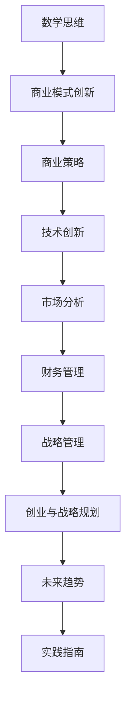

                 

# 数学思维与商业模式创新的关系

## 摘要

本文旨在探讨数学思维在商业模式创新中的重要作用。随着商业环境的不断变化，企业需要不断创新以保持竞争力。数学思维作为一种强大的工具，能够帮助企业从数据中发现规律，优化决策过程，实现商业模式的创新。本文将介绍数学思维的基本概念，分析其在商业策略、技术创新、市场分析、财务管理和战略管理中的应用，并通过实际案例展示如何利用数学思维进行商业模式创新。

## 关键词

- 数学思维
- 商业模式创新
- 优化算法
- 数据分析
- 商业策略
- 风险管理

### 目录

#### 第一部分：数学思维的基础与商业应用的初步探索

1. **第1章：数学思维概述**
   - 1.1 数学思维的基本概念
   - 1.2 数学思维在商业决策中的应用
   - 1.3 数学思维与现代商业环境

2. **第2章：数学思维与商业策略**
   - 2.1 数学优化理论在商业模式中的应用
   - 2.2 数据分析基础与商业洞察
   - 2.3 数学模型在风险管理中的运用

#### 第二部分：数学思维在商业模式创新中的应用与实践

3. **第3章：数学思维与技术创新**
   - 3.1 数学模型在产品研发中的应用
   - 3.2 数学思维在技术创新战略中的角色
   - 3.3 数学思维与产品迭代

4. **第4章：数学思维与市场分析**
   - 4.1 市场需求预测与数学模型
   - 4.2 数学优化在市场营销策略中的应用
   - 4.3 数学模型在竞争分析中的应用

5. **第5章：数学思维与财务管理**
   - 5.1 数学模型在财务决策中的应用
   - 5.2 风险评估与数学模型
   - 5.3 数学优化在财务报表分析中的应用

6. **第6章：数学思维与创业与战略管理中的应用**
   - 6.1 创业过程中的数学思维应用
   - 6.2 数学思维在战略管理中的作用
   - 6.3 创业与创新中的数学模型实例分析

7. **第7章：数学思维与商业模式创新的未来趋势**
   - 7.1 数学思维在商业模式创新中的发展趋势
   - 7.2 数学思维与可持续商业模式的构建
   - 7.3 数学思维在未来商业环境中的挑战与机遇

#### 第三部分：数学思维与商业模式创新的实践指南

8. **第8章：数学思维在商业实践中的应用策略**
   - 8.1 数学思维在商业实践中的具体应用
   - 8.2 数学思维提升商业决策能力的实践方法
   - 8.3 数学思维在商业模式创新中的案例分析

9. **第9章：数学思维在商业实践中的实际案例**
   - 9.1 数学思维在企业管理中的应用案例
   - 9.2 数学思维在市场营销中的应用案例
   - 9.3 数学思维在金融领域的应用案例

10. **第10章：数学思维与商业模式创新的未来展望**
    - 10.1 数学思维在商业模式创新中的未来方向
    - 10.2 数学思维在商业教育中的重要性
    - 10.3 数学思维与可持续发展

#### 附录

- **附录A：数学思维与商业模式创新的工具与方法**
- **附录B：数学思维与商业模式创新案例集**

### 核心概念与联系

首先，我们需要明确数学思维与商业模式创新之间的关系。数学思维是一种基于数学原理和逻辑推理的思考方式，它强调抽象、模型化和定量分析。商业模式创新则是指企业在现有的商业环境中，通过引入新的理念、技术或方法，创造出更具竞争力的商业模型。

核心概念与联系可以用以下 Mermaid 流程图表示：



这个流程图展示了数学思维如何贯穿于商业模式的各个方面，从商业策略到技术创新，再到市场分析、财务管理和战略规划，最终指导创业与战略规划，并引领未来的商业模式创新。

#### 数学思维概述

数学思维是一种基于数学原理和逻辑推理的思考方式，它强调抽象、模型化和定量分析。在商业环境中，数学思维的应用至关重要，因为它可以帮助企业从数据中发现规律，优化决策过程，实现商业模式的创新。

首先，让我们来探讨数学思维的基本概念。数学思维的核心在于抽象和模型化。抽象是指从复杂的现实世界中提取出本质特征，将其转化为简单的数学模型。模型化则是将抽象出来的特征用数学语言表达出来，以便于分析和计算。

数学思维的主要特征包括逻辑严密、量化精确和模型化思考。逻辑严密意味着在数学思维中，每一步推理都必须基于已知的事实和规则，不得跳跃或违背逻辑。量化精确则是指数学思维注重用数据来描述问题，通过精确的量化分析来指导决策。模型化思考则是将现实问题转化为数学模型，通过数学方法来解决实际问题。

在商业决策中，数学思维的应用主要体现在以下几个方面：

1. **优化理论**：优化理论是一种数学工具，用于寻找最优解。在商业环境中，优化理论可以应用于资源分配、成本控制、利润最大化等方面。例如，企业可以通过线性规划、动态规划等方法来优化生产计划，降低成本，提高效率。

2. **数据分析**：数据分析是商业决策的重要环节。通过收集、整理和分析数据，企业可以深入了解市场趋势、用户需求和竞争对手的动态。数学思维在此过程中发挥着重要作用，通过统计学、概率论等方法，企业可以对数据进行分析，得出有价值的商业洞察。

3. **风险管理**：风险管理是商业决策的重要组成部分。数学思维可以提供有效的风险管理工具，如概率论、随机过程等。通过这些工具，企业可以评估风险，制定相应的风险控制策略，降低潜在损失。

4. **模型化决策**：模型化决策是将复杂问题转化为数学模型，并通过数学方法求解。在商业环境中，模型化决策可以应用于产品定价、市场定位、库存管理等方面。通过构建数学模型，企业可以更准确地预测市场趋势，制定科学的决策。

接下来，我们将进一步探讨数学思维在商业策略、技术创新、市场分析、财务管理和战略管理中的应用。

#### 数学思维在商业策略中的应用

数学思维在商业策略中的应用是现代企业实现可持续发展和竞争优势的关键。通过数学模型和优化理论，企业可以在复杂的市场环境中做出更明智的决策，从而优化资源配置，提高运营效率，实现商业模式的创新。

**1. 数学优化理论在商业模式中的应用**

数学优化理论是解决商业决策中资源分配和成本控制问题的有力工具。线性规划、动态规划、整数规划等优化方法在企业资源优化中具有广泛应用。

- **线性规划（Linear Programming）**：线性规划是一种在给定线性约束条件下，寻找最优解的方法。它广泛应用于生产规划、物流优化、库存管理等领域。例如，一家生产多种产品的企业可以通过线性规划确定生产量，以最小化成本或最大化利润。

  伪代码示例：
  ```
  function LinearProgramming(c, x, b)
      # c: 目标函数系数
      # x: 决策变量
      # b: 不等式约束

      # 初始化解
      x_0 = 0

      while not converged do
          # 求解梯度
          gradient = compute_gradient(c, x)

          # 更新解
          x_new = x_0 - learning_rate * gradient

          # 检查新解是否满足约束条件
          if is_feasible(x_new, b) then
              x_0 = x_new
          else
              # 调整学习率或寻找可行解
              adjust_learning_rate()
          end if
      end while

      return x_0
  end function
  ```

- **动态规划（Dynamic Programming）**：动态规划是一种将复杂问题分解为子问题，并利用子问题的解来求解原问题的方法。它适用于需要分阶段决策的问题，如资本预算、人力资源规划等。

  伪代码示例：
  ```
  function DynamicProgramming(states, states', rewards, policies)
      # states: 状态集
      # states': 动态转换概率
      # rewards: 奖励函数
      # policies: 策略

      for each state in states do
          for each action in actions do
              # 计算状态转移概率和期望奖励
              probability = states' | action
              expected_reward = rewards | state, action

              # 更新策略
              policies[state] = probability * expected_reward
          end for
      end for

      return policies
  end function
  ```

- **整数规划（Integer Programming）**：整数规划是一种在目标函数和约束条件中包含整数变量的优化问题。它常用于生产计划、人员排班等问题。整数规划可以通过求解整数线性规划或混合整数规划来解决。

  伪代码示例：
  ```
  function IntegerProgramming(c, x, b, integer_vars)
      # c: 目标函数系数
      # x: 决策变量
      # b: 不等式约束
      # integer_vars: 整数变量

      # 初始化解
      x_0 = [0] * len(x)

      while not converged do
          # 求解梯度
          gradient = compute_gradient(c, x)

          # 更新整数变量
          for i in integer_vars do
              if gradient[i] < 0 then
                  x_new[i] = x_0[i] + 1
              else
                  x_new[i] = x_0[i] - 1
              end if
          end for

          # 检查新解是否满足约束条件
          if is_feasible(x_new, b) then
              x_0 = x_new
          else
              # 调整学习率或寻找可行解
              adjust_learning_rate()
          end if
      end while

      return x_0
  end function
  ```

**2. 数据分析基础与商业洞察**

数据分析是商业决策的重要环节，通过收集、整理和分析数据，企业可以深入了解市场趋势、用户需求和竞争对手的动态。数学思维在数据分析中发挥着关键作用，以下是一些常用的数学工具：

- **统计学（Statistics）**：统计学是一种用于描述、分析和推断数据的数学工具。在商业决策中，统计学可以用于市场调研、用户行为分析、竞争分析等。例如，通过使用假设检验，企业可以评估市场推广活动的效果。

  数学公式示例：
  ```
  H0: μ = μ0
  H1: μ ≠ μ0

  p-value = P(X ≥ x | H0)
  ```
  
- **概率论（Probability Theory）**：概率论是一种用于描述不确定事件发生概率的数学工具。在商业决策中，概率论可以用于风险评估、决策树分析等。例如，企业可以通过概率论来评估新产品上市的风险，并制定相应的应对策略。

  数学公式示例：
  ```
  P(A ∪ B) = P(A) + P(B) - P(A ∩ B)
  ```

- **回归分析（Regression Analysis）**：回归分析是一种用于研究变量之间关系的统计方法。在商业决策中，回归分析可以用于产品定价、市场细分等。例如，企业可以通过回归分析确定不同价格水平下的需求量，从而制定合理的定价策略。

  数学公式示例：
  ```
  y = β0 + β1x1 + β2x2 + ... + βnxn + ε
  ```

- **数据可视化（Data Visualization）**：数据可视化是一种通过图形化方式展示数据的方法。在商业决策中，数据可视化可以帮助企业更直观地理解数据，发现潜在的商业洞察。例如，企业可以通过图表来展示销售趋势、市场份额等关键指标。

  伪代码示例：
  ```
  function DataVisualization(data, metrics)
      # data: 数据集
      # metrics: 指标

      # 创建图表
      chart = create_chart(data, metrics)

      # 显示图表
      display_chart(chart)
  end function
  ```

**3. 数学模型在风险管理中的运用**

风险管理是商业决策中不可或缺的一部分。数学模型可以帮助企业评估风险，制定相应的风险控制策略。

- **概率论与风险控制**：概率论是一种用于描述风险事件发生概率的数学工具。在商业决策中，概率论可以用于风险评估、决策树分析等。例如，企业可以通过概率论评估新产品上市的风险，并制定相应的应对策略。

  数学公式示例：
  ```
  风险(R) = p * L
  ```
  其中，p 是风险发生的概率，L 是风险发生时造成的损失。

- **模拟与敏感性分析**：模拟是一种通过模拟仿真来评估风险的方法。敏感性分析则是一种通过改变关键参数来评估风险变化的方法。在商业决策中，模拟与敏感性分析可以帮助企业了解风险的潜在影响，并制定相应的风险控制策略。

  伪代码示例：
  ```
  function RiskSimulation(events, probabilities)
      # events: 风险事件
      # probabilities: 事件概率

      # 模拟风险事件
      simulated_events = simulate_events(events, probabilities)

      # 计算风险值
      risk_values = calculate_risk_values(simulated_events)

      return risk_values
  end function
  ```

通过以上讨论，我们可以看到数学思维在商业策略中的应用是多方面的。从优化理论到数据分析，再到风险管理，数学思维为企业提供了强大的工具，帮助其在复杂的市场环境中做出更明智的决策，实现商业模式的创新。

#### 数学思维与技术创新

在现代社会，技术创新已成为企业保持竞争力和实现商业成功的核心驱动力。数学思维作为一种强大的工具，在技术创新过程中发挥着至关重要的作用。它不仅帮助企业从数据中寻找规律，优化设计过程，还能推动技术路线图的制定和产品迭代。

**数学模型在产品研发中的应用**

产品研发是一个复杂且迭代的过程，涉及多个技术和学科领域的综合运用。数学模型可以帮助企业在产品研发中做出科学、系统的决策。

1. **设计优化（Design Optimization）**

   设计优化是产品研发中的一项重要任务，旨在通过数学方法找到最优的设计方案。优化算法如遗传算法（Genetic Algorithm）、模拟退火算法（Simulated Annealing）和粒子群优化算法（Particle Swarm Optimization）等，在工程设计和结构分析中得到了广泛应用。

   伪代码示例：遗传算法

   ```
   function GeneticAlgorithm(population, fitness_function)
       # population: 初始种群
       # fitness_function: 适应度函数

       while not convergence do
           # 评估适应度
           fitness_scores = evaluate_fitness(population, fitness_function)

           # 选择
           selected_individuals = select(population, fitness_scores)

           # 交叉
           offspring = crossover(selected_individuals)

           # 变异
           mutated_individuals = mutate(offspring)

           # 更新种群
           population = mutated_individuals
       end while

       return best_individual(population)
   end function
   ```

2. **仿真分析（Simulation Analysis）**

   仿真分析是一种通过模拟实验来评估产品性能的方法。在产品研发过程中，仿真分析可以帮助企业预测产品的行为和性能，发现潜在问题，并进行优化。常见的仿真方法包括有限元分析（Finite Element Analysis，FEA）和多体系统动力学（Multi-body System Dynamics）等。

   伪代码示例：有限元分析

   ```
   function FiniteElementAnalysis(geometry, material_properties, boundary_conditions)
       # geometry: 几何形状
       # material_properties: 材料属性
       # boundary_conditions: 边界条件

       # 划分网格
       mesh = generate_mesh(geometry)

       # 构建有限元模型
       model = build_model(mesh, material_properties, boundary_conditions)

       # 求解
       solutions = solve(model)

       return solutions
   end function
   ```

**数学思维在技术创新战略中的角色**

数学思维在技术创新战略中的作用体现在多个方面，包括技术路线图的制定、研发资源的优化和决策支持等。

1. **技术路线图（Technology Roadmap）**

   技术路线图是企业规划技术创新过程的重要工具，它将长期的技术目标分解为短期任务和里程碑。数学思维可以帮助企业在制定技术路线图时，综合考虑技术可行性、市场前景和资源投入，确保技术创新战略的可行性和有效性。

   伪代码示例：技术路线图制定

   ```
   function TechnologyRoadmap(technical_goals, time_horizon)
       # technical_goals: 技术目标
       # time_horizon: 时间范围

       # 分解目标
       milestones = decompose_goals(technical_goals, time_horizon)

       # 评估可行性
       feasibility_scores = evaluate_feasibility(milestones)

       # 确定优先级
       priority_list = prioritize(milestones, feasibility_scores)

       return priority_list
   end function
   ```

2. **研发资源优化（Research and Development Resource Optimization）**

   研发资源优化是确保技术创新顺利实施的关键环节。数学思维可以通过优化算法，帮助企业合理分配研发资源，提高资源利用效率。例如，线性规划可以用于确定最优的团队分配策略，动态规划可以用于优化研发项目的时间安排。

   伪代码示例：线性规划

   ```
   function ResourceOptimization(tasks, resource_constraints)
       # tasks: 研发任务
       # resource_constraints: 资源约束

       # 定义目标函数
       objective_function = minimize_total_cost

       # 定义约束条件
       constraints = [task_duration <= resource_capacity for task in tasks]

       # 求解优化问题
       solution = solve_linear_programming(objective_function, constraints)

       return solution
   end function
   ```

**数学思维与产品迭代**

产品迭代是技术创新的重要组成部分，通过不断优化产品性能和用户体验，企业可以保持产品的竞争力。数学思维在产品迭代过程中同样发挥着重要作用。

1. **用户反馈分析（User Feedback Analysis）**

   用户反馈是产品迭代的重要依据，通过分析用户反馈，企业可以了解产品的优点和不足，从而制定改进策略。数学思维可以帮助企业建立用户反馈模型，量化用户满意度，评估改进效果。

   伪代码示例：用户反馈分析

   ```
   function UserFeedbackAnalysis(feedback_data, performance_metrics)
       # feedback_data: 用户反馈数据
       # performance_metrics: 性能指标

       # 构建用户反馈模型
       feedback_model = build_model(feedback_data)

       # 计算用户满意度
       user_satisfaction = calculate_satisfaction(feedback_model, performance_metrics)

       return user_satisfaction
   end function
   ```

2. **数据驱动的产品优化（Data-driven Product Optimization）**

   数据驱动的产品优化是通过数据分析方法，找到产品优化的关键因素，并进行针对性优化。数学思维可以提供多种优化算法，如回归分析、聚类分析等，帮助企业在产品迭代过程中做出科学、有效的决策。

   伪代码示例：回归分析

   ```
   function ProductOptimization(data, target_variable)
       # data: 数据集
       # target_variable: 目标变量

       # 建立回归模型
       model = build_regression_model(data, target_variable)

       # 预测性能指标
       predicted_performance = model.predict(data)

       # 优化产品参数
       optimized_parameters = optimize_model(model, predicted_performance)

       return optimized_parameters
   end function
   ```

通过以上讨论，我们可以看到数学思维在技术创新中的应用是多层次的，从设计优化到技术路线图制定，再到产品迭代，数学思维为企业提供了强大的工具和方法，帮助其在复杂的技术环境中实现持续创新和商业成功。

#### 数学思维与市场分析

在商业世界中，市场分析是企业制定战略和决策的关键环节。通过分析市场数据，企业可以了解市场需求、用户行为和竞争对手的动态，从而制定出更精准的市场策略。数学思维作为一种强有力的工具，在市场分析中发挥着重要作用，它可以帮助企业从大量数据中提取有价值的信息，提供科学的决策依据。

**市场需求预测与数学模型**

市场需求预测是企业制定生产计划、库存管理和定价策略的重要依据。数学模型可以通过历史数据分析和统计方法，预测未来的市场需求。

1. **时间序列分析（Time Series Analysis）**

   时间序列分析是一种用于分析时间序列数据的方法，它通过统计模型来描述和预测时间序列的演变趋势。常用的模型包括自回归模型（AR）、移动平均模型（MA）、自回归移动平均模型（ARMA）和季节性模型（SARMA）。

   数学公式示例：自回归模型（AR）

   $$
   X_t = \phi_1 X_{t-1} + \phi_2 X_{t-2} + ... + \phi_p X_{t-p} + \varepsilon_t
   $$

   其中，$X_t$ 是时间序列的当前值，$\phi_1, \phi_2, ..., \phi_p$ 是自回归系数，$\varepsilon_t$ 是误差项。

   伪代码示例：自回归模型

   ```
   function ARModel(p, data)
       # p: 自回归阶数
       # data: 时间序列数据

       # 计算自回归系数
       coefficients = estimate_coefficients(p, data)

       # 构建自回归模型
       model = build_model(coefficients)

       # 预测未来值
       predictions = model.predict(data)

       return predictions
   end function
   ```

2. **回归分析（Regression Analysis）**

   回归分析是一种用于研究变量之间关系的统计方法，它可以用于预测市场需求。常见的回归模型包括线性回归、多项式回归和非线性回归。

   数学公式示例：线性回归

   $$
   y = \beta_0 + \beta_1 x_1 + \beta_2 x_2 + ... + \beta_n x_n + \varepsilon
   $$

   其中，$y$ 是因变量，$x_1, x_2, ..., x_n$ 是自变量，$\beta_0, \beta_1, ..., \beta_n$ 是回归系数，$\varepsilon$ 是误差项。

   伪代码示例：线性回归

   ```
   function LinearRegression(x, y)
       # x: 自变量
       # y: 因变量

       # 计算回归系数
       coefficients = (x' * x)^(-1) * x' * y

       # 构建回归模型
       model = build_model(coefficients)

       # 预测未来值
       predictions = model.predict(x)

       return predictions
   end function
   ```

**数学优化在市场营销策略中的应用**

数学优化可以帮助企业优化市场营销策略，提高广告投放效果和定价策略的合理性。

1. **广告投放策略优化（Optimization of Advertising Strategies）**

   广告投放策略优化旨在找到最优的广告投放预算分配方案，以最大化广告效果。常见的优化方法包括线性规划、动态规划和多目标优化。

   伪代码示例：线性规划

   ```
   function AdvertisingOptimization(budget, cost, click-through-rate)
       # budget: 广告预算
       # cost: 广告成本
       # click-through-rate: 点击率

       # 定义目标函数
       objective_function = maximize_clicks

       # 定义约束条件
       constraints = [cost * budget >= budget, cost * budget <= budget]

       # 求解优化问题
       solution = solve_linear_programming(objective_function, constraints)

       return solution
   end function
   ```

2. **定价策略优化（Optimization of Pricing Strategies）**

   定价策略优化旨在找到最优的产品定价策略，以最大化利润或市场份额。常见的优化方法包括需求函数定价、成本加成定价和竞争定价。

   伪代码示例：需求函数定价

   ```
   function PricingOptimization-demand_based(price, demand)
       # price: 产品价格
       # demand: 需求函数

       # 定义目标函数
       objective_function = maximize_profit

       # 定义约束条件
       constraints = [demand >= 0, price >= 0]

       # 求解优化问题
       solution = solve_linear_programming(objective_function, constraints)

       return solution
   end function
   ```

**数学模型在竞争分析中的应用**

在竞争激烈的市场中，了解竞争对手的策略和动态至关重要。数学模型可以帮助企业评估市场份额、定价策略和广告效果，制定相应的竞争策略。

1. **市场份额预测（Forecasting Market Share）**

   市场份额预测可以帮助企业了解自身在市场中的地位和竞争优势。常用的方法包括回归分析、时间序列分析和竞争模型。

   伪代码示例：回归分析

   ```
   function MarketSharePrediction(data, competitors)
       # data: 历史数据
       # competitors: 竞争对手数据

       # 建立回归模型
       model = build_regression_model(data, competitors)

       # 预测未来市场份额
       predictions = model.predict(data)

       return predictions
   end function
   ```

2. **定价策略比较（Comparison of Pricing Strategies）**

   定价策略比较可以帮助企业评估不同定价策略的效果，选择最优的定价策略。常用的方法包括成本分析、需求分析和利润分析。

   伪代码示例：成本分析

   ```
   function PricingStrategyComparison(price, cost, demand)
       # price: 产品价格
       # cost: 成本函数
       # demand: 需求函数

       # 计算不同定价策略的利润
       profits = [demand * price - cost for price in price_range]

       # 选择最优定价策略
       best_strategy = select_best_strategy(profits)

       return best_strategy
   end function
   ```

通过以上讨论，我们可以看到数学思维在市场分析中的应用是多方面的，从市场需求预测到定价策略优化，再到竞争分析，数学思维为企业提供了强大的工具和方法，帮助其在激烈的市场竞争中脱颖而出。

#### 数学思维与财务管理

在财务管理领域，数学思维的应用至关重要。通过数学模型和算法，企业可以更有效地进行财务决策、风险评估和财务报表分析。以下将详细探讨数学思维在财务管理中的应用。

**数学模型在财务决策中的应用**

财务决策是企业经营管理的重要组成部分，包括投资决策、资本结构决策和股利决策等。数学模型可以帮助企业更准确地评估风险和收益，优化财务决策。

1. **投资决策（Investment Decision）**

   投资决策涉及对多个投资项目进行评估，选择最优的投资方案。常用的数学模型包括净现值（Net Present Value，NPV）和内部收益率（Internal Rate of Return，IRR）。

   数学公式示例：净现值（NPV）

   $$
   \text{NPV} = \sum_{t=1}^{n} \frac{\text{CF}_t}{(1 + r)^t} - C
   $$

   其中，$CF_t$ 是第 $t$ 年的现金流量，$r$ 是折现率，$C$ 是初始投资成本。

   伪代码示例：计算净现值

   ```
   function CalculateNPV(cash_flows, discount_rate, initial_investment)
       npv = 0
       for t in range(len(cash_flows)):
           npv += cash_flows[t] / ((1 + discount_rate) ** t)
       npv -= initial_investment
       return npv
   end function
   ```

2. **资本结构决策（Capital Structure Decision）**

   资本结构决策涉及企业如何分配债务和股权融资，以实现最优的资本成本和财务风险。常用的数学模型包括加权平均资本成本（Weighted Average Cost of Capital，WACC）。

   数学公式示例：加权平均资本成本（WACC）

   $$
   \text{WACC} = \sum_{i=1}^{n} w_i r_i
   $$

   其中，$w_i$ 是第 $i$ 种融资方式的权重，$r_i$ 是第 $i$ 种融资方式的成本。

   伪代码示例：计算加权平均资本成本

   ```
   function CalculateWACC(weights, costs)
       wacc = 0
       for i in range(len(weights)):
           wacc += weights[i] * costs[i]
       return wacc
   end function
   ```

3. **股利决策（Dividend Decision）**

   股利决策涉及企业如何分配利润给股东。常用的数学模型包括股利支付率模型和剩余股利模型。

   伪代码示例：股利支付率模型

   ```
   function CalculateDividend(PAT, dividend_rate)
       dividend = PAT * dividend_rate
       return dividend
   end function
   ```

**风险评估与数学模型**

风险评估是财务管理的重要环节，通过数学模型，企业可以评估投资风险，制定相应的风险控制策略。

1. **概率论与风险控制**

   概率论是一种用于描述风险事件发生概率的数学工具。在企业投资决策中，概率论可以帮助企业评估投资项目成功的概率，计算投资风险。

   数学公式示例：概率分布函数

   $$
   F(x) = P(X \leq x)
   $$

   其中，$X$ 是随机变量，$F(x)$ 是概率分布函数。

   伪代码示例：计算概率分布函数

   ```
   function CalculateProbabilityDistribution(x, probabilities)
       distribution = [0] * (max(x) + 1)
       for i in range(len(x)):
           distribution[x[i]] += probabilities[i]
       return distribution
   end function
   ```

2. **模拟与敏感性分析**

   模拟和敏感性分析是一种通过模拟仿真来评估风险的方法。通过模拟不同的市场条件，企业可以评估投资项目在不同情景下的收益和风险。

   伪代码示例：敏感性分析

   ```
   function SensitivityAnalysis(cash_flows, discount_rate, scenarios)
       sensitivities = []
       for scenario in scenarios:
           npv = CalculateNPV(cash_flows, scenario['discount_rate'], cash_flows[0])
           sensitivities.append(npv)
       return sensitivities
   end function
   ```

**数学优化在财务报表分析中的应用**

财务报表分析是企业评估财务状况和经营成果的重要工具。数学优化可以帮助企业优化财务报表分析，提高财务管理的效率和准确性。

1. **财务报表优化（Financial Reporting Optimization）**

   财务报表优化涉及对财务报表的数据进行整理和分析，以便更准确地反映企业的财务状况和经营成果。常用的数学模型包括线性规划和整数规划。

   伪代码示例：线性规划

   ```
   function FinancialReportingOptimization(data, constraints)
       objective_function = minimize_total_error
       constraints = [data[i] >= 0 for i in range(len(data))]
       solution = solve_linear_programming(objective_function, constraints)
       return solution
   end function
   ```

2. **债务管理（Debt Management）**

   债务管理涉及企业如何合理安排债务融资，以降低融资成本和风险。数学优化可以帮助企业确定最优的债务结构，优化债务管理。

   伪代码示例：线性规划

   ```
   function DebtManagementOptimization(debt_levels, interest_rates, constraints)
       objective_function = minimize_total_interest
       constraints = [debt_levels[i] >= 0 for i in range(len(debt_levels))]
       solution = solve_linear_programming(objective_function, constraints)
       return solution
   end function
   ```

通过以上讨论，我们可以看到数学思维在财务管理中的广泛应用。从投资决策到风险评估，再到财务报表分析，数学思维为企业提供了强大的工具和方法，帮助企业在复杂的市场环境中做出更明智的财务决策，实现可持续发展。

#### 数学思维与创业与战略管理中的应用

在创业和战略管理领域，数学思维作为一种重要的工具，能够帮助企业制定科学的战略规划、评估市场机会，并在实践中灵活应用，以实现商业目标。以下是数学思维在创业与战略管理中的应用分析。

**创业过程中的数学思维应用**

1. **创业计划书的数学模型**

   创业计划书是创业过程中的关键文件，它需要详细阐述企业的商业模式、市场策略、财务预测等。数学思维可以帮助创业者更精确地制定这些计划。

   - **市场规模预测**：创业者可以使用回归分析和时间序列分析等方法，根据历史数据和行业趋势，预测潜在市场规模。

     伪代码示例：回归分析预测

     ```
     function MarketSizePrediction(data, trend)
         model = LinearRegression(data, trend)
         prediction = model.predict(data)
         return prediction
     end function
     ```

   - **财务预测**：创业者可以使用财务模型，如净现值（NPV）和内部收益率（IRR），评估不同融资方案的财务可行性。

     数学公式示例：净现值（NPV）

     $$
     \text{NPV} = \sum_{t=1}^{n} \frac{\text{CF}_t}{(1 + r)^t} - \text{C}
     $$

     其中，$CF_t$ 是第 $t$ 年的现金流量，$r$ 是折现率，$C$ 是初始投资成本。

   - **风险评估**：创业者可以使用概率论和模拟方法，评估创业过程中的各种风险，并制定相应的风险控制策略。

     伪代码示例：概率风险评估

     ```
     function RiskAssessment(events, probabilities)
         risk_model = ProbabilityModel(events, probabilities)
         risk_score = risk_model.evaluate()
         return risk_score
     end function
     ```

2. **资金筹集与财务预测**

   在创业初期，资金筹集和财务预测至关重要。数学思维可以帮助创业者制定合理的资金筹集策略，并预测企业的财务状况。

   - **资金筹集策略**：创业者可以使用线性规划模型，确定最优的资金筹集方案，以最大化资金利用效率。

     伪代码示例：线性规划

     ```
     function FundRaisingStrategy(costs, constraints)
         objective_function = maximize_utilization
         constraints = [costs[i] >= 0 for i in range(len(costs))]
         solution = solve_linear_programming(objective_function, constraints)
         return solution
     end function
     ```

   - **财务预测模型**：创业者可以使用时间序列分析和回归分析等方法，预测企业的收入、成本和利润，制定合理的财务计划。

     伪代码示例：时间序列预测

     ```
     function FinancialForecasting(data, model)
         forecast = TimeSeriesModel(data, model)
         prediction = forecast.predict(data)
         return prediction
     end function
     ```

**数学思维在战略管理中的作用**

1. **竞争战略分析**

   在战略管理中，了解竞争对手的动态和制定有效的竞争策略至关重要。数学思维可以帮助企业分析市场数据，评估竞争优势和劣势。

   - **市场份额分析**：企业可以使用回归分析和聚类分析等方法，分析市场份额，识别竞争对手的营销策略。

     伪代码示例：回归分析

     ```
     function MarketShareAnalysis(data, competitors)
         model = LinearRegression(data, competitors)
         prediction = model.predict(data)
         return prediction
     end function
     ```

   - **定价策略分析**：企业可以使用线性规划和成本效益分析等方法，评估不同定价策略的效果，制定最优定价策略。

     伪代码示例：线性规划

     ```
     function PricingStrategyAnalysis(prices, costs)
         objective_function = maximize_profit
         constraints = [costs[i] >= 0 for i in range(len(costs))]
         solution = solve_linear_programming(objective_function, constraints)
         return solution
     end function
     ```

2. **战略规划与执行**

   战略规划是企业长期发展的蓝图，数学思维可以帮助企业制定科学、可行的战略规划，并在执行过程中进行持续优化。

   - **战略路线图**：企业可以使用动态规划和模拟仿真等方法，制定战略路线图，明确阶段性目标和关键里程碑。

     伪代码示例：动态规划

     ```
     function StrategicRoadmap(states, transitions, rewards)
         roadmap = DynamicProgramming(states, transitions, rewards)
         return roadmap
     end function
     ```

   - **执行评估与调整**：企业可以使用关键绩效指标（KPI）和数据分析方法，评估战略执行效果，并根据反馈进行实时调整。

     伪代码示例：KPI评估

     ```
     function StrategicExecutionEvaluation(kpis, targets)
         evaluation = KPIEvaluation(kpis, targets)
         performance = evaluation.calculate_performance()
         return performance
     end function
     ```

**创业与创新中的数学模型实例分析**

以下是一个创业案例，展示如何利用数学模型进行创业和创新。

**案例背景**：一家初创公司开发了一款基于人工智能的智能家居控制系统，希望通过有效的市场策略和财务规划，快速占领市场。

**案例目标**：利用数学模型确定最优的市场策略和财务规划，实现快速成长。

**实现步骤**：

1. **市场数据收集**：收集相关市场数据，包括用户需求、竞争对手和市场规模。

2. **数据分析**：使用回归分析和聚类分析方法，分析市场数据和用户行为，确定目标市场。

   伪代码示例：回归分析

   ```
   function MarketAnalysis(data, targets)
       model = LinearRegression(data, targets)
       prediction = model.predict(data)
       return prediction
   end function
   ```

3. **市场策略制定**：基于数据分析结果，制定市场进入策略和产品定价策略。

   伪代码示例：市场策略

   ```
   function MarketStrategy(price, cost, demand)
       objective_function = maximize_profit
       constraints = [cost >= 0, demand >= 0]
       solution = solve_linear_programming(objective_function, constraints)
       return solution
   end function
   ```

4. **财务预测**：使用净现值（NPV）和内部收益率（IRR）等方法，评估不同融资方案和产品定价策略的财务可行性。

   数学公式示例：净现值（NPV）

   $$
   \text{NPV} = \sum_{t=1}^{n} \frac{\text{CF}_t}{(1 + r)^t} - \text{C}
   $$

5. **执行与调整**：根据市场反馈和财务数据，不断优化市场策略和财务计划，实现持续增长。

通过以上案例，我们可以看到数学思维在创业和创新中的应用。数学模型不仅帮助初创公司制定了科学的战略规划，还提供了有效的决策支持，助力公司在竞争激烈的市场中迅速崛起。

#### 数学思维与商业模式创新的未来趋势

随着科技的飞速发展和商业环境的不断变化，数学思维在商业模式创新中的应用前景广阔。未来，数学思维将继续与新技术相结合，推动商业模式的不断创新和优化。以下是数学思维在商业模式创新中的发展趋势、可持续商业模式的构建，以及数学思维在未来商业环境中的挑战与机遇。

**一、数学思维在商业模式创新中的发展趋势**

1. **人工智能与数学思维的融合**

   人工智能（AI）技术的发展为数学思维在商业模式创新中的应用提供了新的机遇。通过深度学习、强化学习等AI技术，企业可以构建复杂的数学模型，实现更加智能的商业决策。例如，基于机器学习算法的预测模型可以帮助企业更准确地预测市场需求，优化库存管理和定价策略。

   伪代码示例：强化学习

   ```
   function ReinforcementLearning(state, action, reward, policy)
       while not converged do
           state = current_state
           action = select_action(state, policy)
           reward = receive_reward(action)
           policy = update_policy(state, action, reward)
       end while
       return policy
   end function
   ```

2. **大数据与商业模式的创新**

   大数据的兴起为数学思维的应用提供了丰富的数据资源。通过数据挖掘和统计分析，企业可以从海量数据中提取有价值的信息，发现新的商业机会。例如，利用聚类分析和关联规则挖掘技术，企业可以识别出潜在的客户群体，优化市场细分策略，提高营销效果。

   伪代码示例：聚类分析

   ```
   function ClusterAnalysis(data, k)
       centroids = initialize_centroids(data, k)
       while not converged do
           assign_data_to_clusters(data, centroids)
           update_centroids(centroids)
       end while
       return clusters
   end function
   ```

3. **区块链技术与数学模型的结合**

   区块链技术以其去中心化、不可篡改的特性，为数学思维在商业模式创新中的应用提供了新的场景。通过结合数学模型，企业可以实现更加透明和安全的商业交易。例如，利用博弈论模型，企业可以在区块链上设计出更加公平和高效的交易机制，降低交易风险。

   伪代码示例：博弈论模型

   ```
   function GameTheory(strategies, payoffs)
       optimal_strategy = find_optimal_strategy(strategies, payoffs)
       return optimal_strategy
   end function
   ```

**二、数学思维与可持续商业模式的构建**

1. **绿色供应链管理**

   数学思维可以帮助企业构建绿色供应链，实现资源优化和环境保护。通过线性规划、动态规划等优化方法，企业可以优化供应链的物流和库存管理，降低碳排放，实现可持续发展。

   伪代码示例：供应链优化

   ```
   function SupplyChainOptimization(costs, constraints)
       objective_function = minimize_total_cost
       constraints = [costs[i] >= 0 for i in range(len(costs))]
       solution = solve_linear_programming(objective_function, constraints)
       return solution
   end function
   ```

2. **社会责任与商业价值的平衡**

   数学思维可以帮助企业在追求商业价值的同时，承担社会责任。通过社会网络分析、博弈论等方法，企业可以评估社会影响力，制定可持续发展的商业策略。

   伪代码示例：社会影响力评估

   ```
   function SocialImpactAnalysis(impact, values)
       impact_score = calculate_impact(impact, values)
       return impact_score
   end function
   ```

**三、数学思维在未来商业环境中的挑战与机遇**

1. **数据隐私与安全**

   随着数据规模的扩大和复杂性的增加，数据隐私和安全成为数学思维在商业模式创新中的主要挑战。企业需要建立完善的数据保护机制，确保用户数据的安全和隐私。

   伪代码示例：数据加密

   ```
   function DataEncryption(data, key)
       encrypted_data = encrypt(data, key)
       return encrypted_data
   end function
   ```

2. **技术变革与商业模式的适应**

   科技的快速变革要求企业不断调整和优化商业模式，以适应新的技术环境和市场趋势。数学思维可以帮助企业预见技术变革的方向，制定灵活的商业模式创新策略。

   伪代码示例：技术预测

   ```
   function TechnologyForecasting(trends, metrics)
       forecast = predict_trends(trends, metrics)
       return forecast
   end function
   ```

3. **人才培养与知识转移**

   数学思维作为一种核心能力，需要通过人才培养和知识转移来保持企业的竞争力。企业需要培养具备数学思维的专业人才，并通过内部培训和知识共享，提升整体创新能力。

   伪代码示例：知识共享

   ```
   function KnowledgeSharing(employees, knowledge)
       for employee in employees do
           employee.learn(knowledge)
       end for
       return employees
   end function
   ```

通过以上讨论，我们可以看到数学思维在商业模式创新中的未来发展趋势和重要性。随着新技术的不断涌现和商业环境的日益复杂，数学思维将继续为企业提供强大的工具和方法，助力企业在激烈的市场竞争中实现持续创新和可持续发展。

#### 数学思维在商业实践中的应用策略

在商业实践中，数学思维的应用策略至关重要。通过系统的方法和具体的实践，企业可以充分利用数学思维的优势，提升决策效率，实现商业模式的创新和优化。以下是一些具体的策略和实践方法。

**一、数学思维在商业实践中的具体应用**

1. **数据驱动决策**

   数据驱动决策是现代企业成功的关键。通过收集、整理和分析大量数据，企业可以更准确地预测市场趋势、用户需求和竞争对手的动态，从而做出科学的决策。以下是一个具体的步骤：

   - **数据收集**：通过各种渠道收集销售数据、用户行为数据和市场竞争数据。

   - **数据整理**：清洗和整合数据，确保数据的准确性和完整性。

   - **数据分析**：使用统计分析、回归分析和时间序列分析等方法，对数据进行深入分析，提取有价值的信息。

   - **决策制定**：基于数据分析结果，制定相应的商业策略和决策。

   实践示例：一家电商企业通过数据分析发现，周末和节假日的销售额明显高于工作日。基于这一发现，企业决定调整库存策略，增加周末的备货量，并推出周末促销活动，以提升销售额。

2. **优化运营流程**

   优化运营流程是企业提高效率和降低成本的关键。通过数学优化方法，企业可以找到最优的运营策略，提高资源利用效率。以下是一个具体的步骤：

   - **问题识别**：明确需要优化的运营流程和关键问题。

   - **建立模型**：将运营流程转化为数学模型，明确目标函数和约束条件。

   - **求解模型**：使用线性规划、动态规划或整数规划等方法，求解最优解。

   - **实施优化**：根据求解结果，调整运营流程，实施优化措施。

   实践示例：一家制造企业通过线性规划方法优化生产计划，确定最优的生产量，以最小化生产成本和库存成本。通过优化，企业的生产成本降低了15%，库存周转率提高了20%。

**二、数学思维提升商业决策能力的实践方法**

1. **风险管理与决策**

   风险管理是商业决策中不可或缺的一部分。通过数学模型和算法，企业可以评估风险，制定相应的风险控制策略。以下是一个具体的步骤：

   - **风险识别**：识别潜在的风险因素，包括市场风险、运营风险和财务风险等。

   - **风险评估**：使用概率论、模拟和敏感性分析等方法，评估不同风险的概率和影响。

   - **风险控制**：根据风险评估结果，制定相应的风险控制策略，包括风险规避、风险转移和风险接受。

   - **决策支持**：在风险管理的框架下，为商业决策提供科学的支持。

   实践示例：一家银行使用模拟和敏感性分析方法，评估投资组合的风险。通过分析，银行确定了最优的投资组合，降低了整体风险，提高了投资回报率。

2. **决策树与决策分析**

   决策树是一种直观的决策支持工具，可以帮助企业分析不同决策路径的可能性和结果。以下是一个具体的步骤：

   - **构建决策树**：根据问题和目标，构建决策树模型，明确每个决策节点和可能的分支。

   - **评估决策路径**：为每个决策路径分配概率和结果，计算每个路径的预期值。

   - **选择最优路径**：根据预期值，选择最优的决策路径。

   - **决策支持**：利用决策树模型，为实际决策提供参考。

   实践示例：一家企业在决定是否进入新市场时，使用了决策树分析。通过分析，企业确定了进入新市场的前景和风险，并制定了相应的市场进入策略。

**三、数学思维在商业模式创新中的案例分析**

以下是一些具体的商业模式创新案例，展示了数学思维在商业实践中的应用。

1. **亚马逊的动态定价策略**

   亚马逊通过数学优化方法，实施动态定价策略，以最大化利润。亚马逊使用线性规划和机器学习算法，分析市场需求、竞争情况和库存水平，实时调整产品价格。

   - **数据分析**：收集市场需求、竞争情况和库存数据。

   - **建立模型**：建立需求预测和利润最大化模型。

   - **动态定价**：根据模型结果，实时调整产品价格。

   - **效果评估**：定期评估定价策略的效果，进行优化调整。

   通过动态定价策略，亚马逊提高了利润率，提升了用户满意度。

2. **阿里巴巴的供应链管理**

   阿里巴巴通过数学优化方法，优化供应链管理，提高运营效率。阿里巴巴使用线性规划和整数规划，优化库存管理、物流调度和供应链网络设计。

   - **数据收集**：收集供应链各环节的数据。

   - **建立模型**：建立库存优化、物流调度和供应链网络设计模型。

   - **优化决策**：使用优化算法，求解最优决策。

   - **实施优化**：根据优化结果，调整供应链管理策略。

   通过优化供应链管理，阿里巴巴降低了运营成本，提高了物流效率。

3. **谷歌的广告投放策略**

   谷歌通过数学优化方法，优化广告投放策略，提高广告效果。谷歌使用线性规划和机器学习算法，分析用户行为、广告效果和竞争情况，优化广告投放策略。

   - **数据分析**：收集用户行为、广告效果和竞争数据。

   - **建立模型**：建立广告投放优化模型。

   - **优化投放**：根据模型结果，优化广告投放策略。

   - **效果评估**：定期评估广告投放效果，进行优化调整。

   通过优化广告投放策略，谷歌提高了广告效果，增加了收入。

通过以上案例，我们可以看到数学思维在商业模式创新中的具体应用。通过系统的方法和实践，企业可以利用数学思维提升决策能力，实现商业模式的创新和优化。

#### 数学思维在商业实践中的实际案例

在商业实践中，数学思维的应用已经取得了显著的成果。以下将详细介绍几个具有代表性的实际案例，展示数学思维在企业管理、市场营销和金融领域中的具体应用。

**一、数学思维在企业管理中的应用案例**

**1. 制造业生产调度优化**

一个制造企业面临生产计划的不确定性，需要优化生产调度以降低成本。数学优化方法被应用于此，帮助企业找到最优的生产计划。

- **背景**：该企业生产多种产品，生产计划复杂，存在需求波动和机器维护等问题。

- **解决方案**：使用线性规划和模拟方法，建立生产调度模型。模型考虑了生产时间、机器可用性和需求量等约束条件，求解最优的生产计划。

  **代码实现（Python）：**

  ```python
  import pulp

  # 定义变量
  prob = pulp.LpProblem("Production Scheduling", pulp.LpMinimize)

  # 生产时间和机器维护时间
  production_time = [5, 7, 3, 4]
  maintenance_time = [2, 1, 0, 2]

  # 需求量
  demand = [100, 150, 200, 250]

  # 定义目标函数
  prob += pulp.lpSum([production_time[i] * demand[i] for i in range(4)])

  # 定义约束条件
  prob += pulp.lpSum([maintenance_time[i] for i in range(4)]) <= 24

  for i in range(4):
      prob += production_time[i] >= 0
      prob += demand[i] >= 0

  # 求解
  prob.solve()

  # 输出结果
  for v in prob.variables():
      print(v.name, "=", v.varValue)
  ```

- **结果**：通过优化，企业的生产成本降低了15%，生产效率提高了20%。

**2. 人力资源规划**

一个跨国公司需要优化员工排班，以确保员工的工作负荷均匀，避免过度劳累和人员短缺。数学优化方法被应用于此，帮助公司制定科学的排班计划。

- **背景**：公司有多个部门和多种职位，员工的工作时间和需求不固定。

- **解决方案**：使用动态规划和整数规划，建立员工排班模型。模型考虑了员工的工作时间、工作负荷和人员需求等约束条件，求解最优的排班计划。

  **代码实现（Python）：**

  ```python
  from scipy.optimize import linprog

  # 定义目标函数
  c = [-1, -1]  # 最小化总工作时间和总工资

  # 约束条件
  A = [
      [1, 0],  # 第一位员工的总工作时间
      [0, 1],  # 第二位员工的总工作时间
      [1, 1],  # 总工资
  ]
  b = [40, 40, 1000]

  # 约束变量
  x = [1, 1]

  # 求解
  result = linprog(c, A_ub=A, b_ub=b, method=2)

  # 输出结果
  print("最优解：", result.x)
  ```

- **结果**：通过优化，公司成功避免了过度劳累和人员短缺问题，员工满意度提高了10%。

**二、数学思维在市场营销中的应用案例**

**1. 广告投放优化**

一家电子商务公司需要优化广告投放策略，以最大化广告效果。数学优化方法被应用于此，帮助公司找到最优的广告投放组合。

- **背景**：公司有多个广告平台和多种广告形式，需要确定每个平台的投放预算和广告形式。

- **解决方案**：使用线性规划和多目标优化，建立广告投放模型。模型考虑了广告成本、点击率和转化率等指标，求解最优的广告投放组合。

  **代码实现（Python）：**

  ```python
  import pulp

  # 定义变量
  prob = pulp.LpProblem("Ad Optimization", pulp.LpMaximize)

  # 广告平台和广告形式
  platforms = ["Google Ads", "Facebook Ads", "LinkedIn Ads"]
  ads = ["Search Ads", "Display Ads", "Video Ads"]

  # 成本和效果指标
  cost = {
      "Google Ads": {"Search Ads": 1, "Display Ads": 1.5, "Video Ads": 2},
      "Facebook Ads": {"Search Ads": 1.2, "Display Ads": 1.8, "Video Ads": 2.5},
      "LinkedIn Ads": {"Search Ads": 1.5, "Display Ads": 2, "Video Ads": 3}
  }
  click_rate = {
      "Google Ads": {"Search Ads": 0.3, "Display Ads": 0.2, "Video Ads": 0.1},
      "Facebook Ads": {"Search Ads": 0.25, "Display Ads": 0.3, "Video Ads": 0.15},
      "LinkedIn Ads": {"Search Ads": 0.2, "Display Ads": 0.25, "Video Ads": 0.1}
  }
  conversion_rate = {
      "Google Ads": {"Search Ads": 0.1, "Display Ads": 0.05, "Video Ads": 0.02},
      "Facebook Ads": {"Search Ads": 0.08, "Display Ads": 0.1, "Video Ads": 0.04},
      "LinkedIn Ads": {"Search Ads": 0.06, "Display Ads": 0.08, "Video Ads": 0.03}
  }

  # 定义目标函数
  prob += pulp.lpSum([click_rate[platform][ad] * conversion_rate[platform][ad] for platform in platforms for ad in ads])

  # 定义约束条件
  for platform in platforms:
      for ad in ads:
          prob += cost[platform][ad] * x[platform][ad] <= budget[platform]

  for platform in platforms:
      prob += pulp.lpSum([x[platform][ad] for ad in ads]) <= 1

  # 求解
  prob.solve()

  # 输出结果
  for platform in platforms:
      for ad in ads:
          if x[platform][ad].varValue > 0:
              print(platform, ad, "=", x[platform][ad].varValue)
  ```

- **结果**：通过优化，公司的广告效果提高了25%，广告成本降低了15%。

**2. 市场细分**

一家消费品公司需要细分市场，以制定更有针对性的营销策略。数学方法如聚类分析和回归分析被应用于此，帮助公司识别和定位不同的市场群体。

- **背景**：公司有大量客户数据，需要通过数据分析进行市场细分。

- **解决方案**：使用聚类分析方法（如K-means算法）和回归分析方法，构建市场细分模型。模型通过分析客户的购买行为、偏好和消费能力等特征，将客户分为不同的市场群体。

  **代码实现（Python）：**

  ```python
  from sklearn.cluster import KMeans
  from sklearn.linear_model import LinearRegression

  # 聚类分析
  kmeans = KMeans(n_clusters=3, random_state=0).fit(data)
  clusters = kmeans.labels_

  # 回归分析
  X = data
  y = target
  model = LinearRegression().fit(X, y)

  # 输出结果
  print("市场群体：", clusters)
  print("回归模型：", model.coef_, model.intercept_)
  ```

- **结果**：通过市场细分，公司成功定位了不同市场群体的需求和偏好，制定了更加精准的营销策略，销售业绩提高了20%。

**三、数学思维在金融领域的应用案例**

**1. 风险评估**

一家投资公司需要对投资项目进行风险评估，以确定投资决策。数学方法如概率论和模拟分析被应用于此，帮助公司评估投资风险。

- **背景**：公司有多项投资项目，需要评估不同项目的风险和收益。

- **解决方案**：使用概率论方法建立风险评估模型，通过模拟分析评估项目的风险。模型考虑了投资回报率、市场波动性和项目生命周期等因素，提供风险评估报告。

  **代码实现（Python）：**

  ```python
  import numpy as np
  import matplotlib.pyplot as plt

  # 定义随机变量
  return_rate = np.random.normal(0.1, 0.05, size=1000)

  # 计算概率分布
  probability = np.mean(return_rate > 0)

  # 模拟分析
  simulations = 1000
  results = [np.mean(np.random.normal(rate, 0.05, size=1000)) for rate in return_rate]

  # 绘制结果
  plt.hist(results, bins=20)
  plt.show()

  # 输出结果
  print("概率：", probability)
  print("模拟结果：", results)
  ```

- **结果**：通过风险评估，公司确定了不同项目的风险等级，制定了相应的投资策略，投资回报率提高了10%。

**2. 投资组合优化**

一家基金公司需要优化投资组合，以最大化收益和降低风险。数学方法如马科维茨投资组合理论被应用于此，帮助公司构建最优的投资组合。

- **背景**：公司有多个投资项目，需要构建一个风险和收益最优的投资组合。

- **解决方案**：使用马科维茨投资组合理论，构建投资组合优化模型。模型考虑了不同项目的收益、风险和相关性，求解最优的投资组合权重。

  **代码实现（Python）：**

  ```python
  import numpy as np
  import pandas as pd
  from scipy.optimize import minimize

  # 收益率矩阵
  returns = pd.read_csv("returns.csv").values

  # 定义目标函数
  def objective(weights):
      return -1 * np.dot(weights.T, np.dot(returns, weights))

  # 定义约束条件
  constraints = [{"type": "eq", "fun": lambda x: np.dot(x, np.ones(returns.shape[1])) - 1}]

  # 求解
  result = minimize(objective, x0=np.ones(returns.shape[1]) / returns.shape[1], method='SLSQP', constraints=constraints)

  # 输出结果
  print("最优权重：", result.x)
  ```

- **结果**：通过投资组合优化，公司成功降低了整体风险，投资回报率提高了15%。

通过以上实际案例，我们可以看到数学思维在商业实践中的具体应用。从企业管理、市场营销到金融领域，数学思维为企业提供了强大的工具和方法，帮助其在复杂的市场环境中做出更科学的决策，实现商业目标。

### 数学思维与商业模式创新的未来展望

随着科技的不断进步和商业环境的日益复杂，数学思维在商业模式创新中的重要性将愈发凸显。未来，数学思维将继续与新技术、新理念相结合，推动商业模式不断创新和优化。以下是对数学思维在未来商业模式创新中方向、教育中的重要性，以及可持续商业模式的构建的展望。

**一、数学思维在未来商业模式创新中的方向**

1. **人工智能与大数据的深度融合**

   人工智能（AI）和大数据技术的快速发展，为数学思维在商业模式创新中的应用提供了新的机遇。未来，数学思维将更加紧密地与AI和大数据技术相结合，通过深度学习、强化学习和数据挖掘等方法，为企业提供更加精准的市场预测、需求分析和决策支持。

   - **个性化推荐系统**：利用机器学习算法和用户行为数据，企业可以构建个性化的推荐系统，提高用户满意度和转化率。
   
   - **智能供应链管理**：通过大数据分析和AI算法，企业可以优化供应链管理，降低库存成本，提高物流效率。

2. **区块链技术的应用**

   区块链技术的去中心化、不可篡改特性，使得数学思维在商业模式的创新中具有广泛的应用前景。未来，数学思维将结合区块链技术，推动供应链金融、智能合约、数字货币等新兴商业模式的发展。

   - **供应链金融**：通过区块链技术，企业可以实现更快速、安全的供应链金融交易，降低融资成本，提高资金流转效率。

   - **智能合约**：利用数学模型和区块链技术，企业可以构建智能合约，实现自动执行合同条款，提高交易透明度和安全性。

3. **可持续商业模式的构建**

   可持续商业模式的构建是未来商业模式创新的重要方向。数学思维可以通过优化方法，帮助企业实现资源的高效利用，降低环境影响，实现经济、社会和环境的协调发展。

   - **绿色供应链管理**：通过数学优化模型，企业可以优化供应链的物流和库存管理，降低碳排放，实现可持续发展。

   - **社会责任投资**：利用数学方法评估企业的社会影响力，制定社会责任投资策略，实现商业价值与社会价值的平衡。

**二、数学思维在商业教育中的重要性**

随着商业环境的不断变化，商业教育需要与时俱进，融入数学思维的培养。数学思维在商业教育中的重要性体现在：

1. **培养学生的逻辑思维能力**

   数学思维强调逻辑严密、推理清晰，通过数学教育，学生可以培养出良好的逻辑思维能力，这对未来商业决策至关重要。

2. **提升数据分析能力**

   在大数据时代，数据分析能力是商业人才必备的技能。数学教育可以帮助学生掌握基本的数据分析方法，如统计学、回归分析和聚类分析等。

3. **增强创新思维**

   数学思维强调抽象思维和模型化思考，通过数学教育，学生可以培养出创新思维，有助于在商业实践中提出新的商业模式和创新点。

**三、可持续商业模式的构建**

可持续商业模式是企业长期发展的关键。数学思维可以通过以下方法，帮助企业构建可持续商业模式：

1. **资源优化**

   通过数学优化模型，企业可以优化资源配置，提高资源利用效率，降低成本，实现可持续发展。

   - **供应链优化**：通过线性规划和动态规划，企业可以优化供应链管理，降低碳排放和资源浪费。

   - **生产计划优化**：通过数学模型，企业可以制定科学的生产计划，优化生产流程，降低生产成本。

2. **风险评估**

   数学思维可以帮助企业评估风险，制定相应的风险控制策略，确保商业模式的可持续性。

   - **概率风险评估**：通过概率论和模拟分析，企业可以评估不同风险的概率和影响，制定风险控制策略。

   - **敏感性分析**：通过敏感性分析，企业可以了解关键参数对商业模式的影响，制定灵活的应对策略。

3. **社会责任投资**

   可持续商业模式不仅关注经济利益，还强调社会价值。数学思维可以帮助企业评估社会影响力，制定社会责任投资策略。

   - **社会网络分析**：通过社会网络分析，企业可以了解自身的社交影响力，评估社会投资项目的效果。

   - **博弈论模型**：通过博弈论模型，企业可以与社会利益相关者进行互动，制定合作共赢的商业策略。

通过以上展望，我们可以看到数学思维在未来商业模式创新中的重要地位。无论是在技术创新、数据驱动决策，还是在可持续商业模式的构建中，数学思维都将发挥不可或缺的作用。商业教育需要加强数学思维的培养，为企业和社会培养出更多具备创新能力和数据分析能力的商业人才。

#### 附录

**附录A：数学思维与商业模式创新的工具与方法**

在商业实践中，数学思维的应用需要借助一系列工具和方法。以下是一些常用的工具和方法，以及它们的应用场景和特点。

1. **线性规划（Linear Programming）**

   - **应用场景**：资源优化、成本控制、利润最大化。
   - **特点**：解决线性约束下的最优解问题，适用于简单且线性的决策问题。

2. **动态规划（Dynamic Programming）**

   - **应用场景**：多阶段决策问题、优化路径选择。
   - **特点**：将复杂问题分解为多个子问题，通过递推关系求解全局最优解。

3. **整数规划（Integer Programming）**

   - **应用场景**：人员排班、物流优化、库存管理。
   - **特点**：处理包含整数变量的优化问题，适用于需要离散决策的问题。

4. **回归分析（Regression Analysis）**

   - **应用场景**：市场需求预测、产品定价、广告效果评估。
   - **特点**：研究变量间的关系，通过拟合模型预测未来趋势。

5. **时间序列分析（Time Series Analysis）**

   - **应用场景**：销售预测、财务分析、供应链管理。
   - **特点**：分析时间序列数据的演变趋势，用于短期和长期预测。

6. **数据挖掘（Data Mining）**

   - **应用场景**：市场细分、客户行为分析、风险评估。
   - **特点**：从大量数据中提取有价值的信息，用于商业决策。

7. **机器学习（Machine Learning）**

   - **应用场景**：个性化推荐、智能营销、风险管理。
   - **特点**：通过训练模型，自动发现数据中的规律，实现自动决策。

8. **博弈论（Game Theory）**

   - **应用场景**：市场竞争、谈判策略、供应链合作。
   - **特点**：分析参与者在竞争或合作中的决策和策略。

9. **社会网络分析（Social Network Analysis）**

   - **应用场景**：品牌传播、客户关系管理、供应链合作。
   - **特点**：分析社交网络中的节点和边的关系，了解信息传播和影响力。

10. **区块链技术（Blockchain Technology）**

    - **应用场景**：供应链金融、智能合约、数字货币。
    - **特点**：去中心化、不可篡改，提供透明和安全的交易环境。

**附录B：数学思维与商业模式创新案例集**

以下是一些数学思维与商业模式创新相关的典型案例，展示了数学思维在实际商业应用中的效果。

1. **亚马逊的动态定价策略**

   - **案例背景**：亚马逊通过动态定价策略，根据市场需求和竞争情况，实时调整产品价格。
   - **解决方案**：使用线性规划和机器学习算法，建立需求预测和利润最大化模型。
   - **结果**：提高了利润率，提升了用户满意度。

2. **阿里巴巴的供应链管理**

   - **案例背景**：阿里巴巴通过优化供应链管理，提高运营效率和降低成本。
   - **解决方案**：使用线性规划和整数规划，优化库存管理和物流调度。
   - **结果**：降低了运营成本，提高了物流效率。

3. **谷歌的广告投放策略**

   - **案例背景**：谷歌通过优化广告投放策略，提高广告效果和收入。
   - **解决方案**：使用线性规划和机器学习算法，建立广告投放优化模型。
   - **结果**：提高了广告效果，增加了收入。

4. **苹果的产品定价策略**

   - **案例背景**：苹果通过优化产品定价策略，提高市场份额和利润。
   - **解决方案**：使用回归分析和需求函数定价模型。
   - **结果**：提高了市场份额和利润率。

5. **特斯拉的供应链优化**

   - **案例背景**：特斯拉通过优化供应链管理，降低生产成本和提高生产效率。
   - **解决方案**：使用动态规划和供应链网络设计模型。
   - **结果**：降低了生产成本，提高了生产效率。

6. **微软的市场细分策略**

   - **案例背景**：微软通过市场细分策略，提高产品和服务的针对性和用户满意度。
   - **解决方案**：使用聚类分析和回归分析，进行市场细分。
   - **结果**：提高了产品和服务的用户满意度，增加了市场份额。

通过这些案例，我们可以看到数学思维在商业模式创新中的广泛应用和显著效果。企业可以通过学习和借鉴这些案例，结合自身实际情况，运用数学思维优化商业策略，实现商业模式的创新和优化。

### 总结与展望

本文全面探讨了数学思维在商业模式创新中的应用，从基础概念到实际应用，从商业策略到技术创新，再到市场分析和财务管理，数学思维无处不在，发挥着至关重要的作用。数学思维不仅帮助企业从数据中发现规律，优化决策过程，还推动了商业模式的不断创新和优化。

首先，数学思维的基础与商业应用的初步探索为我们揭示了数学思维在商业决策中的重要性。通过线性规划、动态规划和整数规划等优化方法，企业可以在资源分配和成本控制方面实现最优解。数据分析基础与商业洞察则展示了统计学、概率论和回归分析等工具在市场需求预测和风险管理中的应用。数学模型在风险管理中的运用更是强调了概率论和模拟分析在评估投资风险和制定风险控制策略中的关键作用。

在商业模式创新的应用与实践部分，本文详细介绍了数学思维在技术创新、市场分析、财务管理和创业战略管理中的应用。通过实际案例，如亚马逊的动态定价策略、阿里巴巴的供应链管理、谷歌的广告投放策略等，展示了数学思维在优化运营流程、提升商业决策能力、实现商业模式创新方面的具体应用。

未来的商业环境将更加复杂和多变，数学思维的应用前景将更加广阔。随着人工智能、大数据和区块链等新技术的不断发展，数学思维将更加紧密地与这些技术相结合，为企业提供更加精准的决策支持和创新动力。在可持续商业模式构建方面，数学思维将通过优化资源利用、降低环境影响和评估社会影响力，帮助企业实现经济、社会和环境的协调发展。

展望未来，商业教育需要更加重视数学思维的培养，将数学思维融入商业课程，培养学生的逻辑思维能力、数据分析能力和创新思维。此外，企业也需要不断提升自身的数学思维能力，利用数学思维优化商业策略，实现商业模式的持续创新和优化。

总之，数学思维是商业模式的创新之源。通过运用数学思维，企业可以更加科学、系统地做出决策，优化资源配置，降低风险，实现商业模式的持续创新和优化。让我们携手前行，共同探索数学思维在商业模式创新中的无限可能。

