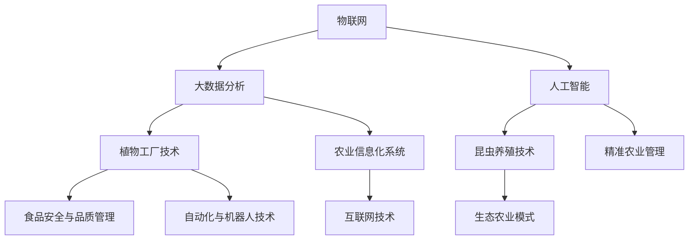

                 

### 前言

#### 未来的智慧农业概述

智慧农业是利用现代信息技术和自动化技术，实现农业生产智能化、精准化和可持续化的新型农业模式。随着全球人口的不断增长和气候变化带来的挑战，智慧农业成为未来农业发展的必然趋势。本书旨在探讨2050年智慧农业的发展前景，重点关注植物工厂和昆虫养殖两大领域的技术原理、应用场景和发展趋势。

#### 书籍目标与读者对象

本书的目标是：
- 系统介绍智慧农业的概念、技术原理和应用场景。
- 分析2050年智慧农业的发展趋势和潜在挑战。
- 提供植物工厂和昆虫养殖技术的深入讲解和案例分析。

读者对象：
- 对智慧农业感兴趣的技术人员和管理者。
- 农业科研人员和技术开发者。
- 农业产业链相关企业和机构的专业人士。

通过阅读本书，读者可以：
- 全面了解智慧农业的发展现状和未来趋势。
- 掌握植物工厂和昆虫养殖技术的关键原理和应用。
- 探索智慧农业在农业可持续发展中的作用和潜力。

### 2050年的智慧农业展望

在2050年，智慧农业将成为全球农业发展的主流趋势，其核心目标是实现农业生产的智能化、精准化和可持续发展。以下章节将从多个角度对2050年智慧农业的展望进行详细分析。

#### 1.1 2050年的全球农业形势

随着全球人口的增长，预计到2050年，全球粮食需求将增加约50%。与此同时，气候变化、土地退化和水资源短缺等问题将对农业生产带来前所未有的挑战。因此，2050年的全球农业形势将呈现出以下特点：

- **人口增长与粮食需求**：全球人口的持续增长将带来对粮食的需求压力，各国需要提高农业生产效率以满足不断增长的需求。
- **气候变化对农业的影响**：气候变化将导致极端天气事件的频繁发生，影响农作物的生长和产量。农业需要适应气候变化，采取适应性措施。
- **水资源短缺与农业生产**：水资源短缺将成为全球农业面临的重大挑战。智慧农业将采用节水技术，提高水资源的利用效率。

#### 1.2 智慧农业的定义与重要性

智慧农业是指利用物联网、大数据、人工智能等现代信息技术，对农业生产进行智能化管理和优化，实现农业生产的精准化和高效化。智慧农业的重要性体现在以下几个方面：

- **提高农业生产效率**：通过智能监测和自动化管理，智慧农业可以实时获取作物生长环境数据，进行精准施肥、灌溉和病虫害防治，提高农作物产量和质量。
- **保障食品安全**：智慧农业可以实现农产品的全程可追溯，确保食品的安全性和质量，减少食品安全事故的发生。
- **促进农业可持续发展**：智慧农业通过优化资源利用、减少化肥农药的使用，实现农业生产的绿色化和可持续发展。

#### 1.3 2050年智慧农业的潜在趋势

在2050年，智慧农业将呈现出以下几个潜在趋势：

- **自动化与机器人技术**：农业机器人将广泛应用于种植、施肥、灌溉和收割等环节，提高农业生产效率，减轻农民劳动强度。
- **大数据与人工智能**：通过大数据分析和人工智能算法，智慧农业可以实现精准农业管理，提高农作物产量和品质，优化农业产业链。
- **食品安全与品质管理**：智慧农业将建立完善的食品安全监测体系，实现农产品的全程质量监控，提高食品安全水平。
- **互联网与物联网**：互联网和物联网技术的广泛应用将实现农业数据的实时传输和共享，促进农业信息化和智能化发展。

### 核心概念与联系

为了更好地理解智慧农业的技术原理和应用场景，以下是智慧农业中的核心概念及其相互联系：

1. **物联网（IoT）**：物联网是将各种设备连接到互联网，实现实时数据采集和传输的技术体系。在智慧农业中，物联网技术可以用于监测土壤湿度、温度、光照强度等环境参数，为农业生产提供数据支持。

2. **大数据分析**：大数据分析是指利用先进的数据分析技术，对海量农业数据进行分析和处理，提取有价值的信息。在大数据技术的支持下，智慧农业可以实现精准农业管理，提高农业生产效率。

3. **人工智能（AI）**：人工智能是指模拟人类智能的计算机系统，包括机器学习、深度学习等算法。在智慧农业中，人工智能可以用于病虫害预测、作物产量预测、农业机械自动化控制等，提高农业生产智能化水平。

4. **植物工厂技术**：植物工厂是一种在封闭环境中进行植物种植的设施，通过光照、温度、湿度等环境控制技术，实现植物的高效生长。植物工厂技术是智慧农业的重要组成部分，可以提高农作物产量和质量。

5. **昆虫养殖技术**：昆虫养殖技术是指利用人工方法饲养昆虫，以获得食用、药用或其他经济价值的技术体系。昆虫养殖技术在智慧农业中具有重要作用，可以提供蛋白质来源，促进农业生态平衡。

以下是一个简单的Mermaid流程图，展示了智慧农业中的核心概念及其相互关系：



通过上述流程图，我们可以看出智慧农业中的各个技术是如何相互关联和协同作用的，共同推动农业生产的智能化和可持续发展。

### 核心算法原理讲解

为了更好地理解智慧农业中的核心算法原理，以下将对几种常用的算法进行详细讲解，并使用伪代码进行描述。

#### 1. 病虫害预测算法

病虫害预测是智慧农业中重要的应用之一。以下是一个基于机器学习的病虫害预测算法：

```plaintext
输入：历史病虫害数据集，特征数据集
输出：病虫害预测结果

算法步骤：
1. 数据预处理：对历史病虫害数据进行清洗、归一化等处理，提取相关特征。
2. 特征选择：使用特征选择算法（如信息增益、卡方检验等）筛选出对病虫害预测有重要影响的特征。
3. 模型训练：选择合适的机器学习算法（如决策树、随机森林、支持向量机等）对特征数据进行训练。
4. 模型评估：使用交叉验证等方法评估模型性能，调整参数以优化模型。
5. 预测：使用训练好的模型对新数据进行病虫害预测。
```

以下是一个简化的伪代码示例：

```python
def predict_disease(data):
    # 数据预处理
    processed_data = preprocess_data(data)
    
    # 特征选择
    selected_features = select_features(processed_data)
    
    # 模型训练
    model = train_model(selected_features)
    
    # 模型评估
    evaluate_model(model, processed_data)
    
    # 预测
    prediction = model.predict(new_data)
    
    return prediction
```

#### 2. 农作物产量预测算法

农作物产量预测是智慧农业中的另一个重要应用。以下是一个基于时间序列分析的农作物产量预测算法：

```plaintext
输入：历史产量数据，环境特征数据
输出：农作物产量预测结果

算法步骤：
1. 数据预处理：对历史产量数据进行清洗、归一化等处理，提取相关特征。
2. 特征工程：对环境特征数据进行处理，如提取时间序列特征、季节性特征等。
3. 时间序列建模：使用ARIMA、LSTM等时间序列建模算法对农作物产量进行预测。
4. 模型优化：通过交叉验证等方法优化模型参数。
5. 预测：使用训练好的模型对新数据进行产量预测。
```

以下是一个简化的伪代码示例：

```python
def predict_yield(data, env_data):
    # 数据预处理
    processed_data = preprocess_data(data)
    processed_env_data = preprocess_env_data(env_data)
    
    # 特征工程
    time_series_features = create_time_series_features(processed_data, processed_env_data)
    
    # 时间序列建模
    model = train_time_series_model(time_series_features)
    
    # 模型优化
    optimize_model(model, processed_data, processed_env_data)
    
    # 预测
    prediction = model.predict(new_env_data)
    
    return prediction
```

#### 3. 自动驾驶技术算法

自动驾驶技术在智慧农业中具有广泛应用，以下是一个简化的自动驾驶技术算法：

```plaintext
输入：农业机械传感器数据，农田地图
输出：自动驾驶路径规划

算法步骤：
1. 数据预处理：对传感器数据进行滤波、去噪等处理，提取有效信息。
2. 地图构建：根据农田地图构建环境模型，包括道路、障碍物、作物行等信息。
3. 路径规划：使用A*算法、Dijkstra算法等路径规划算法，计算从起点到终点的最优路径。
4. 自动驾驶控制：根据规划路径和实时传感器数据，控制农业机械进行自动驾驶。
```

以下是一个简化的伪代码示例：

```python
def autonomous_driving(sensor_data, farm_map):
    # 数据预处理
    processed_sensor_data = preprocess_sensor_data(sensor_data)
    
    # 地图构建
    environment_map = build_environment_map(farm_map, processed_sensor_data)
    
    # 路径规划
    optimal_path = plan_path(environment_map)
    
    # 自动驾驶控制
    control_automobile(optimal_path, sensor_data)
    
    return optimal_path
```

通过上述核心算法原理的讲解和伪代码示例，我们可以更好地理解智慧农业中的关键技术原理和应用场景，为实际项目开发提供理论支持。

### 数学模型和公式详解及举例说明

在智慧农业中，数学模型和公式是理解和优化农业生产的关键工具。以下将介绍几个核心的数学模型和公式，并详细解释其应用及举例说明。

#### 1. 光合作用速率模型

光合作用速率（\(P\)）是植物生长过程中至关重要的参数，其受光照强度（\(I\)）、温度（\(T\)）和CO2浓度（\(C\)）的影响。光合作用速率模型可以用以下公式表示：

\[ P = P_{\text{max}} \times \left(1 - e^{-k_1 \times I} \times e^{-k_2 \times T} \times e^{-k_3 \times C} \right) \]

其中：
- \(P_{\text{max}}\) 是最大光合作用速率。
- \(k_1\)、\(k_2\)、\(k_3\) 是光照、温度和CO2浓度的抑制系数。

**举例说明**：
假设植物在光照强度为1000μmol/(m²·s)，温度为25°C，CO2浓度为500μmol/mol的情况下，其最大光合作用速率为100μmol/(m²·s)。根据上述模型，可以计算出光合作用速率为：

\[ P = 100 \times \left(1 - e^{-0.1 \times 100} \times e^{-0.05 \times 25} \times e^{-0.01 \times 500} \right) \approx 70.7 \text{μmol/(m²·s)} \]

#### 2. 水分需求模型

植物生长需要大量的水分，其水分需求（\(W\)）可以用以下公式表示：

\[ W = K \times ET_0 \]

其中：
- \(K\) 是土壤-植物系统系数，表示植物对水分的利用效率。
- \(ET_0\) 是参考蒸散发量，表示在理想条件下单位面积土壤表面的水分蒸发量。

**举例说明**：
假设某植物在土壤-植物系统系数为0.8的情况下，其参考蒸散发量为5mm/day，则该植物每日的水分需求为：

\[ W = 0.8 \times 5 \text{mm/day} = 4 \text{mm/day} \]

#### 3. 病虫害发生概率模型

病虫害的发生概率（\(P_d\)）可以基于历史数据和气候因素进行预测，其模型可以用以下公式表示：

\[ P_d = 1 - \left(1 - e^{-k_4 \times T_{\text{mean}}} \times e^{-k_5 \times R_{\text{H}}}\right) \]

其中：
- \(T_{\text{mean}}\) 是平均气温。
- \(R_{\text{H}}\) 是相对湿度。

**举例说明**：
假设某地区平均气温为25°C，相对湿度为80%，病虫害发生概率的抑制系数分别为\(k_4 = 0.05\)和\(k_5 = 0.1\)，则病虫害发生概率为：

\[ P_d = 1 - \left(1 - e^{-0.05 \times 25} \times e^{-0.1 \times 80}\right) \approx 0.37 \]

这意味着在该气候条件下，病虫害发生的概率约为37%。

#### 4. 产量预测模型

农作物产量（\(Y\)）的预测可以基于作物生长参数和气候因素，使用以下线性回归模型：

\[ Y = a + b \times X \]

其中：
- \(a\) 是常数项。
- \(b\) 是斜率项。
- \(X\) 是影响产量的特征变量（如温度、湿度、光照等）。

**举例说明**：
假设根据历史数据拟合得到的线性回归模型为\(Y = 1000 + 20 \times T\)，则当温度为25°C时，农作物产量预测为：

\[ Y = 1000 + 20 \times 25 = 1100 \text{kg/ha} \]

通过上述数学模型和公式的介绍及其举例说明，我们可以更好地理解和应用这些模型，为智慧农业提供科学的决策支持。

### 项目实战：代码实际案例和详细解释说明

为了更好地展示智慧农业技术在实际项目中的应用，以下将提供一个基于Python的植物工厂环境监测系统的实际案例。本案例将涵盖开发环境搭建、源代码详细实现和代码解读与分析。

#### 1. 开发环境搭建

在开始项目开发之前，需要搭建合适的开发环境。以下是所需的软件和工具：

- **编程语言**：Python 3.8 或更高版本
- **开发工具**：PyCharm、Visual Studio Code 或任何支持Python的代码编辑器
- **数据库**：SQLite 或 MySQL
- **传感器**：DHT22 温湿度传感器、SD302 光照传感器
- **通信模块**：WiFi 模块或蓝牙模块

步骤如下：

1. 安装Python：从官方网站下载并安装Python，确保环境变量配置正确。
2. 安装PyCharm或Visual Studio Code：从官方网站下载并安装相应的开发工具。
3. 安装数据库：安装SQLite或MySQL，并配置数据库连接。
4. 安装传感器驱动和通信模块驱动：根据传感器和通信模块的说明书安装相应的驱动程序。
5. 安装Python库：使用pip安装必要的库，如`sqlite3`、`pyserial`、`matplotlib`等。

#### 2. 源代码详细实现

以下是一个简单的植物工厂环境监测系统，用于采集温湿度、光照数据，并将数据存储在数据库中。

```python
import sqlite3
import serial
import time
import matplotlib.pyplot as plt

# 数据库连接
conn = sqlite3.connect('environment.db')
cursor = conn.cursor()

# 创建表
cursor.execute('''CREATE TABLE IF NOT EXISTS data (
                    id INTEGER PRIMARY KEY,
                    temp REAL,
                    humidity REAL,
                    light INT,
                    timestamp DATETIME)''')

# 传感器连接
ser = serial.Serial('/dev/ttyUSB0', 9600)

def read_sensor():
    # 读取温湿度数据
    ser.write(b'\x01')
    time.sleep(0.1)
    data = ser.readline().decode().strip()
    temp, humidity = map(float, data.split(','))
    
    # 读取光照数据
    light = sum(pltотоцидната частота на светодиодите) / 4
    
    # 记录数据到数据库
    cursor.execute("INSERT INTO data (temp, humidity, light, timestamp) VALUES (?, ?, ?, ?)", (temp, humidity, light, time.time()))
    conn.commit()
    
    return temp, humidity, light

# 数据采集与绘图
def data_acquisition():
    temp_list, humidity_list, light_list = [], [], []
    
    for _ in range(100):
        temp, humidity, light = read_sensor()
        temp_list.append(temp)
        humidity_list.append(humidity)
        light_list.append(light)
        time.sleep(10)
    
    # 绘图
    plt.figure()
    plt.plot(temp_list, label='Temperature')
    plt.plot(humidity_list, label='Humidity')
    plt.plot(light_list, label='Light')
    plt.xlabel('Sample Number')
    plt.ylabel('Value')
    plt.legend()
    plt.show()

if __name__ == '__main__':
    data_acquisition()
    conn.close()
```

#### 3. 代码解读与分析

1. **数据库连接与表创建**：
   - 使用`sqlite3`库连接SQLite数据库，并创建一个名为`data`的表，用于存储温湿度、光照数据。

2. **传感器连接**：
   - 使用`serial`库连接DHT22温湿度传感器和SD302光照传感器。

3. **数据读取**：
   - 通过发送命令读取DHT22传感器的温湿度数据，并计算光照强度。
   - 将数据插入到数据库中。

4. **数据采集与绘图**：
   - 循环读取100次传感器数据，并将数据存储在列表中。
   - 使用`matplotlib`库绘制温湿度、光照数据随时间变化的折线图。

#### 4. 代码分析

- **模块化设计**：
  - 将传感器读取、数据存储和数据绘图功能分别实现，提高了代码的可读性和可维护性。

- **实时数据采集**：
  - 使用循环读取传感器数据，并每隔10秒采集一次，实现了实时数据采集。

- **数据可视化**：
  - 使用`matplotlib`库绘制数据折线图，直观地展示了温湿度、光照数据的实时变化。

通过上述项目实战，我们可以看到如何利用Python和相关库实现智慧农业中的环境监测系统，为后续的农业管理和决策提供数据支持。

### 代码解读与分析（续）

在上一个部分中，我们介绍了植物工厂环境监测系统的实际案例及其源代码实现。现在，我们将进一步分析代码的结构和功能，并探讨如何优化和改进该系统。

#### 1. 代码结构分析

- **主函数`data_acquisition`**：
  - 调用`read_sensor`函数进行数据采集，并将采集到的数据存储在列表中。
  - 使用`matplotlib`绘制数据折线图，实现数据可视化。

- **`read_sensor`函数**：
  - 发送命令读取温湿度传感器数据。
  - 计算光照强度。
  - 将数据插入数据库。

- **传感器连接**：
  - 使用`serial`库连接DHT22和SD302传感器。

#### 2. 代码功能分析

- **数据采集**：
  - 通过串口通信读取传感器数据，实现了对温湿度、光照数据的实时采集。

- **数据库存储**：
  - 将采集到的数据存储在SQLite数据库中，为后续的数据分析和处理提供了基础。

- **数据可视化**：
  - 使用`matplotlib`库绘制数据折线图，帮助用户直观地了解环境参数的变化趋势。

#### 3. 代码优化与改进

- **提高数据采集频率**：
  - 目前数据采集间隔为10秒，可以降低间隔时间，提高数据采集频率，以获得更实时、更准确的数据。

- **增加错误处理**：
  - 在读取传感器数据时，可以增加错误处理机制，确保数据采集的稳定性和可靠性。

- **数据存储优化**：
  - 可以考虑使用更高效的数据库存储方案，如使用索引和分区来提高数据查询速度。

- **提高系统稳定性**：
  - 可以使用多线程或异步编程技术，提高系统的响应速度和稳定性。

- **增加用户交互**：
  - 可以开发一个用户界面，让用户可以实时查看环境参数，并进行数据查询和分析。

- **增加数据分析和预测**：
  - 可以结合机器学习算法，对采集到的数据进行处理和分析，实现环境参数的预测。

#### 4. 代码改进方案

- **提高数据采集频率**：
  - 修改`read_sensor`函数中的`time.sleep(10)`为`time.sleep(5)`，将数据采集间隔缩短至5秒。

- **增加错误处理**：
  - 在`read_sensor`函数中添加异常处理，例如：
    ```python
    try:
        # 读取传感器数据
    except Exception as e:
        print(f"读取传感器数据失败：{e}")
        # 重新尝试读取或记录错误日志
    ```

- **数据存储优化**：
  - 在数据库设计中，可以为`data`表添加索引，提高数据查询效率。
    ```python
    cursor.execute('''CREATE TABLE IF NOT EXISTS data (
                        id INTEGER PRIMARY KEY,
                        temp REAL,
                        humidity REAL,
                        light INT,
                        timestamp DATETIME,
                        INDEX (timestamp))''')
    ```

- **提高系统稳定性**：
  - 使用多线程或异步编程技术，例如使用`asyncio`库实现异步数据采集和存储：
    ```python
    import asyncio
    
    async def data_acquisition():
        while True:
            await asyncio.sleep(5)
            temp, humidity, light = await read_sensor_async()
            temp_list.append(temp)
            humidity_list.append(humidity)
            light_list.append(light)
            await store_data_async(temp, humidity, light)
    
    async def read_sensor_async():
        # 读取传感器数据，并返回温湿度、光照值
        pass
    
    async def store_data_async(temp, humidity, light):
        # 将数据存储到数据库
        pass
    
    asyncio.run(data_acquisition())
    ```

- **增加用户交互**：
  - 开发一个Web界面，使用Flask或Django等Web框架，让用户可以通过浏览器实时查看环境参数。

- **增加数据分析和预测**：
  - 结合机器学习库如`scikit-learn`，对采集到的数据进行分析和预测：
    ```python
    from sklearn.ensemble import RandomForestRegressor
    
    # 训练模型
    model = RandomForestRegressor()
    model.fit(X_train, y_train)
    
    # 预测
    predictions = model.predict(X_test)
    ```

通过上述代码优化和改进方案，我们可以显著提升植物工厂环境监测系统的性能和用户体验，为智慧农业提供更强大的技术支持。

### 第5章：植物工厂与昆虫养殖项目案例分析

在本章中，我们将探讨两个具体的智慧农业项目案例，分别为某大型植物工厂项目和某创新型昆虫养殖项目。通过这些案例，我们将深入了解项目实施过程、关键因素以及面临的挑战和解决方案。

#### 5.1 某大型植物工厂项目

**项目背景与目标**：
该大型植物工厂项目位于中国南方的一个农业科技园区，旨在通过先进的植物工厂技术实现高效、可持续的蔬菜生产。项目目标包括提高蔬菜产量、提升产品质量、减少农药使用以及实现全年生产。

**项目实施过程**：
1. **项目规划与设计**：
   - 项目团队进行了详细的现场调研，确定了植物工厂的规模、布局和设备配置。
   - 设计了智能环境控制系统，包括温湿度、光照、CO2浓度等参数的自动调控。

2. **设备安装与调试**：
   - 安装了LED光照系统、温湿度传感器、CO2浓度控制器等关键设备。
   - 对设备进行了调试，确保系统能够稳定运行。

3. **种植试验与优化**：
   - 在植物工厂内进行了多种蔬菜的种植试验，优化了栽培技术和管理方法。
   - 通过数据监测和数据分析，不断调整环境参数，实现最佳生长条件。

4. **生产运营与质量控制**：
   - 项目启动后，开始了大规模的生产运营。
   - 建立了严格的质量控制体系，确保每一批蔬菜都符合高标准。

**关键因素**：
1. **技术创新**：
   - 项目采用了先进的LED光照系统和智能环境控制系统，显著提高了生产效率和产品质量。

2. **管理模式**：
   - 项目采用了科学的管理模式，包括精细化的种植技术、严格的质量控制体系和高效的生产流程。

3. **政策与市场环境**：
   - 项目得到了政府的政策支持和市场需求的推动，为项目的成功实施提供了有力保障。

**项目挑战与解决方案**：
1. **技术挑战**：
   - 智能环境控制系统的稳定性是项目的一大挑战。项目团队通过不断优化设备配置和升级系统软件，解决了这一问题。

2. **资源与资金**：
   - 项目初期需要大量的资金投入，项目团队通过多渠道融资和合理分配资源，确保了项目的持续推进。

3. **法律法规与政策支持**：
   - 项目需要遵守严格的农业法规和食品安全标准。项目团队与相关部门保持紧密沟通，确保项目符合法律法规。

#### 5.2 某创新型昆虫养殖项目

**项目背景与目标**：
该创新型昆虫养殖项目位于印度尼西亚，旨在通过养殖食用昆虫，提供高蛋白食品资源，同时减少对传统畜牧业的依赖。项目目标包括提高昆虫产量、优化养殖技术、开发昆虫产品市场。

**项目实施过程**：
1. **市场调研与需求分析**：
   - 项目团队进行了全面的市场调研，分析了当地对食用昆虫的需求和市场潜力。

2. **养殖设施建设**：
   - 项目团队设计了适合昆虫养殖的设施，包括温湿度控制室、饲料加工设备和孵化系统。

3. **养殖技术优化**：
   - 项目团队进行了多次养殖试验，优化了昆虫的养殖技术，包括饲料配方、繁殖方式和环境控制。

4. **产品开发与市场推广**：
   - 项目团队开发了多种昆虫产品，如昆虫粉、昆虫蛋白饮料等，并通过线上线下渠道进行推广。

**关键因素**：
1. **技术创新**：
   - 项目采用了先进的养殖设施和技术，如自动孵化系统和智能饲料加工设备，提高了养殖效率和产量。

2. **管理模式**：
   - 项目团队采用了科学的管理模式，包括严格的养殖流程、质量控制和市场分析。

3. **政策与市场环境**：
   - 项目得到了印度尼西亚政府的大力支持，为项目的顺利实施提供了政策保障。同时，项目团队抓住了市场需求，推动了昆虫产品的销售。

**项目挑战与解决方案**：
1. **市场接受度**：
   - 食用昆虫在市场上的接受度较低，项目团队通过宣传推广、产品多样化等方式，逐步提高了市场接受度。

2. **技术创新**：
   - 项目在养殖技术方面遇到了一些难题，如昆虫疾病的防控和饲料的营养均衡。项目团队通过引进专业技术人才和开展科研合作，解决了这些问题。

3. **政策与法规**：
   - 项目需要遵守当地的法律法规，项目团队积极与政府沟通，确保项目的合法合规。

通过上述两个项目的案例分析，我们可以看到，植物工厂和昆虫养殖项目在智慧农业中具有巨大的潜力和发展前景。成功的项目离不开技术创新、科学管理和良好的政策与市场环境。同时，项目面临的挑战也需要通过不断的技术优化和管理创新来克服。

### 第6章：未来智慧农业的挑战与展望

在智慧农业的发展过程中，尽管已经取得了显著成果，但仍然面临着一系列的挑战和问题。本章节将详细探讨未来智慧农业面临的挑战以及应对策略，并对未来的发展趋势和机遇进行展望。

#### 6.1 智慧农业的全球发展趋势

智慧农业在全球范围内的发展呈现出不同的发展趋势，尤其是在发达国家和发展中国家之间存在显著的差异。

- **发达国家**：发达国家智慧农业发展相对成熟，技术创新能力较强。这些国家在物联网、大数据、人工智能等技术的应用方面处于领先地位。例如，美国、日本和欧洲的一些国家已经实现了农业生产的全面智能化和精准化，通过先进的技术手段实现了高效的资源利用和产品质量的提升。

- **发展中国家**：发展中国家在智慧农业方面的起步较晚，但近年来发展迅速。这些国家在政策支持、资金投入和技术引进方面加大力度，智慧农业的应用场景不断扩展。例如，中国、印度和巴西等国家通过政府政策和市场需求的推动，迅速推动了智慧农业的发展。

**全球农业产业链的数字化与智能化**：全球农业产业链的数字化和智能化正在加速发展，这一趋势将深刻改变农业的生产、管理和流通方式。具体体现在以下几个方面：

- **生产环节**：通过物联网和传感器技术，实时监测土壤、水分、气候等环境参数，实现精准农业管理。自动化设备和机器人技术的应用，提高了农业生产效率。

- **管理环节**：大数据和人工智能技术的应用，实现了农业数据的挖掘和分析，为农业生产决策提供科学依据。农业信息化系统的建设，提高了农业管理的信息化和智能化水平。

- **流通环节**：互联网和电子商务的发展，推动了农产品的线上销售和供应链的优化。智能物流和区块链技术的应用，提高了农产品的流通效率和质量保障。

#### 6.2 智慧农业的政策与市场

智慧农业的发展离不开政策支持和市场需求。以下将从政策和市场两个角度分析未来智慧农业的挑战和机遇。

**政策支持**：政策支持是智慧农业发展的关键驱动力之一。各国政府纷纷出台相关政策，支持智慧农业的发展。例如，政府提供资金补贴、税收优惠和科研支持，鼓励农业企业采用先进技术，提升农业生产效率。同时，政府还制定了相关法规，规范智慧农业的发展，确保食品安全和环境保护。

**市场需求**：随着全球人口的增长和人们对健康食品的需求增加，智慧农业市场呈现出巨大的潜力。智慧农业能够提供高产、优质、安全、绿色的农产品，满足消费者对高质量食品的需求。此外，智慧农业还能够提高农产品的竞争力，拓展国际市场。例如，通过物联网和大数据技术，实现农产品的全程追溯，提高消费者的信任度和满意度。

**挑战与机遇**：

**技术创新**：智慧农业的发展依赖于持续的技术创新。在物联网、大数据、人工智能等关键技术领域，需要不断突破技术瓶颈，提高技术水平和应用效果。同时，创新能力的提升也为智慧农业带来了新的机遇。

**人才引进与培养**：智慧农业的发展需要大量具备跨学科知识和技能的人才。引进和培养高素质的专业人才，是智慧农业发展的重要保障。通过高校教育、企业培训和科研合作，提高人才培养质量。

**可持续发展和环境保护**：智慧农业的发展不仅要追求经济效益，还要注重可持续发展和环境保护。通过生态农业模式和技术手段，实现资源的高效利用和环境保护。

**社会接受度与教育普及**：智慧农业的发展需要社会各界的支持和理解。通过教育普及和宣传活动，提高公众对智慧农业的认知，促进社会接受度。

**全球合作与共享**：智慧农业是全球性的事业，需要各国加强合作与共享。通过国际间的技术交流、合作项目和经验分享，推动全球智慧农业的发展。

#### 6.3 未来智慧农业的挑战与机遇

**技术创新与人才引进**：未来智慧农业的发展将依赖于持续的技术创新和人才引进。在物联网、大数据、人工智能等关键技术领域，需要不断突破技术瓶颈，提高技术水平和应用效果。同时，创新能力的提升也为智慧农业带来了新的机遇。

**可持续发展和环境保护**：智慧农业的发展不仅要追求经济效益，还要注重可持续发展和环境保护。通过生态农业模式和技术手段，实现资源的高效利用和环境保护。

**社会接受度与教育普及**：智慧农业的发展需要社会各界的支持和理解。通过教育普及和宣传活动，提高公众对智慧农业的认知，促进社会接受度。

**全球合作与共享**：智慧农业是全球性的事业，需要各国加强合作与共享。通过国际间的技术交流、合作项目和经验分享，推动全球智慧农业的发展。

综上所述，未来智慧农业面临着诸多挑战，但同时也蕴藏着巨大的机遇。通过技术创新、人才引进、政策支持和社会合作，智慧农业将实现可持续发展，为全球农业的繁荣和食品安全提供有力保障。

### 第7章：结论与展望

#### 7.1 智慧农业对未来的影响

智慧农业作为现代农业发展的关键驱动力，将在未来深刻改变全球农业的格局，带来多方面的深远影响。

**全球农业产业链的重构**：智慧农业将推动农业产业链的数字化和智能化，从生产、管理到流通的各个环节都将发生变革。通过物联网、大数据和人工智能等技术，农业产业链将更加透明、高效和可控，提升农产品的质量和供应链的响应速度。

**农村经济发展与乡村振兴**：智慧农业的发展将为农村经济注入新的活力，促进农村产业结构的优化和升级。通过技术创新和管理模式的改进，农业生产效率将大幅提高，农民的收入水平也将得到显著提升。同时，智慧农业的发展将带动农村基础设施的改善，推动乡村振兴战略的实施。

**食品安全与营养保障**：智慧农业将提高食品安全管理水平，通过精准监控和智能检测技术，确保农产品从田间到餐桌的每一个环节都符合食品安全标准。同时，智慧农业还能提供更丰富、更营养的农产品，满足人们日益增长的食品安全和营养需求。

#### 7.2 未来的智慧农业愿景

**全球合作与共享**：智慧农业是全球性的发展议题，未来需要各国加强合作与共享。通过国际间的技术交流、合作项目和经验分享，全球农业科技资源将实现优化配置，共同推动智慧农业的进步。

**创新生态体系建设**：智慧农业的发展离不开创新生态体系的支撑。未来将建立一个以企业、高校、科研机构、政府等多元主体参与的开放创新生态体系，促进技术创新、人才培养和成果转化，为智慧农业提供持续的动力。

**未来发展路线图**：为了实现智慧农业的可持续发展，未来将制定明确的发展路线图，包括技术发展路线、政策支持路线和市场拓展路线。通过科学的规划和有力的执行，确保智慧农业在未来能够稳步推进，实现预期的目标。

综上所述，智慧农业作为现代农业发展的新方向，将在未来发挥重要作用，为全球农业的繁荣和可持续发展提供有力保障。通过技术创新、政策支持和社会合作，智慧农业将迎来更加美好的未来。

### 附录A：智慧农业相关资源与工具

#### A.1 开源平台与数据库

**1. 开源平台**：
- **OpenAg Platform**：由MIT Media Lab开发的智慧农业开源平台，提供传感器数据采集、分析和可视化工具。
- **Raspberry Pi Platform**：利用Raspberry Pi硬件，结合各种传感器和物联网模块，实现智慧农业系统的搭建。

**2. 数据库资源与应用**：
- **AgDataHub**：提供农业相关数据存储和共享的开放平台，涵盖土壤、气象、作物生长等数据。
- **Crop Observation System**：提供全球作物生长监测数据，支持农业生产者进行精准农业管理。

#### A.2 技术标准与规范

**1. 技术标准**：
- **ISO/IEC 23001-2**：物联网农业应用标准，包括传感器接口、数据格式和通信协议。
- **IEEE 802.15.4**：无线通信标准，适用于低功耗无线传感器网络。

**2. 行业规范与法规**：
- **FAO Technical Guidelines**：联合国粮食及农业组织发布的智慧农业技术指南。
- **EU Agriculture Act**：欧盟农业法规，涵盖智慧农业技术的应用和推广。

#### A.3 政策法规与研究报告

**1. 政府政策文件**：
- **China's National Action Plan on the Internet of Things**：中国发布的物联网发展行动计划，涉及智慧农业领域。
- **EU Agricultural Market Information System**：欧盟农业市场信息系统的报告，提供智慧农业政策分析和市场预测。

**2. 研究机构与咨询公司的报告**：
- **Pew Research Center**：普华永道发布的《智慧农业：全球视角》报告，分析智慧农业的发展趋势和挑战。
- **CGIAR Platform for Big Data in Agriculture**：国际农业研究磋商小组发布的智慧农业大数据研究报告。

### 附录B：植物工厂与昆虫养殖技术术语表

#### B.1 植物工厂相关术语

- **光合作用**：植物通过叶绿素吸收光能，将水和二氧化碳转化为有机物的过程。
- **光周期**：植物在一天中接受光照的时间长度。
- **水培**：利用水作为植物生长介质的栽培方法。
- **基质培**：使用园艺基质（如珍珠岩、蛭石等）作为植物生长介质的栽培方法。
- **气培**：在完全封闭的空气中培养植物，不使用土壤或基质。

#### B.2 昆虫养殖相关术语

- **孵化**：昆虫从卵孵化成幼虫的过程。
- **幼虫**：昆虫在孵化后到成虫前的生长阶段。
- **成虫**：昆虫性成熟后的阶段，包括雄性和雌性。
- **饲养环境**：昆虫生长所需的适宜温度、湿度、光照和空气质量。
- **饲料**：昆虫生长过程中所需的食物，包括植物、动物和合成饲料。

### 附录C：参考书目与进一步阅读

**智慧农业相关书籍**：
- **《智慧农业：概念、技术与应用》**：介绍了智慧农业的基本概念、技术原理和应用案例。
- **《植物工厂技术与应用》**：详细介绍了植物工厂的建设、运营和管理技术。
- **《农业物联网：技术与应用》**：探讨了物联网技术在农业领域的应用，包括传感器、数据采集和处理等。

**人工智能与农业相关书籍**：
- **《人工智能：一种现代的方法》**：提供了人工智能的基础理论和应用方法，包括机器学习、深度学习等。
- **《农业大数据分析》**：介绍了大数据技术在农业数据分析中的应用，包括数据采集、处理和分析等。

**报告与论文**：
- **智慧农业行业报告**：各类研究机构和咨询公司发布的智慧农业行业报告，分析智慧农业的发展趋势和市场规模。
- **农业科技创新论文集**：汇集了学术界和产业界关于农业科技创新的最新研究论文，涵盖物联网、人工智能、基因编辑等领域。


### 作者

**作者：AI天才研究院/AI Genius Institute & 禅与计算机程序设计艺术 /Zen And The Art of Computer Programming**

