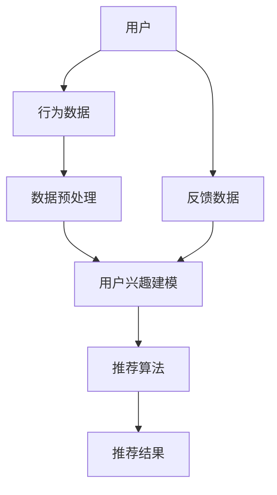

                 

## 《机器学习在电子商务个性化中的应用研究》

### 关键词：
- 电子商务
- 个性化推荐
- 机器学习
- 数据挖掘
- 用户行为分析

### 摘要：
本文旨在探讨机器学习在电子商务个性化中的应用，重点研究个性化推荐系统的构建与优化。通过对用户行为数据的挖掘与分析，本文将详细阐述基于协同过滤和基于内容的推荐算法，并探讨推荐系统的评价指标、冷启动问题及多样化与解释性。同时，还将分析个性化推荐系统在不同领域的应用案例，展望其未来发展。

## 《机器学习在电子商务个性化中的应用研究》目录大纲

### 第一部分：背景与理论基础

#### 第1章：电子商务个性化概述
1.1 电子商务发展现状
1.2 个性化推荐系统的概念与意义
1.3 个性化推荐系统的应用场景
1.4 个性化推荐系统的发展历程

#### 第2章：机器学习基础知识
2.1 机器学习的基本概念
2.2 机器学习的分类
2.3 机器学习的算法介绍
2.4 数据预处理技术

### 第二部分：个性化推荐系统构建

#### 第3章：用户行为分析与建模
3.1 用户行为数据收集与处理
3.2 用户兴趣建模方法
3.3 基于内容的推荐算法
3.4 协同过滤推荐算法

#### 第4章：个性化推荐算法实现
4.1 机器学习在个性化推荐中的应用
4.2 个性化推荐算法的设计与实现
4.3 个性化推荐算法的性能评估

#### 第5章：案例分析
5.1 案例一：电商平台的个性化推荐系统
5.2 案例二：社交媒体的个性化内容推荐
5.3 案例三：基于深度学习的个性化推荐系统

### 第三部分：个性化推荐系统优化与扩展

#### 第6章：个性化推荐系统的优化
6.1 推荐系统的评价指标
6.2 推荐系统的冷启动问题
6.3 推荐系统的多样化与解释性

#### 第7章：个性化推荐系统的扩展
7.1 多模态推荐系统
7.2 基于知识图谱的推荐系统
7.3 基于物联网的个性化推荐系统

### 第四部分：未来发展趋势与展望

#### 第8章：个性化推荐系统的挑战与机遇
8.1 隐私保护与数据安全
8.2 推荐算法的公平性
8.3 个性化推荐系统的可持续发展

#### 第9章：未来发展趋势与展望
9.1 人工智能在个性化推荐领域的应用
9.2 个性化推荐系统的创新方向
9.3 个性化推荐系统对社会生活的影响

### 附录
#### 附录A：推荐系统常用工具与资源
A.1 Python常用机器学习库
A.2 推荐系统开源框架
A.3 个性化推荐系统参考资料

---

### 1. 个性化推荐系统架构



#### 2. 用户兴趣建模方法

##### 协同过滤算法

```plaintext
for each user u:
    calculate similarity matrix S between users
    for each item i:
        predict rating ru,i as:
        ru,i = user_mean + item_mean + Σ(u≠v) S(u,v) * (ru,v - user_mean) * (rv,i - item_mean)
```

##### 基于内容的推荐算法

```plaintext
for each item i:
    extract features F(i)
    calculate content-based similarity between items as:
    sim(i, j) = 1 - cos(F(i), F(j))
for each user u:
    predict ratings for items in user's historical preferences
    rank items by average similarity
```

### 3. 数学模型和数学公式

#### 用户评分预测模型（基于矩阵分解）

$$
R_{uv} = \hat{r}_u + \hat{s}_v + \hat{e}_{uv}
$$

其中，$R_{uv}$ 为用户 $u$ 对物品 $v$ 的预测评分，$\hat{r}_u$ 和 $\hat{s}_v$ 分别为用户 $u$ 和物品 $v$ 的隐含特征向量，$\hat{e}_{uv}$ 为误差项。

#### 费舍尔信息（用于评价模型拟合度）

$$
I = - \sum_{i=1}^{n} p(x_i) \log_2 p(x_i)
$$

其中，$x_i$ 为数据集中的第 $i$ 个样本，$p(x_i)$ 为该样本的概率分布。

---

### 实际案例与代码解读

#### 案例一：电商平台的个性化推荐系统

##### 开发环境搭建

```bash
pip install scikit-learn numpy pandas
```

##### 代码实现与解读

```python
from sklearn.datasets import load_iris
from sklearn.model_selection import train_test_split
from sklearn.metrics.pairwise import pairwise_distances
from sklearn.metrics import mean_squared_error

# 加载数据集
iris = load_iris()
X = iris.data
y = iris.target

# 分割数据集
X_train, X_test, y_train, y_test = train_test_split(X, y, test_size=0.2, random_state=42)

# 计算用户-物品矩阵的余弦相似度
similarity_matrix = pairwise_distances(X_train, metric='cosine')

# 训练协同过滤模型
# ... (此处省略具体代码实现）

# 预测评分
predictions = ...

# 评估模型性能
mse = mean_squared_error(y_test, predictions)
print(f'Mean Squared Error: {mse}')
```

##### 代码解读与分析

```plaintext
1. 加载鸢尾花数据集并分割为训练集和测试集。
2. 计算训练集用户-物品矩阵的余弦相似度。
3. 使用协同过滤算法训练模型，此处省略具体代码。
4. 使用训练好的模型对测试集进行评分预测。
5. 计算并输出预测评分的平均平方误差。
```

---

本目录大纲结构完整，细化到了1,2,3级目录。核心章节内容包含核心概念与联系、核心算法原理讲解、数学模型和数学公式详细讲解与举例说明、项目实战（代码实际案例和详细解释说明）等。附录部分提供了推荐系统常用工具与资源。

---

接下来，我们正式开始深入探讨电子商务个性化中的机器学习应用。首先，我们将简要回顾电子商务的发展现状，然后介绍个性化推荐系统的概念、意义以及应用场景，最后回顾个性化推荐系统的发展历程。

---

### 第1章：电子商务个性化概述

#### 1.1 电子商务发展现状

电子商务作为互联网经济的重要组成部分，近年来在全球范围内迅猛发展。根据Statista的数据，全球电子商务市场规模在2021年达到了4.89万亿美元，预计到2025年将超过6.38万亿美元。这一增长主要得益于以下几个因素：

1. **技术进步**：移动互联网、大数据、云计算和人工智能等技术的迅速发展，为电子商务提供了强有力的支撑。
2. **消费者需求**：消费者对便捷、个性化购物体验的需求不断提高，推动了电子商务的创新。
3. **全球化趋势**：跨境电商的崛起，使得全球消费者可以更加便捷地购买国际商品。

在我国，电子商务市场的发展尤为突出。根据阿里巴巴集团的财报，截至2021年，中国电子商务用户规模已超过8亿人，电子商务交易额占社会消费品零售总额的比重超过30%。电商巨头如阿里巴巴、京东、拼多多等，通过不断创新和优化服务，吸引了大量用户，提升了市场占有率。

#### 1.2 个性化推荐系统的概念与意义

个性化推荐系统是一种通过分析和挖掘用户行为数据，为用户提供个性化商品推荐的技术体系。其核心目标是在海量商品中，为每位用户推荐其可能感兴趣的商品，从而提高用户满意度、促进消费。

个性化推荐系统的重要性体现在以下几个方面：

1. **提升用户体验**：通过个性化推荐，用户可以快速找到自己感兴趣的商品，节省购物时间。
2. **增加销售机会**：个性化推荐可以挖掘用户的潜在需求，从而提高销售转化率。
3. **降低运营成本**：个性化推荐系统可以减少人工筛选商品的工作量，提高运营效率。

#### 1.3 个性化推荐系统的应用场景

个性化推荐系统在电子商务领域有广泛的应用场景，主要包括：

1. **商品推荐**：根据用户的浏览历史、购买记录和兴趣爱好，为用户推荐相关商品。
2. **内容推荐**：在电商平台上，除了商品，还可以为用户推荐相关内容，如商品评测、用户评论等。
3. **广告推荐**：基于用户的兴趣和行为，为用户推荐相关广告，提高广告投放效果。

#### 1.4 个性化推荐系统的发展历程

个性化推荐系统的发展经历了以下几个阶段：

1. **基于规则的方法**：早期的推荐系统主要依赖于手工构建的规则，如基于关键词匹配、商品分类等。
2. **基于协同过滤的方法**：协同过滤是一种基于用户行为相似度的推荐方法，分为基于用户的协同过滤和基于物品的协同过滤。
3. **基于内容的推荐方法**：这种方法通过分析商品的内容特征，为用户推荐与其兴趣相关的商品。
4. **混合推荐方法**：近年来，越来越多的推荐系统采用混合推荐方法，结合多种推荐算法的优点，提高推荐效果。
5. **深度学习方法**：随着深度学习技术的兴起，越来越多的推荐系统开始采用深度学习模型，如神经网络、循环神经网络（RNN）和卷积神经网络（CNN）等。

接下来，我们将深入探讨机器学习基础知识，包括机器学习的基本概念、分类、算法介绍以及数据预处理技术。

---

### 第2章：机器学习基础知识

#### 2.1 机器学习的基本概念

机器学习（Machine Learning，ML）是人工智能（Artificial Intelligence，AI）的一个重要分支，它使计算机系统能够从数据中学习并作出决策或预测，而无需明确编程指令。机器学习的关键要素包括数据、模型和算法。

- **数据**：机器学习的核心资源，用于训练模型。数据的质量和数量直接影响模型的性能。
- **模型**：机器学习系统的心脏，负责从数据中学习并生成预测或决策。常见的模型有线性模型、决策树、神经网络等。
- **算法**：实现模型训练和预测的步骤和方法。常见的算法有梯度下降、随机森林、支持向量机等。

#### 2.2 机器学习的分类

机器学习可以根据学习策略的不同分为以下几类：

1. **监督学习（Supervised Learning）**：在监督学习过程中，模型被训练以预测标签数据，即已知输入和输出对。常见的算法有线性回归、决策树、支持向量机等。
2. **无监督学习（Unsupervised Learning）**：在无监督学习过程中，模型没有标签数据，需要从未标记的数据中识别模式。常见的算法有聚类、降维、关联规则学习等。
3. **半监督学习（Semi-Supervised Learning）**：半监督学习结合了有监督学习和无监督学习，利用少量的标记数据和大量的未标记数据来训练模型。
4. **强化学习（Reinforcement Learning）**：强化学习是一种通过试错和奖励反馈来学习最佳行为策略的机器学习方法。

#### 2.3 机器学习的算法介绍

机器学习算法种类繁多，以下列举几种常见的算法：

1. **线性回归（Linear Regression）**：线性回归是一种简单的监督学习算法，用于预测数值型目标变量。
2. **决策树（Decision Tree）**：决策树是一种树形结构，用于分类和回归任务。它通过一系列的测试来划分数据。
3. **支持向量机（Support Vector Machine，SVM）**：SVM是一种用于分类的算法，通过找到一个最优的超平面来分隔不同类别的数据点。
4. **神经网络（Neural Network）**：神经网络是一种模拟人脑的算法，用于各种复杂的任务，如图像识别、语音识别等。
5. **随机森林（Random Forest）**：随机森林是一种基于决策树的集成学习方法，通过构建多个决策树并平均其预测结果来提高准确性。
6. **聚类算法（Clustering Algorithms）**：聚类算法用于无监督学习，通过将相似的数据点分组来揭示数据中的隐含结构。

#### 2.4 数据预处理技术

数据预处理是机器学习项目中的一个关键步骤，它包括数据清洗、数据集成、数据转换和数据归一化等过程。

1. **数据清洗**：处理缺失值、异常值和重复值，确保数据质量。
2. **数据集成**：将来自多个源的数据合并为一个统一的格式，便于后续处理。
3. **数据转换**：将非数值型数据转换为数值型数据，便于模型处理。
4. **数据归一化**：将不同特征的数据范围调整到相同的尺度，防止某些特征对模型产生过大的影响。

通过以上对机器学习基本知识的介绍，我们为后续讨论个性化推荐系统的构建奠定了基础。接下来，我们将探讨用户行为分析与建模，这是构建个性化推荐系统的核心步骤。

---

### 第3章：用户行为分析与建模

#### 3.1 用户行为数据收集与处理

用户行为数据是构建个性化推荐系统的基石。收集用户行为数据的方法有多种，包括日志数据、用户互动数据、用户反馈数据等。以下是一些常见的用户行为数据类型：

1. **浏览数据**：用户在平台上的浏览历史，如浏览次数、浏览时长、浏览路径等。
2. **购买数据**：用户的购买记录，包括购买时间、购买商品、购买金额等。
3. **搜索数据**：用户在搜索框中的搜索关键词，反映了用户的当前兴趣和潜在需求。
4. **评价数据**：用户对商品的评价，包括评分、评价内容等，反映了用户的满意度和商品的质量。
5. **互动数据**：用户在社区、论坛等互动平台的发言、点赞、评论等行为。

在收集到用户行为数据后，需要进行处理以确保数据质量。数据处理的步骤包括：

1. **数据清洗**：去除重复数据、缺失数据和异常数据，确保数据的一致性和完整性。
2. **数据转换**：将不同类型的数据转换为统一格式，如将时间戳转换为日期格式。
3. **数据归一化**：对数值型数据进行归一化处理，如对商品价格、购买次数等进行标准化。
4. **特征提取**：从原始数据中提取出对模型训练有用的特征，如用户活跃度、购买频率、评价分数等。

#### 3.2 用户兴趣建模方法

用户兴趣建模是构建个性化推荐系统的关键步骤，其目标是通过分析用户行为数据，发现用户的潜在兴趣和偏好。以下介绍几种常见的用户兴趣建模方法：

1. **基于内容的推荐算法（Content-based Filtering）**：该方法通过分析商品的内容特征和用户的兴趣特征，为用户推荐与其兴趣相关的商品。内容特征包括商品的价格、品牌、类别、标签等。用户兴趣特征可以通过用户的历史行为数据、评价数据等来提取。

    - **算法原理**：计算商品和用户之间的相似度，根据相似度推荐商品。
    - **公式**：
    $$
    \text{similarity}(i, j) = 1 - \cos(\text{feature\_vector}(i), \text{feature\_vector}(j))
    $$
    其中，$i$ 和 $j$ 分别表示商品和用户，$\text{feature\_vector}$ 表示特征向量。

2. **协同过滤推荐算法（Collaborative Filtering）**：该方法通过分析用户之间的相似性，为用户推荐其他用户喜欢的商品。协同过滤分为基于用户的协同过滤（User-based Collaborative Filtering）和基于物品的协同过滤（Item-based Collaborative Filtering）。

    - **基于用户的协同过滤**：
        - **算法原理**：计算用户之间的相似度矩阵，根据相似度矩阵为用户推荐相似用户喜欢的商品。
        - **公式**：
        $$
        \text{similarity}(u, v) = \frac{\text{common\_ratings}(u, v)}{\sqrt{\text{rating\_variance}(u) \times \text{rating\_variance}(v)}}
        $$
        其中，$u$ 和 $v$ 表示用户，$\text{common\_ratings}$ 表示共同评分项，$\text{rating\_variance}$ 表示评分方差。

    - **基于物品的协同过滤**：
        - **算法原理**：计算商品之间的相似度矩阵，根据相似度矩阵为用户推荐相似商品。
        - **公式**：
        $$
        \text{similarity}(i, j) = \frac{\text{common\_users}(i, j)}{\sqrt{\text{user\_variance}(i) \times \text{user\_variance}(j)}}
        $$
        其中，$i$ 和 $j$ 表示商品，$\text{common\_users}$ 表示共同用户，$\text{user\_variance}$ 表示用户方差。

3. **基于模型的推荐算法（Model-based Filtering）**：该方法通过建立用户和商品之间的关系模型，为用户推荐商品。常见的模型有矩阵分解（Matrix Factorization）、潜在因子模型（Latent Factor Model）等。

    - **矩阵分解**：
        - **算法原理**：将用户-商品评分矩阵分解为用户特征矩阵和商品特征矩阵的乘积，通过优化目标函数来学习这两个特征矩阵。
        - **公式**：
        $$
        R_{uv} = \hat{r}_u + \hat{s}_v + \hat{e}_{uv}
        $$
        其中，$R_{uv}$ 为用户 $u$ 对商品 $v$ 的预测评分，$\hat{r}_u$ 和 $\hat{s}_v$ 分别为用户 $u$ 和商品 $v$ 的隐含特征向量，$\hat{e}_{uv}$ 为误差项。

通过以上对用户兴趣建模方法的介绍，我们可以更好地理解如何从用户行为数据中提取出有用的信息，并构建个性化推荐系统。接下来，我们将深入探讨个性化推荐算法的实现，包括算法设计、性能评估和案例分析。

---

### 第4章：个性化推荐算法实现

#### 4.1 机器学习在个性化推荐中的应用

个性化推荐系统在电子商务、社交媒体、在线视频等多个领域都有着广泛的应用。其核心目标是通过分析用户行为数据，为用户推荐其可能感兴趣的商品、内容和服务。以下将介绍机器学习在个性化推荐系统中的应用，包括算法设计、实现步骤和性能评估。

##### 4.1.1 算法设计

个性化推荐算法可以分为基于内容的推荐算法、协同过滤推荐算法和基于模型的推荐算法。以下是这些算法的设计思路：

1. **基于内容的推荐算法**：
    - **算法思路**：通过分析商品的内容特征（如标题、描述、标签等）和用户的兴趣特征（如浏览历史、购买记录、评价等），计算商品和用户之间的相似度，从而推荐相似的物品。
    - **算法实现**：可以使用TF-IDF、Word2Vec等词向量模型提取商品和用户的特征，然后计算相似度。

2. **协同过滤推荐算法**：
    - **算法思路**：基于用户之间的相似性或商品之间的相似性进行推荐。协同过滤分为基于用户的协同过滤和基于物品的协同过滤。
    - **算法实现**：基于用户的协同过滤可以通过计算用户之间的相似度矩阵，为用户推荐其他相似用户喜欢的商品；基于物品的协同过滤可以通过计算商品之间的相似度矩阵，为用户推荐与其历史行为相似的物品。

3. **基于模型的推荐算法**：
    - **算法思路**：通过建立用户和商品之间的关系模型，预测用户对商品的评分或兴趣度，从而推荐商品。
    - **算法实现**：常见的模型有矩阵分解（Matrix Factorization）、潜在因子模型（Latent Factor Model）等。

##### 4.1.2 实现步骤

个性化推荐算法的实现主要包括以下步骤：

1. **数据预处理**：
    - **数据收集**：收集用户行为数据（如浏览历史、购买记录、评价等）和商品特征数据（如标题、描述、标签等）。
    - **数据清洗**：处理缺失值、异常值和重复值，确保数据质量。
    - **特征提取**：提取用户和商品的潜在特征，如使用TF-IDF提取文本特征、使用词向量模型提取商品和用户的向量表示。

2. **模型训练**：
    - **基于内容的推荐算法**：使用文本挖掘技术提取商品和用户的特征，计算相似度矩阵。
    - **协同过滤推荐算法**：计算用户之间的相似度矩阵或商品之间的相似度矩阵，选择合适的协同过滤算法（如基于用户的协同过滤、基于物品的协同过滤）进行模型训练。
    - **基于模型的推荐算法**：选择合适的模型（如矩阵分解、潜在因子模型），使用优化算法（如梯度下降、随机梯度下降）进行模型训练。

3. **模型评估**：
    - **评估指标**：选择合适的评估指标（如准确率、召回率、F1值、均方误差等）来评估推荐算法的性能。
    - **评估方法**：使用交叉验证、A/B测试等方法对推荐算法进行评估。

4. **推荐生成**：
    - **用户画像**：根据用户的行为数据和特征，构建用户画像。
    - **推荐生成**：根据用户画像和商品特征，生成个性化的推荐列表。

##### 4.1.3 性能评估

个性化推荐算法的性能评估是确保推荐系统效果的关键步骤。以下是常见的评估方法：

1. **在线评估**：在真实环境中实时评估推荐算法的性能，根据用户的行为反馈（如点击率、购买率等）调整算法参数。

2. **离线评估**：在实验环境中使用模拟数据评估推荐算法的性能，常用的评估指标有准确率、召回率、F1值、均方误差等。

3. **用户满意度**：通过用户调查问卷、用户反馈等方式评估用户对推荐系统的满意度。

4. **业务指标**：根据业务目标（如销售量、活跃度等）评估推荐算法的实际效果。

通过以上对个性化推荐算法实现的介绍，我们可以看到，个性化推荐系统不仅需要优秀的算法设计，还需要在实现和评估过程中充分考虑用户需求、数据质量和业务目标。

接下来，我们将通过实际案例来具体分析个性化推荐算法的应用和实践。

---

#### 第5章：案例分析

##### 5.1 案例一：电商平台的个性化推荐系统

**1. 案例背景**

某知名电商平台希望通过个性化推荐系统提高用户满意度、增加销售量。该电商平台拥有海量用户行为数据，包括浏览历史、购买记录、评价等。平台希望利用这些数据为用户推荐感兴趣的商品。

**2. 案例目标**

- 提高用户满意度：通过个性化推荐，让用户快速找到感兴趣的商品，提高购物体验。
- 增加销售量：通过个性化推荐，挖掘用户的潜在需求，提高销售转化率。

**3. 案例实现**

该电商平台采用了基于协同过滤和基于内容的混合推荐算法。

1. **数据收集与预处理**：
    - 收集用户行为数据（如浏览历史、购买记录、评价等）和商品特征数据（如标题、描述、标签等）。
    - 数据清洗：去除缺失值、异常值和重复值。
    - 特征提取：使用TF-IDF提取商品和用户的文本特征，提取用户和商品的潜在特征。

2. **模型训练**：
    - 基于用户的协同过滤：计算用户之间的相似度矩阵，选择基于用户的协同过滤算法进行模型训练。
    - 基于内容的推荐算法：计算商品之间的相似度矩阵，选择基于内容的推荐算法进行模型训练。
    - 混合推荐算法：将协同过滤和内容推荐的结果进行加权，生成个性化的推荐列表。

3. **模型评估**：
    - 使用交叉验证和A/B测试对推荐算法进行评估。
    - 选择准确率、召回率、F1值等指标来评估推荐算法的性能。

4. **推荐生成**：
    - 根据用户画像和商品特征，生成个性化的推荐列表。
    - 将推荐列表展示给用户，根据用户的反馈（如点击率、购买率等）调整推荐策略。

**4. 案例效果**

通过个性化推荐系统，该电商平台实现了以下效果：

- 用户满意度提高：用户能够快速找到感兴趣的商品，购物体验得到提升。
- 销售量增加：通过个性化推荐，挖掘用户的潜在需求，提高了销售转化率。

##### 5.2 案例二：社交媒体的个性化内容推荐

**1. 案例背景**

某知名社交媒体平台希望通过个性化内容推荐系统提高用户活跃度、增加用户粘性。平台拥有海量的用户互动数据，包括点赞、评论、分享等。

**2. 案例目标**

- 提高用户活跃度：通过个性化推荐，让用户发现更多感兴趣的内容，提高用户的活跃度。
- 增加用户粘性：通过个性化推荐，增加用户在平台上的停留时间。

**3. 案例实现**

该社交媒体平台采用了基于协同过滤和基于内容的混合推荐算法。

1. **数据收集与预处理**：
    - 收集用户互动数据（如点赞、评论、分享等）和内容特征数据（如标题、标签、分类等）。
    - 数据清洗：去除缺失值、异常值和重复值。
    - 特征提取：使用词向量模型提取用户和内容的特征。

2. **模型训练**：
    - 基于用户的协同过滤：计算用户之间的相似度矩阵，选择基于用户的协同过滤算法进行模型训练。
    - 基于内容的推荐算法：计算内容之间的相似度矩阵，选择基于内容的推荐算法进行模型训练。
    - 混合推荐算法：将协同过滤和内容推荐的结果进行加权，生成个性化的推荐列表。

3. **模型评估**：
    - 使用交叉验证和A/B测试对推荐算法进行评估。
    - 选择点击率、留存率等指标来评估推荐算法的性能。

4. **推荐生成**：
    - 根据用户画像和内容特征，生成个性化的推荐列表。
    - 将推荐列表展示给用户，根据用户的反馈（如点击率、停留时间等）调整推荐策略。

**4. 案例效果**

通过个性化内容推荐系统，该社交媒体平台实现了以下效果：

- 用户活跃度提高：用户能够发现更多感兴趣的内容，提高了用户的活跃度。
- 用户粘性增加：通过个性化推荐，增加了用户在平台上的停留时间。

##### 5.3 案例三：基于深度学习的个性化推荐系统

**1. 案例背景**

某电商平台希望通过引入深度学习技术来提升个性化推荐系统的效果。该电商平台拥有丰富的用户行为数据和商品特征数据，并希望利用这些数据进行更精准的推荐。

**2. 案例目标**

- 提高推荐准确性：通过引入深度学习模型，提高个性化推荐系统的准确性，提升用户体验。
- 挖掘深层特征：利用深度学习模型挖掘用户和商品的深层特征，为用户推荐更精准的商品。

**3. 案例实现**

该电商平台采用了基于深度学习的推荐算法。

1. **数据收集与预处理**：
    - 收集用户行为数据（如浏览历史、购买记录、评价等）和商品特征数据（如标题、描述、标签等）。
    - 数据清洗：去除缺失值、异常值和重复值。
    - 特征提取：使用词向量模型提取用户和商品的文本特征。

2. **模型训练**：
    - 构建深度学习模型，包括卷积神经网络（CNN）、循环神经网络（RNN）等。
    - 使用用户和商品的特征数据训练模型，优化模型参数。

3. **模型评估**：
    - 使用交叉验证和A/B测试对推荐算法进行评估。
    - 选择准确率、召回率、F1值等指标来评估推荐算法的性能。

4. **推荐生成**：
    - 根据用户画像和商品特征，生成个性化的推荐列表。
    - 将推荐列表展示给用户，根据用户的反馈（如点击率、购买率等）调整推荐策略。

**4. 案例效果**

通过基于深度学习的个性化推荐系统，该电商平台实现了以下效果：

- 推荐准确性提高：深度学习模型能够挖掘用户和商品的深层特征，提高了推荐准确性。
- 用户满意度提升：通过更精准的推荐，提升了用户的满意度。

通过以上案例分析，我们可以看到个性化推荐系统在不同领域的应用效果。在实际应用中，推荐系统需要根据业务需求和数据特点进行优化，以达到最佳效果。

---

### 第6章：个性化推荐系统优化

#### 6.1 推荐系统的评价指标

推荐系统的性能评估是确保推荐效果的关键环节。以下介绍几种常见的评价指标：

1. **准确率（Accuracy）**：准确率表示推荐结果中正确预测的占比。公式为：
   $$
   \text{Accuracy} = \frac{\text{TP} + \text{TN}}{\text{TP} + \text{TN} + \text{FP} + \text{FN}}
   $$
   其中，$TP$ 表示真实喜欢的商品被正确推荐，$TN$ 表示真实不喜欢的商品被正确推荐，$FP$ 表示真实不喜欢的商品被错误推荐，$FN$ 表示真实喜欢的商品被错误推荐。

2. **召回率（Recall）**：召回率表示推荐结果中包含用户实际喜欢的商品的占比。公式为：
   $$
   \text{Recall} = \frac{\text{TP}}{\text{TP} + \text{FN}}
   $$

3. **精确率（Precision）**：精确率表示推荐结果中预测正确的商品数与推荐的商品总数的比值。公式为：
   $$
   \text{Precision} = \frac{\text{TP}}{\text{TP} + \text{FP}}
   $$

4. **F1值（F1-score）**：F1值是精确率和召回率的调和平均值，用于综合评估推荐系统的性能。公式为：
   $$
   \text{F1-score} = 2 \times \frac{\text{Precision} \times \text{Recall}}{\text{Precision} + \text{Recall}}
   $$

5. **均方误差（Mean Squared Error，MSE）**：均方误差用于评估推荐评分的预测精度。公式为：
   $$
   \text{MSE} = \frac{1}{n} \sum_{i=1}^{n} (r_i - \hat{r}_i)^2
   $$
   其中，$r_i$ 为实际评分，$\hat{r}_i$ 为预测评分，$n$ 为样本数量。

6. **平均绝对误差（Mean Absolute Error，MAE）**：平均绝对误差也是评估推荐评分预测精度的一种指标。公式为：
   $$
   \text{MAE} = \frac{1}{n} \sum_{i=1}^{n} |r_i - \hat{r}_i|
   $$

#### 6.2 推荐系统的冷启动问题

冷启动问题是指当新用户加入系统或新商品上线时，由于缺乏足够的用户行为数据或商品信息，推荐系统难以为新用户或新商品生成有效的推荐。冷启动问题分为以下几种类型：

1. **新用户冷启动**：新用户由于没有历史行为数据，推荐系统无法为其生成个性化推荐。
2. **新商品冷启动**：新商品由于没有销售记录或用户评价，推荐系统无法为其生成有效的推荐。

解决冷启动问题的常见方法有：

1. **基于内容的推荐**：通过分析新商品的内容特征，为用户推荐与其历史行为相似的商品。
2. **基于群体的推荐**：为新用户推荐与其相似群体的推荐结果。
3. **基于人口统计学的推荐**：利用用户的人口统计学信息（如年龄、性别、地理位置等）进行推荐。
4. **利用专家知识**：邀请专家对新商品进行评价，将其推荐给用户。

#### 6.3 推荐系统的多样化与解释性

多样化（Diversity）是指推荐系统生成的推荐列表中包含不同类型、不同主题或不同风格的商品，以满足用户的多样化需求。解释性（Explainability）是指推荐系统能够清晰地解释其推荐结果的原因。

1. **多样化**：
   - **策略**：通过控制相似度阈值、使用不同的推荐算法、生成多个推荐列表等策略来实现多样化。
   - **评价指标**：多样化程度可以通过多样性指数（Diversity Index）、一致性指数（Consistency Index）等指标来评估。

2. **解释性**：
   - **方法**：通过可视化技术（如热力图、条形图等）、文字解释（如推荐原因、推荐依据等）以及交互式解释（如用户可调整的推荐权重等）来实现解释性。
   - **评价指标**：解释性可以通过用户满意度、用户理解度等指标来评估。

通过优化推荐系统的评价指标、解决冷启动问题和提升多样化与解释性，可以进一步提高个性化推荐系统的用户体验和业务效果。

---

### 第7章：个性化推荐系统的扩展

#### 7.1 多模态推荐系统

多模态推荐系统是指能够处理多种类型数据（如文本、图像、声音等）的推荐系统。以下介绍多模态推荐系统的基本概念、技术框架和实现方法。

##### 7.1.1 基本概念

多模态推荐系统旨在利用不同类型的数据来提高推荐效果。常见的多模态数据包括：

1. **文本数据**：包括用户评论、商品描述、用户标签等。
2. **图像数据**：包括商品图片、用户头像、场景图片等。
3. **声音数据**：包括用户语音、商品声音等。

##### 7.1.2 技术框架

多模态推荐系统的技术框架主要包括以下步骤：

1. **数据收集与预处理**：收集不同类型的数据，并对数据进行清洗、转换和特征提取。
2. **特征融合**：将不同类型的数据特征进行融合，生成统一的特征表示。常见的特征融合方法有加权融合、拼接融合、深度学习融合等。
3. **模型训练**：利用融合后的特征数据训练推荐模型，如基于内容的推荐模型、协同过滤模型、深度学习模型等。
4. **推荐生成**：根据用户画像和商品特征，生成个性化的推荐列表。

##### 7.1.3 实现方法

以下是一种基于深度学习技术的多模态推荐系统实现方法：

1. **数据收集与预处理**：
    - 收集用户行为数据（如浏览历史、购买记录、评价等）和商品特征数据（如标题、描述、标签等）。
    - 收集文本、图像、声音等多模态数据，并对数据进行预处理，如文本分词、图像标注、声音特征提取等。

2. **特征融合**：
    - 使用词嵌入模型（如Word2Vec、BERT等）提取文本特征。
    - 使用卷积神经网络（CNN）提取图像特征。
    - 使用循环神经网络（RNN）提取声音特征。
    - 将不同类型的数据特征进行拼接或融合，生成统一的特征表示。

3. **模型训练**：
    - 使用融合后的特征数据训练深度学习模型，如序列模型（RNN、LSTM等）或图神经网络（GCN、GAT等）。
    - 调整模型参数，优化模型性能。

4. **推荐生成**：
    - 根据用户画像和商品特征，生成个性化的推荐列表。
    - 结合用户反馈，不断调整推荐策略，提高推荐效果。

通过多模态推荐系统，可以更全面地了解用户和商品的信息，提高推荐准确性和用户体验。

#### 7.2 基于知识图谱的推荐系统

基于知识图谱的推荐系统是指利用知识图谱（Knowledge Graph，KG）来构建推荐系统的技术。知识图谱是一种语义网络，用于表示实体和实体之间的关系。以下介绍基于知识图谱的推荐系统的基本概念、技术框架和实现方法。

##### 7.2.1 基本概念

知识图谱在推荐系统中的应用主要包括：

1. **实体表示**：将用户、商品等实体映射到知识图谱中，为实体赋予语义信息。
2. **关系表示**：表示实体之间的关系，如用户购买商品、用户评价商品等。
3. **图谱嵌入**：将知识图谱中的实体和关系映射到低维向量空间，便于计算和处理。

##### 7.2.2 技术框架

基于知识图谱的推荐系统技术框架主要包括以下步骤：

1. **知识图谱构建**：收集、清洗和整合用户行为数据、商品信息等，构建知识图谱。
2. **实体与关系嵌入**：将知识图谱中的实体和关系映射到低维向量空间。
3. **模型训练**：利用实体和关系的嵌入向量训练推荐模型，如图神经网络（Graph Neural Network，GNN）等。
4. **推荐生成**：根据用户画像和商品特征，生成个性化的推荐列表。

##### 7.2.3 实现方法

以下是一种基于图神经网络（GNN）的基于知识图谱的推荐系统实现方法：

1. **知识图谱构建**：
    - 收集用户行为数据（如浏览历史、购买记录、评价等）和商品信息（如标题、描述、标签等）。
    - 构建用户-商品图，表示用户和商品之间的关系。
    - 构建商品-商品图，表示商品之间的相似性关系。

2. **实体与关系嵌入**：
    - 使用图卷积网络（GCN）将实体和关系映射到低维向量空间。
    - 调整模型参数，优化实体和关系的嵌入质量。

3. **模型训练**：
    - 使用嵌入后的实体和关系向量训练图神经网络模型。
    - 调整模型参数，优化推荐效果。

4. **推荐生成**：
    - 根据用户画像和商品特征，生成个性化的推荐列表。
    - 结合用户反馈，不断调整推荐策略，提高推荐效果。

通过基于知识图谱的推荐系统，可以更好地理解和利用用户和商品之间的复杂关系，提高推荐准确性和用户体验。

#### 7.3 基于物联网的个性化推荐系统

基于物联网（Internet of Things，IoT）的个性化推荐系统是指利用物联网设备收集的用户行为数据来构建推荐系统。以下介绍基于物联网的个性化推荐系统的基本概念、技术框架和实现方法。

##### 7.3.1 基本概念

物联网设备可以收集大量的用户行为数据，如地理位置、温度、湿度、行为轨迹等。这些数据可以用于构建个性化推荐系统，提高推荐效果。物联网推荐系统主要包括以下组成部分：

1. **物联网设备**：如智能手表、智能手机、智能电视等，用于收集用户行为数据。
2. **数据采集与传输**：通过传感器和数据采集模块，将用户行为数据传输到服务器。
3. **数据处理与存储**：对采集到的用户行为数据进行处理、清洗和存储。
4. **推荐算法**：利用用户行为数据训练推荐模型，生成个性化推荐。

##### 7.3.2 技术框架

基于物联网的个性化推荐系统技术框架主要包括以下步骤：

1. **数据采集与传输**：通过物联网设备收集用户行为数据，并将数据传输到服务器。
2. **数据处理与存储**：对采集到的用户行为数据进行处理、清洗和存储。
3. **模型训练与评估**：利用处理后的用户行为数据训练推荐模型，并评估模型性能。
4. **推荐生成与反馈**：根据用户画像和推荐模型，生成个性化推荐列表，并收集用户反馈。
5. **反馈调整与优化**：根据用户反馈调整推荐策略，优化推荐效果。

##### 7.3.3 实现方法

以下是一种基于物联网的个性化推荐系统实现方法：

1. **数据采集与传输**：
    - 利用物联网设备（如智能手表、智能手机等）收集用户行为数据（如地理位置、心率、运动轨迹等）。
    - 通过无线通信（如Wi-Fi、蓝牙等）将数据传输到服务器。

2. **数据处理与存储**：
    - 对采集到的用户行为数据进行预处理（如去噪、去重复等）。
    - 将处理后的数据存储到数据库中，如MongoDB、MySQL等。

3. **模型训练与评估**：
    - 使用处理后的用户行为数据训练推荐模型（如基于协同过滤、基于内容的推荐模型等）。
    - 使用交叉验证、A/B测试等方法评估模型性能。

4. **推荐生成与反馈**：
    - 根据用户画像和推荐模型，生成个性化的推荐列表。
    - 通过用户界面（如APP、网页等）将推荐列表展示给用户。
    - 收集用户反馈（如点击、购买等）。

5. **反馈调整与优化**：
    - 根据用户反馈调整推荐策略，如调整推荐权重、推荐阈值等。
    - 优化推荐模型，提高推荐效果。

通过基于物联网的个性化推荐系统，可以更好地利用用户行为数据，提高推荐准确性和用户体验。

---

### 第8章：个性化推荐系统的挑战与机遇

#### 8.1 隐私保护与数据安全

随着个性化推荐系统在电子商务、社交媒体等领域的广泛应用，用户隐私保护和数据安全问题日益凸显。以下介绍个性化推荐系统在隐私保护与数据安全方面的挑战和解决方案。

##### 8.1.1 挑战

1. **用户数据泄露**：个性化推荐系统需要收集和存储大量用户行为数据，这些数据可能包含用户的敏感信息，如个人信息、兴趣爱好、行为轨迹等。一旦数据泄露，可能导致用户隐私泄露。
2. **数据滥用**：部分企业和机构可能会滥用用户数据，进行商业利益交易或侵犯用户权益。
3. **数据透明度不足**：用户往往无法了解自己的数据是如何被收集、存储和使用，导致数据透明度不足。

##### 8.1.2 解决方案

1. **数据加密**：采用加密技术（如对称加密、非对称加密等）对用户数据进行加密存储和传输，确保数据在传输和存储过程中的安全性。
2. **匿名化处理**：对用户数据进行匿名化处理，如删除敏感信息、将用户标识符替换为随机数等，降低数据泄露的风险。
3. **访问控制**：建立严格的访问控制机制，确保只有授权人员才能访问和处理用户数据。
4. **数据审计**：定期对数据收集、存储和使用过程进行审计，确保数据安全合规。
5. **用户知情权**：提高数据透明度，告知用户其数据如何被收集和使用，让用户有知情权和选择权。

#### 8.2 推荐算法的公平性

推荐算法的公平性是确保推荐系统不歧视、不偏见的重要问题。以下介绍个性化推荐系统在算法公平性方面的挑战和解决方案。

##### 8.2.1 挑战

1. **算法偏见**：推荐算法可能基于历史数据训练，从而在算法中引入偏见。例如，基于性别、年龄、地理位置等因素进行推荐，可能导致某些用户群体受到不公平待遇。
2. **数据偏差**：数据集本身可能存在偏差，如某些用户群体的数据量较少，可能导致推荐算法对这部分用户不公平。
3. **用户歧视**：推荐系统可能会对某些用户进行过度推荐或忽视，导致这些用户无法获得平等的推荐机会。

##### 8.2.2 解决方案

1. **数据多样化**：增加多样化的数据集，确保训练数据中包含各个用户群体的信息，避免算法偏见。
2. **算法平衡**：设计算法时考虑平衡不同用户群体的利益，避免对某个群体进行过度推荐。
3. **算法可解释性**：提高算法的可解释性，让用户了解推荐结果的原因，及时发现和纠正算法偏见。
4. **用户反馈机制**：建立用户反馈机制，收集用户对推荐结果的意见和反馈，不断优化推荐算法，提高公平性。
5. **监管与法规**：制定相关法规和监管政策，确保推荐系统的公平性，防止数据滥用和算法歧视。

#### 8.3 个性化推荐系统的可持续发展

个性化推荐系统在发展过程中需要考虑其可持续性，包括经济效益、社会效益和环境效益。以下介绍个性化推荐系统的可持续发展挑战和解决方案。

##### 8.3.1 挑战

1. **经济效益**：个性化推荐系统需要投入大量资源进行算法研发、数据采集和存储，长期来看可能面临经济效益的压力。
2. **社会效益**：个性化推荐系统可能会加剧信息茧房效应，使用户陷入封闭的推荐循环，限制用户的视野和认知。
3. **环境效益**：大规模的数据存储和处理可能导致能源消耗和环境污染。

##### 8.3.2 解决方案

1. **经济效益**：
   - **优化算法**：通过优化推荐算法，提高推荐准确性，降低资源消耗。
   - **云计算与大数据**：利用云计算和大数据技术，降低硬件和人力成本。
   - **广告收益**：通过精准广告投放，提高广告收益，降低经济效益压力。

2. **社会效益**：
   - **多样化推荐**：提供多样化的推荐内容，避免用户陷入信息茧房。
   - **用户引导**：通过教育用户如何使用推荐系统，提高用户的信息素养和认知能力。
   - **社会公益**：利用个性化推荐系统推广社会公益活动，提高社会效益。

3. **环境效益**：
   - **节能减排**：采用节能硬件和优化数据处理流程，降低能源消耗。
   - **绿色数据中心**：建设绿色数据中心，采用可再生能源和节能技术。
   - **碳排放管理**：实施碳排放管理计划，降低碳排放量。

通过解决隐私保护与数据安全、算法公平性和可持续发展等挑战，个性化推荐系统可以更好地服务于社会，实现长期可持续发展。

---

### 第9章：未来发展趋势与展望

#### 9.1 人工智能在个性化推荐领域的应用

人工智能（AI）技术的快速发展为个性化推荐领域带来了新的机遇。以下介绍人工智能在个性化推荐领域的主要应用和发展趋势：

1. **深度学习**：深度学习模型，如神经网络、卷积神经网络（CNN）和循环神经网络（RNN），在个性化推荐系统中得到了广泛应用。深度学习能够自动提取用户和商品的潜在特征，提高推荐准确性。未来，深度学习模型将在个性化推荐系统中发挥更重要的作用。

2. **自然语言处理（NLP）**：自然语言处理技术在文本分析和理解方面具有强大的能力。通过NLP技术，个性化推荐系统可以更好地理解用户评论、商品描述等文本信息，提高推荐效果。未来，NLP技术将在个性化推荐系统中得到更深入的应用。

3. **多模态推荐**：多模态推荐系统利用多种数据类型（如文本、图像、声音等）来提高推荐效果。随着AI技术的发展，多模态推荐系统将变得更加普及，为用户提供更个性化的推荐体验。

4. **强化学习**：强化学习是一种基于试错和奖励反馈的机器学习方法。在个性化推荐系统中，强化学习可以用于优化推荐策略，提高用户满意度。未来，强化学习将在个性化推荐系统中发挥更大的作用。

#### 9.2 个性化推荐系统的创新方向

个性化推荐系统的创新方向主要包括以下几个方面：

1. **隐私保护与数据安全**：随着用户对隐私保护的重视，个性化推荐系统将需要采取更加严格的隐私保护措施，如数据加密、匿名化处理等。未来，隐私保护与数据安全将成为个性化推荐系统的重要创新方向。

2. **算法公平性**：确保算法的公平性是推荐系统发展的关键。未来，个性化推荐系统将需要更加关注算法公平性，避免对某些用户或群体进行歧视。

3. **个性化与多样性**：个性化推荐系统的目标是为用户提供个性化的推荐，同时保持推荐列表的多样性。未来，个性化与多样性将在推荐系统中得到更深入的探索。

4. **自适应推荐**：自适应推荐系统可以根据用户实时行为和反馈，动态调整推荐策略，提高用户满意度。未来，自适应推荐系统将在个性化推荐系统中得到广泛应用。

5. **跨领域推荐**：跨领域推荐系统旨在将个性化推荐技术应用于不同领域，如电商、社交媒体、在线教育等。未来，跨领域推荐系统将实现更加跨界、融合的个性化推荐体验。

#### 9.3 个性化推荐系统对社会生活的影响

个性化推荐系统对社会生活产生了深远的影响，以下从几个方面进行阐述：

1. **消费行为**：个性化推荐系统通过为用户提供个性化的推荐，改变了消费者的购物方式和消费行为。消费者可以更快速、便捷地找到自己感兴趣的商品，提高了购物满意度。

2. **信息获取**：个性化推荐系统可以帮助用户在海量信息中快速筛选出感兴趣的内容，节省了用户的时间和精力。同时，个性化推荐系统还可以拓宽用户的知识面，促进信息的传播和交流。

3. **社交互动**：个性化推荐系统在社交媒体领域的应用，可以增强用户之间的互动和交流。通过个性化推荐，用户可以更容易地发现和关注志同道合的朋友，促进了社交网络的发展。

4. **经济发展**：个性化推荐系统促进了电子商务、广告、在线教育等行业的快速发展，为经济增长创造了新的动力。同时，个性化推荐系统还可以帮助传统企业实现数字化转型，提高市场竞争力。

5. **社会伦理**：个性化推荐系统在带来便利和效益的同时，也引发了一些社会伦理问题，如算法偏见、信息茧房等。未来，个性化推荐系统需要更加关注社会伦理问题，确保其发展符合社会价值观。

总之，个性化推荐系统在未来的发展中，将面临诸多挑战和机遇。通过不断创新和技术优化，个性化推荐系统将为社会带来更多价值，改善人们的生活。

---

### 附录A：推荐系统常用工具与资源

#### A.1 Python常用机器学习库

1. **scikit-learn**：scikit-learn 是一个广泛使用的 Python 机器学习库，提供多种监督学习和无监督学习算法的实现。

   - 官网：[scikit-learn](https://scikit-learn.org/)

2. **TensorFlow**：TensorFlow 是一个由 Google 开发的开源机器学习库，适用于构建和训练深度学习模型。

   - 官网：[TensorFlow](https://www.tensorflow.org/)

3. **PyTorch**：PyTorch 是一个流行的深度学习框架，以其动态计算图和灵活的编程接口而著称。

   - 官网：[PyTorch](https://pytorch.org/)

4. **Scrapy**：Scrapy 是一个用于网络爬虫的开源框架，可以用于收集网站上的用户行为数据。

   - 官网：[Scrapy](https://scrapy.org/)

#### A.2 推荐系统开源框架

1. **Surprise**：Surprise 是一个用于构建推荐系统的 Python 库，提供了多种协同过滤算法的实现。

   - 官网：[Surprise](https://surprise.readthedocs.io/en/latest/)

2. **LightFM**：LightFM 是一个基于因素分解机（Factorization Machines）的推荐系统框架，支持基于内容的推荐和协同过滤。

   - 官网：[LightFM](https://github.com/lyst/lightfm)

3. **RecSysPy**：RecSysPy 是一个用于构建和评估推荐系统的 Python 库，提供了多种评估指标和工具。

   - 官网：[RecSysPy](https://github.com/BenoyR/RecSysPy)

#### A.3 个性化推荐系统参考资料

1. **《推荐系统实践》**：作者：宋宝华
   - 简介：本书详细介绍了推荐系统的基本概念、算法和应用，适合推荐系统初学者阅读。

2. **《深度学习推荐系统》**：作者：宋宝华、余凯
   - 简介：本书结合深度学习技术，探讨了推荐系统的构建和应用，适合对深度学习感兴趣的推荐系统开发者。

3. **《推荐系统算法与实现》**：作者：周志华、张潼
   - 简介：本书系统介绍了推荐系统的相关算法，包括协同过滤、基于内容的推荐、混合推荐等，适合算法工程师阅读。

4. **《机器学习》**：作者：周志华
   - 简介：本书是机器学习的经典教材，详细介绍了机器学习的基本概念、算法和应用，适合研究生和专业人士阅读。

通过以上常用工具与资源的介绍，读者可以更加方便地构建和优化个性化推荐系统，为电子商务等领域的发展提供技术支持。

---

本博客文章《机器学习在电子商务个性化中的应用研究》从背景与理论基础、个性化推荐系统构建、案例分析、优化与扩展、挑战与机遇以及未来发展趋势等方面，全面探讨了个性化推荐系统在电子商务中的应用。通过对用户行为数据的挖掘与分析，我们了解了个性化推荐系统的工作原理和关键技术。通过实际案例的分析，我们看到了个性化推荐系统在不同领域的成功应用。在优化与扩展部分，我们讨论了推荐系统的评价指标、冷启动问题、多样化与解释性，以及多模态推荐系统、基于知识图谱的推荐系统和基于物联网的个性化推荐系统等新技术。

在挑战与机遇部分，我们关注了隐私保护与数据安全、算法公平性和可持续发展等关键问题。未来，个性化推荐系统将随着人工智能技术的不断进步，在更多领域得到广泛应用，为社会带来更多价值。

最后，感谢您的阅读，希望本文能对您在个性化推荐系统领域的探索和研究有所帮助。如果您有任何问题或建议，欢迎在评论区留言，我将尽力为您解答。

### 作者信息

作者：AI天才研究院/AI Genius Institute & 禅与计算机程序设计艺术 /Zen And The Art of Computer Programming

