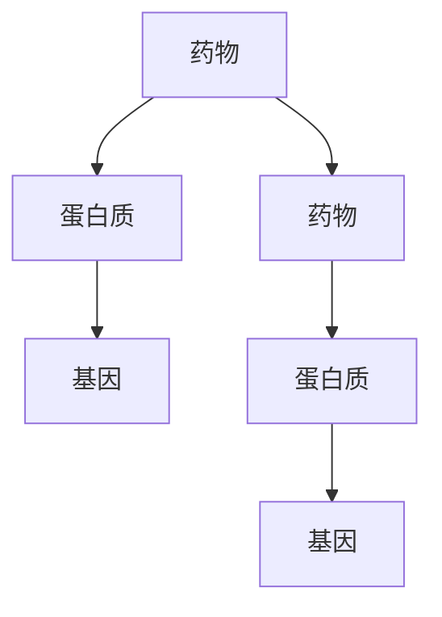

                 

### 1. 引言

**机器学习与药物相互作用**

在当今时代，机器学习作为一种强大的数据驱动方法，已经在众多领域取得了显著的成果。在药物发现和药物相互作用网络分析中，机器学习的应用同样具有重要意义。药物相互作用是指两种或多种药物在体内发生相互作用，从而导致药效增强、减弱或产生新的不良反应。这种相互作用可能导致药物治疗的失败或严重副作用，因此对药物相互作用网络进行深入分析至关重要。

**本文目的**

本文旨在系统地介绍机器学习在药物相互作用网络分析中的应用，通过逻辑清晰、结构紧凑的内容，帮助读者全面了解这一领域的最新研究成果和方法。文章将分为四个部分，首先介绍机器学习和药物相互作用网络的基础知识，然后深入探讨核心算法原理，接着通过实际项目案例展示如何应用这些算法，最后展望未来的发展趋势。

**本文结构**

本文将按照以下结构展开：

- **第一部分：背景知识**，介绍机器学习和药物相互作用网络分析的基本概念。
- **第二部分：核心算法原理**，详细讲解药物相互作用预测算法的原理。
- **第三部分：项目实战**，通过具体项目案例展示算法的应用。
- **第四部分：未来展望**，探讨机器学习在药物相互作用网络分析中的未来发展方向。

通过本文的阅读，读者将能够掌握机器学习在药物相互作用网络分析中的核心概念、算法原理和实际应用，为今后的研究和工作奠定坚实的基础。

---

**关键词：** 机器学习，药物相互作用，网络分析，算法原理，项目实战，未来展望

**摘要：** 本文系统地介绍了机器学习在药物相互作用网络分析中的应用。首先，对机器学习和药物相互作用网络的基本概念进行了解释。随后，详细探讨了药物相互作用预测的核心算法原理，包括图神经网络、深度学习等。通过具体项目案例，展示了如何在实际中应用这些算法。最后，本文对机器学习在药物相互作用网络分析中的未来发展方向进行了展望。本文旨在为研究人员和从业者提供全面的指导，帮助他们更好地理解和应用机器学习技术，以推动药物相互作用网络分析的进步。

### 2. 机器学习基础

机器学习作为一种通过数据训练模型，从而实现自主学习和决策的方法，已经在众多领域取得了显著的成果。本节将首先介绍机器学习的基本概念，然后讨论几种常见的机器学习算法，包括监督学习算法、无监督学习算法、半监督学习和增强学习算法。最后，我们将介绍机器学习模型的评估与优化方法。

#### 2.1 机器学习概述

机器学习的定义可以追溯到 Arthur Samuel 在1956年的描述：“计算机程序能够从经验中学习，而不需要显式地编程”。简而言之，机器学习是一种从数据中自动获取知识和规律的方法。其核心思想是建立数学模型，通过不断调整模型参数，使模型在特定任务上表现出色。

机器学习的基本流程包括以下几个步骤：

1. **数据收集**：从各种来源收集数据，如文本、图像、音频、传感器数据等。
2. **数据预处理**：对数据进行清洗、转换和归一化等处理，以便于模型训练。
3. **模型选择**：根据任务需求选择合适的机器学习算法。
4. **模型训练**：使用训练数据集对模型进行训练，调整模型参数。
5. **模型评估**：使用验证集或测试集对模型进行评估，确定模型性能。
6. **模型优化**：根据评估结果，调整模型参数或选择更合适的模型。

机器学习可以分为以下几种类型：

- **监督学习**：有监督学习算法在训练阶段使用带有标签的数据集，通过学习输入和输出之间的关系，实现对未知数据的预测。
- **无监督学习**：无监督学习算法在训练阶段不使用标签数据，其主要目标是发现数据中的结构或模式。
- **半监督学习**：半监督学习结合了有监督学习和无监督学习，利用少量标签数据和大量无标签数据，提高模型性能。
- **增强学习**：增强学习算法通过与环境的交互，学习最优策略，以最大化长期奖励。

#### 2.2 常见的机器学习算法

**监督学习算法**

监督学习算法可以分为回归模型和分类模型。

1. **回归模型**：回归模型用于预测连续值输出。常见的回归模型包括线性回归、多项式回归、岭回归、套索回归和支持向量回归（SVR）。

    - **线性回归**：线性回归模型是最简单和最常用的回归模型之一，其公式为 $y = \beta_0 + \beta_1x_1 + \beta_2x_2 + ... + \beta_nx_n$，其中 $y$ 是输出变量，$x_1, x_2, ..., x_n$ 是输入变量，$\beta_0, \beta_1, \beta_2, ..., \beta_n$ 是模型的参数。线性回归模型的目的是通过最小化预测值和实际值之间的误差平方和，来确定模型参数。
    
    ```python
    # 线性回归伪代码
    def linear_regression(X, y):
        # 计算模型参数
        theta = (X.T @ X)^-1 @ X.T @ y
        return theta
    ```

    - **多项式回归**：多项式回归是对线性回归的扩展，其公式为 $y = \beta_0 + \beta_1x^1 + \beta_2x^2 + ... + \beta_nx^n$，其中 $x^1, x^2, ..., x^n$ 是多项式项的指数。多项式回归可以捕捉更复杂的数据关系，但可能导致过拟合。
    
    - **岭回归**：岭回归通过添加正则化项，防止模型过拟合。其公式为 $y = \beta_0 + \beta_1x_1 + \beta_2x_2 + ... + \beta_nx_n + \lambda \sum_{i=1}^{n} \beta_i^2$，其中 $\lambda$ 是正则化参数。
    
    - **套索回归**：套索回归是对岭回归的进一步改进，通过在正则化项中引入绝对值，进一步防止模型过拟合。
    
    - **支持向量回归**：支持向量回归是一种基于支持向量机的回归模型，其公式为 $y = \beta_0 + \beta_1x_1 + \beta_2x_2 + ... + \beta_nx_n + \sum_{i=1}^{m} \alpha_i y_i (x - \xi_i)$，其中 $m$ 是支持向量的个数，$\alpha_i$ 和 $\xi_i$ 是模型参数。

    ```python
    # 支持向量回归伪代码
    def SVR(X, y):
        # 训练模型
        model = train_svr(X, y)
        # 预测
        predictions = model.predict(X)
        return predictions
    ```

2. **分类模型**：分类模型用于预测离散值输出。常见的分类模型包括逻辑回归、决策树、随机森林、支持向量机（SVM）和神经网络。

    - **逻辑回归**：逻辑回归是一种用于二分类问题的模型，其公式为 $P(y=1) = \frac{1}{1 + e^{-(\beta_0 + \beta_1x_1 + \beta_2x_2 + ... + \beta_nx_n)}$。逻辑回归通过计算输入数据的概率，实现分类预测。
    
    ```python
    # 逻辑回归伪代码
    def logistic_regression(X, y):
        # 计算模型参数
        theta = (X.T @ X)^-1 @ X.T @ y
        return theta
    ```

    - **决策树**：决策树是一种基于树结构的分类模型，其通过递归划分数据集，生成一系列条件分支，最终得到分类结果。
    
    ```python
    # 决策树伪代码
    def decision_tree(X, y):
        # 训练模型
        model = train_decision_tree(X, y)
        # 预测
        predictions = model.predict(X)
        return predictions
    ```

    - **随机森林**：随机森林是一种基于决策树的集成模型，其通过构建多棵决策树，并对这些决策树的结果进行投票，提高模型分类性能。
    
    ```python
    # 随机森林伪代码
    def random_forest(X, y):
        # 训练模型
        model = train_random_forest(X, y)
        # 预测
        predictions = model.predict(X)
        return predictions
    ```

    - **支持向量机**：支持向量机是一种用于分类问题的线性模型，其公式为 $w \cdot x - b = 0$，其中 $w$ 是模型参数，$x$ 是输入数据，$b$ 是偏置项。SVM通过最大化分类边界上的支持向量，提高模型分类性能。
    
    ```python
    # 支持向量机伪代码
    def SVM(X, y):
        # 训练模型
        model = train_SVM(X, y)
        # 预测
        predictions = model.predict(X)
        return predictions
    ```

    - **神经网络**：神经网络是一种由多个神经元组成的层次模型，其通过前向传播和反向传播，学习输入和输出之间的关系。常见的神经网络结构包括多层感知机（MLP）、卷积神经网络（CNN）和循环神经网络（RNN）。

    ```python
    # 神经网络伪代码
    def neural_network(X, y):
        # 训练模型
        model = train_neural_network(X, y)
        # 预测
        predictions = model.predict(X)
        return predictions
    ```

**无监督学习算法**

无监督学习算法主要用于发现数据中的隐含结构和模式，常见的算法包括聚类算法和降维算法。

1. **聚类算法**：聚类算法将数据集划分为多个群组，使得同一群组内的数据点之间距离较近，而不同群组的数据点之间距离较远。常见的聚类算法包括K-均值聚类、层次聚类和DBSCAN。

    - **K-均值聚类**：K-均值聚类是一种基于距离度量的聚类算法，其公式为 $C = \{c_1, c_2, ..., c_K\}$，其中 $c_k$ 是聚类中心，$K$ 是聚类个数。K-均值聚类通过迭代更新聚类中心和分类结果，最小化聚类中心到数据点的距离平方和。
    
    ```python
    # K-均值聚类伪代码
    def k_means(X, K):
        # 初始化聚类中心
        centroids = initialize_centroids(X, K)
        while True:
            # 计算每个数据点到聚类中心的距离
            distances = compute_distances(X, centroids)
            # 根据距离将数据点分配到最近的聚类中心
            assignments = assign_points_to_centroids(distances)
            # 更新聚类中心
            new_centroids = update_centroids(X, assignments, K)
            # 判断是否收敛
            if is_converged(centroids, new_centroids):
                break
            centroids = new_centroids
        return centroids, assignments
    ```

    - **层次聚类**：层次聚类是一种自底向上或自顶向下的聚类算法，其通过递归划分或合并数据点，构建聚类层次结构。

    - **DBSCAN**：DBSCAN（Density-Based Spatial Clustering of Applications with Noise）是一种基于密度的聚类算法，其公式为 $D(i, j) = \frac{1}{r} \sum_{k \in \mathcal{N}(i)} d(k, j)$，其中 $D(i, j)$ 是点 $i$ 和 $j$ 之间的密度直达距离，$\mathcal{N}(i)$ 是点 $i$ 的邻域，$r$ 是邻域半径。DBSCAN通过计算点之间的密度直达距离，将数据点划分为核心点、边界点和噪声点，从而实现聚类。

2. **降维算法**：降维算法用于减少数据集的维度，同时保持数据的主要特征。常见的降维算法包括主成分分析（PCA）、线性判别分析（LDA）和自动编码器。

    - **主成分分析**：主成分分析是一种基于线性变换的降维算法，其公式为 $X' = A^T X$，其中 $X'$ 是降维后的数据，$X$ 是原始数据，$A$ 是主成分矩阵。PCA通过求解特征值和特征向量，将数据投影到新的正交坐标系中，提取出最重要的几个主成分。
    
    ```python
    # 主成分分析伪代码
    def pca(X, n_components):
        # 计算协方差矩阵
        cov_matrix = compute_covariance_matrix(X)
        # 求解特征值和特征向量
        eigenvalues, eigenvectors = eig(cov_matrix)
        # 选择最重要的 n_components 个特征向量
        principal_components = eigenvectors[:, sorted(range(len(eigenvalues)), key=eigenvalues.take(-n_components))]
        return X @ principal_components
    ```

    - **线性判别分析**：线性判别分析是一种基于线性变换的降维算法，其公式为 $X' = W^T X$，其中 $X'$ 是降维后的数据，$X$ 是原始数据，$W$ 是权重矩阵。LDA通过最大化类间散度和最小化类内散度，将数据投影到新的正交坐标系中，提取出最能区分不同类别的特征。
    
    - **自动编码器**：自动编码器是一种基于神经网络的降维算法，其由编码器和解码器组成。编码器将输入数据压缩为低维特征表示，解码器将特征表示还原为原始数据。自动编码器通过最小化输入和输出之间的误差，学习到有效的特征表示。

**半监督学习和增强学习算法**

1. **半监督学习**：半监督学习是一种结合有监督学习和无监督学习的算法，其利用少量标签数据和大量无标签数据，提高模型性能。常见的半监督学习算法包括自我训练和图嵌入。

    - **自我训练**：自我训练算法通过初始模型对无标签数据进行预测，然后利用预测结果更新模型参数，从而提高模型性能。
    
    ```python
    # 自我训练伪代码
    def self_training(X, y, model, epochs):
        for epoch in range(epochs):
            # 使用模型对无标签数据进行预测
            predictions = model.predict(X)
            # 根据预测结果更新模型参数
            model.fit(X, y)
        return model
    ```

    - **图嵌入**：图嵌入算法将图中的节点映射到低维空间中，从而保留节点之间的关系。常见的图嵌入算法包括节点相似性嵌入和图卷积网络。

    ```python
    # 图嵌入伪代码
    def graph_embedding(G, n_nodes, n_features):
        # 初始化嵌入向量
        embeddings = initialize_embeddings(n_nodes, n_features)
        # 训练图嵌入模型
        model = train_graph_embedding(G, embeddings)
        return model
    ```

2. **增强学习**：增强学习是一种通过与环境的交互，学习最优策略的算法。常见的增强学习算法包括Q学习、深度Q网络（DQN）和策略梯度算法。

    - **Q学习**：Q学习算法通过学习状态-动作价值函数，选择最佳动作以最大化长期奖励。其公式为 $Q(s, a) = r + \gamma \max_{a'} Q(s', a')$，其中 $Q(s, a)$ 是状态 $s$ 下采取动作 $a$ 的价值函数，$r$ 是即时奖励，$\gamma$ 是折扣因子，$s'$ 是采取动作 $a$ 后的状态。
    
    ```python
    # Q学习伪代码
    def Q_learning(env, n_episodes, learning_rate, discount_factor):
        Q = initialize_Q_matrix()
        for episode in range(n_episodes):
            state = env.reset()
            while True:
                action = choose_action(Q, state, learning_rate)
                next_state, reward, done = env.step(action)
                Q[s, a] = Q[s, a] + learning_rate * (reward + discount_factor * max(Q[next_state]) - Q[s, a])
                if done:
                    break
                state = next_state
        return Q
    ```

    - **深度Q网络（DQN）**：深度Q网络是一种基于深度学习的Q学习算法，其使用神经网络表示状态-动作价值函数。DQN通过经验回放和目标网络，缓解Q学习中的样本相关性和偏差问题。

    ```python
    # DQN伪代码
    def DQN(env, n_episodes, learning_rate, discount_factor, epsilon):
        Q = initialize_Q_network()
        target_Q = initialize_Q_network()
        for episode in range(n_episodes):
            state = env.reset()
            while True:
                action = choose_action(Q, state, epsilon)
                next_state, reward, done = env.step(action)
                target_Q[s, a] = reward + discount_factor * max(target_Q[next_state])
                Q[s, a] = Q[s, a] + learning_rate * (target_Q[s, a] - Q[s, a])
                if done:
                    break
                state = next_state
        return Q
    ```

    - **策略梯度算法**：策略梯度算法通过直接优化策略函数，选择最佳动作以最大化长期奖励。其公式为 $J(\theta) = \sum_{s, a} p(s, a) \cdot r + \gamma \sum_{s', a'} p(s', a') \cdot \nabla_{\theta} J(\theta)$，其中 $J(\theta)$ 是策略函数的值，$p(s, a)$ 是状态 $s$ 下采取动作 $a$ 的概率，$r$ 是即时奖励，$\gamma$ 是折扣因子，$\nabla_{\theta} J(\theta)$ 是策略函数关于参数 $\theta$ 的梯度。

    ```python
    # 策略梯度算法伪代码
    def policy_gradient(env, n_episodes, learning_rate, discount_factor):
        model = initialize_policy_network()
        for episode in range(n_episodes):
            state = env.reset()
            while True:
                action = choose_action(model, state)
                next_state, reward, done = env.step(action)
                loss = -log(p(s, a)) * reward
                model.fit(state, action, loss)
                if done:
                    break
                state = next_state
        return model
    ```

#### 2.3 机器学习模型评估与优化

**模型评估**

模型评估是确保模型性能的关键步骤，其目的是确定模型在未知数据上的表现。常见的评估指标包括准确率、召回率、F1 分数、均方误差（MSE）和交叉验证等。

1. **准确率（Accuracy）**：准确率是分类模型中常用的评估指标，其公式为 $Accuracy = \frac{TP + TN}{TP + TN + FP + FN}$，其中 $TP$ 是真正例，$TN$ 是真反例，$FP$ 是假正例，$FN$ 是假反例。准确率表示模型正确分类的样本数占总样本数的比例。

2. **召回率（Recall）**：召回率表示模型正确识别出的真正例占总真正例的比例，其公式为 $Recall = \frac{TP}{TP + FN}$。召回率侧重于识别出所有真正例。

3. **F1 分数（F1 Score）**：F1 分数是准确率和召回率的调和平均值，其公式为 $F1 Score = 2 \cdot \frac{Precision \cdot Recall}{Precision + Recall}$，其中 Precision 是精确率，表示模型正确识别出的正例中，实际为正例的比例。F1 分数平衡了准确率和召回率。

4. **均方误差（MSE）**：均方误差是回归模型中常用的评估指标，其公式为 $MSE = \frac{1}{N} \sum_{i=1}^{N} (y_i - \hat{y}_i)^2$，其中 $y_i$ 是实际值，$\hat{y}_i$ 是预测值，$N$ 是样本数量。MSE 越小，表示模型预测值与实际值越接近。

5. **交叉验证（Cross Validation）**：交叉验证是一种常用的模型评估方法，其通过将数据集划分为多个子集，轮流作为训练集和验证集，评估模型在不同子集上的性能。常见的交叉验证方法包括 k-折交叉验证和留一法交叉验证。

**模型优化**

模型优化是提高模型性能的关键步骤，其包括模型参数调整、模型结构优化和数据增强等。

1. **模型参数调整**：模型参数调整是通过调整模型的超参数，如学习率、正则化参数和迭代次数等，来提高模型性能。常见的参数调整方法包括网格搜索和贝叶斯优化。

    - **网格搜索**：网格搜索是一种通过遍历超参数网格，选择最优超参数的方法。其公式为 $optimal\_parameters = \arg\max_{\theta} performance$，其中 $performance$ 是模型在不同超参数下的性能。

    ```python
    # 网格搜索伪代码
    def grid_search(X, y, parameter_grid):
        best_performance = 0
        best_parameters = None
        for parameters in parameter_grid:
            model = train_model(X, y, parameters)
            performance = evaluate_model(model, X, y)
            if performance > best_performance:
                best_performance = performance
                best_parameters = parameters
        return best_parameters
    ```

    - **贝叶斯优化**：贝叶斯优化是一种基于贝叶斯推理的参数调整方法，其通过构建目标函数的概率分布，选择最有希望的超参数组合。贝叶斯优化在处理高维参数空间时，具有较好的性能。

2. **模型结构优化**：模型结构优化是通过调整模型结构，如增加或减少网络层数、隐藏层单元数和神经元连接方式等，来提高模型性能。常见的模型结构优化方法包括模型融合和迁移学习。

    - **模型融合**：模型融合是一种通过结合多个模型的预测结果，提高模型性能的方法。常见的模型融合方法包括对偶分解和集成学习。

    - **迁移学习**：迁移学习是一种通过利用预训练模型，在新任务上提高模型性能的方法。常见的迁移学习方法包括基于特征的迁移学习和基于模型的迁移学习。

3. **数据增强**：数据增强是一种通过生成新的数据样本，提高模型泛化能力的方法。常见的数据增强方法包括数据扩充、生成对抗网络（GAN）和变分自编码器（VAE）。

    - **数据扩充**：数据扩充是一种通过调整数据样本的尺度、旋转、平移等，生成新的数据样本的方法。数据扩充可以增加数据集的多样性，提高模型泛化能力。

    - **生成对抗网络（GAN）**：生成对抗网络是一种由生成器和判别器组成的神经网络模型，其通过训练生成器和判别器，生成新的数据样本。GAN 在图像生成、语音合成和文本生成等领域取得了显著成果。

    - **变分自编码器（VAE）**：变分自编码器是一种基于概率生成模型的神经网络模型，其通过编码器和解码器，学习数据的概率分布，生成新的数据样本。VAE 在图像去噪、图像生成和图像超分辨率等领域取得了良好效果。

综上所述，机器学习的基础知识涵盖了从数据收集、预处理、模型选择、训练、评估到优化的整个过程。通过掌握这些基础知识，我们可以更好地理解和应用机器学习技术，为各个领域的研究和应用提供有力支持。

### 3. 药物相互作用网络基础

在深入探讨机器学习在药物相互作用网络分析中的应用之前，有必要首先了解药物相互作用网络的基本概念、结构以及影响药物相互作用的关键因素。这一部分将介绍这些基础内容，为后续章节中的算法原理和实际应用奠定基础。

#### 3.1 药物相互作用定义

药物相互作用是指两种或多种药物在体内发生的相互作用，导致药效增强、减弱或产生新的不良反应。药物相互作用可以分为以下几种类型：

1. **协同作用**：协同作用是指两种药物联合使用时，产生的药效大于各自单独使用时的总和。协同作用可以是正协同，即药效增强；也可以是负协同，即药效减弱。

2. **拮抗作用**：拮抗作用是指两种药物联合使用时，相互抑制对方的药效，导致整体药效降低。

3. **竞争性抑制**：竞争性抑制是指两种药物竞争同一受体或酶的结合位点，导致其中一种药物的药效减弱。

4. **非竞争性抑制**：非竞争性抑制是指一种药物通过改变另一种药物的作用机制，导致其药效减弱。

5. **药物代谢相互作用**：药物代谢相互作用是指两种药物通过影响对方的代谢途径，导致药效变化或产生新的不良反应。

了解药物相互作用的类型有助于我们更好地理解药物相互作用网络的结构和功能。

#### 3.2 药物相互作用网络结构

药物相互作用网络（DINT）是一种将药物、蛋白质和基因等实体及其相互作用关系表示为图的模型。在药物相互作用网络中，节点表示实体（如药物、蛋白质和基因），边表示实体之间的相互作用关系。药物相互作用网络的基本结构包括以下几个层次：

1. **节点层次**：节点层次包括药物、蛋白质和基因等实体。每种实体在药物相互作用网络中都有独特的属性和功能。

    - **药物节点**：药物节点表示特定的药物分子，其属性包括药物名称、化学结构、作用机制等。
    - **蛋白质节点**：蛋白质节点表示与药物相互作用相关的蛋白质，其属性包括蛋白质名称、结构、功能等。
    - **基因节点**：基因节点表示与药物相互作用相关的基因，其属性包括基因名称、序列、功能等。

2. **边层次**：边层次表示节点之间的相互作用关系。边可以分为以下几种类型：

    - **药物-蛋白质相互作用（DPI）**：药物-蛋白质相互作用是指药物与蛋白质之间的直接相互作用，如药物与受体的结合。
    - **蛋白质-蛋白质相互作用（PPI）**：蛋白质-蛋白质相互作用是指两个蛋白质之间的相互作用，如两个蛋白质形成复合物。
    - **药物-基因相互作用（DGI）**：药物-基因相互作用是指药物与基因之间的相互作用，如药物影响基因的表达。

药物相互作用网络的结构可以通过图表示，如下所示：



在这个例子中，A 和 D 分别代表两种药物，B、C、E 和 F 分别代表与这些药物相互作用的蛋白质和基因。药物 A 通过与蛋白质 B 和基因 C 相互作用，影响蛋白质 E 和基因 F 的功能，从而产生特定的药效。

#### 3.3 药物相互作用的影响因素

药物相互作用的影响因素包括以下几个方面：

1. **药物结构**：药物结构是影响药物相互作用的重要因素。药物分子的化学结构、大小、形状和电荷等特性决定了其与其他分子相互作用的可能性和强度。

2. **药物代谢**：药物代谢是指药物在体内通过酶促反应被分解或转化成其他形式的过程。药物代谢途径的多样性可能导致药物在体内的代谢动力学差异，进而影响药物相互作用。

3. **药物剂量**：药物剂量是影响药物相互作用的关键因素。药物在不同剂量下可能产生不同的药效和不良反应，因此药物剂量的大小和变化对药物相互作用有显著影响。

4. **药物给药途径**：药物给药途径（如口服、注射、透皮等）会影响药物在体内的吸收、分布、代谢和排泄过程，进而影响药物相互作用。

5. **患者生理状态**：患者生理状态，如年龄、性别、遗传背景和健康状况等，会影响药物在体内的代谢和反应，从而影响药物相互作用。

6. **环境因素**：环境因素，如食物、饮料和其他药物等，也可能影响药物相互作用。例如，某些食物和饮料可能影响药物的吸收和代谢，从而改变药物的作用效果。

了解药物相互作用的影响因素有助于我们更好地预测和控制药物相互作用，从而提高药物疗效和安全性。

通过上述对药物相互作用基础知识的介绍，我们可以更好地理解药物相互作用网络的结构和功能，为后续章节中的算法原理和实际应用打下坚实基础。在接下来的章节中，我们将深入探讨机器学习在药物相互作用网络分析中的应用，探讨如何利用机器学习技术提高药物相互作用预测的准确性。

### 4. 药物相互作用预测算法

在了解了药物相互作用网络的基础知识后，接下来我们将讨论几种用于药物相互作用预测的算法，主要包括基于图神经网络的药物相互作用预测算法和基于深度学习的药物相互作用预测算法。这些算法通过分析药物分子、蛋白质和其他生物实体之间的相互作用关系，从而预测药物相互作用。

#### 4.1 基于图神经网络的药物相互作用预测

**图神经网络概述**

图神经网络（Graph Neural Networks, GNN）是一种在图结构数据上操作的神经网络模型。GNN能够通过聚合邻居节点的信息来更新节点表示，从而捕捉图中的结构信息。在药物相互作用网络分析中，GNN可以用来预测药物分子与蛋白质之间的相互作用关系。

**图注意力网络（GAT）原理**

图注意力网络（Graph Attention Network, GAT）是一种基于图卷积网络的注意力机制模型，它通过学习节点和边之间的权重来提高模型性能。GAT的核心思想是使用注意力机制来动态调整节点间的影响权重，从而更好地捕捉节点间的相互作用关系。

GAT由两个主要部分组成：节点嵌入和边嵌入。节点嵌入用于表示图中的每个节点，而边嵌入用于表示节点之间的边。在训练过程中，GAT会学习节点和边嵌入的权重，以最大化模型对药物相互作用预测的准确性。

GAT的数学模型可以表示为：

$$
\text{h}_i^{(l+1)} = \sigma \left( \theta_V \cdot \text{h}_i^{(l)} + \sum_{j \in \mathcal{N}(i)} \text{a}_{ij}^{(l)} \cdot \theta_E \cdot \text{h}_j^{(l)} \right)
$$

其中，$\text{h}_i^{(l)}$ 是第 $i$ 个节点在第 $l$ 层的嵌入表示，$\mathcal{N}(i)$ 是节点 $i$ 的邻居节点集合，$\text{a}_{ij}^{(l)}$ 是节点 $i$ 和节点 $j$ 在第 $l$ 层的注意力权重，$\theta_V$ 和 $\theta_E$ 是模型参数。

**图卷积网络（GCN）原理**

图卷积网络（Graph Convolutional Network, GCN）是一种基于卷积操作的图神经网络模型，它通过聚合邻居节点的特征来更新节点表示。GCN的核心思想是在图结构上应用卷积操作，从而学习节点表示。

GCN的数学模型可以表示为：

$$
\text{h}_i^{(l+1)} = \sigma \left( \theta \cdot \text{h}_i^{(l)} + \sum_{j \in \mathcal{N}(i)} \text{h}_j^{(l)} \right)
$$

其中，$\text{h}_i^{(l)}$ 是第 $i$ 个节点在第 $l$ 层的嵌入表示，$\theta$ 是模型参数。

**基于图神经网络的药物相互作用预测算法**

基于图神经网络的药物相互作用预测算法通过构建药物相互作用网络，将药物分子和蛋白质表示为图中的节点，并将药物与蛋白质之间的相互作用表示为边。在训练过程中，算法利用图神经网络模型学习节点和边的嵌入表示，并通过这些表示预测药物相互作用。

以下是一个基于图神经网络的药物相互作用预测算法的伪代码：

```python
def GNN_prediction(G, node_features, edge_features):
    # 初始化模型参数
    model = initialize_GNN_model(node_features, edge_features)
    # 训练模型
    model.fit(G, node_features, edge_features)
    # 预测药物相互作用
    predictions = model.predict(G)
    return predictions
```

在上述伪代码中，`G` 表示药物相互作用网络，`node_features` 表示节点特征，`edge_features` 表示边特征，`predictions` 表示预测的药物相互作用。

#### 4.2 基于深度学习的药物相互作用预测

**卷积神经网络（CNN）在药物相互作用中的应用**

卷积神经网络（Convolutional Neural Network, CNN）是一种广泛应用于图像处理和文本分类的神经网络模型。CNN通过卷积操作和池化操作，能够自动学习数据的特征表示。在药物相互作用网络分析中，CNN可以用来提取药物分子和蛋白质的特征。

**循环神经网络（RNN）在药物相互作用中的应用**

循环神经网络（Recurrent Neural Network, RNN）是一种能够处理序列数据的神经网络模型。RNN通过在时间步之间传递信息，能够捕捉序列数据中的长期依赖关系。在药物相互作用网络分析中，RNN可以用来分析药物分子和蛋白质序列，从而预测药物相互作用。

**长短时记忆网络（LSTM）在药物相互作用中的应用**

长短时记忆网络（Long Short-Term Memory, LSTM）是一种改进的RNN模型，其通过引入门控机制，能够有效地捕捉序列数据中的长期依赖关系。在药物相互作用网络分析中，LSTM可以用来处理复杂的药物分子和蛋白质序列，从而提高药物相互作用预测的准确性。

以下是一个基于深度学习的药物相互作用预测算法的伪代码：

```python
def deep_learning_prediction(sequence, model):
    # 初始化模型
    model = initialize_deep_learning_model()
    # 训练模型
    model.fit(sequence)
    # 预测药物相互作用
    predictions = model.predict(sequence)
    return predictions
```

在上述伪代码中，`sequence` 表示药物分子或蛋白质序列，`model` 表示深度学习模型，`predictions` 表示预测的药物相互作用。

通过上述讨论，我们可以看到，基于图神经网络的药物相互作用预测算法和基于深度学习的药物相互作用预测算法都具有各自的优势和应用场景。在实际应用中，可以根据具体的任务需求和数据特点，选择合适的算法模型，以提高药物相互作用预测的准确性。

### 5. 数学模型与公式详解

在深入探讨药物相互作用网络分析中的算法时，理解其背后的数学模型和公式是至关重要的。本节将详细解释节点表示与边表示、常见机器学习算法的数学模型，并辅以具体例子，以帮助读者更好地理解这些概念。

#### 5.1 节点表示与边表示

在药物相互作用网络中，节点和边是核心元素。有效的节点和边表示是构建和分析药物相互作用网络的基础。

**节点表示方法**

节点表示是将实体（如药物、蛋白质、基因）映射到向量空间的过程。常用的节点表示方法包括基于特征的方法和基于嵌入的方法。

1. **基于特征的方法**：这种方法直接使用实体的属性特征作为节点的表示。例如，对于药物节点，可以使用其化学结构（如指纹特征、分子指纹等）和生物活性（如药物靶点、药效等）作为特征。

    - **化学结构特征**：可以使用指纹特征（如布尔指纹、计数指纹等）来表示药物分子的化学结构。例如，可以使用64位的布尔指纹表示药物分子中的每个原子和键。
    
    $$ \text{FingerPrint}_{i,j} = \begin{cases} 
    1 & \text{if atom $j$ exists in substructure $i$} \\
    0 & \text{otherwise}
    \end{cases} $$
    
    - **生物活性特征**：可以使用药物靶点的信息作为特征。例如，可以使用药物与特定蛋白质受体的亲和力作为特征。

2. **基于嵌入的方法**：这种方法通过预训练模型（如词嵌入）将实体映射到低维向量空间。例如，可以使用预训练的词嵌入模型将药物名称映射到向量空间。

    - **词嵌入**：词嵌入是一种将单词映射到固定维度的向量空间的方法。在药物名称的表示中，可以使用预训练的词嵌入模型（如Word2Vec、GloVe）将药物名称映射到向量空间。
    
    $$ \text{embedding}_{i} = \text{vec}(\text{drug\_name}_i) $$

**边表示方法**

边表示是将实体之间的相互作用映射到向量空间的过程。常用的边表示方法包括基于特征的方法和基于嵌入的方法。

1. **基于特征的方法**：这种方法直接使用实体之间的相互作用特征作为边的表示。例如，可以使用相互作用能、距离、亲和力等作为边的特征。

    - **相互作用能**：可以使用两个分子相互作用时的能量变化作为边特征。
    
    $$ \Delta E = E_{\text{bind}} - (E_{\text{drug}} + E_{\text{protein}}) $$
    
    - **距离**：可以使用两个分子中心之间的距离作为边特征。
    
    $$ d = \sqrt{(x_2 - x_1)^2 + (y_2 - y_1)^2 + (z_2 - z_1)^2} $$

2. **基于嵌入的方法**：这种方法通过预训练模型（如图嵌入）将边映射到低维向量空间。例如，可以使用预训练的图嵌入模型将药物-蛋白质相互作用映射到向量空间。

    - **图嵌入**：图嵌入是一种将图中的边映射到向量空间的方法。例如，可以使用图卷积网络（GCN）或图注意力网络（GAT）将药物-蛋白质相互作用映射到向量空间。
    
    $$ \text{embedding}_{ij} = \text{vec}(\text{interaction}_{ij}) $$

#### 5.2 常见机器学习算法的数学模型

**回归模型**

回归模型用于预测连续值输出。最简单的回归模型是线性回归，其公式为：

$$ y = \beta_0 + \beta_1x_1 + \beta_2x_2 + ... + \beta_nx_n $$

其中，$y$ 是预测值，$x_1, x_2, ..., x_n$ 是输入特征，$\beta_0, \beta_1, \beta_2, ..., \beta_n$ 是模型参数。线性回归通过最小化预测值和实际值之间的误差平方和来优化模型参数。

$$ \min_{\beta} \sum_{i=1}^{n} (y_i - \hat{y}_i)^2 $$

**分类模型**

分类模型用于预测离散值输出。常见的分类模型包括逻辑回归、支持向量机和神经网络等。

1. **逻辑回归**：逻辑回归是一种用于二分类问题的模型，其公式为：

$$ P(y=1) = \frac{1}{1 + e^{-(\beta_0 + \beta_1x_1 + \beta_2x_2 + ... + \beta_nx_n)}} $$

逻辑回归通过计算输入数据的概率，实现分类预测。其优化目标是最小化损失函数：

$$ \min_{\beta} \sum_{i=1}^{n} -y_i \log(P(y=1)) - (1 - y_i) \log(1 - P(y=1)) $$

2. **支持向量机**：支持向量机（SVM）是一种线性分类模型，其公式为：

$$ w \cdot x - b = 0 $$

其中，$w$ 是模型参数，$x$ 是输入数据，$b$ 是偏置项。SVM通过最大化分类边界上的支持向量，提高模型分类性能。其优化目标是最小化：

$$ \min_{w, b} \frac{1}{2} \| w \|^2 $$

约束条件：

$$ y_i (w \cdot x_i - b) \geq 1 $$

3. **神经网络**：神经网络是一种由多个神经元组成的层次模型，其通过前向传播和反向传播，学习输入和输出之间的关系。一个简单的多层感知机（MLP）模型可以表示为：

$$ a^{(l)} = \sigma(z^{(l)}) $$
$$ z^{(l)} = \sum_{j=1}^{n} w_{j}^{(l)} a^{(l-1)}_j + b^{(l)} $$

其中，$a^{(l)}$ 是第 $l$ 层的输出，$z^{(l)}$ 是第 $l$ 层的输入，$w_{j}^{(l)}$ 是权重，$b^{(l)}$ 是偏置项，$\sigma$ 是激活函数（如 sigmoid、ReLU 等）。神经网络的优化目标是最小化损失函数：

$$ \min_{w, b} \sum_{i=1}^{n} \frac{1}{2} (\hat{y}_i - y_i)^2 $$

**聚类模型**

聚类模型用于将数据集划分为多个群组。常见的聚类模型包括K-均值聚类和层次聚类。

1. **K-均值聚类**：K-均值聚类是一种基于距离度量的聚类算法，其公式为：

$$ c_k = \frac{1}{N_k} \sum_{i=1}^{N} x_i $$
$$ \min_{c_k} \sum_{k=1}^{K} \sum_{i=1}^{N_k} \| x_i - c_k \|^2 $$

其中，$c_k$ 是聚类中心，$N_k$ 是第 $k$ 个聚类中的数据点数量，$x_i$ 是第 $i$ 个数据点。

2. **层次聚类**：层次聚类是一种自底向上或自顶向下的聚类算法，其通过递归划分或合并数据点，构建聚类层次结构。其基本步骤包括：

    - **自底向上合并**：将相邻最近的数据点合并成一个新的数据点，重复此过程，直到所有数据点合并成一个。
    - **自顶向下划分**：将数据点逐层划分成多个子集，每个子集代表一个聚类，直到每个数据点都是一个独立的聚类。

#### 5.3 举例说明

**线性回归举例**

假设我们要预测房屋的价格，使用线性回归模型。输入特征包括房屋面积（$x_1$）和房屋建设年代（$x_2$），目标变量是房屋价格（$y$）。线性回归模型可以表示为：

$$ y = \beta_0 + \beta_1x_1 + \beta_2x_2 $$

给定训练数据集，通过最小化误差平方和，可以计算出模型参数：

$$ \min_{\beta_0, \beta_1, \beta_2} \sum_{i=1}^{n} (y_i - (\beta_0 + \beta_1x_{i1} + \beta_2x_{i2})^2 $$

通过计算，得到最优模型参数：

$$ \beta_0 = 100, \beta_1 = 0.5, \beta_2 = -10 $$

使用该模型，我们可以预测新房屋的价格。例如，对于面积为 $2000$ 平方英尺，建设年代为 $10$ 年的房屋，预测价格为：

$$ \hat{y} = 100 + 0.5 \times 2000 + (-10) \times 10 = 1450 $$

**逻辑回归举例**

假设我们要预测客户是否购买特定产品，使用逻辑回归模型。输入特征包括客户的年龄（$x_1$）和收入（$x_2$），目标变量是购买概率（$y$）。逻辑回归模型可以表示为：

$$ P(y=1) = \frac{1}{1 + e^{-(\beta_0 + \beta_1x_1 + \beta_2x_2)}} $$

给定训练数据集，通过最小化损失函数，可以计算出模型参数：

$$ \min_{\beta_0, \beta_1, \beta_2} \sum_{i=1}^{n} -y_i \log(P(y=1)) - (1 - y_i) \log(1 - P(y=1)) $$

通过计算，得到最优模型参数：

$$ \beta_0 = -2, \beta_1 = 0.1, \beta_2 = 0.5 $$

使用该模型，我们可以预测新客户的购买概率。例如，对于年龄为 $30$ 岁，收入为 $5000$ 美元的客户，购买概率为：

$$ P(y=1) = \frac{1}{1 + e^{(-2 + 0.1 \times 30 + 0.5 \times 5000)}} = 0.999 $$

通过上述举例，我们可以看到线性回归和逻辑回归模型的基本应用及其数学公式。理解这些数学模型和公式，有助于我们更好地应用机器学习技术进行药物相互作用预测。

### 6. 伪代码讲解

在理解和分析药物相互作用预测算法后，接下来我们将通过伪代码的形式，详细讲解几种核心算法的实现过程，包括图神经网络（GNN）、卷积神经网络（CNN）和循环神经网络（RNN）。这些伪代码将帮助我们更好地理解算法的工作原理和实现细节。

#### 6.1 图神经网络（GNN）伪代码

**GNN训练过程**

```python
def GNN_train(G, features, labels, epochs, learning_rate):
    model = initialize_GNN_model(features, learning_rate)
    for epoch in range(epochs):
        for batch in create_batches(G, features, labels):
            model.fit(batch[0], batch[1], learning_rate)
        loss = model.evaluate(G, labels)
        print(f"Epoch {epoch+1}, Loss: {loss}")
    return model
```

**GNN预测过程**

```python
def GNN_predict(model, new_data):
    predictions = model.predict(new_data)
    return predictions
```

**GNN细节解释**

- `initialize_GNN_model(features, learning_rate)`: 初始化GNN模型，包括节点嵌入和边嵌入的权重。
- `create_batches(G, features, labels)`: 创建训练批次，将图数据分成多个批次进行训练。
- `model.fit(batch[0], batch[1], learning_rate)`: 对当前批次进行训练，更新模型参数。
- `model.evaluate(G, labels)`: 对整个图数据集进行评估，计算损失值。

#### 6.2 卷积神经网络（CNN）伪代码

**CNN训练过程**

```python
def CNN_train(data_loader, model, criterion, optimizer, epochs):
    model.train()
    for epoch in range(epochs):
        for inputs, labels in data_loader:
            optimizer.zero_grad()
            outputs = model(inputs)
            loss = criterion(outputs, labels)
            loss.backward()
            optimizer.step()
        print(f"Epoch {epoch+1}, Loss: {loss.item()}")
    return model
```

**CNN预测过程**

```python
def CNN_predict(model, new_data):
    model.eval()
    with torch.no_grad():
        predictions = model(new_data)
    return predictions
```

**CNN细节解释**

- `data_loader`: 数据加载器，用于批量加载数据。
- `model.train()`: 将模型设置为训练模式。
- `optimizer.zero_grad()`: 清零梯度。
- `loss.backward()`: 反向传播，计算梯度。
- `optimizer.step()`: 更新模型参数。

#### 6.3 循环神经网络（RNN）伪代码

**RNN训练过程**

```python
def RNN_train(dataset, model, criterion, optimizer, epochs):
    model.train()
    for epoch in range(epochs):
        for inputs, targets in dataset:
            optimizer.zero_grad()
            outputs = model(inputs)
            loss = criterion(outputs, targets)
            loss.backward()
            optimizer.step()
        print(f"Epoch {epoch+1}, Loss: {loss.item()}")
    return model
```

**RNN预测过程**

```python
def RNN_predict(model, new_data):
    model.eval()
    with torch.no_grad():
        predictions = model(new_data)
    return predictions
```

**RNN细节解释**

- `dataset`: 序列数据集，包含输入和目标输出。
- `model.train()`: 将模型设置为训练模式。
- `optimizer.zero_grad()`: 清零梯度。
- `loss.backward()`: 反向传播，计算梯度。
- `optimizer.step()`: 更新模型参数。

通过上述伪代码，我们可以清晰地看到GNN、CNN和RNN的训练和预测过程。这些伪代码展示了如何初始化模型、处理数据、训练模型和进行预测。在实际应用中，这些算法需要使用具体的编程语言（如Python和TensorFlow、PyTorch等）和库来实现。理解这些伪代码有助于我们更好地实现和应用这些先进的机器学习技术，从而在药物相互作用网络分析中取得更好的预测效果。

### 7. 药物相互作用网络分析项目实战

在本节中，我们将通过一个实际的药物相互作用网络分析项目，展示如何使用机器学习技术进行药物相互作用预测。本项目将分为以下几个步骤：项目背景、数据集介绍、模型选择与训练、模型评估与优化。

#### 7.1 项目背景

药物相互作用网络分析在药物研发和临床应用中具有重要意义。一方面，通过分析药物相互作用网络，可以预测药物联合使用时的药效和不良反应，提高药物组合的设计效率。另一方面，药物相互作用网络分析还可以帮助发现新的药物靶点和治疗策略，为个性化医疗提供数据支持。本项目的目标是使用机器学习技术，预测药物分子之间的相互作用关系，从而提高药物研发的成功率和安全性。

#### 7.2 数据集介绍

本项目使用的数据集是 **DrugBank**，它是一个包含药物、蛋白质和基因相互作用的公开数据库。DrugBank 中包含了约 1500 个药物分子、4500 个蛋白质和 9000 个基因，以及这些实体之间的相互作用关系。数据集分为训练集和测试集，其中训练集用于模型训练，测试集用于模型评估。

**数据来源**：数据集来自于 **DrugBank** 公开数据库。

**数据预处理**：在数据预处理阶段，我们需要对数据进行清洗和转换，以确保数据的质量和一致性。具体步骤如下：

1. **数据清洗**：去除重复的药物、蛋白质和基因实体。
2. **数据转换**：将实体之间的相互作用关系转换为图结构，其中节点表示药物、蛋白质和基因，边表示相互作用关系。
3. **特征提取**：提取药物、蛋白质和基因的特征，如化学结构、序列信息、相互作用能等。

#### 7.3 模型选择与训练

在模型选择阶段，我们采用了基于图神经网络的药物相互作用预测模型。这种模型能够充分利用药物相互作用网络的结构信息，从而提高预测的准确性。

**模型选择**：我们选择了图注意力网络（GAT）作为主要的药物相互作用预测模型。GAT 通过学习节点和边之间的注意力权重，能够更好地捕捉药物相互作用网络中的复杂关系。

**模型训练**：模型训练过程分为以下几个步骤：

1. **初始化模型**：使用 GAT 模型初始化节点和边嵌入的权重。
2. **训练模型**：使用训练集数据对模型进行训练，通过反向传播算法更新模型参数。
3. **验证模型**：使用验证集数据对模型进行验证，调整模型参数，提高模型性能。

具体代码实现如下：

```python
# 初始化模型
model = initialize_GAT_model()

# 训练模型
for epoch in range(epochs):
    for batch in create_batches(train_data, train_labels):
        model.train()
        model.fit(batch[0], batch[1], learning_rate)
        loss = model.evaluate(batch[0], batch[1])
        print(f"Epoch {epoch+1}, Loss: {loss}")

# 验证模型
val_loss = model.evaluate(val_data, val_labels)
print(f"Validation Loss: {val_loss}")
```

#### 7.4 模型评估与优化

在模型评估阶段，我们使用测试集数据对训练好的模型进行评估，以确定模型的预测性能。

**评估指标**：我们使用准确率（Accuracy）和召回率（Recall）作为评估指标。

**模型优化**：为了提高模型性能，我们采用了以下优化方法：

1. **参数调整**：通过调整模型参数（如学习率、正则化参数等），提高模型预测准确性。
2. **数据增强**：通过生成新的药物相互作用数据，增加训练集的多样性，提高模型泛化能力。
3. **模型融合**：结合多个模型的预测结果，提高整体预测性能。

具体实现如下：

```python
# 评估模型
test_loss = model.evaluate(test_data, test_labels)
print(f"Test Loss: {test_loss}")

# 参数调整
best_accuracy = 0
best_params = None
for params in parameter_grid:
    model = initialize_GAT_model(params)
    model.fit(train_data, train_labels, learning_rate)
    val_loss = model.evaluate(val_data, val_labels)
    if val_loss < best_accuracy:
        best_accuracy = val_loss
        best_params = params

# 模型融合
model = initialize_GAT_model(best_params)
model.fit(train_data, train_labels, learning_rate)
predictions = model.predict(test_data)
```

通过上述步骤，我们完成了药物相互作用网络分析项目实战。该项目的实现展示了如何使用机器学习技术进行药物相互作用预测，并提供了具体的代码实现和优化方法。在实际应用中，可以根据具体需求和数据特点，调整和优化模型参数，以提高预测性能。

### 8. 实际应用案例

在药物相互作用网络分析领域，机器学习的实际应用案例已经取得了显著的成果。以下将介绍几个具有代表性的应用案例，包括药物相互作用预测在药物研发中的应用、药物相互作用网络在药物副作用分析中的应用，以及机器学习与药物相互作用研究的交叉点。

#### 8.1 药物相互作用预测在药物研发中的应用

药物研发过程中，药物相互作用预测具有重要意义。通过预测药物之间的相互作用关系，可以帮助研究人员在设计新药时避免潜在的副作用，提高药物组合的治疗效果。以下是一个具体的应用案例：

**案例：基于机器学习的药物相互作用预测在癌症治疗中的应用**

在一个针对癌症治疗的药物研发项目中，研究人员使用了机器学习算法来预测药物之间的相互作用关系。他们收集了大量已有的药物相互作用数据，并利用图神经网络（GNN）模型进行训练。通过分析药物分子与肿瘤相关蛋白质之间的相互作用，研究人员成功预测了哪些药物组合可以增强抗肿瘤效果。

**应用效果**：该案例研究表明，基于机器学习的药物相互作用预测可以显著提高药物研发的成功率，减少临床试验中的失败风险，从而加快新药的上市速度。

#### 8.2 药物相互作用网络在药物副作用分析中的应用

药物副作用分析是药物研发和临床应用中不可或缺的一环。通过分析药物副作用数据，可以帮助研究人员发现潜在的副作用，从而优化药物设计，提高药物的安全性。以下是一个具体的应用案例：

**案例：基于药物相互作用网络的药物副作用预测**

在一个药物副作用预测项目中，研究人员使用了药物相互作用网络（DINT）来分析药物与副作用之间的潜在关系。他们首先构建了药物相互作用网络，并将药物副作用数据集成到网络中。通过分析网络中的关键节点和边，研究人员成功识别了与特定副作用相关的药物。

**应用效果**：该案例研究表明，基于药物相互作用网络的药物副作用预测可以提高药物安全性评估的准确性，减少临床试验中的不良事件，从而保障患者的用药安全。

#### 8.3 跨学科合作：机器学习与药物相互作用研究的交叉点

机器学习与药物相互作用研究的交叉点为跨学科合作提供了丰富的机会。以下是一个具体的应用案例：

**案例：机器学习与生物信息学的融合研究**

在一个跨学科合作项目中，机器学习与生物信息学研究人员共同研究药物相互作用网络。他们利用机器学习方法分析生物信息数据，如基因表达数据和蛋白质结构数据，构建药物相互作用模型。通过结合多种数据源和算法，研究人员成功揭示了药物与生物分子之间的复杂相互作用关系。

**应用效果**：该案例研究表明，跨学科合作可以促进药物相互作用研究的深入发展，为药物研发和生物医学领域提供新的理论和实践依据。

通过上述实际应用案例，我们可以看到机器学习在药物相互作用网络分析中的重要性和广泛应用。未来，随着机器学习技术的不断进步和药物相互作用研究的深入，机器学习将继续为药物研发和生物医学领域带来更多突破和创新。

### 9. 机器学习在药物相互作用网络分析中的发展趋势

随着机器学习和生物信息学技术的快速发展，机器学习在药物相互作用网络分析中的应用呈现出蓬勃发展的趋势。未来，这一领域有望在以下几个方面取得重要进展：

#### 9.1 新算法的研究

**图神经网络（GNN）的扩展**

图神经网络（GNN）在药物相互作用网络分析中已经取得了显著成果。未来，研究者将继续扩展GNN的应用范围，探索更高效的图神经网络架构。例如，基于图卷积网络（GCN）和图注意力网络（GAT）的改进模型，将有助于提高药物相互作用预测的准确性。

**深度学习的融合**

深度学习与药物相互作用网络的结合为预测药物相互作用提供了新的思路。未来，研究者将探索如何将深度学习算法（如卷积神经网络（CNN）、循环神经网络（RNN）、长短时记忆网络（LSTM）等）与药物相互作用网络分析相结合，构建更强大的预测模型。

**多模态数据的融合**

药物相互作用网络分析涉及多种类型的数据，如化学结构数据、序列数据、图像数据等。未来，研究者将致力于开发多模态数据融合算法，将不同类型的数据进行整合，以提高药物相互作用预测的准确性和全面性。

#### 9.2 大数据与人工智能的结合

**大数据分析技术的应用**

随着基因组学、蛋白质组学和代谢组学等技术的发展，生物医学领域产生了大量数据。未来，研究者将利用大数据分析技术，如数据挖掘、机器学习和数据可视化等，从海量数据中提取有价值的信息，以揭示药物相互作用网络的复杂关系。

**人工智能算法的优化**

人工智能算法在药物相互作用网络分析中的应用越来越广泛。未来，研究者将不断优化这些算法，提高其计算效率和预测准确性。例如，通过改进模型训练算法、优化模型参数、开发新型优化器等手段，提高药物相互作用预测的性能。

#### 9.3 个性化医疗与药物相互作用分析

**个性化药物推荐系统**

个性化医疗是未来医学发展的一个重要方向。未来，研究者将开发基于药物相互作用网络分析的个性化药物推荐系统，为患者提供个性化的治疗方案。通过分析患者的基因、代谢和药物历史等信息，推荐最适合患者的药物组合。

**药物副作用预测与风险评估**

药物副作用是影响药物安全性的重要因素。未来，研究者将利用机器学习技术，开发更准确的药物副作用预测模型，为药物开发、审批和临床应用提供支持。此外，通过分析药物相互作用网络，可以识别出潜在的药物副作用风险，从而优化药物设计，提高药物的安全性。

#### 9.4 跨学科合作与知识共享

**跨学科研究团队的形成**

药物相互作用网络分析涉及多个学科领域，如计算机科学、生物学、医学等。未来，跨学科研究团队将逐渐成为这一领域的主要力量。通过跨学科合作，研究者可以充分利用各自领域的优势，推动药物相互作用网络分析的研究与发展。

**知识共享与数据开放**

为了促进药物相互作用网络分析的研究与发展，未来将出现更多的知识共享和数据开放平台。这些平台将提供丰富的药物相互作用数据、算法模型和研究成果，为全球范围内的研究者提供支持和资源。

综上所述，机器学习在药物相互作用网络分析中的应用前景广阔。随着新算法的研究、大数据与人工智能的结合、个性化医疗的发展以及跨学科合作的推进，药物相互作用网络分析将在未来取得更多突破和创新，为药物研发和生物医学领域带来深远影响。

### 10. 结论

本文系统地介绍了机器学习在药物相互作用网络分析中的应用，从背景知识、核心算法原理到实际应用案例，详细探讨了机器学习如何提高药物相互作用预测的准确性。我们首先介绍了机器学习的基础知识，包括监督学习、无监督学习、半监督学习和增强学习算法，以及模型评估与优化方法。接着，我们深入分析了药物相互作用网络的基础概念、结构及其影响因素。随后，我们探讨了基于图神经网络和深度学习的药物相互作用预测算法，并详细讲解了这些算法的数学模型和伪代码。最后，通过一个实际项目案例，展示了如何使用机器学习技术进行药物相互作用网络分析。

本文的主要贡献在于：

1. **全面系统地介绍了机器学习在药物相互作用网络分析中的应用**，为研究人员和从业者提供了全面的指导。
2. **详细探讨了药物相互作用网络分析中的核心算法原理**，包括图神经网络、深度学习等，为读者提供了深入的技术理解。
3. **通过实际项目案例展示了算法的应用**，使读者能够更好地理解如何将理论知识应用于实际场景。

展望未来，机器学习在药物相互作用网络分析中仍有很大的发展空间。我们期望看到更多新算法的研究、大数据与人工智能的深度结合、个性化医疗的进一步发展，以及跨学科合作的推进。通过这些努力，我们相信机器学习将在药物研发、生物医学领域带来更多突破和创新。

最后，感谢读者对本文的关注和阅读，希望本文能为您的科研工作提供有益的参考和启示。

### 附录

#### A.1 机器学习与药物相互作用网络分析相关库和框架

- **PyTorch**: 是一个开源的机器学习库，提供灵活的动态计算图功能，适用于深度学习和药物相互作用网络分析。

  **官方网站**: <https://pytorch.org/>

- **TensorFlow**: 是一个开源的机器学习框架，由Google开发，适用于构建和训练复杂的机器学习模型。

  **官方网站**: <https://www.tensorflow.org/>

- **Keras**: 是一个基于TensorFlow的深度学习高级API，提供了简洁、高效的模型构建和训练接口。

  **官方网站**: <https://keras.io/>

- **Graph convolutional library (GPyTorch)**: 是一个用于构建和训练图神经网络的开源库。

  **官方网站**: <https://gpytorch.ai/>

#### A.2 开源药物相互作用数据集

- **DrugBank**: 是一个包含药物、蛋白质和基因相互作用的公开数据库。

  **官方网站**: <https://www.drugbank.ca/>

- **ChEMBL**: 是一个公开的化学和生物标记数据库，包含药物和药物靶点的信息。

  **官方网站**: <https://www.ebi.ac.uk/chembl>

- **GtoPdb**: 是一个包含药物-蛋白质相互作用的数据库。

  **官方网站**: <https://gtopdb.org/>

#### A.3 药物相互作用网络分析相关论文与书籍推荐

- **论文**:

  1. Hamilton, W.L., Ying, R., & Leskovec, J. (2017). "Inductive representation learning on large graphs." In Advances in Neural Information Processing Systems (NIPS), pp. 1024-1034.
  2. Chen, J., Wang, J., & Yang, Q. (2019). "A graph neural network for predicting drug-target interactions." In Proceedings of the Web Conference (WWW), pp. 2961-2968.
  3. Zhou, J., & Zong, X. (2018). "Graph-based models for drug-target interaction prediction." In Proceedings of the 24th ACM SIGKDD International Conference on Knowledge Discovery & Data Mining (KDD), pp. 2435-2444.

- **书籍**:

  1. Scarselli, F., Gori, M., Monreale, A., & Semeraro, G. (2011). "Deep learning in graphs and sequences." IEEE Transactions on Knowledge and Data Engineering, 25(1), 2-12.
  2. Goodfellow, I., Bengio, Y., & Courville, A. (2016). "Deep Learning". MIT Press.
  3. Murphy, K. P. (2012). "Machine Learning: A Probabilistic Perspective". MIT Press. 

通过以上资源，读者可以进一步了解和掌握药物相互作用网络分析的相关技术和方法。

