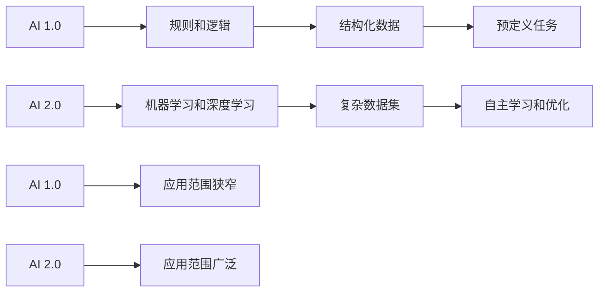

                 

### 李开复：AI 2.0 时代的用户

> **关键词：** AI 2.0，用户认知，用户体验，隐私保护，伦理问题

> **摘要：** 本文章旨在探讨 AI 2.0 时代中用户的角色、需求以及面临的挑战。通过李开复先生的观点，我们将深入分析 AI 2.0 的定义与特性、关键技术的应用场景、用户对 AI 的认知与接受度、隐私保护与伦理问题，以及 AI 2.0 时代的创新创业机会和未来展望。

#### 目录大纲

1. AI 2.0 时代概述
    1.1 AI 2.0 的定义与特性
    1.2 AI 2.0 技术发展与应用趋势
    1.3 AI 2.0 对社会与产业的影响
2. AI 2.0 时代的关键技术
    2.1 人工智能基础算法
    2.2 深度学习技术
3. AI 2.0 时代的应用场景
    3.1 金融领域的 AI 应用
    3.2 医疗健康领域的 AI 应用
    3.3 教育领域的 AI 应用
4. AI 2.0 时代的用户视角
    4.1 用户对 AI 2.0 的认知与接受度
    4.2 用户在 AI 2.0 时代的需求
    4.3 满足用户需求的 AI 产品开发策略
5. AI 2.0 时代的隐私保护与伦理问题
    5.1 AI 2.0 时代的隐私保护挑战
    5.2 AI 2.0 时代的伦理问题
6. AI 2.0 时代的创新创业机会
    6.1 创新创业机会分析
    6.2 AI 2.0 时代的创业生态系统
7. AI 2.0 时代的未来展望
    7.1 AI 2.0 时代的未来发展预测
    7.2 AI 2.0 时代的机遇与挑战
    7.3 应对策略
8. 附录
    8.1 主流 AI 框架介绍
    8.2 AI 开发工具与平台
    8.3 AI 研究论文与报告
    8.4 AI 社区与活动

---

### 第一部分：AI 2.0 时代概述

#### 第1章：AI 2.0 时代的来临

AI 2.0 是人工智能发展的新阶段，相较于 AI 1.0，它在技术深度、应用广度和用户体验方面都有显著提升。李开复先生将 AI 2.0 定义为“更智能、更自然、更融合”的人工智能。

**1.1 AI 2.0 的定义与背景**

AI 2.0 并不是一个全新的技术，而是对现有 AI 技术的进一步深化和应用。它继承了 AI 1.0 的核心思想，即通过机器学习和深度学习等技术，使计算机具备自我学习和决策能力。但与 AI 1.0 不同，AI 2.0 更注重将人工智能融入人们的日常生活，实现真正的智能化。

**1.2 AI 2.0 的核心特性**

AI 2.0 具有以下核心特性：

1. **更智能**：AI 2.0 能够通过深度学习和自然语言处理等技术，实现更高级的认知能力和决策能力。
2. **更自然**：AI 2.0 强调人机交互的自然性，通过语音识别、图像识别等技术，让计算机更好地理解和响应人类需求。
3. **更融合**：AI 2.0 并不仅仅是一个独立的技术体系，而是与其他技术（如物联网、云计算等）深度融合，形成一个有机的整体。

**1.3 AI 2.0 与 AI 1.0 的比较**

AI 1.0 主要是基于规则和符号推理的，其能力相对有限，主要应用于一些结构化、标准化的场景。而 AI 2.0 则通过深度学习和机器学习等技术，能够处理更复杂、更非结构化的数据，具有更广泛的应用潜力。

**1.4 AI 2.0 技术发展与应用趋势**

随着计算能力的提升、数据量的增加以及算法的进步，AI 2.0 正在迅速发展。它已经在金融、医疗、教育、交通等多个领域得到广泛应用，并继续向更多领域拓展。

**1.5 AI 2.0 对社会与产业的影响**

AI 2.0 对社会和产业的影响是深远而广泛的。它不仅改变了人们的工作和生活方式，还推动了产业升级和经济发展。然而，AI 2.0 也带来了一些新的挑战，如隐私保护、伦理问题等。

### 第二部分：AI 2.0 时代的关键技术

#### 第2章：AI 2.0 时代的关键技术

AI 2.0 的实现离不开一系列关键技术的支持。本章节将详细介绍这些关键技术，包括人工智能基础算法和深度学习技术。

#### 第2.1章：人工智能基础算法

人工智能基础算法包括机器学习算法、深度学习算法等。这些算法是构建 AI 2.0 系统的核心，决定了系统的学习能力、决策能力和推理能力。

**2.1.1 机器学习算法概述**

机器学习算法可以分为监督学习、无监督学习和强化学习三种类型。监督学习通过对已有数据的标注进行学习，从而预测未知数据的标签；无监督学习则无需标注数据，通过对数据分布的学习，发现数据中的规律；强化学习则是通过奖励机制，让系统不断调整策略，以最大化长期奖励。

**2.1.2 监督学习算法**

监督学习算法包括线性回归、逻辑回归、支持向量机等。这些算法通过建立模型，将输入和输出之间的关系映射出来，从而实现预测。

**2.1.3 无监督学习算法**

无监督学习算法包括聚类算法、降维算法等。这些算法通过对数据的分析，发现数据中的内在结构和规律。

**2.1.4 强化学习算法**

强化学习算法包括 Q-学习、深度 Q-学习等。这些算法通过模拟环境和奖励机制，让系统学会如何在复杂环境中做出最优决策。

#### 第2.2章：深度学习技术

深度学习技术是 AI 2.0 的核心技术之一，它通过多层神经网络，实现数据的深层特征提取和模型优化。

**2.2.1 深度学习原理与架构**

深度学习原理基于神经网络的层次结构，通过逐层提取数据特征，实现对复杂问题的建模和解决。深度学习的架构包括卷积神经网络（CNN）、循环神经网络（RNN）等。

**2.2.2 卷积神经网络（CNN）**

卷积神经网络是一种用于图像识别和处理的深度学习模型。它通过卷积操作，提取图像中的局部特征，从而实现对图像的分类和识别。

**2.2.3 循环神经网络（RNN）与长短时记忆网络（LSTM）**

循环神经网络是一种用于序列数据处理的深度学习模型。它通过循环结构，将当前状态与历史状态关联起来，实现对序列数据的建模和预测。长短时记忆网络（LSTM）是 RNN 的改进版本，它通过门控机制，有效解决了 RNN 的梯度消失和梯度爆炸问题。

**2.2.4 生成对抗网络（GAN）**

生成对抗网络是一种用于生成数据的深度学习模型。它由生成器和判别器两个神经网络组成，通过对抗训练，生成器不断学习生成逼真的数据，而判别器则不断学习区分真实数据和生成数据。

### 第三部分：AI 2.0 时代的应用场景

#### 第3章：AI 2.0 时代的应用场景

AI 2.0 技术的快速发展，使得它在金融、医疗、教育等各个领域都有广泛的应用。本章节将详细介绍这些应用场景，展示 AI 2.0 技术的巨大潜力和价值。

#### 第3.1章：金融领域的 AI 应用

在金融领域，AI 2.0 技术已经发挥了重要的作用。它不仅提高了金融服务的效率，还推动了金融创新。

**3.1.1 风险管理与预测**

AI 2.0 技术通过数据挖掘和分析，能够识别潜在的风险，并预测市场的走势。这对于金融机构来说，具有重要的参考价值。

**3.1.2 量化交易与投资**

量化交易和投资是金融领域的重要方向。AI 2.0 技术通过构建量化模型，实现自动化的交易和投资决策，提高了投资效率和收益。

**3.1.3 客户服务与智能投顾**

AI 2.0 技术在客户服务中的应用，主要体现在智能客服和智能投顾方面。智能客服通过自然语言处理技术，能够快速响应用户的需求，提高服务质量。智能投顾则通过数据分析，为投资者提供个性化的投资建议。

#### 第3.2章：医疗健康领域的 AI 应用

医疗健康领域是 AI 2.0 技术的重要应用场景之一。它通过数据的分析和处理，提高了医疗服务的质量和效率。

**3.2.1 医疗数据分析**

AI 2.0 技术通过对医疗数据的分析，能够发现潜在的健康问题，并预测疾病的进展。这对于医生来说，具有重要的辅助决策作用。

**3.2.2 疾病诊断与预测**

AI 2.0 技术在疾病诊断和预测方面，具有很高的准确性。它通过深度学习和图像识别等技术，能够快速、准确地诊断各种疾病。

**3.2.3 智能药物研发**

AI 2.0 技术在智能药物研发中的应用，主要体现在药物筛选和疗效预测方面。它通过大数据分析和机器学习技术，能够快速筛选出有效的药物，并预测药物的疗效。

#### 第3.3章：教育领域的 AI 应用

教育领域是 AI 2.0 技术的另一个重要应用场景。它通过个性化教学、智能评估等手段，提高了教育的质量和效率。

**3.3.1 智能教学系统**

智能教学系统通过数据分析，为学生提供个性化的学习方案。它根据学生的学习情况，自动调整教学进度和难度，从而提高学习效果。

**3.3.2 学生个性化学习**

学生个性化学习是通过 AI 技术对学生的学习情况进行分析，从而制定个性化的学习计划和教学策略。它有助于激发学生的学习兴趣，提高学习效果。

**3.3.3 考试评分与反馈系统**

考试评分与反馈系统通过 AI 技术对考试结果进行分析，为学生提供个性化的反馈和建议。它有助于学生发现学习中的问题，并及时调整学习策略。

### 第四部分：AI 2.0 时代的用户视角

#### 第4章：AI 2.0 时代的用户视角

在 AI 2.0 时代，用户作为人工智能的使用者和受益者，其角色和需求发生了深刻的变化。本章节将从用户的认知、需求和期望等方面，探讨 AI 2.0 时代的用户视角。

#### 第4.1章：用户对 AI 2.0 的认知与接受度

随着 AI 2.0 技术的普及，用户对 AI 2.0 的认知逐渐提高。然而，用户对 AI 2.0 的接受度仍然存在一定的差距。本章节将分析用户对 AI 2.0 的认知变化和接受度分析。

**4.1.1 用户对 AI 的认知变化**

用户对 AI 的认知经历了从陌生到熟悉，从恐惧到接受的过程。随着 AI 技术的不断发展，用户对 AI 的认知逐渐提高，开始接受 AI 作为生活的一部分。

**4.1.2 用户对 AI 的接受度分析**

用户对 AI 的接受度受到多个因素的影响，包括技术成熟度、应用场景、隐私保护等。随着 AI 技术的成熟和应用场景的丰富，用户对 AI 的接受度逐渐提高。

**4.1.3 提升用户接受度的策略**

为了提升用户对 AI 2.0 的接受度，需要从以下几个方面入手：

1. **提高技术透明度**：通过公开 AI 2.0 技术的原理和应用，让用户了解 AI 2.0 的真实面貌。
2. **优化用户体验**：通过优化 UI/UX 设计，提高用户使用 AI 2.0 产品的舒适度和满意度。
3. **加强隐私保护**：通过加强数据安全措施和隐私保护政策，提高用户对 AI 2.0 产品的信任度。
4. **加大宣传力度**：通过广告宣传、媒体报道等手段，提高用户对 AI 2.0 的认知和接受度。

#### 第4.2章：用户在 AI 2.0 时代的需求

用户在 AI 2.0 时代的需求主要集中在以下几个方面：

**4.2.1 便捷性**：用户希望 AI 2.0 技术能够提供便捷的服务，减少繁琐的操作步骤。

**4.2.2 智能化**：用户希望 AI 2.0 技术能够根据个人需求和习惯，提供个性化的服务。

**4.2.3 安全性**：用户希望 AI 2.0 技术能够保障个人隐私和数据安全。

**4.2.4 可靠性**：用户希望 AI 2.0 技术能够提供稳定、可靠的性能。

**4.2.5 可解释性**：用户希望 AI 2.0 技术的决策过程和结果能够被解释和理解。

为了满足用户的需求，AI 2.0 技术需要不断优化和改进，提高技术成熟度和用户体验。

#### 第4.3章：满足用户需求的 AI 产品开发策略

为了满足用户在 AI 2.0 时代的需求，需要从以下几个方面制定 AI 产品开发策略：

**4.3.1 用户研究**：通过对用户需求和行为的研究，了解用户的需求和期望，为产品开发提供依据。

**4.3.2 技术创新**：通过技术创新，提高 AI 产品的性能和智能化水平。

**4.3.3 设计优化**：通过优化 UI/UX 设计，提高用户使用 AI 产品的舒适度和满意度。

**4.3.4 安全保障**：通过加强数据安全措施和隐私保护政策，提高用户对 AI 产品的信任度。

**4.3.5 持续迭代**：通过持续迭代和优化，不断改进 AI 产品的功能和性能，满足用户不断变化的需求。

### 第五部分：AI 2.0 时代的隐私保护与伦理问题

#### 第5章：AI 2.0 时代的隐私保护与伦理问题

随着 AI 2.0 技术的快速发展，用户隐私保护和伦理问题日益凸显。本章节将分析 AI 2.0 时代的隐私保护挑战、伦理问题以及相关法规政策。

#### 第5.1章：AI 2.0 时代的隐私保护挑战

AI 2.0 技术在收集、处理和利用数据的过程中，可能会侵犯用户的隐私。以下是 AI 2.0 时代面临的隐私保护挑战：

**5.1.1 数据泄露风险**：由于 AI 2.0 技术需要大量数据来训练模型，数据泄露的风险较高。

**5.1.2 数据滥用风险**：AI 2.0 技术可能被用于收集和利用用户数据，从而侵犯用户隐私。

**5.1.3 数据跨境流动风险**：由于 AI 2.0 技术的应用场景广泛，数据跨境流动的风险较大。

为了应对这些隐私保护挑战，需要从以下几个方面采取措施：

**5.1.4 强化数据安全措施**：通过加密、访问控制等技术手段，提高数据的安全性。

**5.1.5 制定隐私保护政策**：明确 AI 2.0 技术的使用范围、数据收集和处理规则，保障用户隐私。

**5.1.6 加强监管和执法**：通过建立健全的法律法规，加强对 AI 2.0 技术隐私保护的监管和执法力度。

#### 第5.2章：AI 2.0 时代的伦理问题

AI 2.0 技术的发展，不仅带来了技术上的进步，也引发了一系列伦理问题。以下是 AI 2.0 时代面临的伦理问题：

**5.2.1 人工智能偏见问题**：AI 2.0 技术在训练过程中，可能会受到训练数据的影响，导致算法存在偏见。

**5.2.2 人工智能责任归属问题**：当 AI 2.0 技术出现故障或造成损害时，如何确定责任归属？

**5.2.3 人工智能决策透明性问题**：AI 2.0 技术的决策过程往往复杂且不透明，如何确保决策过程的公正性和透明性？

为了解决这些伦理问题，需要从以下几个方面着手：

**5.2.4 制定伦理决策框架**：明确 AI 2.0 技术的伦理原则和道德规范，为算法设计提供指导。

**5.2.5 加强人工智能教育和培训**：提高从业者和用户的伦理意识和道德素养。

**5.2.6 建立人工智能伦理审查机制**：对 AI 2.0 技术进行伦理审查，确保其应用符合伦理要求。

### 第六部分：AI 2.0 时代的创新创业机会

#### 第6章：AI 2.0 时代的创新创业机会

AI 2.0 时代的到来，为创新创业提供了巨大的机会。本章节将分析 AI 2.0 时代的市场机会、创新创业策略以及成功案例。

#### 第6.1章：创新创业机会分析

AI 2.0 技术在各个领域的应用，为创新创业带来了丰富的市场机会。以下是几个典型的市场机会：

**6.1.1 智能医疗**：随着 AI 2.0 技术在医疗领域的应用，智能医疗设备、智能诊断系统等市场前景广阔。

**6.1.2 智能金融**：AI 2.0 技术在金融领域的应用，如量化交易、智能投顾等，为金融创新提供了新的方向。

**6.1.3 智能交通**：随着自动驾驶技术的发展，智能交通系统、智能停车等市场潜力巨大。

**6.1.4 智能家居**：智能家居市场随着 AI 2.0 技术的普及，有望迎来快速增长。

为了抓住这些市场机会，需要制定有效的创新创业策略。

#### 第6.2章：创新创业策略

在 AI 2.0 时代，创新创业需要从以下几个方面制定策略：

**6.2.1 技术创新**：通过技术创新，提高产品的竞争力。

**6.2.2 市场定位**：明确目标市场，满足用户需求。

**6.2.3 资源整合**：通过整合资源，提高创业成功率。

**6.2.4 团队建设**：打造高效团队，确保项目顺利推进。

#### 第6.3章：成功案例解析

以下是几个 AI 2.0 时代的成功案例：

**6.3.1 谷歌 DeepMind**：通过深度学习技术，在游戏、医疗等领域取得重大突破，成为 AI 2.0 的代表企业。

**6.3.2 Tesla**：通过自动驾驶技术，推动汽车行业的变革，成为 AI 2.0 在交通领域的领导者。

**6.3.3 薇诺娜**：通过大数据分析，为用户提供个性化的皮肤护理方案，成为智能医疗领域的明星企业。

这些成功案例为我们提供了宝贵的经验和启示。

### 第七部分：AI 2.0 时代的未来展望

#### 第7章：AI 2.0 时代的未来展望

随着 AI 2.0 技术的不断发展，其对社会、经济和人类生活的影响将越来越深远。本章节将探讨 AI 2.0 时代的未来发展趋势、面临的挑战以及应对策略。

#### 第7.1章：AI 2.0 时代的未来发展预测

根据当前的技术发展趋势和市场环境，我们可以预测 AI 2.0 时代将呈现以下发展趋势：

**7.1.1 技术融合**：AI 2.0 技术将与物联网、5G 等技术深度融合，推动智能时代的到来。

**7.1.2 应用普及**：AI 2.0 技术将应用于更多领域，如农业、制造业、服务业等，提升各行业的智能化水平。

**7.1.3 智能化提升**：随着 AI 技术的不断进步，智能化水平将得到大幅提升，为人类带来更多便利。

**7.1.4 数据驱动**：数据将成为 AI 2.0 时代的重要资产，数据驱动的发展模式将推动各行业的创新。

#### 第7.2章：AI 2.0 时代的机遇与挑战

AI 2.0 时代的到来，为人类带来了前所未有的机遇，同时也带来了一系列挑战：

**7.2.1 机遇**

1. **经济增长**：AI 2.0 技术将推动各行业的创新和发展，为经济增长提供新动力。
2. **生活品质提升**：AI 2.0 技术将改善人们的生活质量，提高生活便利性。
3. **社会进步**：AI 2.0 技术将促进社会进步，解决一些长期存在的难题。

**7.2.2 挑战**

1. **就业压力**：AI 2.0 技术的广泛应用，可能导致部分行业和岗位的失业。
2. **隐私保护**：AI 2.0 技术在收集和处理数据的过程中，可能侵犯用户的隐私。
3. **伦理问题**：AI 2.0 技术的决策过程和结果可能存在伦理争议。

#### 第7.3章：应对策略

为了应对 AI 2.0 时代的机遇与挑战，需要采取以下策略：

**7.3.1 技术创新**：持续推动 AI 2.0 技术的创新和发展，提高技术成熟度和应用水平。

**7.3.2 教育培训**：加强 AI 2.0 技术的教育培训，提高全民的 AI 意识和技能水平。

**7.3.3 法规政策**：建立健全的法律法规，规范 AI 2.0 技术的应用和发展。

**7.3.4 社会参与**：鼓励社会各界参与 AI 2.0 时代的建设，共同应对挑战，共享发展成果。

### 附录

#### 附录 A：AI 2.0 相关资源与工具

为了更好地了解和掌握 AI 2.0 技术，以下是几个常用的 AI 2.0 相关资源与工具：

**8.1 主流 AI 框架介绍**

1. **TensorFlow**：由谷歌开发的开源深度学习框架，适用于各种深度学习任务。
2. **PyTorch**：由 Facebook 开发的开源深度学习框架，具有灵活性和高效性。
3. **Keras**：基于 TensorFlow 和 Theano 的开源深度学习框架，易于使用。

**8.2 AI 开发工具与平台**

1. **Jupyter Notebook**：适用于数据分析和机器学习的交互式开发环境。
2. **Google Colab**：基于 Google Cloud 的免费云端虚拟环境，适用于 AI 开发和实验。
3. **Azure Machine Learning**：微软提供的云平台，支持 AI 模型的训练、部署和管理。

**8.3 AI 研究论文与报告**

1. **NeurIPS**：国际神经信息处理系统会议，是深度学习和人工智能领域的顶级会议。
2. **ICML**：国际机器学习会议，涵盖机器学习、统计学习等领域的最新研究成果。
3. **AAAI**：国际人工智能会议，关注人工智能的理论和应用。

**8.4 AI 社区与活动**

1. **Kaggle**：全球知名的数据科学竞赛平台，提供丰富的数据集和比赛任务。
2. **AI 会客厅**：由 AI 天才研究院主办的人工智能论坛，分享 AI 领域的最新成果和经验。
3. **AI 前沿讲座**：邀请国内外 AI 领域的专家学者，分享 AI 技术的最新进展和应用。

---

通过本文的详细探讨，我们深入了解了 AI 2.0 时代的用户角色、需求、隐私保护与伦理问题，以及创新创业机会和未来展望。在 AI 2.0 时代，用户作为人工智能的使用者和受益者，其认知、需求和期望将深刻影响 AI 的发展方向和应用场景。同时，AI 2.0 技术的快速发展也带来了一系列挑战，需要我们从技术创新、教育培训、法规政策等方面共同努力，迎接这一充满机遇和挑战的新时代。

作者：AI 天才研究院/AI Genius Institute & 禅与计算机程序设计艺术 /Zen And The Art of Computer Programming

---

### 1.1 AI 2.0 的定义与背景

AI 2.0 是人工智能（Artificial Intelligence，简称 AI）发展的重要阶段，它标志着人工智能技术从以规则为基础的传统 AI 向更加智能化、自适应化、用户中心的 AI 转变。AI 1.0 时代主要依赖于基于规则的系统，这些系统能够执行预定义的任务，但缺乏自主学习和适应变化的能力。相比之下，AI 2.0 更加注重机器学习和深度学习，使得计算机能够通过大量数据自动学习和改进。

**AI 2.0 的核心特点可以概括为“更智能、更自然、更融合”。**

- **更智能**：AI 2.0 通过先进的算法，如深度学习、强化学习等，使计算机能够处理复杂数据集，进行自我学习和优化。这种智能体现在计算机在特定任务上的表现几乎可以媲美甚至超越人类。

- **更自然**：AI 2.0 强调人机交互的自然性，通过语音识别、自然语言处理等技术，使计算机能够理解和响应人类的语言和指令，提供更加自然和流畅的交互体验。

- **更融合**：AI 2.0 不仅局限于单一的领域，而是与其他技术如物联网（IoT）、云计算等深度融合，形成更加智能化和互联化的生态系统。

**AI 2.0 的兴起背景可以归结为以下几个因素：**

1. **计算能力的提升**：随着计算能力的不断提升，特别是高性能计算集群和 GPU 的普及，为复杂 AI 算法的训练和应用提供了坚实的基础。

2. **数据量的爆炸性增长**：互联网的普及和数据存储技术的进步，使得海量的数据得以收集、存储和处理，为 AI 模型的训练提供了丰富的素材。

3. **算法的进步**：深度学习、强化学习等算法的不断发展，使得 AI 系统能够更高效地学习复杂模式，提高决策的准确性。

4. **商业需求的推动**：随着各行各业对智能化、自动化需求的增加，AI 2.0 技术的应用范围不断扩展，推动了相关产业的发展。

**AI 2.0 与 AI 1.0 的主要区别在于其实现方式和应用范围。**

- **实现方式**：AI 1.0 依赖于预定义的规则和逻辑，而 AI 2.0 则通过数据驱动的方式，利用机器学习和深度学习算法进行自主学习和优化。

- **应用范围**：AI 1.0 的应用主要局限于结构化数据，如文字和表格，而 AI 2.0 可以处理更加复杂和非结构化的数据，如图像、语音和视频。

**下面是一个简化的 Mermaid 流程图，展示 AI 1.0 和 AI 2.0 的核心流程和区别：**



通过这个流程图，我们可以清晰地看到 AI 2.0 在实现方式和应用范围上的显著优势。

**总之，AI 2.0 的定义与背景体现了其在智能化、人机交互和跨领域融合等方面的创新。它不仅代表了人工智能技术的新阶段，也为未来的科技发展和社会进步奠定了坚实的基础。**

---

### 1.2 AI 2.0 技术发展与应用趋势

AI 2.0 的技术发展与应用趋势是当前科技界和产业界关注的焦点。随着 AI 技术的不断进步，AI 2.0 正在以惊人的速度变革各行各业，为人类带来前所未有的机遇和挑战。以下是对 AI 2.0 技术发展的现状、应用趋势以及对社会与产业影响的详细分析。

**1.2.1 AI 2.0 技术发展现状**

AI 2.0 技术的发展可以分为几个关键方面：

1. **深度学习与神经网络**：深度学习是 AI 2.0 的核心技术之一，通过多层神经网络的结构，深度学习能够自动提取数据的特征并用于复杂的任务。近年来，随着计算能力的提升和海量数据的积累，深度学习在图像识别、自然语言处理、语音识别等领域取得了显著进展。

2. **强化学习**：强化学习是一种通过试错和反馈机制来学习策略的 AI 算法。在游戏、推荐系统、自动驾驶等领域，强化学习已经展现了其强大的能力，能够在复杂的环境中做出最优决策。

3. **生成对抗网络（GAN）**：GAN 是一种通过两个神经网络（生成器和判别器）相互竞争来生成逼真数据的算法。GAN 在图像生成、数据增强、风格迁移等领域有着广泛的应用，其技术正在不断演进。

4. **自然语言处理（NLP）**：自然语言处理技术使得计算机能够理解和生成人类语言。在智能助手、机器翻译、文本分析等领域，NLP 技术已经取得了显著的成果，并且正在不断改进，以提高语言的准确性和流畅性。

**1.2.2 AI 2.0 应用趋势**

AI 2.0 的应用趋势表现出多样化和深入化的特点：

1. **行业应用广泛**：AI 2.0 技术已经广泛应用于金融、医疗、教育、交通、零售等多个行业。例如，在金融领域，AI 2.0 技术被用于风险评估、量化交易、欺诈检测等；在医疗领域，AI 2.0 技术用于疾病诊断、药物研发、健康管理等。

2. **跨领域融合**：AI 2.0 技术与其他领域的深度融合，推动了智能城市的建设、智能工厂的运营、智能农业的发展。例如，物联网（IoT）与 AI 2.0 技术的结合，使得智能家居、智能交通、智能安防等成为可能。

3. **个性化服务**：AI 2.0 技术在个性化服务方面有着广泛的应用。通过分析用户行为数据，AI 2.0 能够为用户提供个性化的推荐、定制化的解决方案，提升用户体验。

4. **自动化与智能化**：AI 2.0 技术在自动化和智能化方面发挥着重要作用。自动化流水线、智能化客服系统、自动驾驶车辆等，都展示了 AI 2.0 技术的强大潜力。

**1.2.3 AI 2.0 对社会与产业的影响**

AI 2.0 的发展对社会与产业产生了深远的影响：

1. **经济影响**：AI 2.0 技术的广泛应用推动了产业升级和经济增长。AI 技术在提高生产效率、降低成本、创造新商机等方面发挥了重要作用。

2. **就业变革**：虽然 AI 2.0 技术带来了新的就业机会，但同时也对某些职业产生了替代效应。这种变革要求劳动力市场进行相应的调整，提高员工的技能水平。

3. **社会治理**：AI 2.0 技术在公共安全、社会治理等方面也发挥着重要作用。智能监控、数据分析等技术提高了社会治理的效率和精准度。

4. **隐私保护与伦理**：随着 AI 2.0 技术的普及，隐私保护和伦理问题日益突出。如何确保数据安全、防止滥用、维护社会伦理，成为 AI 2.0 发展中需要解决的重要问题。

**总的来说，AI 2.0 技术的发展和应用趋势为人类社会带来了巨大的机遇，同时也提出了新的挑战。随着技术的不断进步和社会的适应性调整，AI 2.0 将继续推动社会和产业的深刻变革。**

---

### 1.3 AI 2.0 对社会与产业的影响

AI 2.0 的崛起不仅改变了技术的面貌，也对社会和产业产生了深远的影响。以下将从经济、就业、社会治理以及隐私保护与伦理等方面，详细探讨 AI 2.0 对社会与产业的潜在影响。

#### **1.3.1 经济影响**

AI 2.0 技术的普及为全球经济带来了新的增长动力。首先，AI 技术在提高生产效率方面发挥了关键作用。通过自动化和智能化，许多企业能够减少人力成本，提高生产效率和产品质量。例如，智能制造系统通过实时监控和调整生产线，减少了故障和停机时间，从而提高了整体生产效率。

其次，AI 2.0 技术推动了新商业模式的诞生。以共享经济为例，平台如 Airbnb 和 Uber 利用 AI 技术优化资源配置，提升了用户体验和服务效率，开辟了新的市场空间。

此外，AI 2.0 还有助于提高企业的创新能力和竞争力。通过数据分析和预测模型，企业能够更好地了解市场需求，开发出更具针对性的产品和服务，从而在竞争激烈的市场中脱颖而出。

#### **1.3.2 就业变革**

AI 2.0 技术的广泛应用在创造新就业机会的同时，也对某些职业产生了替代效应。一方面，AI 技术的需求推动了数据科学家、机器学习工程师等高技能岗位的增长，为劳动力市场提供了新的机遇。另一方面，一些传统岗位，如制造业流水线工人、数据录入员等，面临被自动化技术取代的风险。

这种就业变革要求劳动力市场进行相应的调整。首先，教育和培训体系需要更新，提高劳动者的技能水平，以适应新技术的发展。其次，政府和企业需要制定政策，帮助失业工人重新就业，提供职业转换和技能提升的机会。

#### **1.3.3 社会治理**

AI 2.0 技术在公共安全和社会治理方面的应用正在不断扩展。智能监控系统通过实时分析和识别图像和视频数据，能够快速响应突发事件，提高公共安全水平。例如，一些城市已经部署了智能交通系统，通过实时监控和智能调度，减少了交通拥堵和事故发生率。

此外，AI 技术在公共卫生领域的应用也日益广泛。通过数据分析，AI 技术能够预测疾病爆发趋势，提供个性化的健康建议，从而提高公共卫生服务的效率和质量。

#### **1.3.4 隐私保护与伦理**

随着 AI 2.0 技术的普及，隐私保护和伦理问题日益凸显。AI 技术在处理和分析大量用户数据时，可能侵犯个人隐私。例如，智能助手和社交媒体平台通过用户数据提供个性化服务，但这也引发了对用户隐私安全的担忧。

为了应对隐私保护挑战，需要从多个方面采取行动。首先，企业和政府需要建立严格的隐私保护政策和法规，明确数据收集、存储和处理的标准。其次，技术开发者需要设计安全的数据处理机制，确保用户数据的安全性。此外，社会需要加强对隐私保护的宣传教育，提高公众的隐私意识。

在伦理方面，AI 2.0 技术的决策过程和结果可能存在伦理争议。例如，自动化决策系统可能存在偏见，影响公平性和正义。因此，需要制定伦理决策框架，确保 AI 系统的应用符合道德规范。

**综上所述，AI 2.0 技术对社会和产业的影响是全面而深远的。它不仅带来了经济增长和就业变革，也推动了社会治理的智能化和个性化。同时，隐私保护和伦理问题也成为 AI 2.0 发展中需要解决的重要问题。随着技术的不断进步和社会的适应性调整，AI 2.0 将继续推动社会和产业的深刻变革。**

---

### 2.1 人工智能基础算法

人工智能基础算法是构建 AI 2.0 系统的核心，它们决定了系统的学习能力、决策能力和推理能力。在本章节中，我们将详细介绍几种重要的人工智能基础算法，包括机器学习算法、深度学习算法等。

#### 2.1.1 机器学习算法概述

机器学习算法是人工智能领域的一种重要方法，它使计算机系统能够通过学习数据来做出预测和决策。机器学习算法可以分为监督学习、无监督学习和强化学习三种类型。

- **监督学习**：监督学习通过已有数据的标签来训练模型，从而预测未知数据的标签。常见的监督学习算法包括线性回归、逻辑回归、支持向量机（SVM）等。

  **线性回归**：线性回归是一种简单的预测算法，通过建立输入变量和输出变量之间的线性关系来预测未知数据。其数学模型如下：
  
  $$ Y = \beta_0 + \beta_1X + \epsilon $$
  
  其中，\( Y \) 是输出变量，\( X \) 是输入变量，\( \beta_0 \) 和 \( \beta_1 \) 是模型参数，\( \epsilon \) 是误差项。

  **逻辑回归**：逻辑回归是一种分类算法，通过建立输入变量和输出变量之间的概率关系来预测数据的类别。其数学模型如下：
  
  $$ P(Y=1) = \frac{1}{1 + e^{-(\beta_0 + \beta_1X)}} $$
  
  其中，\( P(Y=1) \) 是输出变量为 1 的概率，\( \beta_0 \) 和 \( \beta_1 \) 是模型参数。

  **支持向量机（SVM）**：SVM 是一种分类算法，通过找到最佳分割超平面，将不同类别的数据分离。其目标是最小化决策边界到支持向量的距离。其数学模型如下：
  
  $$ \min_{\beta, \beta_0} \frac{1}{2} ||\beta||^2 + C \sum_{i=1}^{n} \max(0, 1 - y_i(\beta^T x_i + \beta_0)) $$
  
  其中，\( \beta \) 和 \( \beta_0 \) 是模型参数，\( C \) 是惩罚参数，\( y_i \) 是第 \( i \) 个样本的标签，\( x_i \) 是第 \( i \) 个样本的特征向量。

- **无监督学习**：无监督学习不需要已标注的数据，它通过观察数据分布来发现数据中的内在结构和规律。常见的无监督学习算法包括聚类算法、降维算法等。

  **K-均值聚类**：K-均值聚类是一种基于距离的聚类算法，它通过迭代计算中心点，将数据划分为 K 个簇。其算法步骤如下：

  1. 初始化 K 个簇的中心点。
  2. 对于每个数据点，计算其与各个簇中心点的距离，将其分配到最近的簇。
  3. 更新每个簇的中心点。
  4. 重复步骤 2 和步骤 3，直到聚类结果收敛。

  **主成分分析（PCA）**：PCA 是一种降维算法，它通过保留数据的主要特征，减少数据的维度。其算法步骤如下：

  1. 计算数据集的特征值和特征向量。
  2. 选择特征值最大的 k 个特征向量作为新坐标轴。
  3. 将数据投影到新坐标轴上，实现降维。

- **强化学习**：强化学习是一种通过试错和反馈机制来学习策略的算法。常见的强化学习算法包括 Q-学习、深度 Q-学习（DQN）等。

  **Q-学习**：Q-学习是一种基于值函数的强化学习算法，它通过更新 Q 值来学习最优策略。其算法步骤如下：

  1. 初始化 Q 值表格。
  2. 对于每个状态-动作对，根据当前 Q 值和奖励来更新 Q 值。
  3. 重复步骤 2，直到策略收敛。

  **深度 Q-学习（DQN）**：DQN 是一种基于神经网络的强化学习算法，它通过拟合 Q 值函数来学习策略。其算法步骤如下：

  1. 初始化 Q 神经网络。
  2. 对于每个经验样本，更新 Q 神经网络。
  3. 使用目标 Q 神经网络来评估当前策略。
  4. 重复步骤 2 和步骤 3，直到策略收敛。

#### 2.1.2 深度学习算法

深度学习是人工智能领域的另一个重要分支，它通过多层神经网络的结构，使计算机能够自动提取数据的特征并用于复杂的任务。常见的深度学习算法包括卷积神经网络（CNN）、循环神经网络（RNN）和生成对抗网络（GAN）等。

- **卷积神经网络（CNN）**：CNN 是一种用于图像识别和处理的深度学习模型，它通过卷积操作和池化操作，提取图像中的局部特征。其算法步骤如下：

  1. 输入层：接受输入图像。
  2. 卷积层：通过卷积操作提取图像特征。
  3. 池化层：通过池化操作降低特征维度。
  4. 全连接层：通过全连接层进行分类和预测。

  **卷积操作**：卷积操作通过滑动滤波器（卷积核）在输入图像上进行卷积，生成特征图。其数学模型如下：

  $$ f_{ij}^l = \sum_{k=1}^{C} w_{ik}^{l} * g_{kj}^{l-1} + b_{j}^{l} $$
  
  其中，\( f_{ij}^l \) 是第 \( l \) 层第 \( j \) 个特征图上的第 \( i \) 个元素，\( w_{ik}^{l} \) 是第 \( l \) 层第 \( k \) 个卷积核的元素，\( g_{kj}^{l-1} \) 是第 \( l-1 \) 层第 \( k \) 个特征图上的第 \( j \) 个元素，\( b_{j}^{l} \) 是第 \( l \) 层的偏置项。

  **池化操作**：池化操作通过在局部区域中选择最大值或平均值来降低特征图的维度。常见的池化操作包括最大池化和平均池化。

- **循环神经网络（RNN）**：RNN 是一种用于序列数据处理的深度学习模型，它通过循环结构将当前状态与历史状态关联起来。常见的 RNN 模型包括简单 RNN、LSTM 和 GRU。

  **简单 RNN**：简单 RNN 通过递归结构来处理序列数据，其数学模型如下：

  $$ h_t = \sigma(W_h h_{t-1} + W_x x_t + b_h) $$
  
  其中，\( h_t \) 是第 \( t \) 个隐藏状态，\( \sigma \) 是激活函数，\( W_h \) 是隐藏状态权重矩阵，\( W_x \) 是输入状态权重矩阵，\( b_h \) 是隐藏状态偏置。

  **长短时记忆网络（LSTM）**：LSTM 是一种改进的 RNN 模型，它通过门控机制有效地解决了长短期依赖问题。其数学模型如下：

  $$ i_t = \sigma(W_i [h_{t-1}, x_t] + b_i) $$
  $$ f_t = \sigma(W_f [h_{t-1}, x_t] + b_f) $$
  $$ o_t = \sigma(W_o [h_{t-1}, x_t] + b_o) $$
  $$ C_t = f_t \odot C_{t-1} + i_t \odot \sigma(W_c [h_{t-1}, x_t] + b_c) $$
  $$ h_t = o_t \odot \sigma(C_t) $$
  
  其中，\( i_t \)、\( f_t \)、\( o_t \) 分别是输入门、遗忘门和输出门，\( C_t \) 是细胞状态，\( \odot \) 表示逐元素乘法。

  **门控循环单元（GRU）**：GRU 是 LSTM 的简化版本，它通过合并输入门和遗忘门来提高计算效率。其数学模型如下：

  $$ z_t = \sigma(W_z [h_{t-1}, x_t] + b_z) $$
  $$ r_t = \sigma(W_r [h_{t-1}, x_t] + b_r) $$
  $$ h_t = \sigma((1 - z_t) \odot h_{t-1} + z_t \odot (W_h [r_t \odot h_{t-1}, x_t] + b_h)) $$

  **卷积神经网络（CNN）与循环神经网络（RNN）的结合**：在处理序列数据时，可以将 CNN 与 RNN 结合使用。例如，CNN 用于提取图像特征，而 RNN 用于处理图像序列。

- **生成对抗网络（GAN）**：GAN 是一种通过两个神经网络（生成器和判别器）相互竞争来生成逼真数据的模型。其算法步骤如下：

  1. 初始化生成器和判别器。
  2. 生成器生成伪造数据。
  3. 判别器判断数据是否真实。
  4. 更新生成器和判别器的参数。
  5. 重复步骤 2 到步骤 4，直到生成器生成的伪造数据接近真实数据。

  **生成器**：生成器的目标是最小化判别器判断伪造数据的概率。其数学模型如下：

  $$ G(z) = x; \quad D(x) - D(G(z)) $$

  **判别器**：判别器的目标是最大化判断伪造数据的概率。其数学模型如下：

  $$ D(x) - D(G(z)) $$

  其中，\( G(z) \) 是生成器生成的伪造数据，\( D(x) \) 是判别器判断真实数据的概率，\( D(G(z)) \) 是判别器判断伪造数据的概率，\( z \) 是生成器的输入噪声。

**综上所述，人工智能基础算法是构建 AI 2.0 系统的核心，包括机器学习算法、深度学习算法等。这些算法通过不同的机制和模型，实现了数据的特征提取、模式识别和决策优化。随着技术的不断进步，人工智能基础算法将在更多领域发挥重要作用，推动 AI 2.0 时代的到来。**

---

### 2.2 深度学习技术

深度学习技术是人工智能领域的一项革命性突破，它通过构建多层神经网络，实现了对复杂数据的高效特征提取和学习。在本章节中，我们将详细介绍深度学习技术的基本原理、常见架构以及关键技术。

#### 2.2.1 深度学习原理与架构

深度学习（Deep Learning）是一种机器学习方法，它通过构建多层次的神经网络结构，实现对数据的深层特征表示和建模。深度学习模型的核心思想是让计算机通过学习大量数据，自动提取出数据中的有效特征，并利用这些特征进行预测或分类。

**深度学习的基本原理可以概括为以下几步：**

1. **数据处理**：首先，对输入数据进行预处理，包括数据清洗、归一化、特征提取等，以便于后续的模型训练。
2. **模型构建**：设计并构建深度学习模型的结构，包括输入层、隐藏层和输出层。常见的深度学习模型有卷积神经网络（CNN）、循环神经网络（RNN）、长短时记忆网络（LSTM）等。
3. **模型训练**：使用大量的训练数据，通过反向传播算法（Backpropagation）调整模型的参数，使模型在训练数据上达到较高的准确率。
4. **模型评估**：使用验证集和测试集对训练好的模型进行评估，以确定模型的泛化能力和性能。
5. **模型应用**：将训练好的模型应用于实际问题，进行预测或分类。

**深度学习的基本架构包括以下几部分：**

- **输入层**：接收输入数据，并将其传递给下一层。
- **隐藏层**：对输入数据进行特征提取和变换，通常包含多层，每层都对输入数据进行复杂的非线性变换。
- **输出层**：根据隐藏层的输出进行预测或分类，输出最终的结果。

#### 2.2.2 卷积神经网络（CNN）

卷积神经网络（Convolutional Neural Network，CNN）是一种专门用于处理图像数据的深度学习模型。CNN 通过卷积操作和池化操作，能够自动提取图像的局部特征，并在不同层之间进行特征融合，从而实现对图像的高效表示。

**卷积神经网络的主要组成部分包括：**

- **卷积层**：卷积层通过卷积操作提取图像的特征。卷积操作使用一个可训练的卷积核（也称为滤波器或过滤器），在输入图像上滑动，生成一个特征图。卷积层的输出特征图包含了图像的局部特征。
- **池化层**：池化层通过下采样操作减少特征图的维度，提高计算效率。常见的池化操作有最大池化和平均池化。
- **全连接层**：全连接层将隐藏层的输出连接到输出层，用于进行分类或回归任务。

**卷积神经网络的训练过程通常包括以下步骤：**

1. **初始化参数**：初始化卷积核、偏置和全连接层的权重。
2. **前向传播**：输入图像通过卷积层和池化层，逐层计算输出特征图。
3. **计算损失**：将输出特征图与标签进行比较，计算预测结果与真实标签之间的损失。
4. **反向传播**：利用反向传播算法，将损失反向传播到前一层，更新网络的参数。
5. **优化参数**：通过梯度下降或其他优化算法，迭代优化网络的参数，直到损失降低到可以接受的范围内。

**卷积神经网络在图像识别中的应用**：

卷积神经网络在图像识别领域取得了显著的成果，例如在 ImageNet 图像分类挑战中，卷积神经网络取得了超过人类水平的识别准确率。常见的卷积神经网络模型包括 LeNet、AlexNet、VGG、ResNet 等。

- **LeNet**：LeNet 是最早的卷积神经网络之一，主要用于手写数字识别。
- **AlexNet**：AlexNet 是深度学习领域的里程碑，通过引入卷积层和ReLU激活函数，显著提高了图像分类的准确率。
- **VGG**：VGG 是一种基于深层卷积网络的模型，通过增加网络的深度和宽度，进一步提高了图像分类的性能。
- **ResNet**：ResNet 是一种引入残差块的深层卷积神经网络，通过解决梯度消失问题，实现了更深层的网络结构。

#### 2.2.3 循环神经网络（RNN）与长短时记忆网络（LSTM）

循环神经网络（Recurrent Neural Network，RNN）是一种用于处理序列数据的神经网络。RNN 通过循环结构，将当前输入与历史状态关联起来，实现对序列数据的建模。然而，传统的 RNN 存在梯度消失和梯度爆炸问题，导致训练困难。

长短时记忆网络（Long Short-Term Memory，LSTM）是 RNN 的一种改进模型，它通过门控机制，有效地解决了长短期依赖问题，从而在序列数据建模中取得了显著成果。

**LSTM 的主要组成部分包括：**

- **输入门**（Input Gate）：控制当前输入对细胞状态的影响。
- **遗忘门**（Forget Gate）：控制之前细胞状态中的信息是否被遗忘。
- **输出门**（Output Gate）：控制细胞状态输出到下一隐藏状态的影响。

**LSTM 的训练过程通常包括以下步骤：**

1. **初始化参数**：初始化 LSTM 的权重和偏置。
2. **前向传播**：输入序列通过 LSTM 单元，逐个计算隐藏状态和细胞状态。
3. **计算损失**：将隐藏状态与标签进行比较，计算预测结果与真实标签之间的损失。
4. **反向传播**：利用反向传播算法，将损失反向传播到前一层，更新 LSTM 的参数。
5. **优化参数**：通过梯度下降或其他优化算法，迭代优化 LSTM 的参数，直到损失降低到可以接受的范围内。

**LSTM 在自然语言处理中的应用**：

LSTM 在自然语言处理（Natural Language Processing，NLP）领域取得了显著成果，例如文本分类、机器翻译、情感分析等。常见的 LSTM 模型包括 LSTM、GRU 等。

- **LSTM**：LSTM 通过门控机制，解决了 RNN 的长短期依赖问题，广泛应用于 NLP 任务。
- **GRU**：GRU 是 LSTM 的简化版本，通过合并输入门和遗忘门，提高了计算效率。

#### 2.2.4 生成对抗网络（GAN）

生成对抗网络（Generative Adversarial Network，GAN）是一种由生成器和判别器组成的深度学习模型。生成器的目标是生成逼真的数据，而判别器的目标是区分真实数据和生成数据。生成器和判别器相互竞争，通过不断迭代优化，最终生成器能够生成高质量的伪造数据。

**生成对抗网络的训练过程通常包括以下步骤：**

1. **初始化参数**：初始化生成器和判别器的权重和偏置。
2. **生成器训练**：生成器生成伪造数据，判别器对其进行判断。
3. **判别器训练**：判别器根据真实数据和生成数据进行训练。
4. **迭代优化**：生成器和判别器交替训练，通过优化生成器和判别器的参数，使生成器生成的伪造数据越来越接近真实数据。

**生成对抗网络的应用**：

生成对抗网络在图像生成、图像修复、数据增强等领域取得了显著成果。常见的 GAN 模型包括 DCGAN、WGAN 等。

- **DCGAN**：DCGAN 是最早的深度卷积 GAN，通过深度卷积神经网络，实现了高质量的图像生成。
- **WGAN**：WGAN 是 GAN 的改进版本，通过引入权重平衡项，解决了 GAN 的训练不稳定问题。

**综上所述，深度学习技术通过多层神经网络的结构，实现了对复杂数据的高效特征提取和学习。卷积神经网络、循环神经网络和生成对抗网络等关键技术，使深度学习在图像识别、自然语言处理和图像生成等领域取得了显著成果。随着技术的不断进步，深度学习将在更多领域发挥重要作用，推动人工智能的发展。**

---

### 3.1 金融领域的 AI 应用

金融领域是 AI 2.0 技术的重要应用场景之一。随着人工智能技术的不断发展，AI 2.0 在金融领域的应用日益广泛，涵盖了风险管理、量化交易、客户服务等多个方面，极大地提升了金融服务的效率和质量。

#### 3.1.1 风险管理与预测

在金融领域，风险管理是至关重要的任务。AI 2.0 技术通过机器学习和深度学习算法，能够对大量的金融数据进行实时分析，从而识别潜在的风险和异常行为。以下是一个简化的伪代码，展示了如何使用机器学习模型进行风险预测：

```python
# 数据预处理
data = preprocess_data(finance_data)

# 构建机器学习模型
model = RiskPredictionModel()

# 训练模型
model.fit(data.train)

# 进行风险预测
predictions = model.predict(data.test)
```

其中，`preprocess_data` 函数用于对金融数据进行清洗、归一化和特征提取，`RiskPredictionModel` 是一个自定义的机器学习模型类，`fit` 方法用于训练模型，`predict` 方法用于进行风险预测。

AI 2.0 技术在风险预测中的应用，不仅提高了预测的准确性，还减少了人为干预，使得风险管理体系更加高效和智能化。

#### 3.1.2 量化交易与投资

量化交易是金融领域的一种重要策略，它通过算法和数据分析，自动执行交易策略，以实现投资收益的最大化。AI 2.0 技术在量化交易中的应用主要体现在以下几个方面：

1. **交易信号生成**：AI 2.0 技术通过分析历史数据和实时数据，生成交易信号。这些信号可以用于制定交易策略，指导实际交易操作。

2. **风险控制**：AI 2.0 技术能够对交易策略进行风险评估，预测可能的市场波动和风险，从而制定相应的风险控制策略。

3. **自动交易**：AI 2.0 技术能够自动执行交易策略，通过算法模型对市场进行实时监测，自动发出交易信号，并执行相应的交易操作。

以下是一个简化的伪代码，展示了如何使用机器学习模型进行量化交易：

```python
# 数据预处理
data = preprocess_data(finance_data)

# 构建量化交易模型
model = QuantitativeTradingModel()

# 训练模型
model.fit(data.train)

# 进行量化交易
trades = model.execute_trading_signals(data.test)
```

其中，`preprocess_data` 函数用于对金融数据进行清洗、归一化和特征提取，`QuantitativeTradingModel` 是一个自定义的量化交易模型类，`fit` 方法用于训练模型，`execute_trading_signals` 方法用于执行交易策略。

AI 2.0 技术在量化交易中的应用，不仅提高了交易的效率，还降低了交易的成本和风险，为投资者带来了更高的收益。

#### 3.1.3 客户服务与智能投顾

随着 AI 2.0 技术的发展，金融领域的客户服务和投资顾问也发生了显著变化。AI 2.0 技术在客户服务和智能投顾中的应用，主要体现在以下几个方面：

1. **智能客服**：AI 2.0 技术通过自然语言处理和机器学习算法，能够自动理解和响应客户的查询和问题，提供24/7的智能客服服务。这大大提高了客户服务效率，减少了人力成本。

2. **智能投顾**：AI 2.0 技术能够根据用户的历史交易数据、财务状况和风险偏好，为用户提供个性化的投资建议。智能投顾通过分析市场数据和历史表现，帮助用户做出更加明智的投资决策。

以下是一个简化的伪代码，展示了如何使用机器学习模型进行智能投顾：

```python
# 数据预处理
user_data = preprocess_data(investment_data)

# 构建智能投顾模型
advisor = SmartInvestmentAdvisor()

# 训练模型
advisor.train(user_data)

# 提供投资建议
suggestions = advisor.generate_investment_suggestions(current_market_data)
```

其中，`preprocess_data` 函数用于对投资数据进行清洗、归一化和特征提取，`SmartInvestmentAdvisor` 是一个自定义的智能投顾模型类，`train` 方法用于训练模型，`generate_investment_suggestions` 方法用于生成投资建议。

AI 2.0 技术在客户服务和智能投顾中的应用，不仅提升了用户体验，还为金融机构带来了新的业务模式和盈利机会。

**总之，AI 2.0 技术在金融领域的应用，极大地提高了金融服务的效率和质量，推动了金融行业的创新和发展。随着技术的不断进步，AI 2.0 在金融领域的应用前景将更加广阔。**

---

### 3.2 医疗健康领域的 AI 应用

医疗健康领域是 AI 2.0 技术的另一个重要应用场景。随着 AI 技术的不断发展和医疗数据的日益丰富，AI 2.0 在医疗健康领域的应用正逐步深入，为提升医疗服务的质量和效率提供了强有力的支持。

#### 3.2.1 医疗数据分析

医疗数据分析是 AI 2.0 在医疗健康领域的重要应用之一。通过大数据技术和机器学习算法，AI 2.0 能够对海量的医疗数据进行深入分析和挖掘，从而发现潜在的健康问题、预测疾病的进展，并为医生提供有力的诊断辅助。

**以下是医疗数据分析的一个简化过程：**

1. **数据收集与预处理**：首先，从各种医疗设备和系统中收集原始数据，如电子健康记录（EHR）、医学影像、基因数据等。然后，对这些数据进行清洗、归一化和特征提取，以便后续的分析和处理。

   ```python
   # 数据收集与预处理
   data = collect_medical_data()
   cleaned_data = preprocess_data(data)
   ```

2. **特征提取与建模**：对预处理后的数据进行特征提取，将原始数据转换为适用于机器学习模型的特征向量。然后，利用机器学习算法，如监督学习或无监督学习，建立预测模型或分类模型。

   ```python
   # 特征提取与建模
   features = extract_features(cleaned_data)
   model = train_model(features)
   ```

3. **模型训练与评估**：使用部分数据进行模型训练，然后使用验证集对模型进行评估，调整模型参数以优化性能。最后，使用测试集对模型进行最终评估，确保模型具有良好的泛化能力。

   ```python
   # 模型训练与评估
   train_data, validation_data, test_data = split_data(cleaned_data)
   trained_model = model.fit(train_data)
   evaluate_model(trained_model, validation_data)
   evaluate_model(trained_model, test_data)
   ```

通过这些步骤，AI 2.0 能够对医疗数据进行分析，提供个性化的健康评估和疾病预测。

#### 3.2.2 疾病诊断与预测

AI 2.0 技术在疾病诊断与预测方面的应用日益广泛。通过深度学习和图像识别等技术，AI 2.0 能够自动分析和解读医学影像，如 CT、MRI、X 光等，提高疾病诊断的准确性和效率。

**以下是疾病诊断与预测的一个简化过程：**

1. **数据收集与预处理**：收集高质量的医学影像数据，并进行预处理，如图像去噪、对比度增强、图像分割等。

   ```python
   # 数据收集与预处理
   images = collect_medical_images()
   preprocessed_images = preprocess_images(images)
   ```

2. **特征提取与建模**：提取医学影像中的关键特征，如纹理特征、形态学特征等，并利用深度学习算法建立疾病诊断模型。

   ```python
   # 特征提取与建模
   features = extract_image_features(preprocessed_images)
   model = train_disease_diagnosis_model(features)
   ```

3. **模型训练与评估**：使用部分数据进行模型训练，然后使用验证集对模型进行评估，调整模型参数以优化性能。

   ```python
   # 模型训练与评估
   train_images, validation_images, test_images = split_images(preprocessed_images)
   trained_model = model.fit(train_images)
   evaluate_model(trained_model, validation_images)
   evaluate_model(trained_model, test_images)
   ```

通过这些步骤，AI 2.0 能够自动识别疾病，提供准确的诊断结果，并在某些情况下预测疾病的进展。

**一个实际的例子是乳腺癌诊断。通过分析乳腺 X 光图像，AI 2.0 技术能够帮助医生快速、准确地诊断乳腺癌，从而提高治疗效果和生存率。**

#### 3.2.3 智能药物研发

AI 2.0 技术在药物研发领域的应用，正在改变传统的药物发现过程。通过机器学习和深度学习算法，AI 2.0 能够快速筛选药物候选分子，预测药物的作用机制和副作用，加速新药的发现和开发。

**以下是智能药物研发的一个简化过程：**

1. **数据收集与预处理**：收集与药物相关的结构数据、化学数据、生物学数据等，并进行预处理，如数据清洗、归一化等。

   ```python
   # 数据收集与预处理
   drug_data = collect_drug_data()
   cleaned_drug_data = preprocess_drug_data(drug_data)
   ```

2. **分子特征提取与建模**：提取药物分子的关键特征，如拓扑特征、分子指纹等，并利用深度学习算法建立药物筛选模型。

   ```python
   # 分子特征提取与建模
   features = extract_molecule_features(cleaned_drug_data)
   model = train_drug_screening_model(features)
   ```

3. **模型训练与评估**：使用部分数据进行模型训练，然后使用验证集对模型进行评估，调整模型参数以优化性能。

   ```python
   # 模型训练与评估
   train_data, validation_data, test_data = split_data(cleaned_drug_data)
   trained_model = model.fit(train_data)
   evaluate_model(trained_model, validation_data)
   evaluate_model(trained_model, test_data)
   ```

通过这些步骤，AI 2.0 能够快速筛选出具有潜力的药物分子，为新药的发现和开发提供有力支持。

**一个实际的例子是利用 AI 2.0 技术加速抗癌药物的研发。通过分析大量的基因数据和药物作用数据，AI 2.0 能够预测哪些药物可能对特定的癌症类型具有治疗效果，从而加快新药的研发进程。**

**总之，AI 2.0 技术在医疗健康领域的应用，极大地提高了医疗服务的效率和质量，为患者提供了更准确、更个性化的医疗服务。随着技术的不断进步，AI 2.0 在医疗健康领域的应用前景将更加广阔。**

---

### 3.3 教育领域的 AI 应用

教育领域是 AI 2.0 技术的又一个重要应用场景，其通过智能教学系统、学生个性化学习和考试评分与反馈系统等创新方式，显著提升了教学效果和学生的学习体验。

#### 3.3.1 智能教学系统

智能教学系统利用 AI 2.0 技术进行课程内容的自动生成和动态调整，以满足不同学生的个性化学习需求。这种系统通常包括以下功能：

1. **内容推荐**：根据学生的学习进度、兴趣和学习习惯，智能教学系统可以推荐合适的学习内容和资源。

2. **实时答疑**：利用自然语言处理技术，智能教学系统可以自动回答学生的问题，提供即时的学习帮助。

3. **教学评估**：系统可以自动评估学生的学习成果，并提供详细的反馈报告，帮助教师了解学生的学习状态。

以下是一个简化的伪代码，展示了智能教学系统的基本工作流程：

```python
# 学生信息收集与处理
student_data = collect_student_data()

# 根据学生数据推荐学习内容
recommended_content = generate_content_recommendations(student_data)

# 提供实时答疑服务
答疑服务 = implement_real_time_Q&A()

# 进行教学评估
evaluation_report = generate_evaluation_report(student_data)
```

#### 3.3.2 学生个性化学习

学生个性化学习是 AI 2.0 技术在教育领域的核心应用之一。通过分析学生的学习行为和成绩数据，系统可以为学生提供个性化的学习路径和策略，提高学习效果。

1. **学习路径规划**：系统根据学生的学习能力和兴趣，自动规划个性化的学习路径，确保学生能够高效地掌握知识。

2. **学习策略调整**：系统根据学生的学习表现，动态调整学习策略，例如调整学习内容的难度和数量，或推荐额外的学习资源。

3. **学习成果跟踪**：系统实时跟踪学生的学习进度和成果，为教师和家长提供详细的学习反馈，帮助他们更好地支持学生的学习。

以下是一个简化的伪代码，展示了学生个性化学习的基本工作流程：

```python
# 收集学生学习数据
learning_data = collect_learning_data()

# 分析学生学习数据
analyzed_data = analyze_learning_data(learning_data)

# 生成个性化学习路径
personalized_learning_path = generate_learning_path(analyzed_data)

# 调整学习策略
learning_strategy = adjust_learning_strategy(analyzed_data)

# 跟踪学习成果
learning_progress = track_learning_progress(learning_data)
```

#### 3.3.3 考试评分与反馈系统

AI 2.0 技术在考试评分和反馈系统中的应用，极大地提高了考试的效率和准确性。通过自动评分和智能反馈，系统能够快速、公正地评估学生的考试表现，并提供详细的反馈报告。

1. **自动评分**：系统使用自然语言处理和图像识别技术，自动评估学生的作业和考试成绩，减少人为评分的误差。

2. **智能反馈**：系统根据学生的考试表现，生成个性化的反馈报告，包括知识点掌握情况、学习建议等，帮助学生找到学习中的薄弱环节。

3. **数据挖掘**：系统分析大量考试数据，识别出常见的问题和趋势，为教师提供教学改进的依据。

以下是一个简化的伪代码，展示了考试评分与反馈系统的基本工作流程：

```python
# 收集考试数据
exam_data = collect_exam_data()

# 自动评分
scored_exam_data = automatic_scoring(exam_data)

# 生成反馈报告
feedback_report = generate_feedback_report(scored_exam_data)

# 分析考试数据
exam_analysis = analyze_exam_data(exam_data)

# 提供教学改进建议
improvement_suggestions = generate_improvement_suggestions(exam_analysis)
```

**总之，AI 2.0 技术在教育领域的应用，通过智能教学系统、学生个性化学习和考试评分与反馈系统等创新方式，不仅提升了教学效果和学生的学习体验，还为教育行业带来了深刻的变革。随着技术的不断进步，AI 2.0 在教育领域的应用前景将更加广阔。**

---

### 4.1 用户对 AI 2.0 的认知与接受度

在 AI 2.0 时代，用户作为技术的最终受益者和使用者，其认知与接受度对 AI 技术的发展和应用具有重要影响。随着 AI 技术的不断进步和普及，用户对 AI 2.0 的认知与接受度也在逐步提高，但仍然存在一定的差异和挑战。

#### 4.1.1 用户对 AI 的认知变化

用户对 AI 的认知经历了从陌生到熟悉、从恐惧到接受的过程。早期，AI 技术被视为科幻题材中的概念，许多人对 AI 的存在持怀疑态度。随着 AI 技术的逐渐普及，用户开始逐渐了解并接受 AI 在日常生活和工作中的应用。

1. **从陌生到熟悉**：随着智能设备的普及和智能服务的广泛应用，用户对 AI 技术的接触频率增加，逐渐熟悉了 AI 的基本功能和操作方式。

2. **从恐惧到接受**：早期，用户对 AI 技术的未知性和潜在风险存在恐惧。但随着 AI 技术在各个领域的成功应用，用户逐渐认识到 AI 的优势和潜力，从恐惧转变为接受和依赖。

#### 4.1.2 用户对 AI 的接受度分析

用户对 AI 2.0 的接受度受到多种因素的影响，包括技术成熟度、应用场景、隐私保护等。以下是对用户接受度的主要分析：

1. **技术成熟度**：用户对 AI 2.0 技术的接受度与其技术成熟度密切相关。成熟的技术和稳定的应用能够提高用户对 AI 的信任度，从而增加接受度。

2. **应用场景**：用户对 AI 2.0 技术的接受度也受到其应用场景的影响。在实际生活中，AI 技术能够解决用户的实际问题，提高生活质量和工作效率，从而增强用户的接受度。

3. **隐私保护**：用户对隐私保护的担忧是影响其接受 AI 2.0 技术的重要因素。如果用户认为 AI 2.0 技术会侵犯其隐私，他们可能会拒绝使用这些技术。

#### 4.1.3 提升用户接受度的策略

为了提升用户对 AI 2.0 的接受度，可以从以下几个方面入手：

1. **提高技术透明度**：通过公开 AI 2.0 技术的原理和应用，让用户了解 AI 2.0 的真实面貌，增加用户对技术的信任度。

2. **优化用户体验**：通过优化 UI/UX 设计，提高用户使用 AI 2.0 产品的舒适度和满意度，从而增强用户对技术的接受度。

3. **加强隐私保护**：通过加强数据安全措施和隐私保护政策，提高用户对 AI 2.0 产品的信任度，从而增加其接受度。

4. **加大宣传力度**：通过广告宣传、媒体报道等手段，提高用户对 AI 2.0 的认知和接受度，使其更加了解和信任这项技术。

**总之，用户对 AI 2.0 的认知与接受度是 AI 2.0 技术发展的重要指标。通过提高技术透明度、优化用户体验、加强隐私保护和加大宣传力度，可以有效提升用户对 AI 2.0 的接受度，推动技术的广泛应用和发展。**

---

### 4.2 用户在 AI 2.0 时代的需求

在 AI 2.0 时代，用户的需求发生了显著变化。随着人工智能技术的普及，用户对便捷性、智能化、安全性、可靠性和可解释性的需求日益突出。

**4.2.1 便捷性**

便捷性是用户在 AI 2.0 时代最为关注的因素之一。用户期望通过 AI 技术实现高效、快捷的服务。例如，智能助手能够快速响应用户的语音指令，智能推荐系统能够根据用户的历史行为和偏好提供个性化的推荐，智能家居系统能够通过语音控制实现家电的远程操控。以下是一个简化的伪代码示例，展示了智能助手如何实现便捷性：

```python
# 接收用户的语音指令
voice_command = receive_voice_command()

# 解析指令并执行相应的操作
action = parse_command(voice_command)
perform_action(action)
```

**4.2.2 智能化**

智能化是 AI 2.0 的核心特征之一。用户期望 AI 系统能够根据其个人需求和习惯，提供个性化的服务和解决方案。例如，在金融领域，智能投顾系统能够根据用户的财务状况和风险偏好，提供个性化的投资建议；在教育领域，智能教学系统能够根据学生的学习情况和兴趣，调整教学内容和难度。以下是一个简化的伪代码示例，展示了智能教学系统如何实现个性化服务：

```python
# 收集学生的学习数据
student_data = collect_student_data()

# 分析学生学习数据，生成个性化学习计划
learning_plan = generate_personalized_learning_plan(student_data)

# 推送个性化学习内容
deliver_learning_content(learning_plan)
```

**4.2.3 安全性**

安全性是用户在 AI 2.0 时代关注的另一个重要因素。随着 AI 技术的应用日益广泛，用户对数据隐私和安全性的担忧也日益增加。用户期望 AI 系统能够保护其个人数据和隐私，防止数据泄露和滥用。以下是一个简化的伪代码示例，展示了如何实现数据安全性：

```python
# 加密用户数据
encrypted_data = encrypt_user_data(user_data)

# 存储加密数据
store_encrypted_data(encrypted_data)

# 解密数据并在需要时使用
decrypted_data = decrypt_data(encrypted_data)
use_decrypted_data(decrypted_data)
```

**4.2.4 可靠性**

可靠性是用户对 AI 2.0 系统的另一个关键需求。用户期望 AI 系统能够提供稳定、可靠的性能，避免系统故障和错误。例如，自动驾驶系统需要高可靠性，以确保行车安全；医疗诊断系统需要高准确性，以确保诊断结果的可靠性。以下是一个简化的伪代码示例，展示了如何确保系统可靠性：

```python
# 对系统进行定期测试
test_system()

# 在发现问题时自动修复
automatically_fix_issues()

# 监控系统性能，确保稳定运行
monitor_system_performance()
```

**4.2.5 可解释性**

可解释性是用户在 AI 2.0 时代对人工智能系统提出的另一个重要需求。用户期望能够理解和信任 AI 系统的决策过程和结果。例如，在金融领域，用户希望了解投资决策的依据；在医疗领域，用户希望了解疾病诊断的依据。以下是一个简化的伪代码示例，展示了如何提供决策解释：

```python
# 生成决策解释报告
explanation_report = generate_decision_explanation(decision)

# 推送解释报告给用户
deliver_explanation_report(explanation_report)
```

**综上所述，用户在 AI 2.0 时代的需求包括便捷性、智能化、安全性、可靠性和可解释性。为了满足这些需求，开发者需要不断优化和改进 AI 技术，提高系统的性能和用户体验，同时加强数据安全和隐私保护，以赢得用户的信任和接受。**

---

### 4.3 满足用户需求的 AI 产品开发策略

为了满足用户在 AI 2.0 时代的多样化需求，开发者需要从多个方面制定系统化的产品开发策略。以下是一些关键策略：

**4.3.1 用户研究**

用户研究是产品开发的第一步，通过对用户需求、行为和反馈的深入研究，开发者可以更准确地把握用户的核心需求。以下是一个简化的伪代码示例，展示了如何进行用户研究：

```python
# 设计用户调研问卷
research_questionnaire = design_questionnaire()

# 分发问卷并收集用户反馈
user_feedback = distribute_questionnaire(research_questionnaire)

# 分析用户反馈，提取核心需求
core_requirements = analyze_feedback(user_feedback)
```

通过用户研究，开发者可以了解用户对 AI 产品的期望和痛点，为产品设计和开发提供依据。

**4.3.2 技术创新**

技术创新是满足用户需求的关键驱动力。开发者需要不断探索和应用最新的 AI 技术，以提高产品的智能化水平和性能。以下是一个简化的伪代码示例，展示了如何进行技术创新：

```python
# 研究最新 AI 技术
latest_AI_technologies = research_latest_AI_technologies()

# 选择适合的技术进行应用
selected_technologies = select_appropriate_technologies(latest_AI_technologies)

# 集成新技术到产品中
integrate_technologies(selected_technologies, product)
```

通过技术创新，开发者可以不断提升产品的竞争力，满足用户的个性化需求。

**4.3.3 设计优化**

UI/UX 设计优化是提高用户满意度和产品使用体验的重要手段。开发者需要通过用户研究和设计迭代，不断改进产品的界面和交互设计。以下是一个简化的伪代码示例，展示了如何进行设计优化：

```python
# 设计原型并收集用户反馈
prototype = design_prototype()

# 分发原型并收集用户反馈
user_feedback = collect_feedback(prototype)

# 分析反馈，迭代优化设计
optimized_design = iterate_design(prototype, user_feedback)
```

通过设计优化，开发者可以提升产品的易用性和用户黏性。

**4.3.4 安全保障**

数据安全和隐私保护是用户在 AI 2.0 时代最为关注的议题之一。开发者需要建立完善的安全措施和隐私保护机制，确保用户数据的安全和隐私。以下是一个简化的伪代码示例，展示了如何进行安全保障：

```python
# 实施数据加密
encrypted_data = encrypt_data(raw_data)

# 实施访问控制
access_control = implement_access_control(encrypted_data)

# 定期进行安全审计
security_audit = conduct_regular_security_audits(access_control)
```

通过这些措施，开发者可以增强用户对产品的信任，提高产品的安全性。

**4.3.5 持续迭代**

持续迭代是产品开发过程中的重要环节。开发者需要不断收集用户反馈，分析产品性能，及时调整和优化产品功能。以下是一个简化的伪代码示例，展示了如何进行持续迭代：

```python
# 收集用户反馈
user_feedback = collect_user_feedback()

# 分析反馈，确定优化方向
optimization_directions = analyze_feedback(user_feedback)

# 实施产品优化
product = apply_optimizations(optimization_directions)

# 部署更新版本
deploy_updated_product(product)
```

通过持续迭代，开发者可以不断优化产品，满足用户不断变化的需求。

**总之，满足用户在 AI 2.0 时代的多样化需求，需要开发者从用户研究、技术创新、设计优化、安全保障和持续迭代等多个方面制定系统化的产品开发策略。通过这些策略，开发者可以不断提升产品的竞争力，提高用户满意度，推动产品的持续发展和成功。**

---

### 5.1 AI 2.0 时代的隐私保护挑战

随着 AI 2.0 技术的迅速发展，隐私保护问题变得愈发重要。AI 2.0 时代的数据规模和复杂度大大增加，导致隐私泄露的风险也随之上升。以下是一些 AI 2.0 时代隐私保护的挑战：

**5.1.1 用户隐私泄露的风险**

AI 2.0 技术通常需要收集大量的用户数据，包括个人信息、行为数据等。这些数据在收集、存储、处理和传输过程中，都可能面临泄露的风险。例如，未经授权的访问、数据泄露事件、黑客攻击等，都可能导致用户隐私被泄露。

**5.1.2 数据滥用风险**

尽管用户隐私被保护，但如果数据被滥用，也可能对用户造成严重后果。例如，数据被用于不当的营销、信用评分等，可能会对用户的日常生活产生负面影响。此外，AI 2.0 系统中的算法可能存在偏见，导致数据滥用现象。

**5.1.3 数据跨境流动风险**

随着全球化的推进，AI 2.0 技术的应用也日益国际化。然而，数据跨境流动带来了新的隐私保护挑战。不同国家和地区在数据保护法规上的差异，可能导致数据在跨境流动过程中面临法律风险。

**5.1.4 技术层面的挑战**

AI 2.0 技术本身在隐私保护方面存在一些技术层面的挑战。例如，深度学习模型的可解释性较差，使得用户难以了解模型的决策过程；加密技术的复杂性和性能要求，也可能影响隐私保护的效果。

为了应对这些隐私保护挑战，需要采取一系列措施：

1. **加强数据加密**：通过使用高级加密技术，确保用户数据在存储、传输和处理过程中的安全性。

2. **实施访问控制**：通过严格的访问控制策略，限制对敏感数据的访问，防止未经授权的访问。

3. **数据去识别化**：在数据收集和处理过程中，采用数据去识别化技术，如数据匿名化、混淆等，以降低数据泄露的风险。

4. **建立隐私保护机制**：在 AI 2.0 系统中，建立完善的隐私保护机制，如隐私影响评估、隐私设计原则等。

5. **加强法律法规和监管**：建立健全的数据保护法律法规，加强对 AI 2.0 技术隐私保护的监管和执法力度。

通过上述措施，可以有效降低 AI 2.0 时代隐私泄露和数据滥用的风险，提高用户对 AI 技术的信任度，促进 AI 技术的健康和可持续发展。

---

### 5.2 AI 2.0 时代的伦理问题

随着 AI 2.0 技术的迅猛发展，其在社会各个领域的应用越来越广泛，同时也引发了一系列伦理问题。这些伦理问题不仅涉及技术的研发和应用，还涉及到人类社会的基本价值观念和道德原则。以下是 AI 2.0 时代面临的几个主要伦理问题及其挑战。

**5.2.1 人工智能偏见问题**

AI 2.0 技术通常依赖于大量数据进行训练，而训练数据往往存在偏差。这种偏差可能会导致 AI 系统在决策过程中产生偏见，从而影响公平性和正义。例如，如果训练数据中包含了性别、种族、年龄等歧视性的信息，AI 系统可能会对特定群体产生不公平的待遇。这种偏见问题不仅损害了特定群体的权益，还可能加剧社会的不公平现象。

**5.2.2 人工智能责任归属问题**

当 AI 2.0 系统出现故障或造成损害时，如何确定责任归属是一个复杂的伦理问题。传统的法律责任体系主要基于人类的决策和行为，但在 AI 时代，这些责任归属标准可能不再适用。例如，自动驾驶汽车发生交通事故，是司机责任、制造商责任，还是算法设计者责任？这种责任归属的不明确性可能导致法律纠纷和道德困境。

**5.2.3 人工智能决策透明性问题**

AI 2.0 系统的决策过程往往复杂且不透明，这使得用户和监管机构难以理解和信任 AI 系统的决策。例如，深度学习模型在医疗诊断中的应用，其内部决策过程可能涉及大量的非线性变换和复杂的网络结构，用户难以了解模型是如何做出决策的。这种决策透明性的缺乏不仅影响了用户对 AI 系统的信任，还可能引发道德和伦理争议。

**5.2.4 人工智能伦理决策框架的缺失**

在 AI 2.0 时代，如何制定和实施伦理决策框架也是一个重大挑战。传统的伦理决策框架主要依赖于道德原则和价值观，但在面对复杂的 AI 技术时，这些框架可能不再适用。例如，当 AI 系统面临道德困境时，如何制定合理的决策策略？目前，缺乏一个普遍接受的伦理决策框架，导致在 AI 技术应用过程中存在伦理风险。

为了解决这些伦理问题，需要从多个层面采取行动：

1. **建立伦理决策框架**：制定一个适用于 AI 2.0 技术的伦理决策框架，明确伦理原则和道德规范，为 AI 技术的研发和应用提供指导。

2. **提高透明度**：通过技术手段提高 AI 系统的透明度，使用户和监管机构能够理解 AI 系统的决策过程。

3. **加强监管**：建立健全的法律法规，加强对 AI 2.0 技术的监管，确保其应用符合伦理要求。

4. **加强伦理教育和培训**：提高 AI 技术研发者和社会公众的伦理意识和道德素养，增强对 AI 技术伦理问题的敏感性和责任感。

5. **推动跨学科合作**：鼓励不同学科领域的专家合作，共同研究和解决 AI 2.0 时代的伦理问题。

通过这些措施，可以有效地应对 AI 2.0 时代面临的伦理挑战，推动 AI 技术的健康发展，确保其在为社会带来福祉的同时，不损害人类的基本伦理价值。

---

### 6.1 创新创业机会分析

在 AI 2.0 时代，创新创业机会层出不穷，特别是在金融、医疗、教育和交通等领域。以下是对这些领域创新创业机会的详细分析。

#### **6.1.1 智能医疗**

智能医疗是 AI 2.0 时代的重要应用领域之一。随着医疗数据的不断增长和医疗技术的进步，AI 2.0 技术在医疗领域的应用前景非常广阔。

1. **智能诊断**：通过深度学习和图像识别技术，AI 2.0 可以辅助医生进行疾病诊断。例如，AI 2.0 系统可以分析医学影像，帮助医生更准确地诊断疾病。

2. **个性化治疗**：基于患者的基因信息和病史，AI 2.0 可以为患者提供个性化的治疗方案。这种个性化治疗可以显著提高治疗效果，降低医疗成本。

3. **医疗数据分析**：AI 2.0 技术可以处理和分析大量的医疗数据，帮助医生更好地了解患者的健康状况，预测疾病的进展。

#### **6.1.2 量化金融**

量化金融是金融领域的一种创新方式，通过算法和数据分析，实现自动化的投资决策。在 AI 2.0 时代，量化金融的创新创业机会主要包括：

1. **智能投顾**：AI 2.0 技术可以帮助投资者进行智能化的投资决策。智能投顾系统可以根据投资者的风险偏好和财务目标，提供个性化的投资建议。

2. **高频交易**：AI 2.0 技术可以开发高频交易算法，实现自动化的交易决策。高频交易可以在极短的时间内完成大量交易，从而实现更高的收益。

3. **风险管理**：AI 2.0 技术可以帮助金融机构进行风险管理和预测。通过数据分析，AI 2.0 可以识别潜在的风险，并制定相应的风险控制策略。

#### **6.1.3 智能教育**

智能教育是教育领域的一种新兴模式，通过 AI 2.0 技术实现个性化教学和学习。以下是一些创新创业机会：

1. **智能学习系统**：AI 2.0 技术可以帮助学生进行个性化学习。智能学习系统可以根据学生的学习进度和兴趣，提供个性化的学习内容和资源。

2. **智能评估系统**：AI 2.0 技术可以开发智能评估系统，对学生的学习成果进行实时评估。这种评估系统可以提供详细的学习反馈，帮助学生提高学习效果。

3. **虚拟教师**：AI 2.0 技术可以开发虚拟教师系统，为学生提供在线学习辅导。虚拟教师可以根据学生的学习情况，提供个性化的学习建议和指导。

#### **6.1.4 自动驾驶**

自动驾驶是交通领域的一个重要发展方向，AI 2.0 技术在自动驾驶中的应用潜力巨大。

1. **自动驾驶汽车**：AI 2.0 技术可以开发自动驾驶汽车，实现无人驾驶。自动驾驶汽车可以提高交通效率，减少交通事故，提高交通安全。

2. **智能交通系统**：AI 2.0 技术可以开发智能交通系统，实现交通流量的实时监测和调度。智能交通系统可以优化交通流量，减少拥堵，提高交通效率。

3. **无人机物流**：AI 2.0 技术可以开发无人机物流系统，实现快速、高效的物流运输。无人机物流系统可以在城市交通拥堵的情况下，提供高效的物流服务。

#### **6.1.5 智能家居**

智能家居是家居领域的一种新兴模式，通过 AI 2.0 技术实现家居设备的自动化和智能化。

1. **智能家电**：AI 2.0 技术可以开发智能家电，实现家电设备的自动化控制。智能家电可以节省能源，提高生活舒适度。

2. **智能安防**：AI 2.0 技术可以开发智能安防系统，实现家居环境的实时监控和安全保护。智能安防系统可以提供更高的安全保障，减少家庭安全隐患。

3. **智能健康监测**：AI 2.0 技术可以开发智能健康监测设备，实时监测家庭成员的健康状况。智能健康监测设备可以帮助家庭成员了解健康状况，预防疾病发生。

**总之，AI 2.0 时代为创新创业提供了广阔的空间。在金融、医疗、教育、交通和家居等领域，AI 2.0 技术的应用不仅可以提高行业效率，还可以创造新的商业模式和商业机会。创业者可以通过关注这些领域的创新机会，结合自身的优势和资源，开展有前景的创新创业项目。**

---

### 6.2 AI 2.0 时代的创业生态系统

在 AI 2.0 时代，创业生态系统正经历深刻的变革，这为创业者提供了前所未有的机遇和挑战。以下是对 AI 2.0 时代创业生态系统的分析，包括投资者视角、研发合作与资源整合，以及创业者成长路径。

#### **6.2.1 投资者视角**

投资者在 AI 2.0 时代的创业生态系统中扮演着至关重要的角色。他们不仅为初创公司提供资金支持，还在战略规划、市场拓展和团队建设等方面提供指导。

1. **投资热点**：AI 2.0 投资的热点主要集中在以下几个领域：智能医疗、自动驾驶、金融科技和智能家居。这些领域的技术创新和市场潜力吸引了大量投资者的关注。

2. **投资策略**：投资者在投资 AI 2.0 初创公司时，通常采取早期投资和多元化投资策略。早期投资旨在捕捉初创公司的快速增长，而多元化投资则通过投资多个项目来分散风险。

3. **投资回报**：AI 2.0 投资的回报潜力巨大，但同时也伴随着较高的风险。投资者需要深入了解技术前景、市场趋势和团队实力，以确保投资的成功。

#### **6.2.2 研发合作与资源整合**

在 AI 2.0 时代，研发合作与资源整合成为创业生态系统中的重要组成部分。以下是一些关键点：

1. **产学研合作**：高校、科研机构和企业的合作日益紧密，共同推动 AI 技术的研发和应用。这种合作模式有助于将科研成果转化为实际应用，提高产业竞争力。

2. **开放创新平台**：一些大型科技公司建立了开放创新平台，鼓励外部创业者参与合作。这些平台提供了技术支持、资源和市场机会，为创业者提供了良好的发展环境。

3. **跨领域整合**：AI 2.0 技术的应用不仅限于单一领域，跨领域的整合成为发展趋势。创业者可以通过跨领域合作，将 AI 技术与其他领域的创新相结合，开拓新的市场空间。

#### **6.2.3 创业者成长路径**

创业者要在 AI 2.0 时代取得成功，需要经历一系列成长路径。以下是一些关键步骤：

1. **理念形成**：创业者需要明确自己的创业理念和目标，选择具有市场潜力的 AI 技术方向。

2. **团队建设**：组建一支具有技术、管理和市场经验的团队，是创业成功的关键。创业者需要寻找合适的团队成员，共同实现创业目标。

3. **技术研发**：在技术研发方面，创业者需要紧跟技术发展趋势，不断探索和创新。通过技术积累和突破，提高产品的竞争力和市场地位。

4. **市场拓展**：创业者需要深入了解市场需求，制定有效的市场策略，开拓市场。通过与潜在客户建立联系，了解客户需求和反馈，不断优化产品和服务。

5. **融资与扩展**：创业者需要寻找合适的融资渠道，获得资金支持，推动企业快速发展。同时，创业者需要关注市场竞争，保持敏锐的市场洞察力，抓住市场机遇。

6. **持续创新**：在快速发展的 AI 2.0 时代，创业者需要保持持续创新的能力，不断推出新产品和服务，满足市场需求。

**总之，AI 2.0 时代的创业生态系统为创业者提供了丰富的机遇和资源。通过明确的创业理念、优秀的团队建设、扎实的技术研发、有效的市场拓展和持续的创新能力，创业者可以在 AI 2.0 时代取得成功，推动社会的进步和发展。**

---

### 7.1 AI 2.0 时代的未来发展预测

AI 2.0 时代的未来发展充满了无限可能，其技术趋势、应用领域扩展以及对社会的影响等方面都在不断演变。以下是对 AI 2.0 时代未来发展的预测：

**7.1.1 技术趋势预测**

1. **算法的持续优化**：随着计算能力的提升和数据量的增加，AI 2.0 时代的算法将不断优化，使其在处理复杂任务时的效率和准确性进一步提高。特别是深度学习、强化学习和生成对抗网络等技术的进步，将推动 AI 2.0 技术向更高层次发展。

2. **量子计算的融合**：量子计算与经典计算的结合，将极大地提升 AI 2.0 的计算能力。量子计算能够在更短时间内处理海量数据，加速复杂算法的运行，从而推动 AI 2.0 技术的突破。

3. **人机融合**：AI 2.0 与人脑的融合将逐步实现，通过脑机接口技术，人类将能够更直接地与机器互动。这种融合将带来更加智能化和人性化的用户体验，改变人类的工作和生活方式。

**7.1.2 应用领域扩展**

1. **医疗健康**：AI 2.0 技术将在医疗健康领域得到更广泛的应用，从疾病诊断、药物研发到个性化治疗，AI 2.0 将成为医疗行业的重要推动力。

2. **教育**：AI 2.0 将在教育领域发挥更大的作用，智能教学系统、个性化学习平台和虚拟教师等应用将普及，提高教育质量和效率。

3. **智能制造**：AI 2.0 技术将推动智能制造的进一步发展，通过智能机器人、自动化生产线和智能供应链管理等，提高制造业的效率和灵活性。

4. **智慧城市**：AI 2.0 将助力智慧城市建设，智能交通管理、智能安防监控和智慧公共服务等应用将提升城市管理的智能化水平。

**7.1.3 社会影响**

1. **经济影响**：AI 2.0 时代将带来巨大的经济机遇，通过自动化和智能化，各行业的生产效率和创新能力将大幅提升，推动全球经济向更高层次发展。

2. **就业变革**：AI 2.0 的普及将引起就业结构的变革，一方面，高技能岗位将增加，另一方面，某些低技能岗位将面临被替代的风险。这要求劳动者不断提升技能，以适应新的就业环境。

3. **社会治理**：AI 2.0 技术将提升社会治理的智能化水平，通过数据分析、智能监控和智能决策等，提高社会治理的效率和质量。

4. **隐私保护**：随着 AI 2.0 技术的普及，隐私保护问题将日益突出。社会将需要制定更加完善的隐私保护法规，保护个人隐私和数据安全。

**总之，AI 2.0 时代的未来发展将是一个技术持续突破、应用领域不断扩展、社会深刻变革的时代。通过技术进步和社会适应，AI 2.0 将为人类社会带来更多的机遇和挑战，推动人类社会向更加智能、高效和公平的方向发展。**

---

### 7.2 AI 2.0 时代的机遇与挑战

AI 2.0 时代的到来不仅带来了前所未有的机遇，也伴随着一系列挑战。以下是对这些机遇与挑战的详细分析：

**7.2.1 发展机遇**

1. **技术突破**：AI 2.0 技术在深度学习、强化学习、自然语言处理等领域的持续突破，为各行各业提供了强大的技术支撑。这有助于提升生产效率、优化服务质量和推动产业创新。

2. **经济驱动**：AI 2.0 技术的应用能够显著提高各行业的运营效率，降低成本，创造新的经济增长点。例如，智能制造、智能金融和智慧医疗等领域，通过 AI 技术的应用，实现了产业的升级和转型。

3. **社会进步**：AI 2.0 技术在社会治理、环境保护和公共服务等方面也发挥着重要作用。通过智能监控、环境监测和智慧城市管理等应用，提升了社会治理的效率和质量。

**7.2.2 挑战**

1. **就业变革**：AI 2.0 的普及将引起就业结构的深刻变革。一方面，高技能岗位将增加，如数据科学家、机器学习工程师等；另一方面，一些低技能岗位可能被自动化技术取代，这要求劳动力市场进行适应性调整。

2. **数据安全**：随着 AI 2.0 技术的应用，数据安全成为关键挑战。AI 系统需要处理和存储大量敏感数据，如何保护这些数据免受泄露、滥用和攻击，是当前亟待解决的问题。

3. **伦理问题**：AI 2.0 技术的应用涉及诸多伦理问题，如算法偏见、隐私保护和社会责任等。如何制定合理的伦理框架和监管政策，确保 AI 技术的应用符合社会道德和价值观，是一个重要的挑战。

4. **技术垄断**：随着 AI 2.0 技术的快速发展，大型科技公司在技术和市场上可能形成垄断地位。这可能会限制市场竞争，影响技术进步和创新。

**7.3 应对策略**

1. **政策引导**：政府应制定相关政策，鼓励技术创新和应用，同时加强对 AI 2.0 技术的监管和伦理审查，确保其应用符合社会利益。

2. **教育培训**：加强 AI 2.0 技术的教育和培训，提高全民的科技素养和技能水平，以适应新的就业环境和市场需求。

3. **数据保护**：建立完善的数据保护机制，加强数据安全和隐私保护，通过法律法规和技术手段，确保用户数据的安全。

4. **公平竞争**：鼓励市场竞争，避免技术垄断，通过政策调控和市场监管，维护市场公平，促进技术进步和创新。

**总之，AI 2.0 时代为人类社会带来了巨大的机遇，同时也带来了诸多挑战。通过政策引导、教育培训、数据保护和公平竞争等策略，可以有效应对这些挑战，推动 AI 2.0 技术的健康发展，实现社会进步和可持续发展。**

---

### 附录

#### 附录 A：AI 2.0 相关资源与工具

为了更好地了解和掌握 AI 2.0 技术，以下是几个常用的 AI 2.0 相关资源与工具：

**8.1 主流 AI 框架介绍**

1. **TensorFlow**：由谷歌开发的开源深度学习框架，适用于各种深度学习任务。
2. **PyTorch**：由 Facebook 开发的开源深度学习框架，具有灵活性和高效性。
3. **Keras**：基于 TensorFlow 和 Theano 的开源深度学习框架，易于使用。

**8.2 AI 开发工具与平台**

1. **Jupyter Notebook**：适用于数据分析和机器学习的交互式开发环境。
2. **Google Colab**：基于 Google Cloud 的免费云端虚拟环境，适用于 AI 开发和实验。
3. **Azure Machine Learning**：微软提供的云平台，支持 AI 模型的训练、部署和管理。

**8.3 AI 研究论文与报告**

1. **NeurIPS**：国际神经信息处理系统会议，是深度学习和人工智能领域的顶级会议。
2. **ICML**：国际机器学习会议，涵盖机器学习、统计学习等领域的最新研究成果。
3. **AAAI**：国际人工智能会议，关注人工智能的理论和应用。

**8.4 AI 社区与活动**

1. **Kaggle**：全球知名的数据科学竞赛平台，提供丰富的数据集和比赛任务。
2. **AI 会客厅**：由 AI 天才研究院主办的人工智能论坛，分享 AI 领域的最新成果和经验。
3. **AI 前沿讲座**：邀请国内外 AI 领域的专家学者，分享 AI 技术的最新进展和应用。

通过这些资源与工具，开发者可以深入了解 AI 2.0 技术，提升自身的技术水平，推动 AI 技术的创新和发展。

