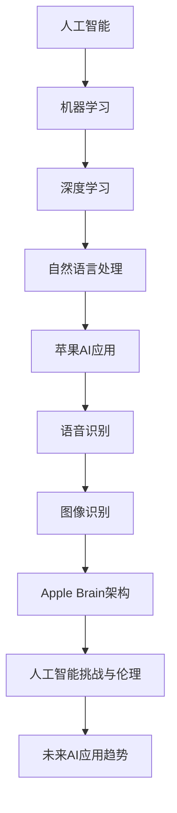

                 

### 《李开复：苹果发布AI应用的未来展望》

> **关键词：人工智能、苹果、AI应用、深度学习、伦理、未来趋势**

> **摘要：本文将探讨苹果公司在人工智能领域的应用及其未来展望。通过李开复的视角，分析苹果AI应用的现状、核心原理、挑战与伦理问题，并预测其未来发展趋势。**

### 第一部分：AI应用概述与未来展望

#### 1.1.1 AI应用的发展历程

##### 1.1.1.1 AI技术的起源与发展

人工智能（AI）的概念最早可以追溯到20世纪50年代，当时的计算机科学家们开始探索如何让机器具备人类智能。这一领域的发展经历了多个阶段，包括符号主义、感知主义和计算主义。近年来，随着深度学习技术的发展，AI应用逐渐从理论研究走向实际应用，涵盖了自然语言处理、图像识别、语音识别等多个领域。

##### 1.1.1.2 AI应用的关键趋势

当前，AI应用呈现出以下几个关键趋势：

1. **数据驱动**：AI模型的性能很大程度上取决于训练数据的质量和数量。因此，数据收集和数据分析成为AI应用的重要环节。
2. **自动化**：AI技术被广泛应用于自动化任务，如自动驾驶、智能客服等，极大地提高了生产效率和用户体验。
3. **边缘计算**：随着物联网（IoT）的发展，越来越多的AI应用在边缘设备上运行，实现实时响应和低延迟。
4. **人机协作**：AI技术不仅替代人类完成重复性工作，还与人类协作，共同解决复杂问题。

##### 1.1.1.3 李开复对AI应用的看法

李开复教授认为，AI应用的未来将更加紧密地融合到人们的日常生活中，成为人们生活的一部分。他指出，AI技术将在医疗、教育、金融、交通等领域发挥巨大作用，同时也会带来一系列挑战，如数据隐私、算法偏见等。

#### 1.1.2 苹果AI应用的背景与现状

##### 1.1.2.1 苹果公司的AI战略

苹果公司一直重视人工智能技术的发展，并将其作为公司战略的重要组成部分。近年来，苹果公司在AI领域的投入不断加大，推出了多项AI应用，如Siri、图片识别、语音识别等。

##### 1.1.2.2 苹果现有AI应用概览

1. **Siri**：苹果的智能语音助手，能够理解自然语言并进行回答。
2. **图片识别**：通过深度学习算法对照片进行分类和标注。
3. **语音识别**：将语音转换为文本，支持多种语言。
4. **面部识别**：使用人脸识别技术进行用户身份验证，如Face ID。

##### 1.1.2.3 李开复对苹果AI应用的展望

李开复教授认为，苹果公司在AI应用方面具有很大的潜力。他预计，苹果将在未来推出更多基于深度学习的AI应用，进一步提升用户体验。同时，他也指出，苹果需要关注AI伦理问题，确保AI技术的公平性和透明度。

### 第二部分：AI核心概念与原理

#### 2.2.1 人工智能基础

##### 2.2.1.1 机器学习基础

机器学习（ML）是AI的核心技术之一，通过训练模型来让计算机自动学习并做出决策。主要包含以下内容：

1. **监督学习**：有标记数据集进行训练，预测未知数据的结果。
2. **无监督学习**：没有标记数据集，发现数据中的模式和结构。
3. **强化学习**：通过与环境的交互来学习策略，达到最大化奖励。

##### 2.2.1.2 深度学习基础

深度学习（DL）是机器学习的一个分支，主要利用多层神经网络（DNN）来模拟人脑的神经结构，实现更加复杂的特征提取和分类任务。主要包含以下内容：

1. **神经网络基础**：神经元、激活函数、反向传播算法。
2. **卷积神经网络（CNN）**：用于图像识别和处理。
3. **循环神经网络（RNN）**：用于序列数据建模。

##### 2.2.1.3 自然语言处理基础

自然语言处理（NLP）是AI的重要应用领域之一，旨在让计算机理解和生成自然语言。主要包含以下内容：

1. **词向量表示**：将单词转化为向量表示。
2. **序列模型**：如RNN、LSTM、BERT等，用于处理文本序列。
3. **文本分类与情感分析**：对文本进行分类和情感分析。

#### 2.2.2 AI在苹果中的应用

##### 2.2.2.1 Siri的AI技术

Siri是苹果公司开发的智能语音助手，通过自然语言处理和机器学习技术实现与用户的交互。Siri的主要功能包括：

1. **语音识别**：将语音转换为文本。
2. **语义理解**：理解用户的意图和问题。
3. **语音合成**：将回答转换为语音输出。

##### 2.2.2.2 图片识别技术

苹果的图片识别技术利用深度学习算法，对照片进行分类、标注和搜索。主要功能包括：

1. **人脸识别**：识别照片中的人脸并进行标注。
2. **场景识别**：识别照片中的场景和物体。
3. **图像搜索**：根据标签和内容搜索相关照片。

##### 2.2.2.3 机器学习在苹果生态中的其他应用

除了Siri和图片识别，苹果还在其他产品中应用了机器学习技术，如：

1. **电池优化**：通过学习用户的习惯和需求，优化电池使用。
2. **面部解锁**：使用面部识别技术进行用户身份验证。
3. **智能推荐**：根据用户的使用习惯推荐内容和服务。

### 第三部分：AI应用的挑战与伦理

#### 3.3.1 AI应用的挑战

##### 3.3.1.1 数据隐私与安全

AI应用需要大量数据来进行训练和优化，这引发了数据隐私和安全的问题。如何保护用户数据，防止数据泄露和滥用，成为AI应用面临的重大挑战。

##### 3.3.1.2 人工智能偏见

AI模型在训练过程中可能受到数据偏见的影响，导致模型产生偏见。如何消除偏见，确保AI技术的公平性和透明度，是AI应用的重要挑战。

##### 3.3.1.3 李开复对AI挑战的应对策略

李开复教授认为，应对AI挑战需要从多个方面进行：

1. **加强数据保护**：制定严格的隐私保护政策，确保用户数据的合法合规使用。
2. **消除算法偏见**：通过数据清洗、模型校验等方法，降低算法偏见。
3. **加强监管和法规**：政府和企业应加强合作，共同推动AI技术的健康发展。

#### 3.3.2 AI伦理问题探讨

##### 3.3.2.1 AI伦理的重要性

AI伦理问题关系到AI技术的应用范围和影响，对人类社会的发展具有重要意义。关注AI伦理问题，确保AI技术的公平、透明和可解释性，是构建健康AI生态的关键。

##### 3.3.2.2 李开复提出的AI伦理原则

李开复教授提出了以下AI伦理原则：

1. **尊重人权**：确保AI技术不侵犯用户的隐私权和基本人权。
2. **公平公正**：消除算法偏见，确保AI技术的公平性和公正性。
3. **可解释性**：提高AI模型的透明度，确保用户能够理解模型的决策过程。
4. **责任归属**：明确AI技术的责任归属，确保在出现问题时能够追溯责任。

##### 3.3.2.3 AI伦理的实践与应用

AI伦理原则需要在实际应用中贯彻，李开复教授指出，可以从以下几个方面进行：

1. **数据治理**：建立数据治理框架，确保数据质量和合规使用。
2. **算法审计**：对AI算法进行定期审计，确保算法的公平性和透明度。
3. **伦理培训**：加强对开发者和使用者的伦理培训，提高他们的伦理意识。

### 第四部分：苹果发布AI应用的未来趋势

#### 4.4.1 未来AI应用的前景

##### 4.4.1.1 李开复对未来AI应用的预测

李开复教授认为，未来AI应用将更加智能化、个性化，与人类生活深度融合。以下是他的预测：

1. **智能健康**：AI技术将在医疗领域发挥重要作用，实现个性化诊疗和精准医疗。
2. **智能教育**：AI技术将助力个性化教学，提高教育质量和效率。
3. **智能交通**：AI技术将推动智能交通系统的发展，实现无人驾驶和智能调度。
4. **智能家居**：AI技术将使家居设备更加智能化，提高生活便利性和舒适度。

##### 4.4.1.2 苹果在未来AI应用中的战略布局

苹果公司将继续加大在AI领域的投入，以下是他们的战略布局：

1. **硬件升级**：推出更多搭载AI芯片的硬件产品，提升计算性能和功耗比。
2. **软件优化**：加强AI软件研发，提升AI应用的性能和用户体验。
3. **生态建设**：构建AI开发者生态，推动AI技术的创新和应用。
4. **合作共赢**：与其他公司合作，共同推动AI技术的发展和应用。

##### 4.4.1.3 AI应用对人类社会的影响

AI应用将对人类社会产生深远影响，李开复教授认为，以下方面是影响较大的领域：

1. **经济增长**：AI技术将推动经济增长，创造新的就业机会。
2. **社会公平**：AI技术将有助于解决社会不平等问题，提高社会福利。
3. **环境保护**：AI技术将推动环保技术的创新和应用，实现可持续发展。

#### 4.4.2 AI创新与创业

##### 4.4.2.1 李开复对AI创业者的建议

李开复教授对AI创业者提出以下建议：

1. **聚焦领域**：选择具有巨大市场潜力的领域，如医疗、教育、金融等。
2. **技术创新**：注重技术创新，提高产品竞争力。
3. **用户需求**：深入了解用户需求，提供真正有价值的产品和服务。
4. **跨界合作**：与其他行业和企业合作，实现优势互补。

##### 4.4.2.2 AI创业的实际案例分析

以下是一些成功的AI创业案例：

1. **医疗AI**：创业公司Zebra Medical Vision通过深度学习算法，实现了医学图像分析，为医生提供辅助诊断。
2. **金融AI**：创业公司Kiva通过AI技术，实现了自动化贷款审批和风险管理，为小型企业提供了低成本融资。
3. **教育AI**：创业公司Coursera通过在线教育平台，结合AI技术，实现了个性化教学和学习体验。

##### 4.4.2.3 创新与创业中的AI应用机遇与挑战

在AI创新与创业过程中，创业者将面临以下机遇和挑战：

1. **机遇**：AI技术为创业者提供了广阔的市场空间，可以创造巨大的商业价值。
2. **挑战**：创业者需要应对技术风险、市场风险和伦理风险，确保企业的可持续发展。

### 第五部分：深度学习与苹果AI应用

#### 5.5.1 深度学习基础

##### 5.5.1.1 深度学习原理

深度学习（Deep Learning）是一种人工智能（AI）的方法，它通过构建多层神经网络来模拟人类大脑的神经元结构和工作方式。以下是深度学习的基本原理：

1. **神经网络**：神经网络是由大量神经元（或节点）组成的有向图，每个神经元与相邻的神经元通过边相连。神经元之间的连接强度由权重（weight）表示。

2. **激活函数**：激活函数是神经网络中的一个关键组件，用于将输入映射到输出。常见的激活函数有sigmoid、ReLU、tanh等。

3. **反向传播**：反向传播算法是一种训练神经网络的方法，它通过计算输出与实际结果之间的误差，然后反向传播误差到每个神经元，更新神经元的权重。

4. **多层网络**：深度学习网络包含多个隐藏层，这些隐藏层能够自动学习数据的复杂特征。

##### 5.5.1.2 深度学习算法

深度学习算法包括多种类型，其中最常见的有：

1. **卷积神经网络（CNN）**：CNN主要用于图像处理，通过卷积层提取图像特征，并利用池化层降低计算复杂度。

2. **循环神经网络（RNN）**：RNN适用于序列数据建模，如时间序列数据、语音信号等。

3. **生成对抗网络（GAN）**：GAN是一种生成模型，通过两个对抗网络（生成器和判别器）的博弈来生成逼真的数据。

4. **变分自编码器（VAE）**：VAE是一种无监督学习模型，用于数据压缩和生成。

##### 5.5.1.3 深度学习在苹果AI应用中的应用

苹果公司在多个AI应用中采用了深度学习技术，以下是几个典型应用：

1. **Siri**：苹果的智能语音助手Siri使用了深度学习技术，通过语音识别和自然语言处理，实现与用户的对话交互。

2. **图片识别**：苹果的图片库应用使用了深度学习算法，能够自动分类、标记和搜索照片。

3. **面部识别**：苹果的Face ID功能利用深度学习算法进行面部识别，提供安全的用户身份验证。

#### 5.5.2 具体案例解析

##### 5.5.2.1 Apple Brain架构

Apple Brain是苹果公司研发的一个深度学习框架，用于构建和训练大规模神经网络。以下是Apple Brain的关键组成部分：

1. **神经网络编译器**：Apple Brain编译器能够将高级神经网络代码编译为低级机器码，提高执行效率。

2. **分布式训练**：Apple Brain支持分布式训练，可以在多台设备上并行训练模型，加快训练速度。

3. **动态推理**：Apple Brain在推理阶段能够根据设备性能动态调整模型参数，实现高效的实时推理。

##### 5.5.2.2 语音识别技术

苹果的语音识别技术使用了深度神经网络（DNN）和循环神经网络（RNN）来处理语音信号。以下是语音识别的关键步骤：

1. **声学模型**：声学模型用于将语音信号转换为特征向量，通过卷积神经网络（CNN）和长短时记忆网络（LSTM）提取声学特征。

2. **语言模型**：语言模型用于将声学特征转换为文本，通过RNN和双向RNN（Bi-RNN）处理上下文信息。

3. **解码器**：解码器将语言模型输出的概率分布转换为具体的文本输出。

##### 5.5.2.3 图像识别技术

苹果的图像识别技术使用了卷积神经网络（CNN）来识别图像中的对象和场景。以下是图像识别的关键步骤：

1. **特征提取**：通过卷积层和池化层提取图像的局部特征。

2. **特征融合**：将不同层级的特征进行融合，形成高层次的语义特征。

3. **分类与识别**：通过全连接层和softmax函数进行分类和识别。

### 第六部分：苹果AI应用的实践与未来

#### 6.6.1 实践案例

##### 6.6.1.1 苹果AI应用的实际使用案例

以下是苹果AI应用的一些实际使用案例：

1. **Siri智能助手**：用户可以通过语音命令控制Siri，实现打电话、发送消息、播放音乐、查询天气等功能。

2. **图片识别功能**：用户可以在照片应用中，使用图片识别功能自动分类和标记照片。

3. **面部识别解锁**：用户可以使用Face ID功能在iPhone、iPad等设备上进行解锁。

##### 6.6.1.2 李开复对苹果AI应用的评估

李开复教授对苹果AI应用给予了高度评价，他认为：

1. **技术领先**：苹果在AI技术上处于领先地位，其深度学习框架Apple Brain具有很强的竞争力。

2. **用户体验**：苹果AI应用的用户体验非常好，能够快速、准确地响应用户需求。

3. **创新性**：苹果在AI应用上不断创新，如Face ID、Animoji等，为用户提供了丰富的交互体验。

##### 6.6.1.3 用户对苹果AI应用的反馈

用户对苹果AI应用的反馈总体上是积极的，以下是一些用户反馈：

1. **智能助手Siri**：用户认为Siri功能强大，能够帮助完成各种任务，如查询信息、设置提醒等。

2. **面部识别Face ID**：用户对Face ID的准确性和安全性表示满意，认为比Touch ID更有优势。

3. **图片识别功能**：用户认为图片识别功能很方便，能够快速找到所需照片。

#### 6.6.2 未来展望

##### 6.6.2.1 李开复对苹果AI未来的展望

李开复教授对苹果AI未来的发展持乐观态度，他认为：

1. **技术创新**：苹果将继续加大在AI技术上的投入，推出更多创新性的AI应用。

2. **生态系统**：苹果将构建一个强大的AI开发者生态系统，鼓励开发者创造更多基于AI的应用。

3. **跨领域应用**：苹果AI将不仅限于智能手机，还将扩展到智能家居、健康、医疗等领域。

##### 6.6.2.2 苹果AI应用的潜在创新方向

以下是一些苹果AI应用的潜在创新方向：

1. **智能健康**：通过AI技术实现个性化健康监测和预警。

2. **智能交通**：通过AI技术实现智能交通管理和无人驾驶。

3. **智能教育**：通过AI技术实现个性化教育和智能教学。

##### 6.6.2.3 AI应用在苹果产品中的进一步扩展

未来，AI应用将在苹果产品中进一步扩展，包括：

1. **智能眼镜**：通过AI技术实现智能眼镜的交互和功能扩展。

2. **智能家居**：通过AI技术实现智能家居设备的智能交互和管理。

3. **健康监测设备**：通过AI技术实现健康监测设备的智能化和个性化。

### 附录

#### 附录 A：参考资料

##### A.1.1 主要参考文献

1. **Goodfellow, I., Bengio, Y., & Courville, A. (2016). Deep Learning. MIT Press.**
2. **Russell, S., & Norvig, P. (2020). Artificial Intelligence: A Modern Approach. Prentice Hall.**
3. **LeCun, Y., Bengio, Y., & Hinton, G. (2015). Deep Learning. Nature.**

##### A.1.2 李开复相关演讲与文章

1. **李开复. (2017). 人工智能的未来：机遇与挑战. 讲座视频.**
2. **李开复. (2018). 人工智能与未来社会. 文章.**

##### A.1.3 相关AI应用开发教程与资源

1. **苹果官方AI开发文档.**
2. **TensorFlow官方教程.**
3. **PyTorch官方教程.**

#### 附录 B：术语表

##### B.1.1 人工智能相关术语解释

1. **人工智能（AI）**：模拟人类智能的计算机系统。
2. **机器学习（ML）**：一种AI技术，通过训练模型自动学习。
3. **深度学习（DL）**：一种基于神经网络的ML方法。

##### B.1.2 深度学习相关术语解释

1. **卷积神经网络（CNN）**：一种用于图像处理和识别的神经网络。
2. **循环神经网络（RNN）**：一种用于序列数据建模的神经网络。
3. **生成对抗网络（GAN）**：一种生成模型。

##### B.1.3 自然语言处理相关术语解释

1. **词向量（Word Embedding）**：将单词映射到向量空间。
2. **序列模型（Sequence Model）**：用于处理序列数据的神经网络。
3. **情感分析（Sentiment Analysis）**：分析文本中的情感倾向。

#### 附录 C：Mermaid流程图



#### 附录 D：伪代码与数学模型

```python
# 伪代码：深度学习模型训练过程
function train_model(model, data, epochs):
    for epoch in 1 to epochs:
        for sample in data:
            prediction = model(sample)
            loss = calculate_loss(prediction, sample)
            model.update_weights(loss)

# 数学模型：神经网络损失函数
$$
J(\theta) = \frac{1}{2m} \sum_{i=1}^{m} (\hat{y_i} - y_i)^2
$$
其中，$\hat{y_i}$ 是预测值，$y_i$ 是真实值，$m$ 是样本数量。

# 数学模型：梯度下降算法
$$
\theta_j := \theta_j - \alpha \frac{\partial J(\theta)}{\partial \theta_j}
$$
其中，$\alpha$ 是学习率，$\theta_j$ 是模型的参数。
```

### 作者

作者：AI天才研究院/AI Genius Institute & 禅与计算机程序设计艺术 /Zen And The Art of Computer Programming

