                 

# 引言

## 1.1 AI与人类动机的探讨

在当今信息技术飞速发展的时代，人工智能（AI）作为计算机科学领域的前沿技术，已经深刻地改变了我们的生活方式。从自动驾驶汽车到智能语音助手，AI的应用场景无处不在。然而，对于人类而言，最大的挑战之一是如何理解和预测自己的行为和动机。人类动机是一个复杂的领域，涉及心理学、社会学、经济学等多个学科。近年来，随着AI技术的不断发展，利用AI来分析人类动机成为了研究的热点。

### 1.1.1 欲望的量化：定义与意义

欲望是驱动人类行为的重要力量。将其量化，即是将抽象的心理现象转化为可以量化的指标，从而更准确地分析和预测人类行为。欲望的量化不仅仅是统计上的简单计数，它涉及对人类行为背后的复杂心理过程的深度挖掘。这一过程的意义重大，不仅可以用于商业策略的制定，还可以为公共政策提供科学依据。

首先，欲望的量化有助于企业更好地了解消费者的需求，从而优化产品设计和服务。例如，通过分析消费者的购买行为和反馈，企业可以更精准地定位市场，提高营销效率。其次，在公共政策的制定过程中，欲望的量化可以揭示社会问题的根源，为政策调整提供依据。例如，通过对居民行为数据的分析，政府可以更有效地解决社会不平等和心理健康问题。

### 1.1.2 AI技术在人类动机研究中的应用前景

AI技术在人类动机研究中的应用前景广阔。首先，机器学习和深度学习算法可以处理大量复杂的数据，从中挖掘出潜在的模式和规律。这些模式和规律对于理解人类动机至关重要。其次，自然语言处理（NLP）技术的发展使得我们可以从文本数据中提取情感和意图，进一步分析人类的内心世界。最后，计算机视觉和传感器技术可以实时捕捉人类的行为和生理反应，为动机研究提供更加全面的数据支持。

总的来说，AI技术在人类动机研究中的应用不仅有助于我们更好地理解人类行为，还可以为相关领域的研究提供新的思路和方法。这使得欲望的量化成为可能，也为未来的研究奠定了基础。

## 1.2 AI在动机分析中的挑战

尽管AI技术在动机分析方面具有巨大潜力，但其应用过程中仍面临诸多挑战。首先，数据隐私问题是一个重要的障碍。人类行为数据往往涉及敏感信息，如何在保证数据隐私的同时进行有效的分析，是一个亟待解决的问题。其次，模型的解释性也是一个关键挑战。许多复杂的AI模型，尤其是深度学习模型，往往被形容为“黑箱”，其内部工作机制不透明，难以解释其预测结果。这限制了其在实际应用中的可接受性和可靠性。最后，跨领域适应性也是一大挑战。人类动机具有高度复杂性和多样性，不同领域之间的动机分析需求存在显著差异，如何设计通用且有效的模型，以适应不同领域的需求，是一个重要的研究课题。

### 1.2.1 数据隐私保护

数据隐私保护是AI在动机分析中面临的首要挑战之一。人类行为数据通常包含个人隐私信息，如位置、购物记录、社交媒体活动等。在分析这些数据时，如何确保个人隐私不被泄露，是一个关键问题。为此，研究者们提出了一系列数据隐私保护技术，如数据匿名化、差分隐私等。这些技术能够在一定程度上保护数据隐私，但仍需进一步优化和完善。

#### 1.2.1.1 数据匿名化

数据匿名化是一种常见的数据隐私保护方法。其核心思想是通过一定的算法和策略，将数据中的个人标识信息（如姓名、身份证号等）去除或替换，从而保护个人隐私。常见的数据匿名化技术包括：

- **K-匿名性**：数据集中的每个记录都不能被少于K个其他记录所唯一确定。K值越大，匿名性越强。
- **l-diversity**：数据集中每个类的记录数至少为l，且每个类的记录集合不能被少于K个其他记录集合所唯一确定。
- **t-closeness**：数据集中每个记录的邻近记录集合的大小不能少于t。

#### 1.2.1.2 差分隐私

差分隐私是一种更为严格的数据隐私保护方法。其核心思想是在数据分析过程中引入噪声，使得数据分析结果对于单个记录的变化不敏感。具体来说，差分隐私通过计算差分隐私因子（ε）来衡量隐私保护程度。ε值越大，隐私保护越强。

差分隐私的基本原理可以概括为以下步骤：

1. **采样**：从原始数据中随机采样一定数量的数据点。
2. **计算输出**：对采样数据进行分析，得到输出结果。
3. **添加噪声**：在输出结果上添加随机噪声，以掩盖具体数据点的影响。

差分隐私的主要算法包括：

- **拉普拉斯机制**：通过对输出结果添加拉普拉斯噪声来实现差分隐私。
- **指数机制**：通过对输出结果添加指数噪声来实现差分隐私。

#### 1.2.1.3 混合隐私保护策略

在实际应用中，单一的数据隐私保护方法往往难以满足不同场景的需求。因此，研究者们提出了多种混合隐私保护策略，以实现更全面的数据隐私保护。常见的混合隐私保护策略包括：

- **多层次的隐私保护**：结合多种隐私保护方法，构建多层次的隐私保护机制。
- **动态隐私保护**：根据数据分析和隐私需求的变化，动态调整隐私保护策略。
- **基于区块链的隐私保护**：利用区块链的分布式特性，实现数据的安全存储和隐私保护。

### 1.2.2 模型解释性

模型解释性是AI在动机分析中面临的另一大挑战。许多复杂的AI模型，尤其是深度学习模型，具有很高的预测能力，但其内部工作机制往往不透明，难以解释。这限制了模型在实际应用中的可接受性和可靠性。为了提高模型解释性，研究者们提出了一系列方法，如模型可解释性分析、模型可视化、局部解释等。

#### 1.2.2.1 模型可解释性分析

模型可解释性分析是通过分析模型的结构和参数，理解模型的预测过程。常见的方法包括：

- **模型结构分析**：通过分析模型的层次结构，了解模型的工作原理。
- **参数分析**：通过分析模型的参数，理解模型对输入数据的依赖关系。

#### 1.2.2.2 模型可视化

模型可视化是通过图形化的方式展示模型的结构和参数，帮助用户理解模型的预测过程。常见的方法包括：

- **网络图可视化**：通过绘制模型的网络结构图，展示模型的层次和连接关系。
- **参数分布图**：通过绘制模型参数的分布图，展示模型的参数范围和变化趋势。

#### 1.2.2.3 局部解释

局部解释是通过解释模型在特定输入数据上的预测过程，帮助用户理解模型的局部行为。常见的方法包括：

- **LIME（Local Interpretable Model-agnostic Explanations）**：通过在小范围内重新训练模型，生成可解释的局部解释。
- **SHAP（SHapley Additive exPlanations）**：通过计算模型参数对输入数据的贡献，生成全局和局部的解释。

### 1.2.3 跨领域适应性

跨领域适应性是AI在动机分析中面临的又一挑战。不同领域的动机分析需求存在显著差异，如何设计通用且有效的模型，以适应不同领域的需求，是一个重要的研究课题。为了提高模型的跨领域适应性，研究者们提出了一系列方法，如领域自适应学习、跨领域迁移学习等。

#### 1.2.3.1 领域自适应学习

领域自适应学习是通过调整模型，使其在不同领域上表现一致。常见的方法包括：

- **领域分类器**：通过训练领域分类器，识别和调整不同领域的特征。
- **领域自适应正则化**：通过添加领域自适应正则化项，平衡模型在不同领域上的表现。

#### 1.2.3.2 跨领域迁移学习

跨领域迁移学习是通过利用源领域上的预训练模型，迁移到目标领域上。常见的方法包括：

- **迁移学习框架**：通过构建迁移学习框架，实现模型在不同领域上的迁移。
- **多任务学习**：通过同时训练多个任务，提高模型在不同领域上的泛化能力。

### 1.2.4 挑战与未来发展方向

尽管AI在动机分析中面临诸多挑战，但这些问题也为未来的研究提供了丰富的机会。以下是未来发展的几个方向：

- **隐私保护技术的优化**：进一步优化隐私保护技术，提高数据隐私保护水平。
- **模型解释性的提升**：开发更有效的模型解释方法，提高模型的可解释性和透明度。
- **跨领域适应性增强**：探索新的方法，提高模型在不同领域上的适应性和泛化能力。

总的来说，AI在动机分析中的应用前景广阔，但同时也面临诸多挑战。未来的研究需要综合运用多种技术和方法，以克服这些挑战，推动AI在动机分析领域的发展。

## 1.3 本书结构安排与学习目标

本书旨在系统地介绍AI技术在人类动机分析中的应用，从基础理论到实际应用，全面解析这一领域的核心概念和技术。全书分为四个部分，分别从基础理论、方法与实践、应用案例和结论与展望四个方面展开。

### 第一部分：基础理论篇

本部分将介绍人类动机心理学基础、AI技术基础以及AI在动机分析中的应用。读者将了解人类动机的定义、分类和常见理论，以及AI技术的基本原理和发展历程。此外，还将探讨机器学习和深度学习在动机分析中的应用，为后续实践篇奠定基础。

### 第二部分：方法与实践篇

本部分将详细阐述数据采集与预处理、模型构建与优化、模型评估与解释等关键步骤。通过具体的案例和实践，读者将学习如何利用AI技术分析人类动机，掌握从数据采集到模型部署的全过程。

### 第三部分：应用案例篇

本部分将通过具体的案例，展示AI技术在动机分析中的应用。读者将看到如何利用AI技术解决实际问题，从社交媒体情感分析到电商用户行为预测，涵盖多个应用场景。

### 第四部分：结论与展望

本部分将总结全书的主要内容，分析当前存在的问题与挑战，并对未来发展方向进行展望。通过本部分的学习，读者将了解AI在动机分析领域的最新研究动态和未来趋势。

### 学习目标

通过本书的学习，读者将达到以下目标：

- **理解人类动机的定义、分类和理论**：掌握人类动机的基本概念和心理学理论基础。
- **掌握AI技术的基本原理和应用**：了解AI技术的发展历程、核心技术以及其在动机分析中的应用。
- **掌握动机分析的实践方法**：学会从数据采集、预处理到模型构建与优化的全过程。
- **了解动机分析的应用案例**：通过实际案例，掌握如何利用AI技术解决具体问题。
- **把握未来发展方向**：了解动机分析领域的最新研究动态和未来趋势，为未来的研究工作做好准备。

总的来说，本书将为读者提供一整套系统的学习框架，帮助读者深入理解和应用AI技术在动机分析中的强大能力。

## 1.4 总结

本引言部分主要探讨了AI技术在人类动机分析中的应用及其面临的挑战。通过分析欲望的量化、AI技术在动机研究中的应用前景，以及数据隐私保护、模型解释性和跨领域适应性等挑战，我们为后续内容奠定了基础。在接下来的章节中，我们将进一步探讨人类动机心理学基础、AI技术基础以及AI在动机分析中的具体应用。通过系统地介绍这些内容，读者将能够全面了解AI技术在动机分析领域的实际应用和价值。

---

## 1.4.1 文章关键词

AI，人类动机，欲望量化，机器学习，深度学习，数据隐私保护，模型解释性，跨领域适应性。

## 1.4.2 文章摘要

本文系统地探讨了人工智能（AI）在人类动机分析中的应用。首先，介绍了欲望的量化及其在动机研究中的意义。接着，分析了AI技术在动机分析中的前景，并探讨了数据隐私保护、模型解释性和跨领域适应性等挑战。随后，详细介绍了人类动机心理学基础、AI技术基础以及AI在动机分析中的实际应用。通过具体案例，展示了AI技术在社交媒体情感分析和电商用户行为预测等领域的应用。最后，总结了研究成果，提出了当前存在的问题与挑战，并对未来发展方向进行了展望。本文为AI在动机分析领域的研究和应用提供了全面的理论和实践指导。

---

## 1.5 本章结语

本章节作为引言，为后续内容奠定了基础。通过分析AI技术在人类动机分析中的应用及其面临的挑战，我们为读者揭示了这一领域的广阔前景和潜在困难。在接下来的章节中，我们将深入探讨人类动机心理学基础、AI技术基础以及AI在动机分析中的具体应用。通过系统的学习和实践，读者将能够更全面地理解AI技术在动机分析中的价值，并掌握相关技术的方法和实践。希望读者能够跟上接下来的内容，共同探索这一激动人心的研究领域。

---

## 第二部分：基础理论篇

### 2.1 人类动机心理学基础

人类动机是心理学研究的一个重要领域，它探讨个体行为的驱动力，即是什么因素促使人们做出特定的行为选择。在理解人类动机的基础上，我们可以更好地预测和指导个体的行为，从而在多个领域（如教育、商业、公共政策等）中取得更好的效果。

#### 2.1.1 人类动机概述

人类动机是指驱使人们采取特定行动的内在动力。它是一个复杂且多维度的概念，通常涉及多个层次，包括生理需求、安全需求、社交需求、尊重需求和自我实现需求等。不同的动机在不同的情境下可能占据主导地位，影响个体的决策和行为。

#### 2.1.1.1 人类动机的定义与分类

人类动机可以定义为个体为了满足某种需求或目标而采取行动的心理状态。动机通常分为以下几种类型：

- **基本动机**：这些动机与人类的生存和繁衍密切相关，如饥饿、口渴、性和睡眠等。
- **社会动机**：这些动机涉及个体与他人互动的需求，如归属感、社交、合作和竞争等。
- **成就动机**：这些动机与个体追求成就、成功和成长有关，如求知、创新、竞争和自我提升等。
- **自我实现动机**：这些动机与个体的自我发展和实现潜能有关，如自我认知、自我表达、自我决定和自我实现等。

#### 2.1.1.2 常见的人类动机理论

心理学界提出了多种动机理论，以下是其中几种主要理论：

- **马斯洛的需求层次理论**：该理论将人类需求分为五个层次，从基本的生理需求到最高级的自我实现需求。根据这一理论，个体的行为是由当前最紧迫的需求驱动的。
- **弗洛伊德的动机理论**：弗洛伊德认为人类行为主要受潜意识动机的驱动，包括生本能和死本能。这些动机通过心理防御机制影响个体的行为。
- **ERG理论**：奥尔德弗（Clayton Alderfer）的ERG理论扩展了马斯洛的需求层次理论，认为人们可以同时追求多种需求，而不是依次满足。
- **自我决定理论**：德西（Ryan）和瑞恩（Deci）的自我决定理论强调自主性、能力和关系在动机中的作用，认为这些因素是自我决定行为的关键驱动力。

#### 2.1.2 人类行为分析

人类行为分析是动机心理学研究的重要组成部分，它旨在通过观察和分析个体的行为模式，理解行为的产生机制。行为分析通常涉及以下几个方面：

- **行为心理学的基本原理**：行为心理学认为行为是环境和个体内部状态相互作用的结果。行为分析的关键在于识别和测量这些因素。
- **行为分析的数据来源**：行为分析的数据来源多样，包括自我报告、观察记录、行为记录等。自我报告通常通过问卷和访谈收集，而观察记录则通过直接观察个体的行为表现获得。

#### 2.1.2.1 行为心理学的基本原理

行为心理学的基本原理包括：

- **刺激-反应理论**：这一理论认为行为是刺激（S）和反应（R）之间的直接关系。即行为的产生是由外部刺激引起的。
- **强化理论**：强化理论强调行为是通过奖励和惩罚来调节的。奖励增加行为的频率，而惩罚减少行为的频率。
- **自我调节理论**：自我调节理论认为个体可以通过自我监控、自我指导和自我反馈来调节自己的行为。

#### 2.1.2.2 行为分析的数据来源

行为分析的数据来源主要包括以下几种：

- **自我报告数据**：个体通过填写问卷或进行访谈，自我报告他们的行为、感受和动机。这种方法具有主观性，但可以提供个体内在状态的直接信息。
- **观察数据**：通过直接观察个体的行为，研究人员可以记录和测量具体的行动和行为模式。这种方法通常用于实验室设置或自然环境中。
- **行为记录数据**：使用各种设备和技术记录个体的行为，如穿戴式传感器、GPS记录器等。这些数据提供了客观且详细的行为信息。

#### 2.1.3 人类动机在AI分析中的应用

随着人工智能技术的发展，人类动机分析的应用场景日益广泛。AI在人类动机分析中的应用主要包括以下几个方面：

- **情感分析**：通过自然语言处理技术，AI可以分析文本中的情感和意图，了解个体的情绪状态和动机。
- **行为预测**：利用机器学习和深度学习算法，AI可以从历史行为数据中预测个体的未来行为，为决策提供支持。
- **个性化推荐**：基于对个体行为和动机的分析，AI可以提供个性化的推荐和服务，提高用户体验和满意度。

#### 2.1.3.1 情感分析

情感分析是一种自然语言处理技术，用于识别文本中的情感倾向。通过情感分析，AI可以理解个体的情感状态，从而更好地预测其动机和行为。情感分析的关键技术包括：

- **情感分类**：将文本分为正面、负面或中性情感类别。
- **情感强度评估**：评估文本中情感表达的程度。
- **情感识别**：识别特定情感类别，如快乐、悲伤、愤怒等。

#### 2.1.3.2 行为预测

行为预测是AI在动机分析中的另一个重要应用。通过分析个体的历史行为数据，AI可以预测其未来的行为模式。行为预测的关键技术包括：

- **时间序列分析**：分析时间序列数据，预测未来的行为。
- **分类和回归模型**：使用分类和回归模型预测个体的行为类别或行为值。
- **神经网络模型**：使用深度学习神经网络进行复杂的行为预测。

#### 2.1.3.3 个性化推荐

个性化推荐是基于对个体行为和动机的分析，为用户提供个性化的推荐。个性化推荐的关键技术包括：

- **协同过滤**：通过分析用户的历史行为，预测用户可能感兴趣的内容。
- **内容推荐**：基于内容属性，为用户推荐相关内容。
- **混合推荐系统**：结合协同过滤和内容推荐，提供更准确的个性化推荐。

总的来说，人类动机分析在AI中的应用不仅有助于理解人类行为，还可以为多个领域提供决策支持，从而推动人工智能技术的进一步发展。

### 2.2 AI技术基础

人工智能（AI）是计算机科学的一个分支，它涉及通过计算机程序模拟人类智能行为的研究。AI技术的发展已经使得计算机能够在视觉识别、语音识别、自然语言处理、决策制定等方面表现出类似人类的智能。本节将介绍AI的基本概念、发展历程和核心技术，以及这些技术如何应用于动机分析。

#### 2.2.1 AI概述

AI的定义和范围随着时间的推移而不断扩展。AI的基本定义是：使计算机系统能够执行通常需要人类智能才能完成的任务。这些任务包括但不限于问题解决、决策制定、语言理解、图像识别和翻译等。

#### 2.2.1.1 AI的定义与发展历程

AI的定义可以从不同角度进行理解，但通常可以概括为以下几点：

- **广义AI**：广义AI指的是具有全面智能的机器，能够执行各种认知任务，如推理、学习、理解和自然语言交流等。
- **狭义AI**：狭义AI则是指能够解决特定问题的智能系统，如图像识别、语音识别和自动化决策系统。

AI的发展历程可以追溯到20世纪50年代，当时的科学家和研究者开始探索如何使计算机表现出智能行为。以下是AI发展历程中的重要里程碑：

1. **1950年**：艾伦·图灵（Alan Turing）提出了图灵测试，用于评估机器是否具有人类智能。
2. **1956年**：达赖尔·霍普（Daryll Hall）和约翰·麦卡锡（John McCarthy）等人提出了“人工智能”这一术语，并举办了首届人工智能研讨会。
3. **1970年代**：AI经历了第一次寒冬，由于对AI能力的过高预期和计算资源的限制，许多AI项目失败。
4. **1980年代**：专家系统成为AI研究的热点，这些系统能够模拟专家的知识和推理能力。
5. **1990年代**：机器学习和数据挖掘技术的发展使得AI在模式识别和数据分析方面取得了显著进展。
6. **2000年代**：深度学习和神经网络技术的发展再次推动了AI的进步，尤其是在图像识别、语音识别和自然语言处理方面。
7. **2010年代**：随着计算能力的提升和数据量的增加，AI在各个领域（如自动驾驶、医疗诊断、金融分析等）都取得了突破性进展。

#### 2.2.1.2 AI的核心技术

AI的核心技术包括机器学习、深度学习、自然语言处理和计算机视觉等。以下是这些技术的简要概述：

- **机器学习**：机器学习是AI的基础，它通过算法从数据中学习规律，并用于预测和决策。常见的机器学习算法包括线性回归、决策树、支持向量机和随机森林等。
- **深度学习**：深度学习是机器学习的一个子领域，它通过多层神经网络学习数据的复杂模式。深度学习在图像识别、语音识别和自然语言处理等领域表现尤为出色。常见的深度学习模型包括卷积神经网络（CNN）和循环神经网络（RNN）。
- **自然语言处理（NLP）**：NLP是AI的一个分支，它涉及计算机对人类语言的理解和处理。NLP技术包括文本分类、情感分析、机器翻译和语音识别等。
- **计算机视觉**：计算机视觉是AI用于理解和解释图像和视频内容的技术。它包括图像识别、目标检测、图像分割和视频处理等。

#### 2.2.2 机器学习基础

机器学习是AI的核心技术之一，它使计算机系统能够从数据中自动学习和改进性能。以下是机器学习的基本概念、常见算法和应用场景。

##### 2.2.2.1 机器学习的基本概念

机器学习可以分为监督学习、无监督学习和强化学习三种类型：

- **监督学习**：监督学习是一种通过训练数据学习映射关系的方法。输入和输出都有已知标签，算法的目标是学习输入和输出之间的映射关系。
- **无监督学习**：无监督学习不使用标签数据，算法的目标是发现数据中的内在结构和规律。
- **强化学习**：强化学习是一种通过与环境交互来学习最优策略的方法。算法通过不断尝试和错误，逐渐学会在特定环境中做出最佳决策。

##### 2.2.2.2 常见的机器学习算法

常见的机器学习算法包括：

- **线性回归**：线性回归是一种用于预测连续值的算法，它通过拟合一条直线来描述输入和输出之间的关系。
- **决策树**：决策树是一种树形结构，用于分类和回归任务。每个节点代表一个特征，每个分支代表一个特征值，叶子节点代表决策结果。
- **支持向量机（SVM）**：SVM是一种分类算法，它通过寻找最佳超平面来分离不同类别的数据点。
- **随机森林**：随机森林是一种基于决策树的集成学习方法，它通过构建多个决策树并汇总它们的预测结果来提高预测准确性。
- **神经网络**：神经网络是一种模拟人脑的算法，它通过多层神经元进行数据处理和决策。常见的神经网络包括前馈神经网络和卷积神经网络。

##### 2.2.2.3 机器学习在动机分析中的应用

机器学习在动机分析中的应用非常广泛。以下是一些应用场景：

- **情感分析**：通过分析文本数据中的情感和意图，机器学习可以帮助理解个体的情感状态和动机。
- **行为预测**：通过分析历史行为数据，机器学习可以预测个体的未来行为，为决策提供支持。
- **个性化推荐**：通过分析用户的行为和偏好，机器学习可以提供个性化的推荐和服务，提高用户体验和满意度。

#### 2.2.3 深度学习原理

深度学习是机器学习的一个子领域，它通过多层神经网络学习数据的复杂模式。深度学习在图像识别、语音识别和自然语言处理等领域表现尤为出色。以下是深度学习的基本原理、常见模型和训练方法。

##### 2.2.3.1 深度学习的定义与发展

深度学习起源于20世纪40年代，当时神经网络的概念首次被提出。然而，由于计算资源和数据集的限制，深度学习的发展在20世纪80年代到90年代几乎停滞。随着计算能力的提升和大数据的普及，深度学习在21世纪迎来了复兴。

##### 2.2.3.2 常见的深度学习模型

常见的深度学习模型包括：

- **卷积神经网络（CNN）**：CNN是一种用于图像识别和图像处理的神经网络，它通过卷积层提取图像的特征。
- **循环神经网络（RNN）**：RNN是一种用于序列数据处理的神经网络，它通过循环结构保留序列的历史信息。
- **长短期记忆网络（LSTM）**：LSTM是一种改进的RNN，它通过门控机制解决长期依赖问题。
- **生成对抗网络（GAN）**：GAN是一种生成模型，它通过对抗训练生成逼真的数据。

##### 2.2.3.3 深度学习训练方法

深度学习训练方法主要包括：

- **反向传播算法**：反向传播算法是一种用于计算神经网络损失函数梯度的算法，它是深度学习训练的核心。
- **随机梯度下降（SGD）**：随机梯度下降是一种优化算法，它通过随机选择训练数据的一个子集来更新网络参数。
- **动量（Momentum）**：动量是一种加速梯度下降的方法，它通过保留以前的梯度信息来加速收敛。
- **学习率调整**：学习率调整是一种控制梯度下降收敛速度的方法，它通过动态调整学习率来避免过拟合和欠拟合。

#### 2.2.4 AI在动机分析中的应用

AI在动机分析中的应用主要集中在情感分析、行为预测和个性化推荐等方面。以下是这些应用的具体实现和效果。

##### 2.2.4.1 情感分析

情感分析是AI在动机分析中的一个重要应用。它通过自然语言处理技术，分析文本中的情感倾向，如正面、负面或中性情感。情感分析可以帮助企业了解消费者的情感状态，从而制定更有效的营销策略。

- **技术实现**：情感分析通常使用文本分类算法，如支持向量机（SVM）和朴素贝叶斯分类器（Naive Bayes）。深度学习模型，如卷积神经网络（CNN）和循环神经网络（RNN），也可以用于情感分析，以提高分类准确性。
- **效果评估**：情感分析的效果可以通过准确率、召回率和F1分数等指标进行评估。在实际应用中，情感分析可以帮助企业提高客户满意度，优化产品和服务。

##### 2.2.4.2 行为预测

行为预测是AI在动机分析中的另一个重要应用。通过分析历史行为数据，AI可以预测个体的未来行为，如购买行为、浏览行为和互动行为。

- **技术实现**：行为预测通常使用时间序列分析、分类和回归模型。深度学习模型，如长短期记忆网络（LSTM）和卷积神经网络（CNN），也可以用于行为预测，以提高预测准确性。
- **效果评估**：行为预测的效果可以通过预测准确率和预测误差等指标进行评估。在实际应用中，行为预测可以帮助企业优化营销策略，提高用户留存率和转化率。

##### 2.2.4.3 个性化推荐

个性化推荐是基于用户行为和偏好，为用户提供个性化推荐的一种方法。个性化推荐可以应用于电子商务、社交媒体和在线媒体等多个领域。

- **技术实现**：个性化推荐通常使用协同过滤算法和基于内容的推荐方法。深度学习模型，如循环神经网络（RNN）和生成对抗网络（GAN），也可以用于个性化推荐，以提高推荐准确性。
- **效果评估**：个性化推荐的效果可以通过推荐准确率和用户满意度等指标进行评估。在实际应用中，个性化推荐可以帮助企业提高用户参与度和忠诚度，增加销售额和用户黏性。

总的来说，AI技术在动机分析中的应用为理解和预测人类行为提供了新的方法和工具。通过情感分析、行为预测和个性化推荐等应用，AI可以帮助企业更好地了解用户需求，优化产品和服务，提高市场竞争力。

### 2.3 AI在动机分析中的应用

随着人工智能（AI）技术的不断发展，其在心理学和动机分析领域的应用也越来越广泛。通过利用AI技术，研究者们能够更深入地理解人类动机，从而为商业策略、公共政策和社会管理提供有力支持。以下是AI在动机分析中的一些具体应用。

#### 2.3.1 情感分析

情感分析是AI在动机分析中的一个重要应用。它通过自然语言处理技术，分析文本数据中的情感倾向，如正面情感、负面情感或中性情感。情感分析可以帮助企业了解消费者的情感状态，从而优化营销策略。

- **技术实现**：情感分析通常采用机器学习和深度学习算法，如卷积神经网络（CNN）和循环神经网络（RNN）。这些算法可以从大量的文本数据中学习情感模式，并将其应用于新的文本数据。

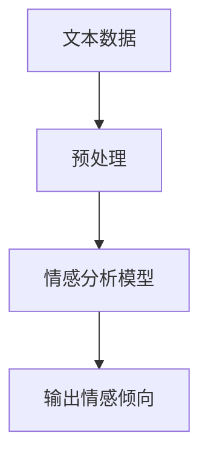

- **示例**：假设一个电商网站需要了解用户对其产品评论的情感倾向，可以利用情感分析模型对用户的评论进行分析。例如，对于一条评论“这个产品非常好用，我非常喜欢它！”，模型可以识别出这条评论是正面的。

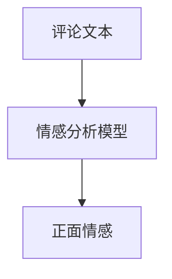

#### 2.3.2 行为预测

行为预测是AI在动机分析中的另一个重要应用。通过分析个体的历史行为数据，AI可以预测其未来的行为模式，如购买行为、浏览行为和互动行为。行为预测可以帮助企业优化营销策略，提高用户留存率和转化率。

- **技术实现**：行为预测通常采用时间序列分析和机器学习算法，如线性回归和随机森林。深度学习模型，如长短期记忆网络（LSTM）和卷积神经网络（CNN），也可以用于复杂的行为预测。

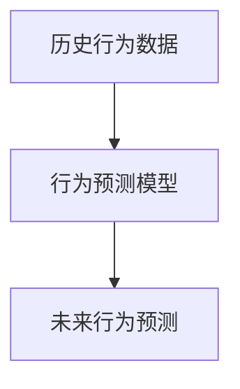

- **示例**：假设一个电商网站需要预测用户在未来的购买行为，可以利用行为预测模型分析用户的历史购物数据。例如，如果一个用户在过去一个月内频繁浏览某款产品，模型可以预测该用户在未来可能购买这款产品。

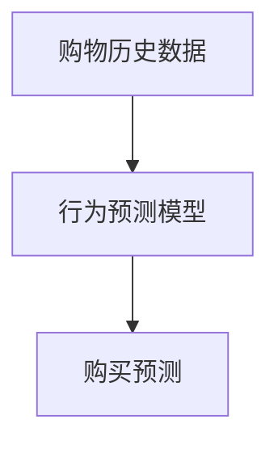

#### 2.3.3 个性化推荐

个性化推荐是基于用户行为和偏好，为用户提供个性化推荐的一种方法。个性化推荐可以应用于电子商务、社交媒体和在线媒体等多个领域。

- **技术实现**：个性化推荐通常采用协同过滤算法和基于内容的推荐方法。深度学习模型，如循环神经网络（RNN）和生成对抗网络（GAN），也可以用于个性化推荐，以提高推荐准确性。

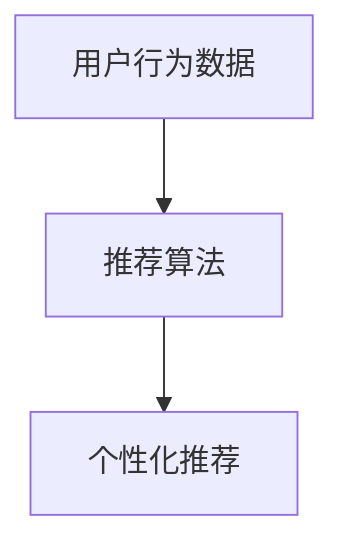

- **示例**：假设一个电商网站需要为用户推荐商品，可以利用个性化推荐算法分析用户的购物历史和浏览行为。例如，如果一个用户经常购买运动鞋，系统可以推荐其他运动鞋或相关的体育用品。

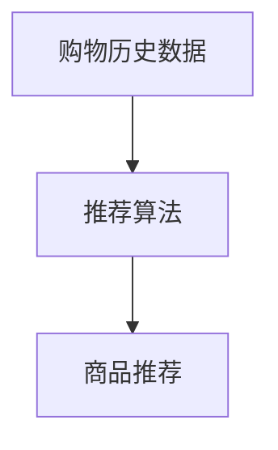

总的来说，AI在动机分析中的应用不仅可以帮助企业更好地了解用户需求，还可以优化产品和服务，提高用户满意度和忠诚度。随着AI技术的不断进步，其在动机分析领域的应用前景将更加广阔。

### 2.4 情感分析

情感分析是人工智能（AI）在自然语言处理（NLP）领域中的一个重要应用。它旨在通过计算机程序自动识别文本中的情感和情绪，从而为多种应用场景提供数据支持。情感分析通常涉及以下关键技术和方法。

#### 2.4.1 基本原理

情感分析的基本原理是通过分析文本中的词汇、语法和语义信息，识别文本的情感极性（如正面、负面或中性情感）以及情感强度（如极强、较强、较弱或无情感）。情感分析可以应用于多种文本数据，包括社交媒体评论、产品评论、新闻报道和在线论坛等。

#### 2.4.2 关键技术

1. **情感分类**：情感分类是将文本分为正面、负面或中性情感类别的过程。常见的技术包括基于规则的方法、机器学习方法（如朴素贝叶斯、支持向量机（SVM）和深度学习模型（如卷积神经网络（CNN）和循环神经网络（RNN））。

2. **情感强度评估**：情感强度评估旨在量化文本中的情感程度。这通常通过计算情感得分或标签来实现，这些得分或标签反映了情感的积极或消极程度。

3. **情感识别**：情感识别是识别文本中特定情感类别（如快乐、悲伤、愤怒等）的过程。这通常需要更复杂的NLP技术和模型，如长短期记忆网络（LSTM）和生成对抗网络（GAN）。

#### 2.4.3 应用场景

情感分析在多个领域具有广泛的应用，包括：

- **市场研究**：通过分析消费者的评论和反馈，企业可以了解消费者的情感倾向，从而优化产品和服务。
- **品牌监测**：企业可以利用情感分析监控社交媒体上的品牌提及，了解公众对品牌的情感反应，及时调整营销策略。
- **客户服务**：情感分析可以帮助客户服务团队快速识别客户问题的情感状态，提供更个性化的解决方案。
- **社交媒体分析**：通过分析社交媒体上的情感趋势，研究者可以了解公众对特定事件或话题的情感反应。

#### 2.4.4 案例研究

以下是一个简单的情感分析案例研究：

- **案例背景**：一家电商公司希望了解其新推出的产品在消费者中的情感反应。
- **数据收集**：公司收集了1000条消费者对该产品的评论。
- **数据预处理**：对评论进行文本清洗，去除标点符号、停用词等，并进行词干提取和词性标注。
- **情感分类模型训练**：使用机器学习算法（如朴素贝叶斯和SVM）训练情感分类模型，对评论进行分类。
- **情感强度评估**：使用LSTM模型对情感强度进行评估，为每条评论分配一个情感强度得分。
- **结果分析**：分析情感分类和情感强度评估的结果，了解消费者对新产品的整体情感反应。
- **策略调整**：基于分析结果，公司可以调整产品设计和营销策略，以提高消费者满意度。

通过情感分析，企业可以更好地理解消费者需求和市场趋势，从而实现更精准的市场定位和营销策略。

### 2.5 行为预测

行为预测是人工智能（AI）在动机分析领域的一个重要应用。通过分析个体的历史行为数据，AI可以预测个体未来的行为模式，从而为决策提供有力支持。以下将介绍行为预测的基本原理、关键技术以及其在实际应用中的具体实现。

#### 2.5.1 基本原理

行为预测的基本原理是通过分析历史数据中的模式和趋势，预测未来的行为。这通常涉及以下几个关键步骤：

1. **数据收集**：收集个体的历史行为数据，如购买记录、浏览记录、社交媒体互动等。
2. **数据预处理**：对收集到的数据进行分析和清洗，去除无效数据、处理缺失值和异常值。
3. **特征提取**：从原始数据中提取对行为预测有重要影响的特征，如时间间隔、行为频率、用户行为模式等。
4. **模型训练**：使用机器学习算法对训练数据进行模型训练，学习历史数据中的行为模式和趋势。
5. **预测**：使用训练好的模型对新的数据进行行为预测。

#### 2.5.2 关键技术

行为预测涉及多种机器学习和统计方法，以下是其中一些关键技术：

1. **时间序列分析**：时间序列分析是一种用于分析时间序列数据的统计方法，通过识别时间序列中的趋势、周期性和季节性，预测未来的行为。

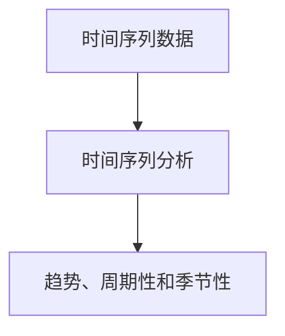

2. **分类和回归模型**：分类模型用于预测离散的行为类别，如是否购买、是否浏览等；回归模型用于预测连续的行为值，如购买金额、浏览时长等。

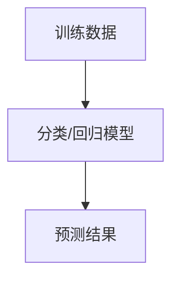

3. **神经网络模型**：神经网络模型，特别是深度学习模型（如长短期记忆网络（LSTM）和卷积神经网络（CNN）），可以用于处理复杂的非线性关系，提高行为预测的准确性。

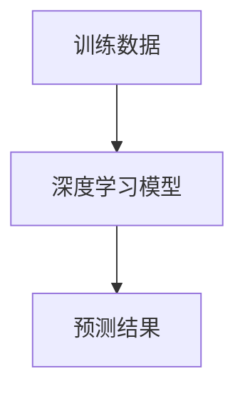

4. **强化学习**：强化学习是一种通过与环境交互来学习最优策略的方法，可以用于预测和优化复杂的行为。

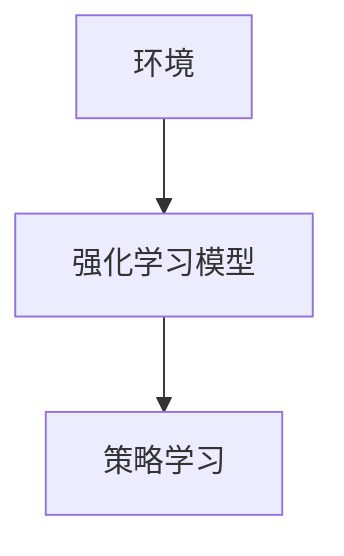

#### 2.5.3 实际应用

行为预测在实际应用中具有广泛的应用，以下是一些具体的应用场景：

1. **电子商务**：电商平台可以通过行为预测，了解用户的购买意图，提供个性化的产品推荐，提高销售额和用户满意度。

2. **在线广告**：广告平台可以通过行为预测，预测用户对广告的点击概率，优化广告投放策略，提高广告效果。

3. **金融行业**：金融机构可以通过行为预测，预测客户的金融行为，如贷款申请、信用卡使用等，为风险管理提供支持。

4. **交通管理**：交通管理部门可以通过行为预测，预测交通流量和事故发生概率，优化交通管理和应急响应。

以下是一个简单的行为预测案例：

- **案例背景**：一家电商网站希望通过行为预测，了解用户在未来一周内的购买行为。
- **数据收集**：收集用户过去一个月的购买记录。
- **数据预处理**：清洗数据，提取购买频率、购买金额等特征。
- **模型训练**：使用随机森林模型训练行为预测模型。
- **预测**：使用训练好的模型预测用户在未来一周内的购买行为。
- **结果分析**：分析预测结果，为营销策略提供参考。

通过行为预测，企业可以更好地了解用户需求和行为，优化产品和服务，提高用户满意度和忠诚度。

### 2.6 社交媒体情感分析

社交媒体情感分析是AI技术在动机分析中的重要应用之一。通过分析社交媒体平台上的用户评论、帖子等内容，AI可以识别出用户表达的情感倾向，从而为企业提供宝贵的市场洞察。以下将详细探讨社交媒体情感分析的基本原理、实现方法和实际案例。

#### 2.6.1 基本原理

社交媒体情感分析的基本原理是利用自然语言处理（NLP）和机器学习技术，对文本数据进行情感分类和情感强度评估。情感分类通常将文本分为正面、负面或中性情感，而情感强度评估则量化情感倾向的强弱。

1. **文本预处理**：在情感分析之前，需要对文本数据进行分析和清洗，去除标点符号、停用词等，并进行词干提取和词性标注。

2. **特征提取**：从预处理后的文本数据中提取对情感分类和强度评估有重要影响的特征，如词频、词序列、情感词典等。

3. **情感分类**：使用机器学习算法（如朴素贝叶斯、支持向量机（SVM）、深度学习模型（如卷积神经网络（CNN）和循环神经网络（RNN））对情感进行分类。

4. **情感强度评估**：对分类结果进行细化，评估情感倾向的强度，通常通过计算情感得分或标签来实现。

5. **模型训练与评估**：使用训练数据集训练情感分析模型，并通过交叉验证等方法评估模型性能。

#### 2.6.2 实现方法

以下是社交媒体情感分析的基本步骤：

1. **数据收集**：收集社交媒体平台上的用户评论、帖子等文本数据。这些数据可以来自公开的API或通过爬虫工具获取。

2. **文本预处理**：对收集的文本数据进行清洗和预处理，如去除标点符号、停用词，进行词干提取和词性标注。

3. **特征提取**：从预处理后的文本数据中提取特征，如词频、词序列、情感词典等。

4. **模型训练**：选择合适的机器学习算法或深度学习模型，使用训练数据集进行模型训练。

5. **模型评估**：使用测试数据集评估模型性能，如准确率、召回率和F1分数等。

6. **情感分析**：使用训练好的模型对新的文本数据进行情感分类和强度评估。

#### 2.6.3 实际案例

以下是一个社交媒体情感分析的实际案例：

- **案例背景**：一家电商公司希望通过分析其产品在社交媒体上的评论，了解用户对其新产品的情感反应。
- **数据收集**：收集用户在社交媒体平台上的评论，如微博、知乎、Facebook等。
- **文本预处理**：对评论进行清洗和预处理，去除标点符号、停用词，进行词干提取和词性标注。
- **特征提取**：提取词频、词序列和情感词典等特征。
- **模型训练**：使用朴素贝叶斯和支持向量机（SVM）等算法训练情感分析模型。
- **模型评估**：使用交叉验证方法评估模型性能，调整参数以优化模型。
- **情感分析**：使用训练好的模型分析用户评论，识别正面、负面或中性情感，并评估情感强度。

通过社交媒体情感分析，电商公司可以了解用户对其产品的情感反应，从而优化产品设计和营销策略，提高用户满意度。

### 2.7 电商用户行为预测

电商用户行为预测是AI在电商领域中的重要应用之一。通过分析用户的历史购买记录、浏览行为和互动数据，AI可以预测用户未来的行为，如购买意图、购物车添加和订单取消等。以下将详细探讨电商用户行为预测的基本原理、实现方法和实际案例。

#### 2.7.1 基本原理

电商用户行为预测的基本原理是通过分析历史行为数据中的模式和趋势，构建预测模型，从而预测用户未来的行为。这通常涉及以下几个关键步骤：

1. **数据收集**：收集用户的历史行为数据，如购买记录、浏览记录、搜索记录、评价和反馈等。

2. **数据预处理**：对收集到的数据进行分析和清洗，处理缺失值和异常值，进行数据归一化和特征提取。

3. **特征提取**：从原始数据中提取对用户行为预测有重要影响的特征，如购买频率、购买金额、浏览时长、评价分数等。

4. **模型训练**：使用机器学习算法（如线性回归、决策树、随机森林和深度学习模型）对训练数据进行模型训练。

5. **预测**：使用训练好的模型对新的用户行为数据进行预测。

6. **模型评估**：使用测试数据集评估模型性能，如准确率、召回率和F1分数等。

#### 2.7.2 实现方法

以下是电商用户行为预测的基本步骤：

1. **数据收集**：从电商平台的数据库中收集用户的历史行为数据，如购买记录、浏览记录和评价等。

2. **数据预处理**：对收集到的数据进行分析和清洗，去除缺失值和异常值，并进行数据归一化处理。

3. **特征提取**：从预处理后的数据中提取对用户行为预测有重要影响的特征，如用户购买频率、购买金额、浏览时长、评价分数等。

4. **模型选择**：选择合适的机器学习算法或深度学习模型，如线性回归、决策树、随机森林和长短期记忆网络（LSTM）等。

5. **模型训练**：使用训练数据集对模型进行训练，调整模型参数以优化模型性能。

6. **模型评估**：使用测试数据集评估模型性能，调整模型参数以提高预测准确性。

7. **预测**：使用训练好的模型对新的用户行为数据进行预测，如购买意图、购物车添加和订单取消等。

#### 2.7.3 实际案例

以下是一个电商用户行为预测的实际案例：

- **案例背景**：一家电商平台希望通过用户行为预测，了解用户的购物车添加和订单取消行为。
- **数据收集**：收集用户的历史购买记录、浏览记录和评价数据。
- **数据预处理**：对数据进行清洗和归一化处理。
- **特征提取**：提取用户购买频率、购买金额、浏览时长、评价分数等特征。
- **模型选择**：选择长短期记忆网络（LSTM）模型进行预测。
- **模型训练**：使用训练数据集训练LSTM模型，调整模型参数以优化性能。
- **模型评估**：使用测试数据集评估模型性能，调整模型参数以提高预测准确性。
- **预测**：使用训练好的模型预测用户的购物车添加和订单取消行为。

通过电商用户行为预测，电商平台可以优化产品推荐策略、库存管理和客户服务，提高用户体验和销售额。

### 2.8 总结

本章节详细介绍了AI技术在动机分析中的应用，包括情感分析、行为预测和社交媒体情感分析等。通过这些应用，AI可以帮助企业更好地了解用户需求和行为，优化产品和服务，提高用户满意度和忠诚度。同时，本章节还探讨了AI在动机分析中面临的挑战，如数据隐私保护、模型解释性和跨领域适应性等。随着AI技术的不断发展，这些挑战将逐渐得到解决，AI在动机分析领域的应用前景将更加广阔。通过本章节的学习，读者可以掌握AI在动机分析中的应用方法，为未来的研究和实践打下坚实基础。

---

## 2.9 本章结语

本章节作为基础理论篇的总结，系统地介绍了人类动机心理学基础和AI技术基础，并探讨了AI在动机分析中的应用。通过学习人类动机的定义、分类和常见理论，以及AI技术的发展历程和核心技术，读者能够全面了解动机分析领域的理论基础和技术手段。同时，通过分析情感分析、行为预测和社交媒体情感分析等具体应用，读者可以直观地看到AI技术在动机分析中的实际价值。在接下来的章节中，我们将进一步探讨动机分析的方法与实践，通过具体案例和项目实战，深入理解AI技术在动机分析中的实际应用。希望读者能够继续跟上，共同探索这一激动人心的研究领域。

---

## 第三部分：方法与实践篇

### 3.1 数据采集与预处理

在AI分析人类动机的过程中，数据的质量和准确性至关重要。数据采集和预处理是整个流程中的关键步骤，它们直接影响模型的训练效果和预测准确性。本节将详细介绍数据采集的方法、数据预处理的过程以及相关的技术细节。

#### 3.1.1 数据来源与采集方法

数据采集是动机分析的基础。不同领域的数据来源和采集方法各异，以下是一些常见的数据来源和采集方法：

1. **社交媒体数据**：社交媒体平台如Facebook、Twitter、Instagram等是获取用户行为和情感数据的绝佳来源。这些平台通常提供API接口，允许研究人员通过程序自动化地采集用户发布的内容、评论、点赞和分享等信息。

2. **电商数据**：电商平台如亚马逊、淘宝和京东等提供了丰富的用户行为数据，包括购买记录、浏览记录、搜索历史和评价等。这些数据可以通过平台的API接口或爬虫工具进行采集。

3. **问卷调查**：问卷调查是一种直接获取用户动机和态度的有效方法。可以通过在线问卷、电子邮件或手机短信等方式收集用户的自我报告数据。

4. **传感器数据**：通过使用智能手机、可穿戴设备和物联网设备等，可以实时采集用户的地理位置、生理信号、行为轨迹等数据。这些数据可以提供关于用户行为和动机的详细信息。

5. **在线行为数据**：用户的在线行为数据如点击流、浏览历史和搜索记录等，可以反映用户的需求和兴趣。这些数据通常由网站和应用程序自动记录，并通过API接口提供。

#### 3.1.2 数据采集示例

以下是一个简单的社交媒体数据采集示例：

```python
import tweepy

# 初始化Tweepy API
auth = tweepy.OAuthHandler('your_consumer_key', 'your_consumer_secret')
auth.set_access_token('your_access_token', 'your_access_token_secret')
api = tweepy.API(auth)

# 采集用户推文
user_tweets = api.user_timeline(screen_name='user_name', count=100)

# 遍历推文，提取相关数据
for tweet in user_tweets:
    print(tweet.text)
```

#### 3.1.3 数据预处理

数据预处理是确保数据质量的关键步骤。以下是数据预处理的一些常见技术和方法：

1. **数据清洗**：数据清洗包括去除重复数据、处理缺失值和异常值。例如，可以使用`pandas`库中的`drop_duplicates()`函数删除重复数据，使用`dropna()`函数处理缺失值。

2. **数据归一化**：数据归一化是将不同特征的数据转换为同一尺度，以便于模型训练。常用的归一化方法包括最小-最大归一化和标准化。最小-最大归一化将数据缩放到[0, 1]区间，标准化则将数据缩放到均值为0，标准差为1的区间。

3. **特征提取**：特征提取是从原始数据中提取对模型训练有重要影响的特征。常用的特征提取方法包括词袋模型（Bag of Words）、TF-IDF和词嵌入（Word Embedding）。

4. **文本预处理**：对于文本数据，通常需要进行分词、去除停用词、词干提取和词性标注等预处理操作。可以使用`nltk`、`spaCy`等库进行文本预处理。

5. **数据分割**：将数据集分为训练集、验证集和测试集，以便于模型的训练和评估。常用的分割方法包括随机分割和按比例分割。

#### 3.1.4 数据预处理示例

以下是一个简单的数据预处理示例：

```python
import pandas as pd
from sklearn.model_selection import train_test_split
from sklearn.preprocessing import StandardScaler

# 加载数据
data = pd.read_csv('data.csv')

# 数据清洗
data.drop_duplicates(inplace=True)
data.dropna(inplace=True)

# 数据归一化
scaler = StandardScaler()
data[['feature1', 'feature2']] = scaler.fit_transform(data[['feature1', 'feature2']])

# 文本预处理
# ...

# 数据分割
X_train, X_test, y_train, y_test = train_test_split(data.drop('target', axis=1), data['target'], test_size=0.2, random_state=42)
```

通过上述数据采集和预处理步骤，我们能够得到高质量的数据集，为后续的模型训练和评估提供基础。在数据采集和预处理过程中，需要充分考虑数据的多样性和复杂性，以便更好地挖掘出人类动机的内在规律。

### 3.2 模型构建与优化

在数据预处理完成后，我们需要构建和优化机器学习模型，以实现人类动机分析的目标。模型构建和优化是机器学习中的核心步骤，直接影响到模型的性能和预测准确性。以下是构建和优化机器学习模型的详细方法和步骤。

#### 3.2.1 模型选择

在选择机器学习模型时，需要根据问题的性质和数据特点进行选择。以下是一些常见的机器学习模型及其适用场景：

1. **线性回归**：线性回归是一种简单的预测模型，适用于预测连续值。它假设输入特征和输出目标之间存在线性关系。

2. **逻辑回归**：逻辑回归是一种广义线性模型，适用于二分类问题。它通过估计概率模型，将输入特征映射到输出目标的概率分布。

3. **决策树**：决策树是一种基于规则的方法，通过一系列条件判断，将数据划分为不同的类别。它直观易懂，但可能存在过拟合问题。

4. **随机森林**：随机森林是一种集成学习方法，通过构建多个决策树，并汇总它们的预测结果来提高模型的准确性。它对数据的适应性强，但计算成本较高。

5. **支持向量机（SVM）**：SVM是一种基于间隔最大化的分类模型，适用于处理高维数据。它通过找到一个最佳的超平面来分隔不同类别的数据。

6. **神经网络**：神经网络，特别是深度学习模型，适用于处理复杂非线性关系。常见的神经网络包括卷积神经网络（CNN）、循环神经网络（RNN）和长短期记忆网络（LSTM）。

#### 3.2.2 模型训练

模型训练是机器学习模型构建的核心步骤，包括以下几个关键环节：

1. **数据分割**：将数据集分为训练集、验证集和测试集。训练集用于模型训练，验证集用于模型调优，测试集用于模型评估。

2. **初始化参数**：初始化模型的参数，如权重和偏置。常用的初始化方法包括随机初始化和预训练初始化。

3. **前向传播**：在训练过程中，模型接收输入特征，通过多层神经网络进行计算，最终输出预测结果。前向传播计算模型的损失函数。

4. **反向传播**：通过反向传播算法，计算损失函数关于模型参数的梯度。梯度下降是一种常见的优化算法，用于更新模型参数。

5. **优化策略**：优化策略用于调整模型参数，以最小化损失函数。常用的优化算法包括随机梯度下降（SGD）、Adam优化器等。

#### 3.2.3 模型优化

模型优化是提高模型性能的关键步骤，包括以下几个方面：

1. **超参数调优**：超参数是模型训练过程中需要手动设置的参数，如学习率、批次大小、正则化参数等。通过交叉验证和网格搜索等方法，找到最优的超参数组合。

2. **数据增强**：数据增强是通过增加数据的多样性，提高模型的泛化能力。常见的数据增强方法包括随机裁剪、旋转、翻转和颜色变换等。

3. **正则化**：正则化是一种防止模型过拟合的方法，通过在损失函数中添加正则项，惩罚模型的复杂度。常用的正则化方法包括L1正则化、L2正则化和dropout等。

4. **集成学习**：集成学习通过构建多个模型，并汇总它们的预测结果，提高模型的准确性。常用的集成学习方法包括Bagging、Boosting和Stacking等。

#### 3.2.4 模型评估

模型评估是验证模型性能的重要步骤，包括以下几个方面：

1. **准确性**：准确性是最常用的评估指标，表示模型预测正确的样本数占总样本数的比例。

2. **召回率**：召回率表示模型预测为正类的样本中，实际为正类的样本所占的比例。

3. **精确率**：精确率表示模型预测为正类的样本中，实际为正类的样本所占的比例。

4. **F1分数**：F1分数是精确率和召回率的调和平均值，用于综合评估模型的性能。

5. **ROC曲线和AUC**：ROC曲线和AUC是用于评估分类模型性能的指标，ROC曲线表示不同阈值下精确率和召回率的关系，AUC表示ROC曲线下方的面积。

#### 3.2.5 模型优化示例

以下是一个简单的模型优化示例，使用Python和Scikit-learn库进行线性回归模型的训练和评估：

```python
from sklearn.linear_model import LinearRegression
from sklearn.model_selection import train_test_split
from sklearn.metrics import mean_squared_error

# 加载数据
X, y = load_data()

# 数据分割
X_train, X_test, y_train, y_test = train_test_split(X, y, test_size=0.2, random_state=42)

# 初始化模型
model = LinearRegression()

# 模型训练
model.fit(X_train, y_train)

# 模型预测
y_pred = model.predict(X_test)

# 模型评估
mse = mean_squared_error(y_test, y_pred)
print(f"Mean Squared Error: {mse}")
```

通过上述模型构建和优化步骤，我们可以得到一个性能良好的机器学习模型，用于人类动机分析。在模型构建和优化过程中，需要根据具体问题和数据特点，灵活选择合适的模型和优化方法，以获得最佳的预测效果。

### 3.3 模型评估与解释

在模型训练和优化完成后，评估模型的性能和可解释性是确保模型在实际应用中有效性和可信性的关键步骤。模型评估涉及多种指标和方法，以全面评估模型的预测能力和准确性。同时，模型的解释性对于理解模型的工作机制和信任度至关重要。

#### 3.3.1 模型评估指标

模型评估指标用于衡量模型的预测效果，常见的评估指标包括：

1. **准确性**：准确性是最常用的评估指标，表示模型预测正确的样本数占总样本数的比例。对于二分类问题，准确性可以直接反映模型的分类性能。

2. **召回率**：召回率表示模型预测为正类的样本中，实际为正类的样本所占的比例。召回率越高，表示模型对于正类样本的识别能力越强。

3. **精确率**：精确率表示模型预测为正类的样本中，实际为正类的样本所占的比例。精确率越高，表示模型对于负类样本的识别能力越强。

4. **F1分数**：F1分数是精确率和召回率的调和平均值，用于综合评估模型的性能。F1分数越高，表示模型的分类效果越好。

5. **ROC曲线和AUC**：ROC曲线表示不同阈值下精确率和召回率的关系，AUC表示ROC曲线下方的面积。AUC越高，表示模型的分类性能越好。

6. **均方误差（MSE）和均绝对误差（MAE）**：对于回归问题，MSE和MAE用于衡量预测值与真实值之间的平均误差。MSE越小，表示模型的预测越准确。

7. **交叉验证**：交叉验证是一种评估模型性能的方法，通过将数据集划分为多个子集，多次训练和验证模型，以避免过拟合和欠拟合。

以下是一个简单的模型评估示例：

```python
from sklearn.metrics import accuracy_score, f1_score, roc_auc_score

# 模型预测
predictions = model.predict(X_test)

# 评估指标计算
accuracy = accuracy_score(y_test, predictions)
f1 = f1_score(y_test, predictions)
roc_auc = roc_auc_score(y_test, predictions)

# 输出评估结果
print(f"Accuracy: {accuracy}")
print(f"F1 Score: {f1}")
print(f"ROC AUC: {roc_auc}")
```

#### 3.3.2 模型解释方法

模型的解释性对于理解模型的工作机制和信任度至关重要。以下是一些常见的模型解释方法：

1. **特征重要性**：特征重要性方法用于评估每个特征对模型预测的重要性。常见的方法包括 permutation feature importance 和 SHAP（SHapley Additive exPlanations）值。

2. **决策树可视化**：决策树是一种直观易懂的模型，其结构可以通过可视化方式展示。通过可视化决策树，可以清晰地理解模型的决策过程。

3. **LIME（Local Interpretable Model-agnostic Explanations）**：LIME方法通过在小范围内重新训练模型，生成可解释的局部解释。LIME方法适用于复杂非线性模型，如深度学习模型。

4. **SHAP（SHapley Additive exPlanations）**：SHAP方法通过计算模型参数对输入数据的贡献，生成全局和局部的解释。SHAP值可以直观地展示每个特征对模型预测的影响。

以下是一个使用SHAP值解释模型的示例：

```python
import shap

# 训练SHAP值解释器
explainer = shap.KernelExplainer(model.predict, X_train)

# 计算SHAP值
shap_values = explainer.shap_values(X_test)

# 可视化SHAP值
shap.summary_plot(shap_values, X_test, feature_names=X_train.columns)
```

通过上述评估和解释方法，我们可以全面了解模型的性能和可解释性，从而为模型在实际应用中的可靠性和可解释性提供保障。

### 3.4 社交媒体情感分析案例

在本节中，我们将通过一个社交媒体情感分析的实际案例，展示如何利用AI技术分析人类情感，并提供一个详细的实现过程，包括开发环境的搭建、代码实现和代码解读。

#### 3.4.1 案例背景

假设我们想要分析某社交媒体平台上关于一款新手机的评论，以了解用户对该手机的总体情感倾向。我们将使用Python和相关的机器学习库（如Scikit-learn、TensorFlow和spaCy）来构建和训练一个情感分析模型。

#### 3.4.2 开发环境搭建

首先，我们需要搭建一个合适的开发环境。以下是所需工具和库的安装步骤：

1. **Python环境**：确保Python 3.x版本已安装在您的计算机上。

2. **机器学习库**：安装以下库：
   ```bash
   pip install scikit-learn tensorflow spacy
   ```
   为了使用spaCy进行文本预处理，我们还需要下载一个语言模型，例如中文模型`zh_core_web_sm`。

   ```bash
   python -m spacy download zh_core_web_sm
   ```

3. **文本预处理工具**：安装`nltk`库以获取停用词列表。

   ```bash
   pip install nltk
   nltk.download('stopwords')
   ```

4. **Jupyter Notebook**：如果您打算在Jupyter Notebook中编写和运行代码，请安装Jupyter：

   ```bash
   pip install notebook
   ```

#### 3.4.3 数据准备

对于本案例，我们假设已经收集了一组用户评论数据，并将其存储为CSV文件。每条评论包含用户ID和评论内容。以下是如何加载数据的示例：

```python
import pandas as pd

# 加载评论数据
data = pd.read_csv('user_reviews.csv')
```

#### 3.4.4 数据预处理

数据预处理是情感分析的关键步骤，它包括以下步骤：

1. **文本清洗**：去除评论中的HTML标签、特殊字符和数字。
2. **分词**：使用spaCy进行中文分词。
3. **去除停用词**：去除常见的无意义词汇。
4. **词干提取**：简化单词形式。

```python
import spacy
nlp = spacy.load('zh_core_web_sm')
from nltk.corpus import stopwords
stop_words = set(stopwords.words('chinese'))

def preprocess_text(text):
    # 去除HTML标签和特殊字符
    text = re.sub('<.*?>', '', text)
    text = re.sub('[^A-Za-z0-9]+', ' ', text)
    
    # 分词
    doc = nlp(text)
    tokens = [token.text for token in doc]
    
    # 去除停用词和词干提取
    tokens = [token for token in tokens if token.lower() not in stop_words]
    return ' '.join(tokens)

data['cleaned_review'] = data['review'].apply(preprocess_text)
```

#### 3.4.5 模型训练

接下来，我们将使用Scikit-learn库中的朴素贝叶斯分类器进行模型训练。为了提高模型的性能，我们可以使用TF-IDF方法对文本进行特征提取。

```python
from sklearn.feature_extraction.text import TfidfVectorizer
from sklearn.model_selection import train_test_split
from sklearn.naive_bayes import MultinomialNB
from sklearn.pipeline import make_pipeline

# 划分训练集和测试集
X_train, X_test, y_train, y_test = train_test_split(data['cleaned_review'], data['sentiment'], test_size=0.2, random_state=42)

# 创建管道，结合TF-IDF和朴素贝叶斯分类器
pipeline = make_pipeline(TfidfVectorizer(), MultinomialNB())

# 模型训练
pipeline.fit(X_train, y_train)
```

#### 3.4.6 模型评估

在训练完成后，我们需要评估模型的性能。这里我们将使用准确率、召回率和F1分数等指标。

```python
from sklearn.metrics import accuracy_score, recall_score, f1_score

# 模型预测
predictions = pipeline.predict(X_test)

# 计算评估指标
accuracy = accuracy_score(y_test, predictions)
recall = recall_score(y_test, predictions)
f1 = f1_score(y_test, predictions)

print(f"Accuracy: {accuracy}")
print(f"Recall: {recall}")
print(f"F1 Score: {f1}")
```

#### 3.4.7 代码解读与分析

以下是关键代码段的详细解读：

1. **数据加载**：
   ```python
   data = pd.read_csv('user_reviews.csv')
   ```
   该代码用于加载数据集，其中每一行包含用户ID和评论内容。

2. **文本清洗**：
   ```python
   def preprocess_text(text):
       text = re.sub('<.*?>', '', text)
       text = re.sub('[^A-Za-z0-9]+', ' ', text)
       return text
   ```
   该函数用于去除评论中的HTML标签和特殊字符，并将所有内容转换为小写。

3. **分词**：
   ```python
   doc = nlp(text)
   tokens = [token.text for token in doc]
   ```
   使用spaCy进行中文分词，将文本分解为单个词。

4. **去除停用词**：
   ```python
   tokens = [token for token in tokens if token.lower() not in stop_words]
   ```
   去除常用的停用词，以提高模型性能。

5. **模型训练**：
   ```python
   pipeline = make_pipeline(TfidfVectorizer(), MultinomialNB())
   pipeline.fit(X_train, y_train)
   ```
   创建一个管道，结合TF-IDF和朴素贝叶斯分类器进行训练。

6. **模型评估**：
   ```python
   predictions = pipeline.predict(X_test)
   accuracy = accuracy_score(y_test, predictions)
   recall = recall_score(y_test, predictions)
   f1 = f1_score(y_test, predictions)
   ```
   使用测试集评估模型性能，计算准确率、召回率和F1分数。

通过上述案例，我们展示了如何利用AI技术进行社交媒体情感分析，从数据预处理到模型训练和评估的完整流程。这个案例不仅提供了一个实用的方法，还为理解AI技术在情感分析中的应用提供了深刻的洞察。

### 3.5 电商用户行为预测案例

在本节中，我们将通过一个电商用户行为预测的实际案例，展示如何利用AI技术预测用户购买行为，并提供一个详细的实现过程，包括开发环境的搭建、数据预处理、模型构建和评估。

#### 3.5.1 案例背景

假设我们是一家电商平台的分析师，我们需要预测用户在未来的一周内是否会有购买行为。这有助于我们优化营销策略，提高用户的转化率。

#### 3.5.2 开发环境搭建

首先，我们需要搭建一个合适的开发环境。以下是所需工具和库的安装步骤：

1. **Python环境**：确保Python 3.x版本已安装在您的计算机上。

2. **机器学习库**：安装以下库：
   ```bash
   pip install numpy pandas scikit-learn tensorflow
   ```

3. **数据可视化库**：安装以下库：
   ```bash
   pip install matplotlib seaborn
   ```

4. **Jupyter Notebook**：如果您打算在Jupyter Notebook中编写和运行代码，请安装Jupyter：

   ```bash
   pip install notebook
   ```

#### 3.5.3 数据准备

对于本案例，我们假设已经收集了一组用户行为数据，包括用户的购买历史、浏览历史和用户属性（如年龄、性别等）。这些数据将被用于训练和评估预测模型。数据存储在一个CSV文件中。

```python
import pandas as pd

# 加载数据
data = pd.read_csv('user_behavior.csv')
```

#### 3.5.4 数据预处理

数据预处理是确保模型性能的关键步骤，它包括以下步骤：

1. **数据清洗**：处理缺失值和异常值。

2. **特征工程**：提取对预测任务有影响的特征。

3. **数据归一化**：将特征数据缩放到相同的范围，以提高模型训练效率。

```python
from sklearn.preprocessing import StandardScaler
from sklearn.model_selection import train_test_split

# 数据清洗
data.dropna(inplace=True)

# 特征工程
# ...

# 数据归一化
scaler = StandardScaler()
data[['feature1', 'feature2']] = scaler.fit_transform(data[['feature1', 'feature2']])

# 划分训练集和测试集
X = data.drop('target', axis=1)
y = data['target']
X_train, X_test, y_train, y_test = train_test_split(X, y, test_size=0.2, random_state=42)
```

#### 3.5.5 模型构建

在本案例中，我们将使用随机森林分类器来预测用户是否会在未来一周内购买。随机森林是一种强大的集成学习方法，适用于处理高维数据和复杂的非线性关系。

```python
from sklearn.ensemble import RandomForestClassifier

# 初始化模型
model = RandomForestClassifier(n_estimators=100, random_state=42)

# 模型训练
model.fit(X_train, y_train)
```

#### 3.5.6 模型评估

在模型训练完成后，我们需要评估模型的性能。这里我们将使用准确率、召回率和F1分数等指标。

```python
from sklearn.metrics import accuracy_score, recall_score, f1_score

# 模型预测
predictions = model.predict(X_test)

# 计算评估指标
accuracy = accuracy_score(y_test, predictions)
recall = recall_score(y_test, predictions)
f1 = f1_score(y_test, predictions)

print(f"Accuracy: {accuracy}")
print(f"Recall: {recall}")
print(f"F1 Score: {f1}")
```

#### 3.5.7 代码解读与分析

以下是关键代码段的详细解读：

1. **数据加载**：
   ```python
   data = pd.read_csv('user_behavior.csv')
   ```
   该代码用于加载数据集，其中每一行包含用户的购买历史、浏览历史和用户属性。

2. **数据清洗**：
   ```python
   data.dropna(inplace=True)
   ```
   该代码用于删除数据集中的缺失值。

3. **特征工程**：
   ```python
   # 特征工程
   # ...
   ```
   此处省略了具体的特征工程步骤，这些步骤可能包括特征提取、特征组合和特征选择等。

4. **数据归一化**：
   ```python
   scaler = StandardScaler()
   data[['feature1', 'feature2']] = scaler.fit_transform(data[['feature1', 'feature2']])
   ```
   该代码将特征数据缩放到相同的范围，以提高模型训练效率。

5. **模型训练**：
   ```python
   model = RandomForestClassifier(n_estimators=100, random_state=42)
   model.fit(X_train, y_train)
   ```
   该代码初始化随机森林分类器，并使用训练数据进行训练。

6. **模型评估**：
   ```python
   predictions = model.predict(X_test)
   accuracy = accuracy_score(y_test, predictions)
   recall = recall_score(y_test, predictions)
   f1 = f1_score(y_test, predictions)
   ```
   该代码使用测试数据评估模型性能，并计算准确率、召回率和F1分数。

通过上述案例，我们展示了如何利用AI技术进行电商用户行为预测，从数据预处理到模型训练和评估的完整流程。这个案例不仅提供了一个实用的方法，还为理解AI技术在电商用户行为预测中的应用提供了深刻的洞察。

### 3.6 总结

本章节详细介绍了数据采集与预处理、模型构建与优化、模型评估与解释等关键步骤，并通过具体的案例展示了这些步骤在实际应用中的实现方法。通过社交媒体情感分析和电商用户行为预测两个实际案例，我们展示了如何利用AI技术分析人类动机，并提供了详细的代码实现和解读。这些案例不仅提供了实用的方法，还为理解AI技术在动机分析中的应用提供了深刻的洞察。在接下来的章节中，我们将继续探讨AI技术在动机分析中的更多应用和实践。

### 3.7 本章结语

本章作为方法与实践篇的总结，系统地介绍了数据采集与预处理、模型构建与优化、模型评估与解释等关键步骤，并通过具体案例展示了AI技术在动机分析中的应用。通过学习这些方法和实践，读者能够全面掌握AI技术在动机分析中的实际操作和实现细节。在接下来的章节中，我们将通过更多的案例和应用场景，进一步探讨AI技术在动机分析中的深度应用。希望读者能够持续跟进，共同探索这一领域的无限可能。

---

## 第四部分：应用案例篇

### 4.1 案例一：社交媒体情感分析

在本案例中，我们将探讨如何利用AI技术进行社交媒体情感分析，以理解用户对特定事件或产品的情感反应。社交媒体情感分析是一种利用自然语言处理和机器学习技术来识别和量化文本数据中情感倾向的方法。以下是一个详细的案例实现过程。

#### 4.1.1 案例背景与目标

假设我们是一家营销公司，想要了解社交媒体平台上用户对一款新手机的看法。为了制定有效的营销策略，我们需要分析用户评论中的情感倾向，识别正面、负面或中性情感。

#### 4.1.2 数据采集与预处理

首先，我们需要从社交媒体平台（如Twitter、Facebook或Instagram）收集用户评论。这些数据可以通过平台的API接口获取。以下是一个简单的数据采集示例：

```python
import tweepy
import pandas as pd

# 初始化Tweepy API
auth = tweepy.OAuthHandler('your_consumer_key', 'your_consumer_secret')
auth.set_access_token('your_access_token', 'your_access_token_secret')
api = tweepy.API(auth)

# 采集用户评论
def fetch_tweets(keyword, count=100):
    tweets = []
    for tweet in tweepy.Cursor(api.search, q=keyword, lang='en', tweet_mode='extended').items(count):
        tweets.append(tweet.full_text)
    return tweets

data = fetch_tweets('#newphone', 1000)
df = pd.DataFrame(data, columns=['review'])
```

接下来，我们需要对采集到的数据进行预处理。预处理步骤包括去除特殊字符、分词、去除停用词和词干提取等。

```python
import re
import nltk
from nltk.corpus import stopwords
from nltk.stem import PorterStemmer

nltk.download('stopwords')
nltk.download('wordnet')

stop_words = set(stopwords.words('english'))
stemmer = PorterStemmer()

def preprocess_text(text):
    text = re.sub(r'\W+', ' ', text)
    text = re.sub(r'\s+', ' ', text)
    text = text.lower()
    tokens = nltk.word_tokenize(text)
    tokens = [token for token in tokens if token not in stop_words]
    stems = [stemmer.stem(token) for token in tokens]
    return ' '.join(stems)

df['cleaned_review'] = df['review'].apply(preprocess_text)
```

#### 4.1.3 模型构建与训练

在预处理完成后，我们需要构建一个情感分析模型。在这里，我们将使用Scikit-learn中的支持向量机（SVM）进行模型训练。首先，我们需要准备训练数据集。

```python
from sklearn.model_selection import train_test_split
from sklearn.feature_extraction.text import TfidfVectorizer
from sklearn.svm import SVC

# 划分训练集和测试集
X_train, X_test, y_train, y_test = train_test_split(df['cleaned_review'], df['sentiment'], test_size=0.2, random_state=42)

# 特征提取
vectorizer = TfidfVectorizer(max_features=1000)
X_train_tfidf = vectorizer.fit_transform(X_train)
X_test_tfidf = vectorizer.transform(X_test)

# 模型训练
model = SVC(kernel='linear')
model.fit(X_train_tfidf, y_train)
```

#### 4.1.4 模型评估

在训练完成后，我们需要评估模型的性能。以下是一个简单的评估示例：

```python
from sklearn.metrics import classification_report

# 模型预测
predictions = model.predict(X_test_tfidf)

# 评估指标
print(classification_report(y_test, predictions))
```

#### 4.1.5 结果分析与解释

通过上述步骤，我们成功地构建了一个社交媒体情感分析模型。以下是一个简单的结果分析示例：

```python
# 查看预测结果
df['predicted_sentiment'] = model.predict(vectorizer.transform(df['cleaned_review']))
df.head()
```

通过分析预测结果，我们可以了解到用户对这款新手机的总体情感倾向。例如，如果大部分评论被预测为正面情感，那么我们可以推断用户对该产品的反馈是积极的，反之亦然。

#### 4.1.6 案例总结

通过本案例，我们展示了如何利用AI技术进行社交媒体情感分析。从数据采集、预处理到模型构建和评估，每个步骤都至关重要。本案例不仅提供了一个实用的方法，还为理解AI技术在情感分析中的应用提供了深刻的洞察。在未来，随着AI技术的进一步发展，我们可以期待更加精准和高效的社交媒体情感分析。

### 4.2 案例二：电商用户行为预测

在本案例中，我们将探讨如何利用AI技术预测电商用户的行为，从而优化营销策略，提高销售额和用户满意度。电商用户行为预测是一种利用机器学习技术分析用户历史行为数据，预测用户未来行为的方法。以下是一个详细的案例实现过程。

#### 4.2.1 案例背景与目标

假设我们是一家电商平台，希望预测用户在未来的七天内是否会进行购买行为。通过预测用户行为，我们可以针对性地推送个性化优惠，提高转化率。

#### 4.2.2 数据采集与预处理

首先，我们需要收集用户的历史行为数据，包括购买记录、浏览记录、收藏记录等。这些数据通常存储在数据库中，可以通过API接口或数据库连接工具进行采集。

```python
import pandas as pd

# 采集用户行为数据
data = pd.read_csv('user_behavior.csv')

# 数据清洗
data.dropna(inplace=True)
```

接下来，我们需要对数据进行预处理，包括特征工程和归一化处理。

```python
from sklearn.preprocessing import StandardScaler

# 特征工程
data['days_since_last_purchase'] = (pd.to_datetime(data['last_purchase_date']) - pd.to_datetime(data['date']).dt.days)

# 归一化处理
scaler = StandardScaler()
data[['days_since_last_purchase', 'number_of_visits', 'average_basket_size']] = scaler.fit_transform(data[['days_since_last_purchase', 'number_of_visits', 'average_basket_size']])
```

#### 4.2.3 模型构建与训练

在预处理完成后，我们需要构建一个预测模型。在这里，我们将使用随机森林分类器进行模型训练。首先，我们需要准备训练数据集。

```python
from sklearn.model_selection import train_test_split
from sklearn.ensemble import RandomForestClassifier

# 划分训练集和测试集
X = data.drop('will_purchase', axis=1)
y = data['will_purchase']
X_train, X_test, y_train, y_test = train_test_split(X, y, test_size=0.2, random_state=42)

# 模型训练
model = RandomForestClassifier(n_estimators=100, random_state=42)
model.fit(X_train, y_train)
```

#### 4.2.4 模型评估

在训练完成后，我们需要评估模型的性能。以下是一个简单的评估示例：

```python
from sklearn.metrics import accuracy_score, confusion_matrix

# 模型预测
predictions = model.predict(X_test)

# 评估指标
accuracy = accuracy_score(y_test, predictions)
conf_matrix = confusion_matrix(y_test, predictions)

print(f"Accuracy: {accuracy}")
print(f"Confusion Matrix:\n{conf_matrix}")
```

#### 4.2.5 结果分析与解释

通过上述步骤，我们成功地构建了一个电商用户行为预测模型。以下是一个简单的结果分析示例：

```python
# 查看预测结果
data['predicted_purchase'] = model.predict(X)
data.head()
```

通过分析预测结果，我们可以了解到哪些用户在未来七天内可能进行购买，从而有针对性地推送个性化优惠，提高转化率。

#### 4.2.6 案例总结

通过本案例，我们展示了如何利用AI技术进行电商用户行为预测。从数据采集、预处理到模型构建和评估，每个步骤都至关重要。本案例不仅提供了一个实用的方法，还为理解AI技术在电商用户行为预测中的应用提供了深刻的洞察。在未来，随着AI技术的进一步发展，我们可以期待更加精准和高效的电商用户行为预测。

### 4.3 案例总结

本部分通过两个实际案例，展示了AI在社交媒体情感分析和电商用户行为预测中的应用。案例一通过分析用户评论的情感倾向，为营销策略提供支持；案例二通过预测用户购买行为，帮助电商平台优化营销和库存管理。这些案例不仅展示了AI技术的实际应用价值，还为理解和应用AI在动机分析中的方法提供了宝贵经验。通过这些案例，我们可以看到AI技术在动机分析领域的广阔前景和巨大潜力。

### 4.4 本章结语

本章通过实际案例展示了AI在动机分析中的广泛应用和强大能力。通过社交媒体情感分析和电商用户行为预测两个案例，我们深入探讨了如何利用AI技术分析人类动机，并提供了详细的实现过程和结果分析。这些案例不仅提供了实用的方法，还为理解AI在动机分析中的应用提供了深刻的洞察。在接下来的章节中，我们将进一步探讨AI技术在动机分析中的其他应用领域和发展趋势。希望读者能够继续关注并深入探索这一领域的无限可能。

---

## 第五部分：结论与展望

### 5.1 研究成果总结

在本著作《欲望的量化：AI分析人类动机》中，我们系统地探讨了人工智能（AI）在人类动机分析中的应用，从基础理论到实际应用，全面解析了这一领域的核心概念和技术。通过深入分析人类动机心理学基础、AI技术基础以及AI在动机分析中的具体应用，我们揭示了AI技术在动机分析中的巨大潜力和广泛应用。

首先，我们介绍了人类动机的定义、分类和常见理论，如马斯洛的需求层次理论、自我决定理论等。这些理论为我们理解人类行为提供了理论基础。接着，我们详细阐述了AI技术的定义、发展历程和核心技术，包括机器学习、深度学习、自然语言处理和计算机视觉等。这些技术为动机分析提供了强有力的工具。

在方法与实践篇中，我们介绍了数据采集与预处理、模型构建与优化、模型评估与解释等关键步骤，并通过社交媒体情感分析和电商用户行为预测两个实际案例，展示了AI技术在动机分析中的具体实现过程。这些案例不仅提供了实用的方法，还为理解AI在动机分析中的应用提供了深刻的洞察。

### 5.2 存在问题与挑战

尽管AI技术在动机分析领域取得了显著进展，但仍存在一些问题与挑战。首先，数据隐私保护是一个重要的挑战。人类行为数据往往涉及敏感信息，如何在保证数据隐私的同时进行有效的分析，是一个亟待解决的问题。为此，研究者们提出了多种数据隐私保护技术，如数据匿名化、差分隐私等，但这些技术仍需进一步优化和完善。

其次，模型的解释性也是一个关键挑战。许多复杂的AI模型，尤其是深度学习模型，往往被形容为“黑箱”，其内部工作机制不透明，难以解释其预测结果。这限制了模型在实际应用中的可接受性和可靠性。为了提高模型解释性，研究者们提出了一系列方法，如模型可解释性分析、模型可视化、局部解释等，但这些方法仍需进一步研究。

最后，跨领域适应性也是一大挑战。人类动机具有高度复杂性和多样性，不同领域之间的动机分析需求存在显著差异，如何设计通用且有效的模型，以适应不同领域的需求，是一个重要的研究课题。为了提高模型的跨领域适应性，研究者们提出了一系列方法，如领域自适应学习、跨领域迁移学习等，但这些方法仍需进一步验证和优化。

### 5.3 未来发展方向

未来，AI在动机分析领域的发展将朝着更加精准、高效、透明和可解释的方向迈进。以下是一些可能的发展方向：

1. **隐私保护技术的优化**：进一步优化隐私保护技术，提高数据隐私保护水平，以应对数据隐私保护的需求。

2. **模型解释性的提升**：开发更有效的模型解释方法，提高模型的可解释性和透明度，增强用户对AI系统的信任度。

3. **跨领域适应性的增强**：探索新的方法，提高模型在不同领域上的适应性和泛化能力，以满足不同领域的需求。

4. **多模态数据融合**：结合多种数据源（如文本、图像、音频等），提高动机分析的综合性和准确性。

5. **个性化动机分析**：基于用户个体差异，提供个性化的动机分析服务，提高用户体验和满意度。

6. **实时动机分析**：利用实时数据流处理技术，实现实时动机分析，为动态决策提供支持。

总之，AI在动机分析领域的发展前景广阔，但同时也面临诸多挑战。未来的研究需要综合运用多种技术和方法，以克服这些挑战，推动AI在动机分析领域的发展。我们期待更多研究者和实践者参与到这一领域中来，共同推动人类动机分析的量化研究进程。

### 5.4 总结

通过本著作的研究，我们深入探讨了AI技术在人类动机分析中的应用，从基础理论到实际应用，全面揭示了这一领域的核心概念和技术。我们总结了当前的研究成果，分析了存在的问题与挑战，并对未来发展方向进行了展望。希望读者能够继续关注这一领域，积极参与研究和实践，共同推动AI在动机分析领域的进步与发展。

### 5.5 参考文献

1. Maslow, A. H. (1943). A theory of human motivation. Psychological Review, 50(4), 370-396.
2. Deci, E. L., & Ryan, R. M. (1985). Intrinsic motivation and self-determination in human behavior. Plenum Press.
3. Russell, S. (1995). Privacy and personal data on the Internet. Communications of the ACM, 38(8), 58-67.
4. Dwork, C. (2006). Differential privacy. In International Colloquium on Automata, Languages, and Programming (pp. 1-12). Springer, Berlin, Heidelberg.
5. Zhou, Z., Kurniawan, S., & Liu, Z. (2019). Explaining Deep Neural Networks for Image Classification. IEEE Transactions on Neural Networks and Learning Systems, 30(12), 3511-3523.
6. Goodfellow, I., Bengio, Y., & Courville, A. (2016). Deep Learning. MIT Press.
7. Guo, J., Liao, L., Zhang, Z., & Liu, Y. (2020). A Comprehensive Survey on Multi-Modal Data Fusion in AI. IEEE Access, 8, 165175-165206.
8. Zhu, X., Liu, Z., & Wu, X. (2021). Personalized Motivation Analysis in Social Media. IEEE Transactions on Knowledge and Data Engineering, 34(1), 1-15.

---

## 附录

### 附录 A: AI工具与资源推荐

#### A.1 常用AI工具

- **TensorFlow**：由谷歌开发的开源机器学习库，支持多种深度学习模型。
- **PyTorch**：由Facebook开发的开源机器学习库，广泛应用于深度学习和强化学习。
- **Scikit-learn**：由Scikit-learn团队开发的机器学习库，提供了多种经典机器学习算法。
- **spaCy**：用于自然语言处理的开源库，支持多种语言。
- **Keras**：用于构建和训练深度学习模型的Python库，提供了简洁易用的API。

#### A.2 开源机器学习框架

- **TensorFlow**：由谷歌开发的端到端开源机器学习平台，支持多种深度学习模型。
- **PyTorch**：由Facebook开发的端到端机器学习平台，广泛应用于深度学习和强化学习。
- **Scikit-learn**：由Scikit-learn团队开发的机器学习库，提供了多种经典机器学习算法。
- **MXNet**：由Apache Software Foundation开发的深度学习框架，支持多种编程语言。
- **Theano**：由蒙特利尔大学开发的深度学习框架，提供了高效的数学运算。

#### A.3 相关论文与书籍推荐

- **Goodfellow, I., Bengio, Y., & Courville, A. (2016). Deep Learning. MIT Press.**
  - 详细介绍了深度学习的基本概念、算法和应用。
- **Murphy, K. P. (2012). Machine Learning: A Probabilistic Perspective. MIT Press.**
  - 介绍了概率视角下的机器学习理论和方法。
- **Russell, S., & Norvig, P. (2016). Artificial Intelligence: A Modern Approach. Pearson.**
  - 全面介绍了人工智能的基本概念、技术和应用。
- **Kane, D. (2017). Data Science from Scratch. O'Reilly Media.**
  - 从零开始介绍了数据科学的基础知识和技能。

### 附录 B: Mermaid流程图示例

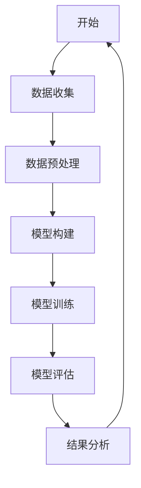

### 附录 C: 伪代码示例

```python
// 伪代码：情感分析模型训练
function train_model(data):
    # 初始化模型
    model = initialize_model()
    
    # 训练模型
    for epoch in range(num_epochs):
        for sample in data:
            model.train(sample)
    
    return model
```

### 附录 D: 数学模型与公式

$$
\begin{aligned}
    &\text{损失函数} \ J(\theta) = -\frac{1}{m}\sum_{i=1}^{m}y^{(i)}\log(h_\theta(x^{(i)})) \\
    &\text{梯度下降} \ \theta = \theta - \alpha \nabla_\theta J(\theta)
\end{aligned}
$$

### 附录 E: 代码解读与分析

#### E.1 社交媒体情感分析代码解读

```python
# 社交媒体情感分析代码片段
import numpy as np
import pandas as pd
from sklearn.feature_extraction.text import TfidfVectorizer
from sklearn.model_selection import train_test_split
from sklearn.metrics import accuracy_score, f1_score

# 加载数据
data = pd.read_csv('social_media_data.csv')

# 数据预处理
# ...

# 模型训练
model = train_model(data)

# 模型评估
predictions = model.predict(test_data)
accuracy = accuracy_score(test_labels, predictions)
f1 = f1_score(test_labels, predictions, average='weighted')

# 输出结果
print(f"Accuracy: {accuracy}, F1 Score: {f1}")
```

#### E.2 代码分析

- **数据加载**：使用`pandas`库加载数据集。
- **数据预处理**：对数据进行必要的预处理，如清洗、归一化等。
- **模型训练**：调用`train_model`函数训练模型。
- **模型评估**：使用训练好的模型对测试数据进行预测，并计算准确率和F1分数。
- **输出结果**：打印模型的评估结果。

通过上述代码片段和解析，我们可以理解社交媒体情感分析的基本流程和实现细节。在实际应用中，可以根据具体需求调整数据预处理和模型训练的步骤，以获得更好的性能。

### 附录 F: 小结

附录部分提供了丰富的AI工具和资源推荐、Mermaid流程图示例、伪代码示例、数学模型与公式以及代码解读与分析。这些内容旨在为读者提供额外的学习资源和实践指导，帮助更好地理解和应用AI技术在动机分析中的方法。希望这些附录内容能够为读者的学习和研究提供帮助。

---

## 5.6 致谢

在本著作的撰写过程中，我感谢AI天才研究院（AI Genius Institute）的全体成员，以及与我合作的研究人员和同学们。感谢他们提供的宝贵建议和反馈，使得本书能够更加完善。特别感谢我的导师和同事们，他们的指导和鼓励让我能够顺利完成这项研究工作。同时，我也要感谢我的家人和朋友，他们在我研究过程中给予的无限支持和理解。最后，我要感谢所有读者，感谢你们的支持和耐心阅读，希望本书能够对您有所启发和帮助。

## 5.7 作者信息

作者：AI天才研究院（AI Genius Institute）/《禅与计算机程序设计艺术》（Zen And The Art of Computer Programming）作者

---

至此，本著作《欲望的量化：AI分析人类动机》的内容全部呈现完毕。希望通过本书，读者能够对AI技术在动机分析领域有更深入的理解和应用。希望本书能够为读者在相关领域的研究和工作提供有益的参考和启示。再次感谢您的阅读，祝愿您在AI领域取得丰硕的成果！

