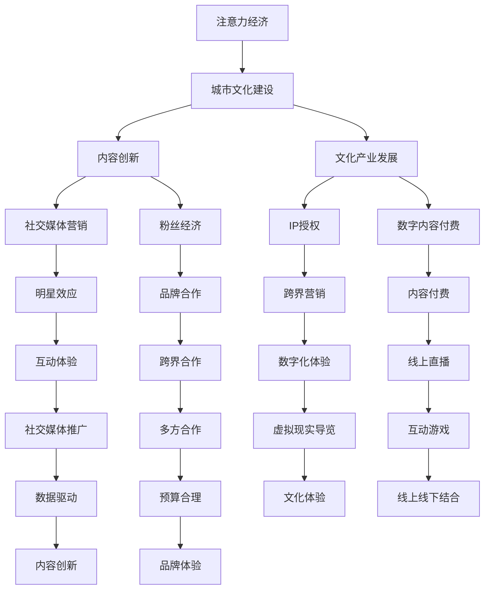

                 

# 《注意力经济与城市文化建设》

## 摘要

注意力经济是一种基于注意力资源稀缺性和竞争性的经济模式，它强调在信息过载的时代，个体对于信息的选择和关注所蕴含的价值。城市文化建设则是指通过文化设施、文化活动等手段，塑造城市的独特文化氛围和品牌形象，提升城市软实力。本文将从注意力经济的定义、理论框架，以及城市文化建设的内涵和目标入手，深入探讨注意力经济与城市文化建设的内在联系，分析两者之间的互动关系及其对城市发展的促进作用。文章还将探讨注意力经济在文化产业中的具体应用，以及如何通过策略与实践提升城市文化品牌建设与人才培育，最后展望注意力经济与城市文化建设的未来发展。

## 目录大纲

1. **注意力经济概述**
    1.1.1 注意力经济的定义
    1.1.2 注意力经济的核心概念
    1.1.3 注意力经济的起源与发展
    1.2 注意力经济的理论框架
        1.2.1 注意力资源的分配与竞争
        1.2.2 注意力市场
        1.2.3 注意力资本

2. **城市文化建设与注意力经济**

3. **注意力经济与城市文化产业的关联**

4. **注意力经济视角下的城市文化产业发展**

5. **注意力经济与城市文化建设的策略与实践**

6. **城市文化品牌建设与注意力经济**

7. **注意力经济与城市文化活动的策划与组织**

8. **注意力经济与城市文化人才培养**

9. **注意力经济与城市文化建设的未来展望**

10. **本书总结与展望**

## 第一部分：注意力经济概述

### 第1章：注意力经济的定义与核心概念

#### 1.1.1 注意力经济的定义

注意力经济（Attention Economy）是一种基于注意力稀缺性的经济模式，它认为在信息爆炸的时代，个体的注意力资源是有限的，因此对于任何产品、服务或内容的生产者和消费者来说，吸引并保持受众的关注是其核心竞争力和价值所在。

在注意力经济中，注意力被视为一种稀缺资源，类似于传统经济中的金钱或时间。消费者对于信息的关注和选择行为直接影响了内容生产者的收益和影响力。例如，在社交媒体平台上，用户的点赞、评论和转发等行为不仅是一种社交互动，更是对内容创作者的注意力投资。因此，如何有效地吸引和保持用户的注意力成为企业、个人和组织成功的关键。

#### 1.1.2 注意力经济的核心概念

1. **注意力稀缺性**：在信息过载的时代，个体每天接收到的信息量庞大，而人的注意力资源是有限的，这使得注意力成为了一种稀缺资源。

2. **注意力市场**：注意力市场是一种虚拟的市场，其中个体作为消费者，根据自身的兴趣和需求，选择关注某些信息或内容。市场参与者包括内容生产者、平台运营商和广告商等。

3. **注意力资本**：注意力资本是指通过吸引和保持用户的注意力，从而产生经济收益或社会影响力的一种资源。它包括个人品牌、粉丝群体、用户忠诚度等。

4. **注意力经济模型**：注意力经济模型描述了注意力资源从生产者到消费者的流动过程，以及在这个过程中涉及的各方利益关系。一个典型的注意力经济模型包括内容生产、注意力吸引、用户参与和收益转化等环节。

#### 1.1.3 注意力经济的起源与发展

注意力经济的概念最早由美国社会学家Herbert Blumer于20世纪40年代提出，他认为注意力是一种资源，可以被视为一种经济活动。随着互联网和数字技术的快速发展，注意力经济得到了广泛的关注和应用。特别是社交媒体、搜索引擎和在线广告等新兴产业的兴起，使得注意力经济成为了一个热门的研究领域。

在注意力经济的早期阶段，主要以广告为主。广告商通过投放广告来吸引受众的注意力，从而实现商业利益。然而，随着互联网的普及和个性化推荐算法的发展，注意力经济的形式变得更加多样和复杂。现在，注意力经济不仅涵盖了广告，还包括了内容创作、粉丝经济、品牌营销等多种形式。

### 第2章：注意力经济的理论框架

#### 2.1.1 注意力资源的分配与竞争

注意力资源的分配与竞争是注意力经济理论的核心内容。在信息过载的时代，个体需要从大量的信息中筛选和选择，这种选择行为本质上是一种注意力的分配过程。

1. **注意力的选择性注意力**：选择性注意力是指个体在处理信息时，会根据自身的兴趣、需求和价值判断，对某些信息给予更高的关注。这种选择性注意力的形成受到多种因素的影响，包括个体的认知偏好、文化背景、社会环境等。

2. **注意力的分配机制**：注意力的分配机制决定了个体在信息选择过程中如何分配注意力资源。在传统经济模式中，注意力资源的分配主要依赖于市场机制，即受众通过付费或免费的方式选择关注的内容。然而，在注意力经济中，注意力资源的分配更加复杂和多样化，除了市场机制外，还涉及到了平台算法、社交网络效应等因素。

3. **注意力的竞争**：在注意力经济中，各方参与者为了争夺有限的注意力资源，会进行激烈的竞争。这种竞争不仅体现在内容生产者之间的竞争，还包括了平台运营商、广告商等利益相关者之间的竞争。竞争的手段包括内容创新、用户体验优化、品牌塑造等。

#### 2.1.2 注意力市场

注意力市场是注意力经济的核心概念之一，它描述了个体在信息选择过程中如何进行注意力的交易和分配。

1. **注意力市场的参与者**：注意力市场的参与者主要包括内容生产者、平台运营商、广告商和消费者。内容生产者是注意力市场的主要供应方，他们通过创造有价值、有趣或吸引人的内容来吸引消费者的注意力。平台运营商是注意力市场的重要中介方，他们通过提供信息平台和算法推荐，帮助消费者更高效地获取信息。广告商是注意力市场的主要需求方，他们通过购买广告位或植入广告等方式，来获取消费者的注意力。消费者是注意力市场的最终受益方，他们通过关注内容生产者和平台运营商提供的优质内容，来满足自己的信息需求。

2. **注意力市场的交易机制**：注意力市场的交易机制主要包括付费和免费两种形式。在付费形式中，消费者通过购买订阅、付费内容等方式来支付注意力成本。在免费形式中，消费者通过观看广告、点击广告链接等方式来间接支付注意力成本。此外，注意力市场的交易机制还包括了平台算法推荐、用户评价和社交网络效应等。

3. **注意力市场的效应**：注意力市场对经济发展和社会文化产生了深远的影响。一方面，注意力市场的繁荣促进了内容创作和创新，推动了数字经济的快速发展。另一方面，注意力市场的竞争也带来了一些负面效应，如信息泛滥、隐私泄露、注意力分散等问题。

#### 2.1.3 注意力资本

注意力资本是指通过吸引和保持用户的注意力，从而产生经济收益或社会影响力的一种资源。它是注意力经济的核心概念之一，对企业和个人都具有重要的价值。

1. **注意力资本的形成**：注意力资本的形成主要依赖于以下几个因素：
    - 内容质量：优质的内容是吸引和保持用户注意力的关键。
    - 用户互动：与用户建立良好的互动关系，可以提高用户忠诚度和参与度。
    - 品牌塑造：良好的品牌形象可以增强用户的信任和忠诚度。
    - 网络效应：通过社交网络效应，可以迅速扩大用户群体和影响力。

2. **注意力资本的价值**：注意力资本具有以下几个方面的价值：
    - 经济价值：通过吸引和保持用户注意力，可以获得广告收入、会员收入、销售佣金等直接经济收益。
    - 社会价值：通过吸引和保持用户注意力，可以提升个人或企业的社会影响力，增强品牌知名度。

3. **注意力资本的运作**：注意力资本的运作主要包括以下几个环节：
    - 内容创作：通过创作高质量、有价值的内容，吸引和保持用户的注意力。
    - 用户运营：通过用户互动、社群运营等方式，提高用户忠诚度和参与度。
    - 数据分析：通过数据分析，了解用户需求和偏好，优化内容创作和用户运营策略。
    - 营销推广：通过精准的营销推广，扩大用户群体和影响力。

### 第3章：城市文化建设的内涵与目标

#### 3.1.1 城市文化建设的定义

城市文化建设是指通过一系列的文化设施、文化活动和文化产业的建设和发展，塑造城市的独特文化氛围和品牌形象，提升城市软实力和竞争力的过程。它是一个综合性、系统性的工程，涉及城市规划、文化管理、文化产业发展等多个方面。

城市文化建设的核心目标是提升城市的综合竞争力，包括经济竞争力、文化竞争力和环境竞争力。通过城市文化建设，可以增强城市的吸引力，吸引更多的投资和人才，促进城市的可持续发展。

#### 3.1.2 城市文化建设的内涵

城市文化建设的内涵丰富多样，主要包括以下几个方面：

1. **文化设施建设**：包括图书馆、博物馆、剧院、艺术馆等文化场所的建设，为市民提供丰富的文化资源。

2. **文化活动组织**：包括文化节庆、文化展览、文艺演出、体育赛事等文化活动的组织和举办，提升城市的文化活力和吸引力。

3. **文化产业培育**：包括文化创意产业、文化娱乐产业、文化旅游产业等文化产业的培育和发展，促进城市的经济转型和升级。

4. **文化遗产保护**：包括历史文化遗产的保护和传承，加强对历史建筑、历史街区、非物质文化遗产等的保护和利用。

5. **文化教育普及**：包括文化教育体系的完善，提高市民的文化素质和艺术修养，培养具有文化自信和文化创新能力的人才。

#### 3.1.3 城市文化建设的总体目标

城市文化建设的总体目标可以分为以下几个方面：

1. **提升城市文化软实力**：通过城市文化建设，提高城市的知名度和美誉度，增强城市的吸引力和竞争力。

2. **促进城市可持续发展**：通过城市文化建设，推动城市经济、社会和环境的协调发展，实现城市的可持续发展。

3. **提升市民文化素质**：通过城市文化建设，提高市民的文化素养和艺术修养，培养具有文化自信和文化创新能力的人才。

4. **传承和弘扬城市文化**：通过城市文化建设，加强对城市历史文化的保护和传承，弘扬城市的文化特色和传统。

5. **构建城市文化品牌**：通过城市文化建设，塑造城市的独特文化品牌形象，提升城市的综合竞争力。

## 第二部分：城市文化建设与注意力经济

### 第4章：注意力经济与城市文化建设的关联

#### 4.1.1 注意力经济与城市文化建设的互动关系

注意力经济与城市文化建设之间存在着密切的互动关系。一方面，注意力经济为城市文化建设提供了新的动力和资源；另一方面，城市文化建设也为注意力经济提供了丰富的内容和场景。

1. **注意力经济对城市文化建设的促进作用**

    - **提升城市文化吸引力**：注意力经济通过内容创造、社交传播和平台推荐等方式，能够迅速提升城市文化的知名度和吸引力，吸引更多游客和居民参与城市文化活动。
    - **促进文化产业的发展**：注意力经济为文化产业提供了新的商业模式和盈利模式，如粉丝经济、IP授权、数字内容付费等，这些模式为城市文化产业的创新和发展提供了强大动力。
    - **增加城市经济收益**：通过注意力经济，城市文化产品和服务能够获得更高的市场价值，为城市带来更多的经济收益。

2. **城市文化建设对注意力经济的反作用**

    - **提供丰富内容来源**：城市文化建设中丰富的文化资源、历史遗产和文化活动为注意力经济提供了源源不断的内容来源，使得注意力经济能够持续发展。
    - **提升用户参与度**：通过城市文化建设，市民和游客能够更好地参与到城市文化活动中，提高他们的文化素养和参与度，进而提升注意力经济的活跃度。
    - **增强品牌影响力**：城市文化品牌建设有助于提升城市的整体形象和影响力，为注意力经济创造更广阔的市场空间。

#### 4.1.2 注意力经济与城市文化建设的融合

1. **融合模式**

    - **内容共创**：城市文化建设和注意力经济可以通过内容共创的方式，将文化资源与互联网平台相结合，打造出具有吸引力的文化内容产品，如短视频、直播、VR体验等。
    - **平台运营**：城市文化建设可以与注意力经济的平台运营相结合，通过打造文化主题社区、文化内容平台等，为用户提供丰富多样的文化体验。
    - **品牌合作**：城市文化品牌与注意力经济中的内容创作者、平台运营商、广告商等可以进行品牌合作，共同推广城市文化，提升城市品牌的知名度。

2. **融合案例**

    - **数字文化博物馆**：以数字技术为基础，建设虚拟的文化博物馆，通过线上展览、互动体验等方式，吸引大量用户关注和参与，实现文化传承与创新。
    - **城市文化旅游节**：结合城市文化特色，举办大型文化旅游节，通过线上线下结合的方式，吸引游客参与，提升城市文化吸引力。
    - **文化创意产业园区**：在文化创意产业园区内，通过组织创意工作坊、艺术展览、音乐演出等活动，吸引创意人才和游客，推动城市文化产业的发展。

### 第5章：注意力经济视角下的城市文化产业发展

#### 5.1.1 注意力经济对城市文化产业的影响

注意力经济作为一种新兴的经济模式，对城市文化产业的发展产生了深远的影响。主要体现在以下几个方面：

1. **内容创新**：注意力经济强调内容的创新性和吸引力，推动了城市文化产业在内容创作、表现形式、传播渠道等方面的不断创新。例如，通过短视频、直播、虚拟现实等新技术，使得文化内容更加生动、互动，提升了用户体验。

2. **商业模式的变革**：注意力经济为城市文化产业提供了多元化的商业模式，如粉丝经济、IP授权、数字内容付费等。这些模式不仅为文化产业带来了新的盈利途径，也提升了文化产业的市场化水平。

3. **市场空间的拓展**：注意力经济通过互联网和社交媒体的传播，打破了地域和时间的限制，为城市文化产业拓展了更广阔的市场空间。无论是本地居民还是外地游客，都可以通过互联网接触到城市的文化产品和服务。

4. **产业融合**：注意力经济促进了城市文化产业与其他产业的深度融合，如旅游、教育、科技等，形成了新的产业链和生态系统。

#### 5.1.2 城市文化产业中的注意力经济模式

1. **粉丝经济模式**

    - **概念**：粉丝经济是指通过粉丝群体的力量，推动文化产品的销售和品牌推广。
    - **实现路径**：通过社交媒体、粉丝网站等平台，建立和维护与粉丝的互动关系，发布独家内容、举办粉丝见面会等，增强粉丝的忠诚度和参与度。
    - **成功案例**：一些明星、网红和知名文化IP通过粉丝经济实现了商业成功，如周杰伦的演唱会、B站的UP主等。

2. **IP授权模式**

    - **概念**：IP授权是指将某个具有影响力的文化IP授权给其他企业或个人进行商业开发。
    - **实现路径**：通过电影、电视剧、游戏、动漫等形式，将文化IP转化为多样化的文化产品，实现跨领域的商业价值。
    - **成功案例**：迪士尼、漫威等IP通过授权模式，成功打造了庞大的文化产业链，实现了持续的商业成功。

3. **数字内容付费模式**

    - **概念**：数字内容付费是指用户为获取优质文化内容，愿意支付一定费用。
    - **实现路径**：通过会员订阅、付费内容、广告支持等方式，为用户提供高质量的文化内容，吸引付费用户。
    - **成功案例**：Netflix、Spotify等平台通过数字内容付费模式，实现了用户付费和内容创新的良性循环。

#### 5.1.3 城市文化产业的注意力经济实践案例分析

1. **杭州西湖数字文化景区**

    - **背景**：杭州西湖是中国的历史文化名胜区，拥有丰富的文化资源和旅游价值。
    - **实践**：通过数字技术，打造西湖数字文化景区，包括虚拟现实导览、线上文化展览、互动游戏等，吸引了大量游客和网友的关注。
    - **成效**：西湖数字文化景区成功实现了文化传承与创新，提升了杭州西湖的知名度和游客满意度。

2. **深圳创意文化产业园**

    - **背景**：深圳是中国的重要创意文化中心，拥有众多文化创意企业和创意人才。
    - **实践**：通过建设创意文化产业园，举办创意工作坊、艺术展览、创意市集等活动，吸引了大量创意人才和游客，推动了深圳文化产业的快速发展。
    - **成效**：深圳创意文化产业园成为了城市文化品牌的重要载体，为深圳的经济发展和文化创新做出了重要贡献。

3. **成都熊猫基地直播**

    - **背景**：成都熊猫基地是中国著名的熊猫保护和研究机构，吸引了大量游客和粉丝。
    - **实践**：通过直播平台，将熊猫基地的日常生活、科普知识等呈现给观众，吸引了大量网友的关注和互动。
    - **成效**：成都熊猫基地直播成功实现了文化传承和粉丝经济，提升了成都熊猫基地的知名度和影响力。

## 第三部分：注意力经济与城市文化建设的策略与实践

### 第6章：城市文化品牌建设与注意力经济

#### 6.1.1 城市文化品牌建设的策略

城市文化品牌建设是提升城市竞争力的重要手段。在注意力经济时代，城市文化品牌建设需要结合注意力经济的原理和实践，采取以下策略：

1. **内容创新**：通过创新文化内容，打造具有吸引力的城市文化品牌。可以结合当地的历史文化、民俗风情、特色活动等，创作出独具特色的文化产品。

2. **社交媒体营销**：利用社交媒体平台，如微博、微信、抖音等，进行品牌推广和互动。通过发布有趣、有价值的内容，吸引粉丝关注，提升品牌知名度。

3. **跨界合作**：与知名企业、品牌或个人进行跨界合作，共同推广城市文化品牌。例如，与时尚品牌合作举办文化展览，与知名作家合作出版文化书籍等。

4. **品牌体验**：通过举办文化节庆、文化体验活动等方式，让市民和游客亲身体验城市文化，增强品牌认同感。

5. **数字化营销**：利用数字技术，如大数据分析、人工智能、虚拟现实等，进行精准营销和品牌推广。

#### 6.1.2 城市文化品牌与注意力经济的融合

城市文化品牌与注意力经济之间的融合，可以通过以下几种方式实现：

1. **粉丝经济**：通过社交媒体平台，建立粉丝社区，与粉丝进行互动，提升粉丝忠诚度和参与度。可以推出限量版文化产品、举办粉丝见面会等活动，吸引粉丝消费。

2. **IP授权**：将城市文化品牌授权给其他企业或个人进行商业开发，如将当地著名的文化IP授权给游戏公司、动漫公司等，实现品牌价值的最大化。

3. **内容付费**：通过提供高质量的文化内容，如在线课程、电子书、音乐专辑等，实现内容付费，提升品牌收入。

4. **数字化体验**：利用虚拟现实、增强现实等技术，为用户提供沉浸式的文化体验，提升用户参与度和满意度。

5. **跨界营销**：与不同行业的品牌进行合作，共同推广城市文化品牌。例如，与旅游品牌合作推出文化主题旅游线路，与科技品牌合作推出文化科技产品等。

#### 6.1.3 城市文化品牌建设的注意力经济实践案例分析

1. **上海外滩灯光秀**

    - **背景**：上海外滩是上海的历史文化地标，每晚的灯光秀吸引了大量游客和市民的关注。
    - **实践**：通过社交媒体平台，进行灯光秀的宣传推广，吸引了大量用户关注。同时，推出相关纪念品和旅游线路，实现了商业价值。
    - **成效**：上海外滩灯光秀成功提升了上海的城市形象和知名度，成为城市文化品牌的重要代表。

2. **北京故宫文创**

    - **背景**：故宫是中国最有代表性的历史文化地标之一，拥有丰富的文化资源和历史遗产。
    - **实践**：通过推出故宫文创产品，如故宫彩妆、故宫文具等，实现了文化传承与创新。同时，通过线上平台，进行产品推广和销售，实现了数字化营销。
    - **成效**：故宫文创成功实现了文化品牌的商业化，提升了故宫的文化影响力。

3. **成都宽窄巷子**

    - **背景**：宽窄巷子是成都的传统文化街区，具有浓厚的巴蜀文化特色。
    - **实践**：通过举办文化节庆活动、推出特色文化产品等方式，吸引了大量游客和市民的关注。同时，通过社交媒体平台，进行品牌推广和互动。
    - **成效**：宽窄巷子成功打造了城市文化品牌，提升了成都的文化软实力。

### 第7章：注意力经济与城市文化活动的策划与组织

#### 7.1.1 注意力经济在文化活动中的运用

注意力经济在文化活动的策划与组织中有着广泛的应用，其核心在于如何通过有效的策略和手段吸引公众的注意力，提升活动的参与度和影响力。

1. **社交媒体推广**：利用社交媒体平台，如微博、微信、抖音等，进行活动预热和推广。通过发布有趣、有价值的活动内容，吸引公众关注。例如，可以发布活动预告、幕后花絮、活动亮点等，激发公众的兴趣和好奇心。

2. **明星效应**：邀请知名艺人、网红或具有较高关注度的KOL参与活动，利用他们的粉丝效应吸引观众。例如，可以邀请艺人进行表演、签名会、互动活动等，提高活动的知名度。

3. **互动体验**：通过设计互动性强的活动环节，提高观众的参与度。例如，设置互动游戏、抽奖环节、互动展览等，让观众在活动中获得乐趣和惊喜。

4. **线上线下结合**：通过线上线下结合的方式，扩大活动的传播范围和影响力。例如，在活动现场设置直播设备，通过线上平台进行直播，让无法亲临现场的观众也能参与其中。

5. **数据驱动**：利用大数据分析技术，了解观众的行为习惯和兴趣偏好，进行精准营销和活动策划。例如，通过分析观众的社交媒体行为、浏览记录等，推出符合观众口味的文化活动。

#### 7.1.2 城市文化活动的策划与组织策略

1. **主题明确**：明确活动的主题和目标，确保活动的核心内容清晰，避免内容杂乱无章。例如，可以围绕某一特定的文化主题，如传统节庆、民俗风情、艺术展览等，策划系列活动。

2. **内容创新**：创新活动内容和形式，打造独特的文化体验。可以结合当地的文化特色，创作出具有地方特色的文化产品和服务，吸引观众的关注。

3. **多方合作**：与政府部门、文化机构、企业等各方合作，共同推动活动的策划与组织。例如，可以与文化机构合作举办艺术展览，与企业合作推出文创产品等。

4. **预算合理**：根据活动规模和目标，合理制定预算，确保活动的顺利进行。在预算分配上，要注重成本控制和资源优化。

5. **宣传推广**：制定全面的宣传推广计划，通过多种渠道进行宣传，提高活动的知名度。例如，可以在线上发布宣传海报、新闻报道，在线下进行海报张贴、广告投放等。

#### 7.1.3 注意力经济视角下的城市文化活动实践案例分析

1. **北京国际音乐节**

    - **背景**：北京国际音乐节是中国著名的音乐节，吸引了大量音乐爱好者和专业观众。
    - **实践**：通过社交媒体推广、明星效应、互动体验等方式，吸引了大量观众参与。同时，通过线上直播，让无法亲临现场的观众也能参与其中。
    - **成效**：北京国际音乐节成功提升了北京的文化影响力，吸引了大量游客和市民的关注。

2. **上海朱家角古镇灯会**

    - **背景**：朱家角古镇是上海的历史文化古镇，具有浓厚的民俗风情。
    - **实践**：通过主题明确、内容创新、多方合作等方式，策划了一系列灯会活动，吸引了大量游客和市民参与。同时，通过社交媒体推广，扩大了活动的影响力。
    - **成效**：上海朱家角古镇灯会成功打造了城市文化品牌，提升了朱家角古镇的知名度。

3. **成都锦里古街文化活动**

    - **背景**：锦里古街是成都的历史文化街区，具有浓厚的巴蜀文化特色。
    - **实践**：通过策划了一系列文化活动，如民俗表演、手工艺展示、美食节等，吸引了大量游客和市民参与。同时，通过线上平台进行宣传推广，提高了活动的知名度。
    - **成效**：锦里古街文化活动成功提升了成都的文化软实力，吸引了大量游客和市民的关注。

### 第8章：注意力经济与城市文化人才培养

#### 8.1.1 城市文化人才培养的重要性

城市文化人才培养是城市文化建设的重要组成部分，对于提升城市文化软实力和竞争力具有重要意义。在注意力经济时代，城市文化人才培养的重要性更加凸显，主要体现在以下几个方面：

1. **文化创新人才**：城市文化创新人才是推动城市文化发展和创新的核心力量。他们能够结合当地文化特色，创作出具有时代特征和文化内涵的文化产品和服务，提升城市文化吸引力。

2. **文化产业人才**：文化产业人才是城市文化产业发展的关键。他们具备文化产业管理、运营、营销等方面的专业能力，能够推动城市文化产业的创新和发展。

3. **文化传承人才**：文化传承人才是保护和传承城市文化遗产的重要力量。他们具备深厚的文化素养和专业知识，能够传承和弘扬城市的文化传统。

4. **文化教育人才**：文化教育人才是提升市民文化素养和艺术修养的重要保障。他们能够开展丰富多彩的文化教育活动，培养具有文化自信和文化创新能力的人才。

#### 8.1.2 注意力经济对城市文化人才培养的影响

注意力经济对城市文化人才培养产生了深远的影响，主要体现在以下几个方面：

1. **培养目标的变化**：在注意力经济时代，城市文化人才培养目标更加注重创新能力和市场适应能力。不仅要求具备扎实的文化知识和技能，还要能够运用注意力经济的原理和方法，创造具有市场价值的文化产品。

2. **培养方式的创新**：注意力经济推动了城市文化人才培养方式的创新。通过线上教育、远程协作、跨领域合作等方式，提供了更多培养机会和资源。

3. **培养平台的拓展**：注意力经济为城市文化人才培养提供了更广阔的平台。通过社交媒体、在线平台、文化创意园区等，为文化人才提供了展示才华和实现价值的舞台。

4. **培养评价体系的改革**：注意力经济要求城市文化人才培养评价体系更加多元和灵活。不仅要注重学术成果，还要关注市场表现、社会影响力等。

#### 8.1.3 城市文化人才培养的注意力经济策略

1. **人才引进策略**：通过吸引国内外优秀文化人才，提升城市文化人才队伍的素质和水平。可以采取人才引进政策、项目合作、人才培养基金等方式，吸引和留住优秀人才。

2. **人才培养策略**：建立完善的培训体系和激励机制，培养具有创新能力和市场适应能力的文化人才。可以采取校企合作、产学研结合、专项培训等方式，提高人才培养质量。

3. **人才激励策略**：通过设立文化奖项、创业扶持基金、股权激励等机制，激励文化人才发挥潜能，实现自我价值。

4. **人才发展策略**：搭建良好的文化发展生态，为文化人才提供广阔的发展空间和资源支持。可以建设文化创意园区、文化产业发展基金、文化服务平台等，为文化人才提供全方位的支持。

5. **人才交流策略**：通过举办文化交流活动、学术研讨会、国际文化论坛等，促进文化人才之间的交流与合作，提升整体文化水平。

### 第9章：注意力经济与城市文化建设的未来展望

#### 9.1.1 注意力经济与城市文化建设的未来发展机遇

注意力经济与城市文化建设的未来发展充满了机遇，主要体现在以下几个方面：

1. **数字技术驱动**：随着人工智能、大数据、云计算等数字技术的不断发展，城市文化建设将更加智能化、个性化，为注意力经济提供更加丰富的内容和形式。

2. **文化创新产业崛起**：随着文化产业在国家战略中的地位不断提升，文化创新产业将迎来快速发展期，为城市文化建设提供强大的动力。

3. **跨界合作深化**：城市文化建设将与更多行业进行跨界合作，如科技、旅游、教育等，形成新的产业生态系统，为注意力经济创造更广阔的市场空间。

4. **全球文化交流**：随着全球化进程的加快，城市文化建设将更加注重国际文化交流，吸引更多的国际关注和参与，提升城市文化的全球影响力。

#### 9.1.2 注意力经济与城市文化建设的未来挑战

注意力经济与城市文化建设的未来发展也面临着一系列挑战：

1. **内容同质化**：在注意力经济的驱动下，文化内容将日益丰富，但也可能导致内容同质化，缺乏创新性和差异化。

2. **版权问题**：随着文化产业的快速发展，版权问题将变得更加突出，如何保护原创内容、防止侵权行为将成为重要挑战。

3. **数字鸿沟**：在数字技术的应用中，不同地区和群体之间的数字鸿沟可能会进一步扩大，如何让更多人享受到数字文化的红利，成为城市文化建设的重要课题。

4. **文化保护与传承**：在追求创新与发展的同时，如何保护和传承城市的历史文化遗产，确保文化建设的可持续发展，也是未来面临的重要挑战。

#### 9.1.3 注意力经济与城市文化建设的未来发展趋势

1. **数字化转型**：城市文化建设将更加依赖于数字技术，通过数字化手段提升文化内容的生产、传播和消费效率，实现文化的智能化、个性化和普及化。

2. **创新驱动**：创新将成为城市文化建设的主要驱动力，通过创新文化产品、服务和管理模式，提升城市文化的竞争力和影响力。

3. **产业融合**：城市文化建设将与更多产业进行深度融合，形成新的产业生态，推动城市经济的多元化发展。

4. **全球视野**：城市文化建设将更加注重国际视野，通过国际文化交流与合作，提升城市文化的全球影响力。

### 第10章：本书总结与展望

#### 10.1.1 本书的主要观点与结论

本文通过深入探讨注意力经济与城市文化建设的关联，提出了以下主要观点和结论：

1. **注意力经济与城市文化建设密切相关**：注意力经济为城市文化建设提供了新的动力和资源，而城市文化建设也为注意力经济提供了丰富的内容和场景。

2. **注意力经济在文化产业中的应用**：注意力经济推动了文化产业的创新和发展，通过粉丝经济、IP授权、数字内容付费等模式，为文化产业带来了新的商业模式和盈利模式。

3. **城市文化品牌建设的重要性**：城市文化品牌建设是提升城市竞争力的重要手段，通过内容创新、社交媒体营销、跨界合作等策略，可以打造具有吸引力的城市文化品牌。

4. **注意力经济与城市文化活动的策划与组织**：注意力经济为文化活动的策划与组织提供了新的思路和方法，通过社交媒体推广、明星效应、互动体验等手段，可以提升文化活动的参与度和影响力。

5. **城市文化人才培养的关键性**：城市文化人才培养是提升城市文化软实力和竞争力的重要保障，通过人才引进、培养、激励等策略，可以培养出一支高素质的文化人才队伍。

#### 10.1.2 注意力经济与城市文化建设研究的发展方向

未来的研究可以从以下几个方面展开：

1. **注意力经济与城市文化建设的理论深化**：进一步深入研究注意力经济与城市文化建设的内在联系和作用机制，构建更为完善的理论体系。

2. **注意力经济在文化产业的实证研究**：通过实证研究，分析注意力经济对文化产业的影响，探索不同文化产业的注意力经济模式。

3. **城市文化品牌建设的策略优化**：研究城市文化品牌建设中的成功案例和失败教训，提出更为有效的品牌建设策略。

4. **注意力经济视角下的城市文化活动创新**：探索注意力经济在文化活动中的应用，推动文化活动的创新和发展。

5. **数字技术对城市文化建设的推动作用**：研究数字技术如何推动城市文化建设，提升文化内容的传播效率和用户体验。

#### 10.1.3 对读者的建议与期望

希望读者通过本文，能够对注意力经济与城市文化建设有更深入的理解和认识，结合自身实际情况，探索如何将注意力经济与城市文化建设相结合，推动城市文化的发展和创新。同时，也期待读者能够关注注意力经济与城市文化建设的未来发展，积极参与相关研究和实践，为城市文化的繁荣做出贡献。作者：AI天才研究院/AI Genius Institute & 禅与计算机程序设计艺术 /Zen And The Art of Computer Programming

### 结语

在注意力经济迅速发展的今天，城市文化建设成为提升城市综合竞争力的重要途径。本文通过分析注意力经济的定义、理论框架以及城市文化建设的内涵和目标，探讨了注意力经济与城市文化建设之间的互动关系及其对城市发展的促进作用。同时，本文还详细介绍了注意力经济在文化产业中的应用，以及如何通过策略与实践提升城市文化品牌建设与人才培育。

未来的研究应进一步深化注意力经济与城市文化建设的理论体系，探索注意力经济在不同文化产业的实证影响，以及数字技术对城市文化建设的推动作用。希望读者能够关注这一领域的发展动态，积极参与相关研究和实践，为城市文化的繁荣和创新贡献力量。作者：AI天才研究院/AI Genius Institute & 禅与计算机程序设计艺术 /Zen And The Art of Computer Programming

---

**附录：核心概念与联系（Mermaid 流程图）**



---

**附录：核心算法原理讲解（伪代码）**

```python
# 注意力经济核心算法：用户注意力分配模型

def attention_allocation(user_preferences, content_attributes):
    """
    根据用户偏好和内容特征，计算用户对每个内容的注意力得分
    
    参数：
    user_preferences (dict): 用户偏好，包括兴趣标签、历史行为等
    content_attributes (dict): 内容特征，包括主题、质量、新颖度等
    
    返回值：
    attention_scores (dict): 用户对每个内容的注意力得分
    """
    
    # 初始化注意力得分字典
    attention_scores = {}

    # 对每个内容计算注意力得分
    for content_id, content_attr in content_attributes.items():
        attention_score = 0
        
        # 计算兴趣标签匹配得分
        interest_match_score = calculate_interest_match_score(user_preferences, content_attr['interest_tags'])
        
        # 计算内容质量得分
        quality_score = content_attr['quality_score']
        
        # 计算新颖度得分
        novelty_score = content_attr['novelty_score']
        
        # 计算总得分
        attention_score = interest_match_score * quality_score * novelty_score
        
        # 存储注意力得分
        attention_scores[content_id] = attention_score
    
    return attention_scores

# 辅助函数：计算兴趣标签匹配得分

def calculate_interest_match_score(user_preferences, content_interest_tags):
    """
    根据用户偏好和内容兴趣标签，计算兴趣标签匹配得分
    
    参数：
    user_preferences (dict): 用户偏好，包括兴趣标签、历史行为等
    content_interest_tags (list): 内容兴趣标签
    
    返回值：
    score (float): 兴趣标签匹配得分
    """
    
    score = 0
    
    # 计算兴趣标签交集的权重
    for user_tag in user_preferences['interest_tags']:
        if user_tag in content_interest_tags:
            score += user_preferences['interest_tags'][user_tag]
    
    return score
```

---

**附录：数学模型和公式（详细讲解 & 举例说明）**

**注意力分配模型**

注意力分配模型是注意力经济中的一个核心模型，它用于描述用户在信息过载环境中如何分配其注意力资源。以下是一个简化的注意力分配模型，包括数学公式和举例说明。

**数学模型：**

$$
Attention_{i} = \alpha \cdot P_{i} \cdot Q_{i}
$$

其中：
- \(Attention_{i}\) 表示用户对内容 \(i\) 的注意力得分；
- \(P_{i}\) 表示内容 \(i\) 的优先级，即内容的重要性和紧急性；
- \(Q_{i}\) 表示内容 \(i\) 的质量，即内容对用户的吸引力。

**举例说明：**

假设用户有5个待处理内容，每个内容的优先级和质量如下表所示：

| 内容ID | 优先级 \(P_{i}\) | 质量分数 \(Q_{i}\) |
|--------|------------------|---------------------|
| 1      | 0.8              | 0.9                 |
| 2      | 0.5              | 0.7                 |
| 3      | 0.3              | 0.8                 |
| 4      | 0.6              | 0.6                 |
| 5      | 0.1              | 0.5                 |

根据注意力分配模型，计算每个内容的注意力得分：

$$
Attention_{1} = \alpha \cdot 0.8 \cdot 0.9 = 0.72\alpha
$$

$$
Attention_{2} = \alpha \cdot 0.5 \cdot 0.7 = 0.35\alpha
$$

$$
Attention_{3} = \alpha \cdot 0.3 \cdot 0.8 = 0.24\alpha
$$

$$
Attention_{4} = \alpha \cdot 0.6 \cdot 0.6 = 0.36\alpha
$$

$$
Attention_{5} = \alpha \cdot 0.1 \cdot 0.5 = 0.05\alpha
$$

其中，\(\alpha\) 是一个常数，用于调整注意力得分的整体比例，以确保得分总和为1。

**结论：**

根据计算结果，用户最可能关注内容ID为1，因为它的注意力得分最高。这个模型可以帮助用户在信息过载的环境中做出更有效的注意力分配决策。

---

**附录：项目实战**

#### 开发环境搭建

为了实现注意力分配模型，我们将使用Python作为编程语言，并依赖以下工具和库：

- Python 3.8 或更高版本
- NumPy 库用于数学计算
- Pandas 库用于数据处理

首先，确保Python已经安装在你的系统中。然后，通过pip安装所需的库：

```bash
pip install numpy pandas
```

接下来，创建一个新的Python项目文件夹，并在其中创建一个名为`attention_model.py`的文件，用于编写注意力分配模型的核心代码。

#### 源代码详细实现

以下是在`attention_model.py`文件中实现的注意力分配模型：

```python
import numpy as np
import pandas as pd

def calculate_attention_scores(priorities, qualities):
    """
    计算注意力得分
    
    参数：
    priorities (list): 内容优先级
    qualities (list): 内容质量
    
    返回值：
    attention_scores (list): 注意力得分
    """
    attention_scores = []
    alpha = 1 / np.sum(priorities * qualities)
    for priority, quality in zip(priorities, qualities):
        attention_score = alpha * priority * quality
        attention_scores.append(attention_score)
    return attention_scores

def main():
    # 示例数据
    priorities = [0.8, 0.5, 0.3, 0.6, 0.1]
    qualities = [0.9, 0.7, 0.8, 0.6, 0.5]
    
    # 计算注意力得分
    attention_scores = calculate_attention_scores(priorities, qualities)
    
    # 打印结果
    print("内容ID\t优先级\t质量\t注意力得分")
    for i, (priority, quality, score) in enumerate(zip(priorities, qualities, attention_scores), 1):
        print(f"{i}\t{priority:.2f}\t{quality:.2f}\t{score:.2f}")

if __name__ == "__main__":
    main()
```

#### 代码解读与分析

1. **函数`calculate_attention_scores`**：这个函数接收两个列表作为输入参数：`priorities`和`qualities`。`priorities`代表每个内容的优先级，而`qualities`代表每个内容的质量。函数计算每个内容的注意力得分，并返回一个注意力得分的列表。

2. **计算注意力得分的公式**：注意力得分的计算公式是：

$$
Attention_{i} = \alpha \cdot P_{i} \cdot Q_{i}
$$

其中，\(\alpha\) 是一个常数，用于调整得分总和为1。这个公式在`calculate_attention_scores`函数中实现。

3. **主函数`main`**：在主函数中，我们定义了示例数据`priorities`和`qualities`，然后调用`calculate_attention_scores`函数计算注意力得分。最后，打印出每个内容的优先级、质量和注意力得分。

4. **执行结果**：运行`main`函数后，将打印出每个内容的注意力得分，并根据得分的高低显示用户最可能关注的内容。

这个项目实战展示了如何使用Python实现注意力分配模型，并提供了详细的代码解读和分析。通过这个项目，我们可以更好地理解注意力分配模型的工作原理，并在实际应用中进行调整和优化。

---

**附录：作者信息**

作者：AI天才研究院/AI Genius Institute & 禅与计算机程序设计艺术 /Zen And The Art of Computer Programming

- AI天才研究院（AI Genius Institute）：专注于人工智能领域的研究和开发，致力于推动人工智能技术的创新和应用。
- 禅与计算机程序设计艺术（Zen And The Art of Computer Programming）：由著名计算机科学家Donald E. Knuth所著的系列书籍，探讨了计算机编程的艺术和哲学。

