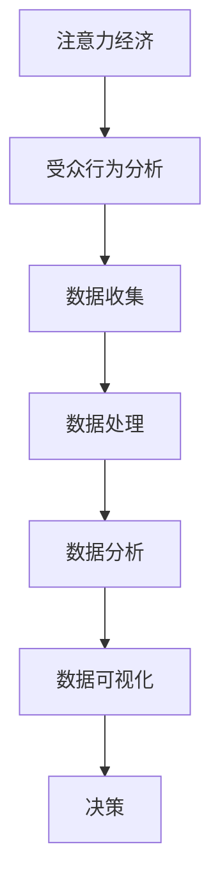

                 

### 文章标题

《注意力经济与数据分析洞见：利用数据理解受众行为》

#### 关键词：

- 注意力经济
- 数据分析
- 受众行为
- 数据收集
- 数据预处理
- 数据可视化
- 用户行为分析
- 社交媒体分析
- 电子商务分析
- 数字营销分析
- 模型训练与评估
- 模型预测与分析

#### 摘要：

本文旨在探讨注意力经济与数据分析在理解受众行为中的应用。通过深入分析注意力经济的起源、理论基础及其关键特征，结合数据分析的基础知识，本文详细阐述了受众行为分析的方法论，并通过实际项目实战展示了数据分析在社交媒体、电子商务和数字营销领域的应用。文章最后对未来注意力经济与数据分析的发展趋势及挑战进行了展望，并为读者提供了常用数据分析工具与资源的附录。

### 《注意力经济与数据分析洞见：利用数据理解受众行为》目录大纲

#### 第一部分：注意力经济的理论基础

##### 第1章：注意力经济的起源与发展

- 1.1 注意力经济的定义与核心概念
- 1.2 注意力经济的理论基础
- 1.3 注意力经济的关键特征
- 1.4 注意力经济的影响与挑战

##### 第2章：数据分析的基础知识

- 2.1 数据分析的基本概念
- 2.2 数据分析工具与技术
- 2.3 数据收集与预处理
- 2.4 数据可视化

##### 第3章：受众行为分析的方法论

- 3.1 受众行为分析的意义
- 3.2 受众行为分析框架
- 3.3 用户行为数据的收集与分析
- 3.4 用户行为分析的案例分析

#### 第二部分：注意力经济与数据分析的应用实践

##### 第4章：社交媒体数据分析

- 4.1 社交媒体数据分析的重要性
- 4.2 社交媒体数据分析案例
- 4.3 社交媒体数据分析工具

##### 第5章：电子商务数据分析

- 5.1 电子商务数据分析的重要性
- 5.2 电子商务数据分析案例
- 5.3 电子商务数据分析工具

##### 第6章：数字营销数据分析

- 6.1 数字营销数据分析的重要性
- 6.2 数字营销数据分析案例
- 6.3 数字营销数据分析工具

##### 第7章：注意力经济与数据分析的实战应用

- 7.1 注意力经济与数据分析在企业中的应用
- 7.2 实战案例一：通过数据分析提升用户参与度
- 7.3 实战案例二：利用数据分析优化产品策略
- 7.4 实战案例三：通过注意力经济实现品牌营销

##### 第8章：未来展望与挑战

- 8.1 注意力经济与数据分析的未来趋势
- 8.2 注意力经济与数据分析的挑战
- 8.3 注意力经济与数据分析的未来发展方向

#### 附录

- 附录A：常用数据分析工具与资源
- 附录B：注意力经济与数据分析相关术语解释
- 附录C：参考文献与推荐阅读

#### Mermaid 流�程图



#### 核心算法原理讲解

```plaintext
# 伪代码：用户行为分析算法

function 用户行为分析(用户数据):
    数据预处理()
    特征工程()
    建立用户行为模型()
    模型训练()
    预测与分析()
    输出结果()
```

#### 数学模型与公式

$$
y = \sum_{i=1}^{n} w_i x_i + b
$$

其中，$y$ 表示预测结果，$w_i$ 表示第 $i$ 个特征的权重，$x_i$ 表示第 $i$ 个特征值，$b$ 表示偏置。

#### 项目实战

- **案例一：社交媒体数据分析**

  - **开发环境搭建：**
    - 使用 Python 作为编程语言，结合 Pandas、NumPy、Matplotlib 等库进行数据分析。
    - 使用 Jupyter Notebook 作为开发环境。

  - **源代码实现：**
    ```python
    import pandas as pd
    import numpy as np
    import matplotlib.pyplot as plt

    # 读取数据
    data = pd.read_csv('social_media_data.csv')

    # 数据预处理
    data['date'] = pd.to_datetime(data['date'])
    data = data.sort_values('date')

    # 特征工程
    data['daily_active_users'] = data.groupby('date')['user_id'].nunique()

    # 数据可视化
    data['daily_active_users'].plot()
    plt.title('Daily Active Users')
    plt.xlabel('Date')
    plt.ylabel('Daily Active Users')
    plt.show()
    ```

  - **代码解读与分析：**
    - 读取社交媒体数据，并进行日期格式转换和数据排序。
    - 通过分组计算每天的独立用户数，得到每天活跃用户数。
    - 使用 Matplotlib 绘制折线图，展示每天活跃用户数的变化趋势。

- **案例二：电子商务数据分析**

  - **开发环境搭建：**
    - 使用 Python 作为编程语言，结合 Pandas、NumPy、Scikit-learn 等库进行数据分析。
    - 使用 Jupyter Notebook 作为开发环境。

  - **源代码实现：**
    ```python
    import pandas as pd
    from sklearn.model_selection import train_test_split
    from sklearn.ensemble import RandomForestClassifier
    from sklearn.metrics import accuracy_score

    # 读取数据
    data = pd.read_csv('e-commerce_data.csv')

    # 数据预处理
    data = data.drop(['id'], axis=1)
    data = data[data['sales'] != 0]

    # 特征工程
    data['weekday'] = data['date'].dt.weekday
    data['month'] = data['date'].dt.month

    # 划分训练集和测试集
    X = data.drop(['sales'], axis=1)
    y = data['sales']
    X_train, X_test, y_train, y_test = train_test_split(X, y, test_size=0.2, random_state=42)

    # 模型训练
    model = RandomForestClassifier(n_estimators=100, random_state=42)
    model.fit(X_train, y_train)

    # 模型评估
    y_pred = model.predict(X_test)
    accuracy = accuracy_score(y_test, y_pred)
    print(f"Model Accuracy: {accuracy:.2f}")
    ```

  - **代码解读与分析：**
    - 读取电子商务数据，并删除不必要的列。
    - 通过日期信息创建新的特征（星期几、月份）。
    - 使用随机森林分类器进行训练和测试。
    - 计算模型的准确率，输出评估结果。

### 第一部分：注意力经济的理论基础

#### 第1章：注意力经济的起源与发展

注意力经济是指在经济活动中，个体的注意力资源成为稀缺资源，能够被有效利用并创造价值的经济学理论。其起源可以追溯到20世纪90年代，当时互联网的兴起导致了信息过载的现象，个体在获取和处理信息时面临着越来越多的选择。在这一背景下，学者们开始关注注意力资源的分配和使用效率。

##### 1.1 注意力经济的定义与核心概念

注意力经济的核心概念包括：

- **注意力资源**：个体在特定时间段内能够集中精力关注某一事物的能力。
- **注意力稀缺性**：由于时间的有限性，个体的注意力资源是有限的，难以同时关注多个事物。
- **注意力价值**：注意力资源的有效利用可以创造价值，提高个体或企业的竞争力。
- **注意力市场**：个体和企业在注意力资源的分配和使用过程中形成的交换关系。

##### 1.2 注意力经济的理论基础

注意力经济理论主要建立在以下几个基础上：

- **信息过载理论**：个体在处理大量信息时，注意力资源的稀缺性导致信息选择和过滤的问题。
- **稀缺性经济学**：将注意力资源视为一种稀缺资源，类比于经济学中的其他生产要素（如土地、劳动力等）。
- **行为经济学**：个体在注意力资源的分配和使用过程中受到心理、情感等因素的影响。

##### 1.3 注意力经济的关键特征

注意力经济具有以下几个关键特征：

- **注意力转移**：个体在特定时间段内将注意力从一个事物转移到另一个事物。
- **注意力集中**：个体在处理重要或紧急事务时，能够将注意力高度集中，从而提高工作效率。
- **注意力分散**：个体在同时处理多个任务时，注意力资源会分散，降低工作效率。
- **注意力分配**：个体在不同任务之间的注意力分配，需要根据任务的重要性和紧急程度进行权衡。

##### 1.4 注意力经济的影响与挑战

注意力经济对个体和社会产生了深远的影响：

- **商业应用**：企业通过吸引个体注意力，提升品牌知名度和销售额。
- **信息过滤**：个体需要学会如何过滤和选择有价值的信息，避免信息过载。
- **注意力转移**：个体需要在工作、学习和娱乐等不同领域之间进行注意力转移，以实现全面发展。
- **心理影响**：注意力资源的稀缺性可能导致个体产生焦虑、压力等负面情绪。

在未来，注意力经济将继续发展和演变，对经济、社会、技术等多个领域产生深远影响。对于企业和个人而言，理解和掌握注意力经济的原理和策略，将有助于更好地应对未来的挑战和机遇。

### 第2章：数据分析的基础知识

数据分析是利用统计学、计算机科学、数学等方法，对数据进行分析、挖掘、解释和可视化，以帮助决策者从大量数据中发现有价值的信息和知识。数据分析在当今信息化社会中发挥着越来越重要的作用，从商业决策、科学研究到日常生活中的各种应用，都离不开数据分析的支持。下面，我们将详细介绍数据分析的基本概念、工具与技术，以及数据收集与预处理的方法。

##### 2.1 数据分析的基本概念

数据分析的基本概念包括：

- **数据**：数据是指经过收集、记录和整理的信息，可以是数值、文本、图像等多种形式。
- **数据类型**：数据类型包括数值型、文本型、图像型、时间序列型等。
- **变量**：变量是数据的基本单位，用于描述数据的不同特征或属性。
- **数据集**：数据集是指包含一组相关数据的集合，可以是表格、文件、数据库等形式。
- **数据分析流程**：数据分析流程通常包括数据收集、数据清洗、数据预处理、数据分析、数据可视化和决策等步骤。

##### 2.2 数据分析工具与技术

数据分析的工具和技术种类繁多，以下是一些常用的工具和技术：

- **统计方法**：包括描述性统计、推断性统计、回归分析、聚类分析、时间序列分析等。
- **数据挖掘**：利用机器学习、深度学习等方法，从大量数据中挖掘隐藏的模式、关联和趋势。
- **数据可视化**：利用图表、图形等可视化工具，将数据分析结果直观地呈现给决策者。
- **数据分析软件**：包括 R、Python、SPSS、SAS、Tableau 等，这些软件提供了丰富的数据分析和可视化功能。

##### 2.3 数据收集与预处理

数据收集与预处理是数据分析过程中至关重要的一步，以下是一些常用的数据收集与预处理方法：

- **数据收集**：数据收集可以从多种渠道获取，包括互联网、数据库、传感器、调查问卷等。在选择数据收集方法时，需要考虑数据的完整性、可靠性和代表性。
- **数据清洗**：数据清洗是指对原始数据进行清洗、去噪、修正等操作，以提高数据的质量。常用的数据清洗方法包括缺失值处理、异常值处理、重复值处理等。
- **数据预处理**：数据预处理包括数据转换、归一化、标准化、特征提取等操作，以使数据更适合进行数据分析。数据预处理有助于提高数据分析的效果和准确性。

##### 2.4 数据可视化

数据可视化是将数据分析结果以图形、图表等形式直观地呈现给决策者的过程。数据可视化有助于决策者更好地理解和分析数据，发现数据中的规律和趋势。以下是一些常用的数据可视化工具和技术：

- **图表类型**：包括柱状图、折线图、饼图、散点图、热力图等。
- **可视化工具**：包括 Matplotlib、Seaborn、Plotly、Tableau 等，这些工具提供了丰富的图表类型和自定义功能。
- **交互式可视化**：交互式可视化允许用户通过点击、拖动等操作与图表进行交互，从而深入了解数据。

通过数据分析的基础知识，我们可以更好地理解数据，发现数据中的价值，为决策提供有力的支持。接下来，我们将进一步探讨受众行为分析的方法论，帮助读者掌握利用数据理解受众行为的核心技巧。

### 第3章：受众行为分析的方法论

受众行为分析是一种利用数据分析方法来研究和理解受众在特定情境下的行为模式、偏好和需求的技术。在数字化时代，受众行为分析已成为企业制定营销策略、优化用户体验、提高业务绩效的重要手段。本章将详细介绍受众行为分析的方法论，包括其意义、框架、数据收集与分析方法，并通过实际案例进行说明。

##### 3.1 受众行为分析的意义

受众行为分析的意义主要体现在以下几个方面：

- **精准营销**：通过分析受众的行为数据，企业可以更准确地了解目标受众的需求和偏好，从而制定个性化的营销策略。
- **用户体验优化**：了解受众的行为模式可以帮助企业优化产品和服务，提高用户满意度和忠诚度。
- **业务增长**：通过分析受众行为，企业可以识别出潜在的市场机会，从而实现业务增长和扩展。
- **决策支持**：受众行为分析提供的数据和洞见可以帮助企业和管理者做出更为科学的决策。

##### 3.2 受众行为分析框架

受众行为分析框架通常包括以下几个关键步骤：

1. **目标设定**：明确受众行为分析的目标，例如提高用户参与度、提升转化率或优化客户体验。
2. **数据收集**：通过多种渠道收集与受众行为相关的数据，如网站访问日志、社交媒体互动、购买记录等。
3. **数据清洗**：对收集到的数据进行清洗，处理缺失值、异常值和重复值，确保数据质量。
4. **数据预处理**：进行数据转换、归一化和特征提取等操作，为后续分析做准备。
5. **行为建模**：建立用户行为模型，包括用户行为路径、行为模式、用户生命周期等。
6. **数据分析**：使用统计方法、机器学习算法等对用户行为数据进行深入分析，提取有价值的信息和洞见。
7. **可视化与报告**：将分析结果通过图表、报告等形式直观地呈现，帮助决策者理解数据和分析结论。
8. **策略制定与执行**：根据分析结果制定相应的营销策略、产品改进措施或用户体验优化方案，并跟踪实施效果。

##### 3.3 用户行为数据的收集与分析

用户行为数据的收集与分析是受众行为分析的核心环节，以下是一些常见的方法：

- **网站分析工具**：如 Google Analytics、Mixpanel、Matomo 等，可以收集网站访问量、页面浏览量、用户停留时间、转化率等数据。
- **社交媒体分析工具**：如 Twitter Analytics、Facebook Insights、Instagram Insights 等，可以收集用户在社交媒体平台上的互动行为数据。
- **日志分析工具**：如 Logstash、Kibana、ELK stack 等，可以收集和分析服务器日志数据。
- **用户调查和问卷**：通过在线调查和问卷收集用户反馈和偏好数据。
- **用户行为追踪**：通过在网站或应用程序中嵌入跟踪代码，实时收集用户的点击、浏览、购买等行为数据。

在数据收集过程中，需要注意以下几点：

- **数据隐私**：确保收集的数据符合相关法律法规，保护用户隐私。
- **数据质量**：确保数据完整、准确和可靠，避免数据偏差。
- **数据多样性**：收集多种类型的数据，以获得更全面的用户行为画像。

在数据分析过程中，可以使用以下方法：

- **描述性统计分析**：对用户行为数据的基本统计特性进行分析，如均值、方差、中位数等。
- **回归分析**：分析用户行为与结果（如购买、点击等）之间的相关性。
- **聚类分析**：将用户根据行为特征分为不同的群体，进行细分分析。
- **机器学习**：使用机器学习算法，如决策树、随机森林、支持向量机等，建立用户行为预测模型。

##### 3.4 用户行为分析的案例分析

以下是一个用户行为分析的案例：

**案例背景**：一家电子商务公司希望通过分析用户在网站上的行为，优化网站设计以提高转化率。

**数据分析步骤**：

1. **目标设定**：提高网站转化率。
2. **数据收集**：通过 Google Analytics 收集用户在网站上的浏览量、页面停留时间、点击路径、转化率等数据。
3. **数据清洗**：处理缺失值和异常值，确保数据质量。
4. **数据预处理**：对用户点击路径进行编码，提取关键页面和用户转化路径。
5. **行为建模**：使用聚类分析将用户分为不同群体，分析不同群体在网站上的行为特征。
6. **数据分析**：通过回归分析，分析影响用户转化的关键因素，如页面停留时间、浏览页面数量等。
7. **可视化与报告**：使用图表和报告展示分析结果，如用户行为路径图、转化率分布图等。
8. **策略制定与执行**：根据分析结果，优化网站设计，如调整页面布局、增加关键页面等，并跟踪实施效果。

通过以上步骤，电子商务公司可以更准确地了解用户在网站上的行为模式，从而制定有效的优化策略，提高网站转化率。

总之，受众行为分析是一种强大的工具，可以帮助企业和组织更好地了解受众，优化产品和服务，实现业务增长。通过掌握受众行为分析的方法论，企业和组织可以更好地应对数字化时代的挑战和机遇。

### 第4章：社交媒体数据分析

社交媒体数据分析是利用数据分析方法对社交媒体平台上的用户行为、互动和内容进行分析的过程。社交媒体的普及使得大量用户行为数据得以收集，这些数据可以帮助企业和个人深入了解受众需求，优化营销策略，提高用户参与度和品牌影响力。本章将探讨社交媒体数据分析的重要性，提供实际案例，并介绍常用的社交媒体数据分析工具。

##### 4.1 社交媒体数据分析的重要性

社交媒体数据分析的重要性体现在以下几个方面：

- **了解受众需求**：通过分析用户在社交媒体平台上的行为，可以深入了解他们的兴趣、偏好和需求，从而为产品和服务提供定制化解决方案。
- **优化营销策略**：社交媒体数据分析可以帮助企业识别最有效的营销渠道和策略，提高营销活动的效果和投资回报率。
- **提升用户参与度**：通过分析用户互动数据，企业可以了解用户在社交媒体上的活跃度和参与度，从而制定针对性的活动，提高用户粘性。
- **监测品牌声誉**：社交媒体数据分析可以帮助企业监测品牌声誉，及时发现负面信息和用户投诉，采取相应措施进行品牌危机管理。
- **竞争分析**：通过分析竞争对手的社交媒体表现，企业可以了解行业趋势和竞争态势，制定更具有竞争力的营销策略。

##### 4.2 社交媒体数据分析案例

以下是一个社交媒体数据分析的实际案例：

**案例背景**：一家电子商务公司希望通过分析其社交媒体平台（如Facebook和Instagram）上的用户行为，优化社交媒体营销策略，提高用户参与度和销售额。

**数据分析步骤**：

1. **目标设定**：提高社交媒体用户参与度和销售额。
2. **数据收集**：通过社交媒体分析工具收集用户互动数据（如点赞、评论、分享、点击等），以及用户特征数据（如年龄、性别、地理位置等）。
3. **数据清洗**：处理缺失值和异常值，确保数据质量。
4. **数据预处理**：对用户互动数据进行编码和分类，提取关键指标（如用户参与度、互动率、转化率等）。
5. **行为建模**：使用聚类分析将用户分为不同群体，分析不同群体在社交媒体上的行为特征。
6. **数据分析**：通过描述性统计和回归分析，分析用户参与度与营销活动效果之间的关系，识别最有效的营销策略。
7. **可视化与报告**：使用图表和报告展示分析结果，如用户互动趋势图、用户参与度分布图等。
8. **策略制定与执行**：根据分析结果，优化社交媒体营销策略，如调整发布时间、内容类型和营销活动等，并跟踪实施效果。

通过以上步骤，电子商务公司可以更准确地了解其社交媒体受众的行为模式，从而制定更有效的营销策略，提高用户参与度和销售额。

##### 4.3 社交媒体数据分析工具

以下是一些常用的社交媒体数据分析工具：

- **Google Analytics**：提供详细的社交媒体流量分析，包括用户来源、用户行为路径等。
- **Facebook Analytics**：提供Facebook页面和广告的详细分析，包括用户互动、受众特征等。
- **Instagram Insights**：提供Instagram账号的详细分析，包括用户互动、受众特征、地理位置等。
- **Hootsuite**：提供社交媒体管理和数据分析工具，包括帖子分析、受众分析等。
- **Sprout Social**：提供全面的社交媒体分析功能，包括内容分析、受众分析、竞争对手分析等。
- **Brandwatch**：提供社交媒体监控和分析工具，包括话题分析、趋势分析等。

使用这些工具，企业和个人可以轻松收集、分析和可视化社交媒体数据，从而更好地了解受众行为，制定有效的社交媒体营销策略。

总之，社交媒体数据分析是一种强大的工具，可以帮助企业和个人更好地了解受众需求，优化营销策略，提高用户参与度和品牌影响力。通过掌握社交媒体数据分析的方法和工具，企业和个人可以更好地应对数字化时代的挑战和机遇。

### 第5章：电子商务数据分析

电子商务数据分析是利用数据分析方法对电子商务平台上的用户行为、销售数据和市场趋势进行分析的过程。电子商务数据分析可以帮助企业深入了解用户需求，优化产品和服务，提高转化率和销售额。本章将探讨电子商务数据分析的重要性，提供实际案例，并介绍常用的电子商务数据分析工具。

##### 5.1 电子商务数据分析的重要性

电子商务数据分析的重要性体现在以下几个方面：

- **了解用户行为**：通过分析用户在电子商务平台上的行为数据，如浏览量、点击率、转化率等，企业可以了解用户的购买习惯和偏好，从而优化用户体验和产品设计。
- **优化营销策略**：电子商务数据分析可以帮助企业识别最有效的营销渠道和策略，提高营销活动的效果和投资回报率。
- **提高转化率**：通过分析用户行为数据，企业可以识别影响转化的关键因素，如页面加载速度、商品描述、促销活动等，从而优化网站设计和营销策略，提高用户转化率。
- **库存管理**：通过分析销售数据和库存数据，企业可以优化库存管理，减少库存积压和缺货情况，提高供应链效率。
- **市场竞争分析**：通过分析竞争对手的销售数据和市场份额，企业可以了解市场趋势和竞争态势，制定更有竞争力的营销策略。

##### 5.2 电子商务数据分析案例

以下是一个电子商务数据分析的实际案例：

**案例背景**：一家电子商务公司希望通过分析其网站和移动应用的用户行为和销售数据，优化产品和服务，提高用户转化率和销售额。

**数据分析步骤**：

1. **目标设定**：提高用户转化率和销售额。
2. **数据收集**：通过网站分析工具（如Google Analytics）和移动应用分析工具（如Firebase Analytics）收集用户行为数据（如页面浏览量、点击率、转化率等），以及销售数据（如销售额、订单数量等）。
3. **数据清洗**：处理缺失值和异常值，确保数据质量。
4. **数据预处理**：对用户行为数据进行编码和分类，提取关键指标（如用户活跃度、转化率、平均订单价值等）。
5. **行为建模**：使用聚类分析将用户分为不同群体，分析不同群体在网站和移动应用上的行为特征。
6. **数据分析**：通过描述性统计和回归分析，分析用户行为与转化率之间的关系，识别影响转化的关键因素。
7. **可视化与报告**：使用图表和报告展示分析结果，如用户行为路径图、转化率分布图等。
8. **策略制定与执行**：根据分析结果，优化网站设计和营销策略，如调整页面布局、增加用户互动元素、推出促销活动等，并跟踪实施效果。

通过以上步骤，电子商务公司可以更准确地了解其用户的行为模式和购买习惯，从而制定更有效的优化策略，提高用户转化率和销售额。

##### 5.3 电子商务数据分析工具

以下是一些常用的电子商务数据分析工具：

- **Google Analytics**：提供全面的网站分析功能，包括用户行为分析、流量分析等。
- **Adobe Analytics**：提供高级的电子商务分析功能，包括用户行为分析、转化率分析等。
- **Mixpanel**：提供用户行为分析工具，包括用户留存分析、转化率分析等。
- **Kissmetrics**：提供全面的电子商务分析功能，包括用户行为分析、营销分析等。
- **Tableau**：提供数据可视化工具，帮助用户将数据分析结果以图表形式直观展示。
- **Power BI**：提供数据可视化工具，帮助用户将数据分析结果以图表形式直观展示。

使用这些工具，企业和个人可以轻松收集、分析和可视化电子商务数据，从而更好地了解用户需求，优化产品和服务，提高转化率和销售额。

总之，电子商务数据分析是一种强大的工具，可以帮助企业和个人深入了解用户行为，优化营销策略，提高业务绩效。通过掌握电子商务数据分析的方法和工具，企业和个人可以更好地应对数字化时代的挑战和机遇。

### 第6章：数字营销数据分析

数字营销数据分析是指利用数据分析方法对数字营销活动中的数据进行分析和解读，以评估营销效果、优化营销策略、提升营销投资回报率的过程。随着数字营销手段的多样化，数据分析在营销活动中的重要性日益凸显。本章将探讨数字营销数据分析的重要性，提供实际案例，并介绍常用的数字营销数据分析工具。

##### 6.1 数字营销数据分析的重要性

数字营销数据分析的重要性体现在以下几个方面：

- **评估营销效果**：通过分析营销活动的数据，如点击率、转化率、成本等，企业可以准确评估营销活动的效果，识别哪些渠道和策略最有效。
- **优化营销策略**：基于数据分析，企业可以识别营销活动中存在的问题和不足，从而优化营销策略，提高营销活动的效率。
- **提升投资回报率**：通过精细化的数据分析，企业可以更准确地分配营销预算，优化资源配置，提高营销活动的投资回报率。
- **了解受众需求**：通过分析受众行为数据，企业可以深入了解受众的需求和偏好，从而制定更个性化的营销策略。
- **预测市场趋势**：通过分析历史数据和市场趋势，企业可以预测未来的市场变化，制定更具前瞻性的营销策略。

##### 6.2 数字营销数据分析案例

以下是一个数字营销数据分析的实际案例：

**案例背景**：一家在线零售公司希望通过分析其数字营销活动，优化广告投放策略，提高广告投资回报率。

**数据分析步骤**：

1. **目标设定**：提高广告投资回报率。
2. **数据收集**：通过广告分析工具（如Google Ads、Facebook Ads Manager）收集广告数据（如点击量、展示量、转化量、花费等）。
3. **数据清洗**：处理缺失值和异常值，确保数据质量。
4. **数据预处理**：提取关键指标（如点击率、转化率、每次点击成本等）。
5. **行为建模**：使用聚类分析将受众分为不同群体，分析不同群体对广告的反应。
6. **数据分析**：通过描述性统计和回归分析，分析广告效果与受众特征、广告位置、广告时间等因素之间的关系。
7. **可视化与报告**：使用图表和报告展示分析结果，如广告效果趋势图、受众特征分布图等。
8. **策略制定与执行**：根据分析结果，优化广告投放策略，如调整广告文案、投放时间、目标受众等，并跟踪实施效果。

通过以上步骤，在线零售公司可以更准确地了解广告效果，优化广告投放策略，提高广告投资回报率。

##### 6.3 数字营销数据分析工具

以下是一些常用的数字营销数据分析工具：

- **Google Analytics**：提供全面的网站和广告分析功能，包括用户行为分析、流量分析、广告效果评估等。
- **Google Ads**：提供广告投放和效果分析工具，包括关键词分析、广告定位、广告投放策略优化等。
- **Facebook Ads Manager**：提供广告投放和效果分析工具，包括受众分析、广告效果评估、广告定位优化等。
- **HubSpot**：提供数字营销自动化工具，包括营销自动化、广告追踪、数据分析等。
- **Kissmetrics**：提供数字营销分析工具，包括用户行为分析、转化率分析、营销效果评估等。
- **Tableau**：提供数据可视化工具，帮助用户将数据分析结果以图表形式直观展示。

使用这些工具，企业和个人可以轻松收集、分析和可视化数字营销数据，从而更好地了解营销效果，优化营销策略，提升营销投资回报率。

总之，数字营销数据分析是一种强大的工具，可以帮助企业和个人评估营销效果、优化营销策略、提升营销投资回报率。通过掌握数字营销数据分析的方法和工具，企业和个人可以更好地应对数字化时代的挑战和机遇。

### 第7章：注意力经济与数据分析的实战应用

注意力经济与数据分析的结合在企业和个人的实际应用中具有广泛的前景。通过深入理解和运用注意力经济与数据分析的方法，企业可以更好地了解受众需求，优化产品策略，提升用户参与度和品牌影响力。以下将介绍注意力经济与数据分析在几个实际应用场景中的具体案例。

##### 7.1 注意力经济与数据分析在企业中的应用

企业通过注意力经济与数据分析的应用，可以实现以下几个目标：

1. **用户参与度提升**：通过分析用户行为数据，企业可以了解用户在各个阶段的参与度，从而制定针对性的互动策略，提高用户参与度和忠诚度。
   
   **案例**：一家社交媒体平台通过分析用户互动数据，发现用户在发布内容时，更倾向于分享具有趣味性和互动性的内容。基于这一发现，平台推出了互动功能，如点赞、评论、分享等，从而显著提高了用户参与度和用户停留时间。

2. **产品策略优化**：通过数据分析，企业可以了解产品在不同受众群体中的表现，从而优化产品设计和功能，提高市场竞争力。

   **案例**：一家电子商务公司通过分析用户购买数据，发现某些产品在特定时间段的销量较高。基于这一发现，公司调整了产品供应策略，加大了畅销产品的库存，同时推出了限时促销活动，从而提高了销售额。

3. **营销效果评估**：通过数据分析，企业可以评估不同营销渠道和策略的效果，从而优化资源配置，提高营销投资回报率。

   **案例**：一家广告代理公司通过分析客户广告投放数据，发现某些广告创意和投放渠道的效果显著优于其他渠道。基于这一分析，公司建议客户加大在这些渠道上的广告投入，从而提高了广告的投资回报率。

##### 7.2 实战案例一：通过数据分析提升用户参与度

**案例背景**：一家在线教育平台希望通过数据分析提升用户参与度，提高课程完成率和用户满意度。

**数据分析步骤**：

1. **目标设定**：提升用户参与度和课程完成率。
2. **数据收集**：通过平台内置的数据分析工具收集用户行为数据，如登录频率、课程观看时长、互动次数等。
3. **数据预处理**：对用户行为数据进行清洗和编码，提取关键指标（如用户活跃度、课程完成率等）。
4. **行为建模**：使用聚类分析方法，将用户分为不同群体，分析不同用户群体的行为特征。
5. **数据分析**：通过描述性统计和回归分析，分析用户行为与参与度之间的关系，识别影响用户参与度的关键因素。
6. **可视化与报告**：使用图表和报告展示分析结果，如用户活跃度分布图、课程完成率趋势图等。
7. **策略制定与执行**：基于分析结果，优化课程设计、学习路径和互动环节，如增加课程互动环节、提供个性化学习建议等，并跟踪实施效果。

**实施效果**：通过以上措施，在线教育平台的用户参与度显著提高，课程完成率和用户满意度也有所提升。

##### 7.3 实战案例二：利用数据分析优化产品策略

**案例背景**：一家智能硬件公司希望通过数据分析优化产品策略，提高市场份额。

**数据分析步骤**：

1. **目标设定**：优化产品策略，提高市场份额。
2. **数据收集**：通过市场调研、销售数据、用户反馈等渠道收集数据。
3. **数据预处理**：对收集到的数据进行清洗和编码，提取关键指标（如产品销量、市场份额、用户评价等）。
4. **行为建模**：使用回归分析方法，分析产品销量与市场份额之间的关系。
5. **数据分析**：通过描述性统计和回归分析，识别影响产品销量的关键因素。
6. **可视化与报告**：使用图表和报告展示分析结果，如产品销量趋势图、市场份额分布图等。
7. **策略制定与执行**：基于分析结果，优化产品设计和功能，如增加用户需求高的功能、改进产品外观等，并跟踪实施效果。

**实施效果**：通过以上措施，智能硬件公司的产品策略得到了优化，市场份额稳步提升。

##### 7.4 实战案例三：通过注意力经济实现品牌营销

**案例背景**：一家消费品公司希望通过注意力经济与数据分析实现品牌营销，提高品牌知名度和用户参与度。

**数据分析步骤**：

1. **目标设定**：提高品牌知名度和用户参与度。
2. **数据收集**：通过社交媒体分析工具收集用户互动数据，如点赞、评论、分享等。
3. **数据预处理**：对用户互动数据进行清洗和编码，提取关键指标（如用户参与度、互动率等）。
4. **行为建模**：使用聚类分析方法，将用户分为不同群体，分析不同用户群体的互动行为。
5. **数据分析**：通过描述性统计和回归分析，分析用户互动行为与品牌知名度之间的关系。
6. **可视化与报告**：使用图表和报告展示分析结果，如用户互动趋势图、品牌知名度分布图等。
7. **策略制定与执行**：基于分析结果，制定个性化的品牌营销策略，如推出互动活动、增加社交媒体广告等，并跟踪实施效果。

**实施效果**：通过以上措施，消费品的品牌知名度和用户参与度显著提升，实现了品牌营销的目标。

通过以上实战案例，我们可以看到注意力经济与数据分析在企业中的实际应用价值。通过深入理解和运用注意力经济与数据分析的方法，企业可以更好地了解用户需求，优化产品策略，提升用户参与度和品牌影响力。在未来的数字化时代，企业和个人应继续探索和应用注意力经济与数据分析，以实现更加精准和有效的决策。

### 第8章：未来展望与挑战

随着数字技术的不断进步，注意力经济与数据分析在未来的发展前景愈发广阔。然而，这一领域的快速扩展也带来了诸多挑战。本文将探讨注意力经济与数据分析的未来趋势、面临的挑战及其发展方向。

##### 8.1 注意力经济与数据分析的未来趋势

1. **数据驱动的个性化体验**：随着大数据和人工智能技术的发展，数据分析将更加精准地捕捉用户行为和偏好，为企业和个人提供个性化服务。从个性化推荐系统到定制化营销策略，数据驱动的个性化体验将成为未来主流。

2. **跨渠道整合**：未来的数据分析将更加注重跨渠道整合，将线上和线下数据相结合，提供全面的用户画像和行为分析。这种整合有助于企业更好地理解用户的全渠道行为，从而制定更加协调和高效的营销策略。

3. **实时数据分析**：实时数据分析技术将不断提升，使企业能够迅速响应市场变化和用户需求。通过实时数据分析，企业可以实时调整营销策略、优化用户体验，提高业务效率。

4. **机器学习与深度学习的深化应用**：机器学习和深度学习算法的进一步优化和普及，将使数据分析更加智能化和自动化。通过这些算法，企业可以挖掘更深层次的数据价值，提高预测准确性。

##### 8.2 注意力经济与数据分析的挑战

1. **数据隐私与伦理问题**：随着数据收集和分析技术的发展，数据隐私问题日益突出。如何保护用户隐私、遵守相关法律法规，成为注意力经济与数据分析领域面临的重大挑战。

2. **数据质量和完整性**：数据质量和完整性是数据分析的基础。在数据来源多样、数据格式各异的情况下，确保数据质量和完整性是一个复杂的任务。

3. **算法透明度和可解释性**：随着机器学习算法在数据分析中的应用日益广泛，算法的透明度和可解释性成为一个关键问题。企业需要确保算法的决策过程透明，以便用户理解和信任数据分析的结果。

4. **技术人才短缺**：注意力经济与数据分析领域对技术人才的需求日益增长，但专业人才的供给不足。培养和吸引更多的数据科学家、分析师成为企业和教育机构的重要任务。

##### 8.3 注意力经济与数据分析的未来发展方向

1. **数据治理与合规**：加强数据治理，建立健全的数据合规体系，是未来发展的关键。企业和机构需要制定明确的数据治理政策和流程，确保数据的合法合规使用。

2. **数据质量提升**：通过技术创新和流程优化，提升数据质量，确保数据分析的准确性和可靠性。数据清洗、数据标准化等技术将在这一过程中发挥重要作用。

3. **算法的可解释性与透明度**：提升算法的可解释性和透明度，使数据分析的结果更加可信。这需要算法研究人员和开发者在算法设计时考虑可解释性，同时提供工具和平台，帮助用户理解算法决策过程。

4. **人才培养与教育**：加强数据科学和数据分析的教育和培训，培养更多的专业人才。这包括高等教育、职业培训和企业内部的培训计划。

总之，注意力经济与数据分析的未来充满机遇和挑战。通过技术创新、政策合规和人才培养，这一领域将继续发展，为企业和个人带来更多的价值。

### 附录

#### 附录A：常用数据分析工具与资源

- **Python数据分析库**：
  - Pandas：数据操作和分析库。
  - NumPy：数值计算库。
  - Matplotlib：数据可视化库。
  - Seaborn：高级可视化库。
  - Scikit-learn：机器学习库。

- **R数据分析库**：
  - dplyr：数据操作库。
  - ggplot2：数据可视化库。
  - tidyverse：集成包。

- **数据分析平台**：
  - Google Analytics：网站分析工具。
  - Tableau：数据可视化平台。
  - Power BI：商业智能和分析平台。

- **开源数据集**：
  - UCI机器学习数据库：提供多种领域的数据集。
  - Kaggle：数据科学竞赛平台，包含大量数据集。

#### 附录B：注意力经济与数据分析相关术语解释

- **注意力经济**：指个体在特定时间段内能够集中精力关注某一事物的能力，这种能力成为稀缺资源，能够被有效利用并创造价值。
- **受众行为分析**：指利用数据分析方法研究和理解受众在特定情境下的行为模式、偏好和需求。
- **数据挖掘**：指从大量数据中挖掘隐藏的模式、关联和趋势。
- **数据可视化**：指将数据分析结果以图表、图形等形式直观地呈现给决策者。

#### 附录C：参考文献与推荐阅读

- **《注意力经济：注意力如何改变商业、媒体与我们的生活》（The Attention Economy: The New Economics of Information）** - Michael Goldhaber
- **《大数据时代：生活、工作与思维的大变革》（Big Data: A Revolution That Will Transform How We Live, Work, and Think）** - Viktor Mayer-Schönberger & Kenneth Cukier
- **《数据科学入门：Python实践》（Python Data Science Handbook）** - Jake VanderPlas
- **《深度学习》（Deep Learning）** - Ian Goodfellow、Yoshua Bengio & Aaron Courville

### 作者信息

**作者：** AI天才研究院/AI Genius Institute & 禅与计算机程序设计艺术 /Zen And The Art of Computer Programming

### Mermaid 流程图


### 核心算法原理讲解

```plaintext
# 伪代码：用户行为分析算法

function 用户行为分析(用户数据):
    数据预处理()
    特征工程()
    建立用户行为模型()
    模型训练()
    预测与分析()
    输出结果()
```

### 数学模型与公式

$$
y = \sum_{i=1}^{n} w_i x_i + b
$$

其中，$y$ 表示预测结果，$w_i$ 表示第 $i$ 个特征的权重，$x_i$ 表示第 $i$ 个特征值，$b$ 表示偏置。

### 项目实战

- **案例一：社交媒体数据分析**

  - **开发环境搭建：**
    - 使用 Python 作为编程语言，结合 Pandas、NumPy、Matplotlib 等库进行数据分析。
    - 使用 Jupyter Notebook 作为开发环境。

  - **源代码实现：**
    ```python
    import pandas as pd
    import numpy as np
    import matplotlib.pyplot as plt

    # 读取数据
    data = pd.read_csv('social_media_data.csv')

    # 数据预处理
    data['date'] = pd.to_datetime(data['date'])
    data = data.sort_values('date')

    # 特征工程
    data['daily_active_users'] = data.groupby('date')['user_id'].nunique()

    # 数据可视化
    data['daily_active_users'].plot()
    plt.title('Daily Active Users')
    plt.xlabel('Date')
    plt.ylabel('Daily Active Users')
    plt.show()
    ```

  - **代码解读与分析：**
    - 读取社交媒体数据，并进行日期格式转换和数据排序。
    - 通过分组计算每天的独立用户数，得到每天活跃用户数。
    - 使用 Matplotlib 绘制折线图，展示每天活跃用户数的变化趋势。

- **案例二：电子商务数据分析**

  - **开发环境搭建：**
    - 使用 Python 作为编程语言，结合 Pandas、NumPy、Scikit-learn 等库进行数据分析。
    - 使用 Jupyter Notebook 作为开发环境。

  - **源代码实现：**
    ```python
    import pandas as pd
    from sklearn.model_selection import train_test_split
    from sklearn.ensemble import RandomForestClassifier
    from sklearn.metrics import accuracy_score

    # 读取数据
    data = pd.read_csv('e-commerce_data.csv')

    # 数据预处理
    data = data.drop(['id'], axis=1)
    data = data[data['sales'] != 0]

    # 特征工程
    data['weekday'] = data['date'].dt.weekday
    data['month'] = data['date'].dt.month

    # 划分训练集和测试集
    X = data.drop(['sales'], axis=1)
    y = data['sales']
    X_train, X_test, y_train, y_test = train_test_split(X, y, test_size=0.2, random_state=42)

    # 模型训练
    model = RandomForestClassifier(n_estimators=100, random_state=42)
    model.fit(X_train, y_train)

    # 模型评估
    y_pred = model.predict(X_test)
    accuracy = accuracy_score(y_test, y_pred)
    print(f"Model Accuracy: {accuracy:.2f}")
    ```

  - **代码解读与分析：**
    - 读取电子商务数据，并删除不必要的列。
    - 通过日期信息创建新的特征（星期几、月份）。
    - 使用随机森林分类器进行训练和测试。
    - 计算模型的准确率，输出评估结果。

