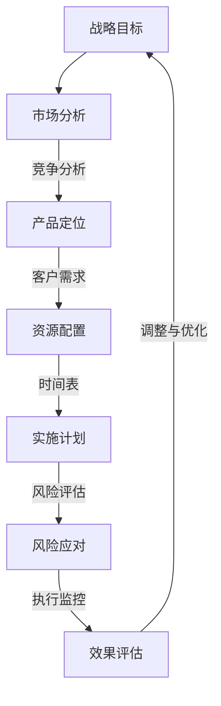
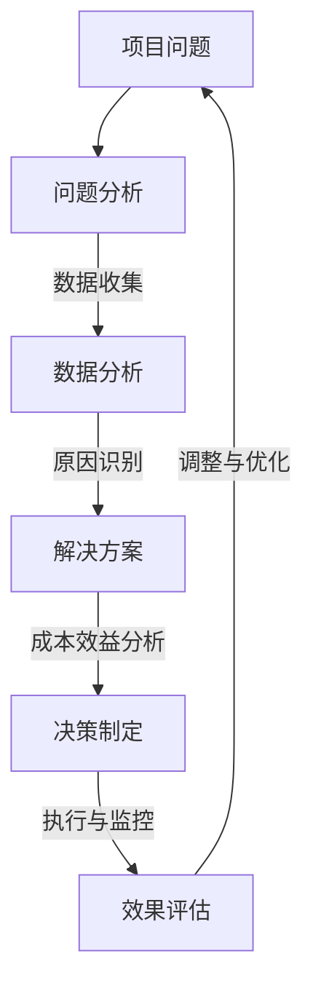
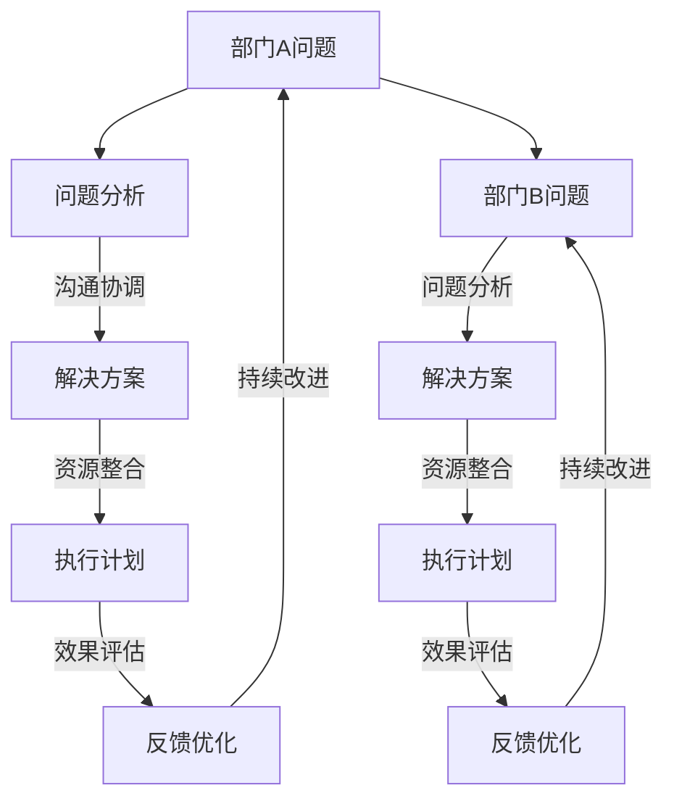

                 

# 深度思考与管理分析能力

> **关键词**：深度思考、管理分析能力、问题解决、决策制定、创新思维、实践应用

> **摘要**：本文将探讨深度思考与管理分析能力的重要性，解析其基本原则、方法和技术，并分析其在学术研究、职场应用和生活管理中的具体实践。通过详细的案例分析，我们将了解如何提升深度思考与管理分析能力，为个人和组织的成功奠定基础。

## 目录

### 《深度思考与管理分析能力》

> **关键词**：深度思考、管理分析能力、问题解决、决策制定、创新思维、实践应用

> **摘要**：本文将探讨深度思考与管理分析能力的重要性，解析其基本原则、方法和技术，并分析其在学术研究、职场应用和生活管理中的具体实践。通过详细的案例分析，我们将了解如何提升深度思考与管理分析能力，为个人和组织的成功奠定基础。

### 第一部分：深度思考基础

#### 第1章：深度思考的起源与重要性

#### 第2章：深度思考的基本原则

#### 第3章：深度思考的技术与实践

#### 第4章：深度思考在学术研究中的应用

#### 第5章：深度思考在职场中的应用

#### 第6章：深度思考在生活管理中的应用

#### 第7章：深度思考的挑战与提升

### 第二部分：深度思考与管理分析能力综合应用

#### 第8章：深度思考与管理分析能力的综合应用

### 附录

#### 附录A：深度思考与管理分析能力的应用案例

#### 附录B：深度思考与管理分析能力提升的工具与资源

## 引言

在当今快速发展的信息技术时代，深度思考与管理分析能力的重要性日益凸显。无论是学术界、职场还是生活管理，深度思考都成为了我们解决问题、做出决策、创新思维的关键能力。然而，深度思考并非天生具备，而是需要通过系统的学习和实践逐步培养和提高。

本文旨在探讨深度思考与管理分析能力的内涵、原则、方法和技术，分析其在不同领域的具体应用，并探讨如何提升这些能力。通过本文的阅读，读者将了解到深度思考与管理分析能力的重要性，以及如何在实际生活和工作中应用这些能力，为个人和组织的成功奠定基础。

### 深度思考的起源与重要性

深度思考作为一种思维方法，其起源可以追溯到古代哲学和科学领域。自古以来，人类就对自然现象和人类社会运行规律进行深度思考，以求揭示其背后的本质和规律。古希腊哲学家苏格拉底以其提问式的深度思考方法而闻名，亚里士多德则通过观察和实验提出了许多重要的科学原理。

随着科学技术的进步，深度思考在各个领域得到了广泛应用。20世纪以来，深度思考在计算机科学、人工智能、经济学、心理学等领域得到了深入研究。计算机科学家图灵提出了图灵机的理论，揭示了计算的本质。经济学家凯恩斯则通过深度思考提出了宏观经济运行的规律。心理学家皮亚杰通过观察和实验，揭示了儿童认知发展的规律。

在现代社会，深度思考的重要性更加凸显。首先，深度思考有助于我们更好地理解复杂问题。随着社会的发展，问题变得更加复杂，仅仅依靠表面的观察和简单的推理已经无法解决。深度思考能够帮助我们深入挖掘问题的本质，找到解决问题的关键。其次，深度思考能够提高我们的决策能力。在职场中，决策往往需要考虑多方面的因素，需要具备前瞻性和全局观念。深度思考能够帮助我们全面分析问题，做出更加明智的决策。最后，深度思考能够促进创新思维。创新思维是推动社会进步的重要力量，而深度思考则是创新思维的基础。通过深度思考，我们能够发现新的问题和机会，从而推动创新。

总之，深度思考作为一种重要的思维方法，在现代社会中具有不可替代的作用。它不仅能够帮助我们更好地解决问题，提高决策能力，还能促进创新思维的发展。因此，培养和提高深度思考能力对于我们个人和组织的成功至关重要。

### 深度思考的基本原则

深度思考作为一种重要的思维方法，其核心在于对问题的深入剖析和全面理解。为了实现这一目标，我们需要遵循一系列基本原则，以确保思考的深度和质量。

首先，理解问题的重要性。深度思考的第一步是理解问题本身。这不仅仅是对问题表面现象的观察和描述，而是要深入挖掘问题的本质，明确问题的核心。理解问题的重要性在于，只有对问题有全面和深入的了解，我们才能找到解决问题的有效方法。例如，在解决一个技术难题时，我们需要明确问题的根源，了解相关技术和数据，从而提出针对性的解决方案。

其次，提问技巧与问题分析。深度思考需要我们具备良好的提问技巧，通过不断提问来推动思考的深入。一个有效的提问可以引导我们从一个新的角度审视问题，发现问题的更多细节。在提问过程中，我们需要注意以下几点：一是要具体，避免抽象和模糊的问题；二是要开放，鼓励多种可能性的思考；三是要有针对性，针对问题的关键点进行提问。例如，在分析一个项目进度延误的原因时，我们可以提问：“是否是由于人员不足引起的？”或“是否是由于技术问题导致的？”。通过这样的提问，我们可以逐步分析问题的各个方面，找到解决问题的关键。

第三，深度思考的方法论。深度思考不是一蹴而就的，而是一个逐步深入、系统分析的过程。具体来说，我们可以采用以下几种方法：

1. **分解法**：将复杂问题分解为若干个子问题，逐一分析，从而理解问题的整体结构。例如，在分析一个复杂的企业战略时，我们可以将其分解为市场分析、竞争分析、资源评估等子问题，逐一进行分析。

2. **联想法**：通过问题之间的关联，寻找问题的共同点和差异点，从而发现问题的本质。例如，在研究一个技术问题时，我们可以联想到其他类似的技术和案例，从而借鉴其经验和教训。

3. **逆向法**：从问题的反面思考，探讨问题可能带来的负面后果，从而理解问题的严重性和影响。例如，在评估一个产品功能时，我们可以考虑如果这个功能缺失，会导致什么问题。

4. **对比法**：通过对比不同的问题或解决方案，找出它们的优缺点，从而做出更明智的决策。例如，在比较两种技术方案时，我们可以分析它们的技术实现、成本效益、风险等因素。

通过遵循这些基本原则，我们可以确保深度思考的质量和效果，从而更好地解决问题、做出决策、创新思维。深度思考不仅是一种技能，更是一种思维方式，它需要我们在实践中不断培养和提升。

### 提问技巧与问题分析

在深度思考的过程中，提问技巧是至关重要的一环。一个高质量的问题能够引导思考的深入，帮助我们揭开问题的表层，触及问题的核心。以下是一些有效的提问技巧和问题分析方法，以帮助我们在深度思考中更好地挖掘问题的本质。

首先，明确具体的问题。一个具体的问题能够帮助我们聚焦思考，避免陷入模糊和抽象的困境。例如，如果我们面临一个项目延误的问题，一个具体的问题可以是：“项目延误的原因是什么？”而不是一个模糊的问题：“项目为什么延误了？”具体的问题能够引导我们进行具体的分析和解决。

其次，采用开放性提问。开放性提问能够鼓励多种可能性的思考，从而帮助我们发现更多的解决方案。例如，当我们在分析一个产品功能时，可以提问：“这个功能有哪些可能的改进方式？”而不是一个封闭性的问题：“这个功能应该如何改进？”开放性提问能够激发我们的创造力，帮助我们找到更好的解决方案。

第三，有针对性地提问。有针对性的提问能够帮助我们集中精力解决问题的关键点。例如，在评估一个企业的市场策略时，可以提问：“市场策略中的哪些环节对业绩产生了最大的影响？”这样的问题能够帮助我们快速定位问题的核心，从而集中资源进行解决。

第四，提问要有层次性。层次性的提问能够帮助我们逐步深入问题的各个层面。例如，在分析一个技术问题时，我们可以先提问：“这个技术问题的根源是什么？”然后提问：“这个技术问题是如何影响系统的？”最后提问：“这个技术问题有哪些可能的解决方案？”通过这样的层次性提问，我们能够逐步揭开问题的层层迷雾，找到解决问题的方法。

第五，采用多角度提问。多角度提问能够帮助我们从一个全新的视角审视问题，发现问题的不同维度。例如，在分析一个商业项目时，我们可以从市场、技术、财务等多个角度进行提问，从而全面了解项目的各个方面。

第六，提问要有逻辑性。逻辑性的提问能够帮助我们构建问题的内在联系，从而更好地理解问题。例如，在分析一个项目进度问题时，我们可以提问：“项目进度延误的原因是什么？”然后提问：“这个原因是否导致了资源的浪费？”最后提问：“如何解决这个问题，以避免未来再次出现类似的问题？”通过这样的逻辑性提问，我们能够形成一个完整的思考链条，从而深入理解问题。

通过以上提问技巧和问题分析方法，我们能够在深度思考中更好地挖掘问题的本质，找到解决问题的有效方法。深度思考不仅需要我们具备良好的提问技巧，还需要我们具备扎实的知识基础和敏锐的洞察力。只有在实践中不断练习和提升，我们才能在深度思考中游刃有余，为个人和组织的成功奠定坚实的基础。

### 深度思考的方法论

深度思考不仅仅是一种思维方法，更是一种系统性的思维方式。为了确保思考的深度和质量，我们需要遵循一系列方法论，这些方法能够帮助我们更全面、更深入地理解问题，并提出切实可行的解决方案。

首先，**分解法**是一种将复杂问题拆解为若干个子问题的方法。通过将大问题分解为小问题，我们可以逐一分析和解决，从而更好地理解整个问题的结构。具体步骤如下：

1. **确定问题的核心**：首先，我们需要明确问题的核心，找出问题的最关键部分。
2. **分解问题**：将核心问题分解为若干个子问题，每个子问题应该相对独立，且与核心问题紧密相关。
3. **分析子问题**：对每个子问题进行深入分析，了解其内在的逻辑关系和影响因素。
4. **整合解决方案**：将每个子问题的解决方案整合起来，形成一个完整的解决方案。

例如，在分析一个复杂的企业战略时，我们可以将其分解为市场分析、竞争分析、资源评估等子问题。通过逐一分析这些子问题，我们能够更全面地理解企业战略的整体结构，并提出更有效的战略方案。

其次，**联想法**是一种通过问题之间的关联，寻找问题的共同点和差异点的方法。这种方法能够帮助我们从一个全新的视角审视问题，发现问题的本质。具体步骤如下：

1. **识别相关因素**：找出与当前问题相关的其他因素，包括历史背景、相关案例、潜在影响等。
2. **建立关联**：分析这些相关因素之间的关联，理解它们是如何相互影响和作用的。
3. **探索可能性**：通过这些关联，探索问题的不同可能性，找到新的解决方案。

例如，在研究一个技术问题时，我们可以联想到其他类似的技术和案例，借鉴它们的经验和教训。通过这样的联想，我们能够发现问题的潜在解决方案，并避免重复犯错。

第三，**逆向法**是一种从问题的反面思考，探讨问题可能带来的负面后果的方法。这种方法能够帮助我们更全面地理解问题的严重性和影响。具体步骤如下：

1. **假设反面情况**：设想问题可能出现的反面情况，包括失败、错误、资源浪费等。
2. **分析负面后果**：分析这些负面后果可能带来的影响，包括对系统、团队、组织的影响。
3. **制定应对措施**：针对这些负面后果，制定相应的应对措施，以减少风险和损失。

例如，在评估一个产品的功能时，我们可以设想如果这个功能缺失，会导致什么问题。通过这样的逆向思考，我们能够发现潜在的问题，并提前制定应对策略，以避免未来的风险。

第四，**对比法**是一种通过对比不同的问题或解决方案，找出它们的优缺点的方法。这种方法能够帮助我们做出更明智的决策。具体步骤如下：

1. **列出选项**：确定需要对比的问题或解决方案，列出所有可能的选项。
2. **分析优缺点**：分析每个选项的优缺点，包括技术实现、成本效益、风险等。
3. **选择最优方案**：根据分析结果，选择最优的方案，并制定详细的实施计划。

例如，在比较两种技术方案时，我们可以分析它们的技术实现、成本效益、风险等因素。通过这样的对比，我们能够选择最优的方案，并制定出详细的实施计划，以确保项目的成功。

通过遵循这些方法论，我们能够确保深度思考的系统性和全面性，从而更好地解决问题、做出决策、创新思维。深度思考不仅需要我们具备良好的方法论，还需要我们在实践中不断练习和提升。只有在不断的实践中，我们才能将深度思考真正内化为一种思维方式，为个人和组织的成功奠定坚实的基础。

### 深度思考在学术研究中的应用

在学术研究领域，深度思考是推动科学进步和创新的关键。它不仅帮助学者们更好地理解复杂的研究问题，还能够提高研究质量，促进跨学科合作。以下将探讨深度思考在学术研究中的具体应用，以及如何通过深度思考提高研究质量。

首先，深度思考在学术论文写作中的应用至关重要。在撰写学术论文时，学者们需要深入挖掘问题的本质，全面分析现有研究成果，并明确自己的研究贡献。以下是一些关键步骤：

1. **问题定义**：首先，明确研究问题的核心。这需要通过深度思考来理解问题的背景、现状和重要性。
2. **文献回顾**：通过深度思考，系统地回顾和分析相关文献，找出研究的空白点和争议点。
3. **研究假设**：基于问题定义和文献回顾，提出具体的研究假设，并通过深度思考验证其合理性和可行性。
4. **研究方法**：设计科学的研究方法，包括实验设计、数据收集和分析，确保研究的可靠性和有效性。
5. **结果分析**：深入分析研究数据，通过逻辑推理和批判性思考，验证研究假设，得出有价值的结论。
6. **讨论与结论**：将研究结果与现有理论进行对比，讨论其意义和局限性，并通过深度思考提出未来研究的方向。

其次，深度思考在学术研究项目中的应用同样重要。一个成功的学术研究项目不仅需要扎实的研究基础，还需要全面的管理和协调。以下是一些关键步骤：

1. **项目规划**：通过深度思考，全面规划项目目标、时间表、资源和预算，确保项目有序进行。
2. **团队协作**：深度思考有助于建立有效的团队协作机制，通过明确分工、沟通和反馈，提高团队的整体效率。
3. **风险管理**：通过深度思考，识别项目中的潜在风险，并制定相应的应对策略，确保项目的稳定推进。
4. **进度监控**：通过定期监控项目进度，及时发现问题并进行调整，确保项目按时完成。
5. **成果评估**：通过深度思考，全面评估项目成果，包括学术贡献、实际应用价值和影响，为未来的研究提供参考。

此外，深度思考在学术交流与合作中的应用也至关重要。在学术会议、研讨会和合作研究中，深度思考能够帮助我们更准确地理解他人的观点，发现共同点，并提出建设性的反馈。

1. **学术会议**：在学术会议上，通过深度思考，积极参与讨论，提出有价值的问题和观点，促进学术交流。
2. **研讨会**：在研讨会上，通过深度思考，深入探讨研究问题，建立跨学科的合作关系，推动研究的多元化发展。
3. **合作研究**：在合作研究中，通过深度思考，明确各自的角色和责任，确保研究的顺利进行，共同推进科学进步。

总之，深度思考在学术研究中的应用至关重要。它不仅能够提高研究质量，还能够促进学术交流与合作，推动科学进步。通过深度思考，学者们能够更全面地理解复杂的研究问题，提出创新性的解决方案，为学术研究的发展做出重要贡献。

### 深度思考在项目管理中的应用

在项目管理中，深度思考是一种不可或缺的能力，它能够帮助项目经理全面分析项目中的各种问题和风险，制定有效的解决方案，确保项目成功完成。以下将探讨深度思考在项目管理中的具体应用，以及如何通过深度思考提升项目管理水平。

首先，深度思考在项目决策制定中的应用至关重要。项目经理在项目过程中需要做出许多重要的决策，包括资源分配、任务分配、进度调整等。以下是一些关键步骤：

1. **问题识别**：通过深度思考，项目经理需要全面识别项目中的潜在问题和风险，包括技术风险、人力资源风险、时间风险等。
2. **数据收集**：收集与问题相关的数据和信息，包括项目进度、资源利用情况、团队成员的工作效率等。
3. **分析问题**：通过深度思考，对收集到的数据进行分析，找出问题的根本原因，并理解其可能带来的影响。
4. **制定方案**：根据问题分析的结果，制定切实可行的解决方案，包括调整项目计划、重新分配资源、改进工作流程等。
5. **评估方案**：对制定的方案进行评估，包括成本效益、风险程度、实施难度等，确保方案的有效性和可行性。
6. **决策执行**：根据评估结果，执行决策，并及时监控方案的实施效果，确保项目目标的实现。

其次，深度思考在项目风险管理中的应用同样重要。风险管理是项目管理的重要组成部分，通过深度思考，项目经理能够更好地识别和应对项目风险。

1. **风险识别**：通过深度思考，识别项目中的潜在风险，包括外部风险（如市场变化、政策调整）和内部风险（如技术故障、人员流失）。
2. **风险评估**：对识别出的风险进行评估，包括风险发生的概率和可能带来的影响。
3. **风险应对**：根据风险评估的结果，制定相应的风险应对策略，包括风险规避、风险转移、风险接受等。
4. **风险监控**：通过定期监控项目进展和风险因素的变化，及时发现新的风险，并采取相应的应对措施。

此外，深度思考在项目团队协作中的应用也至关重要。一个高效的项目团队需要具备良好的沟通和协作能力，而深度思考能够帮助项目经理更好地理解和协调团队成员的工作。

1. **需求分析**：通过深度思考，项目经理需要理解团队成员的需求和工作期望，确保项目目标与团队成员的工作目标一致。
2. **沟通机制**：建立有效的沟通机制，通过定期的团队会议、报告和反馈，确保团队成员之间的信息共享和协作。
3. **角色分配**：通过深度思考，合理分配团队成员的角色和职责，确保每个成员都能够发挥其最大的作用。
4. **激励措施**：通过深度思考，制定合理的激励措施，包括奖励、晋升和培训，激发团队成员的工作热情和创造力。

最后，深度思考在项目进度控制中的应用同样重要。项目经理需要通过深度思考，全面分析项目进度，确保项目按时完成。

1. **进度计划**：通过深度思考，制定详细的项目进度计划，包括任务分解、时间安排和资源分配。
2. **进度监控**：通过深度思考，定期监控项目进度，及时发现偏差，并采取相应的调整措施。
3. **问题解决**：通过深度思考，全面分析进度偏差的原因，并制定解决方案，确保项目进度恢复正常。
4. **反馈机制**：通过深度思考，建立有效的反馈机制，及时收集团队成员和利益相关者的反馈，改进项目管理方法。

总之，深度思考在项目管理中的应用至关重要。它能够帮助项目经理全面分析项目中的各种问题和风险，制定有效的解决方案，提升项目管理水平，确保项目成功完成。通过深度思考，项目经理能够更好地理解项目需求、协调团队工作、控制项目进度，从而实现项目目标，为组织的成功做出贡献。

### 深度思考在团队协作中的应用

在团队协作中，深度思考能够帮助团队成员更好地理解项目需求、协调彼此的工作，从而提高团队的整体效率和质量。以下将探讨深度思考在团队协作中的具体应用，以及如何通过深度思考提升团队协作水平。

首先，深度思考有助于团队成员全面理解项目需求。在项目启动阶段，项目经理会明确项目目标和需求，但这些需求往往是比较宏观和抽象的。通过深度思考，团队成员能够更深入地理解这些需求，将其具体化和细化，从而为后续工作奠定基础。以下是一些关键步骤：

1. **需求分析**：通过深度思考，团队成员需要全面分析项目需求，理解其背后的业务逻辑和用户需求。
2. **需求分解**：将宏观的需求分解为具体的、可操作的任务，确保每个任务都有明确的目标和交付物。
3. **需求确认**：与项目相关方（如客户、产品经理等）进行沟通和确认，确保团队成员对需求的理解与项目相关方一致。

其次，深度思考有助于团队成员更好地协调彼此的工作。在项目实施过程中，团队成员需要相互协作，共同完成任务。通过深度思考，团队成员能够更好地理解彼此的角色和职责，协调工作进度，避免重复劳动和资源浪费。以下是一些关键步骤：

1. **角色定位**：通过深度思考，团队成员需要明确自己的角色和职责，确保每个成员都知道自己的工作内容和目标。
2. **任务分配**：根据团队成员的角色和技能，合理分配任务，确保每个人都能发挥自己的专长。
3. **工作协调**：通过深度思考，团队成员需要主动协调彼此的工作，确保任务的顺利推进，避免因工作冲突导致的项目延误。

此外，深度思考有助于团队成员更好地应对项目中的问题和挑战。在项目实施过程中，团队成员可能会遇到各种问题和挑战，如技术难题、资源短缺等。通过深度思考，团队成员能够更全面地分析问题，找到根本原因，并提出有效的解决方案。以下是一些关键步骤：

1. **问题识别**：通过深度思考，团队成员需要及时发现项目中的问题和挑战，明确其影响和严重程度。
2. **问题分析**：通过深度思考，对问题进行深入分析，找出问题的根本原因，并理解其可能带来的影响。
3. **解决方案**：根据问题分析的结果，制定切实可行的解决方案，并评估其成本效益和风险。
4. **实施监控**：在问题解决方案实施过程中，通过深度思考，定期监控实施效果，确保问题得到有效解决。

最后，深度思考有助于团队成员不断提升自己的能力和技能。在项目过程中，团队成员不仅需要完成当前的任务，还需要不断学习和成长，以应对未来的挑战。通过深度思考，团队成员能够更好地总结经验教训，发现自身不足，并提出改进措施。以下是一些关键步骤：

1. **经验总结**：通过深度思考，团队成员需要定期总结项目经验，分析成功的原因和失败的教训。
2. **能力提升**：根据经验总结的结果，制定个人提升计划，包括学习新技能、参加培训等。
3. **反馈与改进**：通过定期反馈和改进，不断提升自己的能力和技能，为团队和项目的成功奠定基础。

总之，深度思考在团队协作中的应用至关重要。它能够帮助团队成员更好地理解项目需求、协调彼此的工作、应对项目中的问题和挑战，并不断提升自己的能力和技能。通过深度思考，团队能够实现更高效、更高质量的协作，为项目的成功做出贡献。无论是在项目启动、实施还是收尾阶段，深度思考都是团队协作的重要工具和思维方法。

### 深度思考在生活管理中的应用

深度思考不仅在职场和学术领域发挥着重要作用，在生活管理中也同样不可或缺。它能够帮助我们更好地规划时间、管理人际关系，以及进行自我管理。以下将探讨深度思考在生活管理中的具体应用，以及如何通过深度思考提升生活管理能力。

首先，深度思考在时间管理中的应用。时间管理是生活管理的重要组成部分，通过深度思考，我们能够更有效地规划时间，提高工作效率。以下是一些关键步骤：

1. **时间规划**：通过深度思考，我们需要明确自己的目标和任务，制定合理的时间规划，确保每个任务都有充足的时间来完成。
2. **优先级排序**：通过深度思考，对任务进行优先级排序，将重要且紧急的任务放在首位，确保关键任务得到优先处理。
3. **时间监控**：通过深度思考，定期监控时间使用情况，及时发现时间浪费的原因，并采取相应的调整措施。

其次，深度思考在管理人际关系中的应用。人际关系是生活中不可避免的一部分，通过深度思考，我们能够更好地理解他人，建立良好的人际关系。以下是一些关键步骤：

1. **了解他人**：通过深度思考，我们需要了解他人的需求和期望，尊重他人的观点和意见，建立互信和合作的基础。
2. **沟通技巧**：通过深度思考，我们能够提高沟通技巧，学会倾听和理解他人，避免误解和冲突。
3. **人际关系维护**：通过深度思考，我们需要定期维护人际关系，包括与家人、朋友和同事保持联系，参与社交活动等。

此外，深度思考在自我管理中的应用同样重要。自我管理包括情感管理、健康管理和职业规划等方面，通过深度思考，我们能够更好地管理自己，实现个人成长和发展。以下是一些关键步骤：

1. **情感管理**：通过深度思考，我们需要了解自己的情感状态，学会调节情绪，避免因情绪波动影响生活和工作的质量。
2. **健康管理**：通过深度思考，我们需要关注自己的身体健康，合理安排饮食和运动，保持良好的身体状态。
3. **职业规划**：通过深度思考，我们需要明确自己的职业目标和发展方向，制定职业规划，不断提升自己的职业素养和能力。

最后，深度思考在生活管理中的综合应用。通过深度思考，我们能够将时间管理、人际关系管理和自我管理结合起来，实现更高效、更和谐的生活。以下是一些关键步骤：

1. **综合规划**：通过深度思考，我们需要将生活管理的各个方面结合起来，制定一个全面的生活规划，确保各方面均衡发展。
2. **动态调整**：通过深度思考，我们需要根据实际情况和需求，及时调整生活规划，以适应变化。
3. **持续改进**：通过深度思考，我们需要不断总结经验教训，发现生活管理的不足之处，并采取改进措施，不断提升生活管理能力。

总之，深度思考在生活管理中的应用至关重要。它能够帮助我们更好地规划时间、管理人际关系，以及进行自我管理。通过深度思考，我们能够提升生活管理能力，实现更高效、更和谐的生活。无论是在职场、学术还是生活中，深度思考都是我们不可或缺的思维工具。

### 深度思考的挑战与提升

尽管深度思考在各个领域具有重要意义，但我们在实际应用中仍会面临诸多挑战。这些挑战不仅来自于外部环境的复杂性和不确定性，也源自我们自身认知和行为的局限性。以下将探讨深度思考的常见障碍，并提出提升深度思考能力的策略。

首先，深度思考的常见障碍包括：

1. **信息过载**：现代社会信息爆炸，我们常常被大量信息所淹没，难以进行有效的深度思考。面对海量信息，我们需要学会筛选和过滤，只关注与问题相关的关键信息。

2. **心理障碍**：深度思考需要投入大量时间和精力，这可能会让我们感到疲惫和焦虑。此外，我们可能害怕面对复杂问题，倾向于采取简单化、表面化的思维方式。

3. **认知偏差**：人类认知存在许多固有偏差，如确认偏差、锚定效应等，这些偏差会影响我们的思考过程和决策质量。通过深度思考，我们可以识别并纠正这些偏差。

4. **时间压力**：在快节奏的生活中，我们往往缺乏足够的时间进行深度思考。这需要我们合理安排时间，确保有足够的时间进行深入分析。

为了提升深度思考能力，我们可以采取以下策略：

1. **培养好奇心**：好奇心是深度思考的驱动力。我们应该保持对未知事物的好奇心，主动探索和提问，不断挑战自己的认知边界。

2. **系统学习**：深度思考需要扎实的知识基础。通过系统学习，我们可以积累丰富的知识和技能，提高思考的深度和广度。

3. **定期反思**：反思是提升深度思考能力的重要手段。通过定期反思，我们可以总结经验教训，发现自身不足，并制定改进措施。

4. **多样化思维**：多样化思维能够帮助我们从不同角度审视问题，避免陷入思维定势。我们可以通过阅读不同类型的书籍、参加跨学科讨论等方式，培养多样化思维。

5. **实践应用**：理论联系实际是提升深度思考能力的关键。通过将深度思考应用于实际问题，我们能够不断锻炼和提升自己的思考能力。

6. **培养耐心**：深度思考需要耐心和坚持。面对复杂问题，我们需要保持冷静和耐心，不断进行深入分析和思考。

通过克服这些障碍，并采取有效的提升策略，我们可以逐步提升深度思考能力，为个人和组织的成功奠定坚实基础。

### 深度思考与管理分析能力的综合应用

深度思考与管理分析能力的综合应用在复杂管理问题中显得尤为重要。通过深度思考，我们能够全面理解问题，识别潜在的风险和机会，从而制定出更加科学和有效的解决方案。以下将探讨深度思考与管理分析能力在复杂管理问题中的具体应用。

首先，在战略规划中，深度思考能够帮助我们制定长远的战略目标，并识别实现这些目标的关键因素。以下是一个战略规划中的深度思考示例：

通过这个流程图，我们可以看到深度思考在战略规划中的步骤：首先，明确战略目标；然后，通过市场分析和竞争分析，确定产品定位和客户需求；接着，根据需求进行资源配置，并制定时间表和实施计划；在执行过程中，进行风险评估和风险应对；最后，通过执行监控和效果评估，对战略进行调整和优化。

其次，在项目管理和决策制定中，深度思考能够帮助我们识别问题的根本原因，制定出有效的解决方案。以下是一个项目管理中深度思考的示例：

在这个流程图中，首先，我们需要识别项目中的问题；接着，通过数据收集和数据分析，找出问题的根本原因；然后，根据原因制定解决方案，并进行成本效益分析；在制定决策后，执行方案并监控效果，最后根据效果评估进行调整和优化。

在处理复杂管理问题时，深度思考与管理分析能力的综合应用还体现在对跨部门协作和资源整合的优化。以下是一个跨部门协作中深度思考的示例：

在这个流程图中，我们可以看到，深度思考在跨部门协作中的应用：首先，部门A识别出问题，进行问题分析，并制定解决方案；接着，通过沟通协调和资源整合，制定执行计划；在执行过程中，进行效果评估和反馈优化，并持续改进。同样，部门B也按照类似流程进行问题解决。

通过深度思考与管理分析能力的综合应用，我们能够在复杂管理问题中找到科学的解决方案，提高决策的准确性和效率。在实际应用中，我们可以根据具体情况调整和优化这些流程，确保深度思考和管理的有效结合，为组织的成功提供有力支持。

### 深度思考与管理分析能力提升的实践路径

提升深度思考与管理分析能力是一项长期且系统的工程，需要我们在实践中不断探索和改进。以下是一些具体的实践路径，帮助我们在各个阶段有效提升这些能力。

#### 第一阶段：基础能力培养

1. **阅读与学习**：广泛阅读各类书籍，特别是专业领域的经典著作，通过学习专业知识，打下坚实的理论基础。
2. **案例研究**：分析成功和失败的企业案例，了解不同管理策略的应用场景和效果，从中汲取经验教训。
3. **理论学习**：通过参加研讨会、培训课程等，学习相关理论和方法，如决策理论、项目管理知识等。

#### 第二阶段：技能提升与实践应用

1. **项目实战**：参与实际项目，将所学理论应用于实践，通过解决实际问题，锻炼深度思考和问题解决能力。
2. **反思与总结**：在每个项目结束后，进行反思和总结，分析成功和失败的原因，提炼经验和教训。
3. **跨部门协作**：参与跨部门协作项目，了解不同部门的工作内容和挑战，提升跨部门沟通和协作能力。

#### 第三阶段：高级能力提升

1. **创新思维**：通过学习创新思维方法，如设计思维、创新工作坊等，培养创新意识和能力。
2. **数据分析**：学习数据分析方法和工具，如统计学、数据挖掘等，提升数据分析和决策能力。
3. **领导力培养**：通过领导力培训和实践，提升领导力，学会激励团队、制定战略和应对复杂局面。

#### 实践案例

以下是一个实际案例，展示了如何通过深度思考和项目管理提升能力：

**项目背景**：某公司计划开发一款新的移动应用，以满足用户对即时通讯的需求。

**深度思考**：
1. **市场分析**：通过调查和数据分析，明确目标用户群体、市场需求和竞争态势。
2. **问题识别**：识别项目中的潜在风险，如技术实现难度、市场接受度、资源分配等。
3. **解决方案**：制定详细的项目计划，包括时间表、资源分配、风险应对措施等。
4. **决策制定**：根据市场分析结果和风险评估，制定项目决策，包括功能优先级、技术选型等。

**项目管理**：
1. **任务分解**：将项目目标分解为具体的任务，明确每个任务的负责人和交付时间。
2. **进度监控**：定期监控项目进度，及时发现和解决偏差，确保项目按计划进行。
3. **团队协作**：建立有效的沟通机制，确保团队成员之间的信息共享和协作，提高工作效率。

通过这个案例，我们可以看到，深度思考和项目管理在项目中的具体应用，以及如何通过实践不断提升相关能力。

#### 总结

提升深度思考与管理分析能力需要我们在不同阶段不断学习和实践。通过阅读学习、项目实战、反思总结等途径，我们能够逐步提升这些能力，为个人和组织的成功奠定坚实基础。在实践中，我们要勇于面对挑战，不断探索新的方法和策略，以实现深度思考与管理分析能力的持续提升。

### 附录A：深度思考与管理分析能力的应用案例

#### 案例一：企业战略规划中的深度思考

**背景**：某大型企业在快速变化的市场环境中，面临着激烈的市场竞争和客户需求的不断变化，需要重新审视和制定新的战略规划。

**深度思考过程**：

1. **市场分析**：通过深度思考，企业分析了当前市场的趋势、竞争对手的策略以及客户需求的变化。发现市场呈现出移动化、个性化和智能化的发展趋势，竞争对手在技术创新和客户体验方面取得了明显优势。

2. **问题识别**：企业识别出当前战略中的主要问题，包括产品同质化严重、客户满意度下降、创新力不足等。

3. **解决方案**：通过深度思考，企业提出了新的战略规划，包括加强技术创新、提升客户体验、打造差异化产品等。具体措施包括投资研发、引进高端人才、优化客户服务流程等。

4. **决策制定**：企业领导层根据深度思考的结果，制定了具体的实施计划，包括资源分配、时间表和关键绩效指标等。

**结果**：通过深度思考和管理分析，企业成功制定了新的战略规划，并在实施过程中取得了显著成效。产品创新和客户体验的提升，使企业在市场中获得了竞争优势，市场份额和客户满意度均有所提高。

#### 案例二：项目管理中的深度思考

**背景**：某科技公司计划开发一款新型智能硬件产品，项目时间紧、任务重，需要确保项目按时高质量完成。

**深度思考过程**：

1. **问题识别**：项目团队通过深度思考，识别出项目中的关键问题，包括技术实现难度、资源分配不均、进度偏差等。

2. **数据收集**：团队收集了项目进度数据、资源使用情况和团队成员的工作状态，进行了详细的分析。

3. **解决方案**：通过深度思考和数据分析，团队制定了具体的解决方案，包括调整任务优先级、优化工作流程、加强沟通协作等。

4. **决策制定**：项目经理根据深度思考的结果，制定了项目调整计划，明确了每个任务的责任人和交付时间。

**结果**：通过深度思考和管理分析，项目团队成功解决了项目中的问题，项目进度和质量均得到了有效控制，最终按时高质量完成了项目交付。

#### 案例三：个人发展规划中的深度思考

**背景**：某技术工程师希望在职业生涯中实现更大的突破，需要进行个人发展规划。

**深度思考过程**：

1. **问题识别**：工程师通过深度思考，识别出自己在职业发展中的主要问题，包括技能短板、职业路径不清晰、缺乏职业规划等。

2. **数据收集**：工程师收集了自身的工作表现、技能水平和职业发展的数据，进行了全面的分析。

3. **解决方案**：通过深度思考和数据分析，工程师制定了个人发展规划，包括提升专业技能、拓展职业路径、制定长期职业目标等。

4. **决策制定**：工程师根据个人发展规划，制定了具体的实施计划，包括学习计划、职业活动安排等。

**结果**：通过深度思考和自我管理，工程师成功实现了个人职业发展目标，技能水平和职业素养得到了显著提升，职业生涯取得了突破性进展。

### 结论

深度思考与管理分析能力在各个领域的应用中，均发挥着关键作用。通过本文的探讨，我们了解了深度思考的起源与重要性，掌握了深度思考的基本原则和方法论，并分析了其在学术研究、项目管理、团队协作和生活管理中的具体应用。同时，我们也提出了提升深度思考与管理分析能力的实践路径，并通过实际案例展示了这些能力的应用效果。

在当今复杂多变的环境中，深度思考与管理分析能力的重要性日益凸显。它不仅能够帮助我们更好地解决问题，提高决策质量，还能促进创新思维的发展。因此，培养和提高这些能力，对于个人和组织的成功至关重要。

### 附录B：深度思考与管理分析能力提升的工具与资源

为了提升深度思考与管理分析能力，以下推荐了一些工具和资源，这些工具和资源能够帮助我们在实践过程中更加高效地进行思考和决策。

#### 思维导图工具

**1. MindMeister**

- **特点**：提供直观、易用的思维导图工具，支持云端存储和协作。
- **链接**：[MindMeister官网](https://www.mindmeister.com/)

**2. XMind**

- **特点**：功能丰富的思维导图软件，支持多种主题样式和视图模式。
- **链接**：[XMind官网](https://www.xmind.cn/)

#### 数据分析工具

**1. Tableau**

- **特点**：强大的数据可视化工具，能够帮助用户轻松创建交互式的数据图表。
- **链接**：[Tableau官网](https://www.tableau.com/)

**2. Power BI**

- **特点**：微软推出的数据分析工具，提供丰富的数据连接和可视化功能。
- **链接**：[Power BI官网](https://powerbi.microsoft.com/)

#### 决策支持工具

**1.决策树**

- **特点**：基于逻辑推理的决策支持工具，帮助用户分析和评估决策方案。
- **链接**：[决策树在线工具](https://www DecisionsMadeEasy.com/)

**2. SWOT分析**

- **特点**：用于评估企业或项目的优势、劣势、机会和威胁的工具。
- **链接**：[SWOT分析模板](https://www.template.net/templates/business/swot-analysis-template/)

#### 深度思考与管理分析书籍

**1. 《深度思考的艺术》**

- **作者**：安德斯·艾利克森
- **特点**：介绍了深度思考的基本原理和实践方法，适合初学者。
- **链接**：[书籍链接](https://book.douban.com/subject/27163650/)

**2. 《决策与判断》**

- **作者**：丹尼尔·卡内曼、奥利维耶·西博恩
- **特点**：探讨了人类决策过程中的心理偏差和如何做出更好的决策。
- **链接**：[书籍链接](https://book.douban.com/subject/26629148/)

#### 深度思考与管理分析社区与论坛

**1. 知乎**

- **特点**：国内领先的问答社区，拥有丰富的深度思考和管理的讨论内容。
- **链接**：[知乎深度思考板块](https://www.zhihu.com/topic/19865899/top-questions)

**2. CSDN**

- **特点**：专业编程和IT技术社区，提供了大量的项目管理、数据分析等相关内容。
- **链接**：[CSDN深度思考板块](https://bbs.csdn.net/topics/3952)

通过使用这些工具和资源，我们可以更加高效地进行深度思考和管理工作，不断提升个人和管理能力。同时，积极参与相关的社区和论坛，也能帮助我们扩展视野，获取更多的实践经验和见解。

