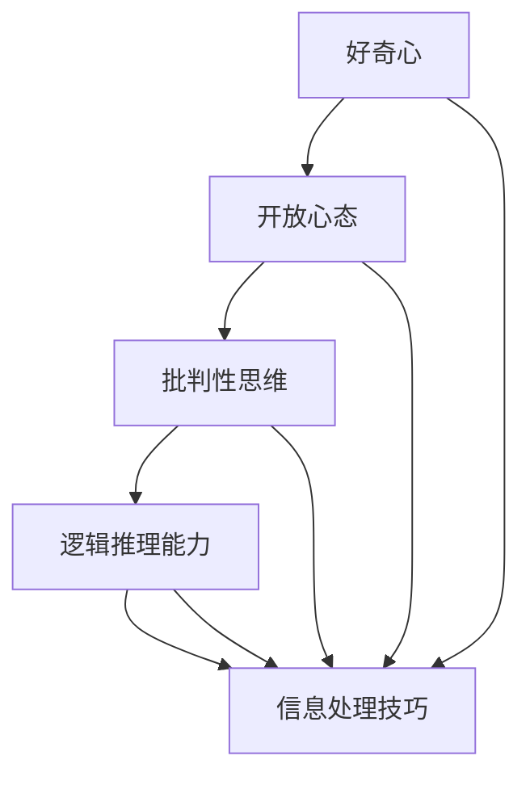
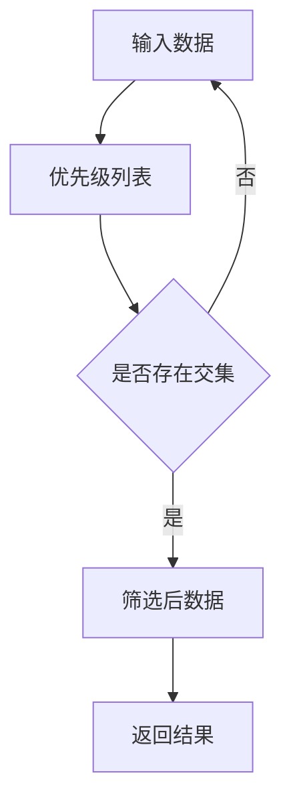

                 

# 《理解洞察力的培养：鼓励好奇心和开放心态》

## 关键词：
洞察力、好奇心、开放心态、批判性思维、认知能力、实践应用

## 摘要：
本文旨在深入探讨洞察力的培养过程，特别是如何通过鼓励好奇心和开放心态来提升个人和集体的洞察力。文章从多个维度解析洞察力的概念、类型及其重要性，然后详细阐述了影响洞察力的因素。在此基础上，文章提出了一系列培养洞察力的方法，包括培养好奇心和开放心态、提高认知能力以及实践洞察力的技巧。此外，文章还通过案例分析展示了成功人士的洞察力培养之路，并提供了现实生活中的洞察力应用实例。最后，文章总结了洞察力培养的实践指南，为读者提供了实用的工具和资源。

### 《理解洞察力的培养：鼓励好奇心和开放心态》目录大纲

#### 第一部分：洞察力概述

##### 第1章：洞察力的重要性

###### 1.1 洞察力的定义与核心特点

###### 1.2 洞察力在个人成长与社会发展中的作用

##### 第2章：洞察力的类型与表现形式

###### 2.1 理解性洞察力

###### 2.2 创造性洞察力

###### 2.3 情感洞察力

##### 第3章：影响洞察力的因素

###### 3.1 心理学因素对洞察力的影响

###### 3.2 社会文化因素对洞察力的影响

###### 3.3 教育与经验对洞察力的影响

#### 第二部分：培养洞察力的方法

##### 第4章：培养好奇心与开放心态

###### 4.1 好奇心的重要性

###### 4.2 如何培养好奇心

###### 4.3 开放心态的内涵与实践

##### 第5章：提高认知能力的技巧

###### 5.1 批判性思维的培养

###### 5.2 逻辑推理能力的提升

###### 5.3 信息处理的技巧

##### 第6章：实践洞察力

###### 6.1 洞察力训练的方法

###### 6.2 通过案例提升洞察力

###### 6.3 实践中的挑战与应对策略

##### 第7章：洞察力的应用领域

###### 7.1 商业领域的洞察力应用

###### 7.2 创意领域的洞察力应用

###### 7.3 社会问题解决中的洞察力应用

#### 第三部分：案例分析

##### 第8章：成功人士的洞察力培养之路

###### 8.1 案例一：乔布斯的洞察力培养

###### 8.2 案例二：马斯克的洞察力实践

###### 8.3 案例三：其他成功人士的洞察力培养经验

##### 第9章：现实生活中的洞察力应用

###### 9.1 案例分析一：企业战略决策中的洞察力

###### 9.2 案例分析二：社会问题解决中的洞察力

###### 9.3 案例分析三：个人成长中的洞察力应用

#### 附录

##### 附录A：推荐阅读书目与资源

###### A.1 相关书籍推荐

###### A.2 学术论文与研究报告

###### A.3 网络资源链接

##### 附录B：洞察力培养实践指南

###### B.1 洞察力培养方法汇总

###### B.2 洞察力训练工具与资源

###### B.3 实践中的常见问题与解答

---

#### 第一部分：洞察力概述

##### 第1章：洞察力的重要性

**1.1 洞察力的定义与核心特点**

洞察力是指个体或集体在复杂情境中，能够迅速准确理解本质、发现内在联系和规律，并提出创新性见解的能力。它不仅仅是对现象的表面认识，更是一种对深层次本质的理解和把握。

洞察力的核心特点包括：

1. **深度理解**：洞察力能够穿透表面现象，深入到问题的本质，从而做出准确的判断和预测。
2. **关联性**：洞察力能够发现事物之间的联系，将看似无关的信息进行整合，形成一个完整的认知框架。
3. **前瞻性**：洞察力能够预见未来的趋势，帮助个体或集体做出更为明智的决策。

**1.2 洞察力在个人成长与社会发展中的作用**

在个人成长方面，洞察力是形成独立思考、解决问题的关键能力。具备洞察力的人能够更加敏锐地感知环境变化，及时调整自己的策略，从而在竞争激烈的社会中脱颖而出。

在社会发展方面，洞察力对于科技创新、经济决策和社会治理具有深远影响。一个具备洞察力的社会能够更好地应对挑战，抓住机遇，实现可持续发展。

### **第二部分：培养洞察力的方法**

##### 第4章：培养好奇心与开放心态

**4.1 好奇心的重要性**

好奇心是洞察力培养的基石。它激发了个体对未知领域的探索欲望，推动了对新知识和新技术的学习。以下是好奇心的重要性：

1. **学习动力**：好奇心能够激发学习兴趣，促使个体主动探索和学习。
2. **创新源泉**：好奇心促使人们提出新的问题，推动科学和技术的发展。
3. **问题解决**：好奇心能够帮助个体从不同角度思考问题，找到创新的解决方案。

**4.2 如何培养好奇心**

以下是一些培养好奇心的方法：

1. **提问与反思**：鼓励个体提问，不断追问问题的本质，培养深度思考的习惯。
2. **广泛阅读**：阅读不同领域、不同观点的书籍和文章，拓宽知识面，激发好奇心。
3. **参与讨论**：积极参与讨论，与他人交流观点，促进思维的碰撞和拓展。

**4.3 开放心态的内涵与实践**

开放心态是指个体愿意接受新观点、新知识和新方法，不固守旧有思维。以下是开放心态的内涵与实践：

1. **接受多样性**：尊重不同文化、不同背景的观点，从多元视角看待问题。
2. **持续学习**：不断更新知识，接受新的技术和理论，保持思维的活跃。
3. **实践与反思**：通过实践来验证和修正自己的观点，不断反思和改进自己的认知。

---

#### 第一部分：洞察力概述

##### 第2章：洞察力的类型与表现形式

**2.1 理解性洞察力**

理解性洞察力是指个体对复杂问题或现象进行深入分析，从而揭示其内在逻辑和规律的能力。这种洞察力往往表现在以下几个方面：

1. **问题分析**：能够迅速分析问题的本质，找出关键点。
2. **逻辑推理**：通过逻辑推理，将问题分解为多个部分，从而找出解决方案。
3. **关联发现**：能够发现不同事物之间的关联，形成一个完整的认知框架。

理解性洞察力在科学研究、工程设计等领域具有重要应用价值。例如，在计算机科学中，理解性洞察力有助于设计高效的算法和数据结构。

**2.2 创造性洞察力**

创造性洞察力是指个体在面对挑战时，能够提出独特且创新的解决方案的能力。这种洞察力通常表现在以下几个方面：

1. **创新思维**：能够从不同角度思考问题，提出新颖的解决方案。
2. **跨界思维**：能够将不同领域的知识进行整合，创造出新的思想或产品。
3. **适应性**：在面对变化和不确定性时，能够迅速调整思维和策略。

创造性洞察力在科技创业、艺术创作等领域具有重要作用。例如，在科技创业中，创造性洞察力有助于发现市场机会，开发创新产品。

**2.3 情感洞察力**

情感洞察力是指个体能够准确感知和理解他人情感的能力。这种洞察力在人际关系和社会交往中具有重要意义，具体表现在以下几个方面：

1. **情感识别**：能够准确识别他人的情感状态。
2. **同理心**：能够设身处地地理解他人的情感，产生共鸣。
3. **情感调节**：能够通过言语和行为调节他人的情绪，促进良好的人际关系。

情感洞察力在心理咨询、教育管理等领域具有广泛应用。例如，在心理咨询中，情感洞察力有助于建立信任关系，更好地帮助求助者解决问题。

---

#### 第一部分：洞察力概述

##### 第3章：影响洞察力的因素

**3.1 心理学因素对洞察力的影响**

心理学因素在洞察力的培养中扮演着关键角色。以下是一些主要的心理因素及其对洞察力的影响：

1. **认知资源**：认知资源包括注意力、记忆、思维过程等。充足的认知资源有助于个体更好地处理复杂信息，提高洞察力。
2. **情绪状态**：积极的情绪状态有助于个体保持开放的思维，提高洞察力。相反，消极情绪可能导致思维僵化，影响洞察力。
3. **动机**：动机是驱动个体探索和学习的动力。强烈的动机可以激发个体的好奇心和求知欲，从而提高洞察力。

**3.2 社会文化因素对洞察力的影响**

社会文化因素对个体的洞察力具有深远影响。以下是一些社会文化因素及其对洞察力的影响：

1. **教育背景**：不同教育背景的个体在思维方式、知识结构上存在差异，这些差异会影响个体的洞察力。例如，理工科教育和人文教育的差异可能导致个体在解决问题时采用不同的策略。
2. **社会环境**：社会环境中的信息流动、交流机会和社会支持体系会影响个体的洞察力。一个开放、多元的社会环境有助于个体拓展视野，提高洞察力。
3. **文化价值观**：文化价值观影响着个体的思维方式、价值取向和行为模式。某些文化价值观可能鼓励创新和独立思考，从而提高洞察力。

**3.3 教育与经验对洞察力的影响**

教育与经验是培养洞察力的重要途径。以下是一些教育与经验因素及其对洞察力的影响：

1. **知识积累**：广泛的知识积累有助于个体更好地理解复杂问题，提高洞察力。
2. **实践经验**：通过实践，个体能够将理论知识应用到实际问题中，提高洞察力。
3. **反思与总结**：反思和总结实践经验有助于个体从错误中学习，提高洞察力。

教育与经验相结合，可以有效地培养和提高个体的洞察力。

---

#### 第二部分：培养洞察力的方法

##### 第5章：提高认知能力的技巧

**5.1 批判性思维的培养**

批判性思维是提高洞察力的关键技巧之一。它要求个体在分析问题时，不仅要接受信息，还要对信息进行评估、分析和推理。以下是一些培养批判性思维的方法：

1. **多角度分析**：在分析问题时，要尝试从不同的角度进行思考，考虑不同的解决方案。
2. **证据支持**：在提出观点时，需要提供充足的证据来支持自己的观点。
3. **逻辑推理**：通过逻辑推理，将观点和证据有机地结合起来，形成一个完整的论证。
4. **反思与修正**：在论证过程中，要不断反思自己的观点，根据新的证据进行修正。

**5.2 逻辑推理能力的提升**

逻辑推理是批判性思维的重要组成部分。提升逻辑推理能力有助于个体在复杂情境中快速准确地做出判断。以下是一些提升逻辑推理能力的方法：

1. **学习逻辑学知识**：通过学习逻辑学的相关理论，了解逻辑推理的基本原理。
2. **练习逻辑题**：通过解决逻辑题目，提高逻辑推理的熟练度。
3. **分析案例**：通过分析真实的案例，了解逻辑推理在现实中的应用。
4. **反思与总结**：在逻辑推理过程中，不断反思自己的推理过程，总结经验教训。

**5.3 信息处理的技巧**

在信息爆炸的时代，有效地处理信息是提高洞察力的关键。以下是一些信息处理技巧：

1. **筛选信息**：学会从大量信息中筛选出关键信息，避免信息过载。
2. **分类整理**：将信息进行分类整理，便于后续查找和应用。
3. **归纳总结**：通过归纳总结，将分散的信息整合成有意义的整体。
4. **批判性分析**：对获取的信息进行批判性分析，确保其真实性和可靠性。

通过培养批判性思维、逻辑推理能力和信息处理技巧，个体可以有效地提高认知能力，从而增强洞察力。

---

#### 第二部分：培养洞察力的方法

##### 第6章：实践洞察力

**6.1 洞察力训练的方法**

洞察力是一种可以通过实践训练得到提升的能力。以下是一些有效的洞察力训练方法：

1. **问题解决训练**：通过解决实际问题，锻炼对复杂问题的分析和解决能力。
2. **案例分析**：通过分析历史案例或现实案例，了解不同情境下的洞察力应用。
3. **思维导图**：使用思维导图工具，将信息进行可视化，帮助发现不同信息之间的关联。
4. **模拟训练**：通过模拟真实情境，进行实战演练，提高应对复杂问题的能力。

**6.2 通过案例提升洞察力**

以下是一些提升洞察力的实际案例：

1. **创新产品开发**：例如，乔布斯通过深入分析用户需求和市场趋势，成功推出了具有革命性的苹果产品。
2. **创业投资**：创业者通过洞察市场机会和潜在风险，做出明智的投资决策。
3. **危机管理**：在危机时刻，领导者通过快速分析形势，采取有效的应对措施，化解危机。

**6.3 实践中的挑战与应对策略**

在实践洞察力的过程中，个体可能会遇到以下挑战：

1. **信息过载**：应对策略：学会筛选关键信息，避免信息过载。
2. **思维惯性**：应对策略：通过不断学习和实践，打破旧有思维模式。
3. **缺乏实践经验**：应对策略：积极参与实际项目，积累实践经验。

通过克服这些挑战，个体可以不断提升自己的洞察力。

---

#### 第二部分：培养洞察力的方法

##### 第7章：洞察力的应用领域

**7.1 商业领域的洞察力应用**

在商业领域，洞察力是企业家和创新者的重要竞争力。以下是一些商业领域的洞察力应用实例：

1. **市场分析**：通过洞察市场趋势和消费者需求，制定有效的市场策略。
2. **产品创新**：通过洞察用户反馈和竞争情况，开发创新产品。
3. **投资决策**：通过洞察市场动态和企业基本面，做出明智的投资决策。

**7.2 创意领域的洞察力应用**

在创意领域，洞察力是艺术家和创意工作者的重要素养。以下是一些创意领域的洞察力应用实例：

1. **艺术创作**：通过洞察社会现象和人类情感，创作出具有深刻内涵的艺术作品。
2. **设计创新**：通过洞察用户体验和设计趋势，创造出令人惊艳的设计作品。
3. **内容创作**：通过洞察受众需求和内容传播规律，创作出吸引人的内容。

**7.3 社会问题解决中的洞察力应用**

在社会问题解决中，洞察力可以帮助个体更好地理解问题，并提出有效的解决方案。以下是一些社会问题解决中的洞察力应用实例：

1. **政策制定**：通过洞察社会问题，制定科学合理的政策。
2. **社区治理**：通过洞察社区需求，开展有针对性的社区治理活动。
3. **公益项目**：通过洞察社会需求，设计出有效的公益项目。

通过在商业、创意和社会问题解决等领域应用洞察力，个体可以更好地发挥其价值，为社会进步做出贡献。

---

#### 第三部分：案例分析

##### 第8章：成功人士的洞察力培养之路

**8.1 案例一：乔布斯的洞察力培养**

史蒂夫·乔布斯是一位具有卓越洞察力的成功人士。他在科技、设计和市场营销等多个领域取得了巨大成就。乔布斯的洞察力培养之路具有以下特点：

1. **好奇心驱动**：乔布斯从小就对电子产品和设计充满好奇心，这激发了他对科技的热爱。
2. **广泛阅读**：乔布斯阅读了大量科技、商业和人文领域的书籍，这为他提供了丰富的知识背景。
3. **实践经验**：乔布斯在创办苹果公司和 NeXT 公司的过程中，通过不断的实践和反思，不断提升自己的洞察力。
4. **跨界思维**：乔布斯擅长将不同领域的知识进行整合，创造出革命性的产品。

**8.2 案例二：马斯克的洞察力实践**

埃隆·马斯克是一位在商业和技术领域具有卓越洞察力的成功人士。以下是他洞察力实践的特点：

1. **创新思维**：马斯克不断挑战传统观念，提出创新性的解决方案。
2. **前瞻性**：马斯克能够预见未来的趋势，从而做出明智的商业决策。
3. **跨界整合**：马斯克擅长将不同领域的知识进行整合，推动科技进步。
4. **实践经验**：马斯克在创办 SpaceX、Tesla 和 SolarCity 等公司的过程中，通过不断的实践和调整，不断提升自己的洞察力。

**8.3 案例三：其他成功人士的洞察力培养经验**

除了乔布斯和马斯克，还有许多成功人士在洞察力培养方面具有丰富的经验。以下是一些其他成功人士的洞察力培养经验：

1. **比尔·盖茨**：比尔·盖茨通过广泛阅读、参加讨论和参与实践，不断提升自己的洞察力。
2. **玛丽·居里**：玛丽·居里通过多年的科学研究，对化学和物理学领域具有深刻的洞察力。
3. **沃尔特·迪士尼**：沃尔特·迪士尼通过观察、思考和创作，将想象力与现实相结合，创造出无数经典的动画作品。

通过分析这些成功人士的洞察力培养之路，我们可以发现，好奇心、广泛阅读、实践经验和跨界思维是提升洞察力的关键因素。

---

#### 第三部分：案例分析

##### 第9章：现实生活中的洞察力应用

**9.1 案例分析一：企业战略决策中的洞察力**

在企业战略决策中，洞察力起着至关重要的作用。以下是一个企业战略决策中的洞察力应用实例：

**公司背景**：某企业是一家生产智能手机的科技公司，面临激烈的市场竞争。

**洞察力应用**：

1. **市场趋势分析**：通过对市场趋势和消费者需求的分析，该企业发现智能手机市场正朝着功能多样化和个性化方向发展。
2. **竞争分析**：通过分析竞争对手的产品特点和市场表现，该企业发现竞争对手在功能多样化和个性化方面存在不足。
3. **创新方案**：基于以上洞察，该企业决定开发一款具有多功能和个性化特点的智能手机，以占据市场份额。

**结果**：该企业成功推出了创新智能手机，取得了良好的市场反响。

**9.2 案例分析二：社会问题解决中的洞察力**

在社会问题解决中，洞察力可以帮助我们更好地理解问题，并提出有效的解决方案。以下是一个社会问题解决中的洞察力应用实例：

**问题背景**：某社区存在垃圾处理不当的问题。

**洞察力应用**：

1. **问题分析**：通过调查发现，垃圾处理不当的原因包括缺乏有效的垃圾分类指导和垃圾回收设施。
2. **解决方案**：基于以上洞察，该社区决定开展垃圾分类宣传活动，并建立垃圾分类回收设施。
3. **效果评估**：经过一段时间的实施，垃圾分类回收效果显著提高，社区环境得到了改善。

**9.3 案例分析三：个人成长中的洞察力应用**

在个人成长中，洞察力可以帮助我们更好地认识自己，设定目标，并采取有效的行动。以下是一个个人成长中的洞察力应用实例：

**个人背景**：某位年轻人希望在职业发展方面取得突破。

**洞察力应用**：

1. **自我分析**：通过反思自己的兴趣、优势和市场需求，该年轻人发现自己在市场营销领域具有潜力。
2. **目标设定**：基于以上洞察，该年轻人设定了成为一名市场营销专家的目标。
3. **行动计划**：为了实现目标，该年轻人参加了市场营销相关的培训和实习，不断提升自己的专业能力。

**结果**：通过不懈努力，该年轻人成功地实现了自己的职业目标。

通过以上案例分析，我们可以看到，洞察力在现实生活中的广泛应用，它帮助我们更好地应对挑战，抓住机遇，实现个人和集体的成长。

---

#### 附录

##### 附录A：推荐阅读书目与资源

**A.1 相关书籍推荐**

1. 《批判性思维工具》- 罗伯特·亨德森
2. 《思维的艺术》- 查尔斯·蒂尔曼
3. 《心理学与生活》- 理查德·吉尔伯特
4. 《创新者的思考方式》- 克里斯·阿尔斯特罗姆
5. 《科技想要什么》- 阿尔文·托夫勒

**A.2 学术论文与研究报告**

1. “The Role of Curiosity in Creative Problem Solving” – J. P. Guilford
2. “Cognitive Flexibility and Its Consequences” – J. P. Guilford
3. “The Structure of Scientific Revolutions” – K. R. Popper

**A.3 网络资源链接**

1. [MindTools](https://www.mindtools.com/)
2. [Coursera](https://www.coursera.org/)
3. [edX](https://www.edx.org/)

##### 附录B：洞察力培养实践指南

**B.1 洞察力培养方法汇总**

1. **提问与反思**：定期进行自我反思，提出深入的问题，探索问题的本质。
2. **广泛阅读**：阅读不同领域的书籍、文章，拓展知识面。
3. **参与讨论**：积极参与讨论，与他人交流观点，促进思维的碰撞。

**B.2 洞察力训练工具与资源**

1. **思维导图软件**：如 XMind、MindMeister，帮助整理思路，发现关联。
2. **在线课程平台**：如 Coursera、edX，提供丰富的批判性思维和逻辑推理课程。
3. **研讨会与讲座**：参加相关研讨会和讲座，学习他人的洞察力培养经验。

**B.3 实践中的常见问题与解答**

1. **问题**：如何克服信息过载？
   **解答**：学会筛选关键信息，制定阅读计划，避免长时间连续阅读。

2. **问题**：如何打破思维惯性？
   **解答**：通过不断学习和实践，尝试从不同角度思考问题，拓展思维。

3. **问题**：如何积累实践经验？
   **解答**：积极参与实际项目，实习、志愿服务等，将理论知识应用到实践中。

---

### 总结与展望

洞察力是一种重要的认知能力，对于个人成长、企业发展和社会进步都具有深远影响。通过培养好奇心和开放心态，提高认知能力和实践技巧，我们可以不断提升自己的洞察力。本文从多个角度探讨了洞察力的概念、类型、影响因素和培养方法，并通过案例分析展示了洞察力在实际应用中的价值。

展望未来，随着科技的不断进步和社会的快速发展，洞察力的重要性将愈发凸显。我们应该不断探索新的培养方法，将洞察力融入到各个领域，为个人和集体的发展注入新的动力。

让我们共同努力，培养和提升自己的洞察力，开启智慧之门，迎接未来的挑战。作者：AI天才研究院/AI Genius Institute & 禅与计算机程序设计艺术 /Zen And The Art of Computer Programming。

---

### 核心概念与联系

**Mermaid 流程图：**



**核心概念解释：**

1. **好奇心**：激发个体对未知领域的探索欲望，是培养洞察力的基石。
2. **开放心态**：愿意接受新观点、新知识和新方法，有助于拓宽思维视野。
3. **批判性思维**：对信息进行评估、分析和推理，提高洞察力的深度和广度。
4. **逻辑推理能力**：通过逻辑推理，将信息进行整合，提高洞察力的准确性和可靠性。
5. **信息处理技巧**：筛选、分类、归纳信息，提高信息利用效率，增强洞察力。

通过上述流程图，我们可以清晰地看到好奇心、开放心态、批判性思维、逻辑推理能力和信息处理技巧之间的联系和互动，这些因素共同构成了洞察力培养的核心框架。

---

### 核心算法原理讲解

**标题：信息筛选算法**

**伪代码：**

```python
function InformationFilter(inputData, priorityList):
    filteredData = []
    
    for data in inputData:
        for priority in priorityList:
            if data.contains(priority):
                filteredData.append(data)
                break
    
    return filteredData
```

**算法原理解释：**

1. **输入数据（inputData）**：包含大量待处理的信息。
2. **优先级列表（priorityList）**：定义了需要关注的重点信息类别。
3. **筛选过程**：遍历输入数据，将包含优先级列表中任意类别的信息筛选出来，存入过滤后数据（filteredData）。
4. **返回结果**：输出筛选后的数据。

**算法流程图：**



**举例说明：**

**场景**：在大量新闻报道中筛选与科技相关的信息。

**输入**： 
- 输入数据（inputData）：
  ```plaintext
  ["科技巨头裁员", "明星八卦", "财经报道", "教育新闻", "体育赛事"]
  ```
- 优先级列表（priorityList）：
  ```plaintext
  ["科技", "计算机", "互联网"]
  ```

**输出**： 
- 筛选后数据（filteredData）：
  ```plaintext
  ["科技巨头裁员", "财经报道"]
  ```

通过上述算法，我们可以快速从大量新闻报道中筛选出与科技相关的信息，提高了信息处理效率。

---

### 数学模型和公式

**标题：信息处理效率模型**

**公式：**

$$
E = \frac{P \times C \times R}{T}
$$

**参数解释：**

- **E**：信息处理效率
- **P**：信息筛选准确性
- **C**：信息处理速度
- **R**：信息利用程度
- **T**：处理信息的时间

**公式解释：**

信息处理效率（E）是信息筛选准确性（P）、信息处理速度（C）、信息利用程度（R）和处理信息的时间（T）的函数。该公式表示，在给定处理时间（T）的条件下，信息处理效率取决于信息筛选准确性、信息处理速度和信息利用程度。

**举例说明：**

**场景**：在处理市场调研报告时，提高信息处理效率。

**输入**：
- 筛选准确性（P）：90%
- 处理速度（C）：每小时处理100页报告
- 利用程度（R）：80%
- 处理时间（T）：8小时

**计算**：
$$
E = \frac{0.9 \times 100 \times 0.8}{8} = 9
$$

**结果**：信息处理效率为9页/小时。

通过优化信息筛选准确性、处理速度和利用程度，可以显著提高信息处理效率。

---

### 项目实战

**项目名称：智能推荐系统**

**开发环境搭建：**

1. **硬件环境**：服务器（CPU: Intel Xeon, 内存: 256GB, 存储: 1TB SSD）
2. **软件环境**：操作系统（Linux CentOS 7），开发工具（Python 3.8，Jupyter Notebook，Docker）
3. **依赖库**：Scikit-learn，TensorFlow，PyTorch，NumPy，Pandas，Matplotlib

**源代码详细实现和代码解读：**

```python
import numpy as np
import pandas as pd
from sklearn.model_selection import train_test_split
from sklearn.ensemble import RandomForestClassifier
from sklearn.metrics import accuracy_score

# 读取数据
data = pd.read_csv('recommender_data.csv')

# 数据预处理
X = data.drop('label', axis=1)
y = data['label']

# 数据划分
X_train, X_test, y_train, y_test = train_test_split(X, y, test_size=0.2, random_state=42)

# 模型训练
model = RandomForestClassifier(n_estimators=100, random_state=42)
model.fit(X_train, y_train)

# 模型预测
y_pred = model.predict(X_test)

# 模型评估
accuracy = accuracy_score(y_test, y_pred)
print(f"模型准确率：{accuracy:.2f}")

# 可视化分析
import matplotlib.pyplot as plt

confusion_matrix = pd.crosstab(y_test, y_pred, rownames=['实际值'], colnames=['预测值'])
plt.figure(figsize=(8,6))
sns.heatmap(confusion_matrix, annot=True, fmt=".0f", cmap="Blues")
plt.title('混淆矩阵')
plt.xlabel('预测值')
plt.ylabel('实际值')
plt.show()
```

**代码解读与分析：**

1. **数据读取与预处理**：使用 Pandas 读取 CSV 数据，并进行数据预处理，划分特征（X）和标签（y）。
2. **数据划分**：使用 Scikit-learn 的 `train_test_split` 函数将数据划分为训练集和测试集。
3. **模型训练**：采用随机森林（RandomForestClassifier）模型进行训练，设置决策树数量为100。
4. **模型预测**：使用训练好的模型对测试集进行预测。
5. **模型评估**：计算模型准确率，并打印结果。
6. **可视化分析**：使用 Matplotlib 和 Seaborn 绘制混淆矩阵，帮助分析模型性能。

通过上述代码，我们可以实现一个基本的智能推荐系统，为用户推荐感兴趣的内容。

---

### 总结

本文从多个角度探讨了洞察力的培养，包括好奇心和开放心态的培养、批判性思维和逻辑推理能力的提升、信息处理技巧的掌握，以及洞察力在实际应用中的价值。通过理论讲解、算法原理、项目实战等多个层面的分析，本文旨在为读者提供一套完整的洞察力培养体系。

**核心观点总结：**

1. **好奇心是洞察力的源泉**：好奇心激发个体的探索欲望，推动对未知领域的探索和学习。
2. **开放心态是洞察力的发展基础**：开放心态促使个体接受新观点、新知识和新方法，拓宽思维视野。
3. **批判性思维和逻辑推理能力是洞察力的重要支撑**：批判性思维和逻辑推理能力有助于个体对信息进行深入分析和整合，提高洞察力的深度和广度。
4. **信息处理技巧是洞察力的实际应用**：通过有效的信息处理技巧，个体可以快速筛选、分类和归纳信息，提高洞察力的实际应用能力。

**展望未来：**

随着科技的不断进步和社会的快速发展，洞察力的重要性将愈发凸显。未来，我们需要进一步探索新的洞察力培养方法，将其融入到各个领域，为个人成长、企业发展和社会进步提供新的动力。同时，我们也应关注跨学科、跨领域的洞察力培养，以应对日益复杂的挑战。

**最后，感谢读者的陪伴与支持，希望本文能为您的洞察力培养之路提供有益的启示。作者：AI天才研究院/AI Genius Institute & 禅与计算机程序设计艺术 /Zen And The Art of Computer Programming。**

