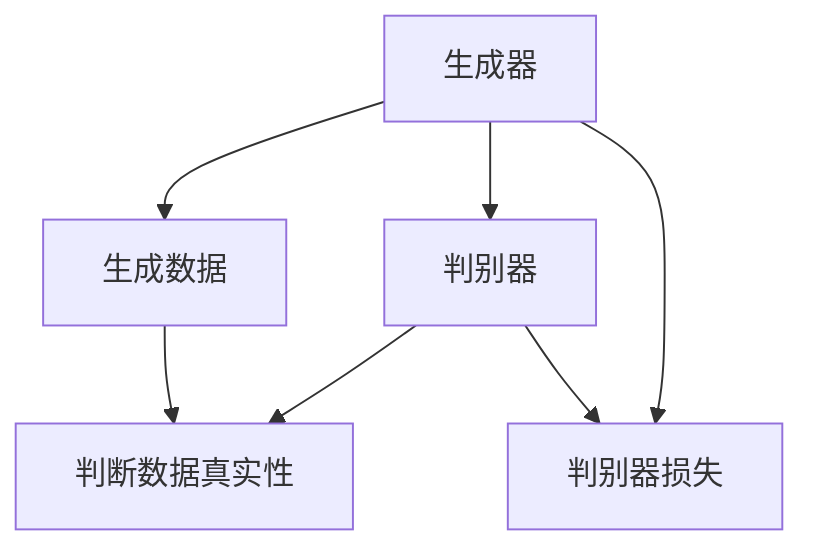

                 

### 文章标题

生成对抗网络（GAN）在虚拟人物创作中的应用

关键词：生成对抗网络，虚拟人物，图像生成，纹理生成，语音生成，深度学习

摘要：本文将深入探讨生成对抗网络（GAN）在虚拟人物创作中的应用。通过介绍GAN的基本原理和数学基础，详细阐述GAN在虚拟人物外观生成、纹理生成和语音生成中的具体应用，以及GAN与其他AI技术的结合，旨在为虚拟人物创作提供一种新的思路和方法。

# 目录大纲

1. **第一部分：基础理论**
   1.1 GAN简介
   1.2 GAN的数学原理
   1.3 GAN的应用场景
2. **第二部分：GAN在虚拟人物创作中的应用实践**
   2.1 GAN在虚拟人物外观生成中的应用
   2.2 GAN在虚拟人物纹理生成中的应用
   2.3 GAN在虚拟人物语音生成中的应用
   2.4 GAN在虚拟人物互动中的应用
   2.5 GAN在虚拟人物创作中的综合应用
3. **第三部分：案例与实战**
   3.1 虚拟人物创作案例
   3.2 GAN在虚拟人物创作中的实战应用
4. **附录**
   4.1 GAN常用工具与库
   4.2 虚拟人物创作工具与资源</|assistant|>

### 第一部分：基础理论

#### 1.1 GAN简介

生成对抗网络（Generative Adversarial Networks，GAN）是由Ian Goodfellow等人在2014年提出的一种深度学习框架。GAN的核心思想是通过两个深度神经网络——生成器（Generator）和判别器（Discriminator）之间的对抗训练来生成逼真的数据。

- **生成器**：其目标是生成足够真实的数据，以欺骗判别器。
- **判别器**：其目标是区分生成的数据与真实数据。

在GAN的训练过程中，生成器和判别器不断进行博弈。生成器的目标是最大化判别器对其生成数据的分类错误率，而判别器的目标是最大化其分类正确率。这种对抗训练使得生成器能够逐渐提高生成数据的真实度，判别器则不断提高对真实和生成数据的辨别能力。

#### 1.2 GAN的数学原理

GAN的训练过程可以通过以下概率模型来描述：

\[ G(z) \sim p_{data}(x) \]
\[ D(x) \sim (1-\epsilon)p_{G}(x) + \epsilon p_{data}(x) \]

其中：
- \( p_{data}(x) \) 是真实数据的概率分布。
- \( p_{G}(x) \) 是生成数据的概率分布。
- \( G(z) \) 是生成器生成的数据。
- \( D(x) \) 是判别器对数据的判断概率。

GAN的训练目标是最小化判别器的交叉熵损失：

\[ L_D = -\sum_{x \in \mathcal{D}} \log D(x) - \sum_{z \sim p_z(z)} \log (1 - D(G(z))) \]

其中：
- \( L_D \) 是判别器的损失函数。
- \( \mathcal{D} \) 是数据集。

同时，生成器的目标是最大化判别器的输出：

\[ L_G = -\sum_{z \sim p_z(z)} \log D(G(z)) \]

#### 1.3 GAN的应用场景

GAN的应用场景非常广泛，包括但不限于以下方面：

- **图像生成**：GAN可以用于生成高质量的图像，如图像到图像的转换、图像超分辨率、图像风格迁移等。
- **视频生成**：GAN可以用于生成高质量的视频序列，实现视频生成与视频修复等。
- **音频生成**：GAN可以用于生成逼真的音频，如语音合成、音乐生成等。
- **虚拟人物创作**：GAN可以用于生成虚拟人物的外观、纹理和语音，实现个性化的虚拟角色创作。

### 核心概念与联系

为了更好地理解GAN的核心概念，我们可以使用Mermaid流程图来展示GAN的基本架构和训练过程：



在这个流程图中，生成器和判别器分别生成数据和判断数据，两者的相互作用最终导致判别器损失和生成器损失的优化。

### 伪代码

为了更深入地理解GAN的算法原理，我们可以给出一个简单的伪代码：

```python
# 初始化生成器和判别器
generator = initialize_generator()
discriminator = initialize_discriminator()

# 训练过程
for epoch in range(num_epochs):
    for batch in data_loader:
        # 训练判别器
        z = generate_noise()
        fake_images = generator(z)
        real_images = batch
        
        # 计算判别器的损失
        d_loss_real = discriminator_loss(discriminator, real_images)
        d_loss_fake = discriminator_loss(discriminator, fake_images)
        d_loss = (d_loss_real + d_loss_fake) / 2
        
        # 训练生成器
        z = generate_noise()
        fake_images = generator(z)
        
        # 计算生成器的损失
        g_loss = generator_loss(discriminator, fake_images)
        
        # 更新生成器和判别器的参数
        update_generator(g_loss)
        update_discriminator(d_loss)
```

在这个伪代码中，我们首先初始化生成器和判别器，然后在一个循环中交替训练两者。每次迭代中，生成器生成假数据，判别器对这些数据进行判断，计算损失，并更新参数。

### 数学模型和公式

在GAN中，我们通常使用以下数学模型来描述生成器和判别器的训练过程：

生成器损失函数：

\[ L_G = -\log(D(G(z))) \]

判别器损失函数：

\[ L_D = -[\log(D(x)) + \log(1 - D(G(z)))] \]

其中：
- \( G(z) \) 是生成器生成的假数据。
- \( D(x) \) 是判别器对真实数据的判断概率。
- \( z \) 是随机噪声。

这两个损失函数的目标是最大化判别器的分类正确率，同时最小化生成器的生成误差。

### 举例说明

假设我们有一个判别器 \( D(x) \) ，其输出概率为 \( P(D(x) = 1) \)。我们可以通过以下步骤来计算GAN的损失：

1. **计算生成器损失**：

\[ L_G = -\log(D(G(z))) \]

2. **计算判别器损失**：

\[ L_D = -[\log(D(x)) + \log(1 - D(G(z)))] \]

假设我们有一组真实数据 \( x \) 和一组假数据 \( G(z) \)，我们可以通过以下步骤来训练GAN：

1. **初始化生成器和判别器**：

\[ G = initialize_generator() \]
\[ D = initialize_discriminator() \]

2. **训练判别器**：

\[ z = generate_noise() \]
\[ fake_images = G(z) \]
\[ real_images = data_loader.next_batch() \]

\[ d_loss_real = -\log(D(real_images)) \]
\[ d_loss_fake = -\log(1 - D(fake_images)) \]
\[ d_loss = (d_loss_real + d_loss_fake) / 2 \]

3. **训练生成器**：

\[ z = generate_noise() \]
\[ fake_images = G(z) \]

\[ g_loss = -\log(D(fake_images)) \]

4. **更新生成器和判别器参数**：

\[ update_generator(g_loss) \]
\[ update_discriminator(d_loss) \]

通过这些步骤，我们可以训练GAN来生成高质量的数据，如虚拟人物的外观、纹理和语音。

### 总结

生成对抗网络（GAN）是一种强大的深度学习框架，通过生成器和判别器之间的对抗训练，可以生成高质量的数据。在虚拟人物创作中，GAN可以应用于外观生成、纹理生成和语音生成等方面。接下来，我们将进一步探讨GAN在这些具体应用中的实现方法和实际效果。在下一章中，我们将深入探讨GAN的数学基础，包括概率论、信息论和优化算法等方面的内容。

