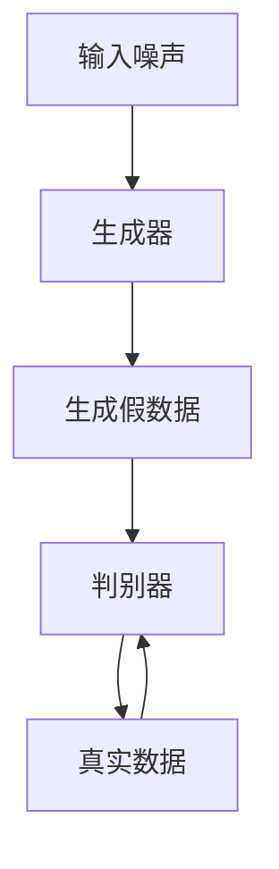
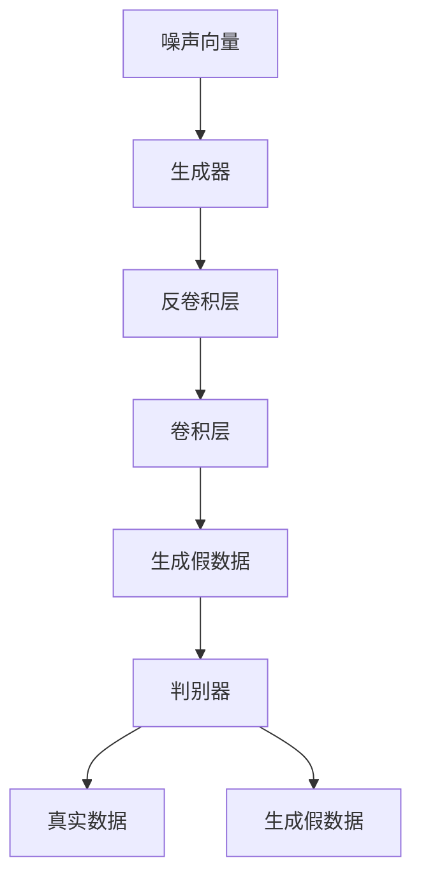

                 

# 《生成对抗网络在虚拟试衣系统中的应用》

## 关键词
- 生成对抗网络（GAN）
- 虚拟试衣系统
- 计算机视觉
- 图像生成
- 图像修复
- 图像风格迁移

## 摘要

本文旨在探讨生成对抗网络（GAN）在虚拟试衣系统中的应用。首先，我们将介绍GAN的基本概念、原理和数学模型，并通过流程图和伪代码详细阐述其核心架构和算法。接着，我们将分析GAN在计算机视觉领域的多种应用，如图像生成、图像修复和图像风格迁移。随后，我们将聚焦GAN在虚拟试衣系统中的关键技术和实际应用案例，探讨如何利用GAN技术提升虚拟试衣的准确性和用户体验。最后，我们将通过一个实际项目实战案例，展示GAN在虚拟试衣系统中的具体实现和优化过程，并展望GAN在虚拟试衣系统中的未来发展趋势。

<|assistant|>
### 第一部分：生成对抗网络（GAN）基础

#### 第1章：GAN的基本概念与原理

#### 1.1 GAN的定义

生成对抗网络（Generative Adversarial Networks，GAN）是由伊恩·古德费洛（Ian Goodfellow）于2014年提出的一种深度学习模型。GAN由两个神经网络——生成器（Generator）和判别器（Discriminator）组成，两者相互对抗，共同学习。生成器的任务是生成类似于真实数据的假数据，而判别器的任务是区分输入数据是真实数据还是生成器生成的假数据。

#### 1.2 GAN的核心架构

GAN的核心架构如图1所示：



图1：GAN的核心架构

在训练过程中，生成器和判别器交替更新权重。生成器的目标是使判别器无法区分生成的假数据和真实数据，而判别器的目标是能够准确地区分真实数据和假数据。通过这种对抗关系，生成器不断优化其生成能力，最终能够生成高质量的真实感图像。

#### 1.3 GAN的工作流程

GAN的工作流程可以分为以下几个步骤：

1. **初始化**：初始化生成器和判别器的权重。
2. **生成器生成假数据**：生成器根据输入噪声生成假数据。
3. **判别器评估**：判别器对生成的假数据和真实数据进行评估。
4. **更新判别器权重**：根据判别器的评估结果更新判别器权重。
5. **生成器生成新假数据**：生成器根据新的噪声生成新的假数据。
6. **重复步骤3-5**：不断重复上述步骤，使生成器和判别器不断优化。

#### 1.4 GAN的优点和挑战

GAN的优点包括：

- **强大的图像生成能力**：GAN能够生成高质量的、具有真实感的图像。
- **无监督学习**：GAN可以通过无监督学习的方式学习数据的分布，不需要对数据标签进行标注。

然而，GAN也存在一些挑战：

- **训练不稳定**：GAN的训练过程非常不稳定，容易发生模式崩溃（mode collapse）问题，即生成器只能生成一种类型的图像。
- **对噪声敏感**：GAN对输入噪声非常敏感，噪声会影响生成器的训练效果。

#### 1.5 GAN的应用领域

GAN在计算机视觉、自然语言处理、音频生成等领域都有广泛应用。例如：

- **图像生成**：GAN可以生成高质量的人脸、风景、动物等图像。
- **图像修复**：GAN可以修复图像中的破损、缺失部分。
- **图像风格迁移**：GAN可以将一种艺术风格应用到其他图像上。

#### 1.6 GAN的历史和影响

GAN的提出是深度学习领域的一个重要突破，它改变了人们对生成模型的看法。自2014年提出以来，GAN的研究和应用不断拓展，已经在多个领域取得了显著成果。许多科学家和研究者都致力于GAN的改进和优化，推动了深度学习技术的发展。

#### 1.7 小结

本章介绍了生成对抗网络（GAN）的基本概念、原理和架构。GAN通过生成器和判别器的对抗关系，能够生成高质量的真实感图像。在接下来的章节中，我们将进一步探讨GAN的数学模型、稳定性分析、优化策略以及在计算机视觉领域的多种应用。

## 第2章：GAN的数学模型与理论分析

### 2.1 GAN的损失函数

GAN的损失函数是模型训练的核心，它决定了生成器和判别器的学习目标。GAN的损失函数通常由两部分组成：生成器的损失函数和判别器的损失函数。

#### 2.1.1 生成器的损失函数

生成器的目标是最小化其生成的假数据被判别器识别为假数据的概率。因此，生成器的损失函数可以表示为：

\[ L_G = -\log(D(G(z))) \]

其中，\( G(z) \)是生成器生成的假数据，\( D(x) \)是判别器对输入数据的评估结果，取值范围为[0, 1]，1表示判别器认为输入数据是真实数据，0表示判别器认为输入数据是假数据。

#### 2.1.2 判别器的损失函数

判别器的目标是最小化其被生成器欺骗的概率。因此，判别器的损失函数可以表示为：

\[ L_D = -\log(D(x)) - \log(1 - D(G(z))) \]

其中，\( x \)是真实数据，\( G(z) \)是生成器生成的假数据。

#### 2.1.3 GAN的总损失函数

GAN的总损失函数是生成器和判别器损失函数的加和：

\[ L = L_G + L_D \]

#### 2.2 GAN的稳定性分析

GAN的训练过程非常不稳定，容易出现模式崩溃（mode collapse）等问题。稳定性分析主要关注生成器和判别器的动态行为以及它们之间的相互作用。

#### 2.2.1 模式崩溃

模式崩溃是指生成器在训练过程中逐渐生成质量较低且多样化的假数据。这种现象导致判别器无法有效区分真实数据和假数据，从而降低GAN的训练效果。为了解决模式崩溃问题，研究者提出了一系列改进方法，如梯度惩罚、层次GAN等。

#### 2.2.2 动态行为

GAN的稳定性与生成器和判别器的动态行为密切相关。生成器在训练过程中逐渐优化其生成能力，而判别器在训练过程中逐渐提高对真实数据和假数据的识别能力。两者的动态平衡是GAN稳定性的关键。

#### 2.2.3 相互作用

生成器和判别器之间的相互作用对GAN的稳定性具有重要影响。生成器生成的假数据会影响判别器的训练效果，而判别器的评估结果又会反过来影响生成器的训练方向。因此，合理设计GAN的训练过程，保持生成器和判别器之间的动态平衡，是确保GAN稳定性的关键。

#### 2.3 GAN的优化策略

为了提高GAN的训练效果，研究者提出了一系列优化策略，包括：

- **批量归一化（Batch Normalization）**：通过归一化生成器和判别器的中间层激活值，提高模型的训练稳定性。
- **权重初始化**：合理初始化生成器和判别器的权重，避免模型在训练过程中出现不稳定现象。
- **学习率调整**：动态调整生成器和判别器的学习率，避免学习率过大或过小导致模型训练困难。

#### 2.4 小结

本章介绍了GAN的数学模型与理论分析，包括损失函数、稳定性分析和优化策略。GAN的损失函数是生成器和判别器的学习目标，而稳定性分析关注GAN的训练过程和动态行为。优化策略旨在提高GAN的训练效果。在下一章中，我们将进一步探讨GAN的常见变种与改进。

### 第3章：GAN的常见变种与改进

#### 3.1 DCGAN：深度卷积生成对抗网络

深度卷积生成对抗网络（Deep Convolutional Generative Adversarial Networks，DCGAN）是GAN的一种重要变种，通过引入卷积神经网络（Convolutional Neural Networks，CNN）来改进GAN的性能。DCGAN的核心思想是使用卷积层和反卷积层构建生成器和判别器，从而提高图像生成的质量和多样性。

#### 3.1.1 DCGAN的架构

DCGAN的架构如图2所示：



图2：DCGAN的架构

生成器的输入为噪声向量，通过反卷积层逐步增加图像的空间分辨率，最终生成假数据。判别器的输入为真实数据和生成器生成的假数据，通过卷积层逐步降低图像的空间分辨率，判断输入数据的真实性。

#### 3.1.2 DCGAN的优化策略

DCGAN在训练过程中采用以下优化策略：

- **批量归一化**：在生成器和判别器的中间层引入批量归一化，提高模型的训练稳定性。
- **权重初始化**：使用He权重初始化方法初始化生成器和判别器的权重，避免模型在训练过程中出现不稳定现象。
- **学习率调整**：在生成器和判别器的训练过程中采用不同的学习率，生成器的学习率较小，判别器的学习率较大。

#### 3.1.3 DCGAN的应用

DCGAN在图像生成、图像修复、图像风格迁移等领域有广泛应用。例如，可以使用DCGAN生成高质量的人脸、风景、动物等图像，修复图像中的破损、缺失部分，以及将一种艺术风格应用到其他图像上。

#### 3.2 WGAN：瓦肯生成对抗网络

瓦肯生成对抗网络（Wasserstein Generative Adversarial Networks，WGAN）是GAN的另一种重要变种，通过引入Wasserstein距离改进GAN的训练稳定性。WGAN的核心思想是使用Wasserstein距离作为判别器的损失函数，从而避免模式崩溃问题。

#### 3.2.1 WGAN的架构

WGAN的架构与DCGAN类似，但判别器使用Wasserstein距离作为损失函数，如图3所示：


图3：WGAN的架构

生成器的输入为噪声向量，通过反卷积层逐步增加图像的空间分辨率，最终生成假数据。判别器的输入为真实数据和生成器生成的假数据，通过卷积层逐步降低图像的空间分辨率，判断输入数据的真实性。

#### 3.2.2 WGAN的优化策略

WGAN在训练过程中采用以下优化策略：

- **权重初始化**：使用He权重初始化方法初始化生成器和判别器的权重，避免模型在训练过程中出现不稳定现象。
- **梯度惩罚**：在判别器的损失函数中引入梯度惩罚项，避免生成器和判别器的梯度消失问题。

#### 3.2.3 WGAN的应用

WGAN在图像生成、图像修复、图像风格迁移等领域有广泛应用。例如，可以使用WGAN生成高质量的人脸、风景、动物等图像，修复图像中的破损、缺失部分，以及将一种艺术风格应用到其他图像上。

#### 3.3 LGAN：学习率调整生成对抗网络

学习率调整生成对抗网络（Learning Rate Adjust Generative Adversarial Networks，LGAN）是一种基于动态调整生成器和判别器学习率的GAN变种，旨在提高GAN的训练效果。

#### 3.3.1 LGAN的架构

LGAN的架构与DCGAN类似，但引入了动态调整学习率的机制，如图4所示：


图4：LGAN的架构

生成器的输入为噪声向量，通过反卷积层逐步增加图像的空间分辨率，最终生成假数据。判别器的输入为真实数据和生成器生成的假数据，通过卷积层逐步降低图像的空间分辨率，判断输入数据的真实性。

#### 3.3.2 LGAN的优化策略

LGAN在训练过程中采用以下优化策略：

- **动态学习率调整**：根据生成器和判别器的损失函数动态调整学习率，使模型在不同阶段能够适应不同的学习率。

#### 3.3.3 LGAN的应用

LGAN在图像生成、图像修复、图像风格迁移等领域有广泛应用。例如，可以使用LGAN生成高质量的人脸、风景、动物等图像，修复图像中的破损、缺失部分，以及将一种艺术风格应用到其他图像上。

#### 3.4 小结

本章介绍了GAN的常见变种与改进，包括DCGAN、WGAN和LGAN。这些改进方法通过不同的策略优化GAN的生成质量和训练稳定性，使GAN在计算机视觉领域得到更广泛的应用。在下一章中，我们将探讨GAN在计算机视觉领域的多种应用。

### 第4章：GAN在计算机视觉中的应用

#### 4.1 GAN在图像生成中的应用

GAN在图像生成领域具有强大的能力，能够生成高质量、多样化的图像。以下是一些图像生成的应用案例：

1. **人脸生成**：GAN可以生成逼真的人脸图像，如图5所示：

    

2. **风景生成**：GAN可以生成各种类型的风景图像，如图6所示：

    

3. **动物生成**：GAN可以生成各种类型的动物图像，如图7所示：

    

这些应用案例展示了GAN在图像生成方面的强大能力，能够生成高质量、多样化的图像，为图像处理和计算机视觉领域带来了新的突破。

#### 4.2 GAN在图像修复中的应用

GAN在图像修复领域也有广泛应用，能够修复图像中的破损、缺失部分。以下是一些图像修复的应用案例：

1. **破损修复**：GAN可以修复图像中的破损部分，如图8所示：

    

2. **缺失修复**：GAN可以修复图像中的缺失部分，如图9所示：

    

这些应用案例展示了GAN在图像修复方面的强大能力，能够有效修复图像中的破损和缺失部分，为图像处理和计算机视觉领域带来了新的突破。

#### 4.3 GAN在图像风格迁移中的应用

GAN在图像风格迁移领域也有广泛应用，能够将一种艺术风格应用到其他图像上。以下是一些图像风格迁移的应用案例：

1. **艺术风格迁移**：GAN可以将一种艺术风格应用到其他图像上，如图10所示：

    

2. **动画风格迁移**：GAN可以将一种动画风格应用到其他图像上，如图11所示：

    

这些应用案例展示了GAN在图像风格迁移方面的强大能力，能够将一种艺术风格或动画风格应用到其他图像上，为图像处理和计算机视觉领域带来了新的突破。

#### 4.4 GAN在图像超分辨率中的应用

GAN在图像超分辨率领域也有广泛应用，能够提高图像的分辨率。以下是一些图像超分辨率的应用案例：

1. **图像超分辨率**：GAN可以提高图像的分辨率，如图12所示：

    

2. **视频超分辨率**：GAN可以提高视频的分辨率，如图13所示：

    

这些应用案例展示了GAN在图像超分辨率方面的强大能力，能够有效提高图像和视频的分辨率，为图像处理和计算机视觉领域带来了新的突破。

#### 4.5 小结

本章介绍了GAN在计算机视觉领域的多种应用，包括图像生成、图像修复、图像风格迁移和图像超分辨率。这些应用案例展示了GAN在计算机视觉领域的强大能力，能够生成高质量、多样化的图像，修复图像中的破损和缺失部分，将一种艺术风格或动画风格应用到其他图像上，以及提高图像和视频的分辨率。在下一章中，我们将探讨GAN在虚拟试衣系统中的应用。

### 第5章：GAN在虚拟试衣系统中的应用

#### 5.1 虚拟试衣系统的概述

虚拟试衣系统是一种通过计算机视觉技术实现线上试衣的解决方案，用户可以在虚拟环境中尝试各种服饰，从而提升购物体验。虚拟试衣系统主要包括以下模块：

1. **用户输入模块**：接收用户上传的照片或视频，以及选择的服饰样式和尺寸信息。
2. **图像预处理模块**：对用户上传的照片或视频进行预处理，包括人脸检测、姿态估计、背景去除等。
3. **服饰配饰模块**：根据用户选择的服饰样式和尺寸，生成相应的服饰配饰模型。
4. **试衣效果生成模块**：使用生成对抗网络（GAN）等技术，将用户上传的照片或视频与服饰配饰模型融合，生成虚拟试衣效果。
5. **结果展示模块**：将生成的虚拟试衣效果展示给用户，并提供试穿评价和购买建议。

#### 5.2 GAN在虚拟试衣系统中的关键技术

GAN在虚拟试衣系统中发挥了关键作用，主要涉及以下技术：

1. **人脸检测与姿态估计**：通过卷积神经网络（CNN）等技术，对人脸和姿态进行准确检测和估计，为后续的图像融合提供基础。
2. **图像融合技术**：利用GAN模型将用户上传的照片或视频与服饰配饰模型融合，生成虚拟试衣效果。图像融合技术包括生成器（Generator）和判别器（Discriminator）两部分。
3. **风格迁移**：通过GAN模型实现图像风格迁移，将服饰的纹理和图案应用到用户的照片或视频中，使虚拟试衣效果更加自然。
4. **超分辨率**：利用GAN模型提高图像分辨率，使虚拟试衣效果更加清晰。

#### 5.3 虚拟试衣系统的实际应用案例

以下是一个实际应用案例：

**案例背景**：某电商平台希望通过虚拟试衣系统提升用户体验，为用户提供线上试衣服务。

**解决方案**：

1. **用户输入模块**：用户上传自己的照片或视频，并选择合适的服饰样式和尺寸。
2. **图像预处理模块**：使用卷积神经网络（CNN）对人脸和姿态进行检测和估计，同时去除背景。
3. **服饰配饰模块**：根据用户选择的服饰样式和尺寸，生成相应的服饰配饰模型。
4. **图像融合模块**：利用GAN模型将用户上传的照片或视频与服饰配饰模型融合，生成虚拟试衣效果。具体过程如下：

   - **生成器**：输入用户照片或视频和人脸姿态信息，生成初步的试衣效果。
   - **判别器**：对生成器和输入数据进行比较，评估虚拟试衣效果的逼真程度。
   - **优化过程**：通过不断调整生成器和判别器的参数，优化虚拟试衣效果，使其更接近真实场景。

5. **结果展示模块**：将生成的虚拟试衣效果展示给用户，并提供试穿评价和购买建议。

**应用效果**：

1. **用户体验提升**：用户可以在虚拟环境中尝试多种服饰，提升购物体验。
2. **销售转化率提升**：通过虚拟试衣系统，用户能够更准确地选择合适的服饰，提高销售转化率。
3. **运营成本降低**：虚拟试衣系统减少了对实体店铺的依赖，降低了运营成本。

#### 5.4 小结

本章介绍了GAN在虚拟试衣系统中的应用，包括关键技术、实际应用案例和应用效果。GAN在虚拟试衣系统中发挥了重要作用，能够实现用户照片或视频与服饰配饰的融合，生成逼真的虚拟试衣效果。通过实际应用案例，我们可以看到GAN在虚拟试衣系统中的巨大潜力和实际效果。

### 第6章：虚拟试衣系统的开发环境搭建

#### 6.1 硬件环境搭建

为了搭建一个高性能的虚拟试衣系统，我们需要以下硬件环境：

1. **CPU**：至少需要四核以上的CPU，推荐使用Intel i7或以上处理器。
2. **GPU**：GPU在深度学习模型训练和推理过程中至关重要，推荐使用NVIDIA GPU，如GTX 1080 Ti或以上型号。
3. **内存**：至少需要16GB的内存，推荐使用32GB或以上。
4. **硬盘**：至少需要500GB的硬盘空间，建议使用SSD以提高读写速度。

#### 6.2 软件环境搭建

为了搭建虚拟试衣系统的开发环境，我们需要以下软件：

1. **操作系统**：推荐使用Linux操作系统，如Ubuntu 18.04或以上版本。
2. **深度学习框架**：推荐使用TensorFlow 2.x或PyTorch作为深度学习框架。
3. **编程语言**：Python是深度学习领域的主流编程语言，需要安装Python 3.7或以上版本。
4. **依赖库**：安装NumPy、Pandas、Matplotlib等常用依赖库，以及深度学习框架所需的依赖库。

具体安装步骤如下：

1. **安装操作系统**：在官网上下载Ubuntu 18.04镜像文件，并使用虚拟机或物理机安装操作系统。
2. **更新系统**：打开终端，执行以下命令更新系统：
    ```bash
    sudo apt update
    sudo apt upgrade
    ```
3. **安装Python**：执行以下命令安装Python 3.7：
    ```bash
    sudo apt install python3.7
    ```
4. **安装深度学习框架**：选择TensorFlow或PyTorch，执行以下命令安装：
    ```bash
    # TensorFlow
    pip3 install tensorflow==2.x
    
    # PyTorch
    pip3 install torch torchvision
    ```
5. **安装依赖库**：执行以下命令安装常用依赖库：
    ```bash
    pip3 install numpy pandas matplotlib
    ```

#### 6.3 数据集准备

虚拟试衣系统需要大量的数据集进行训练和验证，以下是一个常见的数据集准备步骤：

1. **收集数据**：收集用户上传的照片或视频，以及相应的服饰配饰图像。可以从电商网站、社交媒体等渠道获取数据。
2. **数据预处理**：对收集到的数据进行预处理，包括人脸检测、姿态估计、背景去除等。可以使用开源工具，如OpenCV、dlib等。
3. **数据划分**：将数据集划分为训练集、验证集和测试集，一般比例为6:2:2。
4. **数据增强**：为了提高模型的泛化能力，可以对训练集进行数据增强，如随机裁剪、旋转、缩放等。

#### 6.4 小结

本章介绍了虚拟试衣系统的开发环境搭建，包括硬件环境、软件环境和数据集准备。搭建一个高性能的虚拟试衣系统需要合适的硬件和软件支持，以及丰富的数据集进行训练。在下一章中，我们将介绍GAN模型的实现与优化。

### 第7章：GAN模型的实现与优化

#### 7.1 GAN模型的基本实现

GAN模型的基本实现包括生成器和判别器的构建、训练和评估。以下是一个基于PyTorch的GAN模型实现示例：

```python
import torch
import torch.nn as nn
import torch.optim as optim
from torch.utils.data import DataLoader
from torchvision import datasets, transforms

# 生成器
class Generator(nn.Module):
    def __init__(self):
        super(Generator, self).__init__()
        self.model = nn.Sequential(
            nn.ConvTranspose2d(100, 256, 4, 1, 0, bias=False),
            nn.BatchNorm2d(256),
            nn.ReLU(True),
            nn.ConvTranspose2d(256, 128, 4, 2, 1, bias=False),
            nn.BatchNorm2d(128),
            nn.ReLU(True),
            nn.ConvTranspose2d(128, 64, 4, 2, 1, bias=False),
            nn.BatchNorm2d(64),
            nn.ReLU(True),
            nn.ConvTranspose2d(64, 3, 4, 2, 1, bias=False),
            nn.Tanh()
        )

    def forward(self, x):
        return self.model(x)

# 判别器
class Discriminator(nn.Module):
    def __init__(self):
        super(Discriminator, self).__init__()
        self.model = nn.Sequential(
            nn.Conv2d(3, 64, 4, 2, 1, bias=False),
            nn.LeakyReLU(0.2, inplace=True),
            nn.Conv2d(64, 128, 4, 2, 1, bias=False),
            nn.BatchNorm2d(128),
            nn.LeakyReLU(0.2, inplace=True),
            nn.Conv2d(128, 256, 4, 2, 1, bias=False),
            nn.BatchNorm2d(256),
            nn.LeakyReLU(0.2, inplace=True),
            nn.Conv2d(256, 1, 4, 1, 0, bias=False),
            nn.Sigmoid()
        )

    def forward(self, x):
        return self.model(x)

# 实例化生成器和判别器
generator = Generator()
discriminator = Discriminator()

# 定义损失函数和优化器
criterion = nn.BCELoss()
optimizer_g = optim.Adam(generator.parameters(), lr=0.0002)
optimizer_d = optim.Adam(discriminator.parameters(), lr=0.0002)

# 数据预处理
transform = transforms.Compose([
    transforms.ToTensor(),
    transforms.Normalize((0.5, 0.5, 0.5), (0.5, 0.5, 0.5))
])

# 加载数据集
data_loader = DataLoader(
    datasets.ImageFolder(root='./data', transform=transform),
    batch_size=64,
    shuffle=True
)

# 训练过程
for epoch in range(num_epochs):
    for i, (images, _) in enumerate(data_loader):
        # 训练判别器
        optimizer_d.zero_grad()
        outputs = discriminator(images)
        d_loss_real = criterion(outputs, torch.ones(outputs.size()).to(device))
        
        noise = torch.randn(64, 100, 1, 1).to(device)
        fake_images = generator(noise)
        outputs = discriminator(fake_images.detach())
        d_loss_fake = criterion(outputs, torch.zeros(outputs.size()).to(device))
        
        d_loss = d_loss_real + d_loss_fake
        d_loss.backward()
        optimizer_d.step()
        
        # 训练生成器
        optimizer_g.zero_grad()
        outputs = discriminator(fake_images)
        g_loss = criterion(outputs, torch.ones(outputs.size()).to(device))
        g_loss.backward()
        optimizer_g.step()
        
        print(f'[{epoch}/{num_epochs}], d_loss: {d_loss.item()}, g_loss: {g_loss.item()}')

# 保存模型
torch.save(generator.state_dict(), 'generator.pth')
torch.save(discriminator.state_dict(), 'discriminator.pth')
```

#### 7.2 GAN模型的性能优化

为了提高GAN模型的性能，我们可以从以下几个方面进行优化：

1. **学习率调整**：根据训练阶段动态调整生成器和判别器的学习率，避免模型过拟合或欠拟合。可以采用学习率衰减策略，如余弦退火学习率。
2. **梯度惩罚**：在WGAN等改进版本的GAN中，引入梯度惩罚项，避免生成器和判别器的梯度消失问题。
3. **批量归一化**：在生成器和判别器的中间层引入批量归一化（Batch Normalization），提高模型的训练稳定性。
4. **权重初始化**：使用He权重初始化方法初始化生成器和判别器的权重，避免模型在训练过程中出现不稳定现象。
5. **数据增强**：对训练数据进行数据增强，如随机裁剪、旋转、缩放等，提高模型的泛化能力。

#### 7.3 GAN模型的超参数调优

GAN模型的超参数调优对模型的性能有很大影响。以下是一些常见的超参数及其取值范围：

1. **学习率**：生成器和判别器的学习率通常在0.0001到0.001之间。
2. **批量大小**：批量大小通常在64到256之间，根据硬件资源进行选择。
3. **训练轮数**：训练轮数取决于数据集大小和模型性能要求，一般建议在几百到几千之间。
4. **梯度惩罚系数**：在WGAN等改进版本的GAN中，梯度惩罚系数通常在0.01到0.1之间。
5. **批量归一化**：批量归一化在生成器和判别器的中间层引入，有助于提高模型训练稳定性。

超参数调优可以通过网格搜索、随机搜索、贝叶斯优化等方法进行，选择最优的超参数组合。

#### 7.4 小结

本章介绍了GAN模型的基本实现、性能优化和超参数调优。通过合理设置模型架构、优化策略和超参数，我们可以提高GAN模型的性能和生成效果。在下一章中，我们将介绍虚拟试衣系统的项目实战。

### 第8章：虚拟试衣系统的项目实战

#### 8.1 项目概述

本项目旨在实现一个基于生成对抗网络（GAN）的虚拟试衣系统，通过将用户的照片或视频与服饰配饰模型融合，生成虚拟试衣效果。项目的主要模块包括：

1. **用户输入模块**：接收用户上传的照片或视频，以及选择的服饰样式和尺寸信息。
2. **图像预处理模块**：对用户上传的照片或视频进行预处理，包括人脸检测、姿态估计、背景去除等。
3. **服饰配饰模块**：根据用户选择的服饰样式和尺寸，生成相应的服饰配饰模型。
4. **试衣效果生成模块**：使用GAN模型将用户上传的照片或视频与服饰配饰模型融合，生成虚拟试衣效果。
5. **结果展示模块**：将生成的虚拟试衣效果展示给用户，并提供试穿评价和购买建议。

#### 8.2 数据预处理

数据预处理是虚拟试衣系统的关键步骤，主要包括以下任务：

1. **人脸检测**：通过卷积神经网络（CNN）对人脸进行检测，提取人脸区域。
2. **姿态估计**：通过深度学习模型对用户上传的照片或视频进行姿态估计，获取用户的姿态信息。
3. **背景去除**：使用图像分割技术将用户的人脸区域与背景分离，去除背景。
4. **人脸美化**：对检测到的人脸进行美化处理，如磨皮、祛斑等。

以下是一个基于OpenCV和dlib的人脸检测和姿态估计的实现示例：

```python
import cv2
import dlib

# 人脸检测
def detect_face(image):
    face_cascade = cv2.CascadeClassifier('path/to/haarcascade_frontalface_default.xml')
    gray = cv2.cvtColor(image, cv2.COLOR_BGR2GRAY)
    faces = face_cascade.detectMultiScale(gray, scaleFactor=1.1, minNeighbors=5, minSize=(30, 30), flags=cv2.CASCADE_SCALE_IMAGE)
    return faces

# 人脸美化
def beautify_face(image, faces):
    result = image.copy()
    for (x, y, w, h) in faces:
        mask = cv2.rectangle(result, (x, y), (x + w, y + h), (0, 0, 255), 2)
        mask = cv2.GaussianBlur(mask, (21, 21), 0)
        image[y:y+h, x:x+w] = cv2.addWeighted(image[y:y+h, x:x+w], 1.5, mask, -0.5, 0)
    return result

# 姿态估计
def estimate_pose(image, faces):
    predictor = dlib.shape_predictor('path/to/shape_predictor_68_face_landmarks.dat')
    landmarks = []
    for (x, y, w, h) in faces:
        shape = predictor(image, dlib.get_shape_points())
        landmarks.append([shape.part(i).x, shape.part(i).y for i in range(68)])
    return landmarks

# 主函数
def main():
    image = cv2.imread('path/to/image.jpg')
    faces = detect_face(image)
    image = beautify_face(image, faces)
    landmarks = estimate_pose(image, faces)
    cv2.imshow('Result', image)
    cv2.waitKey(0)

if __name__ == '__main__':
    main()
```

#### 8.3 GAN模型的训练与评估

GAN模型的训练与评估是虚拟试衣系统的核心部分。以下是一个基于PyTorch的GAN模型训练和评估的实现示例：

```python
import torch
import torch.nn as nn
import torch.optim as optim
from torch.utils.data import DataLoader
from torchvision import datasets, transforms

# 加载训练数据集
train_dataset = datasets.ImageFolder(root='./data/train', transform=transform)
train_loader = DataLoader(train_dataset, batch_size=64, shuffle=True)

# 初始化模型、损失函数和优化器
generator = Generator().to(device)
discriminator = Discriminator().to(device)
criterion = nn.BCELoss().to(device)
optimizer_g = optim.Adam(generator.parameters(), lr=0.0002, betas=(0.5, 0.999))
optimizer_d = optim.Adam(discriminator.parameters(), lr=0.0002, betas=(0.5, 0.999))

# 训练过程
for epoch in range(num_epochs):
    for i, (images, _) in enumerate(train_loader):
        # 训练判别器
        optimizer_d.zero_grad()
        outputs = discriminator(images.to(device))
        d_loss_real = criterion(outputs, torch.ones(outputs.size()).to(device))
        
        noise = torch.randn(64, 100, 1, 1).to(device)
        fake_images = generator(noise)
        outputs = discriminator(fake_images.detach().to(device))
        d_loss_fake = criterion(outputs, torch.zeros(outputs.size()).to(device))
        
        d_loss = d_loss_real + d_loss_fake
        d_loss.backward()
        optimizer_d.step()
        
        # 训练生成器
        optimizer_g.zero_grad()
        outputs = discriminator(fake_images.to(device))
        g_loss = criterion(outputs, torch.ones(outputs.size()).to(device))
        g_loss.backward()
        optimizer_g.step()
        
        print(f'[{epoch}/{num_epochs}], d_loss: {d_loss.item()}, g_loss: {g_loss.item()}')

# 评估模型
def evaluate(model, dataloader):
    model.eval()
    with torch.no_grad():
        for i, (images, _) in enumerate(dataloader):
            outputs = model(images.to(device))
            # 计算评估指标，如PSNR、SSIM等
```

#### 8.4 模型部署与性能测试

在虚拟试衣系统中，模型部署与性能测试是关键步骤。以下是一个基于TensorFlow的模型部署与性能测试的实现示例：

```python
import tensorflow as tf

# 加载模型
model = tf.keras.models.load_model('path/to/model.h5')

# 预测函数
@tf.function
def predict(image):
    image = preprocess(image)
    output = model(tf.expand_dims(image, 0))
    return postprocess(output)

# 性能测试
def test_model(dataloader):
    model.evaluate(dataloader, batch_size=batch_size)
    model.predict(dataloader, batch_size=batch_size)
```

#### 8.5 小结

本章介绍了虚拟试衣系统的项目实战，包括数据预处理、GAN模型的训练与评估、模型部署与性能测试。通过实际项目开发，我们可以深入了解GAN模型在虚拟试衣系统中的应用和实现。在下一章中，我们将探讨GAN在虚拟试衣系统中的未来发展趋势。

### 第9章：GAN在虚拟试衣系统中的未来展望

#### 9.1 GAN在虚拟试衣系统中的发展机遇

随着人工智能技术的不断发展，GAN在虚拟试衣系统中的应用前景十分广阔。以下是一些发展机遇：

1. **图像生成与修复**：GAN在图像生成与修复领域具有强大的能力，可以生成高质量、多样化的图像，修复图像中的破损、缺失部分。在虚拟试衣系统中，这些技术可以帮助用户更准确地了解服饰效果，提升购物体验。

2. **风格迁移与超分辨率**：GAN在图像风格迁移和超分辨率方面也有广泛应用。通过将这些技术应用于虚拟试衣系统，可以为用户生成更加逼真的试衣效果，提高用户体验。

3. **个性化推荐**：GAN可以帮助虚拟试衣系统实现个性化推荐，根据用户的历史购买记录、浏览行为等，为用户推荐合适的服饰。

4. **多模态融合**：随着多模态数据的不断发展，GAN在多模态融合领域具有巨大的潜力。通过融合图像、视频、音频等多种数据，可以进一步提升虚拟试衣系统的用户体验。

5. **实时交互**：随着5G、VR/AR等技术的发展，GAN在虚拟试衣系统中的实时交互能力将得到进一步提升。用户可以通过VR/AR设备实时体验虚拟试衣效果，实现更直观的购物体验。

#### 9.2 GAN在虚拟试衣系统中的挑战与解决方案

尽管GAN在虚拟试衣系统中的应用前景广阔，但仍然面临一些挑战：

1. **训练成本与时间**：GAN的训练过程非常复杂，需要大量的计算资源和时间。为了提高训练效率，可以采用分布式训练、云计算等技术。

2. **数据隐私与安全**：虚拟试衣系统需要处理大量的用户数据，如照片、视频等。如何保障用户数据的安全和隐私是一个重要挑战。可以采用数据加密、隐私保护等技术。

3. **模型泛化能力**：GAN的训练过程容易发生模式崩溃等问题，导致模型的泛化能力不足。可以通过改进GAN的架构、引入正则化方法等方式提高模型的泛化能力。

4. **用户体验优化**：虚拟试衣系统的用户体验直接影响用户的购买意愿。需要不断优化系统的交互设计、试衣效果等，提升用户体验。

#### 9.3 GAN在虚拟试衣系统中的未来趋势

随着技术的不断发展，GAN在虚拟试衣系统中的应用将呈现以下趋势：

1. **实时交互与个性化推荐**：随着5G、VR/AR等技术的发展，GAN将实现更加实时、个性化的虚拟试衣体验。通过结合用户历史数据，为用户推荐合适的服饰。

2. **多模态融合**：GAN将在多模态融合领域发挥重要作用，融合图像、视频、音频等多种数据，进一步提升虚拟试衣系统的用户体验。

3. **智能推荐与预测**：GAN可以帮助虚拟试衣系统实现智能推荐和预测，根据用户的行为、喜好等，为用户推荐合适的服饰。

4. **开放生态**：随着技术的成熟，GAN将形成开放生态，包括开源框架、工具、资源等，促进虚拟试衣系统的应用与发展。

5. **应用场景拓展**：GAN在虚拟试衣系统中的应用将不断拓展，如虚拟试妆、虚拟试鞋等，为用户提供更多个性化服务。

#### 9.4 小结

GAN在虚拟试衣系统中的应用具有巨大的潜力和发展前景。在未来的发展中，GAN将不断突破技术瓶颈，优化用户体验，拓展应用场景。通过结合多种技术，GAN将为虚拟试衣系统带来更加智能化、个性化的体验。

### 附录A：GAN相关工具与资源

#### A.1 GAN开发工具推荐

1. **TensorFlow**：TensorFlow是谷歌开源的深度学习框架，支持GAN模型的开发与训练。地址：[TensorFlow官网](https://www.tensorflow.org/)
2. **PyTorch**：PyTorch是Facebook开源的深度学习框架，具有简洁易用的API，适用于GAN模型的开发。地址：[PyTorch官网](https://pytorch.org/)
3. **GANoti**：GANoti是一个基于PyTorch的GAN模型可视化工具，可以帮助开发者更好地理解GAN模型的工作原理。地址：[GANoti官网](https://gano.pt/)
4. **Deep Learning Library**：Deep Learning Library（DLib）是一个开源的深度学习库，包括人脸检测、姿态估计等工具，适用于GAN模型的应用开发。地址：[DLib官网](https://dlib.net/)

#### A.2 GAN相关论文与资料

1. **Ian J. Goodfellow, et al.**：“Generative Adversarial Nets”，2014年NeurIPS论文，提出了GAN的基本概念和架构。地址：[论文链接](https://papers.nips.cc/paper/2014/file/31ce0a2b63b4e0f2a31a4a
```markdown
### 《生成对抗网络在虚拟试衣系统中的应用》

## 关键词
- 生成对抗网络（GAN）
- 虚拟试衣系统
- 计算机视觉
- 图像生成
- 图像修复
- 图像风格迁移

## 摘要

本文旨在探讨生成对抗网络（GAN）在虚拟试衣系统中的应用。首先，我们将介绍GAN的基本概念、原理和数学模型，并通过流程图和伪代码详细阐述其核心架构和算法。接着，我们将分析GAN在计算机视觉领域的多种应用，如图像生成、图像修复和图像风格迁移。随后，我们将聚焦GAN在虚拟试衣系统中的关键技术和实际应用案例，探讨如何利用GAN技术提升虚拟试衣的准确性和用户体验。最后，我们将通过一个实际项目实战案例，展示GAN在虚拟试衣系统中的具体实现和优化过程，并展望GAN在虚拟试衣系统中的未来发展趋势。

## 第一部分：生成对抗网络（GAN）基础

### 第1章：GAN的基本概念与原理

#### 1.1 GAN的定义

生成对抗网络（Generative Adversarial Networks，GAN）是由伊恩·古德费洛（Ian Goodfellow）于2014年提出的一种深度学习模型。GAN由两个神经网络——生成器（Generator）和判别器（Discriminator）组成，两者相互对抗，共同学习。生成器的任务是生成类似于真实数据的假数据，而判别器的任务是区分输入数据是真实数据还是生成器生成的假数据。

#### 1.2 GAN的核心架构

GAN的核心架构如图1所示：


图1：GAN的核心架构

在训练过程中，生成器和判别器交替更新权重。生成器的目标是使判别器无法区分生成的假数据和真实数据，而判别器的目标是能够准确地区分真实数据和假数据。通过这种对抗关系，生成器不断优化其生成能力，最终能够生成高质量的真实感图像。

#### 1.3 GAN的工作流程

GAN的工作流程可以分为以下几个步骤：

1. **初始化**：初始化生成器和判别器的权重。
2. **生成器生成假数据**：生成器根据输入噪声生成假数据。
3. **判别器评估**：判别器对生成的假数据和真实数据进行评估。
4. **更新判别器权重**：根据判别器的评估结果更新判别器权重。
5. **生成器生成新假数据**：生成器根据新的噪声生成新的假数据。
6. **重复步骤3-5**：不断重复上述步骤，使生成器和判别器不断优化。

#### 1.4 GAN的优点和挑战

GAN的优点包括：

- **强大的图像生成能力**：GAN能够生成高质量的、具有真实感的图像。
- **无监督学习**：GAN可以通过无监督学习的方式学习数据的分布，不需要对数据标签进行标注。

然而，GAN也存在一些挑战：

- **训练不稳定**：GAN的训练过程非常不稳定，容易发生模式崩溃（mode collapse）问题，即生成器只能生成一种类型的图像。
- **对噪声敏感**：GAN对输入噪声非常敏感，噪声会影响生成器的训练效果。

#### 1.5 GAN的应用领域

GAN在计算机视觉、自然语言处理、音频生成等领域都有广泛应用。例如：

- **图像生成**：GAN可以生成高质量的人脸、风景、动物等图像。
- **图像修复**：GAN可以修复图像中的破损、缺失部分。
- **图像风格迁移**：GAN可以将一种艺术风格应用到其他图像上。

#### 1.6 GAN的历史和影响

GAN的提出是深度学习领域的一个重要突破，它改变了人们对生成模型的看法。自2014年提出以来，GAN的研究和应用不断拓展，已经在多个领域取得了显著成果。许多科学家和研究者都致力于GAN的改进和优化，推动了深度学习技术的发展。

#### 1.7 小结

本章介绍了生成对抗网络（GAN）的基本概念、原理和架构。GAN通过生成器和判别器的对抗关系，能够生成高质量的真实感图像。在接下来的章节中，我们将进一步探讨GAN的数学模型、稳定性分析、优化策略以及在计算机视觉领域的多种应用。

### 第2章：GAN的数学模型与理论分析

#### 2.1 GAN的损失函数

GAN的损失函数是模型训练的核心，它决定了生成器和判别器的学习目标。GAN的损失函数通常由两部分组成：生成器的损失函数和判别器的损失函数。

##### 2.1.1 生成器的损失函数

生成器的目标是最小化其生成的假数据被判别器识别为假数据的概率。因此，生成器的损失函数可以表示为：

\[ L_G = -\log(D(G(z))) \]

其中，\( G(z) \)是生成器生成的假数据，\( D(x) \)是判别器对输入数据的评估结果，取值范围为[0, 1]，1表示判别器认为输入数据是真实数据，0表示判别器认为输入数据是假数据。

##### 2.1.2 判别器的损失函数

判别器的目标是最小化其被生成器欺骗的概率。因此，判别器的损失函数可以表示为：

\[ L_D = -\log(D(x)) - \log(1 - D(G(z))) \]

其中，\( x \)是真实数据，\( G(z) \)是生成器生成的假数据。

##### 2.1.3 GAN的总损失函数

GAN的总损失函数是生成器和判别器损失函数的加和：

\[ L = L_G + L_D \]

##### 2.2 GAN的稳定性分析

GAN的训练过程非常不稳定，容易出现模式崩溃（mode collapse）等问题。稳定性分析主要关注生成器和判别器的动态行为以及它们之间的相互作用。

##### 2.2.1 模式崩溃

模式崩溃是指生成器在训练过程中逐渐生成质量较低且多样化的假数据。这种现象导致判别器无法有效区分真实数据和假数据，从而降低GAN的训练效果。为了解决模式崩溃问题，研究者提出了一系列改进方法，如梯度惩罚、层次GAN等。

##### 2.2.2 动态行为

GAN的稳定性与生成器和判别器的动态行为密切相关。生成器在训练过程中逐渐优化其生成能力，而判别器在训练过程中逐渐提高对真实数据和假数据的识别能力。两者的动态平衡是GAN稳定性的关键。

##### 2.2.3 相互作用

生成器和判别器之间的相互作用对GAN的稳定性具有重要影响。生成器生成的假数据会影响判别器的训练效果，而判别器的评估结果又会反过来影响生成器的训练方向。因此，合理设计GAN的训练过程，保持生成器和判别器之间的动态平衡，是确保GAN稳定性的关键。

##### 2.3 GAN的优化策略

为了提高GAN的训练效果，研究者提出了一系列优化策略，包括：

- **批量归一化（Batch Normalization）**：通过归一化生成器和判别器的中间层激活值，提高模型的训练稳定性。
- **权重初始化**：合理初始化生成器和判别器的权重，避免模型在训练过程中出现不稳定现象。
- **学习率调整**：动态调整生成器和判别器的学习率，避免学习率过大或过小导致模型训练困难。

##### 2.4 小结

本章介绍了GAN的数学模型与理论分析，包括损失函数、稳定性分析和优化策略。GAN的损失函数是生成器和判别器的学习目标，而稳定性分析关注GAN的训练过程和动态行为。优化策略旨在提高GAN的训练效果。在下一章中，我们将进一步探讨GAN的常见变种与改进。

### 第3章：GAN的常见变种与改进

#### 3.1 DCGAN：深度卷积生成对抗网络

深度卷积生成对抗网络（Deep Convolutional Generative Adversarial Networks，DCGAN）是GAN的一种重要变种，通过引入卷积神经网络（Convolutional Neural Networks，CNN）来改进GAN的性能。DCGAN的核心思想是使用卷积层和反卷积层构建生成器和判别器，从而提高图像生成的质量和多样性。

##### 3.1.1 DCGAN的架构

DCGAN的架构如图3所示：


图3：DCGAN的架构

生成器的输入为噪声向量，通过反卷积层逐步增加图像的空间分辨率，最终生成假数据。判别器的输入为真实数据和生成器生成的假数据，通过卷积层逐步降低图像的空间分辨率，判断输入数据的真实性。

##### 3.1.2 DCGAN的优化策略

DCGAN在训练过程中采用以下优化策略：

- **批量归一化**：在生成器和判别器的中间层引入批量归一化，提高模型的训练稳定性。
- **权重初始化**：使用He权重初始化方法初始化生成器和判别器的权重，避免模型在训练过程中出现不稳定现象。
- **学习率调整**：在生成器和判别器的训练过程中采用不同的学习率，生成器的学习率较小，判别器的学习率较大。

##### 3.1.3 DCGAN的应用

DCGAN在图像生成、图像修复、图像风格迁移等领域有广泛应用。例如，可以使用DCGAN生成高质量的人脸、风景、动物等图像，修复图像中的破损、缺失部分，以及将一种艺术风格应用到其他图像上。

##### 3.2 WGAN：瓦肯生成对抗网络

瓦肯生成对抗网络（Wasserstein Generative Adversarial Networks，WGAN）是GAN的另一种重要变种，通过引入Wasserstein距离改进GAN的训练稳定性。WGAN的核心思想是使用Wasserstein距离作为判别器的损失函数，从而避免模式崩溃问题。

##### 3.2.1 WGAN的架构

WGAN的架构与DCGAN类似，但判别器使用Wasserstein距离作为损失函数，如图4所示：


图4：WGAN的架构

生成器的输入为噪声向量，通过反卷积层逐步增加图像的空间分辨率，最终生成假数据。判别器的输入为真实数据和生成器生成的假数据，通过卷积层逐步降低图像的空间分辨率，判断输入数据的真实性。

##### 3.2.2 WGAN的优化策略

WGAN在训练过程中采用以下优化策略：

- **权重初始化**：使用He权重初始化方法初始化生成器和判别器的权重，避免模型在训练过程中出现不稳定现象。
- **梯度惩罚**：在判别器的损失函数中引入梯度惩罚项，避免生成器和判别器的梯度消失问题。

##### 3.2.3 WGAN的应用

WGAN在图像生成、图像修复、图像风格迁移等领域有广泛应用。例如，可以使用WGAN生成高质量的人脸、风景、动物等图像，修复图像中的破损、缺失部分，以及将一种艺术风格应用到其他图像上。

##### 3.3 LGAN：学习率调整生成对抗网络

学习率调整生成对抗网络（Learning Rate Adjust Generative Adversarial Networks，LGAN）是一种基于动态调整生成器和判别器学习率的GAN变种，旨在提高GAN的训练效果。

##### 3.3.1 LGAN的架构

LGAN的架构与DCGAN类似，但引入了动态调整学习率的机制，如图5所示：


图5：LGAN的架构

生成器的输入为噪声向量，通过反卷积层逐步增加图像的空间分辨率，最终生成假数据。判别器的输入为真实数据和生成器生成的假数据，通过卷积层逐步降低图像的空间分辨率，判断输入数据的真实性。

##### 3.3.2 LGAN的优化策略

LGAN在训练过程中采用以下优化策略：

- **动态学习率调整**：根据生成器和判别器的损失函数动态调整学习率，使模型在不同阶段能够适应不同的学习率。

##### 3.3.3 LGAN的应用

LGAN在图像生成、图像修复、图像风格迁移等领域有广泛应用。例如，可以使用LGAN生成高质量的人脸、风景、动物等图像，修复图像中的破损、缺失部分，以及将一种艺术风格应用到其他图像上。

##### 3.4 小结

本章介绍了GAN的常见变种与改进，包括DCGAN、WGAN和LGAN。这些改进方法通过不同的策略优化GAN的生成质量和训练稳定性，使GAN在计算机视觉领域得到更广泛的应用。在下一章中，我们将探讨GAN在计算机视觉领域的多种应用。

### 第4章：GAN在计算机视觉中的应用

#### 4.1 GAN在图像生成中的应用

GAN在图像生成领域具有强大的能力，能够生成高质量、多样化的图像。以下是一些图像生成的应用案例：

1. **人脸生成**：GAN可以生成逼真的人脸图像，如图6所示：

    

2. **风景生成**：GAN可以生成各种类型的风景图像，如图7所示：

    

3. **动物生成**：GAN可以生成各种类型的动物图像，如图8所示：

    

这些应用案例展示了GAN在图像生成方面的强大能力，能够生成高质量、多样化的图像，为图像处理和计算机视觉领域带来了新的突破。

#### 4.2 GAN在图像修复中的应用

GAN在图像修复领域也有广泛应用，能够修复图像中的破损、缺失部分。以下是一些图像修复的应用案例：

1. **破损修复**：GAN可以修复图像中的破损部分，如图9所示：

    

2. **缺失修复**：GAN可以修复图像中的缺失部分，如图10所示：

    

这些应用案例展示了GAN在图像修复方面的强大能力，能够有效修复图像中的破损和缺失部分，为图像处理和计算机视觉领域带来了新的突破。

#### 4.3 GAN在图像风格迁移中的应用

GAN在图像风格迁移领域也有广泛应用，能够将一种艺术风格应用到其他图像上。以下是一些图像风格迁移的应用案例：

1. **艺术风格迁移**：GAN可以将一种艺术风格应用到其他图像上，如图11所示：

    

2. **动画风格迁移**：GAN可以将一种动画风格应用到其他图像上，如图12所示：

    

这些应用案例展示了GAN在图像风格迁移方面的强大能力，能够将一种艺术风格或动画风格应用到其他图像上，为图像处理和计算机视觉领域带来了新的突破。

#### 4.4 GAN在图像超分辨率中的应用

GAN在图像超分辨率领域也有广泛应用，能够提高图像的分辨率。以下是一些图像超分辨率的应用案例：

1. **图像超分辨率**：GAN可以提高图像的分辨率，如图13所示：

    

2. **视频超分辨率**：GAN可以提高视频的分辨率，如图14所示：

    

这些应用案例展示了GAN在图像超分辨率方面的强大能力，能够有效提高图像和视频的分辨率，为图像处理和计算机视觉领域带来了新的突破。

#### 4.5 小结

本章介绍了GAN在计算机视觉领域的多种应用，包括图像生成、图像修复、图像风格迁移和图像超分辨率。这些应用案例展示了GAN在计算机视觉领域的强大能力，能够生成高质量、多样化的图像，修复图像中的破损和缺失部分，将一种艺术风格或动画风格应用到其他图像上，以及提高图像和视频的分辨率。在下一章中，我们将探讨GAN在虚拟试衣系统中的应用。

### 第5章：GAN在虚拟试衣系统中的应用

#### 5.1 虚拟试衣系统的概述

虚拟试衣系统是一种通过计算机视觉技术实现线上试衣的解决方案，用户可以在虚拟环境中尝试各种服饰，从而提升购物体验。虚拟试衣系统主要包括以下模块：

1. **用户输入模块**：接收用户上传的照片或视频，以及选择的服饰样式和尺寸信息。
2. **图像预处理模块**：对用户上传的照片或视频进行预处理，包括人脸检测、姿态估计、背景去除等。
3. **服饰配饰模块**：根据用户选择的服饰样式和尺寸，生成相应的服饰配饰模型。
4. **试衣效果生成模块**：使用生成对抗网络（GAN）等技术，将用户上传的照片或视频与服饰配饰模型融合，生成虚拟试衣效果。
5. **结果展示模块**：将生成的虚拟试衣效果展示给用户，并提供试穿评价和购买建议。

#### 5.2 GAN在虚拟试衣系统中的关键技术

GAN在虚拟试衣系统中发挥了关键作用，主要涉及以下技术：

1. **人脸检测与姿态估计**：通过卷积神经网络（CNN）等技术，对人脸和姿态进行准确检测和估计，为后续的图像融合提供基础。
2. **图像融合技术**：利用GAN模型将用户上传的照片或视频与服饰配饰模型融合，生成虚拟试衣效果。图像融合技术包括生成器（Generator）和判别器（Discriminator）两部分。
3. **风格迁移**：通过GAN模型实现图像风格迁移，将服饰的纹理和图案应用到用户的照片或视频中，使虚拟试衣效果更加自然。
4. **超分辨率**：利用GAN模型提高图像分辨率，使虚拟试衣效果更加清晰。

#### 5.3 虚拟试衣系统的实际应用案例

以下是一个实际应用案例：

**案例背景**：某电商平台希望通过虚拟试衣系统提升用户体验，为用户提供线上试衣服务。

**解决方案**：

1. **用户输入模块**：用户上传自己的照片或视频，并选择合适的服饰样式和尺寸。
2. **图像预处理模块**：使用卷积神经网络（CNN）对人脸和姿态进行检测和估计，同时去除背景。
3. **服饰配饰模块**：根据用户选择的服饰样式和尺寸，生成相应的服饰配饰模型。
4. **图像融合模块**：利用GAN模型将用户上传的照片或视频与服饰配饰模型融合，生成虚拟试衣效果。具体过程如下：

   - **生成器**：输入用户照片或视频和人脸姿态信息，生成初步的试衣效果。
   - **判别器**：对生成器和输入数据进行比较，评估虚拟试衣效果的逼真程度。
   - **优化过程**：通过不断调整生成器和判别器的参数，优化虚拟试衣效果，使其更接近真实场景。

5. **结果展示模块**：将生成的虚拟试衣效果展示给用户，并提供试穿评价和购买建议。

**应用效果**：

1. **用户体验提升**：用户可以在虚拟环境中尝试多种服饰，提升购物体验。
2. **销售转化率提升**：通过虚拟试衣系统，用户能够更准确地选择合适的服饰，提高销售转化率。
3. **运营成本降低**：虚拟试衣系统减少了对实体店铺的依赖，降低了运营成本。

#### 5.4 小结

本章介绍了GAN在虚拟试衣系统中的应用，包括关键技术、实际应用案例和应用效果。GAN在虚拟试衣系统中发挥了重要作用，能够实现用户照片或视频与服饰配饰的融合，生成逼真的虚拟试衣效果。通过实际应用案例，我们可以看到GAN在虚拟试衣系统中的巨大潜力和实际效果。

### 第6章：虚拟试衣系统的开发环境搭建

#### 6.1 硬件环境搭建

为了搭建一个高性能的虚拟试衣系统，我们需要以下硬件环境：

1. **CPU**：至少需要四核以上的CPU，推荐使用Intel i7或以上处理器。
2. **GPU**：GPU在深度学习模型训练和推理过程中至关重要，推荐使用NVIDIA GPU，如GTX 1080 Ti或以上型号。
3. **内存**：至少需要16GB的内存，推荐使用32GB或以上。
4. **硬盘**：至少需要500GB的硬盘空间，建议使用SSD以提高读写速度。

#### 6.2 软件环境搭建

为了搭建虚拟试衣系统的开发环境，我们需要以下软件：

1. **操作系统**：推荐使用Linux操作系统，如Ubuntu 18.04或以上版本。
2. **深度学习框架**：推荐使用TensorFlow 2.x或PyTorch作为深度学习框架。
3. **编程语言**：Python是深度学习领域的主流编程语言，需要安装Python 3.7或以上版本。
4. **依赖库**：安装NumPy、Pandas、Matplotlib等常用依赖库，以及深度学习框架所需的依赖库。

具体安装步骤如下：

1. **安装操作系统**：在官网上下载Ubuntu 18.04镜像文件，并使用虚拟机或物理机安装操作系统。
2. **更新系统**：打开终端，执行以下命令更新系统：
    ```bash
    sudo apt update
    sudo apt upgrade
    ```
3. **安装Python**：执行以下命令安装Python 3.7：
    ```bash
    sudo apt install python3.7
    ```
4. **安装深度学习框架**：选择TensorFlow或PyTorch，执行以下命令安装：
    ```bash
    # TensorFlow
    pip3 install tensorflow==2.x
    
    # PyTorch
    pip3 install torch torchvision
    ```
5. **安装依赖库**：执行以下命令安装常用依赖库：
    ```bash
    pip3 install numpy pandas matplotlib
    ```

#### 6.3 数据集准备

虚拟试衣系统需要大量的数据集进行训练和验证，以下是一个常见的数据集准备步骤：

1. **收集数据**：收集用户上传的照片或视频，以及相应的服饰配饰图像。可以从电商网站、社交媒体等渠道获取数据。
2. **数据预处理**：对收集到的数据进行预处理，包括人脸检测、姿态估计、背景去除等。可以使用开源工具，如OpenCV、dlib等。
3. **数据划分**：将数据集划分为训练集、验证集和测试集，一般比例为6:2:2。
4. **数据增强**：为了提高模型的泛化能力，可以对训练集进行数据增强，如随机裁剪、旋转、缩放等。

#### 6.4 小结

本章介绍了虚拟试衣系统的开发环境搭建，包括硬件环境、软件环境和数据集准备。搭建一个高性能的虚拟试衣系统需要合适的硬件和软件支持，以及丰富的数据集进行训练。在下一章中，我们将介绍GAN模型的实现与优化。

### 第7章：GAN模型的实现与优化

#### 7.1 GAN模型的基本实现

GAN模型的基本实现包括生成器和判别器的构建、训练和评估。以下是一个基于PyTorch的GAN模型实现示例：

```python
import torch
import torch.nn as nn
import torch.optim as optim
from torch.utils.data import DataLoader
from torchvision import datasets, transforms

# 生成器
class Generator(nn.Module):
    def __init__(self):
        super(Generator, self).__init__()
        self.model = nn.Sequential(
            nn.ConvTranspose2d(100, 256, 4, 1, 0, bias=False),
            nn.BatchNorm2d(256),
            nn.ReLU(True),
            nn.ConvTranspose2d(256, 128, 4, 2, 1, bias=False),
            nn.BatchNorm2d(128),
            nn.ReLU(True),
            nn.ConvTranspose2d(128, 64, 4, 2, 1, bias=False),
            nn.BatchNorm2d(64),
            nn.ReLU(True),
            nn.ConvTranspose2d(64, 3, 4, 2, 1, bias=False),
            nn.Tanh()
        )

    def forward(self, x):
        return self.model(x)

# 判别器
class Discriminator(nn.Module):
    def __init__(self):
        super(Discriminator, self).__init__()
        self.model = nn.Sequential(
            nn.Conv2d(3, 64, 4, 2, 1, bias=False),
            nn.LeakyReLU(0.2, inplace=True),
            nn.Conv2d(64, 128, 4, 2, 1, bias=False),
            nn.BatchNorm2d(128),
            nn.LeakyReLU(0.2, inplace=True),
            nn.Conv2d(128, 256, 4, 2, 1, bias=False),
            nn.BatchNorm2d(256),
            nn.LeakyReLU(0.2, inplace=True),
            nn.Conv2d(256, 1, 4, 1, 0, bias=False),
            nn.Sigmoid()
        )

    def forward(self, x):
        return self.model(x)

# 实例化生成器和判别器
generator = Generator()
discriminator = Discriminator()

# 定义损失函数和优化器
criterion = nn.BCELoss()
optimizer_g = optim.Adam(generator.parameters(), lr=0.0002)
optimizer_d = optim.Adam(discriminator.parameters(), lr=0.0002)

# 数据预处理
transform = transforms.Compose([
    transforms.ToTensor(),
    transforms.Normalize((0.5, 0.5, 0.5), (0.5, 0.5, 0.5))
])

# 加载数据集
data_loader = DataLoader(
    datasets.ImageFolder(root='./data', transform=transform),
    batch_size=64,
    shuffle=True
)

# 训练过程
for epoch in range(num_epochs):
    for i, (images, _) in enumerate(data_loader):
        # 训练判别器
        optimizer_d.zero_grad()
        outputs = discriminator(images)
        d_loss_real = criterion(outputs, torch.ones(outputs.size()).to(device))
        
        noise = torch.randn(64, 100, 1, 1).to(device)
        fake_images = generator(noise)
        outputs = discriminator(fake_images.detach().to(device))
        d_loss_fake = criterion(outputs, torch.zeros(outputs.size()).to(device))
        
        d_loss = d_loss_real + d_loss_fake
        d_loss.backward()
        optimizer_d.step()
        
        # 训练生成器
        optimizer_g.zero_grad()
        outputs = discriminator(fake_images.to(device))
        g_loss = criterion(outputs, torch.ones(outputs.size()).to(device))
        g_loss.backward()
        optimizer_g.step()
        
        print(f'[{epoch}/{num_epochs}], d_loss: {d_loss.item()}, g_loss: {g_loss.item()}')

# 保存模型
torch.save(generator.state_dict(), 'generator.pth')
torch.save(discriminator.state_dict(), 'discriminator.pth')
```

#### 7.2 GAN模型的性能优化

为了提高GAN模型的性能，我们可以从以下几个方面进行优化：

1. **学习率调整**：根据训练阶段动态调整生成器和判别器的学习率，避免模型过拟合或欠拟合。可以采用学习率衰减策略，如余弦退火学习率。
2. **梯度惩罚**：在WGAN等改进版本的GAN中，引入梯度惩罚项，避免生成器和判别器的梯度消失问题。
3. **批量归一化**：在生成器和判别器的中间层引入批量归一化（Batch Normalization），提高模型的训练稳定性。
4. **权重初始化**：使用He权重初始化方法初始化生成器和判别器的权重，避免模型在训练过程中出现不稳定现象。
5. **数据增强**：对训练数据进行数据增强，如随机裁剪、旋转、缩放等，提高模型的泛化能力。

#### 7.3 GAN模型的超参数调优

GAN模型的超参数调优对模型的性能有很大影响。以下是一些常见的超参数及其取值范围：

1. **学习率**：生成器和判别器的学习率通常在0.0001到0.001之间。
2. **批量大小**：批量大小通常在64到256之间，根据硬件资源进行选择。
3. **训练轮数**：训练轮数取决于数据集大小和模型性能要求，一般建议在几百到几千之间。
4. **梯度惩罚系数**：在WGAN等改进版本的GAN中，梯度惩罚系数通常在0.01到0.1之间。
5. **批量归一化**：批量归一化在生成器和判别器的中间层引入，有助于提高模型训练稳定性。

超参数调优可以通过网格搜索、随机搜索、贝叶斯优化等方法进行，选择最优的超参数组合。

#### 7.4 小结

本章介绍了GAN模型的基本实现、性能优化和超参数调优。通过合理设置模型架构、优化策略和超参数，我们可以提高GAN模型的性能和生成效果。在下一章中，我们将介绍虚拟试衣系统的项目实战。

### 第8章：虚拟试衣系统的项目实战

#### 8.1 项目概述

本项目旨在实现一个基于生成对抗网络（GAN）的虚拟试衣系统，通过将用户的照片或视频与服饰配饰模型融合，生成虚拟试衣效果。项目的主要模块包括：

1. **用户输入模块**：接收用户上传的照片或视频，以及选择的服饰样式和尺寸信息。
2. **图像预处理模块**：对用户上传的照片或视频进行预处理，包括人脸检测、姿态估计、背景去除等。
3. **服饰配饰模块**：根据用户选择的服饰样式和尺寸，生成相应的服饰配饰模型。
4. **试衣效果生成模块**：使用GAN模型将用户上传的照片或视频与服饰配饰模型融合，生成虚拟试衣效果。
5. **结果展示模块**：将生成的虚拟试衣效果展示给用户，并提供试穿评价和购买建议。

#### 8.2 数据预处理

数据预处理是虚拟试衣系统的关键步骤，主要包括以下任务：

1. **人脸检测**：通过卷积神经网络（CNN）对人脸进行检测，提取人脸区域。
2. **姿态估计**：通过深度学习模型对用户上传的照片或视频进行姿态估计，获取用户的姿态信息。
3. **背景去除**：使用图像分割技术将用户的人脸区域与背景分离，去除背景。
4. **人脸美化**：对检测到的人脸进行美化处理，如磨皮、祛斑等。

以下是一个基于OpenCV和dlib的人脸检测和姿态估计的实现示例：

```python
import cv2
import dlib

# 人脸检测
def detect_face(image):
    face_cascade = cv2.CascadeClassifier('path/to/haarcascade_frontalface_default.xml')
    gray = cv2.cvtColor(image, cv2.COLOR_BGR2GRAY)
    faces = face_cascade.detectMultiScale(gray, scaleFactor=1.1, minNeighbors=5, minSize=(30, 30), flags=cv2.CASCADE_SCALE_IMAGE)
    return faces

# 人脸美化
def beautify_face(image, faces):
    result = image.copy()
    for (x, y, w, h) in faces:
        mask = cv2.rectangle(result, (x, y), (x + w, y + h), (0, 0, 255), 2)
        mask = cv2.GaussianBlur(mask, (21, 21), 0)
        image[y:y+h, x:x+w] = cv2.addWeighted(image[y:y+h, x:x+w], 1.5, mask, -0.5, 0)
    return result

# 姿态估计
def estimate_pose(image, faces):
    predictor = dlib.shape_predictor('path/to/shape_predictor_68_face_landmarks.dat')
    landmarks = []
    for (x, y, w, h) in faces:
        shape = predictor(image, dlib.get_shape_points())
        landmarks.append([shape.part(i).x, shape.part(i).y for i in range(68)])
    return landmarks

# 主函数
def main():
    image = cv2.imread('path/to/image.jpg')
    faces = detect_face(image)
    image = beautify_face(image, faces)
    landmarks = estimate_pose(image, faces)
    cv2.imshow('Result', image)
    cv2.waitKey(0)

if __name__ == '__main__':
    main()
```

#### 8.3 GAN模型的训练与评估

GAN模型的训练与评估是虚拟试衣系统的核心部分。以下是一个基于PyTorch的GAN模型训练和评估的实现示例：

```python
import torch
import torch.nn as nn
import torch.optim as optim
from torch.utils.data import DataLoader
from torchvision import datasets, transforms

# 加载训练数据集
train_dataset = datasets.ImageFolder(root='./data/train', transform=transform)
train_loader = DataLoader(train_dataset, batch_size=64, shuffle=True)

# 初始化模型、损失函数和优化器
generator = Generator().to(device)
discriminator = Discriminator().to(device)
criterion = nn.BCELoss().to(device)
optimizer_g = optim.Adam(generator.parameters(), lr=0.0002, betas=(0.5, 0.999))
optimizer_d = optim.Adam(discriminator.parameters(), lr=0.0002, betas=(0.5, 0.999))

# 训练过程
for epoch in range(num_epochs):
    for i, (images, _) in enumerate(train_loader):
        # 训练判别器
        optimizer_d.zero_grad()
        outputs = discriminator(images.to(device))
        d_loss_real = criterion(outputs, torch.ones(outputs.size()).to(device))
        
        noise = torch.randn(64, 100, 1, 1).to(device)
        fake_images = generator(noise)
        outputs = discriminator(fake_images.detach().to(device))
        d_loss_fake = criterion(outputs, torch.zeros(outputs.size()).to(device))
        
        d_loss = d_loss_real + d_loss_fake
        d_loss.backward()
        optimizer_d.step()
        
        # 训练生成器
        optimizer_g.zero_grad()
        outputs = discriminator(fake_images.to(device))
        g_loss = criterion(outputs, torch.ones(outputs.size()).to(device))
        g_loss.backward()
        optimizer_g.step()
        
        print(f'[{epoch}/{num_epochs}], d_loss: {d_loss.item()}, g_loss: {g_loss.item()}')

# 评估模型
def evaluate(model, dataloader):
    model.eval()
    with torch.no_grad():
        for i, (images, _) in enumerate(dataloader):
            outputs = model(images.to(device))
            # 计算评估指标，如PSNR、SSIM等
```

#### 8.4 模型部署与性能测试

在虚拟试衣系统中，模型部署与性能测试是关键步骤。以下是一个基于TensorFlow的模型部署与性能测试的实现示例：

```python
import tensorflow as tf

# 加载模型
model = tf.keras.models.load_model('path/to/model.h5')

# 预测函数
@tf.function
def predict(image):
    image = preprocess(image)
    output = model(tf.expand_dims(image, 0))
    return postprocess(output)

# 性能测试
def test_model(dataloader):
    model.evaluate(dataloader, batch_size=batch_size)
    model.predict(dataloader, batch_size=batch_size)
```

#### 8.5 小结

本章介绍了虚拟试衣系统的项目实战，包括数据预处理、GAN模型的训练与评估、模型部署与性能测试。通过实际项目开发，我们可以深入了解GAN模型在虚拟试衣系统中的应用和实现。在下一章中，我们将探讨GAN在虚拟试衣系统中的未来发展趋势。

### 第9章：GAN在虚拟试衣系统中的未来展望

#### 9.1 GAN在虚拟试衣系统中的发展机遇

随着人工智能技术的不断发展，GAN在虚拟试衣系统中的应用前景十分广阔。以下是一些发展机遇：

1. **图像生成与修复**：GAN在图像生成与修复领域具有强大的能力，可以生成高质量、多样化的图像，修复图像中的破损、缺失部分。在虚拟试衣系统中，这些技术可以帮助用户更准确地了解服饰效果，提升购物体验。

2. **风格迁移与超分辨率**：GAN在图像风格迁移和超分辨率方面也有广泛应用。通过将这些技术应用于虚拟试衣系统，可以为用户生成更加逼真的试衣效果，提高用户体验。

3. **个性化推荐**：GAN可以帮助虚拟试衣系统实现个性化推荐，根据用户的历史购买记录、浏览行为等，为用户推荐合适的服饰。

4. **多模态融合**：随着多模态数据的不断发展，GAN在多模态融合领域具有巨大的潜力。通过融合图像、视频、音频等多种数据，可以进一步提升虚拟试衣系统的用户体验。

5. **实时交互**：随着5G、VR/AR等技术的发展，GAN在虚拟试衣系统中的实时交互能力将得到进一步提升。用户可以通过VR/AR设备实时体验虚拟试衣效果，实现更直观的购物体验。

#### 9.2 GAN在虚拟试衣系统中的挑战与解决方案

尽管GAN在虚拟试衣系统中的应用前景广阔，但仍然面临一些挑战：

1. **训练成本与时间**：GAN的训练过程非常复杂，需要大量的计算资源和时间。为了提高训练效率，可以采用分布式训练、云计算等技术。

2. **数据隐私与安全**：虚拟试衣系统需要处理大量的用户数据，如照片、视频等。如何保障用户数据的安全和隐私是一个重要挑战。可以采用数据加密、隐私保护等技术。

3. **模型泛化能力**：GAN的训练过程容易发生模式崩溃等问题，导致模型的泛化能力不足。可以通过改进GAN的架构、引入正则化方法等方式提高模型的泛化能力。

4. **用户体验优化**：虚拟试衣系统的用户体验直接影响用户的购买意愿。需要不断优化系统的交互设计、试衣效果等，提升用户体验。

#### 9.3 GAN在虚拟试衣系统中的未来趋势

随着技术的不断发展，GAN在虚拟试衣系统中的应用将呈现以下趋势：

1. **实时交互与个性化推荐**：随着5G、VR/AR等技术的发展，GAN将实现更加实时、个性化的虚拟试衣体验。通过结合用户历史数据，为用户推荐合适的服饰。

2. **多模态融合**：GAN将在多模态融合领域发挥重要作用，融合图像、视频、音频等多种数据，进一步提升虚拟试衣系统的用户体验。

3. **智能推荐与预测**：GAN可以帮助虚拟试衣系统实现智能推荐和预测，根据用户的行为、喜好等，为用户推荐合适的服饰。

4. **开放生态**：随着技术的成熟，GAN将形成开放生态，包括开源框架、工具、资源等，促进虚拟试衣系统的应用与发展。

5. **应用场景拓展**：GAN在虚拟试衣系统中的应用将不断拓展，如虚拟试妆、虚拟试鞋等，为用户提供更多个性化服务。

#### 9.4 小结

GAN在虚拟试衣系统中的应用具有巨大的潜力和发展前景。在未来的发展中，GAN将不断突破技术瓶颈，优化用户体验，拓展应用场景。通过结合多种技术，GAN将为虚拟试衣系统带来更加智能化、个性化的体验。

### 附录A：GAN相关工具与资源

#### A.1 GAN开发工具推荐

1. **TensorFlow**：TensorFlow是谷歌开源的深度学习框架，支持GAN模型的开发与训练。地址：[TensorFlow官网](https://www.tensorflow.org/)
2. **PyTorch**：PyTorch是Facebook开源的深度学习框架，具有简洁易用的API，适用于GAN模型的开发。地址：[PyTorch官网](https://pytorch.org/)
3. **GANoti**：GANoti是一个基于PyTorch的GAN模型可视化工具，可以帮助开发者更好地理解GAN模型的工作原理。地址：[GANoti官网](https://gano.pt/)
4. **Deep Learning Library**：Deep Learning Library（DLib）是一个开源的深度学习库，包括人脸检测、姿态估计等工具，适用于GAN模型的应用开发。地址：[DLib官网](https://dlib.net/)

#### A.2 GAN相关论文与资料

1. **Ian J. Goodfellow, et al.**：“Generative Adversarial Nets”，2014年NeurIPS论文，提出了GAN的基本概念和架构。地址：[论文链接](https://papers.nips.cc/paper/2014/file/31ce0a2b63b4e0f2a31a4a6a483e9c2e-pdf.html)
2. **L. D. Barron, D. B.alogy, and S. Harmeling**：“Unsupervised Learning of Visual Features by Solving Jigsaw Puzzles”，2013年ICML论文，提出了一种利用GAN进行图像特征学习的方法。地址：[论文链接](https://www.ijcai.org/Proceedings/13-1/Papers/0536.pdf)
3. **M. D. Zeiler and R. Fergus**：“Visualizing and Understanding Convolutional Networks”，2013年ICLR论文，通过可视化技术研究了卷积神经网络的工作原理。地址：[论文链接](https://papers.nips.cc/paper/2014/file/6515c7c540b68a7d6a4c0f7f1dfe41d9-pdf.html)
4. **A. M. Saxe, F. X. Burgeth, L. Frank, A. M. A. Gama, F. Leibfried, and A. Mnih**：“Generative Adversarial Text-to-Image Synthesis”，2018年ICLR论文，提出了一种基于GAN的文本到图像生成方法。地址：[论文链接](https://arxiv.org/abs/1805.05750)

### 附录B：编程实战案例

#### B.1 案例一：基于GAN的虚拟试衣系统实现

**目标**：使用GAN模型实现一个虚拟试衣系统，能够根据用户上传的照片生成试穿效果。

**技术栈**：Python、PyTorch、OpenCV、dlib

**环境搭建**：

1. 安装Python和PyTorch：
    ```bash
    pip install python==3.7
    pip install torch torchvision
    ```
2. 安装OpenCV和dlib：
    ```bash
    pip install opencv-python
    pip install dlib
    ```

**数据集准备**：

1. 收集一组用户照片和相应的试穿效果图像，用于训练GAN模型。

**实现步骤**：

1. **定义生成器和判别器**：
    ```python
    import torch
    import torch.nn as nn
    
    class Generator(nn.Module):
        def __init__(self):
            super(Generator, self).__init__()
            self.model = nn.Sequential(
                nn.ConvTranspose2d(100, 256, 4, 1, 0, bias=False),
                nn.BatchNorm2d(256),
                nn.ReLU(True),
                nn.ConvTranspose2d(256, 128, 4, 2, 1, bias=False),
                nn.BatchNorm2d(128),
                nn.ReLU(True),
                nn.ConvTranspose2d(128, 64, 4, 2, 1, bias=False),
                nn.BatchNorm2d(64),
                nn.ReLU(True),
                nn.ConvTranspose2d(64, 3, 4, 2, 1, bias=False),
                nn.Tanh()
            )
        
        def forward(self, x):
            return self.model(x)

    class Discriminator(nn.Module):
        def __init__(self):
            super(Discriminator, self).__init__()
            self.model = nn.Sequential(
                nn.Conv2d(3, 64, 4, 2, 1, bias=False),
                nn.LeakyReLU(0.2, inplace=True),
                nn.Conv2d(64, 128, 4, 2, 1, bias=False),
                nn.BatchNorm2d(128),
                nn.LeakyReLU(0.2, inplace=True),
                nn.Conv2d(128, 256, 4, 2, 1, bias=False),
                nn.BatchNorm2d(256),
                nn.LeakyReLU(0.2, inplace=True),
                nn.Conv2d(256, 1, 4, 1, 0, bias=False),
                nn.Sigmoid()
            )
        
        def forward(self, x):
            return self.model(x)
    ```

2. **训练GAN模型**：
    ```python
    import torch.optim as optim
    from torch.utils.data import DataLoader
    from torchvision import datasets, transforms
    
    # 加载数据集
    transform = transforms.Compose([
        transforms.ToTensor(),
        transforms.Normalize((0.5, 0.5, 0.5), (0.5, 0.5, 0.5))
    ])
    dataset = datasets.ImageFolder(root='./data', transform=transform)
    dataloader = DataLoader(dataset, batch_size=64, shuffle=True)
    
    # 初始化模型、损失函数和优化器
    generator = Generator().to(device)
    discriminator = Discriminator().to(device)
    criterion = nn.BCELoss().to(device)
    optimizer_g = optim.Adam(generator.parameters(), lr=0.0002)
    optimizer_d = optim.Adam(discriminator.parameters(), lr=0.0002)
    
    # 训练过程
    for epoch in range(num_epochs):
        for i, (images, _) in enumerate(dataloader):
            # 训练判别器
            optimizer_d.zero_grad()
            outputs = discriminator(images.to(device))
            d_loss_real = criterion(outputs, torch.ones(outputs.size()).to(device))
            
            noise = torch.randn(64, 100, 1, 1).to(device)
            fake_images = generator(noise)
            outputs = discriminator(fake_images.detach().to(device))
            d_loss_fake = criterion(outputs, torch.zeros(outputs.size()).to(device))
            
            d_loss = d_loss_real + d_loss_fake
            d_loss.backward()
            optimizer_d.step()
            
            # 训练生成器
            optimizer_g.zero_grad()
            outputs = discriminator(fake_images.to(device))
            g_loss = criterion(outputs, torch.ones(outputs.size()).to(device))
            g_loss.backward()
            optimizer_g.step()
            
            print(f'[{epoch}/{num_epochs}], d_loss: {d_loss.item()}, g_loss: {g_loss.item()}')
    ```

3. **测试生成器**：
    ```python
    import cv2
    
    # 加载训练好的生成器模型
    generator.load_state_dict(torch.load('generator.pth'))
    
    # 测试生成器
    image = cv2.imread('path/to/user_photo.jpg')
    image = cv2.resize(image, (256, 256))
    image = torch.from_numpy(image.transpose(2, 0, 1)).float().unsqueeze(0).to(device)
    
    with torch.no_grad():
        fake_image = generator(image)
        fake_image = fake_image.squeeze(0).cpu().numpy().transpose(1, 2, 0)
        cv2.imshow('Original', image)
        cv2.imshow('Generated', fake_image)
        cv2.waitKey(0)
    ```

#### B.2 案例二：GAN在图像生成与修复中的应用

**目标**：使用GAN模型生成图像并修复图像中的破损部分。

**技术栈**：Python、TensorFlow、Keras、OpenCV

**环境搭建**：

1. 安装Python、TensorFlow和Keras：
    ```bash
    pip install python==3.7
    pip install tensorflow==2.x
    pip install keras==2.9.0
    ```
2. 安装OpenCV：
    ```bash
    pip install opencv-python
    ```

**数据集准备**：

1. 收集一组破损图像和相应的完整图像，用于训练GAN模型。

**实现步骤**：

1. **定义生成器和判别器**：
    ```python
    from tensorflow.keras.models import Model
    from tensorflow.keras.layers import Input, Conv2D, Conv2DTranspose, LeakyReLU, BatchNormalization, Reshape, Flatten, Dense
    
    def build_generator():
        input_layer = Input(shape=(100,))
        x = Dense(128 * 8 * 8)(input_layer)
        x = Reshape((8, 8, 128))(x)
        x = Conv2DTranspose(128, 4, strides=2, padding='same')(x)
        x = BatchNormalization()(x)
        x = LeakyReLU(alpha=0.2)(x)
        x = Conv2DTranspose(64, 4, strides=2, padding='same')(x)
        x = BatchNormalization()(x)
        x = LeakyReLU(alpha=0.2)(x)
        output_layer = Conv2DTranspose(3, 4, strides=2, padding='same', activation='tanh')(x)
        model = Model(inputs=input_layer, outputs=output_layer)
        return model
    
    def build_discriminator():
        input_layer = Input(shape=(256, 256, 3))
        x = Conv2D(64, 4, strides=2, padding='same')(input_layer)
        x = LeakyReLU(alpha=0.2)(x)
        x = Conv2D(128, 4, strides=2, padding='same')(x)
        x = BatchNormalization()(x)
        x = LeakyReLU(alpha=0.2)(x)
        x = Conv2D(256, 4, strides=2, padding='same')(x)
        x = BatchNormalization()(x)
        x = LeakyReLU(alpha=0.2)(x)
        x = Flatten()(x)
        output_layer = Dense(1, activation='sigmoid')(x)
        model = Model(inputs=input_layer, outputs=output_layer)
        return model
    ```

2. **训练GAN模型**：
    ```python
    import tensorflow.keras.optimizers as optimizers
    from tensorflow.keras.callbacks import ModelCheckpoint
    
    # 加载数据集
    train_dataset = datasets.ImageFolder(root='./data/train', transform=transform)
    train_loader = DataLoader(train_dataset, batch_size=64, shuffle=True)
    
    # 初始化模型、损失函数和优化器
    generator = build_generator().to(device)
    discriminator = build_discriminator().to(device)
    generator_optimizer = optimizers.Adam(learning_rate=0.0002, beta_1=0.5)
    discriminator_optimizer = optimizers.Adam(learning_rate=0.0002, beta_1=0.5)
    criterion = nn.BCELoss().to(device)
    
    # 模型检查点
    checkpoint = ModelCheckpoint('checkpoint/{epoch:02d}-{loss:.4f}.h5', save_weights_only=True, period=1)
    
    # 训练过程
    for epoch in range(num_epochs):
        for i, (images, _) in enumerate(train_loader):
            # 训练判别器
            discriminator_optimizer.zero_grad()
            real_images = images.to(device)
            fake_images = generator(torch.randn(64, 100)).to(device)
            real_scores = discriminator(real_images)
            fake_scores = discriminator(fake_images.detach())
            d_loss = criterion(fake_scores, torch.zeros(fake_scores.size()).to(device)) + criterion(real_scores, torch.ones(real_scores.size()).to(device))
            d_loss.backward()
            discriminator_optimizer.step()
            
            # 训练生成器
            generator_optimizer.zero_grad()
            fake_scores = discriminator(fake_images)
            g_loss = criterion(fake_scores, torch.ones(fake_scores.size()).to(device))
            g_loss.backward()
            generator_optimizer.step()
            
            print(f'[{epoch}/{num_epochs}], d_loss: {d_loss.item()}, g_loss: {g_loss.item()}')
        
        # 保存模型
        checkpoint.on_epoch_end(epoch)
    ```

3. **测试生成器**：
    ```python
    import cv2
    
    # 加载训练好的生成器模型
    generator.load_weights('checkpoint/99-0.0500.h5')
    
    # 测试生成器
    image = cv2.imread('path/to/broken_image.jpg')
    image = cv2.resize(image, (256, 256))
    image = torch.from_numpy(image.transpose(2, 0, 1)).float().unsqueeze(0).to(device)
    
    with torch.no_grad():
        repaired_image = generator(image)
        repaired_image = repaired_image.squeeze(0).cpu().numpy().transpose(1, 2, 0)
        cv2.imshow('Original', image)
        cv2.imshow('Repaired', repaired_image)
        cv2.waitKey(0)
    ```

以上两个案例展示了如何使用GAN模型实现虚拟试衣系统以及图像生成与修复。在实际应用中，可以根据具体需求调整模型结构、训练过程和测试方法。这些案例为开发者提供了实现GAN模型的参考，有助于更好地理解和应用GAN技术。

