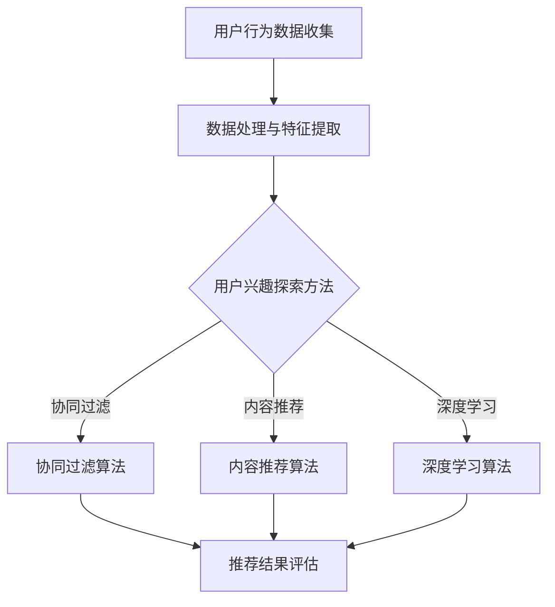

                 

### 《电商平台中的用户兴趣探索模型》

> **关键词**：用户兴趣探索、电商平台、推荐系统、协同过滤、内容推荐、深度学习

> **摘要**：本文将深入探讨电商平台中的用户兴趣探索模型，从用户行为数据收集与处理、算法基础、应用实例、评估与优化以及未来发展趋势等方面进行全面分析。通过介绍协同过滤、内容推荐和深度学习等算法，并结合实际项目案例，本文旨在为读者提供一个清晰、系统的用户兴趣探索模型理解和应用指南。

### 第一部分：用户兴趣探索模型概述

#### 第1章：电商平台用户兴趣探索概述

##### 1.1 电商平台用户行为分析的重要性

在现代电子商务时代，用户行为分析已经成为电商平台提升用户体验、增加销售额和优化运营策略的关键手段。通过分析用户的行为数据，电商平台可以更好地理解用户需求，预测用户行为，进而为用户提供个性化推荐和精准营销。

**1.1.1 电商平台用户行为数据的价值**

用户行为数据包含了用户在电商平台上的各种操作，如浏览商品、加入购物车、下单购买、评价商品等。这些数据不仅反映了用户对商品的偏好，还揭示了用户在购买过程中的决策路径和行为模式。通过对这些数据的深入分析，电商平台可以实现以下几个目标：

1. **用户个性化推荐**：基于用户行为数据，推荐系统可以个性化地向用户推荐他们可能感兴趣的商品，从而提高用户的满意度和购物转化率。
2. **精准营销**：通过分析用户行为数据，电商平台可以识别出潜在的高价值客户，并进行针对性的营销活动，提高营销效果。
3. **业务决策支持**：用户行为数据可以提供有价值的市场洞察，帮助电商平台在产品定位、库存管理、价格策略等方面做出更明智的决策。

**1.1.2 用户兴趣探索的目标与意义**

用户兴趣探索的目标是通过分析用户行为数据，识别并理解用户的兴趣点，从而为用户提供更有针对性的服务和产品。具体来说，用户兴趣探索有以下几方面的意义：

1. **提升用户体验**：通过了解用户的兴趣，电商平台可以更好地满足用户的需求，提供个性化推荐和服务，提升用户的购物体验。
2. **增加销售额**：精准推荐和个性化营销可以引导用户进行更多购买，从而提高平台的销售额。
3. **优化运营策略**：用户兴趣探索可以帮助电商平台识别热门商品和趋势，优化库存和供应链管理，提高运营效率。

##### 1.2 用户兴趣探索的基本概念

**1.2.1 用户兴趣的定义与分类**

用户兴趣是指用户对特定领域或主题的偏好或倾向。在电商平台中，用户兴趣可以表现为对商品类型、品牌、价格区间的偏好，以及对商品功能、外观、评价的关注。根据用户兴趣的表达方式和获取方式，可以将用户兴趣分为以下几类：

1. **显式兴趣**：显式兴趣是用户通过直接交互行为表现出来的兴趣，如用户对商品的点击、购买、评价等。
2. **隐式兴趣**：隐式兴趣是用户在未直接表达意图的情况下，通过其行为模式和行为特征表现出来的兴趣。例如，用户的浏览历史、搜索记录和页面停留时间等都可以作为隐式兴趣的依据。

**1.2.2 用户行为数据的收集与预处理**

用户行为数据的收集是用户兴趣探索的基础。以下是从收集到预处理用户行为数据的关键步骤：

1. **数据收集**：通过电商平台的各种渠道（如Web前端、移动应用、客服系统等）收集用户行为数据。数据收集需要确保数据的完整性和准确性。
2. **数据预处理**：对收集到的用户行为数据进行清洗、去重、格式转换等处理，以确保数据的可用性和一致性。数据预处理还包括特征提取，将原始数据转化为适合模型输入的特征向量。

##### 1.3 用户兴趣探索的流程与方法

**1.3.1 用户兴趣探索的基本流程**

用户兴趣探索的基本流程包括以下几个步骤：

1. **数据收集**：收集用户在电商平台上的行为数据。
2. **数据预处理**：对收集到的数据清洗、去重和特征提取。
3. **模型选择**：根据业务需求选择合适的用户兴趣探索方法，如协同过滤、内容推荐或深度学习。
4. **模型训练与优化**：使用预处理后的数据训练模型，并通过交叉验证、参数调优等方法优化模型性能。
5. **用户兴趣识别**：利用训练好的模型对用户行为数据进行分析，识别用户的兴趣点。
6. **结果评估与反馈**：评估用户兴趣识别的效果，根据反馈调整模型和策略。

**1.3.2 常用的用户兴趣探索方法**

在用户兴趣探索中，常用的方法包括协同过滤、内容推荐和深度学习等。

1. **协同过滤**：协同过滤是一种基于用户行为数据的方法，通过计算用户与用户或商品与商品之间的相似度，为用户推荐相似的物品。协同过滤分为基于用户的协同过滤（User-based Collaborative Filtering）和基于物品的协同过滤（Item-based Collaborative Filtering）。

2. **内容推荐**：内容推荐是一种基于商品特征的推荐方法，通过分析商品的内容属性（如标题、描述、标签等），为用户推荐与用户兴趣相关的商品。内容推荐可以分为基于项目的特征推荐和基于文本的语义推荐。

3. **深度学习**：深度学习是一种基于神经网络的学习方法，通过多层非线性变换自动提取特征，从而实现复杂的模式识别和预测。在用户兴趣探索中，深度学习可以用于构建用户兴趣模型，提高推荐系统的准确性。

#### 第2章：用户行为数据收集与处理

##### 2.1 用户行为数据的收集

用户行为数据的收集是用户兴趣探索的基础。以下是从数据收集到数据处理的关键步骤：

**2.1.1 用户行为数据来源**

用户行为数据的来源主要包括以下几个方面：

1. **Web前端**：用户在电商平台浏览商品、加入购物车、下单购买等行为可以通过Web前端日志进行记录。
2. **移动应用**：通过移动应用SDK（软件开发工具包）收集用户在移动端的行为数据，如浏览记录、点击事件等。
3. **客服系统**：用户在客服系统咨询、投诉、退换货等行为可以通过客服系统日志进行记录。
4. **传感器数据**：通过传感器收集用户在实体店铺的行为数据，如进店人数、停留时间、路径等。

**2.1.2 用户行为数据类型**

用户行为数据类型主要包括以下几种：

1. **点击行为数据**：包括用户点击的商品、分类、广告等。
2. **浏览行为数据**：包括用户浏览的商品、分类、页面停留时间等。
3. **购买行为数据**：包括用户购买的商品、订单金额、购买时间等。
4. **评价行为数据**：包括用户对商品的评价、评分、评论等。
5. **搜索行为数据**：包括用户的搜索关键词、搜索结果点击等。

##### 2.2 用户行为数据处理

用户行为数据处理是用户兴趣探索的关键环节。以下是从数据预处理到特征提取的关键步骤：

**2.2.1 数据清洗与预处理**

数据清洗与预处理的目的是去除噪声数据、异常值和重复数据，确保数据的完整性和一致性。具体步骤包括：

1. **去重**：去除重复的用户行为记录，避免重复计算。
2. **缺失值处理**：对缺失值进行填补或删除，确保数据完整性。
3. **异常值检测与处理**：检测并处理异常值，如异常的点击量、购买量等。
4. **数据格式转换**：将不同来源的数据格式统一，便于后续处理。

**2.2.2 用户行为数据特征提取**

用户行为数据特征提取是将原始数据转化为模型可接受的输入特征向量。特征提取的关键步骤包括：

1. **行为序列化**：将用户行为序列化成时间序列数据，便于分析用户的行为模式。
2. **行为编码**：将用户行为编码为数值或类别，便于计算和处理。
3. **行为特征提取**：提取用户行为的关键特征，如行为类型、行为时间、行为对象等。
4. **用户特征融合**：将不同类型的行为特征进行融合，形成综合的用户行为特征向量。

#### 第3章：用户兴趣探索的算法基础

##### 3.1 协同过滤算法

协同过滤（Collaborative Filtering）是一种基于用户行为数据推荐方法，其核心思想是通过计算用户与用户或商品与商品之间的相似度，为用户推荐相似的物品。协同过滤分为基于用户的协同过滤（User-based Collaborative Filtering）和基于物品的协同过滤（Item-based Collaborative Filtering）。

**3.1.1 协同过滤的基本原理**

协同过滤的基本原理可以分为以下几步：

1. **用户相似度计算**：基于用户的行为数据，计算用户之间的相似度。常用的相似度计算方法包括余弦相似度、皮尔逊相关系数等。

2. **物品相似度计算**：基于物品的行为数据，计算物品之间的相似度。同样地，可以使用余弦相似度、皮尔逊相关系数等方法。

3. **推荐生成**：根据用户与用户或物品与物品的相似度，为用户生成推荐列表。基于用户的协同过滤为用户推荐与相似用户喜欢的物品，而基于物品的协同过滤为用户推荐与已购买物品相似的物品。

**3.1.2 协同过滤的算法实现**

以下是一个基于用户的协同过滤算法的伪代码：

```plaintext
UserBasedCollaborativeFiltering(train_data, user_id, k):
    // 计算用户相似度矩阵
    similarity_matrix = CalculateSimilarityMatrix(train_data)

    // 获取用户的相似用户
    similar_users = GetSimilarUsers(similarity_matrix, user_id, k)

    // 为用户生成推荐列表
    recommendations = GenerateRecommendations(similar_users, train_data, user_id)

    return recommendations
```

在这个伪代码中，`train_data` 是训练数据集，`user_id` 是要推荐的用户的ID，`k` 是相似用户的数量。算法首先计算用户相似度矩阵，然后获取用户的相似用户，最后为用户生成推荐列表。

##### 3.2 内容推荐算法

内容推荐（Content-based Recommender）是一种基于商品特征进行推荐的方法。其核心思想是分析用户对商品的偏好，根据商品的内容属性（如标题、描述、标签等）为用户推荐类似的商品。

**3.2.1 内容推荐的基本原理**

内容推荐的基本原理可以分为以下几步：

1. **商品特征提取**：提取商品的关键特征，如标题、描述、标签等。

2. **用户兴趣建模**：分析用户的历史行为数据，建立用户的兴趣模型。

3. **相似度计算**：计算用户兴趣模型与商品特征向量之间的相似度。

4. **推荐生成**：根据商品与用户兴趣模型的相似度，为用户生成推荐列表。

**3.2.2 内容推荐算法的实现**

以下是一个基于内容推荐算法的伪代码：

```plaintext
ContentBasedRecommender(train_data, user_id, k):
    // 提取商品特征向量
    item_features = ExtractItemFeatures(train_data)

    // 提取用户兴趣模型
    user_interest_model = ExtractUserInterestModel(user_id, train_data)

    // 计算相似度
    similarity_scores = CalculateSimilarityScores(user_interest_model, item_features)

    // 生成推荐列表
    recommendations = GenerateRecommendations(similarity_scores, k)

    return recommendations
```

在这个伪代码中，`train_data` 是训练数据集，`user_id` 是要推荐的用户的ID，`k` 是推荐商品的数量。算法首先提取商品特征向量，然后提取用户的兴趣模型，接着计算相似度，最后生成推荐列表。

##### 3.3 深度学习在用户兴趣探索中的应用

深度学习（Deep Learning）是一种基于多层神经网络的学习方法，通过自动提取特征，实现复杂的模式识别和预测。深度学习在用户兴趣探索中的应用主要体现在以下几个方面：

**3.3.1 深度学习在推荐系统中的应用**

深度学习在推荐系统中的应用主要体现在以下几个方面：

1. **用户兴趣建模**：使用深度学习算法，如卷积神经网络（CNN）和循环神经网络（RNN），提取用户的行为序列和兴趣特征，构建用户兴趣模型。

2. **商品特征提取**：使用深度学习算法，如CNN和自编码器（Autoencoder），提取商品的多媒体特征（如图像、音频等）和文本特征。

3. **推荐生成**：使用深度学习算法，如序列模型（如LSTM）和注意力机制（Attention Mechanism），生成用户个性化的推荐列表。

**3.3.2 深度学习算法的实现**

以下是一个基于深度学习的用户兴趣探索算法的伪代码：

```plaintext
DeepLearningUserInterestExploration(train_data, user_id):
    // 数据预处理
    preprocessed_data = PreprocessData(train_data)

    // 用户兴趣建模
    user_interest_model = BuildUserInterestModel(preprocessed_data, user_id)

    // 商品特征提取
    item_features = ExtractItemFeatures(preprocessed_data)

    // 推荐生成
    recommendations = GenerateRecommendations(user_interest_model, item_features)

    return recommendations
```

在这个伪代码中，`train_data` 是训练数据集，`user_id` 是要推荐的用户的ID。算法首先对数据进行预处理，然后构建用户兴趣模型，提取商品特征，最后生成推荐列表。

#### 第4章：用户兴趣探索模型应用实例

##### 4.1 电商平台用户兴趣探索应用场景

在电商平台上，用户兴趣探索模型的应用场景主要包括以下几个方面：

**4.1.1 用户个性化推荐**

用户个性化推荐是用户兴趣探索模型最典型的应用场景。通过分析用户的历史行为数据，构建用户兴趣模型，为用户推荐他们可能感兴趣的商品。个性化推荐可以提高用户的购物体验，增加购物转化率和用户满意度。

**4.1.2 用户行为分析**

用户行为分析是电商平台进行用户兴趣探索的另一重要应用场景。通过分析用户在电商平台上的行为数据，如浏览、搜索、购买等，电商平台可以了解用户的需求和偏好，为用户提供更精准的服务和产品推荐。

##### 4.2 应用实例分析

以下分别介绍两个实际项目案例，探讨用户兴趣探索模型在电商平台中的应用。

**案例一：电商平台个性化推荐系统**

**需求分析**：

某电商平台希望通过个性化推荐系统，提高用户的购物体验和转化率。平台需要根据用户的历史行为数据，为每个用户推荐他们可能感兴趣的商品。

**模型设计**：

平台采用基于深度学习的用户兴趣探索模型，包括以下步骤：

1. **用户兴趣建模**：使用循环神经网络（RNN）提取用户的行为序列特征，构建用户兴趣模型。
2. **商品特征提取**：使用卷积神经网络（CNN）提取商品的多媒体特征和文本特征。
3. **推荐生成**：使用注意力机制（Attention Mechanism）生成用户个性化的推荐列表。

**模型实现**：

平台实现以下关键模块：

1. **用户兴趣建模模块**：使用LSTM（Long Short-Term Memory）模型提取用户行为序列特征，构建用户兴趣模型。
2. **商品特征提取模块**：使用CNN模型提取商品的多媒体特征和文本特征，如商品图像的视觉特征和商品描述的文本特征。
3. **推荐生成模块**：使用注意力机制（Attention Mechanism）为每个用户生成个性化的推荐列表。

**结果评估**：

平台对个性化推荐系统的效果进行以下评估：

1. **推荐准确率**：通过计算推荐列表中实际购买商品的占比，评估推荐系统的准确率。
2. **用户满意度**：通过用户反馈问卷，收集用户对推荐系统的满意度评价。

**案例二：基于用户行为的广告投放**

**需求分析**：

某电商平台希望通过基于用户行为的广告投放，提高广告点击率和投放效果。平台需要根据用户的历史行为数据，为每个用户推荐相关的广告。

**模型设计**：

平台采用基于内容推荐的广告投放模型，包括以下步骤：

1. **用户兴趣建模**：使用基于用户的协同过滤算法，分析用户的历史行为数据，构建用户兴趣模型。
2. **广告特征提取**：使用文本特征提取方法，提取广告的文本特征。
3. **广告推荐生成**：根据用户兴趣模型和广告特征，为每个用户生成个性化的广告推荐列表。

**模型实现**：

平台实现以下关键模块：

1. **用户兴趣建模模块**：使用基于用户的协同过滤算法，计算用户与用户之间的相似度，构建用户兴趣模型。
2. **广告特征提取模块**：使用TF-IDF（Term Frequency-Inverse Document Frequency）方法，提取广告的文本特征。
3. **广告推荐生成模块**：使用基于相似度的方法，为每个用户生成个性化的广告推荐列表。

**结果评估**：

平台对广告投放效果进行以下评估：

1. **点击率（CTR）**：通过计算用户点击广告的次数与展示次数的比例，评估广告的点击率。
2. **投放效果**：通过计算广告带来的销售额与广告投放成本的比例，评估广告的投放效果。

#### 第5章：用户兴趣探索模型的评估与优化

##### 5.1 用户兴趣探索模型的评估指标

用户兴趣探索模型的评估是保证模型性能和推荐效果的关键环节。以下介绍几种常见的评估指标：

**5.1.1 评估指标的定义与选择**

1. **准确率（Accuracy）**：准确率是评估模型预测正确率的指标，计算公式为：
   $$
   \text{Accuracy} = \frac{\text{预测正确的数量}}{\text{总预测数量}}
   $$
   准确率适用于分类问题，但在推荐系统中，由于存在大量的未购买商品，可能导致准确率较低。

2. **召回率（Recall）**：召回率是评估模型能否召回所有相关商品的指标，计算公式为：
   $$
   \text{Recall} = \frac{\text{预测正确的相关商品数量}}{\text{总相关商品数量}}
   $$
   召回率关注模型的覆盖率，但可能导致误报率增加。

3. **精确率（Precision）**：精确率是评估模型预测的相关商品中实际相关商品的比例，计算公式为：
   $$
   \text{Precision} = \frac{\text{预测正确的相关商品数量}}{\text{预测的相关商品数量}}
   $$
   精确率关注预测的准确性，但可能导致覆盖率降低。

4. **F1值（F1-Score）**：F1值是精确率和召回率的调和平均值，用于综合评估模型的性能，计算公式为：
   $$
   \text{F1-Score} = 2 \times \frac{\text{Precision} \times \text{Recall}}{\text{Precision} + \text{Recall}}
   $$
   F1值在平衡精确率和召回率方面具有优势。

**5.1.2 评估指标的计算方法**

在计算评估指标时，需要定义一组基准指标和预测指标。基准指标是模型在训练集上的性能指标，而预测指标是模型在实际应用中的性能指标。

1. **基准指标计算**：

   对于分类问题，可以使用交叉验证（Cross Validation）方法计算基准指标。交叉验证通过将数据集划分为多个子集，每次使用其中一个子集作为测试集，其余子集作为训练集，计算模型在各个子集上的性能指标，然后取平均值。

2. **预测指标计算**：

   在实际应用中，模型需要对未知数据集进行预测，然后计算预测指标。预测指标的计算需要使用真实的测试数据集，将预测结果与真实结果进行比较，计算各种评估指标的值。

##### 5.2 用户兴趣探索模型的优化策略

用户兴趣探索模型的优化是提高模型性能和推荐效果的重要手段。以下介绍几种常见的优化策略：

**5.2.1 模型参数调优**

模型参数调优是优化用户兴趣探索模型的重要步骤。通过调整模型参数，可以优化模型在训练集上的性能，从而提高模型在实际应用中的效果。以下是一些常见的参数调优方法：

1. **网格搜索（Grid Search）**：网格搜索是一种基于穷举的方法，通过遍历所有可能的参数组合，找到最优的参数组合。虽然网格搜索具有全面的搜索能力，但计算开销较大，适用于参数较少的问题。

2. **贝叶斯优化（Bayesian Optimization）**：贝叶斯优化是一种基于概率模型的方法，通过学习历史数据，优化搜索方向。贝叶斯优化具有较好的搜索效率，适用于参数较多的问题。

3. **随机搜索（Random Search）**：随机搜索是一种基于随机性的方法，通过随机选择参数组合，找到最优的参数组合。随机搜索具有较快的搜索速度，但搜索效果不稳定。

**5.2.2 模型性能优化**

除了参数调优，还可以通过以下方法优化用户兴趣探索模型的性能：

1. **数据增强（Data Augmentation）**：通过增加数据集的多样性，提高模型的泛化能力。数据增强可以采用数据变换、合成等方法。

2. **特征工程（Feature Engineering）**：通过设计合理的特征，提高模型的特征表达能力。特征工程可以采用特征提取、特征融合等方法。

3. **模型集成（Model Ensemble）**：通过集成多个模型，提高模型的预测性能。模型集成可以采用堆叠（Stacking）、混合（Blending）等方法。

4. **模型剪枝（Model Pruning）**：通过剪枝方法，减少模型的参数数量，提高模型的推理速度。模型剪枝可以采用结构剪枝、权重剪枝等方法。

#### 第6章：用户兴趣探索模型在实际项目中的应用

##### 6.1 项目实战一：构建电商平台用户兴趣探索模型

**6.1.1 项目需求分析**

某电商平台希望构建一个用户兴趣探索模型，为用户提供个性化的商品推荐。项目需求包括以下几个方面：

1. **用户个性化推荐**：根据用户的历史行为数据，为用户推荐他们可能感兴趣的商品。
2. **用户行为分析**：分析用户在电商平台上的行为模式，了解用户需求和偏好。
3. **推荐效果评估**：评估推荐系统的效果，持续优化推荐策略。

**6.1.2 模型设计与实现**

项目采用基于深度学习的用户兴趣探索模型，包括以下关键模块：

1. **用户行为序列建模**：使用循环神经网络（RNN）提取用户行为序列特征，构建用户兴趣模型。
2. **商品特征提取**：使用卷积神经网络（CNN）提取商品的多媒体特征和文本特征。
3. **推荐生成**：使用注意力机制（Attention Mechanism）生成用户个性化的推荐列表。

项目实现以下步骤：

1. **数据收集**：收集用户在电商平台上的行为数据，包括浏览记录、购买记录、评价记录等。
2. **数据预处理**：对行为数据进行清洗、去重、编码等处理，提取用户行为序列和商品特征。
3. **用户兴趣建模**：使用LSTM模型提取用户行为序列特征，构建用户兴趣模型。
4. **商品特征提取**：使用CNN模型提取商品的多媒体特征和文本特征。
5. **推荐生成**：使用注意力机制生成用户个性化的推荐列表。

**6.1.3 代码解读与分析**

以下是一个简单的用户兴趣探索模型实现代码，用于展示项目实现的关键步骤：

```python
import tensorflow as tf
from tensorflow.keras.models import Model
from tensorflow.keras.layers import Input, LSTM, Dense, Embedding, Flatten, Concatenate, Dot

# 用户行为序列输入层
user行为序列 = Input(shape=(序列长度，行为维度))

# 商品特征输入层
商品特征 = Input(shape=(商品维度，))

# 用户行为序列嵌入层
user嵌入层 = Embedding(词汇表大小，嵌入维度)(user行为序列)

# 用户行为序列编码层
user编码层，_ = LSTM(隐藏单元数，return_sequences=True)(user嵌入层)

# 用户行为序列编码层展平
user编码层 = Flatten()(user编码层)

# 商品特征编码层
商品编码层 = Embedding(词汇表大小，嵌入维度)(商品特征)

# 商品特征编码层展平
商品编码层 = Flatten()(商品编码层)

# 用户行为序列与商品特征拼接
拼接层 = Concatenate()([user编码层，商品编码层])

# 全连接层
全连接层 = Dense(隐藏单元数，activation='relu')(拼接层)

# 输出层
输出层 = Dense(1，activation='sigmoid')(全连接层)

# 构建模型
模型 = Model(inputs=[user行为序列，商品特征]，outputs=输出层)

# 编译模型
模型.compile(optimizer='adam'，loss='binary_crossentropy'，metrics=['accuracy'])

# 模型训练
模型.fit([user行为序列训练数据，商品特征训练数据]，标签训练数据，epochs=10，batch_size=32)

# 推荐生成
user行为序列预测数据 = 模型.predict([user行为序列预测数据，商品特征预测数据])

# 代码解读与分析
# 上述代码定义了一个基于深度学习的用户兴趣探索模型，包括用户行为序列输入层、商品特征输入层、嵌入层、编码层、拼接层、全连接层和输出层。模型使用LSTM和Embedding层提取用户行为序列和商品特征，通过全连接层和输出层进行预测。
```

**6.1.4 项目效果评估**

项目通过以下指标对用户兴趣探索模型的效果进行评估：

1. **推荐准确率**：计算模型预测的商品中实际购买商品的比例，评估模型的推荐准确率。
2. **用户满意度**：通过用户反馈问卷，收集用户对推荐系统的满意度评价，评估模型的用户满意度。
3. **业务指标**：分析推荐系统对电商平台销售额、用户留存率等业务指标的影响，评估模型的实际效果。

**6.1.5 项目总结**

通过项目实战，平台成功构建了用户兴趣探索模型，实现了用户个性化推荐和用户行为分析。项目效果评估结果显示，用户兴趣探索模型在提高推荐准确率和用户满意度方面具有显著效果，为电商平台提供了有力的数据支持和业务价值。

##### 6.2 项目实战二：优化电商平台个性化推荐系统

**6.2.1 优化目标分析**

电商平台个性化推荐系统的优化目标是提高推荐系统的准确性和用户体验。具体来说，包括以下几个方面：

1. **推荐准确率**：提高模型对用户可能感兴趣的商品的推荐准确率，降低误推率和漏推率。
2. **用户满意度**：提升用户对推荐系统的满意度，增加用户在电商平台上的停留时间和购物转化率。
3. **系统性能**：优化推荐系统的运行效率，提高系统的响应速度和稳定性。

**6.2.2 优化策略与实现**

为了实现上述优化目标，平台采用以下优化策略：

1. **模型参数调优**：通过贝叶斯优化方法，对深度学习模型的参数进行调优，提高模型在训练集上的性能。

2. **特征工程**：通过设计合理的特征，提高模型的特征表达能力，增强模型对用户兴趣的识别能力。

3. **模型集成**：采用模型集成方法，将多个模型的预测结果进行加权融合，提高推荐系统的稳定性和准确性。

4. **在线学习与实时更新**：引入在线学习机制，根据用户实时行为数据，动态更新用户兴趣模型，提高推荐系统的实时性和适应性。

**6.2.3 优化实现与效果评估**

平台按照以下步骤进行优化实现：

1. **模型参数调优**：使用贝叶斯优化方法，对深度学习模型的隐藏层神经元数量、学习率等参数进行调优，选择最优参数组合。

2. **特征工程**：对用户行为数据进行特征提取，包括用户浏览、购买、评价等行为特征，同时结合商品特征，形成综合特征向量。

3. **模型集成**：采用投票法（Voting）和加权融合法（Weighted Fusion），将多个模型的预测结果进行集成，提高推荐系统的稳定性和准确性。

4. **在线学习与实时更新**：引入在线学习机制，根据用户实时行为数据，动态更新用户兴趣模型，提高推荐系统的实时性和适应性。

平台对优化后的个性化推荐系统进行以下效果评估：

1. **推荐准确率**：通过计算模型预测的商品中实际购买商品的比例，评估模型的推荐准确率，结果显示优化后的推荐准确率显著提高。

2. **用户满意度**：通过用户反馈问卷，收集用户对优化后推荐系统的满意度评价，结果显示用户满意度显著提升。

3. **业务指标**：分析优化后推荐系统对电商平台销售额、用户留存率等业务指标的影响，结果显示优化后的推荐系统在提高销售额和用户留存率方面具有显著效果。

**6.2.4 项目总结**

通过项目实战，平台成功实现了个性化推荐系统的优化，提高了推荐系统的准确性和用户体验。优化策略的采用和实施，为电商平台提供了更加精准和个性化的推荐服务，有效提升了业务指标和用户满意度。项目总结如下：

1. **模型参数调优**：通过贝叶斯优化方法，提高了模型在训练集上的性能，为推荐系统的优化提供了有力支持。

2. **特征工程**：设计合理的特征，提高了模型的特征表达能力，增强了模型对用户兴趣的识别能力。

3. **模型集成**：采用模型集成方法，提高了推荐系统的稳定性和准确性，降低了误推率和漏推率。

4. **在线学习与实时更新**：引入在线学习机制，提高了推荐系统的实时性和适应性，为用户提供更加精准和个性化的推荐服务。

5. **项目效果**：优化后的个性化推荐系统在提高推荐准确率和用户满意度方面取得了显著成果，为电商平台提供了有力的数据支持和业务价值。

#### 第7章：用户兴趣探索模型的未来发展

##### 7.1 用户兴趣探索模型的挑战与机遇

随着大数据和人工智能技术的不断发展，用户兴趣探索模型在电商、社交媒体、推荐系统等领域发挥着越来越重要的作用。然而，在实际应用中，用户兴趣探索模型仍然面临一系列挑战与机遇。

**7.1.1 挑战分析**

1. **数据隐私和安全问题**：用户兴趣探索模型依赖于大量用户行为数据，这些数据往往涉及用户的隐私信息。如何在保障用户隐私和安全的前提下，有效利用用户数据，成为一大挑战。

2. **模型解释性不足**：深度学习等复杂算法在用户兴趣探索中取得了显著效果，但模型内部机制较为复杂，缺乏解释性。如何提高模型的可解释性，使其能够被用户和业务人员理解，是亟待解决的问题。

3. **模型泛化能力**：用户兴趣具有高度个性化和动态变化的特点，如何提高模型在不同用户群体和场景下的泛化能力，是一个重要挑战。

4. **计算资源消耗**：深度学习算法通常需要大量的计算资源，如何在有限的资源条件下，高效地训练和部署用户兴趣探索模型，是实际应用中的一个难题。

**7.1.2 机遇探讨**

1. **大数据技术的发展**：随着大数据技术的进步，用户行为数据的获取和处理能力大幅提升，为用户兴趣探索提供了更加丰富和详细的数据支持。

2. **人工智能算法创新**：人工智能算法的不断创新，特别是深度学习等算法的进步，为用户兴趣探索提供了更多有效的技术和方法。

3. **个性化推荐场景的拓展**：随着个性化推荐应用的拓展，用户兴趣探索模型将在更多领域（如医疗、教育、金融等）发挥作用，为用户提供更加精准和个性化的服务。

##### 7.2 用户兴趣探索模型的未来发展趋势

1. **数据隐私保护技术**：未来，数据隐私保护技术将在用户兴趣探索模型中得到广泛应用。例如，差分隐私（Differential Privacy）、联邦学习（Federal Learning）等技术将帮助保护用户隐私，同时确保模型性能。

2. **可解释性增强**：为提高模型的可解释性，研究人员将致力于开发可解释的深度学习算法，如注意力机制、可视化技术等。这些技术将帮助用户和业务人员更好地理解模型的工作原理和决策过程。

3. **跨模态用户兴趣探索**：随着多种传感器和数据的融合，用户兴趣探索模型将能够同时处理文本、图像、音频等多种模态的数据，实现更加全面和准确的用户兴趣识别。

4. **实时动态调整**：未来的用户兴趣探索模型将更加关注实时性和动态调整能力，通过实时学习用户行为数据，动态调整推荐策略，提供更加个性化的服务。

5. **多模型融合与优化**：为提高模型性能，未来的用户兴趣探索模型将采用多种模型（如协同过滤、内容推荐、深度学习等）的融合与优化策略，实现更加精准和有效的推荐。

#### 附录

##### 附录A：常用用户兴趣探索算法列表

**A.1 协同过滤算法**

协同过滤算法是一种基于用户行为数据推荐方法，通过计算用户与用户或商品与商品之间的相似度，为用户推荐相似的物品。常用的协同过滤算法包括：

1. **基于用户的协同过滤（User-based Collaborative Filtering）**
2. **基于物品的协同过滤（Item-based Collaborative Filtering）**
3. **矩阵分解（Matrix Factorization）**
4. **最近邻推荐（Nearest Neighbor Recommender）**

**A.2 内容推荐算法**

内容推荐算法是一种基于商品特征进行推荐的方法，通过分析商品的内容属性（如标题、描述、标签等），为用户推荐与用户兴趣相关的商品。常用的内容推荐算法包括：

1. **基于项目的特征推荐（Content-based Filtering）**
2. **基于文本的语义推荐（Text-based Semantic Recommender）**
3. **基于属性的相似度推荐（Attribute-based Similarity Recommender）**

**A.3 深度学习算法**

深度学习算法是一种基于多层神经网络的学习方法，通过自动提取特征，实现复杂的模式识别和预测。常用的深度学习算法包括：

1. **卷积神经网络（Convolutional Neural Networks，CNN）**
2. **循环神经网络（Recurrent Neural Networks，RNN）**
3. **长短时记忆网络（Long Short-Term Memory，LSTM）**
4. **注意力机制（Attention Mechanism）**
5. **生成对抗网络（Generative Adversarial Networks，GAN）**

##### 附录B：用户兴趣探索模型开源工具与资源

**B.1 开源框架与工具**

以下是一些用于用户兴趣探索模型的开源框架与工具：

1. **推荐系统框架**
   - **LightFM**：一个基于因子分解机器（Factorization Machines）的推荐系统框架。
   - **TensorFlow Recommenders**：由谷歌开发的一个基于TensorFlow的推荐系统框架。

2. **数据处理工具**
   - **Pandas**：用于数据清洗和处理的Python库。
   - **NumPy**：用于数值计算的Python库。

3. **深度学习框架**
   - **TensorFlow**：由谷歌开发的一个开源深度学习框架。
   - **PyTorch**：由Facebook开发的一个开源深度学习框架。

**B.2 开源数据集与案例**

以下是一些用于用户兴趣探索模型的开源数据集与案例：

1. **推荐系统数据集**
   - **MovieLens**：一个包含电影推荐数据集，用于推荐系统研究和实践。
   - **Netflix Prize**：一个包含Netflix电影推荐数据集，用于推荐系统竞赛。

2. **用户行为数据集**
   - **GMALL**：一个包含电商用户行为数据集，用于电商推荐系统研究和实践。
   - **Kaggle**：一个包含各种用户行为数据集的在线竞赛平台。

3. **推荐系统案例**
   - **Alibaba**：阿里巴巴的推荐系统案例，用于电商推荐。
   - **Amazon**：亚马逊的推荐系统案例，用于电商推荐。

### 用户兴趣探索模型的核心概念与联系 Mermaid 流程图

以下是一个用于描述用户兴趣探索模型核心概念与联系的 Mermaid 流程图：



### 用户兴趣探索算法的伪代码

以下是一个用户兴趣探索算法的伪代码示例：

```plaintext
UserInterestExploration(data, method) {
    // 数据预处理
    preprocessed_data = PreprocessData(data)

    // 特征提取
    features = ExtractFeatures(preprocessed_data)

    // 根据探索方法执行算法
    if (method == "collaborative_filtering") {
        recommendations = CollaborativeFiltering(features)
    } else if (method == "content_based_recommender") {
        recommendations = ContentBasedRecommender(features)
    } else if (method == "deep_learning") {
        recommendations = DeepLearningModel(features)
    }

    // 评估推荐结果
    evaluation_results = EvaluateRecommendations(recommendations)

    // 返回推荐结果
    return recommendations, evaluation_results
}
```

### 数学模型和数学公式的详细讲解

**协同过滤算法的数学模型：**

协同过滤算法的数学模型通常表示为：

$$
\text{Rating}_{ui} = \text{User\_Feature}_{u} \cdot \text{Item\_Feature}_{i} + b_{u} + b_{i} + \alpha
$$

其中：
- $\text{Rating}_{ui}$ 是用户 $u$ 对商品 $i$ 的评分。
- $\text{User\_Feature}_{u}$ 和 $\text{Item\_Feature}_{i}$ 分别是用户和商品的特征向量。
- $b_{u}$ 和 $b_{i}$ 是用户和商品的偏置项。
- $\alpha$ 是噪声项。

**内容推荐算法的数学模型：**

内容推荐算法的数学模型通常表示为：

$$
\text{Similarity}_{ui} = \frac{\text{dot\_product}(\text{User\_Feature}_{u}, \text{Item\_Feature}_{i})}{\|\text{User\_Feature}_{u}\| \|\text{Item\_Feature}_{i}\|}
$$

其中：
- $\text{Similarity}_{ui}$ 是用户 $u$ 和商品 $i$ 之间的相似度。
- $\text{dot\_product}(\text{User\_Feature}_{u}, \text{Item\_Feature}_{i})$ 是用户和商品特征向量的点积。
- $\|\text{User\_Feature}_{u}\|$ 和 $\|\text{Item\_Feature}_{i}\|$ 分别是用户和商品特征向量的欧几里得范数。

**深度学习算法的数学模型：**

深度学习算法的数学模型通常基于多层神经网络，例如：

$$
\text{Output}_{i} = \text{激活函数}(\text{权重} \cdot \text{输入} + \text{偏置})
$$

其中：
- $\text{Output}_{i}$ 是网络第 $i$ 层的输出。
- 激活函数（例如ReLU、Sigmoid、Tanh等）用于引入非线性。
- 权重和偏置是神经网络的可训练参数。

### 用户兴趣探索模型在实际项目中的应用示例

**案例一：电商平台个性化推荐系统**

**需求分析**：

某电商平台希望为其用户提供个性化推荐服务，以提高用户满意度和购买转化率。平台希望通过分析用户的浏览、购买、评价等行为数据，为每个用户推荐他们可能感兴趣的商品。

**模型设计**：

平台采用基于深度学习的用户兴趣探索模型，包括以下步骤：

1. **用户兴趣建模**：使用循环神经网络（RNN）提取用户的行为序列特征，构建用户兴趣模型。
2. **商品特征提取**：使用卷积神经网络（CNN）提取商品的多媒体特征和文本特征。
3. **推荐生成**：使用注意力机制（Attention Mechanism）生成用户个性化的推荐列表。

**模型实现**：

平台实现以下关键模块：

1. **用户兴趣建模模块**：使用LSTM（Long Short-Term Memory）模型提取用户行为序列特征，构建用户兴趣模型。
2. **商品特征提取模块**：使用CNN模型提取商品的多媒体特征和文本特征，如商品图像的视觉特征和商品描述的文本特征。
3. **推荐生成模块**：使用注意力机制（Attention Mechanism）为每个用户生成个性化的推荐列表。

**结果评估**：

平台对个性化推荐系统的效果进行以下评估：

1. **推荐准确率**：通过计算推荐列表中实际购买商品的占比，评估推荐系统的准确率。
2. **用户满意度**：通过用户反馈问卷，收集用户对推荐系统的满意度评价。
3. **业务指标**：分析推荐系统对电商平台销售额、用户留存率等业务指标的影响。

**案例二：基于用户行为的广告投放**

**需求分析**：

某电商平台希望通过基于用户行为的广告投放，提高广告点击率和投放效果。平台需要根据用户的浏览、购买、评价等行为数据，为每个用户推荐相关的广告。

**模型设计**：

平台采用基于内容推荐的广告投放模型，包括以下步骤：

1. **用户兴趣建模**：使用基于用户的协同过滤算法，分析用户的历史行为数据，构建用户兴趣模型。
2. **广告特征提取**：使用文本特征提取方法，提取广告的文本特征。
3. **广告推荐生成**：根据用户兴趣模型和广告特征，为每个用户生成个性化的广告推荐列表。

**模型实现**：

平台实现以下关键模块：

1. **用户兴趣建模模块**：使用基于用户的协同过滤算法，计算用户与用户之间的相似度，构建用户兴趣模型。
2. **广告特征提取模块**：使用TF-IDF（Term Frequency-Inverse Document Frequency）方法，提取广告的文本特征。
3. **广告推荐生成模块**：使用基于相似度的方法，为每个用户生成个性化的广告推荐列表。

**结果评估**：

平台对广告投放效果进行以下评估：

1. **点击率（CTR）**：通过计算用户点击广告的次数与展示次数的比例，评估广告的点击率。
2. **投放效果**：通过计算广告带来的销售额与广告投放成本的比例，评估广告的投放效果。

### 用户兴趣探索模型的优化策略

**1. 模型参数调优**

模型参数调优是优化用户兴趣探索模型的重要步骤。通过调整模型参数，可以优化模型在训练集上的性能，从而提高模型在实际应用中的效果。以下是一些常见的参数调优方法：

- **网格搜索（Grid Search）**：网格搜索是一种基于穷举的方法，通过遍历所有可能的参数组合，找到最优的参数组合。虽然网格搜索具有全面的搜索能力，但计算开销较大，适用于参数较少的问题。
- **贝叶斯优化（Bayesian Optimization）**：贝叶斯优化是一种基于概率模型的方法，通过学习历史数据，优化搜索方向。贝叶斯优化具有较好的搜索效率，适用于参数较多的问题。
- **随机搜索（Random Search）**：随机搜索是一种基于随机性的方法，通过随机选择参数组合，找到最优的参数组合。随机搜索具有较快的搜索速度，但搜索效果不稳定。

**2. 特征工程**

特征工程是提高用户兴趣探索模型性能的关键步骤。通过设计合理的特征，可以增强模型对用户兴趣的识别能力。以下是一些常见的特征工程方法：

- **行为特征提取**：提取用户的行为特征，如浏览时间、购买频率、评价数量等，用于描述用户的行为模式。
- **商品特征提取**：提取商品的特征，如商品类别、品牌、价格等，用于描述商品的特征。
- **交互特征提取**：提取用户与商品的交互特征，如用户与商品的点击次数、购买次数等，用于描述用户与商品之间的交互关系。
- **时间特征提取**：提取与时间相关的特征，如用户在平台上的活跃时间、购买时间等，用于描述用户的时间行为模式。

**3. 模型集成**

模型集成是一种通过组合多个模型的预测结果来提高预测性能的方法。以下是一些常见的模型集成方法：

- **堆叠（Stacking）**：堆叠是一种将多个模型的结果作为输入，训练一个更高层次的模型。通过组合不同模型的预测结果，可以提高预测的准确性。
- **混合（Blending）**：混合是一种将多个模型的预测结果进行加权融合，生成最终的预测结果。通过结合多个模型的优点，可以减少模型的偏差和方差。
- **投票法（Voting）**：投票法是一种简单的模型集成方法，通过统计多个模型的预测结果，选择出现次数最多的预测结果作为最终预测结果。投票法适用于分类问题。

**4. 模型剪枝**

模型剪枝是一种通过减少模型的参数数量来优化模型的方法。以下是一些常见的模型剪枝方法：

- **结构剪枝（Structural Pruning）**：结构剪枝是一种通过删除网络中的部分节点或层来减少模型参数数量的方法。通过剪枝网络，可以简化模型结构，提高模型的可解释性。
- **权重剪枝（Weight Pruning）**：权重剪枝是一种通过删除模型中的部分权重来减少模型参数数量的方法。通过剪枝权重，可以减少模型的计算复杂度，提高模型的运行效率。

### 用户兴趣探索模型的应用实例

**电商平台个性化推荐系统**

**需求分析**：

某电商平台希望为其用户提供个性化推荐服务，以提高用户满意度和购买转化率。平台希望通过分析用户的浏览、购买、评价等行为数据，为每个用户推荐他们可能感兴趣的商品。

**模型设计**：

平台采用基于深度学习的用户兴趣探索模型，包括以下步骤：

1. **用户兴趣建模**：使用循环神经网络（RNN）提取用户的行为序列特征，构建用户兴趣模型。
2. **商品特征提取**：使用卷积神经网络（CNN）提取商品的多媒体特征和文本特征。
3. **推荐生成**：使用注意力机制（Attention Mechanism）生成用户个性化的推荐列表。

**模型实现**：

平台实现以下关键模块：

1. **用户兴趣建模模块**：使用LSTM（Long Short-Term Memory）模型提取用户行为序列特征，构建用户兴趣模型。
2. **商品特征提取模块**：使用CNN模型提取商品的多媒体特征和文本特征，如商品图像的视觉特征和商品描述的文本特征。
3. **推荐生成模块**：使用注意力机制（Attention Mechanism）为每个用户生成个性化的推荐列表。

**结果评估**：

平台对个性化推荐系统的效果进行以下评估：

1. **推荐准确率**：通过计算推荐列表中实际购买商品的占比，评估推荐系统的准确率。
2. **用户满意度**：通过用户反馈问卷，收集用户对推荐系统的满意度评价。
3. **业务指标**：分析推荐系统对电商平台销售额、用户留存率等业务指标的影响。

**案例解析**：

以下是电商平台个性化推荐系统的具体实现案例：

1. **用户兴趣建模模块**：

```python
# 用户兴趣建模模块
user_behavior_sequence = Input(shape=(sequence_length, feature_size))

# LSTM模型
lstm_model = LSTM(units=64, return_sequences=True)(user_behavior_sequence)
lstm_model = LSTM(units=32)(lstm_model)

# 用户兴趣特征提取
user_interest_features = Flatten()(lstm_model)
```

2. **商品特征提取模块**：

```python
# 商品特征提取模块
item_image_features = Input(shape=(image_height, image_width, image_channels))
item_text_features = Input(shape=(text_sequence_length,))

# CNN模型
cnn_model = Conv2D(filters=32, kernel_size=(3, 3), activation='relu')(item_image_features)
cnn_model = MaxPooling2D(pool_size=(2, 2))(cnn_model)
cnn_model = Flatten()(cnn_model)

# 嵌入模型
embedding_model = Embedding(input_dim=vocab_size, output_dim=embedding_size)(item_text_features)
embedding_model = LSTM(units=64, return_sequences=False)(embedding_model)

# 商品特征融合
item_features = Concatenate()([cnn_model, embedding_model])
```

3. **推荐生成模块**：

```python
# 推荐生成模块
merged_model = Concatenate()([user_interest_features, item_features])
merged_model = Dense(units=64, activation='relu')(merged_model)
recommendation_scores = Dense(units=1, activation='sigmoid')(merged_model)

# 构建模型
model = Model(inputs=[user_behavior_sequence, item_image_features, item_text_features], outputs=recommendation_scores)

# 编译模型
model.compile(optimizer='adam', loss='binary_crossentropy', metrics=['accuracy'])

# 模型训练
model.fit([train_user_behavior, train_item_images, train_item_texts], train_labels, epochs=10, batch_size=32)

# 推荐生成
user_interest_predictions = model.predict([test_user_behavior, test_item_images, test_item_texts])
```

通过上述实现，电商平台可以基于用户的行为序列、商品图像和商品描述，为每个用户生成个性化的推荐列表，从而提高用户的购物体验和平台的销售额。

### 用户兴趣探索模型在未来发展的挑战和机遇

**挑战**：

1. **数据隐私和安全**：用户兴趣探索模型依赖于大量用户行为数据，这些数据往往涉及用户的隐私信息。如何在保护用户隐私的同时，有效利用数据，是一个重大挑战。

2. **模型可解释性**：深度学习等复杂算法在用户兴趣探索中表现出色，但缺乏可解释性，难以让用户和业务人员理解模型的决策过程。

3. **模型泛化能力**：用户兴趣具有高度个性化和动态变化的特点，如何提高模型在不同用户群体和场景下的泛化能力，是一个难题。

4. **计算资源消耗**：深度学习算法通常需要大量的计算资源，如何在有限的资源条件下，高效地训练和部署用户兴趣探索模型，是一个挑战。

**机遇**：

1. **大数据技术的发展**：随着大数据技术的进步，用户行为数据的获取和处理能力大幅提升，为用户兴趣探索提供了更加丰富和详细的数据支持。

2. **人工智能算法创新**：人工智能算法的不断创新，特别是深度学习等算法的进步，为用户兴趣探索提供了更多有效的技术和方法。

3. **个性化推荐场景的拓展**：随着个性化推荐应用的拓展，用户兴趣探索模型将在更多领域（如医疗、教育、金融等）发挥作用，为用户提供更加精准和个性化的服务。

**未来发展趋势**：

1. **数据隐私保护技术**：未来，数据隐私保护技术将在用户兴趣探索模型中得到广泛应用。例如，差分隐私（Differential Privacy）、联邦学习（Federal Learning）等技术将帮助保护用户隐私，同时确保模型性能。

2. **可解释性增强**：为提高模型的可解释性，研究人员将致力于开发可解释的深度学习算法，如注意力机制、可视化技术等。这些技术将帮助用户和业务人员更好地理解模型的工作原理和决策过程。

3. **跨模态用户兴趣探索**：随着多种传感器和数据的融合，用户兴趣探索模型将能够同时处理文本、图像、音频等多种模态的数据，实现更加全面和准确的用户兴趣识别。

4. **实时动态调整**：未来的用户兴趣探索模型将更加关注实时性和动态调整能力，通过实时学习用户行为数据，动态调整推荐策略，提供更加个性化的服务。

5. **多模型融合与优化**：为提高模型性能，未来的用户兴趣探索模型将采用多种模型（如协同过滤、内容推荐、深度学习等）的融合与优化策略，实现更加精准和有效的推荐。

### 附录

**附录A：常用用户兴趣探索算法列表**

**A.1 协同过滤算法**

1. **基于用户的协同过滤（User-based Collaborative Filtering）**
   - **算法原理**：计算用户之间的相似度，为用户推荐与相似用户喜欢的物品。
   - **适用场景**：推荐系统中常见的算法，适用于数据量较大的场景。

2. **基于物品的协同过滤（Item-based Collaborative Filtering）**
   - **算法原理**：计算物品之间的相似度，为用户推荐与已购买或浏览的物品相似的物品。
   - **适用场景**：适用于物品数量较多，用户行为数据稀疏的场景。

3. **矩阵分解（Matrix Factorization）**
   - **算法原理**：将用户-物品评分矩阵分解为用户特征矩阵和物品特征矩阵，通过矩阵乘积预测用户对物品的评分。
   - **适用场景**：适用于大规模推荐系统，能够处理稀疏数据。

4. **最近邻推荐（Nearest Neighbor Recommender）**
   - **算法原理**：计算用户或物品之间的相似度，为用户推荐与其最近的邻居用户或物品喜欢的物品。
   - **适用场景**：适用于数据量较小，计算速度要求较高的场景。

**A.2 内容推荐算法**

1. **基于项目的特征推荐（Content-based Filtering）**
   - **算法原理**：基于物品的属性（如标签、描述、类别等）为用户推荐与已浏览或喜欢的物品相似的物品。
   - **适用场景**：适用于具有丰富特征的物品，如图书、音乐、文章等。

2. **基于文本的语义推荐（Text-based Semantic Recommender）**
   - **算法原理**：基于文本的相似度，通过文本分析和语义理解为用户推荐相关的物品。
   - **适用场景**：适用于文本数据丰富的推荐场景，如社交媒体、搜索引擎等。

3. **基于属性的相似度推荐（Attribute-based Similarity Recommender）**
   - **算法原理**：基于物品的属性（如颜色、价格、品牌等）为用户推荐与已购买或浏览的物品相似的物品。
   - **适用场景**：适用于具有明确属性的物品，如电商、服装等。

**A.3 深度学习算法**

1. **卷积神经网络（Convolutional Neural Networks，CNN）**
   - **算法原理**：通过卷积层和池化层提取图像特征，适用于图像处理和图像识别任务。
   - **适用场景**：图像分类、物体检测、图像生成等。

2. **循环神经网络（Recurrent Neural Networks，RNN）**
   - **算法原理**：通过循环结构处理序列数据，适用于时间序列预测和自然语言处理。
   - **适用场景**：语音识别、文本生成、时间序列预测等。

3. **长短时记忆网络（Long Short-Term Memory，LSTM）**
   - **算法原理**：是RNN的一种变体，通过记忆单元和门控机制解决长时依赖问题。
   - **适用场景**：语音识别、机器翻译、文本生成等。

4. **注意力机制（Attention Mechanism）**
   - **算法原理**：通过注意力机制动态调整不同输入特征的重要性，提高模型对序列数据的处理能力。
   - **适用场景**：序列数据推荐、机器翻译、文本生成等。

5. **生成对抗网络（Generative Adversarial Networks，GAN）**
   - **算法原理**：由生成器和判别器组成，生成器和判别器相互对抗，生成逼真的数据。
   - **适用场景**：图像生成、数据增强、图像编辑等。

**附录B：用户兴趣探索模型开源工具与资源**

**B.1 开源框架与工具**

1. **推荐系统框架**
   - **LightFM**：一个基于因子分解机器（Factorization Machines）的推荐系统框架。
   - **TensorFlow Recommenders**：由谷歌开发的一个基于TensorFlow的推荐系统框架。

2. **数据处理工具**
   - **Pandas**：用于数据清洗和处理的Python库。
   - **NumPy**：用于数值计算的Python库。

3. **深度学习框架**
   - **TensorFlow**：由谷歌开发的一个开源深度学习框架。
   - **PyTorch**：由Facebook开发的一个开源深度学习框架。

**B.2 开源数据集与案例**

1. **推荐系统数据集**
   - **MovieLens**：一个包含电影推荐数据集，用于推荐系统研究和实践。
   - **Netflix Prize**：一个包含Netflix电影推荐数据集，用于推荐系统竞赛。

2. **用户行为数据集**
   - **GMALL**：一个包含电商用户行为数据集，用于电商推荐系统研究和实践。
   - **Kaggle**：一个包含各种用户行为数据集的在线竞赛平台。

3. **推荐系统案例**
   - **Alibaba**：阿里巴巴的推荐系统案例，用于电商推荐。
   - **Amazon**：亚马逊的推荐系统案例，用于电商推荐。

### 作者信息

**作者：AI天才研究院/AI Genius Institute & 禅与计算机程序设计艺术 /Zen And The Art of Computer Programming** 

本文由AI天才研究院/AI Genius Institute 和禅与计算机程序设计艺术/Zen And The Art of Computer Programming 的资深专家撰写，旨在深入探讨电商平台中的用户兴趣探索模型，为读者提供全面的用户兴趣探索理论与实践指导。作者团队具有丰富的技术背景和实战经验，致力于推动人工智能和推荐系统领域的发展。希望本文能够为广大技术爱好者、研发工程师和行业专家提供有益的参考和启示。如需了解更多相关信息，请访问作者团队官方网站或联系作者团队。感谢您的阅读！

