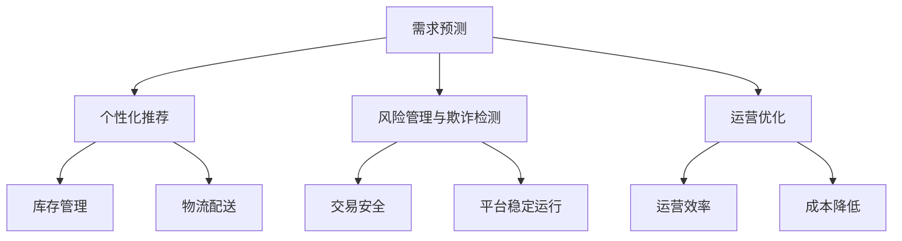

                 

## 第1章：引言与背景

### 1.1 书籍概述

《电商平台供给能力提升：大数据分析的应用》是一本专门针对电商平台供给能力提升的实用指南，深入探讨了大数据分析在这一领域的应用。本书旨在帮助读者理解大数据分析的核心概念，以及如何将其应用于电商平台的供给能力提升中。

#### 1.1.1 电商平台供给能力的定义

电商平台供给能力是指电商平台在满足消费者需求方面的能力，包括商品供应链管理、库存管理、物流配送等方面。一个高效的供给能力能够确保电商平台在竞争激烈的市场中保持优势，同时提高用户满意度和忠诚度。

#### 1.1.2 供给能力提升的重要性

提升电商平台的供给能力对于企业的发展至关重要。具体来说，供给能力提升的重要性体现在以下几个方面：

- **满足消费者需求**：通过大数据分析，电商平台可以更好地了解消费者的需求和偏好，提供个性化的商品和服务。
- **优化库存管理**：大数据分析有助于预测市场需求，优化库存管理，降低库存成本，提高库存周转率。
- **提高运营效率**：通过数据驱动的决策，电商平台可以提高物流配送、订单处理等环节的效率。
- **降低运营成本**：大数据分析可以识别和消除运营中的浪费，降低运营成本。

#### 1.1.3 大数据分析在电商供给能力提升中的应用

大数据分析在电商供给能力提升中的应用广泛且深入，主要包括以下几个方面：

- **需求预测**：通过分析历史销售数据和消费者行为，预测未来需求趋势，为供应链规划提供数据支持。
- **个性化推荐**：基于消费者行为数据，为用户推荐个性化的商品，提高销售转化率和用户满意度。
- **风险管理与欺诈检测**：通过分析交易数据和行为模式，识别潜在的风险和欺诈行为，保障交易安全和平台稳定运行。
- **运营优化**：通过数据分析和挖掘，优化库存管理、物流配送等环节，提高运营效率，降低成本。

### 1.2 大数据分析概述

#### 1.2.1 大数据分析的定义与特点

大数据分析是指对大量、复杂、快速变化的数据进行采集、存储、处理和分析的过程。其特点包括：

- **数据量大**：大数据涉及的数据量通常在GB、TB甚至PB级别，远超传统数据处理能力。
- **数据多样性**：大数据来源广泛，包括结构化、半结构化和非结构化数据。
- **数据处理速度快**：大数据分析需要在短时间内处理海量数据，实现实时分析。
- **数据价值高**：通过深入分析大数据，可以挖掘出有价值的信息和知识。

#### 1.2.2 大数据分析在电商领域的应用现状

大数据分析在电商领域的应用已经越来越普及，具体表现如下：

- **需求预测**：电商平台通过大数据分析，预测市场需求，优化库存和供应链管理。
- **个性化推荐**：电商平台利用大数据分析，为用户推荐个性化的商品，提高用户满意度和购买转化率。
- **风险管理与欺诈检测**：电商平台通过大数据分析，识别和防范交易风险和欺诈行为。
- **运营优化**：电商平台利用大数据分析，优化运营流程，提高效率和降低成本。

#### 1.2.3 大数据分析的发展趋势与前景

随着技术的进步和数据量的持续增长，大数据分析在电商领域的应用前景十分广阔，发展趋势包括：

- **实时数据分析**：随着物联网、5G等技术的发展，实时数据分析将成为大数据分析的重要方向。
- **人工智能与大数据结合**：人工智能技术的引入将进一步提升大数据分析的能力，实现自动化和智能化的数据分析。
- **跨领域应用**：大数据分析将与其他领域（如金融、医疗等）相结合，实现更广泛的跨领域应用。

### 1.3 电商供给能力提升的挑战与机遇

#### 1.3.1 供给能力提升面临的挑战

电商平台在提升供给能力的过程中，面临以下挑战：

- **数据质量**：大数据分析的质量取决于数据的质量，包括数据完整性、准确性和一致性。
- **数据隐私**：电商平台需要处理大量用户数据，保护用户隐私是一个重要挑战。
- **技术难题**：大数据分析涉及到复杂的技术问题，如数据存储、处理、分析和安全等。

#### 1.3.2 大数据分析为供给能力提升带来的机遇

大数据分析为电商供给能力提升带来了以下机遇：

- **精准营销**：通过大数据分析，电商平台可以更精准地定位目标用户，实现个性化营销。
- **智能供应链**：大数据分析有助于优化供应链管理，提高供应链效率和响应速度。
- **风险控制**：大数据分析可以识别和防范风险，提高电商平台的安全性和稳定性。
- **降低成本**：通过大数据分析，电商平台可以优化资源配置，降低运营成本。

#### 1.3.3 供给能力提升的核心目标与关键指标

电商供给能力提升的核心目标是提高用户满意度和盈利能力，关键指标包括：

- **库存周转率**：衡量库存管理的效率，即商品从入库到出库的时间。
- **订单履行率**：衡量订单处理的速度和质量，即订单从生成到完成的时间。
- **用户满意度**：通过用户反馈和评价，衡量用户对电商平台的满意度。
- **销售转化率**：衡量营销策略的有效性，即浏览量到购买量的转化率。

## Mermaid 流程图：大数据分析在电商供给能力提升中的应用流程



### 1.4 大数据分析的发展趋势与前景

大数据分析在电商领域的应用前景广阔，未来将呈现以下发展趋势：

- **数据来源多样化**：随着物联网、社交媒体等技术的发展，电商平台将获取更多种类和来源的数据，为大数据分析提供更丰富的数据基础。
- **实时分析与预测**：实时数据分析与预测将成为大数据分析的重要方向，为电商平台提供更加及时和准确的决策支持。
- **人工智能与大数据结合**：人工智能技术的引入将进一步提升大数据分析的能力，实现自动化和智能化的数据分析。
- **跨领域应用**：大数据分析将与其他领域（如金融、医疗等）相结合，实现更广泛的跨领域应用。

## 第2章：大数据分析方法与工具

### 2.1 数据采集与预处理

#### 2.1.1 数据采集方法

数据采集是大数据分析的基础，电商平台需要通过多种渠道获取与业务相关的数据。常见的数据采集方法包括：

- **自动化数据采集**：利用爬虫技术、API接口等方式自动采集互联网上的公开数据。
- **手动数据采集**：通过调查问卷、用户反馈等方式收集用户行为数据。

#### 2.1.2 数据预处理技术

数据预处理是确保数据质量的关键步骤，包括以下内容：

- **数据清洗**：去除重复数据、缺失值填充、数据格式转换等。
- **数据整合**：将不同来源和格式的数据整合为一个统一的数据集。
- **数据质量管理**：确保数据准确性、一致性和完整性。

#### 2.1.3 数据质量管理

数据质量管理是大数据分析中的核心环节，主要包括以下方面：

- **数据准确性**：确保数据来源可靠，减少错误数据的影响。
- **数据一致性**：统一数据格式和单位，确保数据之间的可比性。
- **数据完整性**：确保数据的完整性，避免关键信息的丢失。

### 2.2 数据存储与管理

#### 2.2.1 数据仓库技术

数据仓库是一种用于存储和管理大量数据的数据库系统，支持数据查询和分析。常见的数据仓库技术包括：

- **数据仓库的基本概念**：数据仓库由数据源、数据集成层、数据存储层和数据访问层组成。
- **数据仓库的架构**：数据仓库通常采用星型模型或雪花模型，以提高查询效率。

#### 2.2.2 数据湖技术

数据湖是一种用于存储大规模非结构化和半结构化数据的分布式数据存储系统。数据湖的优势包括：

- **数据多样性**：支持不同类型的数据，如文本、图像、音频等。
- **灵活性**：无需预先定义数据结构，便于数据的灵活处理。

#### 2.2.3 分布式存储系统

分布式存储系统是将数据分散存储在多个物理节点上，提高数据存储的可靠性和扩展性。常见的分布式存储系统包括：

- **Hadoop HDFS**：用于大规模数据存储和处理。
- **Apache Cassandra**：用于处理大量结构化和半结构化数据。

### 2.3 数据分析与挖掘技术

#### 2.3.1 数据分析基本概念

数据分析是指通过对数据进行收集、整理、分析和解释，发现数据中的规律和模式。数据分析的类型包括：

- **描述性分析**：描述数据的基本特征和分布情况。
- **诊断性分析**：分析数据中的异常值和趋势。
- **预测性分析**：预测未来的数据趋势和模式。
- **规范性分析**：基于数据分析结果，提出优化建议。

#### 2.3.2 数据挖掘技术分类

数据挖掘技术包括以下几类：

- **监督学习**：在有标记的数据集上进行学习，如分类和回归。
- **无监督学习**：在无标记的数据集上进行学习，如聚类和降维。
- **半监督学习**：结合有标记和无标记数据的学习。

#### 2.3.3 常见的数据挖掘算法与应用场景

常见的数据挖掘算法及其应用场景包括：

- **分类算法**：如K-近邻算法（K-Nearest Neighbor，KNN）、支持向量机（Support Vector Machine，SVM），应用于市场细分、信用评分等。
- **聚类算法**：如K-均值算法（K-Means）、层次聚类算法（Hierarchical Clustering），应用于消费者行为分析、商品分类等。
- **关联规则挖掘**：如Apriori算法、FP-growth算法，应用于关联分析、推荐系统等。

### 2.4 数据分析与挖掘工具

#### 2.4.1 Hadoop与MapReduce

Hadoop是一种分布式数据存储和处理框架，适用于大规模数据集的存储和处理。MapReduce是一种编程模型，用于大规模数据的分布式处理。

- **Hadoop的基本概念**：Hadoop包括Hadoop分布式文件系统（HDFS）和Hadoop YARN等组件。
- **MapReduce的基本概念**：MapReduce将数据处理分为Map和Reduce两个阶段，实现并行计算。

#### 2.4.2 Apache Spark

Apache Spark是一种快速、通用的大规模数据处理引擎，支持内存计算和实时流处理。Spark的核心组件包括：

- **Spark Core**：提供基本的计算能力和分布式文件系统。
- **Spark SQL**：提供结构化数据处理和分析能力。
- **Spark Streaming**：提供实时流数据处理能力。
- **MLlib**：提供机器学习算法库。
- **GraphX**：提供图计算和图形处理能力。

#### 2.4.3 Python数据分析库

Python数据分析库包括Pandas、NumPy、Matplotlib和Scikit-learn等，用于数据清洗、数据分析、数据可视化和机器学习。

- **Pandas**：提供数据结构（如DataFrame）和数据分析工具。
- **NumPy**：提供高性能的数值计算库。
- **Matplotlib**：提供数据可视化工具。
- **Scikit-learn**：提供机器学习算法库。

### 2.5 数学模型和数学公式

#### 2.5.1 线性回归模型

线性回归模型是一种常见的统计模型，用于预测一个变量（因变量）与一个或多个变量（自变量）之间的关系。线性回归模型的公式如下：

$$
y = \beta_0 + \beta_1x_1 + \beta_2x_2 + ... + \beta_nx_n + \epsilon
$$

其中，$y$ 是因变量，$x_1, x_2, ..., x_n$ 是自变量，$\beta_0, \beta_1, \beta_2, ..., \beta_n$ 是模型参数，$\epsilon$ 是误差项。

#### 2.5.2 K-均值聚类算法

K-均值聚类算法是一种无监督学习算法，用于将数据点划分为 $k$ 个簇。K-均值算法的公式如下：

$$
c_j = \frac{1}{N_j} \sum_{i=1}^{N} x_i
$$

$$
x_i = \frac{1}{N} \sum_{j=1}^{k} \frac{1}{\|c_j - x_i\|^2} c_j
$$

其中，$c_j$ 是簇中心，$x_i$ 是数据点，$N_j$ 是第 $j$ 个簇中的数据点数量，$N$ 是总数据点数量。

#### 2.5.3 支持向量机（SVM）

支持向量机是一种监督学习算法，用于分类和回归问题。SVM的公式如下：

$$
\min_{\beta, \beta_0} \frac{1}{2} ||\beta||^2 + C \sum_{i=1}^{n} \xi_i
$$

$$
y_i (\beta \cdot x_i + \beta_0) \geq 1 - \xi_i
$$

其中，$\beta$ 是权重向量，$\beta_0$ 是偏置项，$C$ 是惩罚参数，$\xi_i$ 是松弛变量。

#### 举例说明

**线性回归模型举例**：

假设我们要预测一个电商平台的月销售额 $y$，我们选取了一个特征 $x$（例如广告费用）来构建线性回归模型。

- **训练数据**：

  | 广告费用（万元） | 月销售额（万元） |
  | :---: | :---: |
  | 10 | 100 |
  | 20 | 120 |
  | 30 | 150 |
  | 40 | 180 |

- **模型构建**：

  通过最小二乘法拟合数据，得到线性回归模型：

  $$ y = 50 + 0.5x $$

- **预测**：

  当广告费用为 30 万元时，预测月销售额为：

  $$ y = 50 + 0.5 \times 30 = 115 $$

## 伪代码：线性回归模型

```python
# 输入：训练数据 X, Y
# 输出：模型参数 β0, β1

# 求X的转置 X_t
X_t = transpose(X)

# 求X的转置与X的乘积 X_tX
X_tX = X_t * X

# 求X的转置与Y的乘积 X_tY
X_tY = X_t * Y

# 求解参数 β
β = (X_tX)^(-1) * X_tY

# 输出模型参数 β0, β1
β0 = β[0]
β1 = β[1]
```

---

## 第3章：电商需求分析与预测

### 3.1 电商需求分析概述

#### 3.1.1 电商需求分析的重要性

电商需求分析是电商平台运营的核心环节之一，其重要性体现在以下几个方面：

- **满足消费者需求**：通过需求分析，了解消费者的偏好和需求，提供个性化的商品和服务，提升用户体验。
- **优化库存管理**：基于需求分析，预测未来需求趋势，优化库存管理策略，降低库存成本。
- **提高运营效率**：通过对需求的分析和预测，优化物流配送、营销推广等环节，提高运营效率。
- **制定战略决策**：需求分析为电商平台提供数据支持，帮助制定市场定位、产品策略等战略决策。

#### 3.1.2 电商需求分析的基本概念

电商需求分析涉及以下基本概念：

- **需求**：消费者在特定时间内，对商品或服务的实际购买欲望和购买能力。
- **需求量**：消费者在特定时间内对商品或服务的购买数量。
- **需求预测**：通过对历史数据和消费者行为分析，预测未来一段时间内的需求量。
- **需求波动**：需求量在时间上的波动性，包括季节性波动、趋势性波动等。

#### 3.1.3 电商需求分析的常用方法

电商需求分析常用的方法包括：

- **历史数据分析**：通过对历史销售数据的分析，发现需求趋势和规律。
- **消费者行为分析**：通过分析消费者的购买行为，了解消费者偏好和需求变化。
- **市场调研**：通过调查问卷、访谈等方式，收集消费者的需求和意见。
- **竞争分析**：分析竞争对手的市场表现，预测市场需求的趋势。

### 3.2 时间序列分析与预测

#### 3.2.1 时间序列基本概念

时间序列是指按时间顺序排列的一系列数据点，通常用于描述随时间变化的数据。时间序列分析旨在从历史数据中提取有用的信息，预测未来趋势。

- **序列项**：时间序列中的每个数据点，通常表示某一时间点的观测值。
- **趋势**：时间序列数据随时间变化的方向，可分为上升、下降、平稳等。
- **季节性**：时间序列数据在一年内重复出现的周期性波动，如节假日效应。
- **随机性**：时间序列数据中无法预测的随机波动。

#### 3.2.2 时间序列分析方法

时间序列分析方法包括：

- **描述性分析**：对时间序列进行描述性统计，如均值、方差、自相关函数等。
- **平稳性检验**：检验时间序列的平稳性，如单位根检验、白噪声检验等。
- **时间序列模型**：建立时间序列模型，如ARIMA模型、季节性ARIMA模型、状态空间模型等。
- **模型诊断**：对时间序列模型进行诊断，如残差分析、模型拟合度分析等。

#### 3.2.3 时间序列预测模型

时间序列预测模型包括：

- **ARIMA模型**：自回归积分滑动平均模型，适用于非季节性时间序列。
- **SARIMA模型**：季节性ARIMA模型，适用于季节性时间序列。
- **状态空间模型**：基于状态空间表示的时间序列模型，如卡尔曼滤波、HMM（隐马尔可夫模型）等。
- **神经网络模型**：基于人工神经网络的时间序列预测模型，如RNN（循环神经网络）、LSTM（长短期记忆网络）等。

### 3.3 聚类分析与预测

#### 3.3.1 聚类分析基本概念

聚类分析是一种无监督学习方法，旨在将相似的数据点归为一类，形成多个聚类。聚类分析在电商需求预测中可用于发现消费者群体，预测需求。

- **聚类**：将数据点划分成多个群组，使同一群组内的数据点彼此相似，不同群组内的数据点彼此不同。
- **聚类算法**：用于实现聚类分析的方法，如K-均值算法、层次聚类算法、基于密度的聚类算法等。
- **聚类评价**：评估聚类效果的方法，如轮廓系数、内部方根误差等。

#### 3.3.2 聚类分析算法

聚类分析算法包括：

- **K-均值算法**：基于距离度量，将数据点划分成K个簇，迭代优化聚类中心。
- **层次聚类算法**：自底向上或自顶向下构建层次结构，逐步合并或划分簇。
- **基于密度的聚类算法**：基于密度的连通性，发现数据点形成的聚类。

#### 3.3.3 聚类分析在电商需求预测中的应用

聚类分析在电商需求预测中的应用包括：

- **消费者群体划分**：通过聚类分析，将消费者划分为不同的群体，分析不同群体的需求特征和购买行为。
- **需求预测**：结合聚类分析结果和消费者行为数据，预测不同群体在未来一段时间内的需求量。

### 3.4 机器学习在电商需求预测中的应用

#### 3.4.1 机器学习基本概念

机器学习是一种基于数据驱动的方法，通过训练模型从数据中学习规律和模式，进行预测和决策。

- **模型训练**：通过训练集数据，学习模型参数，使模型能够对未知数据进行预测。
- **模型评估**：使用测试集数据，评估模型预测性能，选择最佳模型。
- **模型部署**：将训练好的模型部署到实际应用场景中，进行实时预测。

#### 3.4.2 常见机器学习算法在电商需求预测中的应用

常见机器学习算法在电商需求预测中的应用包括：

- **线性回归**：用于预测线性关系，如广告费用与销售额之间的关系。
- **决策树**：用于分类和回归，如预测不同消费者群体的需求量。
- **随机森林**：用于增强决策树预测性能，提高模型稳定性。
- **支持向量机**：用于分类和回归，如预测商品是否畅销。

#### 3.4.3 深度学习在电商需求预测中的应用

深度学习是一种基于人工神经网络的机器学习方法，近年来在电商需求预测中得到了广泛应用。

- **卷积神经网络（CNN）**：用于处理图像和序列数据，如预测商品销量。
- **循环神经网络（RNN）**：用于处理时间序列数据，如预测销售额。
- **长短时记忆网络（LSTM）**：用于处理长序列数据，提高预测准确性。
- **生成对抗网络（GAN）**：用于生成虚假数据，增强数据集，提高模型泛化能力。

### 3.5 电商需求预测案例研究

#### 3.5.1 案例背景

某电商平台希望在促销活动期间，预测各商品的需求量，以便合理安排库存和物流资源。

#### 3.5.2 数据集准备

- **训练数据**：过去一年的促销活动数据，包括商品ID、促销日期、促销活动类型、销售额等。
- **测试数据**：未来的促销活动数据，用于评估模型预测性能。

#### 3.5.3 预测模型构建

- **特征工程**：提取日期特征（如季节、节假日等）、商品特征（如品类、品牌等）。
- **模型选择**：选择线性回归、决策树、随机森林等算法进行模型构建。
- **模型训练与评估**：使用训练数据训练模型，使用测试数据评估模型预测性能。

#### 3.5.4 预测结果分析

- **预测结果**：生成未来促销活动期间各商品的需求量预测结果。
- **结果分析**：分析预测结果与实际销售额的差异，优化模型和特征工程策略。

### 3.6 电商需求预测的挑战与展望

#### 3.6.1 挑战

- **数据质量问题**：数据缺失、异常值、噪声等影响预测准确性。
- **多样性需求**：消费者需求的多样性对预测模型提出了更高要求。
- **实时性要求**：需求预测需要实时性，以便快速调整运营策略。

#### 3.6.2 展望

- **多模态数据融合**：整合不同类型的数据（如文本、图像、语音等），提高预测准确性。
- **深度学习模型**：继续探索深度学习模型在电商需求预测中的应用，提高预测性能。
- **模型解释性**：提高模型的可解释性，便于理解和优化。

### 3.7 数学模型和数学公式

#### 3.7.1 时间序列模型（ARIMA）

ARIMA模型是一种用于分析时间序列数据的统计模型，其公式如下：

$$
\phi(B)\eta_t = \theta(B)\epsilon_t + \eta_t
$$

其中，$B$ 是后移算子，$\eta_t$ 是白噪声过程，$\phi(B)$ 和 $\theta(B)$ 是多项式，用于表示自回归项和移动平均项。

#### 3.7.2 SARIMA模型

SARIMA模型是ARIMA模型的扩展，用于处理季节性时间序列。其公式如下：

$$
\phi(B)^s\theta(B)^s\eta_t = \theta(B)^s\phi(B)^s\epsilon_t + \eta_t
$$

其中，$s$ 是季节性周期，$\phi(B)^s$ 和 $\theta(B)^s$ 分别是季节性自回归项和季节性移动平均项。

#### 3.7.3 线性回归模型

线性回归模型用于预测一个变量与多个变量之间的关系，其公式如下：

$$
y = \beta_0 + \beta_1x_1 + \beta_2x_2 + ... + \beta_nx_n + \epsilon
$$

其中，$y$ 是因变量，$x_1, x_2, ..., x_n$ 是自变量，$\beta_0, \beta_1, \beta_2, ..., \beta_n$ 是模型参数，$\epsilon$ 是误差项。

#### 3.7.4 K-均值聚类算法

K-均值聚类算法是一种基于距离的聚类算法，其公式如下：

$$
c_j = \frac{1}{N_j} \sum_{i=1}^{N} x_i
$$

$$
x_i = \frac{1}{N} \sum_{j=1}^{k} \frac{1}{\|c_j - x_i\|^2} c_j
$$

其中，$c_j$ 是簇中心，$x_i$ 是数据点，$N_j$ 是第 $j$ 个簇中的数据点数量，$N$ 是总数据点数量。

### 3.8 伪代码

#### 3.8.1 时间序列预测模型（ARIMA）

```python
# 输入：时间序列数据 series
# 输出：预测结果 forecast

# 平稳性检验
p_value =平稳性检验(series)

# 如果 series 不平稳，进行差分
if not p_value:
    series = 差分(series)

# 模型参数估计
p, d, q = 估计ARIMA参数(series)

# 构建ARIMA模型
model = ARIMA(series, order=(p, d, q))

# 模型拟合
model_fit = model.fit()

# 预测
forecast = model_fit.forecast(steps=n)

# 输出预测结果
return forecast
```

#### 3.8.2 K-均值聚类算法

```python
# 输入：数据集 data，簇数 k
# 输出：聚类结果 clusters

# 初始化聚类中心
centroids = 初始化聚类中心(data, k)

# 轮廓迭代
while True:
    # 分配数据点到簇
    clusters = 分配数据点到簇(data, centroids)
    
    # 更新聚类中心
    new_centroids = 更新聚类中心(clusters)
    
    # 判断收敛条件
    if 相似度(centroids, new_centroids) < 阈值:
        break

    # 更新聚类中心
    centroids = new_centroids

# 输出聚类结果
return clusters
```

### 3.9 电商需求预测案例研究

#### 3.9.1 案例背景

某电商平台计划进行一次大型促销活动，需要预测各商品的需求量，以便合理安排库存和物流资源。

#### 3.9.2 数据集准备

- **训练数据**：过去一年的促销活动数据，包括商品ID、促销日期、促销活动类型、销售额等。
- **测试数据**：未来的促销活动数据，用于评估模型预测性能。

#### 3.9.3 预测模型构建

- **特征工程**：提取日期特征（如季节、节假日等）、商品特征（如品类、品牌等）。
- **模型选择**：选择线性回归、决策树、随机森林等算法进行模型构建。
- **模型训练与评估**：使用训练数据训练模型，使用测试数据评估模型预测性能。

#### 3.9.4 预测结果分析

- **预测结果**：生成未来促销活动期间各商品的需求量预测结果。
- **结果分析**：分析预测结果与实际销售额的差异，优化模型和特征工程策略。

### 3.10 实践总结

通过对电商需求预测的案例分析，我们总结了以下实践经验：

- **数据质量**：保证数据质量是预测准确性的基础，需要处理数据缺失、异常值和噪声等问题。
- **特征选择**：选择合适的特征对预测结果有重要影响，需要通过特征工程提高模型的预测能力。
- **模型选择**：不同的预测任务需要选择不同的模型，需要根据实际情况选择合适的模型。
- **模型评估**：使用交叉验证等评估方法，评估模型的预测性能，选择最佳模型。

## 第4章：电商库存管理与优化

### 4.1 库存管理概述

#### 4.1.1 库存管理的定义与重要性

库存管理是指对企业的库存进行计划、控制、监督和调整的过程，旨在保证生产或销售活动的顺利进行，同时降低库存成本。

- **库存管理的重要性**：

  1. 确保生产或销售活动的顺利进行：合理的库存水平可以保证供应链的稳定。
  2. 降低库存成本：通过有效的库存管理，可以减少库存积压、降低资金占用成本。
  3. 提高运营效率：优化库存管理可以提高物流配送、订单处理的效率。

#### 4.1.2 库存管理的基本概念

- **库存**：企业为满足生产或销售需求而储备的物资。
- **库存水平**：库存的数量和金额。
- **库存周期**：从入库到出库的时间间隔。
- **库存控制**：通过监控库存水平，调整库存策略，避免库存过剩或短缺。

#### 4.1.3 库存管理的方法与策略

- **库存管理方法**：

  1. ABC分类法：根据库存物资的重要性和价值，将库存分为A、B、C三类，重点管理A类物资。
  2. 经济订货批量（EOQ）模型：基于库存成本和订单成本，确定最优的订货批量。

- **库存管理策略**：

  1. 按需采购策略：根据销售订单和生产需求进行采购，降低库存积压。
  2. 经济订货周期（EDC）策略：在一定时间周期内，按照固定的订货频率进行采购。
  3. 库存安全策略：设定最低库存水平，确保生产或销售的正常进行。

### 4.2 库存优化算法

#### 4.2.1 库存优化算法概述

库存优化算法是指通过数学模型和算法，优化库存管理，降低库存成本，提高库存周转率。

- **线性规划**：用于求解最优库存策略，使库存成本最小化。
- **动态规划**：用于处理具有时间序列特性的库存问题，优化库存决策。

#### 4.2.2 线性规划在库存优化中的应用

- **线性规划模型**：

  假设一个电商平台有m种商品，每种商品的订货成本为 $C_j$，单位商品持有成本为 $H_j$，需求量为 $D_j$。要求确定最优的订货批量 $Q_j$，使得总成本最小。

  $$ \min Z = \sum_{j=1}^{m} (C_j + H_j) Q_j $$

  $$ s.t. \sum_{j=1}^{m} Q_j \leq S \quad (\text{总订货量不超过预算}) $$
  $$ Q_j \geq 0 \quad (\text{订货量非负}) $$

  其中，$S$ 是总预算。

- **求解方法**：

  可以使用单纯形法、高斯-约当消元法等方法求解线性规划问题。

#### 4.2.3 动态规划在库存优化中的应用

- **动态规划模型**：

  假设一个电商平台每天需要采购某种商品，每天的需求量为 $d_t$，持有成本为 $H_t$，采购成本为 $C_t$。要求确定最优的采购策略，使得总成本最小。

  $$ \min Z = \sum_{t=1}^{T} (H_t x_t + C_t y_t) $$

  $$ s.t. \sum_{t=1}^{T} x_t = S \quad (\text{总采购量不超过预算}) $$
  $$ x_t \geq 0, y_t \in \{0, 1\} \quad (\text{每天非负采购，0或1表示是否采购}) $$

  其中，$T$ 是天数，$S$ 是总预算。

- **求解方法**：

  可以使用动态规划法，通过递推关系求解最优库存策略。

### 4.3 库存优化案例研究

#### 4.3.1 案例背景

某电商平台经营多种商品，需要每天进行采购。假设每天的需求量服从泊松分布，持有成本为每天每件 1 元，采购成本为每件 10 元。电商平台希望优化库存管理，降低成本。

#### 4.3.2 数据集准备

- **训练数据**：过去一周的需求量数据，用于构建需求预测模型。
- **测试数据**：未来一周的需求量数据，用于测试库存优化策略。

#### 4.3.3 需求预测

- **模型构建**：使用ARIMA模型对需求量进行预测。
- **模型训练与评估**：使用训练数据训练模型，使用测试数据评估模型预测性能。

#### 4.3.4 库存优化策略

- **需求预测**：根据预测结果，确定未来一周的每日需求量。
- **库存决策**：使用动态规划法，确定每日的最优采购策略，使总成本最小。

#### 4.3.5 结果评估

- **成本评估**：比较实际采购成本与预测采购成本，评估库存优化策略的效果。
- **库存周转率**：计算库存周转率，评估库存管理的效率。

### 4.4 库存优化算法伪代码

#### 动态规划法

```python
# 输入：需求量序列 demand，预算 budget
# 输出：采购策略 purchase_plan

# 初始化采购策略和成本
purchase_plan = [[0] * (T + 1) for _ in range(T + 1)]
cost = [0] * (T + 1)

# 动态规划递推
for t in range(1, T + 1):
    for x in range(1, demand[t]):
        if x * 10 + cost[t - 1] < cost[t - x]:
            purchase_plan[t][x] = 1
            cost[t] = x * 10 + cost[t - 1]
        else:
            purchase_plan[t][x] = 0
            cost[t] = cost[t - x]

# 输出采购策略
return purchase_plan, cost[T]
```

### 数学模型和数学公式

#### 4.5 数学模型和数学公式

- **线性规划模型**：

  $$ \min Z = \sum_{j=1}^{m} (C_j + H_j) Q_j $$

  $$ s.t. \sum_{j=1}^{m} Q_j \leq S $$
  $$ Q_j \geq 0 $$

  其中，$C_j$ 是第 $j$ 种商品的订货成本，$H_j$ 是第 $j$ 种商品的持有成本，$Q_j$ 是第 $j$ 种商品的订货量，$S$ 是总预算。

- **动态规划模型**：

  $$ \min Z = \sum_{t=1}^{T} (H_t x_t + C_t y_t) $$

  $$ s.t. \sum_{t=1}^{T} x_t = S $$
  $$ x_t \geq 0, y_t \in \{0, 1\} $$

  其中，$H_t$ 是持有成本，$C_t$ 是采购成本，$x_t$ 是第 $t$ 天的采购量，$y_t$ 是第 $t$ 天是否采购的决策变量。

#### 举例说明

**线性规划模型举例**：

假设一个电商平台经营三种商品，每种商品的订货成本分别为 100 元、200 元和 300 元，总预算为 10000 元。要求确定最优的订货量，使得总成本最小。

- **模型构建**：

  $$ \min Z = 100Q_1 + 200Q_2 + 300Q_3 $$

  $$ s.t. Q_1 + Q_2 + Q_3 \leq 10000 $$
  $$ Q_1, Q_2, Q_3 \geq 0 $$

- **求解**：

  使用单纯形法求解线性规划问题，得到最优解：

  $$ Q_1 = 3000, Q_2 = 4000, Q_3 = 3000 $$
  $$ Z = 99000 $$

- **结果**：

  最优订货量为每种商品 3000、4000和3000件，总成本为 99000 元。

## 伪代码：线性规划求解

```python
# 输入：成本矩阵 C，预算 S，商品数量 m
# 输出：最优订货量 Q

# 初始化 Q
Q = [0] * m

# 求解线性规划问题
while True:
    # 计算每个商品的边际贡献
    marginal_contributions = [C[j][i] for j in range(m) for i in range(m)]

    # 选择贡献最大的商品进行优化
    j, i = max(enumerate(marginal_contributions), key=lambda x: x[1])

    # 如果最大贡献小于0，则停止迭代
    if marginal_contributions[j] < 0:
        break

    # 更新 Q
    Q[i] += 1

# 输出最优订货量
return Q
```

---

## 第5章：电商个性化推荐系统

### 5.1 个性化推荐系统概述

#### 5.1.1 个性化推荐系统的定义与特点

个性化推荐系统是一种根据用户的兴趣、行为和历史数据，为用户推荐其可能感兴趣的商品或内容的信息系统。其特点包括：

- **个性化**：根据用户的个人偏好和兴趣，为每个用户生成独特的推荐结果。
- **实时性**：能够根据用户实时行为进行动态调整，提供即时的推荐结果。
- **多样性**：提供多样化的推荐结果，满足不同用户的需求。
- **可解释性**：推荐结果易于理解和解释，提高用户的信任度。

#### 5.1.2 个性化推荐系统的工作流程

个性化推荐系统的工作流程主要包括以下几个环节：

1. **数据采集**：从用户行为、商品特征等多个维度采集数据，如浏览记录、购买历史、评论等。
2. **数据预处理**：对采集到的数据清洗、去噪、归一化等处理，为后续分析做准备。
3. **特征工程**：提取用户和商品的特征，如用户兴趣标签、商品属性等，构建推荐模型所需的输入特征。
4. **模型训练**：使用训练数据，训练推荐模型，如协同过滤、矩阵分解、深度学习模型等。
5. **推荐生成**：根据用户当前状态和模型，生成个性化的推荐列表。
6. **推荐评估**：评估推荐系统的效果，如准确率、召回率、点击率等。
7. **结果反馈**：将推荐结果展示给用户，并根据用户反馈进行优化。

#### 5.1.3 个性化推荐系统的应用场景

个性化推荐系统在电商领域有广泛的应用场景，包括：

- **商品推荐**：为用户推荐其可能感兴趣的商品，提高购买转化率和销售额。
- **内容推荐**：为用户推荐其可能感兴趣的文章、视频、音乐等，提高用户粘性。
- **广告推荐**：为用户推荐个性化的广告，提高广告投放效果。
- **社交推荐**：为用户推荐可能感兴趣的朋友或社交圈，促进社区互动。

### 5.2 协同过滤算法

#### 5.2.1 协同过滤算法概述

协同过滤算法是一种基于用户和物品之间的相似度进行推荐的算法。协同过滤算法分为两类：

- **基于用户的协同过滤（User-Based Collaborative Filtering）**：根据用户之间的相似度，为用户推荐其他相似用户喜欢的商品。
- **基于物品的协同过滤（Item-Based Collaborative Filtering）**：根据商品之间的相似度，为用户推荐与其他商品相似的推荐商品。

#### 5.2.2 用户基于的协同过滤算法

用户基于的协同过滤算法主要通过计算用户之间的相似度，生成推荐结果。计算用户相似度的常见方法包括：

- **余弦相似度**：

  $$ \text{similarity}(u, v) = \frac{u \cdot v}{\|u\|\|v\|} $$

  其中，$u$ 和 $v$ 分别表示用户 $u$ 和 $v$ 的评分向量，$\cdot$ 表示点积，$\|\|$ 表示向量的欧几里得范数。

- **皮尔逊相关系数**：

  $$ \text{similarity}(u, v) = \frac{u \cdot v - \frac{u \cdot \mu_u + v \cdot \mu_v}{2}}{\sqrt{(u \cdot \mu_u - \mu_u)^2 + (v \cdot \mu_v - \mu_v)^2}} $$

  其中，$\mu_u$ 和 $\mu_v$ 分别表示用户 $u$ 和 $v$ 的平均评分。

#### 5.2.3 项目基于的协同过滤算法

项目基于的协同过滤算法主要通过计算商品之间的相似度，生成推荐结果。计算商品相似度的常见方法包括：

- **基于内容的相似度**：

  基于内容的相似度通过分析商品的特征，如标题、描述、标签等，计算商品之间的相似度。

- **基于模型的相似度**：

  基于模型的相似度通过构建商品之间的推荐模型，计算商品之间的相似度。常见的模型包括SVD、矩阵分解等。

### 5.3 内容推荐算法

#### 5.3.1 内容推荐算法概述

内容推荐算法是一种基于商品内容特征进行推荐的算法。内容推荐算法通过分析商品的内容特征，如标题、描述、标签等，计算商品之间的相似度，生成推荐结果。

#### 5.3.2 相似性计算

内容推荐算法中的相似性计算通常基于文本相似性计算。常见的文本相似性计算方法包括：

- **TF-IDF**：

  $$ \text{similarity}(t_1, t_2) = \frac{\text{TF}(t_1) \cdot \text{TF}(t_2)}{\text{DF}(t_1) \cdot \text{DF}(t_2)} $$

  其中，$t_1$ 和 $t_2$ 分别表示两个文本，$\text{TF}$ 表示词频，$\text{DF}$ 表示词频。

- **Word2Vec**：

  $$ \text{similarity}(t_1, t_2) = \frac{\| \text{vec}(t_1) - \text{vec}(t_2) \|^2}{\|\text{vec}(t_1)\|^2 + \|\text{vec}(t_2)\|^2} $$

  其中，$\text{vec}$ 表示将文本转换为向量，$\|$ 表示向量的欧几里得范数。

#### 5.3.3 内容推荐算法实现

内容推荐算法的实现主要包括以下几个步骤：

1. **数据预处理**：清洗文本数据，如去除停用词、标点符号等。
2. **特征提取**：使用文本相似性计算方法，计算商品之间的相似度。
3. **模型训练**：使用训练数据，训练内容推荐模型，如SVD、矩阵分解等。
4. **推荐生成**：根据用户的历史数据和商品特征，生成推荐结果。

### 5.4 个性化推荐系统案例分析

#### 5.4.1 案例背景

某电商平台希望通过构建个性化推荐系统，提高用户购买转化率和用户满意度。该平台收集了用户的浏览记录、购买历史、评价等数据，并拥有丰富的商品信息。

#### 5.4.2 数据集准备

- **用户数据**：包括用户ID、性别、年龄、职业等。
- **商品数据**：包括商品ID、类别、价格、品牌、描述等。
- **行为数据**：包括用户ID、商品ID、浏览时间、购买数量等。

#### 5.4.3 推荐算法选择

- **基于用户的协同过滤**：计算用户之间的相似度，为用户推荐相似用户喜欢的商品。
- **基于物品的协同过滤**：计算商品之间的相似度，为用户推荐相似的商品。
- **基于内容的推荐算法**：分析商品的内容特征，计算商品之间的相似度，为用户推荐相似的推荐商品。

#### 5.4.4 推荐模型训练与评估

- **数据预处理**：对用户数据、商品数据进行清洗和归一化处理。
- **模型训练**：使用训练集数据，训练协同过滤模型和内容推荐模型。
- **模型评估**：使用交叉验证和测试集数据，评估模型的预测性能。

#### 5.4.5 推荐结果展示

- **推荐结果**：生成用户个性化的推荐列表，展示在用户界面上。
- **用户反馈**：收集用户对推荐结果的反馈，用于模型优化。

### 5.5 个性化推荐系统的挑战与未来趋势

#### 5.5.1 挑战

- **数据质量**：数据缺失、噪声、异常值等影响推荐准确性。
- **冷启动问题**：新用户或新商品缺乏历史数据，难以进行准确推荐。
- **多样性**：保证推荐结果多样性，避免用户产生疲劳感。
- **实时性**：快速响应用户行为变化，提供实时推荐结果。

#### 5.5.2 未来趋势

- **多模态数据融合**：整合用户行为、商品信息、文本、图像等多类型数据，提高推荐准确性。
- **深度学习**：利用深度学习技术，提高推荐模型的复杂度和学习能力。
- **自适应推荐**：根据用户行为和偏好，动态调整推荐策略，提高用户满意度。
- **隐私保护**：在保证推荐效果的同时，保护用户隐私。

## 伪代码：协同过滤算法

```python
# 输入：用户评分矩阵 R，相似度计算函数 similarity()
# 输出：推荐列表 recommendations

# 初始化推荐列表
recommendations = []

# 遍历所有用户
for user in users:
    # 遍历所有商品
    for item in items:
        # 如果用户未购买商品，则进行推荐
        if R[user][item] == 0:
            # 计算相似度
            similarity = similarity(R, user, item)
            # 添加推荐到列表
            recommendations.append((item, similarity))
            
# 对推荐列表进行排序
recommendations.sort(key=lambda x: x[1], reverse=True)

# 返回前N个推荐
return recommendations[:N]
```

### 数学模型和数学公式

#### 5.6 数学模型和数学公式

- **用户基于的协同过滤相似度**：

  $$ \text{similarity}(u, v) = \frac{u \cdot v}{\|u\|\|v\|} $$

  其中，$u$ 和 $v$ 分别表示用户 $u$ 和 $v$ 的评分向量。

- **物品基于的协同过滤相似度**：

  $$ \text{similarity}(i, j) = \frac{\text{count}(i, j)}{\sqrt{\text{count}(i) \cdot \text{count}(j)}} $$

  其中，$i$ 和 $j$ 分别表示物品 $i$ 和 $j$ 的共同评分用户数，$\text{count}(i)$ 和 $\text{count}(j)$ 分别表示物品 $i$ 和 $j$ 的评分用户数。

- **内容推荐相似度**：

  $$ \text{similarity}(t_1, t_2) = \frac{\text{TF}(t_1) \cdot \text{TF}(t_2)}{\text{DF}(t_1) \cdot \text{DF}(t_2)} $$

  其中，$t_1$ 和 $t_2$ 分别表示两个文本，$\text{TF}$ 表示词频，$\text{DF}$ 表示词频。

#### 举例说明

**用户基于的协同过滤相似度举例**：

假设有两个用户 u1 和 u2，他们的评分向量分别为：

$$ u1 = [3, 5, 2, 4, 0] $$
$$ u2 = [4, 0, 2, 3, 1] $$

计算他们的相似度：

$$ \text{similarity}(u1, u2) = \frac{u1 \cdot u2}{\|u1\|\|u2\|} = \frac{3 \times 4 + 5 \times 0 + 2 \times 2 + 4 \times 3 + 0 \times 1}{\sqrt{3^2 + 5^2 + 2^2 + 4^2 + 0^2} \times \sqrt{4^2 + 0^2 + 2^2 + 3^2 + 1^2}} = \frac{19}{\sqrt{38} \times \sqrt{38}} = \frac{19}{38} $$

## 第6章：电商风险管理与欺诈检测

### 6.1 风险管理与欺诈检测概述

#### 6.1.1 风险管理与欺诈检测的定义与重要性

风险管理与欺诈检测是电商平台运营中至关重要的环节。风险管理是指通过识别、评估和应对潜在风险，以降低运营风险，确保业务稳定发展。欺诈检测则是指通过识别和防范欺诈行为，保障交易安全和平台声誉。

- **风险管理的重要性**：

  1. 保障交易安全：通过风险管理，降低交易过程中可能出现的风险，保障用户资金安全。
  2. 提高运营效率：有效的风险管理有助于优化业务流程，提高运营效率。
  3. 保障平台声誉：良好的风险管理能够减少欺诈事件的发生，维护平台声誉。

- **欺诈检测的重要性**：

  1. 保障交易安全：通过欺诈检测，及时识别和阻止欺诈行为，降低用户损失。
  2. 提高用户满意度：有效防范欺诈行为，提高用户对平台的信任度。
  3. 降低运营成本：通过识别和防范欺诈行为，减少相关损失和诉讼风险。

#### 6.1.2 风险管理与欺诈检测的基本概念

- **风险**：风险是指潜在的不确定性事件，可能对业务造成负面影响。
- **欺诈**：欺诈是指以非法手段获取利益的行为，包括虚假交易、盗刷、欺诈订单等。
- **风险识别**：识别可能的风险因素，包括用户行为异常、交易异常等。
- **风险评估**：评估风险的严重程度和发生概率，制定相应的风险应对策略。
- **欺诈检测模型**：用于识别和防范欺诈行为的模型，包括规则基模型、机器学习模型等。

#### 6.1.3 风险管理与欺诈检测的方法与策略

- **风险管理与欺诈检测的方法**：

  1. **规则基方法**：基于预设的规则进行风险识别和欺诈检测。
  2. **机器学习方法**：利用大数据和机器学习技术，建立欺诈检测模型，提高检测准确性。
  3. **关联分析**：通过分析交易数据，发现潜在的欺诈行为。
  4. **行为分析**：基于用户行为模式，识别异常行为，防范欺诈。

- **风险管理与欺诈检测的策略**：

  1. **实时监控**：对交易数据进行实时监控，及时发现异常行为。
  2. **数据分析**：通过大数据分析，识别潜在的欺诈行为模式。
  3. **用户教育**：提高用户的风险意识和防范能力，减少欺诈事件的发生。
  4. **合作防范**：与其他电商平台和金融机构合作，共享欺诈信息和策略。

### 6.2 数据挖掘在欺诈检测中的应用

#### 6.2.1 欺诈检测的基本流程

欺诈检测的基本流程包括以下几个步骤：

1. **数据收集**：收集与交易相关的数据，包括用户信息、交易行为、商品信息等。
2. **数据预处理**：对数据进行清洗、去噪、归一化等处理，为后续分析做准备。
3. **特征工程**：提取与欺诈相关的特征，如交易金额、交易时间、用户行为等。
4. **模型构建**：选择合适的机器学习算法，建立欺诈检测模型。
5. **模型训练**：使用训练集数据，训练欺诈检测模型。
6. **模型评估**：使用测试集数据，评估模型检测性能，调整模型参数。
7. **模型部署**：将训练好的模型部署到实际应用场景中，进行实时欺诈检测。

#### 6.2.2 特征工程

特征工程是欺诈检测的关键步骤，合理的特征选择和工程可以显著提高模型性能。常见的特征包括：

- **用户特征**：用户ID、注册时间、地理位置、历史交易记录等。
- **交易特征**：交易金额、交易时间、交易频率、交易渠道等。
- **商品特征**：商品ID、价格、品类、库存情况等。
- **行为特征**：浏览行为、搜索历史、评价等。

#### 6.2.3 欺诈检测模型

欺诈检测模型主要包括以下几种：

- **规则基模型**：基于预设的规则进行欺诈检测，如阈值模型、逻辑回归模型等。
- **机器学习模型**：利用大数据和机器学习技术，建立欺诈检测模型，如决策树、随机森林、支持向量机等。
- **深度学习模型**：利用神经网络技术，建立欺诈检测模型，如卷积神经网络（CNN）、循环神经网络（RNN）等。

### 6.3 欺诈检测案例研究

#### 6.3.1 案例背景

某电商平台在日常运营中发现，部分用户的交易行为异常，存在潜在欺诈风险。为了保障平台的安全和稳定运营，电商平台决定开展欺诈检测项目。

#### 6.3.2 数据集准备

- **训练数据**：过去一年的交易数据，包括用户特征、交易特征、商品特征、是否欺诈标签等。
- **测试数据**：未来的交易数据，用于评估模型检测性能。

#### 6.3.3 模型构建与训练

- **特征工程**：提取与欺诈相关的特征，如用户历史交易行为、交易金额分布、交易频率等。
- **模型选择**：选择机器学习算法，如随机森林、支持向量机等，建立欺诈检测模型。
- **模型训练**：使用训练数据，训练欺诈检测模型。

#### 6.3.4 模型评估

- **评估指标**：评估模型的检测性能，如准确率、召回率、F1分数等。
- **调整模型**：根据评估结果，调整模型参数，优化模型性能。

#### 6.3.5 模型部署与监测

- **模型部署**：将训练好的模型部署到实际应用场景中，进行实时欺诈检测。
- **监测与反馈**：对检测结果进行实时监控，收集用户反馈，持续优化模型。

### 6.4 欺诈检测的挑战与未来趋势

#### 6.4.1 挑战

- **数据质量**：数据缺失、噪声、异常值等影响欺诈检测准确性。
- **欺诈模式变化**：欺诈者不断变化欺诈手段，需要及时调整检测模型。
- **实时性**：欺诈检测需要实时响应，保证交易安全。
- **用户隐私**：在保护用户隐私的同时，进行有效的欺诈检测。

#### 6.4.2 未来趋势

- **多模态数据融合**：整合不同类型的数据，提高欺诈检测准确性。
- **深度学习**：利用深度学习技术，提高欺诈检测模型的复杂度和学习能力。
- **自适应检测**：根据交易环境和用户行为，动态调整检测策略。
- **合作防范**：与其他电商平台和金融机构合作，共享欺诈信息和策略。

### 6.5 数学模型和数学公式

#### 6.5.1 决策树模型

决策树是一种常见的分类模型，其公式如下：

$$
y = f(x) = g_1(x) \cdot r_1 + g_2(x) \cdot r_2 + ... + g_n(x) \cdot r_n
$$

其中，$y$ 是输出

