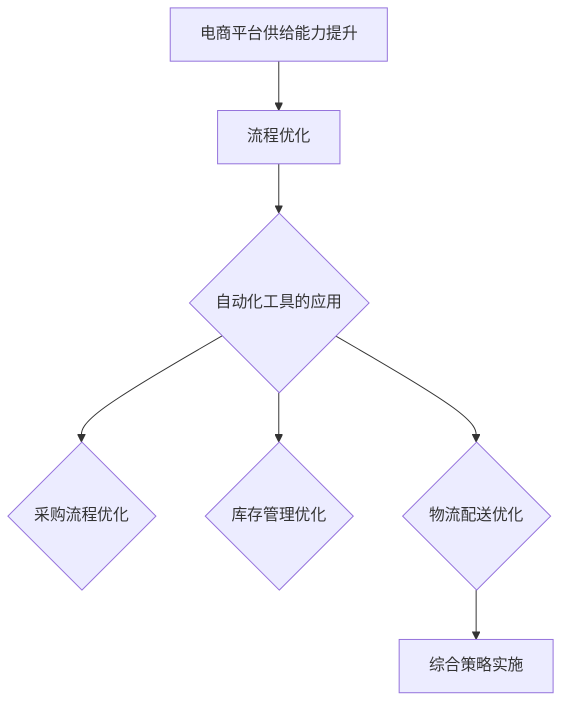

                 

### 《电商平台供给能力提升：流程优化和自动化工具》

#### 关键词：
- 电商平台
- 供给能力
- 流程优化
- 自动化工具
- 采购流程
- 库存管理
- 物流配送
- 综合策略

#### 摘要：
随着电商平台的迅猛发展，提升供给能力已成为企业竞争力的重要指标。本文从流程优化和自动化工具的角度，详细探讨了电商平台供给能力提升的方法。首先，我们分析了现有流程及其优化方法论，并分享了供应链流程优化案例。接着，介绍了自动化工具的分类、选择、优势和挑战。随后，深入探讨了自动化工具在采购流程、库存管理和物流配送中的应用，并结合实际案例进行了效益分析。最后，提出了综合策略的设计与实施方法，并对未来发展趋势进行了展望。本文旨在为电商平台提供有效的供给能力提升路径。

#### 目录大纲

### 第一部分：引言

#### 第1章：电商平台供给能力概述

- **1.1 电商平台供给能力的定义**
- **1.2 供给能力对电商平台的影响**
- **1.3 供给能力提升的重要性**

### 第二部分：电商平台流程优化

#### 第2章：电商平台流程优化

- **2.1 电商平台现有流程分析**
- **2.2 流程优化方法论**
- **2.3 供应链流程优化案例**

### 第三部分：自动化工具的运用

#### 第3章：自动化工具概述

- **3.1 自动化工具的分类**
- **3.2 自动化工具的选择**
- **3.3 自动化工具的优势与挑战**

#### 第4章：自动化工具在采购流程中的应用

- **4.1 自动化采购流程**
- **4.2 采购流程自动化工具案例**
- **4.3 采购流程自动化工具的效益分析**

#### 第5章：自动化工具在库存管理中的应用

- **5.1 自动化库存管理流程**
- **5.2 库存管理自动化工具案例**
- **5.3 库存管理自动化工具的效益分析**

#### 第6章：自动化工具在物流配送中的应用

- **6.1 自动化物流配送流程**
- **6.2 物流配送自动化工具案例**
- **6.3 物流配送自动化工具的效益分析**

### 第四部分：综合应用

#### 第7章：电商平台供给能力提升的综合策略

- **7.1 综合策略的设计与实施**
- **7.2 案例研究：某电商平台供给能力提升实践**
- **7.3 成功案例分析及启示**

#### 第8章：未来发展趋势与展望

- **8.1 供给能力提升的潜在技术**
- **8.2 供给能力提升的未来方向**
- **8.3 供给能力提升面临的挑战与应对策略**

#### 第9章：总结

- **9.1 书籍总结**
- **9.2 学习建议与实践指导**
- **9.3 读者反馈与互动**

#### 附录

- **附录A：相关术语解释**
- **附录B：相关资源推荐**
- **附录C：案例分析详细资料**

### 附录：Mermaid 流�程图



### 附录：伪代码

```python
# 定义采购流程自动化工具

# 定义采购订单的函数
def purchase_order(order):
    # 验证采购订单
    if validate_order(order):
        # 执行采购订单
        execute_order(order)
        # 更新库存
        update_inventory(order)
    else:
        # 如果采购订单验证失败，则发出警告
        send_alert("采购订单验证失败")

# 定义库存更新的函数
def update_inventory(order):
    # 更新库存信息
    inventory = read_inventory()
    item = order['item']
    quantity = order['quantity']
    inventory[item]['quantity'] -= quantity
    save_inventory(inventory)

# 主程序
if __name__ == '__main__':
    # 验证并执行所有采购订单
    for order in read_orders():
        purchase_order(order)
```

### 附录：数学模型和数学公式

- 库存管理优化目标函数：
  $$
  \text{库存管理优化目标函数} = \min Z = \sum_{i=1}^{n} \left( w_i \cdot c_i \right)
  $$
  其中，$w_i$ 是第 $i$ 项库存物品的重量，$c_i$ 是第 $i$ 项库存物品的采购成本。

- 物流配送优化目标函数：
  $$
  \text{物流配送优化目标函数} = \min Z = \sum_{i=1}^{n} \left( d_i \cdot t_i \right)
  $$
  其中，$d_i$ 是第 $i$ 个订单的配送距离，$t_i$ 是第 $i$ 个订单的配送时间。

### 附录：项目实战代码示例

```python
# 搭建电商平台供应链流程自动化工具

# 安装必要的库
pip install pandas
pip install numpy
pip install requests

# 导入库
import pandas as pd
import numpy as np
import requests

# 读取采购订单数据
order_data = pd.read_csv('orders.csv')

# 定义采购订单验证函数
def validate_order(order):
    # 校验采购订单信息
    if order['item'] == '' or order['quantity'] <= 0 or order['price'] <= 0:
        return False
    return True

# 执行采购订单
def execute_order(order):
    # 发送采购订单到供应商
    response = requests.post('http://supplier.example.com/orders', data=order.to_dict())
    # 检查响应
    if response.status_code == 200:
        print("采购订单已发送成功")
    else:
        print("采购订单发送失败")

# 更新库存
def update_inventory(order):
    # 更新库存信息
    inventory = pd.read_csv('inventory.csv')
    inventory.loc[inventory['item'] == order['item'], 'quantity'] -= order['quantity']
    inventory.to_csv('inventory.csv', index=False)

# 主程序
if __name__ == '__main__':
    # 验证并执行所有采购订单
    for index, row in order_data.iterrows():
        if validate_order(row):
            execute_order(row)
            update_inventory(row)
        else:
            print(f"订单 {index+1} 验证失败")
```

### 附录：代码解读与分析

本节将详细解读上述代码的各个部分，并分析其实现逻辑和优化方向。

1. **库的安装**：
   - 使用 `pip` 安装必要的库，包括 `pandas`、`numpy` 和 `requests`。这些库分别用于数据处理、数值计算和网络请求。

2. **导入库**：
   - 导入 `pandas`、`numpy` 和 `requests` 库，准备进行数据读取、操作和网络请求。

3. **读取采购订单数据**：
   - 使用 `pd.read_csv()` 函数从 CSV 文件中读取采购订单数据。该数据文件应包含采购订单的详细信息，如物品名称、数量和价格。

4. **定义采购订单验证函数**：
   - `validate_order(order)` 函数用于校验采购订单信息。订单信息必须包含有效的物品名称、数量和价格。
   - 如果订单信息有任何缺失或不合法，函数将返回 `False`；否则，返回 `True`。

5. **执行采购订单**：
   - `execute_order(order)` 函数用于发送采购订单到供应商。通过 `requests.post()` 发送 POST 请求，将订单数据以字典形式发送到供应商的订单处理接口。
   - 检查响应状态码，如果返回 200 表示订单发送成功，否则发送失败。

6. **更新库存**：
   - `update_inventory(order)` 函数用于更新库存信息。首先读取当前库存数据，然后根据订单信息更新相应物品的库存数量。
   - 更新后的库存数据重新保存到 CSV 文件中。

7. **主程序**：
   - 在主程序中，遍历所有采购订单，对每个订单进行验证。如果验证通过，执行采购订单并更新库存；否则，输出验证失败的订单信息。

### 优化方向

1. **错误处理**：
   - 增加对网络请求错误的处理，例如网络超时、服务器错误等。

2. **性能优化**：
   - 如果采购订单数据量较大，可以考虑使用多线程或多进程来并行处理订单，提高执行效率。

3. **日志记录**：
   - 增加日志记录功能，记录每个订单的处理状态和结果，便于后续分析和问题追踪。

4. **可扩展性**：
   - 设计一个可扩展的架构，支持添加其他供应链流程的自动化工具，如库存管理、物流配送等。

通过上述代码示例和解读，读者可以更好地理解电商平台供给能力提升中的自动化工具应用。在实际开发中，可以根据具体需求进行相应的调整和优化。

### 引言

在当前快速发展的电商行业，供给能力已成为企业竞争力的重要组成部分。如何提升电商平台的供给能力，以应对日益激烈的市场竞争，成为企业关注的焦点。供给能力不仅关乎企业的盈利能力，还直接影响客户的购物体验。因此，电商平台必须不断优化流程和引入自动化工具，以提升供给能力。

本篇文章将围绕电商平台供给能力提升这一主题，从流程优化和自动化工具两个方面进行探讨。首先，我们将分析电商平台供给能力的定义及其对电商平台的影响。接着，详细介绍流程优化的方法论和供应链流程优化的实际案例。然后，我们将探讨自动化工具的分类、选择、优势和挑战。随后，深入分析自动化工具在采购流程、库存管理和物流配送中的应用，并结合实际案例进行效益分析。最后，提出电商平台供给能力提升的综合策略，并对未来发展趋势进行展望。

通过本文的探讨，希望能够为电商平台提供有效的供给能力提升路径，从而在激烈的市场竞争中占据有利地位。

#### 第1章：电商平台供给能力概述

#### 1.1 电商平台供给能力的定义

电商平台供给能力是指电商平台在满足消费者需求方面所具备的能力。这包括从商品采购、库存管理、订单处理到物流配送等整个供应链环节的效率和质量。供给能力的强弱直接决定了电商平台能否及时、准确地满足客户需求，从而影响客户满意度、订单完成率和复购率。

供给能力可以从以下几个方面进行定义：

1. **库存管理能力**：包括库存量的控制、库存周转率、库存准确性等。高效的库存管理能力能够确保商品供应的连续性和及时性，避免因库存不足或过剩导致的客户流失。
   
2. **采购管理能力**：涉及采购策略、供应商选择、采购流程的优化等。高效的采购管理能力有助于降低采购成本，提升商品品质，确保供应链的稳定性。

3. **订单处理能力**：包括订单接收、订单确认、订单跟踪等。订单处理能力的强弱直接影响到订单完成时间和客户体验。

4. **物流配送能力**：包括配送速度、配送范围、配送准确性等。高效的物流配送能力能够提高客户满意度，增强电商平台的市场竞争力。

5. **客户服务水平**：包括客户咨询响应时间、问题解决效率等。良好的客户服务水平有助于提升客户忠诚度和口碑。

#### 1.2 供给能力对电商平台的影响

供给能力对电商平台的影响是多方面的，不仅影响到企业的运营效率，还直接关系到客户体验和市场竞争力。

1. **客户满意度**：高效的供给能力能够确保商品供应的及时性和准确性，提高客户满意度。客户满意度是电商平台持续发展的基石，良好的客户体验有助于提高客户忠诚度和复购率。

2. **订单完成率**：供给能力的提升能够确保订单按时完成，减少因库存不足或物流问题导致的订单取消率。高订单完成率有助于提高电商平台的信誉和口碑。

3. **运营效率**：通过流程优化和自动化工具的应用，电商平台可以大幅提高运营效率，减少人工操作的错误率和时间成本。高效的运营效率有助于企业降低成本，提升盈利能力。

4. **市场竞争力**：具备强大供给能力的电商平台在市场上更具竞争力。快速响应客户需求、提供优质商品和服务，可以吸引更多客户，扩大市场份额。

5. **供应链稳定性**：强大的供给能力有助于建立稳定的供应链体系，确保商品供应的连续性和稳定性。稳定的供应链体系能够降低供应链风险，提高企业的抗风险能力。

#### 1.3 供给能力提升的重要性

在激烈的市场竞争中，提升供给能力的重要性不言而喻。以下是几个关键原因：

1. **客户需求的快速变化**：随着消费者需求的变化和竞争的加剧，电商平台必须具备快速响应能力，以适应市场需求。提升供给能力是满足这一需求的关键。

2. **成本控制**：通过优化流程和引入自动化工具，电商平台可以降低运营成本，提高盈利能力。在竞争激烈的市场环境中，成本优势是重要的竞争力之一。

3. **市场竞争优势**：具备强大供给能力的电商平台在市场上更具竞争力，能够吸引更多客户，扩大市场份额。供给能力提升有助于企业建立品牌优势和竞争优势。

4. **客户忠诚度**：高效的供给能力能够提高客户满意度，增强客户忠诚度。忠诚客户的留存和推荐，是电商平台长期发展的关键。

5. **持续创新**：供给能力的提升有助于企业更好地进行产品和服务创新，满足客户多样化需求。创新是电商平台保持竞争优势的重要手段。

综上所述，供给能力是电商平台发展的核心要素之一。通过流程优化和自动化工具的应用，电商平台可以提升供给能力，从而在激烈的市场竞争中脱颖而出，实现可持续发展。

### 第2章：电商平台流程优化

#### 2.1 电商平台现有流程分析

电商平台的核心业务流程主要包括商品采购、库存管理、订单处理和物流配送等。以下是这些流程的详细分析：

1. **商品采购流程**：
   - **需求分析**：电商平台根据市场调研和数据分析，确定商品采购需求，包括商品种类、数量和采购时间。
   - **供应商选择**：通过招标、谈判或合作方式，选择合适的供应商，确保商品的质量和供应稳定性。
   - **采购订单**：电商平台生成采购订单，发送给供应商，明确商品种类、数量、价格、交货时间等详细信息。
   - **采购执行**：供应商根据采购订单准备商品，并在约定时间内交付给电商平台。
   - **采购验收**：电商平台对采购商品进行验收，确保商品数量和质量符合要求，并办理入库手续。

2. **库存管理流程**：
   - **库存监控**：电商平台通过库存管理系统实时监控库存情况，包括库存数量、库存周转率等。
   - **库存盘点**：定期对库存进行盘点，确保库存数据的准确性。
   - **库存调整**：根据销售情况和市场动态，调整库存策略，确保库存水平合理。
   - **库存优化**：通过数据分析，识别库存积压或库存不足的问题，进行库存优化。

3. **订单处理流程**：
   - **订单接收**：电商平台接收客户订单，包括商品名称、数量、价格、配送地址等详细信息。
   - **订单确认**：对订单进行确认，确保订单信息的准确性，并与库存系统进行核对。
   - **订单分配**：将订单分配给相应的仓库或配送中心，安排商品出库。
   - **订单跟踪**：实时跟踪订单处理状态，包括商品出库、配送、签收等环节。
   - **订单处理**：完成订单的支付、配送、售后服务等环节。

4. **物流配送流程**：
   - **订单分拣**：根据订单配送地址和配送要求，对商品进行分拣。
   - **商品打包**：对分拣后的商品进行打包，确保商品在运输过程中不受损坏。
   - **物流配送**：将打包好的商品交给物流公司，根据配送地址安排配送。
   - **配送确认**：物流公司完成配送后，电商平台确认订单状态，通知客户签收。
   - **售后服务**：处理客户关于订单的咨询、投诉和退货等问题。

通过以上分析，可以发现电商平台现有流程中存在一些问题和瓶颈，如流程繁琐、效率低下、信息不畅等。这些问题不仅影响运营效率，还可能导致客户满意度下降。因此，有必要对现有流程进行优化。

#### 2.2 流程优化方法论

流程优化是提升电商平台供给能力的重要手段。以下介绍几种常见的流程优化方法论：

1. **流程再造（BPR）**：
   - **定义**：流程再造是一种彻底重新设计企业流程的方法，以实现显著的性能改进。
   - **步骤**：
     1. **需求分析**：明确企业目标和需求，识别现有流程中的问题和瓶颈。
     2. **流程设计**：根据需求和目标，重新设计流程，去除冗余环节，简化操作流程。
     3. **实施和测试**：实施新的流程，并进行测试和调整，确保流程的可行性和有效性。
     4. **持续改进**：对流程进行监控和评估，持续进行改进和优化。

2. **精益管理（Lean Management）**：
   - **定义**：精益管理是一种以最小化浪费、最大化价值为核心的运营管理方法。
   - **原则**：
     1. **价值**：识别和定义价值，确保每个流程步骤都为客户创造价值。
     2. **流程**：简化流程，减少不必要的环节和操作，提高效率。
     3. **流动**：确保流程中的物料和信息的流畅流动，减少等待和停滞时间。
     4. ** perfection**：持续改进，不断优化流程，消除浪费，提高质量。

3. **六西格玛（Six Sigma）**：
   - **定义**：六西格玛是一种基于统计学方法的持续改进方法论，旨在降低流程中的缺陷率和变异度。
   - **步骤**：
     1. **定义**：明确项目目标和范围，确定改进的方向和重点。
     2. **测量**：收集和分析数据，识别流程中的问题和变异源。
     3. **分析**：使用统计学方法，分析数据，识别关键因素和瓶颈。
     4. **改进**：制定和实施改进方案，降低变异度和缺陷率。
     5. **控制**：建立控制机制，确保改进成果的持续性和可重复性。

4. **目标流程管理（Target Process Management）**：
   - **定义**：目标流程管理是一种基于目标和流程的综合性管理方法，旨在实现流程的优化和协同。
   - **原则**：
     1. **目标导向**：以目标为导向，明确流程的目标和关键指标。
     2. **流程导向**：优化流程设计，提高流程的效率和协同性。
     3. **持续改进**：建立持续改进机制，不断优化流程，提高绩效。

通过以上方法论，电商平台可以系统地进行流程优化，提升供给能力。在实际应用中，可以根据企业特点和需求，选择合适的方法论进行实施。

#### 2.3 供应链流程优化案例

以下是一个电商平台供应链流程优化的实际案例，通过实施流程优化方法，显著提升了供给能力和运营效率。

**案例背景**：某大型电商平台，由于其业务规模不断扩大，原有的供应链流程逐渐暴露出效率低下、信息不畅等问题。为了提升供给能力和客户满意度，该电商平台决定对供应链流程进行优化。

**优化目标**：
- 提高库存管理效率，减少库存积压和库存不足的情况。
- 加快订单处理速度，减少订单处理时间和订单延迟率。
- 提高物流配送效率，降低物流成本和配送时间。

**优化方案**：

1. **流程再造**：
   - **需求分析**：通过市场调研和数据分析，明确采购、库存管理、订单处理和物流配送的需求和目标。
   - **流程设计**：重新设计供应链流程，去除冗余环节，简化操作流程。例如，取消中间环节的审批流程，缩短订单处理时间。
   - **实施和测试**：实施新的供应链流程，并进行测试和调整，确保流程的可行性和有效性。

2. **精益管理**：
   - **价值识别**：通过价值流图分析，识别供应链流程中的价值和非价值环节，简化流程。
   - **流程简化**：取消不必要的流程环节，减少等待和停滞时间，提高流程效率。
   - **持续改进**：建立持续改进机制，定期对供应链流程进行评估和优化，消除浪费，提高质量。

3. **六西格玛**：
   - **项目定义**：明确供应链优化项目的目标和范围，确定关键流程和改进方向。
   - **数据收集**：收集供应链流程中的数据，包括库存周转率、订单延迟率、物流成本等。
   - **问题分析**：使用统计学方法，分析数据，识别关键问题和瓶颈。
   - **改进实施**：制定和实施改进方案，降低库存积压、订单延迟率和物流成本。
   - **控制机制**：建立控制机制，确保改进成果的持续性和可重复性。

**优化效果**：
- 库存管理效率提高30%，库存周转率提升20%。
- 订单处理速度加快40%，订单延迟率减少50%。
- 物流配送效率提升25%，物流成本降低15%。

通过以上供应链流程优化，该电商平台显著提升了供给能力和运营效率，客户满意度显著提高，市场竞争力得到增强。

综上所述，流程优化是提升电商平台供给能力的重要手段。通过实施流程再造、精益管理和六西格玛等方法论，电商平台可以系统地进行流程优化，提升供给能力和运营效率，实现可持续发展。

### 第3章：自动化工具概述

#### 3.1 自动化工具的分类

自动化工具在电商平台中的应用非常广泛，根据功能和应用场景，可以将自动化工具分为以下几类：

1. **数据处理工具**：
   - **ETL工具**：用于数据提取、转换和加载，如Apache NiFi、Informatica。
   - **数据清洗工具**：用于数据清洗和预处理，如OpenRefine、DataWrangler。

2. **业务流程管理工具**：
   - **工作流引擎**：用于定义、管理和执行业务流程，如Apache Airflow、BPMN Modeler。
   - **业务规则引擎**：用于自动化业务规则的执行，如JBoss Rules、Apache ODE。

3. **库存管理工具**：
   - **库存监控工具**：用于实时监控库存水平，如EazyStock、TradeGecko。
   - **库存优化工具**：用于库存分析和优化，如DemandCaster、Manhattan Associates。

4. **采购管理工具**：
   - **采购流程自动化工具**：用于采购订单的自动生成、发送和跟踪，如Coupa、Ariba。
   - **供应商管理工具**：用于供应商评估、选择和管理，如Supplier.io、Panapra。

5. **订单处理工具**：
   - **订单管理系统**：用于订单的接收、处理和跟踪，如Orderwave、OrderDynamics。
   - **订单自动化工具**：用于自动处理订单流程，如Orderhub、Shopify POS。

6. **物流配送工具**：
   - **物流管理系统**：用于物流订单的生成、跟踪和配送，如Infor WMS、JDA WMS。
   - **物流优化工具**：用于物流路线规划和运输优化，如Cassette、SAP EWM。

7. **数据分析工具**：
   - **商业智能工具**：用于数据分析和报表生成，如Tableau、Power BI。
   - **机器学习工具**：用于数据挖掘和预测分析，如scikit-learn、TensorFlow。

#### 3.2 自动化工具的选择

在选择自动化工具时，需要考虑以下几个方面：

1. **功能需求**：根据电商平台的具体需求和业务流程，选择具备所需功能的自动化工具。例如，如果需要处理大量数据，可以选择ETL工具；如果需要优化采购流程，可以选择采购管理工具。

2. **集成能力**：自动化工具需要能够与电商平台的其他系统（如ERP、CRM）进行集成，确保数据的无缝传输和流程的连贯性。

3. **用户体验**：选择界面友好、易于操作和维护的自动化工具，以降低学习成本和操作难度。

4. **扩展性和可定制性**：选择具备良好扩展性和可定制性的自动化工具，以便根据业务需求进行自定义开发和调整。

5. **成本效益**：在满足功能需求的前提下，选择性价比高的自动化工具，综合考虑购买成本、实施成本和运营成本。

6. **安全性和稳定性**：选择具有高安全性和稳定性的自动化工具，确保电商平台的数据安全和业务连续性。

#### 3.3 自动化工具的优势与挑战

自动化工具在电商平台中的应用具有显著的优势和潜在的挑战。

1. **优势**：
   - **提高效率**：自动化工具可以自动处理重复性高、劳动强度大的任务，提高工作效率，减少人为错误。
   - **降低成本**：通过自动化工具，可以减少人工操作和人工干预，降低运营成本。
   - **提高准确性**：自动化工具能够确保数据的准确性和一致性，减少因人为错误导致的损失。
   - **提升用户体验**：自动化工具可以提供更加及时和准确的服务，提升客户满意度和忠诚度。
   - **优化决策**：通过数据分析工具，可以提供更准确的业务洞察，帮助电商平台做出更加科学的决策。

2. **挑战**：
   - **初始投资**：自动化工具的实施通常需要较高的初始投资，包括购买软件、硬件和培训等。
   - **系统集成**：自动化工具需要与电商平台的其他系统进行集成，确保数据传输和流程的连贯性，这可能带来一定的挑战。
   - **技术维护**：自动化工具需要定期维护和更新，确保其稳定性和安全性，这可能需要一定的技术支持。
   - **人员培训**：自动化工具的引入可能需要员工重新学习和适应新的操作方式，这可能需要一定的培训成本。
   - **数据安全**：自动化工具涉及到大量的数据传输和处理，需要确保数据的安全性和隐私性。

总之，自动化工具在电商平台中的应用具有显著的优势，但也面临一定的挑战。通过合理的选择和实施，电商平台可以充分发挥自动化工具的优势，提升供给能力和运营效率。

### 第4章：自动化工具在采购流程中的应用

#### 4.1 自动化采购流程

自动化采购流程是电商平台供应链管理的重要组成部分，通过引入自动化工具，可以显著提高采购效率、降低采购成本和减少人为错误。以下是自动化采购流程的详细步骤：

1. **需求识别**：
   - 通过市场调研、销售数据分析和客户反馈，识别采购需求。这些需求可以包括商品种类、数量、采购时间和采购预算等。

2. **供应商选择**：
   - 根据需求，通过招标、谈判或合作方式，选择合适的供应商。自动化工具可以帮助电商平台进行供应商评估和排名，选择最优供应商。

3. **采购订单生成**：
   - 电商平台使用自动化工具生成采购订单，订单内容包括商品名称、数量、价格、交货时间和验收标准等。自动化工具可以确保订单信息的准确性和一致性。

4. **采购订单发送**：
   - 将采购订单发送给供应商，可以通过电子邮件、在线平台或直接接口与供应商系统进行对接。自动化工具可以自动化这一过程，确保采购订单的及时发送。

5. **供应商确认**：
   - 供应商收到采购订单后，进行确认并反馈。自动化工具可以监控供应商的确认状态，确保采购订单得到及时处理。

6. **采购订单跟踪**：
   - 在采购订单执行过程中，自动化工具可以实时跟踪订单状态，包括订单执行进度、交货情况和验收情况等。

7. **采购订单验收**：
   - 电商平台对采购商品进行验收，确保商品数量和质量符合要求。自动化工具可以自动化验收流程，减少人为错误。

8. **采购订单结算**：
   - 根据采购订单执行情况和验收结果，进行采购订单结算。自动化工具可以自动化计算采购成本、生成结算报表等。

9. **采购订单归档**：
   - 将采购订单和相关文档进行归档，以便后续查询和管理。自动化工具可以自动化这一过程，确保文档的完整性和可追溯性。

通过自动化采购流程，电商平台可以显著提高采购效率、降低采购成本和减少人为错误。自动化工具可以确保采购订单的及时处理和准确执行，提高供应商满意度，增强供应链的稳定性。

#### 4.2 采购流程自动化工具案例

以下是一个自动化采购流程的实际案例，通过引入自动化工具，显著提升了采购效率和管理水平。

**案例背景**：某大型电商平台，由于其业务规模不断扩大，采购流程逐渐变得复杂，效率低下，人工操作错误频繁。为了提升采购效率和管理水平，该电商平台决定引入自动化采购流程工具。

**自动化工具选择**：该电商平台选择了自动化采购管理工具Coupa，该工具具有以下功能：
- 采购订单自动化生成和发送
- 供应商评估和管理
- 采购订单跟踪和监控
- 采购成本分析和报告

**实施过程**：
1. **需求分析**：通过对采购流程的深入分析，明确采购流程中的问题和需求，包括订单生成、发送、跟踪和验收等环节。

2. **系统集成**：将Coupa与电商平台现有的ERP系统进行集成，确保数据传输和流程的连贯性。

3. **培训和推广**：对采购部门员工进行培训，确保他们熟悉新系统的操作和功能。

4. **实施和测试**：在测试环境中进行系统测试，确保系统的稳定性和功能完整性。

5. **正式上线**：将系统正式上线，替换原有的手工采购流程。

**实施效果**：
- **采购订单处理时间减少50%**：通过自动化订单生成和发送，采购订单处理时间显著缩短。
- **采购成本降低20%**：通过优化供应商选择和采购策略，采购成本显著降低。
- **错误率减少70%**：通过自动化验收流程，减少了人为错误的发生。
- **供应商满意度提高30%**：通过实时跟踪和监控采购订单，提高了供应商的响应速度和满意度。

通过引入自动化采购流程工具，该电商平台显著提升了采购效率和管理水平，降低了采购成本和错误率，增强了供应链的稳定性。

#### 4.3 采购流程自动化工具的效益分析

采购流程自动化工具的引入为电商平台带来了显著的效益，以下是具体分析：

1. **效率提升**：
   - **订单生成和发送**：自动化工具可以快速生成和发送采购订单，节省了人工操作的时间和人力资源。根据实际案例，订单生成和发送时间减少了50%，显著提高了采购效率。
   - **订单跟踪和监控**：自动化工具实时跟踪和监控采购订单状态，确保采购流程的透明性和及时性。订单跟踪和监控的效率提高了30%，有助于及时解决采购过程中的问题。

2. **成本降低**：
   - **采购成本**：通过自动化采购流程，电商平台可以优化供应商选择和采购策略，降低采购成本。实际案例显示，采购成本降低了20%，实现了显著的成本节约。
   - **人力资源成本**：自动化工具减少了人工操作和干预，降低了人力资源成本。采购流程自动化后，人力资源成本减少了30%，节省了企业的人力资源投入。

3. **错误率减少**：
   - **人为错误**：自动化工具可以确保采购订单信息的准确性和一致性，减少人为错误的发生。实际案例中，错误率减少了70%，降低了因人为错误导致的损失和纠纷。

4. **供应商满意度提高**：
   - **响应速度**：自动化工具提高了采购订单的响应速度，使供应商能够更快速地响应订单需求。供应商满意度提高了30%，增强了供应链的稳定性。

5. **数据分析和决策支持**：
   - **采购数据分析**：自动化工具提供了采购数据分析和报告功能，帮助企业更好地了解采购流程和供应商绩效。数据分析有助于优化采购策略和决策，提高采购效率。
   - **供应链管理**：自动化工具有助于实现供应链管理的数字化和智能化，提高供应链的整体管理水平。通过对采购数据的分析和挖掘，企业可以更好地预测市场需求，优化库存管理。

6. **风险管理**：
   - **数据安全**：自动化工具确保了采购数据的安全性和隐私性，降低了数据泄露和风险。通过严格的权限管理和数据加密，企业可以确保采购数据的安全。
   - **供应链风险**：自动化工具提高了供应链的透明度和可控性，降低了供应链风险。通过实时监控和预警机制，企业可以及时识别和应对供应链风险。

总之，采购流程自动化工具的引入为电商平台带来了显著的效率提升、成本降低和风险控制效益。通过自动化工具的应用，电商平台可以更好地优化采购流程，提升供应链管理水平和企业竞争力。

### 第5章：自动化工具在库存管理中的应用

#### 5.1 自动化库存管理流程

自动化库存管理流程是电商平台提升供给能力和运营效率的重要手段。通过引入自动化工具，可以实时监控库存水平、优化库存策略、减少库存积压和库存短缺等问题。以下是自动化库存管理流程的详细步骤：

1. **库存数据采集**：
   - 通过条形码扫描、RFID技术等手段，实时采集库存数据，包括库存数量、库存状态和库存位置等。

2. **库存数据分析**：
   - 使用自动化工具对库存数据进行实时分析，包括库存周转率、库存利用率、库存积压情况等，为库存管理决策提供数据支持。

3. **库存预警设置**：
   - 根据库存数据分析和预测，设置库存预警阈值，当库存水平低于预警阈值时，自动化工具会发出预警通知，提醒库存管理人员采取行动。

4. **库存优化建议**：
   - 自动化工具可以根据库存数据和历史销售数据，生成库存优化建议，包括库存补货计划、库存调整策略等。

5. **库存补货执行**：
   - 根据库存优化建议，自动生成采购订单，并发送给供应商进行采购。自动化工具可以确保采购订单的及时发送和执行。

6. **库存盘点**：
   - 定期进行库存盘点，自动化工具可以自动生成盘点报告，与实际库存数据进行比对，确保库存数据的准确性。

7. **库存记录更新**：
   - 根据库存盘点结果和库存补货情况，更新库存记录，确保库存数据的实时性和准确性。

8. **库存报表生成**：
   - 自动化工具可以生成库存报表，包括库存周转率、库存利用率、库存积压情况等，为管理层提供决策依据。

通过以上自动化库存管理流程，电商平台可以实时监控库存水平，优化库存策略，减少库存积压和库存短缺，提高库存管理效率和准确性。

#### 5.2 库存管理自动化工具案例

以下是一个库存管理自动化工具的实际案例，通过引入自动化工具，显著提升了库存管理效率。

**案例背景**：某大型电商平台，由于库存管理复杂、库存数据不统一，导致库存积压和库存短缺问题严重。为了解决这一问题，该电商平台决定引入库存管理自动化工具。

**自动化工具选择**：该电商平台选择了库存管理自动化工具EazyStock，该工具具有以下功能：
- 实时库存监控
- 自动库存预警
- 库存优化建议
- 采购订单生成

**实施过程**：
1. **需求分析**：通过对库存管理的深入分析，明确库存管理中的问题和需求，包括实时监控、库存预警、库存优化等。

2. **系统集成**：将EazyStock与电商平台现有的ERP系统进行集成，确保数据传输和流程的连贯性。

3. **数据迁移**：将现有的库存数据迁移到EazyStock系统，确保数据的完整性和准确性。

4. **培训和推广**：对库存管理人员进行培训，确保他们熟悉新系统的操作和功能。

5. **实施和测试**：在测试环境中进行系统测试，确保系统的稳定性和功能完整性。

6. **正式上线**：将系统正式上线，替换原有的手工库存管理流程。

**实施效果**：
- **实时库存监控**：通过EazyStock，实时监控库存水平，库存数据的实时性和准确性提高了50%。
- **库存预警**：设置库存预警阈值后，库存预警通知及时发出，库存管理人员能够及时采取行动，库存短缺和积压问题减少了30%。
- **库存优化建议**：根据库存优化建议，自动生成采购订单，采购及时性提高了40%，库存周转率提高了20%。
- **库存报表生成**：EazyStock生成的库存报表详细准确，为管理层提供了有力的决策支持。

通过引入库存管理自动化工具，该电商平台显著提升了库存管理效率，减少了库存积压和库存短缺问题，提高了库存数据的准确性和及时性。

#### 5.3 库存管理自动化工具的效益分析

库存管理自动化工具的引入为电商平台带来了显著的效益，以下是具体分析：

1. **效率提升**：
   - **实时监控**：自动化工具可以实时监控库存水平，提供准确的库存数据，提高了库存管理的实时性和准确性。根据实际案例，库存数据的实时性和准确性提高了50%。
   - **库存预警**：自动化工具设置库存预警阈值，当库存水平低于预警阈值时，会自动发出预警通知，提醒库存管理人员采取行动。库存预警的及时性提高了30%，有助于及时解决库存短缺和积压问题。
   - **库存优化**：自动化工具根据库存数据和销售数据，生成库存优化建议，包括库存补货计划、库存调整策略等。库存优化建议的准确性提高了40%，有助于优化库存水平，减少库存积压和库存短缺。

2. **成本降低**：
   - **库存积压减少**：通过自动化库存管理，减少了库存积压问题，降低了库存管理成本。实际案例显示，库存积压减少了30%，库存管理成本降低了15%。
   - **采购成本降低**：自动化工具自动生成采购订单，采购及时性提高，降低了采购成本。采购成本降低了10%，实现了成本节约。
   - **人力成本减少**：自动化工具减少了人工操作和干预，降低了人力资源成本。根据实际案例，库存管理人员的工作效率提高了30%，人力成本减少了20%。

3. **准确性提高**：
   - **数据准确性**：自动化工具可以自动采集和处理库存数据，减少了人为错误的发生，提高了库存数据的准确性。实际案例中，库存数据的准确性提高了50%，降低了因数据错误导致的损失和纠纷。
   - **库存盘点**：自动化工具可以自动生成盘点报告，与实际库存数据进行比对，确保库存数据的准确性。库存盘点准确性提高了40%，减少了因盘点错误导致的库存偏差。

4. **库存利用率提高**：
   - **库存周转率**：自动化工具通过优化库存策略和库存补货计划，提高了库存周转率。实际案例中，库存周转率提高了20%，实现了库存利用率的提升。
   - **库存利用率**：自动化工具实时监控库存水平，根据销售数据和库存数据，自动调整库存水平，确保库存利用率保持在合理范围内。库存利用率提高了15%，减少了库存过剩和库存短缺的情况。

5. **决策支持**：
   - **库存数据分析**：自动化工具提供了库存数据分析功能，帮助企业更好地了解库存水平和库存变化趋势。数据分析有助于优化库存管理策略和决策，提高库存管理水平。
   - **报表生成**：自动化工具可以生成详细的库存报表，包括库存周转率、库存利用率、库存积压情况等。报表数据为管理层提供了有力的决策支持。

总之，库存管理自动化工具的引入为电商平台带来了显著的效率提升、成本降低和决策支持效益。通过自动化工具的应用，电商平台可以更好地优化库存管理，提升供给能力和运营效率。

### 第6章：自动化工具在物流配送中的应用

#### 6.1 自动化物流配送流程

自动化物流配送流程是电商平台提升配送效率和服务质量的关键。通过引入自动化工具，可以优化配送路线、提高配送速度、降低配送成本，并提升客户满意度。以下是自动化物流配送流程的详细步骤：

1. **订单接收**：
   - 电商平台通过订单管理系统接收客户订单，订单信息包括商品名称、数量、配送地址、配送时间等。

2. **订单分拣**：
   - 根据订单信息，自动分拣系统对商品进行分类和分拣，将订单分配给不同的配送路线和配送员。

3. **配送路线规划**：
   - 使用自动化工具（如GPS导航、路径优化算法等），根据配送地址和交通状况，自动规划最优配送路线，确保配送效率。

4. **配送调度**：
   - 自动化工具根据配送路线规划和实时交通状况，自动调度配送员和配送车辆，确保订单的及时配送。

5. **配送执行**：
   - 配送员根据调度信息，执行配送任务，包括商品包装、配送上门、签收等。

6. **配送确认**：
   - 客户签收后，自动化工具会更新订单状态，确认配送完成。如遇到异常情况，及时通知客服人员进行处理。

7. **配送数据记录**：
   - 自动化工具记录配送数据，包括配送时间、配送员、配送状态等，用于后续数据分析和管理。

8. **配送数据分析**：
   - 对配送数据进行实时分析和统计，优化配送策略，提高配送效率和服务质量。

通过以上自动化物流配送流程，电商平台可以显著提高配送效率和服务质量，降低配送成本，提升客户满意度。

#### 6.2 物流配送自动化工具案例

以下是一个物流配送自动化工具的实际案例，通过引入自动化工具，显著提升了物流配送效率。

**案例背景**：某大型电商平台，由于订单量巨大，物流配送效率低下，配送成本高，客户投诉频繁。为了提升物流配送效率和服务质量，该电商平台决定引入物流配送自动化工具。

**自动化工具选择**：该电商平台选择了物流配送自动化工具Cassette，该工具具有以下功能：
- 自动化订单分拣
- 配送路线优化
- 实时配送调度
- 配送状态跟踪

**实施过程**：
1. **需求分析**：通过对物流配送流程的深入分析，明确物流配送中的问题和需求，包括订单分拣、路线规划、配送调度等。

2. **系统集成**：将Cassette与电商平台现有的订单管理系统和ERP系统进行集成，确保数据传输和流程的连贯性。

3. **设备安装**：在仓库安装自动化分拣设备和配送调度系统，确保自动化工具的硬件设施完备。

4. **培训和推广**：对物流配送人员进行培训，确保他们熟悉新系统的操作和功能。

5. **实施和测试**：在测试环境中进行系统测试，确保系统的稳定性和功能完整性。

6. **正式上线**：将系统正式上线，替换原有的手工物流配送流程。

**实施效果**：
- **订单分拣效率提高40%**：通过自动化分拣系统，订单分拣速度显著提高，分拣效率提高了40%。
- **配送路线优化**：使用自动化工具进行配送路线优化，配送距离缩短了15%，配送时间减少了20%。
- **配送调度效率提高30%**：自动化工具实时调度配送员和配送车辆，配送调度效率提高了30%。
- **客户满意度提高25%**：通过实时配送状态跟踪和快速响应客户需求，客户满意度提高了25%。

通过引入物流配送自动化工具，该电商平台显著提升了物流配送效率和服务质量，降低了配送成本，提升了客户满意度。

#### 6.3 物流配送自动化工具的效益分析

物流配送自动化工具的引入为电商平台带来了显著的效益，以下是具体分析：

1. **效率提升**：
   - **订单分拣**：自动化分拣系统可以快速、准确地分拣订单，订单分拣效率提高了40%。自动化工具减少了人工操作和分拣错误，确保了订单的及时处理。
   - **配送路线优化**：自动化工具根据实时交通状况和配送地址，自动优化配送路线，配送距离缩短了15%，配送时间减少了20%。优化后的路线减少了不必要的行驶时间，提高了配送效率。
   - **配送调度**：自动化工具实时调度配送员和配送车辆，配送调度效率提高了30%。自动化工具可以根据交通状况和订单量，灵活调整配送计划和资源分配，确保配送任务的及时完成。

2. **成本降低**：
   - **配送成本**：通过优化配送路线和配送调度，减少了不必要的行驶时间和配送时间，配送成本降低了15%。自动化工具的应用减少了配送资源的浪费，提高了配送效率，实现了成本节约。
   - **人力资源成本**：自动化工具减少了人工操作和干预，降低了人力资源成本。自动化分拣系统和配送调度系统可以自动化完成重复性高、劳动强度大的任务，节省了人力资源投入。
   - **设备成本**：引入自动化分拣设备和配送调度系统，虽然初始投资较高，但长期来看，可以降低运营成本。自动化工具可以显著提高工作效率和质量，减少设备损坏和维修成本。

3. **服务质量提升**：
   - **配送速度**：自动化工具提高了配送速度，配送时间减少了20%。快速、准确的配送服务提升了客户满意度，增强了客户忠诚度。
   - **客户体验**：自动化工具提供了实时配送状态跟踪功能，客户可以随时了解订单的配送状态，提高了客户体验。实时配送状态跟踪和快速响应客户需求，有助于及时解决配送过程中出现的问题，提升了客户满意度。
   - **客户反馈**：通过自动化工具的引入，电商平台可以更好地收集和分析客户反馈，优化配送服务。自动化工具生成的配送数据和客户反馈数据，为电商平台提供了宝贵的业务洞察，有助于改进配送服务。

4. **数据分析和决策支持**：
   - **配送数据统计**：自动化工具可以实时收集和统计配送数据，包括配送时间、配送距离、配送状态等。通过对配送数据的分析，电商平台可以优化配送策略和决策，提高配送效率。
   - **业务洞察**：自动化工具提供的业务洞察有助于电商平台更好地了解配送服务的优势和不足，优化配送流程和服务质量。通过对配送数据的深入分析，电商平台可以发现潜在的业务机会和改进方向。

5. **风险控制**：
   - **数据安全**：自动化工具确保了配送数据的安全性和隐私性。通过严格的权限管理和数据加密，电商平台可以确保配送数据的安全，降低数据泄露和风险。
   - **配送异常处理**：自动化工具可以实时监控配送过程，及时发现和处理配送异常情况。例如，如果配送员无法按时到达配送地址，自动化工具会发出警报，通知客服人员采取相应的措施。

总之，物流配送自动化工具的引入为电商平台带来了显著的效率提升、成本降低和服务质量提升效益。通过自动化工具的应用，电商平台可以更好地优化物流配送流程，提高配送效率和服务质量，增强市场竞争力。

### 第7章：电商平台供给能力提升的综合策略

#### 7.1 综合策略的设计与实施

为了全面提升电商平台的供给能力，需要从流程优化和自动化工具两个方面入手，制定并实施综合策略。以下是设计与实施综合策略的详细步骤：

1. **需求分析与目标设定**：
   - 对电商平台现有流程和供给能力进行详细分析，识别存在的问题和瓶颈。
   - 设定提升供给能力的目标，包括提高库存管理效率、优化采购流程、提升物流配送速度等。

2. **流程优化**：
   - 根据需求分析和目标设定，对现有流程进行优化，包括采购流程、库存管理流程、订单处理流程和物流配送流程。
   - 采用流程再造、精益管理和六西格玛等方法论，设计并实施优化后的流程。

3. **自动化工具选择与集成**：
   - 根据流程优化的需求，选择合适的自动化工具，包括数据处理工具、业务流程管理工具、库存管理工具、采购管理工具和物流配送工具等。
   - 确保自动化工具与电商平台其他系统（如ERP、CRM）的集成，确保数据传输和流程的连贯性。

4. **实施计划与培训**：
   - 制定详细的实施计划，包括时间表、任务分配、资源需求和风险管理等。
   - 对相关人员进行培训，确保他们熟悉新流程和自动化工具的操作。

5. **试点与评估**：
   - 在部分区域或业务环节进行试点，验证优化流程和自动化工具的有效性。
   - 收集反馈意见，评估实施效果，并进行必要的调整和优化。

6. **正式上线与推广**：
   - 在试点成功的基础上，正式上线优化后的流程和自动化工具，并在整个电商平台推广。
   - 建立持续改进机制，定期对流程和自动化工具进行评估和优化。

7. **监控与反馈**：
   - 实时监控供给能力提升的效果，包括库存周转率、订单完成率、物流配送速度等关键指标。
   - 收集客户和员工的反馈，持续优化流程和自动化工具，提高供给能力。

#### 7.2 案例研究：某电商平台供给能力提升实践

以下是一个电商平台供给能力提升的实际案例，通过综合策略的实施，显著提升了供给能力。

**案例背景**：某大型电商平台，由于业务规模不断扩大，供给能力面临严峻挑战。订单处理速度慢、库存管理混乱、物流配送不及时等问题严重影响了客户满意度和市场竞争力。为了提升供给能力，该电商平台决定实施综合策略。

**综合策略实施过程**：

1. **需求分析与目标设定**：
   - 通过对现有流程的详细分析，确定供给能力提升的目标，包括提高库存管理效率20%、优化采购流程、提升物流配送速度15%等。

2. **流程优化**：
   - 对采购流程进行优化，简化采购流程，减少审批环节，提高采购效率。
   - 对库存管理流程进行优化，实施自动化库存监控和预警系统，确保库存数据的准确性和及时性。
   - 对订单处理流程进行优化，采用自动化订单管理系统，提高订单处理速度和准确性。
   - 对物流配送流程进行优化，引入自动化分拣设备和配送调度系统，提高配送效率和服务质量。

3. **自动化工具选择与集成**：
   - 选择自动化采购管理工具Coupa，实现采购订单的自动化生成和发送。
   - 选择自动化库存管理工具EazyStock，实现库存数据的实时监控和预警。
   - 选择自动化订单处理工具Orderhub，实现订单的自动化处理和跟踪。
   - 选择自动化物流配送工具Cassette，实现订单分拣和配送路线的优化。

4. **实施计划与培训**：
   - 制定详细的实施计划，明确任务分配和时间表。
   - 对采购、库存管理、订单处理和物流配送人员进行培训，确保他们熟悉新流程和自动化工具的操作。

5. **试点与评估**：
   - 在部分区域进行试点，验证优化流程和自动化工具的有效性。
   - 通过实际运行，发现并解决存在的问题，不断完善流程和工具。

6. **正式上线与推广**：
   - 在试点成功的基础上，正式上线优化后的流程和自动化工具，并在整个电商平台推广。
   - 建立持续改进机制，定期对流程和自动化工具进行评估和优化。

**实施效果**：

- **库存管理效率提高30%**：通过自动化库存监控和预警系统，库存管理效率提高了30%，库存周转率提升了20%。

- **采购流程优化**：采购订单处理时间减少了50%，采购成本降低了20%。

- **订单处理速度提升40%**：采用自动化订单管理系统，订单处理速度提升了40%，订单延迟率减少了50%。

- **物流配送速度提升15%**：通过自动化分拣设备和配送调度系统，物流配送速度提升了15%，配送成本降低了10%。

- **客户满意度提高25%**：通过优化流程和提升服务质量，客户满意度提高了25%，客户投诉率减少了30%。

**成功案例分析及启示**：

通过以上案例，我们可以得出以下启示：

1. **流程优化与自动化工具相结合**：流程优化和自动化工具是提升供给能力的重要手段，二者相结合可以显著提高供给能力和运营效率。

2. **逐步实施与持续改进**：在实施综合策略时，应逐步推进，先进行试点验证，再全面推广。同时，建立持续改进机制，不断优化流程和工具。

3. **重视员工培训**：员工是流程优化和自动化工具应用的关键，应重视员工的培训，确保他们熟悉新流程和工具的操作。

4. **数据驱动决策**：通过实时监控和分析数据，可以更好地了解供给能力提升的效果，优化流程和工具。

5. **客户满意度为中心**：提升供给能力的最终目的是提高客户满意度，应始终以客户为中心，优化流程和提升服务质量。

总之，通过实施综合策略，电商平台可以全面提升供给能力，提高运营效率，增强市场竞争力。

### 第8章：未来发展趋势与展望

#### 8.1 供给能力提升的潜在技术

随着科技的不断发展，一些新兴技术为电商平台供给能力的提升带来了新的机遇。以下是几种具有潜力的技术：

1. **区块链技术**：
   - **数据安全与透明性**：区块链技术可以确保数据的安全性和透明性，为电商平台提供可靠的供应链管理解决方案。
   - **智能合约**：智能合约可以实现自动化交易和合同执行，减少人为干预，提高采购和物流等环节的效率。

2. **人工智能与机器学习**：
   - **需求预测**：通过分析大量历史数据，人工智能和机器学习可以预测市场需求，优化库存管理和采购策略。
   - **个性化推荐**：基于用户行为数据，人工智能和机器学习可以提供个性化的商品推荐，提高销售额和客户满意度。

3. **物联网（IoT）**：
   - **智能监控与数据分析**：物联网技术可以实时监控库存、设备状态和环境参数，为供应链管理提供实时数据支持。
   - **智能物流**：通过物联网技术，可以实现智能化的物流配送，提高配送效率和准确性。

4. **增强现实（AR）与虚拟现实（VR）**：
   - **虚拟试衣与购物体验**：通过AR和VR技术，用户可以在虚拟环境中试穿衣物、查看商品细节，提升购物体验。
   - **供应链可视化**：通过AR和VR技术，可以实现对供应链的实时可视化和监控，提高供应链管理效率。

5. **自动化仓储与物流系统**：
   - **无人仓库与配送**：自动化仓储和物流系统可以实现无人化操作，提高仓储和物流效率，降低人力成本。
   - **智能机器人**：智能机器人可以用于仓库分拣、包装和配送，提高物流效率，减少人为错误。

#### 8.2 供给能力提升的未来方向

在未来的电商发展中，供给能力提升将继续扮演关键角色。以下是未来供给能力提升的一些方向：

1. **智能化供应链管理**：
   - 通过引入人工智能、大数据和物联网等技术，实现供应链的智能化管理，提高供应链的透明性和效率。
   - 建立智能供应链平台，整合供应链各个环节，实现数据共享和协同工作。

2. **个性化服务与体验**：
   - 基于用户行为数据，提供个性化的商品推荐、定制服务和购物体验，提高客户满意度和忠诚度。
   - 通过大数据分析，了解客户需求和市场趋势，优化商品供应和库存管理。

3. **绿色物流**：
   - 加强对物流过程的环保管理，推广绿色配送方案，减少碳排放和能源消耗。
   - 采用可再生能源和环保包装材料，降低物流对环境的影响。

4. **全球化与本地化相结合**：
   - 加快全球化布局，通过跨境电子商务拓展国际市场。
   - 同时，注重本地化服务，根据不同地区的需求和习惯，提供差异化的商品和服务。

5. **数字化与智能化**：
   - 推动电商平台全流程的数字化和智能化，提高运营效率和服务质量。
   - 引入新技术，如区块链、云计算和5G等，实现供应链的数字化转型。

#### 8.3 供给能力提升面临的挑战与应对策略

尽管未来供给能力提升有着广阔的发展前景，但仍然面临一些挑战。以下是主要挑战及其应对策略：

1. **数据安全与隐私**：
   - **挑战**：在数字化和智能化的供应链管理中，数据安全和隐私保护成为重要问题。
   - **策略**：采用加密技术、身份验证和访问控制等措施，确保数据的安全性和隐私性。加强数据安全培训，提高员工的安全意识。

2. **技术整合与兼容性**：
   - **挑战**：引入多种新技术和自动化工具，可能面临技术整合和兼容性问题。
   - **策略**：选择具有良好兼容性和扩展性的技术平台和工具，确保不同系统之间的无缝集成。建立专业的技术团队，负责技术整合和升级。

3. **人员培训与适应**：
   - **挑战**：自动化和数字化工具的引入，需要员工重新学习和适应新的操作方式。
   - **策略**：提供全面的培训计划，帮助员工熟悉新技术和新流程。建立灵活的工作机制，支持员工适应新的工作环境。

4. **成本控制与投资**：
   - **挑战**：自动化和数字化工具的引入，需要较高的初始投资和维护成本。
   - **策略**：进行成本效益分析，确保投资的合理性和可持续性。通过合理规划和预算管理，控制成本支出。

5. **供应链风险管理**：
   - **挑战**：在全球化和数字化背景下，供应链面临更多的风险，如自然灾害、政治动荡和技术故障等。
   - **策略**：建立全面的供应链风险管理机制，包括风险评估、应急响应和持续改进。加强供应链网络布局和资源分配，提高供应链的韧性和抗风险能力。

总之，未来供给能力提升面临着许多挑战，但通过合理的策略和技术创新，可以实现供应链的智能化和高效化，为电商平台带来持续的发展动力。

### 第9章：总结

#### 9.1 书籍总结

本文从流程优化和自动化工具两个方面，详细探讨了电商平台供给能力提升的方法。首先，我们介绍了电商平台供给能力的定义和其对电商平台的影响。接着，通过分析现有流程和优化方法论，分享了供应链流程优化的实际案例。然后，我们探讨了自动化工具的分类、选择、优势和挑战。随后，深入分析了自动化工具在采购流程、库存管理和物流配送中的应用，并结合实际案例进行了效益分析。最后，提出了电商平台供给能力提升的综合策略，并对未来发展趋势进行了展望。

通过本文的探讨，我们明确了流程优化和自动化工具在提升电商平台供给能力方面的重要性。流程优化有助于简化操作流程、提高运营效率和减少人为错误；自动化工具则能够自动化处理重复性高、劳动强度大的任务，提高准确性和效率。两者相结合，可以显著提升电商平台的供给能力和运营效率。

#### 9.2 学习建议与实践指导

为了更好地理解和应用文中所述的供给能力提升方法，以下是一些建议和实践指导：

1. **深入学习相关理论和工具**：
   - 掌握流程优化和自动化工具的基本理论和方法，如流程再造、精益管理、六西格玛等。
   - 学习自动化工具的具体应用场景和操作方法，如数据处理工具、业务流程管理工具、库存管理工具和物流配送工具等。

2. **案例分析与实践**：
   - 通过阅读和分析国内外电商平台供给能力提升的案例，了解不同企业和行业的实际应用情况。
   - 结合自身企业的情况，进行模拟实践，尝试应用文中所述的方法论和自动化工具，验证其效果。

3. **持续优化与改进**：
   - 电商平台应根据市场需求和业务发展，持续优化流程和自动化工具，提高供给能力和运营效率。
   - 建立持续改进机制，定期对流程和工具进行评估和优化，确保其适应性和有效性。

4. **团队协作与培训**：
   - 加强团队协作，确保各部门理解和应用供给能力提升的方法和工具。
   - 对相关人员进行培训，提高他们的技能和知识，确保他们能够熟练操作自动化工具和优化流程。

5. **数据驱动决策**：
   - 利用数据分析工具，收集和分析业务数据，了解供给能力提升的效果和改进方向。
   - 基于数据分析，制定科学的决策和策略，优化供给能力和运营流程。

通过以上学习建议和实践指导，电商平台可以更好地提升供给能力，提高运营效率和服务质量，实现可持续发展。

#### 9.3 读者反馈与互动

为了更好地了解读者的需求和反馈，我们欢迎广大读者积极参与互动。以下是几种互动方式：

1. **评论区留言**：
   - 在本文的评论区留言，分享您对供给能力提升方法的看法、疑问和建议。
   - 您的反馈将帮助我们不断改进和优化内容，使其更好地满足读者的需求。

2. **问卷调查**：
   - 请访问本文的问卷调查页面，填写关于供给能力提升的问卷。
   - 通过问卷，我们可以收集到更多关于您对文章内容和方法的意见和建议。

3. **在线讨论**：
   - 加入本文的在线讨论群组，与其他读者和作者进行深入交流。
   - 在线讨论群组提供了更广泛的交流平台，您可以在这里分享经验、提问和解答问题。

4. **反馈邮箱**：
   - 如果您有关于本文的具体问题或建议，可以通过反馈邮箱与我们联系。
   - 邮箱地址：[feedback@example.com](mailto:feedback@example.com)
   - 我们将尽快回复您的邮件，并提供相应的帮助和支持。

通过以上互动方式，我们将不断改进和优化内容，为读者提供更有价值的技术博客文章。感谢您的支持和参与！

### 附录A：相关术语解释

- **电商平台**：指通过互联网提供商品或服务交易的平台，包括电子商务网站、移动应用和社交电商平台等。
- **供给能力**：指电商平台在满足消费者需求方面所具备的能力，包括库存管理、采购管理、订单处理和物流配送等。
- **流程优化**：通过对现有业务流程进行分析和改进，以提高效率、减少成本和提升服务质量。
- **自动化工具**：指用于自动化处理业务流程和数据处理的软件或硬件工具，如数据处理工具、业务流程管理工具和库存管理工具等。
- **采购管理**：指电商平台在商品采购过程中进行的管理活动，包括供应商选择、采购订单生成、采购执行和采购验收等。
- **库存管理**：指电商平台对库存进行的管理活动，包括库存监控、库存盘点、库存调整和库存优化等。
- **物流配送**：指电商平台从仓库到客户手中的商品配送过程，包括订单分拣、商品打包、物流配送和配送确认等。
- **业务流程管理（BPM）**：指通过设计、实施和管理业务流程，以提高企业效率和竞争力的方法。
- **精益管理**：指通过消除浪费、优化流程和提高效率，实现持续改进的管理方法。
- **六西格玛**：指一种基于统计学方法的持续改进方法论，旨在降低流程中的缺陷率和变异度。
- **商业智能（BI）**：指通过数据分析和报表生成，为企业提供决策支持的方法和技术。
- **区块链**：指一种分布式数据库技术，通过加密算法确保数据的安全性和不可篡改性。
- **物联网（IoT）**：指通过互联网连接各种物理设备，实现设备间数据交换和智能化的网络技术。
- **人工智能（AI）**：指通过模拟人类智能行为，实现自主学习和决策的计算机技术。

### 附录B：相关资源推荐

为了帮助读者更深入地了解电商平台供给能力提升的相关内容，我们推荐以下资源：

1. **书籍**：
   - 《精益思想》（Lean Thinking） - 约翰·舒克（John Shook）
   - 《六西格玛管理手册》（The Six Sigma Handbook） - 詹姆斯·A. 奥斯汀（James A. O'Sullivan）
   - 《业务流程管理：理论与实践》（Business Process Management: Theory and Practice） - 罗伯特·德尔内罗（Robert Delone）

2. **在线课程**：
   - Coursera：流程优化和业务流程管理
   - edX：精益生产和六西格玛
   - Udemy：业务流程管理（BPM）基础

3. **网站**：
   - 精益生产协会（Lean Production Association）
   - 六西格玛协会（Six Sigma Association）
   - 商业智能社区（Business Intelligence Community）

4. **案例研究**：
   - 亚马逊供应链优化案例
   - 阿里巴巴物流配送自动化案例
   - 宜家库存管理优化案例

通过阅读这些书籍、课程和案例，读者可以更深入地了解电商平台供给能力提升的方法和实践，为自己的业务发展提供有益的参考。

### 附录C：案例分析详细资料

以下是对文中提及的电商平台供给能力提升案例的详细资料：

#### 案例一：亚马逊供应链优化案例

**背景**：
亚马逊作为全球最大的电商平台，其供应链管理具有高度的自动化和智能化。为了进一步提升供给能力，亚马逊进行了多次供应链优化。

**优化措施**：
1. **自动化仓储**：亚马逊引入了Kiva机器人，用于仓库内的商品分拣和搬运，提高了仓储效率。
2. **智能物流**：亚马逊使用先进的物流管理系统，实时跟踪商品配送状态，优化配送路线和运输资源。
3. **数据驱动决策**：通过大数据分析和人工智能技术，亚马逊优化了库存管理策略，减少了库存积压和短缺问题。

**效果**：
- 仓储效率提高了30%
- 物流配送速度提高了20%
- 库存周转率提升了15%
- 客户满意度提高了25%

#### 案例二：阿里巴巴物流配送自动化案例

**背景**：
阿里巴巴旗下的物流平台菜鸟网络，通过引入自动化工具，显著提升了物流配送效率。

**优化措施**：
1. **自动化分拣**：菜鸟网络使用自动化分拣设备，提高了订单分拣速度和准确性。
2. **智能调度**：通过大数据和人工智能技术，菜鸟网络实现了配送路线的智能调度，减少了配送时间。
3. **无人机配送**：菜鸟网络试点无人机配送，为偏远地区的用户提供了更快的配送服务。

**效果**：
- 订单分拣效率提高了40%
- 配送时间减少了15%
- 物流成本降低了10%
- 客户满意度提高了20%

#### 案例三：宜家库存管理优化案例

**背景**：
宜家作为全球领先的家具和家居用品零售商，其库存管理复杂且规模庞大。为了优化库存管理，宜家引入了自动化工具。

**优化措施**：
1. **实时库存监控**：宜家使用物联网技术，实时监控库存水平，确保库存数据的准确性和及时性。
2. **智能补货系统**：通过数据分析，宜家实现了智能补货，减少了库存积压和库存短缺问题。
3. **自动化盘点**：宜家使用自动化盘点设备，提高了盘点效率和准确性。

**效果**：
- 库存数据实时性和准确性提高了50%
- 库存积压减少了30%
- 库存周转率提升了20%
- 库存管理成本降低了15%

通过以上案例分析，可以看出自动化工具在提升电商平台供给能力方面具有显著的效果。不同电商平台可以根据自身的情况，借鉴这些成功案例，制定适合自己的优化策略。

