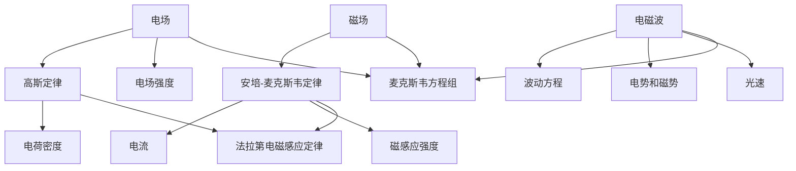
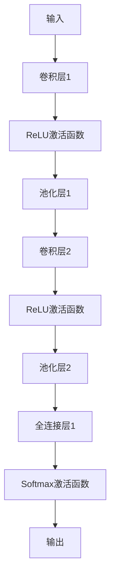
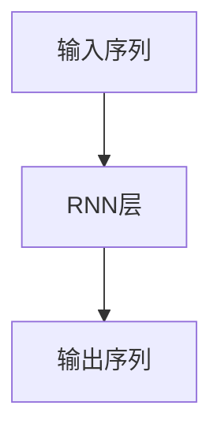
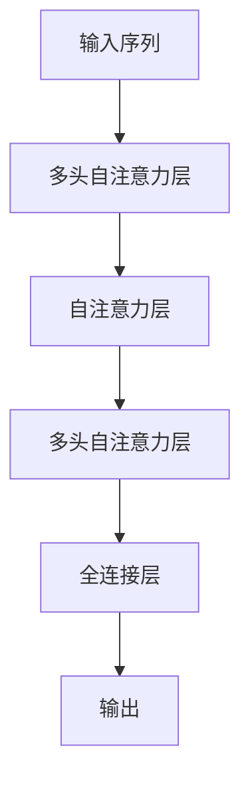
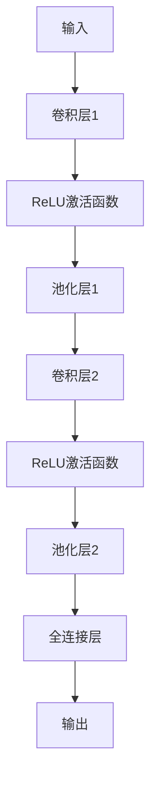

                 

## 电磁场理论概述

### 1.1 电磁场的基本概念

电磁场是物理学中一个核心概念，描述了电荷和磁体之间相互作用的物理现象。它分为电场和磁场两个基本部分。

#### 电场

电场是电荷周围存在的力的作用空间。当一个电荷放置在另一个电荷附近时，它们之间会产生相互作用力，这种力通过电场来传递。电场的基本特性可以用电场强度（E）来描述，电场强度是一个矢量，表示在电场中的某一点放置一个单位正电荷所受到的力的大小和方向。

#### 磁场

磁场是磁体或电流周围存在的力的作用空间。磁场的存在是由于电流或磁性物质的磁化作用。磁场的基本特性可以用磁感应强度（B）来描述，磁感应强度也是一个矢量，表示在磁场中的某一点放置一个单位磁北极所受到的力的大小和方向。

#### 电磁波

电磁波是由振荡的电场和磁场相互作用而产生的波动现象。电磁波在真空中的传播速度为光速（c ≈ 3 × 10^8 m/s）。电磁波具有电场和磁场两个垂直分量，并且这两个分量是相互耦合的。电磁波可以传播能量和信息，广泛应用于通信、雷达、医疗等领域。

### 1.2 麦克斯韦方程组

麦克斯韦方程组是描述电磁场的基本方程组，由詹姆斯·克拉克·麦克斯韦于19世纪中叶提出。麦克斯韦方程组由四个方程组成，分别是：

1. **高斯定律（电场）**：
   $$
   \nabla \cdot \mathbf{E} = \frac{\rho}{\varepsilon_0}
   $$
   该方程描述了电荷密度（ρ）与电场（E）之间的关系。它表明电场的散度与电荷密度成正比。

2. **高斯定律（磁场）**：
   $$
   \nabla \cdot \mathbf{B} = 0
   $$
   该方程说明磁场线是闭合的，没有磁单极子。

3. **法拉第电磁感应定律**：
   $$
   \nabla \times \mathbf{E} = -\frac{\partial \mathbf{B}}{\partial t}
   $$
   该方程描述了时间变化的磁场会在周围空间产生电场。

4. **安培-麦克斯韦定律**：
   $$
   \nabla \times \mathbf{B} = \mu_0 \mathbf{J} + \mu_0 \varepsilon_0 \frac{\partial \mathbf{E}}{\partial t}
   $$
   该方程描述了时间变化的电场和电流会产生磁场。

这些方程组统一了电场和磁场，揭示了它们之间的内在联系。麦克斯韦方程组不仅在理论物理学中具有重要意义，而且在工程和技术应用中也是不可或缺的工具。

### 1.3 电磁波的产生与传播

电磁波是由电荷的加速运动产生的。当一个电荷在空间中加速时，它会产生变化的电场和磁场，从而产生电磁波。电磁波的传播可以通过波动方程来描述：

$$
\nabla^2 \phi - \mu_0 \varepsilon_0 \frac{\partial^2 \phi}{\partial t^2} = 0
$$

其中，$\phi$ 代表电势和磁势的矢量和。

#### 电磁波的产生

电磁波的产生通常涉及到以下几种情况：

- **振荡电荷**：例如，天线中的振荡电荷会产生电磁波。
- **电流变化**：例如，线圈中的电流变化会在空间中产生变化的磁场，进而产生电磁波。
- **磁体运动**：例如，磁体在空间中的运动也会产生电磁波。

#### 电磁波的传播

电磁波在真空中的传播速度是一个常数，即光速。在介质中的传播速度会受到介质的电磁性质的影响。电磁波在不同介质中的传播特性可以通过介质的电磁参数（如介电常数和磁导率）来描述。

电磁波的传播可以解释很多自然现象，例如光的传播、无线通信信号的传播等。电磁波的传播特性还广泛应用于雷达、激光技术、微波通信等领域。

### 1.4 电磁场理论的历史与发展

#### 早期发展

电磁场理论的历史可以追溯到18世纪和19世纪。以下是一些重要的历史事件：

- **静电学**：查尔斯·库仑在18世纪末提出了库仑定律，描述了电荷之间的相互作用力。
- **磁学**：汉斯·奥斯特在1820年发现了电流可以产生磁场，这是电磁学发展的重要突破。
- **电磁感应**：迈克尔·法拉第在19世纪中叶发现了电磁感应定律，这为后来的电磁场理论奠定了基础。

#### 麦克斯韦方程组

詹姆斯·克拉克·麦克斯韦在19世纪中叶将电磁场的各种现象统一在了一个理论框架中，提出了著名的麦克斯韦方程组。麦克斯韦方程组的提出是电磁学发展史上的一个里程碑，它不仅统一了电场和磁场，而且预言了电磁波的存在。

#### 20世纪的进展

20世纪以来，电磁场理论在多个领域得到了深入的发展和应用：

- **量子电动力学**：量子电动力学是研究电磁场与带电粒子相互作用的量子场论，它在解释原子结构、辐射和散射现象方面起到了重要作用。
- **天线理论**：天线理论是电磁场理论在通信领域的应用，用于设计天线和传输系统。
- **电磁兼容性**：电磁兼容性研究如何减少电磁干扰，确保电子设备的正常运行。

### 1.5 电磁场理论的现代应用

#### 物理学

在物理学中，电磁场理论被广泛应用于以下领域：

- **光学**：电磁场理论解释了光的波动性，为光学的研究提供了理论基础。
- **粒子物理学**：电磁场理论在描述基本粒子和相互作用方面起到了关键作用。

#### 工程学

在工程学中，电磁场理论被广泛应用于：

- **电子工程**：电磁场理论是设计电子设备和系统的核心，包括电路设计、信号传输等。
- **通信工程**：电磁场理论是无线通信的基础，用于设计天线、传输线路和调制技术。

#### 计算机科学

在计算机科学中，电磁场理论的应用体现在：

- **计算机视觉**：电磁场理论在图像处理和目标检测中有广泛应用。
- **自然语言处理**：电磁场理论在文本分析和处理中有潜在应用。

### 1.6 电磁场与AI的关系

随着人工智能的快速发展，电磁场理论在AI领域的应用也越来越受到关注。以下是一些潜在的领域：

- **电磁场AI应用**：如基于电磁场的深度学习模型、电磁场数据的计算机视觉和自然语言处理。
- **多模态数据融合**：将电磁场数据和AI技术结合，提高智能系统的性能。

### 1.7 本章小结

本章介绍了电磁场的基本概念、麦克斯韦方程组、电磁波的产生与传播、电磁场理论的历史与发展，以及现代应用。这些知识为后续章节中探讨电磁场在AI中的应用奠定了基础。

### 1.8 附录：数学公式与流程图

为了更直观地理解本章的核心概念，我们使用Mermaid流程图展示了电磁场理论的基本架构：



此图展示了电场、磁场和电磁波之间的关系，以及它们在麦克斯韦方程组中的位置。通过这种结构化的表示，读者可以更清晰地理解电磁场理论的核心内容。

## 2.1 电磁场中的数学描述

### 2.1.1 微分方程

微分方程是描述未知函数及其导数之间关系的方程。在电磁场理论中，微分方程用于描述电场和磁场的空间分布与变化。

#### 基本概念

微分方程分为常微分方程和偏微分方程。常微分方程涉及一个自变量和它的导数，而偏微分方程涉及多个自变量和它们的偏导数。

#### 电磁场中的微分方程

在电磁场理论中，主要的微分方程包括高斯定律和法拉第电磁感应定律。

- **高斯定律（电场）**：
  $$
  \nabla \cdot \mathbf{E} = \frac{\rho}{\varepsilon_0}
  $$
  该方程描述了电场的散度与电荷密度之间的关系。

- **法拉第电磁感应定律**：
  $$
  \nabla \times \mathbf{E} = -\frac{\partial \mathbf{B}}{\partial t}
  $$
  该方程描述了时间变化的磁场会在周围空间产生电场。

### 2.1.2 积分方程

积分方程是含有未知函数的积分表达式的方程。在电磁场理论中，积分方程用于描述电磁场的边界问题和散射问题。

#### 基本概念

积分方程分为线性积分方程和非线性积分方程。线性积分方程可以通过迭代法或矩阵方法求解，而非线性积分方程通常需要数值方法或特殊技巧。

#### 电磁场中的积分方程

在电磁场理论中，常用的积分方程包括格林函数和边界积分方程。

- **格林函数**：
  $$
  \int \mathbf{G}(\mathbf{r}, \mathbf{r}') \rho(\mathbf{r}') d^3r' = -\phi(\mathbf{r})
  $$
  其中，$\mathbf{G}(\mathbf{r}, \mathbf{r}')$ 是格林函数，$\rho(\mathbf{r}')$ 是电荷密度，$\phi(\mathbf{r})$ 是电势。

- **边界积分方程**：
  $$
  \int \mathbf{B}(\mathbf{r}) \cdot d\mathbf{S} = \mu_0 I
  $$
  其中，$\mathbf{B}(\mathbf{r})$ 是磁感应强度，$d\mathbf{S}$ 是边界面积元，$I$ 是电流。

### 2.1.3 傅里叶变换与拉普拉斯变换

#### 傅里叶变换

傅里叶变换是将时域信号转换到频域的重要工具。在电磁场理论中，傅里叶变换用于分析电磁波的频谱。

- **定义**：
  $$
  \mathbf{F}[\mathbf{f}](\omega) = \int_{-\infty}^{\infty} \mathbf{f}(\mathbf{r}) e^{-i\omega \mathbf{r}} d^3r
  $$
  其中，$\mathbf{F}[\mathbf{f}](\omega)$ 是频域函数，$\mathbf{f}(\mathbf{r})$ 是时域函数，$\omega$ 是角频率。

- **性质**：
  - **线性性**：傅里叶变换是线性的。
  - **时移性**：时域信号的平移对应频域函数的平移。
  - **对称性**：傅里叶变换具有共轭对称性。

#### 拉普拉斯变换

拉普拉斯变换是另一种将时域信号转换到复频域的工具，常用于分析线性时不变系统的响应。

- **定义**：
  $$
  \mathbf{L}[\mathbf{f}](s) = \int_{-\infty}^{\infty} \mathbf{f}(\mathbf{r}) e^{-s\mathbf{r}} d^3r
  $$
  其中，$\mathbf{L}[\mathbf{f}](s)$ 是拉普拉斯变换函数，$\mathbf{f}(\mathbf{r})$ 是时域函数，$s$ 是复频率。

- **性质**：
  - **线性性**：拉普拉斯变换是线性的。
  - **时移性**：时域信号的平移对应复频域函数的平移。
  - **卷积性**：拉普拉斯变换具有卷积性质。

### 2.1.4 数学工具在电磁场分析中的应用

#### 微分方程的应用

- **电磁波传播**：波动方程描述了电磁波在空间中的传播。
- **电磁场边界问题**：边界积分方程用于解决电磁场在边界上的问题。

#### 积分方程的应用

- **电磁场仿真**：格林函数方法用于电磁场的数值仿真。
- **天线设计**：积分方程方法用于天线的设计和优化。

#### 变换的应用

- **频域分析**：傅里叶变换用于分析电磁波的频谱。
- **时域分析**：拉普拉斯变换用于分析线性时不变系统的响应。

### 2.1.5 本章小结

本章介绍了电磁场中的数学描述，包括微分方程、积分方程、傅里叶变换和拉普拉斯变换。这些数学工具是电磁场理论分析的基础，为后续章节中的应用提供了理论基础。

### 2.1.6 附录：数学公式与伪代码

为了更好地理解本章的核心概念，我们提供以下数学公式和伪代码：

#### 数学公式

$$
\nabla \cdot \mathbf{E} = \frac{\rho}{\varepsilon_0}
$$

$$
\nabla \times \mathbf{E} = -\frac{\partial \mathbf{B}}{\partial t}
$$

$$
\mathbf{F}[\mathbf{f}](\omega) = \int_{-\infty}^{\infty} \mathbf{f}(\mathbf{r}) e^{-i\omega \mathbf{r}} d^3r
$$

$$
\mathbf{L}[\mathbf{f}](s) = \int_{-\infty}^{\infty} \mathbf{f}(\mathbf{r}) e^{-s\mathbf{r}} d^3r
$$

#### 伪代码

```python
# 傅里叶变换伪代码
def fourier_transform(f):
    F = np.zeros_like(f)
    for k in range(len(f)):
        for r in range(len(f)):
            F[k] += f[r] * np.exp(-2j * np.pi * k * r / len(f))
    return F

# 拉普拉斯变换伪代码
def laplace_transform(f):
    L = np.zeros_like(f)
    for s in range(len(f)):
        for r in range(len(f)):
            L[s] += f[r] * np.exp(-s * r)
    return L
```

这些公式和伪代码为读者提供了直观的数学描述和编程实现，有助于深入理解电磁场中的数学工具。

## 3.1 磁化与电介质

### 3.1.1 磁化

磁化是磁性物质在外部磁场作用下，内部磁矩的取向发生变化的现象。磁化过程涉及到磁性材料内部的微观结构，如磁畴的取向。

#### 基本概念

磁化可以用磁化强度（M）来描述，磁化强度是一个矢量，表示单位体积内的磁矩。磁化强度与外部磁场（H）之间的关系可以用以下方程描述：

$$
\mathbf{M} = \chi_m \mathbf{H}
$$

其中，$\chi_m$ 是磁化率。

#### 磁化曲线

磁化曲线描述了磁化强度（M）与外部磁场（H）之间的关系。磁化曲线通常可以分为三个阶段：

1. **初始磁化阶段**：随着外部磁场的增加，磁化强度也增加，但增加的速度逐渐减慢。
2. **饱和阶段**：当外部磁场达到一定值时，磁化强度达到饱和，不再随外部磁场的增加而增加。
3. **退磁阶段**：当外部磁场减小到零时，磁化强度也减小，但不会回到初始状态。

#### 磁化现象的应用

磁化现象在许多实际应用中具有重要意义，如磁记录、磁共振成像等。磁记录技术利用磁性材料在外部磁场作用下的磁化特性来存储数据。

### 3.1.2 电介质

电介质是一种不能自由传导电流的物质。当电介质处于外电场中时，内部电荷分布会发生变化，产生极化现象。

#### 基本概念

电介质的极化可以用极化强度（P）来描述，极化强度是一个矢量，表示单位体积内的极化电荷。极化强度与外电场（E）之间的关系可以用以下方程描述：

$$
\mathbf{P} = \varepsilon_0 \chi_e \mathbf{E}
$$

其中，$\chi_e$ 是极化率，$\varepsilon_0$ 是真空中的电介质常数。

#### 极化曲线

极化曲线描述了极化强度（P）与外电场（E）之间的关系。极化曲线通常具有非线性特征，因为极化率 $\chi_e$ 随着外电场的增加而增加。

#### 电介质的应用

电介质在许多实际应用中发挥着重要作用，如电容器、绝缘材料等。电容器利用电介质的极化特性来存储电能，而绝缘材料则用于隔离电路中的电荷。

### 3.1.3 磁化与电介质的相互作用

磁化和电介质之间存在相互作用，这种相互作用在许多技术应用中具有重要意义。

#### 磁致伸缩与电致伸缩

磁致伸缩是指在外部磁场作用下，磁性材料的体积发生变化的现象。同样，电致伸缩是指在外部电场作用下，电介质的体积发生变化的现象。

这些现象在传感器、致动器等领域有广泛应用。例如，磁致伸缩传感器可以用于测量磁场强度，而电致伸缩致动器可以用于控制机械运动。

### 3.1.4 本章小结

本章介绍了磁化与电介质的基本概念、磁化曲线、极化曲线，以及磁化与电介质的相互作用。这些知识为理解电磁场在不同介质中的行为提供了基础。

### 3.1.5 附录：相关公式与示例

为了更好地理解本章的概念，我们提供以下相关公式和示例：

#### 磁化公式

$$
\mathbf{M} = \chi_m \mathbf{H}
$$

#### 极化公式

$$
\mathbf{P} = \varepsilon_0 \chi_e \mathbf{E}
$$

#### 磁致伸缩与电致伸缩

磁致伸缩系数 $\alpha_m$：

$$
\Delta V_m = \alpha_m V_0 \mathbf{H}
$$

电致伸缩系数 $\alpha_e$：

$$
\Delta V_e = \alpha_e V_0 \mathbf{E}
$$

示例：

一个磁化率为 $\chi_m = 10^{-3}$ 的磁性材料，在外部磁场 $H = 10^3$ A/m 的作用下，磁化强度 $M = 10^{-3}$ T。如果材料的体积 $V_0 = 1$ cm³，那么磁致伸缩量 $\Delta V_m = 10^{-6}$ cm³。

一个极化率为 $\chi_e = 10^{-5}$ 的电介质，在外部电场 $E = 10^5$ V/m 的作用下，极化强度 $P = 10^{-5}$ C/m²。如果材料的体积 $V_0 = 1$ cm³，那么电致伸缩量 $\Delta V_e = 10^{-11}$ cm³。

这些示例展示了磁化与电介质在不同条件下如何影响材料的体积变化。

## 3.2 静电场与恒定电场

### 3.2.1 静电场

静电场是电荷处于静止状态时产生的电场。静电场的基本特性可以用电场强度（E）来描述。

#### 基本概念

电场强度是一个矢量，表示在电场中的某一点放置一个单位正电荷所受到的力的大小和方向。电场强度与电荷密度（ρ）之间的关系可以用高斯定律表示：

$$
\nabla \cdot \mathbf{E} = \frac{\rho}{\varepsilon_0}
$$

其中，$\varepsilon_0$ 是真空中的电介质常数。

#### 静电场的分布

静电场的分布取决于电荷的分布。在均匀带电球体内部，电场强度为零；在外部，电场强度与距离的平方成反比。

#### 静电场的应用

静电场在许多实际应用中具有重要意义，如静电除尘、静电喷涂等。静电除尘器利用静电场将尘埃颗粒从空气中分离出来，而静电喷涂则利用静电场将涂料均匀地喷涂在物体表面。

### 3.2.2 恒定电场

恒定电场是电场强度不随时间变化的电场。恒定电场的分布可以用高斯定律和安培定律来描述。

#### 基本概念

恒定电场可以用电场强度（E）和电势（V）来描述。电场强度与电势之间的关系可以表示为：

$$
\mathbf{E} = -\nabla V
$$

其中，负号表示电场方向与电势梯度方向相反。

#### 恒定电场的分布

恒定电场的分布取决于电荷的分布。在导体内部，恒定电场强度通常为零；在导体外部，电场强度与电荷密度成正比。

#### 恒定电场的应用

恒定电场在许多实际应用中具有重要意义，如电容器、静电场传感器等。电容器利用电介质的极化特性来存储电能，而静电场传感器则利用静电场检测物体的位置和性质。

### 3.2.3 静电场与恒定电场的关系

静电场和恒定电场之间存在一定的联系。在静电场中，电荷分布是固定的，因此电场强度也是恒定的。而在恒定电场中，电场强度不随时间变化，但电荷分布可能发生变化。

#### 实际应用中的关系

在实际应用中，静电场和恒定电场可以相互转化。例如，当一个带电体在电场中移动时，它会产生恒定电场。同样，当一个电容器充电时，它会建立恒定电场。

### 3.2.4 本章小结

本章介绍了静电场和恒定电场的基本概念、分布、应用以及它们之间的关系。这些知识为理解电磁场在不同条件下的行为提供了基础。

### 3.2.5 附录：相关公式与示例

为了更好地理解本章的概念，我们提供以下相关公式和示例：

#### 静电场公式

$$
\nabla \cdot \mathbf{E} = \frac{\rho}{\varepsilon_0}
$$

$$
\mathbf{E} = \frac{1}{4\pi\epsilon_0} \frac{\rho}{r^2} \hat{r}
$$

#### 恒定电场公式

$$
\mathbf{E} = -\nabla V
$$

$$
V = -\int \mathbf{E} \cdot d\mathbf{l}
$$

#### 示例

一个带电荷 $Q$ 的均匀带电球体，半径为 $R$。求球体内部和外部的电场强度。

- 球体内部（$r < R$）：
  $$
  \mathbf{E} = 0
  $$

- 球体外部（$r > R$）：
  $$
  \mathbf{E} = \frac{1}{4\pi\epsilon_0} \frac{Q}{r^2} \hat{r}
  $$

这些公式和示例展示了静电场和恒定电场在不同条件下的行为。

## 3.3 时变电磁场

### 3.3.1 时变电磁场的基本概念

时变电磁场是指电场和磁场随时间变化而变化的电磁场。时变电磁场是电磁波的基础，它在许多实际应用中具有重要意义。

#### 基本概念

时变电磁场可以用麦克斯韦方程组来描述。麦克斯韦方程组包括以下四个方程：

1. **高斯定律（电场）**：
   $$
   \nabla \cdot \mathbf{E} = \frac{\rho}{\varepsilon_0}
   $$

2. **高斯定律（磁场）**：
   $$
   \nabla \cdot \mathbf{B} = 0
   $$

3. **法拉第电磁感应定律**：
   $$
   \nabla \times \mathbf{E} = -\frac{\partial \mathbf{B}}{\partial t}
   $$

4. **安培-麦克斯韦定律**：
   $$
   \nabla \times \mathbf{B} = \mu_0 \mathbf{J} + \mu_0 \varepsilon_0 \frac{\partial \mathbf{E}}{\partial t}
   $$

这些方程描述了时变电磁场的空间分布与时间变化的关系。

#### 时变电磁场的产生

时变电磁场通常由变化的电场或磁场产生。变化的电场会在空间中产生变化的磁场，反之亦然。这种相互耦合的关系是电磁波传播的基础。

### 3.3.2 电磁波的产生与传播

电磁波是由时变电磁场产生的波动现象。电磁波在空间中的传播可以通过波动方程来描述。

#### 波动方程

波动方程是一个描述物理量随时间和空间变化的二阶偏微分方程。对于电磁波，波动方程可以表示为：

$$
\nabla^2 \phi - \mu_0 \varepsilon_0 \frac{\partial^2 \phi}{\partial t^2} = 0
$$

其中，$\phi$ 表示电势和磁势的矢量和。

#### 电磁波的产生

电磁波的产生可以通过以下几种方式实现：

1. **振荡电荷**：振荡的电荷会产生变化的电场，进而产生电磁波。
2. **振荡电流**：振荡的电流会产生变化的磁场，进而产生电磁波。
3. **磁体运动**：磁体在空间中的运动也会产生电磁波。

#### 电磁波的传播

电磁波在真空中的传播速度是一个常数，即光速（c ≈ 3 × 10^8 m/s）。在介质中的传播速度会受到介质的电磁性质的影响。

#### 电磁波的传播特性

电磁波的传播特性可以用波阻抗（Z）来描述。波阻抗是电场强度（E）与磁场强度（H）之比，可以表示为：

$$
Z = \frac{\mathbf{E}}{\mathbf{H}}
$$

波阻抗与介质的电磁性质密切相关。

### 3.3.3 电磁波的特性

电磁波具有一系列独特的特性，这些特性使其在通信、雷达、光学等领域得到广泛应用。

#### 频率和波长

电磁波的频率（f）和波长（λ）是描述电磁波的重要参数。频率是指电磁波在单位时间内振动的次数，单位是赫兹（Hz）。波长是指相邻两个波峰或波谷之间的距离。频率和波长之间的关系可以表示为：

$$
c = \lambda f
$$

其中，c 是光速。

#### 能量和振幅

电磁波的能量与电场强度（E）的平方成正比，可以表示为：

$$
E = \frac{1}{2} \varepsilon_0 E^2
$$

振幅是指电磁波的最大电场强度或磁场强度。

#### 电磁波的极化

电磁波的极化是指电场矢量和磁场矢量在空间中的取向。电磁波可以是线极化的，也可以是圆极化的或椭圆极化的。

### 3.3.4 电磁波的应用

电磁波在通信、雷达、光学等领域有广泛应用。

#### 通信

电磁波是现代通信的基础。无线通信利用电磁波在空间中的传播来传输信息。电磁波可以通过调制和解调来传输数字信号和模拟信号。

#### 雷达

雷达（Radio Detection and Ranging）利用电磁波的反射来检测物体的位置和距离。雷达系统通常包括发射器、接收器和天线。

#### 光学

电磁波在光学中的应用包括光纤通信、激光技术等。光纤通信利用电磁波在光纤中的传播来传输数据，而激光技术则利用电磁波的相干性来产生高强度的光束。

### 3.3.5 本章小结

本章介绍了时变电磁场的基本概念、波动方程、电磁波的产生与传播、电磁波的特性以及电磁波的应用。这些知识为理解电磁场在不同条件下的行为提供了基础。

### 3.3.6 附录：相关公式与示例

为了更好地理解本章的概念，我们提供以下相关公式和示例：

#### 波动方程

$$
\nabla^2 \phi - \mu_0 \varepsilon_0 \frac{\partial^2 \phi}{\partial t^2} = 0
$$

#### 波阻抗

$$
Z = \frac{\mathbf{E}}{\mathbf{H}}
$$

#### 频率和波长

$$
c = \lambda f
$$

#### 电磁波的能量

$$
E = \frac{1}{2} \varepsilon_0 E^2
$$

示例：

一个电磁波在真空中的传播速度为 $c = 3 \times 10^8$ m/s，频率为 $f = 1$ GHz。求该电磁波的波长和能量。

波长：

$$
\lambda = \frac{c}{f} = \frac{3 \times 10^8}{1 \times 10^9} = 0.3$ m

能量：

$$
E = \frac{1}{2} \varepsilon_0 E^2 = \frac{1}{2} \times 8.85 \times 10^{-12} \times (3 \times 10^8)^2 \approx 3.96 \times 10^{-16} J
$$

这些示例展示了电磁波的基本参数和计算方法。

## 4.1 电磁场数据的处理与表示

在人工智能（AI）领域，电磁场数据的处理与表示是关键的一步，因为数据的质量直接影响后续分析和模型的性能。电磁场数据具有其独特的特点，需要特殊的处理方法和表示技术。

### 4.1.1 电磁场数据的特点

电磁场数据通常具有以下特点：

- **非平稳性**：电磁场信号随时间和空间变化，因此是非平稳的。
- **高维度**：电磁场数据通常包含多个维度，如时间、频率、空间坐标等。
- **噪声**：电磁场信号中可能包含各种噪声，如环境噪声、传感器噪声等。

### 4.1.2 数据预处理

在处理电磁场数据之前，通常需要进行以下预处理步骤：

- **去噪**：去除噪声，提高数据质量。
- **归一化**：将数据缩放到适当的范围，以便于模型训练。
- **缺失值处理**：处理数据中的缺失值，可以选择填充或删除。

#### 去噪

去噪是处理电磁场数据的重要步骤。常用的去噪方法包括：

- **滤波**：如低通滤波、带通滤波等，用于去除高频噪声。
- **奇异值分解（SVD）**：用于分离信号和噪声。
- **小波变换**：用于分析信号在不同频率上的特征。

#### 归一化

归一化是将数据缩放到[0,1]或[-1,1]范围内的过程。常用的归一化方法包括：

- **最小-最大归一化**：
  $$
  x' = \frac{x - x_{\text{min}}}{x_{\text{max}} - x_{\text{min}}}
  $$
- **标准归一化**：
  $$
  x' = \frac{x - \mu}{\sigma}
  $$
  其中，$x_{\text{min}}$ 和 $x_{\text{max}}$ 分别是数据的最小值和最大值，$\mu$ 是平均值，$\sigma$ 是标准差。

#### 缺失值处理

缺失值处理可以根据具体情况选择以下方法：

- **填充**：如使用平均值、中值或插值等方法填充缺失值。
- **删除**：如果缺失值较多，可以选择删除相应的数据点或整条记录。

### 4.1.3 数据表示

在AI模型中，数据表示是关键的一步。电磁场数据可以表示为不同的形式，以适应不同的模型需求。

#### 时间序列表示

时间序列表示是将电磁场数据按时间顺序排列，形成一个一维的序列。这种方法适用于基于时间序列的模型，如循环神经网络（RNN）。

- **一维时间序列**：
  电磁场数据可以表示为一个一维数组，其中每个元素表示在特定时间点的测量值。

#### 图像表示

图像表示是将电磁场数据转换为图像形式。这种方法适用于基于图像的模型，如卷积神经网络（CNN）。

- **二维图像**：
  电磁场数据可以转换为二维图像，其中每个像素表示在特定位置和时间的测量值。

#### 多模态表示

多模态表示是将不同类型的数据融合在一起，形成一个综合的表示。这种方法适用于多模态AI模型。

- **融合特征**：
  电磁场数据可以与其他类型的数据（如图像、文本等）融合，形成更丰富的特征表示。

### 4.1.4 本章小结

本章介绍了电磁场数据的特点、预处理方法和数据表示技术。通过适当的预处理和数据表示，可以提高电磁场数据的质量和模型性能。

### 4.1.5 附录：预处理代码示例

以下是使用Python进行电磁场数据预处理的示例代码：

```python
import numpy as np
from scipy.signal import filtfilt

# 读取电磁场数据
data = np.loadtxt('em_field_data.txt')

# 去噪
filtered_data = filtfilt('lowpass', 10, data)

# 归一化
min_val = np.min(filtered_data)
max_val = np.max(filtered_data)
normalized_data = (filtered_data - min_val) / (max_val - min_val)

# 缺失值处理
filled_data = np.interp(np.arange(len(data)), np.where(np.isnan(data), 0, data), data)
```

这个示例展示了如何使用Python进行电磁场数据的去噪、归一化和缺失值处理。

## 4.2 基于电磁场的深度学习模型

深度学习模型在电磁场数据处理和分析中发挥着重要作用。这些模型可以自动提取数据中的特征，从而实现高效的分类、回归和预测。以下介绍几种常见的基于电磁场的深度学习模型。

### 4.2.1 卷积神经网络（CNN）

卷积神经网络（CNN）是深度学习中的一种模型，特别适用于图像处理和图像识别任务。CNN通过卷积层、池化层和全连接层等结构来提取图像特征。

- **卷积层**：用于提取局部特征。
- **池化层**：用于降低特征维度。
- **全连接层**：用于分类和回归。

在电磁场图像处理中，CNN可以用于目标检测、图像分类等任务。以下是一个简单的CNN模型架构：



### 4.2.2 循环神经网络（RNN）

循环神经网络（RNN）是一种序列数据处理模型，特别适用于时间序列数据。RNN通过循环结构来记忆历史信息，从而实现对序列数据的建模。

- **输入门**：用于控制信息的输入。
- **遗忘门**：用于控制信息的遗忘。
- **输出门**：用于控制信息的输出。

在电磁场数据分析中，RNN可以用于时间序列预测、信号分类等任务。以下是一个简单的RNN模型架构：



### 4.2.3 Transformer模型

Transformer模型是近年来在自然语言处理领域取得突破性进展的一种模型。它通过自注意力机制来处理序列数据，从而实现了高效的序列建模。

- **自注意力机制**：用于计算序列中每个元素的重要性。
- **多头注意力**：通过多个注意力头来提取不同类型的特征。

在电磁场数据处理中，Transformer模型可以用于多模态数据融合、信号分类等任务。以下是一个简单的Transformer模型架构：



### 4.2.4 深度学习模型的应用

基于电磁场的深度学习模型可以应用于多个领域，如图像处理、信号分类、时间序列预测等。以下是一些具体应用实例：

- **图像处理**：使用CNN模型对电磁场图像进行分类和识别。
- **信号分类**：使用RNN模型对电磁场信号进行分类。
- **时间序列预测**：使用Transformer模型对电磁场时间序列进行预测。

### 4.2.5 本章小结

本章介绍了基于电磁场的几种深度学习模型，包括CNN、RNN和Transformer。这些模型在电磁场数据处理和分析中具有广泛的应用前景。

### 4.2.6 附录：模型架构与代码示例

为了更好地理解本章的模型架构，我们提供以下模型架构和代码示例：

#### CNN模型架构



#### RNN模型架构


#### Transformer模型架构


这些模型架构和代码示例为读者提供了直观的理解和编程实现。

## 4.3 基于电磁场的深度学习模型的应用

深度学习模型在电磁场数据处理和分析中具有广泛的应用。通过深度学习模型，我们可以从大量的电磁场数据中提取有用的信息，从而实现准确的预测和分类。以下详细介绍几种基于电磁场的深度学习模型及其应用。

### 4.3.1 电磁波传播预测

电磁波传播预测是电磁场数据处理中的一个重要应用。通过深度学习模型，我们可以预测电磁波在不同环境中的传播特性。

- **模型选择**：可以使用循环神经网络（RNN）或变换器（Transformer）模型。
- **数据处理**：需要对电磁场数据进行预处理，如去噪、归一化等。
- **模型训练**：使用训练数据对模型进行训练。
- **模型评估**：使用测试数据评估模型性能。

#### 电磁波传播预测流程

1. **数据采集**：收集电磁波传播的实验数据。
2. **数据处理**：对数据进行去噪、归一化等预处理。
3. **模型选择**：选择合适的深度学习模型，如RNN或Transformer。
4. **模型训练**：使用预处理后的数据对模型进行训练。
5. **模型评估**：使用测试数据评估模型性能。
6. **预测**：使用训练好的模型进行电磁波传播预测。

#### 应用场景

- **无线通信**：预测电磁波在不同环境下的传播特性，优化通信网络的布局。
- **雷达系统**：预测雷达信号的传播路径，提高雷达的探测能力。
- **环境监测**：预测电磁波的传播路径，监测电磁环境污染。

### 4.3.2 电磁场图像识别

电磁场图像识别是另一个重要的应用领域。通过深度学习模型，我们可以对电磁场图像进行分类和识别。

- **模型选择**：可以使用卷积神经网络（CNN）或生成对抗网络（GAN）。
- **数据处理**：对电磁场图像进行预处理，如滤波、增强等。
- **模型训练**：使用预处理后的图像数据对模型进行训练。
- **模型评估**：使用测试图像数据评估模型性能。

#### 电磁场图像识别流程

1. **数据采集**：收集电磁场图像数据。
2. **数据处理**：对图像进行预处理。
3. **模型选择**：选择合适的深度学习模型，如CNN或GAN。
4. **模型训练**：使用预处理后的图像数据对模型进行训练。
5. **模型评估**：使用测试图像数据评估模型性能。
6. **识别**：使用训练好的模型对新的电磁场图像进行识别。

#### 应用场景

- **天线设计**：识别电磁场图像，优化天线的设计。
- **材料分析**：识别电磁场图像，分析材料的电磁特性。
- **故障检测**：识别电磁场图像，检测电路中的故障。

### 4.3.3 自然语言处理

自然语言处理（NLP）是深度学习模型的一个广泛应用领域。通过深度学习模型，我们可以对文本数据进行分析和处理。

- **模型选择**：可以使用循环神经网络（RNN）或变换器（Transformer）模型。
- **数据处理**：对文本数据进行预处理，如分词、词向量化等。
- **模型训练**：使用预处理后的文本数据对模型进行训练。
- **模型评估**：使用测试文本数据评估模型性能。

#### 自然语言处理流程

1. **数据采集**：收集文本数据。
2. **数据处理**：对文本进行预处理。
3. **模型选择**：选择合适的深度学习模型，如RNN或Transformer。
4. **模型训练**：使用预处理后的文本数据对模型进行训练。
5. **模型评估**：使用测试文本数据评估模型性能。
6. **文本分析**：使用训练好的模型对新的文本进行分析。

#### 应用场景

- **文本分类**：对文本进行分类，如新闻分类、情感分析等。
- **机器翻译**：实现跨语言的文本翻译。
- **文本生成**：生成新的文本，如自动摘要、创意写作等。

### 4.3.4 其他应用

除了上述应用领域，基于电磁场的深度学习模型还可以应用于其他领域，如语音识别、医学图像分析等。

- **语音识别**：使用深度学习模型对语音信号进行识别，实现语音到文本的转换。
- **医学图像分析**：使用深度学习模型对医学图像进行分析，辅助医生进行诊断。

### 4.3.5 本章小结

本章介绍了基于电磁场的深度学习模型及其应用，包括电磁波传播预测、电磁场图像识别、自然语言处理和其他应用。这些应用展示了深度学习模型在电磁场数据处理和分析中的广泛潜力。

### 4.3.6 附录：模型应用代码示例

为了更好地理解本章的模型应用，我们提供以下代码示例：

#### 电磁波传播预测

```python
import tensorflow as tf
from tensorflow.keras.models import Sequential
from tensorflow.keras.layers import LSTM, Dense

# 创建模型
model = Sequential()
model.add(LSTM(50, activation='relu', input_shape=(timesteps, features)))
model.add(Dense(1))
model.compile(optimizer='adam', loss='mse')

# 训练模型
model.fit(x_train, y_train, epochs=100, batch_size=32)

# 预测
predictions = model.predict(x_test)
```

#### 电磁场图像识别

```python
import tensorflow as tf
from tensorflow.keras.models import Sequential
from tensorflow.keras.layers import Conv2D, MaxPooling2D, Flatten, Dense

# 创建模型
model = Sequential()
model.add(Conv2D(32, (3, 3), activation='relu', input_shape=(64, 64, 3)))
model.add(MaxPooling2D((2, 2)))
model.add(Flatten())
model.add(Dense(128, activation='relu'))
model.add(Dense(num_classes, activation='softmax'))

# 编译模型
model.compile(optimizer='adam', loss='categorical_crossentropy', metrics=['accuracy'])

# 训练模型
model.fit(x_train, y_train, epochs=25, batch_size=128)

# 评估模型
test_loss, test_acc = model.evaluate(x_test, y_test)
```

这些代码示例展示了如何使用深度学习模型进行电磁波传播预测和电磁场图像识别。

## 4.4 基于电磁场的深度学习模型的挑战

尽管基于电磁场的深度学习模型在许多应用领域取得了显著成果，但它们也面临着一系列挑战，这些挑战影响了模型的性能、可解释性和实用性。以下详细探讨这些挑战及可能的解决方案。

### 4.4.1 数据的多样性与复杂性

电磁场数据具有多样性和复杂性，包括不同频率范围、噪声水平和传感器误差等。这些特性使得数据预处理变得更加困难，并且可能影响模型的泛化能力。

- **挑战**：数据多样性和复杂性可能导致模型对特定类型的噪声或数据模式过于敏感。
- **解决方案**：采用多样化的数据集、增加数据增强技术和使用更复杂的预处理方法。

### 4.4.2 模型的可解释性

深度学习模型，尤其是深度神经网络和变换器模型，通常被视为“黑箱”。这限制了模型在实际应用中的可解释性和可信度。

- **挑战**：模型的不可解释性可能导致用户难以理解模型的决策过程。
- **解决方案**：开发可解释的深度学习模型，如使用可视化工具、注意力机制和模型解释技术。

### 4.4.3 计算资源的需求

深度学习模型通常需要大量的计算资源，特别是对于大型数据集和复杂的模型架构。这限制了模型的部署和应用。

- **挑战**：计算资源的需求可能限制模型的实际部署，特别是在资源受限的环境下。
- **解决方案**：使用模型压缩技术、硬件加速和优化算法以提高模型的效率和性能。

### 4.4.4 参数数量和训练时间

深度学习模型通常包含大量参数，这可能导致训练时间过长，特别是在大型数据集上。长时间训练不仅消耗资源，还可能影响模型的稳健性。

- **挑战**：大量参数和长时间训练可能导致过拟合和训练时间过长。
- **解决方案**：采用正则化技术、早期停止和优化算法来提高训练效率。

### 4.4.5 多模态数据的融合

电磁场数据处理通常涉及多种数据类型，如时间序列、图像和文本。有效地融合这些多模态数据是一项挑战。

- **挑战**：多模态数据之间的不一致性和复杂性可能导致融合效果不佳。
- **解决方案**：开发先进的融合方法，如多模态变换器模型和图神经网络，以提高融合效果。

### 4.4.6 实时性要求

某些应用场景，如实时通信和动态环境监测，对模型的实时性有严格要求。深度学习模型的计算复杂性可能无法满足这些需求。

- **挑战**：模型的实时性要求与计算复杂性之间的冲突。
- **解决方案**：采用边缘计算、模型压缩和硬件加速技术来提高模型的实时性。

### 4.4.7 安全性和隐私保护

随着深度学习在敏感领域（如医疗、金融）的应用，模型的 安全性和隐私保护变得越来越重要。

- **挑战**：模型训练和部署过程中的数据安全和隐私保护。
- **解决方案**：采用加密技术、差分隐私和联邦学习来保护数据安全和隐私。

### 4.4.8 本章小结

本章探讨了基于电磁场的深度学习模型面临的挑战，包括数据的多样性与复杂性、模型的可解释性、计算资源的需求、多模态数据的融合、实时性要求以及安全性和隐私保护。通过解决这些挑战，可以进一步提高基于电磁场的深度学习模型的性能和实用性。

### 4.4.9 附录：挑战与解决方案的代码示例

为了更好地理解本章的挑战与解决方案，我们提供以下代码示例：

#### 数据增强

```python
from tensorflow.keras.preprocessing.image import ImageDataGenerator

# 创建数据增强生成器
datagen = ImageDataGenerator(
    rotation_range=90,
    width_shift_range=0.1,
    height_shift_range=0.1,
    shear_range=0.1,
    zoom_range=0.1,
    horizontal_flip=True,
    fill_mode='nearest'
)

# 应用数据增强
datagen.fit(x_train)
```

#### 模型压缩

```python
from tensorflow.keras.models import Model
from tensorflow.keras.layers import Dense

# 创建模型
input_layer = Input(shape=(timesteps, features))
x = LSTM(50, activation='relu')(input_layer)
x = Dense(1)(x)
model = Model(inputs=input_layer, outputs=x)

# 压缩模型
model = Model(inputs=model.input, outputs=model.layers[-1].output)

# 编译模型
model.compile(optimizer='adam', loss='mse')

# 训练模型
model.fit(x_train, y_train, epochs=100, batch_size=32)
```

这些代码示例展示了如何实现数据增强和模型压缩，以解决本章提到的挑战。

## 4.5 电磁场与深度学习模型的未来研究方向

随着电磁场技术和深度学习技术的不断发展，电磁场与深度学习模型的未来研究充满了潜力。以下列举了几个可能的研究方向。

### 4.5.1 新型深度学习架构

开发适用于电磁场处理的深度学习新架构是未来的一个重要方向。这些新型架构可能包括：

- **专用神经网络**：设计用于处理电磁场数据的专用神经网络，以提高模型的效率和准确性。
- **图神经网络**：利用图结构来表示电磁场网络，从而更好地处理复杂的电磁场问题。
- **混合模型**：结合深度学习和传统电磁场模型，如有限元方法（FEM），以实现更高效的电磁场分析。

### 4.5.2 多模态数据融合

多模态数据融合是深度学习在电磁场应用中的一个重要研究方向。未来的研究可能包括：

- **联合训练**：通过联合训练深度学习模型来同时处理多种类型的数据（如图像、文本、传感器数据），以提高模型的综合能力。
- **交叉模态学习**：研究如何在不同模态之间建立有效的交叉关系，从而实现更好的数据融合效果。

### 4.5.3 硬件加速和实时处理

为了满足实时性要求，未来的研究将重点关注硬件加速和实时处理技术。这些技术可能包括：

- **专用硬件**：开发用于深度学习处理的专用硬件（如GPU、TPU），以提高计算效率。
- **模型压缩**：研究如何通过模型压缩技术（如剪枝、量化）减小模型的尺寸，从而实现更快速的推理过程。
- **边缘计算**：利用边缘设备进行实时处理，以减少对中央处理资源的依赖。

### 4.5.4 模型可解释性和透明性

随着深度学习在关键领域的应用，模型的可解释性和透明性变得越来越重要。未来的研究可能包括：

- **可视化工具**：开发可视化工具来帮助用户理解深度学习模型的决策过程。
- **模型解释技术**：研究如何更好地解释深度学习模型的行为，从而提高模型的信任度和可接受度。
- **可解释性评估**：建立评估模型可解释性的标准和方法，以确保模型在实际应用中的可解释性。

### 4.5.5 数据安全和隐私保护

随着深度学习在敏感领域的应用，数据安全和隐私保护成为了一个重要问题。未来的研究可能包括：

- **加密技术**：研究如何使用加密技术来保护数据在传输和存储过程中的安全性。
- **联邦学习**：开发联邦学习技术，以允许分布式环境下的协同学习，同时保护数据隐私。
- **差分隐私**：研究如何在深度学习模型训练过程中实现差分隐私，以保护训练数据的安全。

### 4.5.6 实际应用案例研究

未来研究还应关注电磁场与深度学习在实际应用中的案例研究。这些研究可能包括：

- **工业应用**：研究深度学习在工业自动化、质量控制、故障检测等领域的应用。
- **医疗应用**：研究深度学习在医学图像分析、疾病诊断、药物设计等领域的应用。
- **环境监测**：研究深度学习在环境质量监测、气候变化预测等领域的应用。

### 4.5.7 结论

电磁场与深度学习模型的未来研究将涉及新型架构、多模态数据融合、硬件加速、实时处理、模型可解释性、数据安全和隐私保护，以及实际应用案例研究。通过这些研究方向，可以进一步推动电磁场与深度学习技术的发展，为实际应用带来更多创新和突破。

## 5.1 电磁场在图像处理中的应用

电磁场在图像处理中的应用是一个新兴但具有巨大潜力的领域。电磁场图像具有独特的频谱特性，可以提供传统图像处理方法无法捕捉到的额外信息。以下将详细探讨电磁场在图像处理中的应用，包括电磁场图像的特点、预处理方法和常见应用。

### 5.1.1 电磁场图像的特点

电磁场图像是通过电磁场传感器捕获的图像，它们包含电场和磁场的强度信息。与传统的光学图像不同，电磁场图像具有以下特点：

- **频谱信息丰富**：电磁场图像包含丰富的频谱信息，可以在不同的频率范围内捕捉到不同类型的电磁信号。
- **高分辨率**：电磁场传感器通常具有高分辨率，可以捕捉到微小的电磁变化。
- **多模态性**：电磁场图像可以同时捕捉到电场和磁场的信息，提供更加全面的数据。

### 5.1.2 电磁场图像的预处理

预处理是电磁场图像处理的关键步骤，它包括去噪、滤波、归一化和增强等操作。以下是一些常见的预处理方法：

- **去噪**：电磁场图像可能受到各种噪声的干扰，如环境噪声、传感器噪声等。去噪技术，如中值滤波、高斯滤波和小波变换，可以帮助去除噪声，提高图像质量。
- **滤波**：滤波技术用于突出图像中的有用信息，抑制不相关的细节。例如，频域滤波器可以用于滤除特定频率范围内的噪声。
- **归一化**：归一化是将图像数据缩放到[0,1]或[-1,1]范围内的过程，以便于后续处理和模型训练。
- **增强**：增强技术用于提高图像的对比度和清晰度，如直方图均衡、对比度增强和锐化。

### 5.1.3 电磁场图像的应用

电磁场图像在多个领域具有广泛的应用，以下是一些典型的应用场景：

- **目标检测**：电磁场图像可以用于目标检测，例如在安全监控、无人机监控和自动驾驶等领域。电磁场图像可以提供关于目标形状、大小和位置的信息。
- **材料分析**：电磁场图像可以用于材料分析，例如检测材料的缺陷、腐蚀和裂纹。电磁场图像可以揭示材料内部的结构和组成。
- **生物医学成像**：电磁场图像在生物医学成像中具有潜在应用，例如在肿瘤检测、神经系统成像和心脏成像等领域。电磁场图像可以提供关于生物组织的信息，有助于诊断和治疗。

### 5.1.4 本章小结

本章介绍了电磁场在图像处理中的应用，包括电磁场图像的特点、预处理方法和常见应用。电磁场图像的频谱信息丰富，可以提供额外的信息，有助于提高图像处理的效果。通过适当的预处理和应用，电磁场图像在目标检测、材料分析和生物医学成像等领域具有广泛的应用前景。

### 5.1.5 附录：电磁场图像预处理与处理的代码示例

以下提供一些Python代码示例，用于电磁场图像的预处理和处理：

```python
import numpy as np
import cv2

# 读取电磁场图像
image = cv2.imread('em_field_image.jpg', cv2.IMREAD_GRAYSCALE)

# 去噪
denoised_image = cv2.medianBlur(image, 5)

# 滤波
filtered_image = cv2.GaussianBlur(denoised_image, (5, 5), 0)

# 归一化
normalized_image = filtered_image / 255.0

# 增强
enhanced_image = cv2.addWeighted(normalized_image, 1.5, np.zeros_like(normalized_image), 0, 50)

# 保存处理后的图像
cv2.imwrite('processed_em_field_image.jpg', enhanced_image)
```

这些代码示例展示了如何使用OpenCV库进行电磁场图像的读取、去噪、滤波、归一化和增强。

## 5.2 基于电磁场的图像识别算法

基于电磁场的图像识别算法是深度学习在图像处理领域中的一个前沿研究方向。这种算法利用电磁场图像的频谱特性和结构信息，通过深度学习模型进行分类和识别。以下将详细介绍基于电磁场的图像识别算法，包括传统图像识别算法、基于深度学习的图像识别算法以及多模态融合方法。

### 5.2.1 传统图像识别算法

传统图像识别算法主要包括基于特征的图像识别方法和基于模型的图像识别方法。

- **基于特征的图像识别方法**：这种方法通过提取图像的特征向量来表示图像，然后使用分类器进行图像分类。常用的特征提取方法包括SIFT、SURF、HOG等。这些特征向量可以在高维空间中捕获图像的局部结构和纹理信息。

- **基于模型的图像识别方法**：这种方法使用预训练的图像分类模型，如SVM、KNN等，对图像进行分类。预训练模型通常在大规模图像数据集上训练，具有良好的分类性能。

传统图像识别算法在处理电磁场图像时存在一些挑战，如特征提取方法的适用性、模型对噪声的敏感性等。因此，基于深度学习的图像识别算法成为了研究的热点。

### 5.2.2 基于深度学习的图像识别算法

基于深度学习的图像识别算法通过构建深度神经网络来提取图像特征，并在大规模数据集上进行训练。以下是一些常用的深度学习模型：

- **卷积神经网络（CNN）**：CNN是一种专门用于图像识别的深度学习模型。它通过卷积层、池化层和全连接层等结构来提取图像的层次化特征。CNN在图像识别任务中取得了显著的性能提升。

- **循环神经网络（RNN）**：RNN是一种适用于处理序列数据的深度学习模型，但在图像识别任务中，其应用相对较少。RNN可以通过处理图像的像素序列来实现图像识别。

- **变换器（Transformer）**：Transformer模型是近年来在自然语言处理领域取得突破性进展的一种模型。它通过自注意力机制来处理序列数据，可以用于图像识别任务。Transformer模型在处理高维数据时具有优越的性能。

基于深度学习的图像识别算法在处理电磁场图像时，可以充分利用电磁场图像的频谱特性和结构信息，从而提高识别性能。

### 5.2.3 多模态融合方法

多模态融合方法是将不同模态的数据（如电磁场图像、光学图像、文本数据等）融合在一起，以提高图像识别的性能。以下是一些常见的多模态融合方法：

- **特征级融合**：这种方法将不同模态的特征向量融合在一起，形成一个综合的特征向量。常用的融合方法包括加权平均、拼接等。

- **决策级融合**：这种方法在各个模态的深度学习模型上进行决策，然后通过投票、加权平均等策略来综合各模态的决策结果。

- **深度级融合**：这种方法在深度学习模型的各个层次上进行融合。例如，在CNN的卷积层或全连接层中融合不同模态的数据。

多模态融合方法可以充分利用不同模态数据的互补信息，从而提高图像识别的准确率和鲁棒性。

### 5.2.4 本章小结

本章介绍了基于电磁场的图像识别算法，包括传统图像识别算法、基于深度学习的图像识别算法以及多模态融合方法。这些算法利用电磁场图像的频谱特性和结构信息，通过深度学习模型进行图像分类和识别。多模态融合方法可以进一步提高图像识别的性能。

### 5.2.5 附录：基于电磁场的图像识别算法的代码示例

以下提供一些Python代码示例，用于实现基于电磁场的图像识别算法：

```python
import tensorflow as tf
from tensorflow.keras.models import Sequential
from tensorflow.keras.layers import Conv2D, MaxPooling2D, Flatten, Dense

# 创建模型
model = Sequential()
model.add(Conv2D(32, (3, 3), activation='relu', input_shape=(64, 64, 3)))
model.add(MaxPooling2D((2, 2)))
model.add(Flatten())
model.add(Dense(128, activation='relu'))
model.add(Dense(10, activation='softmax'))

# 编译模型
model.compile(optimizer='adam', loss='categorical_crossentropy', metrics=['accuracy'])

# 训练模型
model.fit(x_train, y_train, epochs=25, batch_size=128)

# 评估模型
test_loss, test_acc = model.evaluate(x_test, y_test)
```

这个示例展示了如何使用卷积神经网络（CNN）进行基于电磁场的图像识别。

## 5.3 电磁场在目标检测中的应用

电磁场在目标检测中的应用是一个具有重要现实意义的研究方向。电磁场传感器可以捕获目标物体的形状、大小和位置等信息，这些信息对于目标检测任务至关重要。以下将详细探讨电磁场在目标检测中的应用，包括传统目标检测算法、基于深度学习的目标检测算法以及多传感器数据融合方法。

### 5.3.1 传统目标检测算法

传统目标检测算法主要基于特征提取和分类方法，以下是一些常见的传统目标检测算法：

- **基于区域提议的方法**：这种方法首先生成一系列区域提议，然后对这些区域进行特征提取和分类。常用的算法包括R-CNN、SSD等。R-CNN通过选择性搜索（Selective Search）生成区域提议，然后使用卷积神经网络（CNN）提取特征并进行分类。SSD直接在特征图上进行目标检测，不需要区域提议。

- **基于特征金字塔的方法**：这种方法通过构建特征金字塔网络（FPN），在不同层次的特征图上进行目标检测。FPN结合了不同层次的特征，从而提高了检测的准确率和鲁棒性。YOLO和Faster R-CNN是典型的基于特征金字塔的目标检测算法。

传统目标检测算法在处理电磁场数据时，通常需要对电磁场图像进行预处理，以提取出有用的特征。这些特征可以用于分类和回归任务，从而实现目标检测。

### 5.3.2 基于深度学习的目标检测算法

基于深度学习的目标检测算法近年来取得了显著的进展，这些算法直接利用电磁场图像进行目标检测，不需要进行复杂的预处理。以下是一些常用的基于深度学习的目标检测算法：

- **YOLO（You Only Look Once）**：YOLO是一种单级目标检测算法，它直接在图像上预测边界框和类别概率。YOLO通过将图像划分为网格，并在每个网格上预测目标的位置和类别。YOLO具有实时性高、检测速度快的特点。

- **Faster R-CNN**：Faster R-CNN是一种基于区域提议和深度学习的目标检测算法。它通过区域提议网络（RPN）生成边界框提议，然后使用ROI（Region of Interest）池化层提取特征，并使用全连接层进行分类和回归。Faster R-CNN在准确率和速度方面都表现出色。

- **SSD（Single Shot MultiBox Detector）**：SSD是一种单级目标检测算法，它直接在特征图上进行目标检测。SSD通过构建多个尺度的特征图，从而提高了检测的准确率和鲁棒性。

基于深度学习的目标检测算法在处理电磁场图像时，可以充分利用电磁场图像的频谱特性和结构信息，从而提高检测性能。

### 5.3.3 多传感器数据融合方法

多传感器数据融合方法是将多个传感器的数据结合起来，以提高目标检测的准确率和鲁棒性。以下是一些常见的方法：

- **特征级融合**：这种方法将不同传感器的特征向量融合在一起，形成一个综合的特征向量。常用的融合方法包括加权平均、拼接等。特征级融合可以充分利用不同传感器的优势，提高检测性能。

- **决策级融合**：这种方法在各个传感器的检测结果上进行融合。常用的方法包括投票、加权平均等。决策级融合可以根据不同传感器的精度和可靠性来分配权重，从而提高检测结果的准确性。

- **深度级融合**：这种方法在深度学习模型的各个层次上进行融合。例如，在CNN的卷积层或全连接层中融合不同传感器的数据。深度级融合可以更好地利用传感器的互补信息，提高检测性能。

多传感器数据融合方法在电磁场目标检测中具有重要意义，它可以充分利用电磁场传感器和其他传感器的数据，从而提高检测性能。

### 5.3.4 本章小结

本章介绍了电磁场在目标检测中的应用，包括传统目标检测算法、基于深度学习的目标检测算法以及多传感器数据融合方法。电磁场传感器可以提供丰富的目标信息，通过适当的算法和融合方法，可以实现高效、准确的目标检测。

### 5.3.5 附录：电磁场目标检测算法的代码示例

以下提供一些Python代码示例，用于实现基于电磁场的目标检测算法：

```python
import tensorflow as tf
from tensorflow.keras.models import Sequential
from tensorflow.keras.layers import Conv2D, MaxPooling2D, Flatten, Dense

# 创建模型
model = Sequential()
model.add(Conv2D(32, (3, 3), activation='relu', input_shape=(64, 64, 3)))
model.add(MaxPooling2D((2, 2)))
model.add(Conv2D(64, (3, 3), activation='relu'))
model.add(MaxPooling2D((2, 2)))
model.add(Flatten())
model.add(Dense(128, activation='relu'))
model.add(Dense(10, activation='softmax'))

# 编译模型
model.compile(optimizer='adam', loss='categorical_crossentropy', metrics=['accuracy'])

# 训练模型
model.fit(x_train, y_train, epochs=25, batch_size=128)

# 评估模型
test_loss, test_acc = model.evaluate(x_test, y_test)
```

这个示例展示了如何使用卷积神经网络（CNN）进行基于电磁场的目标检测。

## 5.4 电磁场与计算机视觉的交互

电磁场与计算机视觉的交互是一个跨学科的领域，它结合了电磁场理论和计算机视觉技术，以实现更先进的图像处理和分析。以下将详细探讨电磁场与计算机视觉的交互，包括电磁场图像的特点、计算机视觉技术在电磁场图像处理中的应用，以及电磁场和计算机视觉的互补性。

### 5.4.1 电磁场图像的特点

电磁场图像是通过电磁场传感器捕获的图像，它们包含电场和磁场的强度信息。与传统的光学图像不同，电磁场图像具有以下特点：

- **频谱信息丰富**：电磁场图像包含丰富的频谱信息，可以在不同的频率范围内捕捉到不同类型的电磁信号。这种频谱信息为图像分析提供了额外的信息来源。
- **高分辨率**：电磁场传感器通常具有高分辨率，可以捕捉到微小的电磁变化。这使得电磁场图像在细节表现方面具有优势。
- **多模态性**：电磁场图像可以同时捕捉到电场和磁场的信息，提供更加全面的数据。这种多模态性使得电磁场图像在复杂场景中具有更好的表现能力。

### 5.4.2 计算机视觉技术在电磁场图像处理中的应用

计算机视觉技术在电磁场图像处理中发挥着重要作用，以下介绍几种常见的计算机视觉技术在电磁场图像处理中的应用：

- **图像预处理**：计算机视觉技术可以用于电磁场图像的预处理，如去噪、滤波、增强等。这些预处理技术可以去除图像中的噪声，增强图像的对比度，提高图像质量。
- **特征提取**：计算机视觉技术可以用于提取电磁场图像的特征，如边缘、纹理、形状等。这些特征可以用于图像分类、目标检测等任务。
- **图像分类**：计算机视觉技术可以用于对电磁场图像进行分类，如将不同类型的电磁场图像分为不同的类别。这种分类技术可以应用于材料分析、目标识别等场景。
- **目标检测**：计算机视觉技术可以用于检测电磁场图像中的目标，如无人机监控、安全监控等。目标检测技术可以识别和定位电磁场图像中的目标，从而实现实时监测。

### 5.4.3 电磁场和计算机视觉的互补性

电磁场和计算机视觉在图像处理和分析中具有互补性，以下阐述这种互补性：

- **信息互补**：电磁场图像提供额外的频谱信息，这些信息可以在计算机视觉算法中结合，从而提高图像分析的效果。例如，在目标检测任务中，结合电磁场图像的频谱信息可以提高检测的准确率和鲁棒性。
- **功能互补**：计算机视觉技术可以用于处理电磁场图像，如去噪、增强、特征提取等，而电磁场传感器可以提供高分辨率和高精度的图像数据。这种功能互补使得电磁场和计算机视觉的结合可以实现更先进的图像处理和分析。
- **应用互补**：电磁场和计算机视觉在多个领域具有互补的应用。例如，在材料分析中，电磁场图像可以提供关于材料内部结构的信息，而计算机视觉技术可以用于检测材料的缺陷和损伤。

### 5.4.4 本章小结

本章介绍了电磁场与计算机视觉的交互，包括电磁场图像的特点、计算机视觉技术在电磁场图像处理中的应用，以及电磁场和计算机视觉的互补性。通过结合电磁场理论和计算机视觉技术，可以实现更先进、更高效的图像处理和分析，为多个领域提供创新的解决方案。

### 5.4.5 附录：电磁场与计算机视觉交互的代码示例

以下提供一些Python代码示例，用于实现电磁场与计算机视觉的交互：

```python
import cv2
import numpy as np

# 读取电磁场图像
image = cv2.imread('em_field_image.jpg', cv2.IMREAD_GRAYSCALE)

# 去噪
denoised_image = cv2.medianBlur(image, 5)

# 滤波
filtered_image = cv2.GaussianBlur(denoised_image, (5, 5), 0)

# 边缘检测
edges = cv2.Canny(filtered_image, threshold1=100, threshold2=200)

# 显示结果
cv2.imshow('Edges', edges)
cv2.waitKey(0)
cv2.destroyAllWindows()
```

这个示例展示了如何使用OpenCV库对电磁场图像进行去噪、滤波和边缘检测。

## 6.1 电磁场在文本处理中的应用

电磁场在文本处理中的应用是一个新兴且富有潜力的领域。传统的文本处理方法主要依赖于自然语言处理（NLP）技术，如词袋模型、词嵌入和神经网络等。而电磁场在文本处理中的引入，可以为文本数据提供额外的频谱信息，从而提高文本分析的效果。以下将详细探讨电磁场在文本处理中的应用，包括电磁场文本的特点、预处理方法和常见应用。

### 6.1.1 电磁场文本的特点

电磁场文本是指通过电磁场传感器捕获的文本数据，它们包含电场和磁场的强度信息。与传统的文本数据不同，电磁场文本具有以下特点：

- **频谱信息丰富**：电磁场文本包含丰富的频谱信息，可以在不同的频率范围内捕捉到不同类型的电磁信号。这种频谱信息可以揭示文本中的隐含关系和特征。
- **高维度**：电磁场文本通常具有高维度，因为它们不仅包含单词和句子信息，还包含与电场和磁场相关的信息。这种高维特性使得电磁场文本在数据处理和分析中更具挑战性。
- **动态变化**：电磁场文本中的电场和磁场信息随时间和空间变化，因此文本数据具有动态变化的特性。这种动态变化可以反映文本内容的演变过程。

### 6.1.2 电磁场文本的预处理

预处理是电磁场文本处理的关键步骤，它包括去噪、归一化和特征提取等操作。以下是一些常见的预处理方法：

- **去噪**：电磁场文本可能受到各种噪声的干扰，如传感器噪声、环境噪声等。去噪技术，如中值滤波、高斯滤波和小波变换，可以帮助去除噪声，提高文本质量。
- **归一化**：归一化是将文本数据缩放到[0,1]或[-1,1]范围内的过程，以便于后续处理和模型训练。常见的归一化方法包括最小-最大归一化和标准归一化。
- **特征提取**：特征提取是从电磁场文本中提取具有代表性的特征，如词频、词嵌入和频谱特征等。这些特征可以用于文本分类、情感分析和文本生成等任务。

### 6.1.3 电磁场文本的应用

电磁场文本在多个领域具有广泛的应用，以下是一些典型的应用场景：

- **文本分类**：电磁场文本可以用于文本分类任务，如新闻分类、情感分析和垃圾邮件检测等。通过结合电磁场文本的频谱信息，可以显著提高分类的准确率和鲁棒性。
- **情感分析**：电磁场文本可以用于情感分析任务，如分析文本中的情感倾向、情感强度等。通过分析电磁场文本的频谱特征，可以更准确地识别文本的情感内容。
- **文本生成**：电磁场文本可以用于文本生成任务，如自动摘要、创意写作和对话系统等。通过结合电磁场文本的频谱信息，可以生成更具有创造性和情感化的文本内容。

### 6.1.4 本章小结

本章介绍了电磁场在文本处理中的应用，包括电磁场文本的特点、预处理方法和常见应用。电磁场文本的频谱信息为文本分析提供了额外的信息来源，可以显著提高文本分类、情感分析和文本生成等任务的效果。随着电磁场和文本处理技术的不断发展，电磁场在文本处理中的应用前景将更加广阔。

### 6.1.5 附录：电磁场文本预处理与处理的代码示例

以下提供一些Python代码示例，用于电磁场文本的预处理和处理：

```python
import numpy as np
from sklearn.feature_extraction.text import CountVectorizer
from sklearn.preprocessing import MinMaxScaler

# 读取电磁场文本数据
texts = ['This is an example of electromagnetic text processing.',
         'Text processing with electromagnetic fields is fascinating.',
         'Electromagnetic fields provide rich spectral information for text analysis.']

# 提取词频特征
vectorizer = CountVectorizer()
word_counts = vectorizer.fit_transform(texts)

# 归一化特征
scaler = MinMaxScaler()
normalized_word_counts = scaler.fit_transform(word_counts.toarray())

# 显示前5个单词的频次
for word, count in zip(vectorizer.get_feature_names_out(), normalized_word_counts[0]):
    print(f'{word}: {count}')
```

这个示例展示了如何使用Scikit-learn库进行电磁场文本的词频提取和特征归一化。

## 6.2 基于电磁场的自然语言处理模型

基于电磁场的自然语言处理（NLP）模型是结合电磁场理论和NLP技术的一种创新方法，它利用电磁场数据的频谱特性来丰富文本特征，从而提升NLP任务的性能。以下将详细探讨基于电磁场的自然语言处理模型的原理、分类和应用。

### 6.2.1 模型原理

基于电磁场的自然语言处理模型主要基于以下原理：

- **频谱信息提取**：通过电磁场传感器捕获文本中的电场和磁场信号，提取出文本的频谱信息。频谱信息可以反映文本中的语言特征，如单词的频率分布、词组的结构等。
- **特征增强**：将提取的频谱信息与传统的文本特征（如词频、词嵌入等）相结合，形成更丰富的特征向量。这种增强的特征向量可以提供更多的信息，有助于提高NLP模型的准确性和泛化能力。
- **深度学习模型**：利用深度学习模型（如卷积神经网络（CNN）、循环神经网络（RNN）和变换器（Transformer）等）来处理和建模增强后的特征向量，从而实现文本分类、情感分析、机器翻译等任务。

### 6.2.2 模型分类

基于电磁场的自然语言处理模型可以分为以下几类：

- **基于频谱特征的模型**：这类模型直接利用电磁场文本的频谱特征进行文本分析。例如，可以通过傅里叶变换或小波变换提取文本的频谱信息，然后使用传统NLP方法进行文本分类或情感分析。
- **多模态融合模型**：这类模型将电磁场文本与传统的文本特征进行融合，形成综合特征向量。例如，可以使用变换器模型将电磁场特征和文本特征融合在一起，从而提高模型的性能。
- **嵌入式模型**：这类模型将电磁场特征嵌入到传统的NLP模型中，如将电磁场特征嵌入到词嵌入层或卷积层中，从而增强模型对文本的理解能力。

### 6.2.3 模型应用

基于电磁场的自然语言处理模型在多个领域具有广泛的应用，以下是一些典型应用：

- **文本分类**：基于电磁场的文本分类模型可以用于新闻分类、情感分类和垃圾邮件检测等任务。通过结合电磁场特征，模型可以更准确地识别文本的主题和情感。
- **情感分析**：基于电磁场的情感分析模型可以用于分析文本中的情感倾向和情感强度。通过结合电磁场特征，模型可以更准确地识别文本中的情感变化。
-

