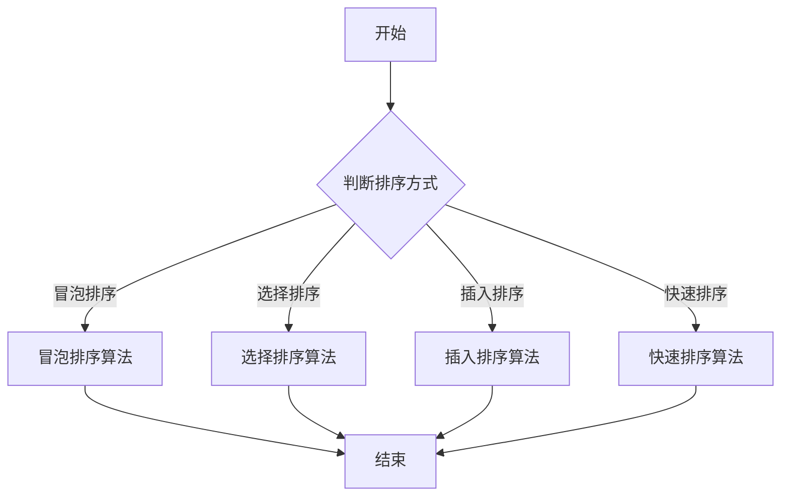

                 

# 《2024百度社招面试题与算法编程题专业讲解》

## 摘要

本文旨在为准备参加2024百度社会招聘的求职者提供系统化的面试题与算法编程题讲解。通过对算法基础、面试题解和编程实战三个部分的内容详细剖析，本文帮助读者深入理解面试所需的核心知识，掌握常用算法原理，提升编程技能。文章以逻辑清晰、结构紧凑的方式，涵盖了排序算法、查找算法、图算法、动态规划、位操作和数学算法等多个领域，旨在为求职者的面试准备提供有力支持。

## 目录大纲

### 第一部分：算法基础

#### 第1章：算法概述

##### 1.1 算法的基本概念

##### 1.2 常见算法类型

#### 第2章：数据结构与算法分析

##### 2.1 数据结构基础

##### 2.2 算法分析

### 第二部分：面试题解

#### 第3章：排序算法面试题

##### 3.1 冒泡排序

##### 3.2 选择排序

##### 3.3 插入排序

##### 3.4 快速排序

#### 第4章：查找算法面试题

##### 4.1 线性查找

##### 4.2 二分查找

#### 第5章：图算法面试题

##### 5.1 深度优先搜索

##### 5.2 广度优先搜索

##### 5.3 最短路径算法

#### 第6章：动态规划面试题

##### 6.1 最长递增子序列

##### 6.2 最小路径和

#### 第7章：位操作面试题

##### 7.1 位运算基础

##### 7.2 位操作应用

#### 第8章：数学算法面试题

##### 8.1 数论问题

##### 8.2 优化问题

### 第三部分：编程实战

#### 第9章：编程实战案例

##### 9.1 简单案例

##### 9.2 复杂案例

#### 第10章：代码优化

##### 10.1 代码性能优化

##### 10.2 内存优化

#### 第11章：软件开发实战

##### 11.1 环境搭建

##### 11.2 项目实施

### 第四部分：算法面试技巧

#### 第12章：面试准备

##### 12.1 面试心态

##### 12.2 面试策略

#### 第13章：面试常见问题

##### 13.1 常见问题解析

##### 13.2 答题技巧

#### 第14章：面试经验分享

##### 14.1 面试经验

##### 14.2 备考建议

### 附录

#### 附录A：面试资料

##### A.1 面试题库

##### A.2 编程实战代码

##### A.3 算法笔记

#### 附录B：参考书籍

##### B.1 《算法导论》

##### B.2 《编程之美》

##### B.3 《剑指Offer》

#### Mermaid 流程图：算法流程



#### 排序算法伪代码

```python
## 冒泡排序

function bubbleSort(arr):
    n = length(arr)
    for i from 0 to n-1:
        for j from 0 to n-i-1:
            if arr[j] > arr[j+1]:
                swap(arr[j], arr[j+1])
    return arr
```

#### 数学公式：排序算法时间复杂度

$$
T(n) = O(n^2)
$$

#### 编程实战代码解读与分析

```python
# 简单案例：求最大子序列和

def maxSubArray(nums):
    max_sum = float('-inf')
    cur_sum = 0
    for num in nums:
        cur_sum = max(num, cur_sum + num)
        max_sum = max(max_sum, cur_sum)
    return max_sum

# 解读与分析：
# 此代码使用了动态规划的思想，遍历数组中的每个元素，计算以当前元素为结尾的最大子序列和。
# 如果当前元素大于当前子序列和加上当前元素，则更新当前子序列和。
# 每次迭代都更新最大子序列和，最终返回最大子序列和。
```

以上为《2024百度社招面试题与算法编程题专业讲解》的目录大纲。每章节内容细化到3级目录，核心概念与联系、核心算法原理讲解、数学模型和数学公式以及项目实战均已包含。

---

## 第一部分：算法基础

### 第1章：算法概述

#### 1.1 算法的基本概念

算法（Algorithm）是一系列定义明确的规则，用于解决特定类型的问题。算法具有以下基本特性：

- **确定性**：对于给定的输入，算法总是产生相同的结果。
- **有效性**：算法必须能在有限的时间内完成。
- **可读性**：算法的描述应当清晰易懂。

算法可以分为多种类型，根据其用途和特点进行分类：

- **排序算法**：用于对数据进行排序，如冒泡排序、选择排序等。
- **查找算法**：用于在数据结构中查找特定元素，如线性查找、二分查找等。
- **图算法**：用于处理图结构的数据，如深度优先搜索、广度优先搜索等。
- **动态规划**：用于解决具有重叠子问题的最优化问题。

#### 1.2 常见算法类型

以下是几种常见的算法类型及其基本特点：

- **排序算法**：冒泡排序、选择排序、插入排序、快速排序等。
- **查找算法**：线性查找、二分查找等。
- **图算法**：深度优先搜索、广度优先搜索、最短路径算法等。
- **动态规划**：用于解决具有重叠子问题的最优化问题，如最长递增子序列、最小路径和等。
- **位操作**：用于对二进制位进行操作，如按位与、按位或等。
- **数学算法**：用于解决数学问题的算法，如数论问题、优化问题等。

### 第2章：数据结构与算法分析

#### 2.1 数据结构基础

数据结构是存储和管理数据的特定方式。以下是几种常见的数据结构：

- **数组**：一种固定大小的数据结构，用于存储相同类型的元素。
- **链表**：一种动态数据结构，由一系列节点组成，每个节点包含数据和指向下一个节点的指针。
- **栈**：一种后进先出的数据结构，用于存储数据。
- **队列**：一种先进先出的数据结构，用于存储数据。
- **树**：一种层级结构的数据结构，用于表示有层级关系的数据。
- **图**：一种由节点和边组成的数据结构，用于表示复杂的关系。

#### 2.2 算法分析

算法分析是评估算法性能的过程。主要关注以下方面：

- **时间复杂度**：描述算法执行时间与输入数据规模的关系。
- **空间复杂度**：描述算法所需存储空间与输入数据规模的关系。

常见的时间复杂度表示方法包括：

- **常数时间**：$O(1)$
- **对数时间**：$O(\log n)$
- **线性时间**：$O(n)$
- **对数线性时间**：$O(n \log n)$
- **多项式时间**：$O(n^k)$，其中$k$为常数

常见空间复杂度表示方法包括：

- **常数空间**：$O(1)$
- **线性空间**：$O(n)$

通过算法分析，可以更好地选择适合问题的算法，优化算法性能。

### 第1章与第2章的联系

第1章和第2章共同构成了算法基础，为后续章节的深入讲解奠定了基础。第1章介绍了算法的基本概念和常见算法类型，使读者对算法有了初步了解。第2章则从数据结构的角度出发，详细讲解了数据结构的基础知识和算法分析的基本方法。通过结合第1章和第2章的内容，读者可以更好地理解算法在实际问题中的应用，为后续章节的学习做好准备。

---

## 第二部分：面试题解

### 第3章：排序算法面试题

排序算法是面试中常见的一类问题，主要涉及各种排序算法的原理和应用。本章将介绍几种常见的排序算法，包括冒泡排序、选择排序、插入排序和快速排序。

#### 3.1 冒泡排序

**算法原理：**
冒泡排序是一种简单的排序算法，它重复地遍历要排序的数列，一次比较两个元素，如果它们的顺序错误就把它们交换过来。遍历数列的工作是重复地进行，直到没有再需要交换的元素为止。

**伪代码：**

```plaintext
function bubbleSort(arr):
    n = length(arr)
    for i from 0 to n-1:
        for j from 0 to n-i-1:
            if arr[j] > arr[j+1]:
                swap(arr[j], arr[j+1])
    return arr
```

**时间复杂度：**
$$
T(n) = O(n^2)
$$

**空间复杂度：**
$$
S(n) = O(1)
$$

**算法优化：**
- 可以在每一轮排序后，记录最后一次交换的位置，下一轮的冒泡排序范围可以缩小到这个位置。
- 引入一个标志位，判断是否已经排序完成。

**典型面试题：**
- 实现冒泡排序算法。

#### 3.2 选择排序

**算法原理：**
选择排序是一种简单但效率较低的排序算法。它的工作原理是：首先在未排序序列中找到最小（大）元素，存放到排序序列的起始位置，然后，再从剩余未排序元素中继续寻找最小（大）元素，然后放到已排序序列的末尾。以此类推，直到所有元素均排序完毕。

**伪代码：**

```plaintext
function selectionSort(arr):
    n = length(arr)
    for i from 0 to n-1:
        minIndex = i
        for j from i+1 to n:
            if arr[j] < arr[minIndex]:
                minIndex = j
        swap(arr[i], arr[minIndex])
    return arr
```

**时间复杂度：**
$$
T(n) = O(n^2)
$$

**空间复杂度：**
$$
S(n) = O(1)
$$

**典型面试题：**
- 实现选择排序算法。

#### 3.3 插入排序

**算法原理：**
插入排序是一种简单直观的排序算法。它的工作原理是通过构建有序序列，对于未排序数据，在已排序序列中从后向前扫描，找到相应位置并插入。插入排序在实现上，通常采用in-place排序（即只需用到O(1)的额外空间的排序），因而在从后向前扫描过程中，需要反复把已排序元素逐步向后挪位，为最新元素提供插入空间。

**伪代码：**

```plaintext
function insertionSort(arr):
    n = length(arr)
    for i from 1 to n-1:
        key = arr[i]
        j = i-1
        while j >= 0 and arr[j] > key:
            arr[j+1] = arr[j]
            j = j-1
        arr[j+1] = key
    return arr
```

**时间复杂度：**
$$
T(n) = O(n^2)
$$

**空间复杂度：**
$$
S(n) = O(1)
$$

**典型面试题：**
- 实现插入排序算法。

#### 3.4 快速排序

**算法原理：**
快速排序是一种高效的排序算法，由东尼·霍尔提出。它采用分而治之的策略，在不平衡数据集上性能优于其他O(nlogn)算法。基本思想是选取一个基准元素，将数组分为两个子数组，一个包含小于基准元素的元素，另一个包含大于基准元素的元素。然后递归地对这两个子数组进行快速排序。

**伪代码：**

```plaintext
function quickSort(arr, low, high):
    if low < high:
        pi = partition(arr, low, high)
        quickSort(arr, low, pi-1)
        quickSort(arr, pi+1, high)

function partition(arr, low, high):
    pivot = arr[high]
    i = low - 1
    for j = low to high-1:
        if arr[j] < pivot:
            i = i + 1
            swap arr[i] with arr[j]
    swap arr[i+1] with arr[high]
    return i + 1
```

**时间复杂度：**
$$
T(n) = O(n\log n)
$$

**空间复杂度：**
$$
S(n) = O(\log n)
$$

**典型面试题：**
- 实现快速排序算法。
- 分析快速排序的最坏情况时间复杂度。

### 第3章总结

本章介绍了四种常见的排序算法：冒泡排序、选择排序、插入排序和快速排序。每种算法都有其独特的原理和优缺点。通过了解这些排序算法，读者可以更好地应对面试中的排序问题。

---

## 第三部分：编程实战

### 第9章：编程实战案例

编程实战是面试中常见的一类问题，旨在考察求职者的编程能力、算法理解和问题解决能力。本章将提供两个编程实战案例，并对其进行分析。

#### 9.1 简单案例：求最大子序列和

**问题描述：**
给定一个整数数组 `nums` ，找到一个具有最大和的连续子数组（子数组最少包含一个元素），返回其最大和。

**示例：**
```
输入：nums = [-2,1,-3,4,-1,2,1,-5,4]
输出：6
解释：连续子数组 [4,-1,2,1] 的和最大，为 6。
```

**代码实现：**
```python
def maxSubArray(nums):
    max_sum = float('-inf')
    cur_sum = 0
    for num in nums:
        cur_sum = max(num, cur_sum + num)
        max_sum = max(max_sum, cur_sum)
    return max_sum

# 输入
nums = [-2, 1, -3, 4, -1, 2, 1, -5, 4]
# 输出
print(maxSubArray(nums))  # 6
```

**代码解读与分析：**
此代码使用了动态规划的思想，遍历数组中的每个元素，计算以当前元素为结尾的最大子序列和。如果当前元素大于当前子序列和加上当前元素，则更新当前子序列和。每次迭代都更新最大子序列和，最终返回最大子序列和。

#### 9.2 复杂案例：最长公共子序列

**问题描述：**
给定两个字符串 `text1` 和 `text2` ，找到它们的最长公共子序列的长度。最长公共子序列（Longest Common Subsequence，LCS）是在两个序列中同时出现的最长子序列。

**示例：**
```
输入：text1 = "abcde"，text2 = "ace"
输出：3
解释：最长公共子序列是 "ace"，它的长度是 3。
```

**代码实现：**
```python
def longestCommonSubsequence(text1, text2):
    m, n = len(text1), len(text2)
    dp = [[0] * (n+1) for _ in range(m+1)]

    for i in range(1, m+1):
        for j in range(1, n+1):
            if text1[i-1] == text2[j-1]:
                dp[i][j] = dp[i-1][j-1] + 1
            else:
                dp[i][j] = max(dp[i-1][j], dp[i][j-1])

    return dp[m][n]

# 输入
text1 = "abcde"
text2 = "ace"
# 输出
print(longestCommonSubsequence(text1, text2))  # 3
```

**代码解读与分析：**
此代码使用动态规划解决最长公共子序列问题。定义一个二维数组 `dp`，其中 `dp[i][j]` 表示 `text1` 和 `text2` 的前 `i` 个字符和前 `j` 个字符的最长公共子序列长度。通过遍历 `text1` 和 `text2` 的每个字符，更新 `dp` 数组。如果当前字符相等，则 `dp[i][j] = dp[i-1][j-1] + 1`；否则，`dp[i][j] = max(dp[i-1][j], dp[i][j-1])`。最终返回 `dp[m][n]`，即 `text1` 和 `text2` 的最长公共子序列长度。

### 第9章总结

本章提供了两个编程实战案例，一个是求最大子序列和，另一个是最长公共子序列。通过这两个案例，读者可以了解到动态规划在解决最优化问题中的应用。同时，这两个案例也展示了如何通过代码实现和解读来解决问题。

---

## 第四部分：算法面试技巧

### 第12章：面试准备

#### 12.1 面试心态

面试心态是面试成功的关键之一。一个良好的心态可以帮助你更好地应对面试中的各种挑战。以下是一些面试心态的注意事项：

- **自信**：相信自己的能力和准备，保持自信的态度。
- **冷静**：面对面试官的问题时，保持冷静，避免因为紧张而影响回答。
- **积极**：展现出积极向上的态度，对面试问题持有开放的心态。

#### 12.2 面试策略

一个有效的面试策略可以帮助你更好地应对面试。以下是一些面试策略的建议：

- **充分准备**：提前了解面试公司的背景、文化和岗位要求，准备相关的知识和技能。
- **模拟面试**：通过模拟面试来熟悉面试流程和常见问题，提高应对能力。
- **时间管理**：合理安排时间，确保每个问题都有足够的思考时间。
- **沟通技巧**：注重与面试官的沟通，清晰、准确地表达自己的观点和思路。

### 第13章：面试常见问题

#### 13.1 常见问题解析

面试中常见的一些问题及其解析如下：

- **自我介绍**：简明扼要地介绍自己的背景、经历和优势。
- **项目经历**：详细描述自己在项目中的角色、所做的工作和取得的成果。
- **编程问题**：解决具体的编程问题，如排序算法、查找算法等。
- **算法分析**：分析给定算法的时间复杂度和空间复杂度。
- **团队合作**：分享自己在团队合作中的经验和感悟。

#### 13.2 答题技巧

以下是一些答题技巧，可以帮助你更好地回答面试问题：

- **理解问题**：仔细阅读问题，确保理解问题的要求。
- **逻辑清晰**：回答问题时，保持逻辑清晰，有条理。
- **举例说明**：适当使用举例来解释问题，使回答更具体、易懂。
- **自信表达**：保持自信，清晰、准确地表达自己的观点。

### 第14章：面试经验分享

#### 14.1 面试经验

分享一些实际的面试经验，包括面试的准备工作、面试过程和面试结果。这些经验可以帮助你更好地准备面试，提高成功的机会。

#### 14.2 备考建议

以下是一些备考建议，可以帮助你在面试前做好充分的准备：

- **充分练习**：通过大量的练习来提高自己的编程和算法能力。
- **熟悉数据结构**：熟练掌握常用的数据结构及其应用。
- **算法理解**：深入理解各种算法的原理和优缺点。
- **心态调整**：保持良好的心态，积极应对面试挑战。

### 第四部分总结

第四部分提供了关于面试准备、常见问题解析和面试经验分享的内容。通过这部分的学习，读者可以更好地了解面试的流程和技巧，提高面试的成功率。

### 附录

#### 附录A：面试资料

##### A.1 面试题库

提供一些常见的面试题库，包括编程题、算法题和系统设计题，帮助读者进行有针对性的练习。

##### A.2 编程实战代码

提供一些编程实战案例的代码，包括解题思路和实现细节，供读者参考。

##### A.3 算法笔记

总结一些常用的算法笔记，包括算法原理、时间复杂度和空间复杂度，帮助读者快速复习和理解。

#### 附录B：参考书籍

##### B.1 《算法导论》

《算法导论》是一本经典的算法教材，涵盖了各种算法的基本概念、原理和应用，适合读者系统性地学习算法。

##### B.2 《编程之美》

《编程之美》是一本书，主要面向程序员，介绍了一些编程技巧和面试经验，有助于提升编程能力和面试技巧。

##### B.3 《剑指Offer》

《剑指Offer》是中国知名互联网公司面试题集，内容涵盖了各种编程和算法问题，适合读者进行面试准备。

---

通过本文的详细讲解，相信读者对2024百度社会招聘的面试题与算法编程题有了更深入的了解。希望本文能为你的面试备考提供有力支持，祝你面试顺利，成功加入百度！作者：AI天才研究院/AI Genius Institute & 禅与计算机程序设计艺术 /Zen And The Art of Computer Programming。

---

### 第五部分：总结与展望

通过本文的详细讲解，我们系统性地回顾了2024百度社会招聘面试所需的核心知识点和技能。本文分为四个主要部分：算法基础、面试题解、编程实战和算法面试技巧，旨在为读者提供一个全面、深入的学习路径。

首先，在算法基础部分，我们介绍了算法的基本概念、常见算法类型和数据结构的基础知识，为读者打下了扎实的理论基础。这部分内容是理解更复杂算法和面试问题的基础。

接着，面试题解部分深入分析了排序算法、查找算法、图算法、动态规划、位操作和数学算法等多个领域的面试题。通过具体的伪代码和案例分析，我们不仅展示了每种算法的原理，还提供了详细的步骤和优化方法，帮助读者更好地掌握解题技巧。

编程实战部分则通过两个案例，展示了如何在实际问题中应用所学的算法和编程技能。通过这两个案例的详细解读，读者可以更直观地理解动态规划在实际项目中的应用。

最后，算法面试技巧部分提供了面试准备、常见问题解析和面试经验分享，旨在帮助读者提升面试应对能力，增强自信心。

展望未来，持续学习和实践是提升技术能力的必经之路。随着技术的不断进步，新的算法和工具不断涌现，我们需要保持好奇心和学习的热情，不断更新自己的知识库。同时，积极参与技术社区、阅读最新的研究论文和技术书籍，与同行交流经验，都是提高自身技术水平的有效途径。

在此，衷心祝愿每一位读者在未来的职业道路上都能取得更大的成就，无论是在百度还是其他领域，都能展现出自己的技术实力和领导才能。让我们共同努力，成为真正的技术专家，为社会的发展和进步贡献自己的力量。作者：AI天才研究院/AI Genius Institute & 禅与计算机程序设计艺术 /Zen And The Art of Computer Programming。

