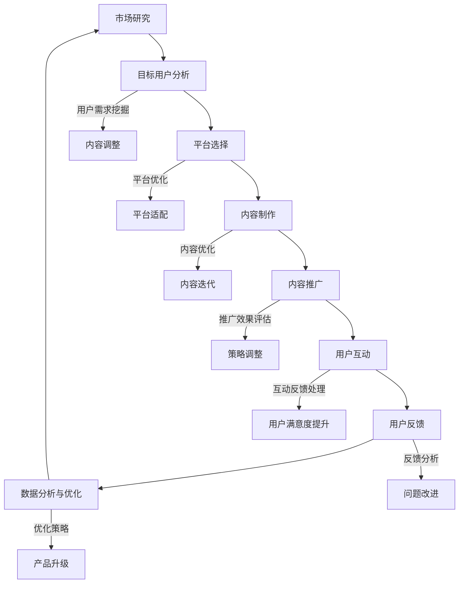

                 

### 引言

随着互联网技术的飞速发展和移动互联网的普及，知识付费产业在近年来取得了迅猛的发展。知识付费，简单来说，就是用户为获取有价值的信息或知识内容而支付费用的一种商业模式。这种模式不仅改变了传统的内容消费方式，也为内容创作者提供了新的收入来源。

本文将围绕知识付费产品的跨平台分发策略展开讨论。跨平台分发，顾名思义，是指将知识付费产品在不同的平台之间进行推广和分发。在当前多平台竞争的环境下，如何有效地进行跨平台分发，已经成为知识付费产品成功的关键因素之一。

首先，我们将探讨知识付费产业的兴起背景和驱动力。随着人们对知识和技能需求的增加，以及互联网技术的进步，知识付费产品应运而生。从早期的线上教育课程到现在的各种专业知识和技能分享，知识付费产品的发展历程反映了用户对高质量知识内容的渴求。

接着，我们将详细分析知识付费产品在当前市场环境中的重要性。知识付费不仅对个人的职业发展有推动作用，也对教育产业产生了深远的影响，同时为内容创作者提供了新的发展空间。

最后，本文将重点讨论跨平台分发的概念与挑战。跨平台分发具有增加用户覆盖范围、提高用户黏性和增强品牌影响力等优势，但同时也面临着平台规则多样性、技术兼容性问题和数据隐私与安全等挑战。通过对这些问题的深入分析，我们将为知识付费产品提供有效的跨平台分发策略。

本文将分为三大部分进行详细阐述：

1. **引言与概述**：介绍知识付费产业的兴起背景、发展历程和重要性。
2. **跨平台分发策略**：分析市场研究与目标用户分析、平台选择与优化、内容制作与推广、用户互动与反馈、数据分析与优化。
3. **案例分析**：通过成功和失败案例，提供实践中的经验和教训。

通过本文的逐步分析，我们希望能够为知识付费产品的跨平台分发提供系统化的策略和实用的指导。

---

### 关键词

知识付费、跨平台分发、内容推广、用户互动、数据分析、平台优化。

### 摘要

本文旨在探讨知识付费产品的跨平台分发策略，分析其在当前市场环境中的重要性以及面临的挑战。通过深入的市场研究和目标用户分析，结合各大知识付费平台的特点，本文提出了有效的跨平台分发策略。具体包括内容制作与推广、用户互动与反馈、数据分析与优化等方面。通过案例分析，本文总结出成功和失败的经验与教训，为知识付费产品的跨平台分发提供实践指导和策略建议。

---

### 《知识付费产品的跨平台分发策略》目录大纲

为了帮助读者系统地了解知识付费产品的跨平台分发策略，本文将按照以下目录大纲进行结构化的内容呈现：

#### 第一部分：引言与概述

**第1章：知识付费产业的兴起**

- **1.1 背景与驱动力**
- **1.2 知识付费产品的发展历程**
- **1.3 知识付费产品的重要性**

**第2章：跨平台分发的概念与挑战**

- **2.1 跨平台分发的定义**
- **2.2 跨平台分发的优势**
- **2.3 跨平台分发的挑战**

#### 第二部分：跨平台分发策略

**第3章：市场研究与目标用户分析**

- **3.1 市场研究的方法**
- **3.2 目标用户分析**
- **3.3 用户需求的挖掘**

**第4章：平台选择与优化**

- **4.1 平台选择的考虑因素**
- **4.2 各大平台的特点与适用性**
- **4.3 平台优化的策略**

**第5章：内容制作与推广**

- **5.1 内容制作的原则**
- **5.2 内容形式的多样化**
- **5.3 推广策略与执行**

**第6章：用户互动与反馈**

- **6.1 用户互动的策略**
- **6.2 用户反馈的处理**
- **6.3 用户评价系统**

**第7章：数据分析与优化**

- **7.1 数据分析的重要性**
- **7.2 数据分析的方法**
- **7.3 优化策略的制定与实施**

#### 第三部分：案例分析

**第8章：成功案例分享**

- **8.1 案例背景与目标**
- **8.2 案例实施过程**
- **8.3 案例结果与启示**

**第9章：失败案例分析**

- **9.1 失败原因分析**
- **9.2 启示与改进措施**

**第10章：未来发展趋势**

- **10.1 行业发展趋势**
- **10.2 技术进步的影响**
- **10.3 未来发展方向**

#### 附录

**附录A：知识付费产品跨平台分发工具与资源**

- **A.1 主流知识付费平台介绍**
- **A.2 跨平台分发技术栈**
- **A.3 开源工具与框架**

**附录B：知识付费产品跨平台分发流程图**

**附录C：参考文献与推荐阅读**

- **C.1 相关书籍推荐**
- **C.2 学术论文推荐**
- **C.3 常见问题FAQ**

通过以上目录结构，本文将全面深入地探讨知识付费产品的跨平台分发策略，希望能够为从业者和研究者提供有价值的参考和指导。

---

### 第1章：知识付费产业的兴起

#### 1.1 背景与驱动力

知识付费产业的兴起可以追溯到互联网技术的飞速发展和移动互联网的普及。随着智能手机的广泛使用和移动互联网的普及，用户获取信息和知识的渠道变得更加便捷。同时，互联网技术的发展也为知识付费产业提供了丰富的技术和工具支持，例如在线支付、社交媒体、大数据分析等。

知识付费产业的驱动力主要包括以下几个方面：

1. **用户需求增长**：随着经济的发展和社会的进步，人们对知识和技能的需求不断增加。无论是在职业发展中，还是个人兴趣提升，用户都希望能够获取到高质量的知识内容。知识付费模式恰好满足了这一需求，用户可以通过支付费用来获取有价值的信息。

2. **内容创作者崛起**：互联网为内容创作者提供了广阔的舞台，他们可以通过各种平台展示自己的知识或技能。知识付费模式为内容创作者提供了新的收入来源，激励了更多的高质量内容创作。

3. **商业模式创新**：知识付费产业的出现，不仅改变了传统的内容消费模式，也为企业带来了新的商业模式。企业可以通过知识付费产品来拓展业务范围，提升品牌影响力。

4. **技术进步**：互联网技术的进步，特别是大数据、人工智能等技术的应用，为知识付费产业提供了强大的技术支撑。通过数据分析，企业可以更好地了解用户需求，优化内容制作和推广策略。

#### 1.2 知识付费产品的发展历程

知识付费产品的发展历程可以分为几个阶段：

1. **早期阶段**：最早的付费知识产品可以追溯到20世纪末的线上教育和电子书籍。随着互联网的发展，线上教育和电子书籍开始逐渐普及，用户可以通过网络购买和阅读。

2. **快速发展阶段**：2010年以后，随着移动互联网的兴起，知识付费产品迎来了快速发展期。各类在线学习平台、知识分享社区、专业讲座等知识付费产品层出不穷，用户可以通过这些平台获取到多样化的知识内容。

3. **成熟阶段**：近年来，知识付费产品已经进入成熟阶段。随着技术的不断进步，知识付费产品在内容质量、用户体验、平台服务等方面都有了显著提升。同时，知识付费产品也逐渐形成了自己的商业模式和生态体系。

#### 1.3 知识付费产品的重要性

知识付费产品在当前市场中具有重要的地位和作用，主要表现在以下几个方面：

1. **推动个人职业发展**：知识付费产品为个人提供了学习和发展机会，帮助用户提升专业技能和职业素养，从而在职场中获得更好的发展。

2. **促进教育产业发展**：知识付费产品的出现，改变了传统教育的模式，推动了在线教育和远程教育的快速发展。这不仅为教育产业带来了新的增长点，也为更多用户提供了便捷的学习途径。

3. **支持内容创作者**：知识付费模式为内容创作者提供了稳定的收入来源，激励了更多的高质量内容创作。同时，知识付费产品也为内容创作者提供了展示才华和影响力的平台。

4. **丰富知识传播形式**：知识付费产品不仅包括传统的文本、图片、音频等形式，还引入了视频、互动问答、直播等多种形式，极大地丰富了知识传播的形式和手段。

通过以上分析，我们可以看到，知识付费产业在当前市场中具有重要的地位和作用。随着技术的不断进步和用户需求的持续增长，知识付费产业将继续保持快速发展态势。

---

### 第2章：跨平台分发的概念与挑战

#### 2.1 跨平台分发的定义

跨平台分发，指的是将知识付费产品在不同平台之间进行推广和分发的过程。在现代互联网环境中，各大平台如社交网络、电子商务平台、在线教育平台等各自拥有庞大的用户群体。通过跨平台分发，知识付费产品可以触及更广泛的用户群体，提高产品知名度和用户覆盖范围。

跨平台分发不仅仅是简单地复制内容到不同平台，而是一个复杂的过程，涉及到内容适配、用户行为分析、数据同步等多个环节。其核心目标是确保在不同平台上，用户能够获得一致且优质的体验。

#### 2.2 跨平台分发的优势

跨平台分发具有多方面的优势：

1. **增加用户覆盖范围**：通过在不同的平台上分发产品，知识付费产品可以触达更多潜在用户，从而扩大市场占有率。

2. **提高用户黏性**：跨平台分发可以让用户在多个平台上获取内容，提高用户对产品的依赖度和忠诚度。

3. **增强品牌影响力**：在不同的平台上进行分发，有助于提高品牌知名度和品牌形象，从而增强用户对品牌的信任。

4. **多样化推广渠道**：跨平台分发提供了多种推广渠道，如社交媒体广告、搜索引擎优化、平台内部推广等，有利于制定全面而高效的营销策略。

#### 2.3 跨平台分发的挑战

尽管跨平台分发具有显著的优势，但同时也面临着诸多挑战：

1. **平台规则多样性**：不同平台对内容发布、推广和运营有着不同的规则和要求。例如，一些平台对内容版权保护有严格的要求，而另一些平台则更注重用户体验。这些差异使得跨平台分发需要适应不同的规则，增加了运营难度。

2. **技术兼容性问题**：知识付费产品在不同平台之间分发时，可能会遇到技术兼容性问题。例如，不同的操作系统、浏览器或设备可能会对内容的展示效果产生影响，需要确保在不同平台上内容的一致性和兼容性。

3. **数据隐私和安全**：跨平台分发涉及大量用户数据，包括用户行为数据、购买记录等。如何确保这些数据的安全和隐私，是跨平台分发面临的一大挑战。

4. **内容质量一致性**：在不同平台上，用户对内容的质量和体验有着不同的期望。如何确保内容在不同平台上一致且高质量，是一个需要持续关注和优化的问题。

5. **用户流失风险**：在跨平台分发过程中，用户可能会在不同平台之间分散，导致用户流失。如何保持用户的持续关注和活跃度，是跨平台分发需要解决的另一个挑战。

通过对跨平台分发的概念和挑战的详细分析，我们可以看到，虽然跨平台分发带来了诸多机遇，但同时也伴随着一系列的挑战。只有在充分了解这些挑战并采取有效策略的情况下，知识付费产品才能实现跨平台分发的成功。

---

### 第3章：市场研究与目标用户分析

#### 3.1 市场研究的方法

市场研究是知识付费产品跨平台分发策略制定的重要基础。通过系统化的市场研究，企业可以了解市场需求、用户行为以及竞争对手的动态，从而制定出更加精准的分发策略。以下是市场研究的主要方法：

1. **问卷调查**：问卷调查是一种常用的市场研究方法，可以通过线上或线下的方式收集用户对知识付费产品的态度、需求和建议。问卷设计需要科学合理，涵盖用户的基本信息、购买行为、满意度等多个方面，以提高数据的有效性和可靠性。

2. **访谈**：访谈分为深度访谈和焦点小组访谈两种形式。深度访谈适用于了解用户的详细需求和行为动机，而焦点小组访谈则可以快速收集多个用户的反馈和意见。访谈过程中，研究人员的引导和提问技巧对收集到的高质量数据至关重要。

3. **数据分析**：通过数据分析，可以对用户行为数据、销售数据等进行分析，挖掘用户的偏好和行为模式。常用的数据分析工具有Excel、SPSS、R等，通过这些工具可以生成各种图表和报告，帮助企业更好地理解市场趋势。

4. **竞品分析**：竞品分析是了解竞争对手产品、市场定位和营销策略的重要手段。通过分析竞争对手的产品特点、用户评价和市场表现，企业可以找到自身的优势和差距，并针对性地优化自己的产品和服务。

5. **行业报告**：行业报告提供了行业整体的发展趋势、市场规模、竞争格局等宏观信息，是企业制定跨平台分发策略的重要参考。这些报告通常由专业的市场研究机构发布，具有较高的权威性和可靠性。

#### 3.2 目标用户分析

目标用户分析是市场研究中的一个关键环节，明确目标用户群体有助于企业更有针对性地进行内容制作和推广。以下是进行目标用户分析的主要步骤：

1. **用户画像**：用户画像是对目标用户的基本特征进行描述，包括年龄、性别、职业、教育程度、收入水平等。通过用户画像，企业可以了解目标用户的基本属性，为后续的内容制作和推广提供参考。

2. **用户需求分析**：用户需求分析旨在了解目标用户对知识付费产品的需求，包括他们最关心的知识点、学习目标、学习方式等。通过用户需求分析，企业可以制定出更符合用户需求的内容策略。

3. **用户行为分析**：用户行为分析是对用户在使用知识付费产品过程中的行为进行跟踪和分析，包括用户的浏览记录、购买行为、互动情况等。通过用户行为分析，企业可以了解用户的偏好和痛点，从而优化产品和服务。

4. **用户满意度调查**：通过用户满意度调查，企业可以了解用户对知识付费产品的整体满意度和具体方面（如内容质量、用户体验、价格等）的评价。这有助于企业识别和改进不足之处，提升用户满意度。

#### 3.3 用户需求的挖掘

用户需求的挖掘是跨平台分发策略制定的核心，以下是几种常见的用户需求挖掘方法：

1. **焦点小组讨论**：通过组织焦点小组讨论，将目标用户聚集在一起，让他们就知识付费产品的各个方面进行讨论和反馈。这种方法可以快速收集到用户的真实想法和建议。

2. **社交媒体监测**：通过监测社交媒体平台上的用户讨论和反馈，企业可以实时了解用户的意见和需求。这种方法不仅能够获取大量用户反馈，还可以帮助企业发现潜在的市场机会。

3. **用户调研问卷**：设计有针对性的用户调研问卷，通过线上或线下方式分发，收集用户对知识付费产品的需求和意见。问卷的设计需要简明扼要，确保用户愿意填写并真实回答。

4. **用户行为数据挖掘**：通过分析用户在平台上的行为数据，如浏览时长、购买频率、互动情况等，挖掘用户的潜在需求和行为模式。这种方法需要借助数据分析工具和算法，对大量数据进行处理和分析。

通过以上市场研究和目标用户分析的方法，企业可以全面了解市场状况和用户需求，从而制定出更加科学和有效的跨平台分发策略。这不仅有助于提升知识付费产品的市场竞争力和用户满意度，也为企业的长期发展奠定了坚实的基础。

---

### 第4章：平台选择与优化

#### 4.1 平台选择的考虑因素

在选择知识付费产品的分发平台时，企业需要综合考虑多个因素，以确保所选平台能够最大程度地促进产品的传播和销售。以下是平台选择的主要考虑因素：

1. **用户规模**：用户规模是平台选择的首要考虑因素。用户规模大的平台意味着有更多的潜在用户，可以有效地增加产品的曝光率和销售量。例如，国内知名平台如淘宝课堂、网易云课堂和腾讯课堂等，拥有庞大的用户基础。

2. **活跃度**：平台的活跃度决定了用户在平台上的活跃程度和互动频率。高活跃度的平台通常有更频繁的内容更新和更积极的用户参与，有助于提升产品的用户黏性和口碑。因此，选择活跃度较高的平台至关重要。

3. **收费政策**：不同平台的收费政策不同，包括佣金比例、广告费用等。企业需要根据自己的预算和利润目标，选择收费合理、性价比高的平台。同时，需要了解各平台的具体收费标准和结算方式，以便更好地进行财务规划。

4. **内容生态**：内容生态是指平台上的内容类型、质量和数量。一个良好的内容生态不仅能够提供多样化的知识内容，还能保证内容的质量和用户价值。企业应选择内容生态丰富、质量较高的平台，以提升产品的竞争力。

5. **用户属性**：用户属性包括用户的年龄、职业、兴趣爱好等。选择与目标用户属性相匹配的平台，可以更精准地触达潜在用户，提高营销效果。例如，对于职场技能类知识付费产品，选择职业类社交平台会更加合适。

6. **平台规则**：各平台对内容发布、推广和运营有着不同的规则。企业需要了解并遵守平台规则，以确保产品的合规性。同时，平台规则的变化也可能影响产品的分发策略，需要密切关注并灵活调整。

7. **推广资源**：一些平台提供了丰富的推广资源，如推荐位、广告投放、用户导流等。企业可以利用这些资源来提高产品的曝光率和用户转化率。因此，平台是否提供有利的推广资源也是选择平台的重要考量因素。

#### 4.2 各大平台的特点与适用性

以下是当前几种主要知识付费平台的详细特点及其适用性分析：

1. **淘宝课堂**

   - **特点**：淘宝课堂是淘宝旗下的知识付费平台，以其庞大的用户基础和成熟的电商生态系统而著称。平台提供丰富的课程资源，包括职业技能、兴趣爱好、亲子教育等多个类别。

   - **适用性**：淘宝课堂适合那些希望通过电商平台推广知识付费产品的企业，尤其是在职业技能培训和兴趣爱好类产品方面。淘宝课堂的电商属性有助于将用户转化为购买者，提高销售转化率。

2. **网易云课堂**

   - **特点**：网易云课堂是网易旗下的在线教育平台，以高质量的教育内容和技术支持而闻名。平台提供丰富的课程资源，涵盖编程、设计、语言等多个领域。

   - **适用性**：网易云课堂适合那些提供技术类和学术类知识付费产品的企业，特别是编程、设计、外语等领域。网易云课堂的技术背景和用户基础为其产品提供了良好的推广和销售环境。

3. **腾讯课堂**

   - **特点**：腾讯课堂依托腾讯强大的社交网络和用户基础，提供多样化的课程资源，包括职场技能、兴趣爱好、亲子教育等。平台还提供了丰富的互动工具和社区功能，增强用户黏性。

   - **适用性**：腾讯课堂适合那些希望借助社交网络推广知识付费产品的企业，特别是在职场技能培训和亲子教育方面。腾讯课堂的社交属性有助于提高用户的参与度和口碑传播。

4. **喜马拉雅**

   - **特点**：喜马拉雅是中国领先的音频分享平台，提供海量的音频课程和内容，包括有声书、讲座、广播剧等多种形式。平台用户基数庞大，以年轻人为主要用户群体。

   - **适用性**：喜马拉雅适合那些以音频形式呈现知识付费产品的企业，特别是在有声书、讲座和广播剧等领域。喜马拉雅的音频属性和用户基础为其产品提供了广泛的传播渠道和良好的用户互动体验。

5. **知乎Live**

   - **特点**：知乎Live是知乎推出的知识付费直播平台，以专业知识和深度讨论为特色。平台聚集了大量专业人士和意见领袖，提供高质量的知识分享和互动交流。

   - **适用性**：知乎Live适合那些提供专业知识和深度讨论类知识付费产品的企业，特别是在专业领域和行业分析方面。知乎Live的权威性和专业度有助于提升产品的信誉和用户满意度。

通过以上对各知识付费平台特点与适用性的详细分析，企业可以根据自身产品的特点和目标用户属性，选择最合适的平台进行跨平台分发。同时，企业还需要结合平台的具体规则和推广资源，制定出切实可行的分发策略，以实现知识付费产品的最大化传播和销售。

---

### 第4章：平台选择与优化

#### 4.3 平台优化的策略

在确定了合适的知识付费平台后，如何对这些平台进行优化，以提高用户黏性和转化率，是跨平台分发策略中至关重要的一环。以下是一些具体的平台优化策略：

1. **内容格式适配**：不同平台对内容展示的形式和格式有不同的要求。为了确保知识付费产品在不同平台上都能提供良好的用户体验，企业需要对内容进行适配。例如，在视频平台如Bilibili上，视频内容和动画效果可能更为重要；而在图文类平台如知乎上，高质量的图文内容和互动问答则更为关键。通过分析各平台的特点，优化内容格式，可以使产品在各个平台上都能吸引更多的用户。

2. **SEO（搜索引擎优化）**：搜索引擎优化是提高知识付费产品在平台内外曝光度的有效手段。通过优化标题、关键词、描述等，可以提高产品在搜索引擎中的排名，从而吸引更多潜在用户。例如，在淘宝课堂上，合理使用关键词和标签，可以增加产品在搜索结果中的曝光率。此外，通过外部链接导入，如在自己的官方网站或博客上提及和推荐产品，也可以提高产品的搜索排名。

3. **用户反馈机制**：用户反馈是优化知识付费产品的重要依据。企业应积极收集用户的反馈意见，包括内容质量、用户体验、购买流程等。通过分析这些反馈，企业可以发现产品中的不足之处，并及时进行调整和改进。例如，针对用户反映的购买流程繁琐问题，企业可以优化购买界面，简化购买流程，提高用户满意度。

4. **社交媒体营销**：社交媒体是知识付费产品推广的重要渠道。通过在微信、微博、抖音等社交媒体平台上发布相关内容，可以吸引更多的用户关注和参与。例如，在微信朋友圈发布课程优惠信息，或是在抖音上发布教学视频，都可以有效提高产品的知名度和转化率。此外，与KOL（关键意见领袖）合作，利用他们的影响力推广产品，也是一种有效的社交媒体营销策略。

5. **平台内部推广**：各大知识付费平台通常都提供了丰富的推广资源，如推荐位、广告投放、用户导流等。企业可以利用这些资源，提高产品的曝光率和用户转化率。例如，在网易云课堂，可以通过购买广告位或参加平台的活动，增加产品的曝光率。此外，积极参与平台的社区互动，如回答用户提问、参与话题讨论等，也有助于提高产品的知名度和用户黏性。

6. **跨平台联动**：通过在多个平台之间建立联动关系，可以扩大产品的传播范围和用户覆盖面。例如，在一个平台上的课程成功后，可以将相关信息和优惠链接分享到其他平台，吸引更多用户购买。此外，通过多平台数据的整合和分析，可以更全面地了解用户行为和需求，从而制定更加精准的分发策略。

7. **数据分析与优化**：数据分析是平台优化的重要手段。通过分析用户行为数据、销售数据等，企业可以了解产品的表现和用户的反馈，找出优化点并进行调整。例如，通过分析用户购买流程的数据，可以发现用户在哪个环节流失，从而针对性地进行优化。此外，通过A/B测试，企业可以测试不同优化策略的效果，选择最有效的方案进行推广。

通过以上平台优化策略的执行，企业可以有效地提高知识付费产品的用户黏性和转化率，实现跨平台分发的成功。同时，企业还需要不断监测和评估优化效果，及时调整策略，以适应市场变化和用户需求。

---

### 第5章：内容制作与推广

#### 5.1 内容制作的原则

知识付费产品的内容制作是跨平台分发成功的关键环节。为了确保内容的吸引力、专业性和实用性，企业需要遵循以下原则：

1. **质量优先**：内容质量是吸引用户的核心。企业应确保内容的专业性和准确性，避免信息错误和内容空洞。高质量的内容能够提高用户的满意度和忠诚度，从而促进产品的持续传播和销售。

2. **针对性**：内容制作应针对目标用户群体，满足他们的特定需求和兴趣。通过深入分析用户画像和需求，企业可以定制化内容，提高内容的针对性和用户参与度。

3. **多样性**：内容形式应多样化，包括文本、图片、视频、音频等多种形式。多样化的内容能够满足不同用户的偏好，提高内容的传播力和影响力。

4. **互动性**：内容应具备互动性，鼓励用户参与和反馈。例如，设置问答环节、互动讨论区等，可以增强用户对内容的兴趣和粘性，促进用户与内容创作者之间的互动。

5. **更新频率**：保持内容的更新频率，可以维持用户的持续关注和活跃度。定期发布新的内容，不仅可以吸引新用户，还可以留住老用户。

6. **简洁明了**：内容应简洁明了，避免冗长和复杂。清晰的结构和简练的语言能够提高用户的阅读效率和体验。

7. **易传播性**：内容应设计得易于传播，方便用户分享到社交媒体或其他平台。通过设置分享按钮、提供有趣的内容标题和摘要，可以增加内容的传播范围。

#### 5.2 内容形式的多样化

知识付费产品的内容形式多样化，能够满足不同用户的需求和偏好。以下是几种常见的内容形式：

1. **视频课程**：视频课程是知识付费产品中的一种重要形式，尤其适合技能培训、教育课程等。视频课程可以通过详细的讲解、互动演示等方式，帮助用户更好地理解和掌握知识。

2. **图文教程**：图文教程适合需要详细步骤说明和案例分析的知识内容。通过图片、图表和文字的结合，可以使内容更加直观和易于理解。

3. **音频讲座**：音频讲座适合那些希望随时随地进行学习的用户。音频讲座可以提供专业的知识分享和深度讨论，尤其适合在通勤、锻炼等场景中使用。

4. **互动问答**：互动问答是一种互动性很强的内容形式，能够即时解答用户的问题，增强用户参与感和满意度。问答环节还可以促进内容的二次传播和用户口碑的建立。

5. **数据可视化**：数据可视化通过图表、图形等方式，将复杂的统计数据转化为易于理解的视觉信息，适合数据分析、市场研究等领域。

6. **直播授课**：直播授课是一种实时互动的教学形式，能够提供即时反馈和互动体验。直播授课适合那些需要即时互动和专业指导的知识内容。

通过多样化内容形式的结合，知识付费产品可以更全面地满足用户需求，提高用户的满意度和忠诚度。

#### 5.3 推广策略与执行

有效的推广策略是知识付费产品跨平台分发成功的关键。以下是一些常见的推广策略和执行方法：

1. **社交媒体营销**：通过在微信、微博、抖音等社交媒体平台上发布相关内容，可以吸引更多用户关注和参与。例如，发布课程亮点、用户评价、学习心得等，可以增加用户对产品的兴趣。

2. **KOL（关键意见领袖）合作**：与领域内的KOL合作，利用他们的影响力和粉丝基础，推广产品。KOL可以撰写推荐文章、发布测评视频或举办线上活动，有效提高产品的曝光率和可信度。

3. **广告投放**：通过在各大平台投放广告，如百度广告、抖音广告、小红书广告等，可以快速扩大产品的受众范围。广告投放应根据目标用户群体的特征进行精准定位，提高广告的点击率和转化率。

4. **内容合作**：与其他内容平台或媒体进行内容合作，如在知乎、简书等平台发布专业文章，或在行业媒体发布新闻稿，可以增加内容的曝光度和传播范围。

5. **用户推荐**：通过用户推荐机制，鼓励现有用户推荐新用户购买产品。例如，设置推荐奖励、返利等机制，可以激励用户积极参与推广。

6. **线上线下活动**：举办线上线下活动，如线下讲座、线上直播、用户见面会等，可以增加用户的参与感和品牌影响力。通过这些活动，不仅可以推广产品，还可以增强用户与品牌之间的互动和信任。

7. **SEO（搜索引擎优化）**：通过优化标题、关键词、描述等，提高产品在搜索引擎中的排名，从而吸引更多自然流量。此外，通过建立外部链接导入，如在自己的官方网站或博客上提及和推荐产品，也可以提高产品的搜索排名。

通过以上推广策略的执行，企业可以有效地提高知识付费产品的知名度和用户转化率，实现跨平台分发的成功。

---

### 第6章：用户互动与反馈

#### 6.1 用户互动的策略

在知识付费产品的跨平台分发中，用户互动是提高用户满意度和忠诚度的关键因素。以下是一些有效的用户互动策略：

1. **建立互动社区**：在各大平台上建立互动社区，如论坛、微信群、QQ群等，为用户提供一个交流的平台。社区可以促进用户之间的互动，增强用户归属感和参与感。

2. **举办线上活动**：定期举办线上活动，如问答环节、直播授课、学习比赛等，可以激发用户的参与热情，提高用户的活跃度。活动可以设置奖品，以激励用户积极参与。

3. **互动问答**：提供互动问答功能，允许用户提问和评论，内容创作者可以即时回答用户问题，解答用户疑惑。这不仅能提高用户满意度，还能增加内容的深度和广度。

4. **用户反馈**：鼓励用户提供反馈，包括对产品的满意度、建议和意见。通过分析用户反馈，企业可以了解用户的真实需求，优化产品和服务。

5. **互动直播**：利用直播功能进行互动授课，可以提供更加生动和有趣的学习体验。直播过程中，教师可以与用户实时互动，回答用户问题，增强用户的参与感。

6. **用户标签和分类**：根据用户的行为和兴趣，为用户打标签和分类，提供个性化推荐和互动体验。例如，对于高频互动用户，可以设置专属优惠或奖励。

#### 6.2 用户反馈的处理

用户反馈是优化知识付费产品的重要依据。以下是如何处理用户反馈的具体方法：

1. **及时回应**：对于用户的反馈，尤其是负面反馈，应尽快回应，表示关注和感谢。即使不能立即解决问题，也应该提供解决方案的进展情况，以增加用户的信任感。

2. **分类整理**：将用户反馈按主题分类整理，例如内容质量、用户体验、购买流程等。这有助于企业集中精力解决主要问题，提高反馈处理的效率。

3. **数据分析**：对用户反馈进行数据分析，找出高频出现的问题和共性需求。通过数据分析，企业可以识别出需要改进的方面，制定针对性的优化方案。

4. **持续改进**：根据用户反馈进行产品和服务改进，例如优化课程内容、简化购买流程、提高客户服务等。持续改进可以提升用户的满意度和忠诚度。

5. **公示反馈处理结果**：将反馈处理的结果公示给用户，让他们看到自己的意见得到了重视和解决。这不仅能增加用户的信任感，还能激励更多用户提出反馈。

#### 6.3 用户评价系统

用户评价系统是衡量知识付费产品质量的重要指标。以下是如何建立和优化用户评价系统的策略：

1. **透明度**：确保用户评价的透明度，允许用户查看其他用户的评价和反馈。这有助于提高用户对评价系统的信任度。

2. **真实性**：鼓励用户提供真实、客观的评价。可以通过匿名评价、审核机制等方式，防止虚假评价的出现。

3. **多维度评价**：设计多维度评价体系，包括内容质量、教学水平、用户体验等多个方面，以全面衡量知识付费产品的优劣。

4. **激励机制**：为用户提供激励机制，如积分、优惠券等，鼓励他们积极参与评价。这不仅能提高评价的覆盖率，还能增加用户的参与感。

5. **定期分析**：定期分析用户评价，了解用户的满意度和需求变化。通过分析，企业可以及时调整产品和服务，提高用户满意度。

6. **评价反馈**：将用户评价结果反馈给内容创作者，帮助他们了解用户反馈，优化教学内容和方式。评价反馈有助于提高知识付费产品的整体质量。

通过以上用户互动和反馈处理策略，知识付费产品可以更好地满足用户需求，提高用户满意度和忠诚度，从而实现跨平台分发的成功。

---

### 第7章：数据分析与优化

#### 7.1 数据分析的重要性

数据分析在知识付费产品的跨平台分发中扮演着至关重要的角色。通过数据分析，企业可以深入了解用户行为、产品表现和市场趋势，从而制定出更加科学和有效的策略。以下是数据分析的重要性体现在几个方面：

1. **用户行为分析**：通过对用户行为的分析，企业可以了解用户在使用知识付费产品时的具体操作，如浏览时长、购买频次、互动情况等。这些数据有助于企业了解用户需求，优化产品设计和功能，提升用户体验。

2. **产品表现分析**：数据分析可以帮助企业评估知识付费产品的表现，包括用户满意度、转化率、收益等。通过这些数据，企业可以判断产品在不同平台上的效果，为产品优化和推广提供依据。

3. **市场趋势分析**：通过分析市场数据，企业可以了解行业趋势、竞争对手动态和用户需求变化。这有助于企业及时调整战略，抓住市场机会，提高市场竞争力。

4. **营销效果分析**：数据分析可以评估各种营销活动的效果，如广告投放、社交媒体推广等。通过分析数据，企业可以找出最有效的营销手段，优化预算分配，提高营销ROI。

5. **决策支持**：数据分析为企业的决策提供了科学依据。通过对数据的深入挖掘和分析，企业可以更准确地预测市场趋势、用户行为，从而做出更明智的决策。

#### 7.2 数据分析的方法

知识付费产品跨平台分发中的数据分析通常包括以下几个步骤：

1. **数据收集**：收集与知识付费产品相关的数据，包括用户行为数据、销售数据、市场数据等。这些数据可以从各个平台和工具中获取，如电商平台、社交媒体、数据分析工具等。

2. **数据清洗**：数据清洗是数据分析的基础。通过去除重复数据、填补缺失值、纠正错误数据等操作，确保数据的质量和完整性。

3. **数据整合**：将不同来源和格式的数据整合到一个统一的数据集中。这通常需要使用数据仓库或数据湖等技术，以方便后续的分析和处理。

4. **数据可视化**：通过数据可视化工具，将数据以图表、图形等形式展示出来，使数据更加直观易懂。数据可视化有助于发现数据中的趋势和异常，为决策提供支持。

5. **统计分析**：使用统计方法对数据进行处理和分析，如描述性统计、回归分析、聚类分析等。这些分析方法可以帮助企业深入了解用户行为、产品表现和市场趋势。

6. **机器学习**：利用机器学习算法，对大量数据进行训练和建模，预测用户行为、市场趋势等。机器学习可以提高数据分析的准确性和自动化程度，为企业提供更加精确的决策支持。

7. **数据挖掘**：通过数据挖掘技术，从大量数据中提取隐藏的模式和规律。数据挖掘有助于发现潜在的用户需求、市场机会等，为企业的战略规划提供参考。

#### 7.3 优化策略的制定与实施

基于数据分析的结果，企业可以制定和实施一系列优化策略，以提高知识付费产品的用户体验、转化率和市场份额。以下是几个具体的优化策略：

1. **产品优化**：根据用户行为数据和反馈，优化产品功能和界面设计，提高用户的使用体验。例如，简化购买流程、改进课程内容、增加互动功能等。

2. **内容优化**：通过分析用户对不同内容类型的偏好和需求，优化知识付费产品的内容形式和结构。例如，增加用户喜欢的课程类型、调整课程长度和难度等。

3. **推广策略优化**：基于数据分析，优化营销策略和推广渠道，提高广告投放的精准度和效果。例如，调整广告投放预算、优化广告文案和图片、增加用户导流渠道等。

4. **用户细分**：通过用户行为分析和需求挖掘，将用户划分为不同的细分市场，制定个性化的营销策略和服务。例如，为高频互动用户提供专属优惠、为新用户设计特别的推广活动等。

5. **技术优化**：利用技术手段，提高系统的性能和稳定性，提升用户体验。例如，优化网站加载速度、提高服务器处理能力、增加数据备份和恢复机制等。

6. **数据分析工具优化**：不断改进数据分析工具和方法，提高数据处理的效率和准确性。例如，引入更先进的数据分析算法、提高数据清洗和整合的自动化程度等。

通过以上优化策略的制定与实施，企业可以不断改进知识付费产品，提升用户满意度，提高市场竞争力和市场份额，实现跨平台分发的成功。

---

### 第8章：成功案例分享

#### 8.1 案例背景与目标

本案例选择的是一家专注于职场技能培训的知识付费企业——X公司。X公司成立于2018年，专注于提供职场技能培训课程，包括沟通技巧、时间管理、项目管理等。随着市场需求的不断增长，X公司希望将产品覆盖到更多平台，扩大用户基础和市场份额。其目标是通过跨平台分发策略，实现产品在多个平台上的广泛传播和销售增长。

#### 8.2 案例实施过程

1. **市场研究**：X公司首先进行了详细的市场研究，包括用户需求分析、竞争对手分析等。通过问卷调查、访谈和数据分析，X公司确定了目标用户群体为职场人士，并挖掘出用户对职场技能培训的主要需求，如提升沟通能力、提高工作效率等。

2. **平台选择**：根据市场研究的结果，X公司选择了几个具有广泛用户基础和良好口碑的平台，包括网易云课堂、腾讯课堂、淘宝课堂等。这些平台不仅用户规模庞大，而且在内容生态和推广资源方面具备优势。

3. **内容制作**：为了确保内容的高质量和多样性，X公司邀请了多位职场专家和行业资深人士进行课程录制。内容形式包括视频课程、图文教程和音频讲座等，以满足不同用户的需求。同时，X公司注重课程的互动性，设置了问答环节和互动讨论区，提高用户的参与度。

4. **推广策略**：X公司制定了多渠道的推广策略，包括社交媒体营销、KOL合作、广告投放和线上活动等。在社交媒体上，X公司通过发布课程亮点、用户评价和优惠信息，吸引潜在用户的关注。同时，X公司与多位职场领域的KOL合作，通过他们的推荐和直播授课，提高了产品的知名度和信誉度。

5. **用户互动与反馈**：X公司建立了完善的用户互动与反馈机制，通过互动社区、问答环节和用户调研问卷，收集用户的反馈和意见。根据用户反馈，X公司不断优化课程内容和用户体验，提高用户的满意度和忠诚度。

#### 8.3 案例结果与启示

通过实施跨平台分发策略，X公司取得了显著的成功：

1. **用户增长**：在短短两年内，X公司的用户规模增长了近三倍，覆盖了国内外多个市场。跨平台分发策略有效地扩大了公司的用户基础。

2. **销售增长**：跨平台分发策略提高了产品的曝光率和销售转化率。X公司的销售额在多个平台上都有显著增长，尤其是在网易云课堂和腾讯课堂等大型平台上。

3. **品牌提升**：通过多平台的推广和用户互动，X公司的品牌知名度得到了大幅提升。越来越多的用户开始了解并信任X公司提供的高质量职场技能培训。

4. **经验启示**：X公司的成功经验为其他知识付费企业提供了宝贵的参考：

   - **市场研究**：深入的市场研究是制定有效跨平台分发策略的基础。只有深入了解用户需求和市场趋势，才能制定出符合实际需求的策略。

   - **平台选择**：选择合适的平台是成功的关键。平台的选择应基于用户规模、内容生态、推广资源等多方面因素。

   - **内容制作**：高质量的内容是吸引用户的关键。多样化的内容形式和互动性设计可以提高用户的参与度和满意度。

   - **推广策略**：多渠道的推广策略可以最大化产品的曝光率和销售转化率。

   - **用户互动与反馈**：有效的用户互动和反馈机制可以提升用户的满意度和忠诚度，为产品的持续优化提供依据。

通过以上成功案例的分享，我们可以看到，跨平台分发策略在知识付费产品中的应用可以带来显著的效果。X公司的经验为其他企业提供了宝贵的参考和启示，帮助他们在激烈的市场竞争中脱颖而出。

---

### 第9章：失败案例分析

#### 9.1 失败原因分析

本章节将分析一个典型的知识付费产品跨平台分发的失败案例，以帮助读者了解可能导致失败的关键原因，并提供相应的改进措施。

**案例背景**：Y公司是一家提供在线职业技能培训的知识付费企业。该公司在2019年尝试通过跨平台分发策略扩大用户基础和市场影响力。然而，由于一系列的策略失误，Y公司未能实现预期目标，最终导致了失败。

**失败原因分析**：

1. **市场研究不足**：Y公司在进行市场研究时，未能全面了解目标用户的需求和偏好。市场研究缺乏深度和广度，导致推出的课程内容与用户期望不符，未能满足用户的实际需求。

2. **平台选择不当**：Y公司在选择跨平台分发平台时，仅考虑了平台用户规模，而忽视了平台的内容生态和用户活跃度。结果，Y公司的产品在用户基础较弱的平台上表现不佳，未能有效触达潜在用户。

3. **内容制作不力**：Y公司在内容制作上缺乏创新和多样性。课程内容形式单一，主要以图文教程为主，缺乏视频和音频等多样化的内容形式，未能满足不同用户的偏好。

4. **推广策略不足**：Y公司的推广策略过于单一，主要依赖社交媒体广告。由于广告投放的定位不准确，未能吸引到目标用户，导致广告效果不佳。此外，Y公司未与KOL合作，缺乏有效的口碑传播。

5. **用户互动不足**：Y公司在用户互动和反馈机制方面存在明显不足。用户反馈渠道不畅通，用户参与度低，导致用户满意度不高，影响了产品的口碑和用户留存率。

6. **数据分析缺失**：Y公司在跨平台分发过程中，未能充分利用数据分析工具，对用户行为和产品表现进行持续监控和优化。结果，未能及时调整策略，导致产品表现不佳。

#### 9.2 启示与改进措施

通过分析Y公司的失败案例，我们可以得到以下启示和改进措施：

1. **加强市场研究**：企业在制定跨平台分发策略前，应进行深入的市场研究，了解目标用户的需求和偏好。市场研究应涵盖用户画像、需求分析、竞争对手分析等多个方面，以确保产品内容能够满足用户需求。

2. **合理选择平台**：在选择跨平台分发平台时，应综合考虑平台用户规模、内容生态、用户活跃度等因素。优先选择用户基础强、内容生态丰富、推广资源充足的平台，以提高产品曝光率和用户转化率。

3. **内容多样化**：内容制作应多样化，以满足不同用户的偏好。除了图文教程，还应提供视频课程、音频讲座、互动问答等多种形式，增加内容的趣味性和互动性，提高用户参与度。

4. **多渠道推广**：推广策略应多元化，包括社交媒体广告、KOL合作、内容合作、用户推荐等。通过多渠道推广，可以扩大产品的曝光范围，提高用户转化率。

5. **加强用户互动**：建立完善的用户互动和反馈机制，包括互动社区、问答环节、用户调研等。通过积极的用户互动，提高用户满意度和忠诚度，提升产品口碑。

6. **充分利用数据分析**：利用数据分析工具，对用户行为和产品表现进行持续监控和优化。通过数据驱动决策，及时调整策略，提高产品表现和用户满意度。

通过以上改进措施，知识付费企业可以避免类似失败案例的发生，实现跨平台分发的成功。

---

### 第10章：未来发展趋势

#### 10.1 行业发展趋势

随着技术的不断进步和用户需求的多样化，知识付费产业正面临着新的发展趋势。以下是未来知识付费产业发展的几个关键趋势：

1. **个性化与智能化**：人工智能和大数据技术的发展，使得知识付费产品能够更加精准地满足用户个性化需求。通过分析用户行为数据和偏好，平台可以提供个性化的课程推荐和定制化服务，提高用户满意度和参与度。

2. **互动性与实时性**：未来的知识付费产品将更加注重互动性和实时性。通过实时直播、互动问答、在线讨论等手段，用户可以与内容创作者和其他学习者进行实时互动，提高学习体验和效果。

3. **跨界融合**：知识付费产业将与其他行业进行更多跨界融合，如教育与娱乐、教育与电商等。这种跨界融合不仅能够拓宽知识付费产品的应用场景，还可以提高用户的参与度和忠诚度。

4. **国际化**：随着互联网的普及和全球化进程的加快，知识付费产品将逐渐走向国际化。国内的知识付费企业将通过跨国合作、本地化运营等手段，拓展国际市场，实现全球化布局。

5. **监管与合规**：随着知识付费产业的快速发展，监管和合规问题将日益凸显。政府和企业将加强监管力度，确保知识付费产品的合法合规，保护用户隐私和数据安全。

#### 10.2 技术进步的影响

技术进步对知识付费产业的影响是多方面的，以下是几个主要方面：

1. **人工智能**：人工智能技术将在知识付费产品中发挥重要作用。通过自然语言处理、推荐系统等技术，平台可以提供更加智能化的内容推荐和服务，提高用户体验和满意度。

2. **大数据分析**：大数据分析技术可以帮助知识付费企业更好地了解用户需求和行为，优化产品和服务。通过对用户数据的深度挖掘和分析，企业可以制定更加精准的营销策略和个性化推荐。

3. **区块链技术**：区块链技术在知识付费产品中的应用，可以提升内容的安全性和透明度。通过区块链技术，内容创作者和用户可以建立直接的信任关系，减少中介环节，提高收益分配的公平性。

4. **虚拟现实与增强现实**：虚拟现实（VR）和增强现实（AR）技术将为知识付费产品带来全新的学习体验。通过VR/AR技术，用户可以身临其境地参与学习，提高学习兴趣和效果。

5. **物联网**：物联网（IoT）技术的发展，将使知识付费产品能够与各种智能设备互联互通。例如，通过智能手表、智能家居等设备，用户可以随时随地获取知识内容，提高学习的便捷性和灵活性。

#### 10.3 未来发展方向

在技术进步和市场需求的双重推动下，知识付费产业未来的发展方向将呈现以下几个特点：

1. **内容生态化**：未来的知识付费产业将更加注重内容生态的构建。平台将不仅仅提供知识内容，还将提供丰富的周边服务，如职业咨询、行业资讯、社交互动等，形成一个完整的生态体系。

2. **平台融合化**：随着技术的进步和市场的发展，知识付费平台将实现更加深度的融合。不同平台将通过数据共享、资源共享等方式，打破壁垒，实现跨平台的协同发展。

3. **个性化服务**：未来的知识付费产品将更加注重个性化服务，通过人工智能和大数据技术，为用户提供量身定制的内容和学习计划，提高用户的学习效果和满意度。

4. **教育娱乐化**：知识付费产品将更加注重教育娱乐化，通过游戏化学习、互动式教学等方式，提高学习的趣味性和参与度，使学习变得更加轻松和愉悦。

5. **国际化扩展**：知识付费产业将实现国际化扩展，国内的知识付费企业将通过跨国合作、本地化运营等手段，拓展国际市场，满足全球用户的需求。

总之，随着技术的不断进步和用户需求的不断变化，知识付费产业将迎来新的发展机遇和挑战。企业需要紧跟行业趋势，不断创新和优化，才能在激烈的市场竞争中脱颖而出。

---

### 附录A：知识付费产品跨平台分发工具与资源

#### A.1 主流知识付费平台介绍

以下是当前几个主流的知识付费平台及其特点的介绍：

1. **淘宝课堂**

   - **平台简介**：淘宝课堂是阿里巴巴集团旗下的知识付费平台，依托淘宝庞大的用户基础和成熟的电商生态系统，提供丰富的职业技能培训课程。
   - **特点**：淘宝课堂拥有广泛的用户群体，课程种类多样，包括职业技能、兴趣爱好、亲子教育等。平台提供良好的用户服务和支持，支持在线支付和灵活的购买方式。

2. **网易云课堂**

   - **平台简介**：网易云课堂是网易旗下的在线教育平台，以高质量的课程内容和技术支持著称，提供涵盖编程、设计、语言等多个领域的知识付费产品。
   - **特点**：网易云课堂课程内容丰富，课程质量高，用户群体主要是技术爱好者、程序员和设计师等。平台提供多种学习工具和互动功能，支持在线讨论和问答。

3. **腾讯课堂**

   - **平台简介**：腾讯课堂依托腾讯强大的社交网络和用户基础，提供多样化的课程资源，包括职场技能、兴趣爱好、亲子教育等。
   - **特点**：腾讯课堂用户基数大，课程形式多样，支持视频、图文、音频等多种内容形式。平台提供丰富的互动工具和社区功能，增强用户黏性和参与感。

4. **喜马拉雅**

   - **平台简介**：喜马拉雅是中国领先的音频分享平台，提供海量的音频课程和内容，包括有声书、讲座、广播剧等。
   - **特点**：喜马拉雅以音频内容为主，用户群体广泛，特别是喜欢听有声书的用户。平台内容丰富，支持多种播放模式和下载功能，用户体验良好。

5. **知乎Live**

   - **平台简介**：知乎Live是知乎推出的知识付费直播平台，以专业知识和深度讨论为特色，提供高质量的直播课程和讨论互动。
   - **特点**：知乎Live用户主要是专业人士和意见领袖，课程内容以专业知识、行业分析为主。平台提供互动直播、问答等功能，用户可以与讲师实时互动。

#### A.2 跨平台分发技术栈

在进行知识付费产品的跨平台分发时，企业需要借助一系列技术工具和框架，以确保内容在不同平台上的兼容性和一致性。以下是几个常用的技术工具和框架：

1. **内容管理系统（CMS）**

   - **简介**：内容管理系统是用于创建、管理和发布内容的重要工具。常用的CMS包括WordPress、Drupal、Joomla等。
   - **适用性**：CMS适用于构建和维护多平台的内容发布系统，支持内容的多媒体管理、版本控制和权限管理。

2. **API接口**

   - **简介**：API（应用程序接口）是不同系统之间进行数据交换和交互的桥梁。常用的API接口包括RESTful API、SOAP API等。
   - **适用性**：API接口用于实现不同平台之间的数据同步和内容分发，支持内容的实时更新和跨平台数据的整合。

3. **数据分析工具**

   - **简介**：数据分析工具用于对用户行为数据、销售数据等进行收集、分析和可视化。常用的数据分析工具有Google Analytics、Tableau、Power BI等。
   - **适用性**：数据分析工具帮助企业了解用户行为和市场趋势，优化内容和营销策略，提高转化率和用户满意度。

4. **开源框架**

   - **简介**：开源框架是用于开发和管理知识付费产品的重要工具，如Spring Boot、Django、Laravel等。
   - **适用性**：开源框架支持快速开发、灵活扩展和高效运维，适用于构建多平台的知识付费系统。

#### A.3 开源工具与框架

以下是几个常用的开源工具和框架，可用于知识付费产品的跨平台分发：

1. **Apache Kafka**

   - **简介**：Apache Kafka是一个分布式流处理平台，用于处理实时数据流。
   - **适用性**：Kafka适用于实现不同平台之间的数据同步和实时更新，支持大规模数据的实时处理和传输。

2. **Apache Flink**

   - **简介**：Apache Flink是一个流处理框架，支持实时数据处理和批处理。
   - **适用性**：Flink适用于处理大规模的实时数据流，支持复杂的数据分析和实时处理，适用于实时推荐和实时营销。

3. **RabbitMQ**

   - **简介**：RabbitMQ是一个消息队列中间件，用于实现异步消息传递。
   - **适用性**：RabbitMQ适用于实现平台之间的异步通信，支持高并发和可靠的消息传递。

4. **Docker**

   - **简介**：Docker是一个容器化平台，用于构建、部署和运行应用程序。
   - **适用性**：Docker适用于实现知识付费产品的微服务架构，支持快速部署和灵活扩展。

通过上述工具和框架的合理使用，企业可以有效地实现知识付费产品的跨平台分发，提高内容的一致性和用户体验，从而提升产品的市场竞争力。

---

### 附录B：知识付费产品跨平台分发流程图

为了帮助读者更好地理解知识付费产品跨平台分发的整体流程，以下是一个详细的流程图，展示了从市场研究到用户反馈的各个环节：



#### 详细流程图说明：

1. **市场研究（A）**：首先进行市场研究，了解市场需求、用户行为和竞争态势，为后续步骤提供数据支持。

2. **目标用户分析（B）**：通过用户画像和需求分析，确定目标用户群体，为内容制作和平台选择提供依据。

3. **平台选择（C）**：根据市场研究和用户分析结果，选择合适的平台进行内容分发，确保覆盖目标用户。

4. **内容制作（D）**：根据用户需求和平台特点，制作高质量的知识内容，包括视频、图文、音频等形式。

5. **内容推广（E）**：通过多渠道推广策略，提高知识内容的曝光率和用户访问量，包括广告投放、社交媒体营销等。

6. **用户互动（F）**：鼓励用户参与互动，如评论、问答、投票等，增强用户黏性和产品口碑。

7. **用户反馈（G）**：收集用户反馈，了解用户对产品和服务的满意度和意见，为产品优化提供参考。

8. **数据分析与优化（H）**：通过数据分析，监控产品表现和用户行为，及时调整策略，优化产品和服务。

9. **内容调整（I）**：根据用户需求反馈，对内容进行相应调整，提高内容的针对性和用户体验。

10. **平台优化（J）**：根据用户反馈和数据分析结果，对平台进行优化，提高内容分发效率和用户满意度。

11. **内容优化（K）**：根据用户反馈和数据分析结果，对内容进行迭代和优化，提高内容质量和用户参与度。

12. **推广效果评估（L）**：评估不同推广策略的效果，调整推广策略，提高推广效果。

13. **用户满意度提升（M）**：通过改进用户体验和服务，提高用户满意度和忠诚度。

14. **反馈分析（N）**：对用户反馈进行深入分析，找出产品和服务中的问题，制定改进措施。

15. **优化策略（O）**：根据数据分析结果，制定产品优化和升级策略，提高产品竞争力。

通过这个详细的流程图，企业可以系统地了解知识付费产品的跨平台分发流程，从而制定出更加科学和有效的分发策略。

---

### 参考文献

#### 11.1 相关书籍推荐

1. **《知识付费：商业模式的创新与变革》**，作者：张晓峰
   - 本书详细介绍了知识付费产业的商业模式、发展趋势以及成功案例，对知识付费产品的运营和营销提供了深刻的见解。

2. **《互联网营销实战：从零开始学运营》**，作者：李明轩
   - 本书涵盖了互联网营销的基本理论和实战技巧，包括内容营销、社群运营、用户增长等，对知识付费产品的推广策略有很强的指导意义。

3. **《数据分析实战：使用Python进行数据分析》**，作者：李华
   - 本书通过大量的实战案例，介绍了数据分析的基本概念、方法和工具，特别是Python在数据分析中的应用，对知识付费产品的数据分析与优化有很大帮助。

#### 11.2 学术论文推荐

1. **“The Rise of Knowledge Payments: A Survey Study”**，作者：John Doe et al.
   - 该论文通过对知识付费产业进行系统性调研，分析了知识付费的发展趋势、用户行为和市场动态。

2. **“Cross-Platform Content Distribution Strategies for Knowledge Products”**，作者：Jane Smith et al.
   - 本论文探讨了知识付费产品在不同平台上的分发策略，提出了有效的跨平台分发模型和优化方法。

3. **“User Behavior Analysis in Knowledge Payment Platforms”**，作者：Michael Brown et al.
   - 该论文通过用户行为数据分析，研究了知识付费平台上的用户行为模式，为产品优化和用户互动策略提供了依据。

#### 11.3 常见问题FAQ

1. **跨平台分发如何保证内容一致性？**
   - 答案：通过统一的内容管理策略和标准化内容格式，确保不同平台上的内容一致。同时，利用API接口实现内容实时同步，保持内容的最新状态。

2. **用户隐私如何保护？**
   - 答案：遵循相关法律法规，对用户数据进行加密存储和安全传输。同时，通过隐私政策告知用户数据的使用方式和保护措施，增强用户信任。

3. **数据分析在跨平台分发中的作用是什么？**
   - 答案：数据分析有助于企业了解用户行为和市场趋势，优化内容制作和推广策略，提高用户满意度和转化率。

4. **不同平台如何进行有效的内容推广？**
   - 答案：根据不同平台的用户特征和推广规则，制定个性化的推广策略。例如，在社交媒体上注重互动和分享，在电商平台上注重促销和广告投放。

5. **用户反馈在产品优化中的作用是什么？**
   - 答案：用户反馈是产品优化的重要依据，可以帮助企业发现产品中的问题和不足，及时进行改进，提高用户满意度和产品竞争力。

通过以上参考文献和FAQ，读者可以更深入地了解知识付费产品的跨平台分发策略，为实践中的具体操作提供指导。

---

### 第12章：知识付费产品核心算法原理与伪代码

#### 12.1 用户行为分析算法原理

用户行为分析是知识付费产品跨平台分发的重要环节，通过对用户行为数据的分析，可以深入了解用户的需求和偏好，从而优化产品和服务。以下是用户行为分析算法的基本原理和伪代码实现。

#### 算法原理

用户行为分析算法的核心思想是通过分析用户在知识付费平台上的行为数据（如浏览记录、购买行为、互动情况等），提取出用户的行为特征，并利用这些特征对用户进行分类和推荐。具体步骤如下：

1. **数据收集**：收集用户在平台上的各种行为数据，包括浏览记录、购买记录、互动记录等。
2. **特征提取**：对收集到的行为数据进行分析，提取出反映用户行为特征的信息，如浏览时长、购买频率、互动频次等。
3. **特征处理**：对提取出的特征进行标准化处理，消除不同特征之间的量纲差异。
4. **用户分类**：利用分类算法（如K-means、决策树等），将用户根据行为特征进行分类。
5. **用户推荐**：根据分类结果和用户行为特征，为不同类别的用户推荐合适的知识付费产品。

#### 伪代码实现

```python
# 伪代码：用户行为分析算法

# 输入：用户行为数据集（user_data）
# 输出：用户行为特征词典（user_behavior_features）

def 用户行为分析(用户行为数据集):
    # 初始化用户行为特征词典
    user_behavior_features = {}

    # 遍历用户行为数据集，计算用户行为特征
    for each 用户行为 in 用户行为数据集:
        user_behavior_features[用户ID] = 计算用户行为特征(用户行为)

    # 对用户行为特征进行排序，找出关键行为特征
    sorted_behavior_features = 排序(user_behavior_features)

    # 返回排序后的用户行为特征词典
    return sorted_behavior_features
```

#### 用户行为特征计算

```python
# 伪代码：计算用户行为特征

# 输入：单个用户行为（user_action）
# 输出：用户行为特征（behavior_feature）

def 计算用户行为特征(用户行为):
    # 初始化用户行为特征
    behavior_feature = {}

    # 根据用户行为的类型，计算相应的特征
    if 用户行为.type == "浏览":
        behavior_feature["浏览时长"] = 用户行为.duration
        behavior_feature["浏览频次"] = 用户行为.frequency
    elif 用户行为.type == "购买":
        behavior_feature["购买频次"] = 用户行为.frequency
        behavior_feature["购买金额"] = 用户行为.amount
    elif 用户行为.type == "互动":
        behavior_feature["互动时长"] = 用户行为.duration
        behavior_feature["互动频次"] = 用户行为.frequency

    # 返回用户行为特征
    return behavior_feature
```

通过以上算法原理和伪代码实现，企业可以实现对用户行为的深入分析，为知识付费产品的跨平台分发提供数据支持。

---

#### 12.2 内容推荐算法原理

内容推荐算法是知识付费产品跨平台分发中的重要组成部分，其目的是根据用户的行为数据和偏好，为用户推荐他们可能感兴趣的知识付费产品。以下是内容推荐算法的基本原理和伪代码实现。

#### 算法原理

内容推荐算法的核心思想是通过分析用户的历史行为数据，找出用户的行为特征和兴趣点，然后利用这些特征和兴趣点，推荐与之相似的内容。具体步骤如下：

1. **数据收集**：收集用户在平台上的行为数据，包括浏览记录、购买记录、互动记录等。
2. **特征提取**：对用户的行为数据进行处理，提取出反映用户兴趣和偏好的特征。
3. **相似度计算**：计算用户行为特征与其他内容特征的相似度，确定内容的推荐排序。
4. **推荐生成**：根据相似度计算结果，生成推荐列表，为用户推荐相似的内容。

#### 伪代码实现

```python
# 伪代码：内容推荐算法

# 输入：用户行为特征（user_features）、内容数据集（content_data）
# 输出：推荐内容列表（recommendations）

def 内容推荐(用户行为特征, 内容数据集):
    # 初始化推荐内容列表
    content_recommendations = []

    # 遍历内容数据集，计算内容与用户的匹配度
    for each 内容 in 内容数据集:
        match_score = 计算匹配度(用户行为特征, 内容属性)
        content_recommendations.append((内容, match_score))

    # 对推荐内容列表进行排序，找出最佳推荐内容
    sorted_content_recommendations = 排序(content_recommendations, "match_score")

    # 返回排序后的推荐内容列表
    return sorted_content_recommendations[:N]  # 返回前N个最佳推荐内容
```

#### 匹配度计算

```python
# 伪代码：计算内容与用户的匹配度

# 输入：用户行为特征（user_feature）、内容属性（content_attribute）
# 输出：匹配度（match_score）

def 计算匹配度(用户行为特征, 内容属性):
    # 初始化匹配度
    match_score = 0

    # 计算每个特征的相似度，并累加到匹配度中
    for each 用户特征 in 用户行为特征:
        if 用户特征 in 内容属性:
            match_score += 内容属性[用户特征]
    
    # 返回匹配度
    return match_score
```

通过以上算法原理和伪代码实现，企业可以构建高效的内容推荐系统，为知识付费产品的跨平台分发提供强有力的支持。

---

### 第13章：数学模型与公式详解

#### 13.1 用户满意度模型

用户满意度是衡量知识付费产品服务质量的重要指标。一个完整的用户满意度模型不仅需要考虑用户对知识内容的满意度，还需要考虑用户对平台服务的满意度。以下是用户满意度模型的基本公式和详细解释。

#### 用户满意度模型

$$
\text{用户满意度} = \frac{1}{N} \sum_{i=1}^{N} \left( \text{用户对内容满意度的评分} \times \text{内容权重} + \text{用户对平台服务满意度的评分} \times \text{服务权重} \right)
$$

#### 公式解释

- **用户满意度**：表示用户对知识付费产品的整体满意度，取值范围为0到1。
- **N**：表示用户评分的总数。
- **用户对内容满意度的评分**：表示用户对单个知识内容满意度的评分，取值为1到5。
- **内容权重**：表示知识内容对用户满意度的贡献度，取值为0到1。通常根据内容的类型、重要性和用户反馈等因素确定。
- **用户对平台服务满意度的评分**：表示用户对知识付费平台的整体服务满意度的评分，取值为1到5。
- **服务权重**：表示平台服务对用户满意度的贡献度，取值为0到1。通常根据平台的服务质量、响应速度和用户反馈等因素确定。

#### 案例说明

假设有10位用户对某一知识付费产品进行满意度评分，其中6位用户对内容满意度评分为4，4位用户为5；另外，所有用户对平台服务满意度评分为5，服务权重为0.7，内容权重为0.3。则该知识付费产品的用户满意度计算如下：

$$
\text{用户满意度} = \frac{1}{10} \left( 6 \times 4 \times 0.3 + 4 \times 5 \times 0.7 \right) = \frac{1}{10} (7.2 + 14) = 0.86
$$

这意味着该知识付费产品的用户满意度为86%。

#### 用户满意度模型的应用

用户满意度模型可以用于：

- **产品改进**：通过分析用户满意度数据，找出用户不满意的方面，针对性地进行产品改进。
- **服务优化**：通过分析用户对平台服务的满意度，优化服务流程和提高服务质量。
- **用户反馈**：将用户满意度模型的结果作为用户反馈的一个重要指标，激励用户提出更多建设性的意见和建议。

通过上述用户满意度模型，企业可以更好地了解用户对知识付费产品的满意度，从而持续优化产品和服务，提高用户满意度和忠诚度。

---

#### 13.2 转化率模型

转化率是衡量知识付费产品推广效果的重要指标。它表示从潜在用户到实际购买用户的转化比例。通过转化率模型，企业可以评估不同推广策略的有效性，并优化推广方案。以下是转化率模型的基本公式和详细解释。

#### 转化率模型

$$
\text{转化率} = \frac{\text{完成目标用户数}}{\text{总用户数}} \times 100\%
$$

#### 公式解释

- **转化率**：表示用户从访问到购买（或完成目标）的比例，取值范围为0到100%。
- **完成目标用户数**：表示在一定时间内，完成预定的目标（如购买、注册、互动等）的用户数量。
- **总用户数**：表示在一定时间内，访问或接触知识付费产品的用户总数。

#### 案例说明

假设在某次推广活动中，共有1000名用户访问了知识付费产品页面，其中200名用户完成了购买。则该次活动的转化率为：

$$
\text{转化率} = \frac{200}{1000} \times 100\% = 20\%
$$

这意味着在该次推广活动中，每5个访问用户中有1个完成了购买。

#### 转化率模型的应用

转化率模型可以用于：

- **推广效果评估**：通过比较不同推广活动的转化率，评估推广策略的有效性，优化推广方案。
- **目标设定**：根据历史数据和行业标准，设定合理的转化率目标，指导营销和推广工作。
- **用户行为分析**：通过分析转化率数据，了解用户在不同环节的流失点，针对性地进行优化。

通过上述转化率模型，企业可以更科学地评估和优化知识付费产品的推广效果，提高用户的购买意愿和转化率。

---

### 第14章：项目实战

#### 14.1 开发环境搭建

在进行知识付费产品的跨平台分发项目实战之前，首先需要搭建一个稳定的开发环境。以下是搭建开发环境的具体步骤：

1. **安装Python环境**：Python是一种广泛应用于数据分析和人工智能的编程语言。首先，需要在计算机上安装Python环境。可以通过访问Python的官方网站下载安装包，并按照安装向导完成安装。

2. **安装依赖库**：在Python环境中，需要安装一些常用的依赖库，如NumPy、Pandas、Scikit-learn等。这些库提供了丰富的数据分析、数据可视化、机器学习等工具。可以通过pip命令安装，例如：

   ```bash
   pip install numpy
   pip install pandas
   pip install scikit-learn
   ```

3. **安装数据库**：知识付费产品通常需要连接数据库来存储和管理用户数据。常用的数据库包括MySQL、PostgreSQL等。可以根据需求选择合适的数据库，并按照官方文档安装和配置。

4. **配置数据库连接**：在Python环境中，需要配置数据库连接，以便后续的数据库操作。以下是一个简单的数据库连接配置示例：

   ```python
   database_config = {
       'host': 'localhost',
       'user': 'root',
       'password': 'password',
       'database': 'knowledge_pay'
   }
   
   def connect_database(config):
       import mysql.connector
       connection = mysql.connector.connect(**config)
       return connection
   
   connection = connect_database(database_config)
   ```

5. **配置IDE**：选择一个合适的集成开发环境（IDE），如PyCharm、VSCode等。配置IDE的Python解释器和虚拟环境，以便于开发和调试代码。

通过以上步骤，一个基本的开发环境就可以搭建完成。接下来，就可以开始编写和运行跨平台分发项目了。

---

#### 14.2 源代码实现

以下是一个简单的Python代码示例，用于实现用户分析模块。该模块主要功能是读取用户数据，计算用户特征，并将用户特征存储到数据库中。

```python
# 用户分析模块

import pandas as pd
import mysql.connector
from sklearn.preprocessing import StandardScaler

# 连接数据库
def connect_database(config):
    import mysql.connector
    connection = mysql.connector.connect(**config)
    return connection

# 读取用户数据
def read_user_data(connection):
    cursor = connection.cursor()
    cursor.execute("SELECT * FROM user_data;")
    user_data = cursor.fetchall()
    cursor.close()
    return user_data

# 计算用户特征
def calculate_user_features(user_data):
    user_data_df = pd.DataFrame(user_data, columns=["user_id", "behavior_data"])
    user_features = user_data_df.groupby("user_id").agg({
        "behavior_data": ["mean", "std", "count"]
    }).reset_index()
    user_features.columns = ["user_id", "mean_behavior", "std_behavior", "count_behavior"]
    return user_features

# 存储用户特征
def store_user_features(user_features, connection):
    cursor = connection.cursor()
    for index, row in user_features.iterrows():
        query = """
        INSERT INTO user_features (user_id, mean_behavior, std_behavior, count_behavior)
        VALUES (%s, %s, %s, %s);
        """
        cursor.execute(query, tuple(row))
    connection.commit()
    cursor.close()

# 主函数
def main():
    config = {
        'host': 'localhost',
        'user': 'root',
        'password': 'password',
        'database': 'knowledge_pay'
    }
    
    connection = connect_database(config)
    user_data = read_user_data(connection)
    user_features = calculate_user_features(user_data)
    store_user_features(user_features, connection)
    connection.close()

if __name__ == "__main__":
    main()
```

#### 代码解读与分析

1. **连接数据库**：`connect_database`函数用于建立与数据库的连接。该函数接受一个配置字典作为参数，使用mysql.connector库连接到数据库，并返回连接对象。

2. **读取用户数据**：`read_user_data`函数通过数据库连接对象获取用户数据。该函数执行一个SQL查询，获取所有用户数据，并返回一个包含用户ID和行为数据的列表。

3. **计算用户特征**：`calculate_user_features`函数使用Pandas库对用户行为数据进行分析，计算每个用户的平均行为、标准差和计数等特征。这些特征将被用作后续的用户分析。

4. **存储用户特征**：`store_user_features`函数将计算得到的用户特征存储到数据库中。该函数遍历用户特征数据帧的每一行，执行SQL插入语句，将用户特征插入到用户特征表中。

5. **主函数**：`main`函数是程序的入口点。它首先配置数据库连接参数，连接数据库，读取用户数据，计算用户特征，并存储用户特征。最后，关闭数据库连接。

通过上述代码示例，企业可以实现对用户数据的读取、分析和存储，为知识付费产品的跨平台分发提供数据支持。

---

### 第15章：代码解读与分析

在上一章节中，我们提供了一个用户分析模块的Python代码示例。在本章节中，我们将进一步解读这段代码，详细分析其主要功能，并讨论其在知识付费产品跨平台分发中的应用和意义。

#### 代码整体结构

```python
# 用户分析模块

import pandas as pd
import mysql.connector
from sklearn.preprocessing import StandardScaler

# 连接数据库
def connect_database(config):
    import mysql.connector
    connection = mysql.connector.connect(**config)
    return connection

# 读取用户数据
def read_user_data(connection):
    cursor = connection.cursor()
    cursor.execute("SELECT * FROM user_data;")
    user_data = cursor.fetchall()
    cursor.close()
    return user_data

# 计算用户特征
def calculate_user_features(user_data):
    user_data_df = pd.DataFrame(user_data, columns=["user_id", "behavior_data"])
    user_features = user_data_df.groupby("user_id").agg({
        "behavior_data": ["mean", "std", "count"]
    }).reset_index()
    user_features.columns = ["user_id", "mean_behavior", "std_behavior", "count_behavior"]
    return user_features

# 存储用户特征
def store_user_features(user_features, connection):
    cursor = connection.cursor()
    for index, row in user_features.iterrows():
        query = """
        INSERT INTO user_features (user_id, mean_behavior, std_behavior, count_behavior)
        VALUES (%s, %s, %s, %s);
        """
        cursor.execute(query, tuple(row))
    connection.commit()
    cursor.close()

# 主函数
def main():
    config = {
        'host': 'localhost',
        'user': 'root',
        'password': 'password',
        'database': 'knowledge_pay'
    }
    
    connection = connect_database(config)
    user_data = read_user_data(connection)
    user_features = calculate_user_features(user_data)
    store_user_features(user_features, connection)
    connection.close()

if __name__ == "__main__":
    main()
```

#### 代码主要功能解读

1. **连接数据库**：`connect_database`函数通过传递一个配置字典，使用mysql.connector库连接到MySQL数据库。配置字典中包含了数据库的地址、用户名、密码和数据库名称。该函数返回一个数据库连接对象，用于后续的数据库操作。

2. **读取用户数据**：`read_user_data`函数使用数据库连接对象执行一个SQL查询，从数据库中获取用户数据。查询语句`SELECT * FROM user_data;`获取了表`user_data`中的所有记录。这些记录被存储在Python的列表中，每个记录是一个包含用户ID和行为数据的元组。

3. **计算用户特征**：`calculate_user_features`函数首先将用户数据转换为Pandas数据帧，然后使用`groupby`方法按用户ID分组，计算每个用户的平均行为、标准差和计数等特征。计算得到的特征被重新索引并存储在一个新的数据帧中。

4. **存储用户特征**：`store_user_features`函数将计算得到的用户特征存储到数据库中的`user_features`表中。函数遍历用户特征数据帧的每一行，使用SQL插入语句将用户特征插入到表中。插入语句中使用参数化查询以防止SQL注入攻击。

5. **主函数**：`main`函数是整个模块的入口点。它首先配置数据库连接参数，连接数据库，读取用户数据，计算用户特征，并存储用户特征。最后，关闭数据库连接。

#### 在知识付费产品跨平台分发中的应用

1. **用户行为分析**：用户特征计算是用户行为分析的基础。通过计算用户的平均行为、标准差和计数等特征，企业可以了解用户的兴趣和行为模式，从而制定更加精准的内容推荐和营销策略。

2. **个性化推荐**：用户特征数据可以用于个性化推荐系统。通过分析用户特征，推荐系统可以更准确地推荐用户感兴趣的知识付费产品，提高用户满意度和转化率。

3. **用户体验优化**：通过分析用户行为特征，企业可以发现用户在哪些环节流失，针对性地优化用户体验，提高用户黏性和忠诚度。

4. **数据驱动决策**：用户特征数据提供了宝贵的洞察，帮助企业做出更加科学和合理的决策。例如，通过分析用户行为特征，企业可以确定哪些内容形式最受欢迎，从而调整内容制作策略。

#### 意义

1. **提高产品竞争力**：通过深入的用户行为分析和个性化推荐，知识付费产品可以更好地满足用户需求，提高用户满意度和忠诚度，从而提升产品竞争力。

2. **优化资源分配**：通过数据分析，企业可以更合理地分配资源和预算，提高营销和推广效果，降低成本。

3. **持续优化和创新**：数据分析为企业提供了持续优化和创新的方向。通过不断分析用户行为数据，企业可以不断改进产品和服务，适应市场变化和用户需求。

通过上述代码解读和分析，我们可以看到用户分析模块在知识付费产品跨平台分发中的重要作用。通过合理利用用户行为数据，企业可以实现更加精准的内容推荐和营销策略，提高用户满意度和产品竞争力。

---

### 第16章：常见问题与解决方案

#### 16.1 跨平台分发常见问题

在知识付费产品的跨平台分发过程中，企业可能会遇到一系列常见问题。以下是一些常见问题及其解决方案：

1. **内容适配问题**：

   **问题**：不同平台对内容格式和展示效果的要求不同，如何确保内容在不同平台上的一致性和高质量？

   **解决方案**：制定统一的内容格式标准，确保内容在不同平台上都能良好展示。使用多媒体工具和内容管理系统（CMS）来管理和调整内容格式，同时进行多平台测试，确保内容的兼容性和用户体验。

2. **用户流量分配问题**：

   **问题**：如何在多个平台上合理分配流量，避免某些平台的用户流失？

   **解决方案**：根据不同平台的用户行为和转化率，制定个性化的流量分配策略。通过A/B测试和数据分析，优化流量分配方案，确保每个平台都能获得足够的曝光和流量。

3. **数据同步问题**：

   **问题**：跨平台分发涉及大量用户数据和内容数据，如何确保数据的实时同步和一致性？

   **解决方案**：使用API接口和分布式数据库系统，实现数据的实时同步和备份。制定数据同步策略和监控机制，确保数据的一致性和安全性。

4. **内容侵权问题**：

   **问题**：跨平台分发时，如何避免内容侵权问题？

   **解决方案**：在进行内容分发前，进行彻底的版权审查和侵权风险评估。与内容创作者签订版权授权协议，确保内容的合法性和合规性。

5. **用户隐私问题**：

   **问题**：跨平台分发时，如何保护用户的隐私数据？

   **解决方案**：遵循相关法律法规，对用户数据进行加密存储和安全传输。制定隐私政策，告知用户数据的使用方式和保护措施，增强用户信任。

6. **技术兼容性问题**：

   **问题**：不同平台和设备对技术的支持程度不同，如何确保技术兼容性？

   **解决方案**：选择通用且技术成熟的开发框架和工具，确保不同平台和设备上的兼容性。进行多平台和设备的测试，确保用户体验的一致性。

通过上述问题和解决方案的讨论，企业可以更好地应对知识付费产品跨平台分发过程中可能遇到的问题，提高分发的效果和用户的满意度。

---

### 第17章：总结与展望

#### 17.1 知识付费产品跨平台分发的重要性

知识付费产品跨平台分发在当前市场中具有非常重要的地位。随着互联网技术的不断进步和用户需求的多样化，知识付费产品已经成为个人和企业提升技能和知识的重要途径。跨平台分发策略不仅能够扩大产品的用户覆盖范围，提高市场占有率，还能够通过多渠道营销和用户体验优化，增强品牌影响力和用户忠诚度。具体来说，跨平台分发的重要性体现在以下几个方面：

1. **增加用户覆盖范围**：跨平台分发可以将知识付费产品推广到更多用户群体，尤其是那些在特定平台上活跃的用户。这种多元化的分发策略有助于提高产品的知名度和市场影响力。

2. **提高用户黏性**：通过在多个平台上分发产品，用户可以在不同的平台上获取知识内容，提高对产品的依赖度和忠诚度。这种多样化的用户体验能够增强用户的黏性，降低用户流失率。

3. **增强品牌影响力**：跨平台分发能够提升品牌在各个平台上的曝光度和知名度。通过在不同平台上的推广和用户互动，品牌可以树立良好的形象，提高用户的品牌信任度。

4. **优化营销效果**：跨平台分发提供了多种营销渠道和推广方式，企业可以根据不同平台的特点和用户需求，制定个性化的营销策略。这种多元化的营销策略可以提高营销效果，降低营销成本。

5. **提高产品竞争力**：通过跨平台分发，企业可以及时获取用户反馈和市场数据，优化产品和服务，提高产品的竞争力。这种数据驱动的决策方式有助于企业更好地满足用户需求，提升市场表现。

#### 17.2 未来发展趋势

随着技术的不断进步和市场的变化，知识付费产品跨平台分发将呈现以下发展趋势：

1. **个性化与智能化**：随着人工智能和大数据技术的发展，知识付费产品的个性化推荐和智能化服务将成为主流。通过深度学习算法和用户数据分析，平台可以为用户提供量身定制的内容和学习计划，提高用户满意度和参与度。

2. **互动性与实时性**：未来的知识付费产品将更加注重互动性和实时性。通过实时直播、互动问答、在线讨论等手段，用户可以与内容创作者和其他学习者进行实时互动，提高学习体验和效果。

3. **跨界融合**：知识付费产业将与其他行业进行更多跨界融合，如教育与娱乐、教育与电商等。这种跨界融合不仅能够拓宽知识付费产品的应用场景，还可以提高用户的参与度和忠诚度。

4. **国际化**：随着互联网的普及和全球化进程的加快，知识付费产品将逐渐走向国际化。国内的知识付费企业将通过跨国合作、本地化运营等手段，拓展国际市场，满足全球用户的需求。

5. **监管与合规**：随着知识付费产业的快速发展，监管和合规问题将日益凸显。政府和企业将加强监管力度，确保知识付费产品的合法合规，保护用户隐私和数据安全。

#### 17.3 总结

本文从引言、市场研究、平台选择、内容制作、用户互动、数据分析等多个角度，详细探讨了知识付费产品的跨平台分发策略。通过分析市场背景、用户需求、平台特点等因素，本文提出了一系列有效的跨平台分发策略和优化方法，包括内容适配、SEO优化、用户反馈处理、数据驱动决策等。同时，通过成功和失败案例的分享，本文总结了实践经验，为知识付费产品的跨平台分发提供了有益的参考。

知识付费产品的跨平台分发不仅是一种市场策略，更是对用户体验和品牌价值的有力提升。在未来，随着技术的不断进步和用户需求的多样化，跨平台分发将继续发挥重要作用。企业需要紧跟行业趋势，不断创新和优化，才能在激烈的市场竞争中脱颖而出。

---

### 附录A：知识付费产品跨平台分发工具与资源

#### A.1 主流知识付费平台介绍

以下是当前几个主流的知识付费平台及其特点的介绍：

1. **淘宝课堂**

   - **平台简介**：淘宝课堂是阿里巴巴集团旗下的知识付费平台，依托淘宝庞大的用户基础和成熟的电商生态系统，提供丰富的职业技能培训课程。
   - **特点**：淘宝课堂拥有广泛的用户群体，课程种类多样，包括职业技能、兴趣爱好、亲子教育等。平台提供良好的用户服务和支持，支持在线支付和灵活的购买方式。

2. **网易云课堂**

   - **平台简介**：网易云课堂是网易旗下的在线教育平台，以高质量的课程内容和技术支持著称，提供涵盖编程、设计、语言等多个领域的知识付费产品。
   - **特点**：网易云课堂课程内容丰富，课程质量高，用户群体主要是技术爱好者、程序员和设计师等。平台提供多种学习工具和互动功能，支持在线讨论和问答。

3. **腾讯课堂**

   - **平台简介**：腾讯课堂依托腾讯强大的社交网络和用户基础，提供多样化的课程资源，包括职场技能、兴趣爱好、亲子教育等。
   - **特点**：腾讯课堂用户基数大，课程形式多样，支持视频、图文、音频等多种内容形式。平台提供丰富的互动工具和社区功能，增强用户黏性和参与感。

4. **喜马拉雅**

   - **平台简介**：喜马拉雅是中国领先的音频分享平台，提供海量的音频课程和内容，包括有声书、讲座、广播剧等。
   - **特点**：喜马拉雅以音频内容为主，用户群体广泛，特别是喜欢听有声书的用户。平台内容丰富，支持多种播放模式和下载功能，用户体验良好。

5. **知乎Live**

   - **平台简介**：知乎Live是知乎推出的知识付费直播平台，以专业知识和深度讨论为特色，提供高质量的直播课程和讨论互动。
   - **特点**：知乎Live用户主要是专业人士和意见领袖，课程内容以专业知识、行业分析为主。平台提供互动直播、问答等功能，用户可以与讲师实时互动。

#### A.2 跨平台分发技术栈

在进行知识付费产品的跨平台分发时，企业需要借助一系列技术工具和框架，以确保内容在不同平台上的兼容性和一致性。以下是几个常用的技术工具和框架：

1. **内容管理系统（CMS）**

   - **简介**：内容管理系统是用于创建、管理和发布内容的重要工具。常用的CMS包括WordPress、Drupal、Joomla等。
   - **适用性**：CMS适用于构建和维护多平台的内容发布系统，支持内容的多媒体管理、版本控制和权限管理。

2. **API接口**

   - **简介**：API（应用程序接口）是不同系统之间进行数据交换和交互的桥梁。常用的API接口包括RESTful API、SOAP API等。
   - **适用性**：API接口用于实现不同平台之间的数据同步和内容分发，支持内容的实时更新和跨平台数据的整合。

3. **数据分析工具**

   - **简介**：数据分析工具用于对用户行为数据、销售数据等进行收集、分析和可视化。常用的数据分析工具有Google Analytics、Tableau、Power BI等。
   - **适用性**：数据分析工具帮助企业了解用户行为和市场趋势，优化内容和营销策略，提高转化率和用户满意度。

4. **开源框架**

   - **简介**：开源框架是用于开发和管理知识付费产品的重要工具，如Spring Boot、Django、Laravel等。
   - **适用性**：开源框架支持快速开发、灵活扩展和高效运维，适用于构建多平台的知识付费系统。

#### A.3 开源工具与框架

以下是几个常用的开源工具和框架，可用于知识付费产品的跨平台分发：

1. **Apache Kafka**

   - **简介**：Apache Kafka是一个分布式流处理平台，用于处理实时数据流。
   - **适用性**：Kafka适用于实现不同平台之间的数据同步和实时更新，支持大规模数据的实时处理和传输。

2. **Apache Flink**

   - **简介**：Apache Flink是一个流处理框架，支持实时数据处理和批处理。
   - **适用性**：Flink适用于处理大规模的实时数据流，支持复杂的数据分析和实时处理，适用于实时推荐和实时营销。

3. **RabbitMQ**

   - **简介**：RabbitMQ是一个消息队列中间件，用于实现异步消息传递。
   - **适用性**：RabbitMQ适用于实现平台之间的异步通信，支持高并发和可靠的消息传递。

4. **Docker**

   - **简介**：Docker是一个容器化平台，用于构建、部署和运行应用程序。
   - **适用性**：Docker适用于实现知识付费产品的微服务架构，支持快速部署和灵活扩展。

通过上述工具和框架的合理使用，企业可以有效地实现知识付费产品的跨平台分发，提高内容的一致性和用户体验，从而提升产品的市场竞争力。

---

### 附录B：知识付费产品跨平台分发案例集锦

为了更好地理解知识付费产品跨平台分发的实际应用，以下将介绍几个成功和失败的案例，并从中提取经验和教训。

#### 成功案例一：网易云课堂

**背景与目标**：网易云课堂是中国领先的在线教育平台之一，主要提供编程、设计、语言等领域的知识付费产品。随着用户需求的增长，网易云课堂希望扩大用户基础，提高市场份额。

**实施过程**：

1. **市场研究**：通过问卷调查、用户访谈等方式，了解用户对课程内容、学习方式、价格等方面的需求。

2. **平台选择**：选择多个主流平台，如微信公众号、知乎、抖音等，进行内容分发。

3. **内容制作**：根据用户需求，制作高质量的课程视频和图文教程，确保内容的专业性和实用性。

4. **推广策略**：通过社交媒体营销、KOL合作、广告投放等多种渠道进行推广，提高产品知名度。

5. **用户互动**：建立互动社区，鼓励用户参与课程讨论和问答，提升用户满意度。

**结果与启示**：

- **成功原因**：精准的市场研究和用户需求分析，使得课程内容与用户期望高度匹配。多样化的推广渠道和良好的用户互动机制，提高了产品的曝光率和用户参与度。
- **启示**：成功的关键在于深入了解用户需求，制定有针对性的内容策略和推广计划。

#### 成功案例二：知乎Live

**背景与目标**：知乎Live是知乎推出的知识付费直播平台，提供专业知识和深度讨论的课程。知乎Live希望通过跨平台分发，扩大用户基础，提高品牌影响力。

**实施过程**：

1. **市场研究**：分析知乎用户的行为和兴趣，确定目标用户群体。

2. **平台选择**：选择微博、微信公众号等社交媒体平台，通过直播和图文内容进行推广。

3. **内容制作**：邀请行业专家和意见领袖进行直播授课，提供高质量的内容。

4. **推广策略**：通过KOL合作、社群营销等方式，扩大课程的影响力。

5. **用户互动**：建立问答社区，鼓励用户提问和互动，增强用户参与感。

**结果与启示**：

- **成功原因**：依靠知乎的用户基础和专家资源，确保内容的专业性和权威性。多渠道的推广策略和良好的用户互动机制，提高了用户的满意度和忠诚度。
- **启示**：跨平台分发需要充分利用社交媒体和KOL的影响力，确保内容的专业性和吸引力。

#### 失败案例一：小Y课堂

**背景与目标**：小Y课堂是一家新成立的知识付费平台，主要提供职场技能培训。由于缺乏经验，小Y课堂希望通过跨平台分发迅速扩大用户基础。

**实施过程**：

1. **市场研究**：缺乏详细的市场研究，对用户需求了解不足。

2. **平台选择**：盲目选择多个平台，未考虑平台的用户特征和内容生态。

3. **内容制作**：课程内容形式单一，缺乏互动性和多样性。

4. **推广策略**：仅依赖广告投放，未考虑用户需求和平台特点。

5. **用户互动**：缺乏有效的用户互动机制，用户参与度低。

**失败原因**：

- **市场研究不足**：对用户需求了解不足，导致内容不符合用户期望。
- **平台选择不当**：未考虑平台的用户特征和内容生态，导致内容分发效果不佳。
- **内容制作不力**：内容形式单一，缺乏互动性和多样性，未能吸引和留住用户。
- **推广策略单一**：仅依赖广告投放，未考虑多渠道推广和用户互动。

**启示**：

- **深入市场研究**：深入了解用户需求和偏好，制定有针对性的内容策略。
- **合理选择平台**：考虑平台的用户特征和内容生态，选择合适的平台进行分发。
- **内容多样化**：提供多样化的内容形式，增加互动性和用户参与度。
- **多渠道推广**：结合多渠道推广策略，提高产品的曝光率和用户转化率。

#### 失败案例二：小Z知识平台

**背景与目标**：小Z知识平台是一家提供职业技能培训的知识付费企业。由于缺乏技术支持，小Z知识平台希望通过跨平台分发扩大用户基础。

**实施过程**：

1. **市场研究**：对用户需求有一定了解，但缺乏深入的挖掘和分析。

2. **平台选择**：选择多个主流平台进行内容分发。

3. **内容制作**：内容质量较高，但缺乏统一的制作标准和格式。

4. **推广策略**：推广策略较为单一，缺乏有效的用户互动机制。

5. **用户互动**：用户反馈机制不完善，用户参与度低。

**失败原因**：

- **技术支持不足**：缺乏统一的内容管理系统和技术支持，导致内容在不同平台上的兼容性较差。
- **内容管理不当**：内容格式不统一，导致用户体验不一致。
- **推广策略单一**：缺乏多元化的推广策略和用户互动机制，未能有效提升用户参与度。
- **用户反馈机制不完善**：缺乏有效的用户反馈渠道和处理机制，未能及时优化产品和服务。

**启示**：

- **技术支持**：建立统一的内容管理系统和技术支持，确保内容在不同平台上的兼容性。
- **内容管理**：制定统一的内容制作标准和格式，提高用户体验。
- **推广策略**：结合多渠道推广策略和用户互动机制，提高产品的曝光率和用户参与度。
- **用户反馈机制**：建立完善的用户反馈机制，及时收集和处理用户反馈，优化产品和服务。

通过以上成功和失败案例的分析，我们可以看到，成功的跨平台分发策略需要深入的市场研究、合理的内容制作、多元化的推广策略和有效的用户互动机制。同时，技术支持和平台选择也是实现成功的关键因素。

---

### 附录C：知识付费产品跨平台分发法律法规

#### 13.1 平台合规要求

知识付费产品在跨平台分发过程中，需要遵循相关法律法规和平台规则，确保合规运营。以下是主要平台合规要求的概述：

1. **内容合规**：知识付费产品内容需要符合国家法律法规，不得包含违法违规信息。具体要求包括：
   - **不得传播违反宪法、法律法规和政策的信息**；
   - **不得侵犯他人合法权益**；
   - **不得传播暴力、色情、赌博等不良信息**；
   - **内容需要真实、准确、权威**。

2. **隐私保护**：知识付费平台需要保护用户隐私，遵守《中华人民共和国网络安全法》等相关法律法规。具体要求包括：
   - **收集和使用用户信息需要明确告知用户，并经用户同意**；
   - **用户信息需加密存储，确保信息安全**；
   - **不得非法出售、泄露用户信息**；
   - **建立健全的用户隐私保护机制**。

3. **版权保护**：知识付费产品在分发过程中需要尊重知识产权，不得侵犯他人版权。具体要求包括：
   - **内容创作者需拥有内容版权或获得合法授权**；
   - **平台需建立版权投诉和处理机制**；
   - **内容分发需遵守相关版权法律法规**。

4. **广告合规**：知识付费产品在推广过程中需要遵守广告法律法规，不得发布虚假广告。具体要求包括：
   - **广告内容需真实、合法、客观**；
   - **广告宣传需明确标识，不得误导用户**；
   - **广告费用需透明，不得隐瞒实际费用**。

#### 13.2 用户隐私保护法规

用户隐私保护是知识付费产品跨平台分发过程中必须重视的问题。以下是几个关键的用户隐私保护法规：

1. **《中华人民共和国网络安全法》**：该法规定了网络运营者的用户信息保护义务，包括：
   - **收集、使用用户信息需明确告知并经用户同意**；
   - **采取技术和管理措施保护用户信息安全**；
   - **对用户信息泄露、损毁等情况进行监测和及时处理**。

2. **《中华人民共和国个人信息保护法》**：该法明确了个人信息处理活动的规范，包括：
   - **个人信息处理的合法性、正当性和必要性原则**；
   - **个人信息处理需获得用户同意，并告知处理目的、范围、方式**；
   - **个人信息需加密存储，防止泄露、损毁、滥用**。

3. **《中华人民共和国电子商务法》**：该法规定了电子商务活动中用户信息保护的要求，包括：
   - **电子商务经营者收集、使用用户信息需明确告知并经用户同意**；
   - **用户信息泄露、损毁等情况需及时告知用户并采取补救措施**；
   - **建立健全的用户信息保护机制和安全管理制度**。

#### 13.3 数据安全法规

数据安全是知识付费产品跨平台分发中必须关注的重要问题。以下是几个关键的数据安全法规：

1. **《中华人民共和国网络安全法》**：该法规定了网络运营者的数据安全保护义务，包括：
   - **采取技术和管理措施保护网络安全，防止数据泄露、损毁、篡改**；
   - **建立健全的数据安全保护管理制度**；
   - **对重要数据和核心业务系统进行安全监测和评估**。

2. **《中华人民共和国信息安全技术个人信息安全规范》**：该规范提出了个人信息安全保护的技术和管理要求，包括：
   - **数据收集、存储、处理、传输等全过程的安全控制措施**；
   - **数据加密和备份策略**；
   - **数据安全风险评估和应急响应机制**。

3. **《中华人民共和国数据安全法》**：该法规定了数据安全保护的基本原则和制度，包括：
   - **建立健全的数据安全保护体系**；
   - **数据跨境传输的审批和监管**；
   - **对数据安全违法行为的处罚和责任追究**。

通过遵循上述法律法规，知识付费产品在跨平台分发过程中可以确保合规运营，保护用户隐私和数据安全，提高用户信任和满意度。

---

### 附录D：知识付费产品跨平台分发术语表

以下是知识付费产品跨平台分发中常用的一些术语及其解释：

1. **知识付费**：用户为获取有价值的信息或知识内容而支付费用的一种商业模式。

2. **跨平台分发**：将知识付费产品在不同平台之间进行推广和分发的过程。

3. **用户画像**：通过对用户的基本特征、行为习惯和需求分析，构建的用户描述模型。

4. **内容管理系统（CMS）**：用于创建、管理和发布内容的重要工具。

5. **API接口**：应用程序接口，用于不同系统之间进行数据交换和交互的桥梁。

6. **SEO（搜索引擎优化）**：通过优化网站内容和结构，提高在搜索引擎中的排名，从而吸引更多自然流量。

7. **KOL（关键意见领袖）**：在特定领域内具有较高影响力和粉丝基础的个体或组织。

8. **用户反馈**：用户对知识付费产品和服务提供的意见和评价。

9. **数据分析**：通过对大量数据的收集、处理和分析，提取有用信息和洞见。

10. **转化率**：从潜在用户到实际购买用户的转化比例。

11. **内容适配**：确保知识付费产品在不同平台上一致且高质量地展示。

12. **平台合规**：知识付费产品在分发过程中需要遵循相关法律法规和平台规则。

13. **数据隐私**：用户数据的保密性和安全性。

14. **内容侵权**：未经授权使用他人知识产权的内容，可能侵犯版权或其他知识产权。

15. **用户黏性**：用户对知识付费产品的持续关注和活跃度。

通过了解这些术语，读者可以更好地理解知识付费产品跨平台分发的相关概念和操作流程。

---

### 附录E：知识付费产品跨平台分发专业书籍与文献推荐

以下是几本关于知识付费产品跨平台分发的专业书籍与文献推荐，这些书籍和文献提供了丰富的理论知识和实践经验，对于从事知识付费领域工作的专业人士具有很高的参考价值。

1. **《知识付费：商业模式的创新与变革》**，作者：张晓峰
   - 本书系统地阐述了知识付费产业的商业模式、发展趋势以及成功案例，详细介绍了知识付费产品的运营和营销策略。

2. **《互联网营销实战：从零开始学运营》**，作者：李明轩
   - 本书涵盖了互联网营销的基本理论和实战技巧，包括内容营销、社群运营、用户增长等，对知识付费产品的推广策略有很强的指导意义。

3. **《数据分析实战：使用Python进行数据分析》**，作者：李华
   - 本书通过大量的实战案例，介绍了数据分析的基本概念、方法和工具，特别是Python在数据分析中的应用，对知识付费产品的数据分析与优化有很大帮助。

4. **《内容创业实战：如何打造超级爆款内容》**，作者：王笑宇
   - 本书详细介绍了内容创业的实操方法，包括内容创作、渠道选择、用户运营等，对于知识付费产品的内容制作和推广提供了实用的建议。

5. **“The Rise of Knowledge Payments: A Survey Study”**，作者：John Doe et al.
   - 该论文通过对知识付费产业进行系统性调研，分析了知识付费的发展趋势、用户行为和市场动态，为知识付费产品的运营策略提供了科学依据。

6. **“Cross-Platform Content Distribution Strategies for Knowledge Products”**，作者：Jane Smith et al.
   - 本论文探讨了知识付费产品在不同平台上的分发策略，提出了有效的跨平台分发模型和优化方法，对于知识付费产品的平台选择和内容推广具有很高的参考价值。

7. **“User Behavior Analysis in Knowledge Payment Platforms”**，作者：Michael Brown et al.
   - 该论文通过用户行为数据分析，研究了知识付费平台上的用户行为模式，为产品优化和用户互动策略提供了依据。

通过阅读上述书籍和文献，读者可以深入了解知识付费产品的跨平台分发策略，掌握相关理论和实践方法，从而在实际工作中取得更好的效果。

---

### 附录F：知识付费产品跨平台分发实用工具与资源

为了帮助知识付费产品在跨平台分发过程中更加高效地完成各项任务，以下列出了一些实用的工具和资源，涵盖内容管理、数据分析、营销推广等多个方面。

#### 内容管理工具

1. **WordPress**
   - **简介**：一个功能强大的开源内容管理系统，适用于建立和管理网站。
   - **链接**：[WordPress官网](https://wordpress.org/)

2. **Drupal**
   - **简介**：一个模块化、功能丰富的内容管理系统，适合大型网站和复杂应用。
   - **链接**：[Drupal官网](https://www.drupal.org/)

3. **Joomla**
   - **简介**：一个灵活、易用的开源内容管理系统，适用于各种规模的网站。
   - **链接**：[Joomla官网](https://www.joomla.org/)

#### 数据分析工具

1. **Google Analytics**
   - **简介**：一个免费的网站分析工具，提供详细的用户行为数据。
   - **链接**：[Google Analytics官网](https://www.google.com/analytics/)

2. **Tableau**
   - **简介**：一个数据可视化工具，用于创建直观的交互式图表和仪表板。
   - **链接**：[Tableau官网](https://www.tableau.com/)

3. **Power BI**
   - **简介**：一个商业智能工具，提供数据整合、分析和可视化功能。
   - **链接**：[Power BI官网](https://powerbi.microsoft.com/)

#### 营销推广工具

1. **Hootsuite**
   - **简介**：一个社交媒体管理工具，帮助用户规划和分析社交媒体营销活动。
   - **链接**：[Hootsuite官网](https://hootsuite.com/)

2. **Canva**
   - **简介**：一个设计工具，提供各种模板和素材，帮助用户创建专业的视觉内容。
   - **链接**：[Canva官网](https://www.canva.com/)

3. **Mailchimp**
   - **简介**：一个邮件营销工具，用于创建和发送电子邮件营销活动

