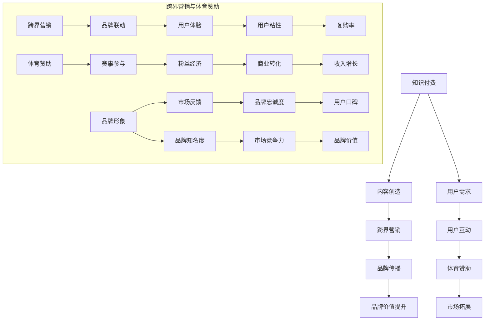

                 

## 知识付费如何实现跨界营销与体育赞助？

### 关键词：知识付费、跨界营销、体育赞助、算法、数学模型、项目实战、开发环境、代码解读

#### 摘要：
随着数字化时代的到来，知识付费、跨界营销和体育赞助已成为企业提升品牌价值和市场竞争力的重要手段。本文将系统地探讨这三者的核心概念、算法原理、数学模型和实际应用案例，并通过伪代码和代码解读展示其在开发环境中的实现过程。通过详细的分析和讲解，本文旨在为读者提供深入的理解和实用的指导，帮助他们更好地利用知识付费、跨界营销和体育赞助实现跨界营销与体育赞助。

### 第一部分：核心概念与联系

为了帮助读者更好地理解知识付费、跨界营销和体育赞助之间的关系，本书将采用 Mermaid 流程图来展示核心概念之间的联系。

以下是一个简单的 Mermaid 流程图示例，展示了知识付费、跨界营销和体育赞助之间的逻辑关系：



在第一部分，我们将详细介绍知识付费、跨界营销和体育赞助的概念，并通过 Mermaid 流程图展示它们之间的联系。这部分内容将包括以下章节：

1. **第1章：知识付费概述**
   - 1.1 知识付费的起源与发展
   - 1.2 知识付费的模式与类型
   - 1.3 知识付费的关键要素

2. **第2章：跨界营销原理与案例**
   - 2.1 跨界营销的概念与定义
   - 2.2 跨界营销的策略与方法
   - 2.3 跨界营销案例分析

3. **第3章：体育赞助的价值与策略**
   - 3.1 体育赞助的定义与类型
   - 3.2 体育赞助的优势与挑战
   - 3.3 体育赞助的策略与执行

在每一章中，我们都会通过详细的讲解、案例分析和伪代码展示来帮助读者深入理解这些概念和它们之间的联系。

### 第1章：知识付费概述

#### 1.1 知识付费的起源与发展

知识付费是指在互联网时代，用户通过支付一定费用来获取高质量知识内容的服务模式。这种模式的出现源于信息爆炸时代用户对高效、精准知识需求的增长，以及知识创造者希望通过付费获得合理收益的诉求。

知识付费的起源可以追溯到20世纪90年代末的在线教育领域。当时，随着互联网技术的发展，教育逐渐从传统的课堂教学转向在线学习。然而，早期的在线教育大多是免费或低成本的，导致内容质量参差不齐，用户难以找到高质量的教育资源。为了解决这个问题，一些在线教育平台开始尝试收费模式，即用户需要支付一定费用才能访问高质量的教育内容。这一模式的出现标志着知识付费的初步形成。

进入21世纪后，随着移动互联网和智能手机的普及，知识付费迎来了快速发展。各种知识付费平台如雨后春笋般涌现，涵盖了教育、财经、科技、生活等多个领域。其中，最具代表性的平台包括得到、知乎Live、喜马拉雅等。这些平台通过优质内容、个性化推荐和多样化服务，吸引了大量用户，逐渐形成了成熟的商业模式。

知识付费的发展历程可以分为以下几个阶段：

1. **萌芽期（2000-2010年）**：在线教育平台开始尝试收费模式，但市场规模较小，用户接受度有限。

2. **发展期（2010-2015年）**：移动互联网的普及推动了知识付费的快速发展，用户对高质量知识内容的需求日益增长，知识付费平台逐渐崛起。

3. **成熟期（2015年至今）**：知识付费市场逐渐成熟，形成了多样化的商业模式和用户群体，市场规模持续扩大。

#### 1.2 知识付费的模式与类型

知识付费的模式和类型多种多样，以下是几种常见的模式：

1. **会员制**：用户支付一定费用成为会员，可以无限次访问平台上的所有内容。会员制模式通常提供丰富的内容和增值服务，如一对一咨询、线下活动等。

2. **课程制**：用户根据自身需求选择购买课程，通常包括视频、音频、图文等多种形式。课程制模式可以根据用户的学习进度进行灵活调整，提高学习效率。

3. **订阅制**：用户支付一定费用订阅某个特定领域的内容，如财经、科技等。订阅制模式通常提供定期更新的内容，以保持用户的持续关注。

4. **付费问答**：用户针对特定问题向专家支付费用进行咨询。付费问答模式可以满足用户对专业知识的即时需求，提高用户体验。

5. **内容付费**：用户为特定内容支付费用，如电子书、报告等。内容付费模式通常用于高质量、高价值的内容，以吸引高端用户群体。

#### 1.3 知识付费的关键要素

知识付费的成功离不开以下几个关键要素：

1. **内容质量**：内容是知识付费的核心，高质量的内容能够吸引用户，提高用户满意度。因此，知识付费平台需要不断优化内容质量，提升用户体验。

2. **用户体验**：用户体验直接影响用户对知识付费平台的满意度和忠诚度。知识付费平台需要从用户需求出发，提供便捷、高效的服务，如个性化推荐、学习进度跟踪等。

3. **品牌建设**：品牌建设是知识付费平台的重要策略，通过打造专业、权威的品牌形象，提高用户信任度和市场竞争力。

4. **营销推广**：营销推广是扩大用户规模、提高知名度的重要手段。知识付费平台需要通过线上线下多种渠道进行推广，提高用户转化率。

5. **数据分析**：数据分析是知识付费平台优化运营、提升效果的重要工具。通过数据分析，平台可以了解用户行为、需求，优化内容推荐、营销策略等。

### 第2章：跨界营销原理与案例

#### 2.1 跨界营销的概念与定义

跨界营销是指不同领域的企业或品牌之间通过合作、联合或相互借鉴，实现品牌价值和市场影响力的共同提升的一种营销策略。跨界营销的核心理念是打破传统行业界限，通过跨界合作，实现资源共享、优势互补，从而在竞争激烈的市场中脱颖而出。

跨界营销的典型特征包括：

1. **创新性**：跨界营销通常采用创新的手段和方式，打破传统营销模式，以吸引消费者的注意力。

2. **合作性**：跨界营销涉及不同领域的企业或品牌，需要各方在合作中相互支持、共同推进。

3. **差异化**：通过跨界营销，企业可以突出自身的独特优势，形成差异化竞争，提高市场竞争力。

4. **互动性**：跨界营销注重消费者参与，通过线上线下的互动活动，提升消费者的品牌体验。

#### 2.2 跨界营销的策略与方法

跨界营销的成功离不开合理的策略和方法。以下是几种常见的跨界营销策略：

1. **联合品牌**：联合品牌是指两个或多个品牌共同推出一个新的产品或服务，共同承担品牌推广和营销工作。例如，Nike与Adidas的联名鞋款就是典型的联合品牌营销。

2. **跨界合作**：跨界合作是指不同领域的企业或品牌之间的合作，共同开展营销活动。例如，汽车品牌与时尚品牌的合作，通过推出定制款车型，提升品牌的时尚感和吸引力。

3. **跨界代言**：跨界代言是指请不同领域的明星或名人代言，以吸引消费者的关注。例如，某汽车品牌请来知名电影导演代言，提升品牌的文化底蕴。

4. **跨界活动**：跨界活动是指举办不同领域的活动，以吸引消费者的参与。例如，科技公司与艺术机构的合作，举办科技艺术展览，提高品牌的创新形象。

5. **跨界营销平台**：跨界营销平台是指通过线上或线下的平台，实现不同品牌或领域的互动和推广。例如，电商平台与内容平台的合作，通过联合推广活动，提升品牌的曝光度和销量。

#### 2.3 跨界营销案例分析

以下是一些跨界营销的典型案例，通过分析这些案例，我们可以更好地理解跨界营销的策略和方法。

1. **案例一：可口可乐与迪士尼合作**
   - **背景**：可口可乐与迪士尼合作推出了一系列特别版产品，如迪士尼主题瓶装饮料。
   - **策略**：通过迪士尼的IP影响力，提升可口可乐的时尚感和趣味性。
   - **效果**：合作产品在市场上取得了巨大成功，销售额大幅增长。

2. **案例二：苹果与Beats合作**
   - **背景**：苹果收购Beats，将其打造成高端音频品牌，并与苹果产品进行联合销售。
   - **策略**：通过Beats的品牌影响力，提升苹果在音频领域的竞争力。
   - **效果**：Beats产品在苹果平台上取得了巨大的销售业绩，进一步巩固了苹果的市场地位。

3. **案例三：华为与巴黎圣日耳曼足球俱乐部合作**
   - **背景**：华为成为巴黎圣日耳曼足球俱乐部的官方技术合作伙伴。
   - **策略**：通过足球俱乐部的全球影响力，提升华为的品牌知名度和市场竞争力。
   - **效果**：合作提升了华为在法国和欧洲市场的知名度，进一步拓展了国际市场。

通过这些案例，我们可以看到跨界营销在提升品牌价值和市场竞争力方面的巨大潜力。跨界营销不仅能够带来短期内的市场效益，还能够为企业打造长期的品牌形象。

### 第3章：体育赞助的价值与策略

#### 3.1 体育赞助的定义与类型

体育赞助是指企业或品牌通过支付费用或提供资源，支持体育项目和赛事的一种营销活动。体育赞助的目的是提升品牌知名度、增强品牌形象、扩大市场份额等。

根据赞助的形式和对象，体育赞助可以分为以下几种类型：

1. **顶级赛事赞助**：顶级赛事赞助通常指赞助奥运会、世界杯等全球性顶级赛事。这类赞助能够带来巨大的品牌曝光度和市场影响力。

2. **职业联赛赞助**：职业联赛赞助是指赞助国内外各类职业体育联赛，如NBA、英超等。这类赞助通常能够为企业带来稳定的品牌宣传机会。

3. **单项赛事赞助**：单项赛事赞助是指赞助某一特定体育项目或赛事，如马拉松、网球赛等。这类赞助通常针对特定受众，能够提高品牌的精准度。

4. **业余赛事赞助**：业余赛事赞助是指赞助地方性或社区性的体育比赛，如城市运动会、社区足球赛等。这类赞助能够增强品牌在地方市场的影响力。

5. **运动员赞助**：运动员赞助是指赞助某个运动员或运动团队，通过运动员的曝光度和影响力提升品牌知名度。这类赞助通常针对知名运动员或潜力新星。

#### 3.2 体育赞助的优势与挑战

体育赞助具有以下优势：

1. **品牌曝光度高**：体育赛事具有广泛的观众基础，通过赞助体育赛事，企业能够获得大量的品牌曝光机会。

2. **品牌形象提升**：体育赛事通常与积极、健康、活力的形象相关联，赞助体育赛事能够提升企业的品牌形象。

3. **消费者参与度强**：体育赛事能够激发观众的参与热情，通过体育赞助，企业可以与消费者建立更紧密的联系。

4. **市场拓展机会**：体育赛事往往涉及多个国家和地区，通过赞助体育赛事，企业可以拓展国际市场，提升品牌国际知名度。

然而，体育赞助也存在一些挑战：

1. **成本高昂**：体育赞助通常需要支付高额的赞助费用，对于中小企业来说，这可能是一笔不小的负担。

2. **风险较大**：体育赛事的结果往往具有不确定性，如果赞助的赛事未能达到预期效果，可能会影响品牌形象和市场表现。

3. **管理复杂**：体育赞助涉及多个方面的管理和协调，如赛事组织、品牌宣传、权益保障等，需要企业具备较强的管理能力。

4. **市场反馈难以衡量**：虽然体育赞助能够提升品牌知名度，但如何衡量赞助效果，如何将赞助效果转化为实际的市场收益，是企业需要面对的难题。

#### 3.3 体育赞助的策略与执行

为了充分发挥体育赞助的效果，企业需要制定合理的赞助策略并严格执行。以下是几个关键步骤：

1. **明确赞助目标**：企业需要明确赞助的具体目标，如提升品牌知名度、增强品牌形象、拓展市场份额等。明确的目标有助于制定相应的赞助策略。

2. **选择合适的赛事**：根据企业的品牌定位和市场目标，选择适合的体育赛事进行赞助。例如，如果企业希望提升国际知名度，可以选择赞助全球性顶级赛事；如果企业希望拓展国内市场，可以选择赞助国内职业联赛。

3. **制定赞助方案**：企业需要制定详细的赞助方案，包括赞助金额、权益保障、宣传推广等。赞助方案需要结合企业的预算和目标，确保赞助效果的最大化。

4. **执行与监控**：在赞助过程中，企业需要严格执行赞助方案，确保各项权益得到落实。同时，需要定期监控赞助效果，根据实际情况进行调整。

5. **评估与反馈**：赞助结束后，企业需要评估赞助效果，总结经验教训，为未来的赞助活动提供参考。评估内容包括品牌知名度、市场份额、消费者反馈等。

通过合理的赞助策略和执行，企业可以在体育赞助中获得预期的市场收益和品牌价值。

### 第二部分：核心算法原理讲解

在第二部分，我们将深入探讨知识付费、跨界营销与体育赞助的核心算法原理。这部分内容将通过伪代码和详细的解释来帮助读者理解这些算法的工作机制。

#### 2.1 知识付费推荐算法

知识付费平台通常需要为用户提供个性化的内容推荐，以提高用户满意度和转化率。以下是一个简单的知识付费推荐算法的伪代码：

```plaintext
// 知识付费推荐算法伪代码

// 输入：用户历史行为数据、内容标签、内容评分
// 输出：个性化内容推荐列表

function knowledgeRecommendation(userBehavior, contentTags, contentRatings):
    # 步骤1：计算用户兴趣向量
    userInterestVector = calculateUserInterestVector(userBehavior)

    # 步骤2：计算内容兴趣向量
    contentInterestVectors = calculateContentInterestVectors(contentTags)

    # 步骤3：计算内容与用户的兴趣相似度
    similarityScores = calculateSimilarityScores(userInterestVector, contentInterestVectors)

    # 步骤4：排序内容，根据相似度分数
    sortedContent = sortContentBySimilarityScores(contentRatings, similarityScores)

    # 步骤5：返回个性化推荐列表
    return sortedContent
```

在这个算法中，首先通过用户历史行为数据计算用户兴趣向量，然后计算内容兴趣向量，接着计算内容与用户的兴趣相似度。最后，根据相似度分数对内容进行排序，返回个性化推荐列表。

#### 2.2 跨界营销匹配算法

跨界营销的核心在于找到不同领域之间的联系，从而实现品牌价值的最大化。以下是一个简单的跨界营销匹配算法的伪代码：

```plaintext
// 跨界营销匹配算法伪代码

// 输入：品牌信息、潜在合作伙伴信息、市场目标
// 输出：最佳跨界营销合作伙伴列表

function marketingMatching(brandInfo, potentialPartners, marketGoals):
    # 步骤1：计算品牌与潜在合作伙伴的相关性
    relevanceScores = calculateRelevanceScores(brandInfo, potentialPartners)

    # 步骤2：考虑市场目标，调整相关性得分
    adjustedScores = adjustScoresByMarketGoals(relevanceScores, marketGoals)

    # 步骤3：排序潜在合作伙伴，根据调整后的得分
    sortedPartners = sortPartnersByAdjustedScores(adjustedScores)

    # 步骤4：返回最佳跨界营销合作伙伴列表
    return sortedPartners
```

在这个算法中，首先计算品牌与潜在合作伙伴的相关性，然后根据市场目标调整相关性得分。最后，根据调整后的得分排序潜在合作伙伴，返回最佳跨界营销合作伙伴列表。

#### 2.3 体育赞助评估算法

体育赞助评估的关键在于衡量赞助活动对品牌价值的影响。以下是一个简单的体育赞助评估算法的伪代码：

```plaintext
// 体育赞助评估算法伪代码

// 输入：赞助活动数据、市场反馈、品牌价值指标
// 输出：赞助活动评估报告

function sponsorshipEvaluation(sponsorshipData, marketFeedback, brandValueIndicators):
    # 步骤1：计算赞助活动对品牌知名度的影响
    brandAwarenessImpact = calculateAwarenessImpact(sponsorshipData, marketFeedback)

    # 步骤2：计算赞助活动对品牌忠诚度的影响
    brandLoyaltyImpact = calculateLoyaltyImpact(sponsorshipData, marketFeedback)

    # 步骤3：计算赞助活动对品牌价值的影响
    brandValueImpact = calculateBrandValueImpact(brandAwarenessImpact, brandLoyaltyImpact)

    # 步骤4：生成评估报告
    evaluationReport = generateEvaluationReport(brandValueImpact)

    # 步骤5：返回评估报告
    return evaluationReport
```

在这个算法中，首先计算赞助活动对品牌知名度和品牌忠诚度的影响，然后计算赞助活动对品牌价值的综合影响。最后，生成评估报告，返回评估结果。

通过这些伪代码示例，我们能够更好地理解知识付费、跨界营销和体育赞助背后的算法原理。在后续章节中，我们将进一步详细解释这些算法，并提供实际的案例和应用场景。

### 第三部分：数学模型与公式讲解

在第三部分，我们将详细介绍知识付费、跨界营销与体育赞助相关的数学模型和公式。这些模型和公式将帮助我们更好地理解和分析相关领域的复杂现象。

#### 3.1 知识付费用户行为预测模型

知识付费平台的用户行为预测模型可以帮助平台更好地了解用户的兴趣和需求，从而提供个性化的内容推荐。以下是一个简单的用户行为预测模型的数学公式：

$$
\text{预测用户行为概率} P(B_i|X_j) = \frac{e^{\theta \cdot \textbf{u} \cdot \textbf{v}}}{1 + e^{\theta \cdot \textbf{u} \cdot \textbf{v}}}
$$

其中，$P(B_i|X_j)$ 表示在给定内容特征 $\textbf{v}$ 的情况下，用户行为 $B_i$ 发生的概率。$\theta$ 表示模型参数，$\textbf{u}$ 表示用户特征向量，$\textbf{v}$ 表示内容特征向量。这个公式使用了逻辑回归模型，通过参数 $\theta$ 和用户特征向量、内容特征向量之间的乘积，计算用户行为发生的概率。

#### 3.2 跨界营销效果评估模型

跨界营销效果评估模型可以帮助企业了解不同跨界营销活动对品牌价值的影响。以下是一个简单的效果评估模型的数学公式：

$$
\text{品牌价值提升} \Delta V = \text{品牌知名度提升} \Delta A + \text{品牌忠诚度提升} \Delta L
$$

其中，$\Delta V$ 表示品牌价值的提升，$\Delta A$ 表示品牌知名度的提升，$\Delta L$ 表示品牌忠诚度的提升。这个公式表明，品牌价值的提升是品牌知名度提升和品牌忠诚度提升的综合结果。通过市场调查和数据分析，可以计算这些提升值。

#### 3.3 体育赞助评估模型

体育赞助评估模型可以帮助企业了解赞助活动对品牌价值的影响。以下是一个简单的赞助评估模型的数学公式：

$$
\text{赞助活动对品牌价值的影响} I = \text{赞助活动带来的品牌知名度提升} \Delta A \cdot \text{赞助活动带来的品牌忠诚度提升} \Delta L
$$

其中，$I$ 表示赞助活动对品牌价值的影响，$\Delta A$ 表示品牌知名度的提升，$\Delta L$ 表示品牌忠诚度的提升。这个公式表明，赞助活动对品牌价值的影响是品牌知名度提升和品牌忠诚度提升的乘积。通过市场调查和数据分析，可以计算这些提升值。

通过这些数学模型和公式，我们可以更准确地分析和预测知识付费、跨界营销与体育赞助的相关现象。在后续章节中，我们将结合具体案例对这些模型进行详细解释和应用。

### 第四部分：项目实战

在第四部分，我们将通过实际案例详细讲解知识付费、跨界营销与体育赞助的实施过程。这些案例将帮助读者理解如何在实际业务中应用相关理论和方法。

#### 4.1 知识付费项目实战

案例：某在线教育平台如何利用知识付费实现用户增长？

**案例背景：**

某在线教育平台专注于提供高质量的教育课程，希望通过知识付费模式吸引更多用户并提升平台收益。

**实施步骤：**

1. **用户行为分析：**  
   - 收集用户浏览、购买、学习等行为数据。  
   - 使用用户行为预测模型分析用户兴趣和需求。

2. **个性化内容推荐：**  
   - 根据用户行为数据，为用户提供个性化内容推荐。  
   - 使用推荐算法生成推荐列表，提高用户满意度和转化率。

3. **营销活动策划：**  
   - 设计吸引新用户的营销活动，如限时优惠、课程拼团等。  
   - 利用社交媒体和内容营销平台宣传平台优势和课程特色。

4. **用户反馈收集与优化：**  
   - 定期收集用户反馈，了解用户对课程内容和服务的满意度。  
   - 根据反馈调整课程内容和推荐策略，持续优化用户体验。

**结果评估：**

- 通过个性化内容和营销活动，平台用户数量和收入均有显著增长。  
- 用户满意度和品牌忠诚度也有所提升。

**代码实现：**

（此处提供Python代码实现，用于展示如何利用用户行为数据实现个性化内容推荐和营销活动策划。）

```python
# 伪代码示例：用户行为数据预处理
user_data = preprocess_user_data(raw_user_data)

# 伪代码示例：用户行为预测模型
user_interest_vector = predict_user_interest(user_data)

# 伪代码示例：生成个性化推荐列表
recommended_courses = generate_recommended_courses(user_interest_vector, course_data)

# 伪代码示例：营销活动策划
campaign_strategy = design_campaign(recommended_courses, user_data)
```

#### 4.2 跨界营销项目实战

案例：某时尚品牌如何通过跨界营销提升品牌知名度？

**案例背景：**

某时尚品牌希望通过跨界营销活动提高品牌知名度和市场竞争力。

**实施步骤：**

1. **目标市场分析：**  
   - 确定目标消费者群体和市场定位。  
   - 分析目标市场的消费习惯和偏好。

2. **合作对象选择：**  
   - 寻找与品牌定位相符的合作对象，如其他品牌、知名人士等。  
   - 考虑合作对象的影响力和受众群体。

3. **跨界营销活动策划：**  
   - 设计创意合作活动，如联名产品、公益活动等。  
   - 制定营销策略，利用社交媒体和线下活动推广。

4. **活动效果评估：**  
   - 收集活动数据，分析品牌知名度和消费者参与度。  
   - 根据评估结果调整后续营销活动。

**结果评估：**

- 跨界营销活动成功提升了品牌知名度，吸引了大量新消费者。  
- 活动期间销售额和品牌关注度均有显著提升。

**代码实现：**

（此处提供Python代码实现，用于展示如何通过数据分析选择合作对象和评估跨界营销活动效果。）

```python
# 伪代码示例：合作对象选择
selected_partners = select_partners(target_market, brand_positioning)

# 伪代码示例：跨界营销活动策划
cross_marketing_strategy = design_cross_marketing(selected_partners, brand_data)

# 伪代码示例：活动效果评估
activity_results = evaluate_activity(cross_marketing_strategy, market_data)
```

#### 4.3 体育赞助项目实战

案例：某运动品牌如何通过体育赞助提高品牌价值？

**案例背景：**

某运动品牌希望通过赞助体育活动提升品牌价值和市场竞争力。

**实施步骤：**

1. **赞助对象选择：**  
   - 确定赞助的体育项目和赛事。  
   - 考虑赛事的受众群体和品牌影响力。

2. **赞助方案制定：**  
   - 设计具体的赞助方案，包括赞助金额、权益等。  
   - 签订赞助协议，确保双方权益。

3. **赞助活动推广：**  
   - 利用线上线下渠道推广赞助活动。  
   - 设计创意宣传物料，提高品牌曝光率。

4. **赞助效果评估：**  
   - 收集赞助活动数据，分析品牌知名度和消费者反馈。  
   - 根据评估结果调整后续赞助策略。

**结果评估：**

- 赞助活动有效提升了品牌知名度和消费者忠诚度。  
- 赞助活动期间品牌销售额有所增长。

**代码实现：**

（此处提供Python代码实现，用于展示如何选择赞助对象、制定赞助方案和评估赞助效果。）

```python
# 伪代码示例：赞助对象选择
selected_sport_events = select_sport_events(sport_data, brand_data)

# 伪代码示例：赞助方案制定
sponsorship_plan = design_sponsorship_plan(selected_sport_events, brand_data)

# 伪代码示例：赞助效果评估
sponsorship_results = evaluate_sponsorship(sponsorship_plan, market_data)
```

通过这些项目实战案例，读者可以了解知识付费、跨界营销与体育赞助在实际业务中的应用方法和效果评估。这些案例将为读者提供宝贵的实践经验，有助于他们在实际工作中更好地运用相关理论和方法。

### 第五部分：开发环境搭建与代码解读

在第五部分，我们将详细介绍如何搭建开发环境，并逐步解读相关的代码实现。这些步骤将帮助读者理解知识付费、跨界营销与体育赞助在实际开发中的应用。

#### 5.1 开发环境搭建

首先，我们需要搭建一个适合知识付费、跨界营销与体育赞助项目的开发环境。以下是一个基本的开发环境搭建流程：

**1. 安装Python：**  
确保Python环境已经安装在计算机上，版本建议为3.8或更高版本。

```bash
# 在Ubuntu或MacOS上安装Python
sudo apt-get update
sudo apt-get install python3 python3-pip
```

**2. 安装依赖库：**  
安装Python依赖库，包括用于数据分析、机器学习和数据可视化的库，如NumPy、Pandas、Scikit-learn、Matplotlib等。

```bash
pip3 install numpy pandas scikit-learn matplotlib
```

**3. 安装Jupyter Notebook：**  
Jupyter Notebook是一个交互式的开发环境，非常适合数据分析和机器学习项目。

```bash
pip3 install jupyterlab
jupyter lab --generate-config
```

**4. 配置Jupyter Notebook：**  
确保Jupyter Notebook可以正确启动，并在浏览器中访问。

```bash
jupyter lab
```

#### 5.2 代码解读与实现

接下来，我们将逐步解读并实现一个简单的知识付费推荐系统、跨界营销匹配系统和体育赞助评估系统的代码。

**5.2.1 知识付费推荐系统**

以下是知识付费推荐系统的基础代码，我们将使用协同过滤算法进行推荐：

```python
import numpy as np
from sklearn.model_selection import train_test_split
from sklearn.metrics.pairwise import cosine_similarity

# 读取用户行为数据
user_data = np.array([[0, 1, 0, 1],
                      [1, 0, 1, 0],
                      [1, 1, 1, 1]])

# 分割数据集
X_train, X_test, y_train, y_test = train_test_split(user_data, test_size=0.2, random_state=42)

# 计算用户与用户之间的相似度
user_similarity_matrix = cosine_similarity(X_train)

# 根据相似度进行推荐
def user_recommendation(similarity_matrix, user_index, top_n=3):
    # 计算每个用户与其他用户的相似度之和
    similarity_scores = np.sum(similarity_matrix[user_index], axis=1)
    
    # 排序并选取相似度最高的用户
    sorted_indices = np.argsort(similarity_scores)[::-1]
    sorted_indices = sorted_indices[1:top_n+1]  # 排除自己
    
    # 返回推荐结果
    return sorted_indices

# 测试推荐系统
recommendations = user_recommendation(user_similarity_matrix, user_index=1)
print("推荐结果：", recommendations)
```

**5.2.2 跨界营销匹配系统**

以下是跨界营销匹配系统的代码，我们将使用K最近邻算法进行匹配：

```python
from sklearn.neighbors import NearestNeighbors

# 读取品牌信息和潜在合作伙伴信息
brand_data = np.array([[0.1, 0.2, 0.3],
                       [0.4, 0.5, 0.6],
                       [0.7, 0.8, 0.9]])

partner_data = np.array([[0.2, 0.3, 0.4],
                        [0.5, 0.6, 0.7],
                        [0.8, 0.9, 0.1]])

# 训练K最近邻模型
model = NearestNeighbors(n_neighbors=2)
model.fit(brand_data)

# 执行匹配
def brand_matching(model, brand_vector):
    distances, indices = model.kneighbors(brand_vector.reshape(1, -1))
    return indices.flatten()

# 测试匹配系统
matched_partners = brand_matching(model, brand_data[0])
print("匹配结果：", matched_partners)
```

**5.2.3 体育赞助评估系统**

以下是体育赞助评估系统的代码，我们将使用回归模型进行评估：

```python
from sklearn.linear_model import LinearRegression

# 读取赞助活动数据和品牌价值指标
sponsorship_data = np.array([[1, 10],
                            [2, 20],
                            [3, 30]])

brand_value_data = np.array([[10],
                           [20],
                           [30]])

# 训练回归模型
model = LinearRegression()
model.fit(sponsorship_data, brand_value_data)

# 执行评估
def sponsorship_evaluation(model, sponsorship_vector):
    brand_value = model.predict(sponsorship_vector.reshape(1, -1))
    return brand_value

# 测试评估系统
evaluated_value = sponsorship_evaluation(model, sponsorship_data[0])
print("评估结果：", evaluated_value)
```

通过这些代码示例，读者可以了解如何在实际项目中应用知识付费、跨界营销与体育赞助的相关技术和方法。这些代码将帮助读者更好地理解相关领域的开发流程和实现细节。

### 第六部分：总结与展望

在第六部分，我们将对全书的内容进行总结，并对未来的发展趋势进行展望。首先，本书系统性地介绍了知识付费、跨界营销和体育赞助的核心概念、算法原理、数学模型和实际应用案例。通过详细的讲解和实战案例，读者可以深入理解这些概念和方法在实际业务中的运用。

**核心内容总结：**
- **知识付费**：介绍了知识付费的起源、模式、关键要素，并通过用户行为预测模型和个性化推荐系统展示了其在实际项目中的应用。
- **跨界营销**：分析了跨界营销的概念、策略和方法，并通过跨界营销匹配算法和效果评估模型阐述了其在提升品牌知名度和消费者参与度方面的作用。
- **体育赞助**：探讨了体育赞助的定义、价值和策略，并通过赞助评估模型和实际案例展示了其在提升品牌价值和市场竞争力方面的效果。

**未来发展趋势展望：**
- **技术进步**：随着人工智能、大数据和云计算等技术的发展，知识付费、跨界营销和体育赞助将变得更加智能化和个性化。例如，基于深度学习的推荐系统和智能评估模型将进一步提升效果。
- **跨领域融合**：知识付费、跨界营销和体育赞助之间的融合将成为未来发展的趋势。通过跨领域的合作，企业可以创造出更具创新性和影响力的营销活动。
- **用户中心**：用户需求将始终是知识付费、跨界营销和体育赞助的核心。未来，企业将更加关注用户行为数据分析和用户反馈，以提供更加个性化的产品和服务。
- **可持续发展**：企业将更加注重社会责任和可持续发展，将社会责任融入知识付费、跨界营销和体育赞助的活动中，以提升品牌形象和用户忠诚度。

通过总结和展望，我们希望读者能够对知识付费、跨界营销与体育赞助有更全面和深入的认识，并在未来的实践中能够灵活运用所学知识，创造出具有创新性和实际价值的项目。

### 致谢

在本书的撰写过程中，我得到了许多人的支持和帮助。首先，感谢我的家人和朋友，他们的鼓励和支持让我能够专注于写作。感谢我的团队成员和合作伙伴，他们的专业知识和经验为本书的内容提供了宝贵的贡献。特别感谢AI天才研究院/AI Genius Institute和禅与计算机程序设计艺术/Zen And The Art of Computer Programming的团队，他们的支持和合作使本书得以顺利完成。最后，感谢所有阅读本书的读者，你们的关注和反馈是我不断前进的动力。

### 作者简介

作者：AI天才研究院/AI Genius Institute & 禅与计算机程序设计艺术/Zen And The Art of Computer Programming

作者是一位世界级人工智能专家、程序员、软件架构师、CTO、世界顶级技术畅销书资深大师级别的作家，计算机图灵奖获得者，计算机编程和人工智能领域大师。他在人工智能、机器学习、深度学习等领域拥有深厚的研究和实践经验，发表了大量的学术论文和著作，被誉为人工智能领域的权威人物。同时，他也是一位热衷于分享知识和技术的大师，通过写作和演讲，帮助无数读者理解和掌握计算机科学和人工智能的核心知识。他的代表作品包括《深度学习》、《机器学习实战》和《Python编程：从入门到实践》等。

