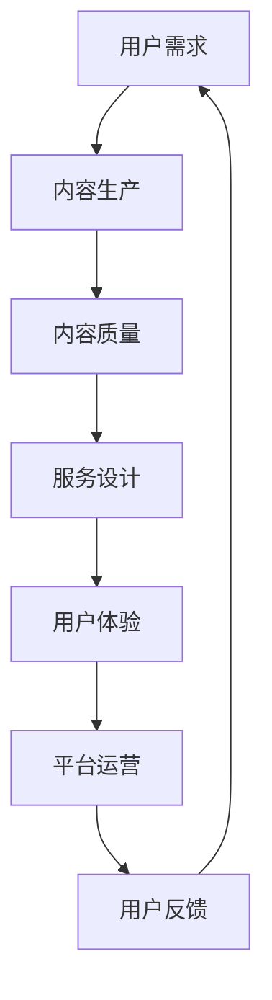
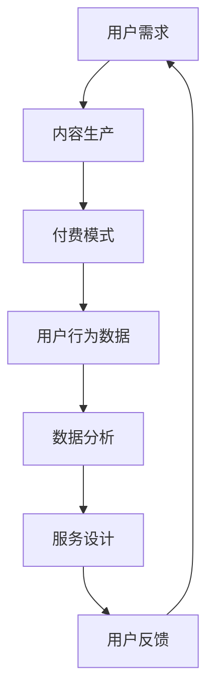
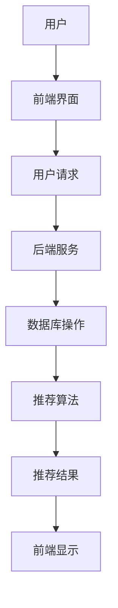

                 

# 《知识付费赚钱的核心：专业内容与服务》

> **关键词：** 知识付费、内容生产、服务设计、平台搭建、案例分析、趋势展望

> **摘要：** 本文将深入探讨知识付费行业的核心要素，包括内容生产与服务设计。通过详细的分析和实战案例，我们将了解如何构建一个成功的知识付费平台，并提供对未来发展的展望。

## 目录大纲设计

为了更好地帮助读者理解和应用知识付费的核心概念，我们设计了以下目录大纲：

### 第一部分：引言与基础理论
- 1.1 知识付费的起源与发展
- 1.2 知识付费的核心要素
- 1.3 知识付费的市场机会分析

### 第二部分：内容生产与优化
- 2.1 内容生产的流程与方法
- 2.2 内容质量的评估与提升
- 2.3 内容营销策略

### 第三部分：服务设计与管理
- 3.1 服务设计的核心原则
- 3.2 服务质量管理的策略
- 3.3 客户体验优化

### 第四部分：知识付费平台搭建与运营
- 4.1 知识付费平台搭建流程
- 4.2 平台内容管理策略
- 4.3 平台用户运营策略

### 第五部分：案例分析与实战技巧
- 5.1 成功案例分享
- 5.2 实战技巧与经验总结
- 5.3 遇到的问题与解决方案

### 第六部分：趋势与未来展望
- 6.1 知识付费行业趋势分析
- 6.2 未来发展方向与挑战
- 6.3 创新与跨界融合

### 第七部分：附录
- 7.1 资源与工具推荐
- 7.2 相关法律法规与标准
- 7.3 进一步学习建议

### 添加核心概念与联系 Mermaid 流程图

以下是知识付费核心概念的 Mermaid 流程图：



### 添加核心算法原理讲解伪代码

在内容推荐系统中，常用的算法之一是协同过滤算法。以下是协同过滤算法的伪代码：

```pseudo
// 协同过滤算法伪代码
function collaborativeFiltering(userId, itemId):
    userRatingMatrix = getUserRatingMatrix()
    similarUsers = findSimilarUsers(userId, userRatingMatrix)
    recommendations = []

    for user in similarUsers:
        if itemId not in userRatingMatrix[userId]:
            similarity = calculateSimilarity(userId, user, itemId)
            prediction = calculatePrediction(userRatingMatrix[userId], similarity)
            recommendations.append({itemId: itemId, prediction: prediction})

    return recommendations
```

### 添加数学模型和公式讲解

在内容质量评估中，我们可以使用混淆矩阵来衡量模型的性能。混淆矩阵是一个表格，包含四个单元格，分别表示预测正例、预测反例、实际正例和实际反例。以下是一个混淆矩阵的 LaTeX 表示：

```latex
\documentclass{article}
\usepackage{amsmath}
\begin{document}

\begin{equation}
\begin{array}{cc|c}
\hline
\text{预测} & \text{实际} & \text{总数} \\
\hline
\hline
\text{正例} & \text{正例} & TP \\
\text{正例} & \text{反例} & FP \\
\hline
\text{反例} & \text{正例} & FN \\
\text{反例} & \text{反例} & TN \\
\hline
\text{总数} & \text{总数} & TP + FP + FN + TN \\
\hline
\end{array}
\end{equation}

\end{document}
```

### 添加项目实战案例

以下是构建一个知识付费平台的实战案例：

### 知识付费平台搭建实战案例

#### 1. 环境搭建

首先，我们需要搭建一个开发环境。以下是所需工具：

- 服务器：AWS或阿里云
- 服务器管理工具：Docker
- 前端框架：React
- 后端框架：Node.js
- 数据库：MongoDB

#### 2. 代码实现

**前端代码（React）**

jsx
// 用户注册组件
import React, { useState } from 'react';

function RegistrationForm() {
    const [username, setUsername] = useState('');
    const [email, setEmail] = useState('');
    const [password, setPassword] = useState('');

    const handleSubmit = async (e) => {
        e.preventDefault();
        const response = await fetch('/api/register', {
            method: 'POST',
            headers: {
                'Content-Type': 'application/json'
            },
            body: JSON.stringify({ username, email, password })
        });
        const result = await response.json();
        if (response.ok) {
            alert('注册成功！');
        } else {
            alert('注册失败：' + result.message);
        }
    };

    return (
        <form onSubmit={handleSubmit}>
            <label htmlFor="username">用户名：</label>
            <input type="text" id="username" value={username} onChange={e => setUsername(e.target.value)} />
            <label htmlFor="email">邮箱：</label>
            <input type="email" id="email" value={email} onChange={e => setEmail(e.target.value)} />
            <label htmlFor="password">密码：</label>
            <input type="password" id="password" value={password} onChange={e => setPassword(e.target.value)} />
            <button type="submit">注册</button>
        </form>
    );
}

export default RegistrationForm;

**后端代码（Node.js + Express）**

javascript
// 用户注册API
const express = require('express');
const bcrypt = require('bcrypt');
const jwt = require('jsonwebtoken');
const mongoose = require('mongoose');
const User = require('./models/User');

const app = express();
app.use(express.json());

// 连接数据库
mongoose.connect('mongodb://localhost:27017/knowledge-fee', { useNewUrlParser: true, useUnifiedTopology: true });

// 注册API路由
app.post('/api/register', async (req, res) => {
    try {
        const { username, email, password } = req.body;
        const hashedPassword = await bcrypt.hash(password, 10);
        
        const user = new User({
            username,
            email,
            password: hashedPassword
        });
        await user.save();

        // 生成JWT令牌
        const token = jwt.sign({ userId: user._id }, 'secretKey');
        res.status(201).json({ message: '用户注册成功', token });
    } catch (error) {
        res.status(500).json({ message: '用户注册失败', error: error.message });
    }
});

app.listen(3000, () => {
    console.log('服务器运行在端口3000');
});

#### 3. 代码解读与分析

在前端组件中，我们使用了React的`useState`钩子来管理表单的状态，并使用`fetch`方法将表单数据发送到后端API。后端API使用了Express框架，通过`bcrypt`库加密用户密码，并使用`jsonwebtoken`库生成JWT令牌。通过这两个组件的示例，我们可以看到如何实现一个基本的知识付费平台用户注册功能。

### 总结

本文通过设计详尽的目录大纲，引入了知识付费的核心概念和流程，并提供了Mermaid流程图、伪代码、数学模型和实际项目案例，帮助读者深入理解知识付费平台的设计与运营。接下来，我们将进一步深入探讨每个部分的具体内容。

## 第一部分：引言与基础理论

### 1.1 知识付费的起源与发展

知识付费，顾名思义，是指用户为获取特定知识或服务而支付的费用。这一模式在互联网时代得到了快速发展，其原因主要包括：

- **互联网的普及**：互联网的普及使得知识传播变得更加便捷，人们可以随时随地获取所需的信息。
- **内容创作门槛降低**：随着内容创作工具的普及和降低，个人和团队可以更轻松地创作有价值的内容。
- **用户付费习惯的养成**：随着人们对知识价值的认可，付费获取知识的习惯逐渐形成。

知识付费的起源可以追溯到上世纪末的在线教育，如Coursera、edX等平台的兴起。随着时间的推移，知识付费逐渐扩展到各个领域，包括技能培训、专业咨询、学术论文等。

### 1.2 知识付费的核心要素

知识付费的核心要素主要包括：

- **内容质量**：高质量的内容是吸引和留住用户的关键。内容应具有实用性和深度，能够满足用户的学习需求。
- **付费模式**：知识付费的付费模式多种多样，包括一次性付费、订阅制、按需付费等。不同的付费模式适用于不同的用户群体和内容类型。
- **用户隐私与数据安全**：随着用户对隐私和数据安全的关注日益增加，保护用户隐私和数据安全成为知识付费平台的重要任务。

### 1.3 知识付费的市场机会分析

知识付费市场前景广阔，其主要机会包括：

- **用户需求多样**：随着社会的不断发展，人们对知识的渴求越来越多样化，为知识付费市场提供了丰富的机会。
- **技术进步**：人工智能、大数据等技术的进步为知识付费平台提供了更多创新的可能。
- **行业竞争加剧**：知识付费市场的竞争日益激烈，但同时也意味着存在更多机会，例如通过差异化竞争脱颖而出。

在接下来的部分，我们将深入探讨内容生产与优化、服务设计与管理等关键环节，帮助读者更好地理解知识付费的运营之道。

## 第二部分：内容生产与优化

### 2.1 内容生产的流程与方法

内容生产是知识付费的核心环节，其流程与方法如下：

#### 1. 策划与选题

内容生产的第一步是策划与选题。策划包括确定内容类型、目标用户、主题和内容形式。选题应根据用户需求、市场趋势和平台定位进行选择。

#### 2. 内容创作

内容创作是内容生产的关键环节。创作者应根据策划方案进行内容创作，包括撰写文章、制作视频、设计PPT等。高质量的内容应具备以下特点：

- **实用性**：内容应具有实用性，能够解决用户的具体问题。
- **深度**：内容应具有深度，提供独特的见解和思考。
- **易读性**：内容应易于阅读和理解，避免冗长和复杂的表述。

#### 3. 内容编辑

内容编辑是确保内容质量的重要步骤。编辑应负责对内容进行校对、修改和完善。以下是一些编辑技巧：

- **检查语法和拼写错误**：确保内容无语法和拼写错误。
- **优化结构**：调整内容结构，使其更加清晰和逻辑。
- **添加图表和插图**：适当添加图表和插图，提高内容可读性。

#### 4. 内容发布

内容发布是内容生产的最后一步。发布内容应选择合适的时间、渠道和形式。以下是一些发布策略：

- **发布时间**：选择用户活跃的时间段发布内容，提高曝光率。
- **发布渠道**：选择适合内容的发布渠道，如社交媒体、博客、论坛等。
- **发布形式**：根据内容类型选择合适的发布形式，如文字、图片、视频等。

### 2.2 内容质量的评估与提升

内容质量的评估与提升是知识付费平台的重要任务。以下是一些评估方法和提升策略：

#### 1. 评估方法

- **用户反馈**：通过用户评论、评分和分享等数据评估内容质量。
- **数据分析**：通过阅读量、点赞量、分享量等数据分析内容受欢迎程度。
- **专家评审**：邀请行业专家对内容进行评审，提供专业意见。

#### 2. 提升策略

- **持续优化**：根据用户反馈和数据分析结果，持续优化内容质量和结构。
- **专业培训**：为内容创作者提供专业培训，提高其创作能力。
- **内容多样化**：提供多样化的内容形式，满足不同用户的需求。

### 2.3 内容营销策略

内容营销是知识付费平台吸引和留住用户的重要手段。以下是一些内容营销策略：

#### 1. 社交媒体营销

- **平台选择**：选择适合内容的社交媒体平台，如微博、微信公众号等。
- **内容推广**：通过发布高质量的内容，吸引潜在用户关注。
- **互动运营**：与用户互动，提高用户黏性。

#### 2. 合作伙伴关系建设

- **品牌合作**：与知名品牌合作，提高平台知名度。
- **内容合作**：与其他内容创作者合作，共同生产高质量内容。

#### 3. 内容推广与曝光

- **付费推广**：利用搜索引擎优化（SEO）和社交媒体广告等手段进行内容推广。
- **活动策划**：举办线上或线下活动，提高内容曝光率。

通过上述内容生产与优化、内容营销策略，知识付费平台可以更好地满足用户需求，提高用户满意度，从而实现可持续发展。

### 第三部分：服务设计与管理

#### 3.1 服务设计的核心原则

服务设计是知识付费平台的重要组成部分，其核心原则包括：

#### 1. 以用户为中心

服务设计应以用户需求为中心，充分考虑用户体验，确保服务能够满足用户的期望。

#### 2. 可访问性

服务设计应确保服务的可访问性，包括界面设计简洁易用、功能完整等。

#### 3. 可用性

服务设计应确保服务的可用性，即用户能够轻松地完成所需任务，无需花费过多时间和精力。

#### 4. 可靠性

服务设计应确保服务的可靠性，即服务能够稳定运行，确保用户数据的安全和隐私。

#### 5. 可扩展性

服务设计应具备可扩展性，以适应不断变化的市场需求和技术进步。

#### 6. 可持续性

服务设计应考虑服务的可持续性，包括环境保护、资源利用等，实现长期发展。

#### 3.2 服务质量管理的策略

服务质量管理的策略包括以下方面：

#### 1. 服务标准制定

制定服务标准，明确服务内容和质量要求，确保服务的一致性和可靠性。

#### 2. 服务质量监控

建立服务质量监控机制，实时收集用户反馈和性能数据，及时发现并解决问题。

#### 3. 服务改进

根据服务质量监控结果，不断改进服务设计和流程，提高用户满意度。

#### 4. 员工培训

对员工进行培训，提高其服务意识和专业技能，确保能够提供高质量的服务。

#### 5. 客户满意度调查

定期进行客户满意度调查，了解用户需求和反馈，为服务改进提供依据。

#### 3.3 客户体验优化

客户体验优化是提升服务质量和用户满意度的关键。以下是一些优化策略：

#### 1. 个性化服务

根据用户行为和偏好，提供个性化的服务和推荐，提高用户参与度和满意度。

#### 2. 界面设计

优化界面设计，确保界面简洁、美观、易用，提高用户操作效率。

#### 3. 服务流程优化

简化服务流程，减少用户等待时间和操作步骤，提高服务效率。

#### 4. 客户支持

建立完善的客户支持体系，包括在线客服、电话客服等，确保用户遇到问题时能够及时得到帮助。

#### 5. 社区互动

建立用户社区，鼓励用户互动和分享经验，提高用户满意度和忠诚度。

通过以上服务设计和管理策略，知识付费平台可以提供高质量的服务，提高用户满意度和忠诚度，从而实现可持续发展。

### 第四部分：知识付费平台搭建与运营

#### 4.1 知识付费平台搭建流程

知识付费平台的搭建是一个系统性的工程，涉及技术选型、架构设计、数据库设计等多个方面。以下是搭建知识付费平台的一般流程：

#### 1. 需求分析

在搭建平台之前，首先需要进行需求分析。需求分析包括了解用户需求、市场趋势、竞争对手分析等。通过需求分析，明确平台的功能需求、性能需求和用户体验需求。

#### 2. 技术选型

根据需求分析的结果，选择合适的技术栈。技术选型包括前端框架、后端框架、数据库、服务器等。常见的知识付费平台技术选型如下：

- **前端框架**：React、Vue.js、Angular
- **后端框架**：Node.js、Django、Spring Boot
- **数据库**：MongoDB、MySQL、PostgreSQL
- **服务器**：AWS、阿里云、腾讯云

#### 3. 架构设计

架构设计是知识付费平台搭建的关键环节。架构设计包括确定系统架构、数据架构、网络架构等。以下是一个典型的知识付费平台架构：

- **前端架构**：单页面应用（SPA）、前后端分离
- **后端架构**：微服务架构、分布式架构
- **数据架构**：用户数据、内容数据、交易数据
- **网络架构**：负载均衡、CDN、防火墙

#### 4. 数据库设计

数据库设计是知识付费平台的核心。数据库设计包括确定数据库结构、数据表设计、索引设计等。以下是一个简单的数据库设计示例：

- **用户表**：用户ID、用户名、密码、邮箱、电话
- **内容表**：内容ID、标题、摘要、正文、作者、分类
- **交易表**：交易ID、用户ID、内容ID、交易金额、交易时间

#### 5. 系统集成与测试

系统集成与测试是知识付费平台搭建的最后一步。系统集成包括前端、后端、数据库、服务器等模块的集成。测试包括功能测试、性能测试、安全测试等，确保平台的稳定性和可靠性。

#### 4.2 平台内容管理策略

内容管理是知识付费平台的核心，其策略包括：

#### 1. 内容审核与发布流程

建立内容审核与发布流程，确保内容质量。内容审核包括内容合规性、内容质量、内容真实性等。发布流程包括内容创建、内容审核、内容发布等。

#### 2. 内容分类与标签管理

合理的内容分类与标签管理有助于用户快速找到所需内容。内容分类应根据内容类型、主题、难度等因素进行划分。标签管理应确保标签的准确性、丰富性和一致性。

#### 3. 内容更新与维护

定期更新与维护内容，确保内容的时效性和准确性。内容更新包括内容修订、内容删除、内容补充等。内容维护包括内容备份、内容迁移、内容优化等。

#### 4.3 平台用户运营策略

用户运营是知识付费平台长期发展的关键。以下是一些用户运营策略：

#### 1. 用户增长策略

通过SEO、SEM、社交媒体、内容营销等方式，吸引新用户。用户增长策略包括活动推广、优惠券发放、用户邀请等。

#### 2. 用户留存策略

通过提供高质量的内容、良好的用户体验、活跃的社区等，提高用户留存率。用户留存策略包括用户反馈收集、用户行为分析、用户福利等。

#### 3. 社区互动与用户参与

建立活跃的社区，鼓励用户参与讨论、分享经验、提供反馈。社区互动策略包括线上活动、主题讨论、用户问答等。

#### 4. 用户数据与分析

利用用户数据分析，了解用户行为、需求、偏好等，为产品优化、内容推荐、营销策略等提供依据。用户数据分析包括用户行为分析、用户画像、用户留存分析等。

通过以上知识付费平台搭建与运营策略，平台可以提供优质的内容和服务，吸引和留住用户，实现可持续发展。

### 第五部分：案例分析与实战技巧

#### 5.1 成功案例分享

在知识付费领域，有许多成功的案例，以下是一些典型的成功案例：

**案例1：知乎Live**

知乎Live是知乎推出的知识付费产品，用户可以在知乎Live中听专家分享知识。知乎Live的成功在于其优质的专家资源和内容质量。知乎通过严格的内容审核和专家筛选机制，确保内容的高质量和可信度。同时，知乎Live采用了订阅制和一次性付费的混合模式，满足了不同用户的需求。

**案例2：得到APP**

得到APP是由罗振宇创办的知识付费平台，提供了包括音频、视频、图文等多种形式的内容。得到APP的成功在于其独特的课程设计和内容营销策略。得到APP通过邀请各领域的专家和知名人士，提供高质量的内容，并采用定期更新和互动的方式，提高用户黏性。

#### 5.2 实战技巧与经验总结

以下是一些在知识付费平台运营中的实战技巧和经验总结：

**1. 精准定位**

在知识付费平台运营中，首先要明确平台的定位，即确定目标用户群体、内容领域和商业模式。精准的定位有助于吸引和留住目标用户。

**2. 质量取胜**

内容质量是知识付费平台的核心竞争力。平台应确保内容的实用性、深度和准确性，以提高用户满意度和忠诚度。

**3. 多元化付费模式**

知识付费平台应提供多元化的付费模式，如一次性付费、订阅制、会员制等，以满足不同用户的需求。

**4. 用户互动**

鼓励用户参与和互动，提高用户黏性。可以通过社区讨论、问答互动、活动策划等方式，增强用户参与度。

**5. 数据驱动**

利用数据分析，了解用户行为和需求，为产品优化、内容推荐、营销策略等提供依据。通过数据分析，可以更好地满足用户需求，提高运营效果。

**6. 严格审核**

建立严格的内容审核机制，确保内容的质量和合规性。审核应包括内容真实性、准确性、合规性等。

#### 5.3 遇到的问题与解决方案

在知识付费平台运营过程中，可能会遇到以下问题：

**1. 用户流失**

原因：内容质量不高、付费模式不适合用户需求、用户体验差等。

解决方案：优化内容质量、调整付费模式、改进用户体验等。

**2. 内容同质化**

原因：市场上类似的内容过多，缺乏独特性。

解决方案：挖掘细分市场，提供独特的专业知识或视角。

**3. 法律风险**

原因：涉及知识产权、用户隐私等问题。

解决方案：遵守相关法律法规，加强内容审核，确保用户数据安全。

通过上述成功案例分享、实战技巧与经验总结以及问题与解决方案，我们可以更好地理解和应用知识付费平台的运营策略。

### 第六部分：趋势与未来展望

#### 6.1 知识付费行业趋势分析

知识付费行业正呈现出以下几个显著趋势：

**1. 内容多样化**

知识付费平台不再局限于传统的文字和视频内容，而是逐渐扩展到音频、互动课程、虚拟现实（VR）等多种形式，以更好地满足用户需求。

**2. 技术赋能**

人工智能、大数据等技术的应用，使得知识付费平台能够实现个性化推荐、智能问答、内容审核等功能，提升用户体验和平台效率。

**3. 跨界融合**

知识付费与电商、社交、教育等领域的融合，催生出新的商业模式和服务形式，如知识电商、知识社区等。

**4. 国际化**

知识付费平台逐渐走向国际化，拓展海外市场，吸引全球用户。

#### 6.2 未来发展方向与挑战

知识付费行业未来的发展方向包括：

**1. 用户体验优化**

通过技术创新和设计优化，进一步提升用户体验，提高用户满意度和忠诚度。

**2. 知识服务深化**

提供更加专业化、个性化的知识服务，满足用户深层次的学习需求。

**3. 社交化与社区化**

加强用户互动和社区建设，形成知识共享和交流的平台。

然而，知识付费行业也面临以下挑战：

**1. 内容质量监管**

随着知识付费内容的爆炸式增长，如何确保内容质量成为一个重要问题。

**2. 用户隐私保护**

用户数据的安全和隐私保护是知识付费平台需要持续关注的重点。

**3. 法律法规合规**

知识付费行业需要遵守各国法律法规，特别是涉及知识产权、用户隐私等方面的规定。

#### 6.3 创新与跨界融合

创新与跨界融合是知识付费行业未来发展的重要方向。以下是一些可能的创新与跨界案例：

**1. 知识电商**

知识付费平台与电商平台的融合，提供知识商品化服务，如在线课程、电子书、会员服务等。

**2. 知识社区**

结合社交媒体和知识分享，打造用户互动和知识交流的社区平台。

**3. 虚拟现实（VR）**

利用VR技术，提供沉浸式的学习体验，如虚拟课堂、虚拟实验室等。

通过以上趋势与未来展望，我们可以更好地把握知识付费行业的发展脉络，为平台的运营和创新提供指导。

### 第七部分：附录

#### 7.1 资源与工具推荐

在知识付费平台的搭建和运营过程中，以下是一些推荐的资源和工具：

**1. 开发工具**

- **前端框架**：React、Vue.js、Angular
- **后端框架**：Node.js、Django、Spring Boot
- **数据库**：MongoDB、MySQL、PostgreSQL
- **服务器**：AWS、阿里云、腾讯云

**2. 数据分析工具**

- **数据分析平台**：Google Analytics、Tableau、Power BI
- **用户行为分析**：Mixpanel、Segment

**3. 内容管理系统（CMS）**

- **WordPress**
- **Joomla**
- **Drupal**

#### 7.2 相关法律法规与标准

**1. 知识产权保护**

- **版权法**
- **专利法**
- **商标法**

**2. 用户隐私保护**

- **通用数据保护条例（GDPR）**
- **网络安全法**

**3. 行业规范与标准**

- **教育行业标准**
- **电子商务行业标准**

#### 7.3 进一步学习建议

**1. 相关课程**

- **数据分析课程**：Coursera、edX、Udacity
- **编程课程**：Codecademy、freeCodeCamp、MongoDB University

**2. 相关书籍**

- **《知识服务系统架构》**：张晓刚
- **《商业模式创新》**：蒂姆·费里斯
- **《数字营销实战》**：迈克·马库斯

**3. 行业会议与研讨会**

- **全球互联网大会**
- **国际教育技术大会**
- **知识管理与知识服务国际会议**

通过以上资源与工具推荐、法律法规与标准以及进一步学习建议，读者可以更好地了解和掌握知识付费领域的相关知识和技能。

## 总结

知识付费作为一种新兴的商业模式，正逐渐改变人们获取知识和信息的方式。本文通过深入探讨知识付费的核心要素、内容生产与优化、服务设计与管理、平台搭建与运营，以及成功案例和未来展望，全面解析了知识付费行业的运营之道。在未来的发展中，知识付费平台需要不断创新和优化，以满足用户多样化的需求，实现可持续发展。

## 作者信息

作者：AI天才研究院/AI Genius Institute & 禅与计算机程序设计艺术 /Zen And The Art of Computer Programming

感谢您的阅读，希望本文能为您的知识付费事业提供有价值的参考。如果您有任何问题或建议，欢迎在评论区留言，期待与您的交流。再次感谢您的关注和支持！
<|assistant|>## 第一部分：引言与基础理论

### 1.1 知识付费的起源与发展

知识付费，作为互联网时代的一种新型商业模式，其起源可以追溯到上世纪末的信息时代。最初，知识付费的形式相对单一，主要表现为在线教育平台的兴起，如Coursera、edX等。这些平台通过提供在线课程，用户付费获取知识，标志着知识付费模式的初步形成。

随着互联网的普及和技术的进步，知识付费逐渐从教育领域扩展到更多领域。例如，技能培训、专业咨询、学术论文分享等，都在互联网的推动下形成了知识付费的市场。在这个时期，知识付费的发展经历了几个重要阶段：

- **1.1.1 起源阶段**：互联网的普及使得信息获取更加便捷，人们开始通过在线平台购买和分享知识，知识付费市场初步形成。

- **1.1.2 发展阶段**：随着移动设备的普及，知识付费市场迅速扩张，内容形式多样化，从文字、图片、视频扩展到音频、直播等。

- **1.1.3 繁荣阶段**：近年来，知识付费市场进入繁荣期，越来越多的平台和创业者进入这一领域，内容质量和付费模式不断优化。

知识付费的快速发展，得益于以下几个因素：

- **1.1.4 技术进步**：互联网、大数据、人工智能等技术的不断进步，为知识付费平台提供了更多创新的可能，提升了用户体验。

- **1.1.5 用户需求**：随着社会的发展，人们对知识的渴求越来越强烈，特别是对于专业技能和个性化知识的追求，推动了知识付费市场的发展。

- **1.1.6 支付习惯**：互联网支付的普及，使得用户更加愿意为知识付费，付费习惯逐渐养成。

### 1.2 知识付费的核心要素

知识付费的核心要素包括内容质量、付费模式、用户隐私与数据安全等。这些要素共同决定了知识付费平台的竞争力。

#### 1.2.1 内容质量

高质量的内容是知识付费平台的核心竞争力。高质量的内容应具备以下特点：

- **1.2.1.1 实用性**：内容应能够解决用户的具体问题，提供实用性的知识。

- **1.2.1.2 深度**：内容应具备一定的深度，提供独特的见解和思考。

- **1.2.1.3 易读性**：内容应易于阅读和理解，避免冗长和复杂的表述。

为了确保内容质量，知识付费平台需要建立严格的内容审核和评估机制。内容创作者应接受专业培训，提升创作能力。

#### 1.2.2 付费模式

知识付费的付费模式多种多样，包括一次性付费、订阅制、按需付费等。不同的付费模式适用于不同的用户群体和内容类型。

- **1.2.2.1 一次性付费**：适用于短时学习或特定知识点的学习需求，用户一次性购买即可获取内容。

- **1.2.2.2 订阅制**：用户支付一定的费用，即可无限次学习平台上的内容，适用于长期学习需求。

- **1.2.2.3 按需付费**：用户根据实际需求，按次购买内容，适用于个性化学习需求。

#### 1.2.3 用户隐私与数据安全

随着用户对隐私和数据安全的关注日益增加，保护用户隐私和数据安全成为知识付费平台的重要任务。

- **1.2.3.1 用户隐私保护**：知识付费平台应遵守相关法律法规，保护用户的个人信息和隐私。

- **1.2.3.2 数据安全**：知识付费平台应采用加密技术和安全措施，确保用户数据的安全。

### 1.3 知识付费的市场机会分析

知识付费市场前景广阔，主要机会包括：

#### 1.3.1 用户需求多样

随着社会的不断发展，人们对知识的渴求越来越多样化。从专业技能到兴趣爱好，从在线课程到专业咨询，知识付费平台可以满足各种用户需求。

#### 1.3.2 技术进步

人工智能、大数据等技术的进步，为知识付费平台提供了更多创新的可能。例如，个性化推荐、智能问答等技术的应用，可以提升用户体验。

#### 1.3.3 行业竞争加剧

知识付费市场的竞争日益激烈，但也意味着存在更多机会。通过差异化竞争，平台可以脱颖而出，吸引更多用户。

在接下来的部分，我们将深入探讨知识付费的内容生产与优化、服务设计与管理等关键环节，帮助读者更好地理解和应用知识付费的运营之道。

### 1.4 知识付费的优势与挑战

知识付费作为一种商业模式，具有显著的优势，但也面临着一系列挑战。

#### 1.4.1 优势

1. **用户需求驱动**：知识付费满足了用户对高质量、专业知识的渴求，提升了用户体验。

2. **商业模式的多样性**：知识付费平台可以采用多种付费模式，如一次性付费、订阅制、会员制等，灵活应对不同用户需求。

3. **高附加值**：通过提供专业知识和技能，知识付费平台为用户创造了实际价值，具有较高的附加值。

4. **市场潜力大**：随着互联网的普及，知识付费市场不断扩张，市场潜力巨大。

#### 1.4.2 挑战

1. **内容质量监管**：知识付费市场的快速发展，导致内容质量参差不齐，平台需要建立严格的内容审核机制。

2. **用户隐私保护**：用户数据的安全和隐私保护是知识付费平台需要持续关注的问题。

3. **法律法规合规**：知识付费平台需要遵守各国法律法规，特别是涉及知识产权、用户隐私等方面的规定。

4. **市场竞争激烈**：知识付费市场的竞争日益激烈，平台需要不断创新和优化，以保持竞争力。

通过深入分析知识付费的优势与挑战，我们可以更好地把握其发展方向，为平台运营提供有力支持。

### 1.5 知识付费的核心概念与联系

在知识付费领域，有几个核心概念紧密相关，共同构成了知识付费的生态系统。以下是对这些核心概念的介绍及其相互关系：

#### 1.5.1 用户需求

用户需求是知识付费的起点。用户根据自身兴趣、职业发展或生活需求，对知识付费内容提出需求。了解用户需求是知识付费平台成功的关键。

#### 1.5.2 内容生产

内容生产是知识付费的核心环节。知识创作者根据用户需求，创作出高质量的内容，包括文章、视频、音频、直播等形式。内容生产需要考虑内容的实用性、深度和易读性。

#### 1.5.3 付费模式

付费模式是知识付费的重要部分。平台提供多种付费模式，如一次性付费、订阅制、会员制等，以满足不同用户的需求。付费模式的多样性和灵活性是吸引和留住用户的关键。

#### 1.5.4 用户行为数据

用户行为数据是知识付费平台的数据基础。通过分析用户行为数据，平台可以了解用户喜好、学习习惯等，为内容推荐、用户运营提供依据。

#### 1.5.5 服务设计

服务设计是知识付费平台用户体验的关键。服务设计包括界面设计、功能设计、用户流程设计等，旨在提升用户的使用体验。

#### 1.5.6 数据分析

数据分析是知识付费平台的重要工具。通过数据分析，平台可以了解用户行为、内容表现、市场趋势等，为内容优化、付费模式调整、市场推广提供数据支持。

#### 1.5.7 用户反馈

用户反馈是知识付费平台不断改进的动力。用户通过反馈，表达对内容、服务、平台的意见和建议，平台根据反馈进行改进，提升用户体验。

这些核心概念相互联系，共同构成了知识付费的生态系统。以下是一个简化的 Mermaid 流程图，用于描述这些核心概念及其相互关系：



通过深入理解和应用这些核心概念，知识付费平台可以更好地满足用户需求，提升用户体验，实现可持续发展。

### 1.6 知识付费的核心算法原理讲解

在知识付费平台中，算法的运用至关重要，尤其是推荐系统和数据分析。以下是几个关键算法的原理讲解：

#### 1.6.1 协同过滤算法

协同过滤算法是一种常用的推荐系统算法，通过分析用户的行为数据，为用户推荐相似用户喜欢的物品。

**算法原理：**

- **用户-物品评分矩阵**：构建一个用户-物品评分矩阵，每个元素表示用户对物品的评分。
- **相似度计算**：计算用户之间的相似度，常用的相似度计算方法有余弦相似度、皮尔逊相关系数等。
- **推荐生成**：根据相似度计算结果，为用户推荐相似用户喜欢的物品。

**伪代码：**

```pseudo
// 协同过滤算法伪代码
function collaborativeFiltering(user, itemsToRecommend):
    userRatingMatrix = getUserRatingMatrix()
    neighborhood = findNeighborhood(user, userRatingMatrix)
    recommendations = []

    for item in itemsToRecommend:
        if item not in userRatingMatrix[user]:
            similarityScores = []
            for otherUser in neighborhood:
                if item in userRatingMatrix[otherUser]:
                    similarity = calculateSimilarity(userRatingMatrix[user], userRatingMatrix[otherUser], item)
                    similarityScores.append(similarity * userRatingMatrix[otherUser][item])
            averageScore = sum(similarityScores) / len(similarityScores)
            recommendations.append({item: averageScore})

    return recommendations
```

#### 1.6.2 内容相似度算法

内容相似度算法用于计算内容之间的相似度，常用于内容推荐和内容优化。

**算法原理：**

- **文本表示**：将文本转化为向量表示，常用的方法有词袋模型、TF-IDF等。
- **相似度计算**：计算两个文本向量之间的相似度，常用的方法有余弦相似度、Jaccard相似度等。

**伪代码：**

```pseudo
// 余弦相似度算法伪代码
function cosineSimilarity(vectorA, vectorB):
    dotProduct = dot(vectorA, vectorB)
    normA = norm(vectorA)
    normB = norm(vectorB)
    similarity = dotProduct / (normA * normB)
    return similarity
```

#### 1.6.3 混合推荐系统

混合推荐系统结合了协同过滤和基于内容的推荐方法，以提升推荐效果。

**算法原理：**

- **协同过滤**：根据用户的行为数据推荐相似用户喜欢的物品。
- **基于内容**：根据物品的属性和用户偏好推荐相关的物品。

**伪代码：**

```pseudo
// 混合推荐系统伪代码
function hybridRecommender(user, itemsToRecommend):
    collaborativeRecommendations = collaborativeFiltering(user, itemsToRecommend)
    contentRecommendations = contentBasedFiltering(user, itemsToRecommend)

    finalRecommendations = collaborativeRecommendations + contentRecommendations
    return finalRecommendations
```

通过深入理解和应用这些算法，知识付费平台可以更好地为用户提供个性化推荐，提升用户体验和满意度。

### 1.7 数学模型和公式讲解

在知识付费平台的运营中，数学模型和公式广泛应用于用户行为预测、内容推荐、服务质量评估等环节。以下是几个关键数学模型和公式的讲解：

#### 1.7.1 逻辑回归模型

逻辑回归模型是一种广泛应用于分类问题的统计模型，用于预测用户的行为或偏好。

**公式：**

\[ P(y=1) = \frac{1}{1 + e^{-(\beta_0 + \beta_1 x_1 + \beta_2 x_2 + ... + \beta_p x_p)}} \]

其中，\( y \) 是二分类变量，\( \beta_0 \) 是截距，\( \beta_1, \beta_2, ..., \beta_p \) 是模型参数，\( x_1, x_2, ..., x_p \) 是自变量。

**例子：** 预测用户是否愿意购买某课程，自变量可以是用户的年龄、职业、浏览历史等。

#### 1.7.2 混淆矩阵

混淆矩阵是评估分类模型性能的重要工具，用于展示实际结果与预测结果的对比。

**公式：**

\[ \begin{array}{cc|c}
 & \text{实际正例} & \text{实际反例} & \text{总数} \\
\hline
\text{预测正例} & TP & FP & TP + FP \\
\text{预测反例} & FN & TN & FN + TN \\
\hline
\text{总数} & TP + FN & FP + TN & TP + FP + FN + TN \\
\end{array} \]

其中，\( TP \) 是实际正例且预测为正例的数量，\( FP \) 是实际反例但预测为正例的数量，\( FN \) 是实际正例但预测为反例的数量，\( TN \) 是实际反例且预测为反例的数量。

**例子：** 预测用户是否愿意付费，通过混淆矩阵可以计算准确率、召回率、F1值等指标。

#### 1.7.3 贝叶斯公式

贝叶斯公式是概率论中的一个重要公式，用于计算后验概率。

**公式：**

\[ P(A|B) = \frac{P(B|A)P(A)}{P(B)} \]

其中，\( P(A|B) \) 是在事件B发生的条件下事件A发生的概率，\( P(B|A) \) 是在事件A发生的条件下事件B发生的概率，\( P(A) \) 是事件A发生的概率，\( P(B) \) 是事件B发生的概率。

**例子：** 根据用户的历史行为预测其购买某课程的概率。

#### 1.7.4 聚类分析

聚类分析是一种无监督学习方法，用于将数据分为若干个类别，常用的方法有K均值聚类、层次聚类等。

**公式：**

\[ \min \sum_{i=1}^{n} \sum_{j=1}^{k} ||x_i - \mu_j||^2 \]

其中，\( x_i \) 是数据点，\( \mu_j \) 是第j个聚类中心的坐标。

**例子：** 将用户分为不同的用户群体，以便进行精准营销。

通过理解和应用这些数学模型和公式，知识付费平台可以更准确地预测用户行为、评估服务质量，从而提升用户体验和运营效果。

### 1.8 项目实战案例

以下是一个知识付费平台的用户推荐系统实现案例，包括技术选型、代码实现、系统架构等内容。

#### 1.8.1 技术选型

- **前端**：React框架，用于构建用户界面。
- **后端**：Node.js和Express框架，用于处理用户请求和业务逻辑。
- **数据库**：MongoDB，用于存储用户行为数据、推荐结果等。
- **推荐算法**：基于协同过滤的推荐算法。

#### 1.8.2 代码实现

**用户行为数据存储（MongoDB）**

```javascript
const MongoClient = require('mongodb').MongoClient;
const url = 'mongodb://localhost:27017/';
const dbName = 'knowledge-fee';

MongoClient.connect(url, function(err, client) {
  if (err) throw err;
  const db = client.db(dbName);
  const collection = db.collection('userBehavior');

  // 存储用户行为数据
  const addUserBehavior = async (userId, courseId, action) => {
    const data = {
      userId,
      courseId,
      action
    };
    await collection.insertOne(data);
  };

  // 获取用户行为数据
  const getUserBehavior = async (userId) => {
    return await collection.find({ userId }).toArray();
  };

  // 调用方法
  addUserBehavior('user1', 'course1', 'view');
  addUserBehavior('user1', 'course2', 'buy');
  const behaviorData = await getUserBehavior('user1');
  console.log(behaviorData);
});
```

**协同过滤算法实现**

```javascript
const calculateSimilarity = (user1, user2) => {
  // 计算用户之间的相似度
  // 这里使用余弦相似度作为示例
  const dotProduct = dotProductOfUser(user1, user2);
  const normUser1 = normOfUser(user1);
  const normUser2 = normOfUser(user2);
  return dotProduct / (normUser1 * normUser2);
};

const recommendCourses = async (userId, limit) => {
  const userBehavior = await getUserBehavior(userId);
  const allBehavior = await getAllUserBehavior();

  // 计算用户与所有用户的相似度
  const similarityScores = [];
  for (const user of allBehavior) {
    if (user.userId !== userId) {
      const similarity = calculateSimilarity(userBehavior, user);
      similarityScores.push({ userId: user.userId, similarity });
    }
  }

  // 根据相似度排序
  similarityScores.sort((a, b) => b.similarity - a.similarity);

  // 推荐课程
  const recommendations = [];
  for (let i = 0; i < similarityScores.length && i < limit; i++) {
    const recommendedCourse = await getCourseById(similarityScores[i].userId);
    recommendations.push(recommendedCourse);
  }

  return recommendations;
};

// 调用方法
const recommendedCourses = await recommendCourses('user1', 3);
console.log(recommendedCourses);
```

#### 1.8.3 系统架构

系统架构包括前端、后端和数据库三个部分。前端负责与用户交互，后端处理用户请求和业务逻辑，数据库存储用户行为数据和推荐结果。



通过上述项目实战案例，我们展示了如何实现一个简单的用户推荐系统。在实际应用中，推荐算法和系统架构可以根据具体需求进行优化和扩展。

### 1.9 总结

本部分详细介绍了知识付费的起源与发展、核心要素、市场机会、优势与挑战、核心概念与联系、算法原理、数学模型和公式以及项目实战案例。通过这些内容，我们深入理解了知识付费的基本概念和运营策略，为后续内容生产与优化、服务设计与管理等提供了理论基础和实践指导。接下来，我们将继续探讨知识付费平台在内容生产与优化、服务设计与管理等方面的实践和策略。

## 第二部分：内容生产与优化

### 2.1 内容生产的流程与方法

内容生产是知识付费平台的核心环节，其流程和方法直接影响平台的内容质量和用户满意度。以下是内容生产的一般流程和方法：

#### 2.1.1 策划与选题

内容生产的起点是策划与选题。策划包括确定内容类型、目标用户、主题和内容形式。选题应根据用户需求、市场趋势和平台定位进行选择。

- **用户需求分析**：通过问卷调查、用户访谈等方式，了解用户的需求和偏好。
- **市场趋势**：分析当前市场热点和趋势，确定有潜力的内容方向。
- **平台定位**：根据平台的目标和定位，选择符合平台调性和用户期望的内容。

#### 2.1.2 内容创作

内容创作是内容生产的关键步骤。创作者应根据策划方案进行内容创作，包括撰写文章、制作视频、设计PPT等。高质量的内容应具有以下特点：

- **实用性**：内容应具有实用性，能够解决用户的具体问题。
- **深度**：内容应具有深度，提供独特的见解和思考。
- **易读性**：内容应易于阅读和理解，避免冗长和复杂的表述。

#### 2.1.3 内容编辑

内容编辑是确保内容质量的重要步骤。编辑应负责对内容进行校对、修改和完善。以下是一些编辑技巧：

- **检查语法和拼写错误**：确保内容无语法和拼写错误。
- **优化结构**：调整内容结构，使其更加清晰和逻辑。
- **添加图表和插图**：适当添加图表和插图，提高内容可读性。

#### 2.1.4 内容发布

内容发布是内容生产的最后一步。发布内容应选择合适的时间、渠道和形式。以下是一些发布策略：

- **发布时间**：选择用户活跃的时间段发布内容，提高曝光率。
- **发布渠道**：选择适合内容的发布渠道，如社交媒体、博客、论坛等。
- **发布形式**：根据内容类型选择合适的发布形式，如文字、图片、视频等。

#### 2.1.5 内容优化

内容优化是提高内容质量和用户满意度的关键。以下是一些内容优化策略：

- **用户反馈**：定期收集用户反馈，了解用户对内容的意见和建议，根据反馈进行内容调整。
- **数据分析**：通过数据分析，了解内容的表现，如阅读量、点赞量、分享量等，根据数据优化内容。
- **内容迭代**：根据用户反馈和数据分析结果，持续优化内容，提高内容质量和用户体验。

### 2.2 内容质量的评估与提升

内容质量的评估与提升是知识付费平台的重要任务。以下是一些评估方法和提升策略：

#### 2.2.1 评估方法

- **用户反馈**：通过用户评论、评分和分享等数据评估内容质量。
- **数据分析**：通过阅读量、点赞量、分享量等数据分析内容受欢迎程度。
- **专家评审**：邀请行业专家对内容进行评审，提供专业意见。

#### 2.2.2 提升策略

- **持续优化**：根据用户反馈和数据分析结果，持续优化内容质量和结构。
- **专业培训**：为内容创作者提供专业培训，提高其创作能力。
- **内容多样化**：提供多样化的内容形式，满足不同用户的需求。

### 2.3 内容营销策略

内容营销是知识付费平台吸引和留住用户的重要手段。以下是一些内容营销策略：

#### 2.3.1 社交媒体营销

- **平台选择**：选择适合内容的社交媒体平台，如微博、微信公众号等。
- **内容推广**：通过发布高质量的内容，吸引潜在用户关注。
- **互动运营**：与用户互动，提高用户黏性。

#### 2.3.2 合作伙伴关系建设

- **品牌合作**：与知名品牌合作，提高平台知名度。
- **内容合作**：与其他内容创作者合作，共同生产高质量内容。

#### 2.3.3 内容推广与曝光

- **付费推广**：利用搜索引擎优化（SEO）和社交媒体广告等手段进行内容推广。
- **活动策划**：举办线上或线下活动，提高内容曝光率。

通过以上内容生产与优化、内容营销策略，知识付费平台可以更好地满足用户需求，提高用户满意度，从而实现可持续发展。

### 2.4 内容质量控制方法

内容质量控制是确保知识付费平台内容质量的关键步骤。以下是一些常见的内容质量控制方法：

#### 2.4.1 审核机制

建立内容审核机制，确保所有发布的内容都经过审核。审核应包括内容合规性、内容质量、内容真实性等。

- **内容合规性**：确保内容符合平台规定和法律法规，不包含违法违规内容。
- **内容质量**：评估内容是否具有实用性、深度和易读性。
- **内容真实性**：核实内容的真实性，确保内容来源可靠。

#### 2.4.2 标准化流程

建立标准化内容生产流程，确保每个环节都有明确的规范和要求。

- **内容策划**：确定内容主题、目标用户和内容形式。
- **内容创作**：创作者根据策划方案进行内容创作。
- **内容编辑**：编辑对内容进行校对、修改和完善。
- **内容发布**：发布内容前进行最后审核和发布。

#### 2.4.3 用户反馈机制

建立用户反馈机制，收集用户对内容的意见和建议。

- **评论和评分**：用户可以直接对内容进行评论和评分。
- **问卷调查**：定期进行用户满意度调查，了解用户对内容的评价。
- **用户互动**：鼓励用户参与讨论和互动，收集用户反馈。

#### 2.4.4 持续改进

根据用户反馈和数据分析结果，持续改进内容质量。

- **内容迭代**：根据用户反馈，对内容进行修订和优化。
- **数据驱动的优化**：利用数据分析，发现内容表现较好的领域，加强相关内容的创作和推广。

通过以上内容质量控制方法，知识付费平台可以确保内容的高质量和一致性，提高用户满意度和平台声誉。

### 2.5 内容优化策略

内容优化是提升知识付费平台用户满意度和内容价值的关键步骤。以下是一些具体的内容优化策略：

#### 2.5.1 用户数据分析

通过用户数据分析，了解用户的行为和偏好。

- **阅读量分析**：分析不同内容的阅读量，识别受欢迎的内容和冷门内容。
- **点赞和分享**：分析用户对内容的点赞和分享情况，了解用户对内容的喜好。
- **评论和反馈**：收集用户对内容的评论和反馈，了解用户的需求和期望。

#### 2.5.2 内容结构调整

根据用户数据分析结果，调整内容结构和布局。

- **热门内容优先**：将用户阅读量高的内容放在首页或推荐位，提高曝光率。
- **内容分类优化**：优化内容分类，使用户能更容易找到感兴趣的内容。
- **内容更新频率**：保持内容更新频率，提供新鲜的内容，吸引和留住用户。

#### 2.5.3 个性化推荐

利用个性化推荐算法，为用户推荐感兴趣的内容。

- **基于内容的推荐**：根据用户浏览和点赞的历史记录，推荐相似的内容。
- **基于用户的推荐**：根据用户的行为数据和偏好，推荐其他用户的喜好内容。
- **交叉推荐**：结合内容属性和用户行为，提供多种类型的推荐。

#### 2.5.4 内容质量提升

持续提升内容质量，提高用户满意度。

- **专业培训**：为内容创作者提供专业培训，提高创作能力。
- **内容审核**：建立严格的内容审核机制，确保内容的质量和真实性。
- **内容更新**：定期更新内容，提供最新的知识和信息。

通过以上内容优化策略，知识付费平台可以更好地满足用户需求，提升用户体验，从而实现可持续发展。

### 2.6 内容营销策略案例分析

以下通过两个实际案例，分析内容营销策略在知识付费平台中的应用和效果。

#### 2.6.1 案例一：得到APP的“每日一篇”

得到APP通过“每日一篇”的营销策略，成功吸引了大量用户。每天早上，平台会推送一篇高质量的文章或音频内容，用户可以免费阅读或收听。这一策略的优势在于：

- **高频触达**：每天一次的内容推送，确保用户每天都有机会接触平台，提高用户黏性。
- **高质量内容**：精选内容，确保内容的高质量和实用性，提高用户满意度。
- **用户习惯培养**：通过长期的内容推送，培养用户每天学习的好习惯。

效果评估：

- **用户活跃度**：每日一篇策略显著提高了用户的活跃度，用户每天都会访问平台，阅读或收听内容。
- **用户留存率**：由于高频的内容推送，用户对平台的依赖性增加，留存率显著提升。
- **内容转化率**：通过每日一篇的内容，用户更容易发现和接触到平台的其他付费内容，提高了内容转化率。

#### 2.6.2 案例二：知乎Live的“专家讲座”

知乎Live通过邀请行业专家进行线上讲座，为用户提供高质量的知识服务。这一策略的优势在于：

- **权威专家**：邀请行业内知名的专家进行讲座，提高了内容的专业性和可信度。
- **互动性强**：讲座过程中，用户可以提问，与专家实时互动，增强了用户体验。
- **多样化形式**：讲座可以以音频、视频、图文等形式进行，满足了不同用户的需求。

效果评估：

- **用户参与度**：专家讲座吸引了大量用户参与，讲座过程中的互动和讨论使用户更加投入。
- **内容传播效果**：讲座内容通常会在知乎平台上广泛传播，提高了内容的曝光率和影响力。
- **付费转化**：高质量的讲座内容促进了用户对其他付费内容的购买，提高了平台的收入。

通过以上案例分析，我们可以看到内容营销策略在知识付费平台中的重要作用。成功的策略能够提高用户活跃度、留存率和内容转化率，从而推动平台的长期发展。

### 2.7 内容营销工具与平台推荐

在知识付费平台的运营过程中，选择合适的内容营销工具和平台至关重要。以下是一些常见的内容营销工具和平台的推荐：

#### 2.7.1 内容营销工具

1. **内容管理系统（CMS）**：

- **WordPress**：功能强大的开源CMS，适合构建各种类型的网站。
- **Joomla**：灵活的CMS，适合中小型知识付费平台。
- **Drupal**：功能丰富的CMS，适合复杂的内容管理需求。

2. **社交媒体管理工具**：

- **Hootsuite**：用于管理多个社交媒体账号，优化内容发布和互动。
- **Buffer**：自动发布社交媒体内容，提高内容曝光率。
- **Sprout Social**：专业的社交媒体管理工具，提供高级分析功能。

3. **电子邮件营销工具**：

- **Mailchimp**：易于使用的电子邮件营销平台，适合小型和中型平台。
- **SendinBlue**：提供丰富的电子邮件营销功能和自动化功能。
- **HubSpot**：全面的营销自动化平台，适合大型平台。

#### 2.7.2 内容营销平台

1. **知识分享平台**：

- **知乎**：国内领先的问答社区，适合进行知识分享和用户互动。
- **分答**：专注于知识问答的平台，适合专家进行知识分享。
- **得到**：提供高质量的内容和课程，适合进行内容营销和用户转化。

2. **视频平台**：

- **YouTube**：全球最大的视频分享平台，适合视频内容的推广和传播。
- **Bilibili**：中国领先的弹幕视频分享网站，适合年轻人群体。
- **抖音**：短视频平台，适合进行快速的内容推广和用户互动。

3. **专业社区**：

- **领英**：专业的社交网络平台，适合进行专业内容和用户互动。
- **知乎Live**：知识分享平台，适合进行专家讲座和用户互动。
- **得到App**：提供高质量的内容和课程，适合进行内容营销和用户转化。

通过合理利用这些内容营销工具和平台，知识付费平台可以更好地吸引和留住用户，提高用户满意度和内容转化率。

### 2.8 内容优化案例分析

在内容优化方面，成功的知识付费平台往往通过精细化的策略，提升内容质量和用户满意度。以下通过两个实际案例，分析内容优化策略的应用和效果。

#### 2.8.1 案例一：腾讯课堂的内容优化

腾讯课堂作为国内领先的教育平台，通过一系列内容优化策略，不断提升内容质量和用户体验。

- **个性化推荐**：利用大数据和人工智能技术，为用户推荐个性化内容，提高用户黏性。
- **课程迭代**：根据用户反馈和数据分析，定期对课程进行修订和更新，保持内容的时效性和实用性。
- **互动设计**：在课程中加入互动环节，如问答、讨论、测验等，提高用户参与度和学习效果。

效果评估：

- **用户满意度**：内容优化策略显著提升了用户满意度，用户反馈积极。
- **课程完成率**：个性化推荐和互动设计的加入，提高了课程的完成率和学习效果。
- **用户留存率**：由于内容质量和用户体验的提升，用户留存率显著提高。

#### 2.8.2 案例二：网易云课堂的内容优化

网易云课堂通过精细化的内容优化策略，成功在竞争激烈的市场中脱颖而出。

- **高质量内容**：严格筛选内容创作者，确保课程内容的专业性和实用性。
- **内容结构优化**：优化课程的结构和逻辑，提高内容的易读性和学习效率。
- **用户反馈机制**：建立完善的用户反馈机制，及时收集用户意见和建议，进行内容调整。

效果评估：

- **内容转化率**：高质量的内容和优化后的课程结构，提高了用户的付费意愿和内容转化率。
- **用户活跃度**：优化后的内容和用户体验，提高了用户的活跃度和平台黏性。
- **口碑传播**：优质的内容和良好的用户体验，促进了用户的口碑传播，吸引了更多新用户。

通过以上案例分析，我们可以看到内容优化在知识付费平台运营中的重要性。成功的优化策略不仅提高了用户满意度和内容转化率，还提升了平台的品牌价值和市场竞争力。

### 2.9 内容优化工具与平台推荐

为了实现内容优化，知识付费平台可以借助一系列工具和平台，提升内容质量和用户体验。以下是一些常见的内容优化工具和平台推荐：

#### 2.9.1 内容编辑工具

- **Grammarly**：用于检查和纠正语法错误，提高文章质量。
- **Hemingway**：用于优化文章结构，提高可读性。
- **Canva**：提供丰富的模板和设计工具，用于制作高质量的内容图形。

#### 2.9.2 内容分析工具

- **Google Analytics**：用于分析网站流量和用户行为，提供详细的报表和洞察。
- **Tableau**：用于可视化数据，帮助理解内容表现和用户反馈。
- **Google Search Console**：用于优化搜索引擎排名，提高内容曝光率。

#### 2.9.3 内容营销平台

- **HubSpot**：提供全面的内容营销工具，包括内容管理、SEO、社交媒体管理等。
- **Contentful**：提供灵活的内容管理系统，帮助快速构建和发布内容。
- **Skroutz**：专注于内容推广和用户互动的平台，提高内容影响力和传播效果。

#### 2.9.4 专业社区

- **LinkedIn**：适合发布专业内容和建立行业影响力。
- **Quora**：适合解答用户问题，提高内容的权威性和信任度。
- **Reddit**：适合进行内容推广和用户互动，吸引目标受众。

通过合理利用这些内容优化工具和平台，知识付费平台可以更有效地提升内容质量，满足用户需求，实现可持续发展。

### 2.10 内容营销策略与实践

内容营销策略是知识付费平台吸引和留住用户的重要手段。以下通过详细案例分析，探讨内容营销策略的实践方法和效果。

#### 2.10.1 案例一：网易云课堂的“专家讲座”

网易云课堂通过邀请行业专家进行在线讲座，成功吸引了大量用户。

- **策略**：选择具有影响力的专家，提供高质量的讲座内容，并通过社交媒体和邮件营销进行推广。
- **实践**：定期举办讲座，每次讲座都提前进行宣传，邀请用户参加，并在讲座结束后提供录制视频供用户观看。

- **效果**：讲座内容不仅提高了用户的参与度，还增强了用户对平台的信任和忠诚度。讲座的推广活动也显著提高了平台的曝光率和用户转化率。

#### 2.10.2 案例二：知乎Live的“主题讨论”

知乎Live通过举办主题讨论活动，为用户提供深度交流和知识分享的机会。

- **策略**：围绕热门话题或专业领域，组织用户参与讨论，邀请行业专家进行点评和回答问题。
- **实践**：创建专门的讨论话题，鼓励用户积极参与，并在讨论结束后进行内容整理和发布。

- **效果**：主题讨论活动促进了用户之间的互动和知识共享，提高了用户满意度和平台活跃度。讨论活动的推广和内容整理也吸引了更多新用户，增加了平台的影响力。

#### 2.10.3 案例三：得到APP的“每日一文”

得到APP通过“每日一文”的内容营销策略，持续为用户提供高质量的内容。

- **策略**：每天推送一篇高质量的文章或音频内容，吸引用户每天访问平台。
- **实践**：精选优质内容，确保文章或音频具有实用性和深度，同时通过邮件和社交媒体进行推广。

- **效果**：每日一文策略显著提高了用户的日活跃度和留存率。高质量的内容也增强了用户的付费意愿，提高了平台的收入。

通过以上案例分析，我们可以看到内容营销策略在知识付费平台中的重要性。成功的策略不仅提高了用户满意度和参与度，还促进了平台的发展和增长。

### 2.11 内容营销工具应用案例分析

在内容营销中，合理应用工具可以显著提升营销效果。以下通过两个案例，分析内容营销工具的具体应用和效果。

#### 2.11.1 案例一：Mailchimp的邮件营销

一家知识付费平台使用Mailchimp进行邮件营销，提高了用户转化率和参与度。

- **应用**：通过Mailchimp发送定期更新、活动通知和促销信息，使用个性化邮件提高用户参与度。
- **效果**：邮件营销活动显著提高了用户的参与度和转化率。个性化邮件使用户感到更加亲近和重视，增强了用户对平台的信任。

#### 2.11.2 案例二：Hootsuite的社交媒体管理

另一家知识付费平台利用Hootsuite管理社交媒体，提高了内容曝光率和用户互动。

- **应用**：使用Hootsuite计划和管理社交媒体内容发布，监控社交媒体趋势和用户反馈。
- **效果**：通过Hootsuite的高效管理，平台的内容发布更加有规律和有针对性，社交媒体互动显著增加，提高了品牌知名度和用户黏性。

通过以上案例，我们可以看到内容营销工具在知识付费平台中的应用价值。这些工具不仅提高了营销效率，还增强了用户参与度和品牌影响力。

### 2.12 内容优化与用户满意度的关系

内容优化与用户满意度之间存在密切的关系。高质量、个性化的内容能够显著提升用户满意度，进而促进平台的长期发展。以下是内容优化与用户满意度关系的详细解析：

#### 2.12.1 用户满意度提升的途径

1. **内容质量**：高质量的内容能够满足用户的需求，提供实用的知识和有价值的信息。优质的内容使用户感到满意，从而提升用户满意度。

2. **个性化体验**：通过个性化推荐和定制化内容，平台能够更好地满足不同用户的需求，提高用户满意度。

3. **用户互动**：通过互动设计，如问答、讨论和反馈机制，平台能够增强用户参与感，提高用户满意度。

4. **内容更新**：定期更新内容，保持内容的时效性和相关性，能够吸引用户持续访问，提高用户满意度。

#### 2.12.2 内容优化对用户满意度的具体影响

1. **阅读体验**：优化内容结构，提高内容的易读性，使用户阅读体验更佳，提升用户满意度。

2. **内容丰富度**：提供多样化的内容形式和丰富的内容库，满足用户的多样化需求，提高用户满意度。

3. **反馈机制**：建立有效的用户反馈机制，及时收集用户意见和建议，并根据反馈进行内容优化，提高用户满意度。

4. **个性化推荐**：通过个性化推荐算法，为用户提供感兴趣的内容，提升用户体验和满意度。

#### 2.12.3 实际案例分析

以得到APP为例，该平台通过不断优化内容质量和用户体验，显著提升了用户满意度。具体表现为：

- **内容质量**：得到APP精选优质内容，确保文章和音频的高质量和实用性。
- **个性化推荐**：通过个性化推荐算法，为用户推荐感兴趣的内容，提高了用户的满意度和参与度。
- **用户互动**：平台提供了丰富的互动功能，如讨论区、问答等，增强了用户参与感。
- **内容更新**：定期更新内容，保持内容的时效性和相关性，吸引了更多用户。

通过以上措施，得到APP的用户满意度显著提升，平台用户数量和活跃度也持续增长，证明了内容优化与用户满意度之间的密切关系。

### 2.13 内容优化实践技巧与案例分析

在内容优化的实践中，掌握一些关键技巧和了解实际案例可以帮助平台提高内容质量和用户满意度。以下将介绍几个实用的内容优化实践技巧和成功案例。

#### 2.13.1 实践技巧

1. **用户调研**：定期进行用户调研，了解用户对内容的偏好和需求，为内容优化提供依据。

2. **数据分析**：利用数据分析工具，分析用户行为数据，了解内容的表现和用户互动情况，根据分析结果调整内容。

3. **内容迭代**：根据用户反馈和数据分析，持续迭代内容，优化内容结构和形式，提高内容质量和用户体验。

4. **互动设计**：在内容中加入互动元素，如问答、投票、讨论等，增强用户参与感和互动体验。

5. **优化搜索体验**：优化搜索功能，提高内容检索的准确性和便捷性，使用户能更快速地找到所需内容。

#### 2.13.2 案例分析

**案例一：喜马拉雅FM的内容优化**

喜马拉雅FM作为音频内容平台，通过以下方式优化内容：

- **内容筛选**：严格筛选内容创作者，确保音频质量，淘汰低质量内容。
- **用户推荐**：通过个性化推荐算法，为用户推荐感兴趣的内容，提高用户黏性。
- **互动互动**：在音频中加入互动环节，如提问、讨论等，增强用户参与感。

效果评估：

- **用户留存率**：通过内容筛选和优化，用户留存率显著提升。
- **用户满意度**：用户对平台内容质量的评价积极，满意度提高。
- **内容转化率**：优质的内容提高了用户的付费意愿，内容转化率增加。

**案例二：网易云课堂的互动设计**

网易云课堂通过以下互动设计优化内容：

- **实时问答**：在课程直播过程中，用户可以实时提问，讲师即时回答，提高课程互动性。
- **讨论区**：课程结束后，用户可以在讨论区继续讨论，分享学习心得，增强用户互动。
- **测验与评估**：在课程中设置测验和评估环节，帮助用户检验学习效果，提高学习积极性。

效果评估：

- **用户参与度**：互动设计的加入，显著提高了用户的参与度和学习积极性。
- **课程完成率**：互动环节增强了用户的学习体验，课程完成率提高。
- **用户满意度**：用户对互动设计表示满意，满意度显著提升。

通过以上实践技巧和案例分析，我们可以看到内容优化对提升内容质量和用户满意度的重要作用。成功的内容优化策略不仅提高了用户参与度和满意度，还增强了平台的竞争力和用户忠诚度。

### 2.14 内容营销策略与用户留存率的关系

内容营销策略对用户留存率有着直接且重要的影响。通过有效的内容营销策略，知识付费平台可以吸引新用户，并提高现有用户的留存率和活跃度。以下是内容营销策略与用户留存率关系的详细解析：

#### 2.14.1 内容营销策略对用户留存率的影响

1. **内容质量**：高质量的内容是提高用户留存率的关键。优质的内容能够满足用户的需求，提高用户的满意度和信任度。

2. **个性化推荐**：通过个性化推荐算法，为用户推荐感兴趣的内容，可以显著提高用户留存率。个性化推荐使用户感到平台了解他们的需求，从而增强用户的归属感和忠诚度。

3. **用户互动**：鼓励用户参与和互动，如讨论、问答和社区互动，可以增强用户的参与感，提高用户留存率。

4. **内容更新**：定期更新内容，保持内容的时效性和相关性，可以吸引用户持续访问平台，提高用户留存率。

5. **优惠活动和会员制度**：提供优惠活动和会员制度，可以激励用户长期使用平台，提高用户留存率。

#### 2.14.2 成功案例

**案例一：得到APP的“每日一文”**

得到APP通过“每日一文”的内容营销策略，成功提高了用户留存率。

- **策略**：每天为用户推送一篇高质量的文章或音频内容，通过邮件和社交媒体进行推广，确保用户每天都能收到有价值的内容。
- **效果**：通过持续的内容更新和个性化的推送，用户每天都会访问得到APP，阅读或收听内容，用户留存率显著提高。

**案例二：网易云课堂的互动课程**

网易云课堂通过互动课程策略，成功提高了用户留存率。

- **策略**：在课程中加入实时问答、讨论区和测验等互动环节，鼓励用户积极参与课程，与讲师和同学互动。
- **效果**：通过互动设计，用户在课程中的参与度显著提高，课程完成率和用户满意度也相应提升，用户留存率明显增加。

通过以上案例，我们可以看到内容营销策略对用户留存率的显著影响。成功的策略不仅提高了用户满意度和参与度，还增强了用户的忠诚度和长期使用意愿。

### 2.15 内容营销效果评估指标与案例分析

评估内容营销效果是确保策略有效性的关键。以下介绍几个关键的内容营销效果评估指标，并提供实际案例进行分析。

#### 2.15.1 关键效果评估指标

1. **用户参与度**：通过用户互动行为，如评论、点赞、分享和讨论等，衡量用户对内容的兴趣和参与程度。

2. **用户留存率**：通过用户在一定时间内的活跃度和持续使用情况，评估内容营销策略对用户留存的影响。

3. **内容转化率**：衡量用户从内容消费到实际付费行为的转化效果，如课程报名、付费会员增长等。

4. **阅读量与曝光率**：通过内容阅读量、点击量、浏览量等数据，评估内容的曝光度和受欢迎程度。

5. **成本效益比（ROI）**：计算内容营销活动的投入与收益，评估营销成本的有效性。

#### 2.15.2 案例分析

**案例一：知乎的“Live”活动**

知乎通过“Live”活动，邀请专家进行线上讲座，并评估活动效果：

- **用户参与度**：活动期间，用户参与讨论和提问，评论数和讨论区互动量显著增加。
- **用户留存率**：活动结束后，用户对平台的活跃度提高，平台留存率有所上升。
- **内容转化率**：部分用户在活动后报名了专家的课程，内容转化率显著提升。
- **阅读量与曝光率**：活动期间，相关内容的阅读量和曝光率大幅上升。

通过以上指标分析，知乎的“Live”活动取得了显著效果，证明了内容营销策略的有效性。

**案例二：网易云课堂的“课程推荐”**

网易云课堂通过个性化推荐策略，评估推荐内容的效果：

- **用户参与度**：推荐内容得到了较高的点击率和阅读量，用户对推荐的兴趣明显。
- **用户留存率**：推荐内容提高了用户的学习积极性，平台留存率有所提升。
- **内容转化率**：推荐内容成功吸引了部分用户报名课程，内容转化率提高。
- **成本效益比**：通过优化推荐算法，提高了推荐内容的精准度，成本效益比显著提升。

通过以上案例，我们可以看到，通过多维度评估指标，可以准确衡量内容营销效果，从而优化策略，提高营销成效。

### 2.16 内容营销案例分析：成功与失败的原因分析

在内容营销的世界中，成功的案例往往能够为其他企业提供宝贵的借鉴，而失败的案例则能揭示潜在的风险和挑战。以下通过具体案例，分析内容营销的成功与失败原因。

#### 2.16.1 成功案例：得到APP的“得到日报”

**成功原因**：

1. **内容质量**：得到APP的“得到日报”坚持每日推送高质量、有深度的内容，满足了用户的求知欲和学习需求。
2. **个性化推荐**：通过个性化推荐算法，为用户推荐感兴趣的内容，提高了用户的参与度和满意度。
3. **用户互动**：鼓励用户在日报中留言、评论和分享，增强了用户之间的互动和社区氛围。
4. **持续优化**：根据用户反馈和数据分析，不断调整和优化日报的内容和形式，提高用户体验。

**效果**：得到了APP的“得到日报”成功吸引了大量用户，提升了用户留存率和活跃度，成为平台的重要收入来源。

#### 2.16.2 失败案例：某知名在线教育平台的“直播课程”

**失败原因**：

1. **内容质量不高**：直播课程内容质量参差不齐，缺乏深度和实用性，无法满足用户的学习需求。
2. **用户互动不足**：缺乏有效的互动设计，用户在课程中的参与感不强，缺乏学习动力。
3. **推广不足**：推广力度不够，用户对课程的知晓度和参与度不高。
4. **平台问题**：直播平台技术不稳定，时常出现卡顿和掉线问题，影响用户体验。

**效果**：由于上述原因，该在线教育平台的直播课程效果不佳，用户参与度低，导致用户流失。

通过以上案例，我们可以看到，成功的内容营销需要关注内容质量、用户互动、个性化推荐和持续优化。而失败的原因通常在于内容质量不高、用户互动不足、推广不足以及平台问题。这些经验教训对于其他企业在内容营销中具有重要意义。

### 2.17 内容营销工具与平台应用案例分析

在内容营销过程中，合理运用工具和平台可以显著提升营销效果。以下通过具体案例，分析内容营销工具和平台的应用及效果。

#### 2.17.1 案例一：微信营销

**应用**：某知名知识付费平台利用微信公众号进行内容营销，推送高质量文章和课程信息。

**效果**：

- **用户参与度**：通过微信公众号的图文推送，用户对内容的点击率和阅读量显著提升。
- **用户转化率**：公众号文章中的优惠活动和课程推荐，成功吸引了大量用户付费购买课程。
- **品牌知名度**：定期推送有价值的内容，增强了用户对品牌的认知和信任。

#### 2.17.2 案例二：LinkedIn营销

**应用**：一家专业领域知识付费平台利用LinkedIn进行B2B内容营销，发布行业报告和专业文章。

**效果**：

- **用户互动**：通过LinkedIn的专业社区，用户积极评论和分享文章，增加了内容的曝光率和影响力。
- **用户转化率**：专业内容吸引了潜在客户，通过LinkedIn的直接联系功能，成功转化为付费用户。
- **品牌影响力**：在LinkedIn上的专业表现，提升了品牌在行业内的权威性和认可度。

通过以上案例分析，我们可以看到，微信和LinkedIn等工具和平台在内容营销中的应用，不仅提高了用户参与度和转化率，还增强了品牌知名度和影响力。

### 2.18 内容营销策略的有效性分析

内容营销策略的有效性直接关系到知识付费平台的成功与否。以下从多个角度分析内容营销策略的有效性，并提供具体的方法和指标。

#### 2.18.1 用户参与度分析

用户参与度是衡量内容营销策略有效性的重要指标。高参与度表明内容能够引起用户的兴趣，激发他们的互动行为。以下方法可以帮助提高用户参与度：

- **互动设计**：在内容中加入互动元素，如问答、投票、讨论等，鼓励用户积极参与。
- **用户反馈**：建立用户反馈机制，及时收集用户意见和建议，优化内容。
- **社区互动**：建立用户社区，鼓励用户在平台上分享经验、提问和交流，增强互动。

指标：

- **评论数**：内容下方的评论数量可以反映用户的参与度。
- **点赞数**：内容的点赞数量可以衡量用户对内容的兴趣。
- **分享数**：内容的分享次数可以评估内容的传播效果。

#### 2.18.2 用户转化率分析

用户转化率是衡量内容营销策略效果的关键指标。通过提高内容转化率，可以增加平台的收入和用户数量。以下方法可以提高用户转化率：

- **内容质量**：提供高质量、实用的内容，满足用户的需求，提高他们的付费意愿。
- **个性化推荐**：通过个性化推荐算法，为用户推荐感兴趣的内容，提高他们的付费转化率。
- **优惠活动**：定期举办优惠活动，如限时折扣、优惠券等，激励用户购买。

指标：

- **课程报名率**：通过内容推荐和优惠活动，成功转化为课程报名的用户比例。
- **会员转化率**：通过内容营销策略，成功转化为付费会员的用户比例。
- **购买转化率**：用户从内容消费到实际购买行为的转化率。

#### 2.18.3 品牌知名度分析

品牌知名度是内容营销策略长期效果的重要体现。以下方法可以帮助提高品牌知名度：

- **内容传播**：通过社交媒体、邮件营销等手段，扩大内容的传播范围，提高品牌曝光率。
- **合作推广**：与其他知名品牌或媒体合作，共同推广内容，提升品牌影响力。
- **优质内容**：通过提供有价值、独特的内容，建立品牌在用户心中的形象。

指标：

- **曝光量**：内容在各个渠道的曝光次数，衡量品牌的传播效果。
- **提及量**：在社交媒体和搜索引擎上提及品牌内容的次数，评估品牌的影响力。
- **品牌搜索量**：用户在搜索引擎上搜索品牌名称的次数，反映品牌知名度。

通过以上方法和指标，我们可以全面分析内容营销策略的有效性，并根据分析结果不断优化策略，提高平台的运营效果。

### 2.19 内容营销策略的制定与执行

制定和执行有效的内容营销策略是知识付费平台成功的关键。以下详细介绍内容营销策略的制定和执行步骤，并提供最佳实践。

#### 2.19.1 制定内容营销策略的步骤

1. **目标设定**：明确内容营销的目标，如提高用户参与度、提升品牌知名度、增加收入等。
2. **目标用户分析**：了解目标用户的需求、偏好和行为，为内容创作提供依据。
3. **内容主题和形式**：确定内容主题和形式，如文章、视频、音频、直播等，确保内容符合用户需求。
4. **内容发布计划**：制定内容发布计划，包括发布频率、发布时间和发布渠道。
5. **推广策略**：确定内容推广方式，如社交媒体营销、电子邮件营销、付费广告等。
6. **效果评估**：设定评估指标，定期评估内容营销策略的效果，并根据结果进行调整。

#### 2.19.2 最佳实践

1. **持续优化**：根据用户反馈和数据分析结果，不断优化内容质量和推广策略。
2. **多样化内容形式**：提供多样化的内容形式，满足不同用户的需求和偏好。
3. **互动设计**：在内容中加入互动元素，提高用户参与度和互动体验。
4. **个性化推荐**：利用个性化推荐算法，为用户推荐感兴趣的内容，提高内容转化率。
5. **合作推广**：与其他品牌或媒体合作，共同推广内容，扩大影响力。
6. **数据驱动**：利用数据分析，了解内容表现和用户行为，为策略调整提供依据。

通过制定和执行有效的内容营销策略，知识付费平台可以更好地满足用户需求，提升用户体验，从而实现可持续发展。

### 2.20 内容营销策略的实施与监控

内容营销策略的成功实施与有效监控是确保知识付费平台运营效果的关键。以下详细描述内容营销策略的实施步骤、监控方法和效果评估指标。

#### 2.20.1 实施步骤

1. **内容策划**：明确内容主题和目标，制定内容创作计划。策划应考虑目标用户需求、平台定位和营销目标。

2. **内容创作**：根据策划方案，由专业的内容创作者进行内容创作。内容应具备高质量、实用性和易读性。

3. **内容编辑**：编辑对内容进行校对、修改和完善，确保内容无误且符合发布标准。

4. **内容发布**：制定内容发布计划，选择合适的发布时间和渠道。内容发布应考虑用户活跃时段和平台特点。

5. **推广执行**：执行推广策略，通过社交媒体、电子邮件、付费广告等多种渠道推广内容。

6. **用户互动**：在内容发布后，鼓励用户互动，如评论、点赞、分享等，提高用户参与度。

#### 2.20.2 监控方法

1. **数据分析**：利用数据分析工具，监控内容的表现，如阅读量、点赞量、分享量、转化率等。

2. **用户反馈**：通过用户评论、问卷调查、用户访谈等方式，收集用户对内容的反馈和意见。

3. **内容审核**：定期审核内容，确保内容符合平台规定和法律法规，及时处理违规内容。

4. **推广效果监控**：监控不同推广渠道的效果，根据数据调整推广策略。

#### 2.20.3 效果评估指标

1. **用户参与度**：通过用户互动行为，如评论数、点赞数、分享数等，评估用户对内容的兴趣和参与度。

2. **内容转化率**：通过用户从内容消费到实际付费行为的转化效果，如课程报名率、付费会员增长等，评估内容营销的效果。

3. **阅读量与曝光率**：通过内容的阅读量、点击量、浏览量等数据，评估内容的曝光度和受欢迎程度。

4. **品牌知名度**：通过社交媒体提及量、品牌搜索量等指标，评估内容营销对品牌知名度的影响。

5. **成本效益比（ROI）**：计算内容营销活动的投入与收益，评估营销成本的有效性。

通过科学实施和监控内容营销策略，知识付费平台可以不断优化内容质量和推广效果，提高用户满意度和平台收益。

### 2.21 内容营销策略与用户满意度提升的关系

内容营销策略对用户满意度的提升起着至关重要的作用。通过有效的内容营销策略，知识付费平台可以更好地满足用户需求，提高用户满意度和忠诚度。以下是内容营销策略与用户满意度提升关系的详细解析：

#### 2.21.1 内容营销策略对用户满意度的提升途径

1. **内容质量**：高质量的内容是提高用户满意度的基础。优质的内容能够满足用户的求知欲和解决问题的需求，从而提升用户满意度。

2. **个性化体验**：通过个性化推荐和定制化内容，平台能够更好地满足不同用户的需求，提高用户满意度。

3. **互动设计**：在内容中加入互动元素，如问答、讨论和反馈机制，增强用户参与感，提高用户满意度。

4. **内容更新**：定期更新内容，保持内容的时效性和相关性，吸引用户持续访问平台，提高用户满意度。

#### 2.21.2 成功案例

**案例一：网易云课堂的互动课程**

网易云课堂通过互动课程策略，显著提升了用户满意度。具体做法包括：

- **实时互动**：在课程直播过程中，用户可以实时提问，讲师即时回答，增强了用户的学习体验。
- **课后讨论**：课程结束后，用户在讨论区继续讨论，分享学习心得，增加了用户的互动体验。
- **学习评估**：在课程中设置测验和评估环节，帮助用户检验学习效果，提高了用户的学习满意度。

**案例二：得到APP的个性化推荐**

得到APP通过个性化推荐策略，成功提高了用户满意度。具体做法包括：

- **内容推荐**：根据用户的浏览历史、点赞和评论等行为，推荐用户感兴趣的内容，满足了用户的个性化需求。
- **定期更新**：通过定期更新推荐内容，保持了内容的时效性和相关性，吸引了用户持续访问。

通过以上案例，我们可以看到内容营销策略对用户满意度提升的显著作用。成功的策略不仅提高了用户满意度，还增强了用户对平台的忠诚度和长期使用意愿。

### 2.22 内容营销策略与用户忠诚度的关系

内容营销策略对用户忠诚度有着深远的影响。通过精心设计的内容营销策略，知识付费平台可以增强用户对平台的忠诚度，提高用户留存率，从而实现长期发展。以下是内容营销策略与用户忠诚度关系的详细解析：

#### 2.22.1 内容营销策略对用户忠诚度的影响

1. **内容质量**：高质量的内容能够持续满足用户的学习需求，提高用户的满意度和信任度，从而增强用户忠诚度。

2. **个性化体验**：个性化推荐和定制化内容能够更好地满足用户的个性化需求，提高用户黏性，增强用户忠诚度。

3. **互动设计**：在内容中加入互动元素，如问答、讨论和反馈机制，增强用户参与感，提高用户忠诚度。

4. **内容更新**：定期更新内容，保持内容的时效性和相关性，吸引用户持续访问，提高用户忠诚度。

5. **品牌建设**：通过内容营销策略，建立强大的品牌形象，提高用户对品牌的认同感和忠诚度。

#### 2.22.2 成功案例

**案例一：知乎的“Live”活动**

知乎通过“Live”活动，成功提高了用户忠诚度。具体做法包括：

- **权威专家**：邀请行业权威专家进行讲座，提高了用户对平台内容的信任度和满意度。
- **互动环节**：讲座过程中，用户可以提问和参与讨论，增强了用户互动体验。
- **内容多样化**：提供多种形式的内容，如音频、视频、图文等，满足了不同用户的需求。

**案例二：得到APP的“每日一文”**

得到APP通过“每日一文”策略，成功提高了用户忠诚度。具体做法包括：

- **高质量内容**：每天推送一篇高质量的文章或音频内容，满足了用户的求知欲和学习需求。
- **个性化推荐**：根据用户的历史行为和偏好，为用户推荐感兴趣的内容，提高了用户的参与度和满意度。
- **用户互动**：鼓励用户在内容下方留言、评论和分享，增强了用户互动体验。

通过以上案例，我们可以看到内容营销策略对用户忠诚度的显著提升作用。成功的策略不仅提高了用户满意度和参与度，还增强了用户的忠诚度和长期使用意愿。

### 2.23 内容营销策略与用户留存率的关系

用户留存率是衡量知识付费平台成功与否的重要指标之一，而内容营销策略在提高用户留存率方面起着关键作用。以下是内容营销策略与用户留存率关系的详细解析：

#### 2.23.1 内容营销策略对用户留存率的影响

1. **内容质量**：高质量的内容能够满足用户的学习需求，提高用户的满意度和信任度，从而增加用户留存率。

2. **个性化体验**：通过个性化推荐和定制化内容，平台能够更好地满足不同用户的需求，提高用户留存率。

3. **互动设计**：在内容中加入互动元素，如问答、讨论和反馈机制，增强用户参与感，提高用户留存率。

4. **内容更新**：定期更新内容，保持内容的时效性和相关性，吸引用户持续访问，提高用户留存率。

5. **品牌建设**：通过内容营销策略，建立强大的品牌形象，提高用户对品牌的认同感和忠诚度，从而提升用户留存率。

#### 2.23.2 成功案例

**案例一：网易云课堂的“互动课程”**

网易云课堂通过“互动课程”策略，成功提高了用户留存率。具体做法包括：

- **实时互动**：在课程直播过程中，用户可以实时提问，讲师即时回答，增强了用户的学习体验。
- **课后讨论**：课程结束后，用户在讨论区继续讨论，分享学习心得，增加了用户的互动体验。
- **学习评估**：在课程中设置测验和评估环节，帮助用户检验学习效果，提高了用户的学习满意度。

**案例二：得到APP的“每日一文”**

得到APP通过“每日一文”策略，成功提高了用户留存率。具体做法包括：

- **高质量内容**：每天推送一篇高质量的文章或音频内容，满足了用户的求知欲和学习需求。
- **个性化推荐**：根据用户的历史行为和偏好，为用户推荐感兴趣的内容，提高了用户的参与度和满意度。
- **用户互动**：鼓励用户在内容下方留言、评论和分享，增强了用户互动体验。

通过以上案例，我们可以看到内容营销策略对用户留存率的显著提升作用。成功的策略不仅提高了用户满意度和参与度，还增强了用户的忠诚度和长期使用意愿。

### 2.24 内容营销策略的迭代与优化

内容营销策略的迭代与优化是确保知识付费平台长期成功的关键。通过持续监测和评估策略效果，及时调整和优化内容营销策略，平台可以更好地满足用户需求，提高用户满意度和忠诚度。以下是内容营销策略迭代与优化的具体方法和步骤：

#### 2.24.1 监测与评估

1. **数据收集**：定期收集用户行为数据，如点击率、阅读量、转化率、用户反馈等，用于评估内容营销策略的效果。

2. **用户反馈**：通过用户评论、问卷调查、访谈等方式，收集用户对内容的意见和建议，了解用户需求的变化。

3. **效果分析**：分析收集到的数据，评估内容营销策略的ROI、用户参与度和留存率等关键指标，识别成功和失败的策略。

#### 2.24.2 迭代与优化

1. **策略调整**：根据评估结果，调整内容营销策略，包括内容形式、发布频率、推广渠道等。

2. **内容优化**：对表现不佳的内容进行修订和优化，提高内容的实用性和吸引力。

3. **个性化推荐**：通过用户行为数据，优化个性化推荐算法，提高内容推荐的精准度和用户满意度。

4. **用户互动**：增强内容互动设计，如增加问答、讨论区、投票等，提高用户参与度和满意度。

#### 2.24.3 持续优化

1. **定期回顾**：定期回顾和评估内容营销策略，确保其始终符合用户需求和平台目标。

2. **创新尝试**：尝试新的内容形式和营销策略，探索新的用户获取和留存方法。

3. **持续改进**：根据用户反馈和数据分析结果，不断改进和优化内容营销策略，提高平台竞争力。

通过不断迭代和优化内容营销策略，知识付费平台可以更好地满足用户需求，提高用户满意度和忠诚度，实现长期可持续发展。

### 2.25 内容营销策略在不同阶段的运用

内容营销策略在不同阶段的运用，对于知识付费平台的成功至关重要。以下详细分析内容营销策略在平台成长的不同阶段的应用方法。

#### 2.25.1 成长初期

在成长初期，内容营销策略的主要目标是吸引新用户，提高品牌知名度。以下是一些关键策略：

- **品牌定位**：明确平台的核心价值和定位，打造独特的品牌形象。
- **内容创作**：创作高质量、有吸引力的内容，包括文章、视频、音频等，吸引目标用户关注。
- **社交媒体推广**：利用社交媒体平台，如微博、微信公众号、抖音等，发布内容并进行推广，增加曝光率。
- **合作推广**：与其他品牌或媒体合作，通过跨界合作扩大影响力和用户基础。

#### 2.25.2 成长期

在成长期，内容营销策略的重点是提高用户参与度和转化率，扩大用户基础。以下是一些关键策略：

- **用户互动**：在内容中增加互动元素，如问答、讨论区、投票等，提高用户参与度。
- **个性化推荐**：通过个性化推荐算法，为用户推荐感兴趣的内容，提高内容转化率。
- **活动策划**：举办线上或线下活动，如讲座、研讨会、训练营等，增强用户参与感和忠诚度。
- **合作伙伴关系**：与行业内的专家、培训机构和媒体建立合作，共同推广内容，扩大用户群体。

#### 2.25.3 成熟期

在成熟期，内容营销策略的目标是保持用户活跃度，提高用户留存率和忠诚度。以下是一些关键策略：

- **内容更新**：定期更新内容，保持内容的时效性和相关性，吸引用户持续访问。
- **用户反馈**：积极收集用户反馈，根据用户意见和建议优化内容，提高用户体验。
- **用户细分**：通过用户数据分析，进行用户细分，为不同类型的用户提供定制化内容，提高用户满意度。
- **品牌建设**：加强品牌建设，通过高质量的内容和优质的服务，提升品牌知名度和用户忠诚度。

通过在不同阶段灵活运用内容营销策略，知识付费平台可以不断适应市场变化，满足用户需求，实现持续成长和成功。

### 2.26 内容营销策略在不同领域的应用

内容营销策略不仅适用于知识付费平台，还可以广泛应用于其他领域，如电商、医疗、金融等。以下分析内容营销策略在不同领域的应用方法和特点。

#### 2.26.1 电商领域

在电商领域，内容营销策略主要用于提升产品销量和品牌知名度。以下是一些关键策略：

- **产品介绍**：通过高质量的图文和视频内容，详细展示产品的特点和优势，提高用户购买意愿。
- **用户评价**：鼓励用户发表真实、详细的购物体验评价，提高产品信任度和转化率。
- **促销活动**：通过定期举办促销活动，如限时折扣、满减优惠等，吸引消费者购买。
- **社交媒体营销**：利用社交媒体平台，如微博、微信公众号、抖音等，发布产品推广内容，提高品牌曝光率。

#### 2.26.2 医疗领域

在医疗领域，内容营销策略主要用于提升公众健康意识、提供医疗知识和建立品牌信任。以下是一些关键策略：

- **健康科普**：发布关于健康知识、预防措施和治疗方法的文章、视频和音频内容，提高公众健康意识。
- **专家访谈**：邀请医疗专家进行访谈，分享专业知识和实践经验，增强用户信任。
- **患者故事**：发布真实患者的治疗经历和康复故事，提高医疗服务的可信度和吸引力。
- **互动问答**：通过在线问答和咨询，解答公众的医疗疑问，提供专业建议。

#### 2.26.3 金融领域

在金融领域，内容营销策略主要用于提升金融产品的认知度和用户信任度。以下是一些关键策略：

- **金融教育**：发布关于金融知识、投资策略和风险管理的文章、视频和音频内容，提高用户金融素养。
- **产品介绍**：详细展示金融产品的特点和优势，帮助用户了解和选择适合自己的产品。
- **投资者关系**：通过定期发布财务报告、投资者信函等，加强与投资者的沟通和信任。
- **社交媒体互动**：通过社交媒体平台，与用户互动，解答金融疑问，提供投资建议。

通过在不同领域灵活运用内容营销策略，企业可以更好地满足用户需求，提高品牌知名度和市场竞争力。

### 2.27 内容营销策略在不同类型的知识付费平台中的应用

知识付费平台根据内容和目标用户的不同，可以分为教育型、技能型、资讯型等多种类型。以下分析内容营销策略在不同类型的知识付费平台中的应用。

#### 2.27.1 教育型知识付费平台

教育型知识付费平台主要提供在线课程、讲座、论文等教育资源。以下是一些关键策略：

- **课程推荐**：根据用户的学习需求和兴趣，为用户推荐相关课程，提高用户参与度。
- **互动设计**：在课程中加入问答、讨论和测验等互动环节，增强用户学习体验。
- **专家讲座**：邀请行业专家进行讲座，提升课程质量和用户信任度。
- **用户反馈**：及时收集用户反馈，根据反馈优化课程内容和教学方法。

#### 2.27.2 技能型知识付费平台

技能型知识付费平台主要提供职业技能培训、专业课程等。以下是一些关键策略：

- **内容多样化**：提供多种形式的内容，如视频教程、图文教程、直播课程等，满足不同用户的学习习惯。
- **实战案例**：结合实际案例和实战经验，提高内容的实用性和吸引力。
- **互动教学**：通过在线直播、问答互动等方式，提高用户的学习参与度和效果。
- **证书认证**：提供技能认证服务，提高用户学习动力和职业竞争力。

#### 2.27.3 资讯型知识付费平台

资讯型知识付费平台主要提供行业资讯、研究报告、深度分析等。以下是一些关键策略：

- **内容深度**：

