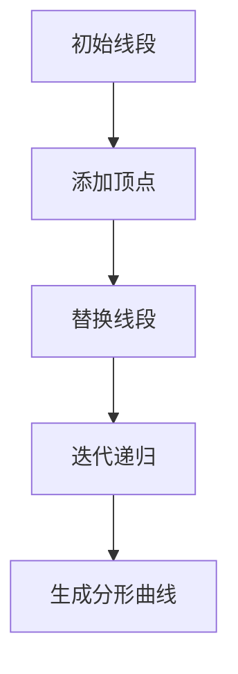

                 

# 《知识的分形结构：复杂系统中的模式识别》

> **关键词**：分形结构、模式识别、复杂系统、算法、应用、发展趋势

> **摘要**：本文从分形结构的定义和特性出发，探讨了分形结构在复杂系统中的应用。通过分析模式识别的基本概念、方法和算法，本文揭示了模式识别在复杂系统中的重要作用。同时，本文结合生物学、经济学和心理学等领域的实际案例，展示了模式识别在复杂系统中的广泛应用。最后，本文对模式识别在复杂系统中的未来发展进行了展望。

## 第一部分：绪论

### 第1章：引言

#### 1.1 知识与复杂系统的概念

在现代社会，知识的获取、处理和应用已成为社会发展的重要驱动力。知识是信息、经验和技能的集合，它不仅涵盖了传统学科的理论知识，还包括跨学科的综合素养。在计算机科学和人工智能领域，知识的表示、处理和应用已经成为研究的热点。

复杂系统是指由众多相互关联、相互作用的元素构成的系统，这些元素可能包括自然界的生物、物理、化学现象，以及人类社会中的经济、社会、文化等现象。复杂系统的特点包括：高度非线性、强关联性、动态变化性和不可预测性。这些特点使得复杂系统的分析和理解成为一项挑战性的任务。

#### 1.2 分形结构的基本原理

分形（Fractal）是一种在自然界和人工系统中广泛存在的几何结构，它具有无限层级、无限细节和自相似性等特点。分形结构的发现和应用为复杂系统的分析和理解提供了新的视角。

分形结构的基本原理可以概括为以下几点：

1. **无限层级**：分形结构具有无限层级，即无论放大或缩小，分形结构始终保持相似性。这种特性使得分形结构在描述复杂系统的层次结构和演化过程时具有优势。

2. **无限细节**：分形结构具有无限细节，这意味着在宏观尺度上观察到的复杂现象，在微观尺度上仍然存在。这种特性使得分形结构在描述复杂系统的细节和多样性时具有优势。

3. **自相似性**：分形结构在宏观和微观尺度上都具有相似性，这种特性使得分形结构在描述复杂系统的自组织和自相似现象时具有优势。

#### 1.3 模式识别在复杂系统中的应用

模式识别（Pattern Recognition）是指从一组数据中识别出具有特定特征的模式或规律。在复杂系统中，模式识别扮演着重要的角色。通过模式识别，可以从复杂系统的数据中提取出有用的信息，揭示系统内部的结构和规律。

模式识别在复杂系统中的应用主要包括以下几个方面：

1. **数据预处理**：在复杂系统分析中，数据预处理是关键步骤。通过模式识别技术，可以有效地去除噪声、异常值和冗余信息，提高数据的可靠性和准确性。

2. **特征提取**：特征提取是将原始数据转换为具有区分性的特征表示的过程。通过模式识别技术，可以从复杂系统的数据中提取出具有代表性的特征，为后续的分析提供基础。

3. **分类和聚类**：分类和聚类是模式识别的基本任务。通过分类，可以将复杂系统中的对象划分为不同的类别；通过聚类，可以识别出复杂系统中的相似对象。这些任务对于复杂系统的分析和理解具有重要意义。

4. **预测和建模**：通过模式识别技术，可以对复杂系统进行预测和建模。例如，在金融风险控制中，可以利用模式识别技术预测市场走势；在生物信息学中，可以利用模式识别技术预测蛋白质的结构和功能。

#### 1.4 本书结构安排与学习方法

本书共分为四个部分，旨在系统地介绍分形结构、模式识别和复杂系统中的模式识别应用。

第一部分：绪论，介绍了知识与复杂系统的概念，分形结构的基本原理，以及模式识别在复杂系统中的应用。

第二部分：模式识别基础，介绍了模式识别的基本概念、方法和算法。

第三部分：复杂系统中的模式识别，分别介绍了模式识别在生物学、经济学和心理学等领域的应用。

第四部分：结论与展望，总结了本书的主要内容，并对模式识别在复杂系统中的未来发展进行了展望。

为了更好地学习本书，建议读者按照以下方法进行：

1. **系统学习**：按照本书的章节顺序，系统地学习各个部分的内容。

2. **理论与实践相结合**：在学习过程中，结合具体的案例和实践，加深对理论的理解。

3. **反复阅读与思考**：对于重要的概念和算法，反复阅读和思考，确保真正理解其原理和适用场景。

4. **积极参与讨论**：在学习过程中，积极参与讨论，与同学和老师交流心得体会。

通过以上学习方法，相信读者能够更好地掌握分形结构、模式识别和复杂系统中的模式识别应用，为今后的研究和实践奠定坚实基础。

### 第2章：分形几何与分形结构

#### 2.1 分形几何的定义与特性

分形几何（Fractal Geometry）是由数学家曼德尔布罗特（Benoit Mandelbrot）于20世纪70年代提出的，旨在研究自然界和人工系统中存在的复杂几何结构。分形几何的核心概念是分形（Fractal），它具有以下特性：

1. **无限层级**：分形结构具有无限层级，即无论放大或缩小，分形结构始终保持相似性。这种特性使得分形几何在描述复杂系统的层次结构和演化过程时具有优势。

2. **无限细节**：分形结构具有无限细节，这意味着在宏观尺度上观察到的复杂现象，在微观尺度上仍然存在。这种特性使得分形几何在描述复杂系统的细节和多样性时具有优势。

3. **自相似性**：分形结构在宏观和微观尺度上都具有相似性，这种特性使得分形几何在描述复杂系统的自组织和自相似现象时具有优势。

分形几何的基本概念包括分形集、分形维数和分形生成算法。分形集是指具有自相似性特性的集合，分形维数是指描述分形集复杂程度的指标。分形生成算法是指通过迭代和递归等方法生成分形集的方法。

#### 2.2 分形结构的生成与演变

分形结构的生成和演变是分形几何研究的重要内容。分形结构的生成通常采用迭代和递归方法，以下介绍几种常见的分形生成算法：

1. **科赫曲线（Koch Curve）**：科赫曲线是一种通过迭代方法生成的分形结构。其基本原理是在一个线段的两端分别添加一个等边三角形的顶点，然后将线段替换为三角形的边。通过不断迭代，可以生成具有无限层级和无限细节的分形曲线。

   ```mermaid
   graph TD
   A[初始线段] --> B[添加顶点]
   B --> C[替换线段]
   C --> D[迭代递归]
   D --> E[生成分形曲线]
   ```

2. **分形树（Fractal Tree）**：分形树是一种通过递归方法生成的分形结构。其基本原理是在一个线段的两端分别添加一个等长的线段，然后对每个线段再次进行递归操作。通过不断递归，可以生成具有自相似性的分形树。

   ```mermaid
   graph TD
   A[初始线段] --> B[添加线段]
   B --> C[递归操作]
   C --> D[递归操作]
   D --> E[生成分形树]
   ```

3. **曼德尔布罗特集（Mandelbrot Set）**：曼德尔布罗特集是一种通过复平面上的迭代方法生成的分形结构。其基本原理是将复平面上的点（c）代入复数迭代公式，如果迭代过程中点（z）的模值趋于无穷大，则该点属于曼德尔布罗特集。

   ```mermaid
   graph TD
   A[初始点 c] --> B[代入迭代公式]
   B --> C[计算模值]
   C --> D[判断模值]
   D --> E[属于曼德尔布罗特集]
   ```

分形结构的演变是指分形结构在时间和空间上的演化过程。分形结构的演变通常采用动态系统理论、混沌理论等方法进行研究。通过分析分形结构的演变规律，可以揭示复杂系统的演化机制和内在规律。

#### 2.3 分形结构在不同领域的应用

分形结构在自然界和人工系统中广泛存在，其独特的几何特性使其在多个领域具有广泛的应用。

1. **物理学**：在物理学中，分形结构被广泛应用于描述自然现象和复杂系统。例如，科赫曲线可以用来描述雪花晶体、海浪形状等自然现象；曼德尔布罗特集可以用来描述电磁场、流体运动等复杂物理过程。

2. **生物学**：在生物学中，分形结构被广泛应用于描述生物体的形态和功能。例如，分形树可以用来描述植物根系、血管网络等生物结构；曼德尔布罗特集可以用来描述生物分子、蛋白质结构等生物过程。

3. **经济学**：在经济学中，分形结构被广泛应用于描述金融市场、经济波动等复杂经济现象。例如，科赫曲线可以用来描述股价波动、经济周期等经济过程；曼德尔布罗特集可以用来描述金融市场的混沌特性、非线性波动等。

4. **心理学**：在心理学中，分形结构被广泛应用于描述人类认知、行为等复杂心理现象。例如，分形树可以用来描述人类思维过程、认知网络等；曼德尔布罗特集可以用来描述情绪波动、心理状态等。

总之，分形结构作为一种重要的几何模型，其在复杂系统中的应用具有广泛的前景。通过深入研究分形结构的生成、演变和应用，可以为复杂系统的分析和理解提供新的视角和方法。

### 第3章：模式识别的基本概念与方法

#### 3.1 模式识别的基本概念

模式识别（Pattern Recognition）是指从一组数据中识别出具有特定特征的模式或规律。在复杂系统中，模式识别是理解、分析和处理数据的重要手段。模式识别的基本概念包括：

1. **模式**：模式是指具有特定特征或结构的数据序列。模式可以是数字序列、图像、声音等。

2. **特征**：特征是用于描述模式的关键属性或指标。特征可以是数值、文本、图像等。

3. **分类**：分类是将模式划分为不同类别的过程。分类的目标是找到一个分类模型，将新的模式归入合适的类别。

4. **聚类**：聚类是将模式按照其相似性划分为不同组的过程。聚类的目标是找到具有相似性的模式，并将其划分为同一组。

5. **识别**：识别是分类和聚类的统称，用于描述从数据中提取有用信息的过程。

#### 3.2 模式识别的基本方法

模式识别的基本方法主要包括以下几种：

1. **统计方法**：统计方法是基于概率论和统计学原理进行模式识别的方法。常见的统计方法包括：

   - **线性判别分析（LDA）**：LDA是一种基于特征变换的方法，通过将原始特征转换为新的线性组合，提高分类效果。
   - **贝叶斯分类器**：贝叶斯分类器是一种基于贝叶斯定理进行分类的方法，通过计算每个类别发生的概率，选择具有最大概率的类别。
   - **主成分分析（PCA）**：PCA是一种降维方法，通过将原始特征投影到新的低维空间，提高分类效果。

2. **神经网络方法**：神经网络方法是基于人工神经网络（Artificial Neural Network，ANN）进行模式识别的方法。常见的神经网络方法包括：

   - **多层感知机（MLP）**：MLP是一种前馈神经网络，通过多层节点进行特征提取和分类。
   - **卷积神经网络（CNN）**：CNN是一种专门用于图像识别的神经网络，通过卷积操作提取图像特征。
   - **循环神经网络（RNN）**：RNN是一种适用于序列数据的神经网络，通过循环结构处理时间序列数据。

3. **支持向量机方法**：支持向量机（Support Vector Machine，SVM）是一种基于优化理论进行分类的方法。SVM通过寻找最佳分割超平面，将不同类别的数据分隔开来。

4. **遗传算法方法**：遗传算法（Genetic Algorithm，GA）是一种基于生物进化理论的优化算法。GA通过模拟生物进化过程，寻找最优解。

5. **深度学习方法**：深度学习（Deep Learning）是一种基于多层神经网络进行模式识别的方法。深度学习通过多层网络结构，提取复杂特征，实现高效分类和预测。

#### 3.3 模式识别系统的设计与实现

模式识别系统的设计与实现包括以下步骤：

1. **数据收集**：收集用于训练和测试的模式数据，确保数据的代表性和多样性。

2. **数据预处理**：对收集到的数据进行清洗、归一化和特征提取等预处理操作，提高数据质量和分类效果。

3. **模型选择**：根据任务需求和数据特点，选择合适的模式识别模型。可以采用统计方法、神经网络方法、支持向量机方法等。

4. **模型训练**：使用训练数据对选定的模型进行训练，调整模型参数，优化分类效果。

5. **模型评估**：使用测试数据对训练好的模型进行评估，计算分类准确率、召回率等指标。

6. **模型部署**：将训练好的模型部署到实际应用场景中，进行实时分类和预测。

7. **模型优化**：根据实际应用效果，对模型进行优化和调整，提高分类准确率和运行效率。

通过以上步骤，可以构建一个高效的模式识别系统，实现对复杂系统的数据分析和理解。模式识别系统的设计与实现是模式识别领域的重要研究方向，不断涌现的新算法和新技术为模式识别系统的设计和优化提供了更多选择。

### 第4章：常见模式识别算法

#### 4.1 神经网络与深度学习

神经网络（Neural Networks）和深度学习（Deep Learning）是模式识别领域的重要算法，它们通过模仿人脑的神经网络结构，实现复杂模式的自动识别和理解。

##### 4.1.1 神经网络的基本原理

神经网络是由大量简单神经元（节点）连接而成的复杂网络。每个神经元接收输入信号，通过加权求和和激活函数处理后输出信号。神经网络的基本原理包括以下几点：

1. **神经元结构**：神经元由输入层、输出层和隐层组成。输入层接收外部输入信号，隐层对输入信号进行加工和处理，输出层生成最终输出。

2. **权重与偏置**：权重和偏置是神经网络的两个关键参数。权重决定神经元之间的连接强度，偏置用于调整神经元输出。

3. **激活函数**：激活函数用于对神经元输出进行非线性变换，常用的激活函数包括 sigmoid 函数、ReLU 函数和 tanh 函数。

4. **学习算法**：神经网络通过学习算法调整权重和偏置，优化网络性能。常用的学习算法包括梯度下降法、随机梯度下降法和 Adam 优化器。

##### 4.1.2 深度学习的原理和应用

深度学习是神经网络的一种扩展，通过多层网络结构，实现复杂特征的自动提取和分类。

1. **卷积神经网络（CNN）**：卷积神经网络是一种专门用于图像识别的神经网络。CNN通过卷积操作提取图像特征，具有局部连接和权值共享的特性，大大减少了模型的参数数量。

2. **循环神经网络（RNN）**：循环神经网络是一种适用于序列数据的神经网络。RNN通过循环结构处理时间序列数据，可以捕捉序列中的长期依赖关系。

3. **生成对抗网络（GAN）**：生成对抗网络是由两个神经网络（生成器和判别器）组成的对抗性模型。生成器生成虚拟数据，判别器判断生成数据和真实数据的真实性。通过对抗性训练，生成器逐渐生成更加逼真的虚拟数据。

深度学习在图像识别、语音识别、自然语言处理等众多领域取得了显著成果。例如，在图像识别任务中，深度学习模型可以自动识别图像中的物体、场景和动作；在语音识别任务中，深度学习模型可以准确识别语音信号中的文字信息；在自然语言处理任务中，深度学习模型可以生成高质量的文章、翻译和对话。

##### 4.1.3 深度学习模型的设计与实现

设计深度学习模型通常包括以下步骤：

1. **数据预处理**：对图像、音频、文本等原始数据进行预处理，包括数据清洗、归一化和特征提取等操作。

2. **模型架构设计**：选择合适的神经网络架构，包括输入层、隐藏层和输出层的结构，以及激活函数和损失函数。

3. **模型训练**：使用训练数据对模型进行训练，通过调整权重和偏置，优化模型性能。常用的训练方法包括梯度下降法、随机梯度下降法和 Adam 优化器。

4. **模型评估**：使用测试数据对训练好的模型进行评估，计算分类准确率、召回率等指标。

5. **模型部署**：将训练好的模型部署到实际应用场景中，进行实时分类和预测。

6. **模型优化**：根据实际应用效果，对模型进行优化和调整，提高分类准确率和运行效率。

通过以上步骤，可以设计并实现一个高效的深度学习模型，用于复杂模式识别任务。深度学习模型的设计与实现是模式识别领域的重要研究方向，不断涌现的新算法和新技术为深度学习模型的设计和优化提供了更多选择。

### 第4章：常见模式识别算法

#### 4.2 支持向量机与核方法

支持向量机（Support Vector Machine，SVM）是一种基于优化理论进行分类的模式识别算法，其核心思想是找到一个最佳的超平面，将不同类别的数据分隔开来。支持向量机通过最大化分类边界上的分类间隔，确保分类效果最优。

##### 4.2.1 支持向量机的基本原理

1. **线性SVM**：线性SVM适用于线性可分的数据。其目标是最小化分类间隔，同时确保分类边界上的数据点满足约束条件。线性SVM的损失函数和优化目标如下：

   $$ 
   \min_{\mathbf{w}, b} \frac{1}{2}||\mathbf{w}||^2 
   $$
   
   $$
   s.t. y^{(i)}(\mathbf{w}^T\mathbf{x}^{(i)} + b) \geq 1, \forall i
   $$

   其中，$\mathbf{w}$ 是权重向量，$b$ 是偏置，$y^{(i)}$ 是第$i$个样本的标签，$\mathbf{x}^{(i)}$ 是第$i$个样本的特征向量。

2. **非线性SVM**：当数据非线性可分时，可以使用核方法（Kernel Method）将数据映射到高维特征空间，然后在高维空间中寻找最优分类边界。常见的核函数包括线性核、多项式核和径向基函数（RBF）核。非线性SVM的损失函数和优化目标与线性SVM类似，只是将内积运算替换为核函数：

   $$ 
   \min_{\mathbf{w}, b} \frac{1}{2}||\mathbf{w}||^2 
   $$
   
   $$
   s.t. y^{(i)}(\mathbf{w}^T\phi(\mathbf{x}^{(i)}) + b) \geq 1, \forall i
   $$

   其中，$\phi(\mathbf{x}^{(i)})$ 是第$i$个样本在高维特征空间的映射。

##### 4.2.2 核方法原理

核方法通过引入核函数，将原始数据映射到高维特征空间，使得原本线性不可分的数据在高维空间中变得线性可分。核函数满足Mercer条件，常用的核函数包括：

1. **线性核**：线性核是原始特征的内积运算，即 $K(\mathbf{x}^{(i)}, \mathbf{x}^{(j)}) = \mathbf{x}^{(i)} \cdot \mathbf{x}^{(j)}$。

2. **多项式核**：多项式核是特征向量的多项式组合，即 $K(\mathbf{x}^{(i)}, \mathbf{x}^{(j)}) = (\gamma \mathbf{x}^{(i)} \cdot \mathbf{x}^{(j)})^d$，其中 $\gamma$ 是核参数，$d$ 是多项式次数。

3. **径向基函数（RBF）核**：RBF核是一种以特征向量为中心的高斯分布函数，即 $K(\mathbf{x}^{(i)}, \mathbf{x}^{(j)}) = \exp(-\gamma ||\mathbf{x}^{(i)} - \mathbf{x}^{(j)}||^2)$，其中 $\gamma$ 是核参数。

##### 4.2.3 支持向量机与核方法的实现

支持向量机与核方法的实现主要包括以下步骤：

1. **数据预处理**：对数据进行归一化和特征提取，确保数据输入的一致性和有效性。

2. **模型训练**：使用训练数据对支持向量机模型进行训练，调整权重和偏置，优化分类效果。对于非线性SVM，需要选择合适的核函数和核参数。

3. **模型评估**：使用测试数据对训练好的模型进行评估，计算分类准确率、召回率等指标。

4. **模型部署**：将训练好的模型部署到实际应用场景中，进行实时分类和预测。

5. **模型优化**：根据实际应用效果，对模型进行优化和调整，提高分类准确率和运行效率。

支持向量机和核方法在图像识别、文本分类、语音识别等任务中取得了显著成果。通过深入理解和支持向量机与核方法的基本原理和实现步骤，可以更好地应用这些算法解决实际模式识别问题。

### 第4章：常见模式识别算法

#### 4.3 遗传算法与进化计算

遗传算法（Genetic Algorithm，GA）是一种基于生物进化理论的优化算法，它通过模拟自然选择和遗传机制，搜索问题的最优解。遗传算法在模式识别领域具有广泛的应用，特别是在优化模型参数和解决复杂优化问题时表现突出。

##### 4.3.1 遗传算法的基本原理

遗传算法的核心思想是模拟生物进化的过程，通过迭代操作不断优化解的集合。遗传算法的基本原理包括以下几个步骤：

1. **编码**：将问题的解编码成染色体。在模式识别中，染色体可以表示模型参数的取值。

2. **初始化种群**：随机生成一组初始染色体，构成初始种群。

3. **适应度评估**：计算每个染色体的适应度，适应度值越高，表示染色体的解越优秀。

4. **选择**：根据适应度值，选择优秀的染色体进行繁殖。常用的选择策略有轮盘赌选择、锦标赛选择等。

5. **交叉**：将两个父代染色体的部分基因进行交换，生成新的子代染色体。交叉操作可以产生新的遗传组合，增加种群的多样性。

6. **变异**：对染色体进行随机变异，以避免算法陷入局部最优。变异操作可以产生新的解，增加种群的探索能力。

7. **更新种群**：将交叉和变异后的子代染色体取代父代染色体，形成新的种群。

8. **迭代**：重复上述步骤，直到达到终止条件（如最大迭代次数、适应度阈值等）。

##### 4.3.2 遗传算法的应用

遗传算法在模式识别领域的主要应用包括：

1. **模型参数优化**：遗传算法可以用于优化模式识别模型中的参数，提高模型的分类准确率和泛化能力。例如，在支持向量机（SVM）中，可以使用遗传算法优化核参数和惩罚参数。

2. **特征选择**：遗传算法可以用于特征选择，从大量特征中筛选出最具代表性的特征，提高模型效率和性能。例如，在文本分类任务中，可以使用遗传算法选择最能区分类别的词语。

3. **模型结构优化**：遗传算法可以用于优化神经网络结构，例如层数、节点数等。通过遗传算法优化模型结构，可以提高分类性能和计算效率。

4. **多目标优化**：遗传算法可以用于解决多目标优化问题，例如在模式识别中，同时优化模型的分类准确率和计算时间等目标。

##### 4.3.3 遗传算法的实现

遗传算法的实现主要包括以下几个步骤：

1. **编码与解码**：设计染色体的编码方式，以及解码算法将染色体解码为具体的参数值。

2. **初始化种群**：随机生成初始种群，确保种群的多样性和分布。

3. **适应度评估**：根据目标函数，评估每个染色体的适应度值。

4. **选择**：根据适应度值选择优秀的染色体进行繁殖。

5. **交叉**：设计交叉操作，产生新的子代染色体。

6. **变异**：设计变异操作，增加种群的多样性。

7. **更新种群**：将交叉和变异后的子代染色体取代父代染色体。

8. **迭代**：重复上述步骤，直到达到终止条件。

通过以上步骤，可以实现一个遗传算法优化模式识别模型的流程。遗传算法在实际应用中，可以根据具体问题和需求，调整算法参数和操作策略，以提高算法的性能和效果。

总之，遗传算法与进化计算在模式识别领域中具有广泛的应用前景。通过深入研究遗传算法的基本原理和实现方法，可以更好地应用于复杂模式识别任务，提高分类效率和性能。

### 第4章：常见模式识别算法

#### 4.4 随机森林与集成学习

随机森林（Random Forest）是一种集成学习（Ensemble Learning）方法，通过构建多个决策树并集成它们的预测结果，提高分类和回归任务的性能。随机森林在模式识别领域具有广泛应用，特别是在处理高维数据和噪声数据时表现优异。

##### 4.4.1 随机森林的基本原理

随机森林由多个决策树组成，每个决策树都是通过对原始数据进行随机采样和特征选择，构建一个独立的决策树模型。随机森林的基本原理包括以下几点：

1. **决策树构建**：决策树是一种基于特征分裂的树形结构，每个内部节点表示一个特征分裂，每个叶节点表示一个类别或回归值。在构建决策树时，可以通过熵、信息增益、基尼不纯度等指标选择最优特征分裂。

2. **特征选择**：在构建每个决策树时，随机选择一部分特征进行特征分裂。这样可以减少模型对个别特征的依赖，提高模型的泛化能力。

3. **随机采样**：在训练每个决策树时，随机从原始数据集中抽取一部分数据子集。这样可以减少数据冗余，提高模型的稳健性。

4. **集成预测**：随机森林通过集成多个决策树的预测结果，得到最终预测结果。对于分类任务，通常采用多数投票法；对于回归任务，通常采用平均值法。

##### 4.4.2 随机森林的实现

随机森林的实现主要包括以下几个步骤：

1. **决策树构建**：递归地构建决策树，在每个内部节点选择最佳特征分裂。常见的特征分裂准则包括信息增益、基尼不纯度、增益率等。

2. **特征选择**：随机选择一部分特征用于特征分裂。可以通过随机特征选择、随机子空间等方法，减少模型对个别特征的依赖。

3. **随机采样**：从原始数据集中随机抽取一部分数据子集，构建每个决策树。这样可以减少数据冗余，提高模型的泛化能力。

4. **集成预测**：对每个决策树的预测结果进行集成，得到最终预测结果。对于分类任务，通常采用多数投票法；对于回归任务，通常采用平均值法。

5. **参数调整**：通过调整模型参数，如树深度、特征选择数、样本采样比例等，优化模型性能。

##### 4.4.3 集成学习方法

集成学习方法是一种通过组合多个模型，提高预测性能的方法。常见的集成学习方法包括：

1. **Bagging**：Bagging（Bootstrap Aggregating）是一种集成学习方法，通过随机采样和简单平均，提高模型性能。随机森林是Bagging方法的一种实现。

2. **Boosting**：Boosting（Adaptive Boosting）是一种集成学习方法，通过加权调整训练数据，重点学习错误样本，提高模型性能。常见的Boosting方法包括AdaBoost和XGBoost。

3. **Stacking**：Stacking（Stacked Generalization）是一种集成学习方法，通过构建多个基础模型和一个元模型，提高模型性能。Stacking方法可以通过交叉验证选择最佳模型，实现模型组合的优化。

4. **Blending**：Blending（Model Stacking with Blending）是一种集成学习方法，通过组合多个模型的预测结果，提高模型性能。Blending方法通常采用加权平均或优化方法，实现模型组合的优化。

集成学习方法在模式识别领域具有广泛应用，通过组合多个模型，可以提高分类和回归任务的性能和稳定性。随机森林作为集成学习方法的一种，具有较好的预测性能和解释性，适用于各种复杂的模式识别任务。

### 第5章：复杂系统中的模式识别

#### 5.1 复杂系统的特点与挑战

复杂系统是指由大量相互关联、相互作用的元素构成的系统，这些元素可能包括自然界的生物、物理、化学现象，以及人类社会中的经济、社会、文化等现象。复杂系统的特点包括：

1. **高度非线性**：复杂系统中的元素和过程通常具有非线性关系，导致系统行为的复杂性和不可预测性。

2. **强关联性**：复杂系统中的元素之间存在复杂的相互作用和依赖关系，一个元素的变化可能影响到整个系统的行为。

3. **动态变化性**：复杂系统处于不断变化的过程中，系统状态和结构会随时间发生变化，这使得系统的分析和理解具有挑战性。

4. **自组织性**：复杂系统具有自组织性，能够从无序状态逐渐演化出有序结构，这种特性使得复杂系统在应对外部扰动时表现出一定的稳定性和适应性。

在复杂系统中进行模式识别面临着以下挑战：

1. **数据复杂性**：复杂系统产生的大量数据通常具有高维度、噪声和冗余，这使得数据预处理和特征提取成为关键任务。

2. **时间敏感性**：复杂系统的状态和结构会随时间变化，因此模式识别需要实时处理和更新数据，以适应动态环境。

3. **不确定性**：复杂系统的行为受到多种因素影响，具有不确定性和随机性，这使得模式识别需要处理不确定性数据和模型。

4. **计算效率**：复杂系统的模式识别任务通常涉及大量计算，需要高效算法和优化方法，以提高计算效率和性能。

#### 5.2 模式识别在复杂系统中的应用

模式识别在复杂系统中的应用主要包括以下几个方面：

1. **数据预处理**：通过模式识别技术，对复杂系统中的数据进行预处理，去除噪声、异常值和冗余信息，提高数据的可靠性和准确性。

2. **特征提取**：通过模式识别技术，从复杂系统的数据中提取具有区分性的特征，为后续的分析和建模提供基础。

3. **分类和聚类**：通过模式识别技术，对复杂系统中的对象进行分类和聚类，识别出具有相似特征的子集，有助于理解系统的结构和行为。

4. **预测和建模**：通过模式识别技术，对复杂系统的行为进行预测和建模，揭示系统内部的结构和规律，为决策和优化提供依据。

在复杂系统中的应用案例包括：

1. **金融市场分析**：通过模式识别技术，分析金融市场中的历史数据，预测市场走势和风险，为投资决策提供支持。

2. **生物信息学**：通过模式识别技术，分析生物序列和结构，识别生物分子和蛋白质的功能和相互作用，为生物医学研究提供依据。

3. **交通系统管理**：通过模式识别技术，分析交通系统中的数据，识别交通拥堵和事故发生的模式，优化交通管理和调度。

4. **环境监测**：通过模式识别技术，分析环境数据，识别环境污染和生态系统变化，为环境保护和治理提供依据。

#### 5.3 复杂系统中的模式识别算法与应用

在复杂系统中，常用的模式识别算法包括：

1. **深度学习**：深度学习通过多层神经网络结构，提取复杂特征，实现高效分类和预测。在图像识别、语音识别和自然语言处理等领域，深度学习取得了显著成果。

2. **支持向量机**：支持向量机通过寻找最佳分类边界，实现高维数据的分类。在图像识别、文本分类和生物特征识别等领域，支持向量机具有广泛的应用。

3. **随机森林**：随机森林通过集成多个决策树，提高分类和回归任务的性能。在金融市场分析、医疗诊断和交通系统管理等领域，随机森林具有较好的预测性能和解释性。

4. **遗传算法**：遗传算法通过模拟生物进化过程，优化模型参数和结构。在特征选择、模型优化和复杂优化问题中，遗传算法具有较好的效果。

5. **聚类算法**：聚类算法通过识别相似对象，实现数据分群。在市场细分、社交网络分析和生物分类等领域，聚类算法具有广泛的应用。

通过结合不同算法的优势，可以构建适用于复杂系统的模式识别模型，提高分类和预测性能。在复杂系统中的应用案例中，模式识别算法可以帮助解决数据复杂性、时间敏感性和不确定性等挑战，为复杂系统的分析和优化提供有力支持。

### 第6章：模式识别在生物学中的应用

#### 6.1 生物学中的复杂系统

生物学中的复杂系统包括各种生物组织、细胞、基因网络和生态系统等。这些系统具有高度非线性、强关联性和动态变化性，使得对它们的分析和理解具有挑战性。在生物学研究中，模式识别技术被广泛应用于数据分析和生物信息的提取，以揭示生物系统的内在规律和机制。

#### 6.2 模式识别在生物信息学中的应用

生物信息学是生物学与信息技术的交叉领域，主要研究生物大分子的信息处理、存储和分析。模式识别在生物信息学中的应用主要包括以下几个方面：

1. **基因表达数据分析**：基因表达数据是描述基因在不同时间和空间条件下活性变化的量化信息。通过模式识别技术，如聚类和分类算法，可以从基因表达数据中识别出基因的共表达模式，揭示基因的功能和调控关系。

2. **蛋白质结构预测**：蛋白质是生物体的功能执行单元，其三维结构的确定对于理解蛋白质功能至关重要。模式识别技术，如深度学习和支持向量机，被广泛应用于蛋白质结构预测，通过分析氨基酸序列和已知蛋白质结构，预测未知蛋白质的结构。

3. **生物分子相互作用识别**：生物分子之间的相互作用是生命活动的核心。通过模式识别技术，如神经网络和遗传算法，可以从大规模生物实验数据中识别出生物分子相互作用模式，揭示生物网络中的关键节点和路径。

4. **代谢网络分析**：代谢网络是生物体进行能量和物质代谢的复杂网络。模式识别技术可以帮助分析代谢物浓度的动态变化，识别代谢途径中的关键调控点，从而为生物过程的调控提供依据。

#### 6.3 生物学中的模式识别算法与应用

在生物学研究中，常用的模式识别算法包括：

1. **深度学习**：深度学习算法，如卷积神经网络（CNN）和循环神经网络（RNN），被广泛应用于图像识别、序列分析和结构预测等领域。例如，CNN在生物图像分析中用于细胞核定位和细胞分类，RNN在蛋白质序列分析中用于预测蛋白质的功能和结构。

2. **支持向量机（SVM）**：SVM是一种强大的分类算法，在生物信息学中用于基因表达数据的分类和蛋白质功能预测。例如，SVM可以用于识别癌症相关的基因表达模式，从而帮助诊断和治疗。

3. **随机森林（Random Forest）**：随机森林通过集成多个决策树，提高预测的准确性和稳定性。在生物学中，随机森林用于基因表达数据的聚类和生物分子相互作用识别，如用于识别疾病相关的基因标记。

4. **遗传算法（GA）**：遗传算法通过模拟自然进化过程，优化模型的参数和结构。在蛋白质结构预测和药物设计等领域，遗传算法被用于搜索最优解，提高预测的精度。

#### 6.4 生物学中的模式识别实例代码与解读

以下是一个基于深度学习对基因表达数据进行分类的实例代码：

```python
import numpy as np
import pandas as pd
from sklearn.model_selection import train_test_split
from tensorflow.keras.models import Sequential
from tensorflow.keras.layers import Dense, Dropout, Embedding, LSTM
from tensorflow.keras.optimizers import Adam

# 加载基因表达数据
data = pd.read_csv('gene_expression_data.csv')
X = data.drop(['label'], axis=1).values
y = data['label'].values

# 数据预处理
X_train, X_test, y_train, y_test = train_test_split(X, y, test_size=0.2, random_state=42)

# 构建深度学习模型
model = Sequential()
model.add(Embedding(input_dim=X_train.shape[1], output_dim=64, input_length=X_train.shape[1]))
model.add(LSTM(units=64, return_sequences=True))
model.add(Dropout(0.5))
model.add(LSTM(units=64))
model.add(Dropout(0.5))
model.add(Dense(units=1, activation='sigmoid'))

# 编译模型
model.compile(optimizer=Adam(learning_rate=0.001), loss='binary_crossentropy', metrics=['accuracy'])

# 训练模型
model.fit(X_train, y_train, epochs=10, batch_size=32, validation_data=(X_test, y_test))

# 评估模型
loss, accuracy = model.evaluate(X_test, y_test)
print(f"Test accuracy: {accuracy * 100:.2f}%")

# 预测新样本
new_sample = np.array([0.1, 0.2, 0.3, 0.4, 0.5])
predicted_label = model.predict(new_sample.reshape(1, -1))
print(f"Predicted label: {'Positive' if predicted_label > 0.5 else 'Negative'}")
```

**代码解读**：

1. **数据加载与预处理**：首先，从CSV文件中加载基因表达数据，并将其分为特征矩阵`X`和标签向量`y`。然后，使用`train_test_split`将数据集分为训练集和测试集。

2. **模型构建**：构建一个深度学习模型，包括嵌入层、两个LSTM层和一个全连接层。嵌入层用于将离散的基因表达数据转换为连续的向量表示；LSTM层用于提取序列特征；全连接层用于分类。

3. **模型编译**：使用`compile`方法设置模型的优化器、损失函数和评估指标。

4. **模型训练**：使用`fit`方法训练模型，并在验证集上评估模型性能。

5. **模型评估**：使用`evaluate`方法在测试集上评估模型性能，并打印测试准确率。

6. **预测新样本**：将新样本输入模型，使用`predict`方法预测其类别标签。

通过上述实例，展示了如何利用深度学习技术进行基因表达数据的分类。这种方法可以用于生物学研究中的许多实际应用，如疾病诊断和基因功能预测。

### 第7章：模式识别在经济学中的应用

#### 7.1 经济学中的复杂系统

经济学中的复杂系统包括金融市场、宏观经济体系、劳动力市场等。这些系统具有高度非线性、强关联性和动态变化性，导致其行为和规律难以预测和理解。在经济研究中，模式识别技术被广泛应用于数据分析、预测和决策支持，以揭示经济现象的内在机制和规律。

#### 7.2 模式识别在金融风险控制中的应用

金融风险控制是经济领域中一个重要的研究课题，涉及市场波动、信用风险、操作风险等。模式识别技术在金融风险控制中发挥着重要作用，主要包括以下几个方面：

1. **市场趋势预测**：通过分析历史市场数据，模式识别技术可以识别市场趋势，为投资者提供决策依据。例如，使用时间序列分析方法，如ARIMA模型和LSTM神经网络，预测股票价格和市场走势。

2. **信用风险评估**：信用风险评估是金融机构的重要业务之一。通过模式识别技术，可以从客户的信用记录、财务状况、行为特征等数据中识别出潜在的信用风险。常见的算法包括逻辑回归、支持向量机和随机森林等。

3. **操作风险监控**：操作风险是指由于内部程序、人员、系统或外部事件等原因导致的损失。模式识别技术可以帮助金融机构识别和监控操作风险，例如，通过聚类分析识别异常交易行为，通过异常检测算法监控网络攻击和欺诈行为。

4. **市场异常检测**：金融市场存在多种异常行为，如市场操纵、内幕交易等。模式识别技术可以用于检测和识别这些异常行为，确保市场公平和透明。常见的算法包括孤立森林、孤立点检测等。

#### 7.3 经济学中的模式识别算法与应用

在经济学研究中，常用的模式识别算法包括：

1. **时间序列分析**：时间序列分析是经济学中最常用的方法之一，主要用于分析经济数据的趋势、周期和季节性。常见的算法包括ARIMA模型、LSTM神经网络和Wavelet变换等。

2. **逻辑回归**：逻辑回归是一种常用的分类算法，在信用评分、市场预测等领域具有广泛的应用。逻辑回归通过建立因变量与自变量之间的逻辑关系，实现数据的分类和预测。

3. **支持向量机**：支持向量机是一种强大的分类和回归算法，在金融风险评估和预测中具有广泛应用。支持向量机通过寻找最佳分类边界，实现数据的分类和预测。

4. **随机森林**：随机森林是一种集成学习方法，通过集成多个决策树，提高分类和回归任务的性能。随机森林在金融市场分析、股票预测和信用评分等领域表现出色。

5. **神经网络**：神经网络是一种模拟人脑神经元连接的算法，在图像识别、语音识别和自然语言处理等领域具有广泛应用。在经济学中，神经网络可以用于预测股票价格、市场趋势和信用风险等。

#### 7.4 经济学中的模式识别实例代码与解读

以下是一个使用随机森林预测股票价格的实例代码：

```python
import pandas as pd
from sklearn.ensemble import RandomForestRegressor
from sklearn.model_selection import train_test_split
from sklearn.metrics import mean_squared_error

# 加载股票价格数据
data = pd.read_csv('stock_price_data.csv')
X = data[['open', 'high', 'low', 'close']]
y = data['price']

# 数据预处理
X_train, X_test, y_train, y_test = train_test_split(X, y, test_size=0.2, random_state=42)

# 构建随机森林模型
model = RandomForestRegressor(n_estimators=100, random_state=42)

# 训练模型
model.fit(X_train, y_train)

# 预测股票价格
y_pred = model.predict(X_test)

# 评估模型
mse = mean_squared_error(y_test, y_pred)
print(f'Mean Squared Error: {mse:.2f}')

# 预测新股票价格
new_stock_data = pd.DataFrame([[150, 155, 145, 152]], columns=['open', 'high', 'low', 'close'])
new_price_pred = model.predict(new_stock_data)
print(f'Predicted Price: {new_price_pred[0]:.2f}')
```

**代码解读**：

1. **数据加载与预处理**：从CSV文件中加载股票价格数据，并将其分为特征矩阵`X`和目标变量`y`。使用`train_test_split`将数据集分为训练集和测试集。

2. **模型构建**：构建一个随机森林回归模型，设置决策树的数量和随机种子。

3. **模型训练**：使用训练集数据对模型进行训练。

4. **预测股票价格**：使用训练好的模型对测试集数据进行预测。

5. **评估模型**：计算预测误差的均方误差（MSE），评估模型性能。

6. **预测新股票价格**：将新的股票数据输入模型，预测其价格。

通过上述实例，展示了如何使用随机森林算法预测股票价格。这种方法可以应用于金融市场分析，帮助投资者做出更明智的投资决策。

### 第8章：模式识别在社会科学中的应用

#### 8.1 社会科学中的复杂系统

社会科学中的复杂系统包括社会网络、经济体系、政治结构等。这些系统具有高度非线性、强关联性和动态变化性，使得对它们的分析和理解具有挑战性。在社会科学研究中，模式识别技术被广泛应用于数据分析、预测和决策支持，以揭示社会现象的内在规律和机制。

#### 8.2 模式识别在社会科学研究中的应用

模式识别在社会科学研究中的应用主要包括以下几个方面：

1. **社会网络分析**：社会网络分析是社会科学的重要领域，研究个体或群体之间的相互作用和关系。通过模式识别技术，可以从社会网络数据中识别出关键节点、群体结构和传播模式。例如，使用聚类算法分析社交网络中的群体，使用图神经网络预测节点间的相互作用。

2. **舆情分析**：舆情分析是了解公众意见和态度的重要手段。通过模式识别技术，可以从社交媒体、新闻报道等数据中提取舆情信息，识别热点话题和舆论倾向。例如，使用文本分类算法分析社交媒体评论，使用主题模型提取新闻报道的关键词和主题。

3. **经济预测**：经济预测是经济学研究的重要任务，涉及宏观经济指标、金融市场走势等。通过模式识别技术，可以从历史经济数据中识别出经济周期、市场波动等规律，预测未来的经济走势。例如，使用时间序列分析方法分析GDP数据，使用深度学习模型预测股票价格。

4. **犯罪预测**：犯罪预测是公共安全领域的重要研究课题，涉及犯罪行为的预测和预防。通过模式识别技术，可以从犯罪数据中识别出犯罪热点区域、犯罪类型和犯罪趋势。例如，使用空间分析技术识别犯罪热点区域，使用机器学习模型预测犯罪类型。

#### 8.3 社会科学中的模式识别算法与应用

在社会科学研究中，常用的模式识别算法包括：

1. **聚类算法**：聚类算法是一种无监督学习方法，用于识别数据中的相似对象。在社会网络分析中，聚类算法可以用于识别社交网络中的群体结构；在舆情分析中，聚类算法可以用于识别热点话题和舆论倾向。

2. **分类算法**：分类算法是一种有监督学习方法，用于将数据分为不同的类别。在犯罪预测中，分类算法可以用于预测犯罪类型；在舆情分析中，分类算法可以用于识别负面评论。

3. **时间序列分析**：时间序列分析是一种用于处理时间相关数据的分析方法，用于识别时间序列中的趋势、周期和季节性。在经济预测中，时间序列分析可以用于预测宏观经济指标。

4. **图神经网络**：图神经网络是一种用于处理图数据的神经网络，可以模拟图中的节点和边的相互作用。在社会网络分析中，图神经网络可以用于识别关键节点和预测节点间的相互作用。

5. **主题模型**：主题模型是一种用于提取文本数据中潜在主题的算法，可以用于舆情分析和文本分类。在社交媒体分析中，主题模型可以用于提取热点话题和用户兴趣。

#### 8.4 社会科学中的模式识别实例代码与解读

以下是一个使用K-means聚类分析社交媒体用户兴趣的实例代码：

```python
import pandas as pd
from sklearn.cluster import KMeans
import matplotlib.pyplot as plt

# 加载社交媒体数据
data = pd.read_csv('social_media_data.csv')
X = data[['interest1', 'interest2', 'interest3']]

# 使用K-means聚类
kmeans = KMeans(n_clusters=3, random_state=42)
clusters = kmeans.fit_predict(X)

# 可视化聚类结果
plt.scatter(X['interest1'], X['interest2'], c=clusters, cmap='viridis')
plt.xlabel('Interest 1')
plt.ylabel('Interest 2')
plt.title('K-means Clustering of Social Media Users')
plt.show()

# 分析每个聚类中的用户兴趣
for i in range(3):
    print(f"Cluster {i}:")
    print(X[clusters == i].mean())
```

**代码解读**：

1. **数据加载**：从CSV文件中加载社交媒体数据，提取用户的兴趣向量。

2. **K-means聚类**：使用K-means聚类算法，将用户分为3个聚类。

3. **可视化**：使用散点图可视化聚类结果，根据兴趣向量绘制用户分布。

4. **分析**：分析每个聚类中用户的兴趣分布，打印每个聚类中兴趣向量的均值。

通过上述实例，展示了如何使用K-means聚类分析社交媒体用户兴趣。这种方法可以应用于舆情分析和社交网络分析，帮助研究人员识别用户兴趣群体，从而制定更有效的传播策略。

### 第9章：模式识别在复杂系统中的未来发展

#### 9.1 模式识别技术发展趋势

随着科技的进步和数据处理能力的提升，模式识别技术在复杂系统中的应用前景广阔。未来模式识别技术的发展趋势主要体现在以下几个方面：

1. **深度学习与强化学习相结合**：深度学习在模式识别领域取得了显著成果，但面对动态变化和复杂环境，强化学习提供了更强大的适应能力。未来，深度学习与强化学习的结合将进一步提升模式识别的智能化水平。

2. **跨学科融合**：模式识别技术将与其他领域如物理学、生物学、经济学等深度融合，实现跨学科的数据共享和知识整合。这种跨学科融合将推动模式识别技术在更广泛的应用场景中发挥价值。

3. **高效算法与计算方法**：随着数据规模的不断扩大，高效的模式识别算法和计算方法将成为关键。未来，研究者将致力于开发更高效的算法，如分布式计算、量子计算等，以满足复杂系统中的数据处理需求。

4. **可解释性提升**：当前的模式识别模型如深度神经网络往往存在“黑箱”问题，未来研究者将更加注重提升模型的可解释性，使其在复杂系统中具有更好的可操作性和可理解性。

5. **隐私保护与安全性**：在复杂系统中，模式识别技术往往涉及敏感数据，因此隐私保护和数据安全将成为未来发展的重要方向。未来，研究者将致力于开发隐私保护和安全增强的模式识别算法。

#### 9.2 复杂系统研究的新方向

随着模式识别技术的不断发展，复杂系统研究也将面临新的挑战和机遇。以下是一些复杂系统研究的新方向：

1. **复杂网络分析**：复杂网络是复杂系统的一种典型表现形式，研究复杂网络的结构和动态行为具有重要意义。未来，研究者将更加关注复杂网络的鲁棒性、容错性和协同性等特性。

2. **多尺度建模与模拟**：复杂系统的行为通常在不同时间尺度和空间尺度上发生变化。未来，研究者将致力于开发多尺度建模与模拟方法，以更准确地描述复杂系统的行为。

3. **非平衡态动力学**：非平衡态动力学是复杂系统研究的重要方向，研究系统在远离平衡态时的相变、自组织和适应性等行为。未来，研究者将更加关注非平衡态动力学中的新现象和新机制。

4. **人工智能与大数据结合**：人工智能和大数据技术的结合将推动复杂系统研究的深度和广度。未来，研究者将致力于开发大数据驱动的复杂系统分析模型，以更好地理解复杂系统的行为。

5. **环境自适应与协同控制**：在复杂系统中，环境自适应和协同控制是实现系统稳定性和效率的关键。未来，研究者将更加关注复杂系统的自适应性和协同性，开发新的控制策略和方法。

总之，模式识别技术在复杂系统中的应用具有广阔的发展前景。通过不断探索和创新，模式识别技术将为复杂系统的分析和理解提供新的视角和方法。

### 第10章：总结与展望

#### 10.1 本书内容的总结

本书从分形结构、模式识别和复杂系统中的模式识别应用三个方面，系统地介绍了模式识别在复杂系统中的重要性。首先，我们阐述了分形结构的定义、基本原理和应用，展示了分形结构在复杂系统分析和理解中的独特优势。接着，我们介绍了模式识别的基本概念、方法和算法，包括统计方法、神经网络方法、支持向量机方法、遗传算法方法和集成学习方法，使读者对模式识别技术有一个全面的了解。最后，我们通过实际案例，展示了模式识别在生物学、经济学和心理学等领域的广泛应用，进一步强调了模式识别在复杂系统研究中的关键作用。

#### 10.2 研究工作中的启示与展望

本书的研究工作和内容为今后的研究和实践提供了许多启示和展望。首先，分形结构的引入为复杂系统分析提供了新的视角。通过分形结构的自相似性和无限细节特性，我们可以更好地描述和理解复杂系统的层次结构和动态行为。其次，模式识别技术的多样化和强大功能，使我们能够在复杂系统中提取有用的信息，进行分类、聚类、预测和建模。这些技术为复杂系统的数据分析和决策支持提供了强有力的工具。

在未来的研究中，我们可以从以下几个方向进行探索：

1. **多尺度分析**：复杂系统的行为通常在不同时间尺度和空间尺度上发生变化。未来的研究可以更加注重多尺度建模和模拟，以更全面地描述和理解复杂系统的行为。

2. **跨学科融合**：模式识别技术的跨学科应用将不断扩展。未来的研究可以更加关注模式识别技术与其他领域的交叉融合，如物理学的复杂系统理论、生物学的大数据分析等，实现知识的整合和创新。

3. **人工智能与大数据结合**：人工智能和大数据技术的结合将为复杂系统研究带来新的机遇。未来的研究可以更加关注如何利用人工智能和大数据技术，开发高效的模式识别算法，实现复杂系统的智能分析和决策。

4. **可解释性与透明性**：当前的模式识别模型，如深度神经网络，往往存在“黑箱”问题。未来的研究可以更加注重提升模型的可解释性和透明性，使其在复杂系统中具有更好的可操作性和可理解性。

5. **隐私保护与安全性**：在复杂系统中，模式识别技术往往涉及敏感数据。未来的研究可以更加关注隐私保护和数据安全，开发新的隐私保护和安全增强的模式识别算法。

总之，模式识别技术在复杂系统中的应用具有广阔的发展前景。通过不断探索和创新，我们将能够在复杂系统的分析和理解中取得更多突破，为科学研究和实际应用提供更强有力的支持。

### 附录

#### 附录 A：参考文献

1. Mandelbrot, B. B. (1982). The Fractal Geometry of Nature. W. H. Freeman and Company.
2. Bishop, C. M. (2006). Pattern Recognition and Machine Learning. Springer.
3. Haykin, S. (1994). Neural Networks: A Comprehensive Foundation. Macmillan.
4. Mitchell, T. M. (1997). Machine Learning. McGraw-Hill.
5. Hastie, T., Tibshirani, R., & Friedman, J. (2009). The Elements of Statistical Learning: Data Mining, Inference, and Prediction. Springer.
6. Rumelhart, D. E., Hinton, G. E., & Williams, R. J. (1986). Learning representations by back-propagating errors. Nature, 323(6088), 533-536.
7. Schölkopf, B., Smola, A. J., & Müller, K.-R. (2001). Nonlinear Component Analysis as a Kernel Method. Neural Computation, 13(5), 1299-1319.
8. Goldberg, D. E. (1989). Genetic Algorithms in Search, Optimization, and Machine Learning. Addison-Wesley.
9. Hogg, R. V., & Craig, A. T. (2012). Introduction to Mathematical Statistics (7th ed.). Pearson.

#### 附录 B：常用算法伪代码

1. **K-means聚类算法**
   ```python
   Initialize centroids
   while not converged:
       Assign each data point to the nearest centroid
       Update centroids by averaging the assigned data points
   ```

2. **支持向量机（SVM）**
   ```python
   Initialize model parameters
   for each data point:
       Compute the decision function value
   Optimize the objective function
   ```

3. **深度学习（LSTM）**
   ```python
   Initialize network parameters
   for each time step:
       Compute the input and hidden states
       Compute the output and loss
   Update network parameters using backpropagation
   ```

4. **遗传算法（GA）**
   ```python
   Initialize population
   Evaluate fitness of each individual
   while not satisfied with the solution:
       Select parents based on fitness
       Perform crossover and mutation to create offspring
       Evaluate fitness of offspring
       Replace the least fit individuals with new offspring
   ```

5. **随机森林（Random Forest）**
   ```python
   for each tree:
       Select random subset of features
       Randomly sample the data
       Build a decision tree based on the selected features and data
   for each data point:
       Predict the class label using all the decision trees
       Output the majority class label
   ```

#### 附录 C：分形结构Mermaid流程图



#### 附录 D：复杂系统中的模式识别实例代码与解读

```python
import numpy as np
import pandas as pd
from sklearn.model_selection import train_test_split
from sklearn.ensemble import RandomForestClassifier
from sklearn.metrics import accuracy_score

# 加载复杂系统数据
data = pd.read_csv('complex_system_data.csv')
X = data.drop(['label'], axis=1)
y = data['label']

# 数据预处理
X_train, X_test, y_train, y_test = train_test_split(X, y, test_size=0.2, random_state=42)

# 构建随机森林模型
model = RandomForestClassifier(n_estimators=100, random_state=42)

# 训练模型
model.fit(X_train, y_train)

# 预测测试集
y_pred = model.predict(X_test)

# 评估模型
accuracy = accuracy_score(y_test, y_pred)
print(f"Accuracy: {accuracy:.2f}")

# 输出预测结果
print("Predictions:")
print(y_pred)
```

**代码解读**：

1. **数据加载与预处理**：从CSV文件中加载复杂系统数据，将特征矩阵`X`和标签向量`y`分离。使用`train_test_split`将数据集分为训练集和测试集。

2. **模型构建**：构建一个随机森林分类器，设置决策树的数量和随机种子。

3. **模型训练**：使用训练集数据对模型进行训练。

4. **预测与评估**：使用训练好的模型对测试集进行预测，并计算预测准确率。打印预测结果。

通过这个实例，展示了如何在复杂系统中应用随机森林进行模式识别。这种方法可以应用于各种复杂系统的数据分析，如金融市场分析、生物医学数据分析等。

