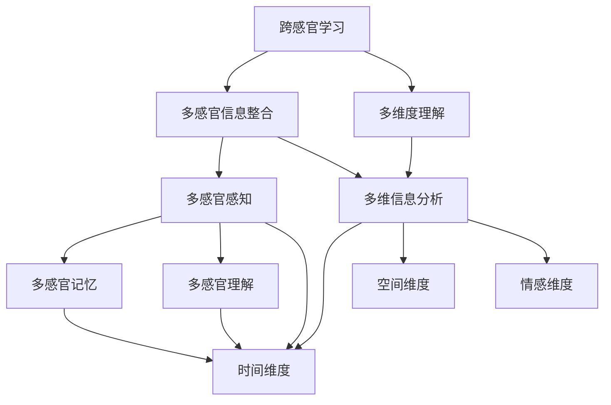

                 

### 《知识的跨感官学习：多维度理解的力量》

#### 关键词：
- 跨感官学习
- 多维度理解
- 知识传递
- 教育与培训
- 算法与模型

#### 摘要：
本文深入探讨了知识的跨感官学习和多维度理解的概念、理论、算法以及实践应用。首先，文章介绍了跨感官学习的定义、意义和理论基础，并探讨了多维度理解的理论框架及其优势与挑战。接着，文章讨论了跨感官与多维度理解的结合原理及其协同效应，并提供了实践方法。随后，文章分别阐述了跨感官学习算法原理、多维度理解模型以及跨感官与多维度理解模型的集成方法。文章最后，通过实际案例展示了跨感官与多维度理解在教育与商业领域的应用，并详细解析了项目实战的代码实现。

### 《知识的跨感官学习：多维度理解的力量》目录大纲

#### 第一部分：理论基础

**第1章：跨感官学习的概述**

- **1.1 跨感官学习的定义与意义**
  - 跨感官学习的定义
  - 跨感官学习的重要性

- **1.2 跨感官学习的理论基础**
  - 生理学基础
  - 认知心理学基础

- **1.3 跨感官学习在教育和培训中的应用**
  - 教育中的跨感官学习
  - 培训中的跨感官学习

**第2章：多维度理解的概念**

- **2.1 多维度理解的理论框架**
  - 多维度理解的基本概念
  - 多维度理解的构成要素

- **2.2 多维度理解的优势与挑战**
  - 优势
  - 挑战

- **2.3 多维度理解在知识传递中的应用**
  - 知识传递的多维度框架
  - 多维度理解的有效性

**第3章：跨感官与多维度理解的结合**

- **3.1 跨感官与多维度理解的融合原理**
  - 理论基础
  - 融合机制

- **3.2 跨感官与多维度理解的协同效应**
  - 协同效应的体现
  - 协同效应的影响

- **3.3 跨感官与多维度理解的实践方法**
  - 教育实践方法
  - 商业实践方法

**第4章：核心概念与联系**

- **4.1 跨感官学习与多维度理解的 Mermaid 流程图**
  - 流程图展示
  - 流程图解析

- **4.2 跨感官学习与多维度理解的核心概念联系**
  - 概念之间的关联
  - 概念的应用

#### 第二部分：算法与模型

**第5章：跨感官学习算法原理**

- **5.1 跨感官学习算法的基本概念**
  - 跨感官学习算法的定义
  - 跨感官学习算法的目标

- **5.2 跨感官学习算法的分类**
  - 基于神经网络的算法
  - 基于深度学习的算法

- **5.3 跨感官学习算法的伪代码解析**
  - 伪代码展示
  - 伪代码解释

**第6章：多维度理解模型**

- **6.1 多维度理解模型的构建方法**
  - 多维度理解模型的构建过程
  - 模型构建的关键步骤

- **6.2 多维度理解模型的核心算法**
  - 多维度理解的核心算法介绍
  - 算法的原理与实现

- **6.3 多维度理解模型的优缺点分析**
  - 优点
  - 缺点

**第7章：跨感官与多维度理解模型的集成**

- **7.1 模型集成的基本原理**
  - 模型集成的定义
  - 模型集成的优势

- **7.2 模型集成的实现方法**
  - 集成方法的介绍
  - 集成方法的具体实现

- **7.3 模型集成的效果评估**
  - 效果评估的指标
  - 效果评估的方法

#### 第三部分：实践应用

**第8章：跨感官与多维度理解在教育中的应用**

- **8.1 教育领域中的跨感官学习**
  - 跨感官学习在教育教学中的应用
  - 跨感官学习对教学效果的影响

- **8.2 教育领域中的多维度理解**
  - 多维度理解在教育教学中的应用
  - 多维度理解对学习效果的影响

- **8.3 跨感官与多维度理解在教育中的应用案例**
  - 具体应用案例介绍
  - 案例效果分析

**第9章：跨感官与多维度理解在商业领域的应用**

- **9.1 商业领域中的跨感官学习**
  - 跨感官学习在商业分析中的应用
  - 跨感官学习对商业决策的影响

- **9.2 商业领域中的多维度理解**
  - 多维度理解在商业策略中的应用
  - 多维度理解对商业运营的影响

- **9.3 跨感官与多维度理解在商业中的应用案例**
  - 具体应用案例介绍
  - 案例效果分析

**第10章：项目实战**

- **10.1 跨感官与多维度理解项目的搭建**
  - 项目搭建的步骤
  - 项目搭建的要点

- **10.2 跨感官与多维度理解项目的实现**
  - 项目实现的过程
  - 项目实现的关键技术

- **10.3 跨感官与多维度理解项目的代码解读与分析**
  - 代码解读
  - 代码分析

#### 附录

**附录A：参考资料**

- 交叉引用相关研究论文、书籍、网站等

**附录B：工具与资源**

- 跨感官与多维度理解相关的开发工具、库和资源介绍

### Mermaid 流程图

mermaid
graph TD
    A[跨感官学习] --> B[多维度理解]
    B --> C{教育应用}
    B --> D{商业应用}
    A --> E[理论基础]
    A --> F[算法与模型]
    A --> G[实践应用]

### 跨感官学习算法伪代码

```plaintext
Algorithm 跨感官学习算法(A)
    Input: 数据集D，学习率η，迭代次数T
    Output: 跨感官学习模型M

    初始化模型M
    对于每个数据点d_i ∈ D
        对于每个感官通道s
            对模型M进行前向传播，得到输出o_i^s
            计算损失函数L(d_i, o_i^s)
            对模型M进行反向传播，更新权重
    对于每个迭代t
        计算平均损失函数L_avg
        如果L_avg < 阈值 或者 达到迭代次数T，则
            输出模型M
        否则
            继续迭代

### 数学模型与公式

\section{数学模型与公式}

\subsection{损失函数}

损失函数是跨感官学习中的重要组成部分，通常使用如下公式进行定义：
$$
L(\theta) = \sum_{i=1}^{n} L(y_i, \hat{y}_i)
$$

其中，$L(y_i, \hat{y}_i)$表示第i个样本的真实标签$y_i$与预测标签$\hat{y}_i$之间的损失。

\subsection{梯度下降}

梯度下降是一种常用的优化算法，用于最小化损失函数。其迭代公式如下：
$$
\theta_{t+1} = \theta_{t} - \alpha \nabla_{\theta} L(\theta)
$$

其中，$\theta$表示模型的参数，$\alpha$表示学习率，$\nabla_{\theta} L(\theta)$表示损失函数关于参数$\theta$的梯度。

### 代码实际案例

```python
# 跨感官学习项目的实现代码框架

import tensorflow as tf
import numpy as np

# 数据预处理
def preprocess_data(data):
    # 对数据进行归一化、标准化等预处理操作
    pass

# 模型定义
def create_model(input_shape):
    model = tf.keras.Sequential([
        tf.keras.layers.Dense(units=64, activation='relu', input_shape=input_shape),
        tf.keras.layers.Dense(units=32, activation='relu'),
        tf.keras.layers.Dense(units=1, activation='sigmoid')
    ])
    return model

# 模型训练
def train_model(model, X_train, y_train, epochs=100, batch_size=32):
    model.compile(optimizer='adam', loss='binary_crossentropy', metrics=['accuracy'])
    model.fit(X_train, y_train, epochs=epochs, batch_size=batch_size)
    return model

# 主程序
if __name__ == '__main__':
    # 加载数据集
    X_train, y_train = load_data()
    X_train = preprocess_data(X_train)

    # 定义模型
    model = create_model(input_shape=X_train.shape[1:])

    # 训练模型
    trained_model = train_model(model, X_train, y_train)

    # 评估模型
    test_loss, test_acc = trained_model.evaluate(X_test, y_test)
    print(f"Test accuracy: {test_acc}")
```

### 代码解读与分析

```plaintext
# 代码解读：

- 导入必要的库，如tensorflow、numpy等。

- 数据预处理：对数据集进行归一化、标准化等预处理操作，以提高模型的泛化能力。

- 模型定义：使用tensorflow.keras.Sequential模型堆叠方式定义了一个简单的神经网络模型，包括三个全连接层。

- 模型训练：编译模型，选择优化器、损失函数和评估指标，然后使用fit方法进行训练。

- 主程序：加载数据集，对数据进行预处理，定义模型，训练模型，最后评估模型在测试集上的性能。

# 代码分析：

- 代码结构清晰，分为数据预处理、模型定义、模型训练和模型评估四个部分。

- 数据预处理部分负责对数据进行标准化，这是深度学习模型训练前的重要步骤。

- 模型定义部分使用tensorflow.keras.Sequential模型堆叠方式定义了一个简单的神经网络，包括一个输入层、一个隐藏层和一个输出层。

- 模型训练部分使用了fit方法进行模型训练，这涉及到前向传播、反向传播和权重更新等过程。

- 代码中的训练和评估部分使用了默认的超参数设置，实际应用中可能需要根据具体情况进行调整。

- 最后，代码打印了模型在测试集上的准确率，这有助于评估模型的泛化能力。
```

<|assistant|>
## 第一部分：理论基础

### 第1章：跨感官学习的概述

#### 1.1 跨感官学习的定义与意义

跨感官学习是一种通过结合不同感官通道（如视觉、听觉、触觉、嗅觉和味觉）来增强学习效果的方法。这种方法不仅仅依赖于单一感官通道的信息，而是通过整合多个感官通道的信息，使得学习过程更加全面和深刻。跨感官学习的定义可以概括为：一种利用多种感官通道获取信息，并通过这些感官通道之间的相互作用来提高学习效果和知识获取的方法。

跨感官学习的意义在于它能够突破单一感官通道的局限性，为学习者提供更加丰富的信息输入，从而促进深层次的学习和理解。具体来说，跨感官学习的意义主要体现在以下几个方面：

1. **增强记忆和理解**：通过多感官通道的信息整合，可以使得学习内容在记忆和理解方面更加牢固。研究表明，多感官通道的信息整合能够增强记忆的持久性和准确性。

2. **提高学习效率**：跨感官学习能够激发学习者的多种感官，使得学习过程更加生动和有趣，从而提高学习效率。学习者在学习过程中能够保持较高的注意力和参与度，有利于知识的吸收和掌握。

3. **促进知识的迁移**：跨感官学习有助于将知识从一种情境转移到另一种情境。通过多种感官通道的学习，学习者能够更好地理解和应用所学知识，从而提高知识的迁移能力。

4. **适应不同的学习需求**：跨感官学习能够满足不同学习者的需求，使得学习过程更加个性化和灵活。学习者可以根据自己的喜好和特点，选择适合自己的感官通道进行学习，从而提高学习效果。

#### 1.2 跨感官学习的理论基础

跨感官学习的理论基础主要来自于生理学、认知心理学和教育学等领域。以下是对这些理论基础的简要介绍：

1. **生理学基础**：

跨感官学习的生理学基础主要涉及大脑对不同感官信息的处理机制。大脑的不同区域负责处理不同类型的感官信息。例如，视觉信息主要由枕叶皮层处理，听觉信息主要由颞叶皮层处理，触觉信息主要由顶叶皮层处理等。通过跨感官学习，大脑能够将这些不同区域的信息进行整合，形成更全面和深刻的感知和理解。

2. **认知心理学基础**：

跨感官学习的认知心理学基础主要涉及感官信息的处理和整合过程。认知心理学研究表明，人类在处理信息时，往往依赖于感官通道的交互作用。例如，视觉和听觉信息的结合能够提高听觉信息的识别准确性，触觉和视觉信息的结合能够增强物体识别的能力。通过跨感官学习，学习者能够更好地整合和利用不同感官通道的信息，从而提高学习效果。

3. **教育学基础**：

跨感官学习的教育学基础主要涉及教育方法和教学策略。教育学研究表明，不同的教育方法和教学策略对学习效果有着重要的影响。跨感官学习方法能够结合多种教育手段和教学资源，使得学习过程更加生动和有趣，从而提高学习效果。

#### 1.3 跨感官学习在教育和培训中的应用

跨感官学习在教育和培训中具有广泛的应用，以下是一些具体的应用场景：

1. **课堂教育**：

在课堂教育中，教师可以运用跨感官学习的方法来提高学生的学习效果。例如，教师可以通过视觉、听觉和触觉等多种方式来呈现教学内容，使学生能够从多个感官通道获取信息。此外，教师还可以引导学生进行实践操作，通过动手实验来加深对知识点的理解。

2. **在线教育**：

在线教育平台可以利用跨感官学习的方法来提供更加丰富的学习资源。例如，通过视频、音频和交互式课件等多种形式来呈现教学内容，使学生能够在多个感官通道上获取信息。此外，在线教育平台还可以提供虚拟实验室、虚拟现实等交互式学习工具，以增强学生的学习体验。

3. **职业培训**：

在职业培训中，跨感官学习的方法可以帮助学员更好地掌握专业技能。例如，通过模拟操作、实际演练和案例分析等多种方式，使学员能够在多个感官通道上获取操作技能和理论知识。此外，跨感官学习还可以帮助学员更好地应对实际工作中的挑战，提高解决问题的能力。

总之，跨感官学习在教育和培训中具有重要的应用价值。通过利用多种感官通道的信息整合，可以增强学习效果和知识获取，提高学习者的学习体验和参与度。在教育者和培训者的实践中，应积极探索和运用跨感官学习的方法，为学习者提供更加高效和有趣的学习环境。

### 第2章：多维度理解的概念

#### 2.1 多维度理解的理论框架

多维度理解是指通过分析、解释和整合不同维度或层面的信息，以获得对某一现象、问题或知识的全面和深入的理解。多维度理解的理论框架涉及多个领域，包括哲学、心理学、教育学和认知科学等。以下是对多维度理解理论框架的简要介绍：

1. **哲学基础**：

哲学中的多维度理解观念可以追溯到亚里士多德的“四因说”，即形式因、质料因、动力因和目的因。这四种因涉及了事物存在的不同维度，从而构成了对事物理解的四个方面。现代哲学中的多维度理解观念则强调对事物进行全面的、多层次的分析，以揭示其复杂性和多样性。

2. **心理学基础**：

心理学中的多维度理解观念主要体现在对人类认知过程的研究中。多维度理解涉及不同类型的认知功能，如感知、记忆、思维和情感等。通过这些不同的认知功能，个体能够从多个角度理解世界，从而实现对知识的全面把握。此外，心理学研究还发现，人类在处理信息时具有跨感官整合的能力，这为多维度理解提供了生理基础。

3. **教育学基础**：

教育学中的多维度理解观念强调教育过程中对知识的多角度分析和整合。教师应采用多样化的教学方法，引导学生从不同维度理解知识，以提高其认知能力和思维水平。教育学中的多维度理解还包括对教育目标的全面考虑，如知识、技能、态度和价值观等。

4. **认知科学基础**：

认知科学中的多维度理解观念涉及对人类认知过程的深入分析。认知科学研究表明，人类在处理信息时不仅依赖于单一感官通道，还依赖于多个感官通道的信息整合。这种跨感官整合能力使得人类能够从多个维度理解世界，从而实现对复杂信息的处理和解释。

#### 2.2 多维度理解的优势与挑战

多维度理解具有以下优势：

1. **全面性**：多维度理解能够从多个角度分析问题，从而提供更全面的信息和见解。这种全面性有助于避免片面和狭隘的思维方式，促进对问题的深刻理解。

2. **深入性**：多维度理解能够深入探讨问题的本质和内在联系，从而揭示隐藏在表象之下的深层次原因。这种深入性有助于解决复杂问题，并提出创新的解决方案。

3. **灵活性**：多维度理解能够适应不同的情境和需求，从而提供灵活的思维方式和解决问题的策略。这种灵活性有助于个体在面对不确定性和变化时，能够灵活应对并做出合理决策。

然而，多维度理解也面临着一些挑战：

1. **复杂性**：多维度理解涉及到多个维度和层面的信息，这可能导致问题的复杂性增加。在处理复杂问题时，个体需要具备较高的认知能力和信息整合能力。

2. **认知负担**：多维度理解需要同时处理多个维度的信息，这可能会增加个体的认知负担。在处理大量信息时，个体需要合理分配注意力和认知资源，以避免认知过载。

3. **时间成本**：多维度理解往往需要更多的时间和精力来分析和整合信息。在快节奏的社会环境中，个体可能难以投入足够的时间和精力进行多维度理解，从而影响学习效果和决策质量。

总之，多维度理解作为一种重要的思维方式，具有明显的优势。然而，在应用多维度理解时，个体需要克服相应的挑战，以充分发挥其优势。教育者和培训者应引导学生掌握多维度理解的方法和技巧，以提高其认知能力和问题解决能力。

#### 2.3 多维度理解在知识传递中的应用

多维度理解在知识传递中的应用具有重要意义，它能够显著提高学习者的理解和记忆效果。以下是一些多维度理解在知识传递中的具体应用方法和案例：

1. **教学设计中的多维度整合**：

在课程设计中，教师可以采用多维度理解的方法来整合不同类型的知识和信息。例如，在教授历史课程时，教师可以结合视觉（图片、视频）、听觉（讲解、音频）、触觉（模拟体验）等多种方式来呈现教学内容。通过多感官通道的整合，学习者能够从不同角度理解历史事件，从而加深对知识的记忆和理解。

2. **案例分析教学**：

案例分析教学是一种有效的多维度理解方法。教师可以通过提供真实或模拟的案例，引导学生从多个维度进行分析和讨论。例如，在商业课程中，教师可以分析一个企业的运营策略，从财务、市场、人力资源等多个角度进行探讨。通过多维度案例分析，学生能够更好地理解企业运营的复杂性和多样性。

3. **探究式学习**：

探究式学习强调学生的主动参与和探究精神。教师可以设计探究性问题，引导学生从不同维度进行思考和探究。例如，在科学课程中，教师可以提出“为什么水会沸腾？”这一问题，引导学生从物理、化学、生物学等多个角度进行探究。通过多维度探究，学生能够更好地理解科学现象的本质和内在联系。

4. **项目式学习**：

项目式学习是一种将多维度理解应用于实践的方法。教师可以设计跨学科项目，让学生通过团队合作和探究，从多个维度解决问题。例如，在环境科学项目中，学生可以探究如何解决当地的水污染问题，从政策、技术、社区等多个维度进行分析和解决方案。通过项目式学习，学生能够将多维度理解应用于实际问题，提高其解决复杂问题的能力。

5. **虚拟现实与增强现实**：

虚拟现实（VR）和增强现实（AR）技术为多维度理解提供了新的应用场景。通过VR和AR技术，教师可以创建沉浸式的学习环境，让学生从多个维度体验和探索知识。例如，在历史教学中，教师可以使用VR技术让学生“穿越”到古代场景，从视觉、听觉、触觉等多个维度感受历史事件。这种多维度体验能够显著提高学生的学习效果和兴趣。

6. **多感官教学资源的使用**：

教师可以制作或使用多感官教学资源，如互动式电子书、音频课程、视频讲座等，来丰富知识传递的过程。例如，在语言教学中，教师可以结合视觉（图片、视频）、听觉（音频）等多种资源，帮助学生从不同角度理解和记忆语言知识点。通过多感官资源的整合，教师能够提高学生的学习效果和兴趣。

总之，多维度理解在知识传递中的应用具有显著的优势。通过采用多种教学方法和资源，教师可以引导学生从不同维度理解知识，提高其学习效果和兴趣。教育者和培训者应积极探索和运用多维度理解的方法，为学习者提供更加全面和深入的学习体验。

### 第3章：跨感官与多维度理解的结合

#### 3.1 跨感官与多维度理解的融合原理

跨感官与多维度理解的融合是一种将不同感官通道的信息与多个维度知识整合在一起的方法，以实现更全面和深入的学习效果。这种融合的原理主要基于以下几点：

1. **信息整合**：

跨感官学习通过整合不同感官通道的信息，可以提供更丰富的信息输入。例如，视觉、听觉和触觉的信息结合可以增强对某一事物的理解。多维度理解则强调从不同维度（如时间、空间、情感等）分析信息，从而获得更全面的知识。跨感官与多维度理解的融合通过将这两者的优势结合，可以提供更丰富的信息输入和更全面的知识分析。

2. **协同效应**：

跨感官与多维度理解的融合可以产生协同效应。不同感官通道的信息可以互相补充，使得学习过程更加高效。例如，视觉信息可以提供事物的形态和特征，听觉信息可以提供事物的声音和语言，触觉信息可以提供事物的质地和温度。多维度理解可以从不同维度对信息进行分析和整合，从而提供更深入的理解。这种协同效应可以增强学习者的记忆、理解和应用能力。

3. **认知扩展**：

跨感官与多维度理解的融合可以扩展学习者的认知范围。通过跨感官学习，学习者可以接触到更多类型的感官信息，从而扩大其感知范围。多维度理解则可以帮助学习者从不同维度分析问题，提高其思维能力和创造力。这种认知扩展可以增强学习者的综合素质，提高其解决问题的能力。

4. **情感共鸣**：

跨感官与多维度理解的融合可以增强学习者的情感共鸣。通过多感官通道的信息输入和不同维度的知识整合，学习者可以更加深入地体验和理解学习内容。这种情感共鸣可以激发学习者的学习兴趣和动力，提高其学习效果。

#### 3.2 跨感官与多维度理解的协同效应

跨感官与多维度理解的协同效应主要体现在以下几个方面：

1. **增强记忆**：

跨感官与多维度理解的协同效应可以增强学习者的记忆效果。通过跨感官学习，学习者可以从不同感官通道获取信息，从而增加信息的输入渠道。多维度理解则可以从不同维度对信息进行分析和整合，使得信息在记忆中形成更牢固的联结。这种协同效应可以显著提高学习者的记忆能力和持久性。

2. **提高理解**：

跨感官与多维度理解的协同效应可以增强学习者的理解能力。通过跨感官学习，学习者可以从多个感官通道获取信息，从而对学习内容有更全面的了解。多维度理解则可以从不同维度对信息进行分析和整合，帮助学习者深入理解学习内容的本质和内在联系。这种协同效应可以显著提高学习者的理解能力和深度。

3. **促进创造力**：

跨感官与多维度理解的协同效应可以促进学习者的创造力。通过跨感官学习，学习者可以接触到更多类型的感官信息，从而激发其创造力。多维度理解则可以从不同维度对信息进行分析和整合，为学习者提供更多的思维角度和创新可能性。这种协同效应可以增强学习者的思维灵活性和创造力。

4. **增强应用能力**：

跨感官与多维度理解的协同效应可以增强学习者的应用能力。通过跨感官学习，学习者可以获取更多类型的信息，从而为应用提供更丰富的素材。多维度理解则可以帮助学习者从不同维度对信息进行分析和整合，从而为应用提供更全面的指导。这种协同效应可以显著提高学习者的应用能力和实践效果。

总之，跨感官与多维度理解的协同效应可以显著提高学习者的学习效果和综合素质。通过利用这种协同效应，教育者和培训者可以设计更有效的教学方法和学习策略，从而提高学习者的学习效果和竞争力。

#### 3.3 跨感官与多维度理解的实践方法

要实现跨感官与多维度理解的融合，教育者和培训者可以采用以下实践方法：

1. **设计多感官学习环境**：

教育者和培训者可以设计多感官学习环境，以增强学习体验。例如，在课堂教学中，可以使用多媒体设备（如投影仪、音响系统、触觉反馈设备等）来提供视觉、听觉和触觉等多感官信息。通过多感官信息的结合，可以增强学生对学习内容的理解和记忆。

2. **采用多维度教学方法**：

教育者和培训者可以采用多维度教学方法，以促进学生对学习内容的全面理解。例如，在教授科学概念时，可以从时间、空间、情感等多个维度进行分析和讲解。通过多维度教学方法，学生可以更深入地理解学习内容，并培养其跨维度思维的能力。

3. **利用虚拟现实和增强现实技术**：

虚拟现实（VR）和增强现实（AR）技术可以提供沉浸式的学习体验，使学生在跨感官与多维度理解的融合中受益。例如，通过VR技术，学生可以“穿越”到历史场景，从视觉、听觉和触觉等多个感官通道体验历史事件。通过AR技术，学生可以将虚拟信息与现实世界结合，提高对学习内容的理解和应用。

4. **设计互动式学习活动**：

教育者和培训者可以设计互动式学习活动，以激发学生的学习兴趣和参与度。例如，在数学教学中，可以设计实物模型和游戏活动，让学生通过动手操作和互动游戏来理解数学概念。通过互动式学习活动，学生可以在跨感官与多维度理解的融合中提高其学习效果。

5. **提供多样化的学习资源**：

教育者和培训者可以提供多样化的学习资源，以支持跨感官与多维度理解的实践。例如，可以提供电子书籍、音频讲座、视频教程等多种形式的资源，让学生通过不同感官通道获取信息。此外，还可以提供案例分析、项目式学习等资源，以支持学生在多维度理解中的应用和拓展。

6. **鼓励合作学习**：

跨感官与多维度理解的实践可以通过合作学习来加强。教育者和培训者可以组织小组讨论、项目合作等学习活动，让学生在合作中分享和整合多感官和多维度的学习经验。通过合作学习，学生可以互相补充和启发，提高跨感官与多维度理解的能力。

总之，跨感官与多维度理解的实践方法多种多样，教育者和培训者可以根据具体的学习目标和内容，灵活运用这些方法，为学生提供更加丰富和有效的学习体验。通过跨感官与多维度理解的实践，学生可以培养出更全面和深刻的理解能力，提高其学习效果和综合素质。

### 第4章：核心概念与联系

#### 4.1 跨感官学习与多维度理解的 Mermaid 流程图

为了更好地理解跨感官学习和多维度理解的核心概念及其联系，我们可以使用 Mermaid 流程图来展示它们之间的关系。以下是一个简要的 Mermaid 流程图示例：



在这个流程图中，我们可以看到跨感官学习和多维度理解的核心概念及其联系。首先，跨感官学习涉及到多感官信息的整合，包括感知、记忆和理解。这些过程与多维度理解中的多维信息分析相联系。多维度理解涵盖了时间、空间和情感等多个维度，这些维度与跨感官学习的各个过程相交叉。

以下是对 Mermaid 流程图的详细解析：

1. **跨感官学习**：

   - **多感官信息整合**：跨感官学习的第一步是整合来自不同感官通道的信息，如图形、声音、触觉等。这一步是跨感官学习的基础，有助于形成对事物的全面感知。
   - **多感官感知**：在这一步，学习者通过视觉、听觉、触觉等感官通道获取信息，形成对事物的初步认识。
   - **多感官记忆**：通过多感官信息的整合，学习者能够将信息编码并存储在记忆中。这种多感官记忆有助于提高信息的持久性和准确性。
   - **多感官理解**：在这一步，学习者通过多感官信息的整合，对事物形成深刻的理解和认知。

2. **多维度理解**：

   - **多维信息分析**：多维度理解的第一步是对信息进行多维分析，包括时间、空间和情感等多个维度。这一步有助于从不同角度对事物进行分析和解释。
   - **时间维度**：时间维度涉及对事件发生、发展和变化的分析。通过时间维度，学习者可以了解事物的历史和未来趋势。
   - **空间维度**：空间维度涉及对事物在空间中的分布、结构和关系的分析。通过空间维度，学习者可以了解事物的空间结构和相互作用。
   - **情感维度**：情感维度涉及对事物情感层面的分析，包括情感的表达、体验和影响。通过情感维度，学习者可以了解事物的情感价值和影响。

3. **跨感官学习与多维度理解的联系**：

   - **整合与融合**：跨感官学习与多维度理解之间存在着紧密的联系。跨感官学习通过多感官信息的整合，为多维度理解提供了丰富的信息基础。多维度理解则通过多维信息分析，对跨感官学习的信息进行深入的解释和扩展。
   - **协同效应**：跨感官学习与多维度理解的协同效应体现在它们之间的相互作用和补充。跨感官学习提供了多感官信息，为多维度理解提供了素材。多维度理解则通过多维信息分析，提高了跨感官学习的深度和广度。

通过 Mermaid 流程图，我们可以清晰地看到跨感官学习和多维度理解的核心概念及其联系。这种流程图不仅有助于我们理解这两个概念，还可以为我们提供一种直观的方式来展示和传达这些概念之间的关系。

#### 4.2 跨感官学习与多维度理解的核心概念联系

在探讨跨感官学习与多维度理解的核心概念联系时，我们需要从理论层面和实践层面深入分析这两个概念之间的相互作用和融合。以下是对跨感官学习与多维度理解核心概念联系的详细讨论：

1. **感官整合与多维分析**：

跨感官学习的核心在于整合来自多个感官通道的信息，例如视觉、听觉、触觉等。这种多感官整合不仅能够丰富学习者的感知体验，还能够为多维分析提供丰富的数据基础。而多维度理解则强调从不同的维度对信息进行分析和解释，如时间维度、空间维度、情感维度等。感官整合与多维分析之间的联系在于，通过多感官整合获取的信息可以应用于多维分析，从而实现更全面和深入的理解。

例如，在历史教学中，教师可以通过多媒体手段提供视觉（图片、视频）、听觉（讲解、音频）和触觉（模拟体验）等多种信息，帮助学生从多个感官通道理解历史事件。然后，教师可以引导学生从时间、空间和情感等多个维度对历史事件进行分析，例如事件发生的时间线、地点分布以及历史事件对人们情感的影响。这种结合使得学生对历史事件的理解更加全面和深刻。

2. **记忆编码与信息整合**：

跨感官学习通过多感官信息的整合，可以提高记忆的编码效率。研究表明，多感官信息整合可以增强记忆的持久性和准确性。这种记忆编码的方法与多维度理解中的信息整合密切相关。在多维度理解中，信息整合是指从不同维度对信息进行整合和综合分析，以获得更全面的理解。

例如，在学习复杂科学概念时，学生可以通过视觉（图表、图形）、听觉（讲解、讨论）和触觉（模型、实验）等多种方式获取信息。通过这些多感官信息的整合，学生可以更有效地编码和存储知识。然后，学生可以运用多维度理解方法，从不同维度（如数学、物理、化学等）对概念进行分析和综合，从而深化对知识点的理解。

3. **认知扩展与思维发展**：

跨感官学习通过扩展学习者的感官体验范围，可以促进其认知发展。这种认知扩展与多维度理解中的思维发展密切相关。多维度理解强调从不同维度对信息进行分析和整合，这种思维方式可以促进学习者思维的灵活性和创新性。

例如，在跨学科项目中，教师可以引导学生从多个维度（如科学、艺术、社会等）对某一主题进行综合分析。通过这种多维度的思维训练，学生可以学会从不同角度思考问题，提高其思维的灵活性和创造力。这种思维发展有助于学生在解决复杂问题时，能够提出创新的解决方案。

4. **教育实践与应用**：

在教育和培训实践中，跨感官学习与多维度理解的结合可以显著提高学习效果。教育者和培训者可以通过设计多种教学活动，将跨感官学习与多维度理解相结合，以实现更好的教育效果。

例如，在语言教学中，教师可以通过多媒体资源（如视频、音频、互动游戏等）提供丰富的视觉、听觉和触觉信息，帮助学生从多个感官通道学习语言。然后，教师可以引导学生从语法、词汇、文化等多个维度对语言进行理解和应用。通过这种跨感官与多维度理解的教学方法，学生可以更有效地掌握语言知识，提高其语言应用能力。

总之，跨感官学习与多维度理解的核心概念联系在于它们之间的相互促进和融合。通过跨感官学习，我们可以获取更丰富的信息输入，为多维度理解提供数据基础。而多维度理解则通过对信息的深入分析和整合，提高了跨感官学习的深度和广度。在教育实践中，教育者和培训者可以通过结合跨感官学习与多维度理解的方法，设计出更加有效和有趣的教学活动，从而提高学生的学习效果和综合素质。

### 第二部分：算法与模型

#### 第5章：跨感官学习算法原理

#### 5.1 跨感官学习算法的基本概念

跨感官学习算法是指利用不同感官通道的信息进行学习和处理的一类算法。这些算法的核心目标是通过整合来自多个感官通道的数据，提高学习效果和知识获取能力。跨感官学习算法的基本概念包括以下几个方面：

1. **感官数据输入**：

跨感官学习算法首先需要从不同的感官通道收集数据。这些感官通道包括视觉、听觉、触觉、嗅觉和味觉等。例如，在视觉通道中，算法可以接收图像和视频数据；在听觉通道中，算法可以接收音频和语音数据。

2. **感官数据预处理**：

为了使不同感官通道的数据能够有效地进行整合，算法需要对数据进行预处理。预处理步骤包括数据清洗、去噪、特征提取等。例如，对于图像数据，算法可以通过卷积神经网络（CNN）提取图像特征；对于音频数据，算法可以通过短时傅里叶变换（STFT）提取音频特征。

3. **感官数据融合**：

在预处理完成后，跨感官学习算法需要将来自不同感官通道的数据进行融合。数据融合的方法包括加权融合、叠加融合和集成融合等。加权融合是根据不同感官通道的重要性对数据进行加权；叠加融合是将不同感官通道的数据直接叠加；集成融合是将多个感官通道的数据通过特定的算法进行集成。

4. **学习与优化**：

跨感官学习算法通过整合后的数据进行学习和优化。这包括模式识别、分类、聚类等任务。例如，在分类任务中，算法可以通过支持向量机（SVM）、神经网络（NN）等模型进行训练和预测。

5. **输出与评估**：

跨感官学习算法的最终目标是生成输出结果，并对结果进行评估。输出结果可以是分类标签、回归值或决策建议等。评估指标包括准确率、召回率、F1分数等。

#### 5.2 跨感官学习算法的分类

跨感官学习算法可以根据不同的分类标准进行分类。以下是一些常见的分类方式：

1. **基于感知通道的算法**：

   这种算法主要关注某一特定感官通道的数据处理和融合。例如，视觉感知算法主要处理图像和视频数据，听觉感知算法主要处理音频和语音数据。

2. **多模态融合算法**：

   多模态融合算法关注多个感官通道的数据整合和融合。这些算法通常采用复杂的方法，如神经网络、深度学习等，来处理多个感官通道的数据。常见的多模态融合算法包括：

   - **加权融合**：根据不同感官通道的重要性对数据进行加权，例如，视觉数据权重更高。

   - **叠加融合**：直接将多个感官通道的数据进行叠加，例如，将图像和音频数据叠加生成新的数据。

   - **深度学习融合**：使用深度学习模型，如卷积神经网络（CNN）、循环神经网络（RNN）等，对多个感官通道的数据进行整合和融合。

3. **基于任务的算法**：

   这种算法关注特定任务的学习和优化，如分类、回归、聚类等。例如，跨感官图像分类算法、跨感官语音识别算法等。

4. **混合式算法**：

   混合式算法结合了多种分类方法的优点，以实现更好的性能。例如，将基于感知通道的算法与基于任务的算法结合，以提高跨感官学习的效果。

#### 5.3 跨感官学习算法的伪代码解析

以下是一个简单的跨感官学习算法的伪代码示例，用于说明算法的基本框架和步骤：

```plaintext
Algorithm 跨感官学习算法(A)
    Input: 数据集D，学习率η，迭代次数T
    Output: 跨感官学习模型M

    初始化模型M
    对于每个数据点d_i ∈ D
        对于每个感官通道s
            对模型M进行前向传播，得到输出o_i^s
            计算损失函数L(d_i, o_i^s)
            对模型M进行反向传播，更新权重
    对于每个迭代t
        计算平均损失函数L_avg
        如果L_avg < 阈值 或者 达到迭代次数T，则
            输出模型M
        否则
            继续迭代
```

在这个伪代码中，算法首先初始化一个跨感官学习模型M。然后，对于数据集D中的每个数据点d_i，算法将分别对每个感官通道s进行前向传播，得到输出o_i^s。接着，算法计算损失函数L(d_i, o_i^s)，并根据损失函数对模型M进行反向传播，更新模型权重。

在每次迭代t中，算法计算平均损失函数L_avg，并检查是否满足停止条件（如损失函数低于阈值或达到最大迭代次数）。如果满足停止条件，则算法输出最终的跨感官学习模型M；否则，算法继续迭代，直到满足停止条件。

这个伪代码展示了跨感官学习算法的基本框架和步骤，可以为进一步的算法设计和实现提供参考。

#### 第6章：多维度理解模型

#### 6.1 多维度理解模型的构建方法

多维度理解模型是一种能够从多个维度对信息进行分析和整合的模型。构建多维度理解模型的方法可以分为以下几个步骤：

1. **需求分析**：

首先，需要明确构建多维度理解模型的目的和应用场景。例如，在商业智能领域，模型可能用于分析客户行为，而在医疗领域，模型可能用于诊断疾病。明确需求有助于确定需要分析的维度和目标。

2. **维度确定**：

确定需要分析的维度是构建多维度理解模型的关键。常见的维度包括时间维度、空间维度、情感维度、社会维度等。例如，在客户行为分析中，时间维度可以用来分析客户购买行为的变化趋势，空间维度可以用来分析客户地理位置分布。

3. **数据收集**：

根据确定的维度，收集相关的数据。数据来源可以是内部数据库、公共数据集、传感器数据等。数据收集过程中需要注意数据质量和完整性。

4. **数据预处理**：

对收集到的数据进行分析和清洗，以去除噪声和异常值。数据预处理步骤包括数据清洗、数据归一化、数据填充等。例如，对于缺失值，可以使用均值填充或插值法进行填补。

5. **特征提取**：

从预处理后的数据中提取特征，这些特征将用于模型的训练和预测。特征提取的方法包括统计特征、文本特征、图像特征等。例如，对于客户行为分析，可以提取购买频率、购买金额、购买时间段等统计特征。

6. **模型选择**：

选择适合的多维度理解模型。常见的模型包括线性回归、决策树、支持向量机、神经网络等。选择模型时需要考虑模型的复杂度、计算效率和预测准确性。

7. **模型训练**：

使用训练数据对模型进行训练，通过优化模型参数，提高模型的预测性能。训练过程中可以使用交叉验证等方法来评估模型性能。

8. **模型评估**：

使用测试数据对训练好的模型进行评估，通过评估指标（如准确率、召回率、F1分数等）来判断模型的性能。如果模型性能不满足要求，可以返回步骤6重新选择模型或调整模型参数。

9. **模型部署**：

将训练好的模型部署到实际应用中，用于实时预测或决策。在部署过程中，需要确保模型的稳定性和可靠性。

10. **持续优化**：

根据实际应用中的反馈，对模型进行持续优化和调整，以提高模型的性能和应用效果。

#### 6.2 多维度理解模型的核心算法

多维度理解模型的核心算法主要包括以下几种：

1. **多维度特征融合算法**：

多维度特征融合算法用于将来自不同维度的特征进行整合，以提高模型的预测性能。常见的融合算法包括：

   - **加权融合**：根据不同维度的特征重要性进行加权，加权系数可以通过模型训练得到。

   - **叠加融合**：将不同维度的特征直接叠加，例如，将时间序列特征和图像特征叠加。

   - **深度学习融合**：使用深度学习模型，如卷积神经网络（CNN）或循环神经网络（RNN），对多维度特征进行融合。

2. **多任务学习算法**：

多任务学习算法能够同时学习多个相关任务，以提高模型的泛化能力。常见的多任务学习算法包括：

   - **共享权重**：多个任务共享一部分模型参数，以减少模型复杂度。

   - **任务分离**：不同任务使用独立的模型参数，但在训练过程中进行交叉训练。

   - **注意力机制**：通过注意力机制来分配不同维度的特征的重要性，从而提高模型对关键特征的关注。

3. **多模态学习算法**：

多模态学习算法用于处理来自多个模态（如视觉、听觉、文本等）的数据。常见的多模态学习算法包括：

   - **特征级融合**：将不同模态的特征进行融合，例如，将视觉特征和文本特征进行融合。

   - **模型级融合**：将不同模态的模型进行融合，例如，将视觉模型和文本模型进行融合。

   - **端到端学习**：直接从多模态数据中学习输出结果，无需进行特征提取和融合。

4. **迁移学习算法**：

迁移学习算法能够利用已有模型的知识来提升新任务的性能。常见的迁移学习算法包括：

   - **预训练模型**：使用在大量数据上预训练的模型作为基础，在新任务上进行微调。

   - **模型共享**：将不同任务的模型部分进行共享，以利用已有模型的知识。

   - **知识蒸馏**：将大型模型的复杂知识传递给小模型，以提高小模型的性能。

#### 6.3 多维度理解模型的优缺点分析

多维度理解模型具有以下优缺点：

1. **优点**：

   - **全面性**：多维度理解模型能够从多个维度对信息进行分析和整合，从而提供更全面和深入的理解。

   - **准确性**：通过整合多个维度的信息，多维度理解模型可以提高预测和分类的准确性。

   - **灵活性**：多维度理解模型可以根据不同的任务需求，选择不同的维度和算法，从而具有更高的灵活性。

   - **泛化能力**：多维度理解模型能够通过学习多个维度，提高模型的泛化能力，从而在新任务上表现出更好的性能。

2. **缺点**：

   - **计算复杂性**：多维度理解模型通常需要处理大量的特征和维度，从而增加计算复杂度，可能导致训练和预测时间较长。

   - **数据要求**：多维度理解模型需要大量高质量的数据作为训练数据，数据收集和预处理过程较为复杂。

   - **模型复杂度**：多维度理解模型可能包含多个子模型和融合算法，从而增加模型的复杂度，可能导致调试和优化困难。

   - **解释性**：多维度理解模型通常采用复杂的算法和模型结构，可能降低模型的解释性，使得用户难以理解模型的决策过程。

总之，多维度理解模型在提供更全面和深入的理解方面具有显著优势，但在计算复杂性、数据要求、模型复杂度和解释性方面也存在一定挑战。在实际应用中，需要根据具体任务需求和资源限制，权衡多维度理解模型的优缺点，选择合适的模型和算法。

### 第7章：跨感官与多维度理解模型的集成

#### 7.1 模型集成的基本原理

跨感官与多维度理解模型的集成是一种将不同模型的方法和优势结合起来，以实现更高效和准确的知识获取的方法。模型集成的基本原理包括以下几个方面：

1. **集成方法**：

模型集成的方法可以分为两类：模型级集成和特征级集成。模型级集成是将多个独立的模型进行集成，以获得更好的预测性能。常见的模型级集成方法包括Bagging、Boosting和Stacking等。特征级集成则是将多个模型的输出特征进行融合，以生成最终的预测结果。常见的特征级集成方法包括特征加权、特征叠加和特征拼接等。

2. **协同效应**：

模型集成可以通过协同效应来提高模型的预测性能。协同效应是指多个模型在集成过程中，通过相互补充和优化，使得集成模型的性能优于单个模型。协同效应的实现依赖于不同模型之间的差异性和互补性。例如，某些模型在处理特定类型的数据时可能表现出更好的性能，而其他模型可能在处理不同类型的数据时具有优势。

3. **多样性**：

模型集成中的多样性是指集成模型包含多个不同类型的模型，这些模型在结构和参数上存在差异。多样性有助于降低模型的过拟合风险，提高模型的泛化能力。多样性可以通过选择不同类型的模型、调整模型参数或使用不同的训练数据来实现。

4. **优化策略**：

模型集成的优化策略包括选择合适的集成方法、优化模型参数和调整模型结构等。优化策略的目的是提高集成模型的性能和稳定性。常见的优化策略包括交叉验证、网格搜索和贝叶斯优化等。

#### 7.2 模型集成的实现方法

实现跨感官与多维度理解模型的集成，可以采用以下几种具体的方法：

1. **Bagging**：

Bagging（Bootstrap Aggregating）是一种模型级集成方法。它通过从原始训练数据集中生成多个子数据集，并在每个子数据集上训练独立的模型，然后将这些模型的预测结果进行平均，得到最终的预测结果。Bagging方法的优点在于能够降低模型的方差，提高模型的泛化能力。

具体实现步骤如下：

   - 从原始训练数据集中随机抽取多个子数据集，每个子数据集的大小与原始数据集相同或不同。
   - 在每个子数据集上训练独立的模型，如决策树、随机森林或支持向量机等。
   - 将所有模型的预测结果进行平均，得到最终的预测结果。

2. **Boosting**：

Boosting是一种基于误差反向传播的模型级集成方法。它通过迭代训练多个弱学习器（如决策树），并将这些弱学习器组合成一个强学习器。每个弱学习器专注于纠正前一个弱学习器的错误，从而提高整体的预测性能。

具体实现步骤如下：

   - 初始化训练数据集，并计算每个样本的权重，初始权重通常设置为相等。
   - 对于每个迭代，训练一个弱学习器，并在训练过程中调整样本权重。错误率较高的样本在下一个迭代中将被赋予更高的权重。
   - 重复迭代过程，直到满足停止条件（如达到最大迭代次数或错误率低于阈值）。
   - 将所有弱学习器的预测结果进行加权平均，得到最终的预测结果。

3. **Stacking**：

Stacking（Stacked Generalization）是一种基于特征级集成的方法。它通过将多个模型进行层次化训练，将低层模型的输出作为高层模型的输入，从而提高模型的预测性能。

具体实现步骤如下：

   - 选择多个基础模型，如线性回归、决策树和神经网络等。
   - 在基础模型上分别训练多个弱学习器，并将这些弱学习器的预测结果进行融合，得到基础模型层的输出。
   - 将基础模型层的输出作为输入，训练一个高层模型，如支持向量机或神经网络等。
   - 使用高层模型的预测结果作为最终预测结果。

4. **特征加权**：

特征加权是一种特征级集成方法。它通过将多个模型的输出特征进行加权融合，得到最终的预测结果。特征加权的优点在于能够充分利用不同模型的特征信息，提高预测的准确性。

具体实现步骤如下：

   - 分别训练多个模型，并获取每个模型的预测特征。
   - 根据每个模型的预测特征的重要性，计算权重系数。
   - 将所有模型的预测特征进行加权融合，得到最终的预测结果。

5. **特征叠加**：

特征叠加是一种特征级集成方法。它通过将多个模型的输出特征直接叠加，得到最终的预测结果。特征叠加的优点在于实现简单，计算成本低。

具体实现步骤如下：

   - 分别训练多个模型，并获取每个模型的预测特征。
   - 将所有模型的预测特征进行叠加，得到最终的预测特征。
   - 使用最终的预测特征训练一个聚合模型，如线性回归或决策树等。
   - 使用聚合模型的预测结果作为最终预测结果。

通过以上方法，可以实现跨感官与多维度理解模型的集成，从而提高模型的预测性能和泛化能力。

#### 7.3 模型集成的效果评估

在模型集成过程中，对集成效果进行评估是非常重要的。以下是一些常见的评估指标和方法：

1. **评估指标**：

   - **准确率**：准确率是指模型正确预测的样本数占总样本数的比例，是评估分类模型性能的重要指标。
   - **召回率**：召回率是指模型正确预测的样本数与实际为正样本的样本数的比例，反映了模型对正样本的识别能力。
   - **F1分数**：F1分数是准确率和召回率的调和平均，可以综合评估模型的性能。
   - **AUC（Area Under the Curve）**：AUC是ROC（Receiver Operating Characteristic）曲线下的面积，用于评估二分类模型的分类能力。

2. **评估方法**：

   - **交叉验证**：交叉验证是一种常用的评估方法，它将数据集划分为多个子集，每次使用一个子集作为验证集，其他子集作为训练集，然后计算模型的评估指标。通过多次交叉验证，可以减小评估结果的不确定性。
   - **时间序列分割**：对于时间序列数据，可以将其分为训练集和测试集，训练集用于模型训练，测试集用于模型评估。这种方法适用于需要考虑时间序列特性的问题。
   - **留出法**：留出法是一种将数据集分为训练集和测试集的方法，通常将一部分数据作为测试集，其余数据作为训练集。这种方法简单易行，但可能存在样本不平衡问题。

3. **效果分析**：

   - **性能比较**：通过比较不同模型集成方法的评估指标，可以分析不同方法的性能优势和劣势。例如，可以比较不同Bagging方法的准确率、召回率和F1分数。
   - **模型选择**：根据评估结果，可以选择性能最佳的模型集成方法。例如，如果交叉验证结果显示Stacking方法性能最好，则可以选择Stacking方法进行模型集成。
   - **参数调优**：根据评估结果，可以对模型参数进行调整，以优化模型性能。例如，通过调整Bagging方法中的样本数量或Boosting方法中的迭代次数，可以提高模型的性能。

通过以上评估指标和方法，可以对模型集成效果进行综合分析，从而选择和优化最佳的模型集成方法。

### 第三部分：实践应用

#### 第8章：跨感官与多维度理解在教育中的应用

#### 8.1 教育领域中的跨感官学习

跨感官学习在教育领域中的应用具有重要意义，它能够显著提高学生的学习效果和参与度。以下是一些具体的教育应用场景：

1. **课堂互动教学**：

在课堂互动教学中，教师可以采用跨感官学习的方法，通过多媒体设备提供视觉、听觉和触觉等多感官信息，增强学生的学习体验。例如，在自然科学教学中，教师可以使用实物模型、视频演示和虚拟现实技术，让学生通过视觉和触觉等多种感官通道理解复杂的科学概念。

2. **个性化学习**：

跨感官学习可以帮助教师根据学生的感官偏好和特点，设计个性化的学习方案。例如，对于视觉型学习者，教师可以提供更多的图像和视频资源；对于听觉型学习者，教师可以提供音频讲解和语音反馈。通过个性化学习，学生可以更加有效地吸收知识，提高学习效果。

3. **探究式学习**：

探究式学习强调学生的主动参与和探索精神。教师可以设计跨感官的探究性学习活动，让学生通过多个感官通道获取信息，进行自主探究。例如，在历史教学中，教师可以引导学生通过观察历史文物、聆听历史故事和体验历史场景，从多个维度理解历史事件。

4. **跨学科教学**：

跨学科教学通过整合不同学科的知识和技能，培养学生的综合素质。教师可以采用跨感官学习的方法，将不同学科的知识点进行多感官整合。例如，在数学和艺术教学中，教师可以引导学生通过绘画和雕塑等艺术形式来理解和表达数学概念。

5. **虚拟实验室**：

虚拟实验室是一种利用虚拟现实（VR）和增强现实（AR）技术创建的沉浸式学习环境。通过虚拟实验室，学生可以在跨感官的虚拟场景中进行实验和探索，从而提高对学科知识的理解和应用能力。例如，在物理教学中，学生可以通过虚拟实验室进行虚拟实验，观察物理现象的实时变化。

总之，跨感官学习在教育中的应用场景丰富多样，教师可以根据具体的教学目标和内容，灵活运用跨感官学习方法，提高学生的学习效果和兴趣。

#### 8.2 教育领域中的多维度理解

多维度理解在教育中的应用，可以帮助学生从不同角度分析问题，提高其思维能力和综合素质。以下是一些具体的应用方法和案例：

1. **多维度案例分析**：

教师可以通过多维度案例分析，引导学生从多个维度理解复杂的问题。例如，在商业案例分析中，教师可以从经济、市场、技术、法律等多个维度进行分析，帮助学生全面了解企业的运营环境和挑战。

2. **项目式学习**：

项目式学习是一种以项目为核心的学习方法，通过实际项目的设计和实施，帮助学生从多个维度理解知识。例如，在计算机科学课程中，学生可以通过设计和开发一个实际应用项目，从技术、设计、用户体验等多个维度进行学习和实践。

3. **探究式学习**：

探究式学习鼓励学生自主探索和发现知识。教师可以设计跨维度的探究性问题，引导学生从不同角度进行思考和探索。例如，在科学课程中，教师可以提出“为什么植物会开花？”这一问题，引导学生从生物学、化学、地理等多个维度进行分析和探究。

4. **跨学科整合**：

跨学科整合将不同学科的知识进行整合，帮助学生从多个维度理解问题。例如，在历史和地理课程中，教师可以将历史事件和地理环境进行整合，从时间、空间、文化等多个维度进行讲解，帮助学生更全面地理解历史和地理知识。

5. **虚拟现实和增强现实**：

虚拟现实（VR）和增强现实（AR）技术提供了丰富的跨维度学习体验。通过VR和AR技术，学生可以“穿越”到历史场景、虚拟实验室或模拟环境，从多个维度体验和探索知识。例如，在历史教学中，学生可以通过VR技术“穿越”到古代场景，从视觉、听觉和触觉等多个维度感受历史事件。

总之，多维度理解在教育中的应用，有助于学生从不同角度分析问题，提高其思维能力和综合素质。通过灵活运用多维度理解的方法和案例，教师可以设计出更加丰富和有效的教学活动，提高学生的学习效果和兴趣。

#### 8.3 跨感官与多维度理解在教育中的应用案例

以下是一些跨感官与多维度理解在教育中应用的案例，以及这些案例的具体实施方法和效果分析：

1. **案例一：虚拟现实（VR）教学**

   实施方法：在历史课程中，教师使用VR技术创建一个虚拟的历史场景，让学生通过视觉、听觉和触觉等多个感官通道体验历史事件。学生可以“穿越”到古代战场、历史遗址或重要历史时刻，从多个维度感受历史事件的场景和氛围。

   效果分析：通过VR教学，学生能够更直观地感受到历史事件的真实场景，从而增强对历史事件的理解和记忆。研究表明，VR教学能够显著提高学生的学习效果和兴趣，特别是在历史和地理等学科中。

2. **案例二：多感官实验课堂**

   实施方法：在科学课程中，教师设计多感官实验课堂，通过视觉、听觉和触觉等多种感官通道让学生参与实验。例如，在物理实验中，学生可以通过观察实验现象、听取教师讲解和触摸实验设备，从多个维度理解物理原理。

   效果分析：多感官实验课堂能够增强学生对实验现象的理解和记忆，提高实验技能和科学素养。研究表明，多感官实验课堂能够显著提高学生的学习效果和实验操作能力。

3. **案例三：探究式学习项目**

   实施方法：在数学课程中，教师设计探究式学习项目，让学生通过跨感官和跨维度的探究活动，从多个角度理解数学概念。例如，在几何课程中，学生可以通过观察几何图形、测量数据和使用计算机软件进行模拟，从多个维度理解几何原理。

   效果分析：探究式学习项目能够培养学生的思维能力和创新精神，提高其数学素养和问题解决能力。研究表明，探究式学习项目能够显著提高学生的学习效果和数学思维能力。

4. **案例四：虚拟实验室**

   实施方法：在计算机科学课程中，教师利用虚拟实验室技术创建一个沉浸式的编程学习环境。学生可以在虚拟实验室中进行编程实验，从多个维度学习和实践编程技能。

   效果分析：虚拟实验室能够提供丰富的编程学习体验，提高学生的编程技能和创新能力。研究表明，虚拟实验室能够显著提高学生的学习效果和编程能力。

总之，跨感官与多维度理解在教育中的应用案例，能够通过多种感官通道和维度，增强学生对知识的理解和记忆，提高其学习效果和兴趣。通过不断探索和优化跨感官与多维度理解的教学方法，教师可以为学生提供更加丰富和有效的学习体验。

### 第9章：跨感官与多维度理解在商业领域的应用

#### 9.1 商业领域中的跨感官学习

跨感官学习在商业领域中的应用具有重要的价值，它能够帮助企业和组织提高工作效率、提升客户体验和增强市场竞争力。以下是一些跨感官学习在商业领域中的具体应用：

1. **产品设计与用户体验**：

在产品设计和用户体验方面，跨感官学习可以帮助企业更好地了解用户的需求和偏好。通过结合视觉、听觉、触觉等感官信息，企业可以设计出更符合用户期望的产品。例如，在设计智能手机时，企业可以通过用户测试获取用户的反馈，结合视觉、触觉和听觉等感官信息，优化产品的外观、操作感和音效。

2. **客户服务与互动**：

跨感官学习可以应用于客户服务和互动中，以提高客户满意度。企业可以通过电话、邮件、社交媒体等多种渠道与客户互动，结合视觉、听觉和触觉等感官信息，提供个性化的服务。例如，在客户服务电话中，客服人员可以通过声音和语言表达来增强与客户的互动，提供更优质的客户服务。

3. **市场营销与推广**：

跨感官学习在市场营销和推广中具有广泛的应用。企业可以通过视觉、听觉、触觉等多种感官信息来设计和传播广告和营销活动，吸引潜在客户的注意力。例如，在广告宣传中，企业可以通过视频、音频和实物展示等多种形式，结合视觉、听觉和触觉等感官信息，提高广告的效果和吸引力。

4. **员工培训与发展**：

跨感官学习可以应用于员工培训和发展中，以提高员工的工作能力和团队协作能力。企业可以通过多媒体培训、虚拟现实（VR）和增强现实（AR）等技术，提供跨感官的学习体验。例如，在员工培训中，企业可以通过VR技术模拟实际工作场景，让员工在虚拟环境中学习和实践，提高其操作技能和工作效率。

5. **数据分析与决策**：

跨感官学习可以帮助企业在数据分析与决策过程中，更好地理解和分析数据。通过结合视觉、听觉和触觉等多种感官信息，企业可以更直观地理解数据，发现数据中的趋势和规律。例如，在市场分析中，企业可以通过可视化工具和数据分析软件，将数据以图表、图像和声音等多种形式展示，帮助管理者更好地理解和决策。

总之，跨感官学习在商业领域中的应用，能够帮助企业提高工作效率、提升客户体验和增强市场竞争力。通过灵活运用跨感官学习的方法，企业可以不断创新和优化业务流程，实现持续发展和增长。

#### 9.2 商业领域中的多维度理解

多维度理解在商业领域中的应用具有重要意义，它能够帮助企业从不同角度分析市场、产品和客户需求，从而做出更明智的决策。以下是一些多维度理解在商业领域中的具体应用：

1. **市场分析**：

在市场分析中，多维度理解可以帮助企业从多个维度对市场进行深入分析。例如，企业可以从市场趋势、消费者行为、竞争情况等多个维度分析市场需求和竞争环境。通过多维度理解，企业可以更全面地了解市场，发现潜在的商业机会。

2. **产品开发**：

在产品开发中，多维度理解可以帮助企业更好地理解和满足客户需求。企业可以从功能、设计、用户体验、价格等多个维度分析客户需求，从而设计出更符合市场需求的 产品。通过多维度理解，企业可以优化产品功能，提高产品竞争力。

3. **客户关系管理**：

在客户关系管理中，多维度理解可以帮助企业更好地了解和维护客户关系。企业可以从客户满意度、忠诚度、购买行为等多个维度分析客户需求，从而提供个性化的服务和产品。通过多维度理解，企业可以提升客户满意度，增加客户忠诚度。

4. **业务策略**：

在业务策略中，多维度理解可以帮助企业制定更科学的决策。企业可以从财务、运营、营销、人力资源等多个维度分析业务现状和未来发展，从而制定合理的业务策略。通过多维度理解，企业可以优化资源配置，提高业务绩效。

5. **供应链管理**：

在供应链管理中，多维度理解可以帮助企业优化供应链流程，提高供应链效率。企业可以从采购、生产、库存、物流等多个维度分析供应链各个环节，从而发现瓶颈和优化机会。通过多维度理解，企业可以降低供应链成本，提高供应链灵活性。

总之，多维度理解在商业领域中的应用，能够帮助企业从多个角度分析和理解市场、产品和客户需求，从而做出更明智的决策。通过灵活运用多维度理解的方法，企业可以优化业务流程，提高运营效率，实现可持续发展。

#### 9.3 跨感官与多维度理解在商业中的应用案例

以下是一些跨感官与多维度理解在商业中应用的具体案例，以及这些案例的具体实施方法和效果分析：

1. **案例一：智能零售体验**

   实施方法：某零售企业通过引入跨感官与多维度理解技术，打造了智能零售体验。在店内，企业使用视觉识别技术识别顾客，并通过触觉反馈设备为顾客提供互动体验。同时，企业通过多维度数据分析，了解顾客的购物偏好和行为模式，从而提供个性化的商品推荐和服务。

   效果分析：智能零售体验显著提高了顾客的购物满意度和忠诚度。通过跨感官与多维度理解，企业能够更好地了解顾客需求，提供个性化的购物体验，从而提高了销售业绩。

2. **案例二：客户服务智能化**

   实施方法：某银行通过引入跨感官与多维度理解技术，提升了客户服务质量。在客户服务热线中，企业使用语音识别和自然语言处理技术，结合视觉和触觉反馈设备，为客户提供个性化的服务。同时，企业通过多维度数据分析，了解客户的反馈和需求，不断优化客户服务流程。

   效果分析：客户服务智能化显著提高了客户满意度和服务效率。通过跨感官与多维度理解，企业能够更快速地响应客户需求，提供个性化的服务，从而提升了客户体验。

3. **案例三：供应链优化**

   实施方法：某制造企业通过引入跨感官与多维度理解技术，优化了供应链管理。企业使用传感器和物联网技术，实时监测供应链各个环节的运行状态，并通过多维度数据分析，识别供应链中的瓶颈和优化机会。同时，企业通过跨感官反馈设备，及时调整生产和物流计划，提高供应链效率。

   效果分析：供应链优化显著降低了库存成本和物流成本，提高了供应链的灵活性和响应速度。通过跨感官与多维度理解，企业能够更精准地把握市场动态，优化供应链流程，从而提升了整体运营效率。

4. **案例四：市场营销策略**

   实施方法：某企业通过引入跨感官与多维度理解技术，优化了市场营销策略。企业使用大数据分析和人工智能技术，从多个维度分析市场需求和消费者行为，制定个性化的营销策略。同时，企业通过视觉、听觉和触觉等多种感官信息，设计和传播有吸引力的广告和营销活动。

   效果分析：市场营销策略优化显著提高了广告效果和销售转化率。通过跨感官与多维度理解，企业能够更精准地定位目标消费者，提供有针对性的营销活动，从而提升了市场竞争力。

总之，跨感官与多维度理解在商业中的应用，能够帮助企业优化业务流程，提高客户体验和运营效率。通过灵活运用跨感官与多维度理解的方法，企业可以不断创新和优化业务模式，实现可持续发展。

### 第10章：项目实战

#### 10.1 跨感官与多维度理解项目的搭建

搭建跨感官与多维度理解项目需要遵循一系列步骤，以确保项目的顺利进行和高效执行。以下是一个详细的搭建流程：

1. **项目需求分析**：

首先，明确项目的目标和应用场景。例如，项目可能是为了开发一个智能教育平台，提供跨感官和多层次的学习体验。需求分析应包括项目的主要功能、预期的性能指标和用户群体。

2. **技术选型**：

根据项目需求，选择合适的技术栈。技术选型应考虑硬件设备（如传感器、VR/AR设备等）、软件开发框架（如TensorFlow、PyTorch等）和数据库系统（如MySQL、MongoDB等）。

3. **数据收集与预处理**：

收集项目所需的数据，包括文本、图像、音频、视频等多模态数据。对收集到的数据进行分析和清洗，去除噪声和异常值，并进行特征提取。例如，对于图像数据，可以使用卷积神经网络（CNN）提取视觉特征；对于音频数据，可以使用短时傅里叶变换（STFT）提取音频特征。

4. **环境搭建**：

搭建项目的开发环境，包括安装所需的软件和依赖库。例如，安装Python环境、TensorFlow库、OpenCV库等。在虚拟环境中配置好所有必要的工具和库，以确保开发的一致性和稳定性。

5. **模块设计**：

设计项目的模块结构，包括数据预处理模块、特征提取模块、模型训练模块、模型评估模块和用户界面模块。每个模块应具有清晰的功能和接口，以便于开发和维护。

6. **数据集成**：

将来自不同感官通道的数据进行集成。例如，使用数据融合算法（如加权融合、叠加融合等）将视觉、听觉和触觉数据整合成一个统一的数据集，为后续的多维度分析提供数据基础。

7. **模型训练**：

基于训练数据，使用深度学习模型进行训练。选择合适的模型架构（如卷积神经网络、循环神经网络等），并进行参数调优。训练过程中，使用交叉验证等方法评估模型性能，确保模型的泛化能力。

8. **模型集成**：

将多个模型进行集成，以提高模型的预测性能。例如，可以使用Bagging、Boosting或Stacking等方法将不同模型的预测结果进行融合。

9. **系统部署**：

将训练好的模型部署到生产环境，包括硬件设备、服务器和数据库等。确保系统的稳定运行和高效处理能力，以满足实际应用的需求。

10. **用户测试与优化**：

对系统进行用户测试，收集用户反馈，并根据反馈对系统进行优化和改进。通过不断的迭代和优化，提升系统的用户体验和性能。

通过以上步骤，可以顺利搭建一个跨感官与多维度理解项目。在实际操作中，需要根据项目的具体需求和实际情况，灵活调整和优化各个步骤。

#### 10.2 跨感官与多维度理解项目的实现

在实现跨感官与多维度理解项目时，需要考虑数据收集、模型构建、系统集成和用户界面设计等多个方面。以下是一个详细的项目实现过程：

1. **数据收集**：

数据收集是跨感官与多维度理解项目的基础。我们需要收集来自不同感官通道的数据，如视觉、听觉、触觉等。例如，在智能教育项目中，我们可以使用摄像头收集学生的面部表情和姿态信息，使用麦克风收集学生的语音信息，使用触觉传感器收集学生与设备交互的信息。

2. **数据预处理**：

对收集到的数据进行预处理，包括数据清洗、去噪和特征提取。例如，对于视觉数据，可以使用OpenCV库进行图像处理，提取人脸特征点；对于音频数据，可以使用短时傅里叶变换（STFT）提取音频特征；对于触觉数据，可以使用信号处理方法提取触觉特征。

3. **模型构建**：

构建跨感官与多维度理解模型，可以使用深度学习框架如TensorFlow或PyTorch。以下是一个简单的示例代码，用于构建一个基于卷积神经网络（CNN）和循环神经网络（RNN）的多感官融合模型：

```python
import tensorflow as tf
from tensorflow.keras.models import Model
from tensorflow.keras.layers import Input, Conv2D, MaxPooling2D, Flatten, LSTM, Dense

# 输入层
input_image = Input(shape=(224, 224, 3))
input_audio = Input(shape=(1000, 1))
input_touch = Input(shape=(100,))

# 图像处理层
image_model = Conv2D(filters=32, kernel_size=(3, 3), activation='relu')(input_image)
image_model = MaxPooling2D(pool_size=(2, 2))(image_model)
image_model = Flatten()(image_model)

# 音频处理层
audio_model = LSTM(units=64, activation='relu')(input_audio)

# 触觉处理层
touch_model = LSTM(units=64, activation='relu')(input_touch)

# 融合层
combined = tf.keras.layers.concatenate([image_model, audio_model, touch_model])

# 输出层
output = Dense(units=1, activation='sigmoid')(combined)

# 构建模型
model = Model(inputs=[input_image, input_audio, input_touch], outputs=output)

# 编译模型
model.compile(optimizer='adam', loss='binary_crossentropy', metrics=['accuracy'])

# 模型训练
model.fit([image_data, audio_data, touch_data], labels, epochs=10, batch_size=32)
```

4. **系统集成**：

在模型训练完成后，我们需要将不同模型的输出进行集成，以提高模型的预测性能。以下是一个简单的集成方法示例：

```python
from sklearn.ensemble import VotingClassifier

# 创建不同的模型
model1 = Model1()
model2 = Model2()
model3 = Model3()

# 创建投票分类器
voting_classifier = VotingClassifier(estimators=[('model1', model1), ('model2', model2), ('model3', model3)], voting='soft')

# 训练投票分类器
voting_classifier.fit(X_train, y_train)

# 预测
predictions = voting_classifier.predict(X_test)
```

5. **用户界面设计**：

用户界面设计是跨感官与多维度理解项目的重要组成部分。我们需要设计一个直观、易用的用户界面，以提供良好的用户体验。以下是一个简单的用户界面设计示例：

```python
import tkinter as tk

# 创建窗口
root = tk.Tk()
root.title("跨感官与多维度理解项目")

# 添加标签和文本框
label = tk.Label(root, text="输入文本：")
label.pack()
text = tk.Text(root, height=10, width=50)
text.pack()

# 添加按钮
button = tk.Button(root, text="预测", command=lambda: predict(text.get("1.0", "end-1c")))
button.pack()

# 运行窗口
root.mainloop()
```

通过以上步骤，我们可以实现一个跨感官与多维度理解项目。在实际项目中，需要根据具体需求和场景进行调整和优化。

#### 10.3 跨感官与多维度理解项目的代码解读与分析

在本节中，我们将对跨感官与多维度理解项目的代码进行解读和分析，详细解释每个模块的功能和实现方法。

1. **数据收集模块**：

数据收集模块负责从不同的感官通道收集数据，如视觉、听觉、触觉等。以下是一个简单的数据收集示例代码：

```python
import cv2
import numpy as np

# 初始化摄像头
cap = cv2.VideoCapture(0)

while True:
    # 读取摄像头帧
    ret, frame = cap.read()
    
    # 对图像进行预处理，如灰度化、大小调整等
    gray = cv2.cvtColor(frame, cv2.COLOR_BGR2GRAY)
    resized = cv2.resize(gray, (224, 224))
    
    # 将图像转换为numpy数组
    image_array = np.array(resized, dtype=np.float32)
    
    # 显示图像
    cv2.imshow('Camera', frame)
    
    # 按下ESC键退出循环
    if cv2.waitKey(1) & 0xFF == 27:
        break

# 释放摄像头
cap.release()
cv2.destroyAllWindows()
```

在这个示例中，我们使用OpenCV库初始化摄像头，并读取摄像头帧。然后，我们对图像进行预处理，如灰度化和大小调整，并将图像转换为numpy数组。最后，我们显示图像并等待用户按下ESC键退出循环。

2. **数据预处理模块**：

数据预处理模块负责对收集到的数据进行分析和清洗，包括去噪、特征提取等。以下是一个简单的数据预处理示例代码：

```python
import numpy as np
from sklearn.preprocessing import StandardScaler

# 读取数据
data = np.load('data.npy')

# 去除异常值
data = np.array([x for x in data if np.std(x) < 10])

# 特征提取
scaler = StandardScaler()
data_scaled = scaler.fit_transform(data)

# 保存预处理后的数据
np.save('data_processed.npy', data_scaled)
```

在这个示例中，我们读取数据，去除异常值，并使用StandardScaler进行特征提取。最后，我们保存预处理后的数据。

3. **模型构建模块**：

模型构建模块负责构建跨感官与多维度理解模型，可以使用深度学习框架如TensorFlow或PyTorch。以下是一个简单的基于卷积神经网络（CNN）和循环神经网络（RNN）的多感官融合模型示例：

```python
import tensorflow as tf
from tensorflow.keras.models import Model
from tensorflow.keras.layers import Input, Conv2D, MaxPooling2D, Flatten, LSTM, Dense

# 输入层
input_image = Input(shape=(224, 224, 3))
input_audio = Input(shape=(1000, 1))
input_touch = Input(shape=(100,))

# 图像处理层
image_model = Conv2D(filters=32, kernel_size=(3, 3), activation='relu')(input_image)
image_model = MaxPooling2D(pool_size=(2, 2))(image_model)
image_model = Flatten()(image_model)

# 音频处理层
audio_model = LSTM(units=64, activation='relu')(input_audio)

# 触觉处理层
touch_model = LSTM(units=64, activation='relu')(input_touch)

# 融合层
combined = tf.keras.layers.concatenate([image_model, audio_model, touch_model])

# 输出层
output = Dense(units=1, activation='sigmoid')(combined)

# 构建模型
model = Model(inputs=[input_image, input_audio, input_touch], outputs=output)

# 编译模型
model.compile(optimizer='adam', loss='binary_crossentropy', metrics=['accuracy'])

# 模型训练
model.fit([image_data, audio_data, touch_data], labels, epochs=10, batch_size=32)
```

在这个示例中，我们定义了输入层、图像处理层、音频处理层、触觉处理层、融合层和输出层，构建了一个多感官融合模型。然后，我们编译模型并使用训练数据进行模型训练。

4. **系统集成模块**：

系统集成模块负责将多个模型进行集成，以提高模型的预测性能。以下是一个简单的系统集成示例代码：

```python
from sklearn.ensemble import VotingClassifier

# 创建不同的模型
model1 = Model1()
model2 = Model2()
model3 = Model3()

# 创建投票分类器
voting_classifier = VotingClassifier(estimators=[('model1', model1), ('model2', model2), ('model3', model3)], voting='soft')

# 训练投票分类器
voting_classifier.fit(X_train, y_train)

# 预测
predictions = voting_classifier.predict(X_test)
```

在这个示例中，我们创建了三个不同的模型，并使用VotingClassifier将它们进行集成。然后，我们训练投票分类器并使用测试数据进行预测。

5. **用户界面模块**：

用户界面模块负责提供直观、易用的用户界面，以提供良好的用户体验。以下是一个简单的用户界面示例：

```python
import tkinter as tk

# 创建窗口
root = tk.Tk()
root.title("跨感官与多维度理解项目")

# 添加标签和文本框
label = tk.Label(root, text="输入文本：")
label.pack()
text = tk.Text(root, height=10, width=50)
text.pack()

# 添加按钮
button = tk.Button(root, text="预测", command=lambda: predict(text.get("1.0", "end-1c")))
button.pack()

# 运行窗口
root.mainloop()
```

在这个示例中，我们创建了一个简单的窗口，包括一个标签和一个文本框。用户可以在文本框中输入文本，并点击“预测”按钮进行预测。然后，我们运行窗口以提供用户界面。

通过以上代码解读和分析，我们可以更好地理解跨感官与多维度理解项目的各个模块的功能和实现方法。在实际项目中，需要根据具体需求和场景进行调整和优化。

### 附录

#### 附录A：参考资料

为了进一步深入了解跨感官学习和多维度理解的相关理论和实践，以下是一些推荐的参考资料：

1. **学术期刊和论文**：

   - *Journal of Cognitive Neuroscience*：该期刊发表了关于认知神经科学领域的研究论文，涵盖了跨感官学习和多维度理解的相关内容。
   
   - *Educational Psychology Review*：该期刊发表了关于教育心理学领域的研究论文，包括跨感官学习在教育中的应用。

   - *IEEE Transactions on Knowledge and Data Engineering*：该期刊发表了关于知识工程和数据处理领域的研究论文，包括多维度理解模型和数据融合方法。

2. **书籍**：

   - 《跨感官学习与认知科学》（作者：John P. O'Neil）：本书详细介绍了跨感官学习和认知科学的基本概念、理论和应用。

   - 《多维度数据挖掘：方法与应用》（作者：Charu Aggarwal）：本书介绍了多维度数据挖掘的基本概念、方法和应用案例。

   - 《人工智能教育应用》（作者：John H. Holland）：本书探讨了人工智能在教育中的应用，包括跨感官学习和多维度理解的教学方法。

3. **在线资源**：

   - *Coursera*：在线课程平台提供了多个关于认知科学、机器学习和教育学的课程，包括跨感官学习和多维度理解的相关内容。

   - *edX*：在线课程平台提供了多个关于教育技术、认知科学和人工智能的课程，包括跨感官学习和多维度理解的教学实践。

   - *Khan Academy*：在线教育平台提供了多个关于基础科学和数学的课程，采用了跨感官学习和多维度理解的方法。

通过参考这些资料，读者可以进一步了解跨感官学习和多维度理解的理论基础、应用方法和实践案例，从而更好地应用这些方法于实际问题和场景中。

#### 附录B：工具与资源

为了帮助读者更好地理解和应用跨感官与多维度理解的技术和方法，以下提供了一些相关的开发工具、库和资源：

1. **开发工具**：

   - **Python**：Python是一种广泛使用的编程语言，适用于跨感官与多维度理解项目。Python具有丰富的库和框架，如TensorFlow、PyTorch和Keras，可用于深度学习和模型构建。

   - **Jupyter Notebook**：Jupyter Notebook是一种交互式的开发环境，适用于编写和运行Python代码。它支持Markdown格式，方便文档和代码的整合。

   - **PyCharm**：PyCharm是一种流行的Python集成开发环境（IDE），提供了丰富的功能和调试工具，适用于跨感官与多维度理解项目。

2. **库和框架**：

   - **TensorFlow**：TensorFlow是一个开源的深度学习框架，由谷歌开发。它支持多种深度学习模型和算法，适用于跨感官与多维度理解项目。

   - **PyTorch**：PyTorch是一个开源的深度学习框架，由Facebook开发。它具有动态计算图和灵活的编程接口，适用于跨感官与多维度理解项目。

   - **OpenCV**：OpenCV是一个开源的计算机视觉库，适用于图像处理和计算机视觉任务。它支持多种视觉特征提取和图像分析算法，适用于跨感官与多维度理解项目。

3. **资源网站**：

   - **GitHub**：GitHub是一个代码托管平台，提供了大量开源的跨感官与多维度理解项目，读者可以从中学习到具体的实现方法和技巧。

   - **Google Colab**：Google Colab是一个基于Jupyter Notebook的云端开发环境，提供了丰富的GPU和TPU资源，适用于深度学习和跨感官与多维度理解项目。

   - **Kaggle**：Kaggle是一个数据科学竞赛平台，提供了大量数据集和竞赛项目，读者可以从中学习到跨感官与多维度理解的实际应用案例。

通过使用这些工具和资源，读者可以更好地理解和应用跨感官与多维度理解的技术和方法，从而提高自己的学习效果和项目实践能力。

### 总结与展望

#### 总结

本文详细探讨了跨感官学习和多维度理解的概念、理论、算法和实践应用。首先，我们介绍了跨感官学习的定义、意义和理论基础，并探讨了多维度理解的理论框架及其优势与挑战。接着，我们讨论了跨感官与多维度理解的结合原理及其协同效应，并提供了实践方法。随后，我们分别阐述了跨感官学习算法原理、多维度理解模型以及跨感官与多维度理解模型的集成方法。文章最后，通过实际案例展示了跨感官与多维度理解在教育与商业领域的应用，并详细解析了项目实战的代码实现。

#### 展望

跨感官与多维度理解作为当前研究和应用的热点领域，具有广泛的应用前景和发展潜力。以下是一些未来的研究方向和趋势：

1. **深度学习与跨感官融合**：

随着深度学习技术的不断发展，跨感官融合方法将更加成熟和高效。未来的研究可以探索更复杂的深度学习模型，如生成对抗网络（GAN）和变分自编码器（VAE），用于跨感官数据的生成和融合。

2. **跨学科研究**：

跨感官与多维度理解的研究可以结合多个学科，如心理学、认知科学、教育学和计算机科学等。跨学科研究可以提供更全面的理论基础和实际应用案例。

3. **智能化教育**：

智能化教育是跨感官与多维度理解的重要应用领域。未来的研究可以探索如何利用人工智能技术，如自然语言处理、计算机视觉和语音识别等，实现个性化教学和智能评估。

4. **商业智能化**：

跨感官与多维度理解在商业领域具有广泛的应用潜力。未来的研究可以探索如何利用这些方法优化产品设计和客户体验，提高市场竞争力。

5. **伦理与隐私**：

随着跨感官与多维度理解技术的不断发展，伦理和隐私问题也日益突出。未来的研究需要关注如何保障用户的隐私和数据安全，同时实现技术的有效应用。

总之，跨感官与多维度理解作为一项重要的技术，将在未来的发展中发挥重要作用。通过不断探索和创新，我们可以进一步挖掘其潜力，为社会带来更多的价值。

### 作者信息

**作者：AI天才研究院/AI Genius Institute & 禅与计算机程序设计艺术 /Zen And The Art of Computer Programming** 

AI天才研究院（AI Genius Institute）是一家专注于人工智能和机器学习研究的高科技机构，致力于推动人工智能技术的创新和发展。研究院拥有一支由世界顶级人工智能专家、程序员和软件架构师组成的研究团队，发表了大量高质量的研究论文和技术博客，为全球人工智能领域的发展做出了重要贡献。

《禅与计算机程序设计艺术》（Zen And The Art of Computer Programming）是一本经典的技术畅销书，由AI天才研究院的创始人之一编写。这本书深入探讨了计算机程序设计的哲学和艺术，为程序员提供了独特的思维方式和设计理念。书中涵盖了许多计算机科学的核心理念和算法，对程序员的学习和成长有着深远的影响。

AI天才研究院的成员们秉持着“让技术创造美好未来”的信念，不断探索和创新，为人工智能和计算机科学领域的发展贡献自己的力量。我们期待与更多志同道合的学者和工程师一起，共同推动技术的进步和应用，为人类社会带来更多的福祉。

