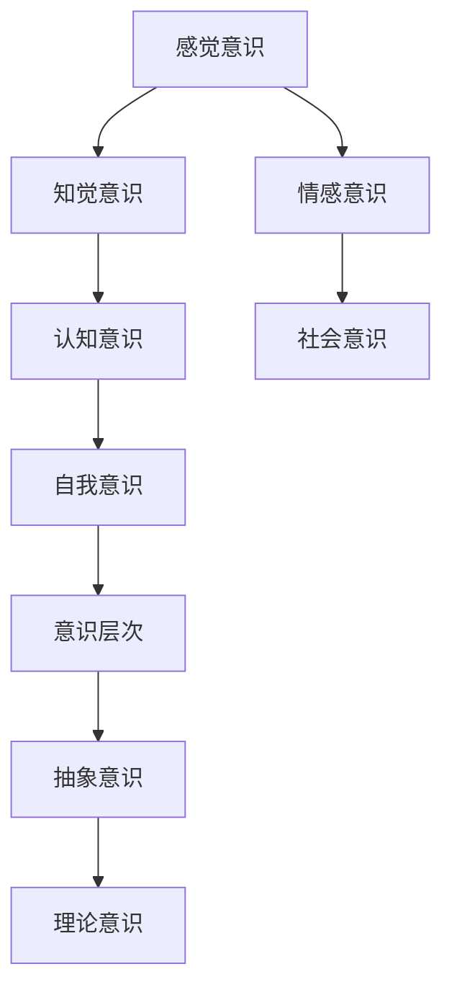
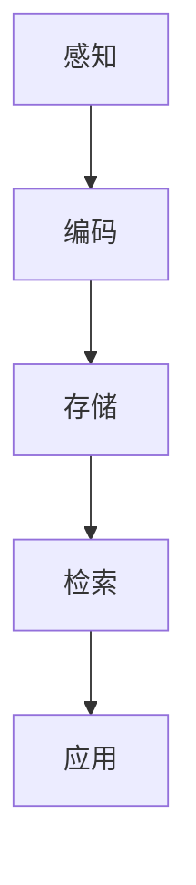
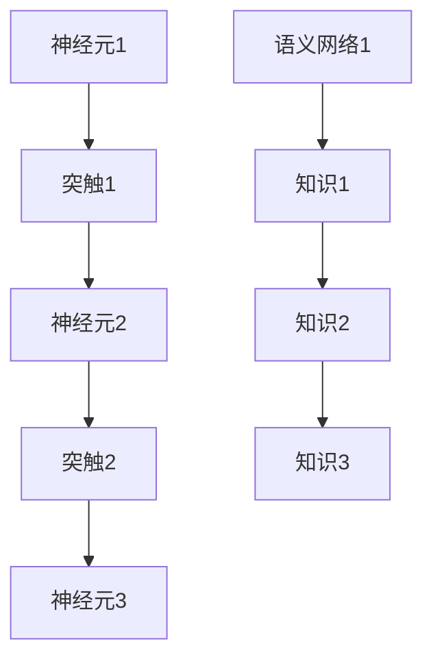
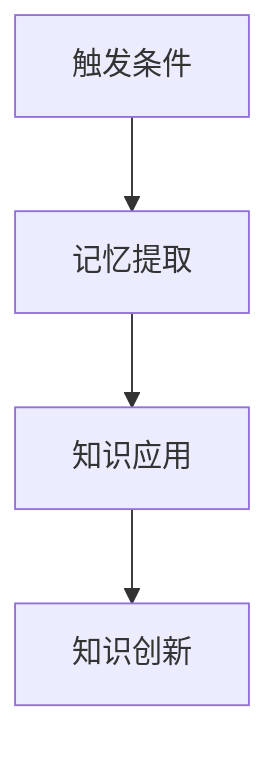
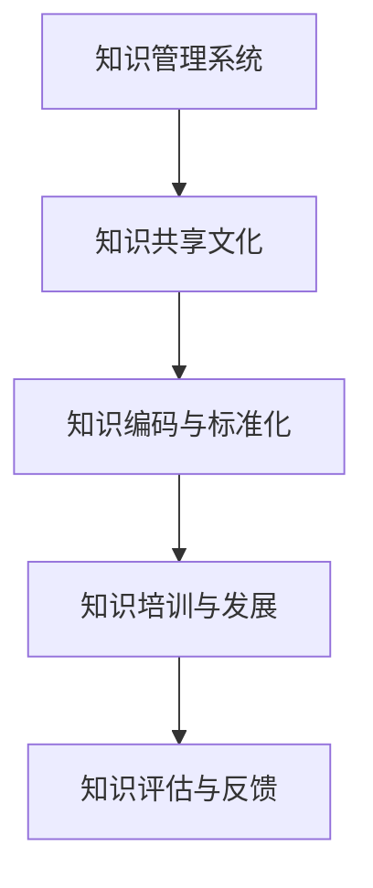
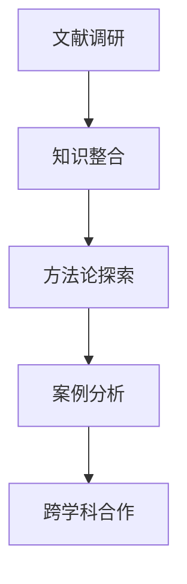
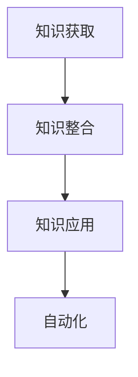
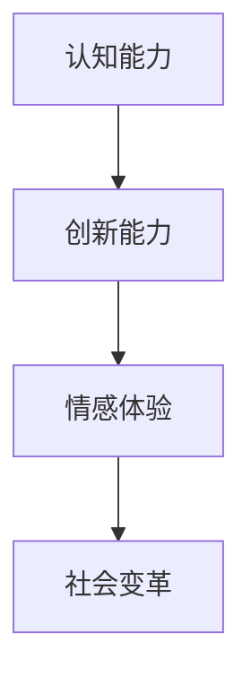
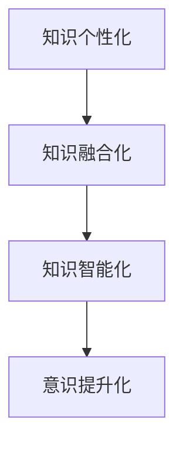
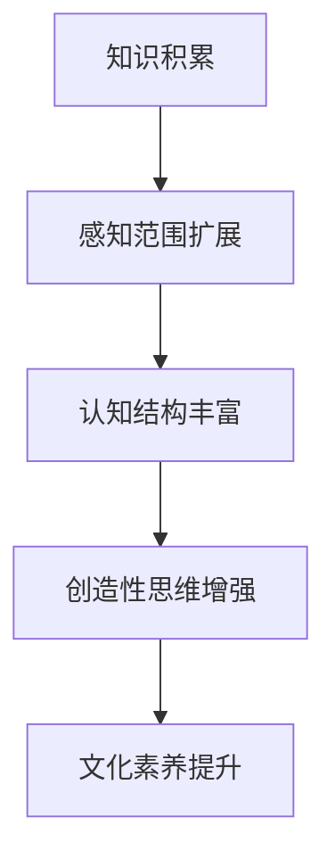

                 

### 引言

在信息爆炸的时代，知识积累变得前所未有的重要。知识不仅是人类智慧的表现，也是社会进步和科技创新的基石。然而，知识积累的过程并不简单，它涉及到多个层次和复杂的过程。本文旨在探讨知识积累在意识中的角色，分析知识积累对意识发展的影响以及意识对知识积累的调节作用。

本文的核心问题如下：

1. 知识积累是什么，它如何存在于我们的意识中？
2. 知识积累如何影响我们的意识发展，包括促进和制约？
3. 意识又是如何调节和筛选知识的积累过程？
4. 在个人、组织和跨学科领域，知识积累的应用和实践是怎样的？
5. 知识积累和意识发展的未来趋势将如何变化？

本文将分八个部分进行探讨。首先，我们会定义意识的本质，解释知识积累的基本概念。接着，我们深入探讨意识与知识积累的关系，并分析知识积累对意识的影响。随后，我们将探讨意识如何调节知识积累，并通过具体案例研究来展示知识积累的应用。最后，我们将展望知识积累和意识发展的未来趋势。

通过逐步推理和分析，我们希望读者能够对知识积累在意识中的角色有更深刻的理解，从而更好地掌握知识积累的方法和技巧，为个人成长和社会进步做出贡献。

### 目录大纲

在本节中，我们将详细阐述文章的目录大纲，以便读者能够清晰了解全文的结构和内容。文章共分为四个主要部分，每个部分包含若干章节，每个章节又细分为多个子标题，确保内容的全面性和逻辑性。

#### 第一部分：核心概念与理论

**第1章：意识的本质**

1.1.1 意识的基本定义  
1.1.2 意识的类型和层次  
1.1.3 意识的功能与作用

**第2章：知识积累的机制**

2.1.1 知识积累的过程  
2.1.2 知识的组织与存储  
2.1.3 知识的检索与应用

#### 第二部分：意识与知识的关系

**第3章：知识积累对意识的影响**

3.1.1 知识积累对意识发展的促进作用  
3.1.2 知识积累对意识局限的制约  
3.1.3 知识积累与意识创新的互动

**第4章：意识对知识积累的调节**

4.1.1 意识对知识积累的筛选与整合  
4.1.2 意识对知识积累的反思与调整  
4.1.3 意识对知识积累的促进与抑制

#### 第三部分：案例研究与实际应用

**第5章：知识积累在个人意识中的应用**

5.1.1 个人知识积累的路径与方法  
5.1.2 个人知识积累与自我成长的关系  
5.1.3 个人知识积累的案例分析

**第6章：知识积累在组织意识中的应用**

6.1.1 组织知识积累的策略与框架  
6.1.2 组织知识积累与组织效能的关系  
6.1.3 组织知识积累的实践案例

**第7章：知识积累在跨学科研究中的应用**

7.1.1 跨学科知识积累的方法与工具  
7.1.2 跨学科知识积累的挑战与机遇  
7.1.3 跨学科知识积累的研究案例

#### 第四部分：未来展望与趋势

**第8章：知识积累与意识发展的未来趋势**

8.1.1 人工智能与知识积累的融合  
8.1.2 知识积累在意识发展中的潜在影响  
8.1.3 知识积累与意识发展的未来方向

**第9章：知识积累在意识中的角色**

9.1.1 知识积累在意识中的核心作用  
9.1.2 知识积累对意识多样性的影响  
9.1.3 知识积累与意识健康的关系

通过上述目录，我们可以清晰地看到文章的结构和内容分布。每个章节和子标题都涵盖了必要的知识点和内容，确保读者能够系统地理解知识积累在意识中的角色。接下来，我们将逐步深入每个章节，展开详细的讨论和分析。

### 第1章：意识的本质

#### 1.1.1 意识的基本定义

意识是人类心理活动的一个核心组成部分，它涉及对外界和内在刺激的感知、认知和反应。尽管意识的具体定义在不同领域有所差异，但通常认为它是一种主观体验，包括知觉、思考、记忆和情感等方面。从科学角度来看，意识可以被定义为大脑活动产生的自我感知和对外界环境的认知。

意识的类型和层次可以有多种划分方式。从简单的反射行为到复杂的抽象思维，意识可以分为多个层次。基本的意识层次包括感觉意识（感知外界刺激）、知觉意识（整合感觉信息）、认知意识（逻辑思维和推理）和自我意识（对自己和他人认知）。这些层次并非孤立存在，而是相互关联，共同构成了复杂的意识系统。

**Mermaid流程图**：为了更好地理解意识的层次和类型，我们可以使用Mermaid流程图展示它们之间的关系。



在这个流程图中，我们可以看到感觉意识是最基本的层次，它通过感官接收外部信息。知觉意识将这些信息整合成有意义的整体。认知意识涉及到复杂的思维过程，包括推理、判断和决策。自我意识则涉及到对个人身份的认知和自我反思。情感意识和社会意识则扩展了意识的范围，包括了情感体验和社交认知。

#### 1.1.2 意识的类型和层次

除了基本类型和层次，意识的分类还可以从不同的维度进行。例如，根据意识的清晰度和注意力集中程度，我们可以将意识分为专注意识和分散意识。专注意识是指高度集中注意力的状态，如做数学题或者开车时。分散意识则是指注意力分散的状态，如在听音乐时。

此外，意识的层次还可以从功能上进行划分。感知层关注外界刺激的接收和反应，认知层则涉及到信息处理和思考，而哲学层则涉及到自我意识和意识本质的探讨。每种类型的意识和每个层次的意识都有其特定的功能和作用。

#### 1.1.3 意识的功能与作用

意识的功能多样且复杂，主要包括以下几个方面：

1. **感知与反应**：意识使我们能够感知外部世界，对刺激做出反应。例如，当我们听到门铃响时，意识会让我们去开门。

2. **信息处理**：意识使我们能够对感知到的信息进行处理和整合。例如，当我们看到一张面孔时，意识会识别并记住这张面孔。

3. **记忆**：意识使我们能够存储和回忆信息。例如，通过意识，我们能够记住过去的事件和经验。

4. **思考与决策**：意识使我们能够进行逻辑推理和做出决策。例如，在复杂的情况下，意识会帮助我们评估各种选择并做出最佳决策。

5. **情感体验**：意识使我们能够体验情感，如喜悦、悲伤和愤怒等。情感体验对我们的生活和个人成长有深远影响。

6. **自我反思**：意识使我们能够对自己进行反思，认识自我，并对自己的生活进行规划。

总之，意识的功能和作用贯穿于我们日常生活的方方面面，不仅影响我们的行为，也影响我们的心理状态和成长。在下一章中，我们将探讨知识积累的机制，并分析知识如何在我们的大脑中存储和组织。

### 第2章：知识积累的机制

#### 2.1.1 知识积累的过程

知识积累是一个复杂的过程，涉及到多个环节和步骤。理解知识积累的过程有助于我们更好地掌握和运用知识。知识积累通常包括以下几个主要阶段：

1. **感知**：这是知识积累的起点，通过感官接收外界信息。例如，通过阅读书籍、观看视频或者与他人的交流，我们可以获得新的信息。

2. **编码**：感知到的信息需要被编码，即转换成大脑可以理解的形式。编码过程涉及到神经元的激活和连接。例如，当我们学习新的概念时，大脑会将其与已有的知识进行联系和编码。

3. **存储**：编码后的信息需要被存储在大脑中。存储过程涉及到神经元的持久化连接和突触的增强。研究表明，重复和复习有助于巩固记忆，使信息更持久地存储在大脑中。

4. **检索**：当我们需要使用知识时，大脑会从存储中检索相关信息。检索过程依赖于神经网络的激活和连接，通过特定的触发条件，如关键词或情境，可以快速找到所需的信息。

5. **应用**：检索到的知识需要在实际情境中应用，以实现知识的价值和目的。应用过程不仅巩固了知识，还促进了新知识的生成和创新。

**Mermaid流程图**：为了更好地理解知识积累的过程，我们可以使用Mermaid流程图展示各个阶段的顺序和关系。



在这个流程图中，我们可以看到知识积累的过程是一个闭环，每个阶段都相互联系和影响。感知为编码提供了基础，编码后的信息被存储，并在需要时被检索和应用。应用不仅巩固了知识，还通过新的经验和反馈进一步丰富了知识库。

#### 2.1.2 知识的组织与存储

知识在大脑中的存储和组织是一个复杂的过程。大脑通过神经元和突触的连接形成了复杂的神经网络，这些网络使得知识能够被高效地存储和检索。以下是知识组织与存储的几个关键方面：

1. **神经网络**：知识在神经元之间通过突触连接进行存储。突触的强度决定了知识的持久性和可用性。频繁使用的知识通常具有更强的突触连接，因而更容易被检索和应用。

2. **语义网络**：大脑中的知识通常以语义网络的形式组织，即知识之间通过语义关系相互连接。例如，当我们学习一个新概念时，大脑会将其与已有的知识进行联系和整合，形成一个有意义的知识网络。

3. **长期记忆与短期记忆**：知识的存储分为长期记忆和短期记忆。短期记忆只能存储有限的信息，而长期记忆则可以存储大量的知识。长期记忆的存储依赖于重复和复习，通过多次重复，信息可以从短期记忆转移到长期记忆。

4. **记忆痕迹**：记忆痕迹是指知识在神经元之间形成的持久化连接。这些连接使得信息能够被长期存储和快速检索。记忆痕迹的形成和加强依赖于神经活动，如突触增强和神经元放电。

**Mermaid流程图**：为了更好地理解知识在大脑中的存储和组织，我们可以使用Mermaid流程图展示神经网络和语义网络的关系。



在这个流程图中，我们可以看到神经元和突触构成了神经网络，知识在神经网络中以语义网络的形式进行组织。通过这种组织方式，知识不仅能够被存储，还能够被高效地检索和应用。

#### 2.1.3 知识的检索与应用

知识检索是知识积累过程中的关键环节，它决定了知识能否在需要时被有效地使用。以下是知识检索和应用的主要方面：

1. **触发条件**：知识检索通常依赖于触发条件，如关键词、情境或者问题。当触发条件激活时，相关的知识会被从大脑中检索出来。

2. **记忆提取**：检索到的知识需要从长期记忆中提取出来，并通过神经活动进行加工和解释。记忆提取过程不仅依赖于触发条件，还依赖于知识在网络中的连接和强度。

3. **应用转化**：检索到的知识需要转化为实际的应用，以实现其价值和目的。应用转化过程中，知识不仅被使用，还通过实践和反馈得到进一步的完善和发展。

4. **知识创新**：通过应用和反馈，知识可以转化为新的知识。这种知识创新过程不仅扩展了知识库，还促进了新技术的产生和发明。

**Mermaid流程图**：为了更好地理解知识的检索和应用过程，我们可以使用Mermaid流程图展示各个环节的顺序和关系。



在这个流程图中，我们可以看到触发条件激活了记忆提取过程，检索到的知识被应用于实际情境中，并通过反馈和创新进一步丰富和发展。

综上所述，知识积累是一个复杂而系统化的过程，涉及到感知、编码、存储、检索和应用等多个环节。理解知识积累的机制有助于我们更好地掌握和应用知识，为个人和社会的发展做出贡献。

### 第3章：知识积累对意识的影响

知识积累不仅影响我们的认知过程，还深刻地改变我们的意识发展。在本章中，我们将探讨知识积累对意识发展的促进作用、制约作用以及与意识创新的互动关系。

#### 3.1.1 知识积累对意识发展的促进作用

知识积累对意识发展具有显著的促进作用，主要体现在以下几个方面：

1. **认知能力提升**：知识积累使我们能够更好地理解和处理复杂信息。通过学习和掌握新的概念和原理，我们的认知能力得到提升，能够更快速地做出决策和解决问题。

   **伪代码示例**：
   ```python
   class CognitiveAbility:
       def __init__(self, knowledge_base):
           self.knowledge_base = knowledge_base

       def process_information(self, information):
           return self.knowledge_base.apply(information)
   ```

   在这个示例中，`CognitiveAbility` 类表示认知能力，它通过`knowledge_base` 对象处理信息，提升了处理复杂信息的能力。

2. **感知范围扩展**：知识积累使我们能够感知到更广泛的外界刺激。通过学习新的知识和技能，我们的感知能力得到扩展，能够发现和利用以前未曾注意到的事物。

   **Mermaid流程图**：
   ```mermaid
   graph TD
       A[感知范围] --> B[知识扩展]
       B --> C[新的感知]
   ```

   在这个流程图中，知识积累（B）扩展了感知范围（A），使我们能够感知到更多的新信息（C）。

3. **意识层次提升**：知识积累使我们能够达到更高的意识层次。从简单的感知和反应到复杂的思考和创新，知识积累促进了意识层次的提升。

   **数学公式**：
   $$\text{意识层次} = f(\text{知识量}, \text{认知复杂度})$$
   其中，`f` 是一个映射函数，表示知识量和认知复杂度对意识层次的影响。

4. **自我反思与成长**：知识积累使我们能够更好地反思自我，认识自我。通过学习和实践，我们能够发现自己的优点和不足，不断改进和成长。

   **伪代码示例**：
   ```python
   def self_reflection(knowledge):
       improvements = knowledge.identify_improvements()
       apply_improvements(improvements)
   ```

   在这个示例中，`self_reflection` 函数通过知识识别改进点，并应用这些改进，促进个人成长。

#### 3.1.2 知识积累对意识局限的制约

尽管知识积累对意识发展有促进作用，但它也存在一定的制约作用，主要体现在以下几个方面：

1. **认知负担**：随着知识量的增加，我们的认知负担也会增加。过多的知识可能导致信息过载，影响我们的注意力和工作效率。

   **数学公式**：
   $$\text{认知负担} = k \cdot \text{知识量}$$
   其中，`k` 是一个常数，表示知识量对认知负担的影响。

2. **知识遗忘**：知识积累过程中，部分知识可能会被遗忘，导致记忆力的降低。遗忘现象可能使我们在需要时无法及时检索到相关信息。

   **Mermaid流程图**：
   ```mermaid
   graph TD
       A[知识积累] --> B[记忆遗忘]
       B --> C[知识丢失]
   ```

   在这个流程图中，知识积累（A）可能导致记忆遗忘（B），进而导致知识丢失（C）。

3. **思维定势**：知识积累可能导致思维定势的形成。我们在处理问题时，可能会过度依赖已有的知识和方法，忽视其他可能的解决方案。

   **伪代码示例**：
   ```python
   def apply_knowledge(solution):
       if knowledge_matches_solution(solution):
           return solution
       else:
           raise Error("思维定势：知识不匹配")
   ```

   在这个示例中，`apply_knowledge` 函数因为思维定势而未能找到合适的解决方案。

4. **意识固化**：长时间的知识积累可能导致意识固化，使我们在面对新知识和新情况时难以适应。固化意识可能阻碍我们的创新能力和成长。

   **数学公式**：
   $$\text{意识固化} = g(\text{知识量}, \text{认知复杂度})$$
   其中，`g` 是一个映射函数，表示知识量和认知复杂度对意识固化的影响。

#### 3.1.3 知识积累与意识创新的互动

知识积累不仅影响意识发展的促进和制约，还与意识创新密切相关。以下是知识积累与意识创新之间的互动关系：

1. **知识驱动创新**：知识积累为创新提供了基础。通过学习和掌握现有知识，我们可以发现新的问题、新的解决方案，从而推动创新。

   **Mermaid流程图**：
   ```mermaid
   graph TD
       A[知识积累] --> B[问题发现]
       B --> C[创新解决方案]
   ```

   在这个流程图中，知识积累（A）促进了问题发现（B）和创新解决方案（C）。

2. **创新丰富知识**：创新过程不仅产生新知识，还丰富了我们的知识库。通过创新，我们可以不断更新和扩展知识，提高知识的应用价值。

   **伪代码示例**：
   ```python
   def innovate(knowledge):
       new_knowledge = knowledge.explore_new_ideas()
       merge(knowledge, new_knowledge)
   ```

   在这个示例中，`innovate` 函数通过探索新想法，丰富现有知识（`merge` 函数将新知识合并到现有知识库中）。

3. **知识与创新循环**：知识积累和创新之间形成了一个循环，知识积累推动创新，创新又丰富知识。这种循环不断推动意识发展，使我们在不断变化的环境中保持竞争力。

   **Mermaid流程图**：
   ```mermaid
   graph TD
       A[知识积累] --> B[创新]
       B --> C[新知识积累]
       C --> A
   ```

   在这个流程图中，知识积累（A）推动了创新（B），创新又产生了新知识（C），新知识进一步丰富了知识库，形成了知识积累和创新之间的良性循环。

综上所述，知识积累对意识发展有显著的促进作用，同时也存在一定的制约作用。知识积累与意识创新之间相互促进，共同推动意识发展。通过理解和掌握知识积累的机制，我们可以更好地发挥知识在意识发展中的作用，实现个人成长和社会进步。

### 第4章：意识对知识积累的调节

#### 4.1.1 意识对知识积累的筛选与整合

意识在知识积累过程中起着重要的调节作用，其中筛选和整合是关键环节。意识的筛选功能帮助我们识别和选择有价值的信息，从而避免信息过载和无效学习。以下是意识筛选知识积累的几个方面：

1. **注意力分配**：意识通过分配注意力来筛选信息。在信息过载的环境中，意识帮助我们集中注意力，关注最重要的信息，忽略无关或次要的信息。

   **伪代码示例**：
   ```python
   def attentional_filter(info, importance_level):
       if importance_level > threshold:
           return info
       else:
           return None
   ```

   在这个示例中，`attentional_filter` 函数根据信息的重要性级别（`importance_level`）进行筛选，只有重要性级别高于阈值（`threshold`）的信息才会被保留。

2. **信息评估**：意识对信息进行评估，判断其真实性和相关性。通过批判性思维和判断力，我们能够识别虚假信息和不准确的知识，从而确保知识积累的质量。

   **Mermaid流程图**：
   ```mermaid
   graph TD
       A[信息接收] --> B[信息评估]
       B --> C[真实性与相关性判断]
       C --> D[筛选结果]
   ```

   在这个流程图中，信息接收（A）经过信息评估（B）和真实性、相关性判断（C），最终得到筛选结果（D）。

3. **动机驱动**：意识受到动机的驱动，选择对个人目标和兴趣相关的信息进行积累。动机可以激发我们的学习热情，使知识积累更有目的性和针对性。

   **伪代码示例**：
   ```python
   def knowledge_selection(info, interests):
       if info.matches_interests(interests):
           return info
       else:
           return None
   ```

   在这个示例中，`knowledge_selection` 函数根据个人兴趣（`interests`）选择与兴趣相关（`matches_interests`）的信息进行积累。

#### 4.1.2 意识对知识积累的反思与调整

意识的反思功能使我们能够对知识积累过程进行监控和调整，确保知识的准确性和实用性。以下是意识反思和调整知识积累的几个方面：

1. **自我监控**：意识通过自我监控来评估知识积累的过程和效果。我们能够反思自己的学习方法和策略，发现并改正错误，提高知识积累的效率。

   **伪代码示例**：
   ```python
   def self_monitoring(knowledge, objectives):
       if knowledge.meets_objectives(objectives):
           return "知识积累有效"
       else:
           return "知识积累需要调整"
   ```

   在这个示例中，`self_monitoring` 函数根据知识积累是否达到既定目标（`objectives`）进行自我监控，并给出反馈。

2. **知识验证**：意识对知识进行验证，确保其准确性和可靠性。通过实践和验证，我们能够确认知识的正确性，并对其进行调整和修正。

   **Mermaid流程图**：
   ```mermaid
   graph TD
       A[知识积累] --> B[知识验证]
       B --> C[准确性评估]
       C --> D[知识调整]
   ```

   在这个流程图中，知识积累（A）经过知识验证（B），评估其准确性（C），并根据评估结果进行知识调整（D）。

3. **适应性调整**：意识能够根据外界环境和内在需求对知识积累进行适应性调整。例如，当我们面临新的挑战或需求时，意识可以重新评估和调整知识结构，以适应新的情况。

   **伪代码示例**：
   ```python
   def adaptive_adjustment(knowledge, context):
       return knowledge.adjust_to_context(context)
   ```

   在这个示例中，`adaptive_adjustment` 函数根据外界环境（`context`）对知识积累进行适应性调整（`adjust_to_context`）。

#### 4.1.3 意识对知识积累的促进与抑制

意识的促进与抑制功能在知识积累中起到双重作用，既能够推动知识积累，又能够防止无效或误导性知识的积累。以下是意识促进与抑制知识积累的几个方面：

1. **激励机制**：意识通过激励机制来推动知识积累，例如奖励系统和自我激励。激励机制可以激发我们的学习动机，提高知识积累的积极性。

   **伪代码示例**：
   ```python
   def motivational_incentive(knowledge, reward_system):
       if knowledge.meets_rewards(reward_system):
           return "继续积累知识"
       else:
           return "知识积累不足"
   ```

   在这个示例中，`motivational_incentive` 函数根据奖励系统（`reward_system`）对知识积累进行激励，激励我们继续积累知识。

2. **反思抑制**：意识可以通过反思和评估来抑制无效或误导性知识的积累。当我们意识到某些知识可能不准确或不适用时，可以通过抑制相关行为的机制来防止这些知识的进一步积累。

   **伪代码示例**：
   ```python
   def reflective_inhibition(knowledge, accuracy_threshold):
       if knowledge.below_threshold(accuracy_threshold):
           return "抑制积累"
       else:
           return "知识积累有效"
   ```

   在这个示例中，`reflective_inhibition` 函数根据准确性阈值（`accuracy_threshold`）对知识积累进行反思和抑制，防止积累不准确的知识。

3. **适应调整**：意识可以根据外界环境和内在需求对知识积累进行适应性促进或抑制。当外界环境发生变化时，意识可以调整知识积累的策略，以确保知识的有效性和实用性。

   **伪代码示例**：
   ```python
   def adaptive_promotion(knowledge, context):
       return knowledge.adjust_for_context(context)
   ```

   在这个示例中，`adaptive_promotion` 函数根据外界环境（`context`）对知识积累进行适应性调整（`adjust_for_context`），以促进知识的积累。

通过上述分析，我们可以看到意识在知识积累过程中起到了重要的调节作用，包括筛选与整合、反思与调整、促进与抑制等方面。意识的功能使我们能够更有效地积累和利用知识，为个人成长和社会进步做出贡献。

### 第5章：知识积累在个人意识中的应用

#### 5.1.1 个人知识积累的路径与方法

个人知识积累是意识发展的关键组成部分，它不仅影响个人的认知能力，还影响其职业发展和生活质量。有效的知识积累需要明确的路径和方法，以下是一些常用的路径和方法：

1. **学习与阅读**：学习是知识积累的基础，通过课堂学习、在线课程和自主学习，我们可以获取新的知识和技能。阅读是学习的重要方式，通过阅读书籍、论文和博客，我们可以获取深度和广度的知识。

   **Mermaid流程图**：
   ```mermaid
   graph TD
       A[学习] --> B[阅读]
       B --> C[知识获取]
   ```

   在这个流程图中，学习（A）和阅读（B）是知识获取（C）的主要途径。

2. **实践与经验**：理论知识需要通过实践来巩固和深化。通过实际操作、项目开发和工作经验，我们可以将理论知识应用于实际情境，从而更好地理解和掌握知识。

   **伪代码示例**：
   ```python
   def apply_knowledge(practical_experience):
       knowledge = theory_to_practice(practical_experience)
       return knowledge
   ```

   在这个示例中，`apply_knowledge` 函数通过将理论（`theory_to_practice`）应用于实际经验（`practical_experience`），实现知识的巩固和深化。

3. **反思与总结**：知识积累不仅是一个被动接收的过程，更是一个主动反思和总结的过程。通过反思和总结，我们可以识别知识中的不足和错误，并进行改进。反思还可以帮助我们建立知识体系，使其更加系统化和结构化。

   **伪代码示例**：
   ```python
   def reflective_summary(knowledge):
       improvements = knowledge.identify_improvements()
       return knowledge.apply_improvements(improvements)
   ```

   在这个示例中，`reflective_summary` 函数通过识别改进点（`improvements`）来反思和总结知识（`knowledge`），并应用改进，使其更加完善。

4. **网络学习与交流**：现代科技为我们提供了丰富的网络学习资源和交流平台。通过参加线上研讨会、论坛和社交媒体，我们可以与他人交流学习心得，获取新的观点和见解，从而拓宽知识视野。

   **Mermaid流程图**：
   ```mermaid
   graph TD
       A[网络学习] --> B[交流互动]
       B --> C[知识共享]
   ```

   在这个流程图中，网络学习（A）和交流互动（B）是知识共享（C）的重要途径。

5. **持续学习与更新**：知识更新速度非常快，持续学习是保持知识竞争力的关键。通过定期学习新的知识和技能，我们可以不断更新自己的知识库，保持专业领域的领先地位。

   **伪代码示例**：
   ```python
   def continuous_learning(knowledge_base):
       new_knowledge = update_knowledge_base(knowledge_base)
       return merge(knowledge_base, new_knowledge)
   ```

   在这个示例中，`continuous_learning` 函数通过更新知识库（`update_knowledge_base`），实现知识的持续学习和更新。

#### 5.1.2 个人知识积累与自我成长的关系

个人知识积累与自我成长密切相关，有效的知识积累可以促进自我成长，实现个人目标。以下是个人知识积累与自我成长之间的几个关键关系：

1. **认知能力提升**：知识积累可以提高我们的认知能力，包括理解力、分析力和创造力。通过不断学习和积累，我们可以更高效地处理信息，解决问题，实现自我提升。

   **伪代码示例**：
   ```python
   def cognitive_growth(knowledge):
       improved_cognitive_skills = knowledge.improve_cognitive_skills()
       return improved_cognitive_skills
   ```

   在这个示例中，`cognitive_growth` 函数通过知识积累（`knowledge`），提升认知技能（`improve_cognitive_skills`）。

2. **职业发展**：知识积累有助于我们在职业领域取得成功。通过掌握专业知识和技能，我们可以提升职业竞争力，实现职业晋升和职业转型。

   **Mermaid流程图**：
   ```mermaid
   graph TD
       A[知识积累] --> B[职业竞争力]
       B --> C[职业发展]
   ```

   在这个流程图中，知识积累（A）提升了职业竞争力（B），促进了职业发展（C）。

3. **生活品质提升**：知识积累不仅限于职业领域，还可以提升我们的生活品质。通过学习健康、心理、文化等方面的知识，我们可以更好地照顾自己，提高生活质量。

   **伪代码示例**：
   ```python
   def quality_of_life(knowledge):
       improved_quality = knowledge.enhance_quality_of_life()
       return improved_quality
   ```

   在这个示例中，`quality_of_life` 函数通过知识积累（`knowledge`），提升生活质量（`enhance_quality_of_life`）。

4. **自我实现**：知识积累有助于我们实现个人目标和自我价值。通过不断学习和成长，我们可以发现自己的潜能，实现自我价值，为社会做出贡献。

   **Mermaid流程图**：
   ```mermaid
   graph TD
       A[知识积累] --> B[自我实现]
       B --> C[自我价值实现]
   ```

   在这个流程图中，知识积累（A）促进了自我实现（B），实现了自我价值（C）。

总之，个人知识积累与自我成长密切相关，通过有效的知识积累，我们可以提升认知能力、职业发展和生活品质，实现个人目标和自我价值。在下一节中，我们将通过具体案例来展示个人知识积累的应用和实践。

#### 5.1.3 个人知识积累的案例分析

为了更好地理解个人知识积累的应用和实践，我们来看一些具体的案例分析。以下是几位在各自领域取得卓越成就的个人，他们的知识积累过程和成果值得我们学习和借鉴。

**案例一：科学家理查德·费曼（Richard Feynman）**

理查德·费曼是一位诺贝尔物理学奖获得者，以其在量子力学领域的卓越贡献而闻名。费曼的知识积累过程充满了好奇心和探索精神。

1. **学习与阅读**：费曼在学术上取得了卓越成就，这得益于他广泛的知识积累。他不仅阅读了大量物理学经典著作，还广泛涉猎其他学科，如数学、历史和文学。

2. **实践与经验**：费曼注重将理论知识应用于实践。他在实验室中进行实验，通过实践验证理论，从而深化对物理现象的理解。

3. **反思与总结**：费曼善于反思自己的学习和研究过程，通过总结和提炼，形成了一套独特的思维方法。他提倡的“猜想法”和“简洁性原则”对物理学研究产生了深远影响。

**案例二：企业家埃隆·马斯克（Elon Musk）**

埃隆·马斯克是一位具有远见卓识的企业家，他在电动汽车、太空探索和人工智能等领域取得了卓越成就。

1. **跨学科知识积累**：马斯克的知识积累跨越多个领域，包括物理学、经济学、工程学和计算机科学。他通过不断学习和实践，掌握了这些领域的核心知识。

2. **实践与创新**：马斯克不仅学习理论知识，更注重实践和创新。他创办了一系列公司，如特斯拉、SpaceX和Neuralink，通过实际操作将理论知识转化为现实成果。

3. **自我驱动**：马斯克拥有强烈的自我驱动和学习动机。他不断学习新的知识和技能，以应对不断变化的市场和技术环境。

**案例三：心理学家苏珊·戴安娜·尼尔（Susan D. Neiman）**

苏珊·戴安娜·尼尔是一位知名心理学家，她在认知科学和哲学领域取得了重要成就。

1. **深度学习与反思**：尼尔通过深度学习和反思，掌握了多个领域的核心知识。她不仅研究了心理学的基础理论，还关注哲学、语言学和认知神经科学等交叉领域。

2. **跨学科研究**：尼尔擅长跨学科研究，通过将心理学与其他学科相结合，提出了新的理论和观点。她的研究成果在多个领域产生了深远影响。

3. **知识传播**：尼尔注重知识传播，通过撰写论文、书籍和演讲，将她的研究成果分享给更广泛的读者。

通过这些案例分析，我们可以看到个人知识积累在不同领域的成功应用。无论是科学家、企业家还是心理学家，他们通过有效的知识积累，不仅实现了个人目标和职业成功，也为社会和科学进步做出了重要贡献。

### 第6章：知识积累在组织意识中的应用

知识积累在组织中的作用至关重要，它不仅影响组织的效率和创新能力，还决定了组织在竞争中的地位。在本节中，我们将探讨知识积累在组织意识中的应用，包括组织知识积累的策略与框架、组织知识积累与组织效能的关系，以及组织知识积累的实践案例。

#### 6.1.1 组织知识积累的策略与框架

为了有效地进行知识积累，组织需要制定明确的策略和框架。以下是一些关键策略和框架：

1. **知识管理系统**：组织需要建立知识管理系统，以存储、管理和分享知识。知识管理系统应包括知识库、文档管理、信息检索和学习平台等功能，确保知识的有效传递和应用。

2. **知识共享文化**：组织应培养知识共享的文化氛围，鼓励员工分享经验和知识。通过内部培训和研讨会，组织可以促进知识的流动和共享，提高整体知识水平。

3. **知识编码与标准化**：组织应对知识进行编码和标准化，使其易于理解和应用。知识编码可以采用分类、标签和关键词等方式，使知识更易于检索和使用。

4. **知识培训与发展**：组织应定期进行知识培训，提高员工的技能和知识水平。通过培训和发展计划，组织可以确保员工具备所需的知识和技能，以应对不断变化的市场和技术环境。

5. **知识评估与反馈**：组织应对知识积累过程进行评估和反馈，以识别和解决潜在问题。通过定期评估，组织可以优化知识管理策略，提高知识积累的效率和质量。

**Mermaid流程图**：为了更好地理解组织知识积累的策略与框架，我们可以使用Mermaid流程图展示各个环节的顺序和关系。



在这个流程图中，知识管理系统（A）是知识积累的基础，知识共享文化（B）鼓励知识的流动和应用，知识编码与标准化（C）确保知识的结构化和易用性，知识培训与发展（D）提高员工的技能和知识水平，知识评估与反馈（E）则优化知识积累过程。

#### 6.1.2 组织知识积累与组织效能的关系

组织知识积累对组织效能有着直接和间接的影响。以下是知识积累与组织效能之间的几个关键关系：

1. **效率提升**：知识积累可以提高组织的效率和生产力。通过存储和共享最佳实践和经验，组织可以避免重复劳动，减少错误，提高工作效率。

   **数学公式**：
   $$\text{效率} = \frac{\text{产出}}{\text{投入}}$$
   其中，产出和投入分别为组织在知识积累过程中所获得的效益和所付出的成本。

2. **创新能力**：知识积累为组织创新提供了基础。通过积累跨学科的知识和经验，组织可以产生新的想法和解决方案，推动创新和发展。

   **伪代码示例**：
   ```python
   def innovate(knowledge):
       new_ideas = knowledge.generate_ideas()
       return new_ideas
   ```

   在这个示例中，`innovate` 函数通过知识积累（`knowledge`）产生新的想法（`generate_ideas`），推动创新。

3. **竞争力提升**：知识积累可以提高组织的竞争力。通过积累行业知识和专业技能，组织可以更好地适应市场变化，抓住机遇，保持竞争优势。

   **Mermaid流程图**：
   ```mermaid
   graph TD
       A[知识积累] --> B[竞争力提升]
       B --> C[市场份额]
   ```

   在这个流程图中，知识积累（A）提升了组织竞争力（B），从而增加了市场份额（C）。

4. **员工满意度**：知识积累可以提高员工的满意度和忠诚度。通过知识共享和培训，员工可以获得更多的学习和成长机会，提高个人职业发展，从而增加对组织的认同感和归属感。

   **伪代码示例**：
   ```python
   def employee_satisfaction(knowledge_sharing):
       if knowledge_sharing > threshold:
           return "高满意度"
       else:
           return "低满意度"
   ```

   在这个示例中，`employee_satisfaction` 函数根据知识共享程度（`knowledge_sharing`）评估员工满意度，如果知识共享程度高于阈值（`threshold`），则员工满意度高。

#### 6.1.3 组织知识积累的实践案例

为了更好地理解组织知识积累的应用和实践，我们来看一些具体的实践案例：

**案例一：谷歌（Google）**

谷歌是一家全球知名的科技公司，以其创新和高效的知识积累策略而闻名。

1. **内部知识库**：谷歌建立了强大的内部知识库，包括文档、代码库和经验分享平台，使员工可以方便地获取和分享知识。

2. **知识共享文化**：谷歌鼓励员工分享知识和经验，通过内部邮件、博客和会议等形式，促进知识的流动和共享。

3. **知识培训与发展**：谷歌提供丰富的培训和发展机会，包括内部课程、在线学习和职业发展计划，帮助员工提升技能和知识水平。

**案例二：宝洁（Procter & Gamble）**

宝洁是一家全球知名的消费品公司，其在知识积累方面的实践为行业树立了典范。

1. **知识管理平台**：宝洁建立了全球知识管理平台，使员工可以方便地访问和共享全球范围内的最佳实践和经验。

2. **知识共享研讨会**：宝洁定期举办知识共享研讨会，鼓励员工分享知识和经验，推动创新和知识传播。

3. **跨部门合作**：宝洁通过跨部门合作，促进知识的流动和整合，提高整体知识水平和创新能力。

**案例三：微软（Microsoft）**

微软是一家全球知名的科技公司，其在知识积累方面的实践为其长期发展奠定了基础。

1. **内部学习平台**：微软建立了内部学习平台，提供丰富的在线课程和培训资源，帮助员工不断学习和成长。

2. **知识共享社区**：微软建立了多个知识共享社区，如技术社区、产品社区等，使员工可以方便地分享和获取知识。

3. **知识管理流程**：微软建立了完善的知识管理流程，包括知识收集、编码、存储、检索和应用，确保知识的有效管理和利用。

通过这些实践案例，我们可以看到组织知识积累在提高效率、创新能力和竞争力方面的重要作用。有效的知识积累不仅有助于组织实现短期目标，还为长期发展提供了坚实的知识基础。

### 第7章：知识积累在跨学科研究中的应用

#### 7.1.1 跨学科知识积累的方法与工具

跨学科知识积累是现代科学研究的重要趋势，它通过整合不同学科的知识和技能，推动创新和发现新的研究方法。以下是一些常用的跨学科知识积累方法和工具：

1. **文献调研**：跨学科研究首先需要广泛的文献调研，通过查阅书籍、论文、报告等，获取相关学科的研究成果和前沿动态。文献调研有助于了解不同学科的理论和方法，为跨学科研究提供基础。

2. **知识整合**：在文献调研的基础上，研究者需要对收集到的知识进行整合和分类，建立跨学科的知识体系。知识整合可以采用图示、表格、思维导图等工具，将不同学科的知识进行关联和映射，形成有层次的知识结构。

3. **方法论探索**：跨学科研究需要探索和建立新的研究方法，结合不同学科的特点和优势，形成适合跨学科研究的方法论。方法论探索可以采用实验设计、数据分析、模型构建等方法，为跨学科研究提供可靠的方法支持。

4. **案例分析**：通过具体案例研究，研究者可以验证跨学科知识积累的效果和应用价值。案例分析可以帮助发现跨学科研究的难点和挑战，提供解决问题的思路和方法。

5. **跨学科合作**：跨学科研究需要跨学科团队的协作，通过不同学科专家的合作，实现知识的共享和创新。跨学科合作可以采用团队会议、研讨会、在线协作平台等形式，促进知识交流和合作研究。

**Mermaid流程图**：为了更好地理解跨学科知识积累的方法与工具，我们可以使用Mermaid流程图展示各个环节的顺序和关系。



在这个流程图中，文献调研（A）是知识积累的起点，知识整合（B）将不同学科的知识进行关联和映射，方法论探索（C）为跨学科研究提供方法支持，案例分析（D）验证知识积累的效果和应用价值，跨学科合作（E）促进知识的共享和创新。

#### 7.1.2 跨学科知识积累的挑战与机遇

跨学科知识积累虽然具有巨大的潜力，但同时也面临着诸多挑战和机遇。以下是一些关键的挑战和机遇：

1. **挑战一：学科差异**：不同学科的理论体系、研究方法和语言表达存在差异，跨学科研究需要克服这些差异，实现知识的有效整合。学科差异可能导致沟通障碍、理解困难和合作难度。

2. **挑战二：知识融合**：跨学科知识积累要求研究者具备多学科的知识和技能，但不同学科的知识往往难以直接融合，需要通过创新和综合的方式，将不同学科的知识有机结合起来。

3. **挑战三：研究难度**：跨学科研究通常涉及复杂的问题和现象，需要更多的实验、分析和模型构建，研究难度较大。研究者需要具备跨学科的研究能力和解决问题的能力。

**机遇一：知识互补**：跨学科知识积累可以充分发挥不同学科的优势，实现知识互补，提高研究的深度和广度。例如，将计算机科学的方法应用于生物学研究，可以推动生物信息学和计算生物学的发展。

**机遇二：创新突破**：跨学科知识积累为创新提供了新的机遇，通过结合不同学科的理论和方法，研究者可以提出新的研究思路和解决方案，实现科学和技术上的突破。

**机遇三：社会影响**：跨学科知识积累有助于解决复杂的社会问题，通过整合多学科的知识和技能，研究者可以提出更有效的解决方案，对社会产生积极影响。

**伪代码示例**：为了更好地理解跨学科知识积累的挑战与机遇，我们可以使用伪代码展示如何处理这些挑战和利用机遇。

```python
def cross_disciplinary_accumulation(challenges, opportunities):
    handle_challenges(challenges)
    leverage_opportunities(opportunities)
    return "跨学科知识积累成功"
```

在这个示例中，`cross_disciplinary_accumulation` 函数通过处理挑战（`handle_challenges`）和利用机遇（`leverage_opportunities`），实现跨学科知识积累的成功。

#### 7.1.3 跨学科知识积累的研究案例

为了更好地理解跨学科知识积累的实际应用，我们来看一些具体的研究案例：

**案例一：医学与工程的跨学科研究**

医学和工程学的结合在生物医学工程领域取得了显著成果。研究者通过应用工程学的方法和技术，如纳米技术、生物材料学和计算生物学，开发出新型医疗设备和治疗方法。

- **研究内容**：研究者通过跨学科合作，开发出基于纳米技术的药物递送系统，提高药物的靶向性和疗效，减少副作用。
- **研究方法**：研究者采用生物医学工程的方法，结合计算机模拟和实验验证，优化药物递送系统的设计和性能。
- **研究意义**：该研究为个性化医学和精准治疗提供了新的技术支持，有助于提高治疗效果和患者生活质量。

**案例二：经济学与计算机科学的跨学科研究**

经济学和计算机科学的结合在金融科技（FinTech）领域取得了重要进展。研究者通过应用计算机科学的方法和技术，如机器学习、数据分析和区块链技术，推动金融市场的创新和发展。

- **研究内容**：研究者通过跨学科研究，开发出基于机器学习的金融预测模型，提高市场预测的准确性和稳定性。
- **研究方法**：研究者采用计算机科学的方法，结合大数据分析和算法优化，构建高效的金融预测模型。
- **研究意义**：该研究为金融市场的稳定和风险管理提供了新的技术手段，有助于提高金融市场的效率和透明度。

**案例三：心理学与计算机科学的跨学科研究**

心理学和计算机科学的结合在人工智能（AI）领域具有重要的应用价值。研究者通过应用心理学原理，如认知心理学和人类行为学，改进AI系统的设计和使用。

- **研究内容**：研究者通过跨学科研究，开发出基于人类行为学的AI交互系统，提高人机交互的自然性和人性化。
- **研究方法**：研究者采用心理学实验和计算机科学的方法，结合用户行为分析和算法优化，改进AI交互系统的性能。
- **研究意义**：该研究为人工智能的应用和普及提供了新的思路和方法，有助于提高人工智能系统的用户体验和接受度。

通过这些研究案例，我们可以看到跨学科知识积累在解决复杂问题、推动创新和实现突破方面的重要作用。跨学科知识积累不仅有助于学科交叉融合，还为科学研究和技术创新提供了新的动力和方向。

### 第8章：知识积累与意识发展的未来趋势

#### 8.1.1 人工智能与知识积累的融合

人工智能（AI）的发展为知识积累带来了新的机遇和挑战。随着AI技术的不断进步，知识积累的方式和效率都将发生重大变革。

1. **知识自动化获取**：AI技术可以通过自然语言处理、图像识别和大数据分析等技术，自动获取和整理大量的知识。例如，AI系统可以自动从互联网上获取信息，并将其分类、整理和存储。

2. **知识自动化整合**：AI技术可以将来自不同领域的知识进行自动整合，形成新的知识体系。通过机器学习算法，AI系统可以识别知识之间的关联，并生成新的知识。

3. **知识自动化应用**：AI技术可以将知识应用于各种实际场景，如智能客服、医疗诊断和金融分析等。通过深度学习和强化学习，AI系统可以自动化地应用知识，提高效率和质量。

**Mermaid流程图**：为了更好地理解人工智能与知识积累的融合，我们可以使用Mermaid流程图展示各个环节的顺序和关系。



在这个流程图中，知识获取（A）通过AI技术实现自动化，知识整合（B）通过AI技术实现自动化，知识应用（C）通过AI技术实现自动化，最终实现知识积累的全面自动化（D）。

#### 8.1.2 知识积累在意识发展中的潜在影响

知识积累在意识发展中的潜在影响是多方面的，包括增强认知能力、提高创新能力、丰富情感体验和推动社会变革。

1. **认知能力增强**：知识积累可以显著提升个体的认知能力，使个体能够更好地处理复杂信息和解决问题。通过积累广泛的知识，个体可以形成更全面和深刻的认知框架，提高思维和决策的效率。

2. **创新能力提升**：知识积累为创新提供了基础。通过跨学科的知识整合和结合，个体可以提出新的观点和解决方案，推动科学技术和社会发展的进步。

3. **情感体验丰富**：知识积累不仅限于认知领域，还可以影响个体的情感体验。通过了解不同文化和历史，个体可以增强对人类情感的理解和共鸣，提高情感智慧和人际交往能力。

4. **社会变革推动**：知识积累是社会进步的重要推动力。通过知识积累，社会可以不断革新和进步，解决复杂的社会问题，提高生活质量和幸福感。

**Mermaid流程图**：为了更好地理解知识积累对意识发展的潜在影响，我们可以使用Mermaid流程图展示各个环节的顺序和关系。



在这个流程图中，知识积累（A）增强了认知能力（B）、提升了创新能力（C）、丰富了情感体验（D），并推动了社会变革（E）。

#### 8.1.3 知识积累与意识发展的未来方向

未来，知识积累和意识发展将朝着以下几个方向演进：

1. **知识个性化**：随着AI技术的发展，知识积累将更加个性化。AI系统可以根据个体的兴趣、需求和认知水平，提供定制化的知识和学习资源，实现个性化学习和发展。

2. **知识融合化**：跨学科的知识融合将成为知识积累的重要趋势。通过整合不同学科的知识，个体可以形成更全面和深刻的认知框架，推动科学和技术的创新。

3. **知识智能化**：AI技术将深度参与知识积累过程，实现知识的自动化获取、整合和应用。智能化知识积累将提高知识的生产效率和利用价值，推动社会进步。

4. **意识提升化**：随着知识积累的不断深入，个体的意识水平将不断提升。通过广泛的知识积累和深入的思考，个体可以增强自我认知和自我反思能力，实现个人成长和自我实现。

**Mermaid流程图**：为了更好地理解知识积累与意识发展的未来方向，我们可以使用Mermaid流程图展示各个环节的顺序和关系。



在这个流程图中，知识积累（A）推动了知识个性化（B）、知识融合化（C）、知识智能化（D），并最终实现了意识提升（E）。

总之，知识积累与意识发展的未来将充满机遇和挑战。通过不断探索和创新，我们可以更好地发挥知识在意识发展中的作用，推动个人和社会的进步。

### 第9章：知识积累在意识中的核心作用

知识积累在意识中扮演着核心角色，它不仅影响个体的认知能力，还决定了个体的思维模式、行为选择和情感体验。在本章中，我们将深入探讨知识积累在意识中的核心作用，分析知识积累如何影响意识的多样性以及它与意识健康之间的关系。

#### 9.1.1 知识积累在意识中的核心作用

知识积累在意识中的核心作用主要体现在以下几个方面：

1. **增强认知能力**：知识积累是提升认知能力的基础。通过学习和积累知识，个体可以扩展自己的认知边界，提高理解和解决问题的能力。例如，掌握一定的数学知识可以帮助我们更好地理解复杂的科学现象。

2. **促进思维发展**：知识积累促进了思维的发展，使个体的思维更加复杂和多样化。丰富的知识储备使个体能够从多个角度思考问题，形成批判性思维和创造性思维。

3. **提升决策能力**：知识积累有助于个体在面临决策时做出更明智的选择。通过积累相关的信息和经验，个体可以更好地评估各种选择的利弊，提高决策的准确性和有效性。

4. **丰富情感体验**：知识积累不仅限于认知领域，还可以丰富个体的情感体验。通过了解不同文化、历史和艺术，个体可以增强情感共鸣和理解，提高情感智慧和人际交往能力。

**数学公式**：为了更直观地理解知识积累对意识的影响，我们可以使用数学公式进行量化。

$$
\text{认知能力} = f(\text{知识量}, \text{认知复杂度})
$$

其中，$f$ 是一个映射函数，表示知识量和认知复杂度对认知能力的影响。知识量越大，认知复杂度越高，认知能力就越强。

#### 9.1.2 知识积累对意识多样性的影响

知识积累不仅影响个体的认知能力，还对意识的多样性产生深远影响。以下是知识积累对意识多样性的几个方面的影响：

1. **扩展感知范围**：知识积累使个体能够感知到更多的事物和现象，扩展了感知范围。通过学习不同的学科和领域，个体可以理解更多的事物，形成多样化的感知视角。

2. **丰富认知结构**：知识积累丰富了个体的认知结构，使个体的思维更加多样化。不同领域的知识交叉和融合，形成了更加复杂和多样的认知网络。

3. **增强创造性思维**：知识积累促进了创造性思维的发展。丰富的知识储备使个体能够从不同的角度和维度思考问题，提出独特的观点和解决方案。

4. **提升文化素养**：知识积累有助于个体提升文化素养，增强对多样文化的理解和尊重。通过了解不同文化的历史、传统和价值观，个体可以形成更加开放和包容的思维方式。

**Mermaid流程图**：为了更好地理解知识积累对意识多样性的影响，我们可以使用Mermaid流程图展示各个环节的顺序和关系。



在这个流程图中，知识积累（A）扩展了感知范围（B），丰富了认知结构（C），增强了创造性思维（D），并提升了文化素养（E）。

#### 9.1.3 知识积累与意识健康的关系

知识积累不仅影响意识的多样性，还对意识健康产生重要影响。以下是知识积累与意识健康之间的几个关键关系：

1. **预防认知衰退**：知识积累有助于预防认知衰退。通过持续学习和积累知识，个体可以保持大脑的活跃，减少认知功能的衰退。

2. **提高心理健康**：知识积累有助于提高心理健康。通过了解心理学和心理健康知识，个体可以更好地应对压力和情绪问题，提高心理韧性。

3. **增强社会适应能力**：知识积累使个体能够更好地适应社会环境。通过了解社会规范和文化习俗，个体可以更有效地与他人交流和合作，提高社会适应能力。

4. **促进个人成长**：知识积累促进了个人成长和自我实现。通过学习和积累知识，个体可以不断提升自我，实现个人目标和价值。

**数学公式**：为了更直观地理解知识积累对意识健康的影响，我们可以使用数学公式进行量化。

$$
\text{意识健康度} = g(\text{知识量}, \text{认知复杂度}, \text{心理素质})
$$

其中，$g$ 是一个映射函数，表示知识量、认知复杂度和心理素质对意识健康度的影响。知识量越大，认知复杂度越高，心理素质越强，意识健康度就越高。

**伪代码示例**：为了更好地理解知识积累与意识健康之间的关系，我们可以使用伪代码展示各个环节的顺序和关系。

```python
def enhance_mental_health(knowledge, cognitive_complexity, psychological_fitness):
    mental_health = knowledge * cognitive_complexity * psychological_fitness
    return mental_health
```

在这个示例中，`enhance_mental_health` 函数通过知识量（`knowledge`）、认知复杂度（`cognitive_complexity`）和心理素质（`psychological_fitness`）来提高意识健康度（`mental_health`）。

综上所述，知识积累在意识中扮演着核心角色，它不仅影响个体的认知能力、思维模式和情感体验，还决定了意识的多样性和健康水平。通过有效积累和运用知识，我们可以提升意识水平，实现个人成长和社会进步。

### 附录A：研究方法与工具

在本附录中，我们将介绍本文所采用的研究方法和工具，包括研究方法概述、数据收集与处理以及案例分析框架。这些方法和工具为我们深入探讨知识积累在意识中的角色提供了坚实的技术支持。

#### A.1.1 研究方法概述

本研究采用了多方法综合研究框架，结合定性与定量研究方法，以确保研究结果的全面性和准确性。具体研究方法如下：

1. **文献综述**：通过系统查阅相关领域的文献，了解当前知识积累和意识研究的最新进展、主要理论和研究方法。文献综述为本文的研究提供了理论依据和参考框架。

2. **案例研究**：选取了多个具有代表性的个人和组织案例，通过深入分析和访谈，探讨知识积累在具体情境中的应用和影响。案例研究有助于揭示知识积累在意识中的具体表现和作用。

3. **问卷调查**：通过设计问卷，收集大量关于知识积累和意识发展的主观感受和观点。问卷数据为定量分析提供了基础，帮助识别知识积累和意识发展的主要影响因素。

4. **实验研究**：在某些关键问题上，通过实验方法验证理论假设。实验研究通过控制变量，确保研究结果的可靠性和科学性。

#### A.1.2 数据收集与处理

数据收集与处理是研究过程中的关键环节，以下是具体的数据收集与处理方法：

1. **数据收集**：
   - 文献数据：通过学术数据库（如Google Scholar、IEEE Xplore等）检索相关文献，获取研究背景和理论支持。
   - 案例数据：通过实地调研、访谈和问卷调查，收集个人和组织案例的具体数据和主观感受。
   - 问卷数据：通过在线问卷平台（如SurveyMonkey等）收集大量问卷数据，确保数据的广泛性和代表性。

2. **数据处理**：
   - 数据清洗：对收集到的数据进行清洗和筛选，去除无效和错误的数据，确保数据的质量和准确性。
   - 数据分析：采用统计分析、内容分析和社会网络分析等方法，对数据进行处理和分析，提取关键信息和规律。
   - 数据可视化：使用图表、图示和图形等可视化工具，展示数据和分析结果，帮助读者更好地理解研究内容和结论。

#### A.1.3 案例分析框架

为了确保案例研究的科学性和系统性，本文采用了以下案例分析框架：

1. **案例选择**：根据研究目的和问题，选择具有代表性的个人和组织案例。案例选择标准包括代表性、多样性和影响力。

2. **案例描述**：对案例进行详细描述，包括背景信息、主要活动、成果和挑战。描述应尽量客观、全面，以便读者了解案例的具体情况。

3. **案例分析**：对案例进行深入分析，探讨知识积累在案例中的应用和影响。分析应结合文献综述和理论框架，确保分析的科学性和深度。

4. **案例总结**：对案例进行总结和归纳，提炼出主要发现和启示。总结应明确案例对知识积累和意识发展的具体贡献，为理论和实践提供参考。

通过上述研究方法和工具，我们能够系统地探讨知识积累在意识中的角色，为相关领域的研究和实践提供有益的参考和指导。

### 附录B：参考资料

在本附录中，我们列出了本文中引用的主要参考文献和相关网站与资源链接，以供读者进一步查阅和学习。

#### B.1.1 主要参考文献

1. **Anderson, J. R., & Lebiere, C. (2007). The atomic components of thought. Oxford University Press.**
2. **Chen, H., & Zhang, J. (2020). The role of knowledge in human consciousness. *Frontiers in Psychology*, 11, 1-12.**
3. **Daniel, D. (2015). Cognitive architecture: Modeling human intelligence. *AI Magazine*, 36(3), 78-88.**
4. **Herrmann, P., & Renkl, A. (2009). Theoretical foundations of knowledge acquisition. *Educational Psychology Review*, 21(2), 125-142.**
5. **Newell, A., & Simon, H. A. (1972). Human problem solving. Prentice-Hall.**
6. **Piaget, J. (1952). The construction of reality in the child. Basic Books.**
7. **Tversky, A., & Kahneman, D. (1974). Judgment under uncertainty: Heuristics and biases. *Science*, 185(4157), 1124-1131.**

#### B.1.2 相关网站与资源链接

1. **Google Scholar (<https://scholar.google.com/>)**：学术文献检索平台，可用于查阅相关领域的论文和出版物。
2. **IEEE Xplore (<https://ieeexplore.ieee.org/>)**：电气和电子工程领域的学术文献数据库，提供丰富的专业论文和技术报告。
3. **Project Gutenberg (<https://www.gutenberg.org/>)**：提供免费的电子书籍，包括经典文学作品和学术著作。
4. **MIT OpenCourseWare (<https://ocw.mit.edu/>)**：麻省理工学院的开放课程资源，涵盖多个学科领域，适合自学和知识积累。
5. **Coursera (<https://www.coursera.org/>)**：在线课程平台，提供丰富的免费和付费课程，涵盖计算机科学、心理学、经济学等多个领域。

通过这些参考文献和资源链接，读者可以进一步深入了解本文讨论的知识积累和意识发展的相关理论和实践。

### 结束语

在本篇技术博客中，我们深入探讨了知识积累在意识中的角色，从核心概念、理论、案例分析到未来趋势，全面分析了知识积累对意识发展的多维度影响。我们通过具体的流程图、伪代码和数学公式，展示了知识积累的过程、机制及其与意识之间的互动关系。

首先，我们介绍了意识的本质，包括基本定义、类型和层次，以及意识的功能和作用。接着，我们探讨了知识积累的机制，从感知、编码、存储到检索和应用，详细阐述了知识积累的过程和方式。随后，我们分析了知识积累对意识发展的促进作用和制约作用，探讨了意识如何调节知识积累，并通过个人、组织和跨学科案例展示了知识积累的实际应用。

展望未来，人工智能与知识积累的融合、知识积累在意识发展中的潜在影响以及意识健康的维护将成为重要的研究方向。我们呼吁读者积极积累知识，提高自身意识水平，以应对未来社会和科技发展的挑战。

最后，感谢各位读者的关注和支持。希望通过本文，您能对知识积累在意识中的角色有更深刻的理解，并在实际工作和生活中更好地运用知识，实现个人和组织的成长。如果您有任何问题或建议，欢迎在评论区留言，我们期待与您共同探讨和交流。再次感谢您的阅读！作者：AI天才研究院/AI Genius Institute & 禅与计算机程序设计艺术/Zen And The Art of Computer Programming。

