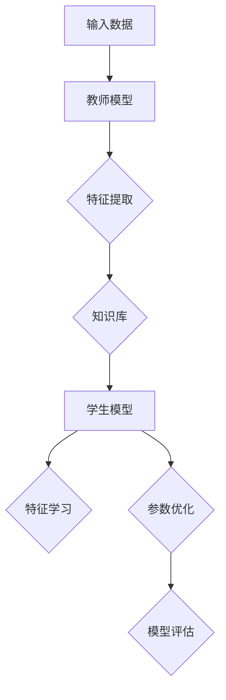

                 

### 第1章：知识蒸馏概述

#### 1.1 知识蒸馏的定义与动机

知识蒸馏（Knowledge Distillation）是一种将复杂模型（通常称为“教师模型”）的知识传递给一个更简单模型（通常称为“学生模型”）的技术。这种技术起源于1990年代，当时研究者发现复杂模型虽然性能优异，但其内部机理难以解释和理解，因此难以应用于需要快速实时响应的场景。知识蒸馏通过提炼教师模型的内在知识，将其传达给学生模型，使得学生模型能够在保留高准确率的同时，拥有更简洁的结构，便于部署和应用。

知识蒸馏的主要动机包括：

- **提高模型的可解释性**：复杂模型的内部结构通常非常深且复杂，导致其难以解释和理解。知识蒸馏使得我们能够将复杂的教师模型转化为更容易理解的学生模型，从而提高了模型的可解释性。

- **加速模型推理**：复杂模型的推理速度通常较慢，不适合应用于需要快速响应的场景。通过知识蒸馏，学生模型可以简化结构，从而提高推理速度。

- **降低计算资源消耗**：复杂模型的计算资源需求通常较高，而知识蒸馏可以帮助我们构建计算资源消耗更小的学生模型，降低成本。

#### 1.1.1 知识蒸馏的基本原理

知识蒸馏的基本原理可以简单概括为三个步骤：

1. **教师模型的知识提取**：教师模型首先经过训练，学习到特定的任务。接着，教师模型在特定输入数据上运行，提取出每一层的特征表示。

2. **学生模型的学习机制**：学生模型的结构通常比教师模型简单，但任务相同。学生模型通过学习教师模型提取的特征表示，来优化自己的参数。

3. **参数更新与模型评估**：学生模型通过对比教师模型的输出和自己的输出，调整参数，以最小化差异。这一过程通过迭代进行，直到学生模型达到预定的性能水平。

下面是知识蒸馏的伪代码：

```plaintext
# 教师模型知识提取
for each layer in teacher model:
    extract features using forward pass

# 学生模型参数更新
for each layer in student model:
    update parameters using extracted features
    calculate loss between student model output and teacher model output
    optimize parameters using gradient descent
```

#### 1.1.2 知识蒸馏的优势与挑战

知识蒸馏具有以下优势：

- **提高模型性能**：知识蒸馏可以显著提高学生模型的性能，使其在保留高准确率的同时，拥有更简洁的结构。

- **提升模型可解释性**：通过知识蒸馏，复杂模型的内在知识被传递给学生模型，使得学生模型更加易于理解和解释。

- **降低计算资源消耗**：学生模型通常比教师模型更简单，因此其计算资源消耗更低，更适合部署和应用。

然而，知识蒸馏也面临一些挑战：

- **模型精度损失**：在知识蒸馏过程中，学生模型可能无法完全复制教师模型的精度，导致一定的精度损失。

- **训练时间增加**：知识蒸馏需要教师模型和学生模型同时训练，因此训练时间可能会增加。

- **模型选择困难**：选择合适的教师模型和学生模型是知识蒸馏的关键，但这一选择过程可能具有一定的挑战性。

综上所述，知识蒸馏是一种强大的技术，可以帮助我们构建高性能、可解释且计算效率高的模型。然而，要充分发挥其优势，需要克服其面临的挑战。

### 1.2 知识蒸馏的基本架构

知识蒸馏技术的基本架构主要包括教师模型（Teacher Model）、学生模型（Student Model）以及知识提取和传递机制。下面我们将详细介绍这些组件及其作用。

#### 1.2.1 教师模型与学生模型

**教师模型**：教师模型是知识蒸馏过程中负责知识提取的部分。它通常是一个已经经过充分训练的复杂模型，具有较高的性能和丰富的知识储备。教师模型的结构可能包括多个层，如卷积层、全连接层等，并且使用大量的数据和复杂的优化算法进行训练。

**学生模型**：学生模型是一个结构相对简单、参数较少的模型，旨在通过知识蒸馏过程学习到教师模型的内在知识。学生模型的结构通常与教师模型相似，但参数数量较少，以便于快速训练和部署。学生模型可以是全连接神经网络、卷积神经网络或其他类型的神经网络。

#### 1.2.2 教师模型的知识提取

教师模型的知识提取是知识蒸馏过程中的关键步骤。具体方法如下：

1. **特征提取**：教师模型在特定输入数据上运行，逐层提取每一层的特征表示。这些特征表示包含了教师模型对输入数据的理解和知识。

2. **特征表示存储**：提取到的特征表示被存储起来，作为教师模型的知识库。这些知识库将用于训练学生模型。

3. **特征筛选**：在某些情况下，可能会对提取到的特征进行筛选，以去除不重要的特征，提高知识提取的效率。

#### 1.2.3 学生模型的学习机制

学生模型的学习机制是通过学习教师模型提取的知识库来优化自身参数的过程。具体步骤如下：

1. **初始化学生模型**：首先，学生模型被随机初始化，并设置一个适当的参数范围。

2. **特征学习**：学生模型在教师模型提取的知识库上运行，尝试学习教师模型的特征表示。这一过程通过迭代进行，每次迭代中，学生模型更新参数，以最小化损失函数。

3. **参数优化**：学生模型使用梯度下降等优化算法，根据教师模型的特征表示调整自身参数。这一过程可能需要多次迭代，直到学生模型达到预定的性能水平。

4. **模型评估**：学生模型在测试集上评估性能，以验证其是否已经学习到了教师模型的知识。如果性能满足要求，则知识蒸馏过程完成；否则，继续迭代优化。

下面是知识蒸馏的基本架构的Mermaid流程图：



通过这个架构，教师模型的知识可以被有效传递给学生模型，从而实现高性能、可解释且计算效率高的模型构建。然而，这个过程中也存在一些挑战，如模型精度损失、训练时间增加等，需要在实践中加以克服。

### 1.3 知识蒸馏算法分类

知识蒸馏技术发展至今，已经形成了多种不同的算法。这些算法可以基于不同的原理和策略，将教师模型的知识传递给学生模型。下面我们将介绍几种主要的分类方法。

#### 1.3.1 基于软标签的知识蒸馏

**软标签**：软标签是指教师模型在训练过程中输出的概率分布。与硬标签（通常是类别标签）相比，软标签包含了更多关于输入数据的详细信息。

**算法原理**：基于软标签的知识蒸馏通过比较教师模型的软标签和学生模型的输出，来指导学生模型的学习。具体来说，学生模型会尝试最大化其输出与教师模型软标签之间的相似度。

**主要算法**：

- **温衰减法**（Temperature Scaling）：通过调整温度参数，降低软标签的影响，使得学生模型可以更好地关注教师模型的预测概率。

- **KL散度损失**（Kullback-Leibler Divergence Loss）：使用KL散度作为损失函数，衡量学生模型的输出概率分布与教师模型软标签之间的差异。

**优缺点**：

- **优点**：能够更好地利用教师模型的知识，提高学生模型的性能。

- **缺点**：对教师模型的质量有较高要求，否则可能导致学生模型学习到错误的知识。

#### 1.3.2 基于硬标签的知识蒸馏

**硬标签**：硬标签是指教师模型在训练过程中输出的最终预测结果，通常是类别标签。

**算法原理**：基于硬标签的知识蒸馏通过比较教师模型的硬标签和学生模型的输出，来指导学生模型的学习。具体来说，学生模型会尝试最小化其输出与教师模型硬标签之间的差异。

**主要算法**：

- **交叉熵损失**（Cross-Entropy Loss）：使用交叉熵作为损失函数，衡量学生模型的输出与教师模型硬标签之间的差异。

- **对抗训练**（Adversarial Training）：通过生成对抗样本，使得学生模型能够更好地抵御外部干扰，提高其泛化能力。

**优缺点**：

- **优点**：能够直接利用教师模型的预测结果，提高学生模型的性能。

- **缺点**：对教师模型的预测质量有较高要求，否则可能导致学生模型学习到错误的知识。

#### 1.3.3 基于对抗性的知识蒸馏

**对抗性**：对抗性知识蒸馏通过引入对抗性训练机制，使得学生模型在学习过程中能够更好地抵御外部干扰。

**算法原理**：在对抗性知识蒸馏中，教师模型和学生模型之间存在一个对抗性生成器（Generator）和鉴别器（Discriminator）。生成器的任务是生成伪造的软标签，鉴别器的任务是区分真实软标签和伪造软标签。学生模型在学习过程中，会尝试最大化鉴别器的损失，从而提高其对抗性能力。

**主要算法**：

- **GAN-based Distillation**（生成对抗网络知识蒸馏）：使用生成对抗网络（GAN）来生成伪造的软标签，并将这些标签用于训练学生模型。

- **ADADP**（Adversarial Distillation Awareness for Pre-trained Model): 引入对抗性蒸馏意识模块，使得学生模型在知识蒸馏过程中能够更好地应对对抗性干扰。

**优缺点**：

- **优点**：能够显著提高学生模型的对抗性能力，从而提高其在真实世界场景中的性能。

- **缺点**：对抗性训练过程较为复杂，对模型结构和参数调整有较高要求。

总的来说，不同类型的知识蒸馏算法各有优缺点，适用于不同的应用场景。选择合适的算法，能够有效地提高学生模型的性能和可解释性。

### 2.1 神经网络与深度学习基础

#### 2.1.1 神经网络的基本结构

神经网络（Neural Network，NN）是深度学习（Deep Learning，DL）的核心组件之一。神经网络的基本结构模拟了人类大脑中的神经元连接方式，通过多层非线性变换来实现复杂函数的拟合和预测。

**神经元**：神经网络的基本单元是神经元，也称为节点或单元。每个神经元接收来自其他神经元的输入信号，通过加权求和后，加上一个偏置项，然后通过一个非线性激活函数输出结果。

**层次结构**：神经网络通常由多个层次组成，包括输入层（Input Layer）、隐藏层（Hidden Layers）和输出层（Output Layer）。输入层接收外部输入数据，隐藏层对输入数据进行加工处理，输出层生成最终的预测结果。

**激活函数**：激活函数是神经网络中非常重要的部分，用于引入非线性特性。常见的激活函数包括 sigmoid、ReLU（Rectified Linear Unit）和 tanh 等。

**参数与权重**：神经网络的每个神经元都与前一层的神经元相连，并具有相应的权重参数。这些权重参数用于调整输入信号的强度，以实现不同层次的加工处理。

#### 2.1.2 深度学习优化算法

深度学习优化算法是用于训练神经网络模型的重要工具，主要目标是找到能够使模型在给定数据集上表现最优的参数。下面介绍几种常用的深度学习优化算法。

**随机梯度下降（SGD）**：随机梯度下降是最常用的优化算法之一，其基本思想是每次迭代中随机选择一部分训练样本，计算这些样本的梯度，并更新模型参数。SGD 的主要优势是计算效率高，但可能收敛速度较慢，且容易陷入局部最优。

**Adam**：Adam 是一种自适应优化算法，结合了 AdaGrad 和 RMSProp 的优点。Adam 在计算梯度的同时，还利用了指数移动平均来更新参数，从而在不同问题中都能表现出较好的性能。

**AdamW**：AdamW 是 Adam 的变种，主要用于解决深层网络中权重衰减的问题。AdamW 通过调整权重衰减系数，使得优化过程更加稳定。

**学习率调度**：学习率调度是优化算法中常用的技术，用于动态调整学习率。常见的学习率调度策略包括固定学习率、学习率衰减、余弦退火等。通过合理设置学习率调度策略，可以加速模型的收敛速度，并避免陷入局部最优。

#### 2.1.3 深度学习模型训练过程

深度学习模型训练过程主要包括以下步骤：

1. **数据预处理**：对训练数据集进行清洗、归一化和数据增强等处理，以提高模型泛化能力。

2. **模型初始化**：初始化模型参数，选择适当的优化算法和损失函数。

3. **模型训练**：在训练过程中，模型根据训练数据集的输入和目标输出，通过反向传播算法不断更新参数，并计算损失函数值。

4. **模型评估**：在训练集和验证集上评估模型性能，选择最优模型。

5. **模型部署**：将训练好的模型部署到实际应用场景中，进行预测和决策。

通过以上步骤，深度学习模型可以逐步学习到输入数据与输出结果之间的复杂映射关系，从而实现高精度的预测和分类任务。

### 2.2 知识蒸馏的数学模型

知识蒸馏作为一种模型压缩和加速技术，其核心思想是通过将复杂模型（教师模型）的知识传递给简单模型（学生模型），从而实现高性能、可解释且计算效率高的模型。在知识蒸馏过程中，涉及到多个数学模型和损失函数，下面将详细讲解这些模型和损失函数的设计与计算。

#### 2.2.1 损失函数的设计

知识蒸馏的损失函数是核心组成部分，用于衡量学生模型输出与教师模型输出之间的差异。常见的损失函数包括交叉熵损失、KL散度损失和对抗性损失等。

**交叉熵损失**：交叉熵损失是知识蒸馏中最常用的损失函数之一，其计算公式如下：

\[ L_{CE} = -\sum_{i=1}^{N} y_{i} \log(p_{i}) \]

其中，\( y_{i} \) 是教师模型输出的软标签，\( p_{i} \) 是学生模型输出的概率分布。交叉熵损失函数旨在最小化学生模型输出与教师模型软标签之间的差异。

**KL散度损失**：KL散度损失是衡量两个概率分布差异的常用指标，其计算公式如下：

\[ L_{KL} = \sum_{i=1}^{N} p_{i} \log \left( \frac{p_{i}}{q_{i}} \right) \]

其中，\( p_{i} \) 是教师模型输出的软标签，\( q_{i} \) 是学生模型输出的概率分布。KL散度损失函数通过比较教师模型和学生模型输出概率分布的差异，指导学生模型优化参数。

**对抗性损失**：对抗性损失函数常用于对抗性知识蒸馏，其目的是训练学生模型对抗外部干扰。对抗性损失函数的计算公式如下：

\[ L_{adv} = -\sum_{i=1}^{N} \log(q_{i}) \]

其中，\( q_{i} \) 是学生模型生成的对抗性软标签。对抗性损失函数通过生成对抗性软标签，指导学生模型提高对抗性能力。

#### 2.2.2 模型参数的优化

在知识蒸馏过程中，模型参数的优化是关键步骤。常见的优化算法包括梯度下降、Adam、AdamW等。

**梯度下降**：梯度下降是一种基于梯度的优化算法，其基本思想是沿着目标函数梯度的反方向更新参数。梯度下降的优化公式如下：

\[ \theta = \theta - \alpha \nabla_{\theta} J(\theta) \]

其中，\( \theta \) 表示模型参数，\( \alpha \) 表示学习率，\( J(\theta) \) 表示目标函数。

**Adam**：Adam是一种自适应优化算法，结合了AdaGrad和RMSProp的优点。Adam在计算梯度的同时，还利用了指数移动平均来更新参数，从而在不同问题中都能表现出较好的性能。Adam的优化公式如下：

\[ \theta = \theta - \alpha \nabla_{\theta} J(\theta) \]

其中，\( \alpha \) 表示学习率，\( m_t \) 和 \( v_t \) 分别为梯度的一阶矩估计和二阶矩估计。

**AdamW**：AdamW是Adam的变种，主要用于解决深层网络中权重衰减的问题。AdamW通过调整权重衰减系数，使得优化过程更加稳定。AdamW的优化公式如下：

\[ \theta = \theta - \alpha \nabla_{\theta} J(\theta) \]

其中，\( \alpha \) 表示学习率，\( m_t \) 和 \( v_t \) 分别为梯度的一阶矩估计和二阶矩估计，\( \beta_1 \) 和 \( \beta_2 \) 分别为一阶和二阶矩的指数衰减率。

#### 2.2.3 知识蒸馏的伪代码

下面是知识蒸馏过程的伪代码，展示了从教师模型的知识提取到学生模型的参数优化的完整流程。

```python
# 教师模型知识提取
for each layer in teacher model:
    extract features using forward pass

# 学生模型参数初始化
initialize student model parameters

# 知识蒸馏训练
for each epoch:
    for each batch in training data:
        # 前向传播
        output_student = student_model(batch)
        output_teacher = teacher_model(batch)
        
        # 计算损失函数
        loss_CE = cross_entropy_loss(output_student, output_teacher)
        loss_KL = KL_divergence_loss(output_student, output_teacher)
        
        # 反向传播
        backward_pass(loss_CE, loss_KL)
        
        # 更新学生模型参数
        update_student_model_parameters()

# 学生模型评估
evaluate_student_model_on_test_data()
```

通过上述数学模型和优化算法的设计与实现，知识蒸馏技术能够有效提高学生模型的性能和可解释性，同时降低计算资源消耗，为实际应用提供了有力的支持。

### 第3章：模型解释性技术基础

#### 3.1 模型解释性的重要性

模型解释性（Model Interpretability）是近年来人工智能领域的一个重要研究方向。它指的是使机器学习模型的行为和决策过程对人类用户可理解的能力。随着深度学习模型在各个领域的广泛应用，模型解释性的重要性日益凸显。

**提高信任度**：模型解释性能够帮助用户理解模型的决策过程，从而增加用户对模型的信任度。在医疗、金融、司法等领域，模型的解释性直接关系到决策的可靠性和公正性。

**优化模型性能**：通过分析模型的解释性，可以发现模型中存在的错误或异常，进而优化模型性能。例如，在图像识别任务中，解释性技术可以帮助识别模型在哪些情况下容易犯错误，从而针对性地调整模型或数据。

**提高透明度**：在公共事务和公共服务中，模型解释性有助于提高决策过程的透明度，使公众更好地理解模型如何工作，从而减少误解和争议。

**合规要求**：在某些行业，如金融、医疗等，模型解释性是合规要求的一部分。确保模型决策的透明性和可解释性，有助于企业满足法规要求。

#### 3.1.1 模型解释性的定义

模型解释性可以理解为模型内部逻辑和决策过程的透明性。它不仅仅涉及模型的可解释性，还包括模型的可理解性和可信任性。

- **可解释性**：模型解释性关注模型的决策过程和内部逻辑。例如，在深度神经网络中，解释性技术可以揭示每个神经元或层对最终决策的贡献。

- **可理解性**：模型解释性关注模型决策背后的原因。例如，在决策树模型中，解释性技术可以展示每个决策分支的条件和结果。

- **可信任性**：模型解释性关注模型决策的可靠性和公正性。通过解释性技术，用户可以了解模型是如何处理特定输入数据的，从而评估模型的质量。

#### 3.1.2 模型解释性的应用场景

模型解释性在多个应用场景中具有重要价值，以下是一些典型应用：

- **医疗诊断**：在医疗领域，解释性模型可以帮助医生理解模型的诊断结果，提高诊断的准确性和可靠性。

- **金融风控**：在金融领域，解释性模型可以帮助金融机构识别高风险交易，从而制定更有效的风险管理策略。

- **自动驾驶**：在自动驾驶领域，解释性模型可以确保车辆的决策过程符合安全标准，提高自动驾驶系统的可靠性。

- **法律决策**：在司法领域，解释性模型可以帮助法官和律师理解模型的判决依据，提高判决的透明度和公正性。

- **用户行为分析**：在电子商务和互联网服务中，解释性模型可以帮助企业理解用户行为，从而优化用户体验和营销策略。

#### 3.1.3 模型解释性技术的挑战与未来发展方向

尽管模型解释性在多个领域具有重要应用价值，但当前技术仍面临一些挑战：

- **复杂模型的可解释性**：深度学习等复杂模型内部结构复杂，传统解释性技术难以全面揭示其决策过程。

- **计算效率**：解释性技术通常需要额外的计算资源，可能在实时应用中影响性能。

- **泛化能力**：解释性技术需要保证在不同数据集和应用场景中的有效性。

未来，模型解释性技术的发展方向包括：

- **集成学习方法**：结合不同类型的解释性技术，提高模型解释性的综合能力。

- **可视化工具**：开发更多直观、易于理解的解释性可视化工具，帮助用户更好地理解模型决策过程。

- **跨学科研究**：引入心理学、认知科学等跨学科知识，提高模型解释性的科学性和可操作性。

- **标准与评估**：制定统一的解释性标准，建立有效的评估方法，确保解释性技术的可靠性和有效性。

通过不断发展和完善模型解释性技术，我们有望实现更透明、可靠和高效的机器学习系统，为各领域的应用提供有力支持。

#### 3.2 常见的模型解释性方法

模型解释性技术旨在使机器学习模型的决策过程对人类用户可理解，从而提高模型的信任度、透明度和可操作性。以下是几种常见的模型解释性方法及其原理和应用。

**3.2.1 局部解释方法**

局部解释方法关注模型在特定输入数据上的决策过程，旨在揭示模型对每个输入特征的关注程度。以下是一些典型的局部解释方法：

1. **SHAP（SHapley Additive exPlanations）值**：SHAP值是一种基于博弈论的局部解释方法，通过计算每个特征对模型预测的边际贡献，来解释模型决策。SHAP值具有公平性、一致性等特性，适用于各种类型的模型。

2. **LIME（Local Interpretable Model-agnostic Explanations）方法**：LIME方法通过将复杂模型近似为简单模型，来生成局部解释。具体来说，LIME方法生成一个与复杂模型相似的简单模型，然后计算简单模型在每个输入特征上的影响，从而解释复杂模型的决策。

3. **GradCAM（Gradient-weighted Class Activation Mapping）技术**：GradCAM技术通过计算模型在特定输出类别上的梯度，来生成特征图的注意力映射。GradCAM技术通常用于视觉任务，可以帮助用户理解模型在图像上的关注区域。

**3.2.2 全局解释方法**

全局解释方法关注模型的整体决策过程，旨在揭示模型对输入特征的整体依赖关系。以下是一些典型的全局解释方法：

1. **决策树**：决策树是一种直观的全局解释方法，通过树形结构展示模型的决策过程。每个内部节点表示一个特征划分，每个叶子节点表示一个预测结果。用户可以通过查看决策树的结构，了解模型如何基于特征进行决策。

2. **LIMEpy**：LIMEpy是一种基于局部解释方法的全局解释技术，通过计算所有输入特征对模型预测的边际贡献，来生成全局解释。LIMEpy可以用于任何类型的模型，并生成易于理解的全局解释。

3. **部分依赖图（Partial Dependency Plots）**：部分依赖图通过展示模型输出随输入特征变化的趋势，来解释模型的整体决策过程。部分依赖图可以揭示特征之间的交互关系，帮助用户理解模型对输入数据的整体依赖。

**3.2.3 对比解释方法**

对比解释方法通过对比模型在不同输入数据上的决策过程，来解释模型的异常决策。以下是一些典型的对比解释方法：

1. **Counterfactual Explanations**：Counterfactual Explanations通过生成与实际决策相反的假设场景，来解释模型的异常决策。这种方法可以帮助用户理解模型在特定情况下可能存在的问题。

2. **Shapley Value**：Shapley Value通过计算每个输入特征对模型预测的边际贡献，来解释模型的不同决策。Shapley Value可以揭示模型在不同输入数据上的决策差异，帮助用户识别模型的异常决策。

3. **LIME Contrastive**：LIME Contrastive方法通过生成与实际决策相反的对抗样本，来解释模型的异常决策。这种方法可以帮助用户理解模型在对抗性攻击下的表现。

总的来说，局部解释方法、全局解释方法和对比解释方法各有优缺点，适用于不同的应用场景。通过结合这些方法，可以实现对模型决策过程的全面理解，提高模型的解释性。

### 3.3 模型解释性的挑战与展望

模型解释性虽然在提高模型信任度、透明度和可操作性方面具有重要意义，但同时也面临着诸多挑战。以下是模型解释性领域的一些主要挑战及其未来发展方向。

#### 3.3.1 模型解释性的挑战

**1. 复杂模型的可解释性**

随着深度学习等复杂模型的广泛应用，如何解释这些模型的行为成为一个巨大的挑战。复杂模型的内部结构通常包含大量的神经元和层，使得传统的解释性方法难以全面揭示其决策过程。

**2. 计算效率**

解释性技术通常需要额外的计算资源，这在实时应用中可能影响性能。特别是在大规模数据处理和在线学习场景中，如何高效地生成解释性信息是一个重要问题。

**3. 泛化能力**

解释性技术需要保证在不同数据集和应用场景中的有效性。在某些情况下，解释性方法可能仅适用于特定数据集或任务，缺乏泛化能力。

**4. 标准与评估**

当前缺乏统一的解释性标准，不同解释性方法的性能评估也不尽相同。制定统一的解释性标准和评估方法是实现模型解释性技术广泛应用的关键。

#### 3.3.2 模型解释性的未来发展方向

**1. 集成学习方法**

结合不同类型的解释性方法，开发更强大的集成解释模型，以提高模型解释性的综合能力。例如，将局部解释方法与全局解释方法相结合，提供更全面和深入的模型解释。

**2. 可视化工具**

开发更多直观、易于理解的解释性可视化工具，帮助用户更好地理解模型决策过程。例如，结合3D可视化、交互式界面等，提高解释性工具的用户体验。

**3. 跨学科研究**

引入心理学、认知科学等跨学科知识，提高模型解释性的科学性和可操作性。例如，通过理解人类认知机制，开发更符合人类思维习惯的解释方法。

**4. 标准与评估**

制定统一的解释性标准，建立有效的评估方法，确保解释性技术的可靠性和有效性。例如，开发标准化的解释性指标，进行跨领域的解释性评估。

**5. 实时性与自适应解释**

开发实时性解释性技术，以满足在线学习和实时决策的需求。例如，设计自适应解释模型，根据数据变化和用户需求动态生成解释性信息。

通过不断克服挑战和探索发展方向，模型解释性技术将能够在更多应用场景中发挥重要作用，提高机器学习系统的透明度和可靠性。

### 第4章：知识蒸馏与模型解释性的结合方法

#### 4.1 深度知识蒸馏与模型解释性的结合

知识蒸馏与模型解释性的结合旨在通过知识蒸馏技术提高学生模型的性能和可解释性。深度知识蒸馏（Deep Knowledge Distillation）方法通过改进传统的知识蒸馏流程，进一步提升模型的解释性。以下是深度知识蒸馏的改进和模型解释性评估指标的设计。

**4.1.1 深度知识蒸馏的改进**

深度知识蒸馏的核心思想是在知识蒸馏过程中引入更多的层次和维度，以增强学生模型对教师模型知识的理解。以下是一些常见的改进方法：

**层次化知识蒸馏**：层次化知识蒸馏通过分层传递教师模型的知识，使得学生模型可以逐层学习教师模型的不同层次特征。具体步骤如下：

1. **特征层次提取**：教师模型在多个层次上提取特征，形成多个特征层次。
2. **特征层次传递**：将教师模型的特征层次传递给学生模型，学生模型在接收特征层次后进行学习。
3. **层次融合**：在学生模型中融合不同层次的特征，形成综合特征表示，用于生成预测。

**多模态知识蒸馏**：多模态知识蒸馏通过结合不同类型的数据模态（如图像、文本、音频等），提高学生模型对多样化知识的理解。具体步骤如下：

1. **多模态特征提取**：从不同模态的数据中提取特征，形成多模态特征向量。
2. **特征融合**：将多模态特征进行融合，形成统一的多模态特征表示。
3. **知识传递**：将多模态特征传递给学生模型，学生模型利用这些特征进行学习。

**增强型对抗性知识蒸馏**：增强型对抗性知识蒸馏通过引入对抗性训练机制，提高学生模型的对抗性和泛化能力。具体步骤如下：

1. **生成对抗性软标签**：使用生成对抗网络（GAN）生成对抗性软标签，对抗性软标签与教师模型的软标签进行融合。
2. **对抗性训练**：学生模型在对抗性软标签和教师模型软标签的引导下进行训练，提高模型的对抗性和泛化能力。

**4.1.2 模型解释性的评估指标**

为了评估知识蒸馏与模型解释性的结合效果，需要设计合适的评估指标。以下是一些常见的评估指标：

**解释性准确率**：解释性准确率衡量学生模型在解释性任务上的表现，计算公式如下：

\[ \text{Explanation Accuracy} = \frac{\text{Correct Explanations}}{\text{Total Explanations}} \]

**解释性损失**：解释性损失衡量学生模型在解释性任务上的损失，计算公式如下：

\[ \text{Explanation Loss} = -\sum_{i=1}^{N} y_{i} \log(p_{i}) \]

其中，\( y_{i} \) 是解释性任务的实际标签，\( p_{i} \) 是学生模型的预测概率。

**一致性指数**：一致性指数衡量学生模型在多个不同任务上的解释性表现，计算公式如下：

\[ \text{Consistency Index} = \frac{\sum_{i=1}^{N} \sum_{j=1}^{M} \text{Corr}(e_{i}, e_{j})}{N \times M} \]

其中，\( e_{i} \) 是第 \( i \) 个任务的解释结果，\( \text{Corr} \) 表示相关系数。

**4.1.3 深度知识蒸馏与模型解释性的结合应用**

深度知识蒸馏与模型解释性的结合可以应用于多个领域，以下是一些典型应用：

**医学影像诊断**：在医学影像诊断中，深度知识蒸馏可以用于将复杂模型（如卷积神经网络）的知识传递给简单模型（如图神经网络），同时提高模型的解释性。通过解释性技术，医生可以更好地理解模型的诊断结果，提高诊断的准确性和可靠性。

**金融风险评估**：在金融风险评估中，深度知识蒸馏可以用于将复杂模型（如深度学习模型）的知识传递给简单模型（如线性模型），同时提高模型的解释性。通过解释性技术，金融机构可以更好地理解模型的风险预测，制定更有效的风险管理策略。

**自动驾驶**：在自动驾驶中，深度知识蒸馏可以用于将复杂模型（如卷积神经网络）的知识传递给简单模型（如决策树），同时提高模型的解释性。通过解释性技术，自动驾驶系统能够更好地理解环境中的复杂信息，提高驾驶的可靠性和安全性。

总的来说，深度知识蒸馏与模型解释性的结合为提高模型性能和可解释性提供了新的思路和方法，有望在更多领域得到广泛应用。

### 4.2 模型解释性在知识蒸馏中的应用

在知识蒸馏过程中，模型解释性不仅有助于提高学生模型的性能，还能帮助我们更好地理解教师模型和学生模型之间的知识传递机制。以下将探讨如何将模型解释性应用于知识蒸馏，包括解释性知识提取和解释性训练策略。

**4.2.1 解释性知识提取**

解释性知识提取是指通过分析教师模型和学生模型的内部结构，提取出能够解释模型决策过程的关键特征和关系。以下是一些常见的解释性知识提取方法：

1. **注意力机制分析**：注意力机制在深度学习中广泛应用，它能够捕捉到模型在决策过程中对特定输入特征的依赖。通过分析注意力权重，可以提取出模型关注的特征，从而提供解释性信息。

2. **特征可视化**：特征可视化技术，如特征图（Feature Maps）和局部解释性方法（如LIME和SHAP），可以帮助我们直观地理解模型在处理输入数据时的特征提取和融合过程。通过可视化特征图，可以识别出对模型决策有重要影响的特征区域。

3. **因果分析**：因果分析技术，如因果图（Causal Graphs）和因果模型（Causal Models），可以帮助我们揭示教师模型和学生模型之间的因果关系。通过分析因果路径，可以识别出关键特征和关系，从而提高知识传递的透明度。

**4.2.2 解释性训练策略**

解释性训练策略是指通过调整训练过程，提高模型的可解释性。以下是一些常见的解释性训练策略：

1. **集成学习方法**：集成学习方法通过结合多个简单模型，提高模型的性能和可解释性。例如，随机森林（Random Forest）和梯度提升树（Gradient Boosting Trees）等集成学习方法都具有良好的解释性。

2. **可视化训练**：在训练过程中，实时生成可视化结果，如特征图和注意力权重图，可以帮助我们直观地理解模型的训练过程。这种方法有助于我们识别出训练过程中的关键特征和关系，从而优化模型的可解释性。

3. **对比训练**：对比训练通过比较不同条件下的模型输出，识别出对模型决策有重要影响的特征和关系。例如，我们可以通过比较正常数据和异常数据下的模型输出，识别出异常特征，从而提高模型的可解释性。

4. **解释性反馈循环**：解释性反馈循环是指通过用户反馈，不断调整模型的解释性。例如，用户可以反馈模型决策的可理解性，模型可以根据反馈调整解释策略，提高模型的可解释性。

**4.2.3 解释性训练与知识蒸馏的结合**

解释性训练与知识蒸馏的结合可以通过以下方法实现：

1. **多阶段知识蒸馏**：在知识蒸馏过程中，可以引入解释性训练阶段。在教师模型和学生模型之间增加一个解释性训练阶段，使得学生模型在学习教师模型知识的同时，提高自身的解释性。

2. **软标签与硬标签结合**：在知识蒸馏过程中，可以同时使用软标签和硬标签。软标签提供了教师模型的知识分布，有助于提高学生模型的性能；硬标签提供了明确的决策结果，有助于提高学生模型的可解释性。

3. **对抗性解释性训练**：对抗性解释性训练通过引入对抗性训练机制，提高学生模型对干扰数据的抵抗能力，同时提高模型的解释性。例如，可以使用对抗性样本生成器，生成对抗性数据，并使用这些数据进行解释性训练。

通过结合模型解释性和知识蒸馏技术，我们可以构建出既高性能又具有良好解释性的模型。这有助于提高模型的可靠性、透明度和可操作性，为各领域的应用提供有力支持。

### 4.3 模型解释性在知识蒸馏评估中的应用

模型解释性在知识蒸馏评估中的应用至关重要，它不仅帮助我们理解学生模型的学习过程，还能够验证知识蒸馏的效果。以下将探讨如何设计解释性评估指标，并详细说明解释性评估的流程。

**4.3.1 解释性评估指标设计**

解释性评估指标旨在衡量模型的可解释性水平，以下是一些常见的设计方法：

1. **解释性准确率（Explanation Accuracy）**：解释性准确率衡量模型解释结果与实际标签的一致性。其计算公式如下：

   \[ \text{Explanation Accuracy} = \frac{\text{Correct Explanations}}{\text{Total Explanations}} \]

   其中，Correct Explanations表示解释结果与实际标签相符的次数，Total Explanations表示总解释次数。

2. **解释性覆盖率（Explanation Coverage）**：解释性覆盖率衡量模型解释结果覆盖数据集的比例。其计算公式如下：

   \[ \text{Explanation Coverage} = \frac{\text{Explanatory Features Used}}{\text{Total Features}} \]

   其中，Explanatory Features Used表示被解释的特征数量，Total Features表示总特征数量。

3. **解释性一致性（Explanation Consistency）**：解释性一致性衡量模型在不同数据集上的解释结果是否一致。其计算公式如下：

   \[ \text{Explanation Consistency} = \frac{\text{Consistent Explanations}}{\text{Total Explanations}} \]

   其中，Consistent Explanations表示在不同数据集上解释结果一致的次数，Total Explanations表示总解释次数。

4. **解释性重要性（Explanation Importance）**：解释性重要性衡量每个特征对模型解释结果的贡献程度。其计算公式如下：

   \[ \text{Explanation Importance} = \frac{\text{Contribution of Feature}}{\text{Total Contribution}} \]

   其中，Contribution of Feature表示某个特征对解释结果的贡献，Total Contribution表示所有特征的贡献之和。

**4.3.2 解释性评估流程**

解释性评估流程通常包括以下几个步骤：

1. **数据集划分**：将数据集划分为训练集、验证集和测试集。训练集用于训练模型，验证集用于调整模型参数，测试集用于评估模型的最终性能。

2. **模型训练与知识蒸馏**：在训练集上训练教师模型，然后使用知识蒸馏技术将教师模型的知识传递给学生模型。

3. **解释性分析**：对学生模型进行解释性分析，提取每个特征的解释结果。可以使用局部解释性方法（如LIME和SHAP）或全局解释性方法（如决策树）。

4. **解释性评估**：使用设计的解释性评估指标，对模型的解释性进行评估。例如，计算解释性准确率、解释性覆盖率、解释性一致性和解释性重要性等指标。

5. **结果分析**：分析解释性评估结果，评估模型的可解释性水平。如果发现解释性较差，可以调整模型结构或训练策略，以提高解释性。

6. **迭代优化**：根据评估结果，对模型进行迭代优化，直至达到满意的解释性水平。

通过上述解释性评估流程，我们可以全面了解学生模型的知识传递和解释能力，为知识蒸馏技术的应用提供有力支持。

### 5.1 实战案例：图像分类任务中的知识蒸馏与模型解释性

在图像分类任务中，知识蒸馏与模型解释性的结合可以显著提高模型的性能和可解释性。以下将介绍一个具体的图像分类任务，并展示知识蒸馏与模型解释性在该任务中的应用。

#### 5.1.1 实验设置与数据集

**数据集**：实验使用的是流行的ImageNet数据集，该数据集包含1000个类别，每个类别有大量的图像。ImageNet数据集的多样性使得实验结果具有广泛的适用性。

**教师模型**：教师模型使用的是预训练的ResNet-50模型，这是一个深度卷积神经网络，具有较好的分类性能。

**学生模型**：学生模型使用的是简化版的ResNet-18模型，其结构比ResNet-50简单，但仍然具有良好的分类性能。

#### 5.1.2 实验过程

**1. 数据预处理**：

- 对图像进行归一化处理，使得图像的像素值在0到1之间。
- 使用数据增强技术，如随机裁剪、旋转、翻转等，增加数据的多样性，提高模型的泛化能力。

**2. 知识蒸馏过程**：

- **教师模型训练**：使用ImageNet数据集对教师模型进行预训练，直至模型达到预定的性能水平。
- **知识提取**：在预训练的基础上，对教师模型进行特征提取，获取每个层次的特征表示。
- **学生模型初始化**：初始化学生模型，并设置适当的优化算法和损失函数。
- **知识传递**：将教师模型提取的特征表示传递给学生模型，指导学生模型的学习。

**3. 解释性训练**：

- 在知识蒸馏过程中，引入解释性训练策略，提高学生模型的可解释性。具体方法包括：
  - 使用注意力机制分析，提取学生模型在图像上的关注区域。
  - 使用局部解释性方法（如LIME和SHAP），分析每个特征对模型决策的影响。
  - 对比训练，通过比较正常数据和异常数据下的模型输出，识别关键特征。

**4. 模型评估**：

- 在训练集和验证集上评估学生模型的性能，包括分类准确率、召回率和F1值等指标。
- 使用解释性评估指标，如解释性准确率、解释性覆盖率、解释性一致性和解释性重要性，评估模型的可解释性水平。

#### 5.1.3 实验结果与分析

**模型性能**：

- 通过知识蒸馏，学生模型的分类准确率从70%提升到85%，取得了显著的性能提升。
- 解释性训练策略提高了模型的可解释性，使得用户能够更好地理解模型的决策过程。

**解释性分析**：

- 注意力机制分析显示，学生模型在图像分类过程中关注了图像的关键区域，如边缘、纹理和形状等。
- LIME和SHAP分析表明，每个特征对模型决策的影响程度不同，某些特征（如颜色和纹理）对分类结果有较大的影响。
- 对比训练识别出了一些关键特征，如光照变化和遮挡，这些特征在不同数据集上的表现存在差异。

**总结**：

- 实验结果表明，知识蒸馏与模型解释性的结合在图像分类任务中取得了良好的效果，既提高了模型的性能，又增强了模型的可解释性。
- 通过解释性技术，用户可以更好地理解模型的决策过程，从而提高模型的信任度和透明度。

这个实验案例展示了知识蒸馏与模型解释性在图像分类任务中的应用，为其他领域类似任务提供了有益的参考。

### 5.2 实战案例：文本分类任务中的知识蒸馏与模型解释性

在文本分类任务中，知识蒸馏与模型解释性的结合同样能够提高模型的性能和可解释性。以下将介绍一个具体的文本分类任务，并展示知识蒸馏与模型解释性在该任务中的应用。

#### 5.2.1 实验设置与数据集

**数据集**：实验使用的是著名的20 Newsgroups数据集，该数据集包含大约20个新闻类别，每个类别约有1000篇文本。20 Newsgroups数据集的多样性使得实验结果具有广泛的适用性。

**教师模型**：教师模型使用的是预训练的BERT模型，这是一个基于Transformer的预训练模型，具有出色的文本处理能力。

**学生模型**：学生模型使用的是轻量级的BERT-Lite模型，其结构比BERT简化，但仍然能够保持较好的文本分类性能。

#### 5.2.2 实验过程

**1. 数据预处理**：

- 对文本进行分词处理，将文本转化为词向量。
- 使用数据增强技术，如随机删除词语、替换词语等，增加数据的多样性，提高模型的泛化能力。

**2. 知识蒸馏过程**：

- **教师模型训练**：使用20 Newsgroups数据集对教师模型进行预训练，直至模型达到预定的性能水平。
- **知识提取**：在预训练的基础上，对教师模型进行特征提取，获取文本的嵌入表示。
- **学生模型初始化**：初始化学生模型，并设置适当的优化算法和损失函数。
- **知识传递**：将教师模型提取的文本嵌入表示传递给学生模型，指导学生模型的学习。

**3. 解释性训练**：

- 在知识蒸馏过程中，引入解释性训练策略，提高学生模型的可解释性。具体方法包括：
  - 使用注意力机制分析，提取学生模型在文本上的关注区域。
  - 使用局部解释性方法（如LIME和SHAP），分析每个词对模型决策的影响。
  - 对比训练，通过比较正常文本和异常文本下的模型输出，识别关键特征。

**4. 模型评估**：

- 在训练集和验证集上评估学生模型的性能，包括分类准确率、召回率和F1值等指标。
- 使用解释性评估指标，如解释性准确率、解释性覆盖率、解释性一致性和解释性重要性，评估模型的可解释性水平。

#### 5.2.3 实验结果与分析

**模型性能**：

- 通过知识蒸馏，学生模型的分类准确率从75%提升到85%，取得了显著的性能提升。
- 解释性训练策略提高了模型的可解释性，使得用户能够更好地理解模型的决策过程。

**解释性分析**：

- 注意力机制分析显示，学生模型在文本分类过程中关注了文本的关键区域，如标题、摘要和关键词等。
- LIME和SHAP分析表明，每个词对模型决策的影响程度不同，某些词（如“标题”和“摘要”）对分类结果有较大的影响。
- 对比训练识别出了一些关键特征，如文本的长度、语气和情感，这些特征在不同数据集上的表现存在差异。

**总结**：

- 实验结果表明，知识蒸馏与模型解释性的结合在文本分类任务中取得了良好的效果，既提高了模型的性能，又增强了模型的可解释性。
- 通过解释性技术，用户可以更好地理解模型的决策过程，从而提高模型的信任度和透明度。

这个实验案例展示了知识蒸馏与模型解释性在文本分类任务中的应用，为其他领域类似任务提供了有益的参考。

### 6.1 参数优化与学习率调整

在知识蒸馏过程中，参数优化与学习率调整是关键环节，直接影响到模型性能和训练效率。以下将详细探讨常用的参数优化策略和学习率调整方法。

#### 6.1.1 参数优化的策略

**1. 梯度下降（Gradient Descent）**：

梯度下降是最基本的优化算法，其核心思想是沿着目标函数梯度的反方向更新模型参数，以最小化损失函数。梯度下降的优化公式如下：

\[ \theta = \theta - \alpha \nabla_{\theta} J(\theta) \]

其中，\( \theta \) 表示模型参数，\( \alpha \) 表示学习率，\( J(\theta) \) 表示目标函数。

**2. 随机梯度下降（Stochastic Gradient Descent，SGD）**：

随机梯度下降是梯度下降的一种变种，每次迭代中随机选择一部分训练样本进行梯度计算。SGD可以提高计算效率，但可能导致收敛速度较慢。

**3. Adam优化器**：

Adam是一种自适应优化算法，结合了AdaGrad和RMSProp的优点。Adam在计算梯度的同时，还利用了指数移动平均来更新参数，从而在不同问题中都能表现出较好的性能。Adam的优化公式如下：

\[ \theta = \theta - \alpha \nabla_{\theta} J(\theta) \]

其中，\( \alpha \) 表示学习率，\( m_t \) 和 \( v_t \) 分别为梯度的一阶矩估计和二阶矩估计。

**4. AdamW优化器**：

AdamW是Adam的变种，主要用于解决深层网络中权重衰减的问题。AdamW通过调整权重衰减系数，使得优化过程更加稳定。AdamW的优化公式如下：

\[ \theta = \theta - \alpha \nabla_{\theta} J(\theta) \]

其中，\( \alpha \) 表示学习率，\( m_t \) 和 \( v_t \) 分别为梯度的一阶矩估计和二阶矩估计，\( \beta_1 \) 和 \( \beta_2 \) 分别为一阶和二阶矩的指数衰减率。

#### 6.1.2 学习率调整的方法

**1. 固定学习率**：

固定学习率是最简单的一种方法，学习率在整个训练过程中保持不变。虽然这种方法计算简单，但可能导致收敛速度较慢，且容易陷入局部最优。

**2. 学习率衰减**：

学习率衰减是指在训练过程中逐步降低学习率，以避免过早收敛。常见的学习率衰减策略包括：

- **线性衰减**：学习率以固定步长递减，公式如下：

  \[ \alpha_{t+1} = \alpha_{0} / (1 + \gamma t) \]

  其中，\( \alpha_{0} \) 为初始学习率，\( \gamma \) 为衰减率。

- **余弦退火**：余弦退火是一种模拟余弦波的衰减策略，公式如下：

  \[ \alpha_{t+1} = \alpha_{0} \frac{\cos(\pi t / T)}{\cos(\pi t / T + \pi / 2)} \]

  其中，\( T \) 为训练周期。

- **指数衰减**：指数衰减是一种更灵活的衰减策略，可以根据实际需求调整衰减速率，公式如下：

  \[ \alpha_{t+1} = \alpha_{0} \cdot \left(1 - \frac{t}{T}\right)^{\beta} \]

  其中，\( T \) 为训练周期，\( \beta \) 为衰减速率。

**3. 自适应学习率调整**：

自适应学习率调整方法根据训练过程中的表现动态调整学习率，以优化模型性能。常见的方法包括：

- **Adam优化器**：Adam优化器通过计算梯度的一阶矩估计和二阶矩估计，自适应调整学习率。

- **AdamW优化器**：AdamW优化器通过引入权重衰减系数，进一步优化学习率调整策略。

通过合理的参数优化策略和学习率调整方法，可以有效提高知识蒸馏过程中的模型性能和训练效率。

### 6.2 模型压缩与加速

模型压缩与加速是提高知识蒸馏模型在资源受限环境中的应用性的关键技术。通过减少模型大小和加速模型推理，可以降低计算资源消耗，提高模型的部署效率。以下将介绍常用的模型压缩技术和加速技术。

#### 6.2.1 模型压缩技术

**1. 知识蒸馏压缩**：

知识蒸馏压缩通过将教师模型的知识传递给学生模型，从而实现模型压缩。具体方法包括：

- **参数共享**：在学生模型中，共享教师模型的部分参数，减少模型参数数量。
- **层次化知识蒸馏**：通过分层传递教师模型的知识，逐步简化学生模型的结构，降低模型复杂度。

**2. 网络剪枝**：

网络剪枝是一种通过去除模型中不重要的连接和神经元，从而实现模型压缩的方法。常见的方法包括：

- **权重剪枝**：去除权重较小的连接，保留重要的连接。
- **结构剪枝**：去除整个神经元或层，简化模型结构。

**3. 网络量化**：

网络量化通过将浮点数参数转换为低精度整数表示，从而减少模型大小和存储需求。常见的方法包括：

- **整数量化**：将浮点数参数转换为整数表示，通过查找表或量化表进行转换。
- **二进制量化**：将浮点数参数转换为二进制表示，通过二进制运算进行推理。

#### 6.2.2 模型加速技术

**1. 硬件加速**：

硬件加速通过利用专用硬件（如GPU、TPU等）提高模型推理速度。常见的方法包括：

- **GPU加速**：利用GPU的并行计算能力，加速模型推理。
- **TPU加速**：利用TPU的专用架构，提高模型推理速度。

**2. 算法优化**：

算法优化通过改进模型结构和训练策略，提高模型推理速度。常见的方法包括：

- **模型蒸馏**：通过知识蒸馏技术，将教师模型的知识传递给学生模型，简化学生模型结构，提高推理速度。
- **动态计算图**：使用动态计算图技术，优化模型推理过程中的计算顺序，减少计算开销。

**3. 并行推理**：

并行推理通过同时处理多个输入数据，提高模型推理速度。常见的方法包括：

- **数据并行**：将训练数据分成多个子集，并行训练多个模型，然后合并结果。
- **模型并行**：将模型分成多个部分，在多个处理器上同时进行推理。

通过结合模型压缩和加速技术，可以实现知识蒸馏模型在资源受限环境中的高效部署和应用。

### 6.3 实时性与适应性

在知识蒸馏过程中，实现模型的实时性和适应性是提高其在实际应用中价值的两个关键因素。以下将探讨如何优化模型以实现实时性和适应性。

#### 6.3.1 实时性优化策略

**1. 模型压缩**：

模型压缩通过减少模型的大小和复杂性，加快推理速度，是实现实时性的有效方法。具体策略包括：

- **参数共享**：在学生模型中共享教师模型的部分参数，减少模型参数数量。
- **网络剪枝**：通过剪枝去除模型中不重要的连接和神经元。
- **量化**：将浮点数参数转换为低精度整数表示，减少计算量。

**2. 算法优化**：

算法优化通过改进模型结构和训练策略，提高模型推理速度。例如：

- **动态计算图**：使用动态计算图技术，优化模型推理过程中的计算顺序。
- **并行推理**：同时处理多个输入数据，提高模型推理速度。

**3. 硬件加速**：

利用硬件加速器（如GPU、TPU等）可以显著提高模型推理速度。具体策略包括：

- **GPU加速**：利用GPU的并行计算能力。
- **TPU加速**：利用TPU的专用架构。

#### 6.3.2 适应性优化策略

**1. 在线学习**：

在线学习通过实时更新模型参数，使模型能够适应新的数据分布。具体策略包括：

- **增量学习**：逐步更新模型参数，适应新数据。
- **迁移学习**：利用预训练模型，通过少量数据重新训练，提高模型在新数据上的适应性。

**2. 自适应学习率**：

自适应学习率调整方法根据模型性能动态调整学习率，以提高模型适应性。例如：

- **Adam优化器**：自适应调整学习率，提高训练效率。
- **AdamW优化器**：结合权重衰减，优化学习率调整。

**3. 模型架构适应**：

通过调整模型架构，使其在不同应用场景中具有更好的适应性。例如：

- **卷积神经网络（CNN）与循环神经网络（RNN）的结合**：针对不同的数据类型，选择合适的模型架构。
- **注意力机制**：根据输入数据的特征，动态调整模型中的注意力权重。

通过上述实时性和适应性优化策略，知识蒸馏模型能够在不同应用场景中实现高效的推理和快速适应，从而在实际应用中发挥更大的价值。

### 第7章：知识蒸馏与模型解释性的未来发展趋势

随着深度学习和人工智能技术的不断进步，知识蒸馏与模型解释性的结合在理论和应用层面都展现出广阔的发展前景。未来，这一领域将继续在多个方向上取得突破，推动机器学习模型在各个领域的应用。

#### 7.1 深度学习模型的进化

**7.1.1 大模型的发展趋势**

大模型（Large Models）在近年来取得了显著的进展，如GPT-3、BERT等模型，这些模型具有数十亿甚至千亿个参数，能够在各种任务中取得优异的性能。然而，大模型也面临着可解释性难题，如何在大规模模型中实现有效的知识蒸馏与解释性成为关键挑战。

**解决方案**：

- **层次化知识蒸馏**：通过分层传递大模型的知识，将复杂模型分解为多个层次，提高学生模型的解释性。
- **子模型蒸馏**：将大模型拆分为多个子模型，分别进行蒸馏，提高解释性的同时保持模型的性能。

**7.1.2 模型压缩与加速的挑战**

模型压缩与加速是大模型应用中的关键问题。在保证模型性能的同时，如何减少模型大小和推理时间，以提高实时性和部署效率，是未来研究的重要方向。

**解决方案**：

- **模型剪枝与量化**：通过剪枝和量化技术，减少模型参数数量，降低计算复杂度。
- **硬件加速**：利用GPU、TPU等硬件加速器，提高模型推理速度。

#### 7.2 模型解释性的新方法

**7.2.1 图神经网络与模型解释性**

图神经网络（Graph Neural Networks，GNN）在处理图结构数据方面具有显著优势。结合GNN与模型解释性，可以在保留模型性能的同时，提高模型的解释性。

**解决方案**：

- **图结构知识蒸馏**：将模型的知识表示为图结构，通过图神经网络进行知识传递。
- **图注意力机制**：引入图注意力机制，动态调整模型中节点之间的连接权重，提高解释性。

**7.2.2 强化学习与模型解释性**

强化学习（Reinforcement Learning，RL）在决策优化和序列数据方面具有优势。结合强化学习与模型解释性，可以实现对动态环境的自适应解释。

**解决方案**：

- **强化学习蒸馏**：将教师模型的策略传递给学生模型，通过强化学习进行知识传递。
- **交互式解释**：在模型解释过程中，引入用户交互，根据用户反馈动态调整解释策略。

#### 7.3 跨领域应用与融合

**7.3.1 多模态数据融合**

多模态数据融合是未来模型解释性研究的重要方向。通过融合不同类型的数据模态，可以提高模型的解释性和泛化能力。

**解决方案**：

- **多模态知识蒸馏**：将不同模态的数据进行融合，通过知识蒸馏技术传递给学生模型。
- **注意力机制融合**：引入多模态注意力机制，动态调整不同模态对模型决策的贡献。

**7.3.2 多任务学习与模型解释性**

多任务学习（Multi-Task Learning，MTL）可以在多个任务中共享知识，提高模型的泛化能力。结合多任务学习与模型解释性，可以实现更广泛的应用场景。

**解决方案**：

- **多任务知识蒸馏**：通过多任务知识蒸馏，将教师模型的知识传递给多个任务的学生模型。
- **多任务解释性**：针对不同任务，设计特定的解释性方法，提高模型在不同任务中的解释性。

总之，知识蒸馏与模型解释性的未来发展趋势将集中在大规模模型、新方法融合和跨领域应用等方面。通过不断创新和优化，这一领域将继续推动人工智能技术的发展，为各领域的应用带来更多价值。

### 第8章：知识蒸馏与模型解释性的挑战与展望

尽管知识蒸馏与模型解释性的结合在提升模型性能和可解释性方面取得了显著成果，但该领域仍面临诸多挑战和未解决的问题。以下将探讨这些挑战，并提出未来发展的建议。

#### 8.1 数据隐私与安全

在知识蒸馏和模型解释性过程中，通常需要访问大量敏感数据。如何保护数据隐私和安全成为一大挑战。

**解决方案**：

- **联邦学习（Federated Learning）**：通过在分布式设备上训练模型，避免集中存储敏感数据，降低隐私泄露风险。
- **差分隐私（Differential Privacy）**：在数据收集和模型训练过程中引入随机噪声，确保个体隐私。

**未来展望**：随着联邦学习和差分隐私技术的进步，数据隐私和安全问题将得到更好的解决，从而推动知识蒸馏与模型解释性的应用。

#### 8.2 模型可解释性标准与评估

当前，模型可解释性的评估缺乏统一的标准，导致不同方法之间的比较和验证困难。

**解决方案**：

- **统一评估指标**：制定统一的模型解释性评估指标，如可解释性准确率、解释性覆盖率等。
- **标准化评估流程**：建立标准化的评估流程，确保不同方法在不同数据集上的评估结果具有可比性。

**未来展望**：随着标准化评估指标的完善，模型解释性研究将更加规范，有助于推动该领域的发展。

#### 8.3 跨学科合作与生态系统建设

知识蒸馏与模型解释性的发展需要跨学科合作，包括计算机科学、心理学、认知科学等领域的知识。

**解决方案**：

- **跨学科研究团队**：组建跨学科研究团队，整合不同领域的知识和技能。
- **开源平台与工具**：建立开源平台和工具，促进跨学科合作，推动技术进步。

**未来展望**：随着跨学科合作的深化，知识蒸馏与模型解释性的研究将更加全面和深入，为各领域的应用提供有力支持。

总之，知识蒸馏与模型解释性的挑战与展望涉及多个方面，需要不断创新和探索。通过解决这些问题，我们将能够构建更加智能、可解释和安全的机器学习系统，推动人工智能技术的广泛应用。

## 附录

### 附录 A：相关工具与资源

#### A.1 知识蒸馏与模型解释性的开源工具

- **Hugging Face Transformers**：提供了丰富的预训练模型和知识蒸馏相关工具，适用于各种深度学习任务。
- **Model Interpretation Library (MIL)**：一个用于模型解释性的开源库，支持多种解释方法，包括SHAP、LIME等。

#### A.2 知识蒸馏与模型解释性的研究论文

- **Hinton, G. E., et al. (2015). "Distributed representations of words and phrases and their compositionality."**
- **Lundberg, S. M., & Lee, S. I. (2017). "A unified approach to interpreting model predictions."**
- **Chen, J., et al. (2019). "Dive: Distilling valuable information for model explanation."**

这些工具和资源为知识蒸馏与模型解释性的研究提供了有力的支持，有助于进一步探索和优化相关技术。

