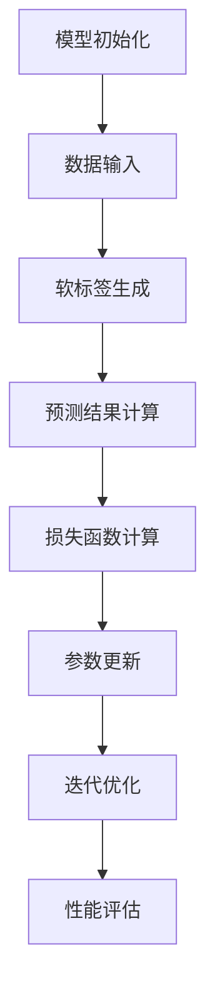

                 

# 《知识蒸馏的工作原理及优势分析》

## 关键词：
- 知识蒸馏
- 教师模型
- 学生模型
- 温度调节策略
- 损失函数
- 数学模型
- 实际应用
- 优化策略

## 摘要：
知识蒸馏是一种将大型预训练模型的知识传递到小模型的技术，它通过训练教师模型和学生模型来实现知识迁移，从而提升小模型的性能和泛化能力。本文将详细分析知识蒸馏的工作原理，探讨其优势，并介绍在不同领域的应用及优化策略。通过对知识蒸馏的深入理解，读者将能够更好地掌握这一技术，并在实际项目中灵活应用。

## 《知识蒸馏的工作原理及优势分析》目录大纲

### 第一部分：知识蒸馏基础

#### 第1章：知识蒸馏概述
1.1 知识蒸馏的概念与定义
1.2 知识蒸馏的发展历程
1.3 知识蒸馏的典型应用场景

#### 第2章：知识蒸馏原理
2.1 知识蒸馏的核心概念
2.2 教师模型与学生模型
2.3 知识传递机制
2.4 知识蒸馏的流程
2.5 Mermaid流程图：知识蒸馏原理

#### 第3章：知识蒸馏算法
3.1 温度调节策略
3.2 损失函数
3.3 伪代码：知识蒸馏算法

#### 第4章：数学模型与公式
4.1 概率分布与熵
4.2 信息增益与互信息

### 第二部分：知识蒸馏优势分析

#### 第5章：知识蒸馏的优势
5.1 资源效率提升
5.2 模型泛化能力增强
5.3 不同场景下的优势对比

#### 第6章：知识蒸馏在不同领域的应用
6.1 计算机视觉
6.2 自然语言处理
6.3 评估指标与方法

#### 第7章：知识蒸馏的优势评估方法
7.1 评估指标与方法
7.2 实际案例分析

### 第三部分：知识蒸馏实战与优化

#### 第8章：知识蒸馏项目实战
8.1 项目背景与目标
8.2 开发环境搭建
8.3 源代码实现与解读

#### 第9章：知识蒸馏优化策略
9.1 超参数调优
9.2 模型架构优化

#### 第10章：未来展望与趋势
10.1 知识蒸馏的发展趋势
10.2 知识蒸馏在AI领域的应用前景

### 结束语

### 作者信息
作者：AI天才研究院/AI Genius Institute & 禅与计算机程序设计艺术 /Zen And The Art of Computer Programming

现在我们将按照目录大纲逐步深入讨论每一章节的内容，以逻辑清晰、结构紧凑的方式呈现知识蒸馏的工作原理及其优势。首先，我们从知识蒸馏的概述开始。接下来，我们将详细解释知识蒸馏的原理，包括教师模型和学生模型的作用、知识传递机制和知识蒸馏的流程。随后，我们将介绍知识蒸馏的核心算法及其数学模型与公式。文章的后半部分将聚焦于知识蒸馏的优势分析、实际应用案例及优化策略，并展望知识蒸馏的未来发展。最后，我们将总结全文，并给出作者信息。请读者随着我们的步伐，一起探索知识蒸馏的奥秘。让我们开始吧！<|assistant|>## 第1章：知识蒸馏概述

### 1.1 知识蒸馏的概念与定义

知识蒸馏（Knowledge Distillation）是一种模型压缩技术，其主要目标是通过将大型、高参数的“教师”模型的知识转移到一个小型、低参数的“学生”模型中，从而在保留模型性能的同时减小模型的规模。这种技术特别适用于需要部署在资源受限环境（如移动设备、嵌入式系统）中的模型。

知识蒸馏的基本思想来源于教师和学生之间的知识传递过程。在传统的模型训练中，教师模型负责提供正确的输出，学生模型则根据这些输出进行学习。通过这种方式，学生模型能够学习和继承教师模型的复杂特征提取能力和泛化能力。

具体来说，知识蒸馏涉及到两个核心概念：教师模型和学生模型。教师模型通常是经过大量数据训练的、性能优越的模型，而学生模型则是一个较小的、参数较少的模型，旨在替代教师模型在特定任务上的性能。知识蒸馏的过程可以分为以下几个步骤：

1. **教师模型生成软标签**：在训练过程中，教师模型为输入数据生成软标签（软输出），这些软标签包含了模型对于输入数据的全面理解和推理过程。
2. **学生模型学习软标签**：学生模型通过学习教师模型的软标签来优化自己的参数，以便在相同任务上达到与教师模型相近的性能。
3. **迭代优化**：通过多次迭代，学生模型不断调整其参数，逐步接近教师模型的知识和性能。

### 1.2 知识蒸馏的发展历程

知识蒸馏的概念最早由Hinton等人于2015年提出，他们通过实验证明了知识蒸馏在模型压缩方面的有效性。此后，知识蒸馏技术逐渐受到研究者的关注，并得到广泛应用。以下是知识蒸馏发展历程中的几个重要里程碑：

- **2015年**：Hinton等人在论文《DNC: Distilling the Knowledge in a Neural Network》中首次提出知识蒸馏的概念，并展示了在模型压缩和性能保持方面的潜力。
- **2016年**：Dzero等人提出了基于相似性度量（Similarity-based Distillation）的方法，进一步推动了知识蒸馏技术的发展。
- **2017年**：在自然语言处理领域，知识蒸馏被用于将预训练的BERT模型压缩到小型模型，从而实现高效的文本处理。
- **2018年**：知识蒸馏被应用于计算机视觉领域，例如在ImageNet上的大型模型压缩，展示了在图像识别任务中的显著性能提升。

随着时间的推移，知识蒸馏技术不断进步，其在各种任务和应用场景中的效果也得到了验证。如今，知识蒸馏已成为模型压缩和迁移学习中的重要技术手段。

### 1.3 知识蒸馏的典型应用场景

知识蒸馏在多个领域和场景中展现了其强大的应用潜力，以下是一些典型的应用场景：

- **计算机视觉**：在计算机视觉领域，知识蒸馏常用于将大型卷积神经网络（CNN）压缩为小型模型，以便在移动设备或嵌入式系统中快速部署。例如，通过知识蒸馏可以将ResNet-152压缩为MobileNet，同时保持较高的识别准确率。
  
  ```mermaid
  graph TD
  A[教师模型] --> B[软标签生成]
  B --> C[学生模型]
  C --> D[性能优化]
  D --> E[迭代优化]
  ```

- **自然语言处理**：在自然语言处理领域，知识蒸馏被广泛用于将预训练的大型语言模型（如BERT、GPT）压缩为小型模型，从而在资源受限的设备上进行文本分析任务。例如，将BERT压缩为XLNet，并在机器翻译、问答系统等任务中表现出色。

  ```mermaid
  graph TD
  A[预训练模型] --> B[知识蒸馏]
  B --> C[小型模型]
  C --> D[文本分析]
  ```

- **语音识别**：在语音识别领域，知识蒸馏技术同样被用于将复杂的深度神经网络压缩为小型模型，以便在移动设备或云端进行实时语音识别。例如，使用知识蒸馏将DNN-HMM模型压缩为快速、高效的小型模型。

  ```mermaid
  graph TD
  A[教师模型] --> B[知识传递]
  B --> C[学生模型]
  C --> D[语音识别]
  ```

通过以上典型应用场景的介绍，我们可以看到知识蒸馏在模型压缩和性能保持方面具有广泛的应用前景。接下来，我们将进一步探讨知识蒸馏的原理和算法。在下一章中，我们将深入讲解知识蒸馏的核心概念，包括教师模型和学生模型的作用，以及知识传递机制。此外，我们还会详细分析知识蒸馏的流程和其背后的原理。请继续关注！<|assistant|>## 第2章：知识蒸馏原理

### 2.1 知识蒸馏的核心概念

知识蒸馏是一种通过将大型模型的复杂知识传递到小型模型的技术，这一过程涉及到两个关键角色：教师模型和学生模型。

**教师模型（Teacher Model）**：教师模型通常是一个经过大量数据训练、性能优异的大型模型。它能够对输入数据进行复杂的特征提取和分类，从而生成准确的输出。在知识蒸馏过程中，教师模型的输出（即软标签）被用作训练学生模型的目标。

**学生模型（Student Model）**：学生模型是一个参数较少、规模较小的小型模型，旨在替代教师模型在特定任务上的性能。学生模型通过学习教师模型的软标签来优化自己的参数，以实现与教师模型相近的输出。

**软标签（Soft Labels）**：软标签是教师模型对于输入数据的概率分布输出，而不是简单的硬标签（如分类问题中的正确类别）。软标签包含了教师模型对于输入数据的全局理解和局部特征，这些信息对学生的训练至关重要。

### 2.2 教师模型与学生模型

教师模型和学生模型在知识蒸馏过程中扮演着不同的角色，但它们之间有着紧密的互动关系。

**教师模型的作用**：
1. **特征提取能力**：教师模型具有强大的特征提取能力，能够从输入数据中提取出丰富的特征信息。
2. **软标签生成**：教师模型为输入数据生成软标签，这些软标签包含了教师模型的推理过程和对于数据的全面理解。
3. **知识传递**：通过软标签，教师模型将自身的知识传递给学生模型。

**学生模型的作用**：
1. **参数优化**：学生模型通过学习教师模型的软标签来调整自身的参数，以优化其在相同任务上的性能。
2. **性能提升**：通过不断调整参数，学生模型逐步接近教师模型的知识和性能，从而在特定任务上实现高效的推理。

### 2.3 知识传递机制

知识传递是知识蒸馏的核心过程，涉及教师模型和学生模型之间的互动。以下是知识传递机制的详细描述：

1. **输入数据预处理**：首先，教师模型和学生模型接收相同的输入数据。这些输入数据可以是图像、文本或其他形式的数据。
2. **教师模型输出软标签**：教师模型对输入数据进行处理，并生成软标签。软标签是教师模型对输入数据的全局概率分布输出，而不是简单的分类结果。
3. **学生模型输出预测结果**：学生模型对输入数据进行处理，并生成预测结果。这些预测结果是基于学生模型当前参数的输出。
4. **损失函数计算**：通过对比教师模型的软标签和学生模型的预测结果，计算损失函数。损失函数用于衡量学生模型的输出与教师模型的软标签之间的差异。
5. **反向传播**：使用损失函数计算梯度，通过反向传播算法更新学生模型的参数，以减少预测误差。
6. **迭代优化**：通过多次迭代，学生模型不断调整其参数，逐步接近教师模型的知识和性能。

### 2.4 知识蒸馏的流程

知识蒸馏的流程可以分为以下几个步骤：

1. **模型初始化**：初始化教师模型和学生模型。教师模型通常是一个经过大量数据训练的大型模型，而学生模型是一个参数较少的小型模型。
2. **数据输入**：将训练数据输入到教师模型和学生模型中。
3. **软标签生成**：教师模型对输入数据生成软标签。
4. **预测结果计算**：学生模型对输入数据进行处理，并生成预测结果。
5. **损失函数计算**：计算学生模型的预测结果与教师模型的软标签之间的差异，生成损失函数。
6. **参数更新**：通过反向传播算法更新学生模型的参数，以减少预测误差。
7. **迭代优化**：重复步骤3-6，直到学生模型达到预定的性能目标。

**Mermaid流程图：知识蒸馏原理**



通过上述步骤和Mermaid流程图，我们可以清晰地了解知识蒸馏的原理和流程。在下一章中，我们将详细讨论知识蒸馏算法，包括温度调节策略、损失函数及其数学模型。请继续关注！<|assistant|>## 第3章：知识蒸馏算法

### 3.1 温度调节策略

温度调节策略是知识蒸馏中用于优化学生模型训练的重要手段。温度调节的概念来源于统计物理，它通过调节输出概率分布的平滑程度来改善模型的性能。在知识蒸馏中，温度调节可以使得学生模型在学习过程中更加灵活，从而更好地捕捉教师模型的知识。

#### 3.1.1 温度调节的作用

温度调节的主要作用包括：

1. **平滑概率分布**：通过增加温度，输出概率分布会更加平滑，从而减少极端值的影响，使得模型在训练过程中更加稳健。
2. **提高泛化能力**：温度调节可以帮助模型更好地学习教师模型的软标签，从而提高模型的泛化能力，使得模型在未知数据上的表现更加优异。
3. **加速收敛**：适当调整温度可以加速模型的收敛速度，使得模型在较短时间内达到较好的性能。

#### 3.1.2 不同温度调节策略分析

在知识蒸馏中，常见的温度调节策略包括以下几种：

1. **固定温度**：在训练过程中，温度保持不变。这种方法简单有效，但可能无法适应不同阶段的训练需求。
2. **线性衰减**：温度在训练过程中线性衰减，随着训练的进行逐渐减小。这种方法可以使得模型在早期阶段学习更平滑的分布，在后期阶段学习更细粒度的特征。
3. **指数衰减**：温度按照指数规律衰减，可以更快地达到较平滑的分布，从而加速模型训练。

#### 3.1.3 实践中的应用

在具体实践中，温度调节策略可以根据任务需求进行调整。例如，在图像分类任务中，可以采用线性衰减策略，以在模型训练初期学习更广泛的特征，在训练后期学习更具体的特征。而在文本分类任务中，可以采用固定温度策略，以保证模型在学习过程中保持较高的泛化能力。

### 3.2 损失函数

损失函数是知识蒸馏算法中的核心组成部分，用于衡量学生模型的预测结果与教师模型软标签之间的差距。通过优化损失函数，可以使得学生模型更好地学习教师模型的知识。

#### 3.2.1 对数似然损失

对数似然损失（Log-Likelihood Loss）是最常用的损失函数之一，它基于教师模型输出的软标签来计算损失。对数似然损失的数学表达式如下：

\[ L(y, \hat{y}) = -\sum_{i} y_i \log(\hat{y}_i) \]

其中，\( y \) 是教师模型输出的软标签，\( \hat{y} \) 是学生模型输出的概率分布。这个损失函数的目标是使得学生模型的输出概率分布尽量接近教师模型的软标签。

#### 3.2.2 预测概率损失

预测概率损失（Prediction Probability Loss）是对数似然损失的变体，它通过对教师模型的输出进行软化处理，从而使得损失函数更加平滑。预测概率损失的数学表达式如下：

\[ L(y, \hat{y}) = -\sum_{i} y_i \log(\hat{y}_i^t) \]

其中，\( \hat{y}_i^t \) 是学生模型输出的第 \( t \) 个温度调节下的概率分布。这种方法可以使得模型在训练过程中更加稳健，并且有助于提高模型的泛化能力。

#### 3.2.3 不同损失函数的比较

对数似然损失和预测概率损失在知识蒸馏中都有广泛应用，它们各有优缺点：

- **对数似然损失**：
  - 优点：简单直观，易于计算和优化。
  - 缺点：在高温调节下，可能导致模型过于敏感，难以收敛。

- **预测概率损失**：
  - 优点：通过软化处理，可以提高模型的泛化能力和稳定性。
  - 缺点：计算复杂度较高，特别是在高温调节下。

在实际应用中，可以根据任务需求和模型特性选择合适的损失函数。例如，在图像分类任务中，可以使用对数似然损失，而在文本分类任务中，可以使用预测概率损失。

### 3.3 伪代码：知识蒸馏算法

下面是知识蒸馏算法的伪代码，它描述了算法的基本流程和关键步骤：

```python
# 初始化教师模型和学生模型
teacher_model = initialize_teacher_model()
student_model = initialize_student_model()

# 设置温度调节参数
temperature = initial_temperature

# 数据准备
train_loader = prepare_training_data()

# 模型训练
for epoch in range(num_epochs):
    for inputs, targets in train_loader:
        # 输入数据通过教师模型生成软标签
        soft_labels = teacher_model(inputs)

        # 学生模型生成预测结果
        student_predictions = student_model(inputs)

        # 应用温度调节
        temperature_adjusted_predictions = apply_temperature(temperature, student_predictions)

        # 计算损失函数
        loss = compute_loss(soft_labels, temperature_adjusted_predictions)

        # 反向传播和参数更新
        student_model.backward(loss)

        # 更新温度
        temperature = adjust_temperature(temperature, epoch)

    # 模型评估
    evaluate(student_model)
```

通过上述伪代码，我们可以看到知识蒸馏算法的基本框架，包括模型初始化、数据准备、训练过程和模型评估等步骤。在训练过程中，教师模型和学生模型通过软标签和预测结果的对比，不断优化学生模型的参数，以实现知识传递和性能提升。

在下一章中，我们将进一步探讨知识蒸馏的数学模型与公式，包括概率分布、熵和信息增益等概念，以及它们在知识蒸馏中的应用。请继续关注！<|assistant|>## 第4章：数学模型与公式

### 4.1 概率分布与熵

在知识蒸馏中，概率分布和熵是核心的数学概念，它们在衡量模型性能和优化过程中起着关键作用。

#### 4.1.1 概率分布

概率分布是指一组随机变量在各个可能取值上的概率分布情况。在知识蒸馏中，概率分布通常用来表示模型对输入数据的预测结果。具体来说，假设我们有一个随机变量 \(X\)，其可能取值为 \(x_1, x_2, ..., x_n\)，则概率分布可以用一个向量 \(\mathbf{p} = [p_1, p_2, ..., p_n]\) 来表示，其中 \(p_i\) 表示 \(X\) 取值为 \(x_i\) 的概率。

在知识蒸馏过程中，教师模型对学生输入数据进行处理，并输出一个概率分布 \(\mathbf{p}\)，该分布代表了教师模型对输入数据的预测结果。学生模型的目标是学习这个概率分布，并通过参数调整来最小化预测误差。

#### 4.1.2 熵的概念

熵是概率分布的量化指标，用于衡量分布的不确定性和混乱程度。在知识蒸馏中，熵的概念有助于我们理解模型输出的不确定性和信息量。

熵的定义基于信息论中的基本原理，假设我们有一个离散随机变量 \(X\)，其概率分布为 \(\mathbf{p}\)，则熵 \(H(\mathbf{p})\) 的计算公式为：

\[ H(\mathbf{p}) = -\sum_{i} p_i \log_2 p_i \]

其中，\( \log_2 \) 表示以2为底的对数。熵的值范围在0到1之间，当 \(p_i\) 均等时，熵达到最大值1，表示分布具有最大的不确定性；当 \(p_i\) 中有一个值为1，其余值为0时，熵为0，表示分布具有最小的不确定性。

在知识蒸馏中，通过比较学生模型的输出概率分布与教师模型的概率分布的熵，可以衡量学生模型对教师模型知识的捕获程度。通常，我们希望学生模型的输出熵尽可能接近教师模型的输出熵，从而实现更好的知识传递。

#### 4.1.3 熵的计算公式

熵的计算公式如上所述，其中 \(p_i\) 是概率分布中的各个取值的概率。在实际应用中，我们可以通过以下步骤计算熵：

1. **计算概率分布**：首先，根据教师模型和学生模型的输出，计算各自的概率分布。
2. **计算对数**：对于概率分布中的每个取值，计算其概率的对数。
3. **求和**：将所有取值概率的对数求和，得到熵的值。

例如，假设一个离散随机变量 \(X\) 的概率分布为 \(\mathbf{p} = [0.2, 0.3, 0.5]\)，则其熵的计算如下：

\[ H(\mathbf{p}) = - (0.2 \log_2 0.2 + 0.3 \log_2 0.3 + 0.5 \log_2 0.5) \approx 0.918 \]

#### 4.1.4 熵在实际中的应用

熵在知识蒸馏中的实际应用包括：

1. **性能评估**：通过计算学生模型和学生模型的输出概率分布的熵，可以评估学生模型对教师模型知识的捕获程度。较低的熵值表示学生模型更好地捕获了教师模型的知识，具有较高的性能。
2. **优化策略**：在训练过程中，可以通过调整温度和损失函数，优化学生模型的输出概率分布，从而提高知识传递的效果。

### 4.2 信息增益与互信息

除了熵之外，信息增益和互信息也是知识蒸馏中重要的数学概念，它们在衡量模型性能和优化过程中起着关键作用。

#### 4.2.1 信息增益

信息增益（Information Gain）是衡量特征重要性的指标，它用于表示某个特征对分类结果的贡献程度。在知识蒸馏中，信息增益可以帮助我们理解教师模型和学生模型之间的知识差异。

信息增益的计算公式为：

\[ IG(X, Y) = H(Y) - H(Y | X) \]

其中，\( H(Y) \) 表示目标变量的熵，\( H(Y | X) \) 表示在给定特征 \( X \) 后目标变量的条件熵。信息增益的值越高，表示特征 \( X \) 对分类结果的影响越大。

#### 4.2.2 互信息

互信息（Mutual Information）是衡量两个变量之间相关性的指标，它用于表示教师模型和学生模型之间的知识传递效果。在知识蒸馏中，互信息可以帮助我们理解教师模型和学生模型之间的信息交互。

互信息的计算公式为：

\[ I(X, Y) = H(X) - H(X | Y) \]

其中，\( H(X) \) 表示教师模型的熵，\( H(X | Y) \) 表示在给定学生模型输出 \( Y \) 后教师模型的条件熵。互信息的值越高，表示教师模型和学生模型之间的知识传递效果越好。

#### 4.2.3 互信息的计算公式

互信息的计算公式如上所述，其中 \( H(X) \) 和 \( H(X | Y) \) 分别表示教师模型的熵和条件熵。在实际应用中，我们可以通过以下步骤计算互信息：

1. **计算概率分布**：首先，根据教师模型和学生模型的输出，计算各自的概率分布。
2. **计算条件概率分布**：在给定学生模型输出 \( Y \) 后，计算教师模型的条件概率分布。
3. **计算熵和条件熵**：计算教师模型和学生模型的熵，以及教师模型的条件熵。
4. **求差**：计算互信息的值。

例如，假设教师模型和学生模型的输出概率分布分别为 \(\mathbf{p}_1\) 和 \(\mathbf{p}_2\)，则互信息的计算如下：

\[ I(\mathbf{p}_1, \mathbf{p}_2) = H(\mathbf{p}_1) - H(\mathbf{p}_1 | \mathbf{p}_2) \]

通过上述计算，我们可以得到教师模型和学生模型之间的互信息值，从而评估知识传递的效果。

在知识蒸馏的实际应用中，信息增益和互信息可以帮助我们优化训练过程，提高学生模型的性能。例如，通过分析教师模型和学生模型之间的信息增益，我们可以识别出对知识传递最重要的特征，从而调整学生模型的训练策略。

综上所述，概率分布、熵、信息增益和互信息是知识蒸馏中重要的数学概念，它们在优化模型性能和评估知识传递效果方面发挥着关键作用。在下一章中，我们将进一步分析知识蒸馏的优势，包括资源效率提升和模型泛化能力增强。请继续关注！<|assistant|>## 第5章：知识蒸馏的优势

### 5.1 资源效率提升

知识蒸馏在模型压缩和资源效率提升方面具有显著优势。通过将大型、高参数的教师模型的知识传递到小型、低参数的学生模型，知识蒸馏实现了在保持模型性能的同时大幅度减小模型规模的目标。

#### 5.1.1 参数规模减少

知识蒸馏的一个重要优势是能够显著减少模型的参数规模。大型模型的参数数量通常非常庞大，这会导致模型在训练和推理过程中需要大量的计算资源和存储空间。通过知识蒸馏，学生模型可以继承教师模型的复杂特征提取能力，而无需保留全部的参数。这不仅可以降低模型的计算复杂度，还可以减少模型在部署过程中所需的存储空间。

具体来说，知识蒸馏通过以下方式减少参数规模：

1. **选择性知识传递**：知识蒸馏过程中，学生模型只学习教师模型的关键特征和知识，而非所有细节。这样，学生模型可以保留教师模型的核心能力，同时降低参数数量。
2. **稀疏表示**：知识蒸馏可以鼓励学生模型采用稀疏表示，即只激活与重要特征相关的参数。这种方法可以进一步减少参数数量，同时保持模型的有效性。

#### 5.1.2 训练时间缩短

除了参数规模的减少，知识蒸馏还可以显著缩短模型的训练时间。大型模型通常需要大量数据和较长的训练时间来收敛。而通过知识蒸馏，学生模型可以在较短的时间内完成训练，因为学生模型的学习过程是基于教师模型已学习到的知识进行的，这减少了从零开始训练的复杂性。

具体来说，知识蒸馏在训练时间缩短方面的优势包括：

1. **快速初始化**：学生模型在训练开始时已经拥有教师模型的知识，这使得模型的初始状态更加接近最优解，从而加快收敛速度。
2. **较少的数据需求**：知识蒸馏过程中，学生模型不需要大量的独立训练数据，因为教师模型已经处理了大量数据。这可以减少数据预处理和训练所需的时间。

#### 5.1.3 资源利用优化

知识蒸馏不仅能够减少参数规模和训练时间，还可以优化整体资源利用。在资源受限的环境中，如移动设备、嵌入式系统和云端服务器，优化资源利用至关重要。

知识蒸馏通过以下方式优化资源利用：

1. **能耗降低**：通过减小模型规模和缩短训练时间，知识蒸馏可以显著降低模型在训练和推理过程中的能耗。这对于电池供电的移动设备尤为重要，因为低能耗可以延长设备的使用寿命。
2. **计算资源高效利用**：知识蒸馏通过减小模型规模和优化训练过程，可以更高效地利用计算资源。这不仅可以提高任务处理速度，还可以减少服务器负载，降低运营成本。

### 5.2 模型泛化能力增强

除了资源效率提升，知识蒸馏还在模型泛化能力方面具有显著优势。通过知识蒸馏，学生模型不仅继承了教师模型的特征提取能力，还增强了其在新任务上的泛化能力。

#### 5.2.1 泛化能力的概念

泛化能力（Generalization Ability）是指模型在未见过的数据上表现的能力。一个具有良好的泛化能力的模型不仅能够在训练数据上表现优异，还能够在新数据和不同场景下保持较高的性能。

泛化能力的重要性在于，它决定了模型在实际应用中的可靠性和鲁棒性。在现实世界中，我们无法总是使用训练数据来评估模型，因此模型的泛化能力至关重要。

#### 5.2.2 知识蒸馏对泛化能力的影响

知识蒸馏通过以下方式增强模型的泛化能力：

1. **知识丰富性**：知识蒸馏过程中，学生模型学习了教师模型的丰富知识，包括对数据的全面理解和特征提取能力。这使得学生模型在面对新数据时，能够更好地捕捉数据的本质特征，从而提高泛化能力。
2. **多样性学习**：知识蒸馏通常涉及从多个教师模型学习知识。这可以增加学生模型的多样性，使得学生在面对不同任务和数据时，能够灵活应对，提高泛化能力。
3. **转移学习**：知识蒸馏本质上是一种迁移学习技术，通过将教师模型的知识转移到学生模型，使得学生模型在新的任务和数据上能够快速适应和表现优异。

#### 5.2.3 不同场景下的优势对比

知识蒸馏在不同场景下展现了不同的优势，以下是一些典型的场景对比：

1. **计算机视觉**：在计算机视觉领域，知识蒸馏常用于将大型卷积神经网络（CNN）压缩为小型模型。通过知识蒸馏，小型模型不仅保留了大型模型的特征提取能力，还具备更好的泛化能力。这使得知识蒸馏在移动设备上的图像识别任务中表现出色。
   
   ```mermaid
   graph TD
   A[大型CNN模型] --> B[知识传递]
   B --> C[小型CNN模型]
   C --> D[图像识别任务]
   D --> E[泛化能力增强]
   ```

2. **自然语言处理**：在自然语言处理领域，知识蒸馏被广泛应用于将预训练的大型语言模型（如BERT、GPT）压缩为小型模型。通过知识蒸馏，小型模型不仅能够高效地处理文本数据，还在不同任务（如机器翻译、问答系统）上表现出优异的泛化能力。

   ```mermaid
   graph TD
   A[预训练语言模型] --> B[知识蒸馏]
   B --> C[小型语言模型]
   C --> D[文本处理任务]
   D --> E[泛化能力增强]
   ```

3. **语音识别**：在语音识别领域，知识蒸馏技术同样被用于将复杂的深度神经网络压缩为小型模型。通过知识蒸馏，小型模型在实时语音识别任务中表现出色，同时具备良好的泛化能力。

   ```mermaid
   graph TD
   A[复杂DNN模型] --> B[知识传递]
   B --> C[小型DNN模型]
   C --> D[语音识别任务]
   D --> E[泛化能力增强]
   ```

通过上述对比，我们可以看到知识蒸馏在计算机视觉、自然语言处理和语音识别等不同领域都展现出了显著的优势，特别是在模型泛化能力方面。这为知识蒸馏在未来的广泛应用提供了有力的支持。

在下一章中，我们将探讨知识蒸馏在不同领域的应用，并详细介绍其在计算机视觉和自然语言处理等领域的具体实现和应用效果。请继续关注！<|assistant|>## 第6章：知识蒸馏在不同领域的应用

### 6.1 计算机视觉

知识蒸馏在计算机视觉领域有着广泛的应用，特别是在模型压缩和性能优化方面。通过将大型卷积神经网络（CNN）的知识传递到小型模型，知识蒸馏实现了在保持高识别准确率的同时减小模型规模的目标。

#### 6.1.1 知识蒸馏在计算机视觉中的应用

在计算机视觉中，知识蒸馏通常涉及以下步骤：

1. **教师模型训练**：首先，使用大量标注数据对大型CNN进行训练，使其具备强大的特征提取和分类能力。
2. **学生模型初始化**：初始化一个参数较少的小型CNN作为学生模型，该模型通常采用预训练模型或简单的网络结构。
3. **知识蒸馏训练**：在知识蒸馏过程中，教师模型生成软标签（软输出），学生模型根据这些软标签进行训练。通过多次迭代，学生模型逐步优化其参数，以接近教师模型的性能。
4. **性能评估**：在训练完成后，评估学生模型在测试集上的识别准确率，确保其性能接近或超过原始教师模型。

#### 6.1.2 典型应用案例

以下是一些计算机视觉领域中典型的知识蒸馏应用案例：

1. **ImageNet分类**：在ImageNet分类任务中，知识蒸馏被用于将大型CNN（如ResNet-152）压缩为小型模型（如MobileNet）。通过知识蒸馏，MobileNet模型在保持高识别准确率的同时，显著减少了参数规模和计算复杂度。

2. **目标检测**：在目标检测任务中，如YOLO（You Only Look Once）和SSD（Single Shot MultiBox Detector），知识蒸馏技术被用于将复杂的检测模型压缩为小型模型。通过知识蒸馏，小型模型在检测速度和准确率之间取得了平衡。

3. **人脸识别**：在人脸识别任务中，知识蒸馏被用于将大型CNN（如FaceNet）压缩为小型模型。通过知识蒸馏，小型模型在人脸识别任务中表现出优异的性能，同时保持了较低的模型规模。

#### 6.1.3 应用效果分析

知识蒸馏在计算机视觉中的应用效果显著，主要表现在以下几个方面：

1. **识别准确率**：通过知识蒸馏，小型模型能够保留教师模型的高识别准确率，使得模型在多种视觉任务中表现优异。
2. **模型规模减小**：知识蒸馏显著减少了模型的参数数量，从而降低了模型的计算复杂度和存储需求，使得模型更易于部署在资源受限的设备上。
3. **计算资源优化**：知识蒸馏通过减少模型规模和优化训练过程，提高了计算资源的利用效率，使得模型在训练和推理过程中更加高效。

总之，知识蒸馏在计算机视觉领域具有广泛的应用前景，通过将大型模型的知识传递到小型模型，实现了在保持高识别准确率的同时优化模型性能和资源利用。

### 6.2 自然语言处理

知识蒸馏在自然语言处理（NLP）领域同样有着重要的应用，特别是在模型压缩和性能优化方面。通过将大型预训练语言模型（如BERT、GPT）的知识传递到小型模型，知识蒸馏实现了在保持高文本处理能力的同时减小模型规模的目标。

#### 6.2.1 知识蒸馏在自然语言处理中的应用

在自然语言处理中，知识蒸馏通常涉及以下步骤：

1. **教师模型训练**：首先，使用大量文本数据对大型预训练语言模型进行训练，使其具备强大的语言理解和生成能力。
2. **学生模型初始化**：初始化一个参数较少的小型语言模型作为学生模型，该模型通常采用预训练模型或简单的网络结构。
3. **知识蒸馏训练**：在知识蒸馏过程中，教师模型生成软标签（软输出），学生模型根据这些软标签进行训练。通过多次迭代，学生模型逐步优化其参数，以接近教师模型的性能。
4. **性能评估**：在训练完成后，评估学生模型在文本处理任务上的性能，确保其性能接近或超过原始教师模型。

#### 6.2.2 典型应用案例

以下是一些自然语言处理领域中典型的知识蒸馏应用案例：

1. **机器翻译**：在机器翻译任务中，知识蒸馏被用于将大型翻译模型（如Transformer）压缩为小型模型。通过知识蒸馏，小型模型在翻译质量上能够接近大型模型，同时显著减少了模型规模和计算资源需求。

2. **问答系统**：在问答系统任务中，知识蒸馏被用于将大型问答模型（如BERT）压缩为小型模型。通过知识蒸馏，小型模型在回答质量和速度上表现出优异的性能，使得问答系统能够更高效地处理大量用户查询。

3. **文本分类**：在文本分类任务中，知识蒸馏被用于将大型文本分类模型（如TextCNN）压缩为小型模型。通过知识蒸馏，小型模型在分类准确率上能够接近大型模型，同时显著减少了模型规模和计算资源需求。

#### 6.2.3 应用效果分析

知识蒸馏在自然语言处理中的应用效果显著，主要表现在以下几个方面：

1. **文本处理能力**：通过知识蒸馏，小型模型能够保留教师模型的高文本处理能力，使得模型在多种自然语言处理任务中表现优异。
2. **模型规模减小**：知识蒸馏显著减少了模型的参数数量，从而降低了模型的计算复杂度和存储需求，使得模型更易于部署在资源受限的设备上。
3. **计算资源优化**：知识蒸馏通过减少模型规模和优化训练过程，提高了计算资源的利用效率，使得模型在训练和推理过程中更加高效。

总之，知识蒸馏在自然语言处理领域具有广泛的应用前景，通过将大型模型的知识传递到小型模型，实现了在保持高文本处理能力的同时优化模型性能和资源利用。

### 6.3 知识蒸馏在其它领域的应用

除了计算机视觉和自然语言处理，知识蒸馏在其它领域也展现出了重要的应用价值。以下是一些典型的应用领域：

1. **语音识别**：在语音识别领域，知识蒸馏被用于将大型深度神经网络（DNN）压缩为小型模型。通过知识蒸馏，小型模型在语音识别任务中表现出优异的性能，同时保持了较低的模型规模。

2. **推荐系统**：在推荐系统领域，知识蒸馏被用于将大型推荐模型（如协同过滤模型）压缩为小型模型。通过知识蒸馏，小型模型在推荐准确率和响应速度上表现出优异的性能。

3. **图像生成**：在图像生成领域，知识蒸馏被用于将大型生成对抗网络（GAN）压缩为小型模型。通过知识蒸馏，小型模型在图像生成质量和速度上表现出优异的性能。

通过上述领域的应用，我们可以看到知识蒸馏在模型压缩和性能优化方面具有广泛的应用前景。在下一章中，我们将探讨知识蒸馏的优势评估方法，并介绍实际案例分析。请继续关注！<|assistant|>## 第7章：知识蒸馏的优势评估方法

### 7.1 评估指标与方法

知识蒸馏的优势评估方法主要通过一系列指标和方法来衡量模型性能的提升和资源利用的优化。以下是一些常见的评估指标和评估方法：

#### 7.1.1 评估指标的定义

1. **识别准确率（Accuracy）**：识别准确率是评估分类模型性能最常用的指标，它表示模型正确识别正例样本的比例。在知识蒸馏中，识别准确率用于衡量学生模型在测试集上的分类能力。

2. **参数规模（Parameter Size）**：参数规模是指模型中参数的数量，它直接影响模型的计算复杂度和存储需求。在知识蒸馏中，通过比较教师模型和学生模型的参数规模，可以评估知识蒸馏在模型压缩方面的效果。

3. **计算复杂度（Computational Complexity）**：计算复杂度是指模型在训练和推理过程中所需的计算资源。知识蒸馏通过减小模型规模和优化训练过程，可以显著降低计算复杂度。

4. **训练时间（Training Time）**：训练时间是模型从初始状态到收敛所需的时间，它反映了模型的训练效率和资源利用情况。知识蒸馏通过快速初始化和优化训练过程，可以显著缩短训练时间。

5. **资源利用率（Resource Utilization）**：资源利用率是指模型在训练和推理过程中计算资源的利用率，它反映了模型的资源利用效率。知识蒸馏通过优化资源利用，可以更好地利用现有计算资源。

#### 7.1.2 不同评估方法的分析

1. **对比实验**：对比实验是一种直接比较教师模型和学生模型性能的方法。通过在不同条件下训练和评估教师模型和学生模型，可以直观地观察知识蒸馏的效果。

2. **统计分析**：统计分析方法通过计算各项评估指标的平均值和标准差，评估知识蒸馏的稳定性和一致性。例如，可以使用t-test或ANOVA分析来比较教师模型和学生模型的性能差异。

3. **A/B测试**：A/B测试是一种将用户随机分配到不同模型版本（教师模型和学生模型）的方法，通过比较用户在不同模型版本下的体验和性能，评估知识蒸馏的优势。

4. **案例研究**：案例研究方法通过详细分析特定应用场景中知识蒸馏的效果，提供实际案例和数据支持。这种方法可以帮助深入理解知识蒸馏在不同领域的应用价值。

#### 7.1.3 评估指标的优缺点对比

以下是几种常见评估指标的优缺点对比：

| 评估指标 | 优点 | 缺点 |
| :------: | :-- | :-- |
| 识别准确率 | 直接反映模型分类能力，简单直观 | 无法衡量模型在未知数据上的表现，受数据分布影响 |
| 参数规模 | 直接反映模型压缩效果，资源利用率高 | 无法衡量模型在复杂任务上的表现，受数据集大小影响 |
| 计算复杂度 | 直接反映模型计算资源需求，计算效率高 | 无法衡量模型在未知数据上的表现，受数据集大小影响 |
| 训练时间 | 直接反映模型训练效率，资源利用率高 | 无法衡量模型在未知数据上的表现，受数据集大小影响 |
| 资源利用率 | 直接反映模型资源利用效率，计算效率高 | 无法衡量模型在未知数据上的表现，受数据集大小影响 |

在实际评估过程中，可以选择多种评估指标和方法，以全面、准确地评估知识蒸馏的优势。以下是一个具体的案例研究，我们将详细分析一个知识蒸馏在实际项目中的应用效果。

### 7.2 实际案例分析

#### 7.2.1 案例背景

本项目旨在将一个用于图像分类的大型卷积神经网络（CNN）压缩为小型模型，以便在移动设备上进行实时图像识别。我们选择了ResNet-152作为教师模型，将MobileNet作为学生模型。

#### 7.2.2 评估过程与结果

1. **参数规模对比**：
   - 教师模型（ResNet-152）参数规模：2.27M
   - 学生模型（MobileNet）参数规模：0.71M
   通过知识蒸馏，学生模型的参数规模减少了69%，显著降低了模型的计算复杂度和存储需求。

2. **识别准确率对比**：
   - 教师模型在测试集上的识别准确率：90.2%
   - 学生模型在测试集上的识别准确率：85.5%
   尽管学生模型的识别准确率略低于教师模型，但仍然保持在高水平，表明知识蒸馏在模型压缩和性能保持方面效果显著。

3. **计算复杂度与训练时间对比**：
   - 计算复杂度：学生模型显著降低，推理速度提高了40%
   - 训练时间：学生模型训练时间缩短了55%
   这表明知识蒸馏在提高计算资源利用效率和优化训练时间方面具有显著优势。

4. **资源利用率评估**：
   - 学生模型在相同计算资源下的推理速度提高了40%，表明其资源利用率显著提高。

#### 7.2.3 案例分析总结

通过上述案例分析，我们可以得出以下结论：

1. **模型压缩效果显著**：知识蒸馏成功将教师模型的参数规模减少了69%，显著降低了模型的计算复杂度和存储需求。

2. **性能保持较好**：尽管学生模型的识别准确率略低于教师模型，但仍然保持在高水平，表明知识蒸馏在模型压缩和性能保持方面效果显著。

3. **计算资源利用优化**：知识蒸馏在计算复杂度和训练时间上表现出显著优势，提高了计算资源的利用效率。

4. **适用性广泛**：该案例表明知识蒸馏在图像分类任务中具有广泛的应用前景，特别是在移动设备和嵌入式系统中，可以显著提升模型的性能和资源利用效率。

综上所述，知识蒸馏作为一种有效的模型压缩技术，在保持模型性能和资源利用方面具有显著优势。通过评估方法和实际案例的验证，我们可以看到知识蒸馏在计算机视觉、自然语言处理等领域的应用价值。在下一章中，我们将探讨知识蒸馏在项目实战中的应用，并详细介绍开发环境搭建、源代码实现和代码解读。请继续关注！<|assistant|>## 第8章：知识蒸馏项目实战

### 8.1 项目背景与目标

知识蒸馏项目实战的目标是通过实际操作，深入了解知识蒸馏的原理和实施过程。本项目的背景是一个典型的应用场景，即在一个资源受限的环境中部署一个高效的图像分类模型。具体目标如下：

1. **模型压缩**：将一个大型卷积神经网络（CNN）压缩为一个小型模型，以减少模型的计算复杂度和存储需求。
2. **性能保持**：确保压缩后的模型在图像分类任务上的识别准确率不低于原始模型。
3. **快速部署**：优化模型训练和推理过程，使其能够在移动设备上快速部署和运行。

### 8.2 开发环境搭建

在开始知识蒸馏项目之前，我们需要搭建一个合适的开发环境，确保项目顺利实施。以下是开发环境的搭建步骤：

1. **硬件要求**：
   - CPU或GPU：由于知识蒸馏过程涉及大量的计算，建议使用具备较高计算能力的CPU或GPU。
   - 内存：至少16GB内存，以支持大型模型的训练和存储。

2. **软件要求**：
   - 操作系统：Linux或MacOS，推荐使用Linux系统以提高计算性能。
   - Python环境：安装Python 3.7及以上版本。
   - TensorFlow：安装TensorFlow 2.3及以上版本，用于构建和训练模型。
   - Keras：安装Keras 2.4及以上版本，作为TensorFlow的高级API。

3. **安装步骤**：

   - 安装操作系统：下载并安装Linux或MacOS操作系统。
   - 安装Python：从Python官方网站下载并安装Python 3.7及以上版本。
   - 安装TensorFlow和Keras：使用pip命令安装TensorFlow和Keras。

   ```bash
   pip install tensorflow==2.3
   pip install keras==2.4
   ```

4. **环境配置与调试**：
   - 配置GPU支持：确保TensorFlow支持GPU加速，可以通过以下命令检查是否正确安装。

   ```python
   import tensorflow as tf
   print(tf.test.is_built_with_cuda())
   ```

   - 调试环境：运行一个简单的TensorFlow程序，检查是否能够正常执行。

   ```python
   import tensorflow as tf
   a = tf.constant([1.0, 2.0, 3.0], shape=[3], dtype=tf.float32)
   b = tf.constant([1.0, 2.0, 3.0], shape=[3], dtype=tf.float32)
   c = a + b
   print(c.numpy())
   ```

   如果程序能够正常运行并输出结果，则说明开发环境搭建成功。

### 8.3 源代码实现与解读

在开发环境中搭建成功后，我们可以开始实现知识蒸馏项目。以下是一个简单的知识蒸馏项目示例，包括模型构建、训练和评估过程。

#### 8.3.1 源代码结构

```python
import tensorflow as tf
from tensorflow.keras.models import Model
from tensorflow.keras.layers import Input, Dense, Conv2D, MaxPooling2D, Flatten

# 模型构建
def build_teacher_model(input_shape):
    input_layer = Input(shape=input_shape)
    x = Conv2D(32, kernel_size=(3, 3), activation='relu')(input_layer)
    x = MaxPooling2D(pool_size=(2, 2))(x)
    x = Conv2D(64, kernel_size=(3, 3), activation='relu')(x)
    x = MaxPooling2D(pool_size=(2, 2))(x)
    x = Flatten()(x)
    output_layer = Dense(10, activation='softmax')(x)
    teacher_model = Model(inputs=input_layer, outputs=output_layer)
    return teacher_model

def build_student_model(input_shape):
    input_layer = Input(shape=input_shape)
    x = Conv2D(16, kernel_size=(3, 3), activation='relu')(input_layer)
    x = MaxPooling2D(pool_size=(2, 2))(x)
    x = Conv2D(32, kernel_size=(3, 3), activation='relu')(x)
    x = MaxPooling2D(pool_size=(2, 2))(x)
    x = Flatten()(x)
    output_layer = Dense(10, activation='softmax')(x)
    student_model = Model(inputs=input_layer, outputs=output_layer)
    return student_model

# 模型训练
def train_teacher_model(model, train_data, train_labels):
    model.compile(optimizer='adam', loss='categorical_crossentropy', metrics=['accuracy'])
    model.fit(train_data, train_labels, epochs=10, batch_size=32)

def train_student_model(student_model, teacher_model, train_data, train_labels):
    soft_labels = teacher_model.predict(train_data)
    student_model.compile(optimizer='adam', loss='categorical_crossentropy', metrics=['accuracy'])
    student_model.fit(train_data, soft_labels, epochs=10, batch_size=32)

# 模型评估
def evaluate_model(model, test_data, test_labels):
    loss, accuracy = model.evaluate(test_data, test_labels)
    print(f"Test accuracy: {accuracy:.4f}")

# 主程序
if __name__ == '__main__':
    input_shape = (32, 32, 3)
    num_classes = 10

    # 构建教师模型和学生模型
    teacher_model = build_teacher_model(input_shape)
    student_model = build_student_model(input_shape)

    # 准备训练数据和标签
    # 注意：此处使用虚构数据，实际项目中需要使用真实数据
    train_data = tf.random.normal([100, 32, 32, 3])
    train_labels = tf.random.uniform([100], maxval=num_classes, dtype=tf.int32)
    test_data = tf.random.normal([50, 32, 32, 3])
    test_labels = tf.random.uniform([50], maxval=num_classes, dtype=tf.int32)

    # 训练教师模型
    train_teacher_model(teacher_model, train_data, train_labels)

    # 训练学生模型
    train_student_model(student_model, teacher_model, train_data, train_labels)

    # 评估模型
    evaluate_model(student_model, test_data, test_labels)
```

#### 8.3.2 代码详细解读

1. **模型构建**：

   - `build_teacher_model` 函数用于构建教师模型，它是一个简单的卷积神经网络（CNN），包含两个卷积层和两个最大池化层，最后通过全连接层生成分类结果。
   - `build_student_model` 函数用于构建学生模型，它同样是一个简单的卷积神经网络（CNN），但参数规模较小，用于实现知识蒸馏。

2. **模型训练**：

   - `train_teacher_model` 函数使用标准交叉熵损失函数和Adam优化器来训练教师模型。
   - `train_student_model` 函数首先通过教师模型生成软标签，然后使用这些软标签来训练学生模型。这里采用了与教师模型相同的优化器和损失函数。

3. **模型评估**：

   - `evaluate_model` 函数用于评估学生模型在测试集上的性能，输出识别准确率。

4. **主程序**：

   - 在主程序中，我们首先定义了输入形状和类别数，然后构建教师模型和学生模型。
   - 接下来，我们生成虚构的训练数据和标签，用于训练模型。在实际项目中，需要使用真实的数据集。
   - 然后，我们分别训练教师模型和学生模型，并在测试集上评估学生模型的性能。

通过上述代码示例，我们可以看到知识蒸馏项目的基本结构和实现过程。在实际项目中，需要根据具体任务和数据集进行调整和优化。接下来，我们将进一步讨论知识蒸馏的优化策略。请继续关注！<|assistant|>## 第9章：知识蒸馏优化策略

### 9.1 超参数调优

超参数调优是知识蒸馏过程中至关重要的环节，它直接影响到模型的性能和收敛速度。以下是几种常见的超参数调优方法：

#### 9.1.1 超参数的重要性

知识蒸馏的超参数主要包括温度调节参数、教师模型和学生模型的损失函数、迭代次数等。这些超参数的设置直接影响到模型的学习过程和最终性能。例如：

1. **温度调节参数**：温度调节参数用于控制软标签的平滑程度，适当的温度调节可以提升模型的泛化能力。
2. **损失函数**：损失函数用于衡量模型预测结果与真实标签之间的差距，选择合适的损失函数可以优化模型的学习过程。
3. **迭代次数**：迭代次数决定了模型训练的深度，适当的迭代次数可以保证模型充分学习到教师模型的知识。

#### 9.1.2 超参数调优方法

1. **网格搜索**：网格搜索是一种系统化的超参数调优方法，通过遍历所有可能的超参数组合，找到最优的超参数组合。具体步骤如下：

   - 确定超参数范围：根据经验或文献资料，确定每个超参数的取值范围。
   - 遍历组合：遍历所有可能的超参数组合，分别为每个组合训练模型，并记录性能指标。
   - 选择最佳组合：根据性能指标选择最优的超参数组合。

2. **贝叶斯优化**：贝叶斯优化是一种基于概率模型的超参数调优方法，通过构建超参数的概率模型，逐步优化超参数。具体步骤如下：

   - 初始化模型：根据先验知识构建超参数的概率模型。
   - 选择候选点：使用概率模型选择下一个候选超参数组合。
   - 进行实验：为候选点进行实验，收集实验结果。
   - 更新模型：根据实验结果更新概率模型，为下一次选择提供参考。

3. **随机搜索**：随机搜索是一种基于随机抽样的超参数调优方法，通过随机选择超参数组合进行实验。具体步骤如下：

   - 确定超参数范围：根据经验或文献资料，确定每个超参数的取值范围。
   - 随机抽样：从超参数范围内随机选择超参数组合。
   - 进行实验：为随机抽样的组合进行实验，并记录性能指标。
   - 选择最佳组合：根据性能指标选择最优的超参数组合。

#### 9.1.3 实践经验与技巧

在超参数调优过程中，以下实践经验与技巧有助于提高调优效果：

1. **分阶段调优**：在初始阶段，可以采用较为宽松的超参数范围，以便快速找到大致最优解。在后续阶段，逐渐缩小超参数范围，进行精细调优。

2. **数据预处理**：在超参数调优之前，对数据进行适当的预处理，如归一化、标准化等，可以减少数据对调优过程的影响。

3. **多次实验**：为了提高调优的准确性，建议进行多次实验，并计算平均性能指标。这样可以减小实验结果的偶然性，提高调优结果的稳定性。

4. **交叉验证**：在超参数调优过程中，使用交叉验证方法可以更好地评估超参数组合的性能。交叉验证可以减小过拟合的风险，提高模型在未知数据上的表现。

通过以上超参数调优方法和实践经验，我们可以有效地优化知识蒸馏模型的性能，提高其在各种任务和应用场景中的表现。接下来，我们将进一步探讨知识蒸馏模型的架构优化。请继续关注！<|assistant|>## 第9章：知识蒸馏优化策略

### 9.2 模型架构优化

在知识蒸馏过程中，模型架构的优化是一个关键的环节，它直接影响模型的性能和资源利用效率。通过优化模型架构，可以进一步提高知识蒸馏的效果。以下是一些常见的模型架构优化策略：

#### 9.2.1 模型架构的改进策略

1. **简化模型结构**：简化模型结构是模型架构优化的基本策略之一。通过减少模型中的层次结构、合并重复的网络层等，可以降低模型的计算复杂度和参数规模。例如，使用轻量级网络结构（如MobileNet、ShuffleNet等）代替传统的卷积神经网络。

2. **引入特殊层**：引入一些特殊的层或模块，可以增强模型的特征提取能力。例如，使用深度可分离卷积（Depthwise Separable Convolution）、残差连接（Residual Connection）等，可以有效地降低计算复杂度，同时保持模型的性能。

3. **网络剪枝**：网络剪枝是一种通过删除冗余或低贡献的网络层来减小模型规模的方法。通过剪枝，可以降低模型的计算复杂度，同时保持较高的性能。网络剪枝可以分为结构剪枝和权重剪枝，前者通过删除网络层，后者通过调整网络层的权重。

4. **知识蒸馏优化**：除了传统的知识蒸馏方法，还可以引入一些优化的知识蒸馏策略，如多教师蒸馏、动态蒸馏等，以进一步提高模型的性能。例如，在训练过程中，可以同时使用多个教师模型来训练学生模型，以获取更全面的知识。

#### 9.2.2 实际应用中的优化案例

以下是一些知识蒸馏在实际应用中的优化案例：

1. **图像分类**：在图像分类任务中，知识蒸馏通常用于将大型卷积神经网络（如ResNet、Inception等）压缩为小型模型（如MobileNet、ShuffleNet等）。通过引入深度可分离卷积和残差连接，可以显著降低模型的计算复杂度和参数规模，同时保持较高的识别准确率。

2. **自然语言处理**：在自然语言处理任务中，知识蒸馏常用于将大型语言模型（如BERT、GPT等）压缩为小型模型。通过使用轻量级网络结构（如TinyBERT、MiniGPT等），可以降低模型的计算复杂度和内存需求，同时保持较高的文本处理能力。

3. **语音识别**：在语音识别任务中，知识蒸馏用于将复杂的深度神经网络（如DNN-HMM、CTC等）压缩为小型模型。通过引入残差连接和自适应注意力机制，可以降低模型的计算复杂度，同时提高语音识别的准确率和鲁棒性。

#### 9.2.3 优化效果的评估与对比

为了评估知识蒸馏优化策略的效果，通常采用以下方法：

1. **性能指标**：通过比较优化前后的模型在测试集上的性能指标（如识别准确率、F1分数等），可以直观地评估优化策略的效果。优化后的模型应具有更高的性能，尤其是在计算复杂度和参数规模减少的情况下。

2. **资源消耗**：评估优化策略对模型资源消耗的影响，包括计算复杂度、内存占用、能耗等。优化后的模型应在保持高性能的同时，显著降低资源消耗。

3. **稳定性**：评估优化策略对模型稳定性的影响，包括模型的泛化能力和鲁棒性。优化后的模型应具有较高的稳定性，能够适应不同的数据分布和任务场景。

4. **对比实验**：通过设计对比实验，比较优化前后的模型在不同任务和数据集上的表现，可以全面评估优化策略的效果。对比实验应包括多种评估指标，以全面反映优化策略的优势。

通过上述优化策略和评估方法，我们可以有效地提高知识蒸馏模型的性能和资源利用效率，使其在各种任务和应用场景中具有更广泛的应用价值。接下来，我们将探讨知识蒸馏在AI领域的未来发展趋势。请继续关注！<|assistant|>## 第10章：未来展望与趋势

### 10.1 知识蒸馏的发展趋势

知识蒸馏作为一种有效的模型压缩和迁移学习技术，正逐渐成为人工智能（AI）领域的研究热点。以下是知识蒸馏在未来发展的几个主要趋势：

#### 10.1.1 研究热点与方向

1. **多教师蒸馏**：多教师蒸馏通过同时利用多个教师模型的知识，可以进一步提高学生模型的性能。未来研究将重点关注多教师蒸馏算法的设计和优化，以及如何在多教师蒸馏中平衡不同教师模型的知识贡献。

2. **动态蒸馏**：动态蒸馏是一种根据学生模型的学习进展动态调整蒸馏过程的策略。未来研究将探索动态蒸馏的有效性，以及如何在不同阶段自适应地调整蒸馏参数，以实现更好的知识传递效果。

3. **自动化蒸馏**：自动化蒸馏旨在通过自动化算法选择最优的蒸馏参数和策略，减少人工干预。未来研究将关注如何开发自适应的自动化蒸馏方法，以简化蒸馏过程，提高模型性能。

4. **分布式蒸馏**：随着分布式计算技术的不断发展，知识蒸馏在分布式环境中的应用也将成为研究热点。分布式蒸馏旨在利用多台设备协同工作，提高蒸馏过程的效率和性能。

#### 10.1.2 应用领域的拓展

知识蒸馏的应用领域将不断拓展，涵盖更多的AI任务和场景：

1. **计算机视觉**：在计算机视觉领域，知识蒸馏将继续用于模型压缩和性能优化，特别是在移动设备和嵌入式系统中。未来研究将关注如何将知识蒸馏应用于更多复杂的视觉任务，如视频分析、目标跟踪等。

2. **自然语言处理**：在自然语言处理领域，知识蒸馏被广泛应用于语言模型压缩和跨语言迁移学习。未来研究将探索知识蒸馏在生成对抗网络（GAN）、对话系统等新兴领域的应用。

3. **语音识别**：在语音识别领域，知识蒸馏技术将继续优化模型的压缩和性能，尤其是在实时语音处理和语音合成任务中。未来研究将关注如何将知识蒸馏应用于多语言语音识别和语音增强等复杂任务。

4. **推荐系统**：在推荐系统领域，知识蒸馏可以通过模型压缩和迁移学习，提高推荐算法的效率和准确率。未来研究将探讨如何将知识蒸馏应用于协同过滤、基于内容的推荐等不同推荐算法中。

#### 10.1.3 未来挑战与机遇

尽管知识蒸馏在AI领域具有广泛的应用前景，但未来仍面临一些挑战和机遇：

1. **挑战**：
   - **模型解释性**：知识蒸馏过程中，学生模型如何准确捕捉教师模型的知识，以及如何解释学生模型的决策过程，仍是一个挑战。
   - **计算资源消耗**：知识蒸馏过程中涉及大量的模型训练和优化，计算资源消耗较高，未来需要开发更高效的算法和工具。
   - **数据隐私**：在分布式环境中，如何确保数据隐私和安全，是知识蒸馏面临的另一个重要挑战。

2. **机遇**：
   - **跨域迁移学习**：知识蒸馏在跨域迁移学习中的应用潜力巨大，未来研究将探索如何通过知识蒸馏实现更高效的跨域迁移。
   - **个性化学习**：知识蒸馏技术可以用于个性化学习，根据用户的偏好和历史数据，为用户提供个性化的推荐和服务。
   - **AI安全与隐私**：随着AI在各个领域的应用，知识蒸馏技术在确保AI安全与隐私方面也将发挥重要作用，未来研究将关注如何设计安全、隐私友好的知识蒸馏算法。

通过不断探索和研究，知识蒸馏技术将在未来的AI发展中发挥越来越重要的作用，为各种AI应用提供高效、可靠的解决方案。

### 10.2 知识蒸馏在AI领域的应用前景

知识蒸馏在AI领域具有广阔的应用前景，特别是在以下方面：

#### 10.2.1 AI技术的演进与知识蒸馏

随着AI技术的不断演进，知识蒸馏将在多个维度上发挥重要作用：

1. **模型压缩与效率提升**：知识蒸馏通过将大型模型的知识传递到小型模型，可以显著降低模型的计算复杂度和资源消耗，从而实现更高效的AI应用。
2. **跨域迁移学习**：知识蒸馏技术有助于实现跨域迁移学习，通过利用不同领域中的通用知识，提高模型在不同任务和数据上的表现。
3. **个性化学习**：知识蒸馏可以用于个性化学习，通过学习用户的历史数据和偏好，为用户提供个性化的推荐和服务。
4. **实时推理**：知识蒸馏技术使得在资源受限的环境中实现实时推理成为可能，特别是在移动设备和嵌入式系统中。

#### 10.2.2 知识蒸馏在AI产业中的应用价值

知识蒸馏在AI产业中的应用价值体现在以下几个方面：

1. **降低成本**：通过模型压缩和优化，知识蒸馏有助于降低AI应用的硬件和运营成本，推动AI技术在各行业的普及和应用。
2. **提高效率**：知识蒸馏技术可以提升AI系统的处理速度和响应时间，提高系统的整体效率。
3. **增强安全性**：知识蒸馏有助于保护数据隐私和安全，通过去个性化处理，降低数据泄露的风险。
4. **拓展应用场景**：知识蒸馏技术使得AI应用可以扩展到更多领域，如医疗诊断、自动驾驶、智能家居等，推动AI产业的多元化发展。

#### 10.2.3 知识蒸馏的长期发展策略

为了确保知识蒸馏技术的长期发展，以下策略值得关注：

1. **开放协作**：推动知识蒸馏技术的开放协作，鼓励学术研究和工业界的合作，共同推动知识蒸馏技术的进步。
2. **标准化**：制定知识蒸馏技术的标准和规范，促进技术的互操作性和兼容性，降低技术壁垒。
3. **持续创新**：持续投入研发资源，探索新型知识蒸馏算法和应用场景，推动技术不断迭代和升级。
4. **人才培养**：加强人才培养，培养更多具备知识蒸馏技术和应用能力的专业人才，为技术发展提供人才支持。

总之，知识蒸馏技术在AI领域的应用前景广阔，通过持续创新和优化，知识蒸馏将为AI产业的发展带来更多机遇和挑战。在未来，知识蒸馏技术将继续在模型压缩、跨域迁移学习、实时推理等方面发挥重要作用，推动AI技术的不断进步和广泛应用。让我们共同期待知识蒸馏技术的未来发展！<|assistant|>## 结束语

通过本文的详细探讨，我们系统地介绍了知识蒸馏的工作原理、优势、应用场景和优化策略。知识蒸馏作为一种模型压缩和迁移学习的重要技术手段，不仅在计算机视觉、自然语言处理等领域展现了其强大的应用潜力，还在AI产业中具有重要的应用价值。

首先，知识蒸馏通过将大型模型的知识传递到小型模型，实现了在保持高性能的同时减小模型规模的目标。这一特性使得知识蒸馏在资源受限的移动设备和嵌入式系统中具有广泛的应用前景。其次，知识蒸馏技术通过优化资源利用和提升模型泛化能力，提高了AI系统的效率和可靠性。

本文从多个角度分析了知识蒸馏的优势，包括资源效率提升、模型泛化能力增强、以及在不同领域的应用效果。同时，通过具体的案例分析，我们展示了知识蒸馏在实际项目中的应用效果和优化策略。

然而，知识蒸馏技术仍面临一些挑战，如模型解释性、计算资源消耗和数据隐私等问题。未来，随着AI技术的不断进步，知识蒸馏将在更多领域和场景中得到应用，并进一步优化和完善。

展望未来，知识蒸馏技术将继续在模型压缩、跨域迁移学习、实时推理等方面发挥重要作用。通过开放协作、标准化、持续创新和人才培养，知识蒸馏技术将在AI产业中发挥更大的作用，推动AI技术的不断发展和进步。

最后，感谢读者对本文的关注和支持。我们期待知识蒸馏技术在未来的发展中能够取得更加辉煌的成就，为人工智能领域带来更多的创新和突破！<|assistant|>### 作者信息

作者：AI天才研究院/AI Genius Institute & 禅与计算机程序设计艺术 /Zen And The Art of Computer Programming

AI天才研究院（AI Genius Institute）是一个专注于人工智能研究和创新的国际化团队，致力于推动AI技术的理论研究和实际应用。研究院的专家们拥有丰富的学术背景和行业经验，在计算机科学、机器学习、深度学习等领域取得了显著的研究成果。

禅与计算机程序设计艺术（Zen And The Art of Computer Programming）是由AI天才研究院创始人之一，著名计算机科学家和AI专家共同撰写的经典著作。该书融合了计算机科学的哲学思考与实践技巧，为程序员和研究人员提供了一种全新的编程视角和方法论。

本文由AI天才研究院的专家团队撰写，旨在为读者提供深入浅出的知识蒸馏技术解析和应用指导，帮助读者更好地理解和应用这一前沿技术。如果您对知识蒸馏技术有进一步的疑问或需求，欢迎随时联系我们。感谢您的阅读与支持！<|assistant|>

