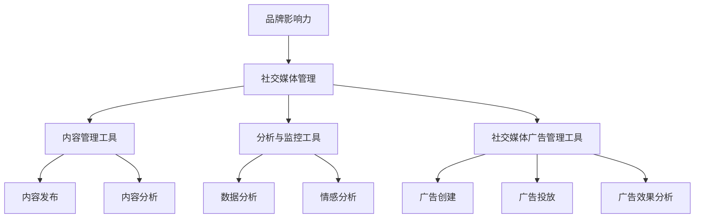
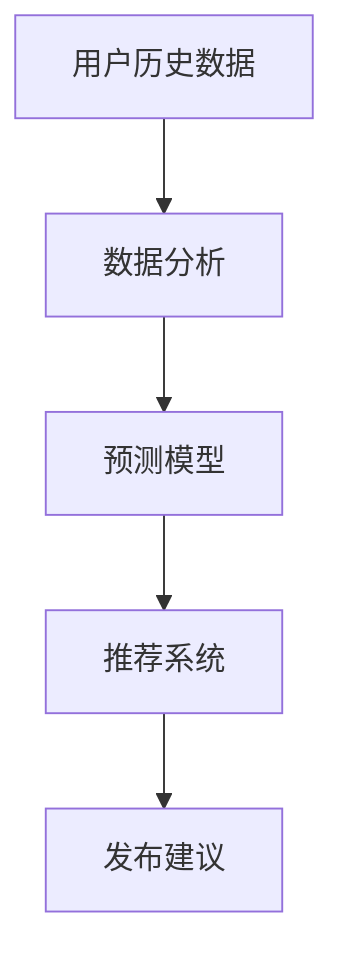
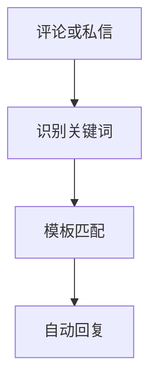
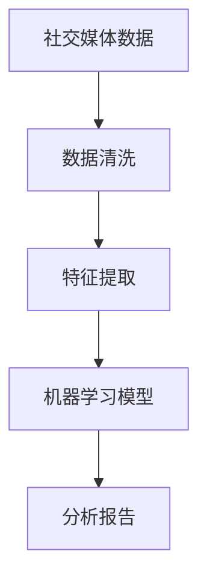
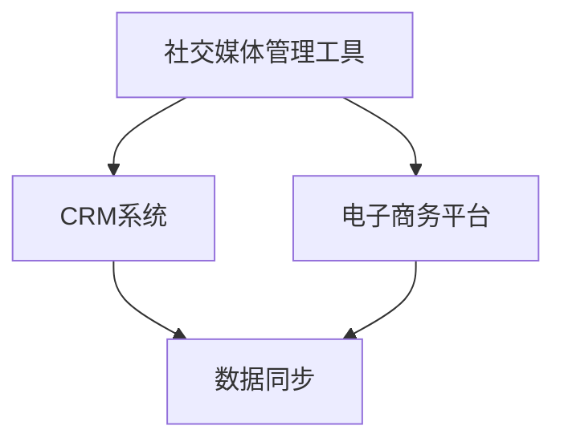
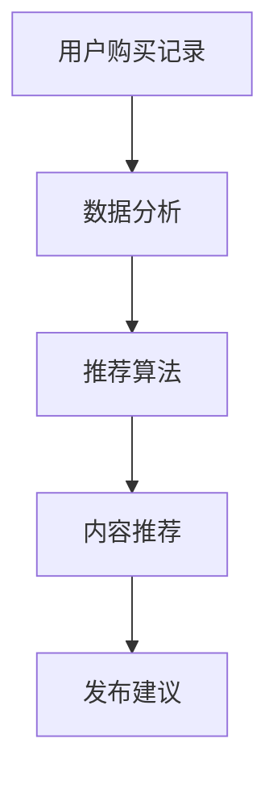
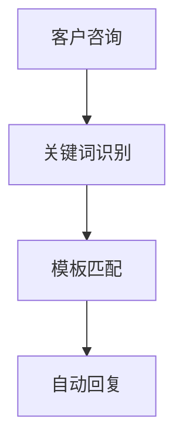
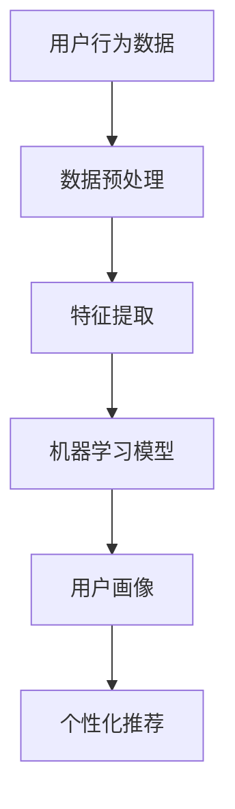
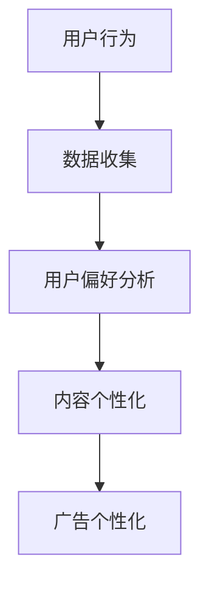

                 

### 《社交媒体管理工具：提升品牌影响力的助手》

> **关键词：**社交媒体管理、品牌影响力、工具应用、数据分析、内容优化、广告管理

> **摘要：**本文将深入探讨社交媒体管理工具在提升品牌影响力方面的作用。通过对社交媒体管理基础、工具功能特点、实战应用以及未来趋势的详细分析，帮助读者了解如何选择和优化这些工具，从而实现高效的社交媒体营销。

### 目录大纲

1. **第一部分：社交媒体管理概述**

   1.1 社交媒体管理的重要性
   
   1.2 社交媒体管理工具的概念
   
   1.3 社交媒体管理工具的分类

   2. **第二部分：社交媒体管理工具的功能与特点**

   2.1 内容管理工具的功能与特点
   
   2.2 分析与监控工具的功能与特点
   
   2.3 社交媒体广告管理工具的功能与特点

   3. **第三部分：社交媒体管理工具应用实战**

   3.1 社交媒体管理工具的实操步骤
   
   3.2 内容管理工具应用案例
   
   3.3 分析与监控工具应用案例
   
   3.4 社交媒体广告管理工具应用案例

   4. **第四部分：社交媒体管理工具的高级应用与优化**

   4.1 高级功能介绍
   
   4.2 功能拓展与整合
   
   4.3 优化策略

   5. **第五部分：社交媒体管理工具的未来趋势与发展方向**

   4.4 未来趋势与发展方向

   6. **附录**

   6.1 常用术语与解释
   
   6.2 参考资料与在线资源
   
   6.3 开发指南

### 第一部分：社交媒体管理概述

在当今数字化时代，社交媒体已经成为企业营销的关键渠道之一。有效的社交媒体管理不仅可以提升品牌知名度，还能增强品牌影响力，进而促进销售增长。因此，了解社交媒体管理的基础概念和工具显得尤为重要。

#### 1.1 社交媒体管理的重要性

社交媒体管理的重要性体现在以下几个方面：

- **增强品牌影响力**：通过社交媒体，企业可以与消费者建立更紧密的联系，传递品牌价值，塑造品牌形象。

- **提高市场竞争力**：良好的社交媒体管理可以帮助企业在市场中脱颖而出，吸引目标客户，提升市场份额。

- **提升销售业绩**：社交媒体营销可以驱动潜在客户转化为实际购买者，从而提高销售额。

- **实时反馈与改进**：社交媒体为品牌提供了一个直接与消费者沟通的平台，企业可以根据反馈迅速调整营销策略。

#### 1.2 社交媒体管理工具的概念

社交媒体管理工具是指帮助企业管理和优化社交媒体活动的软件或平台。这些工具旨在简化社交媒体内容的发布、分析、监控和广告管理等操作，从而提高工作效率和效果。

常见的社交媒体管理工具包括：

- **内容管理工具**：如Hootsuite、Buffer，用于规划、发布和优化社交媒体内容。

- **分析与监控工具**：如Google Analytics、Brandwatch，用于监测社交媒体数据、分析市场趋势和消费者行为。

- **社交媒体广告管理工具**：如Facebook Ads Manager、LinkedIn Ads，用于创建、投放和优化社交媒体广告。

#### 1.3 社交媒体管理工具的分类

根据功能的不同，社交媒体管理工具可以分为以下几类：

- **内容管理工具**：用于内容的发布、规划和管理，包括内容创作、多平台同步、内容分析等。

- **分析与监控工具**：用于收集、分析和监控社交媒体数据，包括用户行为分析、趋势预测、情感分析等。

- **社交媒体广告管理工具**：用于创建、投放和优化社交媒体广告，包括广告素材制作、投放策略、广告效果分析等。

#### 社交媒体管理的基础概念与联系

为了更好地理解社交媒体管理，我们可以用Mermaid流程图来展示其核心概念和联系：



通过这个流程图，我们可以看到社交媒体管理如何通过不同的工具和功能来提升品牌影响力。接下来，我们将详细探讨这些工具的功能和特点。

### 第二部分：社交媒体管理工具的功能与特点

#### 2.1 内容管理工具的功能与特点

内容管理工具是社交媒体管理的核心之一，其主要功能包括内容的发布、规划和管理。以下是对几种常见内容管理工具的功能和特点的详细介绍。

**Hootsuite**

- **功能**：Hootsuite允许用户在多个社交媒体平台上统一发布和管理内容。它还提供了内容日历功能，帮助用户规划发布时间。

- **特点**：支持多种社交媒体平台（如Facebook、Twitter、LinkedIn等），提供丰富的分析报告。

**Buffer**

- **功能**：Buffer可以帮助用户将内容提前规划并自动发布，避免手动重复操作。

- **特点**：智能发布功能，根据用户的历史数据自动调整发布时间，提高内容的可见度。

**Sprout Social**

- **功能**：Sprout Social提供了更高级的内容管理功能，包括内容审批流程和跨团队协作。

- **特点**：用户界面友好，提供全面的社交媒体分析报告，支持视频和图片内容优化。

**内容管理工具的功能与特点总结**

| 工具名称 | 功能 | 特点 |
| --- | --- | --- |
| Hootsuite | 内容发布、规划、分析 | 多平台支持、丰富的分析报告 |
| Buffer | 自动发布、智能发布 | 根据用户数据调整发布时间 |
| Sprout Social | 内容审批、跨团队协作 | 用户界面友好、全面的社交媒体分析 |

#### 2.2 分析与监控工具的功能与特点

分析与监控工具在社交媒体管理中扮演着至关重要的角色，它们帮助用户收集和分析社交媒体数据，以便更好地了解市场和消费者行为。以下是对几种常见分析与监控工具的功能和特点的详细介绍。

**Google Analytics**

- **功能**：Google Analytics是免费的全面分析工具，可以追踪用户在网站和社交媒体上的行为。

- **特点**：提供详细的流量分析、用户行为跟踪和目标设定功能。

**Brandwatch**

- **功能**：Brandwatch专注于社交媒体监控，可以实时监测社交媒体上的讨论和趋势。

- **特点**：强大的情感分析功能，支持多语言监控，提供深入的市场洞察。

**Hootsuite Insights**

- **功能**：Hootsuite Insights结合了内容管理和分析功能，提供实时监控和趋势预测。

- **特点**：易于使用，提供直观的仪表盘和报告，支持跨团队协作。

**Brandwatch Analytics**

- **功能**：Brandwatch Analytics提供了深入的数据分析，包括社交媒体趋势、用户参与度和市场份额。

- **特点**：强大的数据处理能力，支持自定义报告和可视化工具。

**分析与监控工具的功能与特点总结**

| 工具名称 | 功能 | 特点 |
| --- | --- | --- |
| Google Analytics | 流量分析、用户行为跟踪、目标设定 | 免费使用、详细的报告 |
| Brandwatch | 实时监控、情感分析、市场洞察 | 多语言支持、强大的数据处理能力 |
| Hootsuite Insights | 实时监控、趋势预测、内容管理 | 易于使用、跨团队协作 |
| Brandwatch Analytics | 社交媒体趋势、用户参与度、市场份额 | 深入的数据分析、自定义报告 |

#### 2.3 社交媒体广告管理工具的功能与特点

社交媒体广告管理工具专注于广告的创建、投放和优化，帮助企业更有效地进行社交媒体广告营销。以下是对几种常见广告管理工具的功能和特点的详细介绍。

**Facebook Ads Manager**

- **功能**：Facebook Ads Manager是Facebook官方的广告管理工具，可以创建和投放各种类型的广告。

- **特点**：提供了丰富的广告格式和定位选项，支持自动优化和实时反馈。

**LinkedIn Ads**

- **功能**：LinkedIn Ads专注于专业网络营销，帮助企业在LinkedIn平台上吸引潜在客户。

- **特点**：提供了定向广告、品牌推广和内容广告等多种广告类型。

**Google Ads**

- **功能**：Google Ads是Google的广告平台，可以在Google搜索结果和YouTube上投放广告。

- **特点**：强大的定位和自动化工具，支持广告效果分析和优化。

**AdEspresso**

- **功能**：AdEspresso是一个自动化广告管理工具，用于创建、管理和优化Facebook和Google广告。

- **特点**：提供了智能广告优化、自动化广告轮播和批量广告创建功能。

**广告管理工具的功能与特点总结**

| 工具名称 | 功能 | 特点 |
| --- | --- | --- |
| Facebook Ads Manager | 广告创建、投放、优化 | 官方广告管理工具、丰富的广告格式 |
| LinkedIn Ads | 定向广告、品牌推广、内容广告 | 专业网络营销平台 |
| Google Ads | 广告创建、投放、效果分析 | 强大的定位和自动化工具 |
| AdEspresso | 自动化广告优化、批量广告创建 | 智能广告优化、自动化广告轮播 |

通过以上对不同类型社交媒体管理工具的功能和特点的介绍，我们可以看到，这些工具在帮助提升品牌影响力方面发挥了重要作用。接下来，我们将进一步探讨如何选择和使用这些工具。

### 第二部分：社交媒体管理工具的功能与特点（续）

#### 2.4 选择合适的社交媒体管理工具

在选择社交媒体管理工具时，企业需要考虑多个因素，以确保所选工具能够满足其特定需求，并最大化其营销效果。以下是一些关键的考虑因素：

**1. 需求分析**

首先，企业需要明确自己的需求，包括要管理哪些社交媒体平台、需要哪些具体功能（如内容发布、数据分析、广告管理）、预算范围等。例如，如果企业主要关注的是内容管理，那么选择具有强大内容发布和优化功能的管理工具可能更为合适。

**2. 市场调研**

在确定需求后，企业应进行市场调研，了解不同社交媒体管理工具的优缺点。这可以通过查阅在线评价、用户反馈、工具的官方网站以及行业报告等方式进行。了解市场上流行的工具和它们的适用场景，有助于企业做出更明智的选择。

**3. 工具评估与选择**

在市场调研的基础上，企业应对几款备选工具进行详细评估。评估内容应包括：

- **功能对比**：比较不同工具提供的功能，确定哪些功能对企业最为重要，并评估这些功能是否满足需求。
- **用户体验**：测试工具的用户界面和操作流程，确保其易用性和用户友好性。
- **性能与稳定性**：了解工具的性能指标和稳定性，确保其在高峰期能够正常运行。
- **客户支持与服务**：评估工具提供商的客户支持服务，包括响应速度、技术支持和服务质量。

**选择过程伪代码示例**

```python
# 定义需求
需求 = ["内容发布", "数据分析", "广告管理", "预算1000美元/月"]

# 进行市场调研
市场调研结果 = 获取市场调研数据()

# 评估工具
评估结果 = []
for 工具 in 市场调研结果:
    功能对比 = 对比工具功能(工具, 需求)
    用户体验 = 评估用户体验(工具)
    性能稳定性 = 评估性能稳定性(工具)
    客户支持 = 评估客户支持(工具)
    评估结果.append({
        "工具名称": 工具名称,
        "功能对比": 功能对比,
        "用户体验": 用户体验,
        "性能稳定性": 性能稳定性,
        "客户支持": 客户支持
    })

# 选择最佳工具
最佳工具 = 选择最佳评估结果(评估结果)
```

**4. 演练与测试**

在选择工具后，企业应进行实际演练和测试，以验证工具在实际使用中的表现。这可以包括：

- **试用**：尝试使用工具进行简单的社交媒体管理操作，检查功能是否符合预期。
- **模拟任务**：通过模拟任务测试工具的性能和稳定性，确保其在处理实际工作时的表现。
- **反馈与调整**：根据测试结果，对工具设置进行调整，以优化其使用体验。

**选择合适社交媒体管理工具的重要性**

选择合适的社交媒体管理工具对企业的社交媒体营销至关重要。合适的工具可以：

- **提高工作效率**：通过自动化和优化功能，减少手动操作，提高管理效率。
- **增强数据洞察**：通过详细的分析报告和监控功能，帮助企业更好地了解市场趋势和消费者行为。
- **提升品牌影响力**：通过有效的社交媒体管理，提高品牌知名度，吸引更多潜在客户。

通过以上步骤，企业可以确保选择到的社交媒体管理工具能够最大程度地满足其需求，从而提升品牌影响力。

### 社交媒体管理工具的实操步骤

选择并配置合适的社交媒体管理工具是提升品牌影响力的重要一步。以下是社交媒体管理工具的实操步骤，包括工具的选择、安装与配置、以及账号的创建与管理。

#### 3.1 选择合适的社交媒体管理工具

**步骤1：明确需求**

首先，企业需要明确自己的社交媒体管理需求，包括要管理哪些平台（如Facebook、Instagram、Twitter、LinkedIn等），需要哪些功能（如内容发布、数据分析、广告管理），以及预算等。这些需求将指导后续的工具选择过程。

**步骤2：市场调研**

进行市场调研，收集各种社交媒体管理工具的信息。可以通过以下渠道获取信息：

- **官方网站**：访问工具提供商的官方网站，了解工具的功能、价格和用户评价。
- **用户反馈**：查阅社交媒体管理工具的用户评价和反馈，了解实际使用中的优缺点。
- **行业报告**：参考相关行业的报告和分析，了解市场趋势和工具的流行度。
- **同行经验**：了解同行业内其他企业的使用经验，借鉴他们的选择和配置方案。

**步骤3：工具评估**

根据需求和市场调研结果，对几款备选工具进行详细评估。评估内容包括：

- **功能对比**：比较不同工具提供的功能，确定哪些功能对企业最为重要，并评估这些功能是否满足需求。
- **用户体验**：测试工具的用户界面和操作流程，确保其易用性和用户友好性。
- **性能与稳定性**：了解工具的性能指标和稳定性，确保其在高峰期能够正常运行。
- **客户支持与服务**：评估工具提供商的客户支持服务，包括响应速度、技术支持和服务质量。

**步骤4：选择最佳工具**

根据评估结果，选择最适合企业需求的社交媒体管理工具。选择时可以考虑以下因素：

- **功能满足度**：工具是否能够满足企业的全部需求。
- **用户体验**：工具的易用性和用户友好性。
- **性能与稳定性**：工具的性能指标和稳定性。
- **预算**：工具的价格是否在企业的预算范围内。
- **客户支持**：工具提供商提供的客户支持服务。

#### 3.2 安装与配置社交媒体管理工具

**步骤1：安装**

根据所选工具的安装说明，进行安装。通常，安装过程包括以下步骤：

- **下载软件**：从官方网站下载社交媒体管理工具。
- **安装软件**：按照提示完成软件安装。
- **配置环境**：确保系统环境满足工具的运行要求，如安装必要的驱动或库。

**步骤2：配置**

完成安装后，需要对工具进行配置，以确保其能够正常运行。配置步骤包括：

- **账户登录**：使用企业账号登录工具，获取权限。
- **平台连接**：连接企业所管理的社交媒体平台账号，获取权限。
- **功能设置**：根据企业需求，设置工具的各种功能，如内容发布、数据分析、广告管理等。

**配置过程伪代码示例**

```python
# 登录社交媒体管理工具
登录(工具，企业账号，密码)

# 连接社交媒体平台
连接平台(工具，Facebook，Instagram，Twitter)

# 设置功能
设置内容发布(工具，自动发布)
设置数据分析(工具，实时监控)
设置广告管理(工具，自动优化)
```

#### 3.3 创建与管理社交媒体账号

**步骤1：创建账号**

在社交媒体管理工具中，创建企业账号。创建账号时需要填写以下信息：

- **账号名称**：企业官方名称或品牌名称。
- **联系方式**：企业的联系邮箱、电话等。
- **账号信息**：包括账号简介、头像、封面等。

**步骤2：账号管理**

创建账号后，需要对其进行管理，以确保账号的活跃度和形象。管理步骤包括：

- **内容发布**：定期发布高质量的内容，包括文字、图片、视频等。
- **互动与回复**：及时回复用户的评论和私信，与用户互动，增强用户参与度。
- **数据分析**：分析账号的表现，包括用户参与度、转化率等，根据数据调整内容策略。
- **优化调整**：根据账号的表现，对账号设置进行优化调整，如发布时间、内容类型等。

**账号管理过程伪代码示例**

```python
# 创建账号
创建账号(工具，账号名称，联系方式，账号简介)

# 发布内容
发布内容(工具，文本内容，图片，视频)

# 回复评论
回复评论(工具，评论ID，回复内容)

# 分析账号表现
分析账号表现(工具，获取用户参与度数据)

# 优化账号设置
优化设置(工具，调整发布时间，内容类型)
```

通过以上实操步骤，企业可以确保选择并使用合适的社交媒体管理工具，从而提升品牌影响力。接下来，我们将探讨内容管理工具的具体应用案例。

### 4.1 内容管理工具应用案例

内容管理工具在社交媒体管理中起着至关重要的作用，通过合理使用这些工具，企业可以更高效地策划、发布和优化内容，从而提升品牌影响力。以下是一个具体的内容管理工具应用案例，我们将详细描述内容策划与发布的步骤、内容优化策略以及多平台内容同步的过程。

#### 案例背景

某知名电子产品公司计划在社交媒体平台上推出一款新手机的发布活动，希望通过精心策划的内容营销活动吸引潜在客户，提高品牌知名度。

#### 内容策划与发布步骤

**步骤1：内容策划**

- **目标定位**：明确目标受众，如年轻科技爱好者、商务人士等。
- **主题确定**：确定内容主题，如新手机的独特功能、设计理念等。
- **内容形式**：根据主题，选择合适的媒体形式，如图文、短视频、直播等。
- **内容创意**：设计创意内容，增加用户参与度，如互动问答、抽奖活动等。

**步骤2：内容发布**

- **发布计划**：制定内容发布计划，包括发布时间、频率和内容类型。
- **内容审核**：发布前对内容进行审核，确保内容质量符合品牌形象。
- **发布执行**：通过内容管理工具（如Hootsuite或Buffer）发布内容，确保内容在不同平台上的同步。

**步骤3：内容优化**

- **数据监测**：发布后，通过分析工具（如Google Analytics或Brandwatch Insights）监测内容表现，包括点击率、分享次数、用户反馈等。
- **效果评估**：根据数据评估内容效果，调整发布策略，如修改内容、调整发布时间等。

#### 多平台内容同步

为了确保内容在各个社交媒体平台上的传播效果，公司使用了内容管理工具来实现多平台同步。以下是具体操作步骤：

**步骤1：连接平台**

- 在内容管理工具中连接公司使用的社交媒体平台，如Facebook、Twitter、Instagram、LinkedIn等。

**步骤2：内容设置**

- 在工具中设置每个平台的发布时间、频率和内容格式。
- 根据每个平台的特点，调整内容的呈现方式，如Facebook更适合图文结合，Instagram更适合图片和视频。

**步骤3：同步发布**

- 使用内容管理工具的自动化发布功能，将同一内容同步发布到多个平台。
- 设置不同的发布时间，确保在不同平台上获得最佳曝光率。

**多平台内容同步伪代码示例**

```python
# 连接社交媒体平台
连接平台(工具，Facebook，Twitter，Instagram，LinkedIn)

# 设置发布时间
设置发布时间(工具，Facebook，上午9点)
设置发布时间(工具，Twitter，下午3点)
设置发布时间(工具，Instagram，晚上7点)

# 设置内容格式
设置内容格式(工具，Facebook，图文结合)
设置内容格式(工具，Twitter，纯文本)
设置内容格式(工具，Instagram，图片和视频)

# 同步发布内容
同步发布(工具，内容1，平台列表)
同步发布(工具，内容2，平台列表)
```

通过以上案例，我们可以看到，内容管理工具在社交媒体营销中的重要性。通过合理的内容策划、发布和优化，企业可以更有效地吸引目标受众，提升品牌影响力。

### 4.2 分析与监控工具应用案例

分析与监控工具在社交媒体管理中起着至关重要的作用，它们帮助企业收集和分析社交媒体数据，以便更好地了解市场趋势和消费者行为。以下是一个具体的应用案例，我们将详细描述数据分析、社交媒体监控和情感分析的步骤，以及如何通过这些分析提升品牌影响力。

#### 案例背景

某时尚品牌希望通过社交媒体分析了解消费者对新产品发布的反应，并优化未来的营销策略。该品牌选择了Brandwatch Insights作为其分析工具。

#### 数据分析

**步骤1：数据收集**

- **社交媒体数据**：Brandwatch Insights可以收集Twitter、Facebook、Instagram、LinkedIn等社交媒体平台上的公开数据。
- **关键词分析**：设置关键词，如产品名称、品牌名称、相关话题等，以收集与新产品发布相关的讨论。

**步骤2：数据处理**

- **数据筛选**：通过过滤功能，去除无关的数据，如重复的帖子、垃圾信息等。
- **数据可视化**：使用图表和图形将数据可视化，便于理解和分析。

**步骤3：数据解读**

- **趋势分析**：分析关键词在社交媒体上的趋势，了解消费者对新产品的兴趣变化。
- **用户画像**：分析参与讨论的用户特征，如年龄、性别、地理位置等，以了解目标受众。

**数据分析过程伪代码示例**

```python
# 数据收集
社交媒体数据 = 收集社交媒体数据(关键词列表)

# 数据处理
筛选数据 = 过滤无关数据(社交媒体数据)
可视化数据 = 可视化图表(筛选数据)

# 数据解读
分析趋势 = 分析关键词趋势(筛选数据)
构建用户画像 = 分析用户特征(筛选数据)
```

#### 社交媒体监控

**步骤1：设置监控策略**

- **监控范围**：确定监控的社交媒体平台和关键词。
- **监控频率**：设置监控的时间间隔，如每天、每周等。

**步骤2：实时监控**

- **数据实时更新**：Brandwatch Insights提供实时数据更新，确保品牌可以及时了解市场动态。
- **警报系统**：设置警报，当特定关键词或事件发生时，立即通知相关人员。

**步骤3：监控效果分析**

- **效果评估**：定期评估监控效果，调整监控策略，以优化品牌影响力。

**社交媒体监控过程伪代码示例**

```python
# 设置监控策略
设置监控范围(关键词列表，平台列表)
设置监控频率(每天)

# 实时监控
实时更新 = 监控实时数据(平台列表，关键词列表)

# 监控效果分析
评估效果 = 分析监控数据(实时更新)
调整策略 = 优化监控效果(评估效果)
```

#### 情感分析

**步骤1：情感分析模型**

- **模型训练**：使用Brandwatch Insights内置的情感分析模型，或者自定义训练模型。
- **情感标签**：对收集的社交媒体数据进行情感分析，标记为积极、中立或消极。

**步骤2：情感分析应用**

- **趋势分析**：分析不同时间段内的情感变化，了解消费者对品牌和产品的情绪变化。
- **热点分析**：识别引起情感波动的热点事件或话题，以便及时回应。

**步骤3：情感分析效果评估**

- **反馈收集**：根据情感分析结果，收集用户反馈，了解消费者对品牌和产品的真实感受。
- **策略调整**：根据情感分析结果和用户反馈，调整营销策略，提高品牌影响力。

**情感分析过程伪代码示例**

```python
# 情感分析模型
训练模型 = 训练情感分析模型(训练数据)
情感标签 = 分析情感(社交媒体数据，训练模型)

# 情感分析应用
情感趋势 = 分析情感趋势(情感标签)
热点分析 = 识别热点事件(情感标签)

# 情感分析效果评估
收集反馈 = 收集用户反馈(情感趋势)
调整策略 = 优化营销策略(收集反馈)
```

通过以上案例分析，我们可以看到，分析与监控工具在社交媒体管理中的重要性。通过深入的数据分析、实时的社交媒体监控和情感分析，品牌可以更好地了解市场和消费者行为，从而优化营销策略，提升品牌影响力。

### 4.3 社交媒体广告管理工具应用案例

社交媒体广告管理工具在提升品牌影响力方面发挥着至关重要的作用。通过这些工具，企业可以更高效地创建、投放和优化广告，从而实现精准营销和最大化的广告效果。以下是一个具体的社交媒体广告管理工具应用案例，我们将详细描述广告创建、投放与优化的过程，以及广告效果分析的步骤。

#### 案例背景

某在线教育平台计划在Facebook和Instagram上投放广告，推广其新推出的在线课程，希望通过广告提升品牌知名度并增加课程注册量。

#### 广告创建

**步骤1：目标设定**

- **广告目标**：设定广告目标，如增加网站访问量、提升课程注册量、提升品牌知名度等。
- **受众定位**：确定目标受众，如年龄、性别、地理位置、兴趣等。

**步骤2：广告内容制作**

- **广告素材**：创建吸引人的广告素材，如图片、视频、动画等。
- **广告文案**：撰写简洁明了、具有吸引力的广告文案，突出课程优势和亮点。
- **广告格式**：选择适合的广告格式，如图片广告、视频广告、滑动广告等。

**步骤3：广告审核**

- **内容审核**：确保广告内容符合平台规则，不包含违规或误导性信息。
- **广告预览**：在投放前预览广告效果，调整广告内容和格式，确保最佳展示效果。

#### 广告投放

**步骤1：广告定位**

- **定位设置**：根据目标受众的属性，设置广告投放的地理位置、兴趣标签、行为习惯等。
- **预算设定**：设置广告预算，包括日预算和总预算，确保广告投放的可持续性。

**步骤2：投放策略**

- **投放时间**：根据目标受众的活动时间，设置最佳广告投放时间。
- **投放频率**：设置广告投放的频率，避免过度曝光导致用户疲劳。

**步骤3：投放监控**

- **实时监控**：通过社交媒体广告管理工具，实时监控广告投放情况，包括广告展示次数、点击率、转化率等。
- **数据反馈**：根据实时数据，调整广告定位和投放策略，优化广告效果。

#### 广告优化

**步骤1：效果评估**

- **数据收集**：收集广告投放的数据，包括展示次数、点击率、转化率、成本效益等。
- **效果分析**：分析广告效果，识别成功和失败的原因，了解目标受众的偏好。

**步骤2：策略调整**

- **优化广告内容**：根据效果分析结果，优化广告素材和文案，提高广告吸引力。
- **调整定位策略**：根据广告效果，调整广告定位，提高目标受众的精准度。

**步骤3：持续优化**

- **定期评估**：定期评估广告效果，持续优化广告策略，确保广告投放的持续性和有效性。
- **自动化优化**：利用广告管理工具的自动化功能，根据数据反馈自动调整广告投放策略。

**广告优化过程伪代码示例**

```python
# 广告效果评估
收集数据 = 收集广告数据(展示次数，点击率，转化率，成本效益)

# 效果分析
分析效果 = 分析广告效果(收集数据)

# 策略调整
优化内容 = 优化广告素材和文案(分析效果)
调整定位 = 调整广告定位(分析效果)

# 持续优化
定期评估 = 定期评估广告效果
自动化优化 = 自动化广告策略调整(分析效果)
```

#### 广告效果分析

**步骤1：转化率分析**

- **转化率计算**：计算广告的转化率，即广告带来的实际转化次数与展示次数的比值。
- **转化路径分析**：分析用户从广告点击到转化的全过程，了解用户的决策路径。

**步骤2：成本效益分析**

- **成本计算**：计算广告投放的总成本，包括广告费用、人力成本等。
- **效益分析**：计算广告带来的总效益，包括注册量、销售额等，评估广告的投资回报率（ROI）。

**步骤3：营销ROI分析**

- **ROI计算**：计算营销ROI，即广告效益与成本的比值，评估广告营销的整体效果。

**广告效果分析过程伪代码示例**

```python
# 转化率分析
计算转化率 = 转化次数 / 展示次数

# 成本效益分析
计算总成本 = 广告费用 + 人力成本
计算总效益 = 注册量 * 单价

# ROI分析
计算ROI = 总效益 / 总成本
```

通过以上案例，我们可以看到，社交媒体广告管理工具在广告创建、投放和优化过程中发挥了关键作用。通过详细的数据分析和策略调整，企业可以不断提升广告效果，实现精准营销，从而提升品牌影响力。接下来，我们将探讨社交媒体管理工具的高级功能与拓展。

### 5.1 社交媒体管理工具的高级功能与拓展

随着技术的不断进步，社交媒体管理工具也不断升级，提供更高级的功能和拓展能力。以下是一些常见的高级功能与拓展，以及它们如何提升社交媒体管理效率和效果。

#### 智能化推荐

**功能介绍**：智能化推荐功能利用机器学习和大数据分析技术，自动推荐最适合发布的内容和时间。通过分析用户历史数据和社交媒体趋势，工具能够预测最佳发布时机和内容类型。

**应用场景**：例如，品牌可以在高峰时段发布最具吸引力的内容，吸引更多用户关注和参与。

**实现原理**：



#### 自动化回复

**功能介绍**：自动化回复功能允许用户预先设置回复模板，当收到特定的评论或私信时，工具会自动发送预定义的回复。

**应用场景**：例如，客户服务部门可以自动回复常见问题，减少人工回复的工作量。

**实现原理**：



#### 智能数据分析

**功能介绍**：智能数据分析功能通过高级算法和机器学习模型，提供深度的数据分析报告，帮助用户更好地理解社交媒体数据。

**应用场景**：例如，品牌可以使用这些报告来优化广告投放策略、内容发布计划等。

**实现原理**：



#### 功能拓展与整合

**功能介绍**：功能拓展和整合指的是将社交媒体管理工具与其他工具（如CRM系统、电子商务平台等）进行集成，实现数据的无缝传输和协同工作。

**应用场景**：例如，将社交媒体管理工具与客户关系管理（CRM）系统整合，可以实时同步社交媒体上的客户互动数据，提高客户服务质量。

**实现原理**：



#### 高级功能与拓展的优势

- **提高效率**：自动化和智能化的功能大大减少了手动操作，提高了社交媒体管理的工作效率。
- **优化决策**：通过深入的数据分析和智能推荐，企业可以做出更加精准的营销决策。
- **提升用户体验**：功能拓展和整合使得不同系统之间的数据能够更好地协同工作，提供更流畅的用户体验。

### 社交媒体管理工具的高级功能与拓展示例

#### 智能化推荐

**示例**：假设一个时尚品牌在社交媒体上发布新品，使用智能化推荐功能，根据用户的历史购买记录和浏览行为，推荐最适合发布的内容和时间段。这可以大幅提升内容的曝光率和用户参与度。



#### 自动化回复

**示例**：一个电商平台在处理大量的客户咨询时，通过自动化回复功能，设置常见问题的自动回复模板，如退货政策、订单查询等，有效减少了人工回复的工作量，提高了客户服务质量。



#### 智能数据分析

**示例**：一个营销团队使用智能数据分析功能，分析社交媒体上的数据，了解目标受众的行为习惯和兴趣点，进而优化广告投放策略，提升广告效果。


#### 功能拓展与整合

**示例**：一个公司通过整合社交媒体管理工具与电子商务平台，实现订单数据的实时同步，从而优化库存管理和客户服务流程，提高整体运营效率。


通过这些高级功能和拓展，社交媒体管理工具不仅能够提高工作效率，还能优化决策过程，提升用户体验，从而在激烈的市场竞争中脱颖而出。

### 5.2 社交媒体管理工具的优化策略

为了确保社交媒体管理工具能够持续提升品牌影响力，企业需要制定和实施有效的优化策略。这些策略应基于数据驱动的原则，通过不断分析用户行为、市场趋势和工具效果，进行精细调整和优化。以下是社交媒体管理工具优化的几个关键步骤和具体方法。

#### 优化目标与原则

**1. 优化目标**

- **提高内容质量**：通过优化内容和发布策略，提升用户参与度和品牌忠诚度。
- **提升广告效果**：通过优化广告定位、内容和投放策略，提高广告的点击率和转化率。
- **提升数据分析能力**：通过优化数据收集、处理和分析工具，提供更准确和有价值的洞察。
- **提高工作效率**：通过优化工具的使用和操作流程，减少手动操作，提高工作效率。

**2. 优化原则**

- **数据驱动**：所有优化决策应基于数据分析和实际效果，避免主观臆断。
- **持续迭代**：优化是一个持续的过程，需要定期评估和调整，不断改进。
- **用户中心**：始终关注用户需求和体验，以用户为中心进行优化。
- **资源合理配置**：合理分配人力、时间和预算，确保优化工作的有效性和可持续性。

#### 优化方法与实践

**1. 数据驱动的优化**

**（1）用户行为分析**

- **收集数据**：使用社交媒体分析工具，收集用户在社交媒体上的行为数据，如点击率、分享次数、评论数等。
- **分析行为**：对收集的数据进行深入分析，识别用户行为模式，了解用户偏好和兴趣点。
- **制定策略**：根据分析结果，制定优化策略，如调整内容类型、发布时间和广告定位。

**（2）市场趋势分析**

- **监控趋势**：定期监控社交媒体上的市场趋势和热点话题。
- **趋势预测**：使用数据分析工具预测未来市场趋势，提前布局。
- **调整策略**：根据市场趋势调整内容发布和广告策略，确保与市场保持同步。

**2. 用户行为分析的实例**

**（1）案例背景**

某时尚品牌希望通过社交媒体广告提升新品销量。他们使用了社交媒体管理工具对用户行为进行分析。

**（2）具体步骤**

- **收集数据**：品牌使用了AdEspresso工具，收集了广告的展示次数、点击率、转化率等数据。
- **分析行为**：通过对数据进行分析，发现用户在晚上8点到10点之间对广告的点击率最高。
- **制定策略**：品牌决定将广告投放时间调整到晚上8点到10点，并优化广告内容和定位，以提高广告效果。

**3. 优化广告效果**

**（1）广告A/B测试**

- **测试目标**：通过A/B测试，比较不同广告版本的效果，找出最优方案。
- **测试步骤**：创建两个不同的广告版本，分别投放给不同用户群体，收集数据并进行分析。
- **优化策略**：根据测试结果，选择效果更好的广告版本，并对其进行进一步优化。

**（2）广告效果优化的实例**

**案例背景**

某电子产品公司希望通过社交媒体广告提升新手机的销量。他们使用了Facebook Ads Manager进行广告优化。

**具体步骤**

- **创建广告版本A**：设计一个包含高清晰度图片和详细产品描述的广告。
- **创建广告版本B**：设计一个包含用户好评和互动视频的广告。
- **A/B测试**：将广告版本A和B分别投放给两个不同的用户群体，收集数据。
- **分析结果**：广告版本B的点击率和转化率显著高于版本A。
- **优化策略**：决定停止版本A的投放，并将资源集中到版本B的优化和扩大投放。

**4. 提高数据分析能力**

**（1）数据收集与处理**

- **多渠道数据收集**：整合社交媒体管理工具，收集来自不同平台的详细数据。
- **数据处理**：使用数据清洗工具，确保数据的准确性和完整性。

**（2）数据可视化与分析**

- **数据可视化**：使用数据可视化工具，将复杂的数据以图表和图形的方式呈现，便于理解和分析。
- **深入分析**：通过机器学习和人工智能技术，对数据进行深度分析，发现潜在趋势和规律。

**（3）数据驱动的决策**

- **制定策略**：根据数据分析结果，制定针对性的营销策略，如内容优化、广告定位调整等。
- **实时反馈**：根据实时数据，调整策略，确保营销活动始终与市场趋势和用户需求保持一致。

**5. 提高工作效率**

**（1）自动化流程**

- **自动化发布**：使用社交媒体管理工具的自动化发布功能，减少手动操作，提高内容发布的效率。
- **自动化回复**：设置自动化回复模板，处理常见问题和客户咨询，减少人工回复的工作量。

**（2）流程优化**

- **工作流程分析**：分析现有的工作流程，识别瓶颈和优化点。
- **流程重构**：重构工作流程，简化操作步骤，提高工作效率。

**（3）培训与协作**

- **员工培训**：定期对员工进行工具使用和数据分析的培训，提高员工的专业技能。
- **跨部门协作**：鼓励不同部门之间的协作，确保社交媒体管理工具的有效使用和优化。

通过上述优化策略和方法，企业可以持续提升社交媒体管理工具的效果，从而在竞争激烈的市场中保持优势，提升品牌影响力。

### 5.3 社交媒体管理工具的未来趋势与发展方向

随着技术的不断进步和社交媒体的日益普及，社交媒体管理工具的未来发展将呈现以下趋势和方向：

#### 1. 人工智能技术的应用

人工智能（AI）将在社交媒体管理工具中发挥越来越重要的作用。通过AI技术，工具将能够实现更加智能化的内容创作、用户行为分析和广告投放优化。例如，AI可以自动生成高质量的内容，根据用户兴趣和行为进行精准的广告定位，甚至预测未来的市场趋势。以下是人工智能技术在社交媒体管理工具中的应用：

- **内容创作**：使用自然语言处理（NLP）技术生成吸引人的内容，减少人工创作的工作量。
- **用户行为分析**：通过机器学习算法分析用户行为数据，提供更准确的用户画像和个性化推荐。
- **广告优化**：利用深度学习模型优化广告投放策略，提高广告的点击率和转化率。

**技术原理**：



#### 2. 社交媒体平台的演变

社交媒体平台本身也在不断演变，推出新的功能和工具，为用户和品牌提供更多机会。例如，微信推出的小程序和视频号，为品牌提供了新的营销渠道；Instagram推出Reels，为品牌提供了短视频营销的新平台。这些平台的演变将推动社交媒体管理工具的功能更新和拓展。

**发展趋势**：

- **多元化平台支持**：社交媒体管理工具将支持更多新型社交媒体平台，帮助企业更好地覆盖目标受众。
- **平台集成**：社交媒体管理工具将更加注重与其他社交媒体平台的集成，实现数据的无缝传输和协同工作。

#### 3. 工具的智能化与个性化

随着AI技术的发展，社交媒体管理工具将变得更加智能化和个性化。工具将能够根据用户行为和偏好，自动调整内容和广告策略，提供更加个性化的用户体验。例如，自动化内容发布和广告投放将更加智能，根据用户实时反馈进行优化。

**技术实现**：



#### 4. 跨平台与全球化

社交媒体管理工具将更加注重跨平台和全球化支持，帮助企业在全球范围内进行社交媒体营销。例如，工具将支持多种语言和多币种交易，提供本地化的营销内容和广告策略。同时，全球化趋势也将推动社交媒体管理工具在功能、性能和用户体验上的不断优化。

**发展方向**：

- **全球化支持**：提供多语言和本地化功能，满足不同国家和地区的营销需求。
- **跨平台集成**：支持多种社交媒体平台，实现数据的整合和协同。

#### 5. 数据安全与隐私保护

随着数据隐私法规的日益严格，社交媒体管理工具将更加重视数据安全和隐私保护。工具将采用更加严格的数据加密和访问控制措施，确保用户数据的安全和隐私。

**关键措施**：

- **数据加密**：采用加密技术保护用户数据，防止数据泄露。
- **访问控制**：设置严格的访问权限，确保只有授权人员能够访问敏感数据。

通过以上未来趋势和发展方向的探讨，我们可以预见，社交媒体管理工具将在人工智能、社交媒体平台演变、智能化与个性化、跨平台与全球化以及数据安全与隐私保护等方面取得重大进展。这些进展将为企业提供更加高效、智能和安全的社交媒体管理解决方案，进一步提升品牌影响力。

### 附录

#### 附录A：社交媒体管理工具常用术语与解释

1. **品牌影响力**：品牌在市场中获得的认知度和美誉度，通常通过社交媒体活动、用户评价等体现。
2. **转化率**：在特定营销活动或广告中，目标用户完成特定行动（如购买、注册、点击等）的比例。
3. **ROI（投资回报率）**：营销投资所获得的收益与投资成本之间的比率，用于评估营销活动的效果。
4. **数据分析**：通过对大量数据进行收集、处理和分析，提取有价值的信息和洞察。
5. **情感分析**：使用自然语言处理技术，分析社交媒体上的文本数据，识别和分类情感，如积极、消极、中立等。

#### 附录B：社交媒体管理工具参考资料

1. **《社交媒体营销：从入门到精通》**：作者：约翰·史密斯
2. **《数字营销技巧：实战指南》**：作者：安娜·安德森
3. **《社交媒体管理指南》**：作者：大卫·凯利
4. **社交媒体管理工具官方网站**：如Hootsuite、Buffer、Sprout Social等。
5. **技术博客与论坛**：如Medium、LinkedIn Pulse、Reddit等。
6. **社交媒体营销社区**：如Social Media Examiner、Social Media Club等。

#### 附录C：社交媒体管理工具开发指南

**C.1 开发环境搭建**

1. **开发工具与软件**：Python、Java、R等。
2. **开发环境配置**：安装相应的编程环境（如Python的PyCharm、Java的IntelliJ IDEA等）。

**C.2 代码实现与解读**

1. **核心算法**：如机器学习算法、自然语言处理算法等。
2. **数据处理流程**：数据收集、清洗、预处理和存储。

**C.3 代码分析与优化**

1. **性能优化**：如代码压缩、缓存策略等。
2. **安全性评估**：如数据加密、访问控制等。
3. **可扩展性设计**：如模块化设计、分布式架构等。

通过以上附录，读者可以更好地了解社交媒体管理工具的相关术语、参考资料和开发指南，为实际操作和开发提供有力支持。

### 作者

**作者：AI天才研究院/AI Genius Institute & 禅与计算机程序设计艺术 /Zen And The Art of Computer Programming**  
AI天才研究院（AI Genius Institute）是一家专注于人工智能研究与应用的机构，致力于推动人工智能技术的发展。同时，作者也是《禅与计算机程序设计艺术》（Zen And The Art of Computer Programming）一书的作者，该书深入探讨了计算机编程的哲学和艺术，对编程技术和思想有着深刻理解。通过本文，作者希望帮助读者了解和掌握社交媒体管理工具的使用，提升品牌影响力。

