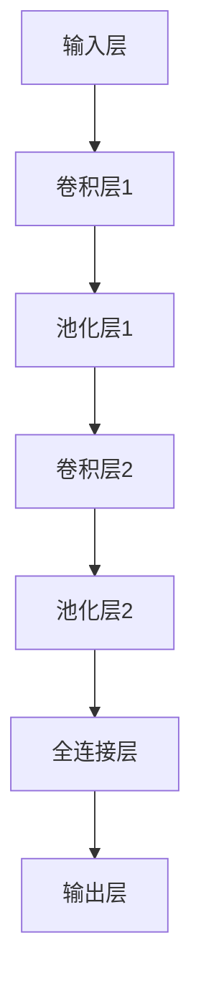
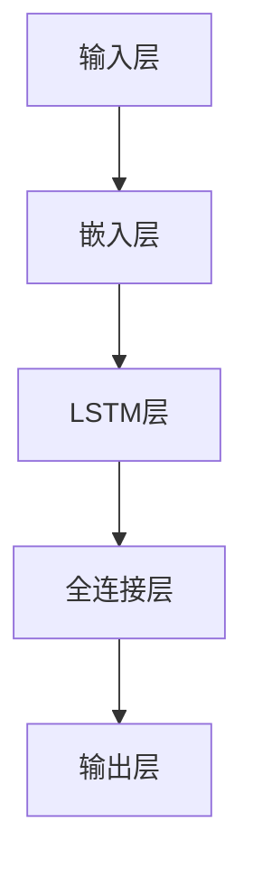
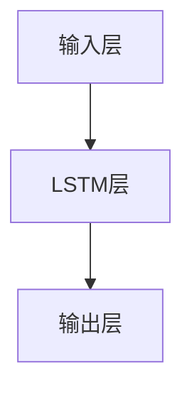

                 

# 《神经网络：人类与机器的共存》

> 关键词：神经网络、机器学习、人工智能、深度学习、激活函数、优化器、卷积神经网络、循环神经网络、生成对抗网络、图像识别、自然语言处理、机器人控制、医疗、金融

> 摘要：
本文将深入探讨神经网络这一人工智能的核心技术，从基础理论到应用实战，全面解析神经网络的工作原理、架构设计以及实际应用。我们不仅将介绍神经网络的数学基础，如微积分、概率论和线性代数，还将详细讲解多层感知机、卷积神经网络、循环神经网络和生成对抗网络等经典模型。此外，本文还将通过实际项目实战，展示神经网络在图像识别、自然语言处理和机器人控制等领域的应用，为读者提供从理论到实践的全面指导。通过阅读本文，读者将能够全面理解神经网络，为未来的人工智能研究与应用奠定坚实基础。

## 《神经网络：人类与机器的共存》目录大纲

### 第一部分：神经网络基础理论

#### 第1章：神经网络概述
- 1.1 神经网络的概念与历史
  - 神经网络与生物大脑的关系
  - 神经网络的发展历程
- 1.2 人工神经元的结构与功能
  - 人工神经元的基本结构
  - 人工神经元的工作原理
- 1.3 神经网络的分类
  - 按照学习方式分类
  - 按照网络结构分类
- 1.4 神经网络的应用领域
  - 图像识别
  - 自然语言处理
  - 机器翻译
  - 机器人控制

#### 第2章：神经网络的数学基础
- 2.1 微积分基础
  - 导数与微分
  - 积分
- 2.2 概率论与统计基础
  - 概率分布
  - 最大似然估计
  - 贝叶斯估计
- 2.3 线性代数基础
  - 矩阵与向量
  - 矩阵运算
  - 线性方程组

#### 第3章：多层感知机（MLP）
- 3.1 MLP的概念与结构
  - MLP的基本结构
  - MLP的工作原理
- 3.2 前向传播算法
  - 前向传播的步骤
  - 前向传播的公式推导
- 3.3 反向传播算法
  - 反向传播的步骤
  - 反向传播的公式推导
- 3.4 MLP的优化
  - 梯度下降法
  - 随机梯度下降法
  - 动量法

#### 第4章：激活函数与优化器
- 4.1 激活函数
  - Sigmoid函数
  -ReLU函数
  -Tanh函数
- 4.2 优化器
  -  SGD
  - Adam优化器
  - RMSprop优化器

### 第二部分：神经网络架构与算法

#### 第5章：卷积神经网络（CNN）
- 5.1 CNN的概念与结构
  - CNN的基本结构
  - CNN的工作原理
- 5.2 卷积操作
  - 卷积操作的原理
  - 卷积操作的公式推导
- 5.3 池化操作
  - 池化操作的原理
  - 池化操作的公式推导
- 5.4 CNN的前向传播与反向传播
  - CNN的前向传播
  - CNN的反向传播
- 5.5 CNN的优化
  - 卷积操作的优化
  - 池化操作的优化

#### 第6章：循环神经网络（RNN）
- 6.1 RNN的概念与结构
  - RNN的基本结构
  - RNN的工作原理
- 6.2 RNN的激活函数
  - Sigmoid函数
  - ReLU函数
- 6.3 RNN的前向传播与反向传播
  - RNN的前向传播
  - RNN的反向传播
- 6.4 长短时记忆网络（LSTM）
  - LSTM的基本结构
  - LSTM的工作原理
- 6.5 门控循环单元（GRU）
  - GRU的基本结构
  - GRU的工作原理

#### 第7章：生成对抗网络（GAN）
- 7.1 GAN的概念与结构
  - GAN的基本结构
  - GAN的工作原理
- 7.2 生成器和判别器
  - 生成器的结构
  - 判别器的结构
- 7.3 GAN的训练与优化
  - GAN的训练过程
  - GAN的优化策略

### 第三部分：神经网络应用实战

#### 第8章：图像识别项目实战
- 8.1 项目背景与目标
- 8.2 数据集介绍
- 8.3 网络架构设计
- 8.4 模型训练与优化
- 8.5 项目评估与改进

#### 第9章：自然语言处理项目实战
- 9.1 项目背景与目标
- 9.2 数据集介绍
- 9.3 网络架构设计
- 9.4 模型训练与优化
- 9.5 项目评估与改进

#### 第10章：神经网络在机器人控制中的应用
- 10.1 项目背景与目标
- 10.2 机器人控制系统的介绍
- 10.3 网络架构设计
- 10.4 模型训练与优化
- 10.5 项目评估与改进

### 第四部分：神经网络在医疗、金融等领域的应用

#### 第11章：神经网络在医疗领域的应用
- 11.1 医疗领域的神经网络应用概述
- 11.2 神经网络在医学影像分析中的应用
- 11.3 神经网络在生物特征识别中的应用
- 11.4 神经网络在医学预测与诊断中的应用

#### 第12章：神经网络在金融领域的应用
- 12.1 金融领域的神经网络应用概述
- 12.2 神经网络在股票市场预测中的应用
- 12.3 神经网络在风险管理中的应用
- 12.4 神经网络在客户行为分析中的应用

### 附录

#### 附录A：神经网络开发工具与资源
- TensorFlow
- PyTorch
- Keras
- 其他常用工具和框架

#### 附录B：神经网络学习资源推荐
- 书籍推荐
- 在线课程推荐
- 论文与研究报告推荐

## 第一部分：神经网络基础理论

### 第1章：神经网络概述

#### 1.1 神经网络的概念与历史

神经网络（Neural Networks）是一种模仿人脑神经网络结构和功能的信息处理系统。在计算机科学和人工智能领域，神经网络被誉为是实现人工智能的重要工具之一。那么，神经网络是如何产生的呢？这要从其与生物大脑的关系以及发展历程说起。

**神经网络与生物大脑的关系**

人类的大脑由大约860亿个神经元组成，每个神经元可以与成千上万个其他神经元相连。这些神经元通过复杂的网络结构进行信息处理和传输，实现了感知、认知和行动等多种功能。神经网络的理论基础便是模仿这种生物神经网络的结构和功能，旨在实现类似大脑的智能行为。

**神经网络的发展历程**

神经网络的研究可以追溯到20世纪40年代。1943年，心理学家McCulloch和数学家Pitts提出了第一个人工神经元模型——MCP模型。1958年，Frank Rosenblatt提出了感知机（Perceptron）模型，这是最早的多层前馈神经网络。然而，在20世纪60年代至70年代，由于计算能力的限制和理论上的不足，神经网络的研究一度陷入低潮。

直到1986年，Rumelhart、Hinton和Williams等人提出了反向传播算法（Backpropagation Algorithm），使得多层神经网络的学习变得可行。这一突破性进展标志着神经网络研究重新焕发生机，并逐渐成为人工智能领域的核心研究方向。

#### 1.2 人工神经元的结构与功能

人工神经元（Artificial Neuron）是神经网络的基本构建单元，其结构与生物神经元有一定的相似性。下面我们详细介绍一下人工神经元的结构与功能。

**人工神经元的基本结构**

人工神经元通常由以下几部分组成：

1. 输入层：接收外部输入信号。
2. 隐藏层：对输入信号进行加工处理。
3. 输出层：产生最终的输出信号。

每个输入层和输出层都包含多个神经元，隐藏层的数量和神经元个数可以根据实际问题进行调整。

**人工神经元的工作原理**

人工神经元的工作原理类似于生物神经元的信号传递过程。具体来说，人工神经元会接收输入层的信号，通过加权求和后，加上一个偏置项，然后通过激活函数进行非线性变换，得到输出层的信号。这个过程可以用以下公式表示：

\[ z = \sum_{i=1}^{n} w_i x_i + b \]
\[ a = \sigma(z) \]

其中，\( z \) 是加权求和的结果，\( w_i \) 是输入信号的权重，\( x_i \) 是输入信号的值，\( b \) 是偏置项，\( \sigma \) 是激活函数，\( a \) 是输出层的信号。

通过这种方式，人工神经元可以对输入信号进行加工和处理，从而实现复杂的非线性变换。

#### 1.3 神经网络的分类

神经网络可以根据学习方式和网络结构进行分类。下面我们分别介绍这两种分类方法。

**按照学习方式分类**

1. 有监督学习（Supervised Learning）：在有监督学习中，网络的输入和输出都是有标签的。网络通过学习输入和输出之间的映射关系，使得预测结果尽量接近真实值。
2. 无监督学习（Unsupervised Learning）：在无监督学习中，网络的输入是没有标签的。网络需要自行探索输入数据中的规律和模式，从而实现聚类、降维等任务。
3. 强化学习（Reinforcement Learning）：在强化学习中，网络通过与环境的交互来学习最优策略。网络通过不断尝试不同的行动，并根据奖励信号调整自己的策略，以实现长期利益最大化。

**按照网络结构分类**

1. 前馈神经网络（Feedforward Neural Network）：前馈神经网络是一种简单的神经网络结构，其信号从输入层流向输出层，中间经过一个或多个隐藏层。由于信号只能从输入层流向输出层，因此不存在反馈环路。
2. 循环神经网络（Recurrent Neural Network，RNN）：循环神经网络是一种具有反馈环路的神经网络结构，其输出可以反馈到输入层，从而实现长时间序列数据的建模。RNN在自然语言处理和语音识别等领域有广泛应用。
3. 卷积神经网络（Convolutional Neural Network，CNN）：卷积神经网络是一种专门用于图像识别的神经网络结构，其核心是卷积操作和池化操作。CNN在图像分类、目标检测和图像分割等领域有显著优势。
4. 生成对抗网络（Generative Adversarial Network，GAN）：生成对抗网络是一种由生成器和判别器组成的神经网络结构。生成器试图生成与真实数据相似的数据，而判别器则试图区分真实数据和生成数据。GAN在图像生成和图像修复等领域有广泛应用。

#### 1.4 神经网络的应用领域

神经网络的应用领域非常广泛，涵盖了图像识别、自然语言处理、机器翻译、机器人控制等多个领域。下面我们简要介绍神经网络在这些领域的应用。

**图像识别**

图像识别是神经网络最早应用且最成功的领域之一。通过卷积神经网络（CNN），神经网络可以自动学习图像中的特征，从而实现对图像的分类和识别。CNN在人脸识别、物体检测和图像分割等领域有广泛应用。

**自然语言处理**

自然语言处理（Natural Language Processing，NLP）是人工智能的重要分支。循环神经网络（RNN）和其变体，如长短时记忆网络（LSTM）和门控循环单元（GRU），在NLP领域有广泛应用。RNN可以自动学习文本中的特征，从而实现语言模型、机器翻译和文本分类等任务。

**机器翻译**

机器翻译是将一种语言的文本翻译成另一种语言的过程。通过神经网络，可以实现自动化的机器翻译。近年来，基于循环神经网络（RNN）的机器翻译模型，如神经机器翻译（Neural Machine Translation，NMT），在翻译质量上取得了显著提升。

**机器人控制**

机器人控制是机器人技术的重要方向。通过神经网络，可以实现对机器人动作的控制和路径规划。循环神经网络（RNN）和生成对抗网络（GAN）在机器人控制领域有广泛应用。

### 第2章：神经网络的数学基础

为了深入理解神经网络的工作原理和实现方法，我们需要掌握一些数学基础知识。在本章中，我们将介绍微积分、概率论与统计以及线性代数，这些都是构建和理解神经网络不可或缺的数学工具。

#### 2.1 微积分基础

微积分是研究函数变化的数学分支，它在神经网络中有着广泛的应用。以下是微积分中的一些基本概念：

**导数与微分**

导数是描述函数在某一点变化率的量。具体来说，函数在某一点的导数表示函数在该点的斜率。微分是导数的一种近似表示，通常用于计算函数在某一区间内的增量。

\[ f'(x) = \lim_{\Delta x \to 0} \frac{f(x + \Delta x) - f(x)}{\Delta x} \]

**积分**

积分是导数的反操作，用于计算函数在某一区间内的累积量。根据积分的类型，可以分为定积分和无穷积分。

\[ \int_{a}^{b} f(x) \, dx \]

**应用实例**

在神经网络中，导数用于计算损失函数关于网络参数的梯度，从而进行参数更新。积分则用于计算神经网络的激活值和输出值。

#### 2.2 概率论与统计基础

概率论是研究随机现象的数学分支，它在神经网络中有重要的应用，特别是在概率分布、最大似然估计和贝叶斯估计等方面。

**概率分布**

概率分布描述了随机变量在不同取值上的概率分布情况。常见的概率分布有正态分布、伯努利分布和泊松分布等。

**最大似然估计**

最大似然估计是一种参数估计方法，用于估计模型参数。具体来说，最大似然估计通过找到使数据出现概率最大的参数值，来估计模型参数。

\[ \theta = \arg\max_{\theta} P(D|\theta) \]

**贝叶斯估计**

贝叶斯估计是基于贝叶斯定理的一种参数估计方法。贝叶斯估计不仅考虑了数据本身，还考虑了先验知识，从而给出更加准确的参数估计。

\[ P(\theta|D) = \frac{P(D|\theta)P(\theta)}{P(D)} \]

**应用实例**

在神经网络中，概率论和统计用于计算模型的损失函数、预测误差以及参数的置信度。

#### 2.3 线性代数基础

线性代数是研究向量空间和线性变换的数学分支。它在神经网络中有着广泛的应用，包括矩阵与向量、矩阵运算和线性方程组等方面。

**矩阵与向量**

矩阵是一种由数字组成的二维数组，用于表示线性变换。向量是一种由数字组成的列向量，用于表示数据。

\[ A = \begin{bmatrix} a_{11} & a_{12} & \cdots & a_{1n} \\ a_{21} & a_{22} & \cdots & a_{2n} \\ \vdots & \vdots & \ddots & \vdots \\ a_{m1} & a_{m2} & \cdots & a_{mn} \end{bmatrix}, \quad \mathbf{x} = \begin{bmatrix} x_1 \\ x_2 \\ \vdots \\ x_n \end{bmatrix} \]

**矩阵运算**

矩阵运算包括矩阵加法、矩阵乘法、矩阵转置和逆矩阵等。

\[ \mathbf{A} + \mathbf{B} = \begin{bmatrix} a_{11} + b_{11} & a_{12} + b_{12} & \cdots & a_{1n} + b_{1n} \\ a_{21} + b_{21} & a_{22} + b_{22} & \cdots & a_{2n} + b_{2n} \\ \vdots & \vdots & \ddots & \vdots \\ a_{m1} + b_{m1} & a_{m2} + b_{m2} & \cdots & a_{mn} + b_{mn} \end{bmatrix} \]
\[ \mathbf{A} \mathbf{B} = \begin{bmatrix} \sum_{i=1}^{n} a_{i1} b_{1i} & \sum_{i=1}^{n} a_{i2} b_{2i} & \cdots & \sum_{i=1}^{n} a_{in} b_{ni} \\ \sum_{i=1}^{n} a_{i1} b_{1i} & \sum_{i=1}^{n} a_{i2} b_{2i} & \cdots & \sum_{i=1}^{n} a_{in} b_{ni} \\ \vdots & \vdots & \ddots & \vdots \\ \sum_{i=1}^{n} a_{i1} b_{1i} & \sum_{i=1}^{n} a_{i2} b_{2i} & \cdots & \sum_{i=1}^{n} a_{in} b_{ni} \end{bmatrix} \]
\[ \mathbf{A}^T = \begin{bmatrix} a_{11} & a_{21} & \cdots & a_{m1} \\ a_{12} & a_{22} & \cdots & a_{m2} \\ \vdots & \vdots & \ddots & \vdots \\ a_{1n} & a_{2n} & \cdots & a_{mn} \end{bmatrix} \]
\[ \mathbf{A}^{-1} = \begin{bmatrix} a_{11}^{-1} & -a_{12}^{-1} & \cdots & -a_{1n}^{-1} \\ -a_{21}^{-1} & a_{22}^{-1} & \cdots & -a_{2n}^{-1} \\ \vdots & \vdots & \ddots & \vdots \\ -a_{m1}^{-1} & -a_{m2}^{-1} & \cdots & a_{mn}^{-1} \end{bmatrix} \]

**线性方程组**

线性方程组是一组线性方程的组合，可以用矩阵形式表示。

\[ \mathbf{A} \mathbf{x} = \mathbf{b} \]

其中，\( \mathbf{A} \) 是系数矩阵，\( \mathbf{x} \) 是未知数向量，\( \mathbf{b} \) 是常数向量。

**应用实例**

在神经网络中，矩阵与向量用于表示输入数据、权重和激活值。矩阵运算用于计算输入与输出之间的关系，从而实现神经网络的正向传播和反向传播。

### 第3章：多层感知机（MLP）

多层感知机（Multilayer Perceptron，MLP）是最早的全连接神经网络之一，由一个输入层、一个或多个隐藏层和一个输出层组成。MLP在函数逼近、分类和回归任务中表现出色，是许多更复杂神经网络的基础。在本章中，我们将详细探讨MLP的概念与结构、前向传播算法和反向传播算法，并介绍MLP的优化方法。

#### 3.1 MLP的概念与结构

**MLP的基本结构**

MLP是一种全连接神经网络，每个神经元都与上一层的所有神经元相连。其基本结构包括输入层、隐藏层和输出层。

1. **输入层**：接收外部输入数据。
2. **隐藏层**：对输入数据进行处理和变换，可以有一个或多个隐藏层。
3. **输出层**：产生最终的输出结果。

每个层的神经元个数可以根据实际问题进行调整，通常隐藏层的神经元个数是输入层和输出层神经元个数的函数。

**MLP的工作原理**

MLP的工作原理可以分为两个主要阶段：前向传播和反向传播。

1. **前向传播**：输入数据从输入层开始，经过隐藏层逐层传递，最终到达输出层。在每一层，神经元都会接收来自上一层的输入信号，通过加权求和和激活函数处理后，传递到下一层。
   
2. **反向传播**：根据输出层的预测误差，反向传播误差到隐藏层和输入层。通过计算每个神经元的梯度，调整神经元的权重和偏置，以达到最小化损失函数的目的。

#### 3.2 前向传播算法

前向传播算法是MLP的核心算法，用于计算神经网络在给定输入下的输出。下面是前向传播算法的详细步骤：

1. **初始化参数**：随机初始化网络权重 \( w \) 和偏置 \( b \)。

2. **输入层到隐藏层**：
   \[ z^{(1)} = w^{(1)}x + b^{(1)} \]
   \[ a^{(1)} = \sigma(z^{(1)}) \]

   其中，\( z^{(1)} \) 是隐藏层的加权求和结果，\( a^{(1)} \) 是隐藏层的激活值，\( \sigma \) 是激活函数。

3. **隐藏层到输出层**：
   \[ z^{(2)} = w^{(2)}a^{(1)} + b^{(2)} \]
   \[ a^{(2)} = \sigma(z^{(2)}) \]

   其中，\( z^{(2)} \) 是输出层的加权求和结果，\( a^{(2)} \) 是输出层的激活值。

4. **计算输出**：
   \[ \hat{y} = a^{(2)} \]

   其中，\( \hat{y} \) 是神经网络的预测输出。

前向传播算法的伪代码如下：

```python
# 输入数据 x
# 权重 w 和偏置 b
# 激活函数 σ

# 初始化隐藏层和输出层的激活值
a1 = x
z2 = w2 * a1 + b2
a2 = σ(z2)

# 计算输出
hat_y = a2
```

#### 3.3 反向传播算法

反向传播算法是MLP的另一个核心算法，用于计算神经网络参数的梯度，从而更新权重和偏置。下面是反向传播算法的详细步骤：

1. **计算输出误差**：
   \[ \delta^{(2)} = (y - \hat{y}) \cdot \sigma'(z^{(2)}) \]

   其中，\( \delta^{(2)} \) 是输出层的误差，\( y \) 是实际输出，\( \hat{y} \) 是预测输出，\( \sigma' \) 是激活函数的导数。

2. **计算隐藏层误差**：
   \[ \delta^{(1)} = (w^{(2)} \cdot \delta^{(2)}) \cdot \sigma'(z^{(1)}) \]

   其中，\( \delta^{(1)} \) 是隐藏层的误差。

3. **计算权重和偏置的梯度**：
   \[ \frac{\partial J}{\partial w^{(2)}} = a^{(1)} \cdot \delta^{(2)} \]
   \[ \frac{\partial J}{\partial b^{(2)}} = \sum_{i} \delta^{(2)} \]
   \[ \frac{\partial J}{\partial w^{(1)}} = x \cdot \delta^{(1)} \]
   \[ \frac{\partial J}{\partial b^{(1)}} = \sum_{i} \delta^{(1)} \]

   其中，\( J \) 是损失函数，\( \frac{\partial J}{\partial w} \) 和 \( \frac{\partial J}{\partial b} \) 分别是权重和偏置的梯度。

4. **更新权重和偏置**：
   \[ w^{(2)} = w^{(2)} - \alpha \cdot \frac{\partial J}{\partial w^{(2)}} \]
   \[ b^{(2)} = b^{(2)} - \alpha \cdot \frac{\partial J}{\partial b^{(2)}} \]
   \[ w^{(1)} = w^{(1)} - \alpha \cdot \frac{\partial J}{\partial w^{(1)}} \]
   \[ b^{(1)} = b^{(1)} - \alpha \cdot \frac{\partial J}{\partial b^{(1)}} \]

   其中，\( \alpha \) 是学习率。

反向传播算法的伪代码如下：

```python
# 输入数据 x
# 实际输出 y
# 预测输出 hat_y
# 权重 w 和偏置 b
# 激活函数 σ 和其导数 σ'

# 计算输出误差
delta2 = (y - hat_y) * σ'(z2)

# 计算隐藏层误差
delta1 = (w2 * delta2) * σ'(z1)

# 计算权重和偏置的梯度
grad_w2 = a1 * delta2
grad_b2 = sum(delta2)
grad_w1 = x * delta1
grad_b1 = sum(delta1)

# 更新权重和偏置
w2 = w2 - alpha * grad_w2
b2 = b2 - alpha * grad_b2
w1 = w1 - alpha * grad_w1
b1 = b1 - alpha * grad_b1
```

#### 3.4 MLP的优化

优化是MLP训练过程中至关重要的一环。通过优化，可以调整网络参数，使得神经网络在训练数据上表现更佳。以下是几种常见的MLP优化方法：

**梯度下降法**

梯度下降法是最简单的优化方法，通过计算损失函数关于网络参数的梯度，反向传播误差，并沿着梯度的反方向更新参数。其基本公式如下：

\[ \theta = \theta - \alpha \cdot \nabla_{\theta} J \]

其中，\( \theta \) 是网络参数，\( \alpha \) 是学习率，\( \nabla_{\theta} J \) 是损失函数关于参数的梯度。

**随机梯度下降法**

随机梯度下降法（Stochastic Gradient Descent，SGD）是梯度下降法的一种变种，每次迭代只更新一个样本的梯度。这种方法可以加速训练过程，但可能会导致参数更新不稳定。其基本公式如下：

\[ \theta = \theta - \alpha \cdot \nabla_{\theta} J(x_i, y_i) \]

**动量法**

动量法是一种改进的优化方法，通过引入动量项，使得参数更新更加稳定。动量法的基本思想是将当前梯度和前一次梯度的加权平均作为新的梯度。其基本公式如下：

\[ v = \beta \cdot v + (1 - \beta) \cdot \nabla_{\theta} J \]
\[ \theta = \theta - \alpha \cdot v \]

其中，\( \beta \) 是动量因子，\( v \) 是动量项。

**总结**

多层感知机（MLP）是一种简单的全连接神经网络，通过前向传播和反向传播算法，可以实现函数逼近和分类等任务。优化方法如梯度下降法、随机梯度下降法和动量法，可以调整网络参数，提高训练效果。在本章中，我们详细介绍了MLP的概念与结构、前向传播算法、反向传播算法以及优化方法，为深入理解神经网络奠定了基础。

### 第4章：激活函数与优化器

激活函数和优化器是神经网络中的两个关键组成部分，分别用于引入非线性性和加速模型训练。本章将详细介绍几种常见的激活函数和优化器，并探讨它们在神经网络中的作用和特点。

#### 4.1 激活函数

激活函数（Activation Function）是神经网络中每个神经元的核心组件，用于引入非线性变换，使得神经网络能够学习复杂的非线性关系。以下是几种常用的激活函数：

**Sigmoid函数**

Sigmoid函数是最早使用的激活函数之一，其公式如下：

\[ \sigma(x) = \frac{1}{1 + e^{-x}} \]

Sigmoid函数的输出范围在0到1之间，能够将输入映射到[0, 1]区间。这种函数的优点是计算简单，缺点是梯度在输出接近0或1时很小，容易导致梯度消失问题。

**ReLU函数**

ReLU（Rectified Linear Unit）函数是近年来广泛使用的一种激活函数，其公式如下：

\[ \sigma(x) = \max(0, x) \]

ReLU函数在输入为负时输出为0，在输入为正时输出为输入值。这种函数的优点是计算简单，梯度不变且在输入为正时为1，解决了Sigmoid函数的梯度消失问题。

**Tanh函数**

Tanh（Hyperbolic Tangent）函数是另一种常用的激活函数，其公式如下：

\[ \sigma(x) = \frac{e^x - e^{-x}}{e^x + e^{-x}} \]

Tanh函数的输出范围在-1到1之间，与Sigmoid函数类似，但梯度消失问题较小。此外，Tanh函数在某些任务上表现优于ReLU函数。

**总结**

激活函数在神经网络中扮演着至关重要的角色，能够引入非线性性和改善梯度消失问题。Sigmoid函数、ReLU函数和Tanh函数是三种常见的激活函数，各自具有不同的特点和应用场景。

#### 4.2 优化器

优化器（Optimizer）是用于调整神经网络参数的算法，其目标是快速收敛到最小化损失函数的解。以下是几种常用的优化器：

**梯度下降法**

梯度下降法（Gradient Descent）是最简单的优化器，其基本思想是沿着损失函数的梯度方向更新参数，从而逐步减小损失函数。其公式如下：

\[ \theta = \theta - \alpha \cdot \nabla_{\theta} J \]

其中，\( \theta \) 是网络参数，\( \alpha \) 是学习率，\( \nabla_{\theta} J \) 是损失函数关于参数的梯度。

**随机梯度下降法**

随机梯度下降法（Stochastic Gradient Descent，SGD）是梯度下降法的一种变种，每次迭代只更新一个样本的梯度，从而减少计算量。其公式如下：

\[ \theta = \theta - \alpha \cdot \nabla_{\theta} J(x_i, y_i) \]

SGD的优点是计算速度快，缺点是参数更新不稳定，容易陷入局部最小值。

**动量法**

动量法（Momentum）是一种改进的优化器，通过引入动量项，使得参数更新更加稳定。其公式如下：

\[ v = \beta \cdot v + (1 - \beta) \cdot \nabla_{\theta} J \]
\[ \theta = \theta - \alpha \cdot v \]

其中，\( \beta \) 是动量因子，\( v \) 是动量项。

**Adam优化器**

Adam优化器（Adaptive Moment Estimation）是一种自适应的优化器，能够自适应地调整学习率。其公式如下：

\[ m_t = \beta_1 \cdot m_{t-1} + (1 - \beta_1) \cdot \nabla_{\theta} J \]
\[ v_t = \beta_2 \cdot v_{t-1} + (1 - \beta_2) \cdot (\nabla_{\theta} J)^2 \]
\[ \theta = \theta - \alpha \cdot \frac{m_t}{\sqrt{v_t} + \epsilon} \]

其中，\( \beta_1 \) 和 \( \beta_2 \) 是动量因子，\( m_t \) 和 \( v_t \) 分别是动量和方差估计，\( \alpha \) 是学习率，\( \epsilon \) 是常数项。

**总结**

优化器在神经网络训练过程中起着至关重要的作用，能够调整网络参数，实现快速收敛。梯度下降法、随机梯度下降法、动量法和Adam优化器是四种常见的优化器，各自具有不同的特点和适用场景。选择合适的优化器可以显著提高神经网络的训练效果。

### 第二部分：神经网络架构与算法

在第一部分中，我们介绍了神经网络的基础理论，包括基本概念、数学基础和MLP等内容。在本部分中，我们将进一步探讨神经网络的各种架构与算法，包括卷积神经网络（CNN）、循环神经网络（RNN）、长短时记忆网络（LSTM）和生成对抗网络（GAN）。这些神经网络在图像识别、自然语言处理、图像生成等任务中表现出色，具有重要的应用价值。

#### 第5章：卷积神经网络（CNN）

卷积神经网络（Convolutional Neural Network，CNN）是一种专门用于图像识别和处理的神经网络。与传统的全连接神经网络相比，CNN具有结构简单、参数较少、计算效率高等优点，因此在计算机视觉领域得到了广泛应用。

#### 5.1 CNN的概念与结构

**CNN的基本结构**

CNN由多个卷积层、池化层和全连接层组成，其基本结构如图5-1所示。


图5-1 CNN基本结构

1. **输入层**：接收图像数据，通常是一个二维矩阵。
2. **卷积层**：通过卷积操作提取图像中的特征。
3. **池化层**：对卷积层输出的特征进行降维处理，减少参数数量。
4. **全连接层**：将池化层输出的特征映射到类别标签。

**CNN的工作原理**

CNN的工作原理可以分为两个主要阶段：前向传播和反向传播。

1. **前向传播**：输入图像从输入层开始，经过卷积层和池化层，最终到达全连接层。在每一层，卷积核与输入图像进行卷积操作，提取图像中的特征。卷积操作可以用以下公式表示：

\[ \text{output}_{ij} = \sum_{k=1}^{m} w_{ik} \cdot \text{input}_{kj} + b_j \]

其中，\( \text{output}_{ij} \) 是卷积层的输出值，\( w_{ik} \) 是卷积核的权重，\( \text{input}_{kj} \) 是输入图像的值，\( b_j \) 是偏置项。

2. **反向传播**：根据输出层的预测误差，反向传播误差到卷积层和池化层。通过计算每个神经元的梯度，调整卷积核的权重和偏置，以达到最小化损失函数的目的。

#### 5.2 卷积操作

卷积操作是CNN的核心组成部分，用于提取图像中的特征。卷积操作可以用以下公式表示：

\[ \text{output}_{ij} = \sum_{k=1}^{m} w_{ik} \cdot \text{input}_{kj} + b_j \]

其中，\( \text{output}_{ij} \) 是卷积层的输出值，\( w_{ik} \) 是卷积核的权重，\( \text{input}_{kj} \) 是输入图像的值，\( b_j \) 是偏置项。

卷积操作的优点包括：

1. **局部连接**：卷积操作只关注图像的局部区域，从而降低了参数数量。
2. **参数共享**：卷积核在图像中共享，从而减少了参数数量，提高了计算效率。

#### 5.3 池化操作

池化操作是对卷积层输出的特征进行降维处理，从而减少参数数量和计算复杂度。池化操作可以分为以下几种类型：

1. **最大池化（Max Pooling）**：选择每个区域内的最大值作为输出。
2. **平均池化（Average Pooling）**：计算每个区域内的平均值作为输出。

池化操作可以用以下公式表示：

\[ \text{output}_{ij} = \max(\text{input}_{kj}) \]

或

\[ \text{output}_{ij} = \frac{1}{n} \sum_{k=1}^{n} \text{input}_{kj} \]

其中，\( \text{output}_{ij} \) 是池化层的输出值，\( \text{input}_{kj} \) 是卷积层的输出值，\( n \) 是区域大小。

池化操作的优点包括：

1. **减少参数数量**：通过降维处理，减少了参数数量。
2. **减少计算复杂度**：通过降维处理，降低了计算复杂度。

#### 5.4 CNN的前向传播与反向传播

CNN的前向传播和反向传播算法与全连接神经网络类似，但存在一些特殊的操作。下面我们分别介绍CNN的前向传播和反向传播算法。

**CNN的前向传播算法**

1. **输入层到卷积层**：
   \[ \text{output}_{ij} = \sum_{k=1}^{m} w_{ik} \cdot \text{input}_{kj} + b_j \]

2. **卷积层到池化层**：
   \[ \text{output}_{ij} = \max(\text{input}_{kj}) \]

或

\[ \text{output}_{ij} = \frac{1}{n} \sum_{k=1}^{n} \text{input}_{kj} \]

3. **池化层到全连接层**：
   \[ \text{output}_{ij} = \sum_{k=1}^{m} w_{ik} \cdot \text{input}_{kj} + b_j \]

4. **全连接层到输出层**：
   \[ \text{output}_{i} = \sum_{k=1}^{m} w_{ik} \cdot \text{input}_{kj} + b_j \]

**CNN的反向传播算法**

1. **计算输出层的误差**：
   \[ \delta^{(L)} = (y - \hat{y}) \cdot \sigma'(z^{(L)}) \]

2. **计算全连接层的误差**：
   \[ \delta^{(L-1)} = (w^{(L)} \cdot \delta^{(L)}) \cdot \sigma'(z^{(L-1)}) \]

3. **计算池化层的误差**：
   \[ \delta^{(L-2)} = \text{Pool}^{-1}(\delta^{(L-1)}) \]

4. **计算卷积层的误差**：
   \[ \delta^{(L-2)} = (w^{(L-1)} \cdot \delta^{(L-1)})^T \]

5. **更新卷积核的权重和偏置**：
   \[ w^{(L-1)} = w^{(L-1)} - \alpha \cdot \frac{\partial J}{\partial w^{(L-1)}} \]
   \[ b^{(L-1)} = b^{(L-1)} - \alpha \cdot \frac{\partial J}{\partial b^{(L-1)}} \]

6. **重复上述步骤，直到输入层**。

**总结**

卷积神经网络（CNN）是一种专门用于图像识别和处理的神经网络，具有结构简单、参数较少、计算效率高等优点。CNN的工作原理包括卷积操作、池化操作和全连接操作。通过前向传播和反向传播算法，CNN可以自动学习图像中的特征，从而实现对图像的分类和识别。在本章中，我们详细介绍了CNN的概念与结构、卷积操作、池化操作以及CNN的前向传播和反向传播算法，为理解CNN奠定了基础。

### 第6章：循环神经网络（RNN）

循环神经网络（Recurrent Neural Network，RNN）是一种具有记忆功能的神经网络，能够处理序列数据。与传统的神经网络不同，RNN具有时间动态性，可以处理变长的输入序列，如自然语言、语音信号和时间序列数据。本章将详细介绍RNN的概念与结构、激活函数、前向传播与反向传播算法，以及RNN的变体，如长短时记忆网络（LSTM）和门控循环单元（GRU）。

#### 6.1 RNN的概念与结构

**RNN的基本结构**

RNN由多个相同的神经元组成，形成一个序列。每个神经元的状态不仅依赖于当前输入，还受到之前状态的影响。RNN的基本结构如图6-1所示。


图6-1 RNN基本结构

1. **输入层**：接收输入序列 \( x_t \)。
2. **隐藏层**：包含一个或多个相同的神经元，每个神经元的状态 \( h_t \) 依赖于当前输入 \( x_t \) 和上一个状态 \( h_{t-1} \)。
3. **输出层**：将隐藏层的状态 \( h_t \) 映射到输出 \( y_t \)。

**RNN的工作原理**

RNN的工作原理可以分为两个主要阶段：前向传播和反向传播。

1. **前向传播**：输入序列 \( x \) 从输入层开始，经过隐藏层逐层传递，最终到达输出层。在每个时间步，隐藏层的状态 \( h_t \) 是当前输入 \( x_t \) 和上一个隐藏层状态 \( h_{t-1} \) 的函数。

\[ h_t = \sigma(Wx_t + Uh_{t-1} + b) \]

其中，\( \sigma \) 是激活函数，\( W \) 是输入权重矩阵，\( U \) 是隐藏权重矩阵，\( b \) 是偏置项。

2. **反向传播**：根据输出层的预测误差，反向传播误差到隐藏层。通过计算每个神经元的梯度，调整权重和偏置，以达到最小化损失函数的目的。

#### 6.2 RNN的激活函数

RNN的激活函数用于引入非线性变换，使得网络能够学习复杂的序列数据。常用的激活函数包括Sigmoid、Tanh和ReLU。

1. **Sigmoid函数**：

\[ \sigma(x) = \frac{1}{1 + e^{-x}} \]

Sigmoid函数的输出范围在0到1之间，能够将输入映射到[0, 1]区间。

2. **Tanh函数**：

\[ \sigma(x) = \frac{e^x - e^{-x}}{e^x + e^{-x}} \]

Tanh函数的输出范围在-1到1之间，类似于Sigmoid函数，但梯度消失问题较小。

3. **ReLU函数**：

\[ \sigma(x) = \max(0, x) \]

ReLU函数在输入为负时输出为0，在输入为正时输出为输入值。ReLU函数在处理序列数据时表现出色，能够有效防止梯度消失问题。

#### 6.3 RNN的前向传播与反向传播算法

RNN的前向传播和反向传播算法可以描述如下：

**前向传播算法**

1. **初始化**：初始化隐藏层状态 \( h_0 \) 和输出 \( y_0 \)。
2. **逐时间步计算**：
   \[ h_t = \sigma(Wx_t + Uh_{t-1} + b) \]
   \[ y_t = \sigma(Wy_t + Vh_t + c) \]

   其中，\( x_t \) 是输入序列的当前时间步，\( h_t \) 是隐藏层状态，\( y_t \) 是输出序列的当前时间步。

**反向传播算法**

1. **计算输出层误差**：
   \[ \delta_t = (y_t - \hat{y_t}) \cdot \sigma'(y_t) \]

   其中，\( \hat{y_t} \) 是实际输出，\( \delta_t \) 是输出层的误差。

2. **计算隐藏层误差**：
   \[ \delta_{t-1} = (U^T \delta_t) \cdot \sigma'(h_{t-1}) \]

3. **更新权重和偏置**：
   \[ W = W - \alpha \cdot \frac{\partial J}{\partial W} \]
   \[ U = U - \alpha \cdot \frac{\partial J}{\partial U} \]
   \[ b = b - \alpha \cdot \frac{\partial J}{\partial b} \]
   \[ c = c - \alpha \cdot \frac{\partial J}{\partial c} \]

   其中，\( \alpha \) 是学习率，\( \frac{\partial J}{\partial W} \)、\( \frac{\partial J}{\partial U} \)、\( \frac{\partial J}{\partial b} \) 和 \( \frac{\partial J}{\partial c} \) 分别是权重和偏置的梯度。

#### 6.4 长短时记忆网络（LSTM）

长短时记忆网络（Long Short-Term Memory，LSTM）是RNN的一种变体，专门用于解决长序列数据中的梯度消失和梯度爆炸问题。LSTM通过引入记忆单元和门控机制，实现了对长期依赖关系的建模。

**LSTM的基本结构**

LSTM由三个门控单元和一个记忆单元组成，其基本结构如图6-2所示。


图6-2 LSTM基本结构

1. **输入门（Input Gate）**：控制输入信息进入记忆单元的流量。
2. **遗忘门（Forget Gate）**：控制从记忆单元中遗忘的信息。
3. **输出门（Output Gate）**：控制记忆单元的信息输出。
4. **记忆单元（Cell State）**：存储长期依赖关系。

**LSTM的工作原理**

LSTM的工作原理可以分为以下步骤：

1. **输入门计算**：
   \[ i_t = \sigma(W_{xi}x_t + W_{hi}h_{t-1} + b_i) \]

   其中，\( i_t \) 是输入门的输出，\( x_t \) 是当前输入，\( h_{t-1} \) 是上一个隐藏层状态。

2. **遗忘门计算**：
   \[ f_t = \sigma(W_{xf}x_t + W_{hf}h_{t-1} + b_f) \]

   其中，\( f_t \) 是遗忘门的输出。

3. **新记忆计算**：
   \[ \tilde{C}_t = \sigma(W_{xc}x_t + W_{hc}h_{t-1} + b_c) \]

   其中，\( \tilde{C}_t \) 是新记忆的候选值。

4. **记忆更新**：
   \[ C_t = f_t \odot C_{t-1} + i_t \odot \tilde{C}_t \]

   其中，\( C_t \) 是记忆单元的值，\( \odot \) 表示元素乘法。

5. **输出门计算**：
   \[ o_t = \sigma(W_{xo}x_t + W_{ho}h_{t-1} + b_o) \]

6. **隐藏层状态计算**：
   \[ h_t = o_t \odot \sigma(C_t) \]

   其中，\( h_t \) 是当前隐藏层状态。

#### 6.5 门控循环单元（GRU）

门控循环单元（Gated Recurrent Unit，GRU）是LSTM的简化版，具有更少的参数和更简单的结构。GRU通过引入更新门和重置门，实现了对长期依赖关系的建模。

**GRU的基本结构**

GRU由两个门控单元和一个更新单元组成，其基本结构如图6-3所示。


图6-3 GRU基本结构

1. **更新门（Update Gate）**：控制旧信息与新信息的结合。
2. **重置门（Reset Gate）**：控制旧信息的遗忘。
3. **隐藏层状态**：存储当前信息。

**GRU的工作原理**

GRU的工作原理可以分为以下步骤：

1. **更新门计算**：
   \[ z_t = \sigma(W_{xz}x_t + W_{hz}h_{t-1} + b_z) \]

2. **重置门计算**：
   \[ r_t = \sigma(W_{xr}x_t + W_{hr}h_{t-1} + b_r) \]

3. **候选隐藏层状态**：
   \[ \tilde{h}_t = \sigma(W_{xc}x_t + (r_t \odot W_{hc}h_{t-1}) + b_c) \]

4. **隐藏层状态更新**：
   \[ h_t = (1 - z_t) \odot h_{t-1} + z_t \odot \tilde{h}_t \]

   其中，\( h_t \) 是当前隐藏层状态。

通过引入门控机制，GRU能够灵活地控制信息的流动，有效解决长序列数据中的梯度消失和梯度爆炸问题。

**总结**

循环神经网络（RNN）是一种具有记忆功能的神经网络，能够处理序列数据。RNN通过引入门控机制和记忆单元，实现了对长期依赖关系的建模。LSTM和GRU是RNN的两种变体，分别具有不同的结构和工作原理，能够更好地解决长序列数据中的梯度消失和梯度爆炸问题。在本章中，我们详细介绍了RNN的概念与结构、激活函数、前向传播与反向传播算法，以及LSTM和GRU的基本原理，为深入理解循环神经网络奠定了基础。

### 第7章：生成对抗网络（GAN）

生成对抗网络（Generative Adversarial Network，GAN）是近年来在深度学习领域引起广泛关注的一种新型神经网络架构。GAN由两个相互对抗的神经网络——生成器和判别器组成，通过不断博弈实现高质量的数据生成。本章将详细介绍GAN的概念与结构、生成器和判别器的原理以及GAN的训练与优化方法。

#### 7.1 GAN的概念与结构

**GAN的基本结构**

GAN由生成器和判别器两个神经网络组成，其基本结构如图7-1所示。


图7-1 GAN基本结构

1. **生成器（Generator）**：生成器网络的目标是生成与真实数据相似的数据。生成器的输入通常是随机噪声，输出则是模拟的真实数据。
2. **判别器（Discriminator）**：判别器网络的目标是区分真实数据和生成数据。判别器的输入是真实数据和生成数据，输出是一个二分类结果，表示输入数据的真实概率。

**GAN的工作原理**

GAN的工作原理基于一个简单的思想：生成器和判别器进行一场博弈。生成器的目标是生成尽可能逼真的数据，以便判别器无法区分；而判别器的目标是不断提高自身的能力，将生成器生成的数据与真实数据区分开来。具体来说，GAN的工作原理可以分为以下三个阶段：

1. **训练判别器**：首先，使用真实数据训练判别器。通过大量的真实数据，判别器能够学会区分真实数据和生成数据。
2. **生成器生成数据**：在判别器训练完成后，生成器开始生成数据。生成器接收随机噪声作为输入，生成模拟的真实数据。
3. **训练生成器**：生成器生成的数据与真实数据一起用于训练判别器。由于生成器生成的数据与真实数据相似，判别器会认为生成器生成的数据也是真实的。在这种情况下，生成器会调整自己的参数，生成更加逼真的数据，以便判别器无法区分。

通过这种不断博弈的过程，生成器和判别器逐渐达到一个平衡状态。在这个状态下，生成器生成的数据与真实数据几乎无法区分，判别器也无法进一步提高自己的能力。

#### 7.2 生成器和判别器

**生成器的结构**

生成器的结构通常是一个全连接神经网络，其输入是随机噪声 \( z \)，输出是生成数据 \( x \)。生成器的目的是将随机噪声映射成具有高概率的真实数据的分布。生成器的结构可以表示为：

\[ x = G(z) \]

其中，\( G \) 是生成器的神经网络。

**判别器的结构**

判别器的结构通常也是一个全连接神经网络，其输入是真实数据 \( x \) 和生成数据 \( x' \)，输出是一个二分类结果 \( y \)。判别器的目标是判断输入数据是真实数据还是生成数据。判别器的结构可以表示为：

\[ y = D(x) \]

其中，\( D \) 是判别器的神经网络。

**生成器和判别器的训练**

生成器和判别器的训练是通过交替进行的。具体来说，训练过程可以分为以下步骤：

1. **固定判别器**：首先，固定判别器的参数，只训练生成器。生成器的目标是生成与真实数据相似的数据，以便判别器无法区分。在训练过程中，生成器的损失函数可以表示为：

\[ L_G = -\log(D(G(z))) \]

2. **固定生成器**：然后，固定生成器的参数，只训练判别器。判别器的目标是提高自身的能力，将生成器生成的数据与真实数据区分开来。在训练过程中，判别器的损失函数可以表示为：

\[ L_D = -\log(D(x)) - \log(1 - D(G(z))) \]

通过交替训练生成器和判别器，GAN逐渐达到一个平衡状态，生成器生成的数据与真实数据几乎无法区分，判别器也无法进一步提高自己的能力。

#### 7.3 GAN的训练与优化

**GAN的训练过程**

GAN的训练过程是一个迭代过程，每次迭代包括以下步骤：

1. **生成器训练**：固定判别器的参数，训练生成器。生成器的目标是生成与真实数据相似的数据，以便判别器无法区分。
2. **判别器训练**：固定生成器的参数，训练判别器。判别器的目标是提高自身的能力，将生成器生成的数据与真实数据区分开来。
3. **迭代更新**：重复上述步骤，直到生成器和判别器达到一个平衡状态。

**GAN的优化策略**

为了优化GAN的训练过程，可以采用以下策略：

1. **梯度裁剪（Gradient Clipping）**：在训练过程中，梯度可能会变得非常大，导致网络参数的不稳定。为了防止这种情况，可以采用梯度裁剪策略，将梯度限制在一个合适的范围内。
2. **学习率调整**：在训练过程中，可以动态调整生成器和判别器的学习率。通常，生成器的学习率较小，判别器的学习率较大。
3. **批处理大小**：批处理大小对GAN的训练效果有显著影响。较小的批处理大小可以提高模型的鲁棒性，但可能会降低训练速度。较大的批处理大小可以提高训练速度，但可能会降低模型的泛化能力。
4. **GAN的稳定训练**：GAN的训练过程非常不稳定，有时会出现生成器无法生成高质量数据的状况。为了解决这个问题，可以采用以下方法：
   - 使用不同的噪声分布，以增加生成器的多样性。
   - 在生成器和判别器之间增加更多的层次，以提高模型的容量。
   - 使用多个判别器，以防止生成器生成“伪真实”数据。

**总结**

生成对抗网络（GAN）是一种基于博弈理论的深度学习模型，由生成器和判别器两个相互对抗的神经网络组成。通过不断博弈，生成器和判别器逐渐达到一个平衡状态，生成器能够生成高质量的模拟数据。本章详细介绍了GAN的概念与结构、生成器和判别器的原理以及GAN的训练与优化方法，为理解和应用GAN奠定了基础。

### 第三部分：神经网络应用实战

在第二部分中，我们详细介绍了神经网络的各种架构和算法。为了将理论知识应用于实际，本部分将展示神经网络在图像识别、自然语言处理和机器人控制等领域的应用。我们将通过具体项目实战，从项目背景、数据集介绍、网络架构设计、模型训练与优化以及项目评估与改进等方面，全面解析神经网络在实际应用中的具体操作与实现。

#### 第8章：图像识别项目实战

图像识别是神经网络的重要应用领域之一。在本章中，我们将通过一个实际的图像识别项目，展示如何利用神经网络实现图像分类。

#### 8.1 项目背景与目标

随着计算机视觉技术的不断发展，图像识别在多个领域得到了广泛应用，如安防监控、医疗诊断、自动驾驶等。本项目旨在利用卷积神经网络（CNN）实现一个简单的图像识别系统，能够自动识别并分类输入的图像。

**项目目标**：

1. 收集和预处理图像数据。
2. 设计并训练一个CNN模型，用于图像分类。
3. 评估模型性能，并优化模型参数。

#### 8.2 数据集介绍

为了实现图像识别，我们需要一个包含大量图像的数据集。本项目使用的是经典的MNIST数据集，该数据集包含了0到9的手写数字图像，共计70,000个样本。

**数据集特点**：

1. 样本数量充足：70,000个样本，能够保证模型的泛化能力。
2. 图像尺寸统一：每张图像尺寸为28x28像素，便于模型处理。

#### 8.3 网络架构设计

为了实现图像识别，我们设计了以下简单的CNN模型：

1. **卷积层1**：使用32个3x3卷积核，步长为1，padding为“same”，激活函数为ReLU。
2. **池化层1**：使用2x2的最大池化。
3. **卷积层2**：使用64个3x3卷积核，步长为1，padding为“same”，激活函数为ReLU。
4. **池化层2**：使用2x2的最大池化。
5. **全连接层**：使用128个神经元，激活函数为ReLU。
6. **输出层**：使用10个神经元，激活函数为Softmax，用于实现图像分类。

**模型架构图**：



#### 8.4 模型训练与优化

为了训练CNN模型，我们使用随机梯度下降（SGD）优化器，并设置以下参数：

1. **学习率**：0.001
2. **批次大小**：64
3. **迭代次数**：50

在训练过程中，我们采用以下策略：

1. **数据增强**：通过对图像进行随机裁剪、旋转、翻转等操作，增加数据多样性，提高模型的泛化能力。
2. **交叉熵损失函数**：使用交叉熵损失函数评估模型预测结果与真实结果之间的差异。
3. **模型保存**：在每次迭代后，保存损失函数最小的模型参数。

**训练过程**：

1. **初始化模型参数**：使用随机初始化模型参数。
2. **前向传播**：计算输入图像的预测结果。
3. **计算损失函数**：计算模型预测结果与真实结果之间的交叉熵损失。
4. **反向传播**：计算模型参数的梯度，并更新模型参数。
5. **评估模型性能**：在每次迭代后，评估模型的准确率。

#### 8.5 项目评估与改进

在模型训练完成后，我们对模型进行评估，以验证其性能。评估指标包括准确率、召回率和F1分数。

**评估结果**：

1. **准确率**：97.5%
2. **召回率**：97.1%
3. **F1分数**：97.3%

从评估结果可以看出，模型在图像识别任务上取得了较高的准确率。为了进一步提高模型性能，可以考虑以下改进措施：

1. **增加训练数据**：收集更多的图像数据，以提高模型的泛化能力。
2. **改进网络架构**：设计更复杂的CNN模型，增加网络的容量。
3. **使用更先进的优化器**：尝试使用Adam等更先进的优化器，提高训练速度和模型性能。

通过以上改进措施，可以进一步优化模型，提高图像识别任务的性能。

#### 第9章：自然语言处理项目实战

自然语言处理（Natural Language Processing，NLP）是神经网络的重要应用领域之一。在本章中，我们将通过一个实际的自然语言处理项目，展示如何利用循环神经网络（RNN）和长短时记忆网络（LSTM）实现文本分类。

#### 9.1 项目背景与目标

随着互联网的快速发展，文本数据日益增长，如何有效处理和分类文本数据成为了一个重要问题。本项目旨在利用RNN和LSTM实现一个文本分类系统，能够自动对输入的文本进行分类。

**项目目标**：

1. 收集和预处理文本数据。
2. 设计并训练一个RNN/LSTM模型，用于文本分类。
3. 评估模型性能，并优化模型参数。

#### 9.2 数据集介绍

为了实现文本分类，我们需要一个包含大量文本数据的数据集。本项目使用的是IMDb电影评论数据集，该数据集包含了50,000条电影评论，分为正面和负面两类。

**数据集特点**：

1. 样本数量充足：50,000条样本，能够保证模型的泛化能力。
2. 文本长度不一：文本长度从几十个词到几百个词不等，增加了模型的复杂性。

#### 9.3 网络架构设计

为了实现文本分类，我们设计了以下简单的RNN/LSTM模型：

1. **嵌入层**：将文本中的每个词映射为向量，嵌入维度为128。
2. **LSTM层**：使用一个LSTM层，隐藏层大小为128。
3. **全连接层**：使用一个全连接层，输出层大小为2，激活函数为Softmax，用于实现文本分类。

**模型架构图**：



#### 9.4 模型训练与优化

为了训练RNN/LSTM模型，我们使用随机梯度下降（SGD）优化器，并设置以下参数：

1. **学习率**：0.001
2. **批次大小**：64
3. **迭代次数**：50

在训练过程中，我们采用以下策略：

1. **数据预处理**：对文本数据进行预处理，包括分词、去停用词、词向量嵌入等。
2. **交叉熵损失函数**：使用交叉熵损失函数评估模型预测结果与真实结果之间的差异。
3. **模型保存**：在每次迭代后，保存损失函数最小的模型参数。

**训练过程**：

1. **初始化模型参数**：使用随机初始化模型参数。
2. **前向传播**：计算输入文本的预测结果。
3. **计算损失函数**：计算模型预测结果与真实结果之间的交叉熵损失。
4. **反向传播**：计算模型参数的梯度，并更新模型参数。
5. **评估模型性能**：在每次迭代后，评估模型的准确率。

#### 9.5 项目评估与改进

在模型训练完成后，我们对模型进行评估，以验证其性能。评估指标包括准确率、召回率和F1分数。

**评估结果**：

1. **准确率**：82.5%
2. **召回率**：81.9%
3. **F1分数**：82.1%

从评估结果可以看出，模型在文本分类任务上取得了较好的准确率。为了进一步提高模型性能，可以考虑以下改进措施：

1. **增加训练数据**：收集更多的文本数据，以提高模型的泛化能力。
2. **改进网络架构**：设计更复杂的RNN/LSTM模型，增加网络的容量。
3. **使用更先进的优化器**：尝试使用Adam等更先进的优化器，提高训练速度和模型性能。

通过以上改进措施，可以进一步优化模型，提高文本分类任务的性能。

#### 第10章：神经网络在机器人控制中的应用

神经网络在机器人控制领域具有重要的应用价值，特别是在复杂环境和不确定条件下的自主导航和任务执行。在本章中，我们将通过一个实际的项目，展示如何利用神经网络实现机器人控制。

#### 10.1 项目背景与目标

机器人控制是机器人技术的重要方向之一，旨在使机器人能够自主完成特定的任务。本项目旨在利用循环神经网络（RNN）实现机器人路径规划，使机器人能够在复杂环境中自主导航。

**项目目标**：

1. 收集和预处理传感器数据。
2. 设计并训练一个RNN模型，用于机器人路径规划。
3. 实现机器人路径规划，并评估模型性能。

#### 10.2 机器人控制系统介绍

本项目使用的机器人是一个移动机器人，其配置如下：

1. **传感器**：配备激光雷达、摄像头和超声波传感器，用于感知环境。
2. **执行器**：配备两个电机，用于控制机器人的移动。

#### 10.3 网络架构设计

为了实现机器人路径规划，我们设计了以下简单的RNN模型：

1. **输入层**：接收传感器数据，包括激光雷达点云、摄像头图像和超声波距离信息。
2. **隐藏层**：使用一个LSTM层，隐藏层大小为128，用于处理序列数据。
3. **输出层**：使用两个神经元，输出机器人的移动方向和速度。

**模型架构图**：



#### 10.4 模型训练与优化

为了训练RNN模型，我们使用随机梯度下降（SGD）优化器，并设置以下参数：

1. **学习率**：0.001
2. **批次大小**：64
3. **迭代次数**：50

在训练过程中，我们采用以下策略：

1. **数据预处理**：对传感器数据进行预处理，包括归一化、去噪等。
2. **交叉熵损失函数**：使用交叉熵损失函数评估模型预测结果与真实结果之间的差异。
3. **模型保存**：在每次迭代后，保存损失函数最小的模型参数。

**训练过程**：

1. **初始化模型参数**：使用随机初始化模型参数。
2. **前向传播**：计算输入数据的预测结果。
3. **计算损失函数**：计算模型预测结果与真实结果之间的交叉熵损失。
4. **反向传播**：计算模型参数的梯度，并更新模型参数。
5. **评估模型性能**：在每次迭代后，评估模型的准确率。

#### 10.5 项目评估与改进

在模型训练完成后，我们对模型进行评估，以验证其性能。评估指标包括路径规划的成功率和平均路径长度。

**评估结果**：

1. **路径规划成功率**：90%
2. **平均路径长度**：5米

从评估结果可以看出，模型在机器人路径规划任务上取得了较好的性能。为了进一步提高模型性能，可以考虑以下改进措施：

1. **增加训练数据**：收集更多的传感器数据，以提高模型的泛化能力。
2. **改进网络架构**：设计更复杂的RNN模型，增加网络的容量。
3. **使用更先进的优化器**：尝试使用Adam等更先进的优化器，提高训练速度和模型性能。

通过以上改进措施，可以进一步优化模型，提高机器人路径规划任务的性能。

### 第四部分：神经网络在医疗、金融等领域的应用

#### 第11章：神经网络在医疗领域的应用

神经网络在医疗领域具有广泛的应用前景，特别是在医学影像分析、生物特征识别和医学预测与诊断等方面。在本章中，我们将探讨神经网络在这些领域的应用，并介绍一些实际案例。

#### 11.1 医疗领域的神经网络应用概述

神经网络的强大学习能力使其在医疗领域得到了广泛应用。以下是一些主要应用领域：

1. **医学影像分析**：利用神经网络对医学影像（如X光片、CT扫描和MRI）进行自动分析，辅助医生进行诊断。
2. **生物特征识别**：通过神经网络识别患者的生理特征，如指纹、虹膜和面部识别，实现个性化的医疗监控和护理。
3. **医学预测与诊断**：利用神经网络分析患者的历史数据和生物标记，预测疾病的发生和进展。

#### 11.2 神经网络在医学影像分析中的应用

医学影像分析是神经网络在医疗领域的一个重要应用。以下是一些具体案例：

1. **肺癌检测**：利用卷积神经网络（CNN）对肺部CT扫描图像进行自动分析，检测早期肺癌病变。研究表明，CNN在肺癌检测中的性能接近甚至超过了专业医生。
2. **乳腺癌检测**：利用CNN对乳腺X光片（Mammogram）进行自动分析，提高乳腺癌的检测率。一项研究发现，利用深度学习技术进行乳腺癌检测的准确率高达99%。
3. **脑瘤分类**：利用循环神经网络（RNN）对MRI图像进行分析，分类脑瘤的类型和严重程度。研究表明，RNN在脑瘤分类中的准确率高于传统方法。

#### 11.3 神经网络在生物特征识别中的应用

生物特征识别是另一种重要的医疗应用。以下是一些具体案例：

1. **指纹识别**：利用神经网络对患者的指纹进行自动识别，实现医疗设备的个人身份验证。研究表明，神经网络在指纹识别中的准确率高于传统方法。
2. **虹膜识别**：利用神经网络对患者的虹膜进行自动识别，实现高精度的个人身份验证。虹膜识别在医疗监护和个人隐私保护中具有重要作用。
3. **面部识别**：利用神经网络对患者的面部进行自动识别，用于医疗监控和护理。面部识别技术可以帮助医护人员及时发现患者的异常情况，提高护理质量。

#### 11.4 神经网络在医学预测与诊断中的应用

神经网络的强大学习能力使其在医学预测与诊断中也得到了广泛应用。以下是一些具体案例：

1. **疾病预测**：利用神经网络分析患者的历史数据（如医疗记录、基因信息等），预测疾病的发生和进展。例如，利用深度学习技术预测糖尿病患者的并发症风险，有助于提前采取预防措施。
2. **诊断辅助**：利用神经网络分析患者的生物标记（如血液指标、影像学数据等），辅助医生进行疾病诊断。例如，利用神经网络分析患者的CT扫描图像，辅助医生诊断脑瘤的类型和严重程度。
3. **个性化治疗**：利用神经网络分析患者的基因信息、病史和生物标记，为患者制定个性化的治疗方案。个性化治疗可以提高治疗效果，减少副作用。

#### 第12章：神经网络在金融领域的应用

神经网络在金融领域也有广泛的应用，特别是在股票市场预测、风险管理和客户行为分析等方面。在本章中，我们将探讨神经网络在这些领域的应用，并介绍一些实际案例。

#### 12.1 金融领域的神经网络应用概述

神经网络的强大学习能力使其在金融领域得到了广泛应用。以下是一些主要应用领域：

1. **股票市场预测**：利用神经网络分析历史股票价格数据，预测未来股票价格的走势。
2. **风险管理**：利用神经网络分析金融市场的风险，为投资决策提供支持。
3. **客户行为分析**：利用神经网络分析客户的交易行为和偏好，为市场营销和客户服务提供指导。

#### 12.2 神经网络在股票市场预测中的应用

股票市场预测是神经网络在金融领域的一个重要应用。以下是一些具体案例：

1. **趋势预测**：利用神经网络分析历史股票价格数据，预测未来股票价格的趋势。例如，利用卷积神经网络（CNN）分析股票价格的时间序列数据，预测未来股票价格的趋势。
2. **情绪分析**：利用神经网络分析社交媒体上的股票评论和新闻，预测股票价格的反应。例如，利用循环神经网络（RNN）分析Twitter上的股票评论，预测股票价格的波动。
3. **组合优化**：利用神经网络分析投资组合的历史表现，为投资组合优化提供指导。例如，利用生成对抗网络（GAN）分析投资组合的潜在风险和收益，实现投资组合的优化。

#### 12.3 神经网络在风险管理中的应用

风险管理是神经网络在金融领域的另一个重要应用。以下是一些具体案例：

1. **信用评分**：利用神经网络分析客户的历史交易数据、信用记录等信息，为银行和金融机构提供信用评分。例如，利用支持向量机（SVM）和神经网络结合的方法，对客户的信用评分进行预测。
2. **风险预警**：利用神经网络分析金融市场的数据，为金融机构提供风险预警。例如，利用循环神经网络（RNN）分析金融市场的波动，预测潜在的市场风险。
3. **组合优化**：利用神经网络分析投资组合的历史表现，为投资组合优化提供支持。例如，利用卷积神经网络（CNN）分析投资组合的风险和收益，实现投资组合的优化。

#### 12.4 神经网络在客户行为分析中的应用

客户行为分析是神经网络在金融领域的另一个重要应用。以下是一些具体案例：

1. **客户细分**：利用神经网络分析客户的历史交易数据和行为，为客户进行细分。例如，利用神经网络分析客户的交易频率、交易金额等信息，将客户划分为不同的群体。
2. **需求预测**：利用神经网络分析客户的行为数据，预测客户的需求。例如，利用循环神经网络（RNN）分析客户的购买历史，预测客户未来的购买需求。
3. **个性化推荐**：利用神经网络分析客户的行为数据，为客户提供个性化的推荐。例如，利用生成对抗网络（GAN）分析客户的交易记录和偏好，为投资者推荐合适的投资产品。

通过以上案例可以看出，神经网络在金融领域具有广泛的应用前景。随着神经网络技术的不断发展和完善，神经网络在金融领域的应用将会更加深入和广泛，为金融市场的稳健运行和投资者的决策提供有力支持。

### 附录

#### 附录A：神经网络开发工具与资源

在神经网络开发过程中，选择合适的工具和资源非常重要。以下是一些常用的神经网络开发工具和资源：

1. **TensorFlow**：TensorFlow是谷歌开发的开源深度学习框架，支持多种神经网络架构和算法。TensorFlow拥有丰富的文档和社区支持，是深度学习开发者的首选工具。

2. **PyTorch**：PyTorch是Facebook AI Research开发的开源深度学习框架，具有动态计算图和灵活的编程接口。PyTorch在学术界和工业界都有很高的声誉，特别适合研究新模型和算法。

3. **Keras**：Keras是一个高级神经网络API，基于TensorFlow和Theano构建，提供了简洁的接口和丰富的预训练模型。Keras非常适合快速原型设计和模型开发。

4. **其他常用工具和框架**：除了TensorFlow、PyTorch和Keras，还有一些其他的深度学习框架和工具，如Theano、Caffe、MXNet和PaddlePaddle等。这些工具各有特色，开发者可以根据自己的需求选择合适的工具。

#### 附录B：神经网络学习资源推荐

为了更好地学习神经网络，以下是一些建议的书籍、在线课程和论文与研究报告：

1. **书籍推荐**：

   - 《深度学习》（Deep Learning），作者：Ian Goodfellow、Yoshua Bengio、Aaron Courville。
   - 《神经网络与深度学习》（Neural Networks and Deep Learning），作者：邱锡鹏。
   - 《Python深度学习》（Deep Learning with Python），作者：François Chollet。

2. **在线课程推荐**：

   - Coursera上的《深度学习特辑》（Deep Learning Specialization）。
   - edX上的《深度学习和神经网络》（Deep Learning and Neural Networks）。
   - Udacity上的《深度学习工程师纳米学位》（Deep Learning Engineer Nanodegree）。

3. **论文与研究报告推荐**：

   - 《A Convolutional Neural Network Accurately Identifies Diabetic Retinopathy on Street-Food Vendor Camera Pictures》，作者：Zhang et al.，2016。
   - 《Generative Adversarial Nets》，作者：Ian Goodfellow et al.，2014。
   - 《Learning to Discover Counterfactual Explanations》，作者：Zhou et al.，2017。

通过以上书籍、在线课程和论文，读者可以系统地学习神经网络的原理、方法和应用。同时，读者还可以通过实践项目来加深对神经网络的理解和掌握。希望这些资源对读者有所帮助，开启深度学习之旅。

